Version History

| Date | Ver. | Author | Description | Reviewers |
|------|------|--------|-------------|-----------|
|      |      |        |             |           |

© 2016 VMware, Inc. All rights reserved. This product is protected by U.S. and international copyright and intellectual property laws. This product is covered by one or more patents listed at [http://www.vmware.com/download/patents.html](http://www.microsoft.com/).

VMware is a registered trademark or trademark of VMware, Inc. in the United States and/or other jurisdictions. All other marks and names mentioned herein may be trademarks of their respective companies.

VMware, Inc.
3401 Hillview Avenue
Palo Alto, CA 94304
www.vmware.com

Contents

[1. Architecture Overview 5](#_Toc442951076)

[1.1 Physical Infrastructure Architecture 5](#physical-infrastructure-architecture)

[1.2 Virtual Infrastructure Architecture 16](#virtual-infrastructure-architecture)

[1.3 Cloud Management Platform Architecture 24](#cloud-management-platform-architecture)

[1.4 Operations Architecture Overview 30](#operations-architecture-overview)

[2. Detailed Design 36](#detailed-design)

[2.1 Physical Infrastructure Detailed Design 36](#physical-infrastructure-detailed-design)

[2.2 Virtual Infrastructure Detailed Design 61](#virtual-infrastructure-detailed-design)

[2.3 Cloud Management Detailed Design 156](#cloud-management-detailed-design)

[2.4 Operations Detailed Design 196](#operations-detailed-design)

1.  Architecture Overview
    ==================================================================================================================================================================

    1.  Physical Infrastructure Architecture
        ------------------------------------

-   Pod Architecture

-   Physical Network Architecture

-   Availability Zones and Regions

    1.  ### Pod Architecture

This validated architecture uses a small set of common building blocks called pods. Pods can include different combinations of servers, storage equipment, and network equipment, and can be set up with varying levels of hardware redundancy and varying quality of components. Pods are connected to a network core that distributes data between them. The pod is not defined by any hard physical properties; it is a standard unit of connected elements within the SDDC network fabric.

#### Pod

A pod is a logical grouping of hardware that supports a certain function and is easy to replicate. While each pod usually spans one rack, it is possible to aggregate multiple pods into a single rack in smaller setups. For both smaller and large setups, homogeneity and easy replication are important. 

Different pods of the same type can provide different characteristics for varying requirements. For example, one compute pod could use full hardware redundancy for each component (power supply through memory chips) for increased availability. At the same time, another compute pod in the same setup could use low-cost hardware without any hardware redundancy. With these variations, the architecture can cater to the different workload requirements in the SDDC. 

One of the guiding principles for such deployments is that VLANs are not spanned beyond a single pod by the network virtualization layer. Although this VLAN restriction appears to be a simple requirement, it has widespread impact on how a physical switching infrastructure can be built and on how it scales.

#### Pod Types

The SDDC differentiates between the following types of pods:

-   Compute pod

-   Management pod

-   Edge pod

-   Storage pod

Figure 1.  Pods in the SDDC

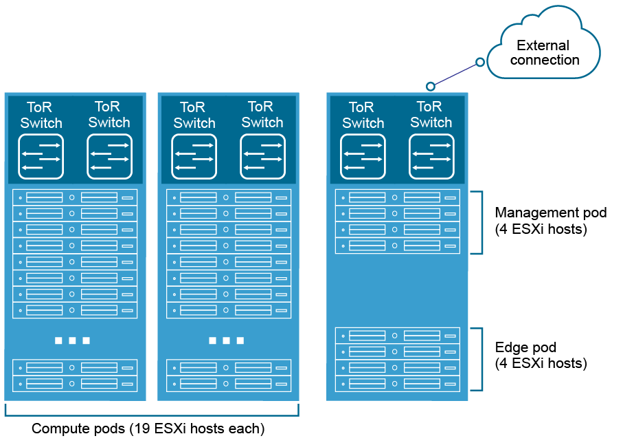

#### Compute Pod

Compute pods host the SDDC tenant virtual machines (sometimes referred to as workloads or payloads). An SDDC can mix different types of compute pods and provide separate compute pools for different types of SLAs. 

#### Management Pod

The management pod runs the virtual machines that manage the SDDC. These virtual machines host vCenter Server, NSX Manager, NSX Controller, vRealize Operations Management, vRealize Log Insight, vRealize Automation, and other shared management components. Different types of management pods can support different SLAs. Because the management pod hosts critical infrastructure, consider a basic level of hardware redundancy for this pod.

Management pod components must not have tenant-specific addressing. 

Edge Pod

In a core-and-pod design, the SDDC network fabric itself does not provide external connectivity. Most pod types, especially compute pods, are not set up with external network connectivity. Instead external connectivity is pooled into edge pods. 

Edge pods provide the following main functions:

-   Support on-ramp and off-ramp connectivity to physical networks

-   Connect with VLANs in the physical world

-   Optionally host centralized physical services

Edge pods connect the virtual networks (overlay networks) provided by NSX for vSphere and the external networks. Using edge pods reduces costs and scales better as demands for external connectivity change. 

Storage Pod

Storage pods provide network-accessible storage via NFS or iSCSI. Different types of storage pods can provide different levels of SLA, ranging from JBODs with IDE drives and with minimal to no redundancy to fully redundant enterprise-class storage arrays. For bandwidth-intense IP-based storage, bandwidth of these pods can scale dynamically.

This design does not consider Fibre Channel or Fibre Channel over Ethernet (FCoE) based storage technology. Instead, this design focuses on technologies that can use the central Layer 3 network fabric for primary connectivity. 

Pod to Rack Mapping

Pods are not mapped one-to-one to 19" data center racks. While a pod is an atomic unit of a repeatable building block, a rack is merely a unit of size. Because pods can have different sizes, how pods are mapped to 19" data center racks depends on the use case. 

-   **One Pod in One Rack.** One pod can occupy exactly one rack. This is usually the case for compute pods. 

-   **Multiple Pods in One Rack**. Two or more pods can occupy a single rack, for example, one management pod and one edge pod can be deployed into a single rack.

-   **Single Pod Across Multiple Racks**. A single pod can stretch across multiple adjacent racks, for example, a storage pod with filer heads and disk shelves can span more than one rack. 

Theoretically two or more pods can occupy two or more adjacent racks. This case is not recommended. Each pod should occupy its own rack. 

### Physical Network Architecture

The physical network architecture is tightly coupled with the pod-and-core architecture and uses a Layer 3 leaf-and-spine network instead of the more traditional 3-tier DC design.

#### Leaf-and-Spine Network Architecture

The design uses leaf switches and spine switches. 

-   A leaf switch is typically located inside a rack and provides network access to the servers inside that rack.

-   A spine switch is in the spine layer and provides connectivity between the racks. Links between spine switches are typically not required. If a link failure occurs between a spine switch and a leaf switch, the routing protocol ensures that no traffic for the affected rack is attracted to the spine switch that has lost connectivity to that rack.

Figure 2. Leaf-and-Spine Physical Network Design

 

Ports that face the servers inside a rack should have a minimal configuration, shown in the following high-level physical and logical representation of the leaf node.  

1.  Each leaf node has identical VLAN configuration with unique /26 subnets assigned to each VLAN.

Figure 3. High-level Physical and Logical Representation of a Leaf Node

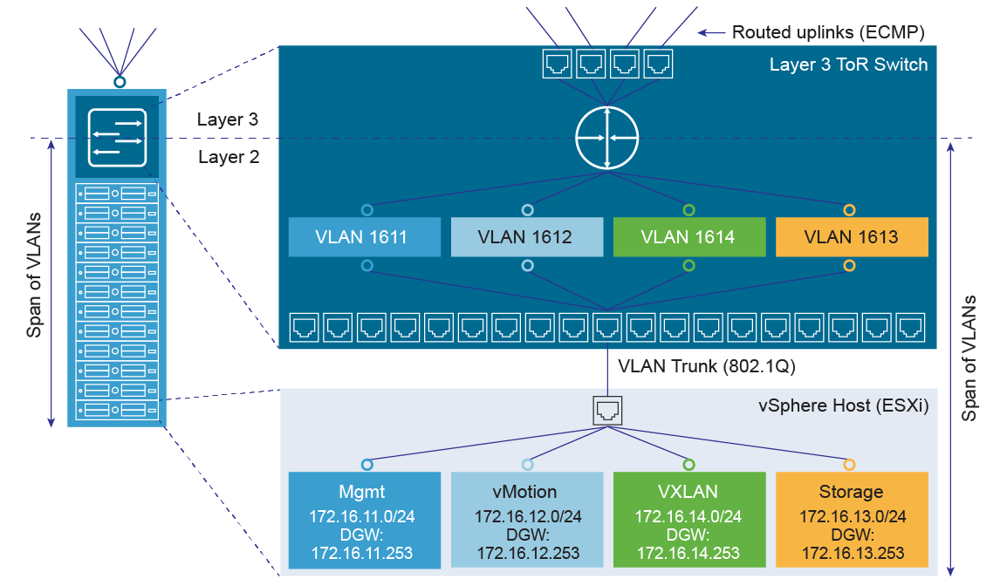

#### Network Transport

You can implement the physical layer switch fabric for an SDDC by offering Layer 2 transport services or Layer 3 transport services to all components. For a scalable and vendor-neutral data center network, use Layer 3 transport. 

Benefits and Drawbacks for Layer 2 Transport

In a design that uses Layer 2 transport, leaf switches and spine switches form a switched fabric, effectively acting like one large switch. Using modern data center switching fabric products such as Cisco FabricPath, you can build highly scalable Layer 2 multipath networks without the Spanning Tree Protocol (STP). Such networks are particularly suitable for large virtualization deployments, private clouds, and high-performance computing (HPC) environments.  

Using Layer 2 routing has benefits and drawbacks:

-   The benefit of this approach is more design freedom. You can span VLANs, which is useful for vSphere vMotion or vSphere Fault Tolerance (FT).

-   The drawback is that the size of such a deployment is limited because the fabric elements have to share a limited number of VLANs. In addition, you have to rely on a specialized data center switching fabric product from a single vendor because these products are not designed for interoperability between vendors. 

Benefits and Drawbacks for Layer 3 Transport 

A design with Layer 3 transport requires these considerations:

-   Layer 2 connectivity is limited to within the data center rack, up to the leaf switch.

-   The leaf switch terminates each VLAN and provides default gateway functionality, that is, it has a switch virtual interface (SVI) for each VLAN. 

-   Uplinks from the leaf switch to the spine layer are routed point-to-point links. VLAN trunking on the uplinks is not allowed.

-   A dynamic routing protocol—for example OSPF, ISIS, or iBGP—connects the leaf switches and spine switches. Each leaf switch in the rack advertises a small set of prefixes, typically one per VLAN or subnet. In turn, the leaf switch calculates equal cost paths to the prefixes received from other leaf switches.

Using Layer 3 routing has benefits and drawbacks:

-   The benefit is that you can chose from a wide array of Layer 3 capable switch products for the physical switching fabric. You can mix switches from different vendors due to general interoperability between various implementation of OSPF, ISIS or iBGP. This approach is usually more cost effective because it uses only basic functionality of the physical switches. 

-   The drawbacks are some design restrictions because VLANs are restricted to a single rack. This affects vSphere vMotion, vSphere Fault Tolerance, and storage networks. 

    1.  #### Infrastructure Network Architecture

One of the key goals of network virtualization is to provide a virtual-to-physical network abstraction. For this, the physical fabric must provide a robust IP transport with the following characteristics:

-   Simplicity

-   Scalability

-   High bandwidth

-   Fault-tolerant transport

-   Support for different levels of quality of service (QoS)

Simplicity 

Configuration of the switches inside a data center must be simple. General or global configuration such as AAA, SNMP, syslog, NTP, and so on, should be replicated almost line by line, independent of the position of the switches. A central management capability for configuring all switches at once is an alternative.

Scalability 

Scalability factors include but are not limited to the following:

-   Number of racks supported in a fabric. 

-   Amount of bandwidth between any two racks in a data center. 

-   Number of paths that a leaf switch can select from when communicating with another rack.

The total number of ports available across all spine switches and the oversubscription that is acceptable determine the number of racks supported in a fabric. Different racks might host different types of infrastructure, which results in different bandwidth requirements.

-   Racks with filers or other storage systems might attract or source more traffic than other racks. 

-   Compute racks—racks hosting hypervisors with workloads or virtual machines—might have different bandwidth requirements than edge racks, which provide connectivity to the outside world. 

Link speed and the number of links vary to satisfy different bandwidth demands. You can vary them for each rack without sacrificing other aspects of the leaf-and-spine architecture.

Figure 4. Pod Network Design

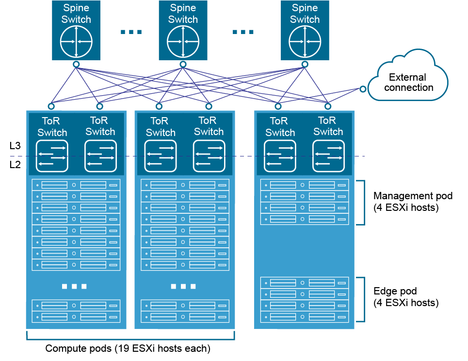

The number of links to the spine switches dictates how many paths for traffic from this rack to another rack are available. Because the number of hops between any two racks is consistent, the architecture can utilize equal-cost multipathing (ECMP). Assuming traffic sourced by the servers carries a TCP or UDP header, traffic spray can occur on a per-flow basis.

High Bandwidth

In leaf-and-spine topologies, oversubscription typically occurs at the leaf switch.

Oversubscription is equal to the total amount of bandwidth available to all servers connected to a leaf switch divided by the aggregate amount of uplink bandwidth.

oversubscription = total bandwidth / aggregate uplink bandwidth

For example, 20 servers with one 10 Gigabit Ethernet (10 GbE) port each create up to 200 Gbps of bandwidth. In an environment with eight 10 GbE uplinks to the spine—a total of 80 Gbps—a 2.5:1 oversubscription results shown in the *Oversubscription in the Leaf Layer* illustration. 

     2.5 (oversubscription) = 200 (total) / 80 (total uplink)

Figure 5. Oversubscription in the Leaf Layer

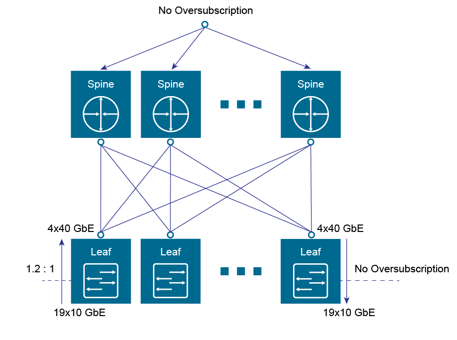

You can make more or less bandwidth available to a rack by provisioning more or fewer uplinks. That means you can change the available bandwidth on a per-rack basis. 

1.  The number of uplinks from a leaf switch to each spine switch must be the same to avoid hotspots.

For example, if a leaf switch has two uplinks to spine switch A and only one uplink to spine switches B, C and D, more traffic is sent to the leaf switch via spine switch A, which might create a hotspot.

Fault Tolerance

The larger the environment, the more switches make up the overall fabric and the greater the possibility for one component of the data center switching fabric to fail. A resilient fabric can sustain individual link or box failures without widespread impact.

Figure 6. Compensation for a Link Failure

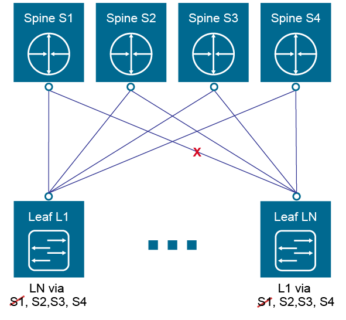

For example, if one of the spine switches fails, traffic between racks continues to be routed across the remaining spine switches in a Layer 3 fabric. The routing protocol ensures that only available paths are chosen. Installing more than two spine switches reduces the impact of a spine switch failure. 

Multipathing-capable fabrics handle box or link failures, reducing the need for manual network maintenance and operations. If a software upgrade of a fabric switch becomes necessary, the administrator can take the node out of service gracefully by changing routing protocol metrics; quickly, the traffic through that switch will be drained, freeing it up for maintenance.

Depending on the width of the spine—that is, how many switches are in the aggregation or spine layer—the additional load that the remaining switches must carry is not as significant as if there were only two switches in the aggregation layer. For example, in an environment with four spine switches, a failure of a single spine switch only reduces the available capacity by 25%. 

Quality of Service Differentiation

Virtualized environments must carry different types of traffic—including tenant, storage and management traffic—across the switching infrastructure. Each traffic type has different characteristics and makes different demands on the physical switching infrastructure.

-   Management traffic, although typically low in volume, is critical for controlling physical and virtual network state. 

-   IP storage traffic is typically high in volume and generally stays within a data center. 

For virtualized environments, the hypervisor sets the QoS values for the different traffic types. The physical switching infrastructure has to trust the values set by the hypervisor. No reclassification is necessary at the server-facing port of a leaf switch. If there is a congestion point in the physical switching infrastructure, the QoS values determine how the physical network sequences, prioritizes, or potentially drops traffic. 

Figure 7. Quality of Service (Differentiated Services) Trust Point

Two types of QoS configuration are supported in the physical switching infrastructure;

-   Layer 2 QoS, also called class of service.

-   Layer 3 QoS, also called DSCP marking.

A vSphere Distributed Switch supports both class of service and DSCP marking.  Users can mark the traffic based on the traffic type or packet classification. When the virtual machines are connected to the VXLAN-based logical switches or networks, the QoS values from the internal packet headers are copied to the VXLAN-encapsulated header. This enables the external physical network to prioritize the traffic based on the tags on the external header.

For details, see the [vSphere Networking documentation](http://pubs.vmware.com/vsphere-60/topic/com.vmware.vsphere.networking.doc/GUID-67CA4C18-4F18-4E23-A5C7-BC33112D4433.html). 

#### Server Interfaces

If the server has multiple interfaces of the same speed, link aggregation can be used. The vSphere Distributed Switch supports different link aggregation options, including the following:

-   Load-based NIC teaming, with route based on virtual network adapter load. See the [NIC Teaming documentation](http://pubs.vmware.com/vsphere-60/topic/com.vmware.vsphere.networking.doc/GUID-4D97C749-1FFD-403D-B2AE-0CD0F1C70E2B.html).

-    IEEE 802.3ad standard–based Link Aggregation Control Protocol (LACP). See the [LACP documentation](http://pubs.vmware.com/vsphere-60/index.jsp#com.vmware.vsphere.networking.doc/GUID-0D1EF5B4-7581-480B-B99D-5714B42CD7A9.html).

Load-based NIC teaming supports optimal use of available bandwidth and reliability in case of a link failure. Use two 10 GbE connections per server along with a pair of spine switches, implementing Multi-Chassis Link Aggregation (MLAG). 

Typically, 801.Q trunks are used for carrying a small number of VLANs; for example, management, storage, VXLAN tunnel, and VMware vSphere vMotion traffic. In the vSphere environment, there are some design restrictions regarding vSphere vMotion and storage networks, depending on whether the physical data center switch fabric uses Layer 2 or Layer 3 transport. 

### Availability Zones and Regions

In an SDDC, availability zones are collections of infrastructure components. Regions support disaster recovery solutions and allow you to place workloads closer to your customers, typically multiple availability zones form a single region. 

This VMware Validated Design uses two regions, but uses only one availability zone in each region. The following diagram shows how the design could be expanded to include multiple availability zones. 

Figure 8. Availability Zones and Regions

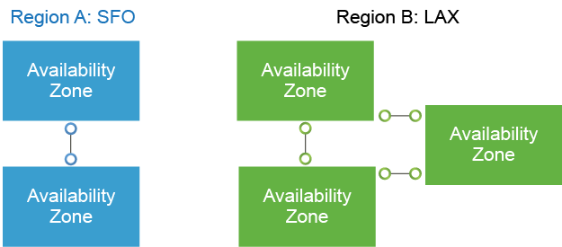

 

#### Availability Zones

Each availability zone is isolated from other availability zones to stop the propagation of failure or outage across zone boundaries. Together, multiple availability zones provide continuous availability through redundancy, minimize unavailability of services, and improve SLAs. An outage that is caused by external factors (power, cooling, physical integrity) affects only one zone, those factors most likely don't lead to an outage in other zones except in the case of major disasters.

Each availability zone runs on its own physically distinct, independent infrastructure, and is engineered to be highly reliable. Each zone should have independent power, cooling, network and security. Common points of failures within a physical data center, like generators and cooling equipment, should not be shared across availability zones. Additionally, these zones should be physically separate; so that even uncommon disasters affect only a single availability zone. Availability zones are usually either two distinct data centers within metro distance (latency in the single digit range) or two safety/fire sectors (aka data halls) within the same large scale data center.

Multiple availability zones (usually two) belong to a single region. The physical distance between availability zones can be up to approximately 50 kilometer or 30 miles, therefore offering low single-digit latency and large bandwidth - via dark fiber - between the zones. This architecture allows the SDDC equipment across the availability zone to operate in an active/active manner as a single virtual data center or region.

You can operate workloads across multiple availability zones within the same region as if they were part of a single virtual data center. This supports an architecture with very high availability that are suitable for mission critical applications. When the distance between two locations of equipment becomes too large, these locations can no longer function as two availability zones within the same region and need to be treated as separate regions. 

#### Regions

Multiple regions support placing workloads closer to your customers, for example, by operating one region on the US east coast and one region on the US west coast, or operating a region in Europe and another region in the US. Regions are helpful in many ways.

-   Regions can support disaster recovery solutions: One region can be the primary site and another region can be the recovery site. 

-   You can use multiple regions to address data privacy laws and restrictions in certain countries by keeping tenant data within a region in the same country.

The distance between regions can be rather large. This design uses two regions, one region is assumed to be in San Francisco (SFO), the other region is assumed to be in Los Angeles (LAX).

Virtual Infrastructure Architecture
-----------------------------------

The virtual infrastructure is the foundation of an operational SDDC. Within the virtual infrastructure layer, access to the physical underlying infrastructure is controlled and allocated to the management and tenant workloads. The virtual infrastructure layer consists primarily of the physical hosts' hypervisors and the control of these hypervisors. The management workloads consist of elements in the virtual management layer itself, along with elements in the cloud management layer and in the service management, business continuity, and security areas.

Figure 9. Virtual Infrastructure Layer Business Continuity in the SDDC

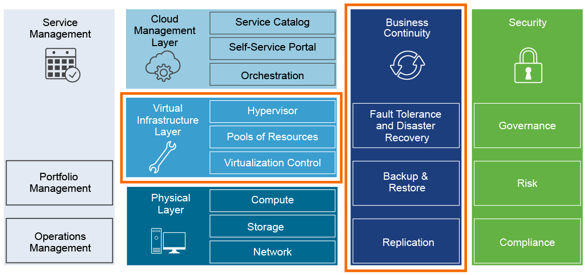

### Virtual Infrastructure Overview

The SDDC virtual infrastructure consists of two regions. Each region includes a management pod, edge pod, and compute pod.

Figure 10. SDDC Logical Design

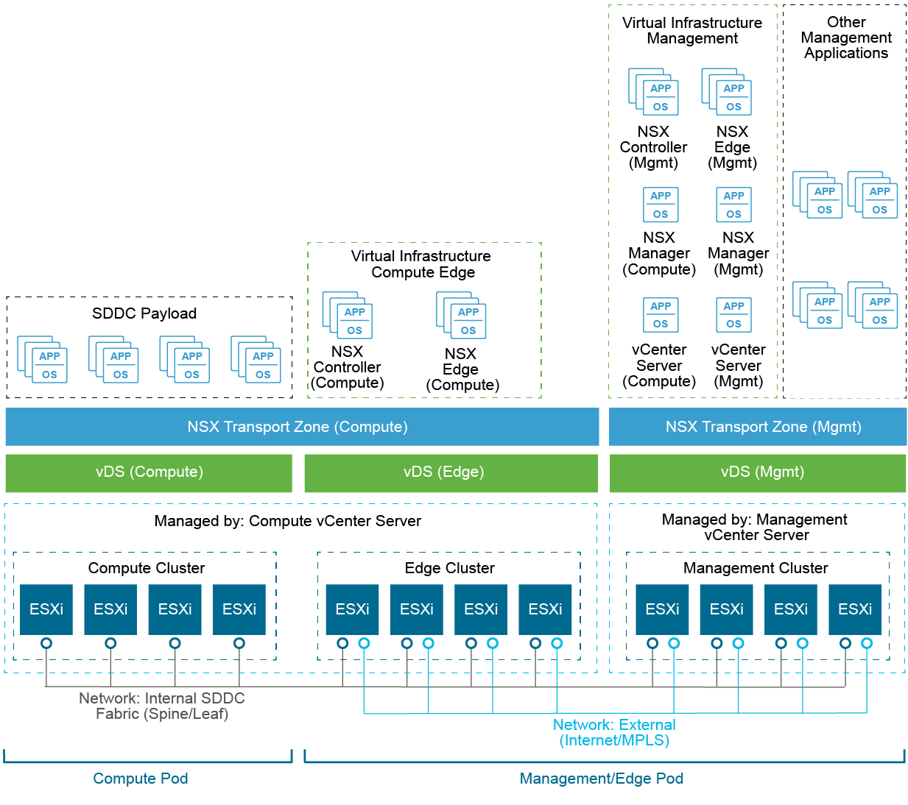

#### Management Pod

Management pods run the virtual machines that manage the SDDC. These virtual machines host vCenter Server, NSX Manager, NSX Controller, vRealize Operations, vRealize Log Insight, vRealize Automation, Site Recovery Manager and other shared management components. All management, monitoring, and infrastructure services are provisioned to a vCenter Server High Availability cluster which provides high availability for these critical services. Permissions on the management cluster limit access to only administrators. This limitation protects the virtual machines that are running the management, monitoring, and infrastructure services.

#### Edge Pod

Edge pods provide the following main functions:

-   Support on-ramp and off-ramp connectivity to physical networks.

-   Connect with VLANs in the physical world.

-   Optionally, host centralized physical services.

Edge pods connect the virtual networks (overlay networks) provided by NSX for vSphere and the external networks. Using edge pods reduces costs and scales well as demands for external connectivity change.

#### Compute Pod

Compute pods host the SDDC tenant virtual machines (sometimes referred to as workloads or payloads). An SDDC can mix different types of compute pods and provide separate compute pools for different types of SLAs. 

### Network Virtualization

The network virtualization architecture of this VMware Validated Design uses VMware NSX for vSphere. The virtualized network is organized hierarchically, with the following components from bottom to top: 

-   Data plane with the NSX vSwitch and additional components

-   Control plane with the NSX Controller

-   Management plane with the NSX Manager

-   Consumption plane with a Cloud management portal

    1.  #### Network Virtualization Components

Data Plane

The NSX data plane consists of the NSX vSwitch, which is based on the vSphere Distributed Switch (VDS) and includes additional components. These components include kernel modules (VIBs), which run within the ESXi kernel and provide services such as virtual distributed router (VDR) and distributed firewall (DFW). The NSX kernel modules also enable Virtual Extensible LAN (VXLAN) capabilities. 

The NSX vSwitch abstracts the physical network and provides access-level switching in the hypervisor. It is central to network virtualization because it enables logical networks that are independent of physical constructs such as VLAN. The NSX vSwitch provides multiple benefits.

-   Three types of overlay networking capabilities: 

<!-- -->

-   Creation of a flexible logical Layer 2 overlay over existing IP networks on existing physical infrastructure, usually without the need to re-architect the data center networks.

-   Support for east/west and north/south communication while maintaining isolation between tenants.

-   Support for application workloads and virtual machines that operate as if they were connected to a physical Layer 2 network.

<!-- -->

-   Support for VXLAN and centralized network configuration.

-   A comprehensive toolkit for traffic management, monitoring and troubleshooting within a virtual network which includes Port Mirroring, NetFlow/IPFIX, configuration backup and restore, network health check, Quality of Service (QoS), and Link Aggregation Control Protocol (LACP)

In addition to the NSX vSwitch, the data plane also includes gateway devices, which can provide Layer 2 bridging from the logical networking space (VXLAN) to the physical network (VLAN). The gateway device is typically an NSX Edge Gateway device. NSX Edge Gateway devices offer Layer 2, Layer 3, perimeter firewall, load-balancing and other services such as Secure Socket Layer (SSL), Virtual Private Network (VPN), and Dynamic Host Control Protocol (DHCP). 

Control Plane

The NSX control plane runs in the NSX Controller, which enables multicast-free VXLAN and control-plane programming of elements such as VDR (virtual distributed router).

In all cases the controller is part of the control plane and does not have any data plane traffic passing through it. The controller nodes are deployed in a cluster to enable high availability and scale. A failure of a controller nodes does not impact data plane traffic.

Management Plane

The NSX management plane consists of the NSX Manager, which is the single point of configuration, and the REST API entry-points.

Consumption Plane

Different clients of NSX for vSphere can access and manage the associated services in different ways: 

-   Administrators can manage the NSX environment from the vSphere Web Client.

-   End-users can consume the network virtualization capabilities of NSX for vSphere through the CMP (vRealize Automation) UI when deploying applications.

    1.  #### Network Virtualization Services

Network virtualization services include logical switches, logical routers, logical firewall, and other components of NSX for vSphere. 

Logical Switches

Cloud deployments have a variety of applications that are used across multiple tenants. These applications and tenants require isolation from each other for security, fault isolation, and non-overlapping IP addresses. The NSX for vSphere logical switch creates logical broadcast domains or segments to which an application or tenant virtual machine can be logically wired. This allows for flexibility and speed of deployment while still providing all the characteristics of a physical network's broadcast domains (VLANs) without physical Layer 2 sprawl or spanning tree issues.

A logical switch is distributed and can span arbitrarily large compute clusters. This allows for virtual machine mobility (migration with vMotion) within the data center without limitations of the physical Layer 2 (VLAN) boundary. The physical infrastructure is not constrained by MAC/FIB table limits, because the logical switch contains the broadcast domain in software.

Logical Routers

Dynamic routing provides the necessary forwarding information between Layer 2 broadcast domains, thereby allowing you to decrease the size of Layer 2 broadcast domains and improve network efficiency and scale. NSX for vSphere extends this intelligence to where the workloads reside for east/west routing. This allows more direct VM-to-VM communication without the costly need to extend hops. At the same time, logical routers provide north/south connectivity, thereby enabling tenants to access public networks.

Logical Firewall

NSX for vSphere Logical Firewall provides security mechanisms for dynamic virtual data centers.

-   The Distributed Firewall component of Logical Firewall allows you to segment virtual data center entities like virtual machines based on VM names and attributes, user identity, vCenter objects like data centers, and hosts, or based on traditional networking attributes like IP addresses, port groups, and so on. 

-   The Edge Firewall component helps you meet key perimeter security requirements, such as building DMZs based on IP/VLAN constructs, tenant-to-tenant isolation in multi-tenant virtual data centers, Network Address Translation (NAT), partner (extranet) VPNs, and user-based SSL VPNs.

The Flow Monitoring feature displays network activity between virtual machines at the application protocol level. You can use this information to audit network traffic, define and refine firewall policies, and identify threats to your network.

Logical Virtual Private Networks (VPNs)

SSL VPN-Plus allows remote users to access private corporate applications. IPSec VPN offers site-to-site connectivity between an NSX Edge instance and remote sites. L2 VPN allows you to extend your datacenter by allowing virtual machines to retain network connectivity across geographical boundaries.

Logical Load Balancer

The NSX Edge load balancer enables network traffic to follow multiple paths to a specific destination. It distributes incoming service requests evenly among multiple servers in such a way that the load distribution is transparent to users. Load balancing thus helps in achieving optimal resource utilization, maximizing throughput, minimizing response time, and avoiding overload. NSX Edge provides load balancing up to Layer 7.

Service Composer

Service Composer helps you provision and assign network and security services to applications in a virtual infrastructure. You map these services to a security group, and the services are applied to the virtual machines in the security group.

Data Security provides visibility into sensitive data stored within your organization's virtualized and cloud environments. Based on the violations reported by the NSX for vSphere Data Security component, you can ensure that sensitive data is adequately protected and assess compliance with regulations around the world.

NSX for vSphere Extensibility

VMware partners integrate their solutions with the NSX for vSphere platform to enable an integrated experience across the entire SDDC. Data center operators can provision complex, multi-tier virtual networks in seconds, independent of the underlying network topology or components.

### BCDR Architecture

Business Continuity and Disaster Recovery (BCDR) is a critical component of the Software-Defined Data Center (SDDC) design because the BCDR components protect the management pod and the management workloads that are running on it against disruption in the event of an incident or disaster. The scope of the BCDR implementation does not span the compute pod and the tenant virtual machines on it.

1.  Region in the VMware Validated Design is equivalent to the site construct in Site Recovery Manager.

A solution that supports BCDR of the management stack on top of vSphere relies on the following components:

-   Networking devices for providing connectivity

-   Infrastructure services for running, protecting and migrating virtualized workloads

-   Storage devices for storing data of vSphere and management applications 

The solution is based on the availability of two regions to enable failover of deployed workloads.

Figure 11. Dual-Region BCDR Architecture

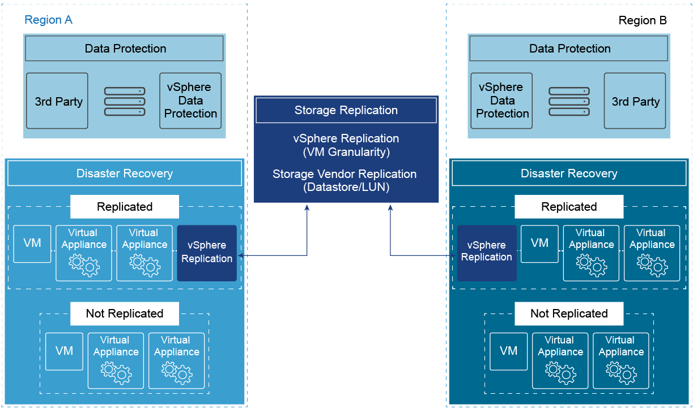

#### Data Protection Architecture

Data protection solutions provide the following functions in the SDDC:

-   Backup and restore virtual machines.

-   Store data according to company retention policies.

-   Inform administrators about backup and restore activities through reports.

vSphere Data Protection instances in the two regions provide data protection for the products that implement the management capabilities for the SDDC.  vSphere Data Protection stores backups of the management product virtual appliances according to a schedule on a shared storage allocation.

Figure 12. Dual-Region Data Protection Architecture

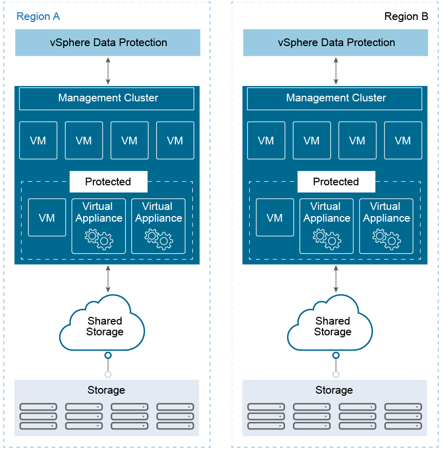  

#### Disaster Recovery Architecture

You use VMware Site Recovery Manager to implement disaster recovery for the workloads of the management products in the SDDC. 

Elements of Disaster Recovery 

Disaster recovery that is based on VMware Site Recovery Manager has the following main elements:

-   **Dual-region configuration.** All protected virtual machines are located in Region A that is considered as the protected region, and are recovered in Region B that is considered as the recovery region.
    In a typical Site Recovery Manager installation, the protected region provides business-critical data center services. The recovery region is an alternative infrastructure to which Site Recovery Manager can migrate these services.

-   **Replication of virtual machine data. **

<!-- -->

-   **Array-based replication. **When you use array-based replication, one or more storage arrays at the protected region replicate data to peer arrays at the recovery region. To use array-based replication with Site Recovery Manager, you must configure replication first before you can configure Site Recovery Manager to use it.

-   **Replication by using vSphere Replication. **You deploy the vSphere Replication appliance and configure vSphere Replication on virtual machines independently of Site Recovery Manager. vSphere Replication does not require storage arrays. The replication source and target storage can be any storage device, including, but not limited to, storage arrays. 
    You can configure vSphere Replication to regularly create and retain snapshots of protected virtual machines on the recovery region. 

<!-- -->

-   **Protection groups. ** A protection group is a collection of virtual machines that Site Recovery Manager protects together. You configure virtual machines and create protection groups differently depending on whether you use array-based replication or vSphere Replication. You cannot create protection groups that combine virtual machines for which you configured array-based replication with virtual machines for which you configured vSphere Replication. 

-   **Recovery plans.** A recovery plan specifies how Site Recovery Manager recovers the virtual machines in the protection groups that it contains. You can include a combination of array-based replication protection groups and vSphere Replication protection groups in the same recovery plan. 

    1.  #### Disaster Recovery Configuration

The VMware Validated Design implements the following disaster recovery configuration:

-   The following management applications are a subject of disaster recovery protection:

<!-- -->

-   vRealize Automation together with VMware vRealize Orchestrator

-   Analytics cluster of vRealize Operations Manager

<!-- -->

-   The virtual infrastructure components that are not in the scope of the disaster recovery protection, such as vRealize Log Insight, are available as separate instances in each region. 

Figure 13. Disaster Recovery Architecture

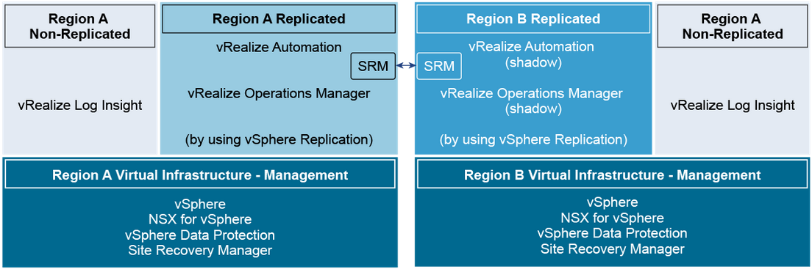

Cloud Management Platform Architecture
--------------------------------------

The Cloud Management Platform is the primary consumption portal for the entire Software-Defined Data Center (SDDC). Within the IT Automation Cloud, users use vRealize Automation to author, administer, and consume the VM Templates and blueprints (the templates are used to author the blueprints that tenants (end users) use to provision cloud workloads). The following diagram illustrates the conceptual design of the Cloud Management Platform. 

Figure 14. Cloud Management Platform Conceptual Design

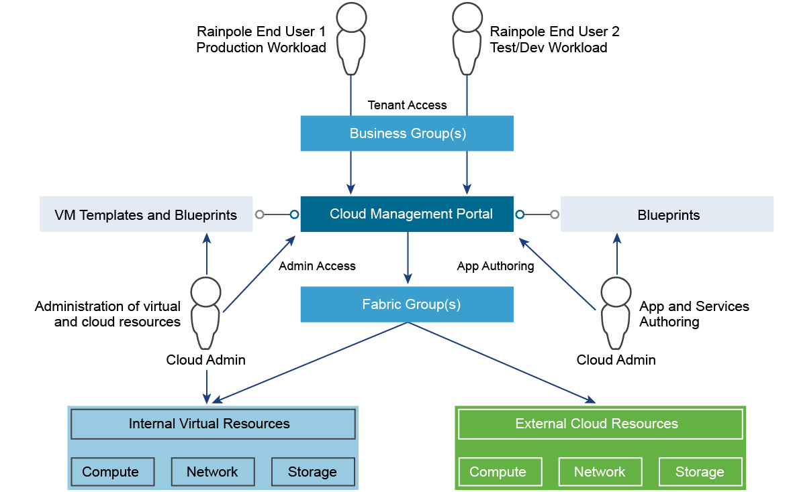 

The Cloud Management Platform consists of the following design element and components.

Table 1.

| Design Element                      | Design Components                                                                                                                                                                                                                          |
|-------------------------------------|--------------------------------------------------------------------------------------------------------------------------------------------------------------------------------------------------------------------------------------------|
| Users                               | Cloud administrators – Tenant, group, fabric, infrastructure, service, and other administrators as defined by business policies and organizational structure.                                                                              

                                       Cloud (or *tenant*) users – Provide direct access to virtual machine to perform operating system-level operations provided by vRealize Automation IaaS services.                                                                            |
| Tools and supporting infrastructure | The following are the building blocks and logical constructs that provide the foundation of the cloud.                                                                                                                                     

                                       VM Templates and Blueprints - These are the templates used in authoring the blueprints that tenants (end users) use to provision their cloud workloads.                                                                                     |
| Provisioning infrastructure         | The following are the on-premise and off-premise resources which together form a hybrid cloud.                                                                                                                                             

                                       Virtual – Supported hypervisors and associated management tools.                                                                                                                                                                            

                                       Cloud – Supported cloud providers and associated API interfaces.                                                                                                                                                                            

                                       In the above diagram illustrating the conceptual design of the Cloud Management Platform, these resources are located in the the Internal Virtual Resources and the External Cloud Resources components.                                    |
| Cloud Management Portal             | The Cloud Management Portal provides self-service capabilities for users to administer, provision and manage workloads.                                                                                                                    

                                       vRealize Automation portal, Admin access – The default root tenant portal URL used to set up and administer tenants and global configuration options.                                                                                       

                                       vRealize Automation portal, Tenant access – Refers to a subtenant and is accessed using a unique URL, with an appended tenant identifier.                                                                                                   

                                       It is also possible for a tenant portal to refer to the default tenant portal in some configurations. In this case, the URLs are the same and the user interface is contextually controlled by the assigned RBAC permissions of that user.  |

### Logical Design of the Cloud Management Platform

The Infrastructure Service core module delivers the following multi-platform and multi-vendor cloud services.

-   Comprehensive and purpose-built capabilities to provide standardized resources to global customers in a short time span.

-   Multiplatform and multivendor delivery methods that integrate with existing enterprise management systems.

-   Central user-centric and business-aware governance for all physical, virtual, private, and public cloud services.

-   Design that meets the customer and business needs and is extensible.

The following characteristics have been considered for this design.

Table 2.

| Characteristic | Description                                                                                                                                                                                                                            |
|----------------|----------------------------------------------------------------------------------------------------------------------------------------------------------------------------------------------------------------------------------------|
| Availability   | Indicates the effect a choice has on technology and related infrastructure to provide highly-available operations and sustain operations during system failures.                                                                       
                  VMware vSphere High Availability will provide the required host redundancy and tolerance of hardware failures where appropriate.                                                                                                        |
| Manageability  | Relates to the effect a choice has on overall infrastructure manageability.                                                                                                                                                            

                  Key metrics – Accessibility and the lifecycle of the infrastructure being managed.                                                                                                                                                      |
| Performance    | Reflects whether the option has a positive or negative impact on overall infrastructure performance. This design was modeled using the VMware reference architecture sizing guidelines to provide certain performance characteristics.

                  Key metrics – Performance analysis and tuning of the database, Manager service, Model Manager, portal Web site, and data collection.                                                                                                    |
| Scalability    | Depicts the effect the option has on the ability of the solution to be augmented to achieve better sustained performance within the infrastructure.                                                                                    

                  Key metrics – Web site latency, network traffic, and CPU usage on the database and web servers.                                                                                                                                         |
| Security       | Reflects whether the option has a positive or negative impact on overall infrastructure security.                                                                                                                                      

                  Key metrics – Data confidentiality, integrity, authenticity, and non-repudiation of cloud automation components and the option's integration with supporting and provisioning infrastructures.                                          |

#### Infrastructure Service Core Elements

This Infrastructure Service core element consists of the following software.

Table 3.

| Design Element                         | Design Component                                          |
|----------------------------------------|-----------------------------------------------------------|
| vRealize Automation Identity Appliance | vCenter Single Sign-On                                    |
| vRealize Automation virtual appliance  | vRealize Automation Portal Web/App Server                 

                                          vRealize Automation vPostgreSQL Database                   

                                          vRealize Automation Service Catalog                        |
| vRealize Automation IaaS components    | vRealize Automation IaaS Web Server                       

                                          vRealize Automation IaaS Manager Services                  |
| Distributed execution components       | vRealize Automation Distributed Execution Managers:       

                                          Orchestrator                                               

                                          Workers                                                    |
| Integration components                 | vRealize Automation Agent machines                        |
| vRealize Orchestrator components       | vRealize Orchestrator Virtual Appliances                  |
| Provisioning infrastructure            | vSphere environment                                       

                                          Other supported physical, virtual, or cloud environments.  |
| Supporting infrastructure              | Microsoft SQL database environment                        

                                          Active Directory environment                               

                                          SMTP                                                       

                                          NTP                                                        |

#### Cloud Management Platform Logical Design

In this design, vRealize Automation and vRealize Orchestrator runs on a VXLAN backed network that is fronted with an NSX Edge Services Gateway acting as a load-balancer. The NSX Edge also provides Network Address Translation (NAT) for all network traffic to and from the vRealize Automation application virtual network as seen in the following diagram.

Figure 15. vRealize Automation Logical Design for Region A

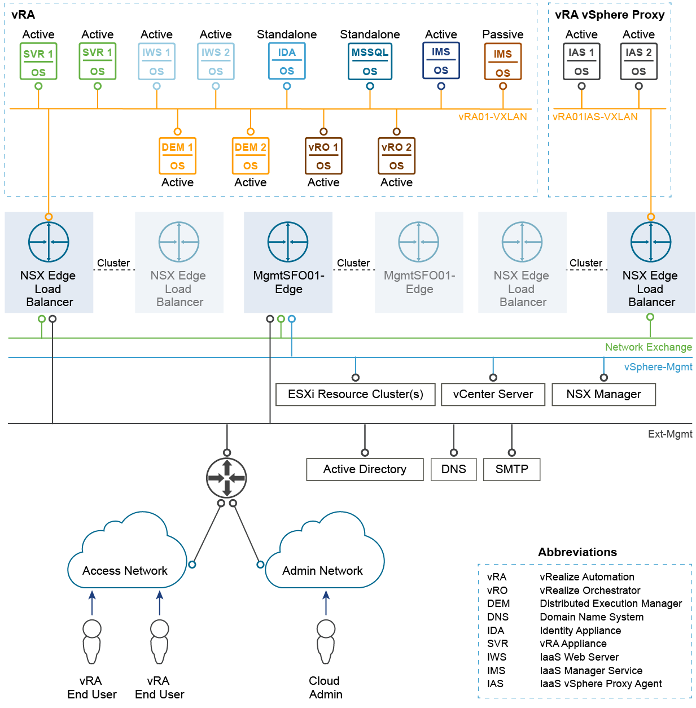

Figure 16. vRealize Automation Logical Design for Region B

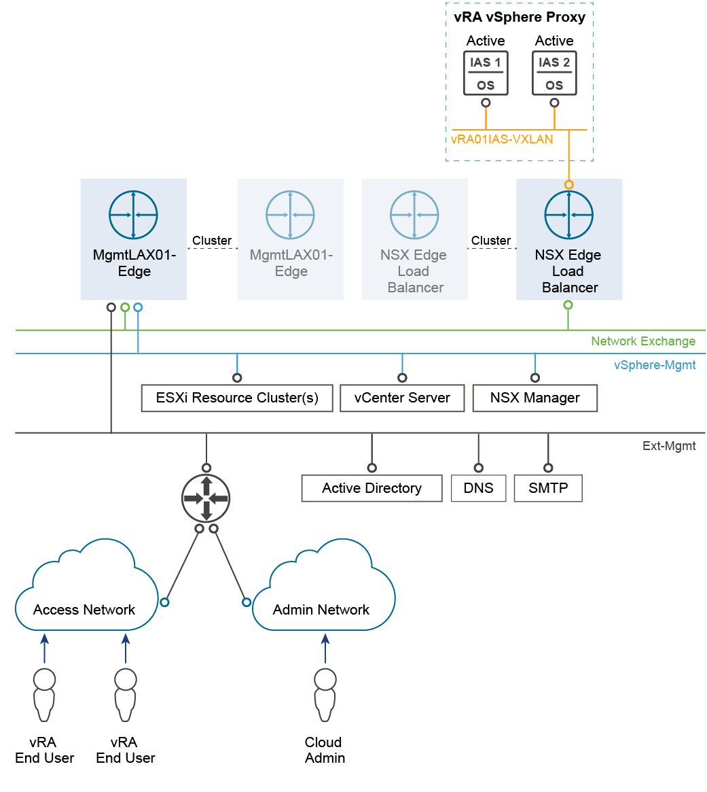

 

1.  Operations Architecture Overview
    --------------------------------

    1.  ### vRealize Operations Manager Architecture

vRealize Operations Manager tracks and analyzes the operation of multiple data sources within the Software-Defined Data Center (SDDC). By using analytics algorithms, vRealize Operations Manager learns and predicts the behavior of every object it monitors. Users access this information by using views, reports, and dashboards.

#### Installation Models

vRealize Operations Manager is available in two different deployment models - a preconfigured virtual appliance, or a Windows or Linux installable package. Select the installation method according to the following considerations:

-   When you use the vRealize Operations Manager virtual appliance, you deploy the OVF file of the virtual appliance once for each cluster node. You access the product to set up cluster nodes according to their role, and log in to configure the installation.

> Use virtual appliance deployment to easily create vRealize Operations Manager nodes with pre-defined identical size.

-   When you use the Windows or Linux installable package, you run the vRealize Operations Manager installation on each cluster node. You access the product to set up cluster nodes according to their role, and log in to configure the installation.

> Use installable package deployment to create vRealize Operations Manager node with custom identical size.

#### Architecture

vRealize Operations Manager contains functional elements that collaborate for data analysis and storage, and support creating clusters of nodes with different roles.

Figure 17. vRealize Operations Manager Architecture

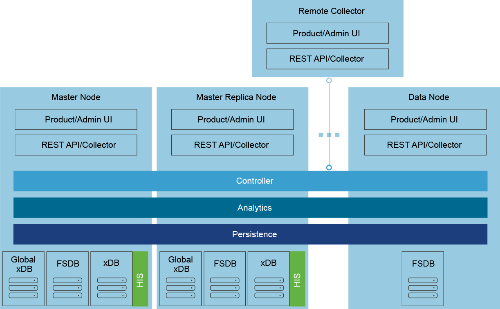

#### Types of Nodes and Clusters

For high availability and scalability, you can deploy several vRealize Operations Manager instances in a cluster where they can have either of the following roles:

-   **Master Node.** Required initial node in the cluster. In large-scale environments the master node manages all other nodes. In small-scale environments, the master node is the single standalone vRealize Operations Manager node.

-   **Master Replica Node (Optional).** Enables high availability of the master node. 

-   **Data Node.** Enables scale-out of vRealize Operations Manager in larger environments. Data nodes have adapters installed to perform collection and analysis. Data nodes also host vRealize Operations Manager management packs.

Larger deployments usually include adapters only on data nodes, not on the master node or replica node

-   **Remote Collector Node.** In distributed deployments, enables navigation through firewalls, interfaces with a remote data source, reduces bandwidth across regions, or reduces the load on the vRealize Operations Manager analytics cluster. Remote collector nodes only gather objects for the inventory and forward collected data to the data nodes. Remote collector nodes do not store data or perform analysis. In addition, you can install them on a different operating system than the rest of the cluster nodes. 

The master and master replica nodes are data nodes with extended capabilities.

vRealize Operations Manager can form two type of clusters according to the nodes that participate in a cluster:

-   **Analytics clusters.** Tracks, analyzes, and predicts the operation of monitored systems. Consists of a master node, data nodes, and optionally of a master replica node. 

-   **Remote collectors cluster.** Only collects diagnostics data without storage or analysis. Consists only of remote collector nodes.

    1.  #### Application Functional Components 

The functional components of a vRealize Operations Manager instance interact to provide analysis of diagnostics data from the data center and visualize the result in the Web user interface.

Table 4. vRealize Operations Manager Logical Node Architecture

| Architecture Component Diagram                           | Description                                                                                                                                                                                                                             |
|----------------------------------------------------------|-----------------------------------------------------------------------------------------------------------------------------------------------------------------------------------------------------------------------------------------|
| 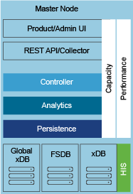 | -   **Admin / Product UI server.** The UI server is a Web application that serves as both user and administration interface.                                                                                                            

                                                            -   **REST API / Collector.** The Collector collects data from all components in the data center.                                                                                                                                        

                                                            -   **Controller.** The Controller handles the data flow the UI server, Collector, and the analytics engine.                                                                                                                             

                                                            -   **Analytics.** The Analytics engine creates all associations and correlations between various data sets, handles all super metric calculations, performs all capacity planning functions, and is responsible for triggering alerts.  

                                                            -   **Persistence.** The persistence layer handles the read and write operations on the underlying databases across all nodes.                                                                                                           

                                                            -   **FSDB.** The File System Database (FSDB) stores collected metrics in raw format. FSDB is available in all the nodes.                                                                                                                

                                                            -   **xDB (HIS).** The xDB stores data from the Historical Inventory Service (HIS). This component is available only on the master and master replica nodes.                                                                             

                                                            -   **Global xDB.** The Global xDB stores user preferences, alerts, and alarms, and customization that is related to the vRealize Operations Manager. This component is available only on the master and master replica nodes.           |

#### Management Packs

Management packs contain extensions and third-party integration software. They add dashboards, alerts definitions, policies, reports, and other content to the inventory of vRealize Operations Manager. You can learn more details about and download management packs from the VMware Solutions Exchange.

#### Multi-Region vRealize Operations Manager Deployment

The scope of the SDDC design covers multiple regions. Using vRealize Operations Manager across multiple regions requires deploying an analytics cluster that is protected by Site Recovery Manager, and deploying remote collectors in each region.

### vRealize Log Insight Architecture

vRealize Log Insight provides real-time log management and log analysis with machine learning-based intelligent grouping, high-performance searching, and troubleshooting across physical, virtual, and cloud environments

#### Overview

vRealize Log Insight collects data from ESXi hosts using the syslog protocol. It connects to vCenter Server to collect events, tasks, and alarms data, and integrates with vRealize Operations Manager to send notification events and enable launch in context. It also functions as a collection and analysis point for any system capable of sending syslog data. In addition to syslog data an ingestion agent can be installed on Linux or Windows servers to collect logs. This agent approach is especially useful for custom logs and operating systems that don't natively support the syslog protocol, such as Windows.

#### Installation Models

You can deploy vRealize Log Insight as a virtual appliance in one of the following configurations:

-   Standalone node

-   Highly available cluster of one master and at least two worker nodes using an internal load balancer (ILB)

You can extend the compute and storage resources of the vRealize Log Insight instances for scale-up.

#### Cluster Nodes

For high availability and scalability, you can deploy several vRealize Log Insight instances in a cluster where they can have either of the following roles:

-   Master Node. Required initial node in the cluster. The master node is responsible for queries and log ingestion. The Web user interface of the master node serves as the single pane of glass for the cluster. All queries against data are directed to the master, which in turn queries the workers as appropriate.

-   Worker Node. Enables scale-out in larger environments. A worker node is responsible for ingestion of logs. A worker node stores logs locally. If a worker node is down, the logs on that worker becomes unavailable.
    You need at least two worker nodes to form a cluster with the master node.

-   Integrated Load Balancer (ILB). Provides high availability (HA). The ILB runs on one of the cluster nodes. If the node that hosts the ILB Virtual IP (VIP) address stops responding, the VIP address is failed over to another node in the cluster.

    1.  #### Architecture of a Cluster

The architecture of vRealize Log Insight enables several channels for HA collection of log messages.

Figure 18. Cluster Architecture of vRealize Log Insight

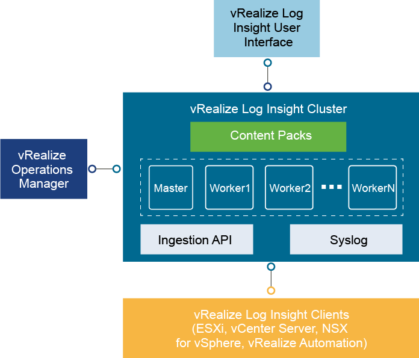

vRealize Log Insight clients connect to ILB VIP address and use the Web user interface and ingestion (via Syslog or the Ingestion API) to send logs to vRealize Log Insight.

By default, the vRealize Log Insight Solution collects data from vCenter Server systems and ESXi hosts. For forwarding logs from NSX for vSphere, and vRealize Automation, use content packs which contain extensions or provide integration with other systems in the SDDC.

#### Integration with vRealize Operations Manager

The integration with vRealize Operations Manager provides a single pane of glass for monitoring the SDDC. vRealize Log Insight sends notification events to vRealize Operations Manager. You can also launch vRealize Log Insight from the vRealize Operations Manager Web user interface.

#### Archiving

vRealize Log Insight supports data archiving on NFS shared storage that each vRealize Log Insight node can access. 

#### Backup

You back up each vRealize Log Insight cluster locally by using traditional virtual machine backup solutions, such as a vSphere Storage APIs for Data Protection (VADP) compatible backup software like vSphere Data Protection.

#### Multi-Region vRealize Log Insight Deployment

The scope of the SDDC design covers multiple regions. Using vRealize Log Insight in a multi-region design can provide a syslog infrastructure in all regions of the SDDC. Using vRealize Log Insight across multiple regions requires deploying a cluster in each region. vRealize Log Insight supports event forwarding to other vRealize Log Insight deployments across regions in the SDDC. Implementing failover by using vSphere Replication or disaster recovery by using Site Recovery Manager is not necessary. The event forwarding feature adds tags to log message that identify the source region and event filtering prevents looping messages between the regions.

 

1.  Detailed Design
    ===============

    1.  Physical Infrastructure Detailed Design
        ---------------------------------------

        1.  ### Physical Design Fundamentals

The SDDC physical layer design is based on a pod architecture.  The physical data center elements include racks, servers, network elements, and storage arrays.

Figure 19. Physical Layer within the SDDC

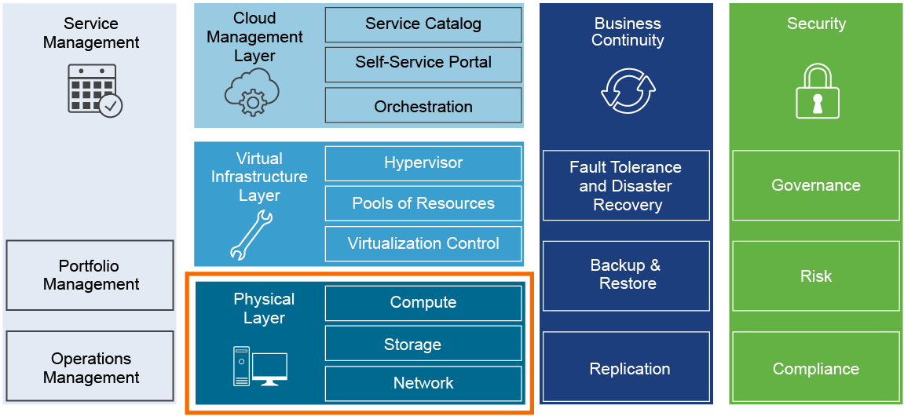

#### Availability Zones and Regions

1.  This design leverages a single availability zone for a one region deployment. 

2.  This design leverages a single availability zone in each region in the case of a two region deployment.

Availability zones and regions are used for different purposes. 

-   Availability zones. An availability zone is the fault domain of the SDDC. Multiple availability zones can provide continuous availability of an SDDC, minimize unavailability of services and improve SLAs. 

-   Regions. Regions provide disaster recovery across different SDDC instances. This design uses two regions. Each region is a separate SDDC instance. The regions have a similar physical layer design and virtual infrastructure design but different naming. For information on exceptions to this design, see the Business Continuity / Disaster Recovery Design chapter.

The design uses the following regions. The region identifier uses [United Nations Code for Trade and Transport Locations](http://www.unece.org/cefact/locode/service/location.html) (UN/LOCODE) along with a numeric instance ID.

 

Table 5. Region Identifiers

| Region | Region Identifier | Region-Specific Domain Name | Region Description                       |
|--------|-------------------|-----------------------------|------------------------------------------|
| A      | SFO01             | sfo01.rainpole.local        | San Francisco, CA, USA based data center |
| B      | LAX01             | lax01.rainpole.local        | Los Angeles, CA, USA based data center   |

Table 6. Availability Zones and Regions Design Decisions

| Decision ID  | Design Decision                 | Design Justification                                                                                         | Design Implication                                                                                                                                                       |
|--------------|---------------------------------|--------------------------------------------------------------------------------------------------------------|--------------------------------------------------------------------------------------------------------------------------------------------------------------------------|
| SDDC-PHY-001 | Use a single availability zone. | A single availability zone is sufficient for the design objectives.                                          | Results in limited redundancy of the overall solution. The single availability zone can become a single point of failure and prevent high-availability design solutions. |
| SDDC-PHY-002 | Use two regions.                | Supports the technical requirement of multi-region failover capability as outlined in the design objectives. | Having multiple regions will require an increased solution footprint and associated costs.                                                                               |

#### Pods and Racks

The SDDC functionality is split across multiple pods. Each pod can occupy one rack or multiple racks. The total number of pods for each pod type depends on scalability needs.

Figure 20. SDDC Pod Architecture

Table 7. Required Number of Racks

| Pod (Function)              | Required Number of Racks    

                               (for full scale deployment)  | Minimum Number of Racks            | Comment                                                                                                                                                                                                                                               |
|-----------------------------|-----------------------------|------------------------------------|-------------------------------------------------------------------------------------------------------------------------------------------------------------------------------------------------------------------------------------------------------|
| Compute pods                | 6                           | 1                                  | On 6 compute racks, 6 compute pods with 19 ESXi hosts each can achieve the target size of 6000 average-sized VMs.  If an average size VM has two 2.6 Ghz cores with 4 GB of RAM, 6000 VMs with 20% overhead for bursting workloads require 114 hosts.

                                                                                                  The quantity and performance varies based on the workloads running within the compute pods.                                                                                                                                                            |
| Management pod and edge pod | 1                           | 1                                  | Two half-racks are sufficient for the management pod and edge pod. The two pods in the rack can run up to 1140 average sized management VMs and edge devices.                                                                                         

                                                                                                  This leaves sufficient space to mount additional network equipment, such as the spine switches, into the same rack.                                                                                                                                    |
| Storage pods                | 6                           | 0 (if using VSAN for Compute Pods) | Storage that is not Virtual SAN storage is hosted on isolated storage pods.                                                                                                                                                                           |
| **Total**                   | **13**                      | 2                                  |                                                                                                                                                                                                                                                       |

Table 8. POD and Racks Design Decisions

| Decision ID  | Design Decision                                                                       | Design Justification                                                                                                                                                                                                        | Design Implication                                                                                                                                       |
|--------------|---------------------------------------------------------------------------------------|-----------------------------------------------------------------------------------------------------------------------------------------------------------------------------------------------------------------------------|----------------------------------------------------------------------------------------------------------------------------------------------------------|
| SDDC-PHY-003 | Each compute pod occupies exactly one rack.                                           

                Both the management and the edge pod occupy the same rack.                             

                Storage pods can occupy more than one rack, but only adjacent racks.                   | To simplify the scale out of the SDDC infrastructure, the pod size has been standardized.                                                                                                                                   

                                                                                                                                                                                                                                                                                                                                     | The design must include sufficient power and cooling to operate the server and storage equipment. This depends on the selected vendor and products.      

                                                                                                                                                                                                                                                                                                                                      While each compute pod can occupy multiple racks, in this design each compute pod occupies exactly one rack.                                              |
| SDDC-PHY-004 | Each rack has two separate power feeds.                                               | Redundant power feeds increase availability by ensuring that failure of a power feed does not bring down all equipment in a rack.                                                                                           | All equipment used must support two separate power feeds. The equipment must keep running if one power feed fails.                                       |
| SDDC-PHY-005 | Place the management pod and the edge pod on a single rack, the management/edge rack.

                Mount compute resources for the management pod starting at the top of the rack.        

                Mount compute resources for the edge pod starting from the bottom of the rack.         | The number of required compute resources for the management pod (4 ESXi servers) and edge pod (4 ESXi servers) are low and do not justify a dedicated rack for each pod.                                                    

                                                                                                        Each rack has two separate and independent power feeds (see SDDC-PHY-004). Combined with redundant network connections into a rack and within a rack, redundant power feeds prevent failure of equipment in an entire rack.  

                                                                                                        If the equipment of an entire rack fails, the cause, such as flooding or an earthquake, also affects neighboring racks. A second region is needed to mitigate downtime associated with such an event.                        | Racks for the management and edge pods are highly underutilized. You can place other equipment, such as the spine switches, on the management/edge rack. |

#### Servers

The sizing of the physical servers for the ESXi hosts for the management and edge pods has special consideration because it is based on the VMware document "[VMware Virtual SAN Ready Nodes](http://partnerweb.vmware.com/programs/vsan/Virtual%20SAN%20Ready%20Nodes.pdf)", as these pod type use VMware Virtual SAN. 

-   An average-sized VM has 2 CPUs, 6 GB memory, 2 x 60 GB virtual disks

-   A standard 2U server can host 60 average-sized VMs on a single ESXi host.    

Table 9. Physical Server Decisions

| Decision ID  | Design Decision                                 | Design Justification                                                                                  | Design Implication            |
|--------------|-------------------------------------------------|-------------------------------------------------------------------------------------------------------|-------------------------------|
| SDDC-PHY-006 | Use standard rack mount Virtual SAN Ready Node. | Using a Virtual SAN Ready Node ensures seamless compatibility with Virtual SAN during the deployment. | Might limit hardware choices. |

See the *ESXi Design* chapter for details. 

#### ESXi Host Physical Design Specifications 

The physical design specifications of the ESXi host list the characteristics that were used during deployment and testing of the VMware Validated Design.

The configuration and assembly process for each system is standardized, with all components installed the same manner on each host. Standardizing the entire physical configuration of the ESXi hosts is critical to providing an easily manageable and supportable infrastructure because standardization eliminates variability. Consistent PCI card slot location, especially for network controllers, is essential for accurate alignment of physical to virtual I/O resources. Deploy ESXi hosts with identical configuration, including identical storage, and networking configurations, across all cluster members. Identical configurations ensure an even balance of virtual machine storage components across storage and compute resources.

Select all ESXi host hardware, including CPUs following the *VMware Compatibility Guide*. 

1.  As outlined in the "Physical Layer Design" section, this design selects servers based on the VMware document [*VMware Virtual SAN Ready Nodes*](http://partnerweb.vmware.com/programs/vsan/Virtual%20SAN%20Ready%20Nodes.pdf)*.*

Table 10. Virtual SAN ESXi Design Decisions

| Decision ID  | Design Decision                                               | Design Justification                                                                                                                                                                   | Design Implication                                                                      |
|--------------|---------------------------------------------------------------|----------------------------------------------------------------------------------------------------------------------------------------------------------------------------------------|-----------------------------------------------------------------------------------------|
| SDDC-PHY-007 | Use Virtual SAN Ready Nodes for this VMware Validated Design. | All nodes must have uniform configurations across a given cluster (management cluster or edge cluster), specifically storage and networking components.                                

                                                                                A balanced cluster delivers more predictable performance even during hardware failures. In addition, performance impact during resync/rebuild is minimal when the cluster is balanced.  | Hardware choice is limited. Not all hardware is on the list of Virtual SAN Ready Nodes. |

ESXi Host Memory

1.  See the[ VMware Virtual SAN 6.0 Design and Sizing Guide](http://www.vmware.com/files/pdf/products/vsan/VSAN_Design_and_Sizing_Guide.pdf) for more information about disk groups, including design and sizing guidance. The number of disk groups and disks that an ESXi host manages determines memory requirements. 32 GB of RAM is required to support the maximum number of disk groups.

Table 11. Host Memory Design Decisions

| Decision ID  | Design Decision                                                                     | Design Justification                                                | Design Implication |
|--------------|-------------------------------------------------------------------------------------|---------------------------------------------------------------------|--------------------|
| SDDC-PHY-008 | Set up each ESXi host in the management and edge pods to have a minimum 128 GB RAM. | The VMs in the management and edge pods require a total 375 GB RAM. | None               |

**Host Boot Device Background Considerations**

Minimum boot disk size for ESXi in SCSI-based devices (SAS / SATA / SAN) is greater than 5 GB. ESXi can be deployed using stateful local, SAN SCSI boot devices, or vSphere Auto Deploy.

What is supported depends on the version of Virtual SAN that you are using:

-   Virtual SAN does not support stateless vSphere Auto Deploy

-   Virtual SAN 5.5 supports USB/SD embedded devices for ESXi boot device (4 GB or greater).

-   Since Virtual SAN 6.0, there is an option to use SATADOM as a supported boot device.

Refer to the[ VMware Virtual SAN 6.0 Design and Sizing Guide](http://www.vmware.com/files/pdf/products/vsan/VSAN_Design_and_Sizing_Guide.pdf) to choose the option that best fits your hardware.

### Physical Networking Design

The physical network uses a leaf-and-spine design, shown in the following illustration. See the* Physical Network Architecture* section for details. 

Figure 21. Leaf-and-Spine Architecture

#### Leaf-and-Spine and Network Virtualization Architecture

As virtualization, cloud computing, and distributed cloud become more pervasive in the data center, a shift in the traditional three-tier networking model is taking place. This shift addresses simplicity and scalability.

Simplicity

The traditional core-aggregate-access model is efficient for north/south traffic that travels in and out of the data center. This model is usually built for redundancy and resiliency against failure. However, the Spanning Tree Protocol (STP) typically blocks 50 percent of the critical network links to prevent network loops, which means 50 percent of the maximum bandwidth is wasted until something fails.

A core-aggregate-access architecture is still widely used for service-oriented traffic that travels north/south. However, the trends in traffic patterns are changing with the types of workloads. In today’s data centers east/west or server-to-server traffic is common. If the servers in a cluster are performing a resource-intensive calculation in parallel, unpredictable latency or lack of bandwidth are undesirable. Powerful servers that perform these calculations can attempt to communicate with each other, but if they cannot communicate efficiently because of a bottleneck in the network architecture, wasted capital expenditure results.

One way to solve the problem is to create a leaf-and-spine architecture, also known as a distributed core.

A leaf-and-spine architecture has two main components: spine switches and leaf switches.

-   Spine switches can be thought of as the core, but instead of being a large, chassis-based switching platform, the spine consists of many high-throughput Layer 3 switches with high port density.

-   Leaf switches can be treated as the access layer. Leaf switches provide network connection points for servers and uplink to the spine switches.

Every leaf switch connects to every spine switch in the fabric. No matter which leaf switch a server is connected to, it always has to cross the same number of devices to get to another server (unless the other server is located on the same leaf). This design keeps the latency down to a predictable level because a payload has to hop only to a spine switch and another leaf switch to get to its destination.

Figure 22. Example of a Small-Scale Leaf-and-Spine Architecture

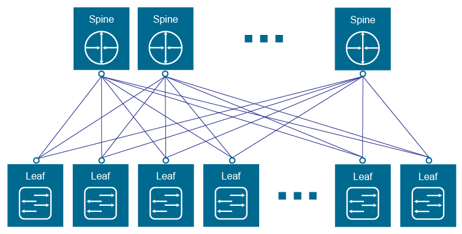

Instead of relying on one or two large chassis-based switches at the core, the load is distributed across all spine switches, making each individual spine insignificant as the environment scales out.

Scalability

Several factors, including the following, affect scale:

-   Number of racks that are supported in a fabric

-   Amount of bandwidth between any two racks in a data center

-   Number of paths a leaf switch can select from when communicating with another rack

The total number of available ports dictates the number of racks supported in a fabric across all spine switches and the acceptable level of oversubscription.

Different racks might be hosting different types of infrastructure. For example, a rack might host filers or other storage systems, which might attract or source more traffic than other racks in a data center. In addition, traffic levels of compute racks—that is, racks that are hosting hypervisors with workloads or virtual machines—might have different bandwidth requirements than edge racks, which provide connectivity to the outside world. Link speed as well as the number of links vary to satisfy different bandwidth demands.  

The number of links to the spine switches dictates how many paths are available for traffic from this rack to another rack. Because the number of hops between any two racks is consistent, equal-cost multipathing (ECMP) can be used. Assuming traffic sourced by the servers carry a TCP or UDP header, traffic spray can occur on a per-flow basis. 

Figure 23. Leaf-and-Spine and Network Virtualization

#### Top of Rack (ToR) Physical Switches

When configuring ToR switches, consider the following best practices. 

-   Configure redundant physical switches to enhance availability.

-   Configure switch ports that connect to ESXi hosts manually as trunk ports. Virtual switches are passive devices and do not send or receive trunking protocols, such as Dynamic Trunking Protocol (DTP).

-   Modify the Spanning Tree Protocol (STP) on any port that is connected to an ESXi NIC to reduce the time it takes to transition ports over to the forwarding state, for example using the Trunk PortFast feature found in a Cisco physical switch. 

-   Provide DHCP or DHCP Helper capabilities on all VLANs that are used by VMkernel ports. This setup simplifies the configuration by using DHCP to assign IP address based on the IP subnet in use.

    1.  #### Jumbo Frames

IP storage throughput can benefit from the configuration of jumbo frames. Increasing the per-frame payload from 1500 bytes to the jumbo frame setting increases the efficiency of data transfer. Jumbo frames must be configured end-to-end, which is easily accomplished in a LAN. When you enable jumbo frames on an ESXi host, you have to select an MTU that matches the MTU of the physical switch ports.

The workload determines whether it makes sense to configure jumbo frames on a virtual machine. If the workload consistently transfers large amounts of network data, configure jumbo frames if possible. In that case, the virtual machine operating systems and the virtual machine NICs must also support jumbo frames.

Using jumbo frames also improves performance of vSphere vMotion.

1.  VXLANs need an MTU value of at least 1600 bytes on the switches and routers that carry the transport zone traffic.

Table 12. Jumbo Frames Design Decisions

| Decision ID     | Design Decision                                                                      | Design Justification                                                                                                                                                    | Design Implication                                                                                                                                                              |
|-----------------|--------------------------------------------------------------------------------------|-------------------------------------------------------------------------------------------------------------------------------------------------------------------------|---------------------------------------------------------------------------------------------------------------------------------------------------------------------------------|
| SDDC-VI-Net-007 | Increase MTU settings for VXLAN, NFS, and vMotion traffic to enable jumbo frame use. | VXLAN, VSAN, NFS, and vSphere vMotion tend to send large frames. Increasing MTU size makes exchanging these frames more efficient on the hosts and on physical switches | For VXLAN, VSAN, NFS, and vMotion traffic, the entire network path (VMkernel port, distributed switch, and physical switch) and routers must be configured to use jumbo frames. |

#### Leaf Switch Connectivity and Network Settings

Each ESXi host in the compute rack is connected redundantly to the SDDC network fabric ToR switches via two 10 GbE ports, as shown in the following illustration. Configure the ToR switches to use LACP to provide all necessary VLANs via an 802.1Q trunk.

Figure 24. Leaf Switch to Server Connection within Compute Racks

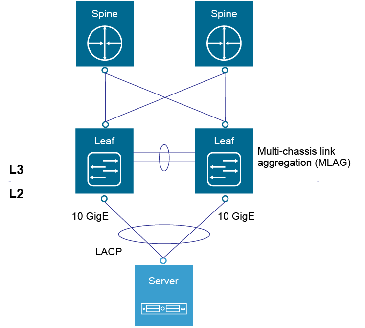

Each ESXi host in the management/edge rack is connected to the SDDC network fabric and also to the Wide Area Network (WAN) and to the Internet, as show in the following illustration. 

Figure 25. Leaf Switch to Server Connection within Management/Edge Rack

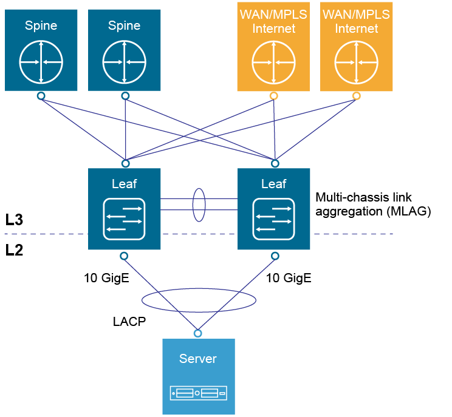

#### VLANs and Subnet

Each ESXi host in the compute rack and the management/edge rack uses VLANs and corresponding subnets for internal-only traffic, as shown in the illustration below. 

The leaf switches of each rack act as the Layer 3 interface for the corresponding subnet.

The management/edge rack provides externally accessible VLANs for access to the Internet and/or MPL-based corporate networks. 

Figure 26. Sample VLANs and Subnets within a Pod

Follow these guidelines:

-   Use only /24 subnets to reduce confusion and mistakes when dealing with IPv4 subnetting.

-   Use the IP address .1 as the (floating) interface with .2 and .3 for VRPP/HSRP.

-   Use the RFC1918 IPv4 address space for these subnets and allocate one octet by region and another octet by function. For example, the mapping 10.regionid.function.0/24 results in the following sample subnets.

1.  The following IP ranges are meant as samples. Your actual implementation depends on your environment.

Table 13. Sample IP address ranges

| Pod             | Function | Sample VLAN   | Sample IP range |
|-----------------|----------|---------------|-----------------|
| 2 (Compute)     | Mgmt     | 1621 (Native) | 172.16.21.0/24  |
| 2 (Compute)     | VMotion  | 1622          | 172.16.22.0/24  |
| 67 (Management) | VXLAN    | 1614          | 172.16.14.024   |
| 67 (Management) | Storage  | 1613          | 172.16.13.0/24  |
| 131 (Edge)      | Mgmt     | 1631 (Native) | 172.16.31.0/24  |
| 131 (Edge)      | VXLAN    | 1634          | 172.16.34.0/24  |
| 131 (Edge)      | Storage  | 1633          | 172.16.33.0/24  |

#### Access Port Network Settings

Configure additional network settings on the access ports that connect the leaf switch to the corresponding servers:

-   **Spanning-Tree Protocol (STP)**: Although this design does not use the spanning tree protocol, switches usually come with STP configured by default. Designate the access ports as trunk PortFast.

-   **Trunking**: Configure the VLANs as members of a 802.1Q trunk with the management VLAN acting as the native VLAN.

-   **MLAG**: Configure the two 10 GigE links between server and ToR switches as MLAG via LACP. 

-   **MTU**: Set MTU for all VLANS (Management, vMotion, VXLAN and Storage) to jumbo frames for consistency purposes.

-   **DHCP helper**: Configure the VIF of the Management, vMotion and VXLAN subnet as a DHCP proxy.

-   **Multicast**: Configure IGMP snooping on the ToR switches and include an IGMP querier on each VLAN.

    1.  #### Region Interconnectivity

The SDDC-internal management networks of the two regions are connected. End users must be able to reach the public-facing network segments (public management and tenant networks) of both regions.  

The design of the connection solution is out of scope for this VMware Validated Design.

#### Rack Placement

The following rack layout is an example for networking and server equipment:

Table 14. Example rack layout for networking and server equipment

| Unit | Usage                                    |
|------|------------------------------------------|
| 42   | Patch Panel for out of rack connectivity |
| 41   | Out-of-band management switch            |
| 40   | ToR switch A                             |
| 39   | ToR switch B                             |
| 1-38 | Servers (1 - 19)                         |

#### Physical Network Characteristics

-   **Requirements. **The design uses 4 spine switches with 40 GbE ports. As a result, each leaf switch must have 4 uplink ports capable of 40 GbE.** **

-   **Fault Tolerance.** In case of a switch failure or scheduled maintenance, switch fabric capacity reduction is 25% with four spine switches.

-   **Oversubscription.** Oversubscription can occur within a leaf switch. To compute the oversubscription for a leaf switch, use this formula: 

> Total bandwidth available to all connected servers / aggregate amount of uplink bandwidth

The compute rack and the management/edge rack have 19 ESXi hosts. Each ESXi host has one 10 GbE port connected to each ToR switch, creating up to 190 Gbps of bandwidth. With four 40 GbE uplinks to the spine, you can compute oversubscription as follows (see the *Oversubscription in the Leaf Switches* illustration).

190 Gbps (total bandwidth) / 160 Gbps (uplink bandwidth) = 1.1875:1

Figure 27. Oversubscription in the Leaf Switches

 

-   **Routing protocols.** Base the selection of the external routing protocol on your current implementation or on available expertise among the IT staff. Take performance requirements into consideration. Possible options are OSPF, iBGP and IS-IS.

-   **DHCP proxy.** The DHCP proxy must point to a DHCP server via its IPv4 address. See the *External Service Dependencies* section for details on the DHCP server. 

Table 15. Physical Network Design Decisions

| Decision ID      | Design Decision                                                                                                                                                                                                                                                                                               | Design Justification                                                                          | Design Implication                                                                                                                         |
|------------------|---------------------------------------------------------------------------------------------------------------------------------------------------------------------------------------------------------------------------------------------------------------------------------------------------------------|-----------------------------------------------------------------------------------------------|--------------------------------------------------------------------------------------------------------------------------------------------|
| SDDC-PHY-NET-001 | Racks are connected using a leaf-and-spine topology and Layer 3 connectivity.                                                                                                                                                                                                                                 | A Layer 3 leaf-and-spine architecture supports scale out while maintaining failure isolation. | Layer 2 traffic has to be reduced to within the pod.                                                                                       |
| SDDC-PHY-NET-002 | Only the management/edge rack has physical access to the external network via VLANs                                                                                                                                                                                                                           | Aggregating physical cabling and network services to the management/edge rack reduces costs.  | Workloads in compute pods located on compute racks have to use network virtualization (NSX for vSphere) for external network connectivity. |
| SDDC-PHY-NET-003 | Each compute rack and each management/edge rack uses two ToR switches that are configured as a multi-chassis link aggregation (MLAG) pair. These switches provide LACP-based port channels across two 10 GbE links to each server. The LACP-based port channels use one link to each of the two ToR switches. | This design uses two 10 GbE links to provide redundancy and reduce overall design complexity. | ESXi hosts have to be configured for LACP.                                                                                                 |

#### Jumbo Frames

IP storage throughput can benefit from the configuration of jumbo frames. When you enable jumbo frames on an ESXi host, you have to select an MTU that matches the MTU of the physical switch ports. Increasing the per-frame payload from 1500 bytes to the jumbo frame setting increases the efficiency of data transfer. Jumbo frames must be configured end-to-end, which is easily accomplished in a LAN.

The workload determines whether it makes sense to configure jumbo frames on a virtual machine. If the workload consistently transfers large amounts of network data, configure jumbo frames if possible. In that case, the virtual machine operating systems and the virtual machine NICs must also support jumbo frames.

Using jumbo frames also improves performance of vSphere vMotion.

1.  VXLANs need an MTU value of at least 1600 bytes on the switches and routers that carry the transport zone traffic.

Table 16. Jumbo Frames Design Decisions

| Decision ID     | Design Decision                                                                   | Design Justification                                                                                                                                                    | Design Implication                                                                                                                                                              |
|-----------------|-----------------------------------------------------------------------------------|-------------------------------------------------------------------------------------------------------------------------------------------------------------------------|---------------------------------------------------------------------------------------------------------------------------------------------------------------------------------|
| SDDC-VI-Net-007 | Increase MTU settings for VXLAN, NFS, and vMotion traffic to enable jumbo frames. | VXLAN, VSAN, NFS, and vSphere vMotion tend to send large frames. Increasing MTU size makes exchanging these frames more efficient on the hosts and on physical switches | For VXLAN, VSAN, NFS, and vMotion traffic, the entire network path (VMkernel port, distributed switch, and physical switch) and routers must be configured to use jumbo frames. |

#### Other Networking Considerations

The following considerations are also part of your physical networking design. 

-   All nodes must use static IP addresses.

-   As a DNS best practice, the IP address, FQDNs and short names of all nodes must be forward and reverse resolvable.

-   All nodes must be accessible from the vCenter Server instances and from the machine that hosts the vSphere Client (if vSphere Client is used instead of vSphere Web Client). 

-   All nodes in the analytics cluster must have unique host names.

-   NTP source must be used for all cluster nodes

    1.  ### Physical Storage Design

This VMware Validated Design relies on both VMware Virtual SAN storage and NFS storage. The *Shared Storage Design* section explains where the SDDC uses which type of storage and gives background information. The focus of this section is the physical storage design. 

#### Virtual SAN Physical Design

Software-defined storage is a key technology in the SDDC. This design uses VMware Virtual SAN to implement software-defined storage for the management and edge clusters.

VMware Virtual SAN is a fully integrated hypervisor-converged storage software. Virtual SAN creates a cluster of server hard disk drives and solid state drives and presents a flash-optimized, highly resilient, shared storage datastore to hosts and virtual machines. Virtual SAN allows you to control capacity, performance, and availability on a per virtual machine basis through the use of storage policies.

Requirements and Dependencies

The following requirements and dependencies summarize the information in the VMware Virtual SAN documentation. The design decisions of this VMware Validated Design fulfill these requirements.

The software-defined storage module has the following requirements and options:

-   Minimum of 3 hosts providing storage resources to the Virtual SAN cluster.

-   Virtual SAN is configured as hybrid storage or all-flash storage. 

<!-- -->

-   A Virtual SAN hybrid storage configuration requires both magnetic devices and flash caching devices.

-   An All-Flash Virtual SAN configuration requires vSphere 6.0 or later.  

<!-- -->

-   Each ESXi host that provides storage resources to the cluster must meet the following requirements: 

<!-- -->

-   One 200 GB SSD
    The SSD flash cache tier should be at least 10% of the size of the HDD capacity tier.

-   Two traditional spindle 1 TB HDDs 

-   RAID controller compatible with VMware Virtual SAN. 

-   10 Gbps network for Virtual SAN traffic  

-   vSphere High Availability Isolation Response set to power off virtual machines. With this setting, no possibility of split brain conditions in case of isolation or network partition exists. In a split-brain condition, the virtual machine might be powered on by two hosts by mistake. See design decision SDDC-VI-VC-024 for more details. 

Table 17. Virtual SAN Physical Design Decision

| Decision ID      | Design Decision                                                                 | Design Justification                                                                             | Design Implication                                                                                                            |
|------------------|---------------------------------------------------------------------------------|--------------------------------------------------------------------------------------------------|-------------------------------------------------------------------------------------------------------------------------------|
| SDDC-PHY-STO-001 | Use one 200 GB SSD and two traditional 1 TB HDDs to create a single disk group. | Allow enough capacity for the management and edge VMs with a minimum of 10% flash-based caching. | Having only one disk group limits the amount of striping (performance) capability and increases the size of the fault domain. |

Virtual SAN Background Information

vSphere offers two different Virtual SAN modes of operation, all-flash or hybrid.

-   Hybrid Mode

> In a hybrid storage architecture, Virtual SAN pools server-attached capacity devices--in this case magnetic devices--and caching devices, typically SSDs or PCI-e devices to create a distributed shared datastore.

-   All-Flash Mode

> VMware Virtual SAN can be deployed as all-flash storage. All-flash storage uses flash-based devices (SSD or PCI-e) only as a write cache while other flash-based devices provide high endurance for capacity and data persistence.

Table 18. Virtual SAN Mode Design Decision

| Decision ID      | Design Decision                       | Design Justification                                                                                                                                                  | Design Implication                                                                                |
|------------------|---------------------------------------|-----------------------------------------------------------------------------------------------------------------------------------------------------------------------|---------------------------------------------------------------------------------------------------|
| SDDC-PHY-STO-002 | Configure Virtual SAN in hybrid mode. | The VMs on the management and edge cluster, which are hosted within Virtual SAN, do not require the performance or expense of an all-flash Virtual SAN configuration. | Virtual SAN hybrid mode does not provide the potential performance of an all-flash configuration. |

Hardware Considerations

You can build your own VMware Virtual SAN cluster or choose from a list of Virtual SAN Ready Nodes.

-   Build Your Own. Be sure to use hardware from the *VMware* *Compatibly Guide for Virtual SAN* ([https://www.vmware.com/resources/compatibility/search.php?deviceCategory=Virtual SAN](https://www.vmware.com/resources/compatibility/search.php?deviceCategory=vsan)) for the following components:

<!-- -->

-   Solid state disks (SSDs)

-   Magnetic hard drives (HDDs)

-   I/O controllers, including Virtual SAN certified driver/firmware combinations

<!-- -->

-   Use VMware Virtual SAN Ready Nodes. A Virtual SAN Ready Node is a validated server configuration in a tested, certified hardware form factor for Virtual SAN deployment, jointly recommended by the server OEM and VMware. See the *VMware Virtual SAN Compatibility Guide* ([http://partnerweb.vmware.com/programs/Virtual SAN/Virtual%20SAN%20Ready%20Nodes.pdf](http://partnerweb.vmware.com/programs/vsan/Virtual%20SAN%20Ready%20Nodes.pdf)). The Virtual SAN Ready Node documentation provides examples of standardized configurations, including the numbers of VMs supported and estimated number of 4K IOPS delivered.

As per design decision SDDC-PHY-006, the VMware Validated Design uses Virtual SAN Ready Nodes.

#### Solid State Disk (SSD) Characteristics

In a VMware Virtual SAN configuration, the SSDs are used for the Virtual SAN caching layer for hybrid deployments and for the capacity layer for all flash.

-   For a hybrid deployment, the use of the SSD is split between a non-volatile write cache (approximately 30%) and a read buffer (approximately 70%). As a result, the endurance and the number of I/O operations per second that the SSD can sustain are important performance factors.

-   For an all-flash model, endurance and performance have the same criteria. However many more write operations are held by the caching tier, thus elongating or extending the life of the SSD capacity-tier.

SSD Endurance 

This VMware Validated Design uses class D endurance class SSDs for the caching tier.  

Info: All drives listed in the *VMware Compatibility Guide for Virtual SAN* ([https://www.vmware.com/resources/compatibility/search.php?deviceCategory=Virtual SAN](https://www.vmware.com/resources/compatibility/search.php?deviceCategory=vsan)) meet the Class D requirements.

SDDC Endurance Design Decision Background

For endurance of the SSDs used for Virtual SAN, standard industry write metrics are the primary measurements used to gauge the reliability of the drive. No standard metric exists across all vendors, however, Drive Writes per Day (DWPD) or Petabytes Written (PBW) are the measurements normally used.

For vSphere 5.5, the endurance class was based on Drive Writes Per Day (DWPD). For VMware Virtual SAN 6.0, the endurance class has been updated to use Terabytes Written (TBW), based on the vendor’s drive warranty. TBW can be used for VMware Virtual SAN 5.5 and VMware Virtual SAN 6.0 and is reflected in the *VMware Compatibility Guide for Virtual SAN*.

The reasoning behind using TBW is that VMware now offers the flexibility to use larger capacity drives with lower DWPD specifications.

If a SSD vendor uses Drive Writes Per Day as a measurement, you can calculate endurance in Terabytes Written (TBW) as follows:

TBW (over 5 years) = Drive Size x DWPD x 365 x 5

For example, if a vendor specified DWPD = 10 for a 800 GB capacity SSD, you can compute TBW as follows:

> TBW = 0.4TB X 10DWPD X 365days X 5yrs
>
> TBW = 7300TBW

That means the SSD supports 7300TB writes over 5 years. (Higher TBW figures denote a higher endurance class).

For SSDs that are designated for caching and all-flash capacity layers, the following table outlines which endurance class to use for hybrid and for all-flash VMware Virtual SAN.

Table 19. SSD Endurance Classes for Hybrid and All-Flash Virtual SAN

| Endurance Class | TBW       | Hybrid Caching Tier | All-Flash Caching Tier | All-Flash Capacity Tier |
|-----------------|-----------|---------------------|------------------------|-------------------------|
| Class A         | &gt;=365  | No                  | No                     | Yes                     |
| Class B         | &gt;=1825 | Yes                 | No                     | Yes                     |
| Class C         | &gt;=3650 | Yes                 | Yes                    | Yes                     |
| Class D         | &gt;=7300 | Yes                 | Yes                    | Yes                     |

1.  This VMware Validated Design does not use All-Flash Virtual SAN.

Table 20. SSD Endurance Class Design Decisions

| Decision ID      | Design Decision                                                                                      | Design Justification                                                                                                                                                                   | Design Implication                                                             |
|------------------|------------------------------------------------------------------------------------------------------|----------------------------------------------------------------------------------------------------------------------------------------------------------------------------------------|--------------------------------------------------------------------------------|
| SDDC-PHY-STO-003 | Use Class D (&gt;=7300TBW) SSDs for the caching tier of the management cluster and the edge cluster. | If a SSD designated for the caching tier fails due to wear-out, the entire VMware Virtual SAN disk group becomes unavailable. The result is potential data loss or operational impact. | SSDs with higher endurance may be more expensive than lower endurance classes. |

SSD Performance

A direct correlation exists between the SSD performance class and the level of Virtual SAN performance. The highest-performing hardware results in the best performance of the solution. Cost is therefore the determining factor. A lower class of hardware that is more cost effective might be attractive even if the performance or size is not ideal. For optimal performance of Virtual SAN, select class E SSDs. See the *VMware Compatibility Guide for Virtual SAN* ([https://www.vmware.com/resources/compatibility/search.php?deviceCategory=Virtual SAN](https://www.vmware.com/resources/compatibility/search.php?deviceCategory=vsan)) for detail on the different classes. 

SSD Performance Design Decision Background

Select a high class of SSD for optimal performance of VMware Virtual SAN. Before selecting a drive size, consider disk groups and sizing as well as expected future growth. VMware defines classes of performance in the *VMware Compatibility Guide for Virtual SAN *(<https://www.vmware.com/resources/compatibility/search.php?deviceCategory=vsan>) as follows:

Table 21. SSD Performance Classes

| Performance Class | Writes Per Second |
|-------------------|-------------------|
| Class A           | 2,500 – 5,000     |
| Class B           | 5,000 – 10,000    |
| Class C           | 10,000 – 20,000   |
| Class D           | 20,000 – 30,000   |
| Class E           | 30,000 – 100,100  |
| Class F           | 100,000 +         |

**Info**: Select an SSD size that is, at a minimum, 10 percent of the anticipated size of the consumed HDD storage capacity, before failures to tolerate are considered.

For example, select an SSD of at least 100 GB for 1 TB of HDD storage consumed in a 2 TB disk group.

Caching Algorithm

Both hybrid clusters and all-flash configurations adhere to the “10% of consumed capacity” recommendation for the flash cache layer, but there are differences between the two configurations.

-   Hybrid Virtual SAN. 70% of the available cache is allocated for storing frequently read disk blocks, minimizing accesses to the slower magnetic disks. 30% of available cache is allocated to writes.

-   All-Flash Virtual SAN. All-flash clusters have two types of flash: very fast and durable write cache, and cost-effective capacity flash. Here cache is 100% allocated for writes, as read performance from capacity flash is more than sufficient. 

Use Class E SSDs for the highest possible level of performance from the VMware Virtual SAN volume.

Table 22. SSD Performance Class Selection

| Design Quality  | Option 1 Class E | Option 2 Class C | Comments                                                               |
|-----------------|------------------|------------------|------------------------------------------------------------------------|
| Availability    | o                | o                | Neither design option impacts availability.                            |
| Manageability   | o                | o                | Neither design option impacts manageability.                           |
| Performance     | ↑                | ↓                | The higher the storage class that is used, the better the performance. |
| Recover-ability | o                | o                | Neither design option impacts recoverability.                          |
| Security        | o                | o                | Neither design option impacts security.                                |

Legend: ↑ = positive impact on quality; ↓ = negative impact on quality; o = no impact on quality.

**
**

Table 23. SSD Performance Class Design Decisions

| Decision ID      | Design Decision                                                                                           | Design Justification                                                                                               | Design Implication                                            |
|------------------|-----------------------------------------------------------------------------------------------------------|--------------------------------------------------------------------------------------------------------------------|---------------------------------------------------------------|
| SDDC-PHY-STO-004 | Use Class E SSDs (30,000-100,000 writes per second) for both the management cluster and the edge cluster. | The storage I/O performance requirements within the Management cluster dictate the need for at least Class E SSDs. | Class E SSDs might be more expensive than lower class drives. |

Magnetic Hard Disk Drives (HDD) Characteristics

The HDDs in a VMware Virtual SAN environment have two different purposes, capacity and object stripe width.

-   Capacity. Magnetic disks, or HDDs, unlike caching-tier SSDs, make up the capacity of a Virtual SAN datastore

-   Stripe Width. You can define stripe width at the virtual machine policy layer. Virtual SAN might use additional stripes when making capacity and placement decisions outside a storage policy.

Virtual SAN might use additional stripes when making capacity and placement decisions outside a virtual machine storage policy.

Virtual SAN supports these disk types:

-   Serial Attached SCSI (SAS)

-   Near Line Serial Attached SCSI (NL-SCSI). NL-SAS can be thought of as enterprise SATA drives but with a SAS interface.

-   Serial Advanced Technology Attachment (SATA). Use SATA magnetic disks only in capacity-centric environments where performance is not prioritized.

SAS and NL-SAS get you the best results. This VMware Validated Design uses 10,000 RPM drives to achieve a balance between cost and availability. 

HDD Capacity, Cost, and Availability Background Considerations

You can achieve the best results with SAS and NL-SAS.

As per the *VMware Compatibility Guide for Virtual SAN, * the maximum size of an SAS drive at the time of writing is 6 TB. The VMware Virtual SAN design must consider the number of magnetic disks required for the capacity layer, and how well the capacity layer will perform.

-   SATA disks typically provide more capacity per individual drive, and tend to be less expensive than SAS drives. However the trade off is performance, because SATA performance is not as good as SAS performance due to lower rotational speeds (typically 7200RPM) 

-   Choose SAS magnetic disks instead of SATA magnetic disks in environments where performance is critical.

Consider that failure of a larger capacity drive has operational impact on the availability and recovery of more components.

#### Rotational Speed (RPM) Background Considerations

HDDs tend to be more reliable, but that comes at a cost. SAS disks can be available up to 15,000 RPM speeds.

Table 24. Virtual SAN HDD Environmental Characteristics

| Characteristic         | Revolutions per Minute (RPM) |
|------------------------|------------------------------|
| Capacity               | 7,200                        |
| Performance            | 10,000                       |
| Additional Performance | 15,000                       |

Cache-friendly workloads are less sensitive to disk performance characteristics; however, workloads can change over time. HDDs with 10,000 RPM are the accepted norm when selecting a capacity tier.

For the software-defined storage module,* *VMware recommends that you use an HDD configuration that is suited to the characteristics of the environment.  If there are no specific requirements, selecting 10,000 RPM drives achieves a balance between cost and availability.

Table 25. HDD Characteristic Selection

| Design Quality | Option 1 7200 RPM | Option 2 10000 RPM  | Option 3 15000 RPM |  Comments                                                                                                                                                                                                       |
|----------------|-------------------|---------------------|--------------------|-----------------------------------------------------------------------------------------------------------------------------------------------------------------------------------------------------------------|
| Availability   | ↑                 | ↓                   | ↓                  | Less expensive disks make it easier to achieve more failures to tolerate without incurring a large cost. Therefore, slower disks are an appealing option for an environment in which availability is important. |
| Manageability  | o                 | o                   | o                  | No design option impacts manageability.                                                                                                                                                                         |
| Performance    | ↓                 | ↑                   | ↑↑                 | In a VMware Virtual SAN environment, performance is best when using high-RPM HDDs. However, a high-performing SDD impacts performance more than a high-RPM HDD.                                                 |
| Recoverability | o                 | o                   | o                  | No design option impacts recover-ability.                                                                                                                                                                       |
| Security       | o                 | o                   | o                  | No design option impacts security.                                                                                                                                                                              |

Legend: ↑ = positive impact on quality; ↓ = negative impact on quality; o = no impact on quality.

 

Table 26. HDD Selection Design Decisions

| Decision ID      | Design Decision                                                            | Design Justification                                                                                                                                                    | Design Implication                                     |
|------------------|----------------------------------------------------------------------------|-------------------------------------------------------------------------------------------------------------------------------------------------------------------------|--------------------------------------------------------|
| SDDC-PHY-STO-005 | Use 10,000 RPM HDDs with both the management cluster and the edge cluster. | 10,000 RPM HDDs achieve a balance between performance and availability for the VMware Virtual SAN configuration.                                                        

                                                                                                 The performance of 10,000 RPM HDDs avoids disk drain issues. In Virtual SAN hybrid mode, the Virtual SAN periodically flushes uncommitted writes to the capacity tier.   | Slower and potentially cheaper HDDs are not available. |

I/O Controllers

The I/O controllers are as important to a VMware Virtual SAN configuration as the selection of disk drives. Virtual SAN supports SAS, SATA, and SCSI adapters in either pass-through or RAID 0 mode. Virtual SAN supports multiple controllers per host.

-   Multiple controllers can improve performance and mitigate a controller or SSD failure to a smaller number of drives or Virtual SAN disk groups.

-   With a single controller, all disks are controlled by one device. A controller failure impacts all storage, including the boot media (if configured).

Controller queue depth is possibly the most important aspect for performance. All I/O controllers in the *VMware Virtual SAN Hardware Compatibility Guide* have a minimum queue depth of 256. Consider normal day-to-day operations and increase of I/O due to Virtual Machine deployment operations or re-sync I/O activity as a result of automatic or manual fault remediation.

**A Note on SAS Expanders**

SAS expanders are a storage technology that lets you maximize the storage capability of your SAS controller card. Like switches of an Ethernet network, SAS expanders enable you to connect a larger number of devices, that is, more SAS/SATA devices to a single SAS controller. Many SAS controllers support up to 128 or more hard drives.

VMware has not extensively tested SAS expanders, as a result performance and operational predictability are relatively unknowns at this point. Avoid configurations with SAS expanders.  

#### NFS Physical Storage Design

Network File System (NFS) is a distributed file system protocol that allows a user on a client computer to access files over a network much like local storage is accessed. In this case the client computer is an ESXi host, and the storage is provided by a NFS-capable external storage array.

The management cluster uses VMware Virtual SAN for primary storage and NFS for secondary storage. The compute clusters are not restricted to any particular storage technology. For compute clusters, the decision on which technology to use is based on the performance, capacity, and capabilities (replication, deduplication, compression, etc.) required by the workloads that are running in the clusters.

Table 27. NFS Usage Design Decisions

| Decision ID      | Design Decision                                          | Design Justification                                                                                                      | Design Implication                         |
|------------------|----------------------------------------------------------|---------------------------------------------------------------------------------------------------------------------------|--------------------------------------------|
| SDDC-PHY-STO-006 | Use NFS for secondary storage in the management cluster. | Applications in the management cluster require more storage capacity then what is available in the Virtual SAN datastore. | An NFS capable external array is required. |

Requirements

Your environment must meet the following are requirements to use NFS storage in the VMware Validated Design.

-   Storage arrays are connected directly to the leaf switches.

-   All connections are made using 10 Gb Ethernet

-   Jumbo Frames are enabled.

-   10K SAS (or faster) drives are used in the storage array.

Different disk speeds and disk types can be combined in an array to create different performance and capacity tiers. The management cluster uses 10K SAS drives in the RAID configuration recommended by the array vendor to achieve the required capacity and performance.

Table 28. NFS Hardware Design Decision

| Decision ID      | Design Decision                                        | Design Justification                                                                                                                               | Design Implication                                                   |
|------------------|--------------------------------------------------------|----------------------------------------------------------------------------------------------------------------------------------------------------|----------------------------------------------------------------------|
| SDDC-PHY-STO-007 | Use 10K SAS drives for management cluster NFS volumes. | 10K SAS drives achieve a balance between performance and capacity. Faster drives can be used if desired.                                           

                                                                             vSphere Data Protection requires high-performance datastores in order to meet backup SLAs.                                                          

                                                                             vRealize Automation uses NFS datastores for its content catalog which requires high-performance datastores.                                         

                                                                             vRealize Log Insight uses NFS datastores for its archive storage which, depending on compliance regulations, can use a large amount of disk space.  | 10K SAS drives are generally more expensive than other alternatives. |

Volumes

A volume consists of multiple disks in a storage array. RAID is applied at the volume level. The more disks in a volume, the better the performance and the greater the capacity.

Multiple datastores can be created on a single volume, but for applications that do not have a high I/O footprint a single volume with multiple datastores is sufficient.

-   For high I/O applications, such as backup applications, use a dedicated volume to avoid performance issues.

-   For other applications, set up Storage I/O Control (SIOC) to impose limits on high I/O applications so that other applications get the I/O they are requesting.

Table 29. Volume Assignment Design Decisions

| Decision ID      | Design Decision                                                   | Design Justification                                                                                                                                    | Design Implication                                                                                                                                    |
|------------------|-------------------------------------------------------------------|---------------------------------------------------------------------------------------------------------------------------------------------------------|-------------------------------------------------------------------------------------------------------------------------------------------------------|
| SDDC-PHY-STO-008 | Use a dedicated volume for the vSphere Data Protection datastore. | vSphere Data Protection is I/O intensive. vSphere Data Protection or other applications suffer if vSphere Data Protection is placed on a shared volume. | Dedicated volumes add management overhead to storage administrators. Dedicated volumes might use more disks, depending on the array and type of RAID. |
| SDDC-PHY-STO-009 | Use a shared volume for other management component datastores.    | Non-vSphere Data Protection related management applications can share a common volume due to the lower I/O profile of these applications.               | Enough storage space for shared volumes and their associated application data must be available.                                                      |

Virtual Infrastructure Detailed Design
--------------------------------------

The virtual infrastructure design includes the software components that make up the virtual infrastructure layer and that support the business continuity of the SDDC.  These components include the software products that provide the virtualization platform hypervisor, virtualization management, storage virtualization, network virtualization, backup and disaster recovery. VMware products in this layer include VMware vSphere, VMware Virtual SAN, VMware NSX, vSphere Data Protection, and VMware Site Recovery Manager.

Figure 28. Virtual Infrastructure Layer Business Continuity in the SDDC

### Virtual Infrastructure Design Overview

The SDDC virtual infrastructure consists of two regions. Each region includes a management pod, edge pod, and compute pod.

Figure 29. SDDC Logical Design

#### Management Pod

Management pods run the virtual machines that manage the SDDC. These virtual machines host vCenter Server, NSX Manager, NSX Controller, vRealize Operations, vRealize Log Insight, vRealize Automation, Site Recovery Manager and other shared management components. All management, monitoring, and infrastructure services are provisioned to a vCenter Server High Availability cluster which provides high availability for these critical services. Permissions on the management cluster limit access to only administrators. This protects the virtual machines running the management, monitoring, and infrastructure services.

#### Edge Pod

Edge pods provide the following main functions:

-   Support on-ramp and off-ramp connectivity to physical networks

-   Connect with VLANs in the physical world

-   Optionally host centralized physical services

Edge pods connect the virtual networks (overlay networks) provided by NSX for vSphere and the external networks. Using edge pods reduces costs and scales well as demands for external connectivity change.

#### Compute Pod

Compute pods host the SDDC tenant virtual machines (sometimes referred to as workloads or payloads). An SDDC can mix different types of compute pods and provide separate compute pools for different types of SLAs. 

#### Business Continuity

You can support business continuity and disaster recovery (BCDR) in the SDDC by protecting vCenter Server, NSX for vSphere, vRealize Automation, vRealize Operations Manager, and vRealize Log Insight. Enable backup and failover to a recovery region of these management applications to continue the delivery of infrastructure management, operations management, and cloud platform management.

#### Data Protection Design

Data backup protects the data of your organization against data loss, hardware failure, accidental deletion, or other disaster for each region. For consistent image-level backups, use backup software that is based on the VMware Virtual Disk Development Kit (VDDK), such as vSphere Data Protection.

Figure 30. vSphere Data Protection Logical Design

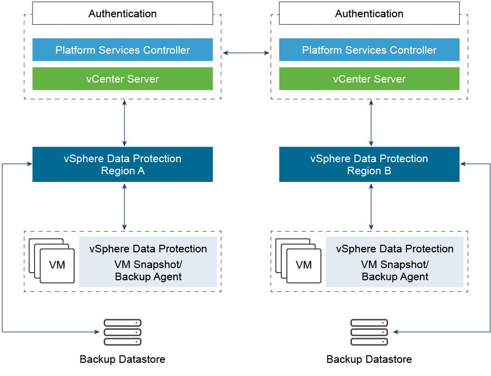

#### Disaster Recovery Design

The SDDC disaster recovery design includes two regions:

-   **Protected Region A in San** Francisco. Region A runs the management stack virtual machine workloads that are being protected and is referred to as the *protected region *in this document.

-   **Recovery Region B in Los Angeles**. Region B is the disaster recovery region and is referred to as the *recovery region*.

Site Recovery Manager can automate the setup and execution of disaster recovery plans between these two regions.

1.  A region in the VMware Validated Design is equivalent to the site construct in Site Recovery Manager.

 Figure 31. Disaster Recovery Logical Design

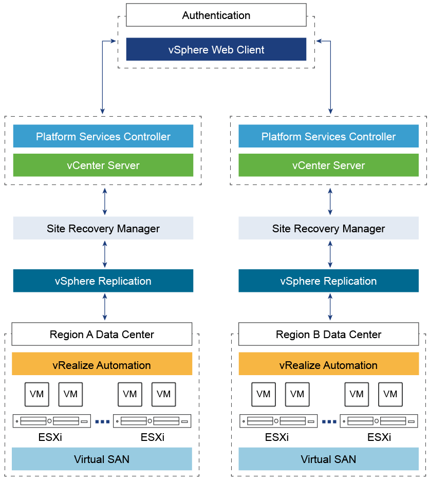

1.  ### ESXi Design

    1.  #### ESXi Hardware Requirements

You can find the ESXi hardware requirements in Physical Design Fundamentals. The following design outlines the design of the ESXi configuration.

#### ESXi Manual Install and Boot Options

You can install or boot ESXi 6.0 from the following storage systems:

-   SATA disk drives. SATA disk drives connected behind supported SAS controllers or supported on-board SATA controllers.

-   Serial-attached SCSI (SAS) disk drives. Supported for installing ESXi 5.5 and later for storing virtual machines on VMFS partitions.

-   SAN. Dedicated SAN disk on Fibre Channel or iSCSI.

-   USB devices. Supported for installing ESXi 6.0.  16 GB or more is [recommended](http://kb.vmware.com/kb/2004784).

-   FCoE (Software Fibre Channel over Ethernet) 

ESXi can boot from a disk larger than 2 TB if the system firmware and the firmware on any add-in card support it. See the vendor documentation.

#### ESXi Boot Disk and Scratch Configuration

For new installations of ESXi, the installer creates a 4 GB VFAT scratch partition. ESXi uses this scratch partition to store log files persistently. By default, vm-support output, which is used by VMware to troubleshoot issues on the ESXi host, is also stored on the scratch partition.

An ESXi installation on SD/USB media does not configure a default scratch partition. VMware recommends that you specify a scratch partition on a VMFS volume or configure remote syslog logging for the host.

Table 30. ESXi Boot Disk Design Decision

| Decision ID      | Design Decision                                                             | Design Justification                                                                              | Design Implication                                                                                                                            |
|------------------|-----------------------------------------------------------------------------|---------------------------------------------------------------------------------------------------|-----------------------------------------------------------------------------------------------------------------------------------------------|
| SDDC-VI-ESXi-001 | Install and configure all ESXi hosts to boot using local USB or SD devices. | USB or SD cards are an inexpensive and easy to configure option for installing ESXi.              

                                                                                                  Using local USB or SD allows allocation of all local HDDs to a VMware Virtual SAN storage system.  | When you use USB or SD storage, ESXi logs are not retained. Configure remote syslog (such as vRealize Log Insight) to collect ESXi host logs. |

#### ESXi Host Access

After installation, ESXi hosts are added to a VMware vCenter Server system and managed through that vCenter Server system.

Direct access to the host console is still available and most commonly used for troubleshooting purposes. You can access ESXi hosts directly using one of these three methods:

-   Direct Console User Interface (DCUI). Graphical interface on the console. Allows basic administrative controls and troubleshooting options.

-   ESXi Shell. A Linux-style bash login on the ESXi console itself. 

-   Secure Shell (SSH) Access. Remote command-line console access.

You can enable or disable each method. By default the ESXi Shell and SSH are disabled to secure the ESXi host. The DCUI is disabled only if Lockdown Mode is enabled.

#### ESXi User Access

By default, root is the only user who can log in to an ESXi host directly, however, you can add ESXi hosts to an Active Directory domain. After the host has been added to an Active Directory domain, access can be granted through Active Directory groups. Auditing who has logged into the host also becomes easier.

Table 31. ESXi User Access Design Decisions

| Decision ID      | Design Decision                                                                                                                                                       | Design Justification                                                                                                                                                      | Design Implication                                               |
|------------------|-----------------------------------------------------------------------------------------------------------------------------------------------------------------------|---------------------------------------------------------------------------------------------------------------------------------------------------------------------------|------------------------------------------------------------------|
| SDDC-VI-ESXi-002 | Add each host to the child Active Directory domain for the region and in which it will reside.  e.g. sfo01.rainpole.local or lax01.rainpole.local                     | Using Active Directory membership allows greater flexibility in granting access to ESXi hosts.                                                                            

                                                                                                                                                                                            Ensuring that users log in with a unique user account allows greater visibility for auditing.                                                                              | Adding hosts to the domain can add some administrative overhead.

                                                                                                                                                                                                                                                                                                                                                                                                                                          |
| SDDC-VI-ESXi-003 | Change the default ESX Admins group to the SDDC-Admins Active Directory group. Add ESXi administrators to the SDDC-Admins group following standard access procedures. | Having an SDDC-Admins group is more secure because it removes a known administrative access point. In addition different groups allow for separation of management tasks. | Additional changes to the host's advanced settings are required. |

#### Virtual Machine Swap Configuration

When a virtual machine is powered on, the system creates a VMkernel swap file to serve as a backing store for the virtual machine's RAM contents. The default swap file is stored in the same location as the virtual machine's configuration file. This simplifies the configuration, however it can cause an excess of replication traffic that is not needed.

You can reduce the amount of traffic that is replicated by changing the swap file location to a user-configured location on the host. However, it can take longer to perform VMware vSphere vMotion® operations when the swap file has to be recreated.

Table 32. Other ESXi Host Design Decisions

| Decision ID      | Design Decision                                                            | Design Justification                                                                                             | Design Implication                                                                                                       |
|------------------|----------------------------------------------------------------------------|------------------------------------------------------------------------------------------------------------------|--------------------------------------------------------------------------------------------------------------------------|
| SDDC-VI-ESXi-004 | Configure all ESXi hosts to synchronize time with the central NTP servers. | Required because deployment of vCenter Server Appliance on an ESXi host might fail if the host is not using NTP. | All firewalls located between the ESXi host and the NTP servers have to allow NTP traffic on the required network ports. |

### vCenter Server Design

This vCenter Server design includes both the vCenter Server instances and the VMware Platform Services Controller instances.

A VMware Platform Services Controller groups a set of infrastructure services including vCenter Single Sign-On, License service, Lookup Service, and VMware Certificate Authority. You can deploy the Platform Services controller and the associated vCenter Server system on the same virtual machine (embedded Platform Services Controller) or on different virtual machines (external Platform Services Controller.

Table 33. vCenter Server Design Decision

| Decision ID    | Design Decision                                                        | Design Justification                                                                      | Design Implication                                  |
|----------------|------------------------------------------------------------------------|-------------------------------------------------------------------------------------------|-----------------------------------------------------|
| SDDC-VI-VC-001 | Deploy two vCenter Server systems per region.                          

                  One vCenter Server system for the management cluster                    

                  One vCenter Server system for the compute cluster and the edge cluster  | Separation of management stack and compute stack is more secure and supports scalability. | Requires licenses for each vCenter Server instance. |

You can install vCenter Server as a Windows-based system or deploy the Linux-based VMware vCenter Server Appliance. The Linux-based vCenter Server Appliance is preconfigured, enables fast deployment, and potentially results in reduced Microsoft licensing costs.

Table 34. vCenter Server Platform Design Decisions

| Decision ID    | Design Decision                                                               | Design Justification                                                                     | Design Implication                                                                        |
|----------------|-------------------------------------------------------------------------------|------------------------------------------------------------------------------------------|-------------------------------------------------------------------------------------------|
| SDDC-VI-VC-002 | Deploy all vCenter Server instances as Linux-based vCenter Server Appliances. | Allows for rapid deployment, enables scalability, and reduces Microsoft licensing costs. | Operational staff might need Linux experience to troubleshoot the Linux-based appliances. |

 This design uses two Platform Services Controller instances and two vCenter Server instances. To achieve redundancy, the design joins the two Platform Services Controller instances to the same vCenter Single Sign-On domain, and points each vCenter Server instance to one Platform Services Controller instance.

Figure 32. Deployment Model

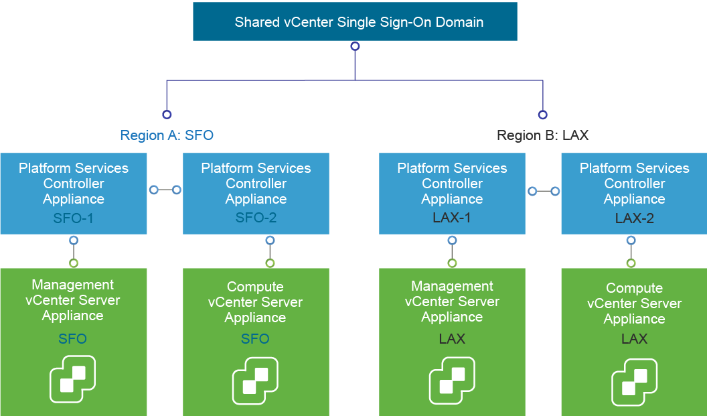

#### Platform Services Controller Design Decision Background

vCenter Server supports installation with an embedded Platform Services Controller (embedded deployment) or with an external Platform Services Controller.

-   In an embedded deployment, vCenter Server and the Platform Services Controller run on the same virtual machine. Embedded deployments are recommended for standalone environments with only one vCenter Server system. 

-   Environments with an external Platform Services Controller can have multiple vCenter Server systems. The vCenter Server systems can use the same Platform Services Controller services.  For example, several vCenter Server systems can use the same instance of vCenter Single Sign-On for authentication. 

-   If there is a need to replicate with other Platform Services Controller instances, or if the solution includes more than one vCenter Single Sign-On instance, you can deploy multiple external Platform Services Controller instances on separate virtual machines.

 

Table 35. Platform Service Controller Design Decisions

| Decision ID    | Design Decision                                                                                          | Design Justification                                                                                                                                                                      | Design Implication                                     |
|----------------|----------------------------------------------------------------------------------------------------------|-------------------------------------------------------------------------------------------------------------------------------------------------------------------------------------------|--------------------------------------------------------|
| SDDC-VI-VC-003 | Deploy vCenter Server with an external Platform Services Controller for the management clusters.         | External Platform Services Controllers support multiple vCenter Server systems for scalability.                                                                                           

                                                                                                                             External Platform Services Controllers are required for replication between Platform Services Controller instances.                                                                        | The number of VMs that have to be managed increases. . |
| SDDC-VI-VC-004 | Deploy vCenter Server with an external Platform Services Controller for the compute and edge clusters.   | External Platform Services Controllers support multiple vCenter Server systems for scalability.                                                                                           

                                                                                                                             External Platform Services Controllers are required for replication between Platform Services Controller instances.                                                                        | The number of VMs that have to be managed increases.   |
| SDDC-VI-VC-005 | Join all Platform Services Controller instances to a single vCenter Single Sign-On domain.               | When all Platform Services Controller instances are joined into a single vCenter Single Sign-On domain, they can share authentication and license data across all components and regions. | Only one Single Sign-On domain will exist.             |
| SDDC-VI-VC-006 | Do not deploy the Platform Services Controller in high availability mode with an external load balancer. | Setup with an external load balancer is complex and does not provide significant availability benefits in this configuration.                                                             | None.                                                  |

#### vCenter Server Identity

You must configure a static IP address and host name for all vCenter Server systems. The IP addresses must have valid (internal) DNS registration including reverse name resolution.

The vCenter Server systems must maintain network connections to the following components:

-   All VMware vSphere Client and vSphere Web Client user interfaces.

-   Systems running vCenter Server add-on modules.

-   Each ESXi host.

    1.  #### vCenter Server Redundancy

Protecting the vCenter Server system is important because it is the central point of management and monitoring for the SDDC. How you protect vCenter Server depends on maximum downtime tolerated, and on whether failover automation is required. 

The following table lists methods available for protecting the vCenter Server system and the vCenter Server Appliance.

Table 36. Methods for Protecting vCenter Server System and the vCenter Server Appliance

| Redundancy Method                                                            | Protects vCenter Server system (Windows)? | Protects Platform Services Controller (Windows)? | Protects vCenter Server (Appliance)? | Protects Platform Services Controller (Appliance)? |
|------------------------------------------------------------------------------|-------------------------------------------|--------------------------------------------------|--------------------------------------|----------------------------------------------------|
| Automated protection using vSphere HA.                                       | Yes                                       | Yes                                              | Yes                                  | Yes                                                |
| Manual configuration and manual failover. For example, using a cold standby. | Yes                                       | Yes                                              | Yes                                  | Yes                                                |
| HA Cluster with external load balancer                                       | Not Available                             | Yes                                              | Not Available                        | Yes                                                |

#### vCenter Server Appliance Sizing

The following tables outline minimum hardware requirements for the management vCenter Server appliance and the compute vCenter Server appliance.

Table 37. Logical Specification for Management vCenter Server Appliance

| Attribute                    | Specification                       |
|------------------------------|-------------------------------------|
| vCenter Server version       | 6.0 (vCenter Server Appliance)      |
| Physical or virtual system   | Virtual (appliance)                 |
| Appliance Size               | Small (up to 100 hosts / 1,000 VMs) |
| Platform Services Controller | External                            |
| Number of CPUs               | 2                                   |
| Memory                       | 16 GB                               |
| Disk Space                   | 136 GB                              |

Table 38. Logical Specification for Compute and Edge vCenter Server Appliance

| Attribute                    | Specification                          |
|------------------------------|----------------------------------------|
| vCenter Server version       | 6.0 (vCenter Server Appliance)         |
| Physical or virtual system   | Virtual (appliance)                    |
| Appliance Size               | Large (up to 1,000 hosts / 10,000 VMs) |
| Platform Services Controller | External                               |
| Number of CPUs               | 16                                     |
| Memory                       | 32 GB                                  |
| Disk Space                   | 295 GB                                 |

Table 39. vCenter Appliance Sizing Design Decisions

| Decision ID    | Design Decision                                                                       | Design Justification                                                                                                                      | Design Implication                                                                                               |
|----------------|---------------------------------------------------------------------------------------|-------------------------------------------------------------------------------------------------------------------------------------------|------------------------------------------------------------------------------------------------------------------|
| SDDC-VI-VC-007 | Configure the management vCenter Server Appliances with the small size setting.       | Based on the number of management VMs that are running, a vCenter Server Appliance installed with the small size setting is sufficient.   | If the size of the management environment changes, the vCenter Server Appliance size might need to be increased. |
| SDDC-VI-VC-008 | Configure the compute and edge vCenter Server Appliances with the large size setting. | Based on the number of compute and edge VMs that are running, a vCenter Server Appliance installed with the large size setting is needed. | As the compute environment grows, additional vCenter Server instances might be needed.                           |

#### Database Design

A vCenter Server Appliance can use either a built-in local PostgreSQL database or an external Oracle database. Both configurations support up to 1,000 hosts or 10,000 virtual machines.

Database Design Decision Background

A vCenter Server Windows installation can use either a supported external database or a local PostgreSQL database. The local PostgreSQL database is installed with vCenter Server and is limited to 20 hosts and 200 virtual machines. Supported external databases include Microsoft SQL Server 2008 R2, SQL Server 2012, SQL Server 2014, Oracle Database 11g, and Oracle Database 12c. External databases require a 64-bit DSN. DSN aliases are not supported.

vCenter Server Appliance can use either a local PostgreSQL database that is built into the appliance, which is recommended, or an external database.  Supported external databases include Oracle Database 11g and Oracle Database 12c. External database support is being deprecated in this release; this is the last release that supports the use of an external database with vCenter Server Appliance.

Unlike a vCenter Windows installation, a vCenter Server Appliance that uses a local PostgreSQL database supports up to 1,000 hosts or 10,000 virtual machines at full vCenter Server scale.

Table 40. vCenter Database Design Decisions

| Decision ID    | Design Decision                                                               | Design Justification                                                                                                                                                                         | Design Implication                                                                              |
|----------------|-------------------------------------------------------------------------------|----------------------------------------------------------------------------------------------------------------------------------------------------------------------------------------------|-------------------------------------------------------------------------------------------------|
| SDDC-VI-VC-009 | Set up all vCenter Server instances to use the embedded PostgreSQL databases. | Reduces both overhead and Microsoft or Oracle licensing costs. Avoids problems with upgrades. Support for external databases is deprecated for vCenter Server Appliance in the next release. | The vCenter Server Appliance has limited database management tools for database administrators. |

#### vSphere Cluster Design

The cluster design must take into account the workload that the cluster handles. Different cluster types in this design have different characteristics.  

vSphere Cluster Design Decision Background 

The following heuristics help with cluster design decisions. 

-   Decide to use fewer, larger hosts or more, smaller hosts.  

<!-- -->

-   A scale-up cluster has fewer, larger hosts.

-   A scale-out cluster has more, smaller hosts.

-   A virtualized server cluster typically has more hosts with fewer virtual machines per host.

<!-- -->

-   Compare the capital costs of purchasing fewer, larger hosts with the costs of purchasing more, smaller hosts. Costs vary between vendors and models.

-   Evaluate the operational costs of managing a few hosts with the costs of managing more hosts.

-   Consider the purpose of the cluster.

-   Consider the total number of hosts and cluster limits.

 

Figure 33. vCenter Logical Cluster Layout

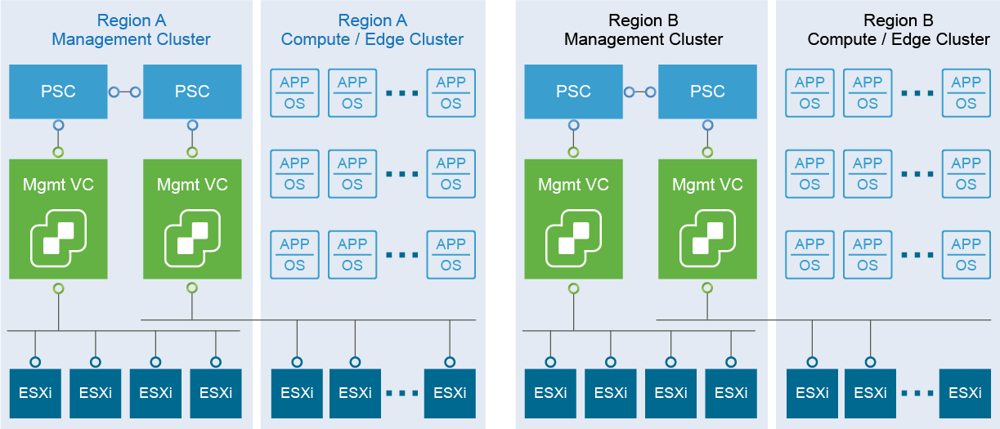

#### vSphere High Availability Design

VMware vSphere High Availability (vSphere HA) protects your virtual machines in case of host failure by restarting virtual machines on other hosts in the cluster when a host fails.

During configuration of the cluster, the hosts elect a master host. The master host communicates with the vCenter Server system and monitors the virtual machines and secondary hosts in the cluster.

The master hosts detects different types of failure:

-   Host failure, for example an unexpected power failure

-   Host network isolation or connectivity failure

-   Loss of storage connectivity

-   Problems with virtual machine OS availability

Table 41. vSphere HA Design Decisions

| Decision ID    | Design Decision                                          | Design Justification                                                                                           | Design Implication                                                                                                                                |
|----------------|----------------------------------------------------------|----------------------------------------------------------------------------------------------------------------|---------------------------------------------------------------------------------------------------------------------------------------------------|
| SDDC-VI-VC-010 | Use vSphere HA to protect all clusters against failures. | vSphere HA supports a robust level of protection for both host and virtual machine availability.               | Sufficient resources on the remaining host are required to so that virtual machines can be migrated to those hosts in the event of a host outage. |
| SDDC-VI-VC-011 | Set vSphere HA Host Isolation Response to Power Off.     | Virtual SAN requires that the HA Isolation Response be set to Power Off and to restart VMs on available hosts. | VMs are powered off in case of a false positive and a host is declared isolated incorrectly.                                                      |

#### vSphere HA Admission Control Policy Configuration

The vSphere HA Admission Control Policy allows an administrator to configure how the cluster judges available resources. In a smaller vSphere HA cluster, a larger proportion of the cluster resources are reserved to accommodate host failures, based on the selected policy. The following policies are available:

-   Host failures the cluster tolerates. vSphere HA ensures that a specified number of hosts can fail and sufficient resources remain in the cluster to fail over all the virtual machines from those hosts.

-   Percentage of cluster resources reserved. vSphere HA ensures that a specified percentage of aggregate CPU and memory resources are reserved for failover.

-   Specify Failover Hosts. When a host fails, vSphere HA attempts to restart its virtual machines on any of the specified failover hosts. If restart is not possible, for example the failover hosts have insufficient resources or have failed as well, then vSphere HA attempts to restart the virtual machines on other hosts in the cluster.

    1.  #### vSphere Cluster Workload Design

This design defines the following vSphere clusters and the workloads that they handle.

Table 42. vSphere Cluster Workload Design Decisions

| Decision ID    | Design Decision                                                                                                             | Design Justification                                                                                   | Design Implication                                                                               |
|----------------|-----------------------------------------------------------------------------------------------------------------------------|--------------------------------------------------------------------------------------------------------|--------------------------------------------------------------------------------------------------|
| SDDC-VI-VC-012 | Create a single management cluster containing all management hosts.                                                         | This design simplifies configuration and minimizes the number of hosts required to support vSphere HA.

                                                                                                                                                You can add ESXi hosts to the cluster as needed.                                                        | Management of multiple clusters and vCenter Server instances increases operational overhead.     |
| SDDC-VI-VC-013 | Create an edge cluster that hosts NSX Controller instances and associated NSX Edge gateway devices used by the compute pod. | This separates workload traffic on the compute cluster from management traffic, and protects both.     

                                                                                                                                                 The Compute vCenter Server system manages the compute clusters.                                        | Management of multiple clusters and vCenter Server instances increases operational overhead.     

                                                                                                                                                                                                                                                         The size and number hosts in compute clusters should be based on environment scale requirements.  |
| SDDC-VI-VC-014 | Create separate compute clusters based on the initial tenant workload requirements of your environment.                     | This separates workload traffic on the compute cluster from management traffic, and protects both.     

                                                                                                                                                The Compute vCenter Server system manages the compute clusters.                                         | Management of multiple clusters and vCenter Server instances increases operational overhead.     

                                                                                                                                                                                                                                                         The size and number hosts in compute clusters should be based on environment scale requirements.  |

#### Management Cluster Design

The management cluster design determines the management cluster configuration.

Table 43. Management Cluster Design Decisions

| Decision ID    | Design Decision                                                                                                                                        | Design Justification                                                                                                                                                                                                              | Design Implication                                                                                     |
|----------------|--------------------------------------------------------------------------------------------------------------------------------------------------------|-----------------------------------------------------------------------------------------------------------------------------------------------------------------------------------------------------------------------------------|--------------------------------------------------------------------------------------------------------|
| SDDC-VI-VC-015 | Create a management cluster with 4 hosts. Cluster redundancy is n+2 protection for vSphere HA which covers outage redundancy during maintenance tasks. | Two hosts is generally considered enough to support the management components. One host supports failover in case of a hardware defect. One more host allows failover if a second host is unavailable for scheduled maintenance.  | Calculate reserved amounts when cluster size increases to prevent overprotection.                      

                                                                                                                                                                                                                                                                                                                                                                                                               Additional host resources are required for redundancy.                                                  |
| SDDC-VI-VC-016 | Set vSphere HA for the management cluster to reserve 25% of cluster resources for failover.                                                            | Using the percentage- based reservation works well in situations where virtual machines have varying and sometime significant CPU or memory reservations.                                                                         | If additional hosts are added to the cluster, more resources are being reserved for failover capacity.

                                                                                                                                                                                                                                                                                                                                                                                                               Recalculate the percentage of reserved resources when additional hosts are added to the cluster.        |

Management Cluster Logical Design Background

The following table summarizes the attributes of the management cluster logical design.

Table 44. Management Cluster Attributes

| Attribute                                                                                                                                                               | Specification          |
|-------------------------------------------------------------------------------------------------------------------------------------------------------------------------|------------------------|
| Number of hosts required to support management hosts with no overcommitment                                                                                             | 2                      |
| Number of hosts recommended due to operational constraints (Ability to take a host offline without sacrificing High Availability capabilities)                          | 3                      |
| Number of hosts recommended due to operational constraints, while using Virtual SAN (Ability to take a host offline without sacrificing High Availability capabilities) | 4                      |
| Capacity for host failures per cluster                                                                                                                                  | 25% reserved CPU & RAM |
| Number of usable hosts per cluster                                                                                                                                      | 3 usable hosts         |

#### Edge Cluster Design

Each time a new Compute vCenter Server system is added to the environment, you must create a dedicated edge cluster for the NSX Controller instances.

Table 45. Edge Cluster Design Decisions

| Decision ID    | Design Decision                                                                              | Design Justification                                                                                                                                                                                   | Design Implication                                                                                                                                                                   |
|----------------|----------------------------------------------------------------------------------------------|--------------------------------------------------------------------------------------------------------------------------------------------------------------------------------------------------------|--------------------------------------------------------------------------------------------------------------------------------------------------------------------------------------|
| SDDC-VI-VC-017 | Create a dedicated edge cluster for NSX Controller instances and NSX Edge gateway devices.   | NSX Manager requires a 1:1 relationship with a vCenter Server system.                                                                                                                                  | Each time you provision a Compute vCenter Server system, you must create a dedicated edge cluster with 3 hosts for the NSX Controller instances. The hosts are part of the edge pod.

                                                                                                                                                                                                                                                                                                                          Set anti-affinity rules to keep each controller on separate hosts. A 4-node cluster allows maintenance while ensuring that the 3 controllers remain on separate hosts.                |
| SDDC-VI-VC-018 | Set vSphere HA for the edge cluster to reserve 25% of cluster resources for failover.        

                                                                                                                | vSphere HA protects the NSX Controller instances and edge services gateway devices in the event of a host failure. vSphere HA powers on virtual machines from the failed hosts on any remaining hosts. | If one of the hosts becomes unavailable, two controllers run on a single host.                                                                                                       |
| SDDC-VI-VC-019 | Create edge clusters with a minimum of 3 hosts.                                              | 3 NSX Controller nodes are required for sufficient redundancy and majority decisions from the controllers.                                                                                             

                                                                                                                 One more host is available for failover and to allow for scheduled maintenance.                                                                                                                         | 4 hosts prevent degradation in Virtual SAN availability.                                                                                                                             |
| SDDC-VI-VC-020 | Set up VLAN-backed port groups for external access and management on the edge cluster hosts. | Edge gateways need access to the external network in addition to the management network.                                                                                                               | VLAN-backed port groups must be configured with the correct number of ports, or with elastic port allocation.                                                                        |

Edge Cluster Logical Design Background

The following table summarizes the attributes of the edge cluster logical design. The number of VMs on the Edge will start low but will grow quickly as demand for Edge devices increases in the compute cluster.

Table 46. Edge Cluster Attributes

| Attribute                                            | Specification |
|------------------------------------------------------|---------------|
| Number of hosts required to support the edge cluster | 4             |
| Approximate number of virtual machines per cluster   | 5             |
| Capacity for host failures per cluster               | 1             |
| Number of usable hosts per cluster                   | 2             |

#### Compute Cluster Design

Tenant workloads run on the ESXi hosts in the compute cluster instances. Multiple compute clusters are managed by a single Compute vCenter Server instance. 

Table 47. Compute Cluster Design Decisions

| Decision ID    | Design Decision                                                                                                                                                    | Design Justification                                                                                                     | Design Implication                                                                                   |
|----------------|--------------------------------------------------------------------------------------------------------------------------------------------------------------------|--------------------------------------------------------------------------------------------------------------------------|------------------------------------------------------------------------------------------------------|
| SDDC-VI-VC-021 | The hosts in each compute cluster are contained within a single rack.                                                                                              | The spine-and-leaf architecture dictates that all hosts in a cluster must be connected to the same top-of-rack switches. | Fault domains are limited to each rack.                                                              |
| SDDC-VI-VC-022 | Configure vSphere HA to use percentage-based failover capacity to ensure n+1 availability. The exact setting depend on the number of hosts in the compute cluster. | Using explicit host failover limits the total available resources in a cluster.                                          | As the number of hosts in the cluster changes, the percentage of failover capacity must be adjusted. |

#### vCenter Server Customization

vCenter Server supports a rich set of customization options, including monitoring, virtual machine fault tolerance, and so on. For each feature, this VMware Validated Design specifies the design decisions. 

#### VM and Application Monitoring Service

When VM  and Application Monitoring is enabled, the VM and Application Monitoring service, which uses VMware Tools, evaluates whether each virtual machine in the cluster is running. The service checks for regular heartbeats and I/O activity from the VMware Tools process running on guests. If the service receives no heartbeats or I/O activity, it is likely that the guest operating system has failed or that VMware Tools is not being allocated time for heartbeats or I/O activity. In this case, the service determines that the virtual machine has failed and reboots the virtual machine.

Enable Virtual Machine Monitoring for automatic restart of a failed virtual machine. The application or service that is running on the virtual machine must be capable of restarting successfully after a reboot or the VM restart is not sufficient.

Table 48. Monitor Virtual Machines Design Decisions

| Decision ID    | Design Decision                                     | Design Justification                                                                    | Design Implication                                           |
|----------------|-----------------------------------------------------|-----------------------------------------------------------------------------------------|--------------------------------------------------------------|
| SDDC-VI-VC-023 | Enable Virtual Machine Monitoring for each cluster. | Virtual Machine Monitoring provides adequate in-guest protection for most VM workloads. | There is no downside to enabling Virtual Machine Monitoring. |

#### VMware vSphere Distributed Resource Scheduling (DRS)

vSphere Distributed Resource Scheduling provides load balancing of a cluster by migrating workloads from heavily loaded hosts to less utilized hosts in the cluster. DRS supports manual and automatic modes.

-   **Manual**. Recommendations are made but an administrator needs to confirm the changes

-   **Automatic**. Automatic management can be set to five different levels. At the lowest setting, workloads are placed automatically at power on and only migrated to fulfil certain criteria, such as entering maintenance mode. At the highest level, any migration that would provide a slight improvement in balancing will be executed.

Table 49. vSphere Distributed Resource Scheduling Design Decisions

| Decision ID    | Design Decision                                                                        | Design Justification                                                                                                | Design Implication                                                                                                  |
|----------------|----------------------------------------------------------------------------------------|---------------------------------------------------------------------------------------------------------------------|---------------------------------------------------------------------------------------------------------------------|
| SDDC-VI-VC-024 | Enable DRS on all clusters and set it to automatic, with the default setting (medium). | The default settings provide the best trade-off between load balancing and excessive migration with vMotion events. | In the event of a vCenter outage, mapping from virtual machines to ESXi hosts might be more difficult to determine. |

#### Enhanced vMotion Compatibility (EVC)

EVC works by masking certain features of newer CPUs to allow migration between hosts containing older CPUs. EVC works only with CPUs from the same manufacturer and there are limits to the version difference gaps between the CPU families.

If you set EVC during cluster creation, you can add hosts with newer CPUs at a later date without disruption. You can use EVC for a rolling upgrade of all hardware with zero downtime.

Set EVC to the highest level possible with the current CPUs in use.

Table 50. VMware Enhanced vMotion Compatibility Design Decisions

| Decision ID    | Design Decision                                                                      | Design Justification                                      | Design Implication                                                                |
|----------------|--------------------------------------------------------------------------------------|-----------------------------------------------------------|-----------------------------------------------------------------------------------|
| SDDC-VI-VC-025 | Enable Enhanced vMotion Compatibility on all clusters.                               

                  Set EVC mode to the lowest available setting supported for the hosts in the cluster.  | Allows cluster upgrades without virtual machine downtime. | You can enable EVC only if clusters contain hosts with CPUs from the same vendor. |

#### Use of Transport Layer Security (TLS) Certificates

By default vSphere 6.0 uses TLS/SSL certificates that are signed by VMCA (VMware Certificate Authority).  By default, these certificates are not trusted by end-user devices or browsers. It is a security best practice to replace at least user-facing certificates with certificates that are signed by a third-party or enterprise Certificate Authority (CA). Certificates for machine-to-machine communication can remain as VMCA-signed certificates.

Table 51. vCenter Server TLS Certificate Design Decisions

| Decision ID    | Design Decision                                                                                                                                                       | Design Justification                                                                                                                                                                                                                             | Design Implication                                              |
|----------------|-----------------------------------------------------------------------------------------------------------------------------------------------------------------------|--------------------------------------------------------------------------------------------------------------------------------------------------------------------------------------------------------------------------------------------------|-----------------------------------------------------------------|
| SDDC-VI-VC-026 | Replace the vCenter Server machine certificate and Platform Services Controller machine certificate with a certificate signed by a custom Certificate Authority (CA). | Infrastructure administrators connect to both vCenter Server and the Platform Services Controller via web browser to perform configuration, management and troubleshooting activities. Certificate warnings result with the default certificate. | Replacing and managing certificates is an operational overhead. |

 

### Virtualization Network Design

A well-designed network helps the organization meet its business goals. It prevents unauthorized access, and provides timely access to business data.

This network virtualization design uses vSphere and VMware NSX for vSphere to implement virtual networking. 

#### Virtual Network Design Background Considerations

This VMware Validated Design follows high-level network design guidelines and networking best practices. 

The high-level design goals apply regardless of your environment. 

-   **Meet diverse needs**. The network must meet the diverse needs of many different entities in an organization. These entities include applications, services, storage, administrators, and users.

-   **Reduce costs**. Reducing costs is one of the simpler goals to achieve in the vSphere infrastructure. Server consolidation alone reduces network costs by reducing the number of required network ports and NICs, but a more efficient network design is desirable. For example, configuring two 10 GbE NICs with VLANs might be more cost effective than configuring a dozen 1 GbE NICs on separate physical networks.

-   **Boost performance**. You can achieve performance improvement and decrease the time that is required to perform maintenance by providing sufficient bandwidth, which reduces contention and latency.

-   **Improve availability**. A well-designed network improves availability, typically by providing network redundancy.

-   **Support security**. A well-designed network supports an acceptable level of security through controlled access (where required) and isolation (where necessary).

-   **Enhance infrastructure functionality**. You can configure the network to support vSphere features such as vSphere vMotion, vSphere High Availability, and vSphere Fault Tolerance.

Follow networking best practices throughout your environment. 

-   Separate network services from one another to achieve greater security and better performance.

-   Dedicate a separate physical NIC to a group of virtual machines, or use Network I/O Control and traffic shaping to guarantee bandwidth to the virtual machines. This separation also enables distributing a portion of the total networking workload across multiple CPUs. The isolated virtual machines can then better handle application traffic, for example, from a Web client.

-   To physically separate network services and to dedicate a particular set of NICs to a specific network service, create a vSphere Standard Switch or vSphere Distributed Switch for each service. If this is not possible, separate network services on a single switch by attaching them to port groups with different VLAN IDs. In either case, verify with your network administrator that the networks or VLANs that you choose are isolated from the rest of your environment and that no routers connect them.

-   Keep vSphere vMotion traffic on a separate network. When migration with vMotion occurs, the contents of the guest operating system’s memory is transmitted over the network. You can put vSphere vMotion on a separate network either by using VLANs to segment a single physical network or by using separate physical networks. Separate physical networks are preferable.

-   When using passthrough devices with a Linux kernel version 2.6.20 or earlier guest OS, avoid MSI and MSI-X modes because these modes have significant performance impact.

-   To protect the most sensitive virtual machines, deploy firewalls in virtual machines that route between virtual networks with uplinks to physical networks and pure virtual networks with no uplinks.

-   For best performance, use VMXNET3 virtual NICs.

-   Ensure that physical network adapters that are connected to the same vSphere Standard Switch or vSphere Distributed Switch are also connected to the same physical network.

-   Configure all VMkernel network adapters with the same MTU. When several VMkernel network adapters are connected to distributed switches, but those network adapters have different MTUs configured, network connectivity problems might result.

    1.  #### Network Segmentation and VLANs

Separating different types of traffic is required to reduce contention and latency. Separate networks are also required for access security.

High latency on any network can negatively affect performance. Some components are more sensitive to high latency than others. For example, reducing latency is important on IP storage and the vSphere Fault Tolerance logging network because latency on these networks can negatively affect the performance of multiple virtual machines.

Depending on the application or service, high latency on specific virtual machine networks can also negatively affect performance. Use information gathered from the current state analysis and key stakeholder and SME interviews to determine which workloads and networks are especially sensitive to high latency.

1.  Configuring separate networks requires additional monitoring and administration.

    1.  #### Virtual Networks

Determine the number of networks or VLANs that are required depending on the type of traffic:

-   vSphere operational traffic

-   Traffic that supports the organization’s services and applications

Table 52. **Virtual Network Design Decisions**

| Decision ID     | Design Decision                                  | Design Justification                                                                                                                                                     | Design Implication                                                                                      |
|-----------------|--------------------------------------------------|--------------------------------------------------------------------------------------------------------------------------------------------------------------------------|---------------------------------------------------------------------------------------------------------|
| SDDC-VI-Net-001 | Use VLANs to segment physical network functions. | Segregation is needed for the different network functions that are required in the SDDC. This allows for differentiated services and prioritization of traffic as needed | Uniform configuration and presentation is required on all the trunks made available to the ESX Servers. |
| SDDC-VI-Net-002 | Use a leaf-and-spine network architecture.       | A leaf-and-spine network design can scale out as required without introducing bottlenecks or extra complexity                                                            | Requires more uplinks on the ToR switches as the spine scales out.                                      |

#### Virtual Switches

Virtual switches simplify the configuration process by providing one single pane of glass view for performing virtual network management tasks.

Virtual Switch Design Background

A vSphere Distributed Switch (distributed switch) offers several enhancements over standard virtual switches.

-   **Centralized management**. Because distributed switches are created and managed centrally on a vCenter Server system, they make the switch configuration more consistent across ESXi hosts. Centralized management saves time, reduces mistakes, and lowers operational costs.

-   **Additional features**. Distributed switches offer features that are not available on standard virtual switches. Some of these features can be useful to the applications and services that are running in the organization’s infrastructure. For example, NetFlow and port mirroring provide monitoring and troubleshooting capabilities to the virtual infrastructure.

Consider the following caveats for distributed switches. 

-   Distributed switches require a VMware vSphere Enterprise Plus Edition license.

-   Distributed switches are not manageable when vCenter Server is unavailable. vCenter Server therefore becomes a tier one application.

-   You must consider scaling maximums for distributed switches.

Health Check

The health check service helps identify and troubleshoot configuration errors in vSphere distributed switches.

Health check helps identify the following common configuration errors:

-   Mismatched VLAN trunks between a vSphere distributed switch and physical switch.

-   Mismatched MTU settings between physical network adapters, distributed switches, and physical switch ports.

-   Mismatched virtual switch teaming policies for the physical switch port-channel settings.

Health check monitors VLAN, MTU, and teaming policies: 

-   **VLANs**. Checks whether the VLAN settings on the distributed switch match the trunk port configuration on the connected physical switch ports.

-   **MTU**. For each VLAN, checks whether the physical access switch port MTU jumbo frame setting matches the distributed switch MTU setting.

-   **Teaming policies**. Checks whether the connected access ports of the physical switch that participate in an EtherChannel are paired with distributed ports whose teaming policy is IP hash.

Health check is limited to the access switch port to which the distributed switch uplink connects.

1.  For VLAN and MTU checks, at least two link-up physical uplink NICs for the distributed switch are required. For a teaming policy check, at least two link-up physical uplink NICs and two hosts are required when applying the policy. 

Number of Virtual Switches

Create fewer virtual switches, preferably just one, following these guidelines:

-   For each type of network traffic, configure a single virtual switch with a port group to simplify configuration and monitoring.

-   If the organization has a policy that requires that virtual machine–to–virtual machine traffic must pass through a physical firewall, the infrastructure must include multiple virtual switches.

Table 53. **Virtual Switch Design Decisions**

| Decision ID     | Design Decision                                               | Design Justification                      | Design Implication                                                                            |
|-----------------|---------------------------------------------------------------|-------------------------------------------|-----------------------------------------------------------------------------------------------|
| SDDC-VI-Net-003 | Use distributed switches (vSphere Distributed Switch or VDS). | Distributed switches simplify management. | Migration from a VSS to a VDS requires a minimum of two physical NICs to maintain redundancy. |
| SDDC-VI-Net-004 | Use a single VDS per cluster.                                 | Reduces complexity of the network design. | None.                                                                                         |

Management Cluster Distributed Switches

The management cluster uses a single vSphere Distributed Switch with the configuration settings shown in this section. 

Table 54. **Virtual Switches for Management Cluster Hosts**

| vSphere Distributed Switch Name | Function                                    | Network I/O Control | LACP lag group | LACP Mode | LACP Load Balancing Mode                                 | Number of Physical NIC Ports | MTU         |
|---------------------------------|---------------------------------------------|---------------------|----------------|-----------|----------------------------------------------------------|------------------------------|-------------|
| vDS-Mgmt                        | ESXi management                             

                                   Network  IP Storage (NFS)                    

                                   Virtual SAN                                  

                                   vSphere vMotion                              

                                   VXLAN Tunnel Endpoint (VTEP)                 

                                   vSphere Replication/vSphere Replication NFC  

                                   External management connectivity             | Enabled             | lag1           | Active    | Source and destination IP address, TCP/UDP port and VLAN | 2                            | Jumbo Frame |

Table 55. **vDS-Mgmt Port Group Configuration Settings**

| Parameter          | Setting                                            |
|--------------------|----------------------------------------------------|
| Load balancing     | Route based on the originating virtual port        
                      (The vDS LACP LAG setting overrides this setting.)  |
| Failover detection | Link status only                                   |
| Notify switches    | Enabled                                            |
| Failback           | No                                                 |
| Failover order     | Active uplinks: lag1                               
                      Unused uplinks: Uplink1, Uplink2                    |

 

Figure 34. **Network Switch Design for Management Hosts**

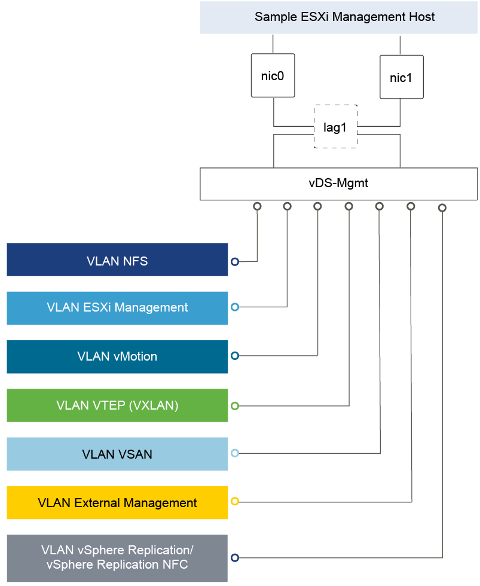

 

This section expands on the logical network design by providing details on the physical NIC layout and physical network attributes.

Table 56. **Management Virtual Switches by Physical/Virtual NIC**

| vSphere Distributed Switch | vmnic | Load Balancing                           | Function   |
|----------------------------|-------|------------------------------------------|------------|
| vDS-Mgmt                   | 0     | Default (Overridden by LACP LAG setting) | LAG Member |
| vDS-Mgmt                   | 1     | Default (Overridden by LACP LAG setting) | LAG Member |

Table 57. **Management Virtual Switch Port Groups and VLANs**

| vSphere Distributed Switch | Port Group Name      | Teaming                                  | Active Uplinks | VLAN ID |
|----------------------------|----------------------|------------------------------------------|----------------|---------|
| vDS-Mgmt                   | vDS-Mgmt-Management  | Default (Overridden by LACP LAG setting) | 0, 1           | 1611    |
| vDS-Mgmt                   | vDS-Mgmt-vMotion     | Default (Overridden by LACP LAG setting) | 0, 1           | 1612    |
| vDS-Mgmt                   | vDS-Mgmt-VSAN        | Default (Overridden by LACP LAG setting) | 0, 1           | 1613    |
| vDS-Mgmt                   | vDS-Mgmt-VTEP        | Default (Overridden by LACP LAG setting) | 0, 1           | 1614    |
| vDS-Mgmt                   | vDS-Mgmt-NFS         | Default (Overridden by LACP LAG setting) | 0, 1           | 1615    |
| vDS-Mgmt                   | vDS-Mgmt-Replication | Default (Overridden by LACP LAG setting) | 0, 1           | 1616    |
| vDS-Mgmt                   | vDS-VMNet-ExtMgmt    | Default (Overridden by LACP LAG setting) | 0, 1           | 130     |

Table 58. **Management VMkernel Adapter**

| vSphere Distributed Switch | Network Label | Connected Port Group | Enabled Services   | MTU            |
|----------------------------|---------------|----------------------|--------------------|----------------|
| vDS-Mgmt                   | Management    | vDS-Mgmt-Management  | Management Traffic | 1500 (Default) |
| vDS-Mgmt                   | vMotion       | vDS-Mgmt-vMotion     | vMotion Traffic    | 9000           |
| vDS-Mgmt                   | VTEP          | vDS-Mgmt-VTEP        | -                  | 9000           |
| vDS-Mgmt                   | VSAN          | vDS-Mgmt-VSAN        | VSAN               | 9000           |

For more information on the physical network design specifications, see the *Physical Network Design* section.

Edge Cluster Distributed Switches

The edge cluster uses a single vSphere Distributed Switch with the configuration settings shown in this section.

Table 59. **Virtual Switches for Edge Cluster Hosts**

| vSphere Distributed Switch Name | Function                              | Network I/O Control | LACP lag group | LACP Mode | LACP Load Balancing Mode                                 | Number of Physical NIC Ports | MTU  |
|---------------------------------|---------------------------------------|---------------------|----------------|-----------|----------------------------------------------------------|------------------------------|------|
| vDS-Edge                        | ESXi management                       

                                   Network  IP Storage (NFS)              

                                   vSphere vMotion                        

                                   VXLAN Tunnel Endpoint (VTEP)           

                                   Virtual SAN                            

                                   External customer/tenant connectivity  | Enabled             | lag1           | Active    | Source and destination IP address, TCP/UDP port and VLAN | 2                            | 9000 |

Table 60. **vDS-Edge Port Group Configuration Settings**

| Parameter          | Setting                                        |
|--------------------|------------------------------------------------|
| Load balancing     | Route based on the originating virtual port    
                      (vDS LACP LAG setting overrides this setting.)  |
| Failover detection | Link status only                               |
| Notify switches    | Enabled                                        |
| Failback           | No                                             |
| Failover order     | Active uplinks: lag1                           
                      Unused uplinks: Uplink1, Uplink2                |

Figure 35. **Network Switch Design for Edge Hosts**

 

This section expands on the logical network design by providing details on the physical NIC layout and physical network attributes.

Table 61. **Edge Cluster Virtual Switches by Physical/Virtual NIC**

| vSphere Distributed Switch | vmnic | Load Balancing                           | Function   |
|----------------------------|-------|------------------------------------------|------------|
| vDS-Edge                   | 0     | Default (Overridden by LACP LAG setting) | LAG Member |
| vDS-Edge                   | 1     | Default (Overridden by LACP LAG setting) | LAG Member |

Table 62. **Edge Cluster Virtual Switch Port Groups and VLANs**

| vSphere Distributed Switch | Port Group Name     | Teaming                                  | Active Uplinks | VLAN ID |
|----------------------------|---------------------|------------------------------------------|----------------|---------|
| vDS-Edge                   | vDS-Edge-Management | Default (Overridden by LACP LAG setting) | 0, 1           | 1631    |
| vDS-Edge                   | vDS-Edge-vMotion    | Default (Overridden by LACP LAG setting) | 0, 1           | 1632    |
| vDS-Edge                   | vDS-Edge-VSAN       | Default (Overridden by LACP LAG setting) | 0, 1           | 1633    |
| vDS-Edge                   | vDS-Edge-VTEP       | Default (Overridden by LACP LAG setting) | 0, 1           | 1634    |
| vDS-Edge                   | vDS-VMNet-Cust01    | Default (Overridden by LACP LAG setting) | 0, 1           | 140     |
| vDS-Edge                   | vDS-VMNet-Cust02    | Default (Overridden by LACP LAG setting) | 0, 1           | 141     |
| vDS-Edge                   | vDS-VMNet-Cust03    | Default (Overridden by LACP LAG setting) | 0, 1           | 142     |

Table 63. **Edge Cluster VMkernel Adapter**

| vSphere Distributed Switch | Network Label | Connected Port Group | Enabled Services   | MTU            |
|----------------------------|---------------|----------------------|--------------------|----------------|
| vDS-Edge                   | Management    | vDS-Edge-Management  | Management Traffic | 1500 (Default) |
| vDS-Edge                   | vMotion       | vDS-Edge-vMotion     | vMotion Traffic    | 9000           |
| vDS-Edge                   | VTEP          | vDS-Edge-VTEP        | -                  | 9000           |
| vDS-Edge                   | VSAN          | vDS-Edge-VSAN        | VSAN               | 9000           |

For more information on the physical network design, see the *Physical Network Design* section.

Compute Cluster Distributed Switches

The compute cluster vSphere Distributed Switch uses the configuration settings shown in this section.

Table 64. **Virtual Switches for Compute Cluster Hosts**

| vSphere Distributed Switch Name | Function                     | Network I/O Control | LACP lag group | LACP Mode | LACP Load Balancing Mode                                 | Number of Physical NIC Ports | MTU  |
|---------------------------------|------------------------------|---------------------|----------------|-----------|----------------------------------------------------------|------------------------------|------|
| vDS-Comp                        | ESXi Management              

                                   Network  IP Storage (NFS)     

                                   Virtual SAN                   

                                   vSphere vMotion               

                                   VXLAN Tunnel Endpoint (VTEP)  

                                                                 | Enabled             | lag1           | Active    | Source and destination IP address, TCP/UDP port and VLAN | 2                            | 9000 |

Table 65. **vDS-Comp Port Group Configuration Settings**

| Parameter          | Setting                                        |
|--------------------|------------------------------------------------|
| Load balancing     | Route based on the originating virtual port    
                      (vDS LACP LAG setting overrides this setting.)  |
| Failover detection | Link status only                               |
| Notify switches    | Enabled                                        |
| Failback           | No                                             |
| Failover order     | Active uplinks: lag1                           
                      Unused uplinks: Uplink1, Uplink2                |

Figure 36. **Network Switch Design for Compute Hosts**

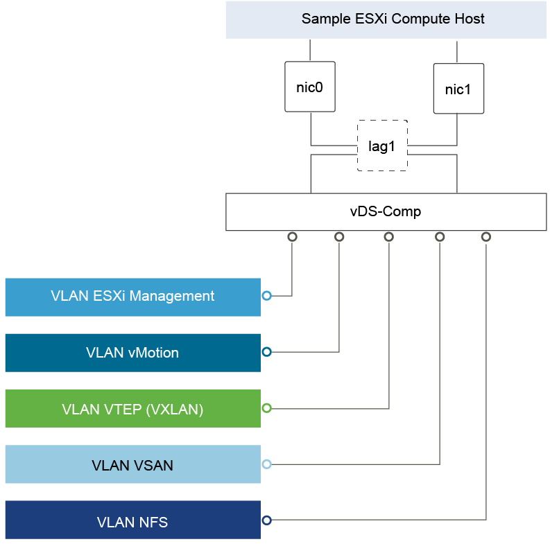

 

This section expands on the logical network design by providing details on the physical NIC layout and physical network attributes.

Table 66. **Compute Cluster Virtual Switches by Physical/Virtual NIC**

| vSphere Distributed Switch | vmnic | Load Balancing                           | Function   |
|----------------------------|-------|------------------------------------------|------------|
| vDS-Comp                   | 0     | Default (Overridden by LACP LAG setting) | LAG Member |
| vDS-Comp                   | 1     | Default (Overridden by LACP LAG setting) | LAG Member |

Table 67. **Compute Cluster Virtual Switch Port Groups and VLANs**

| vSphere Distributed Switch | Port Group Name     | Teaming                                  | Active Uplinks | VLAN ID |
|----------------------------|---------------------|------------------------------------------|----------------|---------|
| vDS-Comp                   | vDS-Comp-Management | Default (Overridden by LACP LAG setting) | 0, 1           | 1621    |
| vDS-Comp                   | vDS-Comp-vMotion    | Default (Overridden by LACP LAG setting) | 0, 1           | 1622    |
| vDS-Comp                   | vDS-Comp-VSAN       | Default (Overridden by LACP LAG setting) | 0, 1           | 1623    |
| vDS-Comp                   | vDS-Comp-VTEP       | Default (Overridden by LACP LAG setting) | 0, 1           | 1624    |
| vDS-Comp                   | vDS-Comp-NFS        | Default (Overridden by LACP LAG setting) | 0, 1           | 1625    |

Table 68. **Compute Cluster VMkernel Adapter**

| vSphere Distributed Switch | Network Label | Connected Port Group | Enabled Services     | MTU            |
|----------------------------|---------------|----------------------|----------------------|----------------|
| vDS-Comp                   | Management    | vDS-Comp-Management  | Management traffic   | 1500 (Default) |
| vDS-Comp                   | vMotion       | vDS-Comp-vMotion     | vMotion traffic      | 9000           |
| vDS-Comp                   | VTEP          | vDS-Comp-VTEP        | -                    | 9000           |
| vDS-Comp                   | NFS           | vDS-Comp-NFS         | -                    | 9000           |
| vDS-Comp                   | VSAN          | vDS-Comp-VSAN        | Virtual SAN traffic  | 9000           |

For more information on the physical network design specifications, see the *Physical Network Design* section.

#### NIC Teaming

You can use NIC teaming to increase the network bandwidth available in a network path, and provide the redundancy that supports higher availability.

NIC teaming helps avoid a single point of failure and provides options for load balancing of traffic. To further reduce the risk from a single point of failure, build NIC teams by using ports from multiple NIC and motherboard interfaces.

In a NIC team configuration:

-   At least two NICs must be exclusively assigned to a virtual switch. 

-   All NICs in the same port group must be in the same Layer 2 broadcast domain.

Create a single virtual switch with teamed NICs across separate physical switches, unless the organization has policies that require physical separation between networks, for example, management and production networks.

1.  With VMware Virtual SAN, network adapter teaming is used for high availability, but not for load balancing.

This VMware Validated Design uses an active-active configuration with a route that is based on physical adapter load for teaming. In this configuration, idle network cards do not wait for a failure to occur, and they aggregate bandwidth. The Virtual SAN VMkernel adapter does not currently leverage this mechanism but this is mitigated by the fact that the SDDC design is using LACP for bandwidth aggregation.

NIC Teaming Design Background

For a predictable level of performance, VMware recommends the use of multiple network adapters in one of the following configurations: 

-   An active-passive configuration that uses explicit failover when connected to two separate switches; in other words non-clustered switches.

-   An active-active configuration in which the physical network uses a Link Aggregation Control Protocol (LACP) port channel configuration or in which the NICs are attached to a single switch or switch cluster. This configuration requires one of the following teaming algorithms:

<!-- -->

-   Route based on IP hash

-   Route based on physical network adapter load

-   Route based on the originating virtual port ID

VMware recommends that configurations use an active-active configuration with a route that is based on physical adapter load for the teaming in the environment.

Table 69. **NIC Teaming and Policy**

| **Design Quality** | **Active-Active** | **Active-Passive** | **Comments**                                                                                                                                                                                                                           |
|--------------------|-------------------|--------------------|----------------------------------------------------------------------------------------------------------------------------------------------------------------------------------------------------------------------------------------|
| Availability       | ↑                 | ↑                  | Using teaming regardless of the option increases the availability of the environment.                                                                                                                                                  |
| Manageability      | o                 | o                  | Neither design option impacts manageability.                                                                                                                                                                                           |
| Performance        | ↑                 | o                  | An active-active configuration can send traffic across either NIC, thereby increasing the available bandwidth. This configuration provides a benefit if the NICs are being shared among traffic types and Network I/O Control is used.

                                                               Virtual SAN does not currently utilize this mechanism.                                                                                                                                                                                  |
| Recoverability     | o                 | o                  | Neither design option impacts recoverability.                                                                                                                                                                                          |
| Security           | o                 | o                  | Neither design option impacts security.                                                                                                                                                                                                |

Legend: ↑ = positive impact on quality; ↓ = negative impact on quality; o = no impact on quality.

#### Link Aggregation Control Protocol (LACP)

LACP is a standards-based method of controlling the bundling of several physical network links to form a logical channel for increased bandwidth and redundancy. LACP enables a network device to negotiate automatic bundling of links by sending LACP packets to the peer.

LACP works by sending frames down all links that have the protocol enabled. If LACP finds a device on the other end of the link that also has LACP enabled, it also sends frames independently along the same links. As a result, the two units can detect multiple links between each other and combine them into a single logical link.

LACP has these advantages over the static link aggregation method supported by previous versions of vSphere:

-   **Plug and Play**. Automatically configures and negotiates between host and access layer physical switch.

-   **Dynamic**. Detects link failures and cabling mistakes and automatically reconfigures the links.

LACP Limitations

LACP comes with load balancing that is transparent to the application, but this benefit comes at a price:

-   LACP does not support port mirroring

-   LACP settings are not included in host profiles

-   LACP between two nested ESXi hosts is not possible

Table 70. **NIC Teaming and LACP Design Decision**

| Decision ID     | Design Decision                                                                  | Design Justification                                                             | Design Implication                                                                                                                                       |
|-----------------|----------------------------------------------------------------------------------|----------------------------------------------------------------------------------|----------------------------------------------------------------------------------------------------------------------------------------------------------|
| SDDC-VI-Net-005 | Use NIC Teaming via Link Aggregation Control Protocol (LACP) for all ESXi hosts. | Reduce complexity of the network design and increase resiliency and performance. | Physical switches need to be capable of and configured for Multi-Chassis Link Aggregation (MLAG). as the ESXi servers are connected to two ToR switches. |

#### Network I/O Control

When Network I/O Control is enabled, the distributed switch allocates bandwidth for the following system traffic types:

-   Fault tolerance traffic

-   iSCSI traffic

-   vSphere vMotion traffic

-   Management traffic

-   VMware vSphere Replication traffic

-   NFS traffic

-   VMware Virtual SAN traffic

-   vSphere Data Protection backup traffic

-   Virtual machine traffic

How Network I/O Control Works

You can create network controls to segregate virtual machine traffic. You can control the bandwidth for each network resource pool by setting the physical adapter shares and host limits. You can control bandwidth for virtual machines by bandwidth reservation for an individual VM, similar to the way you use memory and CPU reservation.

The physical adapter shares assigned to a network resource pool determine the share of the total available bandwidth guaranteed to the traffic that is associated with that network resource pool. The share of transmit bandwidth that is available to a network resource pool is determined by these factors:

-   The network resource pool's shares.

-   What other network resource pools are actively transmitting.

For example, assume you assign 100 shares to vSphere Fault Tolerance traffic and iSCSI traffic, while each of the other network resource pools has 50 shares. You configure a physical adapter to handle traffic for vSphere Fault Tolerance, iSCSI and management. How traffic is allocated in this example depends on which traffic is active:

-   At certain times, vSphere Fault Tolerance and iSCSI are the active traffic types on the physical adapter and they use up its capacity. Each traffic receives 50% of the available bandwidth.

-   At other times, all three traffic types saturate the adapter. In this case, vSphere FT traffic and iSCSI traffic obtain 40% of the adapter capacity, and vMotion 20%.

Network I/O Control Considerations

The following heuristics can help with design decisions. 

-   **Shares vs. Limits**. When you use bandwidth allocation, consider using shares instead of limits. Limits impose hard limits on the amount of the bandwidth usage by a traffic flow even when network bandwidth is available.

-   **Limits on Certain Resource Pools**. Consider imposing limits on a given resource pool. For example, if you put a limit on vSphere vMotion traffic, you can benefit in situations where multiple vSphere vMotion data transfers, initiated on different hosts at the same time, result in oversubscription at the physical network level. By limiting the available bandwidth for vSphere vMotion at the ESXi host level, you can prevent performance degradation for other traffic.

-   **vSphere FT Traffic**. Because vSphere FT traffic is latency sensitive, keep the shares value for this resource pool set to high. If you are using custom shares, set the shares value to a reasonably high relative value.

-   **Teaming Policy**. When you use Network I/O Control, use Route based on physical NIC load teaming as a distributed switch teaming policy to maximize the networking capacity utilization. With load-based teaming, traffic might move among uplinks, and reordering of packets at the receiver can result occasionally.

-   **Traffic Shaping**. Use distributed port groups to apply configuration policies to different traffic types. Traffic shaping can help in situations where multiple vSphere vMotion migrations initiated on different hosts converge on the same destination host. The actual limit and reservation also depend on the traffic shaping policy for the distributed port group where the adapter is connected to.
    For example, if a VM network adapter requires a limit of 200 Mbps, and the average bandwidth that is configured in the traffic shaping policy is 100 Mbps, then the effective limit becomes 100 Mbps.  

Table 71. **Network I/O Control Design Decision**

| Decision ID     | Design Decision                                                                         | Design Justification                                | Design Implication |
|-----------------|-----------------------------------------------------------------------------------------|-----------------------------------------------------|--------------------|
| SDDC-VI-NET-006 | Enable Network I/O Control on all distributed switches with the default share settings. | Increase resiliency and performance of the network. | None.              |

#### VXLAN

VXLAN provides the capability to create isolated, multi-tenant broadcast domains across data center fabrics and enables customers to create elastic, logical networks that span physical network boundaries.

The first step in creating these logical networks is to abstract and pool the networking resources. Just as vSphere abstracts compute capacity from the server hardware to create virtual pools of resources that can be consumed as a service, vSphere Distributed Switch and VXLAN abstract the network into a generalized pool of network capacity and separate the consumption of these services from the underlying physical infrastructure. This pool can span physical boundaries, optimizing compute resource utilization across clusters, pods, and geographically-separated data centers. The unified pool of network capacity can then be optimally segmented into logical networks that are directly attached to specific applications.

VXLAN works by creating Layer 2 logical networks that are encapsulated in standard Layer 3 IP packets. A Segment ID in every frame differentiates the VXLAN logical networks from each other without any need for VLAN tags. As a result, large numbers of isolated Layer 2 VXLAN networks can coexist on a common Layer 3 infrastructure.

In the vSphere architecture, the encapsulation is performed between the virtual NIC of the guest VM and the logical port on the virtual switch, making VXLAN transparent to both the guest virtual machines and the underlying Layer 3 network. Gateway services between VXLAN and non-VXLAN hosts (for example, a physical server or the Internet router) are performed by the NSX for vSphere Edge gateway appliance. The Edge gateway translates VXLAN segment IDs to VLAN IDs, so that non-VXLAN hosts can communicate with virtual machines on a VXLAN network.

The dedicated edge cluster hosts all edges and routers that are connect to the Internet or to corporate VLANs, so that the network administrator can manage the environment in a more secure and centralized way.

Table 72. **VXLAN Design Decisions**

| Decision ID     | Design Decision                                                                                                                      | Design Justification                                                                                                                                  | Design Implication                                                                                  |
|-----------------|--------------------------------------------------------------------------------------------------------------------------------------|-------------------------------------------------------------------------------------------------------------------------------------------------------|-----------------------------------------------------------------------------------------------------|
| SDDC-VI-Net-007 | Use NSX for vSphere to introduce VXLANs for the use of virtual application networks and tenants networks.                            | Simplify the network configuration for each tenant via centralized virtual network management.                                                        | Requires NSX for vSphere licenses.                                                                  |
| SDDC-VI-Net-008 | Use VXLAN along with NSX Edge gateways or Virtual Distributed Routers (VDRs) to provide customer/tenant network capabilities.        | Create isolated, multi-tenant broadcast domains across data center fabrics to create elastic, logical networks that span physical network boundaries. | Transport networks and MTU greater than 1600 bytes has to be configured in the reachability radius. |
| SDDC-VI-Net-009 | Use VXLAN along with NSX Edge gateways or Virtual Distributed Routers (VDRs) to provide management application network capabilities. | Leverage benefits of network virtualization in the management pod.                                                                                    | Requires installation and configuration NSX for vSphere instance in the management pod.             |

### Shared Storage Design

Well-designed shared storage provides the basis for an SDDC; it has the following benefits:

-   Prevents unauthorized access to business data.

-   Protects data from hardware and software failures.

-   Protects data from malicious or accidental corruption.

Follow these guidelines when designing shared storage for your environment. 

-   Optimize the storage design to meet the diverse needs of applications, services, administrators, and users.

-   Strategically align business applications and the storage infrastructure to reduce costs, boost performance, improve availability, provide security, and enhance functionality.

-   Provide multiple tiers of storage to match application data access to application requirements. 

-   Design each tier of storage with different performance, capacity, and availability characteristics. Because not every application requires expensive, high-performance, highly available storage, designing different storage tiers reduces cost.

    1.  #### Shared Storage Platform

You can choose between traditional storage, vVOL's and VMware Virtual SAN storage.  

-   Traditional Storage. Fibre Channel, NFS, and iSCSI are mature and viable options to support virtual machine needs.

-   VMware Virtual SAN Storage. VMware Virtual SAN is a software-based distributed storage platform that combines the compute and storage resources of VMware ESXi hosts. When you design and size a Virtual SAN cluster, hardware choices are more limited than for traditional storage.

-   vVOL's. vVOL's is not being leveraged as part of the VVD due to the fact that at the current time it does not support SRM.

    1.  #### Background on Traditional Storage and VMware Virtual SAN Storage

Traditional Storage

Fibre Channel, NFS, and iSCSI are mature and viable options to support virtual machine needs.

You decision to implement one technology or another can be based on performance and functionality, and on considerations like the following:

-   The organization’s current in-house expertise and installation base

-   The cost, including both capital and long-term operational expenses

-   The organization’s current relationship with a storage vendor

VMware Virtual SAN

VMware Virtual SAN is a software-based distributed storage platform that combines the compute and storage resources of ESXi hosts. It provides a simple storage management experience for the user. This solution makes software-defined storage a reality for VMware customers. However, you must carefully consider supported hardware options when sizing and designing a Virtual SAN cluster.

#### Storage Type Comparison

ESXi hosts support a variety of storage types. Each storage type supports different vSphere features.

Table 73. Network Shared Storage Supported by ESXi Hosts

| Technology                  | Protocols | Transfers                   | Interface                                       |
|-----------------------------|-----------|-----------------------------|-------------------------------------------------|
| Fibre Channel               | FC/SCSI   | Block access of data/LUN    | Fibre Channel HBA                               |
| Fibre Channel over Ethernet | FCoE/SCSI | Block access of data/LUN    | Converged network adapter (hardware FCoE)       

                                                                         NIC with FCoE support (software FCoE)            |
| iSCSI                       | IP/SCSI   | Block access of data/LUN    | iSCSI HBA or iSCSI enabled NIC (hardware iSCSI)

                                                                         Network Adapter (software iSCSI)                 |
| NAS                         | IP/NFS    | File (no direct LUN access) | Network adapter                                 |
| Virtual SAN                 | IP        | Block access of data        | Network adapter                                 |

Table 74. vSphere Features Supported by Storage Type

| Type                                        | vSphere vMotion | Datastore   | Raw Device Mapping (RDM) | Application or Block-level Clustering | HA/DRS | Storage APIs Data Protection |
|---------------------------------------------|-----------------|-------------|--------------------------|---------------------------------------|--------|------------------------------|
| Local Storage                               | Yes             | VMFS        | No                       | Yes                                   | No     | Yes                          |
| Fibre Channel / Fibre Channel over Ethernet | Yes             | VMFS        | Yes                      | Yes                                   | Yes    | Yes                          |
| iSCSI                                       | Yes             | VMFS        | Yes                      | Yes                                   | Yes    | Yes                          |
| NAS over NFS                                | Yes             | NFS         | No                       | No                                    | Yes    | Yes                          |
| Virtual SAN                                 | Yes             | Virtual SAN | No                       | No                                    | Yes    | Yes                          |

#### Shared Storage Logical Design

The shared storage design selects the appropriate storage device for each type of cluster:

-   Management clusters use Virtual SAN for primary storage and NFS for secondary storage

-   Edge clusters use Virtual SAN storage

-   Compute clusters can use FC/FCoE, iSCSI, NFS or Virtual SAN storage. At this stage, this design gives no specific guidance for the compute cluster.

 

Figure 37. Logical Storage Design

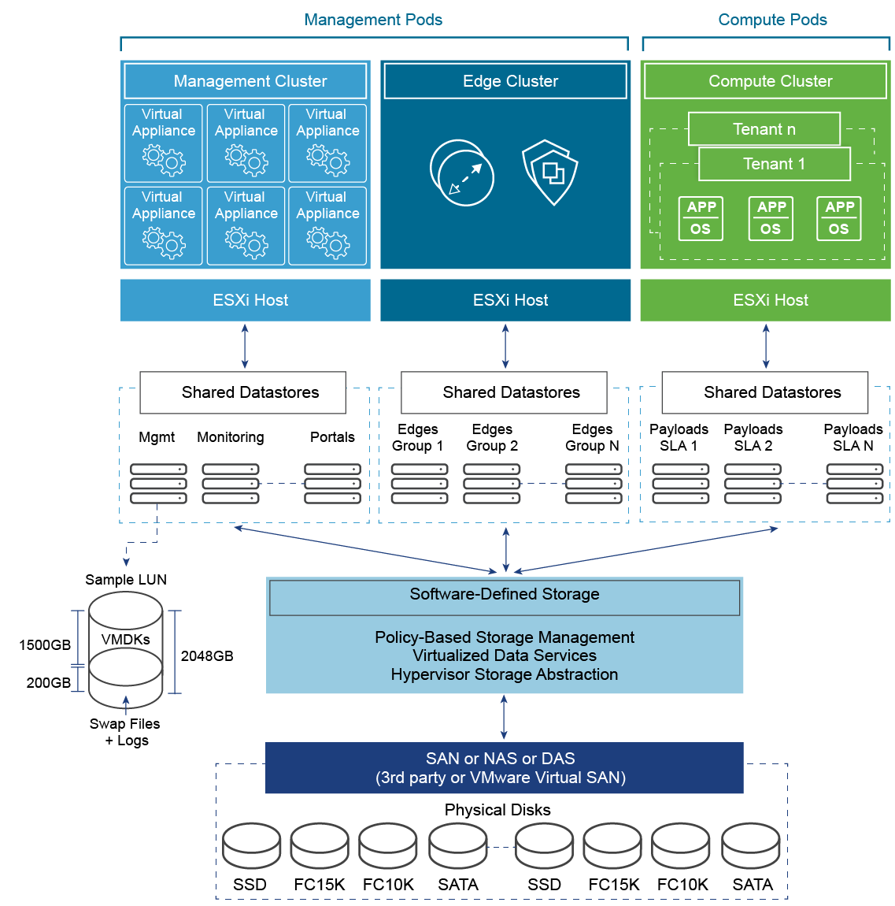

Table 75. Storage Type Design Decisions

| Decision ID         | Design Decision                                                              | Design Justification                                                                                                                                                                                                  | Design Implication                                                                               |
|---------------------|------------------------------------------------------------------------------|-----------------------------------------------------------------------------------------------------------------------------------------------------------------------------------------------------------------------|--------------------------------------------------------------------------------------------------|
| SDDC-VI-Storage-001 | In the management cluster, use VMware Virtual SAN and NFS shared storage:    

                       Use Virtual SAN as the primary shared storage platform.                       

                       Use NFS as the secondary shared storage platform for the management cluster.  | Virtual SAN as the primary shared storage solution can take advantage of more cost-effective local storage.                                                                                                           

                                                                                                      Using two storage technologies provides capabilities such as deduplication and compression which is not available in Virtual SAN today.                                                                                

                                                                                                      NFS is used primarily for archival and the need to maintain historical data. Leveraging NFS provides large, low cost volumes that have the flexibility to be expanded on a regular basis depending on capacity needs.  | The use of two different storage technologies increases the complexity and operational overhead. |
| SDDC-VI-Storage-002 | In the edge cluster, use Virtual SAN as the only shared storage platform.    | Virtual SAN as the primary shared storage solution can take advantage of more cost-effective local storage. No deduplication, compression or tiered storage is required in the edge cluster.                          | Virtual SAN capable hosts are required in the edge cluster.                                      |

#### Storage Tiering

Today’s enterprise-class storage arrays contain multiple drive types and protection mechanisms. The storage, server, and application administrators face challenges when selecting the correct storage configuration for each application being deployed in the environment. Virtualization can make this problem more challenging by consolidating many different application workloads onto a small number of large devices. Given this challenge, administrators might use single storage type for every type of workload without regard to the needs of the particular workload. However, not all application workloads have the same requirements, and storage tiering allows for these differences by creating multiple levels of storage with varying degrees of performance, reliability and cost, depending on the application workload needs.

The storage tiering diagram below resembles a pyramid. The most mission-critical data typically represents the smallest amount of data and offline data represents the largest amount. Details differ for different organizations. 

To determine the storage tier for application data, determine the storage characteristics of the application or service. 

-   I/O operations per second (IOPS) requirements

-   Megabytes per second (MBps) requirements

-   Capacity requirements

-   Availability requirements

-   Latency requirements

After you determine the information for each application, you can move the application to the storage tier with matching characteristics. 

-   Consider any existing service-level agreements (SLAs)

-   Move data between storage tiers during the application life cycle as needed.

    1.  #### VMware Hardware Acceleration API/CLI for Storage

The VMware Hardware Acceleration API/CLI for storage (previously known as vStorage APIs for Array Integration or VAAI), supports a set of ESXCLI commands for enabling communication between ESXi hosts and storage devices. The APIs define a set of storage primitives that enable the ESXi host to offload certain storage operations to the array. Offloading the operations reduces resource overhead on the ESXi hosts and can significantly improve performance for storage-intensive operations such as storage cloning, zeroing, and so on. The goal of hardware acceleration is to help storage vendors provide hardware assistance to speed up VMware I/O operations that are more efficiently accomplished in the storage hardware.

Without the use of VAAI, cloning or migration of virtual machines by the VMkernel data mover involves software data movement. The data mover issues I/O to read and write blocks to and from the source and destination datastores. With VAAI, the data mover can use the API primitives to offload operations to the array when possible. For example, when you copy a virtual machine disk file (VMDK file) from one datastore to another inside the same array, the data mover directs the array to make the copy completely inside the array. If you invoke a data movement operation and the corresponding hardware offload operation is enabled, the data mover first attempts to use hardware offload. If the hardware offload operation fails, the data mover reverts to the traditional software method of data movement.

In nearly all cases, hardware data movement performs significantly better than software data movement. It consumes fewer CPU cycles and less bandwidth on the storage fabric. Timing operations that use the VAAI primitives and use esxtop to track values such as CMDS/s, READS/s, WRITES/s, MBREAD/s, and MBWRTN/s of storage adapters during the operation show performance improvements.

Table 76. VAAI Design Decisions

| Decision ID         | Design Decision                                    | Design Justification                                                                                                                                                       | Design Implication                                                                                                  |
|---------------------|----------------------------------------------------|----------------------------------------------------------------------------------------------------------------------------------------------------------------------------|---------------------------------------------------------------------------------------------------------------------|
| SDDC-VI-Storage-003 | Select an array that supports VAAI over NAS (NFS). | VAAI offloads tasks to the array itself, enabling the ESXi hypervisor to use its resources for application workloads and not become a bottleneck in the storage subsystem.

                                                                            VAAI is required to support the desired number of virtual machine lifecycle operations.                                                                                     | Not all VAAI arrays support VAAI over NFS. A plugin from the array vendor is required to enable this functionality. |

#### Virtual Machine Storage Policies

You can create a storage policy for a virtual machine to specify which storage capabilities and characteristics are the best match for this virtual machine. 

Info: VMware Virtual SAN uses storage policies to allow specification of the characteristics of virtual machines, so you can define the policy on an individual disk level rather than at the volume level for Virtual SAN.

You can identify the storage subsystem capabilities by using the VMware vSphere API for Storage Awareness or by using a user-defined storage policy. 

-   VMware vSphere API for Storage Awareness (VASA). With vSphere API for Storage Awareness, storage vendors can publish the capabilities of their storage to VMware vCenter Server, which can display these capabilities in its user interface.

-   User-defined storage policy. Defined by using the VMware Storage Policy SDK or VMware vSphere PowerCLI (see the Sample Scripts), or from the vSphere Web Client.

You can assign a storage policy to a virtual machine and periodically check for compliance so that the virtual machine continues to run on storage with the correct performance and availability characteristics.

You can associate a virtual machine with a virtual machine storage policy when you create, clone, or migrate that virtual machine. If a virtual machine is associated with a storage policy, the vSphere Web Client shows the datastores that are compatible with the policy. You can select a datastore or datastore cluster. If you select a datastore that does not match the virtual machine storage policy, the vSphere Web Client shows that the virtual machine is using non-compliant storage. See[ Creating and Managing vSphere Storage Policies](http://pubs.vmware.com/vsphere-60/topic/com.vmware.vsphere.storage.doc/GUID-3F124146-E387-4613-8BCA-6F1375E2CA64.html). 

Table 77. Virtual Machine Storage Policy Design Decisions

| Decision ID         | Design Decision                                         | Design Justification                                                                        | Design Implication                                                                                                    |
|---------------------|---------------------------------------------------------|---------------------------------------------------------------------------------------------|-----------------------------------------------------------------------------------------------------------------------|
| SDDC-VI-Storage-004 | Do not use customized virtual machine storage policies. | The default Virtual SAN storage policy is adequate for the management and edge cluster VMs. | If 3rd party or additional VMs have different storage requirements, additional VM storage policies might be required. |

#### vSphere Storage I/O Control Background Information

VMware vSphere Storage I/O Control allows cluster-wide storage I/O prioritization, which results in better workload consolidation and helps reduce extra costs associated with overprovisioning.

vSphere Storage I/O Control extends the constructs of shares and limits to storage I/O resources. You can control the amount of storage I/O that is allocated to virtual machines during periods of I/O congestion, so that more important virtual machines get preference over less important virtual machines for I/O resource allocation.

When vSphere Storage I/O Control is enabled on a datastore, the ESXi host monitors the device latency when communicating with that datastore. When device latency exceeds a threshold, the datastore is considered to be congested and each virtual machine that accesses that datastore is allocated I/O resources in proportion to their shares. Shares are set on a per-virtual machine basis and can be adjusted.

vSphere Storage I/O Control has several requirements, limitations, and constraints.

-   Datastores that are enabled with vSphere Storage I/O Control must be managed by a single vCenter Server system.

-   Storage I/O Control is supported on Fibre Channel-connected, iSCSI-connected, and NFS-connected storage. RDM is not supported.

-   Storage I/O Control does not support datastores with multiple extents.

-   Before using vSphere Storage I/O Control on datastores that are backed by arrays with automated storage tiering capabilities, check the VMware Compatibility Guide whether the storage array has been certified a compatible with vSphere Storage I/O Control.

Table 78. Storage I/O Control Design Decisions

| Decision ID         | Design Decision                                                           | Design Justification                                                                                 | Design Implication                                                                                                                                     |
|---------------------|---------------------------------------------------------------------------|------------------------------------------------------------------------------------------------------|--------------------------------------------------------------------------------------------------------------------------------------------------------|
| SDDC-VI-Storage-005 | Enable Storage I/O Control with the default values on the NFS datastores. | Storage I/O Control ensures that all virtual machines on a datastore receive an equal amount of I/O. | Virtual machines that use more I/O are throttled to allow other virtual machines access to the datastore only when contention occurs on the datastore. |

#### Datastore Cluster Design

A datastore cluster is a collection of datastores with shared resources and a shared management interface. Datastore clusters are to datastores what clusters are to ESXi hosts. After you create a datastore cluster, you can use vSphere Storage DRS to manage storage resources.

vSphere datastore clusters group similar datastores into a pool of storage resources. When vSphere Storage DRS is enabled on a datastore cluster, vSphere automates the process of initial virtual machine file placement and balances storage resources across the cluster to avoid bottlenecks. vSphere Storage DRS considers datastore space usage and I/O load when making migration recommendations.

When you add a datastore to a datastore cluster, the datastore's resources become part of the datastore cluster's resources. The following resource management capabilities are also available for each datastore cluster.

Table 79. Resource Management Capabilities Available for Datastores

| Capability                       | Description                                                                                                                                                                                                                                            |
|----------------------------------|--------------------------------------------------------------------------------------------------------------------------------------------------------------------------------------------------------------------------------------------------------|
| Space utilization load balancing | You can set a threshold for space use. When space use on a datastore exceeds the threshold, vSphere Storage DRS generates recommendations or performs migrations with vSphere Storage vMotion to balance space use across the datastore cluster.       |
| I/O latency load balancing       | You can configure the I/O latency threshold to avoid bottlenecks. When I/O latency on a datastore exceeds the threshold, vSphere Storage DRS generates recommendations or performs vSphere Storage vMotion migrations to help alleviate high I/O load. |
| Anti-affinity rules              | You can configure anti-affinity rules for virtual machine disks to ensure that the virtual disks of a virtual machine are kept on different datastores. By default, all virtual disks for a virtual machine are placed on the same datastore.          |

You can enable vSphere Storage I/O Control or vSphere Storage DRS for a datastore cluster. You can enable the two features separately, even though vSphere Storage I/O control is enabled by default when you enable vSphere Storage DRS. 

#### vSphere Storage DRS Background Information

vSphere Storage DRS supports automating the management of datastores based on latency and storage utilization. When configuring vSphere Storage DRS, verify that all datastores use the same version of VMFS and are on the same storage subsystem. Because vSphere Storage vMotion performs the migration of the virtual machines, confirm that all prerequisites are met.

vSphere Storage DRS provides a way of balancing usage and IOPS among datastores in a storage cluster:

-   Initial placement of virtual machines is based on storage capacity.

-   vSphere Storage DRS uses vSphere Storage vMotion to migrate virtual machines based on storage capacity.

-   vSphere Storage DRS uses vSphere Storage vMotion to migrate virtual machines based on I/O latency.

-   You can configure vSphere Storage DRS to run in either manual mode or in fully automated mode.

vSphere vStorage I/O Control and vSphere Storage DRS manage latency differently.  

-   vSphere Storage I/O Control distributes the resources based on virtual disk share value after a latency threshold is reached.

-   vSphere Storage DRS measures latency over a period of time. If the latency threshold of vSphere Storage DRS is met in that time frame, vSphere Storage DRS migrates virtual machines to balance latency across the datastores that are part of the cluster.

When making a vSphere Storage design decision, consider these points:

-   Use vSphere Storage DRS where possible.

-   vSphere Storage DRS provides a way of balancing usage and IOPS among datastores in a storage cluster:

<!-- -->

-   Initial placement of virtual machines is based on storage capacity.

-   vSphere Storage vMotion is used to migrate virtual machines based on storage capacity.

-   vSphere Storage vMotion is used to migrate virtual machines based on I/O latency.

-   vSphere Storage DRS can be configured in either manual or fully automated modes.

    1.  #### Virtual SAN Storage Design

The VMware Virtual SAN Storage design in this VMware Validated Design includes conceptual design, logical design, network design, cluster and disk group design, and policy design.

Conceptual Design

This Virtual SAN design is limited to the management and edge clusters only. The design uses the default Storage Policy to achieve redundancy and performance within these clusters.

While Virtual SAN can be used within the compute cluster, this design currently gives no guidance for the implementation. 

Figure 38. Conceptual Virtual SAN Design

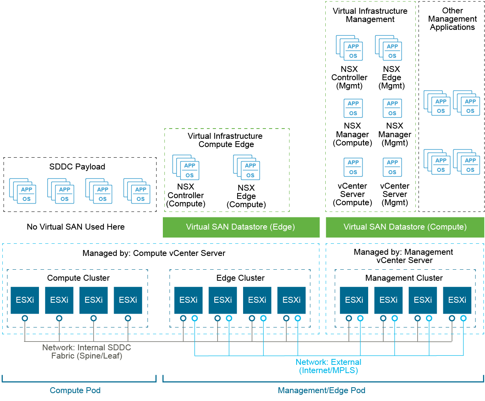

Virtual SAN Logical Design

In a cluster that is managed by vCenter Server, you can manage software-defined storage resources just as you can manage compute resources. Instead of CPU or memory reservations, limits, and shares, you can define storage policies and assign them to virtual machines. The policies specify the characteristics of the storage and can be changed as business requirements change.

VMware Virtual SAN Network Design

When performing network configuration, you have to consider the traffic and decide how to isolate Virtual SAN traffic.

-   Consider how much replication and communication traffic is running between hosts. With VMware Virtual SAN, the amount of traffic depends on the number of VMs that are running in the cluster, and on how write-intensive the I/O is for the applications running in the VMs. 

-   Isolate Virtual SAN traffic on its own Layer 2 network segment. You can do this with dedicated switches or ports, or by using a VLAN. 

The Virtual SAN VMkernel port group is created as part of cluster creation. Configure this port group on all hosts in a cluster, even for hosts that are not contributing storage resources to the cluster. 

The *Conceptual Network Diagram* below illustrates the logical design of the network.

Figure 39. Virtual SAN Conceptual Network Diagram

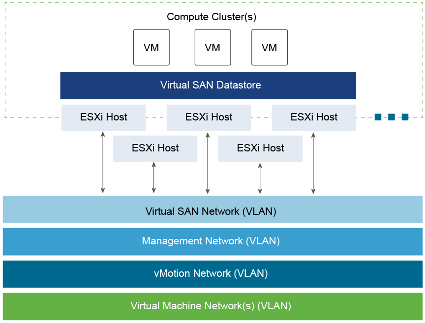

 

Network Bandwidth Requirements

VMware recommends that solutions use a 10 Gb Ethernet connection for use with Virtual SAN to ensure the best and *most predictable *performance (IOPS) for the environment. Without it, a significant decrease in array performance results.

Note: Virtual SAN allflash configurations are supported only with 10 GbE.

Table 80. Network Speed Selection

| Design Quality | 1 Gb | 10 Gb | Comments                                                                                                                                                        |
|----------------|------|-------|-----------------------------------------------------------------------------------------------------------------------------------------------------------------|
| Availability   | o    | o     | Neither design option impacts availability.                                                                                                                     |
| Manageability  | o    | o     | Neither design option impacts manageability.                                                                                                                    |
| Performance    | ↓    | ↑     | Faster network speeds increase Virtual SAN performance (especially in I/O intensive situations).                                                                |
| Recoverability | ↓    | ↑     | Faster network speeds increase the performance of rebuilds and synchronizations in the environment. This ensures that VMs are properly protected from failures. |
| Security       | o    | o     | Neither design option impacts security.                                                                                                                         |

 Legend: ↑ = positive impact on quality; ↓ = negative impact on quality; o = no impact on quality.

Table 81. Network Bandwidth Design Decision

| Decision ID  | Design Decision                                 | Design Justification                                                                                 | Design Implication                                                                                 |
|--------------|-------------------------------------------------|------------------------------------------------------------------------------------------------------|----------------------------------------------------------------------------------------------------|
| SDDC-SDS-001 | Use only 10 GbE for VMware Virtual SAN traffic. | Performance with 10 GbE is optimal. Without it, a significant decrease in array performance results. | The physical network must support 10 Gb networking between every host in the Virtual SAN clusters. |

VMware Virtual SAN Virtual Switch Type

Virtual SAN supports the use of vSphere Standard Switch or vSphere Distributed Switch. The benefit of using vSphere Distributed Switch is that it supports Network I/O Control which allows for prioritization of bandwidth in case of contention in an environment.

Info: vSphere Distributed Switches using Network I/O Control is an option for environments with a limited number of ESXi host network ports.

This design uses a vSphere Distributed Switch for the Virtual SAN port group to ensure that priority can be assigned using NIOC to separate and guarantee the bandwidth for Virtual SAN traffic.

Virtual Switch Design Background

Virtual switch type affects performance and security of the environment.

Table 82. Virtual Switch Types

| Design Quality | vSphere Standard Switch | vSphere Distributed Switch | Comments                                                                                                                           |
|----------------|-------------------------|----------------------------|------------------------------------------------------------------------------------------------------------------------------------|
| Availability   | o                       | o                          | Neither design option impacts availability.                                                                                        |
| Manageability  | o                       | o                          | Neither design option impacts manageability.                                                                                       |
| Performance    | ↓                       | ↑                          | The vSphere Distributed Switch has added controls, such as NIOC, which allow performance to be guaranteed for Virtual SAN traffic. |
| Recoverability | o                       | o                          | Neither design option impacts recoverability.                                                                                      |
| Security       | ↓                       | ↑                          | The vSphere Distributed Switch has added built-in security controls to help protect traffic.                                       |

Legend: ↑ = positive impact on quality; ↓ = negative impact on quality; o = no impact on quality.

Table 83. Virtual Switch Design Decisions

| Decision ID  | Design Decision                                                                            | Design Justification                                                                                              | Design Implication                                |
|--------------|--------------------------------------------------------------------------------------------|-------------------------------------------------------------------------------------------------------------------|---------------------------------------------------|
| SDDC-SDS-002 | Use the existing vSphere Distributed Switch instances in the management and edge clusters. | Provide high availability for Virtual SAN traffic in case of contention by using existing networking components.  | All traffic paths are shared over common uplinks. |

Jumbo Frames

VMware Virtual SAN supports jumbo frames for Virtual SAN traffic. 

A Virtual SAN design should use jumbo frames *only* if the physical environment is already configured to support them, they are part of the existing design, or if the underlying configuration does not create a significant amount of added complexity to the design.

Table 84. Jumbo Frames Design Decision

| Decision ID  | Design Decision   | Design Justification                                                                             | Design Implication                                     |
|--------------|-------------------|--------------------------------------------------------------------------------------------------|--------------------------------------------------------|
| SDDC-SDS-003 | Use jumbo frames. | Jumbo frames are already used to improve performance of vSphere vMotion and NFS storage traffic. | Every device in the Network must support Jumbo Frames. |

VLANs

VMware recommends isolating VMware Virtual SAN traffic on its own VLAN. When a design uses multiple Virtual SAN clusters, each cluster should use a dedicated VLAN or segment for its traffic. This approach prevents interference between clusters and helps with troubleshooting cluster configuration.

Table 85. VLAN Design Decision

| Decision ID  | Design Decision                                                                                   | Design Justification            | Design Implication                                                                                     |
|--------------|---------------------------------------------------------------------------------------------------|---------------------------------|--------------------------------------------------------------------------------------------------------|
| SDDC-SDS-004 | Use a dedicated VLAN for Virtual SAN traffic for the management cluster and for the edge cluster. | VLANs ensure traffic isolation.

                                                                                                                                                     |  VLANs span only a single pod.                                                                         

                                                                                                                                                       A sufficient number of VLANs is available within each pod and should be used for traffic segregation.  |

Multicast Requirements

Virtual SAN requires that IP multicast is enabled on the Layer 2 physical network segment that is used for intra-cluster communication. All VMkernel ports on the Virtual SAN network subscribe to a multicast group using Internet Group Management Protocol (IGMP).

A default multicast address is assigned to each Virtual SAN cluster at the time of creation. IGMP (v3) snooping is used to limit Layer 2 multicast traffic to specific port groups. As per the Physical Network Design, IGMP snooping is configured with an IGMP snooping querier to limit the physical switch ports that participate in the multicast group to only Virtual SAN VMkernel port uplinks. In some cases, an IGMP snooping querier can be associated with a specific VLAN,\\; however, vendor implementations differ.

Cluster and Disk Group Design

When considering the cluster and disk group design, you have to decide on the Virtual SAN datastore size, number of hosts per cluster, number of disk groups per host, and the Virtual SAN policy.

VMware Virtual SAN Datastore Size

The size of the Virtual SAN datastore depends on the requirements for the datastore. Consider cost versus availability to provide the appropriate sizing.

Table 86. Virtual SAN Datastore Design Decisions

| Decision ID  | Design Decision                      | Design Justification                                                                                                                                                                  | Design Implication |
|--------------|--------------------------------------|---------------------------------------------------------------------------------------------------------------------------------------------------------------------------------------|--------------------|
| SDDC-SDS-005 | Management cluster: Minimum 8 TB raw | Management cluster virtual machines that use Virtual SAN require at least 8 TB of raw storage; however, the total storage footprint does not have to be completely Virtual SAN based.

                                                       NFS is used for additional shared storage of some management components.                                                                                                               | None               |
| SDDC-SDS-006 | Edge cluster: Minimum 1 TB raw       | Edge cluster virtual machines require a small amount of storage and the requirements do not grow over time due to the static nature of edge cluster virtual machines.                 |  None              |

Number of Hosts per Cluster

The number of hosts in the cluster depends on these factors:

-   Amount of available space on the Virtual SAN datastore

-   Number of failures you can tolerate in the cluster

For example, if the Virtual SAN cluster has only 3 ESXi hosts, only a single failure is supported. If a higher level of availability is required, additional hosts are required. 

Cluster Size Design Background

Table 87. Number of Hosts per Cluster

| Design Quality | 3 Hosts | 32 Hosts | 64 Hosts | Comments                                                                                                                              |
|----------------|---------|----------|----------|---------------------------------------------------------------------------------------------------------------------------------------|
| Availability   | ↓       | ↑        | ↑↑       | The more hosts that are available in the cluster, the more failures the cluster can tolerate.                                         |
| Manageability  | ↓       | ↑        | ↑        | The more hosts in the cluster, the more virtual machines can be in the Virtual SAN environment.                                       |
| Performance    | ↑       | ↓        | ↓        | Having a larger cluster can impact performance if there is an imbalance of resources. Consider performance as you make your decision. |
| Recoverability | o       | o        | o        | Neither design option impacts recoverability.                                                                                         |
| Security       | o       | o        | o        | Neither design option impacts security.                                                                                               |

  Legend: ↑ = positive impact on quality; ↓ = negative impact on quality; o = no impact on quality.

Table 88. Cluster Size Design Decisions

| Decision ID  | Design Decision                                               | Design Justification                                                                                                                                                                         | Design Implication                                                                                          |
|--------------|---------------------------------------------------------------|----------------------------------------------------------------------------------------------------------------------------------------------------------------------------------------------|-------------------------------------------------------------------------------------------------------------|
| SDDC-SDS-007 | The management cluster includes 4 ESXi hosts for Virtual SAN. | Having 4 hosts addresses the availability and sizing requirements, and allows you to take an ESXi host offline for maintenance or upgrades without impacting the overall Virtual SAN health. | The availability requirements for the management cluster might cause underutilization of the cluster hosts. |
| SDDC-SDS-008 | The edge cluster includes 4 ESXi hosts for Virtual SAN.       | Having 4 hosts addresses the availability and sizing requirements, and allows you to take an ESXi host offline for maintenance or upgrades without impacting the overall Virtual SAN health. | The availability requirements for the edge cluster might cause underutilization of the cluster hosts.       |

Number of Disk Groups per Host

Disk group sizing is an important factor during volume design.

-   If more hosts are available in the cluster, more failures are tolerated in the cluster. This capability adds cost because additional hardware for the disk groups is required.

-   More available disk groups can increase the recoverability of Virtual SAN during a failure.

Consider these data points when deciding on the number of disk groups per host:

-   Amount of available space on the Virtual SAN datastore

-   Number of failures you can tolerate in the cluster

The optimal number of disk groups is a balance between hardware and space requirements for the Virtual SAN datastore. More disk groups increase space and provide higher availability. However, adding disk groups can be cost-prohibitive.

Disk Groups Design Background

The number of disk groups can affect availability and performance. 

Table 89. Number of Disk Groups per Host

| Design Quality | 1 Disk Group | 3 Disk Groups | 5 Disk Groups | Comments                                                                                                                                                                |
|----------------|--------------|---------------|---------------|-------------------------------------------------------------------------------------------------------------------------------------------------------------------------|
| Availability   | ↓            | ↑             | ↑↑            | If more hosts are available in the cluster, the cluster tolerates more failures. This capability adds cost because additional hardware for the disk groups is required. |
| Manageability  | o            | o             | o             | If more hosts are in the cluster, more virtual machines can be managed in the Virtual SAN environment.                                                                  |
| Performance    | o            | ↑             | ↑↑            | If the flash percentage ratio to storage capacity is large, the Virtual SAN can deliver increased performance and speed.                                                |
| Recoverability | o            | o             | o             | More available disk groups can increase the recoverability of Virtual SAN during a failure.                                                                             

                                                                 Rebuilds complete faster because there are more places to place data and to copy data from.                                                                              |
| Security       | o            | o             | o             | Neither design option impacts security.                                                                                                                                 |

Legend: ↑ = positive impact on quality; ↓ = negative impact on quality; o = no impact on quality.

Table 90. Disk Groups per Host Design Decision

| Decision ID  | Design Decision                                                        | Design Justification                                                  | Design Implication                                                                                   |
|--------------|------------------------------------------------------------------------|-----------------------------------------------------------------------|------------------------------------------------------------------------------------------------------|
| SDDC-SDS-009 | Use a single disk group per ESXi host. Each host has 1 SSD and 2 HDDs. | Single disk group provide performance and usable space on the volume. | You cannot increase the failures to tolerate storage policy setting when only using 2 HDDs per host. |

Virtual SAN Policy Design

After you enable and configure VMware Virtual SAN, you can create storage policies that define the virtual machine storage characteristics. Storage characteristics specify different levels of service for different virtual machines. The default storage policy tolerates a single failure and has a single disk stripe. Use the default unless your environment requires policies with non-default behavior. If you configure a custom policy, Virtual SAN will guarantee it; however, if Virtual SAN cannot guarantee a policy, you cannot provision a virtual machine that uses the policy unless you enable force provisioning.

Virtual SAN Policy Options

A storage policy includes several attributes, which can be used alone or combined to provide different service levels. Policies can be configured for availability and performance conservatively to balance space consumed and recoverability properties. In many cases, the default system policy is adequate and no additional policies are required. Policies allow any configuration to become as customized as needed for the application’s business requirements.

Policy Design Background

Before making design decisions, understand the policies and the objects to which they can be applied. The policy options are listed in the following table.

Table 91. Virtual SAN Policy Options

| Capability                        | Use Case           | Value     | Comments                                                                                                                                                                                                                                                                      |
|-----------------------------------|--------------------|-----------|-------------------------------------------------------------------------------------------------------------------------------------------------------------------------------------------------------------------------------------------------------------------------------|
| Number of failures to tolerate    | Redundancy         | Default 1

                                                          Max 3      | A standard RAID 1 mirrored configuration that provides redundancy for a virtual machine disk. The higher the value, the more failures can be tolerated. For *n* failures tolerated, *n*+1 copies of the disk are created, and 2*n*+1 hosts contributing storage are required.

                                                                      A higher *n* value indicates that more replicas of virtual machines are made, which can consume more disk space than expected.                                                                                                                                                 |
| Number of disk stripes per object | Performance        | Default 1

                                                          Max 12     | A standard RAID 0 stripe configuration used to increase performance for a virtual machine disk.                                                                                                                                                                               

                                                                      This setting defines the number of HDDs on which each replica of a storage object is striped.                                                                                                                                                                                  

                                                                      If the value is higher than 1, increased performance can result. However, an increase in system resource usage might also result.                                                                                                                                              |
| Flash read cache reservation (%)  | Performance        | Default 0

                                                          Max 100%   | Flash capacity reserved as read cache for the storage is a percentage of the logical object size that will be reserved for that object.                                                                                                                                       

                                                                      Only use this setting for workloads if you must address read performance issues. The downside of this setting is that other objects cannot use a reserved cache.                                                                                                               

                                                                      VMware recommends not using these reservations unless it is absolutely necessary because unreserved flash is shared fairly among all objects.                                                                                                                                  |
| Object space reservation (%)      | Thick provisioning | Default 0

                                                          Max 100%   | The percentage of the storage object that will be thick provisioned upon VM creation. The remainder of the storage will be thin provisioned.                                                                                                                                  

                                                                      This setting is useful if a predictable amount of storage will always be filled by an object, cutting back on repeatable disk growth operations for all but new or non-predictable storage use.                                                                                |
| Force provisioning                | Override policy    | Default:  

                                                          No         | Force provisioning allows for provisioning to occur even if the currently available cluster resources cannot satisfy the current policy.                                                                                                                                      

                                                                      Force provisioning is useful in case of a planned expansion of the Virtual SAN cluster, during which provisioning of VMs must continue. Virtual SAN automatically tries to bring the object into compliance as resources become available.                                     |

By default, policies are configured based on application requirements. However, they are applied differently depending on the object.

Table 92. Object Policy Defaults

| Object                    | Policy                         | Comments                                                             |
|---------------------------|--------------------------------|----------------------------------------------------------------------|
| Virtual machine namespace | Failures-to-Tolerate: 1        | Configurable. Changes are not recommended.                           |
| Swap                      | Failures-to-Tolerate: 1        | Configurable. Changes are not recommended.                           |
| Virtual disk(s)           | User-Configured Storage Policy | Can be any storage policy configured on the system.                  |
| Virtual disk snapshot(s)  | Uses virtual disk policy       | Same as virtual disk policy by default. Changes are not recommended. |

 

If you do not specify a user-configured policy, the default system policy of 1 failure to tolerate and 1 disk stripe is used for virtual disk(s) and virtual disk snapshot(s). Policy defaults for the VM namespace and swap are set statically and are not configurable to ensure appropriate protection for these critical virtual machine components. Policies must be configured based on the application’s business requirements. Policies give Virtual SAN its power because it can adjust how a disk performs on the fly based on the policies configured.

Policy Design Recommendations

Policy design starts with assessment of business needs and application requirements. Use cases for Virtual SAN must be assessed to determine the necessary policies. Start by assessing the following application requirements:

-   I/O performance and profile of your workloads on a per-virtual-disk basis

-   Working sets of your workloads

-   Hot-add of additional cache (requires repopulation of cache)

-   Specific application best practice (such as block size)

After assessment, configure the software-defined storage module policies for availability and performance in a conservative manner so that space consumed and recoverability properties are balanced. In many cases the default system policy is adequate and no additional policies are required unless specific requirements for performance or availability exist.

Table 93. Policy Design Decision

| Decision ID  | Design Decision                                    | Design Justification                                                                                                                 | Design Implication                                                                                                                                                                                       |
|--------------|----------------------------------------------------|--------------------------------------------------------------------------------------------------------------------------------------|----------------------------------------------------------------------------------------------------------------------------------------------------------------------------------------------------------|
| SDDC-SDS-010 | Use the default VMware Virtual SAN storage policy. | The default Virtual SAN storage policy provides the level of redundancy that is needed within both the management and edge clusters. | Additional policies might be needed if 3rd party VMs are hosted in these clusters because their performance or availability requirements might differ from what the default Virtual SAN policy supports. |

#### NFS Storage Design

This NFS design does not give specific vendor or array guidance. Consult your storage vendor for the configuration settings appropriate for your storage array.

NFS Storage Concepts

NFS (Network File System) presents file devices to an ESXi host for mounting over a network. The NFS server or array makes its local file systems available to ESXi hosts. The ESXi hosts access the metadata and files on the NFS array or server using a RPC-based protocol. NFS is implemented using Standard NIC that is accessed using a VMkernel port (vmknic).

NFS Load Balancing

No load balancing is available for NFS/NAS on vSphere because it is based on single session connections. You can configure aggregate bandwidth by creating multiple paths to the NAS array, and by accessing some datastores via one path, and other datastores via another path. You can configure NIC Teaming so that if one interface fails, another can take its place. However these load balancing techniques work only in case of a network failure and might not be able to handle error conditions on the NFS array or on the NFS server. The storage vendor is often the source for correct configuration and configuration maximums.

NFS Versions

vSphere is compatible with both NFS version 3 and version 4.1; however, not all features can be enabled when connecting to storage arrays that use NFS v4.1. 

Table 94. NFS Version Design Decision

| Decision ID         | Design Decision                           | Design Justification                                                                           | Design Implication                               |
|---------------------|-------------------------------------------|------------------------------------------------------------------------------------------------|--------------------------------------------------|
| SDDC-VI-Storage-006 | Use NFS v3 for all NFS hosted datastores. | NFS v4.1 datastores are not supported with Storage I/O Control and with Site Recovery Manager. | NFS v3 does not support Kerberos authentication. |

Storage Access

NFS v3 traffic is transmitted in an unencrypted format across the LAN. Therefore, best practice is to use NFS storage on trusted networks only and to isolate the traffic on dedicated VLANs.

Many NFS arrays have some built-in security, which enables them to control the IP addresses that can mount NFS exports. Best practice is to use this feature to determine which ESXi hosts can mount the volumes that are being exported and have read/write access to those volumes. This prevents unapproved hosts from mounting the NFS datastores.

Exports

All NFS exports are shared directories that sit on top of a storage volume. These exports control the access between the endpoints (ESXi hosts) and the underlying storage system. Multiple exports can exist on a single volume, with different access controls on each.

Table 95. NFS Export Sizing

| Export Size per Region              | Size |
|-------------------------------------|------|
| vSphere Data Protection             | 4 TB |
| vRealize Log Insight Archive        | 1 TB |
| vRealize Automation Content Library | 1 TB |

Figure 40. NFS Storage Exports

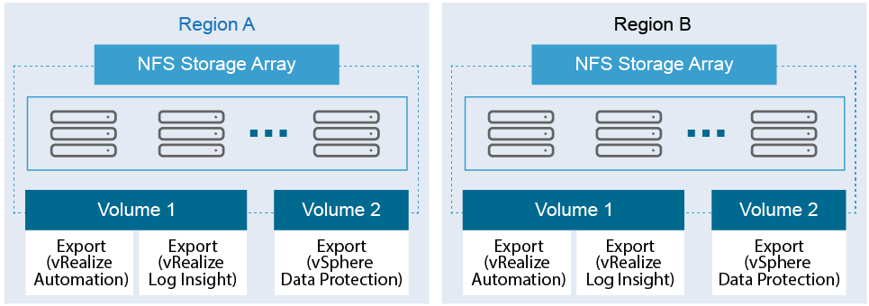

Table 96. NFS Export Design Decisions

| Decision ID         | Design Decision                                                                                                | Design Justification                                                                                                                                    | Design Implication                                                       |
|---------------------|----------------------------------------------------------------------------------------------------------------|---------------------------------------------------------------------------------------------------------------------------------------------------------|--------------------------------------------------------------------------|
| SDDC-VI-Storage-007 | Create 3 exports to support the management components.                                                         

                       vSphere Data Protection                                                                                         

                       vRealize Log Insight Archive                                                                                    

                       vRealize Automation Content Library                                                                             | The storage requirements of these management components are separate from the primary storage.                                                          | Having multiple exports can introduce operational overhead.              |
| SDDC-VI-Storage-008 | Place the vSphere Data Protection export on its own separate volume as per SDDC-PHY-STO-008                    | vSphere Data Protection is I/O intensive. vSphere Data Protection or other applications suffer if vSphere Data Protection is placed on a shared volume. | Dedicated exports can add management overhead to storage administrators. |
| SDDC-VI-Storage-009 | For each export, limit access to only the application VMs or hosts requiring the ability to mount the storage. | Limiting access helps ensure the security of the underlying data.                                                                                       | Securing exports individually can introduce operational overhead.        |

NFS Datastores

Within vSphere environments, ESXi hosts mount NFS exports as a file-share instead of using the VMFS clustering filesystem. For this design, only secondary storage is being hosted on NFS storage. The datastore construct within vSphere mounts some of the exports, depending on their intended use. For the vRealize Log Insight archive data, the application maps directly to the NFS export and no vSphere Datastore is required.

Table 97. NFS Datastore Design Decision

| Decision ID         | Design Decision                                            | Design Justification                                                                                         | Design Implication                                                                |
|---------------------|------------------------------------------------------------|--------------------------------------------------------------------------------------------------------------|-----------------------------------------------------------------------------------|
| SDDC-VI-Storage-010 | Create 2 datastores for use across the following clusters.

                       Management cluster: vSphere Data Protection                 

                       Compute cluster: vRealize Automation Content Library        | The application VMs using these data assume that all hosts in the vSphere cluster can access the datastores. | Do not use the NFS datastores as primary VM storage even though that is possible. |

 

### Software-Defined Networking Design

This design implements software-defined networking by using VMware NSX™ for vSphere®. With NSX for vSphere, virtualization delivers for networking what it has already delivered for compute and storage. In much the same way that server virtualization programmatically creates, snapshots, deletes and restores software-based virtual machines (VMs), NSX network virtualization programmatically creates, snapshots, deletes, and restores software-based virtual networks. The result is a transformative approach to networking that not only enables data center managers to achieve orders of magnitude better agility and economics, but also supports a vastly simplified operational model for the underlying physical network. NSX for vSphere  is a nondisruptive solution because it can be deployed on any IP network, including existing traditional networking models and next-generation fabric architectures from any vendor. In fact, with NSX, the physical network infrastructure you already have is all you need to deploy a software-defined data center. 

#### NSX for vSphere Design

NSX for vSphere is tied to a vCenter Server domain. The design decision to deploy two vCenter Server instances (SDDC-VI-VC-001) requires deployment of two separate NSX instances. 

Table 98. **NSX for vSphere Design Decision**

| Decision ID     | Design Decision                                                                                                                                      | Design Justification                                                                                                                                                                                                                                              | Design Implications                                                           |
|-----------------|------------------------------------------------------------------------------------------------------------------------------------------------------|-------------------------------------------------------------------------------------------------------------------------------------------------------------------------------------------------------------------------------------------------------------------|-------------------------------------------------------------------------------|
| SDDC-VI-SDN-001 | Use two separate NSX instances. One instance is tied to the Management vCenter Server, and the other instance is tied to the Compute vCenter Server. | SDN capabilities offered by NSX, such as load balancing and firewalls, are crucial for the compute/edge layer to support the cloud management platform operations, and also for the management applications in the management stack that need these capabilities. | The two NSX instances must be installed, configured, and operated separately. |

#### NSX for vSphere Components

The following sections describe the components in the solution and how they are relevant to the network virtualization design.

Consumption Layer

NSX for vSphere can be consumed by the cloud management platform (vRealize Automation), by using the NSX for vSphere REST API, and through the vSphere Web Client.

Cloud Management Platform (CMP)

NSX for vSphere is consumed by the cloud management layer, in this design vRealize Automation. NSX for vSphere offers self-service provisioning of virtual networks and related features from a service portal. Details of the service requests and their orchestration are outside the scope of this document and can be referenced in the *Cloud Management Platform Design* document.

API

NSX for vSphere offers a powerful management interface through its REST API. 

-   A client can read an object by making an HTTP GET request to the object’s resource URL.

-   A client can write (create or modify) an object with an HTTP PUT or POST request that includes a new or changed XML document for the object.

-   A client can delete an object with an HTTP DELETE request.

vSphere Web Client

The NSX Manager component (described later) provides a Networking and Security plug-in for the vSphere Web Client. This plug-in provides an interface for the consumption of virtualized networking from the NSX Manager for sufficiently privileged users.

Table 99. **Consumption Method Design Decisions**

| Decision ID     | Design Decision                                                                                                                          | Design Justification                                                                                                                                                                                                                                           | Design Implications                                                                                                                                            |
|-----------------|------------------------------------------------------------------------------------------------------------------------------------------|----------------------------------------------------------------------------------------------------------------------------------------------------------------------------------------------------------------------------------------------------------------|----------------------------------------------------------------------------------------------------------------------------------------------------------------|
| SDDC-VI-SDN-002 | For the compute/edge cluster NSX instance, consumption is via vRealize Automation services, the vSphere Web Client and the NSX REST API. | vRealize Automation services are used for the customer-facing portal. The vSphere Web Client consumes NSX for vSphere resources through the Network and Security plug-in. The NSX REST API offers the potential of scripting repeating actions and operations. | Customers typically interact only indirectly with NSX via the vRealize Automation portal. Administrators interact with NSX via the vSphere Web Client and API. |
| SDDC-VI-SDN-003 | For the management cluster NSX instance, consumption is only by provider staff via the vSphere Web Client and the API.                   | Ensures that infrastructure components are not modified by tenants and/or non-provider staff.                                                                                                                                                                  | Tenants do not have access to the management stack workloads.                                                                                                  |

 

NSX Manager

NSX Manager provides the centralized management plane for NSX for vSphere and has a one-to-one mapping to vCenter Server workloads.

NSX Manager performs the following functions.

-   Provides the single point of configuration and the REST API entry-points in a vSphere environment for NSX for vSphere.

-   Is responsible for deploying NSX Controller clusters, Edge distributed routers, and Edge service gateways in the form of OVF appliances, guest introspection services, and so on.

-   Is responsible for preparing ESXi hosts for NSX for vSphere by installing VXLAN, distributed routing and firewall kernel modules, and the User World Agent (UWA).

-   Communicates with NSX Controller clusters via REST and with hosts via the RabbitMQ message bus. The internal message bus is specific to NSX for vSphere and does not require setup of additional services.

-   Generates certificates for the NSX Controller instances and ESXi hosts to secure control plane communications with mutual authentication**.**

NSX Controller

An NSX Controller performs the following functions:

-   Provides the control plane to distribute VXLAN and logical routing information to ESXi hosts.

-   Includes nodes that are clustered for scale-out and high availability.

-   Slices network information across cluster nodes for redundancy.

-   Removes requirement of VXLAN Layer 3 multicast in the physical network.

-   Provides ARP suppression of broadcast traffic in VXLAN networks.

NSX for vSphere control plane communication occurs over the management network. 

Table 100. **NSX Controller Design Decision**

| Decision ID     | Design Decision                                                       | Design Justification                                                                                         | Design Implications                                                                                                         |
|-----------------|-----------------------------------------------------------------------|--------------------------------------------------------------------------------------------------------------|-----------------------------------------------------------------------------------------------------------------------------|
| SDDC-VI-SDN-004 | Deploy NSX Controller instances in a three-node cluster for all pods. | The high availability of NSX Controller reduces the downtime period in case of failure of one physical host. | Deploy 3 NSX Controller instances for both the management cluster NSX instance, and the compute/edge cluster NSX instances. |

NSX vSwitch

The NSX for vSphere data plane consists of the NSX vSwitch. This vSwitch is based on the vSphere Distributed Switch (VDS) with additional components to enable rich services. The add-on NSX for vSphere components include kernel modules (VIBs) which run within the hypervisor kernel and provide services such as distributed logical router (DLR) and distributed firewall (DFW), and enable VXLAN capabilities.

The NSX vSwitch abstracts the physical network and provides access-level switching in the hypervisor. It is central to network virtualization because it enables logical networks that are independent of physical constructs such as VLAN. NSX vSwitch includes several benefits.

-   Supports overlay networking and centralized network configuration. Overlay networking enables the following capabilities.

<!-- -->

-   Creation of a flexible logical Layer 2 overlay over existing IP networks on existing physical infrastructure without the need to rearchitect the data center networks.

-   Provisioning of communication (east/west and north/south) while maintaining isolation between tenants.

-   Application workloads and virtual machines that are agnostic of the overlay network and operate as if they were connected to a physical Layer 2 network.

<!-- -->

-   Facilitates massive scale of hypervisors.

-   Because NSX vSwitch is based on VDS, it provides a comprehensive toolkit for traffic management, monitoring, and troubleshooting within a virtual network through features such as port mirroring, NetFlow/IPFIX, configuration backup and restore, network health check, QoS, and more. 

Logical Switching

NSX for vSphere logical switches create logically abstracted segments to which tenant virtual machines can be connected. A single logical switch is mapped to a unique VXLAN segment and is distributed across the ESXi hypervisors within a transport zone. It allows line-rate switching in the hypervisor without the constraints of VLAN sprawl or spanning tree issues.

Distributed Logical Router 

The NSX for vSphere Distributed Logical Router (DLR) is optimized for forwarding in the virtualized space, that is, forwarding between VMs on VXLAN- or VLAN-backed port groups. It has the following characteristics.

-   High performance, low overhead first hop routing

-   Scales with number of hosts

-   Up to 1,000 Logical Interfaces (LIFs) on each distributed logical route

User World Agent 

The User World Agent (UWA) is a TCP (SSL) client that facilitates communication between the ESXi hosts and the NSX Controller instances as well as the retrieval of information from the NSX Manager via interaction with the message bus agent.

VXLAN Tunnel Endpoint 

VXLAN Tunnel Endpoints (VTEPs) are instantiated within the vSphere Distributed Switch to which hosts prepared for NSX for vSphere are connected. VTEPs are responsible for encapsulating VXLAN traffic as frames in UDP packets and for the corresponding decapsulation. VTEPs take the form of one or more VMkernel ports with IP addresses and are used both to exchange packets with other VTEPs and to join IP multicast groups via Internet Group Membership Protocol (IGMP). If you use multiple VTEPs, then you must select a teaming method.

**E**dge Services Gateway

The NSX for vSphere Edge services gateway’s primary function is north/south communication, but it also offers support for Layer 2, Layer 3, perimeter firewall, load balancing and other services such as SSL-VPN and DHCP-relay.

Distributed **Firewall**

NSX for vSphere includes a distributed kernel-level firewall known as the distributed firewall. Security enforcement is done at the kernel and VM network adapter level. This enables firewall rule enforcement in a highly scalable manner without creating bottlenecks on physical appliances. The distributed firewall has minimal CPU overhead and can perform at line rate.

The flow monitoring feature of the distributed firewall displays network activity between virtual machines at the application protocol level. This information can be used to audit network traffic, define and refine firewall policies, and identify botnets.

Logical Load Balancer

The NSX for vSphere logical load balancer provides load balancing services up to Layer 7, allowing distribution of traffic across multiple servers to achieve optimal resource utilization and availability. The logical load balancer is a service provided by the NSX Edge service gateway.

Table 101. NSX for vSphere Physical Network Requirements

| Requirement                                                                                                                                                                    | Comments                                                                                                                                                                                                                                                                                                    |
|--------------------------------------------------------------------------------------------------------------------------------------------------------------------------------|-------------------------------------------------------------------------------------------------------------------------------------------------------------------------------------------------------------------------------------------------------------------------------------------------------------|
| Any network that carries VXLAN traffic must have an MTU size of 1600 or greater.                                                                                               | VXLAN packets cannot be fragmented. The MTU size must be large enough to support extra encapsulation overhead.                                                                                                                                                                                              

                                                                                                                                                                                  This design uses jumbo frames for VXLAN traffic.                                                                                                                                                                                                                                                             |
| IGMP snooping must be enabled on the Layer 2 switches to which ESXi hosts that use VXLAN are attached. IGMP Querier must be enabled on the connected router or Layer 3 switch. | This is a requirement of hybrid mode replication (see below). Hybrid mode is the recommended replication mode for broadcast, unknown unicast, and multicast (BUM) traffic for environments with large scale-out potential. The traditional requirement for Protocol Independent Multicast (PIM) is removed. |
| NTP server must be available.                                                                                                                                                  | The NSX Manager requires NTP settings that synchronize it with the rest of the vSphere environment. Drift can cause problems with authentication. The NSX Manager must be in sync with the vCenter Single Sign-On server.                                                                                   |
| Forward and reverse DNS resolution for all management VMs must be established.                                                                                                 | The NSX Controller nodes do not require DNS entries.                                                                                                                                                                                                                                                        |

#### NSX for vSphere Specifications

The following table lists the components involved in the NSX for vSphere solution and the requirements for installing and running them. The compute and storage requirements have been taken into account when sizing resources to support the NSX for vSphere solution.

1.  NSX Edge services gateway sizing can vary with tenant requirements, so all options are listed.

| VM                                    | vCPU           | Memory            | Storage           | Quantity per Stack Instance                                                          |
|---------------------------------------|----------------|-------------------|-------------------|--------------------------------------------------------------------------------------|
| NSX Manager                           | 4              | 12 GB             | 60 GB             | 1                                                                                    |
| NSX Controller                        | 4              | 4 GB              | 20 GB             | 3                                                                                    |
| NSX Edge services gateway             | 1 (Compact)    

                                         2 (Large)       

                                         4 (Quad Large)  

                                         6 (X-Large)     | 512 MB (Compact)  

                                                          1 GB (Large)       

                                                          1 GB (Quad Large)  

                                                          8 GB (X-Large)     | 512 MB            
                                                                              (Compact)          

                                                                              512 MB             
                                                                              (Large)            

                                                                              512 MB             
                                                                              (Quad Large)       

                                                                              4.5 GB (X-Large)   

                                                                              (+4 GB with swap)  | Optional component. Deployment of the NSX Edge services gateway varies per use case. |
| Distributed logical router control VM | 1              | 512 MB            | 512 MB            | Optional component. Varies with use case. Typically 2 per HA pair.                   |
| Guest introspection                   | 2              | 1 GB              | 4 GB              | Optional component. 1 per ESXi host.                                                 |
| NSX data security                     | 1              | 512 MB            | 6 GB              | Optional component. 1 per ESXi host.                                                 |

NSX Edge Service Gateway Sizing

The Quad Large model is suitable for high performance firewall abilities and the X-Large is suitable for both high performance load balancing and routing.

You can convert between NSX Edge service gateway sizes upon demand using a non-disruptive upgrade process, so the recommendation is to begin with the Large model and scale up if necessary. A Large NSX Edge service gateway is suitable for medium firewall performance but as detailed later, the NSX Edge service gateway does not perform the majority of firewall functions.

1.  Edge service gateway throughput is influenced by the WAN circuit, so an adaptable approach, that is, converting as necessary, is recommended.

    1.  #### Network Virtualization Conceptual Design

The following diagram depicts the conceptual tenant architecture components and their relationship.

Figure 41. Conceptual Tenant Overview

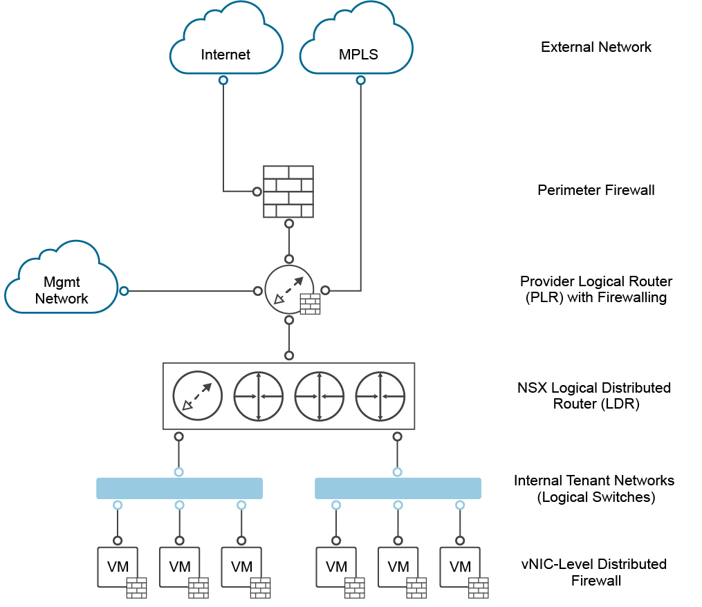

In this document, tenant refers to a tenant of the cloud management platform within the compute/edge stack or to a management application within the management stack.

The conceptual design has the following key components.

-   **External Networks**.  Connectivity to and from external networks is through the perimeter firewall. The main external network is the Internet.

-   **Perimeter Firewall**. The physical firewall exists at the perimeter of the data center. Each tenant receives either a full instance or partition of an instance to filter external traffic.

-   Provider Logical Router (PLR). The PLR exists behind the perimeter firewall and handles north/south traffic that is entering and leaving a tenant.

-   **NSX for vSphere Distributed Logical Router (distributed logical router or DLR)**. This logical router is optimized for forwarding in the virtualized space, that is, between VMs, on VXLAN port groups or VLAN-backed port groups.

-   **Internal Non-Tenant Networks**. A single management network, which sits behind the perimeter firewall but not behind the PLR. Enables customers to manage the tenant environments.

-   **Internal Tenant Networks**. Connectivity for the main tenant workload. These networks are connected to a distributed logical router, which sits behind the PLR. These networks take the form of VXLAN-based NSX for vSphere logical switches to which tenant virtual machine workloads will be directly attached. 

    1.  #### Cluster Design for NSX for vSphere

Following the vSphere design, the NSX for vSphere design consists of a management stack and a compute/edge stack.

**Management Stack**

In the management stack, the underlying hosts are prepared for NSX for vSphere. The management stack has these components:

-   NSX Manager instances for both stacks (management stack and compute/edge stack),

-   NSX Controller cluster for the management stack,

-   NSX Edge service gateways and distributed logical router control VMs for the management stack.

**Compute/Edge Stack**

In the compute/edge stack, the underlying hosts are prepared for NSX for vSphere. The compute/edge stack has these components:

-   NSX Controller cluster for the compute stack

-   All NSX Edge service gateways and distributed logical router control VMs of the compute stack that are dedicated to handling the north/south traffic in the data center. A separate edge stack helps prevent VLAN sprawl because any external VLANs need only be trunked to the hosts in this cluster.  

-   Multiple compute clusters that run the tenant workloads and have the underlying hosts prepared for NSX for vSphere.

Table 102. **vSphere Compute Cluster Split Design Decisions**

| Decision ID     | Design Decision                                                                                                          | Design Justification                                                                                                           | Design Implications                                                                                                                                                 |
|-----------------|--------------------------------------------------------------------------------------------------------------------------|--------------------------------------------------------------------------------------------------------------------------------|---------------------------------------------------------------------------------------------------------------------------------------------------------------------|
| SDDC-VI-SDN-005 | For the compute stack, use a dedicated edge cluster to separate resources for edge devices.                              | This design offers better separation in terms of security, management, and resources.                                          | The NSX Controller instances must be deployed to hosts that are managed by the Compute vCenter Server.                                                              |
| SDDC-VI-SDN-006 | For the management stack, do not use a dedicated edge cluster.                                                           | The number of supported management applications does not justify the cost of a dedicated edge cluster in the management stack. | The NSX Controller instances, NSX Edge service gateways, and distributed logical router control VMs of the management stack are deployed on the management cluster. |
| SDDC-VI-SDN-007 | Apply vSphere Distributed Resource Scheduler (DRS) anti-affinity rules to the NSX for vSphere components in both stacks. | Prevents controllers from ending up on the same ESXi host and thereby risking their high availability capability.              | Additional configuration is required to set up anti-affinity rules.                                                                                                 |

The following diagram depicts the logical design of the vCenter Server clusters and shows where the NSX for vSphere components run.

Figure 42. Cluster Design for NSX for vSphere

High Availability of NSX for vSphere Components

The NSX Manager instances of both stacks run on the management cluster. vSphere HA protects the NSX Manager instances by ensuring that the VM is restarted on a different host in the event of primary host failure.

The NSX Controller nodes of the management stack run on the management cluster and the NSX for vSphere Controller nodes of the compute stack run on the edge cluster. In both clusters, vSphere Distributed Resource Scheduler (DRS) rules ensure that NSX for vSphere Controller nodes do not run on the same host.

The data plane remains active during outages in the management and control planes although the provisioning and modification of virtual networks is impaired until those planes become available again.

The NSX Edge service gateways and distributed logical router control VMs of the compute stack are deployed on the edge cluster. The NSX Edge service gateways and distributed logical router control VMs of the management stack run on the management cluster. 

All NSX Edge components are deployed in NSX for vSphere HA pairs.  NSX for vSphere HA provides better availability than vSphere HA. By default the VMs fail over within 15 seconds versus a potential 5 minutes for a restart on another host under vSphere HA.

Scalability of NSX for vSphere Components

A one-to-one mapping between NSX Manager instances and vCenter Server instances exists. If the inventory of either the management stack or the compute stack exceeds the limits supported by a single vCenter Server, then you can deploy a new vCenter Server instance, and must also deploy a new NSX Manager instance. You can extend transport zones by adding more compute and edge clusters until you reach the vCenter Server limits. Consider the limit of 100 DLRs per ESXi host -- though the environment most likely would exceed other vCenter Server limits before the DLR limit. 

vSphere Distributed Switch Uplink Configuration

Each ESXi host will see two physical Ethernet adapters, associated with the uplinks on the vSphere Distributed Switches to which it is connected. These uplinks are aggregated into a single LACP link aggregation group (LAG), making a single adapter available for use as Virtual Tunnel Endpoint (VTEP). The LAG consists of two physical NICs, seen as a single logical uplink.  See the *Virtualization Network Design* section for details. 

Table 103. **VTEP Teaming and Failover Configuration Design Decision**

| Decision ID     | Design Decision                                                                                                   | Design Justification                                                                          | Design Implications                                                  |
|-----------------|-------------------------------------------------------------------------------------------------------------------|-----------------------------------------------------------------------------------------------|----------------------------------------------------------------------|
| SDDC-VI-SDN-008 | VXLAN Tunnel Endpoints (VTEPs) use LACP across two active 10 GbpE uplinks for teaming and failover configuration. | The aggregated bandwidth can exceed 10 GbE. Improved resiliency with a simple network design. | Configuration of the physical networking layer for LACP is required. |

#### Logical Switch Control Plane Mode Design

The control plane decouples NSX for vSphere from the physical network and handles the broadcast, unknown unicast, and multicast (BUM) traffic within the logical switches. The control plane is on top of the transport zone and is inherited by all logical switches that are created within it, although it is possible to override aspects of the control plane. The following options are available:

-   **Multicast Mode**. The control plane uses multicast IP addresses on the physical network. Use multicast mode only when upgrading from existing VXLAN deployments. In this mode, you must configure PIM/IGMP on the physical network.

-   **Unicast Mode**. The control plane is handled by the NSX Controllers and all replication occurs locally on the host. This mode does not require multicast IP addresses or physical network configuration.

-   **Hybrid Mode**. This mode is an optimized version of the unicast mode where local traffic replication for the subnet is offloaded to the physical network. Hybrid mode requires IGMP snooping on the first-hop switch and access to an IGMP querier in each VTEP subnet. Hybrid mode does not require PIM. 

Figure 43. Logical Switch Control Plane in Hybrid Mode

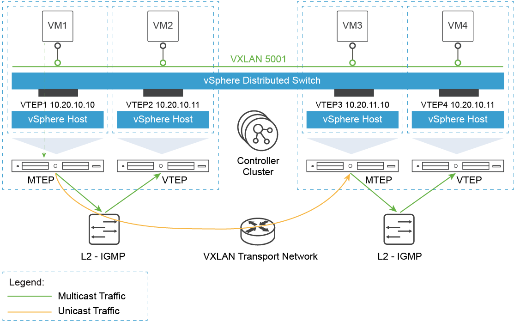

This design uses hybrid mode for control plane replication.

Table 104. **Logical Switch Control Plane Mode Decision**

| Decision ID     | Design Decision                                | Design Justification                                                                                                                                                                                                                                          | Design Implications                                                                     |
|-----------------|------------------------------------------------|---------------------------------------------------------------------------------------------------------------------------------------------------------------------------------------------------------------------------------------------------------------|-----------------------------------------------------------------------------------------|
| SDDC-VI-SDN-009 | Use hybrid mode for control plane replication. | Offloading multicast processing to the physical network reduces pressure on VTEPs as the environment scales out. For large environments, hybrid mode is preferable to unicast mode. Multicast mode is used only when migrating from existing VXLAN solutions. | IGMP snooping on the top-of-rack physical switch and an IGMP querier must be available. |

 

#### Transport Zone Design

A transport zone is used to define the scope of a VXLAN overlay network and can span one or more clusters within one vCenter Server domain. One or more transport zones can be configured in an NSX for vSphere solution. A transport zone is not meant to delineate a security boundary.

Table 105. **Transport Zones Design Decisions**

| Decision ID     | Design Decision                                                                                                                                                                                  | Design Justification                                                                                                                                                                                                                                                                                                     | Design Implications                                                                                                                                                                                                                                                                                                                    |
|-----------------|--------------------------------------------------------------------------------------------------------------------------------------------------------------------------------------------------|--------------------------------------------------------------------------------------------------------------------------------------------------------------------------------------------------------------------------------------------------------------------------------------------------------------------------|----------------------------------------------------------------------------------------------------------------------------------------------------------------------------------------------------------------------------------------------------------------------------------------------------------------------------------------|
| SDDC-VI-SDN-010 | For the compute stack, use a single transport zone (Comp Transport Zone) that encompasses all edge and compute clusters. The zone will be scaled to respect the limit of 100 DLRs per ESXi host. | A single transport zone per NSX instance supports extending networks across the dedicated and Flex-based resource models. This allows customers with dedicated clusters to purchase additional Flex resources and extend their networks, and permits migration between the two, which is a potential use case in future. | While this design does not use distributed logical routers, you must respect the tested limit of 100 distributed logical router instances per ESXi host when creating tenants.                                                                                                                                                         

                                                                                                                                                                                                                                                                                                                                                                                                                                                                                                                                                 At a high level, the tested limit of 100 DLR instances per ESXi host translates to 100 tenants per transport zone if dedicated DLRs are used for each tenant. Such a configuration can result in 100 tenants per vCenter Server instance, as other vCenter Server limits might be exceeded before considering a second transport zone.  |
| SDDC-VI-SDN-011 | For the management stack, use a single transport zone (Mgmt Transport Zone) that encompasses all management clusters.                                                                            | A single transport zone per NSX instance supports extending networks across resource stacks.                                                                                                                                                                                                                             | None                                                                                                                                                                                                                                                                                                                                   |

#### Routing Logical Design

The routing logical design has to consider different levels of routing in the environment:

-   **North/south**.The Provider Logical Router (PLR) handles the north/south traffic to and from a tenant

-   **East/west**. Internal east/west routing at the layer beneath the PLR deals with the application workloads.

Table 106. **Tenant Routing Model Design Decision**

| Decision ID     | Design Decision                                                                                                                                                                                                                                      | Design Justification                                                                                                                       | Design Implications                                                                                                                                                 |
|-----------------|------------------------------------------------------------------------------------------------------------------------------------------------------------------------------------------------------------------------------------------------------|--------------------------------------------------------------------------------------------------------------------------------------------|---------------------------------------------------------------------------------------------------------------------------------------------------------------------|
| SDDC-VI-SDN-012 | Deploy NSX Edge services gateways for each management application to provide routing for the application.  Attach the virtual application network directly to the edge services gateway. No distributed logical routers have to be deployed beneath. | The NSX Edge service gateway is the recommended device for managing north/south traffic and typically deployed at the edge of the network. | NSX Edge service gateways must be deployed for each management applications. For details on routing, see also the *Routing and Region Connectivity Design* section. |

Transit Network and Internal Tenant Dynamic Routing

To facilitate transit traffic between virtual application networks, the NSX Edge instances need a dedicated network.  This network is used for exchanging routing tables and for carrying transit traffic.

#### Firewall Logical Design

The key firewall logical design decision involves determining where firewall rules are applied within a typical tenant environment, and which role the distributed firewall has.

You can control the firewall at the physical layer or use the NSX Edge gateway firewall.  

-   **(Physical) External Perimeter Firewall.** The entry point to the environment is a traditional physical firewall at the perimeter of the data center. The physical firewall represents the first level of filtering of external traffic. At the physical boundary, apply only generic rules such as DOS prevention, and employ protection mechanism against Distributed Denial of Service (DDoS) attacks. 

-   **NSX Edge Services Gateway Firewall.** The Edge service gateway virtual machines are typically deployed in the NSX for vSphere instance to handle the north/south traffic between the network virtualization layer and the physical network. A common model represents the Edge service gateway as the entry point to a tenant’s virtual network space.

Table 107. **Tenant Firewall Design Decision**

| Decision ID     | Design Decision                                                                                    | Design Justification                                                                              | Design Implications                                                                                                                                                                                                                                                                                                                                    |
|-----------------|----------------------------------------------------------------------------------------------------|---------------------------------------------------------------------------------------------------|--------------------------------------------------------------------------------------------------------------------------------------------------------------------------------------------------------------------------------------------------------------------------------------------------------------------------------------------------------|
| SDDC-VI-SDN-013 | Enable and configure the NSX Edge firewall to protect management application from external access. | Only public management application services need to be exposed through the Edge services gateway. | NSX Edge service gateways must be configured with the firewall enabled to support functionality that is required by virtual application networks. External access via load balancer virtual IPs when public services are provided by redundant management application VMs. External access is via a DNAT rule when service is provided by a single VM. |

#### Load Balancer Design

The Edge services gateway implements load balancing within NSX for vSphere; it has both a Layer 4 and a Layer 7 engine that offer different features, summarized in the following table.

| Feature                                                              | Layer 4 Engine                                                           | Layer 7 Engine                                                                  |
|----------------------------------------------------------------------|--------------------------------------------------------------------------|---------------------------------------------------------------------------------|
| Protocols                                                            | TCP                                                                      | TCP                                                                             

                                                                                                                                                   HTTP                                                                             

                                                                                                                                                   HTTPS (SSL Pass-through)                                                         

                                                                                                                                                   HTTPS (SSL Offload)                                                              |
| Load Balancing Method                                                | Round Robin                                                              

                                                                        Source IP Hash                                                            

                                                                        Least Connection                                                          | Round Robin                                                                     

                                                                                                                                                   Source IP Hash                                                                   

                                                                                                                                                   Least Connection                                                                 

                                                                                                                                                   URI                                                                              |
| Health Checks                                                        | TCP                                                                      | TCP                                                                             

                                                                                                                                                   HTTP (GET, OPTION, POST)                                                         

                                                                                                                                                   HTTPS (GET, OPTION, POST)                                                        |
| Persistence (keeping client connections to the same back-end server) | TCP: SourceIP                                                            | TCP: SourceIP, MSRDP                                                            

                                                                                                                                                   HTTP: SourceIP, Cookie                                                           

                                                                                                                                                   HTTPS: SourceIP, Cookie, ssl\_session\_id                                        |
| Connection Throttling                                                | No                                                                       | Client Side: Maximum concurrent connections, Maximum new connections per second

                                                                                                                                                   Server Side: Maximum concurrent connections                                      |
| High Availability                                                    | Yes                                                                      | Yes                                                                             |
| Monitoring                                                           | View VIP (Virtual IP), Pool and Server objects and stats via CLI and API

                                                                        View global stats for VIP sessions from the vSphere Web Client            | View VIP, Pool and Server objects and statistics by using CLI and API           

                                                                                                                                                   View global statistics about VIP sessions from the vSphere Web Client            |
| Layer 7 Manipulation                                                 | No                                                                       | URL block, URL rewrite, content rewrite                                         |

Table 108. **NSX for vSphere Load Balancer Design Decision**

| Decision ID     | Design Decision                        | Design Justification                                                                                                                                                                                 | Design Implications |
|-----------------|----------------------------------------|------------------------------------------------------------------------------------------------------------------------------------------------------------------------------------------------------|---------------------|
| SDDC-VI-SDN-014 | Use the NSX for vSphere load balancer. | The NSX for vSphere load balancer can support the needs of the management applications. Using another load balancer would increase cost and add another component to be managed as part of the SDDC. | None                |

#### Bridging Physical Workloads

NSX for vSphere offers VXLAN to Layer 2 VLAN bridging capabilities with the data path contained entirely in the ESXi hypervisor. The bridge runs on the ESXi host where the distributed logical router control VM is located. Multiple bridges per distributed logical router are supported. 

Table 109.**Virtual to** Physical **Interface Type Design Decision**

| Decision ID     | Design Decision                                                                                                                                                                                                                                                                                          | Design Justification                                                                                                                                                                                                                                                                                                      | Design Implications                                                                                 |
|-----------------|----------------------------------------------------------------------------------------------------------------------------------------------------------------------------------------------------------------------------------------------------------------------------------------------------------|---------------------------------------------------------------------------------------------------------------------------------------------------------------------------------------------------------------------------------------------------------------------------------------------------------------------------|-----------------------------------------------------------------------------------------------------|
| SDDC-VI-SDN-015 | Place all virtual machines on VXLAN-backed networks unless the customer has an explicit requirement for VLAN backed port groups. If VLAN backed port groups are required,  connect physical workloads that need to communicate to virtual workloads to routed VLAN LIFs on a distributed logical router. | As bridging and routing are not possible on the same logical switch, it is recommended to attach a VLAN LIF to a distributed router or Edge services gateway and route between the physical and virtual machines. Use bridging only where virtual machines need access only to the physical machines on the same Layer 2. | Access to physical workloads is routed via the distributed logical router, or Edge services gateway |

 

#### VPN Connectivity

NSX for vSphere offers SSL VPN-Plus, IPSec, and Layer 2 VPN.

-   **SSL VPN-Plus.** SSL VPN-Plus allows remote users to make secure client connections to private networks behind an NSX Edge service gateway and to access servers and applications. Users can be authenticated locally or via an external source such as Active Directory, LDAP, RADIUS, or RSA. The client can connect using either network or Web access modes. Network access requires a client side installation, for which a package can be created. Web access is entirely browser based, and requires no special hardware or software.

-   **IPSec VPN**. NSX Edge service gateway supports site-to-site IPSec VPN between an NSX Edge instance and remote sites. It supports certificate-based authentication, pre-shared key mode and IP unicast traffic. Multiple subnets can be connected to behind the remote router over an IPsec tunnel but their network ranges must not overlap. The following constraint might affect potential use cases for the IPSec VPN, so is highlighted at the point of design.**
    Note**: Currently no dynamic routing protocols are supported between the NSX Edge service gateway and remote VPN routers.

-   **Layer 2 VPN**. Layer 2 VPN allows creating a tunnel between sites. This VPN type requires the configuration of a Layer 2 VPN Server (the source) and Layer 2 VPN Client (the destination) with NSX Edge service gateway devices used for both of these roles.

Table 110. **Inter-Site Connectivity Design Decision**

| Decision ID     | Design Decision                                  | Design Justification                                                                                                                       | Design Implications |
|-----------------|--------------------------------------------------|--------------------------------------------------------------------------------------------------------------------------------------------|---------------------|
| SDDC-VI-SDN-016 | Do not set up Layer 2 VPN connectivity services. | There is no requirement for Layer 2 bridging between management networks. Inter-region routing allows for management network reachability. | None.               |

 

#### Application Virtual Network

Management applications, such as VMware vRealize Automation, VMware vRealize Operations Manager, or VMware vRealize Orchestrator,  leverage a traditional 3-tier client/server architecture with a presentation tier (user interface), functional process logic tier, and data tier. This architecture requires a load balancer for presenting end-user facing services. Implement each of these management applications as their own trust zone (or multiple trust zones) and isolate management applications from each other, but also from the external-to-SDDC security zone. 

Table 111. **Isolated Management Applications Design Decision**

| Decision ID     | Design Decision                                       | Design Justification                                                                | Design Implications                                                                                                                                                                                                                                                                                                                                             |
|-----------------|-------------------------------------------------------|-------------------------------------------------------------------------------------|-----------------------------------------------------------------------------------------------------------------------------------------------------------------------------------------------------------------------------------------------------------------------------------------------------------------------------------------------------------------|
| SDDC-VI-SDN-017 | Place management applications on an isolated network. | Access to the management applications will only be through published access points. | The virtual application network is fronted by an NSX Edge device to keep applications isolated. The use of load balancer interfaces is required for inbound access. The use of SNAT is required for outbound access. Direct access to virtual application networks is by connecting to Windows machines that are connected to the management networks directly. |

Table 112. **Portable Management Applications Design Decision**

| Decision ID     | Design Decision                                           | Design Justification                                                                               | Design Implications                                            |
|-----------------|-----------------------------------------------------------|----------------------------------------------------------------------------------------------------|----------------------------------------------------------------|
| SDDC-VI-SDN-018 | Management applications must be portable between regions. | Management applications must be easily portable between regions without requiring reconfiguration. | Unique addressing is required for all management applications. |

Having software-defined networking based on NSX available in the management stack makes all NSX features available to the management applications. 

This approach to network virtualization service design improves security and mobility of the management applications, and reduces the integration effort with existing customer networks. For the management network, a single switched Layer 2 network segment with a minimum /28 IPv4 subnet (14 usable addresses) is sufficient. 

From a software-defined networking design perspective, each management application is treated as a separate management tenant that requires one or more logical networks via VXLAN segment. The VXLAN segments are connected to the outside world by using a pair of NSX Edge devices. 

Figure 44. Virtual Application Network Components and Design

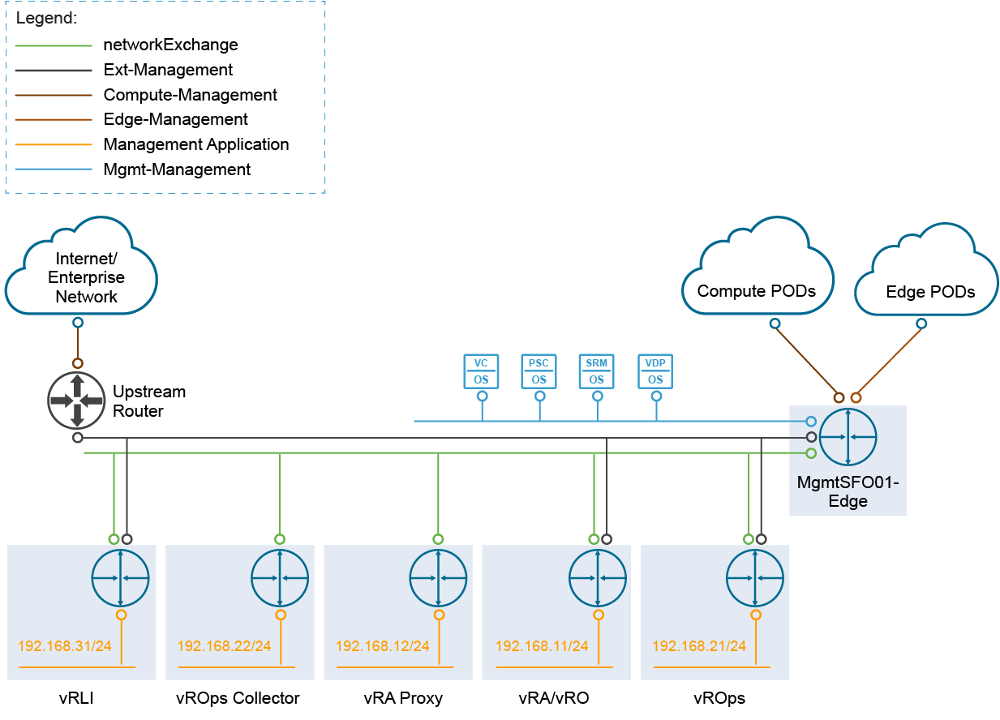

The NSX Edge device associated with a management application is connected via an uplink connection to an external-to-SDDC accessible network and contains at least one IPv4 address on this network.

As a result, this device offers the following capabilities.

-   If the IPv4 range that is used for the application-internal network does not overlap with any other existing IPv4 range, the central DNS service can create DNS entries for nodes on this internal network. Split DNS is not necessary.

-   Inbound access to services, such as Web UI, is supported by the load balancer capabilities of the NSX Edge device. 

-   Application nodes can access the corporate network or the Internet via Source NAT (SNAT) on the NSX Edge device or via the vSphere management network.

-   Routed (static or dynamic) access to the vSphere management network is available for access to the vCenter Server instances.

    1.  #### Tenant Onboarding Process Automation

Certain configuration choices might later facilitate the tenant onboarding process.  

-   Create the primary NSX Edge service gateway to act as the tenant PLR and the logical switch that forms the transit network for use in connecting to the distributed logical router.

-   Connect the primary NSX Edge service gateway uplinks to the external networks and its internal interface to the transit network.

-   Create the NSX distributed logical router to provide routing capabilities for tenant internal networks and connect its uplink to the transit network.

-   Create any tenant networks that are known up front and connect them to the distributed logical router.

    1.  #### Virtual Network Design Example

The *Detailed Example for vRealize Automation Networking* illustration shows an example for implementing a management application virtual network. The example service is vRealize Automation, but any other 3-tier application would look similar. 

Figure 45. Detailed Example for vRealize Automation Networking

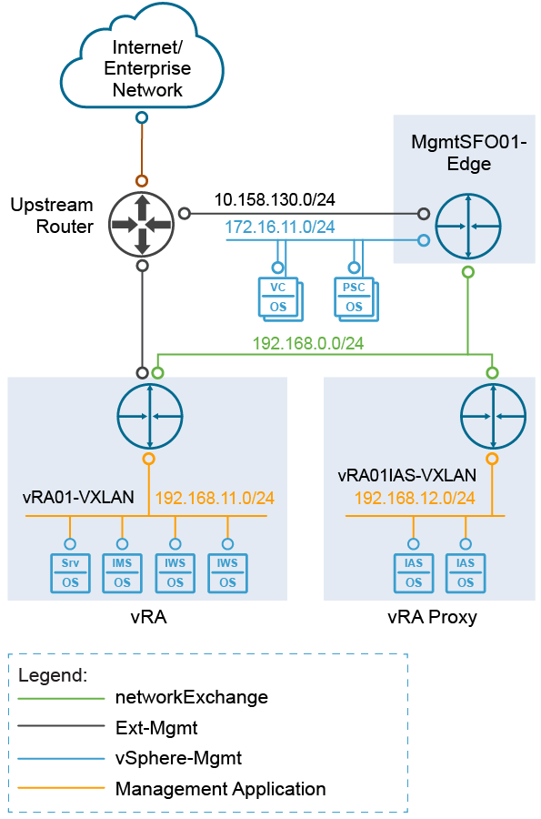

The example is set up as follows:

-   You deploy vRealize Automation onto a single Layer 2 segment, which is provided by a VXLAN virtual wire (green network in *Detailed Example for vRealize Automation Networking*). Micro segmentation between NSX components is not required and therefore not used in this example, but it could be added if desired.

-   The network used by vRealize Automation connects to external networks through NSX for vSphere. NSX Edge services gateways route traffic between between management application virtual networks and the public network.

-   Access to the isolated vSphere-Mgmt network (blue network in Detailed Example for vRealize Automation Networking) is available through the MgmtSFO01-Edge device that provides region-specific routing.

-   All Edge devices are connected over the networkExchange network (green network in Detailed Example for vRealize Automation Networking) that acts as a transit network and as an interface to exchange routing information between the Edge services gateways.  To provide easy mobility of the network used by vRealize Automation during recovery in another region, this network uses an RFC 1918 isolated IPv4 subnet and uses Source NAT (SNAT) to access external networks such as the Internet.

-   Services such as a Web GUI, which must be available to the end users of vRealize Automation, are accessible via the NSX Edge load balancer on the IPv4 address residing on the external network. 

Each application must use a unique IPv4 range for the application internal network(s). The unique IPv4 range supports use of  the central DNS service for creating DNS entries for nodes on this internal network. The following table shows an example of how a mapping from management applications to IPv4 subnets might look.

| Management Application                               | Internal IPv4 Subnet |
|------------------------------------------------------|----------------------|
| vRealize Automation (includes vRealize Orchestrator) | 192.168.11.0/24      |
| vRealize Automation Proxy Agents                     | 192.168.12.0/24      

                                                        192.168.13.0/24       |
| vRealize Operations Manager                          | 192.168.21.0/24      |
| vRealize Operations Remote Collector                 | 192.168.22.0/24      

                                                        192.168.23.0/24       |
| vRealize Log Insight                                 | 192.168.31.0/24      

                                                        192.168.32.0/24       |

The management applications vRealize Automation, vRealize Operations Manager, and vRealize Log Insight divert from the above described setup slightly:

-   vRealize Automation uses the following network containers when deployed to two regions.

-   One container in the first region is for the main vRealize Automation application cluster.  In the second region, a replica of this container is created to support fail over of the vRealize Automation application cluster by using Site Recovery Manager.

-   Two additional network containers - one for each region - hold vRealize Automation proxy agents.

-   vRealize Operations Manager uses the following network containers when deployed to two regions.

-   One container in the first region is for the main vRealize Operations Manager analytics cluster. In the second region, a replica of this container supports failover of the vRealize Operations Manager application cluster by using Site Recovery Manager.

-   Two additional network containers - one in each region - are for connecting remote collectors. 

-   vRealize Log Insight does not use Site Recovery Manager to fail over between regions. Instead, a dedicated instance of Log Insight is deployed in each region. To support this configuration, you deploy two independent network container.

    1.  #### Routing and Region Connectivity Design

This multi-region design is an extension of the single-region design that takes into account SDDC management component failover. The figure below is an example of how virtual application networks are built for vRealize Automation in the SFO01 and LAX01 regions. The same virtual application network configuration is valid for all the other  virtual application networks. 

**Figure 46. Virtual Application Network Configuration in Region A (SFO) and Region B (LAX)**

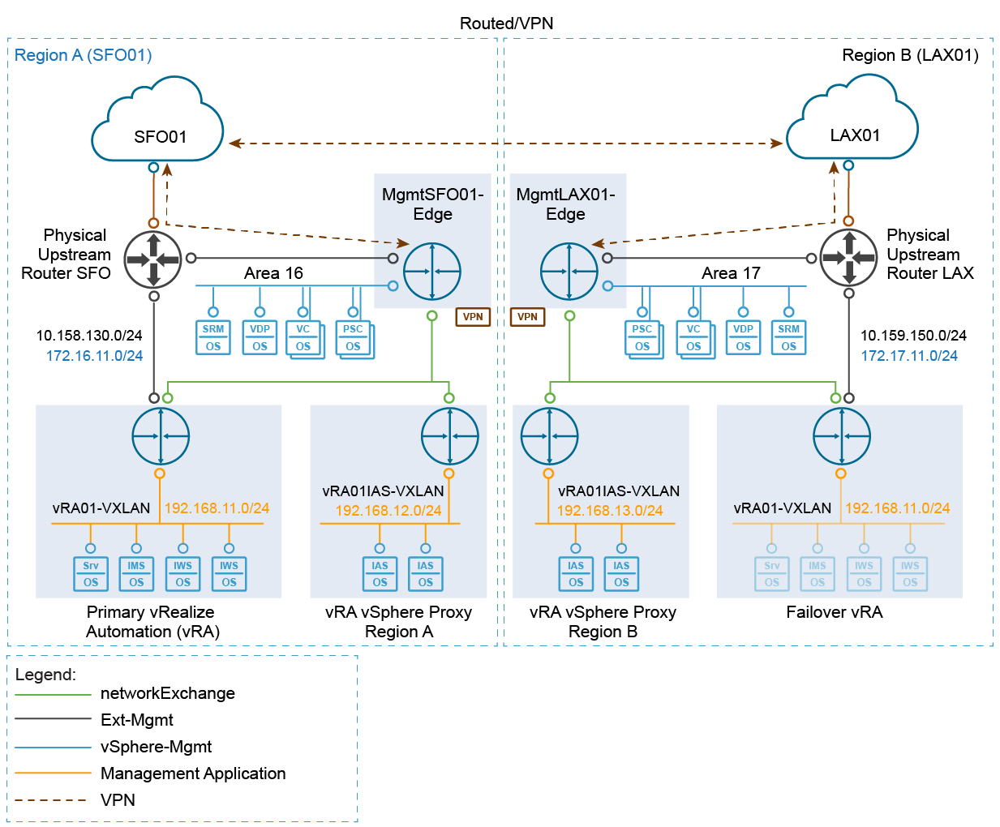

#### Dynamic Routing

Routing is handled by NSX Edge. Management network Edge devices, MgmtSFO01-Edge and Mgmt-LAX01-Edge, work in conjunction with Edge devices that are configured to create virtual application network for each SDDC management component. A dedicated network, networkExchange, facilitates the exchange of transit network traffic and the exchange of routing tables. All NSX Edge devices that are attached to the networkExchange network segment run OSPF to exchange routing information. OSPF route information exchange dependens on the area definition, which is based on the local vSphere-Mgmt network:

| **Network**  | **Region** | **IP Addressing** | **Area ID** |
|--------------|------------|-------------------|-------------|
| vSphere-Mgmt | SFO01      | 172.16.11.0/24    | 16          |
| vSphere-Mgmt | LAX01      | 172.17.11.0/24    | 17          |

If the virtual application network Edge device is attached to the public network to provide public services, it has a default route that points to the external public network router.  If the Edge device does not have an interface on the public network, it receives an OSPF default route from the Management Edge device which has access to the public network. Components that are directly attached to the vSphere-Mgmt network need to use the Management Edge device as the default gateway to reach all components in the environment.

Table 113. **Dynamic Routing Design Decisions**

| Decision ID      | Design Decision                                                                                                            | Design Justification                                                                                                                                                                          | Design Implication                                                                                                                                  |
|------------------|----------------------------------------------------------------------------------------------------------------------------|-----------------------------------------------------------------------------------------------------------------------------------------------------------------------------------------------|-----------------------------------------------------------------------------------------------------------------------------------------------------|
| SDDC-NET-RRC-001 | Ensure that all VMs within virtual application networks can route to VMs in other virtual application networks.            | Shared data and data collection requires VMs to reach each other across the network.                                                                                                          | None                                                                                                                                                |
| SDDC-NET-RRC-002 | Monitoring and collection of data cannot go over connections that use NAT.                                                 | vRealize Operations Manager requires a direct connection to vCenter Server and other components to collect utilization and performance data.                                                  

                                                                                                                                                 Some management components register by IP and need to be reachable on that IP.                                                                                                                 

                                                                                                                                                                                                                                                                                                                                                | None                                                                                                                                                |
| SDDC-NET-RRC-003 | Use dynamic routing to aid in the failover of individual management components.                                            | Removes the need to update static routes to keep track of virtual application network locations.                                                                                              | None                                                                                                                                                |
| SDDC-NET-RRC-004 | Ensure that virtual application networks are unique across the SDDC.                                                       | Routing expects to only have one instance of a CIDR network live at any time to avoid route flapping.                                                                                         | Availability of unique IP subnets                                                                                                                   |
| SDDC-NET-RRC-005 | Base OSPF Area IDs on the second octet of the vSphere management network, and use MD5 encryption for authentication.       

                    For example.:                                                                                                               

                    172.**16**.11.0/24 =&gt; Aread ID = **16**                                                                                  

                    172.**17**.11.0/24 =&gt; Aread ID = **17**                                                                                  | This ensures that only routers in the same management network interchange OSPF routing information based on matching both the Area ID and password.                                           | Ensure that the correct Area ID and passwords are configured on the Edge devices to match the management network that they are being deployed into. |
| SDDC-NET-RRC-006 | Use NSX Edge appliance size Large and deploy NSX Edge appliance in High Availability (HA) mode.                            | A large NSX Edge appliance supports 9.7Gbps of firewall performance and throughput of 1 Million concurrent sessions.                                                                          

                                                                                                                                                 When fronting a management application, the Edge L7 proxy can handle 2.2 Gbps throughput and 46,000 connections/sec with 8,000 concurrent connections.                                         | By default, Edge appliances are configured with 2 vCPU and 1 GB of memory.                                                                          |
| SDDC-NET-RRC-007 | Use a dedicated network for exchange of routing information and traffic between different gateways.                        | This dedicate network will be treated as the SDDC core network.  This is where all the transit network traffic will flow through and in the process create an isolated OSPF exchange network. | Requires creation of a dedicated VXLAN-backed logical switch.                                                                                       |
| SDDC-NET-RRC-008 | Use Source-NAT to provide public network access for virtual application networks and hosts on the SDDC management networks | VMs in the SDDC need access to Active Directory, NTP and other external services. Some SDDC VMs may also require public Internet access                                                       | Requires implementation of SNAT on the mgmtSFO01-Edge as well as all Edge devices that have a direct connection to the public network.              |

#### Region Connectivity and Dynamic Routing

There is one Management Edge device in each region. The role of the Management Edge device is to provide connectivity between regions and to exchange region-specific routes with other connected Management Edge devices. The Management Edge device is configured to exchange OSPF routing data with all the region-specific virtual application network. Edge devices are attached to their respective networkExchange networks. These routes are consolidated and exchanged with all connected Management Edge devicesusing iBGP. All Management Edge devices belong to the same AS (Autonomous System) with regards to BGP routing.

VPN tunnels are used to establish connectivity between regions. Local traffic is carried over the Management Edge device. The following networks are carried over the VPN, and have the following sources. 

| Management Application                        | **vPOD Network - SFO01** | **vPOD Network - LAX01** |
|-----------------------------------------------|--------------------------|--------------------------|
| vSphere-Mgmt                                  | 172.16.11.0/24           | 172.17.11.0/24           |
| vSphere Replication                           | 172.16.16.0/24           | 172.17.16.0/24           |
| vRealize Automation and vRealize Orchestrator | 192.168.11.0/24          | N/A                      |
| vRealize Automation Proxy Agents              | 192.168.12.0/24          | 192.168.13.0/24          |
| vRealize Operations Manager                   | 192.168.21.0/24          | N/A                      |
| vRealize Operations Manager Remote Collectors | 192.168.22.0/24          | 192.168.23.0/24          |
| vRealize LogInsight                           | 192.168.31.0/24          | 192.168.32.0/24          |
| networkExchange                               | 192.168.0.0/24           | 192.168.1.0/24           |

In a customer implementation, the site-to-site VPN can be replaced with a router that provides transparent connectivity between the different regions.  This can be accomplished in a number of ways and is not limited to these:

-   Direct attachment using leased lines or fiber connectivity

-   MPLS or even Frame Relay connectivity

-   VPN-capable routers connected over the Internet.

The existing customer device will need to be configured with the region-specific OSPF area and password in order to provide the routing capabilities needed within the virtual environment.

Table 114. **Region Connectivity and Dynamic Routing Design Decisions**

| Decision ID      | Design Decision                                                           | Design Justification                                                                                                                                      | Design Implication |
|------------------|---------------------------------------------------------------------------|-----------------------------------------------------------------------------------------------------------------------------------------------------------|--------------------|
| SDDC-NET-RRC-009 | Establish VPN tunnels between Management NSX Edge devices in each region. | Connectivity between regions is required. VPN tunnels at the Management Edge devices is a method that could be used in virtually any deployment scenario. | None               |

#### Virtual Application Networks and Dynamic Routing Across Regions

For SDDC components that fail over to another region in the event of a disaster, route redistribution is disabled in NSX Edge. This prevents the same routes from being advertised in both regions for their virtual application networks. This makes it possible for the  virtual application network Edge device to participate in region-specific OSPF route exchanges without announcing its virtual application network route.

To facilitate failover of the virtual application network from one region to the other for some SDDC components, this design creates a shadow virtual application network in the recovery region, LAX01 in this case. This shadow  virtual application network is configured identically, with the same SNAT and DNAT rules and load balancer VIP as needed. The only difference is the IP addressing used on the networkExchange network and the optional public interface.

SDDC component  virtual application networks can be moved between regions either for testing or during failover. When an SDDC component is moved the location of that component's  virtual application network needs to be changed in the VPN configuration. The  virtual application network Edge device also needs to be reconfigured to either start or stop redistributing connected  virtual application networks.  The decision to start or stop redistribution depends on whether the virtual application network Edge device is now the active Edge device or the failed over Edge device.

Table 115. **Virtual Application Networks and Dynamic Routing Across Regions Design Decisions**

| Decision ID      | Design Decision                                                                                              | Design Justification                                                                                                                                                                                                                                 | Design Implication                                        |
|------------------|--------------------------------------------------------------------------------------------------------------|------------------------------------------------------------------------------------------------------------------------------------------------------------------------------------------------------------------------------------------------------|-----------------------------------------------------------|
| SDDC-NET-RRC-010 | Disable route redistribution on virtual application network Edge devices for SDDC components that fail over. | Because SDDC components in the protected region have identically configured virtual application networks in their recovery region, the Edge device fronting those networks cannot announce connected routes because that causes routing black holes. | Only active networks can be announced as routing updates. |

### BCDR Design

You can support business continuity and disaster recovery (BCDR) in the SDDC by protecting vCenter Server, NSX for vSphere, vRealize Automation, vRealize Operations Manager, and vRealize Log Insight. Enable backup and failover to a recovery region of these management applications to continue the delivery of infrastructure management, operations management, and cloud platform management.  

#### Data Protection Design

Data backup protects the data of your organization against data loss, hardware failure, accidental deletion, or other disaster for each region. For consistent image-level backups, use backup software that is based on the VMware Virtual Disk Development Kit (VDDK), such as vSphere Data Protection.

Table 116. vSphere Data Protection Design Decision

| Decision ID      | Design Decision                                                   | Design Justification                                                                                                                                            | Design Implication                                                                        |
|------------------|-------------------------------------------------------------------|-----------------------------------------------------------------------------------------------------------------------------------------------------------------|-------------------------------------------------------------------------------------------|
| SDDC-OPS-BKP-001 | Use vSphere Data Protection to back up all management components. | vSphere Data Protection provides the functionality that is required to back up full image VMs and applications in those VMs, for example, Microsoft SQL Server. | vSphere Data Protection lacks some features that are available in other backup solutions. |

#### Logical Design

vSphere Data Protection protects the virtual infrastructure at the VMware vCenter Server layer. Because vSphere Data Protection is connected to the Management vCenter Server, it can access all management ESXi hosts, and can detect the virtual machines that require backups.

Figure 47. vSphere Data Protection Logical Design

#### Backup Datastore

vSphere Data Protection uses deduplication technology to back up virtual environments at data block level, which enables efficient disk utilization. To optimize backups and leverage the VMware vSphere Storage APIs, all ESXi hosts must have access to the production storage. The backup datastore stores all the data that is required to recover services according to a Recovery Point Objective (RPO). Determine the target location and make sure that it meets performance requirements.

Table 117. Options for Backup Storage Location

| Option                                                         | Benefits                                                                                                                                 | Drawbacks                                                                                             |
|----------------------------------------------------------------|------------------------------------------------------------------------------------------------------------------------------------------|-------------------------------------------------------------------------------------------------------|
| Store production and backup data on the same storage platform. | You do not have to request a new storage configuration from the storage team.                                                            

                                                                  You can take full advantage of vSphere capabilities.                                                                                      | You cannot recover your data if the destination datastore or the production storage is unrecoverable. |
| Store backup data on dedicated storage.                        | If production storage becomes unavailable, you can recover your data because your backup data is not located on the same shared storage.

                                                                  You separate production and backup virtual machines.                                                                                      

                                                                  The backup schedule does not impact production storage performance because the backup storage is completely separate.                     | You might be required to install and configure a dedicated storage volume for backups.                |

Table 118. VMware Backup Store Target Design Decisions

| Decision ID      | Design Decision                                                                                                                                         | Design Justification                                                                                                                                                                                                                         | Design Implication                              |
|------------------|---------------------------------------------------------------------------------------------------------------------------------------------------------|----------------------------------------------------------------------------------------------------------------------------------------------------------------------------------------------------------------------------------------------|-------------------------------------------------|
| SDDC-OPS-BKP-002

                   | Allocate a dedicated NFS datastore for the vSphere Data Protection appliance and the backup data in each region according to *Physical Storage Design*. | vSphere Data Protection emergency restore operations are possible even when the primary VMware Virtual SAN datastore is not available because the vSphere Data Protection storage volume is separate from the primary Virtual SAN datastore.

                                                                                                                                                                              The amount of storage required for backups is greater than the amount of storage available in the Virtual SAN datastore.                                                                                                                      | You must provide an external NFS storage array. |

#### Performance

vSphere Data Protection generates a significant amount of I/O operations, especially when performing multiple concurrent backups. The storage platform must be able to handle this I/O. If the storage platform does not meet the performance requirements, it might miss backup windows. Backup failures and error messages might occur. Run the vSphere Data Protection performance analysis feature during virtual appliance deployment or after deployment to assess performance.

Table 119. VMware vSphere Data Protection Performance

| Total Backup Size | Avg Mbps in 4 hours |
|-------------------|---------------------|
| 0.5 TB            | 306 Mbps            |
| 1 TB              | 611 Mbps            |
| 2 TB              | 1223 Mbps           |

#### Volume Sizing

vSphere Data Protection can dynamically expand the destination backup store from 2 TB to 8 TB. Using an extended backup storage requires additional memory on the vSphere Data Protection appliance. 

Table 120. VMware vSphere Data Protection Sizing Guide

| Backup Store Size | Appliance Memory (Minimum) |
|-------------------|----------------------------|
| 2 TB              | 6 GB                       |
| 4 TB              | 8 GB                       |
| 6 TB              | 10 GB                      |
| 8 TB              | 12 GB                      |

Table 121. VMware Backup Store Size Design Decisions

| Decision ID      | Design Decision                           | Design Justification                                                                                                                                                                           | Design Implication                                                                |
|------------------|-------------------------------------------|------------------------------------------------------------------------------------------------------------------------------------------------------------------------------------------------|-----------------------------------------------------------------------------------|
| SDDC-OPS-BKP-003 | Set the backup targets to 4 TB initially. | vSphere Data Protection is used for the management stack of a single region. The management stack currently consumes approximately 2 TB of disk space, uncompressed and without deduplication. | More NFS storage will be required to accommodate the increased disk requirements. |

#### Other Considerations

vSphere Data Protection can protect virtual machines that reside on VMware Virtual SAN from host failures. The virtual machine storage policy is not backed up with the virtual machine, but you can restore the storage policy after restoring the virtual machine.

1.  The default Virtual SAN storage policy includes Number of Failures to Tolerate = 1, which means that virtual machine data will be mirrored.

vSphere Data Protection is used to restore virtual machines that failed or need their data reverted to a previous state.

Backup Policies

Use vSphere Data Protection backup policies to specify virtual machine backup options, the schedule window, and retention policies.

Virtual Machine Backup Options

vSphere Data Protection provides the following options for performing a backup of a virtual machine:

-   **HotAdd.** Provides full image backups of virtual machines, regardless of the guest operating system.

<!-- -->

-   The virtual machine base disk is attached directly to vSphere Data Protection to back up data. vSphere Data Protection uses Changed Block Tracking to detect and back up blocks that are altered.

-   The backup and restore performance is faster because the data flow is through the VMkernel layer instead of over a network connection.

-   A quiesced snapshot can be used to redirect the I/O of a virtual machine disk .vmdk file.

-   HotAdd does not work in multi-writer disk mode.

<!-- -->

-   **Network Block Device (NBD).** Transfers virtual machine data across the network to allow vSphere Data Protection to back up the data.

<!-- -->

-   The performance of the virtual machine network traffic might be lower.

-   NBD takes a quiesced snapshot. As a result, it might interrupt the I/O operations of the virtual machine to swap the .vmdk file or consolidate the data after the backup is complete.

-   The time to complete the virtual machine backup might be longer than the backup window.

-   NBD does not work in multi-writer disk mode.

<!-- -->

-   **vSphere Data Protection Agent Inside Guest OS. **Provides backup of certain applications that are running in the guest operating system through an installed backup agent.

<!-- -->

-   Enables application-consistent backup and recovery with Microsoft SQL Server, Microsoft SharePoint, and Microsoft Exchange support.

-   Provides more granularity and flexibility to restore on the file level.

Table 122. Virtual Machine Transport Mode Design Decisions

| Decision ID      | Design Decision                                                                                              | Design Justification                                                                                        | Design Implication                                                                  |
|------------------|--------------------------------------------------------------------------------------------------------------|-------------------------------------------------------------------------------------------------------------|-------------------------------------------------------------------------------------|
| SDDC-OPS-BKP-004 | Use HotAdd to back up virtual machines.                                                                      | HotAdd optimizes and speeds up virtual machine backups, and does not impact the vSphere management network. | All ESXi hosts need to have the same visibility of the virtual machine datastores.  |
| SDDC-OPS-BKP-005 | Use the vSphere Data Protection agent for backups of SQL databases on Microsoft SQL Server virtual machines. | You can restore application data instead of entire virtual machines.                                        | You must install the vSphere Data Protection agent and maintain it.                 |

Schedule Window

Even though vSphere Data Protection uses the Changed Block Tracking technology to optimize the backup data, do not use a backup window when the production storage is in high demand to avoid any business impact.

1.  Do not perform any backup or other administrative activities during the vSphere Data Protection maintenance window. Restore operations are allowed. By default, the vSphere Data Protection maintenance window begins at 8 AM local server time and continues uninterrupted until 8 PM or until the backup jobs are complete. Configure maintenance windows according to IT organizational policy requirements.

 

Table 123. Backup Schedule Design Decisions

| Decision ID      | Design Decision                                     | Design Justification                                                                                                                                                                       | Design Implication                                                                                                              |
|------------------|-----------------------------------------------------|--------------------------------------------------------------------------------------------------------------------------------------------------------------------------------------------|---------------------------------------------------------------------------------------------------------------------------------|
| SDDC-OPS-BKP-006 | Schedule daily backups.                             | Allows for the recovery of virtual machines data that is at most a day old                                                                                                                 | Data that changed since the last backup, 24 hours ago, is lost.                                                                 |
| SDDC-OPS-BKP-007 | Schedule backups outside the production peak times. | Ensures that backups occur when the system is under the least amount of load. You should verify that backups are completed in the shortest time possible with the smallest risk of errors. | Backups need to be scheduled to start between 8:00 PM and 8:00 AM or until the backup jobs are complete, whichever comes first. |

Retention Policies

Retention policies are properties of a backup job. If you group virtual machines by business priority, you can set the retention requirements according to the business priority.

Table 124. Retention Policies Design Decision

| Decision ID      | Design Decision                     | Design Justification                                                                                                         | Design Implication                                                                                                 |
|------------------|-------------------------------------|------------------------------------------------------------------------------------------------------------------------------|--------------------------------------------------------------------------------------------------------------------|
| SDDC-OPS-BKP-008 | Retain backups for at least 3 days. | Keeping 3 days of backups enables administrators to restore the management applications to a state within the last 72 hours. | Depending on the rate of change in virtual machines, backup retention policy can increase the storage target size. |

Component Backup Jobs

You can configure backup for each SDDC management component separately. For this scenario, no requirement to back up the entire SDDC exists, and this design does not imply such an operation. Some products can perform internal configuration backups. Use those products in addition to the whole VM component backups as appropriate.

Table 125. Component Backup Jobs Design Decision

| Decision ID      | Design Decision                                                   | Design Justification                                                                                                               | Design Implication                                          |
|------------------|-------------------------------------------------------------------|------------------------------------------------------------------------------------------------------------------------------------|-------------------------------------------------------------|
| SDDC-OPS-BKP-009 | Use the internal configuration backup features within VMware NSX. | Restoring small configuration files can be a faster and less destructive method to achieve a similar restoration of functionality. | An FTP server is required for the NSX configuration backup. |

Backup Jobs in Region A

Create a single backup job for the components of a management application according to the node configuration of the application in Region A.

Table 126. VM Backup Jobs in Region A

| Product                      | Image VM Backup Jobs in Region A           | Application VM Backup Jobs in Region A |
|------------------------------|--------------------------------------------|----------------------------------------|
| ESXi                         | N/A - No Backup                            |                                        |
| Platform Services Controller | Part of the vCenter Server backup job      |                                        |
| vCenter Server               | Management Job                             

                                mgmt01vc01.sfo01.rainpole.local             

                                mgmt01psc01.sfo01.rainpole.local            

                                Compute Job                                 

                                comp01vc01.sfo01.rainpole.local             

                                comp01psc01.sfo01.rainpole.local            |                                        |
| NSX for vSphere              | Management Job                             

                                mgmt01nsxm01.sfo01.rainpole.local           

                                Compute Job                                 

                                comp01nsxm01.sfo01.rainpole.local           |                                        |
| vRealize Automation          | vra01vro01a.rainpole.local                 

                                vra01vro01b.rainpole.local                  

                                vra01dem01.rainpole.local                   

                                vra01dem02.rainpole.local                   

                                vra01ias01.rainpole.local                   

                                vra01ias02.rainpole.local                   

                                vra01ims01a.rainpole.local                  

                                vra01ims01b.rainpole.local                  

                                vra01iws01a.rainpole.local                  

                                vra01iws01b.rainpole.local                  

                                vra01svr01a.rainpole.local                  

                                vra01svr01b.rainpole.local                  

                                vra01mssql01.rainpole.local                 

                                vra01ids01a.rainpole.local                  | vra01mssql01.rainpole.local            |
| vRealize Log Insight         | vrli-mstr-01                               

                                vrli-wrkr-01                                

                                vrli-wrkr-02                                |                                        |
| vRealize Operations Manager  | vrops-mstrn-01                             

                                vrops-repln-02                              

                                vrops-datan-03                              

                                vrops-datan-04                              

                                vrops-rmtcol-01                             

                                vrops-rmtcol-02                             |                                        |
| vRealize Orchestrator        | Part of the vRealize Automation backup job |                                        |

Backup Jobs in Region B

Create a single backup job for the components of a management application according to the node configuration of the application in Region B.

Table 127. VM Backup Jobs in Region B

| Product                      | Image VM Backups in Region B               | Application VM Backup Jobs in Region B |
|------------------------------|--------------------------------------------|----------------------------------------|
| ESXi                         | N/A - No Backup                            |                                        

                                                                                                                     

                                                                                                                     

                                                                                                                     

                                                                             None                                    

                                                                                                                     |
| Platform Services Controller | Part of the vCenter Server backup job      |                                        |
| vCenter Server               | Management Job                             

                                mgmt01vc51.lax01.rainpole.local             

                                mgmt01psc51.lax01.rainpole.local            

                                Compute Job                                 

                                comp01vc51.lax01.rainpole.local             

                                comp01psc51.lax01.rainpole.local            |                                        |
| NSX for vSphere              | Management Job                             

                                mgmt01nsxm51.lax01.rainpole.local           

                                Compute Job                                 

                                comp01nsxm51.lax01.rainpole.local           |                                        |
| vRealize Automation          | vra01ias51.rainpole.local                  

                                vra01ias52.rainpole.local                   |                                        |
| vRealize Log Insight         | vrli-mstr-51                               

                                vrli-wrkr-51                                

                                vrli-wrkr-52                                |                                        |
| vRealize Operations Manager  | vrops-rmtcol-51                            

                                vrops-rmtcol-52                             |                                        |
| vRealize Orchestrator        | Part of the vRealize Automation backup job |                                        |

#### Disaster Recovery Design

The SDDC disaster recovery design includes two locations:

-   **Protected Region A in San Francisco**. Region A has the management stack virtual machine workloads that are being protected and is referred to as the *protected region *in this document.

-   **Recovery Region B in Los Angeles**. Region B is the disaster recovery region and is referred to as the *recovery region*.

Site Recovery Manager can automate the setup and execution of the disaster recovery plans between these two regions.

1.  A region in the VMware Validated Design is equivalent to the site construct in Site Recovery Manager.

    1.  #### Disaster Recovery Logical Design

Certain SDDC management applications and services must be available in the event of a disaster. These management applications are running on vSphere virtual machines, and can have dependencies on applications and services that run in both regions.

-   Region A has a management cluster of ESXi hosts with management application virtual machines that must be protected. 

-   Region B has a management cluster of ESXi hosts with sufficient free capacity to host the protected management applications from Region A.

-   Each region has a vCenter Server instance for the management ESXi hosts within the region. 

-   Each region has a Site Recovery Manager server with an embedded Site Recovery Manager database. 

-   In each region, Site Recovery Manager is integrated with the Management vCenter Server instance. 

-   vSphere Replication provides virtual machine replication between Region A and Region B through hypervisor-based replication. 

-   vSphere Replication replicates data from Region A to Region B using using a dedicated vSphere TCP/IP stack.

Users and administrators access management applications from other branch offices and remote locations over the corporate Local Area Network (LAN), Wide Area Network (WAN), and Virtual Private Network (VPN).

Figure 48. Disaster Recovery Logical Design

#### Deployment Design for Site Recovery Manager 

A Site Recovery Manager instance is required for both the protected region and the recovery region. Install and configure Site Recovery Manager after you install and configure vCenter Server and the Platform Services Controller in the region. Site Recovery Manager takes advantage of vCenter Server and Platform Services Controller services such as storage management, authentication, authorization, and guest customization. Site Recovery Manager uses the standard set of vSphere administrative tools to manage these services.

Consider the following deployment options:

-   vCenter Server options

<!-- -->

-   You can use Site Recovery Manager and vSphere Replication with the vCenter Server Appliance or with vCenter Server for Windows. 

-   You can deploy a vCenter Server Appliance in one region and a vCenter Server for Windows instance in the other region. 

<!-- -->

-   Site Recovery Manager options

<!-- -->

-   You can use either a physical system or a virtual system.

-   You can deploy Site Recovery Manager on a shared system, such as the system of vCenter Server for Windows, or on a dedicated system.

Table 128. Design Decisions for Site Recovery Manager and vSphere Replication Deployment

| Decision ID   | Design Decision                                                                  | Design Justification                                                                                                                                                                                                | Design Implication                                                                                                 |
|---------------|----------------------------------------------------------------------------------|---------------------------------------------------------------------------------------------------------------------------------------------------------------------------------------------------------------------|--------------------------------------------------------------------------------------------------------------------|
| SDDC-BCDR-001 | Deploy Site Recovery Manager in a virtual machine.                               | All components of the SDDC solution must support the highest levels of availability. When Site Recovery Manager runs as a virtual machine, you can enable the availability capabilities of vCenter Server clusters. | None.                                                                                                              |
| SDDC-BCDR-002 | Deploy each Site Recovery Manager instance in the management cluster.            | All management components must be in the same cluster.                                                                                                                                                              | None.                                                                                                              |
| SDDC-BCDR-003 | Deploy each Site Recovery Manager instance with an embedded PostgreSQL database. | Reduce the dependence on external components.                                                                                                                                                                       

                                                                                                    Reduce potential database licensing costs.                                                                                                                                                                           | Requires assigning database administrators who have the skills and tools to administer PostgreSQL databases.       |
| SDDC-BCDR-004 | Deploy each Site Recovery Manager instance with trusted certificates.            | Similarly to vCenter Server, Site Recovery Manager must use trusted CA-signed certificates.                                                                                                                         | Replacing the default certificates with trusted CA-signed certificates complicates installation and configuration. |

 

#### Networking Design for Disaster Recovery

Moving a service physically from one region to another represents a networking challenge, especially if applications have hard-coded IP addresses. Network address space and IP address assignment considerations require that you either use the same IP address or a different IP address at the recovery region. In many situations, you assign new IP addresses because VLANs do not typically stretch between regions. 

While protecting the management applications, it is possible to simplify the problem of IP address assignment. This design leverages a load balancer to separate a public network segment and a private network segment. The private network can remain unchanged and only the external load balancer interface has to be reassigned.

-   On the public network segment, the management application is accessible via one or more virtual IP (VIP) addresses

-   On the isolated private network segment, the application's virtual machines are isolated

After a failover, the recovered application is available under a different IPv4 address (VIP).  The use of the new IP address requires changes to the DNS records. You can change the DNS records manually or by using a script in the Site Recovery Manager recovery plan.

Figure 49. Logical Network Design for Cross-Region Deployment with Management Application Network Container

The IPv4 subnets (orange networks) are routed within the vSphere management network of each region. Nodes on these network segments are reachable from within the SDDC. IPv4 subnets, such as the subnet for the vRealize Automation primary components, overlap across a region. Make sure that only the active IPv4 subnet is propagated in the region and beyond. The public facing Ext-Mgmt network of both regions (grey networks) is reachable by SDDC users and provides connection to external resources, such as Active Directory or DNS. See *Virtualization Network Design*. 

Load balancing functionality is provided by NSX Edge devices. In each region, you use the same configuration for the management applications and their Site Recovery Manager shadow. Active Directory and DNS services must be running in both the protected and recovery regions.

Table 129. Site Recovery Manager Networking Design Decision

| Decision ID   | Design Decision                                                                       | Design Justification                                   | Design Implication                                                                                           |
|---------------|---------------------------------------------------------------------------------------|--------------------------------------------------------|--------------------------------------------------------------------------------------------------------------|
| SDDC-BCDR-005 | Configure application failover between regions by manually modifying the DNS records. | Retain the access to the application during failover . | You must customize the Site Recovery Manager recovery plans to wait for the DNS configuration to take place. |

#### vSphere Replication

In a VMware Virtual SAN environment, you cannot configure array-based replication. Use vSphere Replication instead to transfer VMs between regions. 

vSphere Replication uses a VMkernel management interface on the ESXi host to send replication traffic to the replication site's vSphere Replication appliance. To isolate vSphere Replication traffic so that it does not impact other vSphere management traffic, configure the vSphere Replication network in the following way.

-   Place vSphere Replication traffic on a dedicated VMkernel adapter.

-   Ensure that the vSphere Replication VMkernel adapter uses a dedicated replication VLAN in the region.

-   Attach the vSphere Replication server network adapter to the dedicated vSphere Replication VLAN in the region

-   Enable the service for vSphere Replication and vSphere Replication NFC traffic on the dedicated vSphere Replication VMkernel adapter.

For more information about the vSphere Replication traffic on the management ESXi hosts, see *Virtualization Network Design*.

vSphere Replication appliances and vSphere Replication servers are the target for the replication traffic that originates from the vSphere Replication VMkernel ports.

Table 130. vSphere Replication Design Decisions

| **Decision ID** | **Design Decision**                                                                                     | **Design Justification**                                                                                                                                                                                                        | **Design Implication**                                                                                                          |
|-----------------|---------------------------------------------------------------------------------------------------------|---------------------------------------------------------------------------------------------------------------------------------------------------------------------------------------------------------------------------------|---------------------------------------------------------------------------------------------------------------------------------|
| SDDC-BCDR-006   | Set up a dedicated vSphere Replication distributed port group.                                          | Ensures that vSphere Replication traffic does not impact other vSphere management traffic.                                                                                                                                      | You must allocate a dedicated VLAN for vSphere Replication.                                                                     |
| SDDC-BCDR-007   | Set up a dedicated VMkernel adapter on the management ESXi hosts                                        | The vSphere Replication servers potentially receive large amounts of data from the VMkernel adapters on the ESXi hosts. Ensure that the ESXi server replication traffic is redirected to the dedicate vSphere Replication VLAN. | Additional configuration on the ESXi hosts in the form of static routes.                                                        |
| SDDC-BCDR-008   | Attach a virtual network adapter for the vSphere Replication VMs to the vSphere Replication port group. | Ensures that the vSphere Replication VMs can communicate on the correct replication VLAN.                                                                                                                                       | vSphere Replication VMs may need additional network adapters to be able to communicate on the management and replication VLANs. |

#### Placeholder Virtual Machines

Site Recovery Manager creates a placeholder virtual machine on the recovery region for every machine from the Site Recovery Manager protection group. Placeholder virtual machine files contain virtual machine configuration metadata but not virtual machine disks, and the files are very small. Site Recovery Manager adds the placeholder virtual machines as recovery region objects in the Management vCenter Server.

#### Snapshot Space

To perform failover tests, you must provide additional storage for the snapshots of the replicated VMs. This storage is minimal in the beginning, but grows as test VMs write to their disks. Replication from the protected region to the recovery region continues during this time. The snapshots created during testing are deleted after the failover test is complete.

#### Messages and Commands for Site Recovery Manager

Site Recovery Manager has options to present users with messages that provide notification and accept acknowledgement. Site Recovery Manager also provides a mechanism to run commands and scripts as necessary when executing a recovery plan. You can insert pre-power-on or post-power-on messages and commands to the recovery plans. These messages and commands are not specific to Site Recovery Manager, but support pausing the execution of the recovery plan to complete other procedures, or executing customer-specific commands or scripts to enable automation of recovery tasks.

#### Site Recovery Manager Messages

Some additional steps might be required before, during, and after recovery plan execution. For example you might set up the environment so that a message appears when a recovery plan is initiated, and that the administrator must acknowledge the message before the recovery plan continues. Messages are specific to each IT organization.

Consider the following example messages and confirmation steps:

-   Verify that IP address changes are made on the DNS server and that the changes are propagated.

-   Verify that the Active Directory services are available.

-   After the management applications are recovered, perform application tests to verify that the applications are recovered correctly.

Additionally, confirmation steps can be inserted after every group of services that have a dependency on other services. These conformations can be used to pause the recovery plan so that appropriate verification and testing be performed before subsequent steps are taken. These services are defined as follows:

-   Infrastructure services

-   Core services

-   Database services

-   Middleware services

-   Application services

-   Web services

Details on each message are specified in the workflow definition of the individual recovery plan.

#### Site Recovery Manager Commands

You can run custom scripts to perform infrastructure configuration updates or configuration changes on the virtual machine environment. The scripts that a recovery plan executes are located on the Site Recovery Manager server. The scripts can run against the Site Recovery Manager server or can impact a virtual machine.

If a script must run in the virtual machine, Site Recovery Manager does not run it directly, but instructs the virtual machine to do it. The audit trail that Site Recovery Manager provides does not record the execution of the script because the operation is on the target virtual machine.

Scripts or commands must be available in the path on the virtual machine according to the following guidelines: 

-   Use full paths to all executables. For example c:\\windows\\system32\\cmd.exe instead of cmd.exe.

-   Call only.exe or .com files from the scripts. Command-line scripts can call only executables.

-   To run a batch file, start the shell command with c:\\windows\\system32\\cmd.exe. 

The scripts that are run after powering on a virtual machine are executed under the Local Security Authority of the Site Recovery Manager server. Store post-power-on scripts on the Site Recovery Manager virtual machine. Do not store such scripts on a remote network share.

#### Recovery Plans for Site Recovery Manager

A recovery plan is the automated plan (runbook) for full or partial failover from Region A to Region B.

#### Startup Order and Response Time

Virtual machine priority determines virtual machine startup order.

-   All priority 1 virtual machines are started before priority 2 virtual machines.

-   All priority 2 virtual machines are started before priority 3 virtual machines.

-   All priority 3 virtual machines are started before priority 4 virtual machines.

-   All priority 4 virtual machines are started before priority 5 virtual machines.

-   You can additionally set start-up order of virtual machines within each priority group.

You can configure the following timeout parameters:

-   Response time, which defines the time to wait after the first virtual machine powers on before proceeding to the next virtual machine in the plan.

-   Maximum time to wait if the virtual machine fails to power on before proceeding to the next virtual machine.

You can adjust response time values as necessary during execution of the recovery plan test to determine the appropriate response time values. 

#### Recovery Plan Test Network

When you create a recovery plan, you must configure test network options. The following options are available.

-   **Isolated Network (Automatically Created)**. An isolated private network is created automatically on each ESXi host in the cluster for a virtual machine that is being recovered. Site Recovery Manager creates a standard switch and a port group on it.
    A limitation of this automatic configuration is that a virtual machine connected to the isolated port group on one ESXi host cannot communicate with a virtual machine on another ESXi host. This option limits testing scenarios and provides an isolated test network only for basic virtual machine testing.

-   **Port Group**. Selecting an existing port group provides a more granular configuration to meet the client’s testing requirements. If you want virtual machines across ESXi hosts to communicate, use either a standard or distributed switch with uplinks to the production network, and create a port group on the switch that is tagged with a non-routable VLAN. In this way, the network is isolated and cannot communicate with other production networks.

Because the isolated application networks are fronted by a load balancer, the recovery plan test network is equal to the recovery plan production network and provides realistic verification of a recovered management application.

Table 131. Recovery Plan Test Network Design Decision

| Decision ID   | Design Decision                                         | Design Justification                                                                               | Design Implication                                                                                                                                                                                                                                                                        |
|---------------|---------------------------------------------------------|----------------------------------------------------------------------------------------------------|-------------------------------------------------------------------------------------------------------------------------------------------------------------------------------------------------------------------------------------------------------------------------------------------|
| SDDC-BCDR-009 | Use the target recovery production network for testing. | The design of the application isolated networks supports their use as recovery plan test networks. | During recovery testing, a management application will not be reachable using its production FQDN. Either access the application using its VIP address or assign a temporary FQDN for testing. Note that this will result in certificate warnings due to name and certificate mismatches. |

 

1.  Cloud Management Detailed Design
    --------------------------------

    1.  ### vRealize Automation Design

VMware vRealize Automation provides the Service Catalog, from which applications can be deployed, and the Self-Service Portal that lets end users take full advantage of the Software Defined Data Center. 

#### vRealize Automation Conceptual Design

The conceptual design of the vRealize Automation Cloud Management Platform is illustrated in the following diagram. Key design components and their descriptions are also provided. 

Figure 50. Cloud Management Platform Conceptual Design

 

The Cloud Management Platform consists of the following design element and components.

Table 132. Design Elements and Components

| Design Element                      | Design Components                                                                                                                                                                                                                          |
|-------------------------------------|--------------------------------------------------------------------------------------------------------------------------------------------------------------------------------------------------------------------------------------------|
| Users                               | Cloud administrators – Tenant, group, fabric, infrastructure, service, and other administrators as defined by business policies and organizational structure.                                                                              

                                       Cloud (or *tenant*) users – Provide direct access to virtual machine to perform operating system-level operations provided by vRealize Automation IaaS services.                                                                            |
| Cloud Management Portal             | The Cloud Management Portal provides self-service capabilities for users to administer, provision and manage workloads.                                                                                                                    

                                       vRealize Automation portal, Admin access – The default root tenant portal URL used to set up and administer tenants and global configuration options.                                                                                       

                                       vRealize Automation portal, Tenant access – Refers to a subtenant and is accessed using a unique URL, with an appended tenant identifier.                                                                                                   

                                       It is also possible for a tenant portal to refer to the default tenant portal in some configurations. In this case, the URLs are the same and the user interface is contextually controlled by the assigned RBAC permissions of that user.  |
| Tools and supporting infrastructure | The following are the building blocks and logical constructs that provide the foundation of the cloud.                                                                                                                                     

                                       VM Templates and Blueprints - These are the templates used in authoring the blueprints that tenants (end users) use to provision their cloud workloads.                                                                                     |
| Provisioning infrastructure         | The following are the on-premise and off-premise resources which together form a hybrid cloud.                                                                                                                                             

                                       Virtual – Supported hypervisors and associated management tools.                                                                                                                                                                            

                                       Cloud – Supported cloud providers and associated API interfaces.                                                                                                                                                                            

                                       In the above diagram illustrating the conceptual design of the Cloud Management Platform, these resources are located in the the Internal Virtual Resources and the External Cloud Resources components.                                    |

#### vRealize Automation Logical Design

The cloud management layer can deliver multi-platform and multi-vendor cloud services. The services can include the following items.

-   Comprehensive and purpose-built capabilities that provide standardized resources to global customers in a short time span.

-   Multi-platform and multi-vendor delivery methods that integrate with existing enterprise management systems.

-   Central user-centric and business-aware governance for all physical, virtual, private, and public cloud services.

-   Design that meets the customer and business needs and is extensible.

    1.  #### Cloud Management Layer Elements

The Cloud Management Layer consists of the following components.

Table 133. Design Elements and Components

| Design Element                         | Design Component                                          |
|----------------------------------------|-----------------------------------------------------------|
| vRealize Automation Identity Appliance | vCenter Single Sign-On                                    |
| vRealize Automation virtual appliance  | vRealize Automation Portal Web/App Server                 

                                          vRealize Automation vPostgreSQL Database                   

                                          vRealize Automation Service Catalog                        |
| vRealize Automation IaaS components    | vRealize Automation IaaS Web Server                       

                                          vRealize Automation IaaS Manager Services                  |
| Distributed execution components       | vRealize Automation Distributed Execution Managers:       

                                          Orchestrator                                               

                                          Workers                                                    |
| Integration components                 | vRealize Automation Agent machines                        |
| Provisioning infrastructure            | vSphere environment                                       

                                          vRealize Orchestrator environment                          

                                          Other supported physical, virtual, or cloud environments.  |
| Supporting infrastructure              | Microsoft SQL database environment                        

                                          Active Directory environment                               

                                          SMTP                                                       

                                          NTP                                                        |

#### Physical Design

The physical design consists of characteristics and decisions that support the logical design.

#### Deployment Considerations

This design uses NSX logical switches to abstract the vRealize Automation application and its supporting services. This abstraction allows the application to be hosted in any given region regardless of the underlying physical infrastructure such as network subnets, compute hardware, or storage types. This design hosts the vRealize Automation application and it’s supporting services in Region A. The same instance of the application manages both Region A and Region B.  

Table 134. vRealize Automation Region Design Decision

| Decision ID  | Design Decision                                                                                     | Design Justification                                                                                                                                                                                        | Design Implication                                                         |
|--------------|-----------------------------------------------------------------------------------------------------|-------------------------------------------------------------------------------------------------------------------------------------------------------------------------------------------------------------|----------------------------------------------------------------------------|
| SDDC-CMP-001 | Set up vRealize Automation to manage both Region A and Region B deployments from a single instance. | vRealize Automation can manage one or more regions. The abstraction of the vRealize Automationapplication over virtual networking allows it to be independent from any physical site locations or hardware. | You must size vRealize Automation to accommodate multi-region deployments. |

Figure 51. Region A Physical Design

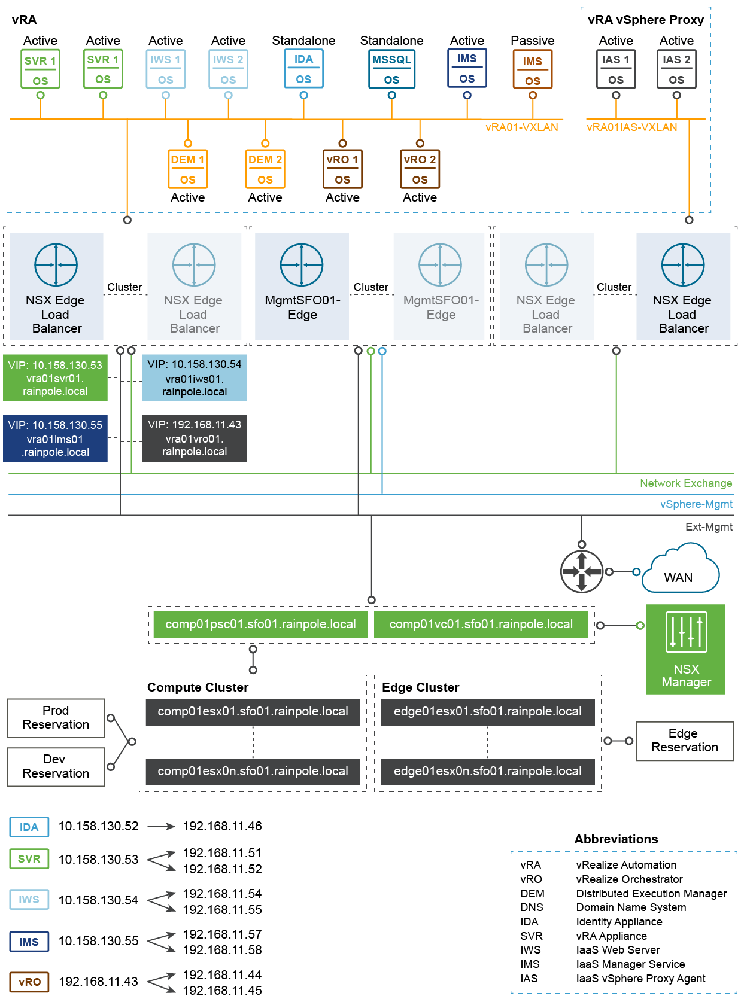

Figure 52. Region B Physical Design

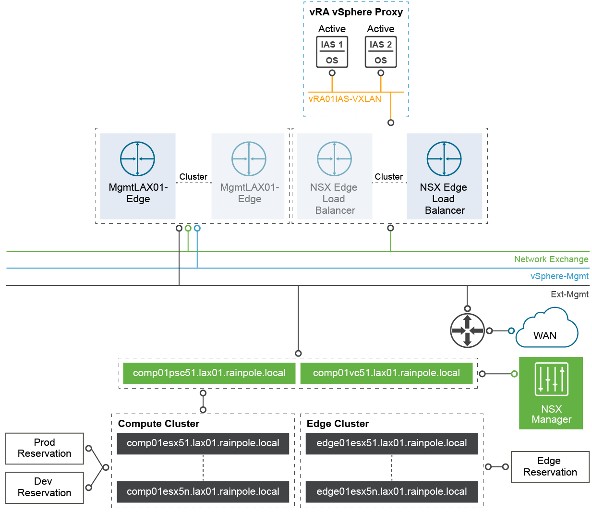

#### vRealize Automation Appliance

The vRealize Automation virtual appliance includes the Web portal and database services. The vRealize Automation portal allows self-service provisioning and management of cloud services, as well as authoring blueprints, administration, and governance. The vRealize Automation virtual appliance uses an embedded PostgreSQL database for catalog persistence and database replication. The database is configured between two vRealize Automation appliances for high availability.

Table 135. vRealize Automation Virtual Appliance Design Decisions

| Decision ID  | Design Decision                                                                          | Design Justification                                              | Design Implication                                                                             |
|--------------|------------------------------------------------------------------------------------------|-------------------------------------------------------------------|------------------------------------------------------------------------------------------------|
| SDDC-CMP-002 | Deploy two instances of the vRealize Automation virtual appliance to achieve redundancy. | Enable an active/active front-end portal for higher availability. | A redundant vRealize Automation design requires an external vRealize Orchestrator appliance.   |
| SDDC-CMP-003 | Deploy two appliances that replicate data using the embedded PostgreSQL database.        | Enable high availability for vRealize Automation.                 | In this active / passive configuration, manual failover between the two instances is required. |

Table 136. vRealize Automation Virtual Appliance Resource Requirements per Virtual Machine

| Attribute                    | Specification                                   |
|------------------------------|-------------------------------------------------|
| Number of vCPUs              | 4                                               |
| Memory                       | 16 GB                                           |
| vRealize Automation function | Portal Website, Application and Service Catalog |

#### vRealize Automation Identity Appliance

The vRealize Automation Identity Appliance supports the Single Sign-On capabilities in this design.

Table 137. vRealize Automation Identity Appliance Design Decisions

| Decision ID  | Design Decision                                                                                               | Design Justification                                                                                         | Design Implication                         |
|--------------|---------------------------------------------------------------------------------------------------------------|--------------------------------------------------------------------------------------------------------------|--------------------------------------------|
| SDDC-CMP-004 | Deploy a single instance of the vRealize Automation Identity Appliance that uses vSphere HA for availability. | Using the vRealize Automation Identity Appliance provides an infrastructure-independent failover capability. | This represents a single point of failure. |

Table 138. vRealize Automation Identity Appliance

| Attribute                    | Specification  |
|------------------------------|----------------|
| Number of vCPUs              | 1              |
| Memory                       | 2 GB           |
| vRealize Automation function | Single Sign-On |

#### vRealize Automation IaaS Web Server

vRealize Automation IaaS Web server provides a user interface within the vRealize Automation portal Web site for the administration and consumption of IaaS components.

1.  The vRealize Automation IaaS Web server is a separate component from the vRealize Automation appliance.

Table 139. vRealize Automation IaaS Web Server Design Decisions

| Decision ID  | Design Decision                                   | Design Justification                                                       | Design Implication                                           |
|--------------|---------------------------------------------------|----------------------------------------------------------------------------|--------------------------------------------------------------|
| SDDC-CMP-005 | Install two vRealize Automation IaaS web servers. | vRealize Automation can support between 1,000 and 10,000 virtual machines. | Operational overhead increases as more servers are deployed. |

Table 140. vRealize Automation IaaS Web Server Resource Requirements

| Attribute                     | Specification                         |
|-------------------------------|---------------------------------------|
| Number of vCPUs               | 4                                     |
| Memory                        | 4 GB                                  |
| Number of vNIC ports          | 1                                     |
| Number of local drives        
 Total useable capacity         | 1                                     
                                 60 GB (C:)                             |
| vRealize Automation functions | Model Manager (Web)                   
                                 IaaS Web                               |
| Operating system              | Microsoft Windows Server 2012 SP2 R2 
                                 Microsoft IIS Components               |

#### vRealize Automation IaaS Model Manager and DEM Orchestrator Server 

The vRealize Automation IaaS Model Manager and Distributed Execution Management (DEM) server are at the core of the vRealize Automation IaaS platform. The vRealize Automation IaaS Model Manager and DEM server supports several functions.

-   Manages the integration of vRealize Automation IaaS with external systems and databases.

-   Provides multi-tenancy.

-   Provides business logic to the DEMs.

-   Manages business logic and execution policies.

-   Maintains all workflows and their supporting constructs.

A Distributed Execution Manager (DEM) runs the business logic of custom models, interacting with the database and with external databases and systems as required. DEMs also manage cloud and physical machines. The DEM Orchestrator monitors the status of the DEM workers. If a DEM worker stops or loses the connection to the Model Manager, the DEM Orchestrator puts the workflow back in the queue. It manages the scheduled workflows by creating new workflow instances at the scheduled time and allows only one instance of a particular scheduled workflow to run at a given time. It also preprocesses workflows before execution. Preprocessing includes checking preconditions for workflows and creating the workflow's execution history.

1.  The vRealize Automation IaaS Model Manager and DEM server are separate servers, but are installed on the same virtual machine. 

Table 141. vRealize Automation IaaS Model Manager and DEM Orchestrator Server Design Decision

| Decision ID  | Design Decision                                                                                                                      | Design Justification                                                                                    | Design Implication                                                                                                                                                                           |
|--------------|--------------------------------------------------------------------------------------------------------------------------------------|---------------------------------------------------------------------------------------------------------|----------------------------------------------------------------------------------------------------------------------------------------------------------------------------------------------|
| SDDC-CMP-006 | Deploy two virtual machines to run both the Automation IaaS Model Manager and the DEM Orchestrator services in a load-balanced pool. | The Automation IaaS Model Manager and DEM Orchestrator share the same active/passive application model. | More resources are required for these twovirtual machines to accommodate the load of the two applications. You can scale up the virtual machines later if additional resources are required. |

Table 142. vRealize Automation IaaS Model Manager and DEM Orchestrator Server Resource Requirements per Virtual Machine

| Attribute                     | Specification                         |
|-------------------------------|---------------------------------------|
| Number of vCPUs               | 2                                     |
| Memory                        | 4 GB                                  |
| Number of vNIC ports          | 1                                     |
| Number of local drives        
 Total usable capacity          | 1                                     
                                 60 GB (C:)                             |
| vRealize Automation functions | Model Manager                         
                                 DEM Orchestrator                       |
| Operating system              | Microsoft Windows Server 2012 SP2 R2 
                                 Microsoft IIS Components               |

#### vRealize Automation IaaS DEM Worker Virtual Machine

vRealize Automation IaaS DEM workers are responsible for the provisioning and deprovisioning tasks initiated by the vRealize Automation portal. DEM workers communicate with vRealize Automation endpoints. In this instance, the endpoint is vCenter Server. 

Table 143. vRealize Automation IaaS DEM Worker Design Decision

| Decision ID  | Design Decision                   | Design Justification                                                                                                                                                                                                  | Design Implication                                                                         |
|--------------|-----------------------------------|-----------------------------------------------------------------------------------------------------------------------------------------------------------------------------------------------------------------------|--------------------------------------------------------------------------------------------|
| SDDC-CMP-007 | Install two DEM Worker instances. | Each DEM Worker can process up to 15 concurrent workflows. Beyond this limit, workflows are queued for execution. If the number of concurrent workflows is consistently above 15, you can add additional DEM Workers. | If you add additional DEM Workers, you must also provide additional resources to run them. |

Table 144. vRealize Automation DEM Worker Resource Requirements per Virtual Machine

| Attribute                     | Specification                        |
|-------------------------------|--------------------------------------|
| Number of vCPUs               | 4                                    |
| Memory                        | 8 GB                                 |
| Number of vNIC ports          | 1                                    |
| Number of local drives        
 Total useable capacity         | 1                                    
                                 60 GB (C:)                            |
| vRealize Automation functions | DEM Worker                           |
| Operating system              | Microsoft Windows Server 2012 SP2 R2 |

#### vRealize Automation IaaS Proxy Agent

The vRealize Automation IaaS Proxy Agent is a Windows program that proxies information gathering from vCenter Server back to vRealize Automation. The IaaS Proxy Agent server provides the following functions.

-   vRealize Automation IaaS Proxy Agent can interact with different types of hypervisors and public cloud services, such as Hyper-V and AWS. However, for this design, only the vSphere agent is used.

-   vRealize Automation does not itself virtualize resources, but works with vSphere to provision and manage the virtual machines. It uses vSphere agents to send commands to and collect data from vSphere. 

Table 145. vRealize Automation IaaS Agent Server Design Decisions

| Decision ID  | Design Decision                                                                                                                                           | Design Justification                                                                            | Design Implication                                                                                                 |
|--------------|-----------------------------------------------------------------------------------------------------------------------------------------------------------|-------------------------------------------------------------------------------------------------|--------------------------------------------------------------------------------------------------------------------|
| SDDC-CMP-008 | Deploy two vRealize Automation vSphere Proxy Agent virtual machines.                                                                                      | Using two virtual machines provides redundancy for vSphere connectivity.                        | More resources are required because multiple virtual machines are deployed for this function.                      |
| SDDC-CMP-009 | Abstract the proxy agent virtual machines on a separate virtual network for independent failover of the main vRealize Automation components across sites. | Allows the failover of the vRealize Automation instance from one site to another independently. | Additional application virtual networks and associated edge devices need to be provisioned for those proxy agents. |

Table 146. vRealize Automation IaaS Proxy Agent Resource Requirements per Virtual Machines

| Attribute                     | Specification                        |
|-------------------------------|--------------------------------------|
| Number of vCPUs               | 2                                    |
| Memory                        | 4 GB                                 |
| Number of vNIC ports          | 1                                    |
| Number of local drives        
 Total useable capacity         | 1                                    
                                 60 GB (C:)                            |
| vRealize Automation functions | Proxy agent                          |
| Operating system              | Microsoft Windows Server 2012 SP2 R2 |

#### Load Balancer

Session persistence of a load balancer allows the same server to serve all requests after a session is established with that server. The session persistence is enabled on the load balancer to direct subsequent requests from each unique session to the same vRealize Automation server in the load balancer pool.

The load balancer also handles failover for the vRealize Automation Server (Manager Service) because only one Manager Service is active at any one time. Session persistence is not enabled because it is not a required component for the Manager Service.

Table 147. Load Balancer Design Decisions

| Decision ID  | Design Decision                                                                                                          | Design Justification                                                                                                                   | Design Implication                                                    |
|--------------|--------------------------------------------------------------------------------------------------------------------------|----------------------------------------------------------------------------------------------------------------------------------------|-----------------------------------------------------------------------|
| SDDC-CMP-010 | Set up a load balancer for all vRealize Automation services that support active/active or active/passive configurations. | Required to enable vRealize Automation to handle a greater load and obtain a higher level of availability than without load balancers. | Additional configuration is required to configure the load balancers. |

The following tables describe load balancer characteristics for vRealize Automation.

Table 148. Load Balancer Application Profile Characteristics

| Server Role                      | Type        | Enable SSL Pass-through | Persistence | Expires in (Seconds) |
|----------------------------------|-------------|-------------------------|-------------|----------------------|
| vRealize Automation vPostgres    | TCP         | n/a                     | None        | n/a                  |
| vRealize Automation              | HTTPS (443) | Enabled                 | Source IP   | 120                  |
| vRealize Automation IaaS Web     | HTTPS (443) | Enabled                 | Source IP   | 120                  |
| vRealize Automation IaaS Manager | HTTPS (443) | Enabled                 | Source IP   | 120                  |
| vRealize Automation Orchestrator | HTTPS (443) | Enabled                 | Source IP   | 120                  |

Table 149. Load Balancer Service Monitoring Characteristics

| Monitor                          | Interval | Timeout | Retries | Type        | Method | URL                      | Receive                                  |
|----------------------------------|----------|---------|---------|-------------|--------|--------------------------|------------------------------------------|
| vRealize Automation vPostgres    | 3        | 9       | 3       | TCP         |        |                          |                                          |
| vRealize Automation              | 3        | 9       | 3       | HTTPS (443) | GET    | /vcac/service/api/status | REGISTERED                               |
| vRealize Automation IaaS Web     | 3        | 9       | 3       | HTTPS (443) | GET    |                          |                                          |
| vRealize Automation IaaS Manager | 3        | 9       | 3       | HTTPS (443) | GET    | /VMPS2                   | BasicHttpBinding\_VMPSProxyAgent\_policy |
| vRealize Automation Orchestrator | 3        | 9       | 3       | HTTPS (443) | GET    | /vco/api/status          | REGISTERED                               |

Table 150. Load Balancer Pool Characteristics

| Server Role                      | Algorithm  | Monitors                                         | Members                            | Port | Monitor Port |
|----------------------------------|------------|--------------------------------------------------|------------------------------------|------|--------------|
| vRealize Automation vPostgres    | Roundrobin | &lt;vRealize Automation vPostgres monitor&gt;    | vRealize Automation Postgres nodes | 5432 | 5432         |
| vRealize Automation              | Leastconn  | &lt;vRealize Automation monitor&gt;              | vRealize Automation nodes          | 443  | 443          |
| vRealize Automation IaaS Web     | Leastconn  | &lt;vRealize Automation IaaS Web monitor&gt;     | IaaS web nodes                     | 443  | 443          |
| vRealize Automation IaaS Manager | Leastconn  | &lt;vRealize Automation IaaS Manager monitor&gt; | IaaS Manager nodes                 | 443  | 443          |
| vRealize Automation Orchestrator | Leastconn  | &lt;vRealize Automation Orchestrator monitor&gt; | vRealize Orchestrator nodes        | 8281 | 8281         |

Table 151. Virtual Server Characteristics

| Protocol | Port | Default Pool                          | Application Profile                      |
|----------|------|---------------------------------------|------------------------------------------|
| TCP      | 5432 | vRealize Automation vPostgres Pool    | vRealize Automation vPostgres Profile    |
| HTTPS    | 443  | vRealize Automation Pool              | vRealize Automation Profile              |
| HTTPS    | 443  | vRealize Automation IaaS Web Pool     | vRealize Automation IaaS Web Profile     |
| HTTPS    | 443  | vRealize Automation IaaS Manager Pool | vRealize Automation IaaS Manager Profile |
| HTTPS    | 8281 | vRealize Automation Orchestrator Pool | vRealize Automation Orchestrator Profile |

#### vRealize Automation Supporting Infrastructure

Microsoft SQL Server Database

vRealize Automation uses a Microsoft SQL Server database to maintain the vRealize Automation IaaS elements and the policies. The database also maintains information about the machines it manages.

Table 152. vRealize Automation SQL Database Design Decisions

| Decision ID  | Design Decision                                                                                                            | Design Justification                                                                                                                                                                      | Design Implication                                           |
|--------------|----------------------------------------------------------------------------------------------------------------------------|-------------------------------------------------------------------------------------------------------------------------------------------------------------------------------------------|--------------------------------------------------------------|
| SDDC-CMP-011 | Set up a Microsoft SQL server that supports the availability and I/O needs of vRealize Automation.                         | A dedicated or shared SQL server can be used so long as it meets the requirements of vRealize Automation.                                                                                 | Requires additional resources and licenses.                  |
| SDDC-CMP-012 | Locate the Microsoft SQL server in the vRealize Automation virtual network or set it up to have global failover available. | For simple failover of the entire vRealize Automation instance from one site to another, the Microsoft SQL server must be running as a VM inside the vRealize Automation virtual network.

                                                                                                                                             If the environment uses a shared SQL server, global failover ensures connectivity from both primary and secondary regions.                                                                 | Adds additional overhead to managing Microsoft SQL services. |

Table 153. vRealize Automation SQL Database Server Resource Requirements per VM

| Attribute                     | Specification                    |
|-------------------------------|----------------------------------|
| Number of vCPUs               | 8                                |
| Memory                        | 16 GB                            |
| Number of vNIC ports          | 1                                |
| Number of local drives        
 Total useable capacity         | 1                                
                                 80 GB (C:)                        |
| vRealize Automation functions | Microsoft SQL Server Database    |
| Microsoft SQL Version         | SQL Server 2012                  |
| Operating system              | Microsoft Windows Server 2012 R2 |

PostgreSQL Database Server

The vRealize Automation appliance uses a PostgreSQL database server to maintain the vRealize Automation portal elements and services, and the information about the catalog items it manages.

Table 154. vRealize Automation PostgreSQL Database Design Decision

| Decision ID  | Design Decision                                                                 | Design Justification                                                                                         | Design Implication                                    |
|--------------|---------------------------------------------------------------------------------|--------------------------------------------------------------------------------------------------------------|-------------------------------------------------------|
| SDDC-CMP-013 | Use the embedded PostgreSQL database within each vRealize Automation appliance. | Simplifies the design and enables replication of the database across the two vRealize Automation appliances. | Requires manually configuring PostgreSQL replication. |

 Notification Email Server 

vRealize Automation notification emails are sent using SMTP. These emails include notification of machine creation, expiration, and the notification of approvals received by users. vRealize Automation supports both anonymous connections to the SMTP server and connections using basic authentication. vRealize Automation also supports communication with or without SSL.

You create a global, inbound email server to handle inbound email notifications, such as approval responses. Only one, global inbound email server, which appears as the default for all tenants, is needed. The email server provides accounts that you can customize for each user, providing separate email accounts, usernames, and passwords. Each tenant can configure an override to change these settings. If tenant administrators do not override these settings before enabling notifications, vRealize Automation uses the globally configured email server. The server supports both the POP and the IMAP protocol, with or without SSL certificates.

Table 155. Email Design Decisions

| Decision ID  | Design Decision                 | Design Justification                                    | Design Implication                                                 |
|--------------|---------------------------------|---------------------------------------------------------|--------------------------------------------------------------------|
| SDDC-CMP-014 | Use unencrypted anonymous SMTP. | Simplifies the design and eases the SMTP configuration. | All notifications will be sent unencrypted with no authentication. |

Notifications

System administrators configure default settings for both the outbound and inbound emails servers used to send system notifications. Systems administrators can create only one of each type of server that appears as the default for all tenants. If tenant administrators do not override these settings before enabling notifications, vRealize Automation uses the globally configured email server.

System administrators create a global outbound email server to process outbound email notifications, and a global inbound email server to process inbound email notifications, such as responses to approvals. 

#### vRealize Automation Cloud Tenant Design

A tenant is an organizational unit within a vRealize Automation deployment, and can represent a business unit within an enterprise, or a company that subscribes to cloud services from a service provider. Each tenant has its own dedicated configuration, although some system-level configuration is shared across tenants.

Comparison of Single-Tenant and Multi-Tenant Deployments

vRealize Automation supports deployments with a single tenant or multiple tenants. System-wide configuration is always performed using the default tenant, and can then be applied to one or more tenants. For example, system-wide configuration might specify defaults for branding and notification providers.

Infrastructure configuration, including the infrastructure sources that are available for provisioning, can be configured in any tenant and is shared among all tenants. The infrastructure resources, such as cloud or virtual compute resources or physical machines, can be divided into fabric groups managed by fabric administrators. The resources in each fabric group can be allocated to business groups within each tenant by using reservations.

-   **Single-Tenant Deployment** — In a single-tenant deployment, all configuration occurs in the default tenant. Tenant administrators can manage users and groups, and configure tenant-specific branding, notifications, business policies, and catalog offerings. All users log in to the vRealize Automation console at the same URL, but the features available to them are determined by their roles.

-   **Multi-Tenant Deployment** — In a multi-tenant deployment, the system administrator creates new tenants for each organization that uses the same vRealize Automation instance. Tenant users log in to the vRealize Automation console at a URL specific to their tenant. Tenant-level configuration is segregated from other tenants and from the default tenant, although users with system-wide roles can view and manage configuration across multiple tenants.
    The IaaS administrator for each tenant creates fabric groups and appoints fabric administrators to their respective tenants. Although fabric administrators can create reservations for business groups in any tenant, in this scenario they typically create and manage reservations within their own tenants. If the same identity store is configured in multiple tenants, the same users can be designated as IaaS administrators or fabric administrators for each tenant.

Tenant Design

This design deploys a single tenant containing two business groups.

-   The first business group is designated for production workloads provisioning.

-   The second business group is designated for development workloads. 

Tenant administrators manage users and groups, configure tenant-specific branding, notifications, business policies, and catalog offerings. All users log in to the vRealize Automation console at the same URL, but the features available to them are determined by their roles.

The following diagram illustrates the dual-region tenant design.

Figure 53. Rainpole Cloud Automation Tenant Design for Two Regions

Table 156. Tenant Design Decisions

| Decision ID  | Design Decision                                                                                                                                        | Design Justification                                                                                                                                    | Design Implication                                                                                                                             |
|--------------|--------------------------------------------------------------------------------------------------------------------------------------------------------|---------------------------------------------------------------------------------------------------------------------------------------------------------|------------------------------------------------------------------------------------------------------------------------------------------------|
| SDDC-CMP-017 | Configure two business units as business groups (instead of separate tenants).                                                                         | Allows transparency across the environments and some level of sharing of resources and services such as blueprints.                                     

                                                                                                                                                                                                                                                                                                                                  | Some elements such as build profiles are visible to both business groups. The design does not provide full isolation for security or auditing. |
| SDDC-CMP-018 | Create separate fabric groups for the two initial business groups. Each fabric group represents data center resources.                                 | Provides future isolation of fabric resources and potential delegation of duty to independent fabric administrators that belong to each business group. | Initial deployment will use a single shared fabric that consists of one compute pod.                                                           |
| SDDC-CMP-019 | Allow access to the default tenant only by the system administrator and for the purposes of managing tenants and modifying system-wide configurations. | Isolates the default tenant from individual tenant configurations.                                                                                      | Each tenant administrator is responsible for managing their own tenant configuration.                                                          |

Service Catalog

The service catalog provides a common interface for consumers of IT services to use to request and manage the services and resources they need.  

A tenant administrator or service architect can specify information about the service catalog, such as the service hours, support team, and change window. While the catalog does not enforce service-level agreements on services, this service hours, support team, and change window information is available to business users browsing the service catalog.

Table 157. Service Catalog Design Decisions

| Decision ID  | Design Decision                                                                              | Design Justification                                                                                                                                           | Design Implication |
|--------------|----------------------------------------------------------------------------------------------|----------------------------------------------------------------------------------------------------------------------------------------------------------------|--------------------|
| SDDC-CMP-020 | Set up the Rainpole service catalog with the following services:                             

                **Common.** Any blueprints or advanced services that are not tied to a specific data center.  

                **Region A.** Service catalog that is dedicated to Region A.                                  

                **Region B.** Service catalog that is dedicated to Region B.                                  | Distinguishes the blueprints and services that will be provisioned in specific regions without over-complicating the naming convention of those catalog items. |                    |

Catalog Items

Users can browse the service catalog for catalog items they are entitled to request. For some catalog items, a request results in the provisioning of an item that the user can manage. For example, the user can request a virtual machine with Windows 2012 preinstalled, and then manage that virtual machine after it has been provisioned.

Tenant administrators define new catalog items and publish them to the service catalog. The tenant administrator can then manage the presentation of catalog items to the consumer and entitle new items to consumers. To make the catalog item available to users, a tenant administrator must entitle the item to the users and groups who should have access to it. For example, some catalog items may be available only to a specific business group, while other catalog items may be shared between business groups using the same tenant. The administrator determines what catalog items are available to different users based on their job functions, departments, or location.

Typically, a catalog item is defined in a blueprint, which provides a complete specification of the resource to be provisioned and the process to initiate when the item is requested. It also defines the options available to a requester of the item, such as virtual machine specifications or lease duration, or any additional information that the requester is prompted to provide when submitting the request.

Table 158. Catalog Items - Common Service Catalog Design Decision

| Decision ID  | Design Decision                                                               | Design Justification                                                           | Design Implication                                                                                                     |
|--------------|-------------------------------------------------------------------------------|--------------------------------------------------------------------------------|------------------------------------------------------------------------------------------------------------------------|
| SDDC-CMP-021 | Create single machine blueprints types for IaaS virtual machine provisioning. | Single machine blueprints form the foundation of the multi-machine blueprints. | Provisioning is limited to virtual machines. This design does not configure cloud blueprints or physical provisioning. |

Machine Blueprints

A machine blueprint is the complete specification for a virtual, cloud or physical machine. A machine blueprint determines the machine's attributes, how it is provisioned, and its policy and management settings. Machine blueprints are published as catalog items in the service catalog.

Machine blueprints can be specific to a business group or shared among groups within a tenant. Tenant administrators can create shared blueprints that can be entitled to users in any business group within the tenant. Business group managers can create group blueprints that can only be entitled to users within a specific business group. A business group manager cannot modify or delete shared blueprints. Tenant administrators cannot view or modify group blueprints unless they also have the business group manager role for the appropriate group.

If a tenant administrator sets a shared blueprint's properties so that it can be copied, the business group manager can also copy the shared blueprint for use as a starting point to create a new group blueprint.

Table 159. Single Machine Blueprints

| Name                                      | Description                                                                                                                                  |
|-------------------------------------------|----------------------------------------------------------------------------------------------------------------------------------------------|
| Base Windows Server (Development)         | Standard Rainpole SOE deployment of Windows 2012 R2 available to the Development business group.                                             |
| Base Windows Server (Production)          | Standard Rainpole SOE deployment of Windows 2012 R2 available to the Production business group.                                              |
| Base Linux (Development)                  | Standard Rainpole SOE deployment of Linux available to the Development business group.                                                       |
| Base Linux (Production)                   | Standard Rainpole SOE deployment of Linux available to the Production business group.                                                        |
| Windows Server + SQL Server (Production)  | Base Windows 2012 R2 Server with silent SQL 2012 Server install with custom properties. This is available to the Production business group.  |
| Windows Server + SQL Server (Development) | Base Windows 2012 R2 Server with silent SQL 2012 Server install with custom properties. This is available to the Development business group. |

Blueprint Definitions

The following sections provide details of each service definition that has been included as part of the current phase of cloud platform deployment.

Table 160. Base Windows Server Blueprint

| Service Name                          | Base Windows Server                                                                                                                        |
|---------------------------------------|--------------------------------------------------------------------------------------------------------------------------------------------|
| Provisioning Method                   | When users select this blueprint, vRealize Automation clones a vSphere virtual machine template with preconfigured vCenter customizations. |
| Entitlement                           | Both Production and Development business group members.                                                                                    |
| Approval Process                      | No approval (pre-approval assumed based on approved access to platform)                                                                    |
| Operating System and Version Details  | Windows Server 2012 R2                                                                                                                     |
| Configuration                         | Disk: Single disk drive                                                                                                                    
                                         Network: Standard vSphere Networks                                                                                                          |
| Lease and Archival Details            | Lease:                                                                                                                                     

                                         Production Blueprints: No expiration date                                                                                                   

                                         Development Blueprints: Minimum 30 days – Maximum 270 days                                                                                  

                                         Archive: 15 days                                                                                                                            |
| Pre- and Post-Deployment Requirements | Email sent to manager confirming service request (include description details)                                                             |

Table 161. Base Windows Blueprint Sizing

| Sizing  | vCPU | Memory (GB) | Storage (GB) |
|---------|------|-------------|--------------|
| Default | 1    | 4           | 50           |
| Maximum | 4    | 16          | 60           |

Table 162. Base Linux Server Requirements and Standards

| Service Name                          | Base Linux Server                                                                                                                          |
|---------------------------------------|--------------------------------------------------------------------------------------------------------------------------------------------|
| Provisioning Method                   | When users select this blueprint, vRealize Automation clones a vSphere virtual machine template with preconfigured vCenter customizations.

                                                                                                                                                                                     |
| Entitlement                           | Both Production and Development business group members                                                                                     |
| Approval Process                      | No approval (pre-approval assumed based on approved access to platform)                                                                    |
| Operating System and Version Details  | Red Hat Enterprise Server 6                                                                                                                |
| Configuration                         | Disk: Single disk drive                                                                                                                    
                                         Network: Standard vSphere networks                                                                                                          |
| Lease and Archival Details            | Lease:                                                                                                                                     

                                         Production Blueprints: No expiration date                                                                                                   

                                         Development Blueprints: Minimum 30 days – Maximum 270 days                                                                                  

                                         Archive: 15 days                                                                                                                            |
| Pre- and Post-Deployment Requirements | Email sent to manager confirming service request (include description details)                                                             |

Table 163. Base Linux Blueprint Sizing

| Sizing  | vCPU | Memory (GB) | Storage (GB) |
|---------|------|-------------|--------------|
| Default | 1    | 6           | 20           |
| Maximum | 4    | 12          | 20           |

Table 164. Base Windows Server with SQL Server Install Requirements and Standards

| Service Name                          | Base Windows Server                                                                                                                        |
|---------------------------------------|--------------------------------------------------------------------------------------------------------------------------------------------|
| Provisioning Method                   | When users select this blueprint, vRealize Automation clones a vSphere virtual machine template with preconfigured vCenter customizations.

                                                                                                                                                                                     |
| Entitlement                           | Both Production and Development business group members                                                                                     |
| Approval Process                      | No approval (pre-approval assumed based on approved access to platform).                                                                   |
| Operating System and Version Details  | Windows Server 2012 R2                                                                                                                     |
| Configuration                         | Disk: Single disk drive                                                                                                                    
                                         Network: Standard vSphere Networks                                                                                                          
                                         Silent Install: The Blueprint calls a silent script using the vRA Agent to install SQL2012 Server with custom properties.                   |
| Lease and Archival Details            | Lease:                                                                                                                                     

                                         Production Blueprints: No expiration date                                                                                                   

                                         Development Blueprints: Minimum 30 days – Maximum 270 days                                                                                  

                                         Archive: 15 days                                                                                                                            |
| Pre- and Post-Deployment Requirements | Email sent to manager confirming service request (include description details)                                                             |

Table 165. Base Windows with SQL Server Blueprint Sizing

| Sizing  | vCPU | Memory (GB) | Storage (GB) |
|---------|------|-------------|--------------|
| Default | 1    | 8           | 100          |
| Maximum | 4    | 16          | 400          |

Branding of the vRealize Automation Console

System administrators can change the appearance of the vRealize Automation console to meet site-specific branding guidelines by changing the logo, the background color, or information in the header and footer. 

System administrators control the default branding for tenants. Tenant administrators can use the default or reconfigure branding for each tenant.

Table 166. Tenant Branding Decisions

| Decision ID  | Design Decision                                                                             | Design Justification                                                        | Design Implication                                         |
|--------------|---------------------------------------------------------------------------------------------|-----------------------------------------------------------------------------|------------------------------------------------------------|
| SDDC-CMP-015 | Perform branding with corporate logo and colors on the tenant and default tenant web sites. | Provides a consistent look and feel in accordance with corporate standards. | Logo image must be provided in 800x52 pixel size.          |
| SDDC-CMP-016 | Set the product name to Infrastructure Service Portal.                                      | Neutral default. This description can be configured on a per tenant basis.  | Users see this name as the portal display name by default. |

vRealize Automation Infrastructure as a Service Design

The following diagram illustrates the logical design of the vRealize Automation groups and vSphere resources.

Figure 54. vRealize Automation Groups

The following terms apply to vRealize Automation when integrated with vSphere. These terms and their meaning may vary from the way they are used when referring only to vSphere.

Table 167. vRealize Automation Terms

| Term                              | Definition                                                                                                                                                                                                                                                                                           |
|-----------------------------------|------------------------------------------------------------------------------------------------------------------------------------------------------------------------------------------------------------------------------------------------------------------------------------------------------|
| vSphere (vCenter Server) endpoint | Provides information required by vRealize Automation IaaS to access vSphere compute resources.                                                                                                                                                                                                       
                                     It requires the appropriate permissions for the vSphere proxy agent to manage the vCenter Server instance.                                                                                                                                                                                            |
| Compute resource                  | Virtual object within vRealize Automation that represents a vCenter Server cluster or resource pool, and datastores or datastore clusters.                                                                                                                                                           
                                     vRealize Automation provisions the virtual machines requested by business group members on the compute resource.                                                                                                                                                                                      

                                     **Note**: Compute resources are CPU, memory, storage and networks. Datastores and datastore clusters are part of the overall storage resources.                                                                                                                                                       |
| Fabric groups                     | vRealize Automation IaaS organizes compute resources into fabric groups.                                                                                                                                                                                                                             |
| Fabric administrators             | Fabric administrators manage compute resources, which are organized into fabric groups.                                                                                                                                                                                                              |
| Compute reservation               | A share of compute resources (vSphere cluster, resource pool, datastores, or datastore clusters), such as CPU and memory reserved for use by a particular business group for provisioning virtual machines.                                                                                          

                                     **Note**: vRealize Automation uses the term *reservation* to define resources (be they memory, storage or networks) in a cluster. This is different than the use of reservation in vCenter Server, where a share is a percentage of total resources, and reservation is a fixed amount.               |
| Storage reservation               | Similar to compute reservation (see above), but pertaining only to a share of the available storage resources. In this context, you specify a storage reservation in terms of gigabytes from an existing LUN or Datastore.                                                                           

                                                                                                                                                                                                                                                                                                                                           |
| Business groups                   | A collection of virtual machine consumers, usually corresponding to an organization's business units or departments. Only users in the business group can request virtual machines.                                                                                                                  |
| Reservation policy                | vRealize Automation IaaS determines its reservation (also called *virtual reservation*) from which a particular virtual machine is provisioned. The reservation policy is a logical label or a pointer to the original reservation. Each virtual reservation can be added to one reservation policy. |
| Build profile                     | A set of user defined properties you apply to a virtual machine when it is provisioned. For example, the operating system used in a blueprint, or the available networks to use for connectivity at the time of provisioning the virtual machine.                                                    

                                     Build provile properties determine the specification of the virtual machine, the manner in which it is provisioned, operations to perform after it is provisioned, or management information maintained within vRealize Automation.                                                                   

                                                                                                                                                                                                                                                                                                                                           |
| Blueprint                         | The complete specification for a virtual machine, determining the machine attributes, the manner in which it is provisioned, and its policy and management settings.                                                                                                                                 

                                     Blueprint allows the users of a business group to create virtual machines on a virtual reservation (compute resource) based on the reservation policy, and using platform and cloning types. It also lets you specify or add machine resources and build profiles.                                    |

The following figure shows the logical design constructs discussed in the previous section as they would apply to a deployment of vRealize Automation integrated with vSphere in a cross data center provisioning.

Figure 55. vRealize Automation Integration with vSphere Endpoint

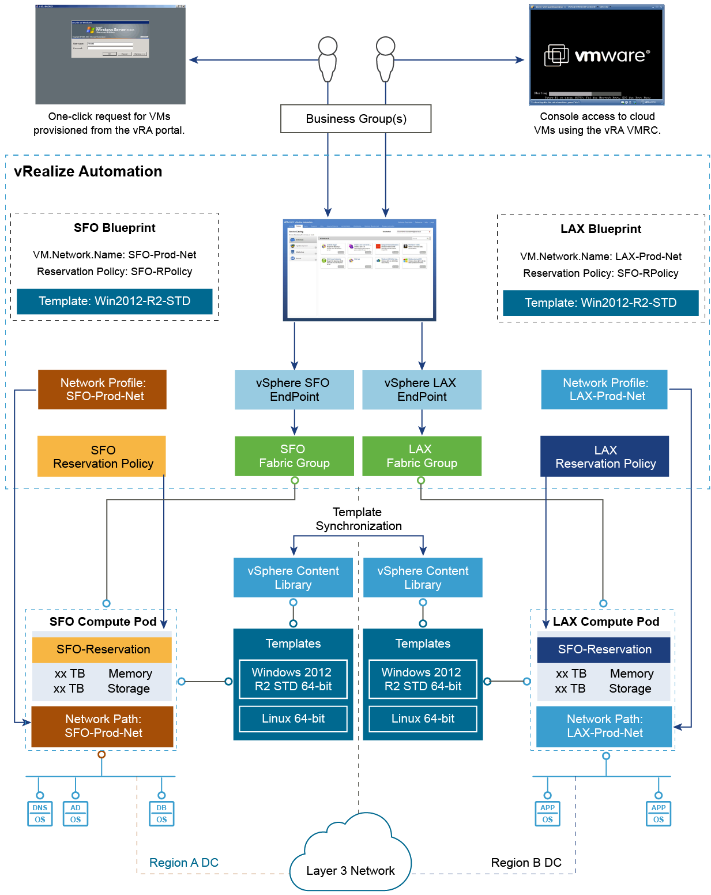

#### Infrastructure Source Endpoints

An infrastructure source endpoint is a connection to the infrastructure that provides a set (or multiple sets) of resources, which can then be made available by IaaS administrators for consumption by end users. vRealize Automation IaaS regularly collects information about known endpoint resources and the virtual resources provisioned therein. Endpoint resources are referred to as *compute resources *(or as *compute pods*— the terms are often used interchangeably). 

Infrastructure data is collected through proxy agents that manage and communicate with the endpoint resources. This information about the compute resources on each infrastructure endpoint and the machines provisioned on each computer resource is collected at regular intervals. 

During installation of the vRealize Automation IaaS components, you can configure the proxy agents and define their associated endpoints. Alternatively, you can configure the proxy agents and define their associated endpoints separately after the main vRealize Automation installation is complete. 

Table 168. Endpoint Design Decisions

| Decision ID  | Design Decision                            | Design Justification                                                                                                                                     | Design Implication                                                                                      |
|--------------|--------------------------------------------|----------------------------------------------------------------------------------------------------------------------------------------------------------|---------------------------------------------------------------------------------------------------------|
| SDDC-CMP-022 | Create two vSphere endpoints.              | One vSphere endpoint is required to connect to each vCenter Server instance in each region. Two endpoints will be needed for two regions.                | As additional regions are brought online additional vSphere endpoints need to be deployed.              |
| SDDC-CMP-023 | Create one vRealize Orchestrator endpoint. | vRealize Automation extensibility uses vRealize Orchestrator. One vRealize Orchestrator cluster exists which requires the creation of a single endpoint. | Using external vRealize Orchestrator requires manual configuration of a vRealize Orchestrator endpoint. |

#### Virtualization Compute Resources

A virtualization compute resource is a vRealize Automation object that represents an ESXi host or a cluster of ESXi hosts (vSphere cluster). When a group member requests a virtual machine, the virtual machine is provisioned on these compute resources. vRealize Automation regularly collects information about known compute resources and the virtual machines provisioned on them through the proxy agents.

Table 169. Compute Resource Design Decision

| Decision ID  | Design Decision               | Design Justification                                                                    | Design Implication                                                                                                                                                |
|--------------|-------------------------------|-----------------------------------------------------------------------------------------|-------------------------------------------------------------------------------------------------------------------------------------------------------------------|
| SDDC-CMP-024 | Create two compute resources. | Each region has one compute cluster, one compute resource is required for each cluster. | As additional compute clusters are created, they need to be added to the existing compute resource in their region or to a new resource, which has to be created. |

1.  By default, compute resources are provisioned to the root of the compute cluster. If desired, compute resources can be configured to provision to a specific resource pool. This design does not use resource pools. 

    1.  #### Fabric Groups

A fabric group is a logical container of several compute resources, and can be managed by fabric administrators. 

Table 170. Fabric Group Design Decisions

| Decision ID  | Design Decision                                                                                                | Design Justification                                                                  | Design Implication                                                                    |
|--------------|----------------------------------------------------------------------------------------------------------------|---------------------------------------------------------------------------------------|---------------------------------------------------------------------------------------|
| SDDC-CMP-025 | Create a fabric group for each region and include all the compute resources and edge resources in that region. | To enable region specific provisioning a fabric group in each region must be created. | As additional clusters are added in a region, they must be added to the fabric group. |

#### Business Groups

A Business group is a collection of machine consumers, often corresponding to a line of business, department, or other organizational unit. To request machines, a vRealize Automation user must belong to at least one Business group. Each group has access to a set of local blueprints used to request machines.

Business groups have the following characteristics.

-   A group must have at least one business group manager*,* who maintains blueprints for the group and approves machine requests.

-   Groups can contain support users*,* who can request and manage machines on behalf of other group members.

-   A vRealize Automation user can be a member of more than one Business group, and can have different roles in each group. 

Table 171. Business Group Design Decision

| Decision ID  | Design Decision                                                                         | Design Justification                                                                                                       | Design Implication                                                     |
|--------------|-----------------------------------------------------------------------------------------|----------------------------------------------------------------------------------------------------------------------------|------------------------------------------------------------------------|
| SDDC-CMP-026 | Create two business groups, one for production users and one for the development users. | Creating two groups, one for each type of user, allows different permissions and access to be applied to each type of user | Creating more business groups results in more administrative overhead. |

#### Reservations

A reservation is a share of one compute resource's available memory, CPU and storage reserved for use by a particular fabric group. Each reservation is for one fabric group only but the relationship is many-to-many. A fabric group might have multiple reservations on one compute resource or reservations on multiple compute resources or both.

Table 172. Reservation Design Decisions

| Decision ID  | Design Decision                                                        | Design Justification                                                                                                                                                | Design Implication                                                                                                                                  |
|--------------|------------------------------------------------------------------------|---------------------------------------------------------------------------------------------------------------------------------------------------------------------|-----------------------------------------------------------------------------------------------------------------------------------------------------|
| SDDC-CMP-027 | Create four reservations – two for production and two for development. | Each resource cluster will have two reservations, one for production and one for development, allowing both production and development workloads to be provisioned. | Because production and development share the same compute resources, the development business group must be limited to a fixed amount of resources. |
| SDDC-CMP-028 | Create two edge reservations – one in each region.                     | An edge reservation in each region allows NSX to create edge services gateways on demand and place them on the edge cluster.                                        | The workload reservation must define the edge reservation in the network settings.                                                                  |

#### Reservation Policies

You can add each virtual reservation to one reservation policy. The reservation from which a particular virtual machine is provisioned is determined by vRealize Automation based on the reservation policy specified in the blueprint (if any), the priorities and current usage of the fabric group's reservations, and other custom properties.

Table 173. Reservation Policy Design Decisions

| Decision ID  | Design Decision                                                                                  | Design Justification                                                                                    | Design Implication                                                                |
|--------------|--------------------------------------------------------------------------------------------------|---------------------------------------------------------------------------------------------------------|-----------------------------------------------------------------------------------|
| SDDC-CMP-029 | Create four workload reservation policies for production and development blueprints.             | Two reservation policies are required in each region, one for production and the other for development. | As more groups are created reservation policies for those groups must be created. |
| SDDC-CMP-030 | Create two edge reservations for placement of the edge services gateways into the edge clusters. | Required to place the edge devices into their respective edge clusters.                                 |                                                                                   |

A storage reservation policy is a set of datastores that can be assigned to a machine blueprint to restrict disk provisioning to only those datastores. Storage reservation policies are created and associated with the appropriate datastores and assigned to reservations.

Table 174. Storage Reservation Policy Design Decisions

| Decision ID  | Design Decision                         | Design Justification                                               | Design Implication                                         |
|--------------|-----------------------------------------|--------------------------------------------------------------------|------------------------------------------------------------|
| SDDC-CMP-031 | This design does not use storage tiers. | The underlying physical storage design does not use storage tiers. | Both business groups will have access to the same storage. |

#### Template Synchronization

This dual-region design supports provisioning workloads across regions from the same portal using the same single-machine blueprints. A synchronization mechanism is required to have consistent templates across regions. There are multiple ways to achieve synchronization, for example, vSphere Content Library or external services like vCloud Connector or vSphere Replication.

Table 175. Template Synchronization Design Decision

| Decision ID  | Design Decision                                                                   | Design Justification                                                                                                                 | Design Implication                                |
|--------------|-----------------------------------------------------------------------------------|--------------------------------------------------------------------------------------------------------------------------------------|---------------------------------------------------|
| SDDC-CMP-032 | This design uses vSphere Content Library to synchronize templates across regions. | The vSphere Content Library is built into the version of vSphere being used and meets all the requirements to synchronize templates. | Storage space must be provisioned in each region. |

When users select this blueprint, vRealize Automation clones a vSphere virtual machine template with preconfigured vCenter customizations.

Figure 56. Template Synchronization

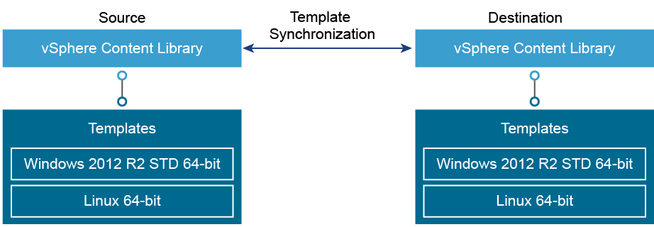

### vRealize Orchestrator Design

VMware vRealize Orchestrator is a development and process automation platform that provides a library of extensible workflows to allow you to create and run automated, configurable processes to manage the VMware vSphere infrastructure as well as other VMware and third-party technologies.

In this VMware Validated Design, vRealize Administration uses the vRealize Orchestrator Plug-In to connect to vCenter Server for compute resource allocation. 

####  Logical Design

This VMware Validated Design includes this logical design for vRealize Orchestrator.

Table 176. vRealize Orchestrator Hardware Design Decision

| Decision ID      | Design Decision                                                                                                                | Design Justification                                                                                                                                       | Design Implication                                                                                     |
|------------------|--------------------------------------------------------------------------------------------------------------------------------|------------------------------------------------------------------------------------------------------------------------------------------------------------|--------------------------------------------------------------------------------------------------------|
| SDDC-CMPD-VRO-01 | Deploy all vRealize Orchestrator instances required within the SDDC solution with 2 CPUs, 4 GB memory, and 16 GB of hard disk. | The vRealize Orchestrator appliance requires the appropriate resources to enable connectivity to vRealize Automation via the vRealize Orchestrator Plugin. | Resources should not be reduced as the vRealize Orchestrator Appliance requires this for scalability.  |

#### Directory Services

If you intend to use LDAP for authentication, verify that you have a working LDAP server. vRealize Orchestrator supports the following directory services.

-   Windows Server 2008 Active Directory

-   Windows Server 2012 Active Directory

-   OpenLDAP

The only configuration supported for multi-domain Active Directory is domain tree. Forest and external trusts are not supported. Multiple domains that have two-way trust, but are not in the same tree, are not supported and do not work with vRealize Orchestrator.

Table 177. vRealize Orchestrator Directory Service Design Decision

| Decision ID      | Design Decision                                                                                            | Design Justification                                                | Design Implication                                                           |
|------------------|------------------------------------------------------------------------------------------------------------|---------------------------------------------------------------------|------------------------------------------------------------------------------|
| SDDC-CMPD-VRO-02 | Configure all vRealize Orchestrator instances within the SDDC to use Active Directory LDAP authentication. | Supports existing design setup utilizing Active Directory services. | This design does not support local authentication for vRealize Orchestrator. |

#### Network Ports

vRealize Orchestrator uses specific network ports to communicate with other systems. The ports are configured with a default value, but you can change the defaults at any time. When you make changes, verify that all ports are available for use by your host. If necessary, open these ports on any firewalls through which network traffic for the relevant components flows. Verify that the required network ports are open before you deploy vRealize Orchestrator.

Default Communication Ports

Set default network ports and configure your firewall to allow incoming TCP connections. Other ports may be required if you are using custom plug-ins.

Table 178. vRealize Orchestrator Default Configuration Ports

| Port                                | Number | Protocol | Source                   | Target                              | Description                                                                          |
|-------------------------------------|--------|----------|--------------------------|-------------------------------------|--------------------------------------------------------------------------------------|
| HTTPS Server port                   | 8281   | TCP      | End-user external system | vRealize Orchestrator server        | The SSL secured HTTP protocol used to connect to the vRealize Orchestrator REST API. |
| Web configuration HTTPS access port | 8283   | TCP      | End-user Web browser     | vRealize Orchestrator configuration | The SSL access port for the Web UI for vRealize Orchestrator configuration.          |

External Communication Ports

Configure your firewall to allow outgoing connections using the external network ports so vRealize Orchestrator can communicate with external services.

Table 179. vRealize Orchestrator Default External Communication Ports

| Port                                  | Number | Protocol | Source                       | Target                        | Description                                                                                                                                                                              |
|---------------------------------------|--------|----------|------------------------------|-------------------------------|------------------------------------------------------------------------------------------------------------------------------------------------------------------------------------------|
| LDAP                                  | 389    | TCP      | vRealize Orchestrator server | LDAP server                   | Lookup port of your LDAP authentication server.                                                                                                                                          |
| LDAP using SSL                        | 636    | TCP      | vRealize Orchestrator server | LDAP server                   | Lookup port of your secure LDAP authentication server.                                                                                                                                   |
| LDAP using Global Catalog             | 3268   | TCP      | vRealize Orchestrator server | Global Catalog server         | Port to which Microsoft Global Catalog server queries are directed.                                                                                                                      |
| DNS                                   | 53     | TCP      | vRealize Orchestrator server | DNS server                    | Name resolution                                                                                                                                                                          |
| VMware vCenter™ Single Sign-On server | 7444   | TCP      | vRealize Orchestrator server | vCenter Single Sign-On server | Port used to communicate with the vCenter Single Sign-On server.                                                                                                                         |
| SQL Server                            | 1433   | TCP      | vRealize Orchestrator server | Microsoft SQL server          | Port used to communicate with the Microsoft SQL Server or SQL Server Express instances that are configured as the vRealize Orchestrator database.                                        |
| PostgreSQL                            | 5432   | TCP      | vRealize Orchestrator server | PostgreSQL server             | Port used to communicate with the PostgreSQL Server that is configured as the vRealize Orchestrator database.                                                                            |
| Oracle                                | 1521   | TCP      | vRealize Orchestrator server | Oracle DB server              | Port used to communicate with the Oracle Database Server that is configured as the vRealize Orchestrator database.                                                                       |
| SMTP Server port                      | 25     | TCP      | vRealize Orchestrator server | SMTP Server                   | Port used for email notifications.                                                                                                                                                       |
| vCenter Server API port               | 443    | TCP      | vRealize Orchestrator server | VMware vCenter server         | The vCenter Server API communication port used by vRealize Orchestrator to obtain virtual infrastructure and virtual machine information from the orchestrated vCenter Server instances. |
| vCenter Server                        | 80     | TCP      | vRealize Orchestrator server | vCenter Server                | Port used to tunnel HTTPS communication.                                                                                                                                                 |
| VMware ESXi                           | 443    | TCP      | vRealize Orchestrator server | ESXi hosts                    | (Optional) Workflows using the vCenter Guest Operations API need direct connection between vRealize Orchestrator and the ESXi hosts the VM is running on.                                |

#### vRealize Orchestrator Deployment

The vRealize Orchestrator appliance using Linux  comes preconfigured, enabling fast deployment. In contrast to a vRealize Orchestrator installations using Microsoft Windows as the operating system, the Linux-based appliance does not incur Microsoft licensing costs.

The vRealize Orchestrator appliance package is distributed with preinstalled software contains the following software components.

-   SUSE Linux Enterprise Server 11 SP3 for VMware, 64-bit edition

-   PostgreSQL

-   OpenLDAP

-   vRealize Orchestrator

Table 180. vRealize Orchestrator Deployment Decision

| Decision ID      | Design Decision                                                   | Design Justification                                           | Design Implication |
|------------------|-------------------------------------------------------------------|----------------------------------------------------------------|--------------------|
| SDDC-CMPD-VRO-03 | Install two vRealize Orchestrator servers behind a load balancer. | Supports a highly available vRealize Orchestrator environment. | None.              |

Table 181. vRealize Orchestrator Platform Design Decision

| Decision ID      | Design Decision                                                                                            | Design Justification                                                           | Design Implication |
|------------------|------------------------------------------------------------------------------------------------------------|--------------------------------------------------------------------------------|--------------------|
| SDDC-CMPD-VRO-04 | Deploy a vRealize Orchestrator appliance for all vRealize Orchestrator instances required within the SDDC. | Allows for rapid deployment with faster scalability and reduced license costs. |  None.             |

#### vRealize Orchestrator Topology

vRealize Orchestrator comes as a single-site topology product. The multi-node plug-in creates a primary-secondary relation between vRealize Orchestrator servers that extends the package management and workflow execution features. The plug-in contains a set of standard workflows for hierarchical orchestration, management of vRealize Orchestrator instances, and the scale-out of vRealize Orchestrator activities.

Table 182. vRealize Orchestrator Topology Design Decisions

| Decision ID      | Design Decision                                                                                                                                                       | Design Justification                                                                                                                                                                               | Design Implication                                                                   |
|------------------|-----------------------------------------------------------------------------------------------------------------------------------------------------------------------|----------------------------------------------------------------------------------------------------------------------------------------------------------------------------------------------------|--------------------------------------------------------------------------------------|
| SDDC-CMPD-VRO-05 | Deploy two vRealize Orchestrator appliances to provide the SDDC Foundation orchestration engine.                                                                      | Use a clustered implementation of vRealize Orchestrator to develop workflows. Without a highly available clustered vRealize Orchestrator implementation, the design has a single point of failure. | Cluster setup is required.                                                           |
| SDDC-CMPD-VRO-06 | Install and configure the multi-node plug-in your multisite implementation to provide disaster recovery capability through vRealize Orchestrator content replication. | vRealize Orchestrator will not support disaster recovery without the implementation for the multinode plug-in.                                                                                     | Enables disaster recovery and multisite implementations within vRealize Orchestrator |

#### vRealize Orchestrator Server Mode

vRealize Orchestrator supports the following server modes.

-   Standalone mode. vRealize Orchestrator server runs as a standalone instance. This is the default mode of operation. 

-   Cluster mode. To increase availability of the vRealize Orchestrator services, and to create a more highly available SDDC, you can configure vRealize Orchestrator to work in cluster mode, and start multiple vRealize Orchestrator instances in a cluster with a shared database. In cluster mode, multiple vRealize Orchestrator instances with identical server and plug-in configurations work together as a cluster, and share a single database. 

All vRealize Orchestrator server instances communicate with each other by exchanging heartbeats at a certain time interval. Only active vRealize Orchestrator server instances respond to client requests and run workflows. If an active vRealize Orchestrator server instance fails to send heartbeats, it is considered to be non-responsive, and one of the inactive instances takes over to resume all workflows from the point at which they were interrupted. The heartbeat is implemented through the shared database, so there are no implications in the network design for a vRealize Orchestrator cluster. If you have more than one active vRealize Orchestrator node in a cluster, concurrency problems can occur if different users use the different vRealize Orchestrator nodes to modify the same resource.

Table 183. vRealize Orchestrator Server Mode Design Decision

| Decision ID      | Design Decision                                                                                                    | Design Justification                                                          | Design Implication             |
|------------------|--------------------------------------------------------------------------------------------------------------------|-------------------------------------------------------------------------------|--------------------------------|
| SDDC-CMPD-VRO-07 | Deploy a minimum of one two-node vRealize Orchestrator cluster to provide a production class orchestration engine. | Use a clustered implementation of vRealize Orchestrator to develop workflows. | Requires an external database. |

#### vRealize Orchestrator SDDC Cluster

The Virtualization Design document specifies the following clusters within the SDDC solution:

-   Management cluster

-   Edge cluster

-   Compute payload cluster

 The vRealize Orchestrator instance is logically a part of the management cluster.

Table 184. vRealize Orchestrator SDDC Cluster Design Decision

| Decision ID      | Design Decision                                                                                                                                             | Design Justification                                                                   | Design Implication |
|------------------|-------------------------------------------------------------------------------------------------------------------------------------------------------------|----------------------------------------------------------------------------------------|--------------------|
| SDDC-CMPD-VRO-08 | Deploy all vRealize Orchestrator instances required by the SDDC solution within the same cluster as the vRealize Automation instances (management cluster). | In this design, only the vRealize Automation component consumes vRealize Orchestrator. | None               |

The following tables outline characteristics for this vRealize Orchestrator design.

Table 185. Service Monitor Characteristics

| Monitor        | Interval | Timeout | Retries | Type        | Send String               | Receive String |
|----------------|----------|---------|---------|-------------|---------------------------|----------------|
| vco-https-8281 | 3        | 9       | 3       | HTTPS (443) | GET /vco/api/status\\r\\n | REGISTERED     |

Table 186. Pool Characteristics

| Pool Name | Algorithm | Monitors       | Members                     | Port | Monitor Port |
|-----------|-----------|----------------|-----------------------------|------|--------------|
| vco-pool  | Leastconn | vco-https-8281 | vRealize Orchestrator nodes | 8281 | 8281         |

Table 187. Virtual Server Characteristics

| Name        | Type                  | Service Port | Source Address Translation | Default Pool Name |
|-------------|-----------------------|--------------|----------------------------|-------------------|
| vco-lb-8281 | Performance (Layer 4) | 8281         | Automap                    | vco-pool          |

#### vRealize Orchestrator Configuration

vRealize Orchestrator configuration includes appliance and client configuration.

#### vRealize Orchestrator Appliance Network Settings and Naming Conventions

Use consistent naming conventions and policies when labeling virtual machines so that their use is clear to any IT staff working with them. It is a best practice to configure common ports, network settings, and appliance names across all virtual appliances to simplify management and maintain consistency. Keep in mind that future extensibility options might affect naming conventions.

Table 188. vRealize Orchestrator Appliance Network Settings and Naming Conventions Design Decision

| Decision ID      | Design Decision                                                                                              | Design Justification                         | Design Implication |
|------------------|--------------------------------------------------------------------------------------------------------------|----------------------------------------------|--------------------|
| SDDC-CMPD-VRO-09 | Deploy vRealize Orchestrator instances following the network standards and naming conventions of the design. | Supports general requirements of the design. |  None.             |

#### vRealize Orchestrator Client

The vRealize Orchestrator client is a desktop application that lets you import packages, create, run, and schedule workflows, and manage user permissions. 

You can install the vRealize Orchestrator Client standalone on a desktop system. Download the vRealize Orchestrator Client installation files from the vRealize Orchestrator appliance page: https://*vRO\_hostname*:8281. Alternatively, you can run the vRealize Orchestrator Client using Java WebStart directly from the homepage of the vRealize Orchestrator appliance console.

Table 189. vRealize Orchestrator Client Design Decision

| Decision ID      | Design Decision                                                                                                    | Design Justification                                                                                                | Design Implication                                                                                                                   |
|------------------|--------------------------------------------------------------------------------------------------------------------|---------------------------------------------------------------------------------------------------------------------|--------------------------------------------------------------------------------------------------------------------------------------|
| SDDC-CMPD-VRO-10 | Install the vRealize Orchestrator Client required within the SDDC solution on the vRealize Orchestrator appliance. | You must first install the vRealize Orchestrator Integration Client on the vRealize Orchestrator Virtual appliance. | Any additional instances of the vRealize Orchestrator Client or Client Integration Plug-in can be installed according to your needs. |

#### vRealize Orchestrator External Database Configuration

Although the vRealize Orchestrator appliance is a preconfigured Linux-based virtual machine, you must configure the default vCenter Server plug-in as well as the other default vRealize Orchestrator plug-ins. You may also want to change the vRealize Orchestrator settings.

Table 190. vRealize Orchestrator External Database Design Decision

| Decision ID      | Design Decision                                         | Design Justification                                                      | Design Implication                                                           |
|------------------|---------------------------------------------------------|---------------------------------------------------------------------------|------------------------------------------------------------------------------|
| SDDC-CMPD-VRO-11 | Set up vRealize Orchestrator with an external database. | Clustered vRealize Orchestrator deployments require an external database. | Backups of the external database will need to take place. MSSQL is utilized. |

#### SSL Certificates

The vRealize Orchestrator configuration interface uses a secure connection to communicate with vCenter Server, relational database management systems (RDBMS), LDAP, vCenter Single Sign-On, and other servers. You can import the required SSL certificate from a URL or file. You can import the vCenter Server SSL certificate from the **SSL Trust Manager** tab in the vRealize Orchestrator configuration interface.

Table 191. vRealize Orchestrator SSL Design Decision

| Decision ID      | Design Decision                                                                                 | Design Justification                                    | Design Implication |
|------------------|-------------------------------------------------------------------------------------------------|---------------------------------------------------------|--------------------|
| SDDC-CMPD-VRO-12 | Use a CA-signed certificate for communication between vCenter Server and vRealize Orchestrator. | Supports requirements for using CA-signed certificates. | None.              |

#### vRealize Orchestrator Database

vRealize Orchestrator requires a database. For small-scale deployments, you can use the SQL Server Express database that is bundled with vCenter Server, or the preconfigured vRealize Orchestrator database. vRealize Orchestrator supports Oracle, Microsoft SQL Server, Microsoft SQL Server Express, and PostgreSQL. For a complete list of supported databases, see *VMware Product Interoperability Matrixes* at http://www.vmware.com/resources/compatibility/sim/interop\_matrix.php.

This design uses an external Microsoft SQL (MSSQL) database.

Table 192. vRealize Orchestrator Database Design Decision

| Decision ID      | Design Decision                                                                                                    | Design Justification                                                                                                                                                                                                             | Design Implication |
|------------------|--------------------------------------------------------------------------------------------------------------------|----------------------------------------------------------------------------------------------------------------------------------------------------------------------------------------------------------------------------------|--------------------|
| SDDC-CMPD-VRO-13 | Configure the vRealize Orchestrator appliance required within the SDDC solution to use an external MSSQL database. | The SDDC design is already using an external MSSQL database for other components. Database support currently includes MSSQL or Oracle. For all supported versions of databases see the *VMware Product Interoperability Matrix*. | None               |

#### vRealize Orchestrator Plug-Ins

Plug-ins allow you to use vRealize Orchestrator to access and control external technologies and applications. Exposing an external technology in a vRealize Orchestrator plug-in allows you to incorporate objects and functions in workflows that access the objects and functions of the external technology. The external technologies that you can access using plug-ins can include virtualization management tools, email systems, databases, directory services, and remote control interfaces. vRealize Orchestrator provides a set of standard plug-ins that allow you to incorporate such technologies as the vCenter Server API and email capabilities into workflows.

In addition, the vRealize Orchestrator open plug-in architecture allows you to develop plug-ins to access other applications. vRealize Orchestrator implements open standards to simplify integration with external systems. For information about developing custom content, see *Developing with VMware vRealize Orchestrator.* 

Default Plug-Ins

vRealize Orchestrator includes a collection of default plug-ins. Each plug-in exposes an external product API to the vRealize Orchestrator platform. Plug-ins provide inventory classes, extend the scripting engine with new object types, and publish notification events from the external system. Each plug-in also provides a library of workflows for automating typical use cases of integrated products. You can see the list of available plug-ins on the **Plug-ins** tab in the vRealize Orchestrator configuration interface. There are separate tabs in the interface for the plug-ins that require configuration. 

All default plug-ins are installed together with the vRealize Orchestrator server. You must configure the plug-ins before using them. Plug-ins extend the vRealize Orchestrator scripting engine with new object types and methods, and plug-ins publish notification events from the external system that trigger events in vRealize Orchestrator, and in the plugged-in technology. Plug-ins provide an inventory of JavaScript objects that you can access on the vRealize Orchestrator **Inventory** tab. Each plug-in can provide one or more packages of workflows and actions that you can run on the objects in the inventory to automate the typical use cases of the integrated product.  

vRealize Orchestrator and the vCenter Server Plug-In

You can use the vCenter Server plug-in to manage multiple vCenter Server instances. You can create workflows that use the vCenter Server plug-in API to automate tasks in your vCenter Server environment. The vCenter Server plug-in maps the vCenter Server API to the JavaScript that you can use in workflows. The plug-in also provides actions that perform individual vCenter Server tasks that you can include in workflows.

The vCenter Server plug-in provides a library of standard workflows that automate vCenter Server operations. For example, you can run workflows that create, clone, migrate, or delete virtual machines. Before managing the objects in your VMware vSphere inventory by using vRealize Orchestrator and to run workflows on the objects, you must configure the vCenter Server plug-in and define the connection parameters between vRealize Orchestrator and the vCenter Server instances you want to orchestrate. You can configure the vCenter Server plug-in by using the vRealize Orchestrator configuration interface or by running the vCenter Server configuration workflows from the vRealize Orchestrator client. You can configure vRealize Orchestrator to connect to your vCenter Server instances for running workflows over the objects in your vSphere infrastructure.

To manage the objects in your vSphere inventory using the vSphere Web Client, configure vRealize Orchestrator to work with the same vCenter Single Sign-On instance to which both vCenter Server and vSphere Web Client are pointing. Also verify that vRealize Orchestrator is registered as a vCenter Server extension. You register vRealize Orchestrator as a vCenter Server extension when you specify a user (user name and password) who has the privileges to manage vCenter Server extensions.

Table 193. vRealize Orchestrator vCenter Server Plug-In Design Decisions

| Decision ID      | Design Decision                                                                         | Design Justification                                                                          | Design Implication |
|------------------|-----------------------------------------------------------------------------------------|-----------------------------------------------------------------------------------------------|--------------------|
| SDDC-CMPD-VRO-14 | Configure the vCenter Server plug-in to control communication with the vCenter Servers. | Required for communication to vCenter Server instances, and therefore required for workflows. | None               |

#### vRealize Orchestrator Scalability

vRealize Orchestrator supports both scale-up and scale-out scalability. 

Scale Up

A single vRealize Orchestrator instance allows up to 300 concurrent workflow instances in the running state. Workflow instances that are in the waiting or waiting-event states do not count toward that number. You can design long running workflows in a way that preserves resources by using the wait elements of the workflow palette. A single vRealize Orchestrator instance supports up to 35,000 managed virtual machines in its inventory.

Scale Out

You can scale out vRealize Orchestrator using a clustered environment, multiple independent vRealize Orchestrator instances, or a combination of both.

In a clustered vRealize Orchestrator environment, multiple vRealize Orchestrator instances can be connected to the same (external) database. Configure all vRealize Orchestrator instances in a cluster using the same settings. Using a vRealize Orchestrator cluster allows you to increase the number of concurrent running workflows, but not the number of managed inventory objects. When clustering a vRealize Orchestrator server, choose between these cluster types, 

-   An active-active cluster with up to five active nodes. VMware recommends a maximum of three active nodes in this configuration.

-   An active-passive cluster with only one active node, and up to seven standby nodes.

In a clustered vRealize Orchestrator environment you cannot change workflows while other vRealize Orchestrator instances are running. Stop all other vRealize Orchestrator instances before you connect the vRealize Orchestrator client and change or develop a new workflow.

You can scale out a vRealize Orchestrator environment by having multiple independent vRealize Orchestrator instances (each with their own database instance). This option allows you to increase the number of managed inventory objects. You can use the vRealize Orchestrator Multinode plug-in to replicate the vRealize Orchestrator content, and to start and monitor workflow executions.

Table 194. vRealize Orchestrator Active-Passive Design Decision

| Decision ID      | Design Decision                                                            | Design Justification                                                                                        | Design Implication |
|------------------|----------------------------------------------------------------------------|-------------------------------------------------------------------------------------------------------------|--------------------|
| SDDC-CMPD-VRO-15 | Configure vRealize Orchestrator in an active-active cluster configuration. | An active-passive cluster is not currently being implemented as a highly available environment is required. | None               |

1.  Operations Detailed Design
    --------------------------

    1.  ### vRealize Operations Manager Design

        1.  #### Logical Design 

In a multi-region Software Defined Data Center (SDDC), you deploy a vRealize Operations Manager configuration that consists of the following entities:

-   4-node (medium-size) vRealize Operations Manager analytics cluster that is highly available (HA). This topology provides high availability, scale-out capacity up to eight nodes, and failover. 

-   2-node remote collector cluster in each region. The remote collectors communicate directly with the data nodes in the vRealize Operations Manager analytics cluster. For load balancing and fault tolerance, deploy two remote collectors in each region.

Each region contains its own remote collectors whose role is to ease scalability by performing the data collection from the applications that are not a subject of failover and periodically sending collected data to the analytics cluster. You fail over the analytics cluster only because the analytics cluster is the construct that analyzes and stores monitoring data. This configuration supports failover of the analytics cluster by using Site Recovery Manager. In the event of a disaster, Site Recovery Manager migrates the analytics cluster nodes to the failover region.

 Figure 57. Logical Design of vRealize Operations Manager Multi-Region Deployment

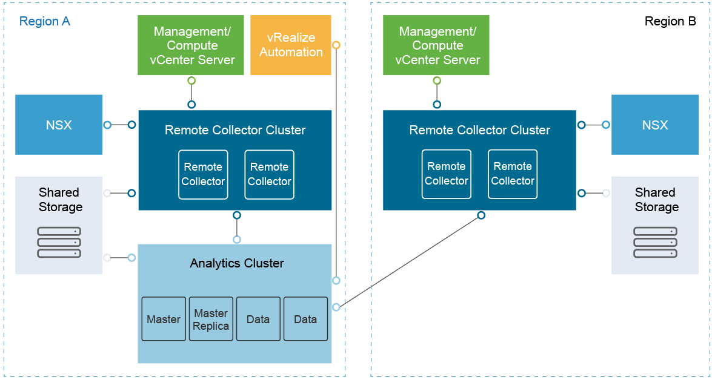

#### Physical Design

The vRealize Operations Manager nodes run on the management pod in each region of SDDC. For information about the types of pods, see Pod Architecture.

#### Data Sources

vRealize Operations Manager collects data from the following virtual infrastructure and cloud management components:

-   Management vCenter Server

-   Platform Services Controller

-   vCenter Server

-   Compute vCenter Server

-   Platform Services Controller

-   vCenter Server

-   Management, Edge and Compute ESXi hosts

-   NSX for vSphere for the management and compute clusters

-   NSX Manager

-   NSX Controller Instances

-   NSX Edge instances 

-   vRealize Automation 

-   vRealize Orchestrator

-   vRealize Automation Components

-   vRealize Log Insight

-   vRealize Operations Manager (Self Health Monitoring)

    1.  #### vRealize Operations Manager Nodes

The analytics cluster of the vRealize Operations Manager deployment contains the nodes that analyze and store data from the monitored components.

Deploy a four-node vRealize Operations Manager analytics cluster in an application virtual network. The analytics cluster consists of one master node, one master replica node, and two data nodes to enable scale out and high availability.

#### Sizing Compute Resources

Size the vRealize Operations Manager analytics cluster according to VMware KB article 2130551 "[vRealize Operations Manager 6.1 Sizing Guidelines](http://kb.vmware.com/kb/2130551)". vRealize Operations Manager is sized so as to accommodate the IT Automation Cloud design by deploying the following management packs:

-   Management Pack for VMware vCenter Server (installed by default)

-   Management Pack for NSX for vSphere

-   Management Pack for Storage Devices

-   Management Pack for vRealize Log Insight

-   Management Pack for vRealize Automation

    1.  #### Sizing Compute Resources for the Analytics Cluster Nodes

Deploying four medium-size virtual appliances satisfies the requirement of the ITAC 1.0 specification for retention along with the number of expected objects and metrics.

Table 195. Size of a Medium vRealize Operations Manager Virtual Appliance

| Attribute                                                         | Specification |
|-------------------------------------------------------------------|---------------|
| Appliance size                                                    | Medium        |
| vCPU                                                              | 8             |
| Memory                                                            | 32 GB         |
| Single-Node Maximum Objects                                       | 7,000         |
| Single-Node Maximum Collected Metrics (\*)                        | 2,000,000     |
| Multi-Node Maximum Objects Per Node (\*\*)                        | 5,000         |
| Multi-Node Maximum Collected Metrics Per Node (\*\*)              | 1,500,000     |
| Maximum number of End Point Operations Management agents per node | 1200          |
| Maximum Objects for 16-Node Maximum (\*\*)                        | 60,000        |
| Maximum Metrics for 16-Node Configuration (\*\*)                  | 15,000,000    |

(\*) Metric numbers reflect the total number of metrics that are collected from all adapter instances in vRealize Operations Manager. To get this number, you can go to the Cluster Management page in vRealize Operations Manager, and view the adapter instances of each node at the bottom of the page. You can get the number of metrics collected by each adapter instance. The sum of these metrics is what is estimated in this sheet.

Note: The number shown in the overall metrics on the Cluster Management page reflects the metrics that are collected from different data sources and the metrics that vRealize Operations Manager creates.

(\*\*) In large, 16-node configurations, note the reduction in maximum metrics to permit some head room.

Table 196. Analytics Cluster Node Configuration Design Decisions

| Decision ID      | Design Decision                                                                                                | Design Justification                             | Design Implication                                                        |
|------------------|----------------------------------------------------------------------------------------------------------------|--------------------------------------------------|---------------------------------------------------------------------------|
| SDDC-OPS-MON-001 | Deploy vRealize Operations Manager as a cluster of 4 nodes: one master, one master replica and two data nodes. | Enables scale-out and high availability.         | Each node must be sized identically.                                      |
| SDDC-OPS-MON-002 | Deploy each node in the analytics cluster as a medium-size appliance.                                          | Provides the scale required to monitor the SDDC. | You must provide 32 vCPUs and 128 GB of memory in the management cluster. |

#### Sizing Compute Resources for the Remote Collector Nodes

Unlike the analytics cluster nodes, remote collector nodes have only the collector role. Deploying two remote collector nodes in each region does not increase the number of monitored objects.

Table 197. Size of a Standard Remote Collector Virtual Appliance for vRealize Operations Manager

| Attribute | Specification               |
|-------------------------------------------------------------------------------------|-----------------------------|
| Appliance size                                                                      | Remote Collector - Standard |
| vCPU                                                                                | 2                           |
| Memory                                                                              | 4 GB                        |
| Single-node maximum Objects                                                         | 1,500 (\*)                  |
| Single-Node Maximum Collected Metrics                                               | 600,000                     |
| Multi-Node Maximum Objects Per Node                                                 | N/A                         |
| Multi-Node Maximum Collected Metrics Per Node                                       | N/A                         |
| Maximum number of End Point Operations Management Agents per Node                   | 250                         |
| Maximum Objects for 16-Node Maximum                                                 | N/A                         |
| Maximum Metrics for 16-Node Configuration                                           | N/A                         |

(\*) The object limit for the remote collector is based on the VMware vCenter adapter.

Table 198. Compute Resources of the Remote Collector Nodes Design Decisions

| Decision ID      | Design Decision                                               | Design Justification                                                                                                         | Design Implication                                                                    |
|------------------|---------------------------------------------------------------|------------------------------------------------------------------------------------------------------------------------------|---------------------------------------------------------------------------------------|
| SDDC-OPS-MON-003 | Deploy two remote collector nodes per region.                 | Removes the load from the analytics cluster from collecting metrics from applications that do not fail over between regions. | When configuring the monitoring of a solution, you must assign a collector group.     |
| SDDC-OPS-MON-004 | Deploy the standard-size remote collector virtual appliances. | Enables metric collection for the expected number of objects in the SDDC.                                                    | You must provide 4 vCPUs and 8 GB of memory in the management cluster in each region. |

#### Sizing Storage

A vRealize Operations Manager node of a medium size requires 266 GB of free space for data. To collect the required number of metrics, you must add a 1 TB VMDK to each analytics cluster node.

Sizing Storage for the Analytics Cluster Nodes

The analytics cluster processes a large amount of objects and metrics. As the environment grows, a need to add additional data nodes to the analytics cluster might emerge. Refer to the vRealize Operations Manager sizing guidelines in the KB article to plan the sizing requirements of your environment. 

Table 199. Analytics Cluster Node Storage Design Decision 

| Decision ID      | Design Decision                                                                           | Design Justification                                            | Design Implication                                                                                   |
|------------------|-------------------------------------------------------------------------------------------|-----------------------------------------------------------------|------------------------------------------------------------------------------------------------------|
| SDDC-OPS-MON-005 | Provide a 1 TB VMDK for each analytics node (master, master replica, and two data nodes). | Provides enough storage to meet the IT Automation Cloud design. | You must add the 1 TB disk manually while the virtual machine for the analytics node is powered off. |

   

Sizing Storage for the Remote Collector Nodes

Deploy the remote collector nodes with thin-provisioned disks. Because remote collectors do not perform analytics operations or store data, the default VMDK size is sufficient.

Table 200. Remote Collector Node Storage Design Decision

| Decision ID         | Design Decision                                          | Design Justification                                                         | Design Implication |
|---------------------|----------------------------------------------------------|------------------------------------------------------------------------------|--------------------|
| SDDC-OPS-MON-006    | Do not provide additional storage for remote collectors. | Remote collectors do not perform analytics operations or store data on disk. | None.              |

#### Networking Design

Isolate the three clusters of vRealize Operations Manager in application isolated networks for secure access, load balancing, portability, and functionality-specific subnet allocation.

Figure 58. Networking Design of the vRealize Operations Manager Deployment

#### Application Isolated Network Design

Each of the three logical entities of the vRealize Operations Manager deployment, that is analytics cluster, remote collectors in Region A and remote collectors in Region B, are installed in an application isolated network. You deploy an NSX Edge device in front of the application isolated network to provide routing and load balancing. This networking design has the following features:

-   Each application virtual network of vRealize Operations Manager has connection to the application virtual networks of vRealize Automation and vRealize Log Insight through a dedicated network called networkExchange. The role of networkExchange is to support transit traffic and the exchange of routing tables. 

-   All nodes have routed access to the vSphere management network through the Management NSX Edge for the home region. 

-   Routing to the vSphere management network and the external network is dynamic, and is based on the Open Shortest Path First (OSPF) protocol. 

-   The NSX Edge instances for the analytics cluster are configured to use Source NAT (SNAT) address translation when the analytics nodes access the public network.

For more information about the networking configuration of the application isolated networks for vRealize Operations Manager, see Software-Defined Networking Design.

Figure 59. Application Virtual Networks in the vRealize Operations Manager Topology

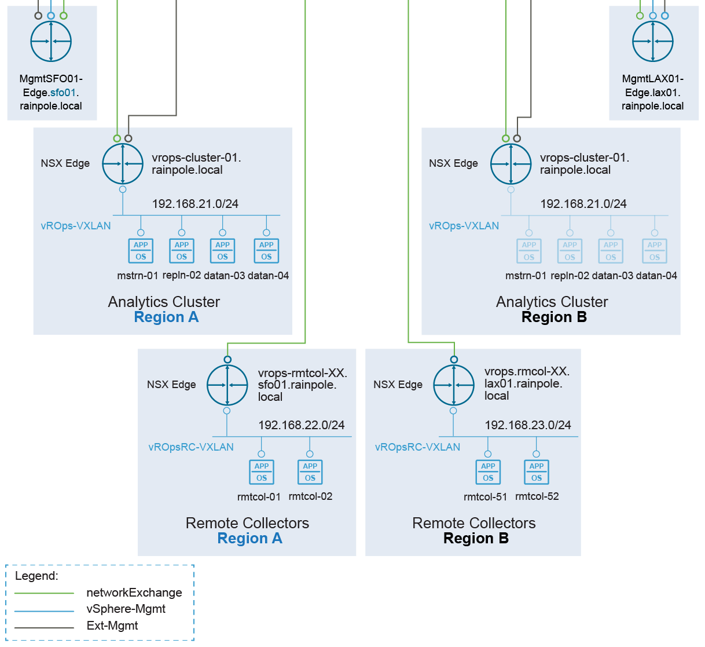
 

Table 201. vRealize Operations Manager Isolated Network Design Decision

| Decision ID      | Design Decision                           | Design Justification                                                                                                                      | Design Implication |
|------------------|-------------------------------------------|-------------------------------------------------------------------------------------------------------------------------------------------|--------------------|
| SDDC-OPS-MON-007 | Deploy four application virtual networks. | Support disaster recovery by isolating both remote collector clusters and the analytics cluster in separate application virtual networks. | None.              

                                                                                                                                                                                                                                |

#### IP Subnets

You can allocate the following example subnets for each cluster in the vRealize Operations Manager deployment:

Table 202. IP Subnets in the Application Virtual Network of vRealize Operations Manager

| vRealize Operations Manager Cluster Type                             | IP Subnet       |
|----------------------------------------------------------------------|-----------------|
| Analytics cluster in Region A (also valid for Region B for failover) | 192.168.21.0/24 |
| Remote collectors in Region A                                        | 192.168.22.0/24 |
| Remote collectors in Region B                                        | 192.168.23.0/24 |

Table 203. IP Subnets Design Decision

| Decision ID      | Design Decision                                                  | Design Justification                                                                                                                              | Design Implication |
|------------------|------------------------------------------------------------------|---------------------------------------------------------------------------------------------------------------------------------------------------|--------------------|
| SDDC-OPS-MON-008 | Allocate separate subnets for each application isolated network. | Placing the remote collectors on their own subnet enables them to communicate with the analytics cluster and not be a part of the failover group. | None.              |

#### DNS Names

vRealize Operations Manager node name resolution uses a region-specific suffix, such as sfo01.rainpole.local or lax01.rainpole.local, the analytics nodes IP addresses and the load balancer virtual IP address (VIP) are mapped to the root domain suffix rainpole.local. Access from the public network is provided through a VIP, the traffic to which is handled by the NSX Edge service gateway.

Table 204. DNS Names for the Application Virtual Networks 

| vRealize Operations Manager DNS Name | Node Type                                    |
|--------------------------------------|----------------------------------------------|
| vrops-cluster-01.rainpole.local      | Virtual IP of the analytics cluster          |
| vrops-mstrn-01.rainpole.local        | Master node in the analytics cluster         |
| vrops-repln-02.rainpole.local        | Master replica node in the analytics cluster |
| vrops-datan-03.rainpole.local        | First data node in the analytics cluster     |
| vrops-datan-04.rainpole.local        | Second data node in the analytics cluster    |
| vrops-rmtcol-01.sfo01.rainpole.local | First remote collector node in Region A      |
| vrops-rmtcol-02.sfo01.rainpole.local | Second remote collector node in Region A     |
| vrops-rmtcol-51.lax01.rainpole.local | First remote collector node in Region B      |
| vrops-rmtcol-52.lax01.rainpole.local | Second remote collector node in Region B     |

Table 205. DNS Names Design Decision

| Decision ID      | Design Decision                                                                                | Design Justification                                                                                    | Design Implication                                   |
|------------------|------------------------------------------------------------------------------------------------|---------------------------------------------------------------------------------------------------------|------------------------------------------------------|
| SDDC-OPS-MON-009 | Configure DNS records for all vRealize Operations Manager nodes and for the load balancer VIP. | Provides FQDN-based access to all vRealize Operations Manager nodes in addition to the IP-based access. | You must manually create a DNS record for each node. |

#### Networking for Failover and Load Balancing

Each node in the vRealize Operations Manager analytics cluster runs a Tomcat server instance for access to the product user interface.

By default, vRealize Operations Manager does not provide a solution for load-balanced UI user sessions across nodes in the cluster. The lack of load balancing for user sessions results in the following limitations:

-   Users must know the URL of each node to access the UI.  As a result, a single node might be overloaded if all users access it at the same time.  

-   Each node supports up to four simultaneous user sessions. 

-   Taking a node offline for maintenance might cause an outage. Users cannot access the UI of the node when the node is offline.  

To avoid such problems, place the analytics cluster behind an NSX load balancer that is configured to allow up to four connections per node. The load balancer must distribute the load evenly to all cluster nodes. In addition, configure the load balancer to redirect service requests from the UI on port 80 to port 443.

Load balancing for the remote collector nodes is not required.

Table 206. Networking Failover and Load Balancing Design Decisions

| Decision ID      | Design Decision                                            | Design Justification                                                                                                         | Design Implication                                                                   |
|------------------|------------------------------------------------------------|------------------------------------------------------------------------------------------------------------------------------|--------------------------------------------------------------------------------------|
| SDDC-OPS-MON-010 | Place the analytics cluster behind an NSX load balancer.   | Enables balanced access of tenants and users to the analytics services with the load being spread evenly across the cluster. | You must configure manually the NSX Edge devices to provide load balancing services. |
|                  

 SDDC-OPS-MON-011  | Do not use a load balancer for the remote collector nodes. | Remote collectors must directly access the systems that they are monitoring.                                                 

                                                                                 Remote collectors do not require access to and from the public network.                                                       | None                                                                                 |

#### Security and Authentication

You use several sources for authentication in vRealize Operations Manager such as an Active Directory service, vCenter Server, and local user inventory.

Identity Sources

You can allow users to authenticate in vRealize Operations Manager in the following ways:

-   Import users or user groups from an LDAP database. Users can use their LDAP credentials to log in to vRealize Operations Manager.

-   Use vCenter Server user accounts. After a vCenter Server instance is registered with vRealize Operations Manager, the following vCenter Server users can log in to vRealize Operations Manager: 

<!-- -->

-   Users that have administration access in vCenter Server.

-   Users that have one of the vRealize Operations Manager privileges, such as PowerUser, assigned to the account which appears at the root level in vCenter Server.

<!-- -->

-   Create local user accounts in vRealize Operations Manager.

Table 207. Identity Source for vRealize Operations Manager Design Decision

| Decision ID      | Design Decision                      | Design Justification                                                                        | Design Implication                                               |
|------------------|--------------------------------------|---------------------------------------------------------------------------------------------|------------------------------------------------------------------|
| SDDC-OPS-MON-012 | Use Active Directory authentication. | Provides access to vRealize Operations Manager by using standard Active Directory accounts.

                                                           Ensures that authentication is available even if vCenter Server becomes unavailable.         | You must manually configure the Active Directory authentication. |

Encryption

Access to all vRealize Operations Manager Web interfaces requires an SSL connection. By default, vRealize Operations Manager uses a self-signed certificate. Replace default self-signed certificates with a CA-signed certificate to provide secure access to the vRealize Operations Manager user interface. 

Table 208. Using CA-Signed Certificates Design Decision

| Decision ID      | Design Decision                                                            | Design Justification                                                                                             | Design Implication                              |
|------------------|----------------------------------------------------------------------------|------------------------------------------------------------------------------------------------------------------|-------------------------------------------------|
| SDDC-OPS-MON-013 | Replace the default self-signed certificates with a CA-signed certificate. | Configuring a CA-signed certificate ensures that all communication to the externally facing Web UI is encrypted. | Access to a Certificate Authority is required.  |

#### Monitoring and Alerting

vRealize Operations Manager can monitor itself and display the following administrative alerts:

-   **System alert.** A component of the vRealize Operations Manager application has failed.

-   **Environment alert.** vRealize Operations Manager has stopped receiving data from one or more resources. Such an alert might indicate a problem with system resources or network infrastructure.

-   **Log Insight log event.** The infrastructure on which vRealize Operations Manager is running has low-level issues. You can also use the log events for root cause analysis. 

-   **Custom dashboard.** vRealize Operations Manager can show super metrics for data center monitoring, capacity trends and single pane of glass overview.

Table 209. Monitoring vRealize Operations Manager Design Decisions

| Decision ID      | Design Decision                                                  | Design Justification                                                                                | Design Implication                                                     |
|------------------|------------------------------------------------------------------|-----------------------------------------------------------------------------------------------------|------------------------------------------------------------------------|
| SDDC-OPS-MON-014 | Configure vRealize Operations Manager for SMTP outbound alerts.  | Enables administrators and operators to receive alerts via e-mail from vRealize Operations Manager. | Requires access to an external SMTP server.                            |
| SDDC-OPS-MON-015 | Integrate vRealize Operations Manager with vRealize Log Insight. | Enables deeper root cause analysis and infrastructure alerting                                      | Requires installation of the Management Pack for vRealize Log Insight. |
| SDDC-OPS-MON-016 | Configure vRealize Operations Manager custom dashboards.         | Provides extended SDDC monitoring, capacity trends and single pane of glass overview.               | Requires manually configuring the dashboards.                          |

#### Management Packs

The SDDC contains several VMware products for network, storage, and cloud management. You can monitor and perform diagnostics on all of them by using management packs.

Table 210. Management Packs for vRealize Operations Manager Design Decision

| Decision ID      | Design Decision                                                                            | Design Justification                                                                | Design Implication                                                             |
|------------------|--------------------------------------------------------------------------------------------|-------------------------------------------------------------------------------------|--------------------------------------------------------------------------------|
| SDDC-OPS-MON-017

                   | Install the following management packs:                                                    

                    -   Management Pack for VMware vCenter Server (installed by default)                        

                    -   Management Pack for NSX for vSphere                                                     

                    -   Management Pack for Storage Devices                                                     

                    -   Management Pack for vRealize Log Insight                                                

                    -   Management Pack for vRealize Automation                                                 | Provides monitoring for all virtual infrastructure and cloud management components. | Requires manually installing and configuring each non-default management pack. |
| SDDC-OPS-MON-018 | Solutions that failover between sites will use the default cluster group as the collector. | Provides monitoring for all components during a failover.                           | Adds minimal additional load to the analytics cluster                          |

1.  ### vRealize Log Insight Design

    1.  #### Logical Design

In a multi-region Software Defined Data Center (SDDC) deploy a vRealize Log Insight cluster in each region that consists of three nodes. This allows for continued availability and increased log ingestion rates. 

Figure 60. Logical Design of vRealize Log Insight

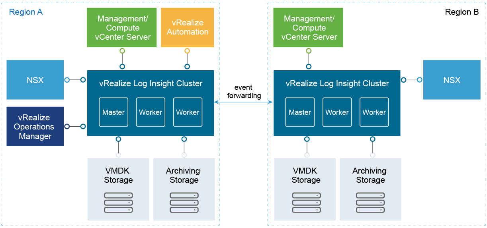

#### Sources of Log Data

vRealize Log Insight collects logs from the following virtual infrastructure and cloud management components:

-   Management vCenter Server

<!-- -->

-   Platform Services Controller

-   vCenter Server

<!-- -->

-   Compute vCenter Server

<!-- -->

-   Platform Services Controller

-   vCenter Server

<!-- -->

-   Management, Edge and Compute ESXi hosts

-   NSX for vSphere for the management and for compute and edge clusters

<!-- -->

-   NSX Manager

-   NSX Controller instances

-   NSX Edge instances 

<!-- -->

-   vRealize Automation 

<!-- -->

-   vRealize Orchestrator

-   vRealize Automation components

<!-- -->

-   vRealize Operations Manager

<!-- -->

-   Analytics cluster nodes

    1.  #### Cluster Nodes

The vRealize Log Insight cluster consists of one master node and two worker nodes. You enable the Integrated Load Balancer (ILB) on the cluster to have vRealize Log Insight to balance incoming traffic fairly among available nodes.  vRealize Log Insight clients, using both the Web user interface, and ingestion through syslog or the Ingestion API, connect to vRealize Log Insight at the ILB address. vRealize Log Insight cluster can scale out to 6 nodes, that is, one master and 5 workers nodes.

Table 211. **Cluster Node Configuration Design Decision**

| **Decision ID**  | **Design Decision**                                                                                                                  | **Design Justification**                                                                                                                      | **Design Implication**               |
|------------------|--------------------------------------------------------------------------------------------------------------------------------------|-----------------------------------------------------------------------------------------------------------------------------------------------|--------------------------------------|
| SDDC-OPS-LOG-001 | Deploy vRealize Log Insight in a cluster configuration of 3 nodes with an integrated load balancer: one master and two worker nodes. | Provides high availability. Using the integrated load balancer simplifies the Log Insight deployment, and prevents a single point of failure. | You must size each node identically. |

#### Sizing

By default, a vRealize Log Insight virtual appliance has 2 vCPUs, 4 GB of virtual memory, and 144 GB of disk space provisioned. vRealize Log Insight uses 100 GB of the disk space to store raw, index and metadata.

Sizing Nodes

To accommodate all of log data from the products in the SDDC, you must size of the Log Insight nodes properly.

Table 212. **Compute Resources for a vRealize Log Insight Medium-Size Node**

| Attribute                      | Specification                         |
|--------------------------------|---------------------------------------|
| Appliance size                 | Medium                                |
| Number of CPUs                 | 8                                     |
| Memory                         | 16 GB                                 |
| IOPS                           | 1,000 IOPS                            |
| Amount of processed log data   | 38 GB/day                             |
| Number of process log messages | 7,500                                 |
| Environment                    | Up to 250 syslog connections per node |

Table 213. **Compute Resources for the vRealize Log Insight Nodes Design Decision**

| **Decision ID**  | **Design Decision**                               | **Design Justification**                                | **Design Implication**                                                                                     |
|------------------|---------------------------------------------------|---------------------------------------------------------|------------------------------------------------------------------------------------------------------------|
| SDDC-OPS-LOG-002 | Deploy vRealize Log Insight nodes of medium size. | Accommodates the number of expected syslog connections. | You must increase the size of the nodes if you configure Log Insight to monitor additional syslog sources. |

Sizing Storage

Sizing is based on IT organization requirements, but assuming that you want to retain 7 days of data, you can use the following calculations.

For 250 syslog sources at a rate of 150 MB of logs ingested per-day per-source over 7 days:

> *250 sources \* 150 MB of log data ≈ 37 GB log data per-day*
>
> *37 GB \* 7 days ≈ 260 GB log data per vRealize Log Insight node*
>
> *260 GB \* 1.7 overhead index ≈ 450 GB*

Based on this example, you must provide 270 GB of storage space per node when you deploy the medium-size vRealize Log Insight virtual appliance. You must add additional space of approximately 190 GB.

1.  vRealize Log Insight supports virtual hard disks of up to 2 TB. If more capacity is needed, add another virtual hard disk. Do not extend existing retention virtual disks.

    1.  #### Networking Design

In both regions, the vRealize Log Insight instances are connected to both the vSphere management (gray in the network diagram) and the external management (blue in the network diagram) networks. Each vRealize Log Insight instance is deployed within its own application isolated network (gray boxes in the network diagram).

Figure 61. Networking Design for the vRealize Log Insight Deployment

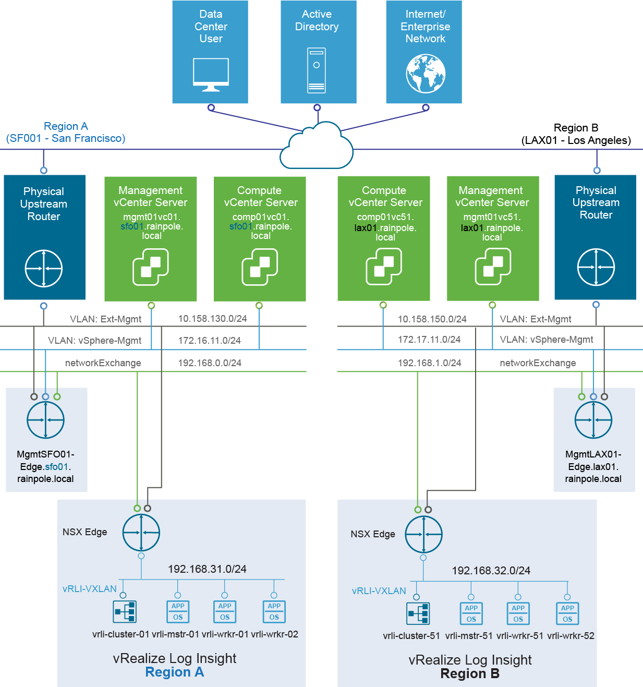

#### Application Isolated Network Design

Each of the two instances of the vRealize Log Insight deployment is installed in its own isolated application network. An NSX Edge appliance is configured at the front of each isolated application network to provide the network isolation.  You deploy an NSX Edge device in front of the application isolated network to provide routing and load balancing. This networking design has the following features:

-   Each application virtual network of vRealize Log Insight has connection to the application virtual networks of vRealize Automation and vRealize Operations Manager through a dedicated network called networkExchange. The role of networkExchange is to support transit traffic and the exchange of routing tables. 

-   All nodes have routed access to the vSphere management network through the Management NSX Edge for the home region. 

-   Routing to the vSphere management network and the external network is dynamic, and is based on the Open Shortest Path First (OSPF) protocol. 

-   The NSX Edge instances for the vRealize Log Insight are configured to use Source NAT (SNAT) address translation when the vRealize Log Insight nodes access the public network.

-   The NSX Edge instances for the vRealize Log Insight provide access to vRealize Log Insight from the public network over Destination NAT (DNAT). 

For more information about the networking configuration of the application isolated networks for vRealize Log Insight, see *Software-Defined Networking Design*.

Figure 62. Application Virtual Networks in the vRealize Log Insight Topology

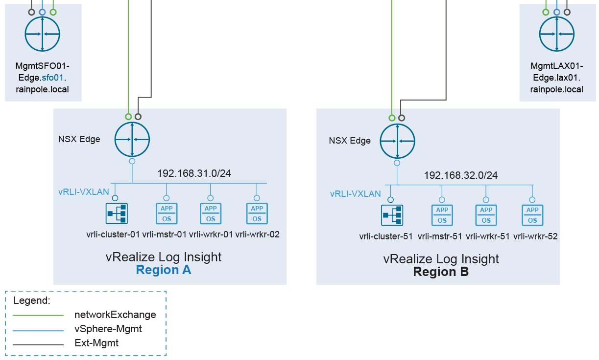

Table 214. **vRealize Log Insight Isolated Network Design Decisions**

| **Decision ID**  | **Design Decision**                                                                                                 | **Design Justification**                                                                                                                          | **Design Implication** |
|------------------|---------------------------------------------------------------------------------------------------------------------|---------------------------------------------------------------------------------------------------------------------------------------------------|------------------------|
| SDDC-OPS-LOG-003 | Deploy two vRealize Log Insight isolated networks.                                                                  | Secures the vRealize Log Insight instances.                                                                                                       

                                                                                                                                          Provides a consistent deployment model for management applications.                                                                                | None                   |
| SDDC-OPS-LOG-004 | On the NSX Edge of each Log Insight application isolated network, configure DNAT for access to the Log Insight VIP. | Provide access to the Log Insight UI in each region from the public network while the VIP address remains within the Log Insight isolated subnet. | None                   |

#### IP Subnets

You can allocate the following example subnets to the vRealize Log Insight deployment:

Table 215. IP Subnets in the Application Isolated Networks

| vRealize Log Insight Cluster | IP Subnet       |
|------------------------------|-----------------|
| Region A                     | 192.168.31.0/24 |
| Region B                     | 192.168.32.0/24 |

Table 216. **IP Subnets Design Decision**

| Decision ID      | **Design Decision**                                              | **Design Justification**                                                                                                                     | **Design Implication** |
|------------------|------------------------------------------------------------------|----------------------------------------------------------------------------------------------------------------------------------------------|------------------------|
| SDDC-OPS-LOG-005 | Allocate separate subnets for each application isolated network. | Satisfies the requirement for log forwarding between the two vRealize Log Insight instances to place each instance on its own unique subnet. | None.                  |

#### DNS Names

vRealize Log Insight node name resolution uses a region-specific suffix, such as sfo01.rainpole.local or lax01.rainpole.local, including the load balancer virtual IP addresses (VIPs). The Log Insight components in both regions have the following node names:

Table 217.**DNS Names of the **vRealize Log Insight Nodes 

| DNS Name                             | Role                | Region |
|--------------------------------------|---------------------|--------|
| vrli-cluster-01.sfo01.rainpole.local | Log Insight ILB VIP | A      |
| vrli-mstr01.sfo01.rainpole.local     | Master node         | A      |
| vrli-wrkr01.sfo01.rainpole.local     | Worker node         | A      |
| vrli-wrkr02.sfo01.rainpole.local     | Worker node         | A      |
| vrli-cluster-51.lax01.rainpole.local | Log Insight ILB VIP | B      |
| vrli-mstr51.lax01.rainpole.local     | Master node         | B      |
| vrli-wrkr51.lax01.rainpole.local     | Worker node         | B      |
| vrli-wrkr52.lax01.rainpole.local     | Worker node         | B      |

Table 218. **DNS Names Design Decision**

| Decision ID      | **Design Decision**                                                                                                                                                                                  | **Design Justification**                                                                                                                  | **Design Implication**                                                                                                                                                                                                                                            |
|------------------|------------------------------------------------------------------------------------------------------------------------------------------------------------------------------------------------------|-------------------------------------------------------------------------------------------------------------------------------------------|-------------------------------------------------------------------------------------------------------------------------------------------------------------------------------------------------------------------------------------------------------------------|
| SDDC-OPS-LOG-006 | Configure DNS records for all vRealize Log Insight nodes and VIPs.                                                                                                                                   | All nodes are accessible by using fully-qualified domain names instead of by using IP addresses only.                                     | You must manually provide a DNS record for each node.                                                                                                                                                                                                             |
| SDDC-OPS-LOG-007 | For all applications that failover between regions (such as vRealize Automation and vRealize Operations Manager), use the FQDN of the vRealize Log Insight Region A VIP when you configure logging.  | Support logging when not all management applications are failed over to Region B. For example, only one application is moved to Region B. | If vRealize Automation and vRealize Operations Manager are failed over to Region B and the vRealize Log Insight cluster is no longer available in Region A, update the A record on the child DNS server to point to the vRealize Log Insight cluster in Region B. |

 

#### Retention and Archiving

Configure archive and retention parameters of vRealize Log Insight according to the company policy for compliance and governance.

Retention

vRealize Log Insight virtual appliances contain three default virtual disks and can use addition virtual disks for storage, for example, hard disk 4.

Table 219. **Virtual Disk Configuration in the vRealize Log Insight Virtual Appliance**

| Hard Disk                             | Size                              | Usage                                                                              |
|---------------------------------------|-----------------------------------|------------------------------------------------------------------------------------|
| Hard disk 1                           | 12.125 GB                         | Root file system                                                                   |
| Hard disk 2                           | 270 GB for medium-size deployment | Contains two partitions:                                                           

                                                                             -   /storage/var  System logs                                                       

                                                                             -   /storage/core Storage for Collected logs.                                       |
| Hard disk 3                           | 256 MB                            | First boot only                                                                    |
| Hard disk 4 (additional virtual disk) | 190 GB                            | Storage for collected logs. The capacity from this disk is added to /storage/core. |

Calculate the storage space that is available for log data in the following way:

/storage/core = hard disk 2 space + hard disk 4 space - system logs space on hard disk 2

Based on the size of the default and additional virtual disks, the storage core is equal to

/storage/core = 270 GB + 190 GB - 20 GB = 440 GB

Retention = /storage/core – 3% \* /storage/core

If /storage/core is 425 GB, vRealize Log Insight can use 413 GB for retention.

Retention = 440 GB - 3% \* 440 ≈ 427 GB 

Configure a retention period of 7 days for the medium-size vRealize Log Insight appliance.

Table 220. **Retention Period Design Decision**

| **Decision ID**  | **Design Decision**                                       | **Design Justification**                                                          | **Design Implication**                 |
|------------------|-----------------------------------------------------------|-----------------------------------------------------------------------------------|----------------------------------------|
| SDDC-OPS-LOG-008 | Configure vRealize Log Insight to retain data for 7 days. | Accommodates logs from 750 syslog sources (250 per node) as per the SDDC design.  | You must add a VMDK to each appliance. |

 

Archiving

vRealize Log Insight archives log messages as soon as possible. In the same time, they remain retained on the virtual appliance until the free local space is almost over. Data exists on both the vRealize Log Insight appliance and the archive location for most of the retention period. The archiving period must be longer than the retention period.

The archive location must be on an NFS version 3 shared storage. The archive location must be available and must have enough capacity to accommodate the archives.

Apply an archive policy of 90 days for the medium-size vRealize Log Insight appliance which makes about 1 TB of shared storage. According to the business compliance regulations of your organization, these sizes might change.

Table 221. **Log Archive Policy Design Decision**

| **Decision ID**  | **Design Decision**                                                                | **Design Justification**               | **Design Implication**                                                                                                 |
|------------------|------------------------------------------------------------------------------------|----------------------------------------|------------------------------------------------------------------------------------------------------------------------|
| SDDC-OPS-LOG-009 | Provide 1 TB of NFS version 3 shared storage to each vRealize Log Insight cluster. | Archives logs from 750 syslog sources.

                                                                                                                                                 | You must provide an NFS version 3 shared storage in addition to the data storage for the vRealize Log Insight cluster.

                                                                                                                                                  You must enforce the archive policy directly on the shared storage.                                                     |

#### Alerting

vRealize Log Insight supports alerts that trigger notifications about its health. The following types of alerts exist in vRealize Log Insight:

-   **System Alerts.** vRealize Log Insight generates notifications when an important system event occurs, for example when the disk space is almost exhausted and vRealize Log Insight must start deleting or archiving old log files.

-   **Content Pack Alerts.** Content packs contain default alerts that can be configured to send notifications, these alerts are specific to the specific content pack and are disabled by default.

-   **User-Defined Alerts.** Administrators and users can define their own alerts based on data ingested by vRealize Log Insight.

vRealize Log Insight handles alerts in two ways:

-   Send an e-mail over SMTP

-   Send to vRealize Operations Manager

#### SMTP Notification

Enable e-mail notification for alerts in vRealize Log Insight.

Table 222. **SMTP Alert Notification Design Decision**

| Decision ID      | Design Decision            | Design Justification                                                                        | Design Implication                          |
|------------------|----------------------------|---------------------------------------------------------------------------------------------|---------------------------------------------|
| SDDC-OPS-LOG-010 | Enable alerting over SMTP. | Enables administrators and operators to receive alerts via email from vRealize Log Insight. | Requires access to an external SMTP server. |

 

#### Integration with vRealize Operations Manager

vRealize Log Insight integrates with vRealize Operations Manager to provide a central location for monitoring and diagnostics. 

vRealize Log Insight integrates with vRealize Operations Manager in the following ways:

-   Notification Events. Forward notification events from vRealize Log Insight to vRealize Operations Manager. 

-   Launch in Context. Launch vRealize Log Insight from the vRealize Operation Manager user interface. You must install the vRealize Log Insight management pack in vRealize Operations Manager. 

Table 223. **Forwarding Alerts to vRealize Operations Manager Design Decision**

| **Decision ID**  | **Design Decision**                            | **Design Justification**                                                        | **Design Implication**                                        |
|------------------|------------------------------------------------|---------------------------------------------------------------------------------|---------------------------------------------------------------|
| SDDC-OPS-LOG-011 | Forward alerts to vRealize Operations Manager. | Provides centralized monitoring and alerting, and the use of launch in context. | You must install of the vRealize Log Insight management pack. |

 

#### Security and Authentication

Protect the vRealize Log Insight deployment by providing centralized role-based authentication and secure communication with the other components in the Software-Defined Data Center (SDDC).

Authentication

Enable role-based access control in vRealize Log Insight by using the existing rainpole.local Active Directory domain.

Table 224. **Custom Role-Based User Management Design Decision**

| **Decision ID**  | **Design Decision**                      | **Design Justification**                                                                    | **Design Implication**                                                      |
|------------------|------------------------------------------|---------------------------------------------------------------------------------------------|-----------------------------------------------------------------------------|
| SDDC-OPS-LOG-012 | Use Active Directory for authentication. | Provides fine-grained role and privilege-based access for administrator and operator roles. | You must provide access to the Active Directory from all Log Insight nodes. |

 

Encryption

Replace default self-signed certificates with a CA-signed certificate to provide secure access to the vRealize Log Insight Web user interface. 

Table 225. **Custom Certificates Design Decision**

| **Decision ID**  | **Design Decision**                                                        | **Design Justification**                                                                                         | **Design Implication**                         |
|------------------|----------------------------------------------------------------------------|------------------------------------------------------------------------------------------------------------------|------------------------------------------------|
| SDDC-OPS-LOG-013 | Replace the default self-signed certificates with a CA-signed certificate. | Configuring a CA-signed certificate ensures that all communication to the externally facing Web UI is encrypted. | Access to a Certificate Authority is required. |

#### Configuration for Collecting Logs

Client applications can send logs to vRealize Log Insight in one of the following ways:

-   Directly to vRealize Log Insight over the syslog protocol.

-   By using vRealize Log Insight agents.

Table 226. **Direct Log Communication to vRealize Log Insight Design Decisions**

| **Decision ID**  | **Design Decision**                                                                                        | **Design Justification**                                                                    | **Design Implication**                                                             |
|------------------|------------------------------------------------------------------------------------------------------------|---------------------------------------------------------------------------------------------|------------------------------------------------------------------------------------|
| SDDC-OPS-LOG-014 | Configure syslog sources to send log data directly to vRealize Log Insight.                                | Simplifies the design implementation for log sources that are syslog capable.               | You must configure syslog sources to forward logs to the vRealize Log Insight VIP. |
| SDDC-OPS-LOG-015 | Configure the vRealize Log Insight agent for the vRealize Automation Windows servers and Linux appliances. | Windows does not natively support syslog.                                                   

                                                                                                                                 vRealize Automation requires the use of the agents to collect all vRealize Automation logs.  | You must manually install and configure the agent.                                 |

 

#### Time Synchronization

Time synchronization is critical for the core functionality of vRealize Log Insight. By default, vRealize Log Insight synchronizes time with a pre-defined list of public NTP servers.

Configure consistent NTP sources on all systems that send log data (vCenter Server, ESXi, vRealize Operation Manager).

Table 227. **Time Synchronization Design Decision**

| **Decision ID**  | **Design Decision**                                                                                                                                | **Design Justification**            | **Design Implication**                                                       |
|------------------|----------------------------------------------------------------------------------------------------------------------------------------------------|-------------------------------------|------------------------------------------------------------------------------|
| SDDC-OPS-LOG-016 | Configure consistent NTP sources on all virtual infrastructure and cloud management applications for correct log analysis in vRealize Log Insight. | Guarantees accurate log timestamps. | Requires that all applications synchronize time to the same NTP time source. |

#### Connectivity in the Cluster

All vRealize Log Insight cluster nodes must be in the same LAN with no firewall or NAT between the nodes.

#### External Communication

vRealize Log Insight receives log data over the syslog TCP, syslog TLS/SSL, or syslog UDP protocol.  Use the default syslog UDP protocol because security is already designed at the level of the management network. 

Table 228. **Syslog Protocol Design Decision**

| **Decision ID**  | **Design Decision**                                                                                                 | **Design Justification**                                                       | **Design Implication**                                                |
|------------------|---------------------------------------------------------------------------------------------------------------------|--------------------------------------------------------------------------------|-----------------------------------------------------------------------|
| SDDC-OPS-LOG-017 | Communicate with the syslog clients, such as ESXi, vCenter Server, NSX for vSphere, on the default UDP syslog port. | Using the default syslog port simplifies configuration for all syslog sources. | If the network connection is interrupted, the syslog traffic is lost.

                                                                                                                                                                                                                           UDP syslog traffic is not secure.                                      |

#### Event Forwarding between Regions

vRealize Log Insight supports event forwarding to other clusters and standalone instances. While forwarding events, the vRealize Log Insight instance still ingests, stores and archives events locally. 

Event Forwarding Protocol

You forward syslog data in vRealize Log Insight by using the Ingestion API or a native syslog implementation.

The vRealize Log Insight Ingestion API uses TCP communication. In contrast to syslog, the forwarding module supports the following features for the Ingestion API:

-   Forwarding to other vRealize Log Insight instances

-   Both structured and unstructured data, that is, multi-line messages.

-   Metadata in the form of tags

-   Client-side compression

-   Configurable disk-backed queue to save events until the server acknowledges the ingestion. 

Table 229. **Protocol for Event Forwarding across Regions Design Decision**

| **Decision ID**  | **Design Decision**                                               | **Design Justification**                                                                                                         | **Design Implication**                                           |
|------------------|-------------------------------------------------------------------|----------------------------------------------------------------------------------------------------------------------------------|------------------------------------------------------------------|
| SDDC-OPS-LOG-018 | Forward log event to the other region by using the Ingestion API. | Using the forwarding protocol supports structured and unstructured data, provides client-side compression, and event throttling. | You must configure each region to forward log data to the other. |

#### Disaster Recovery

Each region is configured to forward log information to the vRealize Log Insight instance in the other region. As a result, you do not have to configure failover. 
