Version History

| Date        | Ver. | Author     | Description                                                             | Reviewers |
|-------------|------|------------|-------------------------------------------------------------------------|-----------|
| 15-Feb-2016 | 1.0  | ISBU / PSE | General Availability of VMware Validated Design for IT Automation Cloud | Tech Pubs |

© 2016 VMware, Inc. All rights reserved. This product is protected by U.S. and international copyright and intellectual property laws. This product is covered by one or more patents listed at [http://www.vmware.com/download/patents.html](http://www.microsoft.com/).

VMware is a registered trademark or trademark of VMware, Inc. in the United States and/or other jurisdictions. All other marks and names mentioned herein may be trademarks of their respective companies.

VMware, Inc.
3401 Hillview Avenue
Palo Alto, CA 94304
www.vmware.com

Contents

[1. Purpose and Assumptions 5](#_Toc443067871)

[2. Virtual Infrastructure Implementation in Region A 6](#virtual-infrastructure-implementation-in-region-a)

[2.1 Install and Configure ESXi Hosts (Region A) 6](#install-and-configure-esxi-hosts-region-a)

[2.2 Deploy and Configure the Management Cluster Components (Region A) 18](#deploy-and-configure-the-management-cluster-components-region-a)

[2.3 Deploy and Configure the Management Cluster NSX Instance (Region A) 65](#deploy-and-configure-the-management-cluster-nsx-instance-region-a)

[2.4 Deploy and Configure Gateway for the Management Networks (Region A) 83](#deploy-and-configure-gateway-for-the-management-networks-region-a)

[2.5 Deploy and Configure the Compute and Edge Clusters Components (Region A) 101](#deploy-and-configure-the-compute-and-edge-clusters-components-region-a)

[2.6 Deploy and Configure the Compute and Edge Clusters NSX Instance (Region A) 151](#deploy-and-configure-the-compute-and-edge-clusters-nsx-instance-region-a)

[2.7 Deploy and Configure Gateways for the Management Application Networks (Region A) 169](#deploy-and-configure-gateways-for-the-management-application-networks-region-a)

[2.8 Replace Certificates (Region A) 193](#replace-certificates-region-a)

[2.9 Deploy vSphere Data Protection in Region A 205](#deploy-vsphere-data-protection-in-region-a)

[3. vRealize Operations Implementation in Region A 220](#vrealize-operations-implementation-in-region-a)

[3.1 Deploy vRealize Operations Manager in Region A 220](#deploy-vrealize-operations-manager-in-region-a)

[3.1.3 Generate a CA-Signed SSL Certificate for the Analytics 228](#generate-a-ca-signed-ssl-certificate-for-the-analytics-cluster)

[3.2 Configure Load Balancer for vRealize Operations Manager in Region A 255](#configure-load-balancer-for-vrealize-operations-manager-in-region-a)

[3.3 Connect vRealize Operations Manager to the vSphere Environment in Region A 267](#connect-vrealize-operations-manager-to-the-vsphere-environment-in-region-a)

[3.4 Install the vRealize Operations Manager Management Pack for vRealize Log Insight 276](#install-the-vrealize-operations-manager-management-pack-for-vrealize-log-insight)

[3.5 Connect vRealize Operations Manager to the NSX Managers in Region A 279](#connect-vrealize-operations-manager-to-the-nsx-managers-in-region-a)

[3.6 Configure a Physical Discovery Adapter for Region A in vRealize Operations Manager 287](#configure-a-physical-discovery-adapter-for-region-a-in-vrealize-operations-manager)

[3.7 Connect vRealize Operations Manager to vRealize Automation in Region A 289](#connect-vrealize-operations-manager-to-vrealize-automation-in-region-a)

[3.8 Enable Storage Device Monitoring in vRealize Operations Manager in Region A 294](#enable-storage-device-monitoring-in-vrealize-operations-manager-in-region-a)

[3.9 Configure User Access in vRealize Operations Manager in Region A 298](#configure-user-access-in-vrealize-operations-manager-in-region-a)

[3.10 Configure E-Mail Alerts in vRealize Operations Manager 305](#configure-e-mail-alerts-in-vrealize-operations-manager)

[4. vRealize Log Insight Implementation in Region A 308](#vrealize-log-insight-implementation-in-region-a)

[4.1 Deploy vRealize Log Insight in Region A 308](#deploy-vrealize-log-insight-in-region-a)

[4.2 Connect vRealize Log Insight to the vSphere Environment in Region A 329](#connect-vrealize-log-insight-to-the-vsphere-environment-in-region-a)

[4.3 Enable the vRealize Log Insight Integration with vRealize Operations Manager for Region A 336](#enable-the-vrealize-log-insight-integration-with-vrealize-operations-manager-for-region-a)

[4.4 Install a CA-Signed Certificate on vRealize Log Insight in Region A 338](#install-a-ca-signed-certificate-on-vrealize-log-insight-in-region-a)

[4.5 Configure Log Retention and Archiving in Region A 344](#configure-log-retention-and-archiving-in-region-a)

[4.6 Connect vRealize Log Insight to vRealize Operations Manager in Region A 346](#connect-vrealize-log-insight-to-vrealize-operations-manager-in-region-a)

[4.7 Connect vRealize Log Insight to the NSX Instances in Region A 356](#connect-vrealize-log-insight-to-the-nsx-instances-in-region-a)

[4.8 Connect vRealize Log Insight to vRealize Automation in Region A 367](#connect-vrealize-log-insight-to-vrealize-automation-in-region-a)

[5. Cloud Management Platform Implementation in Region A 378](#cloud-management-platform-implementation-in-region-a)

[5.1 Generate Certificates for vRealize Automation and vRealize Orchestrator 378](#generate-certificates-for-vrealize-automation-and-vrealize-orchestrator)

[5.2 Configure SQL Server for use with vRealize Automation and vRealize Orchestrator (Region A) 382](#configure-sql-server-for-use-with-vrealize-automation-and-vrealize-orchestrator-region-a)

[5.3 Create vSphere Image Customization Specifications (Region A) 395](#create-vsphere-image-customization-specifications-region-a)

[5.4 Create Windows Virtual Machines for vRealize Automation (Region A) 412](#create-windows-virtual-machines-for-vrealize-automation-region-a)

[5.5 Configure Load Balancing for vRealize Automation and vRealize Orchestrator in Region A 418](#configure-load-balancing-for-vrealize-automation-and-vrealize-orchestrator-in-region-a)

[5.6 Install vRealize Automation (Region A) 436](#install-vrealize-automation-region-a)

[5.7 Install and Configure the vRealize Orchestrator Cluster (Region A) 521](#install-and-configure-the-vrealize-orchestrator-cluster-region-a)

[5.8 Create Anti-Affinity Rules for vRealize Automation and vRealize Orchestrator Virtual Machines (Region A) 560](#create-anti-affinity-rules-for-vrealize-automation-and-vrealize-orchestrator-virtual-machines-region-a)

[5.9 Create a vRealize Automation Tenant (Region A) 563](#create-a-vrealize-automation-tenant-region-a)

[5.10 Configure a vRealize Automation Tenant (Region A) 575](#configure-a-vrealize-automation-tenant-region-a)

[5.11 Prepare a Compute vCenter Server System for vRealize Automation (Region A) 589](#prepare-a-compute-vcenter-server-system-for-vrealize-automation-region-a)

[5.12 Add a Compute vCenter Server Instance to vRealize Automation (Region A) 609](#add-a-compute-vcenter-server-instance-to-vrealize-automation-region-a)

[5.13 Configure Single Machine Blueprints (Region A) 636](#configure-single-machine-blueprints-region-a)

Purpose and Assumptions
============================================================================================================================================================================================================================================================================================================================================================================================================================================================================================================================================================

The *VMware Validated Design for IT Automation Cloud Installation and Configuration Procedures* provide step-by-step instructions for installing, configuring, and operating a software-defined data center based on a VMware Validated Design called IT Automation Cloud.

It does not cover step-by-step instructions for performing all of the required post-configuration tasks, as these are often dependent on the customer requirements.

For easier consumption, these installation and configuration procedures have been broken down into smaller documents as defined in the table below:

Table . Installation and Configuration Procedures Document Set

| Document Name                | Description                                                                                                                                                                                 |
|------------------------------|---------------------------------------------------------------------------------------------------------------------------------------------------------------------------------------------|
| 1.  Planning and Preparation

 **(This Document)**           | Detailed information surrounding the requirements of software, tools and external services required to succesfully implement the VMware Validated Design for IT Automation Cloud platform.  |
| 1.  Deployment of Region A   | Step-by-step instructions for installing and configuring all components deployed within Region A of the VMware Validated Design for IT Automation Cloud platform.                           |
| 1.  Deployment of Region B   | Step-by-step instructions for installing and configuring all components deployed within Region B of the VMware Validated Design for IT Automation Cloud platform.                           |
| 1.  Operational Guidance     | Step-by-step instructions for performing operational tasks such as monitoring, alerting and business continuity operations of the VMware Validated Design for IT Automation Cloud platform. |

The documents are written with the assumption that the reader that uses these procedures is already familiar with the products. It is not intended for those that have no prior knowledge of the concepts and terminology.

1.  Virtual Infrastructure Implementation in Region A
    =================================================

    1.  Install and Configure ESXi Hosts (Region A)
        -------------------------------------------

Start the deployment of your virtual infrastructure by installing and configuring all the ESXi hosts.

Procedure Overview

-   Prerequisites for Installation of ESXi Hosts in Region A

-   Install ESXi Interactively on All Hosts (Region A)

-   Configure the Network on All Hosts (Region A)

-   Configure vSphere Standard Switch on a Host in the Management Cluster (Region A)

-   Configure NTP on All Hosts (Region A)

-   Set Up Virtual SAN Datastore (Region A)

    1.  ### Prerequisites for Installation of ESXi Hosts in Region A

Install and configure the ESXi hosts for the management cluster, compute cluster, and edge cluster by using the same process.

Before you start:

-   Make sure that you have a Windows host that has access to your data center. You use this host to connect to your hosts and perform configuration steps.

-   Ensure that Routing is in place between the two regional management networks 172.16.11.0/24 and 172.17.11.0/24 as this will be needed to join the common SSO domain.

You must also prepare the installation files.

-   Download the ESXi ISO installer.

-   Create a bootable USB drive that contains the ESXi Installation. For more information, see [Format a USB Flash Drive to Boot the ESXi Installation or Upgrade](https://pubs.vmware.com/vsphere-60/index.jsp?topic=%2Fcom.vmware.vsphere.install.doc%2FGUID-33C3E7D5-20D0-4F84-B2E3-5CD33D32EAA8.html) in the vSphere Installation and Setup documentation.

    1.  #### IP Addresses, Hostnames, and Network Configuration

The following tables contain all the values needed to configure your hosts.

Table . Management Cluster Hosts in Region A

| Hostname    | FQDN                             | IP            |
|-------------|----------------------------------|---------------|
| mgmt01esx01 | mgmt01esx01.sfo01.rainpole.local | 172.16.11.101 |
| mgmt01esx02 | mgmt01esx02.sfo01.rainpole.local | 172.16.11.102 |
| mgmt01esx03 | mgmt01esx03.sfo01.rainpole.local | 172.16.11.103 |
| mgmt01esx04 | mgmt01esx04.sfo01.rainpole.local | 172.16.11.104 |

Table . Management Cluster Global Settings in Region A

| Setting             | Value                    |
|---------------------|--------------------------|
| **Management VLAN** | 1611                     |
| **Default Gateway** | 172.16.11.253            |
| **NTP Server**      | ntp.sfo01.rainpole.local |

Table . Compute Cluster Hosts in Region A

| Hostname    | FQDN                             | IP            |
|-------------|----------------------------------|---------------|
| comp01esx01 | comp01esx01.sfo01.rainpole.local | 172.16.21.101 |
| comp01esx02 | comp01esx02.sfo01.rainpole.local | 172.16.21.102 |
| comp01esx03 | comp01esx03.sfo01.rainpole.local | 172.16.21.103 |
| comp01esx04 | comp01esx04.sfo01.rainpole.local | 172.16.21.104 |

Table . Compute Cluster Global Settings in Region A

| Setting             | Value                    |
|---------------------|--------------------------|
| **Management VLAN** | 1621                     |
| **Default Gateway** | 172.16.21.253            |
| **NTP Server**      | ntp.sfo01.rainpole.local |

Table . Edge Cluster Hosts in Region A

| Hostname    | FQDN                             | IP            |
|-------------|----------------------------------|---------------|
| edge01esx01 | edge01esx01.sfo01.rainpole.local | 172.16.31.101 |
| edge01esx02 | edge01esx02.sfo01.rainpole.local | 172.16.31.102 |
| edge01esx03 | edge01esx03.sfo01.rainpole.local | 172.16.31.103 |
| edge01esx04 | edge01esx04.sfo01.rainpole.local | 172.16.31.104 |

Table . Edge Cluster Global Settings in Region A

| Setting             | Value                    |
|---------------------|--------------------------|
| **Management VLAN** | 1631                     |
| **Default Gateway** | 172.16.31.253            |
| **NTP Server**      | ntp.sfo01.rainpole.local |

### Install ESXi Interactively on All Hosts (Region A)

Install all ESXi hosts for all clusters interactively.

Procedure

1.  Power on the **mgmt01esx01** host in Region A, mount the USB drive containing the ESXi ISO file, and boot from that USB drive. 

2.  On the **Welcome to the VMware 6.0.0 Installation** screen, press **Enter** to start the installation.

3.  On the **End User License Agreement (EULA)** screen, press the **F11** to accept the EULA.

4.  On the **Select a Disk to Install or Upgrade** screen, select the USB drive or SD card under local storage to install ESXi, and press **Enter** to continue.

> 

1.  Select the keyboard layout, and press **Enter**.

> 

1.  Enter the **esxi\_root\_user\_password**, confirm, and press **Enter**. 

> 

1.  On the **Confirm Install** screen, press **F11** to start the installation.

2.  After the installation has completed, unmount the USB drive, and press **Enter** to reboot the host.

> 

1.  Repeat all steps for all hosts in the data center. Enter the respective values for each host that you configure.

    1.  ### Configure the Network on All Hosts (Region A)

After the initial boot, use the ESXi Direct Console User Interface (DCUI) for initial host network configuration and administrative access. You configure the following host network settings:

-   Set network adapter (vmk0) and VLAN ID for the Management Network.

-   Set IP address, subnet mask, gateway, DNS server, and FQDN for the ESXi host.

Procedure

1.  Open the DCUI on the physical ESXi host **mgmt01esx01**.

    1.  Open a console window to the host.

    2.  Press **F2** to enter the DCUI.

    3.  Enter **root** as login name, enter the **esxi\_root\_user\_password**, and press **Enter**. 

2.  Configure the network.

<!-- -->

1.  Select **Configure Management Network** and press **Enter**.

2.  Select **Network Adapters** and press **Enter**.

3.  Select **VLAN** (Optional) and press **Enter**.

4.  Enter **1611** as VLAN ID for the Management Network and press **Enter**.

> 

1.  Select **IP Configuration** and press **Enter**.

2.  Configure IPv4 network by using the following settings, and press **Enter**.

| Option                                                | Value         |
|-------------------------------------------------------|---------------|
| **Set static IPv4 address and network configuration** | Selected      |
| **IP**                                                | 172.16.11.101 |
| **Subnet Mask**                                       | 255.255.255.0 |
| **Default Gateway**                                   | 172.16.11.253 |

> 

1.  Select **DNS Configuration** and press **Enter**.

2.  Configure the DNS by using the following settings, and press **Enter**.

| Option                                                | Value       |
|-------------------------------------------------------|-------------|
| **Use the following DNS Server address and hostname** | Selected    |
| **Primary DNS Server**                                | 172.16.11.5 |
| **Hostname**                                          | mgmt01esx01 |

1.  Select Custom **DNS Suffixes** and press **Enter**.

2.  Enter **sfo01.rainpole.local** as suffix, and press **Enter**.

<!-- -->

1.  After completing all host network settings, press **Escape** to exit, and press **Y** to confirm the changes. 

> 

1.  Repeat all steps for all hosts in the management, compute, and edge pods. Enter the respective values from the prerequisites section for each host that you configure.  

    1.  ### Configure vSphere Standard Switch on a Host in the Management Cluster (Region A)

You must perform network configuration from the vSphere Client only for the mgmt01esx01 host. You perform all other host networking configuration after the deployment of the vCenter Server systems that manage the hosts.

You configure a vSphere Standard Switch with two port groups:

-   Virtual machine port group.

-   VMkernel port group.

This configuration provides connectivity and common network configuration for virtual machines that reside on each host.

Procedure

1.  Install the VMware vSphere Client to manage the mgmt01esx01 host.

<!-- -->

1.  Log in to the Windows host that has access to your data center as an administrator.

2.  In a browser, go to **https://mgmt01esx01.sfo01.rainpole.local**.

3.  On the VMware ESXi Welcome page, click **Download vSphere Client for Windows**.

4.  Download and install the vSphere Client.

<!-- -->

1.  Log in to the **mgmt01esx01.sfo01.rainpole.local** host by using the vSphere Client.

<!-- -->

1.  Open the vSphere Client, go to **Start** &gt; **All** **Programs** &gt; **VMware** &gt; **VMware** **vSphere** **Client**.

2.  Log in by using the following values.

| Option                | Value                            |
|-----------------------|----------------------------------|
| **IP address / Name** | mgmt01esx01.sfo01.rainpole.local |
| **User name**         | root                             |
| **Password**          | esxi\_root\_user\_password       |

1.  Create new VMkernel Connection.

<!-- -->

1.  On the **Home** page, click **Inventory**, click the **Configuration** tab, and click **Networking**.

> 

1.  Click **vSphere Standard Switch**, and click **Properties** next to the **vSwitch0**.

2.  In the **vSwitch0 Properties** window, click **Add**.

3.  In the **Add Network** Wizard, on the **Connection Type** page, select **VMkernel**, and then click **Next**.

4.  In the **VMkernel - Connection Settings** page, enter the following settings, and click **Next**.

| Option            | Value |
|-------------------|-------|
| **Network Label** | VSAN  |
| **VLAN ID**       | 1613  |

1.  In the **VMkernel - IP Connection Settings** page, enter the following settings, and click **Next**.

| Option          | Value         |
|-----------------|---------------|
| **IP Address**  | 172.16.13.101 |
| **Subnet Mask** | 255.255.255.0 |

1.  In the **Ready to Complete** page, click **Finish**.

    1.  ### Configure NTP on All Hosts (Region A)

Time synchronization issues can result in serious problems with your environment. Configure NTP for each of your hosts in the management, compute, and edge clusters.

**Procedure**

1.  Log in to the **mgmt01esx01.sfo01.rainpole.local** host by using the vSphere Client. 

<!-- -->

1.  Log in to the Windows host that has access to your data center as an administrator.

2.  Open the VMware vSphere Client, go to **Start** &gt; **All** **Programs** &gt; **VMware** &gt; **VMware** **vSphere** **Client**.

3.  Log in by using the following values.

| Option                | Value                             |
|-----------------------|-----------------------------------|
| **IP address / Name** | mgmt01esx01.sfo01.rainpole.local  |
| **User name**         | Root                              |
| **Password**          | esxi\_root\_user\_password        |

1.  Configure the NTP Daemon (ntpd) Options.

<!-- -->

1.  Click **Configuration**, click **Time Configuration**, and click **Properties**.

> 

1.  In the **Time Configuration** dialog box, select the **NTP Client Enabled** check box, and click **Options**.

2.  In the **NTP Daemon (ntpd) Options** dialog box, select **General** on the left, and select **Start and stop with host** as the Startup Policy.

> 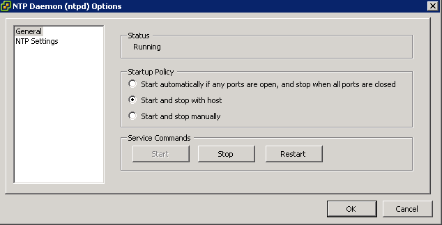

1.  In the **NTP Daemon (ntpd) Options** dialog box, select **NTP Settings**, and click **Add**.

2.  Enter **ntp.sfo01.rainpole.local** and click **OK**.

3.  Select the **Restart NTP service to apply changes** check box, and click **OK**.

> 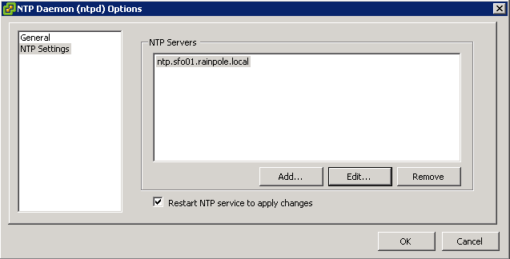

1.  Click **OK** again to exit the **Time Configuration** dialog box.

2.  Repeat all steps for all hosts in the data center. Enter the respective values to log in on each host that you configure. 

    1.  ### Set Up Virtual SAN Datastore (Region A)

Before you can use Virtual SAN storage in your environment, you must set it up. This process is divided into two main tasks:

-   Bootstrap the first ESXi host from the command line and create the Virtual SAN datastore.

-   After vCenter Server installation, perform Virtual SAN configuration for all other hosts from the vSphere Web Client.

Procedure

1.  Open the ESXi Shell on the physical ESXi host **mgmt01esx01**.

<!-- -->

1.  Open a console window to the host.

2.  Press **Alt+F1** to access the ESXi Shell.

3.  Enter **root** as localhost login and press **Enter**.

4.  Enter the **esxi\_root\_user\_password** and press **Enter.**

<!-- -->

1.  Execute the following command to determine the current Virtual SAN storage policy.

> esxcli vsan policy getdefault
>
> 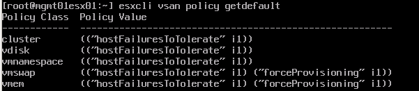

1.  Modify the default Virtual SAN storage policy to force provisioning of Virtual SAN datastore without generating errors.

> esxcli vsan policy setdefault -c vdisk -p "((\\"hostFailuresToTolerate\\" i1) (\\"forceProvisioning\\" i1))"
>
> esxcli vsan policy setdefault -c vmnamespace -p "((\\"hostFailuresToTolerate\\" i1) (\\"forceProvisioning\\" i1))"
>
> esxcli vsan policy getdefault 
>
> 

1.  List the devices and determine the device name for the SSD and HDD.  These disks will be used to provision the Virtual SAN datastore.

> vdq -q
>
> Identify all devices that can be used by Virtual SAN.

| Property  | SSD Value                | HDD Value                |
|-----------|--------------------------|--------------------------|
| **State** | Eligible for use by VSAN | Eligible for use by VSAN |
| **IsSSD** | 1                        | 0                        |

> 

1.  Generate the Virtual SAN cluster UUID and create the Virtual SAN cluster.

> python -c 'import uuid; print str(uuid.uuid4());'

1.  You need the $UUID\_GENERATED from the generated output for the next command.

> esxcli vsan cluster join -u &lt;UUID\_GENERATED&gt;
>
> esxcli vsan cluster get**
> **

1.  Create Virtual SAN datastore using available SSD and HDD disks determined from previous step.

> esxcli vsan storage add -s &lt;SSD\_Device\_name&gt; -d &lt;HDD\_Device Name&gt;

 

1.  Confirm that the Virtual SAN datastore has been created.

> esxcli storage filesystem list

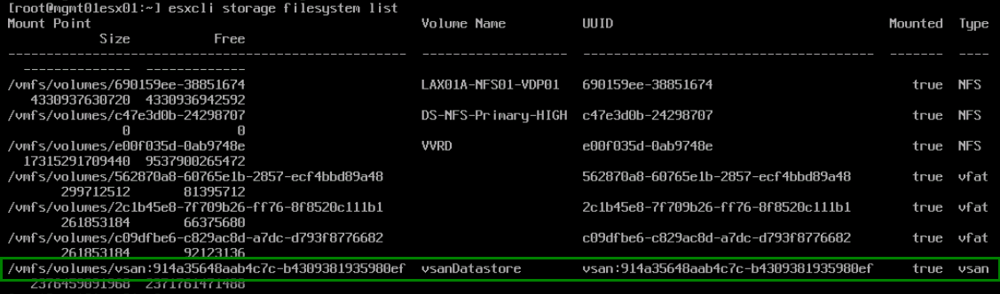

Virtual SAN datastore is now created and ready for the Management vCenter Server installation.

Deploy and Configure the Management Cluster Components (Region A)
-----------------------------------------------------------------

Procedure Overview

-   Deploy the External Platform Services Controller for the Management vCenter Server (Region A)

-   Join the Platform Services Controller for the Management vCenter Server to the Active Directory (Region A)

-   Deploy the Management vCenter Server Instance (Region A)

-   Configure the Management Cluster (Region A)

-   Configure the Distributed Virtual Switch for the Management Cluster (Region A)

-   Configure the Link Aggregation Control Protocol for the Management Cluster (Region A)

-   Change the Default Domain Administration Group on the ESXi Hosts in the Management Cluster (Region A)

-   Mount NFS Storage for Management Cluster (Region A)

    1.  ### Deploy the External Platform Services Controller for the Management vCenter Server (Region A)

You must first install the external Platform Services Controller instance from the vCenter Server appliance ISO file. 

Procedure

1.  Log in to the Windows host that has access to your data center as an administrator.

2.  Install the VMware Client Integration Plug-in.

<!-- -->

1.  Browse the vCenter Server Appliance ISO file.

2.  Navigate to the **vcsa** directory.

3.  Start the **VMware-ClientIntegrationPlugin-x.x.x.exe** file.

4.  Follow the prompts and finish the installation.

<!-- -->

1.  Start the VMware vCenter Server Appliance Deployment Wizard.

<!-- -->

1.  Browse to the vCenter Server Appliance ISO file.

2.  Open the **vcsa-setup.html** file in a Web browser. 

3.  Click Install to start the installation.

> 

1.  Complete the **VMware vCenter Server Appliance Deployment** wizard.

<!-- -->

1.  On the **End User License Agreement** page, select the **I accept the terms of the license agreement** check box, and click **Next**.

> 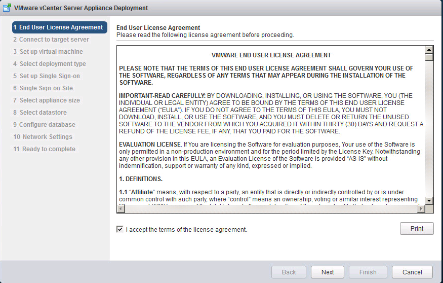

1.  On the **Connect to target server** page, enter the following settings, and click **Next**.

| Setting                | Value                            |
|------------------------|----------------------------------|
| **FQDN or IP Address** | mgmt01esx01.sfo01.rainpole.local |
| **User name**          | root                             |
| **Password**           | esxi\_root\_user\_password       |

> 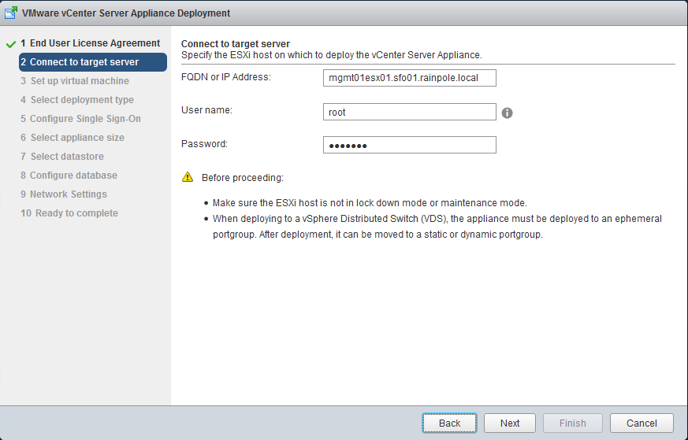

1.  In the **Certificate Warning** dialog box, click **Yes** to accept the host certificate.

> 

1.  On the **Set up virtual machine** page, enter the following settings, and click **Next**.

| Setting                 | Value                   |
|-------------------------|-------------------------|
| **Appliance name**      | mgmt01psc01.sfo01       |
| **OS password**         | mgmtpsc\_root\_password |
| **Confirm OS password** | mgmtpsc\_root\_password |

> 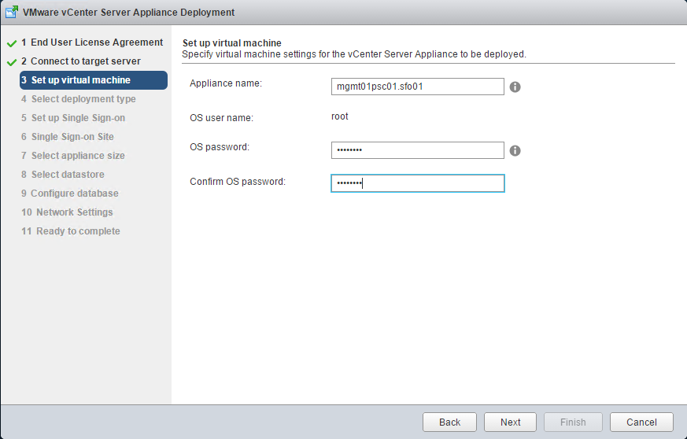

1.  On the **Select deployment type** page, under **External Platform Services Controller,** select the **Install Platform Services Controller** radio button, and click **Next**.

> 

1.  On the **Set up Single Sign-on (SSO)** page, select the **Create a new SSO Domain** radio button, enter the following settings, and click **Next**.

| Setting                  | Value                    |
|--------------------------|--------------------------|
| **vCenter SSO Password** | vcenter\_admin\_password |
| **Confirm password**     | vcenter\_admin\_password |
| **SSO Domain name**      | vsphere.local            |
| **SSO Site name**        | SFO01                    |

> 

1.  On the **Select appliance size** page, click **Next**.

> 

1.  On the **Select datastore** page, select the **vsanDatastore** datastore to deploy the Platform Services Controller on, select the **Enable Thin Disk Mode** check box, and click **Next**.

> 

1.  On the **Network Settings** page, enter the following settings, and click **Next**.

| Setting                 | Value                            |
|-------------------------|----------------------------------|
| **Choose a network**    | VM Network                       |
| **IP address family**   | IPv4                             |
| **Network type**        | Static                           |
| **Network address**     | 172.16.11.61                     |
| **System name**         | mgmt01psc01.sfo01.rainpole.local |
| **Subnet mask**         | 255.255.255.0                    |
| **Network gateway**     | 172.16.11.253                    |
| **Network DNS servers** | 172.16.11.5                      |
| **Configure time sync** | ntp.sfo01.rainpole.local         |
| **Enable SSH**          | Enabled (Select checkbox)        |

> 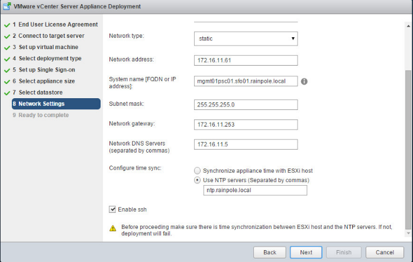

1.  On the **Ready to complete** page, review the configuration, and click **Finish** to start the deployment.

    1.  ### Join the Platform Services Controller for the Management vCenter Server to the Active Directory (Region A)

After you have successfully installed the Platform Services Controller instance, you must add the appliance to your Active Directory domain. After that, add the Active Directory domain as an identity source to vCenter Single Sign-On. When you do, users in the Active Directory domain are visible to vCenter Single Sign-On and can be assigned permissions to view or manage SDDC components.

**Procedure**

1.  Log in to the Platform Services Controller administration interface.

<!-- -->

1.  In a browser, go to **https://mgmt01psc01.sfo01.rainpole.local/psc**.

2.  Enter the following credentials, and click **Login**.

| Setting       | Value                       |
|---------------|-----------------------------|
| **User name** | administrator@vsphere.local |
| **Password**  | vcenter\_admin\_password    |

> 

1.  Add the management Platform Services Controller instance to the Active Directory domain.

<!-- -->

1.  In the **Navigator**, click **Appliance Settings**, click the **Manage **tab, and click the **Join **button.

> 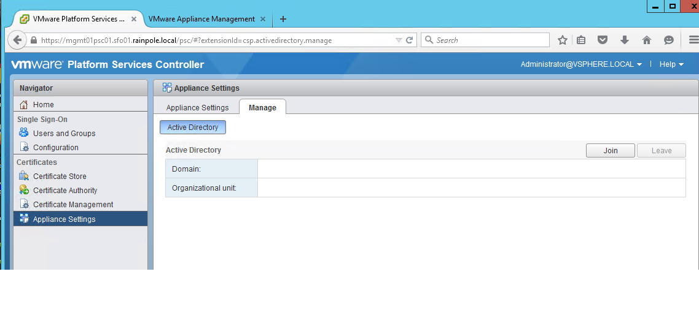

1.  In the **Join Active Directory Domain** dialog box, enter the following settings, and click **OK**.

| Setting       | Value                                   |
|---------------|-----------------------------------------|
| **Domain**    | sfo01.rainpole.local                    |
| **User name** | ad\_admin\_account@sfo01.rainpole.local |
| **Password**  | ad\_admin\_password                     |

> 

1.  Reboot the Platform Services Controller instance to apply the changes.

<!-- -->

1.  Click the **Appliance settings** tab, and click the **VMware Platform Services Appliance** link.

> 

1.  Log in to the VMware vCenter Server Appliance administration interface with the following credentials.

| Setting       | Value                   |
|---------------|-------------------------|
| **User name** | root                    |
| **Password**  | mgmtpsc\_root\_password |

> 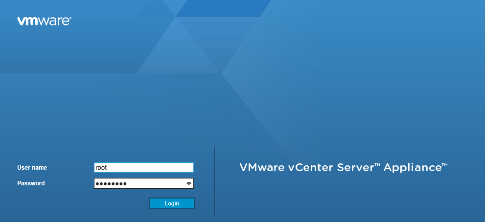

1.  On the **Summary** page, click **Reboot**.

> 

1.  In the **System Reboot** dialog box, click **Yes**.

> 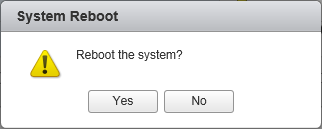

1.  Wait for the reboot process to finish.

<!-- -->

1.  After the reboot process finishes, log in to **https://mgmt01psc01.sfo01.rainpole.local/psc** again, by using the following credentials. 

| Setting       | Value                       |
|---------------|-----------------------------|
| **User name** | administrator@vsphere.local |
| **Password**  | vcenter\_admin\_password    |

1.  To verify that the Platform Services Controller successfully joined the domain, click* ***Appliance Settings**,** **and click the **Manage** tab.

> 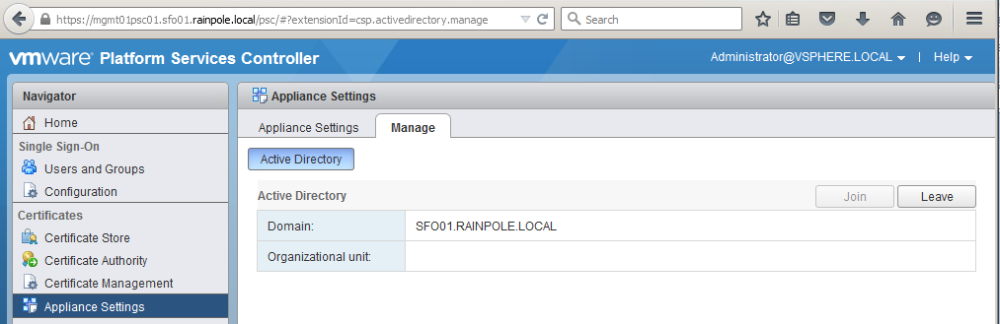

1.  Add the Active Directory as a vCenter Single Sign-On identity source.

<!-- -->

1.  In the **Navigator**, click **Configuration**, and click the **Identity Sources** tab.

> 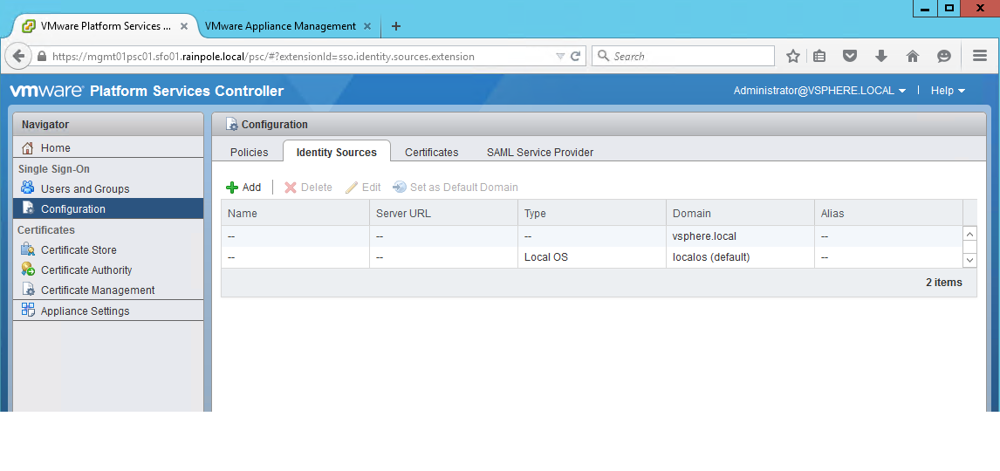

1.  Click the **Add** icon to add a new identity source*.*

2.  In the **Add Identity Source** dialog box, select the following settings, and click **OK**. 

| Setting                  | Value                                                |
|--------------------------|------------------------------------------------------|
| **Identity source type** | Active Directory (Integrated Windows Authentication) |
| **Domain name**          | SFO01.RAINPOLE.LOCAL                                 |
| **Use machine account**  | selected                                             |

> 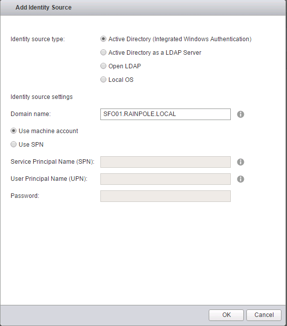

1.  Under **Identity Sources**, select the **rainpole.local** identity source, and click **Set as Default Domain** to make rainpole.local the default domain.

> 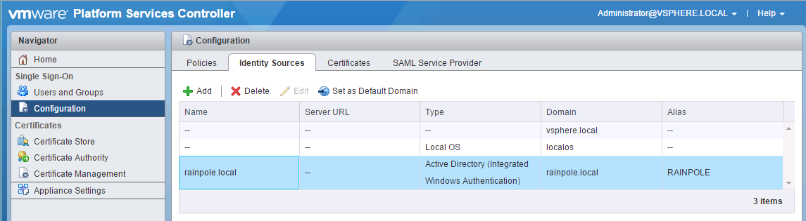

 

1.  In the confirmation dialog box, click **Yes**.

> 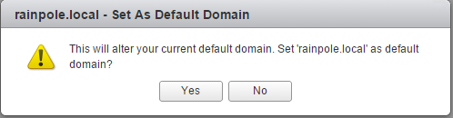

### Deploy the Management vCenter Server Instance (Region A)

You can now install the vCenter Server appliance and add the license.

Procedure

1.  Start the VMware vCenter Server Appliance deployment wizard.

<!-- -->

1.  Browse to the vCenter Server Appliance ISO file.

2.  Open the** vcsa-setup.html** file in a browser.

3.  Click **Install** to start the installation.

> 

1.  Complete the VMware vCenter Server Appliance Deployment wizard.

<!-- -->

1.  On the **End User License Agreement** page, select the **I accept the terms of the license agreement** check box and click **Next**.

> 

1.  On the **Connect to target server** page, enter the following settings, and click **Next**.

| Setting                | Value                            |
|------------------------|----------------------------------|
| **FQDN or IP Address** | mgmt01esx01.sfo01.rainpole.local |
| **User name**          | root                             |
| **Password**           | esxi\_root\_user\_password       |

> 

1.  In the **Certificate Warning** dialog box, click **Yes** to accept the host certificate.

> 

1.  On the **Set up virtual machine** page, enter the following settings, and click **Next**.

| Setting                 | Value                  |
|-------------------------|------------------------|
| **Appliance name**      | mgmt01vc01.sfo01       |
| **OS password**         | mgmtvc\_root\_password |
| **Confirm OS password** | mgmtvc\_root\_password |

> 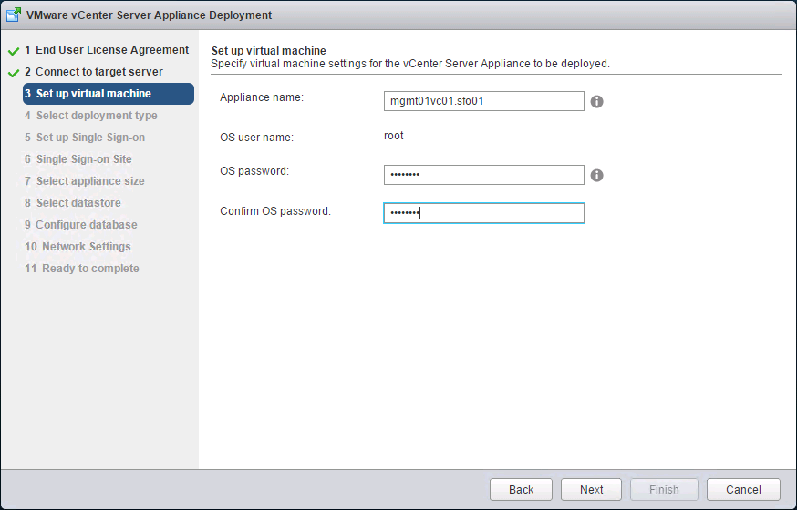

1.  On the **Select deployment type** page, under **External Platform Services Controller,** select **Install vCenter Server (Requires External Platform Services Controller) **radio button, and click **Next.**

> 

1.  On the **Configure Single Sign-On (SSO)** page, enter the following values, and click **Next**.

| Setting                                              | Value                            |
|------------------------------------------------------|----------------------------------|
| **Platform Services Controller FQDN or IP address ** | mgmt01psc01.sfo01.rainpole.local |
| **vCenter SSO password**                             | vcenter\_admin\_password         |
| **vCenter Single Sign-On HTTPS Port **               | 443                              |

> 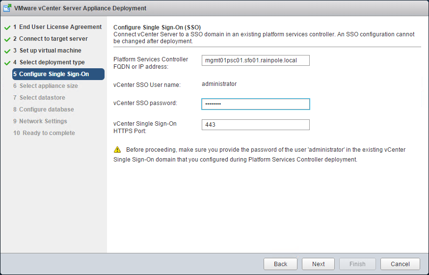

1.  On the **Select appliance size** page, select **Small (up to 100 hosts, 1,000 VMs)**, and click **Next**.

> 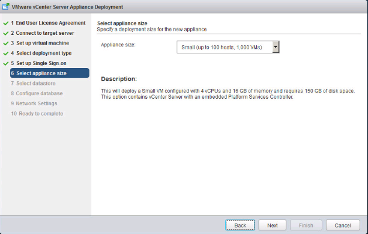

1.  On the **Select datastore** page, select the **vsanDatastore** datastore, select the **Enable Thin Disk Mode** check box, and click **Next**.

> 

1.  On the **Configure database** page, select **Use an embedded database (PostgreSQL)** radio button, and click **Next**.

> 

1.  On the **Network Settings** page, enter the following settings,** **and click **Next**.

| Setting                 | Value                           |
|-------------------------|---------------------------------|
| **Choose a network**    | VM Network                      |
| **IP address family**   | IPv4                            |
| **Network type**        | Static                          |
| **Network address**     | 172.16.11.62                    |
| **System name**         | mgmt01vc01.sfo01.rainpole.local |
| **Subnet mask**         | 255.255.255.0                   |
| **Network gateway**     | 172.16.11.253                   |
| **Network DNS servers** | 172.16.11.5                     |
| **Configure time sync** | ntp.sfo01.rainpole.local        |
| **Enable SSH**          | Enabled (Select checkbox)       |

> 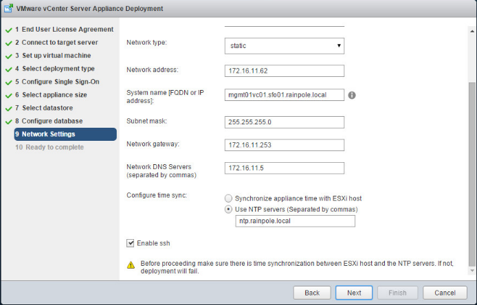

1.  On the **Ready to complete** page, review the configuration, and click **Finish** to start the deployment.

<!-- -->

1.  Add new licenses for this vCenter Server instance and the management cluster ESXi hosts.

<!-- -->

1.  In a browser go to **https://mgmt01vc01.sfo01.rainpole.local/vsphere-client**, and log in by using the following credentials. 

| Setting       | Value                       |
|---------------|-----------------------------|
| **User name** | administrator@vsphere.local |
| **Password**  | vcenter\_admin\_password    |

> 

1.  Click **Licensing**.

> 

1.  Click the **Licenses** tab.

> 

1.  Click the **Create New Licenses** icon to add license keys.

> 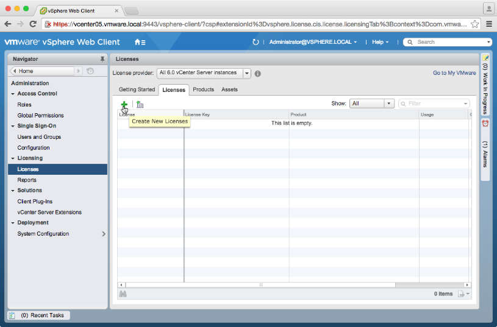

1.  On the **Enter license** keys page, enter license keys for vCenter Server and ESXi, one per line, and click **Next**.

> 

1.  On the **Edit license name** page, enter a descriptive name for each license key, and click **Next**.

2.  On the **Ready to complete** page, review your entries, and click **Finish**. 

<!-- -->

1.  Assign the newly added licenses to the respective assets.

<!-- -->

1.  Click the **Assets** tab*.*

> 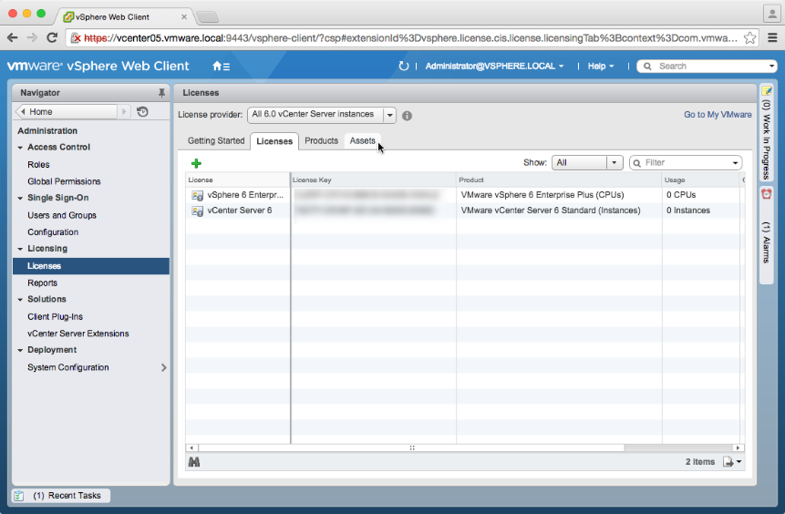

1.  Select the vCenter Server instance, and click the **Assign License** icon.

> 

1.  Select the vCenter Server license that you entered in the previous step, and click **OK**. 

<!-- -->

1.  Assign the vCenterAdmins domain group to the vCenter Server Administrator role.

<!-- -->

1.  In the **Navigator**, click **Home**.

2.  Click **Hosts and Clusters**.

> 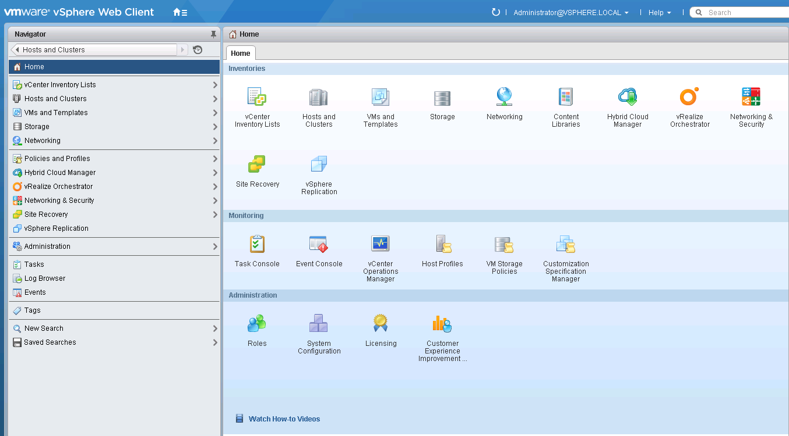

1.  Select the **mgmt01vc01.sfo01.rainpole.local** tree.

2.  Click the **Manage** tab, click **Permissions**, and click the **Add** icon.

> 

1.  In the **mgmt01vc01.sfo01.rainpole.local - Add Permission** dialog box, click the **Add** button.

2.  In the **Select Users/Groups** dialog box, select **SFO01** from the **Domain** drop-down menu.

3.  In the **search** box, enter **vCenterAdmins**, and press **Enter**.

4.  Select **vCenterAdmins**, and click **Add**.

> 

1.  Click **OK**.

2.  In the **mgmt01vc01.sfo01.rainpole.local - Add Permission** dialog box, select **Administrator** as **Assigned Role** and select the **Propagate to children** check box.

> 

1.  Click **OK**.

    1.  ### Configure the Management Cluster (Region A)

You must now create and configure the management cluster. This process consists of the following actions:

-   Create the cluster.

-   Configure DRS.

-   Enable Virtual SAN for the cluster.

-   Add the hosts to the cluster.

-   Add the hosts to the active directory domain.

-   Set the Platform Services Controller and vCenter Server appliances to the default Virtual SAN storage policy.

-   Reset the Virtual SAN Storage Policy to default for the ESXi host that is used for Bootstrap.

Procedure

1.  Log in to the Management vCenter Server by using the vSphere Web Client.

<!-- -->

1.  In a browser, go to **https://mgmt01vc01.sfo01.rainpole.local/vsphere-client**.

2.  Use the following credentials to log in.

| Setting   | Value                       |
|-----------|-----------------------------|
| User name | administrator@vsphere.local |
| Password  | vcenter\_admin\_password    |

1.  Create new data center.

<!-- -->

1.  In the **Navigator**, click **Hosts and Clusters.**

2.  Click **Actions** *&gt;* **New Datacenter***.*

3.  In the **New Datacenter** dialog box, enter **SFO01** as name, and click **OK**.

<!-- -->

1.  Right-click the **SFO01** data center and click **New Cluster**.

2.  In the **New Cluster **wizard, enter the following values, and click **OK**.

| Setting         | Value                                                                               |
|-----------------|-------------------------------------------------------------------------------------|
| **Name**        | SFO01-Mgmt01                                                                        |
| **DRS**         | Turn ON (select check box) - (Leave other DRS options with default values)          |
| **vSphere HA**  | *Do not* turn ON (leave check box empty)                                            |
| **EVC**         | Set EVC mode to the lowest available setting supported for the hosts in the cluster |
| **Virtual SAN** | Turned ON (select check box) - (Leave default values)                               |

> 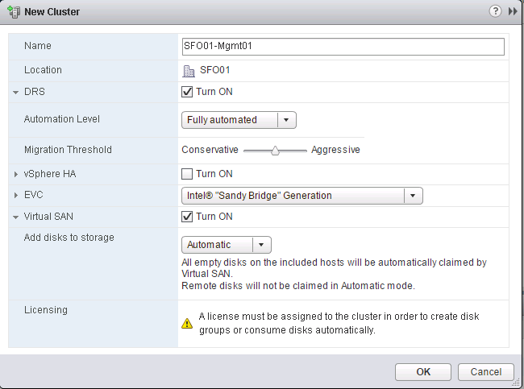

1.  Add a management host to the management cluster.

<!-- -->

1.  Right-click the **SFO01-Mgmt01 **cluster, and click **Add Host**.

2.  On the **Name and location** page, enter **mgmt01esx01.sfo01.rainpole.local** in the **Host name or IP address **text box, and click **Next**.

> 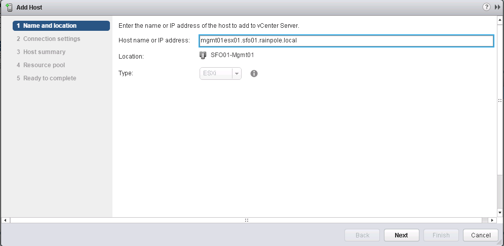

1.  On the **Connection settings** page, enter the following credentials, and click** Next***.*

| Setting       | Value                      |
|---------------|----------------------------|
| **User name** | root                       |
| **Password**  | esxi\_root\_user\_password |

1.  In the **Security Alert **dialog box, click **Yes**.

2.  On the **Host summary** page, review the host information, and click **Next**.

3.  On the **Assign license** page, select the ESXi license key that you entered during the vCenter Server deployment, and click **Next**.

4.  On the **Lockdown mode** page, leave default, and click **Next**.

5.  On the **Resource pool** page, leave default, and click **Next**.

6.  On the **Ready to complete **page, review your entries, and click **Finish.** 

<!-- -->

1.  Repeat the previous step for the three remaining hosts to add them to the management cluster.

| Object                | FQDN                              |
|-----------------------|-----------------------------------|
| **Management host 2** | mgmt01esx02.sfo01.rainpole.local  |
| **Management host 3** | mgmt01esx03.sfo01.rainpole.local  |
| **Management host 4** | mgmt01esx04.sfo01.rainpole.local  |

1.  Add ESXi hosts to the active directory domain

<!-- -->

1.  In the **Navigator**, click **Hosts and Clusters,** expand the entire **mgmt01vc01.sfo01.rainpole.local **tree

2.  Select the **mgmt01esx01.sfo01.rainpole.local** host.

3.  Click the **Manage** tab, and click **Settings**.

4.  Under **System**, select **Authentication Services**.

5.  In the **Authentication Services** panel, click the **Join Domain** button.

> 

1.  In the **Join Domain** dialog box, enter the following settings and click **OK**.

| Setting       | Value                                   |
|---------------|-----------------------------------------|
| **Domain**    | sfo01.rainpole.local                    |
| **User name** | ad\_admin\_account@sfo01.rainpole.local |
| **Password**  | ad\_admin\_password                     |

> 

1.  Repeat the previous step to add all remaining hosts to the domain.

| Object                | FQDN                              |
|-----------------------|-----------------------------------|
| **Management host 2** | mgmt01esx02.sfo01.rainpole.local  |
| **Management host 3** | mgmt01esx03.sfo01.rainpole.local  |
| **Management host 4** | mgmt01esx04.sfo01.rainpole.local  |

1.  Rename the Virtual SAN datastore**.**

<!-- -->

1.  Select the **SFO01-Mgmt01** cluster.

2.  Click **Related Objects**, and click **Datastores**.

3.  Select **vsanDatastore**, and click **Actions** &gt; **Rename.**

4.  In the **Datastore - Rename** dialog box, enter **SFO01A-VSAN01-MGMT01** as datastore name, and click **OK**.

<!-- -->

1.  Set the Platform Services Controller and vCenter Server appliances to the default Virtual SAN storage policy.

<!-- -->

1.  In the **Navigator**, click **Hosts and Clusters**.

2.  Expand the entire **mgmt01vc01.sfo01.rainpole.local** tree.

3.  Select the **mgmt01psc01.sfo01** virtual machine.

4.  Click the **Manage** tab, click **Policies**, and click **Edit VM Storage Policies**.

5.  In the **mgmt01psc01.sfo01:Manage VM Storage Policies** dialog box, from the VM storage policy drop-down menu, select **Virtual SAN Default Storage Policy**, and click **Apply to all**.

> 

1.  Click **OK** to apply the changes.

2.  Verify that the **Compliance Status** column shows a **Compliant** status for all items in the table.

> 

1.  Repeat the step to apply the Virtual SAN Default Storage Policy on the **mgmt01vc01.sfo01** virtual machine.

<!-- -->

1.  Reset the Virtual SAN Storage Policy to default for the ESXi host that is used for Bootstrap.

<!-- -->

1.  Log in to the **mgmt01esx01.sfo01.rainpole.local** host over SSH with the root user name and esxi\_root\_user\_password password.

2.  Execute the following command to determine the current Virtual San storage policy.

> esxcli vsan policy getdefault
>
> 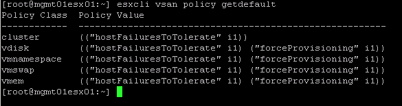

1.  Modify the default Virtual SAN storage policy to force provisioning of Virtual SAN datastore without generating errors.

> esxcli vsan policy setdefault -c vdisk -p "((\\"hostFailuresToTolerate\\" i1))"
>
> esxcli vsan policy setdefault -c vmnamespace -p "((\\"hostFailuresToTolerate\\" i1))"
>
> esxcli vsan policy getdefault
>
> 

### Configure the Distributed Virtual Switch for the Management Cluster (Region A)

After all ESXi hosts have been added to the management cluster, create a Distributed Virtual Switch. You must also create port groups to prepare your environment to migrate the Platform Services Controller and vCenter Server instances to the distributed switch.

Procedure

1.  Log in to the Management vCenter Server by using the vSphere Web Client.

<!-- -->

1.  In a browser, go to **https://mgmt01vc01.sfo01.rainpole.local/vsphere-client**.

2.  Use the following credentials to log in. 

| Setting       | Value                       |
|---------------|-----------------------------|
| **User name** | administrator@vsphere.local |
| **Password**  | vcenter\_admin\_password    |

1.  Create a Distributed Virtual Switch.

<!-- -->

1.  In the **Navigator**, click **Networking**.

2.  Right-click the **SFO01** data center, and select **Distributed Switch** &gt; **New Distributed Switch** to start the New Distributed Switch wizard.

3.  On the **Name and location** page, enter **vDS-Mgmt** as the name, and click **Next**.

4.  On the **Select version** page, ensure the **Distributed switch version - 6.0.0** radio button is selected, and click **Next**.

5.  On the **Edit settings **page, enter the following settings, and click **Next**.

| Setting                         | Value                   |
|---------------------------------|-------------------------|
| **Number of uplinks**           | 2                       |
| **Network I/O Control**         | Enabled                 |
| **Create a default port group** | No (deselect check box) |

1.  On the **Ready to complete **page, review your entries, and click **Finish**.

<!-- -->

1.  Edit the settings of the vDS-Mgmt distributed switch.

<!-- -->

1.  Right-click the **vDS-Mgmt** distributed switch, and select **Settings** &gt; **Edit Settings**.

2.  Click the **Advanced **tab.

3.  Enter **9000 **as **MTU (Bytes)** value, and click **OK**.

<!-- -->

1.  Create new port groups in the **vDS-Mgmt** distributed switch.

<!-- -->

1.  Right-click the **vDS-Mgmt** distributed switch, and select **Distributed Port Group** &gt; **New Distributed Port Group***.*

2.  Create port groups with the following settings, and click **Next**.

| Port Group Name          | Port Binding           | VLAN type | VLAN ID |
|--------------------------|------------------------|-----------|---------|
| vDS-Mgmt-Management      | Ephemeral - no binding | VLAN      | 1611    |
| vDS-Mgmt-vMotion         | Static binding         | VLAN      | 1612    |
| vDS-Mgmt-VSAN            | Static binding         | VLAN      | 1613    |
| vDS-Mgmt-NFS             | Static binding         | VLAN      | 1615    |
| vDS-Mgmt-VR              | Static binding         | VLAN      | 1616    |
| vDS-Mgmt-Ext-Management  | Static binding         | VLAN      | 130     |
| vDS-Mgmt-Comp-Management | Static binding         | VLAN      | 1621    |
| vDS-Mgmt-Edge-Management | Static binding         | VLAN      | 1631    |

1.  VXLAN port group will be created later during NSX Manager (Management Cluster) configuration.

> 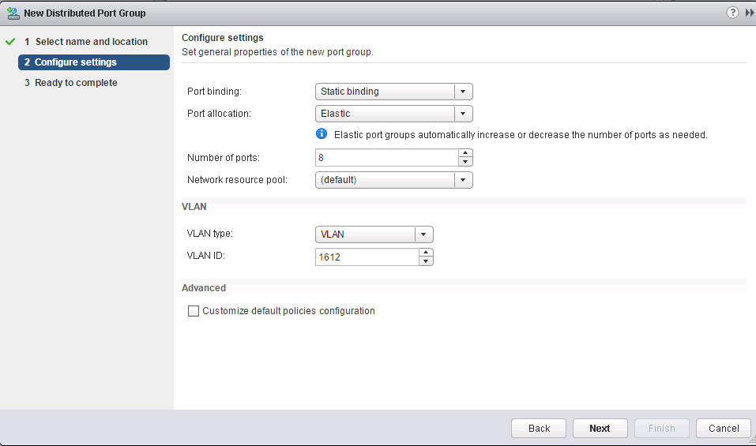

1.  On the **Ready to complete** page, review your entries, and click **Finish**.

<!-- -->

1.  Start the **Add and Manage Hosts** wizard to attach the ESXi hosts to the distributed switch by migrating their VMkernel and virtual machine network adapters.

<!-- -->

1.  Right-click the **vDS-Mgmt** distributed switch,** **and click **Add and Manage Hosts**.

2.  On the **Select task** page, select **Add hosts**, and click **Next**.

> 

1.  On the **Select hosts** page, click **New hosts**.

2.  In the **Select new hosts **dialog box, select all four hosts, and click **OK**.

3.  On the **Select hosts** page, select **Configure identical network settings...(template mode) **check box, and click **Next**.

4.  On the **Select template host** page, select the first host as a template host, and click **Next***.*

5.  On the **Select network adapter tasks** page, ensure both Manage physical adapters (Template mode) and Manage VMkernel adapters (template mode) check boxes are checked, and click Next.

6.  On the **Manage physical network adapters (template mode)** page, click **vmnic1**, and click **Assign uplink**.

7.  In the **Select an Uplink for vmnic1** dialog box, select **Uplink 1**, and click **OK**.

8.  On the **Manage physical network adapters (template mode)** page, click **Apply to all**, and click **Next**.

> 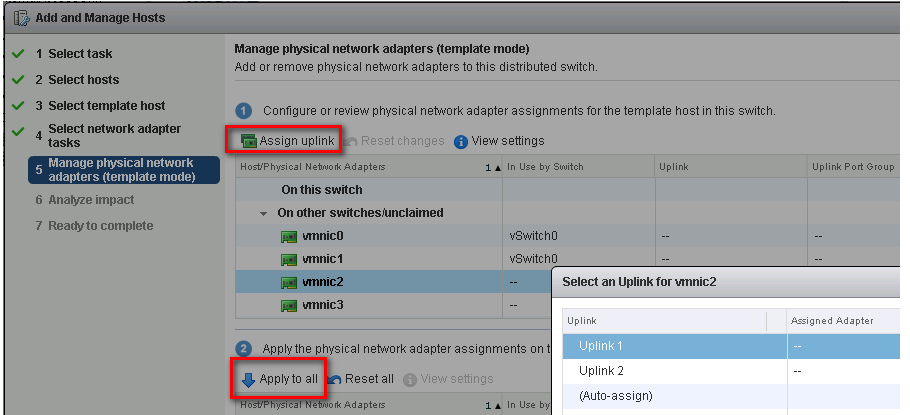

1.  Configure the VMkernel network adapters, edit the existing, and add new adapters as needed.

<!-- -->

1.  On the **Manage VMkernel network adapters (template mode)** page, click **vmk0**, and click **Assign port group**.

| vmnic    | Source Port Group  | Destination port group | Port Properties    | MTU  |
|----------|--------------------|------------------------|--------------------|------|
| **vmk0** | Management Network | vDS-Mgmt-Management    | Management traffic | 1500 |

1.  In the **Assign destination port groups** dialog box, select **vDS-Mgmt-Management**, and click **OK**.

2.  On the **Add and Manage Hosts** page, click **Edit adapter**.

3.  In the **vmk0 - Edit Settings** wizard, on the **Port properties** page, select the **Management traffic** check box.

4.  On the **NIC Settings page**, enter **1500** as MTU, and click **OK**.

5.  On the **Manage VMkernel network adapters (template mode)** page, click **On this switch**, and click **New Adapter** to add new VM kernel adapter.

6.  On the **Select target device **page, select **vDS-Mgmt-Vmotion** as the existing network, and click **Next**.

7.  On the **Port properties **page, select **vMotion traffic**, and click **Next.**

8.  Under **IPv4 settings, **select **Use static IPv4 settings**, enter **172.16.12.101 **as the IPv4 address, enter **255.255.255.0** as Subnet mask, and click **Next.**

9.  On the **Ready to complete** page, click **Finish.**

10. Click **Edit adapter** to change the MTU setting for the vmk1 adapter.

11. In the **vmk1 - Edit Settings** wizard, click the **NIC Settings** page, enter **9000** as MTU value, and click **OK**.

12. Add more network adapters with the following settings.

| Adapter  | Existing network | Service                         | Static IPv4 Address | Subnet mask   | MTU  |
|----------|------------------|---------------------------------|---------------------|---------------|------|
| **vmk2** | vDS-Mgmt-VSAN    | Virtual SAN traffic             | 172.16.13.101       | 255.255.255.0 | 9000 |
| **vmk3** | vDS-Mgmt-NFS     | N/A                             | 172.16.15.101       | 255.255.255.0 | 9000 |
| **vmk4** | vDS-Mgmt-VR      | vSphere Replication NFC traffic | 172.16.16.101       | 255.255.255.0 | 9000 |

1.  On the **Manage VMkernel network adapters (template mode)** page, click **Apply to all**.

2.  In the **mgmt01esxi01...configuration to other hosts **dialog box, enter the following IPv4 addresses, respective for each of the VMkernel adapters, and click **OK**.

| vmk       | IPv4 address     |
|-----------|------------------|
| **vmk0**  | 172.16.11.102\#3 |
| **vmk1**  | 172.16.12.102\#3 |
| **vmk2**  | 172.16.13.102\#3 |
| **vmk3**  | 172.16.15.102\#3 |
| **vmk4**  | 172.16.16.102\#3 |

> 

1.  On the **Analyze impact** page, click **Next**.

2.  On the **Ready to complete** page, review your entries, and click **Finish**.

<!-- -->

1.  Migrate the Platform Services Controller and vCenter Server instances from the standard switch to the distributed switch.

<!-- -->

1.  Right-click the **vDS-Mgmt** distributed switch, and click **Migrate VM to Another Network**.

2.  On the **Select source and destination networks** page, browse the following networks, and click **Next**.

| Setting                 | Value               |
|-------------------------|---------------------|
| **Source network**      | VM Network          |
| **Destination network** | vDS-Mgmt-Management |

1.  On the **Select VMs to migrate** page, select both** mgmt01psc01.sfo01.rainpole.local, **and **mgmt01vc01.sfo01.rainpole.local**, and click **Next**.

2.  On the **Ready to complete** page, review your entries, and click **Finish**.

<!-- -->

1.  Enable* *vSphere HA for the management cluster. 

<!-- -->

1.  In the **Navigator**, click** **the **Hosts and Clusters** icon.

2.  Expand the entire **mgmt01vc01.sfo01.rainpole.local** tree, and click the **SFO01-Mgmt01** cluster.

3.  Click the **Manage** tab, click **Settings**, click **vSphere HA,** and click the **Edit** button.

4.  In the **Edit Cluster Settings** dialog box, select the **Turn on vSphere HA **check box.

> 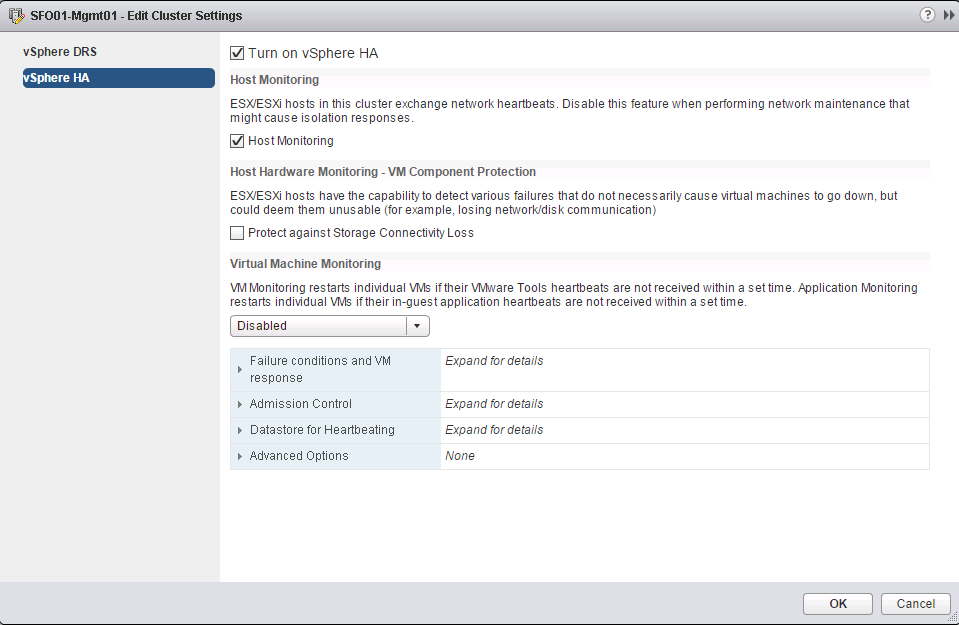

1.  In the **Edit Cluster Settings** dialog box, under **Virtual Machine Monitoring**, select **VM Monitoring Only** from the drop-down menu.

2.  Under **Virtual Machine Monitoring**, expand the **Failure conditions and VM response** setting.

3.  Select **Power off and restart VMs** from the **Response for Host Isolation** drop-down menu.

> 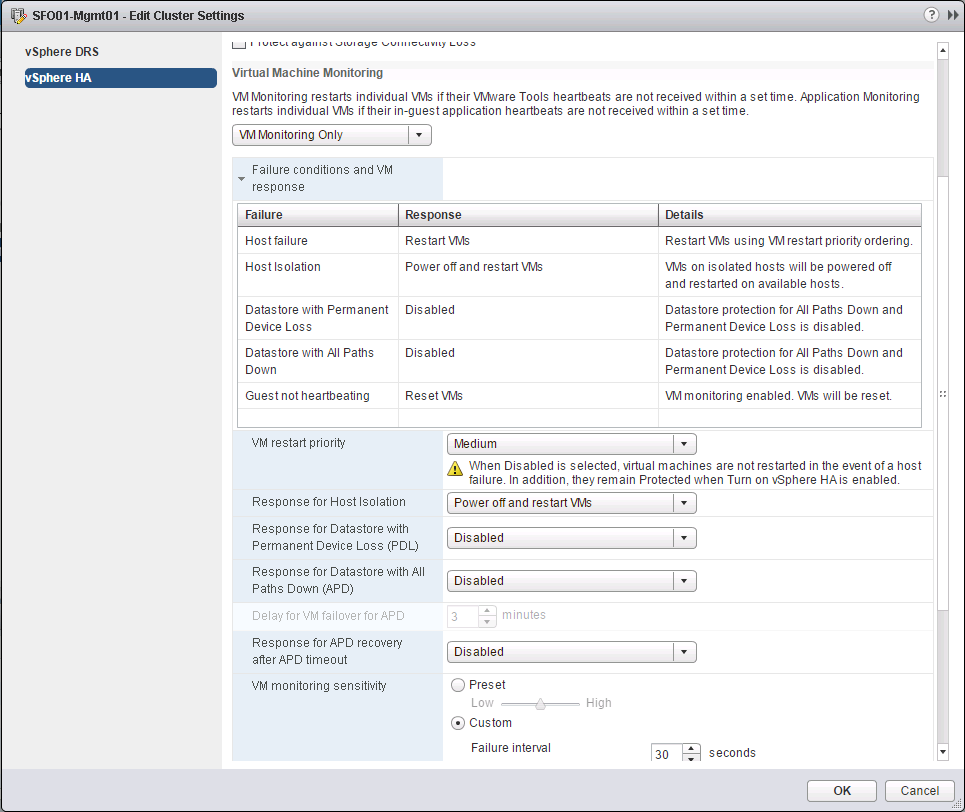

1.  Under **Virtual Machine Monitoring**, expand the **Admission Control** setting.

2.  Select **Define failover capacity by reserving a percentage of the cluster resources**, and enter the following settings, and click **OK**.

| Setting                                          | Value |
|--------------------------------------------------|-------|
| **Reserved failover CPU capacity (% CPU)**       | 25    |
| **Reserved failover Memory capacity (% Memory)** | 25    |

> 

1.  Define Network I/O Control Shares values for the different traffic types.

<!-- -->

1.  In the **Navigator**, click the **Networking** icon, and click the **SFO01** data center.

2.  Click the* ***vDS-Mgmt** distributed switch.

3.  Click the **Manage** tab, and click **Resource Allocation**.

4.  Under **System Traffic**, edit each of the following traffic types with the following values.

| Traffic Type            | Physical Adapter Shares |
|-------------------------|-------------------------|
| **Virtual SAN Traffic** | High, 100               |
| **NFS Traffic**         | High, 100               |
| **vMotion Traffic**     | High, 100               |

1.  Migrate the last physical adapter from the standard switch to the **vDS-Mgmt** distributed switch.

<!-- -->

1.  Right-click the **vDS-Mgmt **distributed switch and select **Add and Manage hosts**.

2.  On the **Select task** page, select **Manage host networking**, and click **Next**.

3.  On the **Select hosts** page, click **Attached hosts**. 

4.  In the **Select member hosts** dialog box, select all four ESXi hosts, and click **OK**.

5.  On the **Select hosts **page, click **Next**.

6.  On the **Select network adapter tasks** page, select **Manage Physical adapters** only, and click **Next**.

7.  On the **Manage physical network adapters** page, under mgmt01esx01.sfo01.rainpole.local, select **vmnic0**, and click **Assign uplink**.

8.  In the **Select an Uplink** dialog box, select **dvUplink2**, and click **OK**.

9.  Assign uplinks for the 3 remaining hosts to reassign their vmnics, and click **Next**.

10. On the **Analyze Impact** page, click **Next**.

11. On the **Ready to complete** page, click **Finish**.

    1.  ### Configure the Link Aggregation Control Protocol for the Management Cluster (Region A)

Configure Link Aggregation Control Protocol to optimize redundancy and performance across the uplinks in the SDDC.

Procedure

1.  Log in to the Management vCenter Server, by using the vSphere Web Client.

<!-- -->

1.  In a browser, go to **https://mgmt01vc01.sfo01.rainpole.local/vsphere-client**.

2.  Use the following credentials to log in.

| Setting       | Value                       |
|---------------|-----------------------------|
| **User name** | administrator@vsphere.local |
| **Password**  | vcenter\_admin\_password    |

1.  Add a new Link Aggregation Group.

<!-- -->

1.  In the **Navigator**, click **Networking**.

2.  Expand the **mgmt01vc01.sfo01.rainpole.local** tree.

3.  Click the **vDS-Mgmt** distributed switch, click the **Manage **tab, click **Settings**, and click **LACP**.

4.  Click the **New Link Aggregation Group **icon to add a new Link Aggregation Group with the following properties, and click **OK**.

| Setting                 | Value                                                    |
|-------------------------|----------------------------------------------------------|
| **Name**                | lag1                                                     |
| **Number of ports**     | 2                                                        |
| **Mode**                | Active                                                   |
| **Load balancing mode** | Source and destination IP address, TCP/UDP port and VLAN |

> 

1.  Under **LACP**, click the **Migrating network traffic to LAGs** link** **to start the migration of network traffic to the LAG process.

<!-- -->

1.  In the **Migrating Network Traffic to Link Aggregation Groups** dialog box, click the **Manage Distributed Port Groups** link.

2.  On the **Manage Distributed Port Groups** page, select **Teaming and failover**, and click **Next**.

3.  On the **Select port groups** page, click **Select distributed port groups**.

4.  In the **Select Distributed Port Groups** dialog box, select all the available port groups, and click **OK**.

5.  On the **Select port groups** page, click **Next**.

6.  On the **Teaming and failover** page, configure as described in the table, and click **Next**.

| Setting                       | Value                  |
|-------------------------------|------------------------|
| **Load balancing**            | Route based on IP hash |
| **Network failure detection** | Link status only       |
| **Notify switches**           | Yes                    |
| **Failback**                  | No                     |
| **Active uplinks**            | dvUplink1, dvUplink2   |
| **Standby uplinks**           | lag1                   |

> 

1.  In the **Confirm Teaming and Failover Settings** dialog box, click **OK**.

<!-- -->

1.  It is expected that the following warning appears during this process.

> 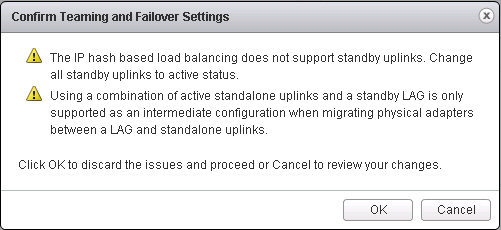

1.  On the **Ready to complete** page, review your entries, and click **Finish**.

<!-- -->

1.  In the **Migrating Network Traffic to Link Aggregation Groups **dialog box, click **Add and Manage Hosts**.

<!-- -->

1.  On the **Select task** page, select **Manage host networking**, and click **Next**.

> 

1.  On the **Select hosts** page, click **Attached hosts**. 

2.  In the **Select member hosts** dialog box, select **all four hosts**, and click **OK**.

3.  On the **Select hosts** page, select **Configure identical network settings...(template mode) **check box, and click **Next**.

4.  On the **Select template host** page, select the first host as a template host, and click **Next***.*

5.  On the **Select network adapter tasks** page, check **Manage physical adapters** check box only, and click **Next**.

<!-- -->

1.  Migrate the distributed switch uplinks to Link Aggregation Groups for all hosts in the cluster.

<!-- -->

1.  On the **Manage physical network adapters (template mode)** page, under **mgmt01esx01.sfo01.rainpole.local**, select **vmnic0**, and click **Assign uplink**.

2.  In the **Select an Uplink for vmnic0** dialog box, select **lag1-0**, and click **OK**.

3.  On the **Manage physical network adapters (template mode)** page, under **mgmt01esx01.sfo01.rainpole.local**, select **vmnic1**, and click **Assign uplink**.

4.  In the **Select an Uplink for vmnic1** dialog box, select **lag1-1**, and click **OK**.

5.  On the **Manage physical network adapters (template mode)** page, click **Apply to all**, and click **Next**.

> 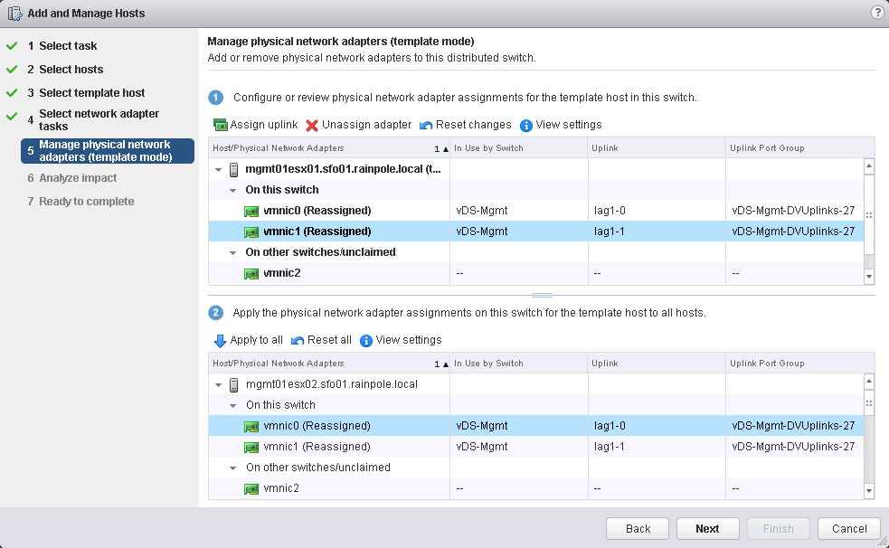

1.  On the **Analyze impact** page, click **Next**.

2.  On the **Ready to complete** page, review your entries, and click **Finish**.

<!-- -->

1.  In the **Migrating Network Traffic to Link Aggregation Groups **dialog box, click **Manage Distributed Port Groups**.

<!-- -->

1.  On the **Select port group policies** page, select **Teaming and failover**, and click **Next**.

2.  On the **Select port groups** page, click **Select distributed port groups**.

3.  In the **Select distributed port groups** dialog box, select all available port groups, and click **OK**.

4.  On the **Select port groups** page, click **Next**.

5.  On the **Teaming and failover **page, configure as described in the table, and click **Next**.

| Setting                        | Value                  |
|--------------------------------|------------------------|
| **Load balancing**             | Route based on IP hash |
| **Network failure dectection** | Link status only       |
| **Notify switches**            | Yes                    |
| **Failback**                   | No                     |
| **Active uplinks**             | lag1                   |
| **Unused uplinks**             | dvUplink1, dvUplink2   |

> 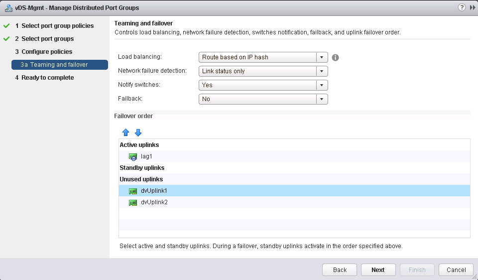

1.  On the **Ready to complete** page, review your entries, and click **Finish**.

<!-- -->

1.  Any portgroup created after this process is done will need its configuration altered to ensure that LAG1 is the only active link and that all other dvuplinks are configured as unused.

    1.  ### Change the Default Domain Administration Group on the ESXi Hosts in the Management Cluster (Region A)

Change the default ESX Admins group to achieve greater levels of security by removing a known administrative access point.

Procedure

1.  Log in to the Management vCenter Server, by using the vSphere Web Client.

<!-- -->

1.  In a browser, go to **https://mgmt01vc01.sfo01.rainpole.local/vsphere-client**.

2.  Use the following credentials to log in.

| Option        | Value                       |
|---------------|-----------------------------|
| **User name** | administrator@vsphere.local |
| **Password**  | vcenter\_admin\_password    |

1.  In the **Navigator**, click **Hosts and Clusters**. 

2.  Expand the entire vCenter inventory tree, and select the **mgmt01esx01.sfo01.rainpole.local** host.

3.  Click the **Manage** tab, click **Settings**, and under **System** click** Advanced System Settings**.

4.  In the search box, enter **esxAdmins **and wait for the search results.

> 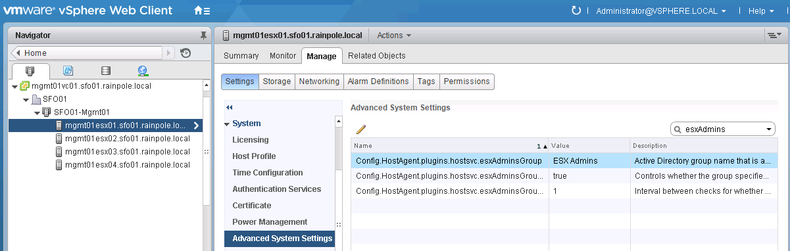

1.  Select **Config.HostAgent.plugins.hostsvc.esxAdminsGroup**, and click the **Edit** icon to change the ESXi host admin group.

2.  In the **plugins.hostsvc.esxAdminsGroup** text box, enter **SDDC-Admins**, and click **OK**.

> 

1.  Repeat the process for all remaining hosts in the management cluster. 

| Object                | FQDN                              |
|-----------------------|-----------------------------------|
| **Management host 2** | mgmt01esx02.sfo01.rainpole.local  |
| **Management host 3** | mgmt01esx03.sfo01.rainpole.local  |
| **Management host 4** | mgmt01esx03.sfo01.rainpole.local  |

1.  Reboot all hosts in the management cluster.

    1.  ### Mount NFS Storage for Management Cluster (Region A)

You must mount a NFS datastore where vSphere Data Protection will later be deployed.

Procedure

1.  In a browser go to **https://mgmt01vc01.sfo01.rainpole.local/vsphere-client**, and log in by using the following credentials. 

| Option        | Value                       |
|---------------|-----------------------------|
| **User name** | administrator@vsphere.local |
| **Password**  | vcenter\_admin\_password    |

1.  Create new datastore for the SFO01-Mgmt01 cluster.

<!-- -->

1.  In the **Navigator**, select** vCenter Inventory Lists**, and select **Datastores**.

2.  Click the **Create a New Datastore** icon.

3.  On the **Location** page, expand the entire **mgmt01vc01.sfo01.rainpole.local** tree, select the **SFO01-Mgmt01** cluster, and click **Next**.

> 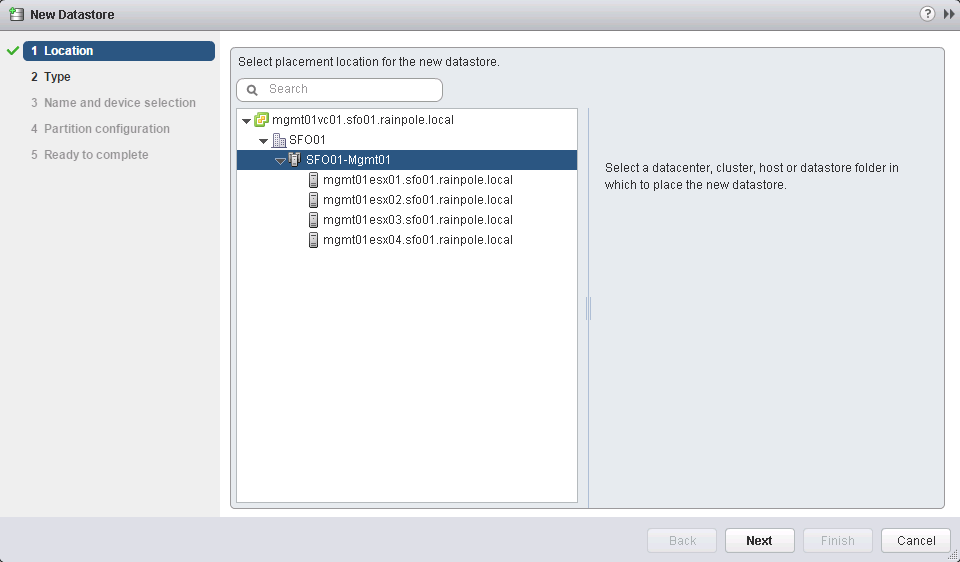

1.  On the **Type** page, select **NFS **and click **Next**.

2.  On the **NFS version** page, select **NFS 3**, and click **Next**.

3.  On the **Name and configuration** page, enter the following datastore information, and click **Next**.

| Option             | Value                 |
|--------------------|-----------------------|
| **Datastore Name** | SFO01A-NFS01-VDP01    |
| **Folder**         | /V2D\_vDP\_MgmtA\_4TB |
| **Server**         | 172.16.15.251         |

> 

1.  On the **Host accessibility** page, select all the hosts that require access to the datastore, and click **Next**.

> 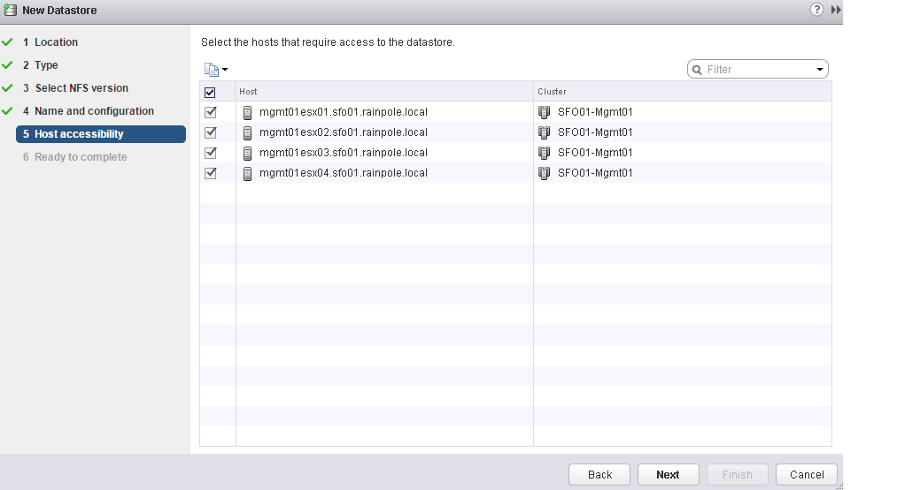

1.  On the **Ready to complete** page, review the configuration, and click **Finish**.

    1.  Deploy and Configure the Management Cluster NSX Instance (Region A)
        -------------------------------------------------------------------

-   Deploy the NSX Manager for the Management Cluster NSX Instance (Region A)

-   Deploy the NSX Controllers for the Management Cluster NSX Instance (Region A)

-   Prepare the ESXi Hosts in the Management Cluster for NSX (Region A)

-   Configure the NSX Logical Network for the Management Cluster (Region A)

-   (Optional) Test the Management Cluster NSX Configuration (Region A)

    1.  ### Deploy the NSX Manager for the Management Cluster NSX Instance (Region A)

NSX Manager and vCenter Server have a one-to-one relationship. For every instance of NSX Manager, there is one connected vCenter Server. 

First, deploy the NSX Manager virtual appliance for the management cluster. After the NSX Manager is deployed you connect it to the Management vCenter Server instance.

Procedure

1.  Log in to the Management vCenter Server by using the vSphere Web Client.

<!-- -->

1.  In a browser, go to **https://mgmt01vc01.sfo01.rainpole.local/vsphere-client**.

2.  Use the following credentials to log in.

| Setting       | Value                       |
|---------------|-----------------------------|
| **User name** | administrator@vsphere.local |
| **Password**  | vcenter\_admin\_password    |

1.  Assign a service account the vCenter Server Administrator role.

<!-- -->

1.  In the **Navigator**, click **Hosts and Clusters**.

> 

1.  Select the **mgmt01vc01.sfo01.rainpole.local** tree.

2.  Click the **Manage** tab, click **Permissions**, and click the **Add** icon.

> 

1.  In the **mgmt01vc01.sfo01.rainpole.local - Add Permission** dialog box, click the **Add** button.

2.  In the **Select Users/Groups** dialog box, select **RAINPOLE** from the **Domain** drop-down menu.

3.  In the **search** box, enter **svc-nsxmanager**, and press **Enter**.

4.  Select **svc-nsxmanager**, and click **Add**.

> 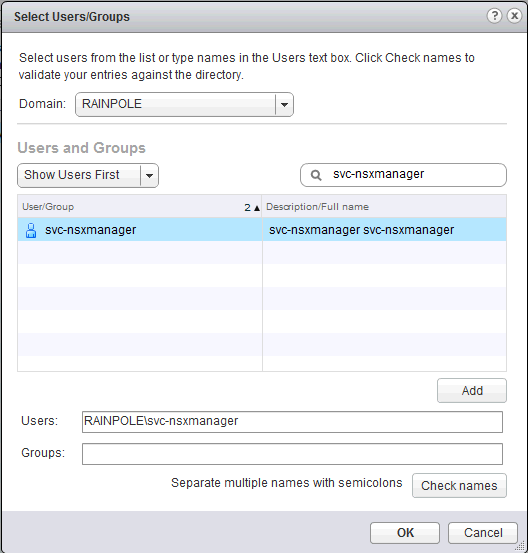

1.  Click **OK**.

2.  In the **mgmt01vc01.sfo01.rainpole.local - Add Permission** dialog box, select **Administrator** as **Assigned Role** and select the **Propagate to children** check box.

> 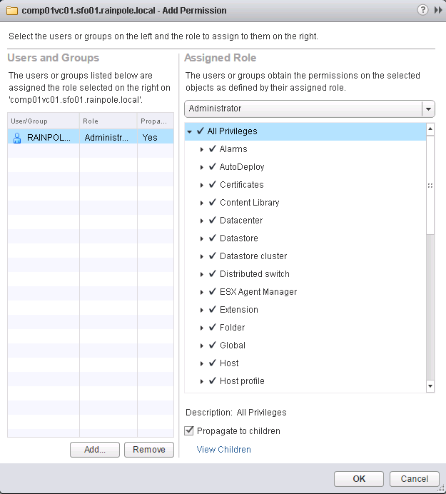

1.  Click **OK**.

<!-- -->

1.  Open the Deploy OVF Template wizard.

<!-- -->

1.  In the **Navigator**, click **Hosts and Clusters**.

> 

1.  Expand the entire **mgmt01vc01.sfo01.rainpole.local** tree.

2.  Right-click the **SFO01-Mgmt01** cluster, and click **Deploy OVF Template**.

> 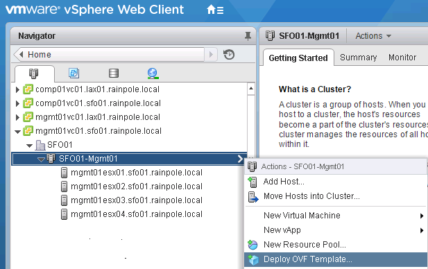

1.  Complete the wizard to deploy the NSX Manager virtual appliance.

<!-- -->

1.  On the **Select source** page, click the **Browse** button, select the VMware NSX Manager .ova file, and click **Next**.

2.  On the **Review details** page, select the **Accept extra configuration option** check box, and click **Next**.

3.  On the **Accept License Agreements** page, click **Accept**, and click **Next**.

4.  On the **Select name and folder** page, enter the following settings, and click **Next**.

| Setting                  | Value              |
|--------------------------|--------------------|
| **Name**                 | mgmt01nsxm01.sfo01 |
| **Folder or Datacenter** | SFO01              |

> 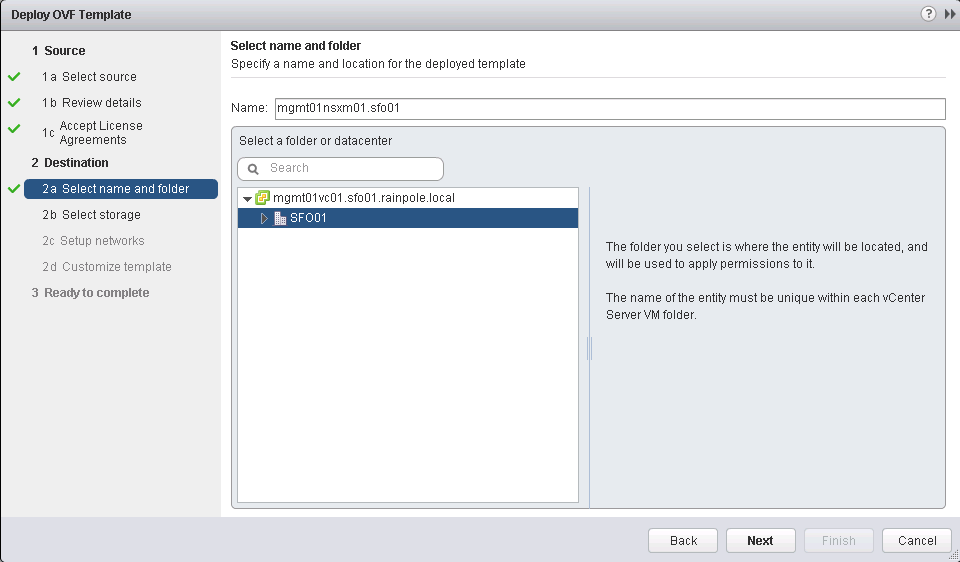

1.  On the **Select storage** page, enter the following settings, and click **Next**.

| Setting               | Value                              |
|-----------------------|------------------------------------|
| **VM Storage Policy** | Virtual SAN Default Storage Policy |
| **Datastore**         | SFO01A-VSAN01-MGMT01               |

> 

1.  On the **Setup networks** page, under **Destination**, select **vDS-Mgmt-Management**, and click **Next**.

2.  On the **Customize template** page, expand all options, enter the following settings, and click **Next**.

| Setting                                   | Value                             |
|-------------------------------------------|-----------------------------------|
| **CLI "admin" User Password / enter**     | mngnsx\_admin\_password           |
| **CLI "admin" User Password / confirm**   | mngnsx\_admin\_password           |
| **CLI Privilege Mode Password / enter**   | mngnsx\_privilege\_password       |
| **CLI Privilege Mode Password / confirm** | mngnsx\_privilege\_password       |
| **Hostname**                              | mgmt01nsxm01.sfo01.rainpole.local |
| **Network 1 IPv4 Address**                | 172.16.11.65                      |
| **Network 1 Netmask**                     | 255.255.255.0                     |
| **Default IPv4 Gateway**                  | 172.16.11.253                     |
| **DNS Server List**                       | 172.16.11.5                       |
| **Domain Search List**                    | sfo01.rainpole.local              |
| **NTP Server List**                       | ntp.sfo01.rainpole.local          |
| **Enable SSH**                            | Yes (Select check box)            |

1.  On the **Ready to complete** page, select the **Power on after deployment** check box, and click **Finish**.

> 

1.  Connect the NSX Manager to the Management vCenter Server.

<!-- -->

1.  In a browser, go to **https://mgmt01nsxm01.sfo01.rainpole.local**.

2.  Use the following credentials to log in.

| Setting       | Value                   |
|---------------|-------------------------|
| **User name** | admin                   |
| **Password**  | mngnsx\_admin\_password |

1.  Click **Manage vCenter Registration**.

2.  Under **Lookup Service**, click the **Edit** button.

3.  In the **Lookup Service** dialog box, enter the following settings, and click **OK**.

| Setting                         | Value                            |
|---------------------------------|----------------------------------|
| **Lookup Service IP**           | mgmt01psc01.sfo01.rainpole.local |
| **Lookup Service Port**         | 443                              |
| **SSO Administrator User Name** | administrator@vsphere.local      |
| **Password**                    | vcenter\_admin\_password         |

1.  In the **Trust Certificate?** dialog box, click **Yes**.

2.  Under **vCenter Server**, click the **Edit** button.

3.  In the **vCenter Server** dialog box, enter the following settings, and click **OK**.

| Setting               | Value                           |
|-----------------------|---------------------------------|
| **vCenter Server**    | mgmt01vc01.sfo01.rainpole.local |
| **vCenter User Name** | svc-nsxmanager@rainpole.local   |
| **Password**          | svc-nsxmanager\_password        |

1.  In the **Trust Certificate?** dialog box, click **Yes**.

2.  Wait until the **Status** indicators for the Lookup Service and vCenter Server change to **Connected**.

<!-- -->

1.  Log out from the Management vCenter Server session in the vSphere Web Client.

    1.  ### Deploy the NSX Controllers for the Management Cluster NSX Instance (Region A)

After the NSX Manager is successfully connected to the Management vCenter Server, you deploy three NSX Controller nodes that form the NSX Controller cluster. Deploy every node only after the previous one is successfully deployed.

**Procedure**

1.  Log in to the Management vCenter Server by using the vSphere Web Client.

<!-- -->

1.  In a browser, go to **https://mgmt01vc01.sfo01.rainpole.local/vsphere-client**.

2.  Use the following credentials to log in.

| Setting       | Value                       |
|---------------|-----------------------------|
| **User name** | administrator@vsphere.local |
| **Password**  | vcenter\_admin\_password    |

1.  Configure an IP pool for the NSX Controller cluster.

<!-- -->

1.  Under **Inventories**, click **Networking & Security**.

> 

1.  In the **Navigator**, click **NSX Managers**.

2.  Under **NSX Managers**, click the **172.16.11.65** instance.

3.  Click the **Manage** tab, click **Grouping Objects**, click **IP Pools**, and click the **Add New IP Pool** icon.

4.  In the **Add Static IP Pool** dialog box, enter the following settings, and click **OK**.

| Setting            | Value                       |
|--------------------|-----------------------------|
| **Name**           | Mgmt01-NSXC01               |
| **Gateway**        | 172.16.11.1                 |
| **Prefix Length**  | 24                          |
| **Primary DNS**    | 172.16.11.5                 |
| **DNS Suffix**     | sfo01.rainpole.local        |
| **Static IP Pool** | 172.16.11.118-172.16.11.120 |

> 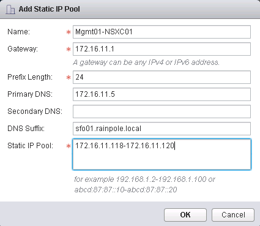

1.  Deploy the NSX Controller cluster.

<!-- -->

1.  In the **Navigator**, click **Networking and Security** to go back, and click **Installation**.

2.  Under **NSX Controller nodes**, click the **Add** icon.

> 

1.  In the **Add Controller** page, enter the following settings and click **OK**.

<!-- -->

1.  You configure password only during the deployment of the first controller. The other controllers use the same password.

| Setting                   | Value                         |
|---------------------------|-------------------------------|
| **NSX Manager**           | 172.16.11.65                  |
| **Datacenter**            | SFO01                         |
| **Cluster/Resource Pool** | SFO01-Mgmt01                  |
| **Datastore**             | SFO01A-VSAN01-MGMT01          |
| **Connected To**          | vDS-Mgmt-Management           |
| **IP Pool**               | Mgmt01-NSXC01                 |
| **Password**              | mngnsx\_controllers\_password |
| **Confirm Password**      | mngnsx\_controllers\_password |

> 

1.  After the **Status** of the controller node changes to **Connected**, repeat the step and deploy the remaining two NSX Controller nodes, with the same configuration, that form the controller cluster.

> 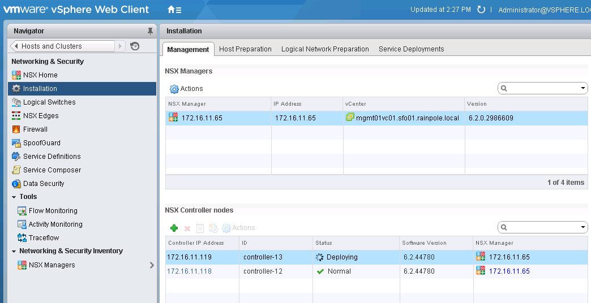

1.  Configure DRS affinity rules for the NSX Controllers.

<!-- -->

1.  Go back to the **Home** page.

2.  In the **Navigator**, click **Hosts and Clusters**, and expand the **mgmt01vc01.sfo01.rainpole.local** tree.

3.  Select the **SFO01-Mgmt01** cluster, and click the **Manage** tab.

4.  Under **Configuration**, click **VM/Host Rules**.

5.  Under **VM/Host Rules**, click **Add**.

6.  In the **SFO01-Mgmt01 - Create VM/Host Rule** dialog box, enter the following settings, and click **Add**.

| Setting         | Value                    |
|-----------------|--------------------------|
| **Name**        | Mgmt\_NSX\_Controllers   |
| **Enable rule** | Yes (select check box)   |
| **Type**        | Separate Virtual Machine |

1.  In the **Add Rule Member** dialog box, select the **three NSX Controller VMs**, and click **OK**.

2.  In the **SFO01-Mgmt01 - Create VM/Host Rule** dialog box, click **OK**.

    1.  ### Prepare the ESXi Hosts in the Management Cluster for NSX (Region A)

NSX kernel modules packaged in VIB files run within the hypervisor kernel and provide services such as distributed routing, distributed firewall, and VXLAN bridging capabilities.  You must install the NSX kernel modules on the management cluster ESXi hosts to be able to use NSX.

Procedure

1.  Log in to the Management vCenter Server by using the vSphere Web Client.

<!-- -->

1.  In a browser, go to **https://mgmt01vc01.sfo01.rainpole.local/vsphere-client**.

2.  Use the following credentials to log in.

| Setting       | Value                       |
|---------------|-----------------------------|
| **User name** | administrator@vsphere.local |
| **Password**  | vcenter\_admin\_password    |

1.  Install the NSX kernel modules on the management cluster ESXi hosts.

<!-- -->

1.  In the **Navigator**, click** Networking and Security**.

> 

1.  In the **Navigator**, click **Installation**, and click the **Host Preparation **tab.

2.  Change the **NSX Manager** that you edit to **172.16.11.65**.

3.  Under **Installation Status**, click **Install** for **SFO01-Mgmt01** clusters

<!-- -->

1.  Verify that the **Installation Status** column shows the NSX version for all hosts in the cluster to confirm that NSX kernel modules are successfully installed.

> 

### Configure the NSX Logical Network for the Management Cluster (Region A)

After all the deployment tasks are ready, you must configure the NSX logical network. Complete this process in three main steps:

-   Configure the Segment ID allocation.

-   Configure the VXLAN networking.

-   Configure the transport zone.

Procedure

1.  Log in to the Management vCenter Server by using the vSphere Web Client.

<!-- -->

1.  In a browser, go to **https://mgmt01vc01.sfo01.rainpole.local/vsphere-client**.

2.  Use the following credentials to log in.

| Setting       | Value                       |
|---------------|-----------------------------|
| **User name** | administrator@vsphere.local |
| **Password**  | vcenter\_admin\_password    |

1.  Configure the Segment ID allocation.

<!-- -->

1.  In the **Navigator**, click** Networking and Security**.

2.  Click **Installation**, click the **Logical Network Preparation** tab**,** and click **Segment ID**.

> 

1.  Change the **NSX Manager** that you edit to **172.16.11.65**.

2.  Click **Edit**, enter the following values, and click **OK**.

| Setting                         | Value                       |
|---------------------------------|-----------------------------|
| **Segment ID pool**             | 5000-5200                   |
| **Enable Multicast addressing** | Yes (select check box)      |
| **Multicast addresses**         | 239.255.16.0-239.255.16.255 |

> 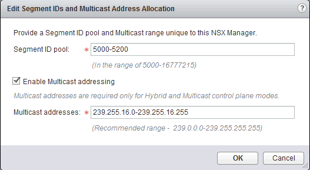

1.  Configure the VXLAN networking.

<!-- -->

1.  Click the **Host Preparation** tab.

2.  Under VXLAN, click **Not Configured**, enter the following values, and click **OK**.

| Setting                   | Value         |
|---------------------------|---------------|
| **Switch**                | vDS-Mgmt      |
| **VLAN**                  | 1614          |
| **MTU**                   | 9000          |
| **VMKNic IP Addressing**  | Use DHCP      |
| **VMKNic Teaming Policy** | Enhanced LACP |
| **VTEP**                  | 1             |

1.  Configure the transport zone.

<!-- -->

1.  With **Installation** still selected in the **Navigator**, click the **Logical Network Preparation** tab, and click Transport Zones.

2.  Change the **NSX Manager** that you edit to **172.16.11.65**.

> 

1.  Click the **Add New Transport zone** icon, enter the following settings, and click **OK**.

| Setting                                        | Value               |
|------------------------------------------------|---------------------|
| **Name**                                       | Mgmt Transport Zone |
| **Replication mode**                           | Hybrid              |
| **Select clusters part of the Transport Zone** | SFO01-Mgmt01        |

> 

### (Optional) Test the Management Cluster NSX Configuration (Region A)

Test the configuration of the NSX logical network.

Procedure

1.  Log in to the Management vCenter Server by using the vSphere Web Client.

<!-- -->

1.  In a browser, go to **https://mgmt01vc01.sfo01.rainpole.local/vsphere-client**.

2.  Use the following credentials to log in.

| Setting       | Value                       |
|---------------|-----------------------------|
| **User name** | administrator@vsphere.local |
| **Password**  | vcenter\_admin\_password    |

1.  Create a logical switch to test the logical network.

<!-- -->

1.  In the **Navigator**, click** Networking and Security**.

2.  Click** Logical Switches**, change the **NSX Manager** that you edit to **172.16.11.65, **and click the** New Logical Switch **icon.

> 
>  

1.  In the **New Logical Switch** dialog box, enter the following settings, and click **OK**.

| Setting              | Value                 |
|----------------------|-----------------------|
| **Name**             | mgmt01-logical-switch |
| **Transport Zone**   | Mgmt Transport Zone   |
| **Replication mode** | Hybrid                |

> 

1.  Use the ping monitor to test connectivity.

<!-- -->

1.  Under **Logical Switches**, double-click **mgmt01-logical-switch**.

2.  Click the **Monitor** tab.

3.  Under **Test Parameters**, select **mgmt01esx04.sfo01.rainpole.local** as the **Source host**.

4.  Under **Test Parameters**, select **mgmt01esx01.sfo01.rainpole.local** as the **Destination host**, and click **Start Test**.

5.  Under **Results** verify that no error messages appear.

> 

Deploy and Configure Gateway for the Management Networks (Region A)
-------------------------------------------------------------------

-   Deploy Network Exchange Logical Switch (Region A)

-   Deploy NSX Edge to Interconnect the Management Networks (Region A)

-   Configure NAT to Provide Public Access to the Management Applications (Region A)

-   Configure OSPF Routing in the SDDC (Region A)

    1.  ### Deploy Network Exchange Logical Switch (Region A)

Deploy a Logical Switch to host the router exchange network. This network is used for the interconnection of management application gateways to transit traffic between networks and also exchange routing information in the form of OSPF.

**Procedure**

1.  Log in to the Management vCenter Server by using the vSphere Web Client.

<!-- -->

1.  In a browser, go to **https://mgmt01vc01.sfo01.rainpole.local/vsphere-client**.

2.  Use the following credentials to log in.

| Setting       | Value                       |
|---------------|-----------------------------|
| **User name** | administrator@vsphere.local |
| **Password**  | vcenter\_admin\_password    |

1.  Create a logical switch.

<!-- -->

1.  In the **Navigator**, click **Networking & Security**, and** **click **Logical Switches**.

2.  From the **NSX Manager** drop-down menu, select **172.16.11.65**.

3.  Click the **New Logical Switch** icon to create a new logical switch.

4.  In the **New Logical Switch **dialog box, enter the following settings, and click **OK**. 

| Setting                 | Value                                                          |
|-------------------------|----------------------------------------------------------------|
| **Name**                | networkExchange-VXLAN                                          |
| **Description**         | Router exchange transit network for interconnection of routers |
| **Transport Zone**      | Mgmt Transport Zone                                            |
| **Replication mode**    | Hybrid                                                         |
| **Enable IP Discovery** | Selected                                                       |
| **Enable MAC Learning** | Deselected                                                     |

> 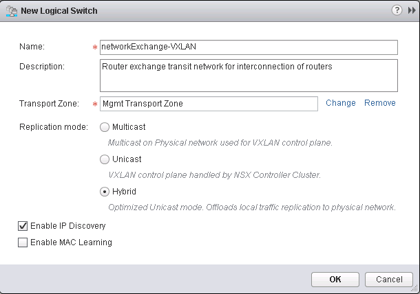

### Deploy NSX Edge to Interconnect the Management Networks (Region A)

After the logical switch is configured, deploy the NSX Edge.

Procedure

1.  Log in to the Management vCenter Server by using the vSphere Web Client.

<!-- -->

1.  In a browser, go to **https://mgmt01vc01.sfo01.rainpole.local/vsphere-client**.

2.  Use the following credentials to log in.

| Setting       | Value                       |
|---------------|-----------------------------|
| **User name** | administrator@vsphere.local |
| **Password**  | vcenter\_admin\_password    |

1.  Start the **New NSX Edge** wizard to deploy the NSX Edge that interconnects the management networks in the SDDC.

<!-- -->

1.  In the **Navigator**, click **Networking & Security**, and** **click **NSX Edges**.

2.  From the** NSX Manager** drop-down menu, select **172.16.11.65**.

3.  Click the **Add** icon to deploy a new NSX Edge.

<!-- -->

1.  On the **Name and description** page, enter the following settings, and click **Next**.

| Setting                      | Value                        |
|------------------------------|------------------------------|
| **Install Type**             | Edge Service Gateway         |
| **Name**                     | MgmtSFO01-Edge               |
| **Hostname**                 | MgmtSFO01-Edge               |
| **Description**              | SFO01 Edge Services Gateway  |
| **Deploy NSX Edge**          | Selected                     |
| **Enable High Availability** | Selected                     |

> 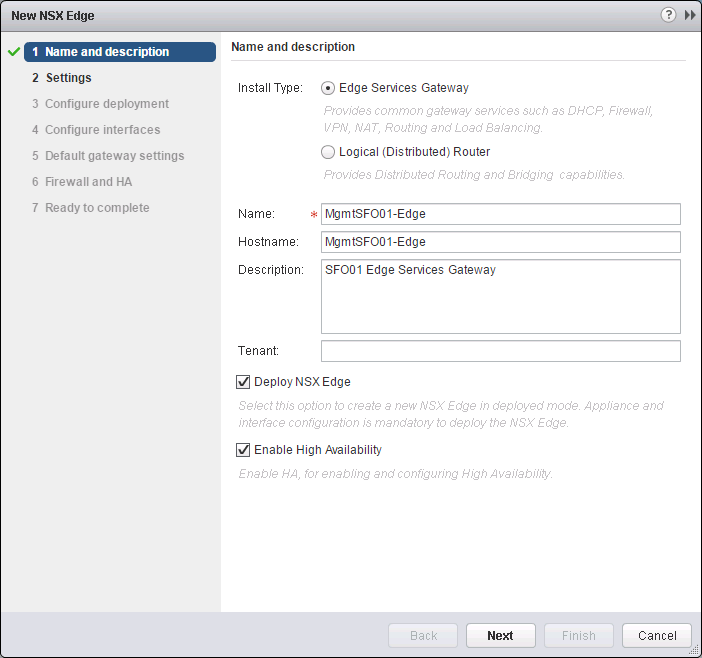
>  

1.  On the **Settings **page, enter the following settings, and click **Next**.

| Setting                         | Value                       |
|---------------------------------|-----------------------------|
| **User Name**                   | admin                       |
| **Password**                    | mgmt\_edge\_admin\_password |
| **Enable SSH access**           | Selected                    |
| **Enable auto rule generation** | Selected                    |
| **Edge Control Level logging**  | INFO                        |

> 

1.  On the **Configure deployment** page, enter the following settings.

<!-- -->

1.  Under **Configure deployment**, enter the following settings, and click the **Add** icon to configure two appliances with identical settings.

| Setting            | Value |
|--------------------|-------|
| **Datacenter**     | SFO01 |
| **Appliance Size** | Large |

1.  In the **Add NSX Edge Appliance** dialog box, enter the following settings, and click **OK**.

| Setting                   | Value                |
|---------------------------|----------------------|
| **Cluster/Resource Pool** | SFO01-Mgmt01         |
| **Datastore**             | SFO01A-VSAN01-MGMT01 |

> 

1.  On the **Configure deployment** page, click **Next**.

> 
>
>  

1.  On the **Configure Interfaces** page, click the **Add** icon to configure a new interface. 

<!-- -->

1.  In the **Add NSX Edge Interface** dialog box, enter the following settings.

| Setting                 | Value                                           |
|-------------------------|-------------------------------------------------|
| **Name**                | Public                                          |
| **Type**                | Uplink                                          |
| **Connected To **       | vDS-Mgmt-Ext-Management (Distributed Portgroup) |
| **Connectivity Status** | Connected                                       |
| **MTU**                 | 1500                                            |

> 

1.  Click the **Add** icon.

2.  Under **Primary Address**, enter **10.158.130.240**.

3.  Under **Subnet Prefix length**, enter **24**, and click **OK**.

> 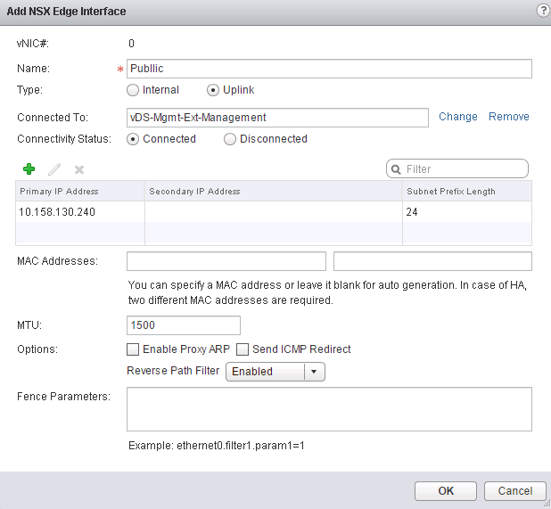
>  

1.  Configure 4 more interfaces with the following settings, and click **Next**.

| Name            | Type     | Connected To                                     | Connectivity Status | Primary Address | Subnet Prefix Length | MTU  |
|-----------------|----------|--------------------------------------------------|---------------------|-----------------|----------------------|------|
| Mgmt-Management | Internal | (Distributed Portgroup) vDS-Mgmt-Management      | Connected           | 172.16.11.1     | 24                   | 1500 |
| Comp-Management | Internal | (Distributed Portgroup) vDS-Mgmt-Comp-Management | Connected           | 172.16.21.1     | 24                   | 1500 |
| Edge-Management | Internal | (Distributed Portgroup) vDS-Mgmt-Edge-Management | Connected           | 172.16.31.1     | 24                   | 1500 |
| networkExchange | Uplink   | (Logical Switch) networkExchange-VXLAN           | Connected           | 192.168.0.1     | 24                   | 9000 |

> 

1.  On the **Default gateway settings** page, enter the following settings, and click **Next**.

| Setting                       | Value          |
|-------------------------------|----------------|
| **Configure Default Gateway** | Selected       |
| **vNIC**                      | Public         |
| **Gateway IP**                | 10.158.130.253 |
| **MTU**                       | 1500           |

> 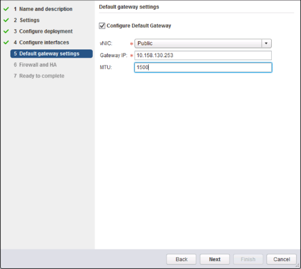

1.  On the **Firewall and HA** page, enter the following settings, and click **Next**.

| Setting                               | Value           |
|---------------------------------------|-----------------|
| **Configure Firewall default policy** | Selected        |
| **Default Traffic Policy**            | Accept          |
| **Logging**                           | Enable          |
| **vNIC**                              | Mgmt-Management |
| **Declare Dead Time**                 | 15              |
| **Management IPs**                    | 10.10.130.1/30  
                                         10.10.130.2/30   |

> 

1.  On the **Ready to complete** page, review your entries, and click **Finish**.

2.  Reconfigure SDDC hosts to use the **MgmtSFO01-Edge** as their default gateway.

<!-- -->

1.  To avoid connectivity loss, you must add static routes on the client that you use to access the environment before you start the process.

> route add -p 172.16.0.0/16 172.16.11.1 (for Windows clients)
>
> route add 172.16.0.0/16 gw 172.16.11.1 (for Linux clients, add to /etc/rc.local to make permanent)

| mgmt01esx\[01-04\].sfo01.rainpole.local | 172.16.11.253 | 172.16.11.1 |
|-----------------------------------------|---------------|-------------|
| comp01esx\[01-04\].sfo01.rainpole.local | 172.16.21.253 | 172.16.21.1 |
| edge01esx\[01-04\].sfo01.rainpole.local | 172.16.31.253 | 172.16.31.1 |
| mgmt01psc01.sfo01.rainpole.local        | 172.16.11.253 | 172.16.11.1 |
| mgmt01vc01.sfo01.rainpole.local         | 172.16.11.253 | 172.16.11.1 |
| mgmt01nsxm01.sfo01.rainpole.local       | 172.16.11.253 | 172.16.11.1 |
| dc01rpl.rainpole.local                  | 172.16.11.253 | 172.16.11.1 |
| dc01sfo.sfo01.rainpole.local            | 172.16.11.253 | 172.16.11.1 |

### Configure NAT to Provide Public Access to the Management Applications (Region A)

VMware solutions in the SDDC need access to the Internet. Configure source NAT rules to provide access from the vSphere management network and the management application networks.

Procedure

1.  Log in to the Management vCenter Server by using the vSphere Web Client.

<!-- -->

1.  In a browser, go to **https://mgmt01vc01.sfo01.rainpole.local/vsphere-client**.

2.  Use the following credentials to log in.

| Setting       | Value                       |
|---------------|-----------------------------|
| **User name** | administrator@vsphere.local |
| **Password**  | vcenter\_admin\_password    |

1.  Create Source NAT rules that will enable VMware solutions to access the public network.

<!-- -->

1.  In the the **Navigator**, click **Networking & Security**, and** **click **NSX Edges**.

2.  From the** NSX Manager** drop-down menu, select **172.16.11.65**, and double-click the **MgmtSFO01-Edge **device to edit its settings.

3.  Click the **Manage** tab, click **NAT**, and click the **Add** &gt; **Add SNAT Rule** icon to create new Source NAT rule for the vSphere management network.

> 
>  

1.  In the **Add SNAT Rule** dialog box, enter the following settings, and click **OK**.

| Setting                        | Value                                                    |
|--------------------------------|----------------------------------------------------------|
| **Applied On**                 | Public                                                   |
| **Original Source IP/Range**   | 192.168.0.0/16                                           |
| **Translated Source IP/Range** | 10.158.130.240                                           |
| **Description**                | Provide Public network access to Management Applications |
| **Enabled**                    | Selected                                                 |
| **Enable logging**             | Deselected                                               |

> 

1.  Click the **Add** &gt; **Add SNAT Rule** icon to create another Source NAT rule for the management networks.

| Setting                        | Value                                                |
|--------------------------------|------------------------------------------------------|
| **Applied On**                 | Public                                               |
| **Original Source IP/Range**   | 172.16.0.0/16                                        |
| **Translated Source IP/Range** | 10.158.130.240                                       |
| **Description**                | Provide Public network access to Management Networks |
| **Enabled**                    | Selected                                             |
| **Enable logging**             | Deselected                                           |

1.  Under **NAT**, click **Publish Changes**, for the new SNAT rule changes to take effect.

> 

### Configure OSPF Routing in the SDDC (Region A)

To provide routing for all components in the SDDC, the management networks NSX Edge must be configured to run OSPF. The edge shares connected interface information with all the other edges that are part of the vSphere management network, as well as learn about the management application networks that will later be configured.

Procedure

1.  Log in to the Management vCenter Server by using the vSphere Web Client.

<!-- -->

1.  In a browser, go to **https://mgmt01vc01.sfo01.rainpole.local/vsphere-client**.

2.  Use the following credentials to log in.

| Setting       | Value                       |
|---------------|-----------------------------|
| **User name** | administrator@vsphere.local |
| **Password**  | vcenter\_admin\_password    |

1.  Enable dynamic routing.

<!-- -->

1.  In the **Navigator**, click **Networking & Security**, and** **click **NSX Edges**.

2.  From the** NSX Manager** drop-down menu, select **172.16.11.65**, and double-click the **MgmtSFO01-Edge **device to edit its settings.

3.  Click the **Manage** tab, click **Routing**, click **Global Configuration **and under **Dynamic Routing Configuration**, click **Edit**.

> 
>  

1.  In the **Edit Dynamic Routing Configuration** dialog box, enter the following settings, and click **OK**.

| Setting            | Value           |
|--------------------|-----------------|
| **Router ID**      | networkExchange |
| **Enable Logging** | Selected        |
| **Log Level**      | Info            |

> 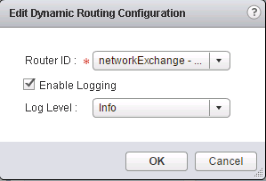

1.  Click **Publish Changes**.

<!-- -->

1.  Configure and enable OSPF.

<!-- -->

1.  Under **Routing**, click **OSPF**.

2.  Under **Area Definitions**, click the **New Area Definition **icon.

3.  In the **New Area Definition** dialog box, enter the following settings, and click **OK**.

| Setting            | Value            |
|--------------------|------------------|
| **Area ID**        | 16               |
| **Type**           | Normal           |
| **Authentication** | MD5              |
| **Value**          | area16\_password |

> 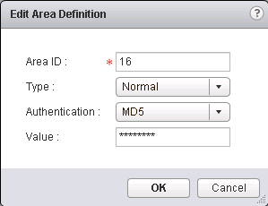

1.  Under **Area to Interface Mapping**, click the **New Area to Interface Mapping** icon.

2.  In the **New Area to Interface Mapping **dialog box, enter the following settings, and click **OK**.

| Setting                          | Value           |
|----------------------------------|-----------------|
| **vNIC**                         | networkExchange |
| **Area**                         | 16              |
| **Ignore Interface MTU setting** | Deselected      |
| **Hello Interval**               | 10              |
| **Dead Interval **               | 40              |
| **Priority**                     | 128             |
| **Cost**                         | 1               |

> 

1.  Under **OSPF Configuration**, click **Edit** to enable OSPF.

2.  In the **OSPF Configuration** dialog box, select the following settings, and click **OK**.

| Setting                      | Value      |
|------------------------------|------------|
| **Enable OSPF**              | Selected   |
| **Enable Graceful Restart**  | Selected   |
| **Enable Default Originate** | Deselected |

> 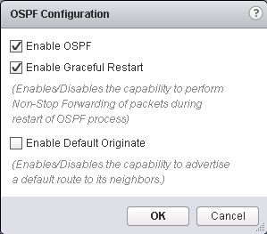

1.  Click **Publish Changes**.

> 
>  

1.  Configure and enable route redistribution.

<!-- -->

1.  Under **Routing**, click **Route Redistribution**, and under **Route Redistribution table**, click the **Add** icon.

2.  In the **New Redistribution criteria** dialog box, select the following settings, and click **OK**.

| **Setting**          | **Value**  |
|----------------------|------------|
| **Prefix Name**      | Any        |
| **Learner Protocol** | OSPF       |
| **ISIS**             | Deselected |
| **BGP**              | Deselected |
| **Static routes**    | Selected   |
| **Connected**        | Selected   |
| **Action**           | Permit     |

1.  Under **Route Redistribution Status**, click **Edit**.

2.  In the **Change redistribution settings** dialog box, select **OSPF**, and click **OK**.

> 

 

1.  Click **Publish Changes**.

> 

Deploy and Configure the Compute and Edge Clusters Components (Region A)
------------------------------------------------------------------------

-   Deploy the External Platform Services Controller for the Compute vCenter Server (Region A)

-   Join the Platform Services Controller for the Compute vCenter Server to the Active Directory (Region A)

-   Deploy the Compute vCenter Server Instance (Region A)

-   Configure the Compute and Edge Clusters (Region A)

-   Create Distributed Virtual Switch for the Compute Cluster (Region A)

-   Create Distributed Virtual Switch for the Edge Cluster (Region A)

-   Configure the Link Aggregation Control Protocol for the Compute and Edge Clusters (Region A)

-   Change the Default Domain Administration Group on the ESXi Hosts in the Compute and Edge Clusters (Region A)

-   Mount NFS Storage for the Compute Cluster (Region A)

-   Configure Lockdown Mode on All ESXi Hosts (Region A)

    1.  ### Deploy the External Platform Services Controller for the Compute vCenter Server (Region A)

You must first install the external Platform Services Controller instance from the vCenter Server appliance iso file. 

Procedure

1.  Log in to the Windows host that has access to your data center as an administrator.

2.  Start the VMware vCenter Server Appliance Deployment wizard.

<!-- -->

1.  Browse to the vCenter Server Appliance **.iso** file.

2.  Open the **vcsa-setup.html** file in a Web browser.

3.  Click **Install** to start the installation.

> 

1.  Complete the** VMware vCenter Server Appliance Deployment** wizard.

<!-- -->

1.  On the **End User License Agreement **page, select the **I accept the terms of the license agreement **check box, and click **Next**.

> 

1.  On the **Connect to target server **page, enter the following settings, and click **Next**.

| Setting                | Value                            |
|------------------------|----------------------------------|
| **FQDN or IP Address** | mgmt01esx01.sfo01.rainpole.local |
| **User name**          | root                             |
| **Password**           | esxi\_root\_user\_password       |

> 

1.  In the **Certificate Warning **dialog box, click **Yes** to accept the host certificate.

> 

1.  On the **Set up virtual machine **page, enter the following settings, and click **Next**.

| Setting                 | Value                   |
|-------------------------|-------------------------|
| **Appliance name**      | comp01psc01.sfo01       |
| **OS password**         | comppsc\_root\_password |
| **Confirm OS password** | comppsc\_root\_password |

> 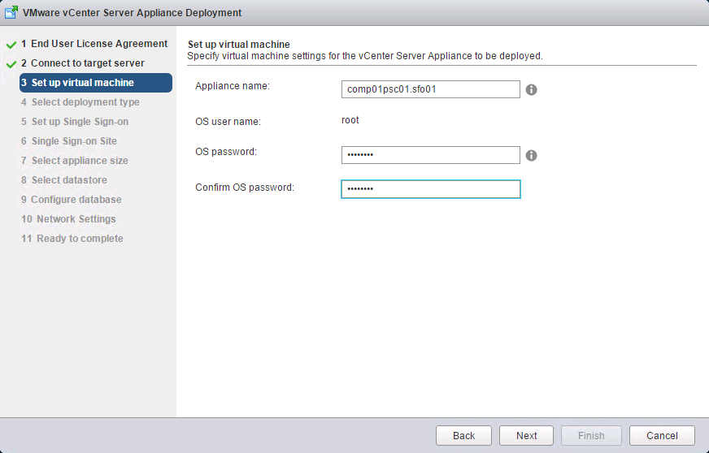

1.  On the **Select deployment type **page, under **External Platform Services Controller,** select the **Install Platform Services Controller **radio button, and click** Next**.

> 

1.  On the **Set up Single Sign-on (SSO) **page, select the **Join an SSO domain in an existing vCenter 6.0 platform services controller** radio button, enter the following settings, and click **Next**.

| Setting                                                  | Value                            |
|----------------------------------------------------------|----------------------------------|
| **Platform Services Controller** **FQDN or IP address ** | mgmt01psc01.sfo01.rainpole.local |
| **vCenter SSO Password**                                 | vcenter\_admin\_password         |
| **Port**                                                 | 443                              |

> 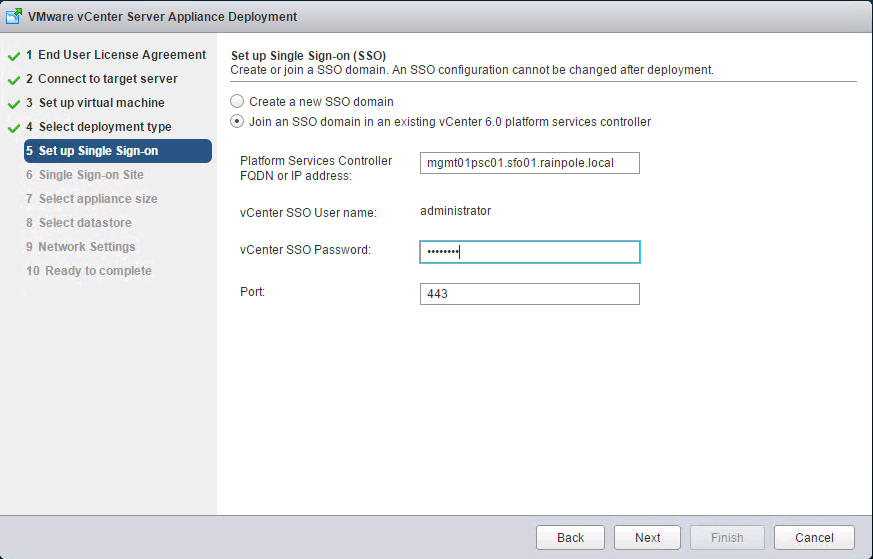

1.  On the **Single Sign-on site **page, select the **Join an existing site** radio button, select **SFO01** from the drop-down list, and click **Next**.

> 

1.  On the **Select appliance size **page, click **Next**, as there is only one appliance size for the Platform Services Controller.

> 

1.  On the **Select datastore **page, select the **SFO01A-VSAN01-MGMT01** datastore to deploy the Platform Services Controller on, select the **Enable Thin Disk Mode** check box, and click **Next**.

> 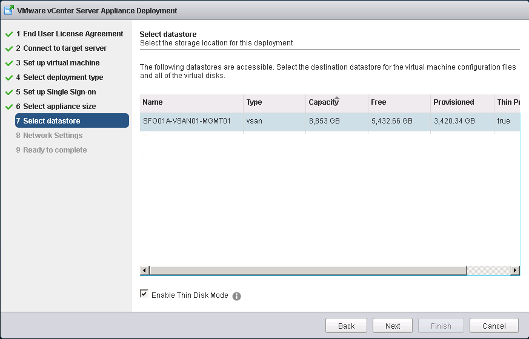

1.  On the **Network Settings **page, enter the following settings,** **and click **Next**.

| Setting                 | Value                            |
|-------------------------|----------------------------------|
| **Choose a network**    | vDS-Mgmt-Management              |
| **IP address family**   | IPv4                             |
| **Network type**        | Static                           |
| **Network address**     | 172.16.11.63                     |
| **System name**         | comp01psc01.sfo01.rainpole.local |
| **Subnet mask**         | 255.255.255.0                    |
| **Network gateway**     | 172.16.11.1                      |
| **Network DNS servers** | 172.16.11.5                      |
| **Configure time sync** | ntp.sfo01.rainpole.local         |
| **Enable SSH**          | Enabled (Select checkbox)        |

1.  On the **Ready to complete **page, review the configuration, and click **Finish** to start the deployment.

    1.  ### Join the Platform Services Controller for the Compute vCenter Server to the Active Directory (Region A)

After you have successfully installed the Platform Services Controller instance, you must join it to the Active Directory.

Procedure

1.  Log in to the Platform Services Controller administration interface.

<!-- -->

1.  In a browser, go to **https://comp01psc01.sfo01.rainpole.local/psc**.

2.  Enter the following credentials, and click **Login**.

| Setting       | Value                       |
|---------------|-----------------------------|
| **User name** | administrator@vsphere.local |
| **Password**  | vcenter\_admin\_password    |

> 

1.  Add the Compute Platform Services Controller instance to the Active Directory domain*.*

<!-- -->

1.  In the **Navigator**, click **Appliance Settings**, click the **Manage **tab, and click the **Join **button.

> 

1.  In the **Join Active Directory Domain** dialog box, enter the following settings, and click **OK**.

| Setting       | Value                                  |
|---------------|----------------------------------------|
| **Domain**    | sfo01.rainpole.local                   |
| **User name** | *ad\_admin\_acct@sfo01.rainpole.local* |
| **Password**  | ad\_admin\_password                    |

1.  Reboot the Platform Services Controller node to apply the changes.

<!-- -->

1.  Click the **Appliance settings** tab, and click the **VMware Platform Services Appliance** link.

> 

1.  Log in to the VMware vCenter Server Appliance administration interface with the following credentials. 

| Setting       | Value                   |
|---------------|-------------------------|
| **User name** | root                    |
| **Password**  | comppsc\_root\_password |

1.  On the **Summary** page, click **Reboot**.

> 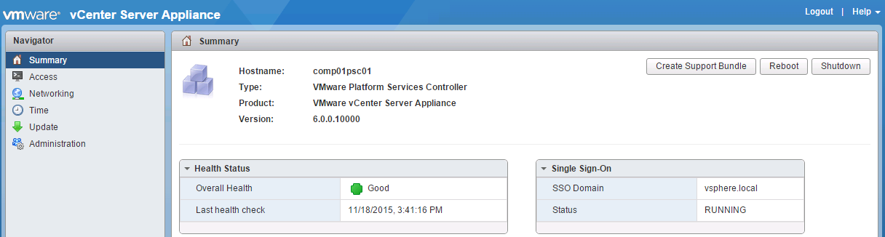

1.  In the **System Reboot** dialog box, click **Yes**.

> 

1.  Wait for the reboot process to finish. 

> 

1.  After the reboot process finishes, log in to **https://comp01psc01.sfo01.rainpole.local/psc** again, by using the following credentials. 

| Setting       | Value                       |
|---------------|-----------------------------|
| **User name** | administrator@vsphere.local |
| **Password**  | vcenter\_admin\_password    |

1.  To verify that the Platform Services Controller successfully joined the domain, click* ***Appliance Settings**,** **and click the **Manage **tab.

> 

### Deploy the Compute vCenter Server Instance (Region A)

You can now install the vCenter Server appliance and add the license.

**Procedure**

1.  Start the VMware vCenter Server Appliance deployment wizard.

<!-- -->

1.  Browse the vCenter Server Appliance ISO file.

2.  Open the **vcsa-setup.html** file in a browser.

3.  Click **Install** to start the installation.

> 

1.  Complete the VMware vCenter Server Appliance deployment wizard.

<!-- -->

1.  On the **End User License Agreement **page, select the **I accept the terms of the license agreement **check box and click **Next**.

> 

1.  On the **Connect to target server **page, enter the following settings, and click **Next**.

| Setting                | Value                            |
|------------------------|----------------------------------|
| **FQDN or IP Address** | mgmt01esx01.sfo01.rainpole.local |
| **User name**          | root                             |
| **Password**           | esxi\_root\_user\_password       |

> 

1.  In the **Certificate Warning **dialog box, click **Yes** to accept the host certificate.

> 

1.  On the **Set up virtual machine **page, enter the following settings, and click **Next**.

| Setting                 | Value                  |
|-------------------------|------------------------|
| **Appliance name**      | comp01vc01.sfo01       |
| **OS password**         | compvc\_root\_password |
| **Confirm OS password** | compvc\_root\_password |

> 

1.  On the **Select deployment type **page, under **External Platform Services Controller,** select the **Install vCenter Server (Requires External Platform Services Controller) **radio button, and click** Next.**

> 

1.  On the **Configure Single Sign-On (SSO) **page, enter the following values, and click **Next**.

| Setting                                                  | Value                            |
|----------------------------------------------------------|----------------------------------|
| **Platform Services Controller** **FQDN or IP address ** | comp01psc01.sfo01.rainpole.local |
| **vCenter SSO password**                                 | vcenter\_admin\_password         |
| **vCenter Single Sign-On** **HTTPS Port **               | 443                              |

> 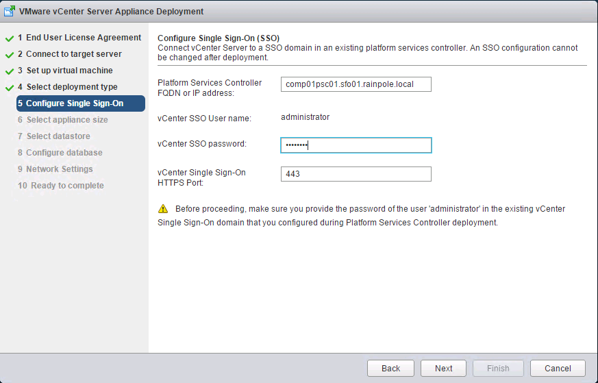

1.  On the **Select appliance size **page, select **Large (up to 1,000 hosts, 10,000 VMs)**, and click **Next**.

> 

1.  On the **Select datastore **page, select the **SFO01A-VSAN01-MGMT01** datastore, select the **Enable Thin Disk Mode** check box, and click **Next**.

> 

1.  On the **Configure database **page, select **Use an embedded database (PostgreSQL)** radio button, and click **Next**.

> 

1.  On the **Network Settings **page, enter the following settings,** **and click **Next**.

| Setting                 | Value                           |
|-------------------------|---------------------------------|
| **Choose a network**    | vDS-Mgmt-Management             |
| **IP address family**   | IPv4                            |
| **Network type**        | Static                          |
| **Network address**     | 172.16.11.64                    |
| **System name**         | comp01vc01.sfo01.rainpole.local |
| **Subnet mask**         | 255.255.255.0                   |
| **Network gateway**     | 172.16.11.1                     |
| **Network DNS servers** | 172.16.11.5                     |
| **Configure time sync** | ntp.sfo01.rainpole.local        |
| **Enable SSH**          | Enabled (Select checkbox)       |

1.  On the **Ready to complete **page, review the configuration, and click **Finish** to start the deployment.

<!-- -->

1.  Add new licenses for this vCenter Server instance and the compute and edge clusters ESXi hosts, if it was not done prior in the Management vCenter Server.

<!-- -->

1.  In a browser go to **https://comp01vc01.sfo01.rainpole.local/vsphere-client**, and log in by using the following credentials.

| Setting       | Value                       |
|---------------|-----------------------------|
| **User name** | administrator@vsphere.local |
| **Password**  | vcenter\_admin\_password    |

> 

1.  Click **Licensing**.

> 

1.  Click the **Licenses** tab.

> 

1.  Assign the licenses to the respective assets.

<!-- -->

1.  Verify that you have the licenses required for this functionality. Talk to your VMware representative for details.** **

<!-- -->

1.  Click the **Assets* ***tab*.*

> 

1.  Select the vCenter Server instance, and click the **Assign License** icon.

> 

1.  Select the vCenter Server license that you entered in the previous step, and click **OK**. 

<!-- -->

1.  Assign the vCenterAdmins domain group to the vCenter Server Administrator role.

<!-- -->

1.  In the **Navigator**, click **Home**.

2.  Click **Hosts and Clusters**.

> 

1.  Select the **comp01vc01.sfo01.rainpole.local** tree.

2.  Click the **Manage** tab, click **Permissions**, and click the **Add** icon.

> 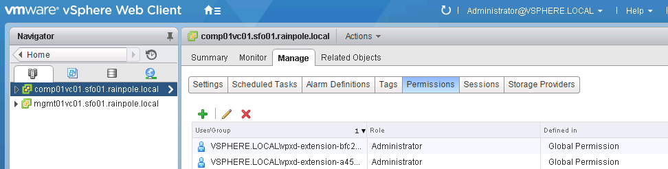

1.  In the **comp01vc01.sfo01.rainpole.local - Add Permission** dialog box, click the **Add** button.

2.  In the **Select Users/Groups** dialog box, select **SFO01** from the **Domain** drop-down menu.

3.  In the **search** box, enter **vCenterAdmins**, and press **Enter**.

4.  Select **vCenterAdmins**, and click **Add**.

> 

1.  Click **OK**.

2.  In the **comp01vc01.sfo01.rainpole.local - Add Permission** dialog box, select **Administrator** as **Assigned Role** and select the **Propagate to children** check box.

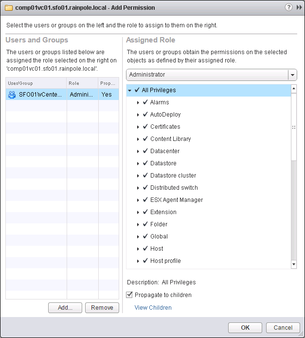

1.  Click **OK**.

    1.  ### Configure the Compute and Edge Clusters (Region A)

You must now create and configure the compute and edge clusters. This process consists of the following actions:

-   Create the clusters.

-   Configure DRS.

-   Enable Virtual SAN datastore for the Edge cluster.

-   Add the hosts to the clusters.

-   Add the hosts to the active directory domain.

Procedure

1.  Log in to the Compute vCenter Server by using the vSphere Web Client.

<!-- -->

1.  In a browser, go to **https://comp01vc01.sfo01.rainpole.local/vsphere-client**.

2.  Use the following credentials to log in.

| Setting       | Value                       |
|---------------|-----------------------------|
| **User name** | administrator@vsphere.local |
| **Password**  | vcenter\_admin\_password    |

1.  Create new data center.

<!-- -->

1.  In the **Navigator**, click **Hosts and Clusters.**

2.  Click **Actions** *&gt;* **New Datacenter***.*

3.  In the **New Datacenter** dialog box, enter **SFO01 **as name, and click **OK**.

<!-- -->

1.  First, create the compute cluster. 

<!-- -->

1.  Right-click the **SFO01** data center and click **New Cluster**.

2.  In the **New Cluster **wizard, enter the following values, and click **OK**. 

| Setting         | Value                                                                               |
|-----------------|-------------------------------------------------------------------------------------|
| **Name**        | SFO01-Comp01                                                                        |
| **DRS**         | Turn ON (select check box)                                                          
                   (Leave other DRS options with default values)                                        |
| **vSphere HA**  | *Do not* Turn ON (leave check box empty)                                            |
| **EVC**         | Set EVC mode to the lowest available setting supported for the hosts in the cluster |
| **Virtual SAN** | *Do not* Turn ON (leave check box empty)                                            |

> 

1.  Next, create the edge cluster.

<!-- -->

1.  Right-click the **SFO01** data center and click **New Cluster**.

2.  Enter the following values, in the **New Cluster **wizard, and click **OK**.

| Setting         | Value                                                                               |
|-----------------|-------------------------------------------------------------------------------------|
| **Name**        | SFO01-Edge01                                                                        |
| **DRS**         | Turn ON (select check box)                                                          
                   (Leave default values)                                                               |
| **vSphere HA**  | *Do not* Turn ON (leave check box empty)                                            |
| **EVC**         | Set EVC mode to the lowest available setting supported for the hosts in the cluster |
| **Virtual SAN** | *Do not* Turn ON (leave check box empty)                                            |

> 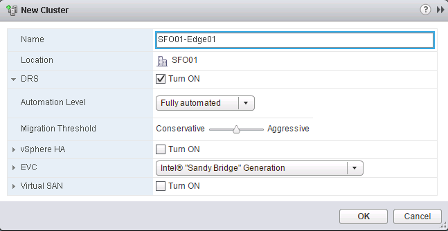

1.  Add a compute host to the compute cluster.

<!-- -->

1.  Right-click the **SFO01-Comp01** cluster, and click **Add Host**.

2.  On the **Name and location **page, enter **comp01esx01.sfo01.rainpole.local** in the **Host name or IP address** text box, and click **Next**.

> 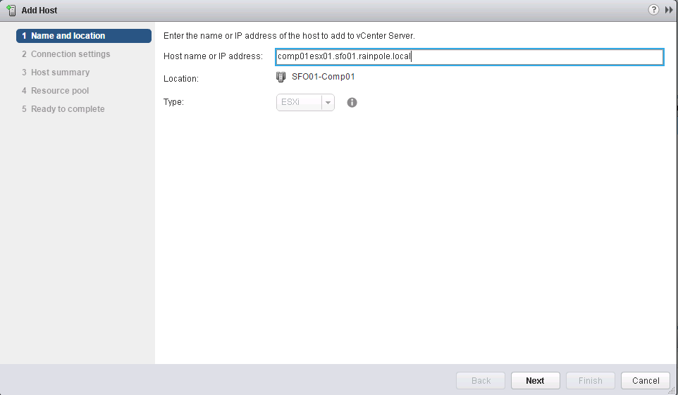

1.  On the **Connection settings **page, enter the following credentials, and click** Next***.*

| Setting       | Value                      |
|---------------|----------------------------|
| **User name** | root                       |
| **Password**  | esxi\_root\_user\_password |

1.  In the **Security Alert **dialog box, click **Yes**.

2.  On the **Host summary** page, review the host information, and click **Next**.

3.  On the **Assign license** page, select the ESXi license key that you entered during the vCenter Server deployment, and click **Next**.

4.  On the **Lockdown mode** page, leave default, and click **Next**.

5.  On the **Resource pool** page, leave default, and click **Next**.

6.  On the **Ready to complete **page, review your entries, and click **Finish.**

<!-- -->

1.  Repeat the previous step for the three remaining hosts, to add them to the compute cluster.

| Object             | FQDN                             |
|--------------------|----------------------------------|
| **Compute host 2** | comp01esx02.sfo01.rainpole.local |
| **Compute host 3** | comp01esx03.sfo01.rainpole.local |
| **Compute host 4** | comp01esx04.sfo01.rainpole.local |

1.  Add all hosts to the edge cluster as well.

| Object          | FQDN                              |
|-----------------|-----------------------------------|
| **Edge host 1** | edge01esx01.sfo01.rainpole.local  |
| **Edge host 2** | edge01esx02.sfo01.rainpole.local  |
| **Edge host 3** | edge01esx03.sfo01.rainpole.local  |
| **Edge host 4** | edge01esx04.sfo01.rainpole.local  |

1.  Add ESXi hosts to the active directory domain

<!-- -->

1.  In the **Navigator**, click **Hosts and Clusters,** expand the entire **comp01vc01.sfo01.rainpole.local **tree

2.  Select the **comp01esx01.sfo01.rainpole.local** host.

3.  Click the **Manage** tab, and click **Settings**.

4.  Under **System**, select **Authentication Services**.

5.  In the **Authentication Services** panel, click the **Join Domain** button.

> 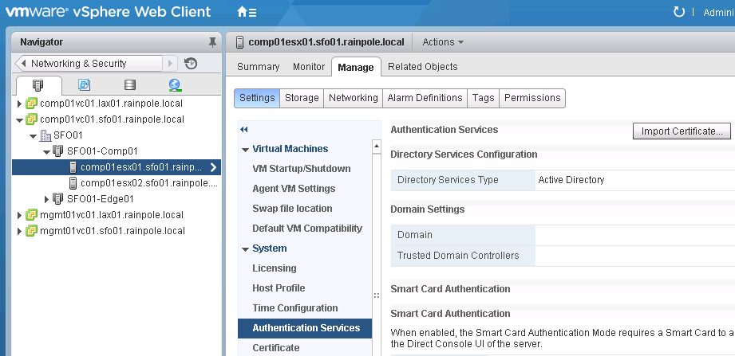

1.  In the **Join Domain** dialog box, enter the following settings and click **OK**.

| Setting       | Value                                     |
|---------------|-------------------------------------------|
| **Domain**    | sfo01.rainpole.local                      |
| **User name** | *ad\_admin\_account@sfo01.rainpole.local* |
| **Password**  | ad\_admin\_password                       |

> 

1.  Repeat the previous step to add all remaining hosts to the domain.

| **Object**         | **FDQN**                          |
|--------------------|-----------------------------------|
| **Compute host 2** | comp01esx02.sfo01.rainpole.local  |
| **Compute host 3** | comp01esx03.sfo01.rainpole.local  |
| **Compute host 4** | comp01esx04.sfo01.rainpole.local  |
| **Edge host 1**    | edge01esx01.sfo01.rainpole.local  |
| **Edge host 2**    | edge01esx02.sfo01.rainpole.local  |
| **Edge host 3**    | edge01esx03.sfo01.rainpole.local  |
| **Edge host 4**    | edge01esx04.sfo01.rainpole.local  |

1.  Configure the Virtual SAN datastore for the edge cluster. 

<!-- -->

1.  In the **Navigator**, click **Hosts and Clusters.**

2.  Click the **SFO01-Edge01** cluster, click **Manage** tab,** **click** Settings.**

3.  Under **Virtual SAN**, select **General**, and click the **Edit** button.

> 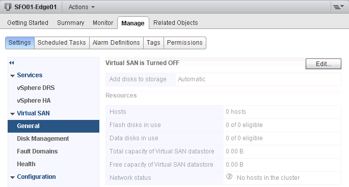

1.  In the **Edit Virtual SAN Settings** dialog box, select the **Turn ON Virtual SAN** check box, select **Automatic** in the **Add disks to storage** drop-down menu, and click **OK.**

> 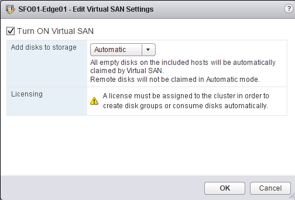

1.  Verify that Virtual SAN is turned on and disk groups are created successfully.

> 

1.  Click **Related Objects,** and click **Datastores**.

2.  Select the** vsanDatastore**, click the** Actions** icon, and click** Rename**.

3.  In the **Datastore - Rename** dialog box, enter **SFO01A-VSAN01-EDGE01** as datastore name, and click **OK**.  

> 

### Create Distributed Virtual Switch for the Compute Cluster (Region A)

After all ESXi hosts have been added to the clusters, create Distributed Virtual Switches. 

**Procedure**

1.  Log in to the Compute vCenter Server by using the vSphere Web Client.

<!-- -->

1.  In a browser, go to **https://comp01vc01.sfo01.rainpole.local/vsphere-client**.

2.  Use the following credentials to log in.

| Setting       | Value                       |
|---------------|-----------------------------|
| **User name** | administrator@vsphere.local |
| **Password**  | vcenter\_admin\_password    |

1.  Create a Distributed Virtual Switch for the compute cluster.

<!-- -->

1.  In the **Navigator**, click **Networking**.

2.  Right-click the **SFO01** data center, and select **Distributed Switch** &gt; New Distributed Switch to start the New Distributed Switch wizard.

3.  On the **Name and location** page, enter **vDS-Comp** as the name, and click **Next**.

4.  On the **Select version **page, ensure the **Distributed switch version - 6.0.0** radio button is selected, and click **Next**.

5.  On the **Edit settings **page, enter the following values, and click **Next**.

| Setting                         | Value                   |
|---------------------------------|-------------------------|
| **Number of uplinks**           | 2                       |
| **Network I/O Control**         | Enabled                 |
| **Create a default port group** | No (deselect check box) |

1.  On the **Ready to complete **page, review your entries, and click **Finish**.

<!-- -->

1.  Edit the settings of the vDS-Comp distributed switch.

<!-- -->

1.  Right-click the **vDS-Comp **distributed switch, and select **Settings*** &gt; ***Edit Settings**.

2.  Click the **Advanced **tab.

3.  Enter **9000** as **MTU (Bytes)** value, and click **OK**.

<!-- -->

1.  Create new port groups in the **vDS-Comp **distributed switch.

<!-- -->

1.  Right-click the **vDS-Comp **distributed switch, and select **Distributed Port Group*** *&gt; **New Distributed Port Group***. *

2.  Create port groups with the following settings.

| Port Group Name     | Port Binding   | VLAN type | VLAN ID |
|---------------------|----------------|-----------|---------|
| vDS-Comp-Management | Static binding | VLAN      | 1621    |
| vDS-Comp-vMotion    | Static binding | VLAN      | 1622    |
| vDS-Comp-NFS        | Static binding | VLAN      | 1625    |

1.  VXLAN port group will be created later during NSX Manager (Compute Cluster) configuration

> 

1.  On the **Ready to complete** page, review your entries, and click **Finish**.

<!-- -->

1.  Attach the ESXi hosts to the **vDS-Comp** distributed switch by migrating their VMkernel and virtual machine network adapters.

<!-- -->

1.  Right-click the **vDS-Comp** distributed switch,** **and click **Add and Manage Hosts**.

2.  On the **Select task** page, select **Add hosts**, and click **Next**. 

> 

1.  On the **Select hosts** page, click **New hosts**.

2.  In the **Select new hosts **dialog box, select all four hosts, and click **OK**.

3.  On the **Select hosts** page, select the **Configure identical network settings (template mode) **check box, and click **Next**.

4.  On the **Select template host** page, select the first host as a template host, and click **Next***.*

5.  On the **Select network adapter tasks** page, ensure both **Manage physical adapters (Template mode)**, and **Manage VMkernel adapters (template mode)** check boxes are selected, and click **Next**.

6.  On the **Manage physical network adapters (template mode)** page, click **vmnic1**, and click** Assign uplink**.

7.  In the **Select an Uplink for vmnic1** dialog box, select **Uplink 1**, and click **OK**.

8.  On the **Manage physical network adapters (template mode)** page, click **Apply to all**, and click **Next**.

> 

1.  On the **Manage VMkernel network adapters (template mode)** page, click **vmk0**, and click **Assign port group**.

| vmnic    | Source Port Group  | Destination Port Group | Port Properties    | MTU  |
|----------|--------------------|------------------------|--------------------|------|
| **vmk0** | Management Network | vDS-Comp-Management    | Management traffic | 1500 |

1.  Select **vDS-Comp-Management**, and click **OK.**

2.  Select **vmk0**, and click on **Edit adapter.**

3.  In **vmk0 - Edit Settings** page, under **Port properties**, check the box for Management traffic.

4.  In **vmk0 - Edit Settings** page, click on **NIC Settings.**

5.  Enter the **MTU** value of **1500**, and click **OK.**

6.  On the **Manage VMkernel network adapters (template mode)** page, click on **On this switch.**

| vmnic    |     | Port Group       | Port Properties | IPv4 Address  | Netmask       | MTU  |
|----------|-----|------------------|-----------------|---------------|---------------|------|
| **vmk1** |     | vDS-Comp-vMotion | vMotion traffic | 172.16.22.101 | 255.255.255.0 | 9000 |
| **vmk2** |     | vDS-Comp-NFS     | N/A             | 172.16.25.101 | 255.255.255.0 | 9000 |

1.  Click on **+ New adapter**

2.  In **Add Networking** page, browse to select **vDS-Comp-vMotion** in the **Select Network** and click **OK**. Click **Next**.

3.  Under **Port properties**, check box **vMotion traffic**. Click **Next.**

4.  Under **IPv4 settings, **select radio button **Use static IPv4 settings** and enter the IP address and subnet. Click **Next.**

5.  Click **Finish.**

6.  Select **vmk1**, and click on **Edit adapter**

7.  In **vmk1 - Edit Settings** page, click on **NIC Settings**

8.  Enter the **MTU** value of **9000**, and click **OK**

9.  Repeat steps to create **vmk2**.

10. In the **Manage physical network adapters (template mode) **page, click **Apply to all.**

<!-- -->

1.  In the **comp01esxi01...configuration to other hosts **dialog box, enter the IPv4 addresses for each of the VMkernel adapters, and click **OK**.

| VMkernel adapter | IPv4 address     |
|------------------|------------------|
| **vmk0**         | 172.16.21.102\#3 |
| **vmk1**         | 172.16.22.102\#3 |
| **vmk2**         | 172.16.25.102\#3 |

> 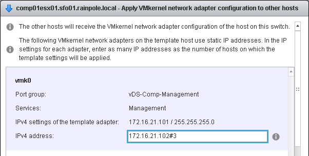

1.  On the **Analyze impact** page, click **Next**.

2.  On the **Ready to complete** page, review your entries, and click **Finish**.

<!-- -->

1.  Enable* *vSphere HA for the compute cluster. 

<!-- -->

1.  In the **Home &gt; Hosts and Clusters**, click the **SFO01-Comp01** cluster.

2.  Click the **Manage** tab, click **Settings**, and click **vSphere HA**.

3.  Click **Edit**.

4.  In the **Edit Cluster Settings** dialog box, select the **Turn on vSphere HA **check box.

> 

1.  In the **Edit Cluster Settings** dialog box, under **Virtual Machine Monitoring**, select **VM Monitoring Only** from the drop-down menu.

2.  Under **Virtual Machine Monitoring**, expand the **Admission Control** settings.

3.  Under **Admission Control** settings, select **Define failover capacity by reserving a percentage of the cluster resources,** and enter the following settings.

| Setting                                          | Value |
|--------------------------------------------------|-------|
| **Reserved failover CPU capacity (% CPU)**       | 25    |
| **Reserved failover Memory capacity (% Memory)** | 25    |

1.  Click **OK**.

<!-- -->

1.  Define Network I/O Control Shares values for the different traffic types on the **vDS-Comp** distributed switch.

<!-- -->

1.  In the **Navigator**, click the **Networking** icon, and click the **SFO01** data center.

2.  Click the* ***vDS-Comp **distributed switch.

3.  Click the **Manage** tab, and click **Resource Allocation**.

4.  Under **System Traffic**, edit each of the following traffic types with the values from the table.

| Traffic Type        | Physical Adapter Shares |
|---------------------|-------------------------|
| **NFS Traffic**     | High, 100               |
| **vMotion Traffic** | High, 100               |

1.  Migrate the last physical adapter from the standard switch to the **vDS-Comp** distributed switch.

<!-- -->

1.  In the **Navigator**, click **Networking** and expand **SFO01** data center.

2.  Right-click the **vDS-Comp **distributed switch and select **Add and Manage hosts**.

3.  On the **Select task **page, select **Manage host networking**, and click **Next**.

4.  On the **Select hosts **page, click **Attached hosts**.

5.  In the** Select member hosts** dialog box, select all ESXi hosts, and click **OK**.

6.  On the **Select hosts **page, click **Next**.

7.  On the **Select network adapter tasks** page, select **Manage Physical adapters** only, and click **Next**.

8.  On the **Manage physical network adapters** page, under **comp01esx01.sfo01.rainpole.local**, select **vmnic0**, and click **Assign uplink**.

9.  In the **Select an Uplink** dialog box, select **dvUplink2**, and click **OK**.

10. Assign uplinks for the 3 remaining hosts to reassign their vmnics, and click **Next**.

11. On the **Analyze Impact** page, click **Next**.

12. On the **Ready to complete **page, click **Finish**.

 

### Create Distributed Virtual Switch for the Edge Cluster (Region A)

After the distributed virtual switch for the compute cluster is configured, create distributed virtual switch for the edge cluster.

Procedure

1.  Log in to the Compute vCenter Server by using the vSphere Web Client.

<!-- -->

1.  In a browser, go to **https://comp01vc01.sfo01.rainpole.local/vsphere-client**.

2.  Use the following credentials to log in.

| Setting       | Value                       |
|---------------|-----------------------------|
| **User name** | administrator@vsphere.local |
| **Password**  | vcenter\_admin\_password    |

1.  Create a Distributed Virtual Switch for the edge cluster.

<!-- -->

1.  In the **Navigator**, click **Networking**.

2.  Right-click the **SFO01 **data center, and select **Distributed Switch &gt; New Distributed Switch** to start the **New Distributed Switch** wizard.

3.  On the **Name and location** page, enter **vDS-Edge** as the name, and click **Next**.

4.  On the **Select version** page, ensure the **Distributed switch version - 6.0.0** radio button is selected, and click **Next**.

5.  On the** Edit settings** page, enter the following values, and click **Next**.

| Setting                         | Value                   |
|---------------------------------|-------------------------|
| **Number of uplinks**           | 2                       |
| **Network I/O Control**         | Enabled                 |
| **Create a default port group** | No (deselect check box) |

1.  On the **Ready to complete** page, review your entries, and click **Finish**.

<!-- -->

1.  Edit the settings of the **vDS-Edge** distributed switch.

<!-- -->

1.  Right-click the **vDS-Edge **distributed switch, and select **Settings*** &gt; ***Edit Settings**.

2.  Click the **Advanced **tab.

3.  Enter **9000** as **MTU (Bytes)** value, and click **OK**.

<!-- -->

1.  Create new port groups in the **vDS-Edge **distributed switch.

<!-- -->

1.  Right-click the **vDS-Edge **distributed switch, and select **Distributed Port Group*** *&gt; **New Distributed Port Group***. *

2.  Create port groups with the following settings.

| Port Group Name      | Port Binding   | VLAN type | VLAN ID |
|----------------------|----------------|-----------|---------|
| vDS-Edge-Management  | Static binding | VLAN      | 1631    |
| vDS-Edge-vMotion     | Static binding | VLAN      | 1632    |
| vDS-Edge-VSAN        | Static binding | VLAN      | 1633    |
| vDS-Edge-NFS         | Static binding | VLAN      | 1635    |
| vDS-Edge-Ext-Tenants | Static binding | VLAN      | 140     |

1.  VXLAN port group will be created later during NSX Manager (Compute Cluster) configuration.

    

<!-- -->

1.  On the **Ready to complete** page, review your entries, and click **Finish**.

<!-- -->

1.  Attach the ESXi hosts to the **vDS-Edge** distributed switch by migrating their VMkernel and virtual machine network adapters.

<!-- -->

1.  Right-click the** vDS-Edge** distributed switch, and click **Add and Manage Hosts**.

2.  On the **Select task** page, select **Add hosts**, and click **Next**. 

> 

1.  On the **Select hosts** page, click **New hosts**.

2.  In the **Select new hosts **dialog box, select all four hosts, and click **OK**.

3.  On the **Select hosts** page, select **Configure identical network settings...(template mode) **check box, and click **Next**.

4.  On the **Select template host** page, select the first host as a template host, and click **Next***.*

5.  On the **Select network adapter tasks** page, ensure both **Manage physical adapters (Template mode) **and **Manage VMkernel adapters (template mode)** check boxes are checked, and click **Next**.

6.  On the **Manage physical network adapters (template mode)** page, click **vmnic1**, and click** Assign uplink**.

7.  In the **Select an Uplink for vmnic1** dialog box, select **Uplink 1**, and click **OK**.

8.  On the **Manage physical network adapters (template mode)** page, click **Apply to all**, and click **Next**.

> 

1.  On the **Manage VMkernel network adapters (template mode)** page, click **vmk0**, and click **Assign port group**.

| vmnic    | Source Port Group  | Destination port group | Port Properties    | MTU  |
|----------|--------------------|------------------------|--------------------|------|
| **vmk0** | Management Network | vDS-Edge-Management    | Management traffic | 1500 |

1.  Select **vDS-Edge-Management**, and click **OK**.

2.  Select **vmk0**, and click on **Edit adapter**.

3.  In **vmk0 - Edit Settings** page, under **Port properties**, check the box for Management traffic

4.  In **vmk0 - Edit Settings** page, click on **NIC Settings**

5.  Enter the **MTU** value of **1500**, and click **OK**

6.  On the **Manage VMkernel network adapters (template mode)** page, click on **On this switch.**

| vmnic    | Port Group       | Port Properties     | IPv4 Address  | Netmask       | MTU  |
|----------|------------------|---------------------|---------------|---------------|------|
| **vmk1** | vDS-Edge-vMotion | vMotion traffic     | 172.16.32.101 | 255.255.255.0 | 9000 |
| **vmk2** | vDS-Edge-VSAN    | Virtual SAN traffic | 172.16.33.101 | 255.255.255.0 | 9000 |
| **vmk3** | vDS-Edge-NFS     | N/A                 | 172.16.35.101 | 255.255.255.0 | 9000 |

1.  Click on **+ New adapter**

2.  In **Add Networking** page, browse to select **vDS-Edge-vMotion** in the **Select Network** and click **OK**. Click **Next.**

3.  Under **Port properties**, check box **vMotion traffic**. Click **Next.**

4.  Under **IPv4 settings, **select radio button **Use static IPv4 settings** and enter the IP address and subnet. Click **Next.**

5.  Click **Finish.**

6.  Select **vmk1**, and click on Edit adapter

7.  In **vmk1 - Edit Settings** page, click on NIC Settings

8.  Enter the **MTU** value of **9000**, and click **OK**

9.  Repeat steps to create **vmk2** and **vmk3**.

10. On the **Manage VMkernel network adapters (template mode)** page, click **Apply to all**.

<!-- -->

1.  In the **edge01esxi01...configuration to other hosts **dialog box, enter the IPv4 addresses for each of the VMkernel adapters, and click **OK**.

| VMkernel adapter | IPv4 address     |
|------------------|------------------|
| **vmk0**         | 172.16.31.102\#3 |
| **vmk1**         | 172.16.32.102\#3 |
| **vmk2**         | 172.16.33.102\#3 |
| **vmk3**         | 172.16.35.102\#3 |

> 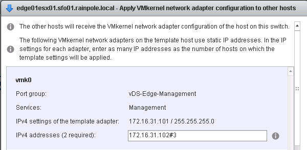

1.  On the **Analyze impact** page, click **Next**.

2.  On the **Ready to complete** page, review your entries, and click **Finish**.

<!-- -->

1.  Enable vSphere HA for the edge cluster. 

<!-- -->

1.  In the **Home &gt; Host and Clusters**, click the **SFO01-Edge01** cluster. 

2.  Click the **Manage **tab, click **Settings**, and click **vSphere HA**.

3.  Click **Edit**.

4.  In the **Edit Cluster Settings** dialog box, select the **Turn on vSphere HA** check box.

> 

1.  In the **Edit Cluster Settings** dialog box, under **Virtual Machine Monitoring**, select **VM Monitoring Only** from the drop-down menu.

2.  Under **Virtual Machine Monitoring**, expand the **Failure conditions and VM response** setting.

3.  Select **Power off and restart VMs** from the **Response for Host Isolation** drop-down menu.

> 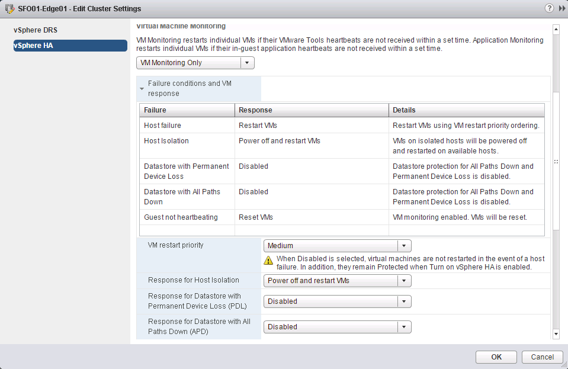

1.  Under **Virtual Machine Monitoring**, expand the **Admission Control** settings.

2.  Under **Admission Control** settings, select **Define failover capacity by reserving a percentage of the cluster resources**, enter the following settings.

| Setting                                          | Value |
|--------------------------------------------------|-------|
| **Reserved failover CPU capacity (% CPU)**       | 25    |
| **Reserved failover Memory capacity (% Memory)** | 25    |

1.  Click **OK**.

<!-- -->

1.  Define Network I/O Control Share values for the different traffic types on the **vDS-Edge **distributed switch.

<!-- -->

1.  In the **Navigator**, click the **Networking** icon, and click the **SFO01** data center.

2.  Click the* ***vDS-Edge **distributed switch.

3.  Click the **Manage** tab, and click **Resource Allocation**.

4.  Under **System Traffic**, edit each of the following traffic types with the values from the table.

| Traffic Type            | Physical adapter Shares |
|-------------------------|-------------------------|
| **Virtual SAN Traffic** | High, 100               |
| **NFS Traffic**         | High, 100               |
| **vMotion Traffic**     | High, 100               |

1.  Migrate the last physical adapter from the standard switch to the **vDS-Edge** distributed switch.

<!-- -->

1.  In the **Navigator**, click **Networking** and expand **SFO01** datacenter.

2.  Right-click the **vDS-Edge** distributed switch and select **Add and Manage hosts**.

3.  On the **Select task **page, select **Manage host networking**, and click **Next**.

4.  On the **Select hosts **page, click **Attached hosts**.

5.  In the** Select member hosts** dialog box, select all four ESXi hosts, and click **OK**.

6.  On the **Select hosts **page, click **Next**.

7.  On the **Select network adapter tasks** page, select **Manage Physical adapters** only, and click **Next**.

8.  On the **Manage physical network adapters** page, under **edge01esx01.sfo01.rainpole.local**, select **vmnic0**, and click **Assign uplink**.

9.  In the **Select an Uplink** dialog box, select **dvUplink2**, and click **OK**.

10. Assign uplinks for the 3 remaining hosts to reassign their vmnics, and click **Next**.

11. On the **Analyze Impact** page, click **Next**.

12. On the **Ready to complete **page, click **Finish**.

    1.  ### Configure the Link Aggregation Control Protocol for the Compute and Edge Clusters (Region A)

Configure Link Aggregation Control Protocol to optimize redundancy and performance across the uplinks in the SDDC.

Procedure

1.  Log in to the Compute vCenter Server, by using the vSphere Web Client.

<!-- -->

1.  In a browser, go to **https://comp01vc01.sfo01.rainpole.local/vsphere-client**.

2.  Use the following credentials to log in.

| Setting       | Value                       |
|---------------|-----------------------------|
| **User name** | administrator@vsphere.local |
| **Password**  | vcenter\_admin\_password    |

1.  Add new Link Aggregation Group.

<!-- -->

1.  In the **Navigator**, click **Networking**.

2.  Expand the comp01vc01.sfo01.rainpole.local tree.

3.  Click the **vDS-Comp** distributed switch.

4.  Click the **Manage **tab, click **Settings**, and click **LACP**.

5.  Click the **Add** icon to add a new Link Aggregation Group with the following properties, and click **OK**.

| Setting                 | Value                                                    |
|-------------------------|----------------------------------------------------------|
| **Name**                | lag1                                                     |
| **Number of ports**     | 2                                                        |
| **Mode**                | Active                                                   |
| **Load balancing mode** | Source and destination IP address, TCP/UDP port and VLAN |

1.  Under **LACP**,** **click the **Migrating network traffic to LAGs **link** **to start the migratation of network traffic to the LAG process.

<!-- -->

1.  In the **Migrating Network Traffic to Link Aggregation Groups **dialog box, click the **Manage Distributed Port Groups** link.

2.  On the **Manage Distributed Port Groups **page, select **Teaming and failover**, and click **Next**.

3.  On the **Select port groups** page, click **Select distributed port groups**.

4.  In the **Select Distributed Port Groups** dialog box, select **all available port groups, **and click** OK**.

5.  On the **Select port groups** page, click **Next**.

6.  On the **Teaming and failover** page, configure as described in the table, and click **Next**.

| Setting                       | Value                  |
|-------------------------------|------------------------|
| **Load balancing**            | Route based on IP hash |
| **Network failure detection** | Link status only       |
| **Notify switches**           | Yes                    |
| **Failback**                  | No                     |
| **Active uplinks**            | dvUplink1, dvUplink2   |
| **Standby uplinks**           | lag1                   |

> 

1.  In the **Confirm Teaming and Failover Settings** dialog box, click **OK**.

<!-- -->

1.  It is expected that the following warning appears during this process.

> 

1.  On the **Ready to complete** page, review your entries, and click **Finish**.

<!-- -->

1.  In the Migrating **Network Traffic to Link Aggregation Groups **dialog box, click **Add and Manage Hosts** to continue.

<!-- -->

1.  On the **Select task** page, select **Manage host networking**, and click** Next**.

> 

1.  On the **Select hosts** page, click **Attached hosts**.

2.  In the **Select member hosts** dialog box, select **all four hosts**, and click **OK**.

3.  On the **Select hosts** page, select **Configure identical network settings...(template mode) **check box, and click **Next**.

4.  On the **Select network adapter tasks** page, check **Manage physical adapters** check box only, and click **Next**.

<!-- -->

1.  Migrate vDS uplinks to Link Aggregation Groups for all hosts in the cluster.

<!-- -->

1.  On the **Manage physical network adapters (template mode)** page, under **comp01esx01.sfo01.rainpole.local**, select **vmnic0**, and click **Assign uplink**.

2.  In the **Select an Uplink for vmnic0** dialog box, select **lag1-0**, and click **OK**.

3.  On the **Manage physical network adapters (template mode)** page, under **comp01esx01.sfo01.rainpole.local**, select **vmnic1**, and click **Assign uplink**.

4.  In the **Select an Uplink for vmnic1** dialog box, select **lag1-1**, and click **OK**.

5.  On the **Manage physical network adapters (template mode)** page, click **Apply to all**, and click **Next**.

> 

1.  On the **Analyze impact** page, click **Next**.

2.  On the **Ready to complete** page, review your entries, and click **Finish**.

<!-- -->

1.  In the **Migrating Network Traffic to Link Aggregation Groups **dialog box, click **Manage Distributed Port Groups** to continue.

<!-- -->

1.  On the **Select port group policies** page, select **Teaming and failover**, and click **Next**.

2.  On the **Select port groups** page, click **Select distributed port groups**.

3.  In the **Select distributed port groups** dialog box, select all available port groups, and click **OK**.

4.  On the **Select port groups** page, click **Next**.

5.  On the **Teaming and failover **page, configure as described in the table, and click **Next**.

| Setting                       | Value                  |
|-------------------------------|------------------------|
| **Load balancing**            | Route based on IP hash |
| **Network failure detection** | Link status only       |
| **Notify switches**           | Yes                    |
| **Failback**                  | No                     |
| **Active uplinks**            | lag1                   |
| **Unused uplinks**            | dvUplink1, dvUplink2   |

> 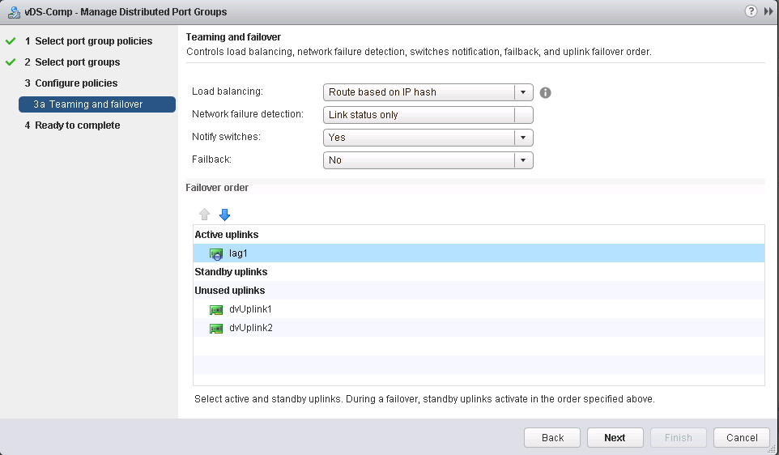

1.  On the **Ready to complete** page, review your entries, and click **Finish**.

<!-- -->

1.  Repeat all steps to configure LACP on the **vDS-Edge** distributed switch, use the respective values for the edge cluster.

<!-- -->

1.  Any portgroup created after this process is done will need its configuration altered to ensure that LAG1 is the only active link and that all other dvuplinks are configured as unused.

    1.  ### Change the Default Domain Administration Group on the ESXi Hosts in the Compute and Edge Clusters (Region A)

Change the default ESX Admins group to achieve greater levels of security by removing a known administrative access point.

Procedure

1.  Log in to the Compute vCenter Server, by using the vSphere Web Client.

<!-- -->

1.  In a browser, go to **https://comp01vc01.sfo01.rainpole.local/vsphere-client**.

2.  Use the following credentials to log in.

| Setting       | Value                       |
|---------------|-----------------------------|
| **User name** | administrator@vsphere.local |
| **Password**  | vcenter\_admin\_password    |

1.  In the **Navigator**, click **Hosts and Clusters**. 

2.  Expand the entire vCenter inventory tree, and select the **comp01.esx01.sfo01.rainpole.local** host.

3.  Click the **Manage** tab and the **Settings** subtab, and click **System &gt; Advanced System Settings**.

4.  In the search box, enter e**sxAdmins **and wait for the search results.

> 

1.  Select the **Config.HostAgent.plugins.hostsvc.esxAdminsGroup**, and click the **Edit** icon to change the ESXi host admin group.

2.  In the **plugins.hostsvc.esxAdminsGroup** text box, enter **SDDC-Admins**, and click **OK**.

> 

1.  Repeat the same for all remaining hosts in the compute and edge clusters.

| Object             | FQDN                              |
|--------------------|-----------------------------------|
| **Compute host 2** | comp01esx02.sfo01.rainpole.local  |
| **Compute host 3** | comp01esx03.sfo01.rainpole.local  |
| **Compute host 4** | comp01esx04.sfo01.rainpole.local  |
| **Edge host 1**    | edge01esx01.sfo01.rainpole.local  |
| **Edge host 2**    | edge01esx02.sfo01.rainpole.local  |
| **Edge host 3**    | edge01esx03.sfo01.rainpole.local  |
| **Edge host 4**    | edge01esx04.sfo01.rainpole.local  |

1.  Reboot all hosts in the compute and edge clusters.

    1.  ### Mount NFS Storage for the Compute Cluster (Region A)

You must mount a NFS datastore that will be used by vRealize Automation Cloud Management Platform Content Library.

**Procedure**

1.  In a browser go to **https://comp01vc01.sfo01.rainpole.local/vsphere-client**, and log in by using the following credentials. 

| Option        | Value                       |
|---------------|-----------------------------|
| **User name** | administrator@vsphere.local |
| **Password**  | vcenter\_admin\_password    |

1.  Create new datastore for the **SFO01-Comp01** cluster.

<!-- -->

1.  In the **Navigator**, select** vCenter Inventory Lists**, and select **Datastores**.

2.  Click the **Create a New Datastore** icon.

3.  On the **Location** page, under **comp01vc01.sfo01.rainpole.local**, under **SFO01** data center, select the **SFO01-Comp01** cluster, and click **Next**.

> 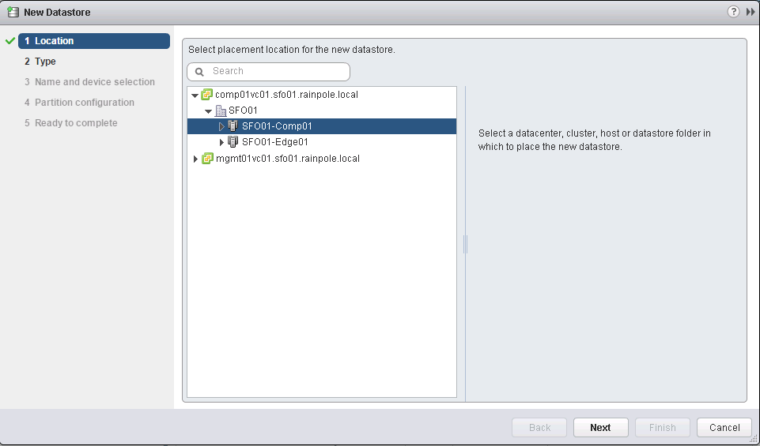 

1.  On the **Type** page, select **NFS **and click **Next**.

2.  On the **NFS version** page, select **NFS 3**, and click **Next**.

3.  On the **Name and configuration** page, enter the following datastore information, and click **Next**.

| Option             | Value                    |
|--------------------|--------------------------|
| **Datastore Name** | SFO01A-NFS01-VRALIB01    |
| **Folder**         | /V2D\_vRA\_ComputeA\_1TB |
| **Server**         | 172.16.25.251            |

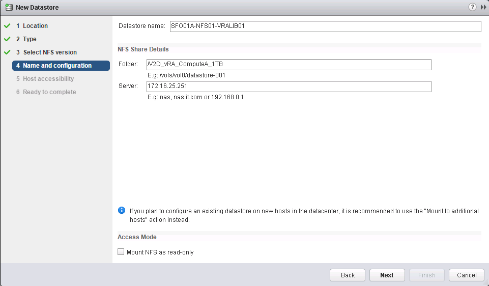

1.  On the **Host accessibility** page, select all the hosts that require access to the datastore, and click **Next**.

> 

1.  On the **Ready to complete** page, review the configuration, and click **Finish**.

    1.  ### Configure Lockdown Mode on All ESXi Hosts (Region A)

To increase security of your ESXi hosts, you put them in Lockdown mode, so that administrative operations can be performed only from vCenter Server.

vSphere supports an Exception User list, which is for service accounts that have to log in to the host directly. Accounts with administrator privileges that are on the Exception Users list can log in to the ESXi Shell. In addition, these users can log in to a host's DCUI in normal lockdown mode and can exit lockdown mode.

Procedure

1.  In a browser go to **https://mgmt01vc01.sfo01.rainpole.local/vsphere-client**, and log in by using the following credentials.

| Option        | Value                       |     |
|---------------|-----------------------------|-----|
| **User name** | administrator@vsphere.local |     |
| **Password**  | vcenter\_admin\_password    |     |

1.  Activate normal lockdown mode on the **mgmt01esx01.sfo01.rainpole.local** host.

<!-- -->

1.  In the **Navigator**, click **Hosts and Clusters**, expand the entire **mgmt01vc01.sfo01.rainpole.local** tree.

2.  Select the **mgmt01esx01.sfo01.rainpole.local** host.

3.  Click the **Manage** tab and click **Settings**.

4.  Under **System**, select **Security Profile**.

5.  In the **Lockdown Mode** panel, click **Edit**.

> 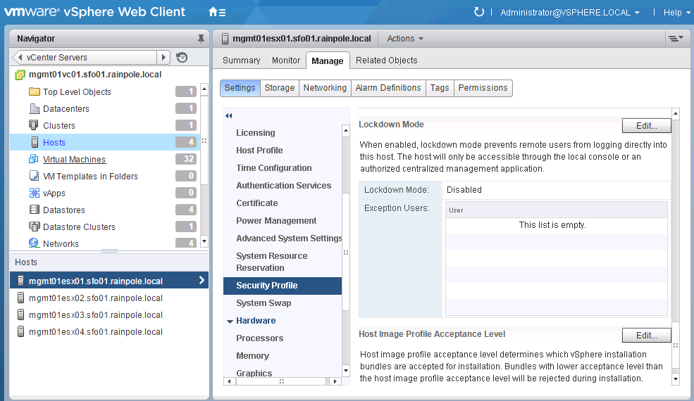

1.  In the **Lockdown Mode** dialog box,** **select the **Normal **radio button, and click **OK**.

>  

 

1.  Repeat the previous step to enable normal lockdown mode for all remaining hosts in the data center.

| Object                | FQDN                               |
|-----------------------|------------------------------------|
| **Management host 2** | mgmt01esx02.sfo01.rainpole.local   |
| **Management host 3** | mgmt01esx03.sfo01.rainpole.local   |
| **Management host 4** | mgmt01esx04.sfo01.rainpole.local   |
| **Compute host 1**    | comp01esx01.sfo01.rainpole.local   |
| **Compute host 2**    | comp01esx02.sfo01.rainpole.local   |
| **Compute host 3**    | comp01esx03.sfo01.rainpole.local   |
| **Compute host 4**    | comp01esx04.sfo01.rainpole.local   |
| **Edge host 1**       | edge01esx01.sfo01.rainpole.local   |
| **Edge host 2**       | edge01esx02.sfo01.rainpole.local   |
| **Edge host 3**       | edge01esx03.sfo01.rainpole.local   |
| **Edge host 4**       | edge01esx04.sfo01.rainpole.local   |

Deploy and Configure the Compute and Edge Clusters NSX Instance (Region A)
--------------------------------------------------------------------------

-   Deploy the NSX Manager for the Compute and Edge Clusters NSX Instance (Region A)

-   Deploy the NSX Controllers for the Compute and Edge Clusters NSX Instance (Region A)

-   Prepare the ESXi Hosts in the Compute and Edge Clusters for NSX (Region A)

-   Configure the NSX Logical Network for the Compute and Edge Clusters (Region A)

-   (Optional) Test the Compute and Edge Clusters NSX Configuration (Region A)

    1.  ### Deploy the NSX Manager for the Compute and Edge Clusters NSX Instance (Region A)

You must first deploy the NSX Manager virtual appliance. After the NSX Manager is successfully deployed you must connect it to the Management vCenter Server instance.

Procedure

1.  Log in to the Management vCenter Server by using the vSphere Web Client.

<!-- -->

1.  In a browser, go to **https://comp01vc01.sfo01.rainpole.local/vsphere-client**.

2.  Use the following credentials to log in.

| Setting       | Value                       |
|---------------|-----------------------------|
| **User name** | administrator@vsphere.local |
| **Password**  | vcenter\_admin\_password    |

1.  Assign a service account the vCenter Server Administrator role.

<!-- -->

1.  In the **Navigator**, click **Hosts and Clusters**.

> 

1.  Select the **comp01vc01.sfo01.rainpole.local** tree.

2.  Click the **Manage** tab, click **Permissions**, and click the **Add** icon.

> 

1.  In the **comp01vc01.sfo01.rainpole.local - Add Permission** dialog box, click the **Add** button.

2.  In the **Select Users/Groups** dialog box, select **RAINPOLE** from the **Domain** drop-down menu.

3.  In the **search** box, enter **svc-nsxmanager**, and press **Enter**.

4.  Select **svc-nsxmanager**, and click **Add**.

> 

1.  Click **OK**.

2.  In the **comp01vc01.sfo01.rainpole.local - Add Permission** dialog box, select **Administrator** as Assigned Role and select the **Propagate to children** check box.

> 

1.  Click **OK**.

<!-- -->

1.  Open the Deploy OVF Template wizard.

<!-- -->

1.  In the **Navigator**, expand the entire **mgmt01vc01.sfo01.rainpole.local** tree.

2.  Right-click the **SFO01-Mgmt01** cluster, and click **Deploy OVF Template**.

> 

1.  Complete the wizard to deploy the NSX Manager virtual appliance.

<!-- -->

1.  On the **Select source** page, click the **Browse** button, select the VMware NSX Manager .ova file, and click **Next**. 

2.  On the **Review details** page, select the **Accept extra configuration option** check box, and click **Next**.

3.  On the **Accept License Agreements** page, click **Accept**, and click **Next**.

4.  On the **Select name and folder** page, enter the following settings, and click **Next**.

| Setting                  | Value              |
|--------------------------|--------------------|
| **Name**                 | comp01nsxm01.sfo01 |
| **Folder or Datacenter** | SFO01              |

> 

1.  On the** **Select storage page, enter the following settings, and click **Next**.

| Setting               | Value                              |
|-----------------------|------------------------------------|
| **VM Storage Policy** | Virtual SAN Default Storage Policy |
| **Datastore**         | SFO01A-VSAN01-MGMT01               |

> 

1.  On the **Setup networks** page, under Destination, select **vDS-Mgmt-Management**, and click **Next**.

2.  On the **Customize template** page, expand the different options, enter the following settings, and click **Next**.

| Setting                                   | Value                             |
|-------------------------------------------|-----------------------------------|
| **CLI "admin" User Password / enter**     | compnsx\_admin\_password          |
| **CLI "admin" User Password / confirm**   | compnsx\_admin\_password          |
| **CLI Privilege Mode Password / enter**   | compnsx\_priviledge\_password     |
| **CLI Privilege Mode Password / confirm** | compnsx\_priviledge\_password     |
| **Hostname**                              | comp01nsxm01.sfo01.rainpole.local |
| **Network 1 IPv4 Address**                | 172.16.11.66                      |
| **Network 1 Netmask**                     | 255.255.255.0                     |
| **Default IPv4 Gateway**                  | 172.16.11.1                       |
| **DNS Server List**                       | 172.16.11.5                       |
| **Domain Search List**                    | sfo01.rainpole.local              |
| **NTP Server List**                       | ntp.sfo01.rainpole.local          |
| **Enable SSH**                            | Yes (Select check box)            |

1.  On the** Ready to complete** page, select the** Power on after deployment** check box, and click **Finish**.

> 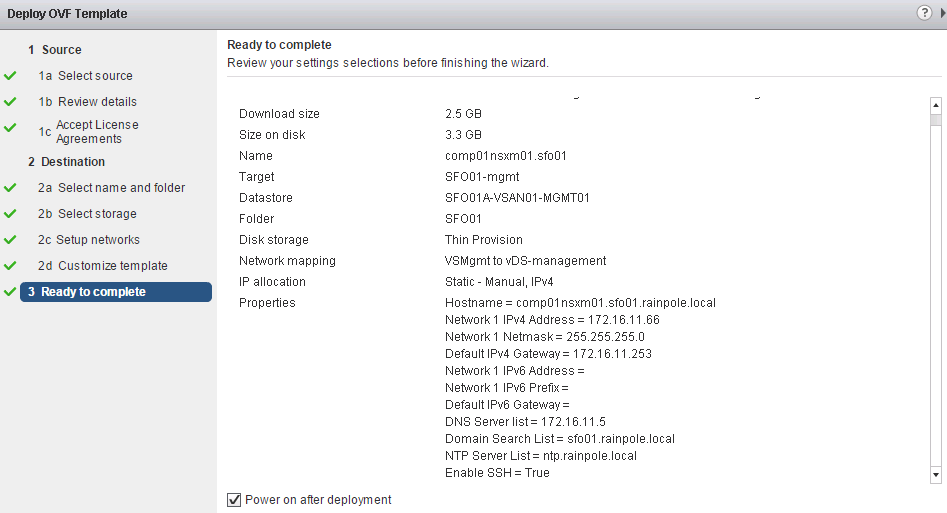

1.  Connect the NSX Manager to the Compute vCenter Server.

<!-- -->

1.  In a browser, go to **https://comp01nsxm01.sfo01.rainpole.local**.

2.  Use the following credentials to log in.

| Setting       | Value                    |
|---------------|--------------------------|
| **User name** | admin                    |
| **Password**  | compnsx\_admin\_password |

1.  Click **Manage vCenter Registration**.

2.  Under **Lookup Service**, click the **Edit** button.

3.  In the **Lookup Service** dialog box, enter the following settings, and click **OK**.

| Setting                         | Value                            |
|---------------------------------|----------------------------------|
| **Lookup Service IP**           | comp01psc01.sfo01.rainpole.local |
| **Lookup Service Port**         | 443                              |
| **SSO Administrator User Name** | administrator@vsphere.local      |
| **Password**                    | vcenter\_admin\_password         |

1.  In the **Trust Certificate?** dialog box, click **Yes**.

2.  Under **vCenter Server**, click the **Edit** button.

3.  In the **vCenter Server** dialog box, enter the following settings, and click **OK**.

| Setting               | Value                           |
|-----------------------|---------------------------------|
| **vCenter Server**    | comp01vc01.sfo01.rainpole.local |
| **vCenter User Name** | svc-nsxmanager@rainpole.local   |
| **Password**          | svc-nsxmanager\_password        |

1.  In the **Trust Certificate?** dialog box, click **Yes**.

2.  Wait until the **Status** indicators for the Lookup Service and vCenter Server change to **Connected**.

<!-- -->

1.  Log out from the Compute vCenter Server session in the vSphere Web Client.

    1.  ### Deploy the NSX Controllers for the Compute and Edge Clusters NSX Instance (Region A)

After the NSX Manager is successfully connected to the Compute vCenter Server, you must deploy the three NSX Controller nodes that form the NSX Controller cluster. It is important to deploy every node only after the previous one is successfully deployed.

**Procedure**

1.  Log in to the Compute vCenter Server by using the vSphere Web Client.

<!-- -->

1.  In a browser, go to **https://comp01vc01.sfo01.rainpole.local/vsphere-client**.

2.  Use the following credentials to log in.

| Setting       | Value                       |
|---------------|-----------------------------|
| **User name** | administrator@vsphere.local |
| **Password**  | vcenter\_admin\_password    |

1.  Configure an IP pool for the NSX Controller Cluster.

<!-- -->

1.  Under **Inventories**, click **Networking & Security**.

    

2.  In the **Navigator**, click **NSX Managers**.

3.  Under **NSX Managers**, click the **172.16.11.66** instance.

4.  Click the **Manage** tab, click **Grouping Objects**, click **IP Pools**, and click the **Add New IP Pool** icon.

5.  In the **Add Static IP Pool** dialog box, enter the following settings, and click **OK**.

| Setting            | Value                       |
|--------------------|-----------------------------|
| **Name**           | Edge01-NSXC01               |
| **Gateway**        | 172.16.31.1                 |
| **Prefix Length**  | 24                          |
| Primary DNS        | 172.16.11.5                 |
| **DNS Suffix**     | sfo01.rainpole.local        |
| **Static IP Pool** | 172.16.31.118-172.16.31.120 |

> 

1.  Deploy the NSX Controller cluster.

<!-- -->

1.  In the **Navigator**, click** Networking & Security** to go back, and click **Installation**.

2.  Under NSX Controller nodes, click the Add icon to deploy three NSX Controller nodes with the same configuration.

> 

1.  In the **Add Controller** page, enter the following settings and click **OK**.

<!-- -->

1.  You configure password only during the deployment of the first controller. The other controllers use the same password.

| Setting                   | Value                          |
|---------------------------|--------------------------------|
| **NSX Manager**           | 172.16.11.66                   |
| **Datacenter**            | SFO01                          |
| **Cluster/Resource Pool** | SFO01-Edge01                   |
| **Datastore**             | SFO01A-VSAN01-EDGE01           |
| **Connected To**          | vDS-Edge-Management            |
| **IP Pool**               | Edge01-NSXC01                  |
| **Password**              | compnsx\_controllers\_password |
| **Confirm Password**      | compnsx\_controllers\_password |

> 

1.  After the **Status** of the controller node changes to **Normal**, repeat the step and deploy the remaining two NSX Controller nodes, with the same configuration, that form the controller cluster.

> 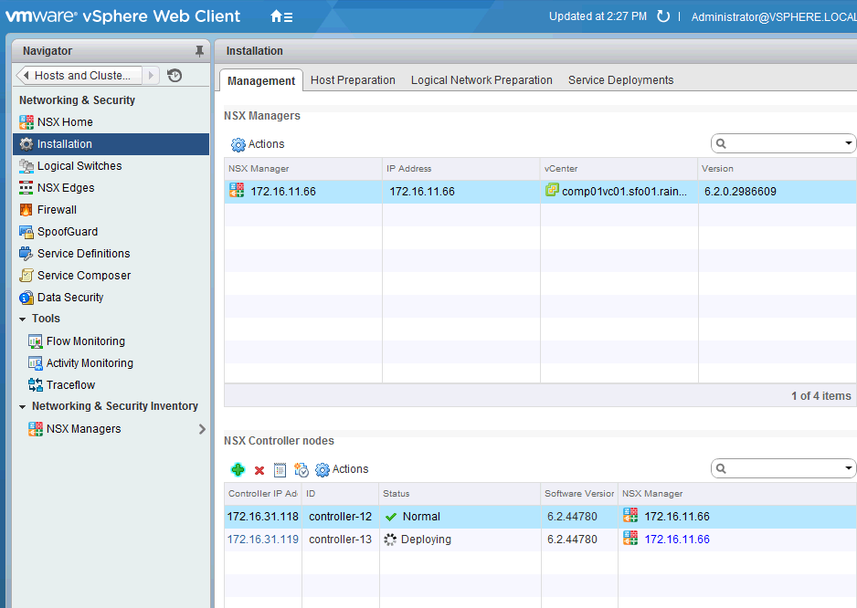

1.  Configure DRS affinity rules for the NSX Controllers.

<!-- -->

1.  Go back to the **Home** page.

2.  In the **Navigator**, click** Hosts and Clusters**, and expand the **comp01vc01.sfo01.rainpole.local** tree.

3.  Select the** SFO01-Edge01** cluster, and click the **Manage** tab.

4.  Under **Configuration**, click **VM/Host Rules**.

5.  Under **VM/Host Rules**, click **Add**.

6.  In the **SFO01-Edge01 - Create VM/Host Rule** dialog box, enter the following settings, and click **Add**.

| Setting         | Value                    |
|-----------------|--------------------------|
| **Name**        | Edge\_NSX\_Controllers   |
| **Enable rule** | Yes (select check box)   |
| **Type**        | Separate Virtual Machine |

1.  In the **Add Rule Member** dialog box, select the** three NSX Controller VMs**, and click **OK**.

2.  In the **SFO01-Edge01 - Create VM/Host Rule** dialog box, click **OK**. 

    1.  ### Prepare the ESXi Hosts in the Compute and Edge Clusters for NSX (Region A)

You must install the NSX kernel modules on the compute and edge clusters ESXi hosts to be able to use NSX.

Procedure

1.  Log in to the Compute vCenter Server by using the vSphere Web Client.

<!-- -->

1.  In a browser, go to **https://comp01vc01.sfo01.rainpole.local/vsphere-client**.

2.  Use the following credentials to log in.

| Setting       | Value                       |
|---------------|-----------------------------|
| **User name** | administrator@vsphere.local |
| **Password**  | vcenter\_admin\_password    |

1.  Install the NSX kernel modules on the compute and edge clusters ESXi hosts.

<!-- -->

1.  In the **Navigator**, click** Networking & Security**.

    

2.  In the **Navigator**, click **Installation**, and click the **Host Preparation **tab.

3.  Change the **NSX Manager** that you edit to **172.16.11.66**.

4.  Under** Installation Status**, click **Install** for both **SFO01-Edge01** and **SFO01-Comp01** clusters.

<!-- -->

1.  Verify that the **Installation Status** column shows the NSX version for all hosts in the cluster to confirm that NSX kernel modules are successfully installed.

> 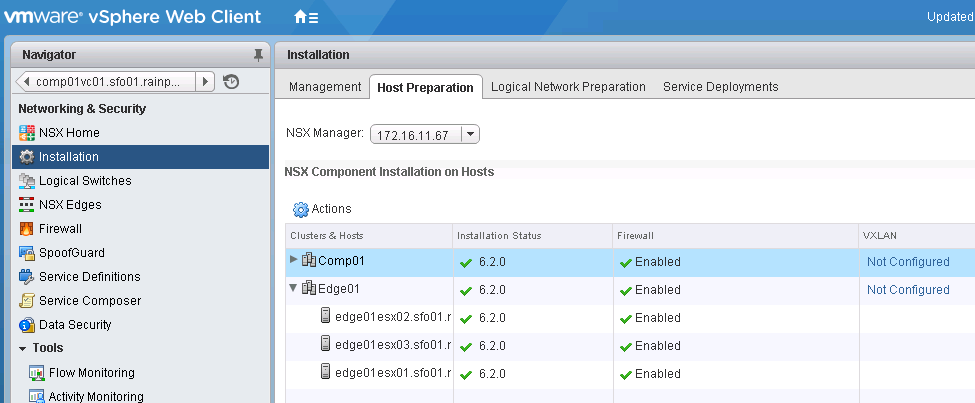

### Configure the NSX Logical Network for the Compute and Edge Clusters (Region A)

After all the deployment tasks are ready, you must configure the NSX logical network. Complete this process in three main steps:

-   Configure the Segment ID allocation.

-   Configure the VXLAN networking.

-   Configure the transport zone.

Procedure

1.  Log in to the Compute vCenter Server by using the vSphere Web Client.

<!-- -->

1.  In a browser, go to **https://comp01vc01.sfo01.rainpole.local/vsphere-client**.

2.  Use the following credentials to log in.

| Setting       | Value                       |
|---------------|-----------------------------|
| **User name** | administrator@vsphere.local |
| **Password**  | vcenter\_admin\_password    |

1.  Configure the Segment ID allocation.

<!-- -->

1.  In the **Navigator**, click** Networking & Security**.

2.  Click **Installation**, click **Logical Network Preparation**, and click **Segment ID**.

    

3.  Change the **NSX Manager** that you edit to **172.16.11.66**

4.  Click **Edit**, enter the following settings, and click **OK**.

| Setting                         | Value                   |
|---------------------------------|-------------------------|
| **Segment ID pool**             | 5000-9000               |
| **Enable Multicast addressing** | Yes (select check box)  |
| **Multicast addresses**         | 239.1.0.0-239.1.255.255 |

> 

1.  Configure the VXLAN networking.

<!-- -->

1.  Click the **Host Preparation** tab.

2.  Under VXLAN, click **Not Configured **on the SFO01-Comp01 row, enter the following settings, and click **OK**.

| Setting                   | Value         |
|---------------------------|---------------|
| **Switch**                | vDS-Comp      |
| **VLAN**                  | 1624          |
| **MTU**                   | 9000          |
| **VMKNic IP Addressing**  | Use DHCP      |
| **VMKNic Teaming Policy** | Enhanced LACP |
| **VTEP**                  | 1             |

1.  Under VXLAN, click **Not Configured **on the **SFO01-Edge01** row, enter the following settings, and click **OK**.

| Setting                   | Value         |
|---------------------------|---------------|
| **Switch**                | vDS-Edge      |
| **VLAN**                  | 1634          |
| **MTU**                   | 9000          |
| **VMKNic IP Addressing**  | Use DHCP      |
| **VMKNic Teaming Policy** | Enhanced LACP |
| **VTEP**                  | 1             |

1.  Configure the transport zone.

<!-- -->

1.  With **Installation** still selected in the **Navigator**, click the **Logical Network Preparation** tab, and click **Transport Zones**.

2.  Change the **NSX Manager** that you edit to **172.16.11.66**.

    

3.  Click the **Add New Transport zone** icon, enter the following settings, and click **OK**.

| Setting                                        | Value                      |
|------------------------------------------------|----------------------------|
| **Name**                                       | Comp Transport Zone        |
| **Replication mode**                           | Hybrid                     |
| **Select clusters part of the Transport Zone** | SFO01-Edge01, SFO01-Comp01 |

> 

###  (Optional) Test the Compute and Edge Clusters NSX Configuration (Region A)

Test the configuration of the NSX logical network.

Procedure

1.  Log in to the Management vCenter Server by using the vSphere Web Client.

<!-- -->

1.  In a browser, go to **https://comp01vc01.sfo01.rainpole.local/vsphere-client**.

2.  Use the following credentials to log in.

| Setting       | Value                       |
|---------------|-----------------------------|
| **User name** | administrator@vsphere.local |
| **Password**  | VMware1!                    |

1.  Create a logical switch to test the logical network.

<!-- -->

1.  In the **Navigator**, click** Networking & Security**.

2.  Click** Logical Switches**, change the **NSX Manager** that you edit to **172.16.11.66, **and click the** New Logical Switch **icon.

    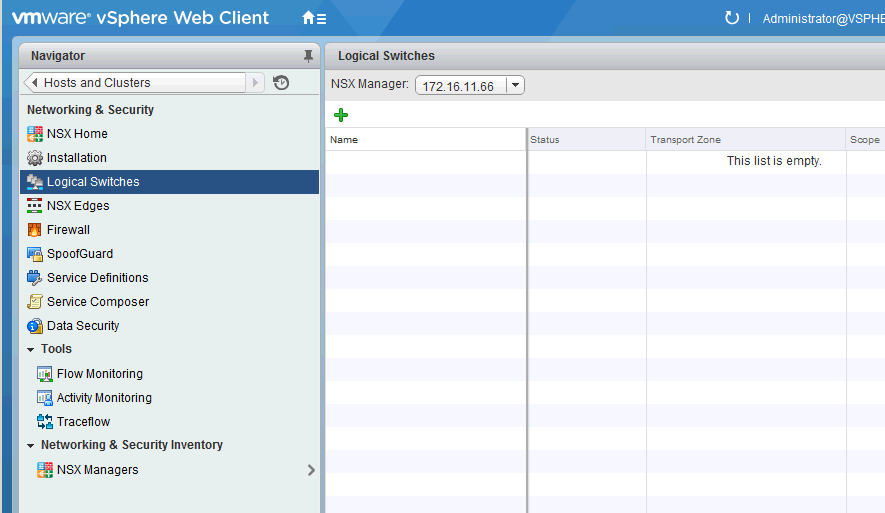

3.  In the **New Logical Switch** dialog box, enter the following settings, and click **OK**.

| Setting              | Value                 |
|----------------------|-----------------------|
| **Name**             | comp01-logical-switch |
| **Transport Zone**   | Comp Transport Zone   |
| **Replication mode** | Hybrid                |

> 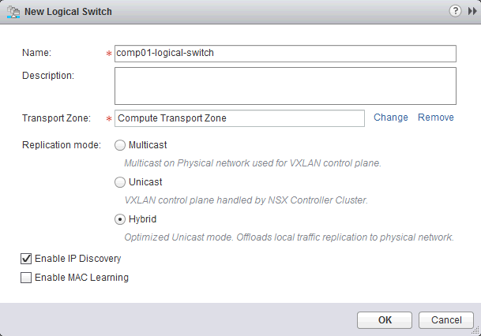

1.  Use the Ping Monitor to test connectivity.

<!-- -->

1.  Under** Logical Switches**, double-click **comp01-logical-switch**.

2.  Click the **Monitor** tab.

3.  Under **Test Parameters**, select **comp01esx04.sfo01.rainpole.local** as the **Source host**.

4.  Under **Test Parameters**, select **comp01esx01.sfo01.rainpole.local** as the **Destination host**, and click **Start Test**.

5.  Under **Results** there must be no error messages.

    
     

    1.  Deploy and Configure Gateways for the Management Application Networks (Region A)
        --------------------------------------------------------------------------------

-   Create VM and Template Folders (Region A)

-   Deploy Management Application Logical Switch (Region A)

-   Deploy NSX Edges for the Management Application Networks (Region A)

-   Configure NAT to Provide Public Access (Region A)

-   Configure OSPF Routing on the Management Application Edges (Region A)

-   Enable Route Distribution on the Management Application Edges (Region A)

    1.  ### Create VM and Template Folders (Region A)

Create folders to group objects of the same type for easier management.

Procedure

1.  Log in to the Management vCenter Server by using the vSphere Web Client.

<!-- -->

1.  In a browser, go to **https://mgmt01vc01.sfo01.rainpole.local/vsphere-client**.

2.  Use the following credentials to log in.

| Setting       | Value                       |
|---------------|-----------------------------|
| **User name** | administrator@vsphere.local |
| **Password**  | vcenter\_admin\_password    |

1.  Create folders for each of the management applications.

| Management Application                          | Folder Name |
|-------------------------------------------------|-------------|
| vRealize Automation + vRealize Orchestrator     | vRA01       |
| vRealize Automation (Proxy Agent)               | vRA01IAS    |
| vRealize Operations Manager                     | vROps01     |
| vRealize Operations Manager (Remote Collectors) | vROps01RC   |
| vRealize Log Insight                            | vRLI01      |

1.  In the **Navigator**, click **VMs and Templates**.

    

2.  Expand the **mgmt01vc01.sfo01.rainpole.local** tree.

3.  Right-click the **SFO01** data center, and select **New Folder** &gt; **New VM and Template Folder**.

> 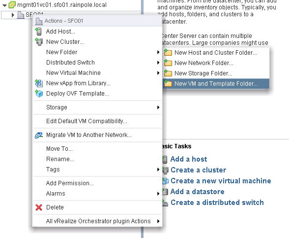

1.  In the **New Folder** dialog box, enter **vRA01** as name, and click **OK**.

> 

1.  Repeat the step to create the remaining folders.

    

    1.  ### Deploy Management Application Logical Switch (Region A)

Deploy logical switches that will host the management application networks. You deploy five different logical switches.
**
Procedure**

1.  Log in to the Management vCenter Server by using the vSphere Web Client.

<!-- -->

1.  In a browser, go to **https://mgmt01vc01.sfo01.rainpole.local/vsphere-client**.

2.  Use the following credentials to log in.

| Setting       | Value                       |
|---------------|-----------------------------|
| **User name** | administrator@vsphere.local |
| **Password**  | vcenter\_admin\_password    |

1.  Create logical switches by using the same settings; only change the names as described in the table.

| Management Application                          | Logical Switch Name |
|-------------------------------------------------|---------------------|
| vRealize Automation + vRealize Orchestrator     | vRA01-VXLAN         |
| vRealize Automation (Proxy Agents)              | vRA01IAS-VXLAN      |
| vRealize Operations Manager                     | vROps01-VXLAN       |
| vRealize Operations Manager (Remote Collectors) | vROps01RC-VXLAN     |
| vRealize Log Insight                            | vRLI01-VXLAN        |

1.  In the **Navigator**, click **Networking & Security**, and** **click **Logical Switches**.

2.  From the **NSX Manager** drop-down menu, select **172.16.11.65**.

3.  Click the **New Logical Switch** icon to create a new logical switch.

4.  In the **New Logical Switch **dialog box, enter the following settings, and click **OK**. 

| Setting                 | Value                                     |
|-------------------------|-------------------------------------------|
| **Name**                | vRA01-VXLAN                               |
| **Description**         | Router network for management application |
| **Transport Zone**      | Mgmt Transport Zone                       |
| **Replication mode**    | Hybrid                                    |
| **Enable IP Discovery** | Checked                                   |
| **Enable MAC Learning** | Unchecked                                 |

>  

1.  Repeat the previous step to create the remaining logical switches.

    1.  ### Deploy NSX Edges for the Management Application Networks (Region A)

You must deploy and configure NSX Edges for the management application networks by following the same procedure.

The following procedure provides detailed guidance only for one of the NSX Edges that must be deployed. You must repeat the procedure and use the values from the tables to configure the remaining NSX Edges.

The following two tables show the specific values that you must use during the deployment process. If a value is not described in the tables, use the value as instructed in the procedure.

Table . **Management Application Network Edges Configuration**

| Management Application      | NSX Edge Name  | Folder Name | Internal        

                                                              Logical Switch   | Public           

                                                                                IP Address        | Network Exchange 

                                                                                                   IP Address         | Internal        

                                                                                                                       IP Address       | Edge HA Heartbeat 

                                                                                                                                         IP Addresses        |
|-----------------------------|----------------|-------------|-----------------|------------------|-------------------|-----------------|--------------------|
| vRealize Automation and     

 vRealize Orchestrator        | vRA01-Edge     | vRA01       | vRA01-VXLAN     | 10.158.130.13/24 | 192.168.0.11/24   | 192.168.11.1/24 | 10.10.11.1/30      

                                                                                                                                         10.10.11.2/30       |
| vRealize Automation         

 (vSphere Proxy Agents)       | vRA01IAS-Edge  | vRA01IAS    | vRA01IAS-VXLAN  | N/A              | 192.168.0.12/24   | 192.168.12.1/24 | 10.10.12.1/30      

                                                                                                                                         10.10.12.2/30       |
| vRealize Operations Manager | vROps01-Edge   | vROps01     | vROps01-VXLAN   | 10.158.130.14/24 | 192.168.0.21/24   | 192.168.21.1/24 | 10.10.21.1/30      

                                                                                                                                         10.10.21.2/30       |
| vRealize Operations Manager

 (Remote Collectors)          | vROps01RC-Edge | vROps01RC   | vROps01RC-VXLAN | N/A              | 192.168.0.22/24   | 192.168.22.1/24 | 10.10.22.1/30      

                                                                                                                                         10.10.22.2/30       |
| vRealize Log Insight        | vRLI01-Edge    | vRLI01      | vRLI01-VXLAN    | 10.158.130.15/24 | 192.168.0.31/24   | 192.168.31.1/24 | 10.10.31.1/30      

                                                                                                                                         10.10.31.2/30       |

| Interface Name  |     | Uplink Type | Connected To            | Port Type             | Connectivity Status | MTU  |
|-----------------|-----|-------------|-------------------------|-----------------------|---------------------|------|
| Public          |     | Uplink      | vDS-Mgmt-Ext-Management | Distributed Portgroup | Connected           | 1500 |
| networkExchange |     | Uplink      | networkExchange-VXLAN   | Logical Switch        | Connected           | 9000 |
| Internal        |     | Internal    | Application-VXLAN       | Logical Switch        | Connected           | 9000 |

Procedure

1.  Log in to the Management vCenter Server by using the vSphere Web Client.

<!-- -->

1.  In a browser, go to **https://mgmt01vc01.sfo01.rainpole.local/vsphere-client**.

2.  Use the following credentials to log in.

| Setting       | Value                       |
|---------------|-----------------------------|
| **User name** | administrator@vsphere.local |
| **Password**  | vcenter\_admin\_password    |

1.  Start the **New NSX Edge** wizard to deploy the NSX Edge that interconnects the management networks in the SDDC.

<!-- -->

1.  In the **Navigator**, click **Networking & Security**, and** **click **NSX Edges**.

2.  From the** NSX Manager** drop-down menu, select **172.16.11.65**.

3.  Click the **Add** icon to deploy a new NSX Edge.

<!-- -->

1.  On the **Name and description** page, enter the following settings, and click **Next**.

| Setting                      | Value                        |
|------------------------------|------------------------------|
| **Install Type**             | Edge Service Gateway         |
| **Name**                     | vRA01-Edge                   |
| **Hostname**                 | vRA01-Edge                   |
| **Description**              | SFO01 Edge Services Gateway  |
| **Deploy NSX Edge**          | Selected                     |
| **Enable High Availability** | Selected                     |

> 

1.   On the **Settings **page, enter the following settings, and click **Next**.

| Setting                         | Value                       |
|---------------------------------|-----------------------------|
| **User Name**                   | admin                       |
| **Password**                    | mgmt\_edge\_admin\_password |
| **Enable SSH access**           | Selected                    |
| **Enable auto rule generation** | Selected                    |
| **Edge Control Level logging**  | INFO                        |

 

> 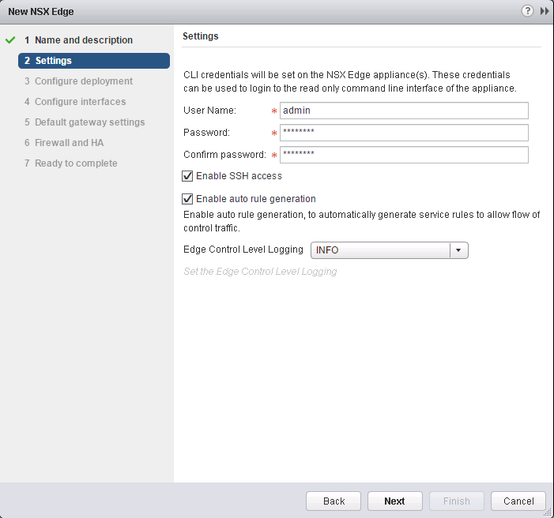

1.  On the **Configure deployment** page, configure the size and storage for the NSX Edge appliance.

<!-- -->

1.  On the **Configure deployment** page, enter the following settings, and click the **Add** icon.

| Setting            | Value |
|--------------------|-------|
| **Datacenter**     | SFO01 |
| **Appliance Size** | Large |

1.  In the **Add NSX Edge Appliance** dialog box, enter the following settings, and click **OK**.

| Setting                   | Value                |
|---------------------------|----------------------|
| **Cluster/Resource Pool** | SFO01-Mgmt01         |
| **Datastore**             | SFO01A-VSAN01-MGMT01 |
| **Folder**                | vRA01                |

> 

1.  On the **Configure deployment** page, click the **Add** icon to configure another appliance identical to the previous one, and click **Next**.

> 

1.  On the **Configure Interfaces** page, click the **Add** icon to configure a new interface.

<!-- -->

1.  The first interface configured is for access to the public network. Do not configure this interface for the vRealize Automation (vSphere Proxy Agents) and vRealize Operations Manager (Remote Collectors) edges.

<!-- -->

1.  In the **Add NSX Edge Interface** dialog box, enter the following settings.

| Setting                 | Value                                           |
|-------------------------|-------------------------------------------------|
| **Name**                | Public                                          |
| **Type**                | Uplink                                          |
| **Connected To **       | (Distributed Portgroup) vDS-Mgmt-Ext-Management |
| **Connectivity Status** | Connected                                       |
| **MTU**                 | 1500                                            |

> 

1.  Click the **Add** icon to configure the IP address for the current interface, enter the following settings, and click **OK**.

| Setting                  | Value         |
|--------------------------|---------------|
| **Primary IP Address**   | 10.158.130.13 |
| **Subnet Prefix Length** | 24            |

> 

1.  Configure two more interfaces with the following settings, and click **Next**.

| Name            | Type     | Connected To                           | Connectivity Status | Primary Address | Subnet Prefix Length | MTU  |
|-----------------|----------|----------------------------------------|---------------------|-----------------|----------------------|------|
| networkExchange | Uplink   | (Logical Switch) networkExchange-VXLAN | Connected           | 192.168.0.11    | 24                   | 9000 |
| Internal        | Internal | (Logical Switch) vRA01-VXLAN           | Connected           | 192.168.11.1    | 24                   | 9000 |

> 

1.  On the **Default gateway settings** page, enter the following settings, and click **Next**.

<!-- -->

1.  Configure the Default Gateway only on Edge gateways that have a Public interface. For Edge gateways that have no Public interface configured, leave the Configure Default Gateway check box deselected, and proceed with the deployment.

| Setting                       | Value          |
|-------------------------------|----------------|
| **Configure Default Gateway** | Selected       |
| **vNIC**                      | Public         |
| **Gateway IP**                | 10.158.130.253 |
| **MTU**                       | 1500           |

> 

1.  On the **Firewall and HA** page, enter the following settings, and click **Next**.

| Setting                               | Value         |
|---------------------------------------|---------------|
| **Configure Firewall default policy** | Selected      |
| **Default Traffic Policy**            | Accept        |
| **Logging**                           | Enable        |
| **vNIC**                              | Internal      |
| **Declare Dead Time**                 | 15            |
| **Management IPs**                    | 10.10.11.1/30
                                         10.10.11.2/30  |

> 

1.  On the **Ready to complete** page, review your entries, and click **Finish**. 

<!-- -->

1.  Repeat the procedure to deploy the remaining Management Application Network Edges.

> 

**
**

### Configure NAT to Provide Public Access (Region A)

For each of the management application edges that have a public interface, you must configure a Source NAT rule to provide masqueraded access to that interface.

**Procedure**

1.  Log in to the Management vCenter Server by using the vSphere Web Client.

<!-- -->

1.  In a browser, go to **https://mgmt01vc01.sfo01.rainpole.local/vsphere-client**.

2.  Use the following credentials to log in.

| Setting       | Value                       |
|---------------|-----------------------------|
| **User name** | administrator@vsphere.local |
| **Password**  | vcenter\_admin\_password    |

1.  Create Source NAT (SNAT) rules to enable VMware solutions to access the public network from the management network by using the values in the table.

| Management Application Edge | Management Application Network and Mask | Public Address |
|-----------------------------|-----------------------------------------|----------------|
| vRA01-Edge                  | 192.168.11.0/24                         | 10.158.130.13  |
| vROps01-Edge                | 192.168.21.0/24                         | 10.158.130.14  |
| vRLI01-Edge                 | 192.168.31.0/24                         | 10.158.130.15  |

1.  In the **Navigator**, click **Networking & Security**, and** **click **NSX Edges**.

2.  From the** NSX Manager** drop-down menu, select **172.16.11.65**.

3.  Double-click the **vRA01-Edge** to edit its settings.

4.  Click the **Manage** tab, and click **NAT**.

5.  Click the **Add** &gt; **Add SNAT Rule** icon to create new Source NAT rule.

> 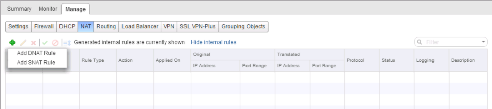
>  

1.  In the **Add SNAT Rule** dialog box, enter the following settings, and click **OK**.

| Setting                        | Value                                                    |
|--------------------------------|----------------------------------------------------------|
| **Applied On**                 | Public                                                   |
| **Original Source IP/Range**   | 192.168.11.0/24                                          |
| **Translated Source IP/Range** | 10.158.130.13                                            |
| **Description**                | Provide Public network access to Management Applications |
| **Enabled**                    | Selected                                                 |
| **Enable logging**             | Deselected                                               |

> 

1.  Under **NAT**, click **Publish Changes**, for the new SNAT rule changes to take effect.

> 
>  

1.  Repeat the previous step to add SNAT rules for the remaining management application edges.
     

    1.  ### Configure OSPF Routing on the Management Application Edges (Region A)

Configure OSPF routing on all the management application edges.

**Procedure**

1.  Log in to Management vCenter Server by using the vSphere Web Client.

<!-- -->

1.  In a browser, go to **https://mgmt01vc01.sfo01.rainpole.local/vsphere-client**.

2.  Use the following credentials to log in.

| Setting       | Value                       |
|---------------|-----------------------------|
| **User name** | administrator@vsphere.local |
| **Password**  | vcenter\_admin\_password    |

1.  Enable and configure OSPF routing.

<!-- -->

1.  In the **Navigator**, click **Networking & Security**, and** **click **NSX Edges**.

2.  From the** NSX Manager** drop-down menu, select **172.16.11.65**, and double-click the **vRA01-Edge **device to edit its settings.

3.  Click the **Manage** tab, click **Routing**, click **Global Configuration **and under **Dynamic Routing Configuration**, click **Edit**.

> 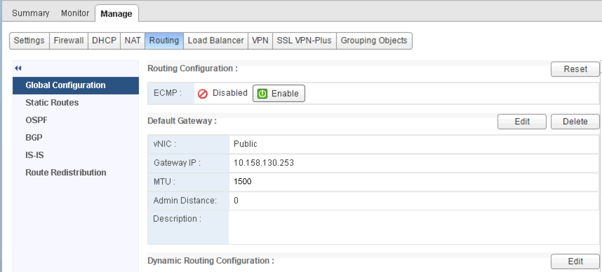
>  

1.  In the **Edit Dynamic Routing Configuration** dialog box, enter the following settings, and click **OK**.

| Setting            | Value           |
|--------------------|-----------------|
| **Router ID**      | networkExchange |
| **Enable Logging** | Selected        |
| **Log Level**      | Info            |

> 

1.  Click **Publish Changes**.

2.  Under **Routing**, click **OSPF** to configure and enable OSPF.

3.  Under **Area Definitions**, click the **New Area Definition **icon.

4.  In the **New Area Definition** dialog box, enter the following settings, and click **OK**.

| Setting            | Value            |
|--------------------|------------------|
| **Area ID**        | 16               |
| **Type**           | Normal           |
| **Authentication** | MD5              |
| **Value**          | area16\_password |

> 

1.  Under **Area to Interface Mapping**, click the **New Area to Interface Mapping** icon.

2.  In the **New Area to Interface Mapping **dialog box, enter the following settings, and click **OK**.

| Setting                          | Value           |
|----------------------------------|-----------------|
| **vNIC**                         | networkExchange |
| **Area**                         | 16              |
| **Ignore Interface MTU setting** | Deselected      |
| **Hello Interval**               | 10              |
| **Dead Interval **               | 40              |
| **Priority**                     | 128             |
| **Cost**                         | 1               |

> 

1.  Under **OSPF Configuration**, click **Edit** to enable OSPF.

2.  In the **OSPF Configuration** dialog box, select the following settings, and click **OK**.

| Setting                      | Value      |
|------------------------------|------------|
| **Enable OSPF**              | Selected   |
| **Enable Graceful Restart**  | Selected   |
| **Enable Default Originate** | Deselected |

> 

1.  Click **Publish Changes**.

> 
>  

1.  Repeat the previous step to enable dynamic routing on the remaining management application edges.

| Management Application Edge |
|-----------------------------|
| vRA01IAS-Edge               |
| vRLI01-Edge                 |
| vROps01-Edge                |
| vROps01RC-Edge              |

### Enable Route Distribution on the Management Application Edges (Region A)

Enable route distribution on the edge gateways to share their connected networks with the peer gateways. Enable connected interface information injection into the OSPF route updates that are sent out to the peer gateways.

1.  Log in to the Management vCenter Server by using the vSphere Web Client.

<!-- -->

1.  In a browser, go to **https://mgmt01vc01.sfo01.rainpole.local/vsphere-client**.

2.  Use the following credentials to log in.

| Setting       | Value                       |
|---------------|-----------------------------|
| **User name** | administrator@vsphere.local |
| **Password**  | vcenter\_admin\_password    |

1.  Configure and enable route redistribution.

<!-- -->

1.  In the **Navigator**, click **Networking & Security**, and** **click **NSX Edges**.

2.  From the** NSX Manager** drop-down menu, select **172.16.11.65**, and double-click the **vRA01-Edge **device to edit its settings.

3.  Click the **Manage** tab, click **Routing**, and click **Route Redistribution**.

4.  Under **IP Prefixes**, click the **Add** icon.

5.  In the **New IP Prefix** dialog box, enter the following settings, and click **OK**.

| Setting    | Value           |
|------------|-----------------|
| Name       | Public          |
| IP/Network | 10.158.130.0/24 |

1.  Under **Route Redistribution table**, click the **Add** icon.

2.  In the **New Redistribution criteria** dialog box, select the following settings, and click **OK**.

| Setting              | Value      |
|----------------------|------------|
| **Prefix Name**      | Public     |
| **Learner Protocol** | OSPF       |
| **ISIS**             | Deselected |
| **BGP**              | Deselected |
| **Static routes**    | Deselected |
| **Connected**        | Selected   |
| **Action**           | Deny       |

> 

1.  Under **Route Redistribution table**, click the **Add** icon.

2.  In the **New Redistribution criteria** dialog box, select the following settings, and click **OK**.

| Setting              | Value      |
|----------------------|------------|
| **Prefix Name**      | Any        |
| **Learner Protocol** | OSPF       |
| **ISIS**             | Deselected |
| **BGP**              | Deselected |
| **Static routes**    | Deselected |
| **Connected**        | Selected   |
| **Action**           | Permit     |

> 

1.  Under **Route Redistribution Status**, click **Edit**.

2.  In the **Change redistribution settings** dialog box, select **OSPF**, and click **OK**.

> 

1.  Click **Publish Changes**.

> 

1.  Repeat the previous step for the remaining management application edges.

| Management Application Edge |
|-----------------------------|
| vRA01IAS-Edge               |
| vRLI01-Edge                 |
| vROps01-Edge                |
| vROps01RC-Edge              |

Replace Certificates (Region A)
-------------------------------

By default vSphere 6.0 components use TLS/SSL certificates that are signed by VMware Certificate Authority (VMCA). These certificates are not trusted by end-user devices. That might mean, for example, that a certificate warning results when a user connects to a vCenter Server system with the vSphere Web Client. 

Infrastructure administrators connect to different vSphere components, such as vCenter Server systems or a Platform Services Controller from a web browser to perform configuration, management and troubleshooting. The authenticity of the network node to which the administrator connects must be confirmed with a valid TLS/SSL certificate.

In this design, we replace user-facing certificates with certificates that are signed by a custom Microsoft Certificate Authority (CA). We do not replace certificates for machine-to-machine communication; if necessary, we can manually trust those certificates. 

The Certificate replacement has to happen for the following VMware products. 

-   Platform Services Controller (both management pod and compute pod)

-   vCenter Server system (both management pod and compute pod)

-   VMware NSX Manager (both management pod and compute pod)

    1.  ### Replacement Tasks Order

First, set up your Microsoft CA, create a custom template, and add the custom templates to the set of available templates. You do this only once. 

Next replace certificates, as follows:

1.  Management Platform Services Controller

2.  Management vCenter Server system

3.  Management NSX Manager

4.  Compute Platform Services Controller

5.  Compute vCenter Server system

6.  Compute NSX Manager

 

### Create and Add a Microsoft Certificate Authority Template

As part of the certificate replacement process, you will submit CSRs to a Microsoft CA server. You can then replace the VMCA-signed or self-signed certificates with CA-signed certificates. 

This VMware Validated Design uses a Microsoft Certificate Authority server. 

-   The first step is setting up a Microsoft Certificate Authority template through an RDP session. 

-   After you've created the new template, you have to add it to the certificate templates that your Microsoft Certificate Authority knows about. 

Prerequisite

This VMware Validated Design sets up the CA on the AD-CA server **dc01rpl.rainpole.local**, which is running Microsoft Windows Server 2012 R2 and is the Active Directory Server. 

-   Verify that you installed Microsoft Server 2012 R2 with Active Directory Services.

-   Verify that your AD Server is installed and configured with the Certificate Authority Service role and the Certificate Authority Web Enrolment role.

If a different Microsoft CA already exists in your environment, you can use that CA instead. 

Procedure

1.  Use RDP to connect to the CA server dc01rpl.rainpole.local as the AD administrator with the ***ad\_admin\_password*** password.

2.  Click **Start &gt; Run**, type **certtmpl.msc**, and click **OK**. 

3.  In the **Certificate Template Console**, under **Template Display Name**, right-click **Web Server** and click **Duplicate Template**.

4.  In the **Duplicate Template** window, leave **Windows Server 2003 Enterprise** selected for backward compatibility and click **OK**. 

5.  In the **Properties of New Template** dialog, click the **General **tab.

6.  In the **Template display name** text box, enter **VMware** as the name of the new template.

7.  Click the **Extensions** tab and specify extensions information:

<!-- -->

1.  Select **Application Policies** and click **Edit**.

2.  Select **Server Authentication, **click **Remove**, and click **OK**.

3.  Select **Key Usage** and click **Edit**.

4.  Click the **Signature is proof of origin (nonrepudiation)** check box.

5.  Leave the default for all other options.

6.  Click **OK**.

<!-- -->

1.  Click the **Subject Name **tab, ensure that the **Supply in the request** option is selected, and click **OK **to save the template.

2.  To add the new template to your CA, click **Start &gt; Run**, type **certsrv.msc**, and click **OK**.

3.  In the **Certification Authority** window, expand the left pane if it is collapsed. 

4.  Right-click **Certificate Templates** and select **New** &gt; **Certificate Template to Issue**.

5.  In the **Enable Certificate Templates** dialog, in the **Name** column, select the **VMware** certificate that you just created and click **OK**.

    1.  ### Obtain Custom Certificates

For each certificate that you want to replace, you need a certificate file that is signed by the CA that you set up earlier.

You perform these tasks, in sequence:

1.  Generate a CSR for the certificate that you want to replace. You generate the CSR on the machine where the certificate lives. For vCenter Server and Platform Services Controller certificate replacement, you use the vSphere Certificate Manager utility.

2.  Submit the certificate request to your AD-CA server for signing and export the signed certificate.

3.  Copy the certificate and the associated root certificate to the machine where you want to replace the certificate.

4.  Replace the existing certificates with the new certificates.

For additional details, see [VMware Knowledge Base article 2112014](http://kb.vmware.com/kb/2112014).

This example illustrates how you generate the signed certificate for the mgmt01psc01.sfo01.rainpole.local Platform Services Controller instance. 

**Procedure**

1.  Submit and download the certificate, as follows: 

<!-- -->

1.  Log in to the Windows host that has access to the AD-CA server as an administrator.

2.  Open a Web Browser and connect to http://dc01rpl.rainpole.local/CertSrv/, the Web interface of the CA server. If prompted, supply the credentials of the AD administrator (*ad\_admin\_password*).

3.  Click the **Request a certificate** link.

4.  Click **advanced certificate request**.

5.  Click Submit a certificate request by using a base-64-encoded CMC or PKCS \#10 file, or submit a renewal request by using a base-64-encoded PKCS \#7 file.

6.  Open the CSR file, in this example, mgmt01psc01.sfo01\_ssl.csr, in a plain text editor.

7.  Copy everything from -----BEGIN CERTIFICATE REQUEST----- to -----END CERTIFICATE REQUEST----- into the **Saved Request** box. 

8.  On the **Submit a Certificate Request or Renewal Request** page, paste the contents of the CSR file into the **Saved Request** box.

9.  From the **Certificate Template** drop down, select **VMware** and click **Submit**.

>  

1.  On the **Certificate issued** screen, click **Base 64 encoded**.

2.  Click the **Download Certificate chain** link and save the certificate chain file certnew.p7b in the Downloads folder.

<!-- -->

1.  Export the certificate to the correct format, as follows:

<!-- -->

1.  Double-click the **certnew.p7b** file to open it in the Microsoft Certificate Manager. 

2.  Navigate to certnew.p7b **&gt; Certificates** and notice the two certificates. 

3.  Right-click the certificate and select **All Tasks &gt; Export.**

4.  In the **Certificate Export Wizard**, click **Next.**

5.  Select **Base-64 encoded X.509 (.CER)**, and click **Next**.

6.  Browse to **C:\\certs** and specify the certificate name, for example mgmt01psc01.sfo01 in the **File name** field. 

7.  Click **Next** and click **Finish**.

<!-- -->

1.  Export the root certificate file in the correct format, as follows:

<!-- -->

1.  Right-click the root certificate and select **All Tasks &gt; Export.**

2.  In the **Certificate Export Wizard**, click **Next.**

3.  Select **Base-64 encoded X.509 (.CER),** and click Next**.**

4.  Browse to **C:\\certs** and specify Root64 in the **File name** field. 

5.  Click **Next**, and click** Finish.**

    1.  ### Replace the Platform Services Controller Certificate

The first step is replacing the machine SSL certificate on each Platform Services Controller instance with a custom certificate. For details on performing this tasks, see [Replace the Machine SSL Certificate with Custom Certificates](http://pubs.vmware.com/vsphere-60/topic/com.vmware.vsphere.security.doc/GUID-41B3B37E-5C48-4333-BA3F-5A00B3BBCC76.html) in the *vSphere Security* documentation, or [VMware Knowledge Base article 2112277](http://kb.vmware.com/kb/2112277). 

This sequence of step-by-step instructions explains how to replace the certificate for a Platform Services Controller instance. You perform this task twice. The steps use  mgmt01psc01.sfo01.rainpole.local as an example in a few places. 

| PSC Name                         | CSR file name              | Certificate Name      | Replacement Time                       |
|----------------------------------|----------------------------|-----------------------|----------------------------------------|
| mgmt01psc01.sfo01.rainpole.local | mgmt01psc01.sfo01\_ssl.csr | mgmt01psc01.sfo01.cer | First replacement task.                |
| comp01psc01.sfo01.rainpole.local | comp01psc01.sfo01\_ssl.csr | comp01psc01.sfo01.cer | After mgmt01psc01.sfo01.rainpole.local |

**Procedure**

1.  Log in to a Windows host that has access to both the AD-CA server and the Platform Services Controller as an administrator.

2.  Generate the CSR using VMware Certificate Manager utility.  

<!-- -->

1.  Login to the Platform Services Controller via SSH or Console.

| Host                           | User | Password                  |
|--------------------------------|------|---------------------------|
| mgmt01psc01.sfo01.rainpole.com | root | *mgmtpsc\_root\_password* |
| comp01psc01.sfo01.rainpole.com | root | *comppsc\_root\_password* |

1.  Go to the Bash shell by running these commands: 

> shell.set --enabled True
>
> shell
>
> chsh -s /bin/bash root

1.  Launch the vSphere 6.0 Certificate Manager utility:

> /usr/lib/vmware-vmca/bin/certificate-manager

1.  Select **Option 1 (Replace Machine SSL certificate with Custom Certificate).**

2.  Provide the administrator@vsphere.local password when prompted. 

3.  Select **Option 1 (Generate Certificate Signing Request(s) and Key(s) for Machine SSL certificate).**

4.  Provide a directory (e.g. /tmp/ssl) to save the certificate signing request and private key to.
    The files created have the names machine\_ssl.csr and machine\_ssl.key.

5.  To avoid confusion later, rename the files to use the machine name, for example mgmt01psc01.sfo01\_ssl.csr and mgmt01psc01.sfo01\_ssl.key for the mgmt01psc01.sfo01.rainpole.com host.

6.  Using a Web browser, connect to http://dc01rpl.rainpole.local/CertSrv/, the Web interface of the AD-CA server and follow the steps in the "Obtain Custom Certificates" section to enroll the certificate for this Platform Services Controller with the AD-CA server.
    If prompted, log in as the AD administrator with the *ad\_admin\_password* password.

7.  Save the two files on the Platform Services Controller in the /tmp/ssl directory.

| Host                           | Files                                        |
|--------------------------------|----------------------------------------------|
| mgmt01psc01.sfo01.rainpole.com | mgmt01psc01.sfo01.cer  (signed certificate) 

                                  Root64.cer file (root certificate)            |
| comp01psc01.sfo01.rainpole.com | comp01psc01.sfo01.cer  (signed certificate) 

                                  Root64.cer file (root certificate)            |

1.  Start the vSphere Certificate Manager utility again on the Platform Services Controller, select **Option 1**, and select **Option 2** **(Import custom certificate(s) and key(s) to replace existing Machine SSL certificate).**

2.  When prompted, provide the full path to the signed certificate file, the issuing CA certificate file, and the key file that was generated by Certificate Manager earlier.
    For example for mgmt01psc01.sfo01.rainpole.com:

> Please provide valid custom certificate for Machine SSL.
> File : **/tmp/ssl/mgmt01psc01.sfo01.cer**
> Please provide valid custom key for Machine SSL.
> File : **/tmp/ssl/mgmt01psc01.sfo01\_ssl.key**
> Please provide the signing certificate of the Machine SSL certificate
> File : **/tmp/ssl/Root64.cer **

1.  Answer **Yes (Y)** to the confirmation request. 

2.  When **Status** shows **100% Completed**, you have to restart all services in each vCenter Server that is managed by this Platform Services Controller

<!-- -->

1.  Connect to the vCenter Server instance 

2.  Run the following commands:

> service-control --stop –all
>
> service-control --start –all

1.  As a final step, you have to update the lookup service on the Platform Services Controller to include the new certificate information. If you don't, external solutions such as VMware NSX will later have problems connecting to vCenter Server. See [VMware Knowledge Base Article 2121701](http://kb.vmware.com/kb/2121701) for details - this procedure gives only the overview of the process. 

<!-- -->

1.  Log in to the Platform Services Controller appliance shell.

| Host                           | User | Password                  |
|--------------------------------|------|---------------------------|
| mgmt01psc01.sfo01.rainpole.com | root | *mgmtpsc\_root\_password* |
| comp01psc01.sfo01.rainpole.com | root | comppsc\_root\_password   |

1.  Retrieve the old certificate from the backup store and extract the thumbprint.

<!-- -->

1.  If you performed more than one certificate replacement, extract the certificate from the Managed Object Browser instead. 

    1.  Output the certificate:
        /usr/lib/vmware-vmafd/bin/vecs-cli entry getcert --store BACKUP\_STORE --alias bkp\_\_\_MACHINE\_CERT --output /old.crt

    2.  Extract the thumbprint from the certificate:
        openssl x509 -in /old.cet -noout -sha1 -fingerprint
         
        The output look similar to the following: SHA1 Fingerprint=5A:E6:C4:12:2B:E7:B0:28:42:57:58:01:27:FE:8A:74:59:00:B4:90

> Run the ls\_update\_certs.py script with the following inputs:

--fingerprint –  Thumbprint of the old certificate, which you retrieved in the previous step.
--certfile – The new certificate file. 

/usr/lib/vmidentity/tools/scripts/ls\_update\_certs.py --url **https://mgmt01psc01.sfo01.rainpole.local/lookupservice/sdk** --fingerprint 5A:E6:C4:12:2B:E7:B0:28:42:57:58:01:27:FE:8A:74:59:00:B4:90 --certfile /tmp/ssl/mgmt01psc01.sfo01.cer --user **administrator@vsphere.local** --password *sso\_admin\_pwd*

The result of this command would look like the following example:

2015-08-18 16:39:46,942 INFO com.vmware.vim.vmomi.core.types.impl.VmodlContextImpl$NonValidatingClassPathXmlApplicationContext - Closing com.vmware.vim.vmomi.core.types.impl.VmodlContextImpl$NonValidatingClassPathXmlApplicationContext@3f9b12fb: startup date \[Tue Aug 18 16:39:46 UTC 2015\]; root of context hierarchy
2015-08-18 16:39:47,725 WARN com.vmware.vim.vmomi.client.http.impl.HttpConfigurationCompilerBase$ConnectionMonitorThreadBase - Shutting down the connection monitor.
Don't update service b7b1bf2c-49e9-4fff-945e-d730645a7235
Updated 9 service(s)

### Replace the vCenter Server Machine SSL Certificates

After you replace the Platform Services Controller certificate, you replace the vCenter Server machine SSL certificate. For details on performing this tasks, see [Replace the Machine SSL Certificate with Custom Certificates](http://pubs.vmware.com/vsphere-60/topic/com.vmware.vsphere.security.doc/GUID-41B3B37E-5C48-4333-BA3F-5A00B3BBCC76.html) in the vSphere Security documentation, or[* VMware Knowledge Base article 2112277*](http://kb.vmware.com/kb/2112277) .

This sequence of step-by-step instructions explains how to replace the certificate for a vCenter Server systems. Follow the steps twice, once for each vCenter Server system. The steps use  mgmt01vc01.sfo01.rainpole.local as an example in a few places.

The following table gives an overview. 

| PSC Name                        | CSR file name             | Certificate Name     | Replacement Time                                  |
|---------------------------------|---------------------------|----------------------|---------------------------------------------------|
| mgmt01vc01.sfo01.rainpole.local | mgmt01vc01.sfo01\_ssl.csr | mgmt01vc01.sfo01.cer | After replacing both PSC instances in SFO region. |
| comp01vc01.sfo01.rainpole.local | comp01vc01.sfo01\_ssl.csr | comp01vc01.sfo01.cer | After mgmt01vc01.sfo01.rainpole.local             |

Procedure

1.  Log in to a Windows host that has access to both the AD-CA server and the vCenter Server systems as an administrator.

2.  Generate the CSR for the vCenter Server instance using the VMware Certificate Manager utility. 

<!-- -->

1.  Connect to the** **vCenter Server instance via SSH or Console.  

| Host                            | Username | Password                 |
|---------------------------------|----------|--------------------------|
| mgmt01vc01.sfo01.rainpole.local | root     | *mgmtvc\_root\_password* |
| comp01vc01.sfo01.rainpole.local | root     | *compvc\_root\_password* |

1.  Enter into Bash Shell mode with the commands:

> shell.set --enabled True
>
> shell
>
> chsh -s /bin/bash root

1.  Launch the vSphere 6.0 Certificate Manager utility:

> /usr/lib/vmware-vmca/bin/certificate-manager

1.  Select **Option 1 (Replace Machine SSL certificate with Custom Certificate)**

2.  Provide the administrator@vsphere.local password when prompted.

3.  When prompted for the **Infrastructure Server IP**, provide the IP address of the Platform Services Controller that manages this vCenter Server instance.

4.  Select **Option 1 (Generate Certificate Signing Request(s) and Key(s) for Machine SSL certificate).**

5.  Provide a directory (e.g. /tmp/ssl) for the certificate signing request and private key.
    Certificate Manager creates two files named machine\_ssl.csr and machine\_ssl.key.

6.  To avoid confusion later, rename the files to match the machine name, for example, mgmt01vc01.sfo01\_ssl.csr and mgmt01vc01.sfo01\_ssl.key for the mgmt01vc01.sfo01.rainpole.local host.

7.  Using a Web browser, connect to http://dc01rpl.rainpole.local/CertSrv/, the Web interface of the AD-CA server and follow the steps in the "Obtain Custom Certificates" section to enroll the certificate for this vCenter Server system with the AD-CA server.

> If prompted, provide the credentials for user AD administrator user (*ad\_admin\_password*).

1.  Save the two files on the vCenter Server system in the /tmp/ssl directory.

| Host                            | Files                                           |
|---------------------------------|-------------------------------------------------|
| mgmt01vc01.sfo01.rainpole.local | mgmt01vc01.sfo01.cer file (signed certificate) 
                                   Root64.cer file (root certificate)               |
| comp01vc01.sfo01.rainpole.local | comp01vc01.sfo01.cer file (signed certificate) 
                                   Root64.cer file (root certificate)               |

1.  Restart the vSphere Certificate Manager utility on the vCenter Server system, select **Option 1**, and select **Option 2 (Import custom certificate(s) and key(s) to replace existing Machine SSL certificate)**.

2.  When prompted, provide the full path to the custom certificate, to the issuing CA certificate Root64.cer that you copied from your CA, and to the *machine*\_ssl.key that was generated by Certificate Manager earlier.
    For example, for mgmt01vc01.sfo01.rainpole.local you answer the prompts as follows.

> Please provide valid custom certificate for Machine SSL.
> File : **/tmp/ssl/mgmt01vc01.sfo01.cer**
> Please provide valid custom key for Machine SSL.
> File : **/tmp/ssl/**mgmt01vc01.sfo01\_ssl.key
> Please provide the signing certificate of the Machine SSL certificate
> File : **/tmp/ssl/Root64.cer**

1.  Answer **Yes (Y)** to the confirmation request to proceed. 

2.  When you see **100% Completed**, wait for all vCenter services to restart.
    This can take few minutes.

3.  As a final step, you have to update the lookup service information for the vCenter Server instance on the Platform Services Controller to include the new certificate information. If you don't, external solutions such as VMware NSX will later have problems connecting to vCenter Server. See <http://kb.vmware.com/kb/2121701> for details - this procedure gives only the overview of the process. 

<!-- -->

1.  Log in to the console of the vCenter Server system mgmt01vc01.sfo01.rainpole.local as the root user.  

2.  Retrieve the old certificate from the backup store and extract the thumbprint.

<!-- -->

1.  If you performed more than one certificate replacement, extract the certificate from the Managed Object Browser. 

<!-- -->

1.  View the contents of the backup store: 

> /usr/lib/vmware-vmafd/bin/vecs-cli entry list --store BACKUP\_STORE --text** **

1.  Output the certificate:

> /usr/lib/vmware-vmafd/bin/vecs-cli entry getcert --store BACKUP\_STORE --alias bkp\_\_\_MACHINE\_CERT --output /old.cer

1.  Extract the thumbprint from the certificate:

> openssl x509 -in /old.cer -noout -sha1 -fingerprint**
> ** 
> The output looks similar to the following: SHA1 Fingerprint=5A:E6:C4:12:2B:E7:B0:28:42:57:58:01:27:FE:8A:74:59:00:B4:90

1.  Copy the new certificate file to the Platform Services Controller and place the file in /tmp/ssl.

2.  Log in to the Platform Services Controller appliance shell.

| Host                           | Username | Password                  |
|--------------------------------|----------|---------------------------|
| mgmt01psc01.sfo01.rainpole.com | root     | *mgmtpsc\_root\_password* |
| comp01psc01.sfo01.rainpole.com | root     | *comppsc\_root\_password* |

1.  Run the ls\_update\_certs.py script with the following inputs:
    --fingerprint – You can copy the fingerprint from the vCenter Server shell to the Platform Services Controller shell where you run the command.
    --certfile – The new certificate file. If you no longer have the file, you can extract it from VECS as discussed in <http://kb.vmware.com/kb/2121701>

> /usr/lib/vmidentity/tools/scripts/ls\_update\_certs.py --url https://mgmt01psc01.sfo01.rainpole.local/lookupservice/sdk --fingerprint 5A:E6:C4:12:2B:E7:B0:28:42:57:58:01:27:FE:8A:74:59:00:B4:90 --certfile /tmp/ssl/mgmt01vc01.sfo01.cer --user administrator@vsphere.local --password *sso\_admin\_pwd*

The result of running this command looks like the following example.

2015-08-17 06:34:30,583 INFO org.springframework.beans.factory.xml.XmlBeanDefinitionReader - Loading XML bean definitions from class path resource \[com/vmware/vim/binding/lookup/context.xml\]
2015-08-17 06:34:30,681 INFO com.vmware.vim.vmomi.core.types.impl.VmodlContextImpl$NonValidatingClassPathXmlApplicationContext - Closing com.vmware.vim.vmomi.core.types.impl.VmodlContextImpl$NonValidatingClassPathXmlApplicationContext@19799338: startup date \[Mon Aug 17 06:34:30 UTC 2015\]; root of context hierarchy
2015-08-17 06:34:31,372 WARN com.vmware.vim.vmomi.client.http.impl.HttpConfigurationCompilerBase$ConnectionMonitorThreadBase - Shutting down the connection monitor.
Don't update service b7b1bf2c-49e9-4fff-945e-d730645a7235
Updated 21 service(s)

### Replace the NSX Manager SSL Certificate

After you replace the certificates of all Platform Services Controller instances and all vCenter Server instances, you are ready to replace the certificates for the NSX Manager instances. 

1.  This sequence of step-by-step instructions explains how to replace the certificate for both NSX Manager hosts. You perform the process twice, once for each host. In a few cases, the steps use mgmt01nsxm01.sfo01.rainpole.local as an example. 

| NSX Manager name                  | CSR file name               | Certificate name       | Replacement Time                        |
|-----------------------------------|-----------------------------|------------------------|-----------------------------------------|
| mgmt01nsxm01.sfo01.rainpole.local | mgmt01nsxm01.sfo01\_ssl.csr | mgmt01nsxm01.sfo01.cer | First replacement task.                 |
| comp01nsxm01.sfo01.rainpole.local | comp01nsxm01.sfo01\_ssl.csr | comp01nsxm01.sfo01.cer | After mgmt01nsxm01.sfo01.rainpole.local |

Procedure

1.  Log in to a Windows host that has access to both the AD-CA server and the NSX Manager systems as an administrator.  

2.  Open a Web browser and connect to the NSX Manager Web interface.

| URL                                        | User  | Password         |
|--------------------------------------------|-------|------------------|
|  https://mgmt01nsxm01.sfo01.rainpole.local | admin |  *nsx\_password* |
|  https://comp01nsxm01.sfo01.rainpole.local | admin |  *nsx\_password* |

1.  Click **Manage Appliance Settings.** 

2.  In the **Settings** panel on the left, click **SSL Certificates**.

3.  Under **SSL Certificates** on the right, click **Generate CSR.**

4.  In the **Generate Certificate Signing Request** dialog, supply the following information, and click **OK**.

| CSR Info          | Value                                                                                               |
|-------------------|-----------------------------------------------------------------------------------------------------|
| Algorithm         | RSA                                                                                                 |
| Key size          | 2048                                                                                                |
| Common Name       | mgmt01nsxm01.sfo01.rainpole.local (for the first NSX Manager instance)                              
                     comp01nsxm01.sfo01.rainpole.local (when you repeat the process for the second NSX Manager instance)  |
| Organization Unit | Rainpole                                                                                            |
| Organization Name | Rainpole                                                                                            |
| Locality Name     | SFO                                                                                                 |
| State Name        | CA                                                                                                  |
| Country Code      | US                                                                                                  |

1.  Under SSL Certificates, click **Download CSR.** VMware NSX downloads a .csr file named NSX to the default download directory. 

> 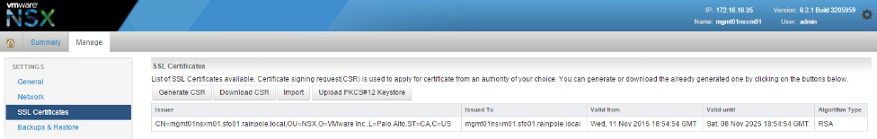
> **  **

1.  Copy the NSX file to the local c:\\certs\\nsx\\sfo\\ directory. Create the directory if necessary.

2.  Rename the file (Be sure to add the .csr extension to the file name).

| Host                              | Filename                    |
|-----------------------------------|-----------------------------|
| mgmt01nsxm01.sfo01.rainpole.local | mgmt01nsxm01.sfo01\_ssl.csr |
| comp01nsxm01.sfo01.rainpole.local | comp01nsxm01.sfo01\_ssl.csr |

1.  Follow the steps in the "Obtain Custom Certificates" section to enroll the certificate of this NSX Manager instance

2.  Save the signed certificates to the local c:\\certs\\nsx\\sfo directory.

| Host                              | Filenames              |
|-----------------------------------|------------------------|
| mgmt01nsxm01.sfo01.rainpole.local | mgmt01nsxm01.sfo01.cer
                                     Root64.cer              |
| comp01nsxm01.sfo01.rainpole.local | comp01nsxm01.sfo01.cer
                                     Root64.cer              |

1.  Combine the certificate file with the CA's root certificate file into a single file as follows.

<!-- -->

1.  Open a command prompt and navigate to the directory c:\\certs\\nsx\\sfo.

2.  Run the following command.

| Host                              | Command                                                             |
|-----------------------------------|---------------------------------------------------------------------|
| mgmt01nsxm01.sfo01.rainpole.local | copy mgmt01nsxm01.sfo01.cer+Root64.cer mgmt01nsxm01.sfo01.chain.cer |
| comp01nsxm01.sfo01.rainpole.local | copy comp01nsxm01.sfo01.cer+Root64.cer comp01nsxm01.sfo01.chain.cer |

1.  From the Web browser that is connected to the NSX Manager interface, with the **Manage** tab and the **SSL Certificate** setting still selected on the left, click Import and provide your chained certificate file. 

| Host                              | Filenames                    |
|-----------------------------------|------------------------------|
| mgmt01nsxm01.sfo01.rainpole.local | mgmt01nsxm01.sfo01.chain.cer |
| comp01nsxm01.sfo01.rainpole.local | comp01nsxm01.sfo01.chain.cer |

> 

1.  Reboot NSX Manager so the custom certificate is used.

<!-- -->

1.  In the right corner of the NSX Manager page click the **Settings** icon. 

2.  From the pull-down menu, choose **Reboot Appliance**.

    1.  Deploy vSphere Data Protection in Region A
        ------------------------------------------

Deploy vSphere Data Protection to provide the capability for backup and restore of SDDC management components. vSphere Data Protection enables the backup and restore of virtual machines associated with the following components:

-   vCenter Server

<!-- -->

-   Management vCenter Server and connected external Platform Services Controller

-   Compute vCenter Server and connected external Platform Services Controller

<!-- -->

-   NSX for vSphere

<!-- -->

-   NSX Manager for the management cluster

-   NSX Manager for the compute and edge clusters

<!-- -->

-   vRealize Automation

-   vRealize Operations Manager

-   vRealize Log Insight

**Procedure Overview**

1.  Prerequisites for Deploying vSphere Data Protection in Region A

2.  Deploy the Virtual Appliance of vSphere Data Protection in Region A

3.  Register vSphere Data Protection with Management vCenter Server in Region A

4.  Generate a CA-Signed SSL Certificate for vSphere Data Protection in Region A

    1.  ### Prerequisites for Deploying vSphere Data Protection in Region A

Before you deploy vSphere Data Protection, verify that your environment satisfies the requirements for this deployment. 

#### IP Addresses and Host Names

Verify that static IP address and FQDN for vSphere Data Protection are available for the Region A of the SDDC deployment.

| Network Setting     | Value                            |
|---------------------|----------------------------------|
| **IP address**      | 172.16.11.81                     |
| **FQDN**            | vdp-mgmt-01.sfo01.rainpole.local |
| **DNS server**      | 172.16.11.4                      |
| **Default gateway** | 172.16.11.253                    |
| **Subnet mask**     | 255.255.255.0                    |

#### Deployment Prerequisites

Verify that you have fulfilled the following prerequisites in addition to the networking settings.

| Prerequisite             | Value                                                                                                                         |
|--------------------------|-------------------------------------------------------------------------------------------------------------------------------|
| **Initial Storage**      | -   Virtual disk provisioning.                                                                                                

                            <!-- -->                                                                                                                       

                            -   Thin                                                                                                                       

                            <!-- -->                                                                                                                       

                            -   Required storage                                                                                                           

                            <!-- -->                                                                                                                       

                            -   4 TB NFS                                                                                                                   |
| **Software Features**    | -   vSphere Management vCenter Server                                                                                         

                            -   Client Integration Plugin on the machine where you use the vSphere Web Client                                              

                            -   Management cluster with enabled DRS and HA.                                                                                

                            -   vSphere Distributed Switch configured for the vSphere management network                                                   |
| **Installation Package** | Download the .ova file of the vSphere Data Protection virtual appliance on the machine where you use the vSphere Web Client.  |

### Deploy the Virtual Appliance of vSphere Data Protection in Region A

Deploy vSphere Data Protection as a virtual appliance on the management cluster in Region A.

1.  In a Web browser, log in to the **mgmt01vc01.sfo01.rainpole.local** Management vCenter Sever as an SDDC administrator. 

2.  In the vSphere Web Client, navigate to the **SFO01-Mgmt01** cluster object.

| Inventory Object | Value                           |
|------------------|---------------------------------|
| vCenter Server   | mgmt01vc01.sfo01.rainpole.local |
| Data center      | SFO01                           |
| Cluster          | SFO01-Mgmt01                    |

1.  Right-click the **SFO01-Mgmt01** object and select **Deploy OVF Template**.

> 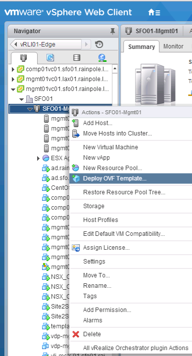

1.  On the **Select source** page, select **Local file**, browse to the location of the vSphere Data Protection OVA file on your file system, and click **Next**.

> 

1.  On the **Review details** page, examine the virtual appliance details, such as product, version, download and disk size, and click **Next**.

2.  On the **Accept License Agreements **page, accept the end user license agreements and click **Next**.

> 

1.  On the **Select name and folder** page, enter a node name, select the inventory folder for the virtual appliance, and click **Next**.

| Name or Folder Option | Value                            |
|-----------------------|----------------------------------|
| **Name**              | vdp-mgmt-01.sfo01.rainpole.local |
| **vCenter Server**    | mgmt01vc01.sfo01.rainpole.local  |
| **Data center**       | SFO01                            |

1.  Select the** SFO01A-NFS01-VDP01** NFS datastore provisioned for vSphere Data Protection, leave thin provisioned virtual disk format and the default VM storage policy, and click **Next**. 

> 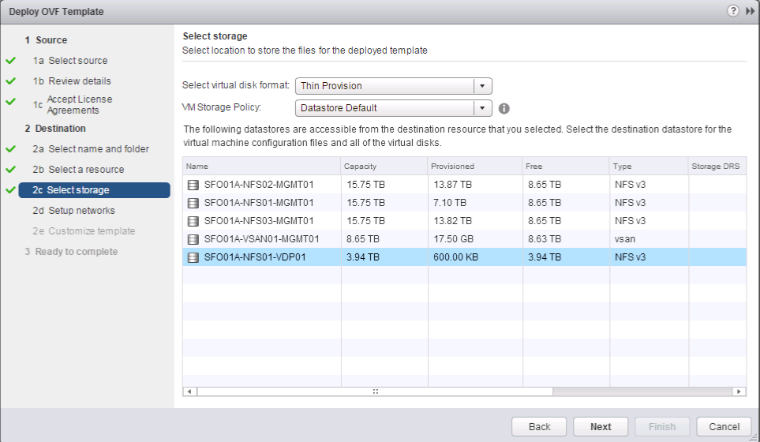 

1.  On the **Setup networks** page, select the **vDS-Mgmt-Management** distributed port group from the **Isolated Network** drop-down menu, select **IPv4** from the **IP protocol** drop-down menu, and click **Next**.

> 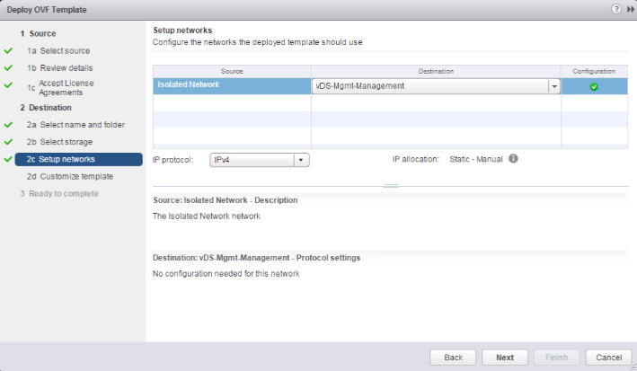

1.  On the **Customize template** page, enter the networking settings for the virtual appliance, and click **Next**.

> 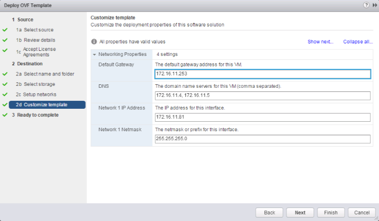

| IPv4 Setting            | Value                    |
|-------------------------|--------------------------|
| **Default gateway**     | 172.16.11.253            |
| **DNS server**          | 172.16.11.4, 172.16.11.5 |
| **Static IPv4 address** | 172.16.11.81             |
| **Subnet mask**         | 255.255.255.0            |

1.  On the **Ready to complete** page, verify that the settings are correct, select the **Power on after deployment** check box, and click **Finish**.

> 

### Register vSphere Data Protection with Management vCenter Server in Region A

After you deploy the virtual appliance for vSphere Data Protection on the management POD in Region A, complete the initial configuration of vSphere Data Protection.

Procedure

1.  In a Web browser, log into **https://vdp-mgmt-01.sfo01.rainpole.local:8543/vdp-configure **with user name **root** and default password ***changeme***. The configuration wizard of vSphere Data Protection appears. 

2.  On the **Welcome** page, click **Next**.

3.  On the **Network Settings** page, verify that the network settings are populated correctly and click **Next**.

> 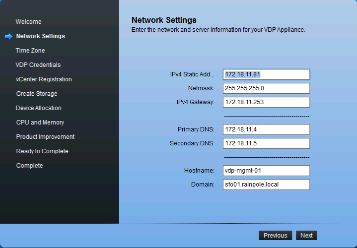

1.  On the **Time Zone** page, select the UTC timezone and click **Next**.

2.  On the **VDP Credentials** page, enter and confirm a new password for the **root** Linux appliance user and click **Next**. 

3.  The password must satisfy the following requirements:

-   If all four character classes are used, the password must be at least 6 characters. 

-   If three character classes are used, the password must be at least 7 characters.

-   If one or two character classes are used, the password must be at least 8 characters.

-   The four-character classes are as follows:

<!-- -->

-   Upper case letters A-Z

-   Lower case letters a-z

-   Numbers 0-9

-   Special characters (for example: ~!@\#,.) 

1.  On the **vCenter Server Registration** page, configure the settings for registration with the Management vCenter Server.

> 

1.  Enter the settings for connection to the Management vCenter Server.

| vCenter Server Setting                | Value                              |
|---------------------------------------|------------------------------------|
| **vCenter Server user name**          | administrator@vsphere.local        |
| **vCenter Server password**           | *vcenter\_administrator\_password* |
| **vCenter FQDN or IP address**        | mgmt01vc01.sfo01.rainpole.local    |
| **vCenter Server HTTP port**          | 80                                 |
| **vCenter Server HTTPS port**         | 443                                |
| **Verify vCenter Server certificate** | No                                 |

1.  Deselect the **Use vCenter for SSO authentication** check box and enter the settings for VMware Single Sign-On on the Management Platform Services Controller.

| Single Sign-On Setting                 | Value                            |
|----------------------------------------|----------------------------------|
| **Use vCenter for SSO authentication** | No                               |
| **SSO FQDN or IP address**             | mgmt01psc01.sfo01.rainpole.local |
| **SSO port**                           | 443                              |

1.  Click **Test Connection** and in the success message box, click **OK**.

> 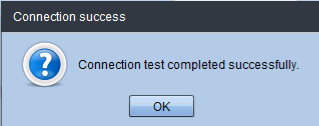 

1.  On the **vCenter Registration** page, click **Next**.

> On the **Create Storage** page, select **Create new storage** and in the Capacity text box enter **4** TB.
>
> 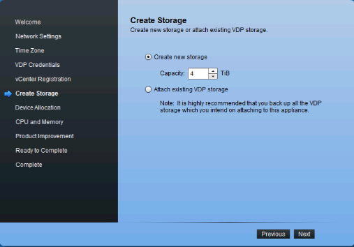 

1.  On the **Device Allocation** page, leave the default settings and click **Next**.

2.  On the **CPU and Memory** page, leave the default settings and click **Next**.

3.  On the **Product Improvement** page, select Enable **Customer Experience Improvement Program** and click **Next**.

>  

1.  On the **Ready to Complete** page, select **Run performance analysis on storage configuration** and **Restart the appliance if successful**, and click **Next**. 

> 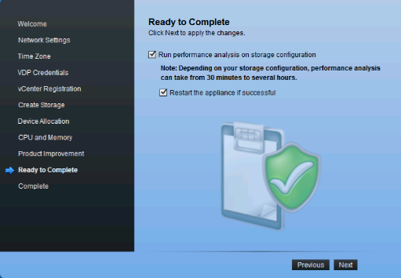 

1.  In the warning message box about storage configuration, click **Yes**. vSphere Data Protection setup starts configuring data disks.

> 

1.  After disk configuration is complete, click **OK** in the success box.

> 

### Install a CA-Signed SSL Certificate for vSphere Data Protection in Region A

vSphere Data Protection comes with a default self-signed certificate. Install a CA-signed certificate that authenticates the vSphere Data Protection over HTTPS.

Procedure

1.  In a Web browser, open the vSphere Web Client. 

<!-- -->

1.  Log in to **https://mgmt01vc01.sfo01.rainpole.local/vsphere-client**. 

2.  Use the **administrator@vsphere.local** user name and the ***vsphere\_admin\_password*** password*.*

<!-- -->

1.  Navigate to the vSphere Data Protection virtual appliance **vdp-mgmt-01.sfo.rainpole.local**.

2.  Change the SSH configuration.   

<!-- -->

1.  Right-click **vdp-mgmt-01.sfo.rainpole.local** and select **Open Console** to open the remote console to the appliance.

2.  Log in as the **root** user name and ***vdp\_root\_password***.

3.  Run the following console command to open the sshd\_config file for editing.

> vi /etc/ssh/sshd\_config

1.  Remove the \# comment from the beginning of the line **\#PermitRootLogin yes**.

> 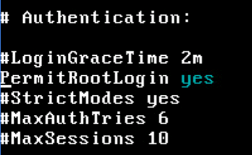 

1.  Run the following command in the vi editor to save the file and exit the editor.

> :wq!

1.  In the console, restart the SSH service to update the running configuration.

    /etc/init.d/sshd restart

>  

1.  Log out and close the console to the appliance.

<!-- -->

1.  Open an SSH connection to the vSphere Data Protection appliance **vdp-mgmt-01.sfo01.rainpole.local** with the **root** user name and ***vdp\_root\_password*** password.

2.  Stop the vSphere Data Protection Services by running the following command. 

> emwebapp.sh –stop
>
> 

1.  Delete the Tomcat alias from the certificate store.

> /usr/java/latest/bin/keytool -delete -alias tomcat
>
> When prompted for the keystore password use changeit**.**
>
> 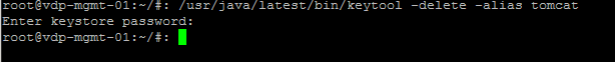 

1.  Generate a certificate signing request (CSR) vdpcsr.csr by running the following two commands:

> /usr/java/latest/bin/keytool -genkeypair -v -alias tomcat -keyalg RSA -sigalg SHA256withRSA -keystore /root/.keystore -storepass changeit -keypass changeit -validity 3650 -dname "CN=vdp-mgmt-01.sfo01.rainpole.local, OU=rainpole.local, O=Rainpole Inc., L=Palo Alto, S=CA, C=US" 
>
> /usr/java/latest/bin/keytool -certreq -keyalg RSA -alias tomcat -file vdpcsr.csr 

When prompted for the keystore password use **changeit**.

1.  Submit the CSR to the Windows domain controller CA.

    1.  Run the following console command.

cat vdpcsr.csr

1.  Copy the output from -----BEGIN CERTIFICATE REQUEST----- to -----END CERTIFICATE REQUEST----- inclusive.

> 

1.  In a Web browser, log into http://dc01rpl.rainpole.local/certsrv/certrqxt.asp with a domain **administrator** user name and ***domain\_admin\_password*** password

2.  Paste the request in the **Saved Request** text box, select **VMware** from the **Certificate Template** drop-down menu, and click **Submit**

>  

1.  On the **Certificate Issued** page, select the **Base 64 encoded** radio box, click the **Download certificate chain** link and save the file as a vdp.p7b . 

> 
> If the save as dialog does not appear, the signed certificate is saved as certnew.p7b in your default downloads folder. Rename the file to vdp.p7b.

1.  Copy the vdp.p7b certificate file to the **/root** folder on the vSphere Data Protection virtual appliance. You can use scp, FileZilla or WinSCP.

2.  Import the certificate.

<!-- -->

1.  Run the following console command.

> /usr/java/latest/bin/keytool -import -alias tomcat -keystore /root/.keystore -file /root/vdp.p7b

1.  When prompted for the keystore password use** changeit**.

2.  When prompted to trust the certificate type **yes** and press **enter**.

> . 

1.  Verify certificate is installed successfully. 

<!-- -->

1.  Run the following command.

> /usr/java/latest/bin/keytool -list -v -keystore /root/.keystore -storepass changeit -keypass changeit | grep tomcat

1.  Verify that the output contains **Alias name: tomcat**.

> 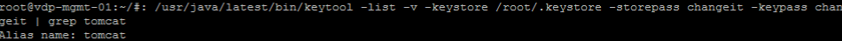

1.  Run the addFingerprint.sh script.

> /usr/local/avamar/bin/addFingerprint.sh
>
> This script does not return any output.

1.  Start the vSphere Data Protection services.

> emwebapp.sh --start
>
> 

1.  vRealize Operations Implementation in Region A
    ==============================================

    1.  Deploy vRealize Operations Manager in Region A
        ----------------------------------------------

Start the deployment of vRealize Operations Manager in Region A by deploying the nodes of the analytics cluster and the remote collector nodes.

-   Prerequisites for Deploying vRealize Operations Manager in Region A

-   Deploy the Virtual Appliance for Each Node in the Analytics Cluster

-   Generate a CA-Signed SSL Certificate for the Analytics Cluster

-   Configure the Master Node in the Analytics Cluster

-   Configure the Master Replica Node in the Analytics Cluster

-   Configure the Data Nodes in the Analytics Cluster

-   Deploy the Remote Collector Virtual Appliances

-   Connect the Remote Collector Nodes to the Analytics Cluster

-   Enable High Availability and Start vRealize Operations Manager

-   Assign a License to vRealize Operations Manager

-   Group Remote Collector Nodes in Region A

-   Verify and Import the CA-Signed Certificate on Your Computer

    1.  ### Prerequisites for Deploying vRealize Operations Manager in Region A

Before you deploy vRealize Operations Manager, verify that your environment satisfies the requirements for this deployment. 

**IP Addresses and Host Names**

Verify that static IP address and FQDNs for the vRealize Operations Manager application virtual network are available for the first region of the SDDC deployment.

For the analytics cluster application virtual network, allocate 4 static IP addresses and FQDNs for the nodes and one for the load balancer, and map host names to the IP addresses. For the remote collector cluster, allocate 2 static IP addresses and FQDNs.

Table . **IP Addresses and Host Name for the Analytics Cluster in Region A**

| **Role**                               | **IP Address**           | **FQDN**                             |
|----------------------------------------|--------------------------|--------------------------------------|
| **External load balancer VIP address** | 10.158.130.48            | vrops-cluster-01.rainpole.local      |
| **Master node**                        | 192.168.21.21            | vrops-mstrn-01.rainpole.local        |
| **Master replica node**                | 192.168.21.22            | vrops-repln-02.rainpole.local        |
| **Data node 1**                        | 192.168.21.23            | vrops-datan-03.rainpole.local        |
| **Data node 2**                        | 192.168.21.24            | vrops-datan-04.rainpole.local        |
| **Remote collector 1**                 | 192.168.22.25            | vrops-rmtcol-01.sfo01.rainpole.local |
| **Remote collector 2**                 | 192.168.22.26            | vrops-rmtcol-02.sfo01.rainpole.local |
| **Default gateway**                    | 192.168.21.1             | -                                    |
| **DNS server**                         | 172.16.11.5, 172.17.11.5 | -                                    |
| **Subnet mask**                        | 255.255.255.0            | -                                    |
| **NTP servers**                        | 172.16.11.251            

                                          172.16.11.252             

                                          172.17.11.251             

                                          172.17.11.252             | 0.ntp.sfo01.rainpole.local           

                                                                     1.ntp.sfo01.rainpole.local            

                                                                     0.ntp.lax01.rainpole.local            

                                                                     1.ntp.lax01.rainpole.local            |

**Deployment Prerequisites**

| Prerequisite                | Value                                                                                                                             |
|-----------------------------|-----------------------------------------------------------------------------------------------------------------------------------|
| **Storage**                 | -   Virtual disk provisioning.                                                                                                    

                               <!-- -->                                                                                                                           

                               -   Thin                                                                                                                           

                               <!-- -->                                                                                                                           

                               -   Required storage per node                                                                                                      

                               <!-- -->                                                                                                                           

                               -   Initial storage for node deployment: 1.3 GB                                                                                    

                               -   Storage for monitoring data for analytics cluster nodes: 1 TB                                                                  |
| **Software Features**       | -   vSphere                                                                                                                       

                               <!-- -->                                                                                                                           

                               -   Management vCenter Server                                                                                                      

                               -   Client Integration Plugin on the machine where you use the vSphere Web Client                                                  

                               -   Management cluster with enabled DRS and HA.                                                                                    

                               <!-- -->                                                                                                                           

                               -   NSX for vSphere                                                                                                                

                               <!-- -->                                                                                                                           

                               -   Application virtual network for the 4-node analytics cluster.                                                                  

                               -   Application virtual network for the 2 remote collector nodes.                                                                  |
| **Installation Package**    | Download the .ova file of the vRealize Operations Manager virtual appliance on the machine where you use the vSphere Web Client.  |
| **License**                 | Verify that you have obtained a license that covers the use of vRealize Operations Manager.                                       |
| **Active Directory**        | Verify that you have a parent active directory with the SDDC user roles configured for the rainpole.local domain.                 |
| **Certification Authority** | Configure the root Active Directory domain controller as a certificate authority for the environment.                             |

### Deploy the Virtual Appliance for Each Node in the Analytics Cluster

Use the vSphere Web Client to deploy each vRealize Operations Manager node as a virtual appliance on the management cluster in Region A.

**Procedure**

1.  In a Web browser, open the vSphere Web Client. 

<!-- -->

1.  Log in to **https://mgmt01vc01.sfo01.rainpole.local/vsphere-client**.

2.  Use the **administrator@vsphere.local** user name and the ***vsphere\_admin\_password*** password*.* 

<!-- -->

1.  Navigate to the **mgmt01vc01.sfo01.rainpole.local** vCenter Server object. 

2.  Right-click the **mgmt01vc01.sfo01.rainpole.local** object and select **Deploy OVF Template**.

3.  On the **Select source** page, select **Local file**, browse to the location of the vRealize Operations Manager OVA file on your file system, and click **Next**.

> 

1.  On the **Review details** page, examine the virtual appliance details, such as product, version, download and disk size, and click **Next**.

> 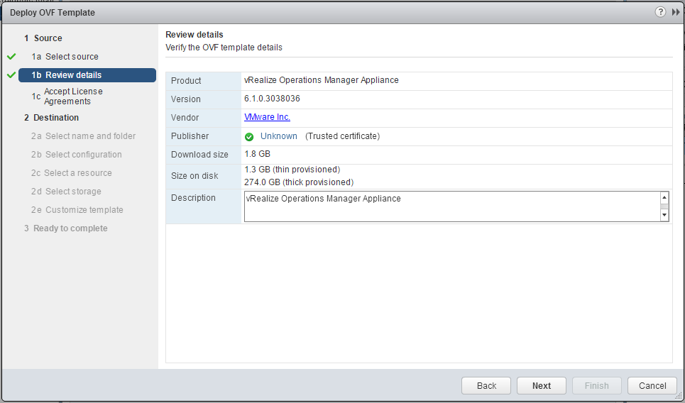

1.  On the **Accept License Agreements **page, accept the end user license agreements and click **Next**.

2.  On the **Select name and folder** page, enter a node name, select the inventory folder for the virtual appliance, and click **Next**.

> 

1.  Enter a name for the node according to its role.

| Name           | Role                |
|----------------|---------------------|
| vrops-mstrn-01 | Master node         |
| vrops-repln-02 | Master replica node |
| vrops-datan-03 | Data node 1         |
| vrops-datan-04 | Data node 2         |

1.  Select the inventory folder for the virtual appliance.

| Object             | Value                           |
|--------------------|---------------------------------|
| **vCenter Server** | mgmt01vc01.sfo01.rainpole.local |
| **Data center**    | SFO01                           |
| **Folder**         | vROps01                         |

1.  On the **Select configuration** page, from the **Configuration** drop-down menu, select the **Medium** deployment configuration of the virtual appliance, and click **Next**.

> 

1.  On the **Select a resource** page, select the **SFO01-Mgmt01** management cluster as the resource to run the virtual appliance, and click **Next**.

> 

1.  On the **Select storage** page, select the datastore. By default, the virtual appliance disk is thin provisioned.

> 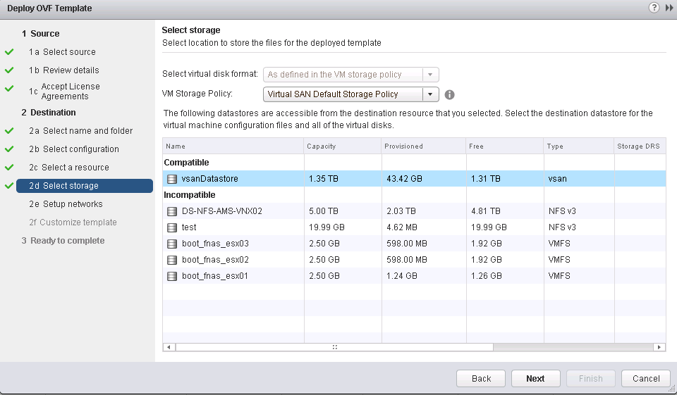

1.  From the **VM Storage Policy** drop-down menu, select **Virtual SAN Default Storage Policy**.

2.  From the datastore table, select the **SFO01A-VSAN01-MGMT01** Virtual SAN datastore.

3.  Click **Next**.

<!-- -->

1.  On the **Setup networks** page, select the distributed port group on the **vDS-Mgmt** distributed switch that ends with **vROps01-VXLAN**, and click **Next**.

> NSX for vSphere creates the distributed port group for the logical switch that connects the analytics cluster nodes and generates the port group name. The name of the port group contains the segment ID and the logical switch name vROps01-VXLAN.
>
> 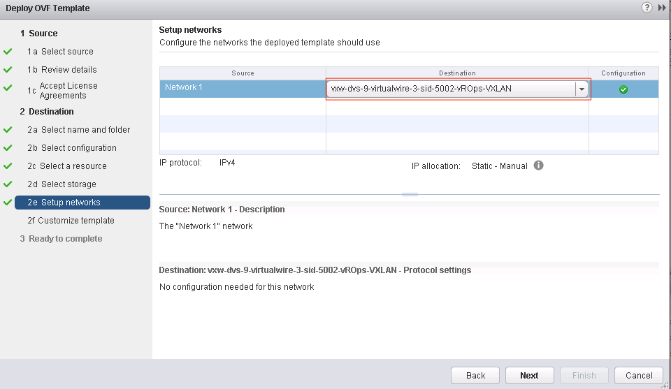

1.  On the **Customize template** page, select the time zone and set IPv4 settings for the virtual appliance.

> 

1.  From the **Timezone** **setting** drop-down menu, select the **Etc/UTC** time zone.

2.  In the **Networking Properties Enter** section, configure the following IPv4 settings:

| IPv4 Setting        | Value                            |
|---------------------|----------------------------------|
| Default gateway     | 192.168.21.1                     |
| DNS server          | 172.16.11.5, 172.17.11.5         |
| Static IPv4 address | 192.168.21.21 for vrops-mstrn-01
                       192.168.21.22 for vrops-repln-02  
                       192.168.21.23 for vrops-datan-03  
                       192.168.21.24 for vrops-datan-04  |
| Subnet mask         | 255.255.255.0                    |

1.  Verify that the settings for deployment are correct, and click **Finish**.

> 

1.  After the virtual appliance is deployed, expand the data disk of the virtual appliance to collect and store data from a large number of virtual machines.

<!-- -->

1.  In the vSphere Web Client, navigate to the virtual appliance object.

2.  Right-click the virtual appliance and select the **Edit Settings** menu item.

3.  In the **Edit Settings** dialog box, next to **Hard disk 2** increase the size of the virtual appliance disk from 250 GB to 1 TB, and click **OK**.

> 

1.  Right-click the virtual appliance object and select the **Power** &gt; **Power On** menu item.
    During the power-on process, the virtual appliance expands the vRealize Operations Manager data partition as well.

2.  Repeat the steps to deploy the vRealize Operations Manager virtual appliance for the next node in the analytics cluster.

    1.  ### **Generate a CA-Signed SSL Certificate for the Analytics** Cluster

vRealize Operations Manager comes with default self-signed certificates that are generated and signed at installation time. Install a CA-signed certificate that authenticates the analytics cluster of vRealize Operations Manager so that the Web browser does not show a certificate prompt every time users log into the Web user interface over HTTPS.

You import the certificate into the master node, and transfer the certificate to the master replica and data nodes during initial setup. 

vRealize Operations Manager accepts only PEM encoded certificates that include the complete certification chain. 

Procedure

1.  On your computer, create a configuration file for OpenSSL certificate request generation, called **vrops01.cfg**.

> Because all nodes in the cluster share the same certificate, the Subject Alternative Name field, subjectAltName, of the uploaded certificate must contain the IP addresses and FQDNs of all nodes and of the load balancer. For common name, use the full domain name of the load balancer. 
>
> \[ req \]
>
> default\_bits = 4096
>
> default\_keyfile = rui.key
>
> distinguished\_name = req\_distinguished\_name
>
> encrypt\_key = no
>
> prompt = no
>
> string\_mask = nombstr
>
> req\_extensions = v3\_req
>
> \[ v3\_req \]
>
> basicConstraints = CA:FALSE
>
> keyUsage = digitalSignature, keyEncipherment, dataEncipherment
>
> extendedKeyUsage = serverAuth, clientAuth
>
> subjectAltName = DNS:vrops-cluster-01, IP: 10.158.130.48, DNS:vrops-cluster-01.rainpole.local, DNS:vrops-mstrn-01.rainpole.local, DNS:vrops-mstrn-01, DNS:vrops-repln-02.rainpole.local, DNS:vrops-repln-02, DNS:vrops-datan-03.rainpole.local, DNS:vrops-datan-03, DNS:vrops-datan-04.rainpole.local, DNS:vrops-datan-04
>
> \[ req\_distinguished\_name \]
>
> countryName = US
>
> stateOrProvinceName = CA
>
> localityName = Palo Alto
>
> 0.organizationName = Rain Pole Inc.,
>
> organizationalUnitName = rainpole.local
>
> commonName = vrops-cluster-01.rainpole.local

1.  Enable SSH on the master virtual appliance.

<!-- -->

1.  In the vSphere Web Client, log into **mgmt01vc01.sfo01.rainpole.local** and navigate to the **vrops-mstrn-01** virtual appliance.

2.  Right-click **vrops-mstrn-01** and select **Open Console** to open the remote console to the appliance.

3.  Press **ALT+F1** to switch to the command prompt.

4.  At the command prompt, log in by using the **root** user name and an empty password.

5.  At the command prompt, change the default empty password for the **root** user account.
    You must change the default password of the root use because you login for the first time to the virtual appliance console.  

6.  Start the SSH service by running the command:

> service sshd start

1.  Close the virtual appliance console.

<!-- -->

1.  Log into **vrops-mstrn-01.rainpole.local** over SSH with **root** user name and **vrops\_master\_root\_password** password.

2.  Create a sub-directory called **vrops01** in the **root** home directory.

> **mkdir /root/vrops01/**

1.  Copy the **vrops01.cfg** to the **/root/vrops01** folder on the master node virtual appliance.
    You can use scp, FileZilla or WinSCP. 

2.  From the **/root/vrops01** folder, generate an RSA private key that is 4096 bits long, and save it as a vrops01.key file.

> openssl genrsa -out vrops01.key 4096
>
> 

1.  Use the vrops01.key private key and the vrops01.cfg configuration file to create a Certificate Signing Request (CSR) and save it as a vrops01.pem file.

> openssl req -new -key vrops01.key -out vrops01.pem -config vrops01.cfg

1.  Submit the CSR to the Windows domain controller CA.

<!-- -->

1.  Run the following console command.

> cat vrops01.pem

1.  Copy the output from -----BEGIN CERTIFICATE REQUEST----- to -----END CERTIFICATE REQUEST----- inclusive.

> 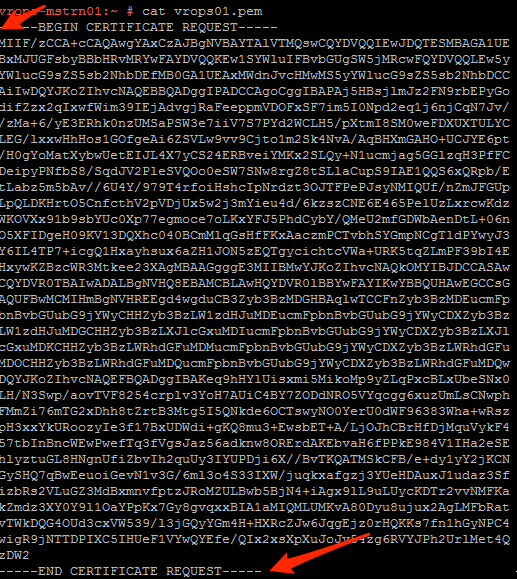

1.  In a Web browser, log into http://dc01rpl.rainpole.local/certsrv/certrqxt.asp with the domain **administrator** user name and **domain\_admin\_password** password.

2.  Paste the request in the **Saved Request** text box, select **VMware** from the **Certificate Template** drop-down menu, and click Submit.

> 

1.  On the **Certificate Issued** page, download the signed server certificate as a **vrops01.cer** file in Base 64 encoding.

<!-- -->

1.  If the save as dialog does not appear, the signed certificate is saved as **certnew.cer** in your downloads folder. Rename the file to vrops01.cer.

> 

1.  Download the root CA certificate.

<!-- -->

1.  In a Web browser, go to **http://dc01rpl.rainpole.local/certsrv/certcarc.asp** and log in with the domain **administrator** user name and **ad\_admin\_password** password.

2.  Select **Base 64**, click on** Download CA Certificate**, and save the certificate as **rootca.cer** on your computer.

<!-- -->

1.  If the save as dialog does not appear, the CA certificate is saved as certnew.cer in your downloads folder. Rename the file to rootca.cer.

> 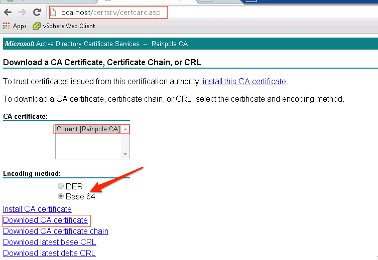

1.  Copy the **vrops01.cer** and **rootca.cer** certificate files to the **/root/vrops01** folder on the master virtual appliance. You can use scp, FileZilla or WinSCP.

2.  In the master node console, create a **vrops01-chain.pem** file in the **/root/vrops01** folder that contains the signed certificate, CA certificate and private key file.

3.  The order of the certificates in a PEM file must follow the certificate chain sequence starting from the own certificate up to the root CA certificate. **vrops01.cer** must be first, **rootca.cer** next and **vrops01.key** last.

> cat vrops01.cer rootca.cer vrops01.key &gt; vrops01-chain.pem

1.  Copy the **vrops01-chain.pem** file to your computer. You can use scp, FileZilla or WinSCP.

2.  Stop the SSH service on the master node virtual appliance by running the following command. 

> service sshd stop

The next time you try to log in to the master virtual appliance, the connection is not established.

### Configure the Master Node in the Analytics Cluster

After you deploy the virtual appliance for the master node of the vRealize Operations Manager analytics cluster, enable its administration role in the cluster.

Procedure

1.  In a Web browser, go to **https://vrops-mstrn-01.rainpole.local**.

2.  In the initial setup page, click **New Installation**.

> 

1.  Examine the overview of the steps for creating a cluster and click **Next**.

> 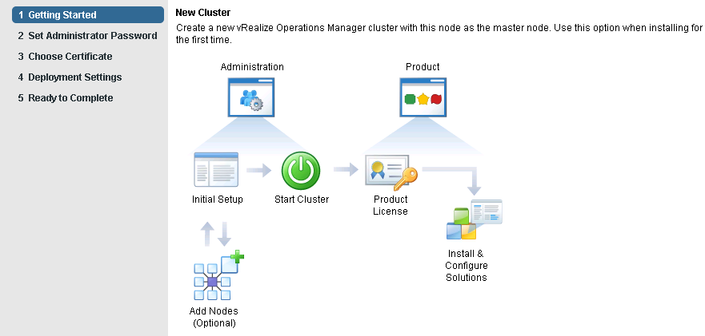

1.  On the **Set the Administrator account password** page, enter and confirm the password for **admin** user account.

> 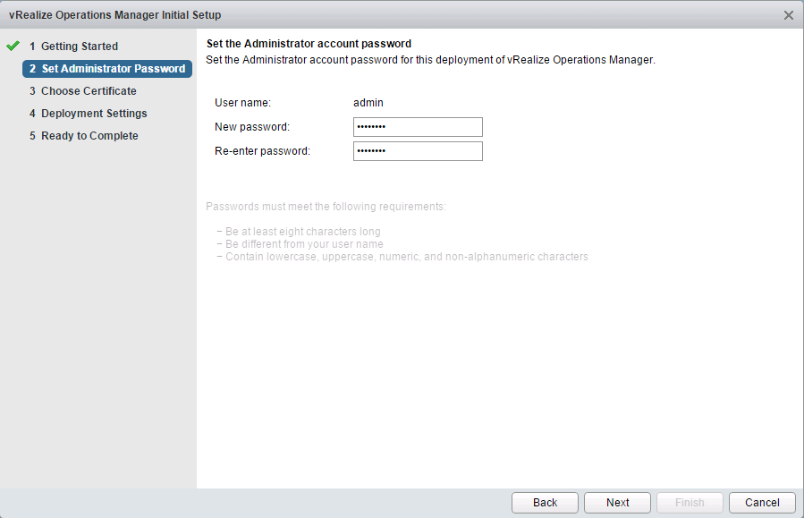

1.  On the **Choose a certificate** page, select **Install a certificate**, browse to the location of the **vrops01-chain.pem** file, and click **Next**. 

> After the setup reads and validates the certificate, you see that the certificate has a common name **vrops-cluster-01.rainpole.local** and a subject alternate name that contains **vrops-mstrn-01.rainpole.local** for the master node.
>
> 

1.  On the **Deployment Setting** page, in the **Cluster Master Node Name**, enter the DNS short name **vrops-mstrn-01**.

2.  For time synchronization between nodes, configure the NTP server addresses.

<!-- -->

1.  In the **NTP Server Address** text box, enter the IP address of each NTP server and click the **Add** button. 

> The NTP server addresses are:

-   0.ntp.sfo01.rainpole.local

-   1.ntp.sfo01.rainpole.local

-   0.ntp.lax01.rainpole.local

-   1.ntp.lax01.rainpole.local

1.  Click **Next**.

> 

1.  On the **Ready to complete** page, click **Finish**.

> 
>
> After the configuration process is complete, the administration UI of vRealize Operations Manager opens. On the **System Status** page, you see the virtual appliance instance as the master node.
>
> 

### Configure the Master Replica Node in the Analytics Cluster

After you deploy a virtual appliance instance for the master replica node and configure a master node in the cluster, enable the cluster node functionality of the master replica node and join it to the analytics cluster.

Procedure

1.  In a Web browser, go to **https://vrops-repln02.rainpole.local**.

2.  In the initial setup page, click **Expand an Existing Installation**.

> 

1.  On the **Getting Started** page, examine the overview of the steps for expanding the cluster and click **Next**.

> 

1.  On the **Node Settings and Cluster Info** page, configure the settings of the node in the analytics cluster.

> 

1.  In the **Node Name** text box, enter the DNS short name **vrops-repln-02**.

2.  From the **Node type **drop-down menu, select **Data**. 

<!-- -->

1.  Although you are configuring the replica node, the vRealize Operations Manager setup considers the replica as data node until you enable high availability.  

<!-- -->

1.  In the **Master node IP address or FQDN **text box, enter the master node FQDN **vrops-mstrn-01.rainpole.local** and click **Validate**.
    The certificate of the master node appears underneath.

2.  Verify that the master certificate is correct, and click **Accept this certificate**.

3.  Click **Next**.

<!-- -->

1.  On the **Username and password** page, select **Use cluster administrator user name and password**,** **enter the **vrops\_admin\_password** for the **admin** user, and click **Next**.

> 

1.  On the **Ready to complete** page, click **Finish**.

> After the configuration process is complete, the administration UI of vRealize Operations Manager appears. You see the virtual appliance instance as a data node on the **System Status** page.
>
> 

### Configure the Data Nodes in the Analytics Cluster

After you deploy the virtual appliance for a data node of the vRealize Operations Manager analytics cluster, enable its role in the cluster. 

**Procedure**

1.  For each data node virtual appliance, go to the initial setup UI in your Web browser.  

| Data Node       | URL                                   |
|-----------------|---------------------------------------|
| **Data node 1** | https://vrops-datan-03.rainpole.local |
| **Data node 2** | https://vrops-datan-04.rainpole.local |

1.  In the initial setup page, click **Expand an Existing Installation**.

2.  Examine the overview of the steps for expanding the cluster and click **Next**.

3.  Configure the settings of the node in the analytics cluster.

<!-- -->

1.  In the **Node Name** text box, enter the DNS short name for the data node.

| Data Node   | DNS Short Name |
|-------------|----------------|
| Data node 1 | vrops-datan-03 |
| Data node 2 | vrops-datan-04 |

1.  From the **Node type **drop-down menu, select **Data**.

2.  Enter the master node FQDN **vrops-mstrn-01.rainpole.local** and click **Validate**.
    The certificate of the master node appears underneath.

3.  Verify that the master certificate is correct, and click **Accept this certificate**.

4.  Click **Next**.

<!-- -->

1.  Select **Use cluster administrator user name and password**,** **enter the password for the cluster admin user, and click **Next**.

2.  Click **Finish**.

> After the configuration process is complete, the administration UI of vRealize Operations Manager opens. On the **System Status** page, you see the virtual appliance instance as a data node.
>
> 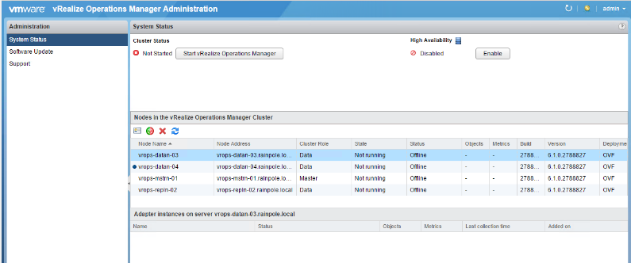

### Deploy the Remote Collector Virtual Appliances

After you deploy and enable the roles of the analytics cluster nodes, use the vSphere Web Client to deploy each of the two virtual appliances for the remote collectors in Region A. This is step is required for a single or multi-region environment. In a multi-region environment, you deploy the remote collectors to forward data from the vCenter Server instances in Region A to the analytics cluster.

1.  Log in to the Management vCenter Server by using the vSphere Web Client.

<!-- -->

1.  Go to **https://mgmt01vc01.sfo01.rainpole.local/vsphere-client**.

2.  Use the **administrator@vsphere.local** user name and ***vsphere\_admin\_password*** password.

<!-- -->

1.  Navigate to the **mgmt01vc01.sfo01.rainpole.local** vCenter Server object. 

2.  Right-click the **mgmt01vc01.sfo01.rainpole.local** object and select **Deploy OVF Template**.

3.  On the **Select source** page, select **Local file**, browse to the location of the vRealize Operations Manager OVA file on your file system, and click **Next**.

> 

1.  On the **Review details** page, examine the virtual appliance details, such as product, version, download and disk size, and click **Next**.

> 
>  

1.  On the **Accept License Agreements** page, accept the end user license agreements and click **Next**.

2.  On the **Select name and folder** page, enter a node name, select the inventory folder for the virtual appliance, and click **Next**.

| Attribute          | Value                                  |
|--------------------|----------------------------------------|
| **Name**           | vrops-rmtcol-01 for remote collector 1
                      vrops-rmtcol-02 for remote collector 2  |
| **vCenter Server** | mgmt01vc01.sfo01.rainpole.local        |
| **Data center**    | SFO01                                  |
| **Folder**         | vROps01RC                              |

> 

1.  On the **Select configuration** page, from the **Configuration** drop-down menu, select **Remote Collector (Standard)**, and click **Next**.

> 

1.  On the **Select a resource** page, select the **SFO01-Mgmt01** management cluster as the resource to run the virtual appliance, and click **Next**.

> 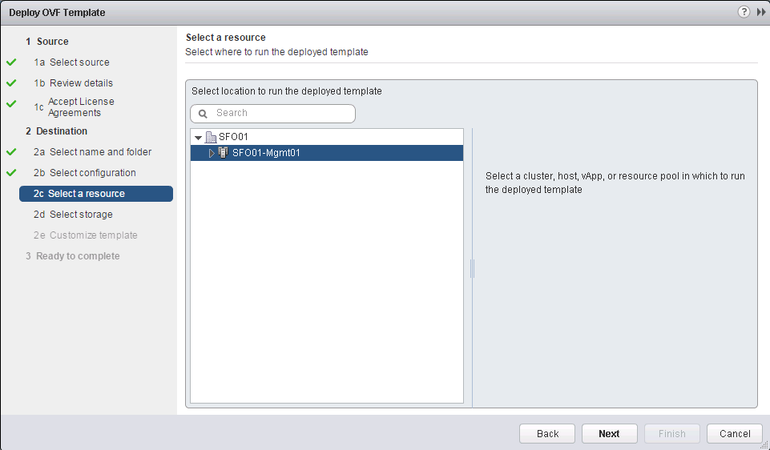 
>  

1.  On the **Select storage** page, for storage, select the Virtual SAN datastore, and click **Next**.
    By default, the virtual appliance disk is thin provisioned. 

<!-- -->

1.  From the **VM Storage Policy** drop-down menu, select **Virtual SAN Default Storage Policy**.

2.  From the datastore table, select the **SFO01A-VSAN01-MGMT01** Virtual SAN datastore.

3.  Click **Next**.

> 

1.  On the **Setup networks** page, select the distributed port group on the **vDS-Mgmt** distributed switch that ends with **vROps01RC-VXLAN**, and click **Next**.

> NSX for vSphere creates the distributed port group for the logical switch that connects the remote collector nodes. The name of the port group indicates the segment ID and the logical switch name **vROps01RC-VXLAN**.
>
> 

1.  On the **Customize template** page, select the time zone and set the IPv4 settings for the virtual appliance.

<!-- -->

1.  From the **Timezone** setting drop-down menu, select the **Etc/UTC** time zone.

2.  In the **Networking Properties** section, configure the following IPv4 settings:

| IPv4 Setting            | Value                                |
|-------------------------|--------------------------------------|
| **Default gateway**     | 192.168.22.1                         |
| **DNS server**          | 172.16.11.6                          |
| **Static IPv4 address** | 192.168.22.25 for remote collector 1
                           192.168.22.26 for remote collector 2  |
| **Subnet mask**         | 255.255.255.0                        |

> 

1.  On the **Ready to complete** page, verify that the settings for deployment are correct and the **Power on after deployment** check box is selected, and click **Finish**.

> 

1.  Repeat the steps to deploy the second remote collector appliance.

    1.  ### Connect the Remote Collector Nodes to the Analytics Cluster

After you deploy the virtual appliances for the remote collector nodes on the Management vCenter Server, configure the settings of the remote collectors and connect them to the analytics cluster.

Procedure

1.  In a Web browser, go to the initial setup UI of each remote collector node virtual appliance.

| Remote Collector Node | URL                                          |
|-----------------------|----------------------------------------------|
| Remote collector 1    | https://vrops-rmtcol-01.sfo01.rainpole.local |
| Remote collector 2    | https://vrops-rmtcol-02.sfo01.rainpole.local |

1.  In the initial setup page, click **Expand an Existing Installation** and click **Next**.

> 

1.  On the **Note Settings and Cluster Info** page, configure the settings of the node in the analytics cluster.

<!-- -->

1.  In the **Node Name** text box, enter the DNS short name for the data node.

| Remote Collector Node | DNS Short Name  |
|-----------------------|-----------------|
| Remote collector 1    | vrops-rmtcol-01 |
| Remote collector 2    | vrops-rmtcol-02 |

1.  From the **Node Type** drop-down menu, select **Remote Collector.**

2.  Enter the master node FQDN **vrops-mstrn-01.rainpole.local** and click **Validate**.
    The certificate of the master node appears underneath.

3.  Validate that the master certificate is correct, and click **Accept this certificate**.

4.  Click **Next**.

> 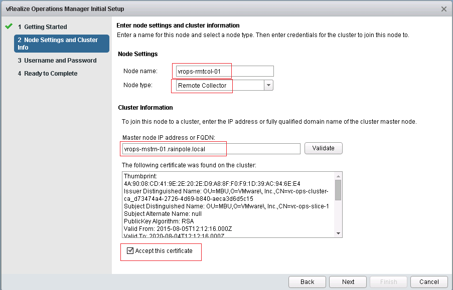

1.  On the **Username and password** page, select **Use cluster administrator user name and password**,** **enter the password for the cluster admin user, and click **Next**.

2.  Click **Finish**. 

> After the configuration of the second remote collector is complete, the cluster on the **System Status** page of the administration UI consists of vrops-mstrn-01, vrops-repln-02, vrops-datan-03, vrops-datan-04, and 2 remote collectors vrops-rmtcol-01 and vrops-rmtcol-02.
>
> 

### Configure a DRS Anti-Affinity Rule for vRealize Operations Manager in Region A

To protect the vRealize Operations Manager virtual machines from a host-level failure, configure vSphere DRS to run the virtual machines for the analytics cluster and for the remote collectors on different hosts in the management cluster.

Procedure

1.  In a Web browser, open the vSphere Web Client.

<!-- -->

1.  Log in to **https://mgmt01vc01.sfo01.rainpole.local/vsphere-client**.

2.  Use the administrator@vsphere.local user name and the *vsphere\_admin\_password* password.

<!-- -->

1.  Navigate to the **mgmt01vc01.sfo01.rainpole.local** vCenter Server object, and under the SFO01 data center object select the **SFO01-Mgmt01** cluster.

2.  On the **Manage** tab, click the **Settings** tab.

3.  Under the **Configuration** group of settings, select **VM/Host Rules**.  

4.  In the **VM/Host Rules** list, click the **Add** button above the rules list and add a new anti-affinity rule called **vropscluster-antiaffinity-rule** for the four vRealize Operations Manager Analytics analytics virtual machines, and click **OK**.

| Setting         | Value                          |
|-----------------|--------------------------------|
| **Name**        | vropscluster-antiaffinity-rule |
| **Enable rule** | Yes                            |
| **Type**        | Separate Virtual Machines      |
| **Members**     | vrops-mstrn-01                 
                   vrops-repln-02                  
                   vrops-datan-03                  
                   vrops-datan-04                  |

1.  In the **VM/Host Rules** list, click the Add button above the rules list and add a new anti-affinity rule called **vropscollectors-antiaffinity-rule** for the two remote collector virtual machines of vRealize Operations Manager, and click **OK**.

| Setting         | Value                             |
|-----------------|-----------------------------------|
| **Name**        | vropscollectors-antiaffinity-rule |
| **Enable rule** | Yes                               |
| **Type**        | Separate Virtual Machines         |
| **Members**     | vrops-rmtcol-01                   
                   vrops-rmtcol-02                    |

### Enable High Availability and Start vRealize Operations Manager

After you deploy the virtual appliances for the analytics cluster nodes and for the remote collector nodes, enable high availability in the analytics cluster by assigning the replica role to the vrops-repln-02 node and start the analytics cluster.

**Procedure**

1.  In a Web browser, log in to the administration UI of vRealize Operations Manager.

<!-- -->

1.  Go to **https://vrops-mstrn-01.rainpole.local**.

2.  Use the **admin** user name and the *vrops\_admin\_password* password.

<!-- -->

1.  In a Web browser, log in to the administration UI of vRealize Operations Manager.

> On the **System Status** page, the cluster status is **Not Started**, and the high availability of the cluster is **Disabled**.
>
> 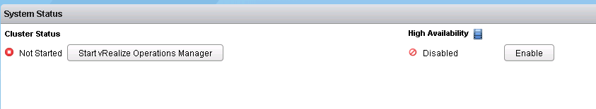 
>  

1.  On the **System Status** page, click **Enable** under** High Availability**. A list of all nodes that have the data node role appears.

2.  In the **Enable High Availability** dialog box, select **vrops-repln-02**, select the **Enable High Availability for this cluster** check box, and click **OK**.

> 
>
> High availability becomes enabled after several minutes. **vrops-mstrn-01** is the master, **vrops-repln-02** is the master replica, and the remaining nodes are data nodes.
>
> 

1.  Under **Cluster Status**, click **Start vRealize Operations Manager**.

>  
>
> A confirmation dialog about initial startup appears.

1.  Click **Yes** to confirm the first startup of vRealize Operations Manager.

> 

1.  After several minutes, the nodes of the cluster are started, and the analytics cluster and remote collectors for Region A are online.

> 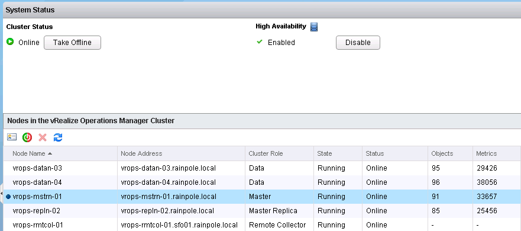

### Assign a License to vRealize Operations Manager

After you deploy and start vRealize Operations Manager in Region A, assign a valid license.

Procedure

1.  In a Web browser, open the administration UI of vRealize Operations Manager.

<!-- -->

1.  Log in to **https://vrops-mstrn-01.rainpole.local**.

2.  Use the **admin** user name and the *vrops\_admin\_password* password.

<!-- -->

1.  On the **Welcome** page of the configuration wizard, examine the process overview, and click **Next**.

> 

1.  On the **Accept EULA** page, accept the end user license agreement, and click **Next**.

2.  On the **Enter Product License Key** page, enter vRealize Operations manager product license key.

<!-- -->

1.  Select **Product Key **and enter the license key.

2.  Click **Validate License Key,** and click **Next**.

> 

1.  (Optional) On the **Customer Experience Improvement Program** page, to send technical information for product improvement, select **Enable Customer Experience Improvement Program** and click **Next**.

> 

1.  On the **Ready to Complete** page, click **Finish**.

> 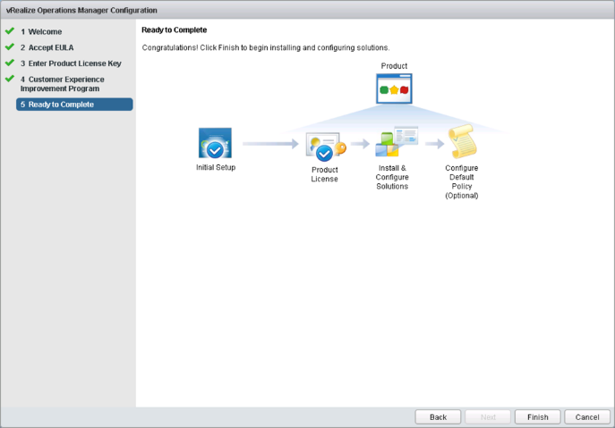
>
> The user interface of vRealize Operations Manager opens.

### Group Remote Collector Nodes in Region A

After you start vRealize Operations Manager and assign it a license, join the remote collectors in a group for adapter resiliency in the cases where the collector experiences network interruption or becomes unavailable. 

1.  In a Web browser, log in to vRealize Operations Manager.

<!-- -->

1.  Go to **https://vrops-mstrn-01.rainpole.local.**

2.  Use the **admin** user name and the ***vrops\_admin\_password*** password to log in.

<!-- -->

1.  From the **Home** page, click **Administration**, and click **Collector Groups**.

> 

1.  Click the **Add** icon.

> 

1.  In the **Add New Collector Group** dialog, for group name enter **SFO01** and for description **Remote collector group for Region A**.

2.  Select the **vrops-rmtcol-01** and **vrops-rmtcol-02** collectors, and click **Save.**

> 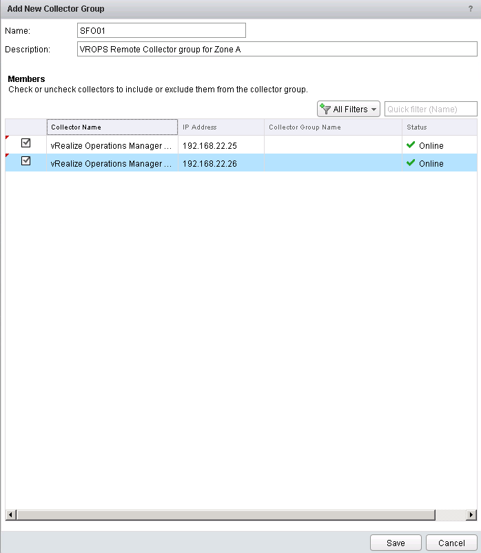
>
> The SFO01 group appears on the **Collector Groups** page.
>
> 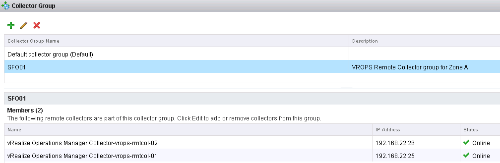

### Verify and Import the CA-Signed Certificate on Your Computer

After you start vRealize Operations Manager and configure the remote collector group for Region A, verify and accept the CA-signed certificate that the Web browser displays when you log in to each node, for example, in to the master replica node vrops-repln-02.rainpole.local.

Procedure

1.  In a Web browser, go to **https://vrops-repln-02.rainpole.local.** A warning message that the connection is not trusted appears.

> 

1.  To review the certificate, click the padlock.

2.  Verify that the **Subject Alternative Name** contains the names of the cluster nodes.

> 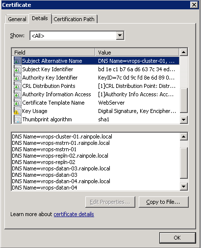

1.  If you access vRealize Operations Manager from an external location, import the certificate. You can use Certificate Manager on Windows or Keychain Access on MAC OS X. The certificate is required for connection to the external VIP address of the load balancer.

    1.  Configure Load Balancer for vRealize Operations Manager in Region A
        -------------------------------------------------------------------

Configure load balancing for the analytics cluster on the dedicated NSX Edge service gateway for Region A. 

1.  Remote collector cluster for Region A does not require load balancing.

Prerequisites

Verify that the NSX Manager for the management cluster has the management virtual application network for the analytics cluster configured. 

Procedure

1.  In a Web browser, log in to the Management vCenter Server by using the vSphere Web Client.

<!-- -->

1.  Go to **https://mgmt01vc01.sfo01.rainpole.local/vsphere-client**.

2.  Use the **administrator@vsphere.local **user name and the ***vsphere\_admin\_password*** password to log in.

<!-- -->

1.  From the **Home** menu, select **Networking & Security**. The vSphere Web Client displays the **NSX Home** page.

2.  On the **NSX Home** page, click **NSX Edges** and select **172.16.11.65** from the **NSX Manager** drop-down menu at the top of the **NSX Edges** page.

3.  On the **NSX Edges** page, double-click the **vROps01-Edge** NSX edge.

> 

1.  On the **Manage** tab, click the **Settings** tab and click **Interfaces**.

2.  Select the interface **Public** and click the **Edit** icon.

3.  In the **Edit NSX Edge Interface** dialog box, click the **Edit** icon and in the **Secondary IP Addresses** text box enter the **10.158.130.48** VIP address. You use the VIP address for vRealize Operations Manager load balancing. 

> 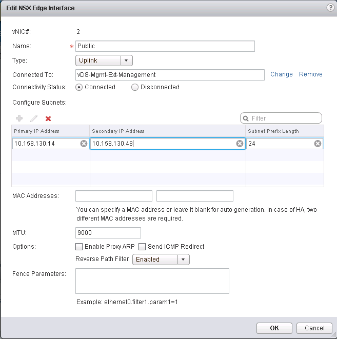

1.  Click on **OK** to save the configuration. 

2.  On the **Manage** tab for the vRops01-Edge device, click the **Load Balancer** tab.

3.  Under **Global Configuration**, click **Edit**.

> 

1.  In the **Edit Load balancer global configuration** dialog box, configure the load balancer.

<!-- -->

1.  Do not enable acceleration.

> 

1.  Select the **Enable Load Balancer** check box.

2.  Select the **Logging** check box and in the **Log Level** drop-down menu leave the default Info value. 

3.  Click **OK**.

<!-- -->

1.  Create an application profile.

<!-- -->

1.  On the **Manage** tab for the vRops01-Edge device, click the **Load Balancer** tab,

2.  Click **Application profiles**, and click the **Add **icon.

3.  In the **New Profile** dialog box, configure the profile for HTTPS traffic, and click **OK**.

| **Option**                 | **Value**    |     |
|----------------------------|--------------|-----|
| **Name**                   | VROPS\_HTTPS |     |
| **Type**                   | HTTPS        |     |
| **Enable SSL Passthrough** | Selected     |     |
| **Persistence**            | Source IP    |     |
| **Expires in (Seconds)**   | 1800         |     |
| **Client Authentication**  | Ignore       |     |

> 

1.  Create service monitoring entry.

<!-- -->

1.  On the **Load Balancer** tab for the of the vROps01-Edge device, click **Service Monitoring** and click the **Add** icon.

2.  In the **New Service Monitoring** dialog box, configure the health check parameters for HTTPS traffic, and click **OK**.

| **Option**   | **Value**                 |
|--------------|---------------------------|
| **Name**     | VROPS\_MONITOR            |
| **Interval** | 3                         |
| **Timeout**  | 5                         |
| **Retries**  | 2                         |
| **Type**     | HTTPS                     |
| **Method**   | GET                       |
| **URL**      | /ui/heartbeat.action      |
| **Receive**  | ok (*must be lower case*) |

> 

1.  Add a server pool. 

<!-- -->

1.  On the **Load Balancer** tab of the vROps01-Edge device, select **Pools**, and click the **Add** icon. 

2.  In the **New Pool** dialog box, configure the load balancing profile.

| **Option** | **Value**      |
|------------|----------------|
| Name       | VROPS\_POOL    |
| Algorithm  | LEASTCONN      |
| Monitors   | VROPS\_MONITOR |

> 

1.  In the **Members** section, add one member for each node of the analytics cluster and click **OK**. 

| **Option**          | **Value**                        |
|---------------------|----------------------------------|
| **Enable Member**   | Selected.                        |
| **Name**            | vrops-mstrn-01                   

                       vrops-repln-02                    

                       vrops-datan-03                    

                       vrops-datan-04                    |
| **IP Address**      | 192.168.21.21 for vrops-mstrn-01

                       192.168.21.22 for vrops-repln-02  

                       192.168.21.23 for vrops-datan-03  

                       192.168.21.24 for vrops-datan-04  |
| **Port**            | 443                              |
| **Monitor Port**    | 443                              |
| **Weight**          | 1                                |
| **Max Connections** | 8                                |
| **Min Connections** | 8                                |

> 
>
> After you add the analytics cluster nodes to the pool, you see them in the **Members** table.
>
> 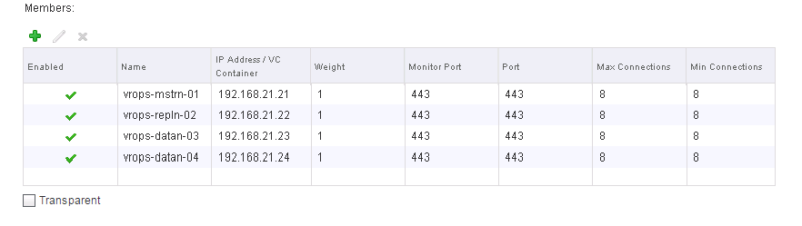

1.  In the **New Pool** dialog box, click **OK**.

<!-- -->

1.  Add a virtual server. 

<!-- -->

1.  On the **Load Balancer **tab of the vROps01-Edge device, select **Virtual Servers** and click the **Add** icon. 

2.  In the **New Virtual Server** dialog box, configure the settings of the virtual server for the analytics cluster and click **OK**.

| **Option**                | **Value**                                                                                                                        |
|---------------------------|----------------------------------------------------------------------------------------------------------------------------------|
| **Enable Virtual Server** | Selected.                                                                                                                        |
| **Application Profile**   | VROPS\_HTTPS                                                                                                                     |
| **Name**                  | VROPS\_VIRTUAL\_SERVER                                                                                                           |
| **IP Address**            | 10.158.130.48                                                                                                                    

                             Click **Select IP Address**, select **Public** from the drop-down menu and then select **10.158.130.48** IP for the virtual NIC.  |
| **Protocol**              | HTTPS                                                                                                                            |
| **Port**                  | 443                                                                                                                              |
| **Default Pool**          | VROPS\_POOL                                                                                                                      |

> You can connect to the analytics cluster at the public Virtual Server IP address over HTTPS: [**https://vrops-cluster-01.rainpole.local**](https://vrops-cluster-01.rainpole.local).
>
>  

1.  Configure auto redirect from HTTP to HTTPS requests.

> The NSX Edge can redirect users from HTTP to HTTPS without entering another URL in the browser.

1.  On the **Load Balancer **tab of the vROps01-Edge device, select **Application Profiles** and click the **Add** icon.

2.  In the **Add Application Rule** dialog box, configure the application profile settings and click **OK**.

| **Option**            | **Value**                             |
|-----------------------|---------------------------------------|
| **Name**              | VROPS\_REDIRECT                       |
| **Type**              | HTTP                                  |
| **HTTP Redirect URL** | https://10.158.130.48/ui/login.action |
| **Persistence**       | Source IP                             |
| **Expires in**        | 1800                                  |

> 

1.  On the **Load Balancer** tab of the vROps01-Edge device, select **Virtual Servers** and click **Add**.

2.  Configure the settings of the virtual server for HTTP redirects.

| **Option**                | **Name**                   |
|---------------------------|----------------------------|
| **Enable Virtual Server** | Selected                   |
| **Application Profile**   | VROPS\_REDIRECT            |
| **Name**                  | VROPS\_REDIRECT            |
| **IP Address**            | Same as existing Public IP |
| **Protocol**              | HTTP                       |
| **Port**                  | 80                         |
| **Default Pool**          | NONE                       |

> You can connect to the analytics cluster at the public Virtual Server IP address over HTTP at the **http://vrops-cluster-01.rainpole.local** address.
>
> 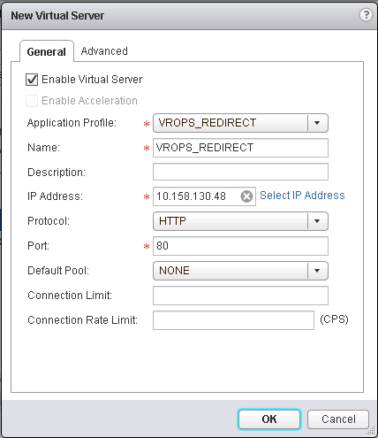 

1.  Verify the pool configuration by examining the pool statistics which reflects the status of the components behind the load balancer.

<!-- -->

1.  Log out and log in again to the vSphere Web Client.

2.  Click **Networking & Security** and then click **NSX Edges**.

3.  Double-click the **vROPs01-Edge** device.

4.  On **Manage** tab, click the **Load Balancer** tab.

5.  Click **Pools** and click **Show Pool Statistics**.

> You see that the load balancer pool is up.
>
> 
>
> 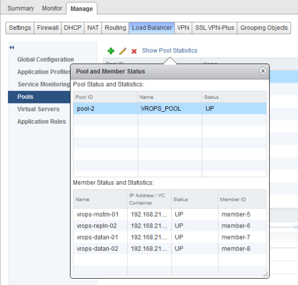

Connect vRealize Operations Manager to the vSphere Environment in Region A
--------------------------------------------------------------------------

After you set up vRealize Operations Manager and the network access to it, connect it to the Management vCenter Server and the Compute vCenter Server to start collecting monitoring data from the vCenter Server instances and the ESXi hosts.

### Configure User Privileges in vSphere for Integration with vRealize Operations Manager for Region A

Assign the permissions to the svc-vrops user for access from vRealize Operations Manager to the Management vCenter Server and Compute vCenter Server in Region A.

Prerequisites

-   Verify that the Management vCenter Server and Compute vCenter Server for Region A are connected to the Active Directory domain.

-   Verify that the users and groups from the rainpole.local domain are available in the Management vCenter Server and in the Compute vCenter Server for Region A.

Procedure

1.  In a Web browser, log in to vCenter Server by using the vSphere Web Client.

<!-- -->

1.  Go to the following URL.

| vCenter Server                | URL                                                     |
|-------------------------------|---------------------------------------------------------|
| **Management vCenter Server** | https://mgmt01vc01.sfo01.rainpole.local/vsphere-client/ |
| **Compute vCenter Server**    | https://comp01vc01.sfo01.rainpole.local/vsphere-client/ |

1.  Use the **administrator@vsphere.local** user name and the ***vsphere\_admin\_password*** password to log in.

<!-- -->

1.  In the vSphere Web Client, navigate to the vCenter Server object in Region A.

| vCenter Server                | Object                          |
|-------------------------------|---------------------------------|
| **Management vCenter Server** | mgmt01vc01.sfo01.rainpole.local |
| **Compute vCenter Server**    | comp01vc01.sfo01.rainpole.local |

1.  Right-click the vCenter Server object and click **Add Permission**.

>  

1.   In the **Add Permission** dialog box, click the **Add** button to add permissions to a user or a group.

> 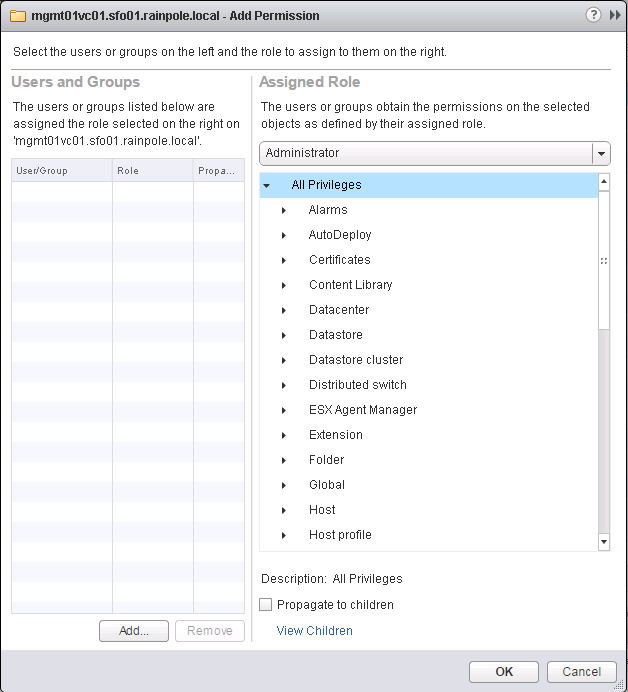

1.  In the **Select Users/Groups** dialog box, from the **Domain** drop-down menu, select **RAINPOLE** and in the filter box type svc. 

2.  From the list of users and groups, select **svc-vrops**, click the **Add **button, and click **OK**.

> 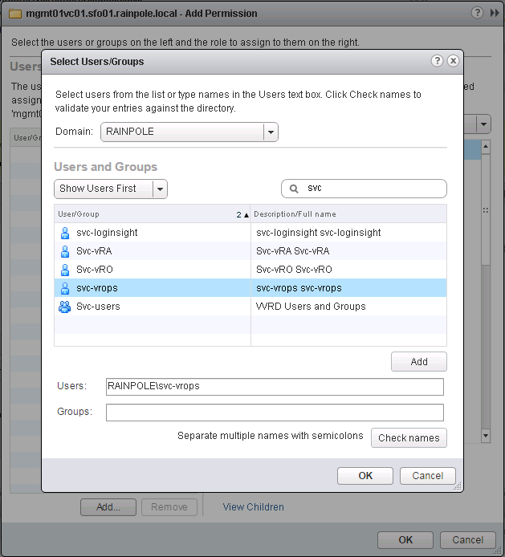

1.  In **Add Permission** dialog box, from the **Assigned Role** drop-down menu, select **Read-only**, and click **OK**.

> 

1.  Repeat the steps for the other vCenter Server instance in Region A.

> The **svc-vrops** user has read-only access to all objects in vCenter Server.

### Add vCenter Adapter Instances for Region A in vRealize Operations Manager

After you deploy the analytics cluster and the remote collector nodes of vRealize Operations Manager in Region A and start vRealize Operations Manager, add vCenter Adapter instances for the Management and Compute vCenter Server instances in Region A.

Prerequisites

-   Verify that the Management vCenter Server and Compute vCenter Server are running.

-   Verify that the Management vCenter Server and Compute vCenter Server are configured with the rainpole.local Active Directory domain.

-   Create a custom read-only role for user svc-vrops.

Procedure

1.  In a Web browser, log in to the user interface of vRealize Operations Manager.

> If you use the public interface to the SDDC, go to **https://vrops-cluster-01.rainpole.local**.
>
> If you have access to the vSphere management network, go to **https://vrops-mstrn-01.rainpole.local**.

1.  Use the **admin** user name and the ***vrops\_admin\_password*** password to log in.

2.  In the left pane of vRealize Operations Manager, click **Administration**, and click **Solutions**.

3.  From the solution table on the **Solutions** page, select the **VMware vSphere** solution, and click **Configure**.

> 
>
> The **Manage Solution - VMware vSphere** wizard appears**.**

1.  On the** Configure adapters** page, from the **Adapter Type** table at the top, select **vCenter Adapter**. Empty settings for the vCenter Adapter appear under **Instance Settings** if vRealize Operations Manager does not have vCenter Adapters configured. 

2.  Under **Instance Settings**, enter the settings for connection to vCenter Server.

<!-- -->

1.  If you already have added another vCenter Adapter, click the **Add** icon to add an adapter setting.

2.  Enter the name, description and FQDN of vCenter Server.

| Management vCenter Server Attribute | Value                                  |
|-------------------------------------|----------------------------------------|
| **Name**                            | mgmt01vc01-sfo01                       |
| **Description**                     | Management vCenter Server for Region A |
| **vCenter Server**                  | mgmt01vc01.sfo01.rainpole.local        |

| Compute vCenter Server Attribute | Value                               |
|----------------------------------|-------------------------------------|
| **Name**                         | comp01vc01-sfo01                    |
| **Description**                  | Compute vCenter Server for Region A |
| **vCenter Server**               | comp01vc01.sfo01.rainpole.local     |

> 

1.  Click the **Add** icon, and configure the credentials for connection to vCenter Server. 

| Management vCenter Server Credentials Attribute | Value                        |
|-------------------------------------------------|------------------------------|
| **Credential name**                             | mgmt01vc01-sfo01-credentials |
| **User Name**                                   | svc-vrops@rainpole.local     |
| **Password**                                    | *svc-vrops-password*         |

| Compute vCenter Server Credentials Attribute | Value                        |
|----------------------------------------------|------------------------------|
| **Credential name**                          | comp01vc01-sfo01-credentials |
| **User Name**                                | svc-vrops@rainpole.local     |
| **Password**                                 | *svc-vrops-password*         |

> 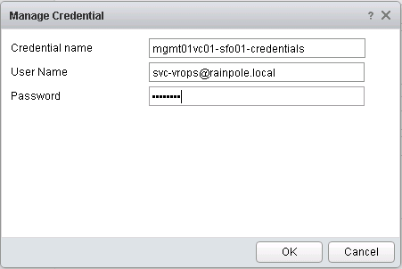

1.  Click **Test Connection** to validate the connection to vCenter Server.
    The vCenter Server certificate appears.

2.  In the** Review and Accept Certificate** dialog box, verify the certificate information and click **OK**.

> 

1.  Click **OK** in the test connection Info dialog box.

2.  Expand the **Advanced Settings** group of settings.

3.  From the **Collectors/Groups** drop-down menu, select the **SFO01** group.

> 

1.  Click **Save Settings**.

2.  Repeat the steps for the other vCenter Server instance.

<!-- -->

1.  In the **Manage Solution - VMware vSphere** wizard, click **Next**.

2.  In the **Define monitoring goals** page, under **Enable vSphere Hardening Guide Alerts? **select **Yes**, leave the default configuration for the other options, and click **Next**.

> 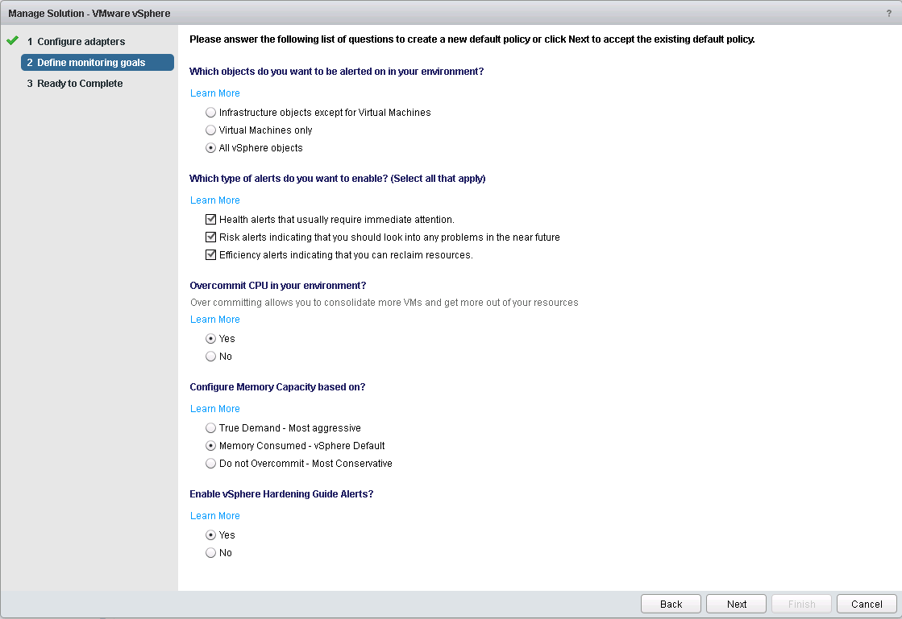

1.  On the **Ready to complete** page, click **Finish**.** **

> ** **

On the **Solutions **page, when you select **VMware vSphere **from the solution table, the **Collection State** of the vCenter Adapters is **Collecting **and the **Collection Status **is **Data receiving**.

Install the vRealize Operations Manager Management Pack for vRealize Log Insight
--------------------------------------------------------------------------------

You install the vRealize Operations Manager Management Pack for vRealize Log Insight to examine the log information about objects that you monitor by using the vRealize Operations Manager user interface. You see the log events for the objects in the user interface of vRealize Log Insight.

Prerequisites

Install vRealize Operations Manager

Download the vRealize Operations Manager Management Pack for vRealize Log Insight from *VMware Solutions Exchange*.

Procedure

1.  In a Web browser, go to the main page of vRealize Operations Manager.

-   If you use the public interface to the SDDC, go to https://vrops-cluster-01.rainpole.local.

-   If you have access to the vSphere management network, go to **https://vrops-mstrn-01.rainpole.local**.

1.  Use the **admin** user name and **vrops\_admin\_password** to log in.

2.  In the left pane of vRealize Operations Manager, click **Administration**, and click **Solutions**.

3.  On the **Solutions** page, click the **Add** icon.

    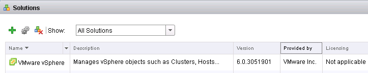

> The Add Solutions wizard appears.

1.  On the **Select Solutions** page, browse to the .pak file of the vRealize Operations Manager management pack for vRealize Log Insight and click **Upload**.

> 

1.  After the upload is complete, click **Next**.

> 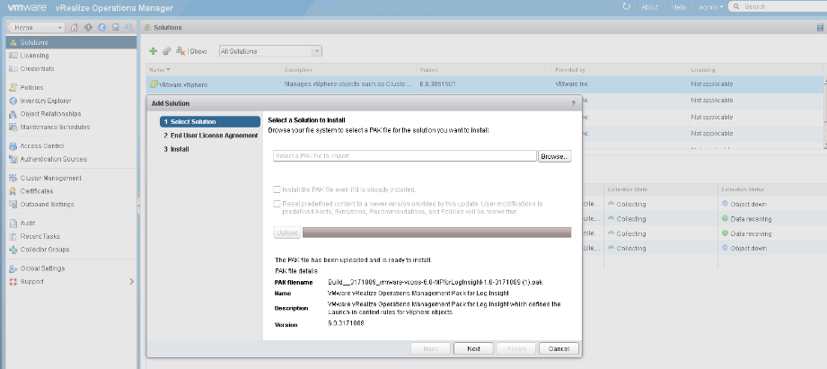

1.  On the **End User License Agreement** page, accept the license agreement and click **Next**.

> 

1.  The installation of the management pack starts. You see its progress on the Install page.

2.  After the installation is complete, click **Finish** on the **Install** page.

> 

1.  You see the Log Insight solution on the **Solutions** page of the vRealize Operations Manager user interface.

> 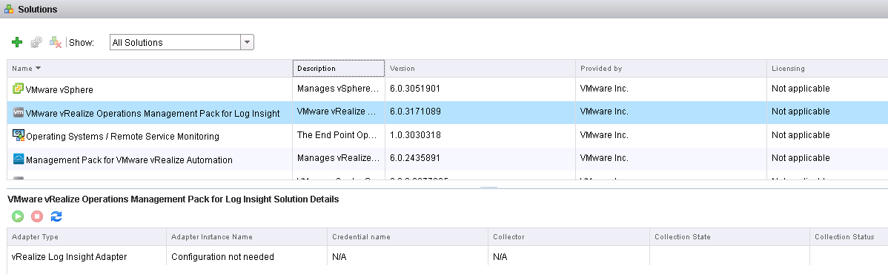

Connect vRealize Operations Manager to the NSX Managers in Region A
-------------------------------------------------------------------

Install and configure the vRealize Operations Management Pack for NSX for vSphere to monitor the NSX networking services deployed in each vSphere cluster and view the vSphere hosts in the NSX transport zones. You can also access end to end logical network topologies between any two virtual machines or NSX objects for better visibility into logical connectivity. Physical host and network device relationship in this view also helps in isolating problems in the logical or physical network.

-   [Install the vRealize Operations Manager Management Pack for NSX for vSphere in Region A](file:///C:\display\ITAC10\Install+the+vRealize+Operations+Manager+Management+Pack+for+NSX+for+vSphere+in+Region+A)

-   [Configure NSX-vSphere Adapters for Region A in vRealize Operations Manager](file:///C:\display\ITAC10\Configure+NSX-vSphere+Adapters+for+Region+A+in+vRealize+Operations+Manager)

-   [Configure a Physical Discovery Adapter for Region A in vRealize Operations Manager](file:///C:\display\ITAC10\Configure+a+Physical+Discovery+Adapter+for+Region+A+in+vRealize+Operations+Manager)

    1.  ### Install the vRealize Operations Manager Management Pack for NSX for vSphere in Region A

Install the .pak file for the management pack for NSX for vSphere to add the management pack as a solution to vRealize Operations Manager.

**Prerequisites**

-   Download the .pak file for the vRealize Operations Manager Management Pack for NSX for vSphere from VMware Solutions Exchange.

-   Verify that the vCenter Server instances for Region A are deployed.

-   Verify that the NSX is installed and configured for the management cluster, and for the compute and edge clusters.

-   Verify that vRealize Operations Manager is deployed and its analytics cluster is started. 

-   Verify that the management pack for vRealize Log Insight is installed in vRealize Operations Manager.

-   Verify that you have the remote collector nodes for Region A deployed and grouped.

**Procedure**

1.  In a Web browser, open the main page of vRealize Operations Manager.

-   If you use the public interface to the SDDC, go to **https://vrops-cluster-01.rainpole.local**.

-   If you have access to the vSphere management network, go to **https://vrops-mstrn-01.rainpole.local**.

1.  Use the **admin** user name and ***vrops\_admin\_password*** password to log in.

2.  In the left pane of vRealize Operations Manager, click **Administration** and click **Solutions**.

3.  On the **Solutions** page, click the **Add** icon.

> 

1.  On the **Select Solutions** page from the **Add Solution** wizard, browse to the .pak file of the vRealize Operations Manager Management Pack for NSX for vSphere and click Upload. After the NSX management pack file has been uploaded, you see details about the management pack.

> 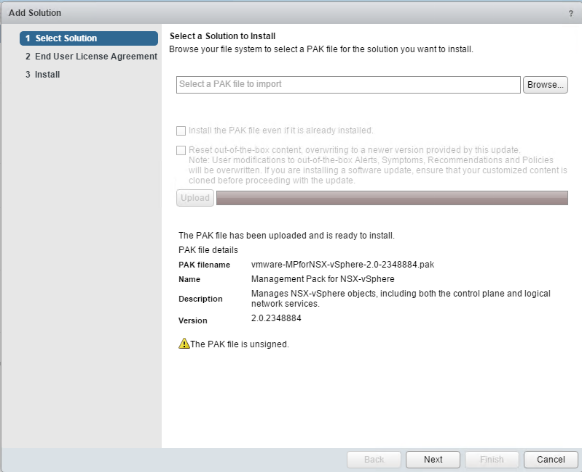

1.  After the upload is complete, click **Next**.

2.  In the confirmation dialog box, click **Yes** to confirm that you are to install an unsigned solution for vRealize Operations Manager.

3.  On the **End User License Agreement** page, accept the license agreement and click **Next**.

> 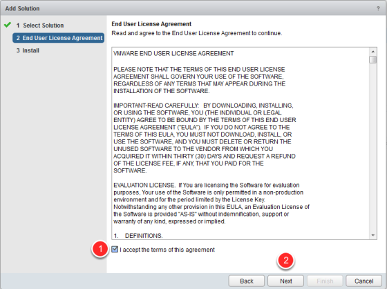
>
> The installation of the management pack starts. You see its progress on the Install page.
>
> 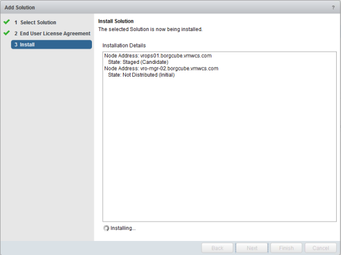

1.   After the installation is complete, click **Finish** on the **Install** page.

> 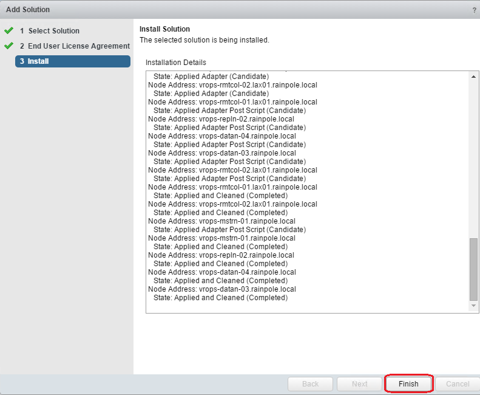
>
> You see the Management Pack for NSX-vSphere solution on the **Solutions** page of the vRealize Operations Manager user interface.
>
> 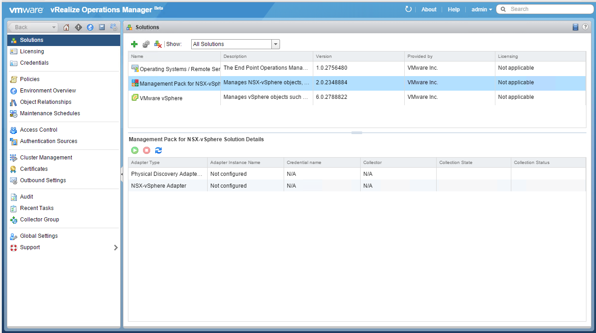

### Configure NSX-vSphere Adapters for Region A in vRealize Operations Manager

After you install the management pack, configure NSX-vSphere Adapters: one for the NSX Manager for the management cluster and one for the NSX Manager for the compute and edge clusters. 

1.  In a Web browser, open the main page of vRealize Operations Manager.

-   If you use the public interface to the SDDC, go to **https://vrops-cluster-01.rainpole.local**.

-   If you can connect to the vSphere management network, go to **https://vrops-mstrn-01.rainpole.local**.

1.  Use the **admin** user name and the ***vrops\_admin\_password*** password to log in.

2.  In the left pane of vRealize Operations Manager, click **Administration**, and click **Solutions**.

3.  From the solution table on the **Solutions** page, select the **Management Pack for NSX-vSphere **solution, and click Configure.

> 

1.  On the **Configure adapters** page of the **Manage Solution - Management Pack for NSX-vSphere** wizard, from the Adapter Type table at the top, select NSX-vSphere Adapter.Empty settings for the NSX-vSphere Adapter appear under **Instance Settings** if vRealize Operations Manager does not have NSX-vSphere Adapters configured. 

2.  Under **Instance Settings**, enter the settings for connection to the NSX Manager for the management cluster or to the NSX Manager for the compute and edge clusters.

<!-- -->

1.  If you already have added another NSX-vSphere Adapter, click the Add icon to add an adapter setting.

2.  Enter the name, description, the FQDN of NSX Manager and the FQDN of the vCenter Server that is connected to the NSX Manager.

> 

| Management NSX for vSphere Attribute             | Value                                                                                        |
|--------------------------------------------------|----------------------------------------------------------------------------------------------|
| **Name**                                         | Mgmt NSX Adapter - SFO01                                                                     |
| **Description**                                  | -                                                                                            |
| **NSX Manager Host**                             | mgmt01nsxm01.sfo01.rainpole.local                                                            |
| **VC Host**                                      | mgmt01vc01.sfo01.rainpole.local                                                              |
| **Enable Log Insight integration if configured** | true                                                                                         

                                                    You enable automatic log forwarding to Log Insight for log data related to NSX for vSphere.   |

| Compute/Edge NSX for vSphere Attribute           | Value                                                                                       |
|--------------------------------------------------|---------------------------------------------------------------------------------------------|
| **Name**                                         | Comp NSX Adapter - SFO01                                                                    |
| **Description**                                  | -                                                                                           |
| **NSX Manager Host**                             | comp01nsxm01.sfo01.rainpole.local                                                           |
| **VC Host**                                      | comp01vc01.sfo01.rainpole.local                                                             |
| **Enable Log Insight integration if configured** | true                                                                                        

                                                    You enable automatic log forwarding to Log Insight for log data related to NSX for vSphere.  |

1.  Click the **Add** icon, and configure the credentials for connection to the NSX Manager and vCenter Server, and click **OK**. 

> 

| Management NSX for vSphere and vCenter Server Credential | Value                                                    |
|----------------------------------------------------------|----------------------------------------------------------|
| **Credential name**                                      | Credentials to Management vCenter Server and NSX Manager |
| **NSX User Name**                                        | admin                                                    |
| **NSX Manager Password**                                 | *mgmt\_nsx\_manager\_password*                           |
| **vCenter User Name**                                    | administrator@vsphere.local                              |
| **vCenter Password**                                     | *mgmt\_vc\_administrator\_password*                      |

| Compute/Edge NSX for vSphere and vCenter Server Credential | Value                                                      |
|------------------------------------------------------------|------------------------------------------------------------|
| **Credential name**                                        | Credentials to Compute/Edge vCenter Server and NSX Manager |
| **NSX Manager User Name**                                  | admin                                                      |
| **NSX Manager Password**                                   | *comp\_nsx\_manager\_password*                             |
| **vCenter User Name**                                      | administrator@vsphere.local                                |
| **vCenter Password**                                       | *comp\_vc\_administrator\_password*                        |

1.  Click **Test Connection** to validate the connection to the Management NSX Manager or Compute NSX Manager. The NSX Manager certificate appears.

2.  In the **Review and Accept Certificate** dialog box, verify the NSX certificate information and click **OK**.

> 

1.  Click **OK** in the test connection dialog box.

> 

1.  Expand the **Advanced Settings** section of settings, and from the **Collectors/Groups** drop-down menu, select the **SFO01** group.

2.  Click **Save Settings** and click **OK** in the information box that appears.

>  

1.  Repeat the steps to create an NSX-vSphere Adapter for the second NSX Manager.

<!-- -->

1.  In the **Manage Solution - Management Pack for NSX-vSphere** dialog box, click **Close**.

> The two NSX-vSphere Adapters are available on the Solutions page of the vRealize Operations Manager user interface. The Collection State of the adapters is Collecting and the Collection Status is Data receiving.
>
> 

Configure a Physical Discovery Adapter for Region A in vRealize Operations Manager
----------------------------------------------------------------------------------

Configure a Physical Discovery Adapter to monitor the switches and routers in your environment, and view related alerts, metrics and object capacity.

Prerequisites

1.  To monitor network devices, SNMP must be enabled in your network environment. 

-   For complete monitoring of your environment, Link Layer Discovery Protocol (LLDP) or Cisco Discovery Protocol (CDP) must also be enabled on each network device.

Procedure

1.  In a Web browser, open the main page of vRealize Operations Manager.

-   If you use the public interface to the SDDC, go to **https://vrops-cluster-01.rainpole.local**.

-   If you can connect to the vSphere management network, go to **https://vrops-mstrn-01.rainpole.local**.

1.  Use the **admin** user name and the ***vrops\_admin\_password*** password to log in.

2.  In the left pane of vRealize Operations Manager, click **Administration** and click **Solutions**.

3.  From the solution table on the **Solutions** page, select **the Management Pack for NSX-vSphere** solution and click **Configure**.

4.  On the **Configure adapters** page of the **Manage Solution - Management Pack for NSX-vSphere** wizard, from the **Adapter Typ**e table at the top, select **Physical Discovery Adapter**.
    Empty settings for the Physical Adapter appear under **Instance Settings** if vRealize Operations Manager does not have Physical Discovery Adapters configured. 

5.  Under **Instance Settings**, enter the settings for SNMP connection to the NSX Manager for the management cluster or to the NSX Manager for the compute and edge clusters.

> 

-   For SNMPv1 and SNMPv2 devices, enter a comma-separated list of community names (default is public) and SNMP ports (default is 161).

-   For SNMPv3 devices, provide SNMPv3 credentials in addition to the settings for SNMPv1 and SNMPv2.

1.  Click **Test Connection** to verify the settings, and if the test is successful click the **OK** button. 

> 

1.  If you deploy a dual-region SDDC configuration that contains remote collector nodes, expand the **Advanced Settings** section of settings, and from the **Collectors/Groups** drop-down menu, select the **SFO01** group. Click **Save Settings** and click **Yes** in the information box that appears.

>  
>  

1.  In the **Manage Solution - Management Pack for NSX-vSphere** dialog box, click **Close**.

> The Physical Discovery Adapter appears on the Solutions page of the vRealize Operations Manager user interface. The adapter is collecting data about the network devices in Region A of the SDDC.
>
> 

Connect vRealize Operations Manager to vRealize Automation in Region A
----------------------------------------------------------------------

Install and configure the vRealize Operations Manager Management Pack for vRealize Automation to monitor the health and capacity risk of your cloud infrastructure in the context of the tenant's business groups.

-   [Install the vRealize Operations Manager Management Pack for vRealize Automation in Region A](file:///C:\display\ITAC10\Install+the+vRealize+Operations+Manager+Management+Pack+for+vRealize+Automation+in+Region+A)

-   [Add vRealize Automation Adapter in vRealize Operations Manager](file:///C:\display\ITAC10\Add+vRealize+Automation+Adapter+in+vRealize+Operations+Manager)

    1.  ### Install the vRealize Operations Manager Management Pack for vRealize Automation in Region A

Install .pak file for vRealize Operations Manager Management Pack for vRealize Automation so it becomes a solution in vRealize Operations Manager.

Prerequisites

-   Download the .pak file for the vRealize Operations Manager Management Pack for vRealize Automation from VMware Solutions Exchange.

-   Verify that vRealize Operations Manager is deployed and its analytics cluster is started. 

-   Verify that vRealize Automation is deployed.

Procedure

1.  In a Web browser, open the main page of vRealize Operations Manager.

-   If you use the public interface to the SDDC, go to **https://vrops-cluster-01.rainpole.local**.

-   If you have access to the vSphere management network, go to **https://vrops-mstrn-01.rainpole.local**.

1.  Use the **admin **user name and ***vrops\_admin\_password*** password to log in.

2.  In the left pane of vRealize Operations Manager, click **Administration** and click **Solutions**.

3.  On the **Solutions** page, click the **Add** icon.

> 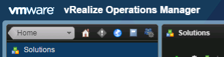

1.  On the **Select Solutions** page of the **Add Solution** wizard, browse to the .pak file of the vRealize Operations Manager Management Pack for vRealize Automation and click **Upload**. After the vRealize Automation management pack file has been uploaded, you see details about the management pack.

> 

1.  After the upload is complete, click **Next**.

2.  In the confirmation dialog box, click **Yes** to confirm that you are to install an unsigned solution for vRealize Operations Manager.

3.  On the **End User License Agreement** page, accept the license agreement and click **Next**.
    The installation of the management pack starts. You see its progress on the **Install** page

4.  After the installation is complete, click **Finish **on the** Install **page**.**

> 

You see the MP for vRealize Automation solution on the Solutions page of the vRealize Operations Manager user interface. 

### Add vRealize Automation Adapter in vRealize Operations Manager

After you install the management pack, configure a vRealize Automation adapter to collect monitoring data from vRealize Automation.

Procedure

1.  In a Web browser, log into the user interface of vRealize Operations Manager.

-   If you use the public interface to the SDDC, go to **https://vrops-cluster-01.rainpole.local**.

-   If you have access to the vSphere management network, go to **https://vrops-mstrn-01.rainpole.local**.

1.  Use the **admin **user name and ***vrops\_admin\_password*** password to log in.

2.  In the left pane of vRealize Operations Manager, click **Administration** and click **Solutions**.

3.  From the solution table on the **Solutions** page, select the **Management pack for VMware vRealize Automation** solution and click the **Configure** button.

> 

1.  On the **Configure adapters** page of the **Manage Solution - Management Pack for VMware vRealize Automation** wizard, from the **Adapter Type** table at the top, select **MP for vRealize Adapter**. Empty settings for the MP for vRealize Adapter appear under Instance Settings because vRealize Operations Manager does not have any vRealize Automation adapters configured.  

2.  Under **Instance Settings**, enter the settings for connection to vRealize Automation.

> 

1.  Enter the name, description, and FQDN of vRealize Automation frontend portal.

| vRealize Automation Adapter Attribute | Value                             |
|---------------------------------------|-----------------------------------|
| **Name**                              | vRA Adapter                       |
| **Description**                       | -                                 |
| **vRealize Automation Appliance URL** | https://vra01svr01.rainpole.local |

1.  Click the **+** icon, configure the credentials for connection to vRealize Automation, and click **OK**. 

> 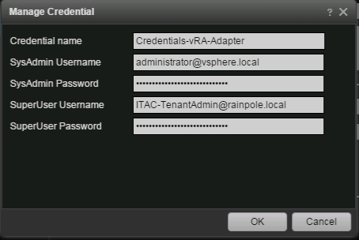

| Management NSX for vSphere and vCenter Server Credentials Attribute | Value                              |
|---------------------------------------------------------------------|------------------------------------|
| **Credential name**                                                 | Credentials-vRA-Adapter            |
| **SysAdmin User Name**                                              | administrator@vsphere.local        |
| **SysAdmin Password**                                               | *vsphere\_administrator\_password* |
| **SuperUser User Name**                                             | ITAC-TenantAdmin@rainpole.local    |
| **SuperUser Password**                                              | *vra\_tenant\_admin\_password*     |

1.  Expand the **Advanced Settings** group of settings, and verify that the **Collectors/Groups** option is set to **Default Collector Group** and the **Autodiscovery** check box is selected.

2.  Click **Test Connection** to validate the connection to vRealize Automation.

3.  In the **Review and Accept Certificate** dialog box, verify the vRealize Automation certificate information and click **OK**.

4.  In the **Review and Accept Certificate** dialog box, verify the IAAS certificate information and click **OK**.

5.  Click **Save Settings **and click **Yes** in the information box that appears.

<!-- -->

1.  In the **Manage Solution - Management Pack for VMware vRealize Automation** dialog box, click **Close**.

> The vRealize Automation adapter appears on the Solutions page of the vRealize Operations Manager user interface. The Collection State of the adapter is Collecting and the Collection Status is Data receiving.
>
> 

Enable Storage Device Monitoring in vRealize Operations Manager in Region A
---------------------------------------------------------------------------

Install and configure the vRealize Operations Management Pack for Storage Devices to view the storage topology, and to monitor the capacity and problems on storage components.

-   Install the vRealize Operations Manager Management Pack for Storage Devices in Region A

-   Add Storage Devices Adapters for Region A in vRealize Operations Manager

    1.  ### Install the vRealize Operations Manager Management Pack for Storage Devices in Region A

Install the .pak file of the management pack for storage devices to add the management pack as a solution to vRealize Operations Manager. 

Prerequisites

-   Download the .pak file for the vRealize Operations Manager Management Pack for Storage Devices from VMware Solutions Exchange.

-   Verify that vRealize Operations Manager is deployed and its analytics cluster is started.

Procedure

1.  In a Web browser, log into vRealize Operations Manager. 

-   If you use the public interface to the SDDC, go to **https://vrops-cluster-01.rainpole.local**.

-   If you can connect to the vSphere management network, go to **https://vrops-mstrn-01.rainpole.local**.

1.  Use the **admin **user name and the ***vrops\_admin\_password*** password to log in.

2.  In the left pane of vRealize Operations Manager, click **Administration** and click **Solutions**.

> 

1.  On **Solutions** page, click the **Add** icon.

2.  On the **Select Solutions** page of the **Add Solution** wizard, browse to the .pak file of the **vRealize Operations Manager Management Pack for Storage Devices** and click **Upload**.

> After the file of the management pack for storage devices has been uploaded, you see details about the management pack.
>
> 

1.  After the upload is complete, click **Next**.

2.  In the confirmation dialog box, click **Yes** to confirm that you are about to install an unsigned solution for vRealize Operations Manager. 

3.  On the **End User License Agreement** page, accept the license agreement and click **Next**. The installation of the management pack starts. You see its progress on the **Install** page.

4.  After the installation is complete, click **Finish** on the **Install** page.

> 

You see the Management Pack for Storage Devices solution on the Solutions page of the vRealize Operations Manager user interface,

### Add Storage Devices Adapters for Region A in vRealize Operations Manager

After you install the management pack, configure Storage Devices adapter to collect monitoring data about the storage devices in the SDDC.

Procedure

1.  In a Web browser, log into the user interface of vRealize Operations Manager.

-   If you use the public interface to the SDDC, go to **https://vrops-cluster-01.rainpole.local**.

-   If you can connect to the vSphere management network, go to **https://vrops-mstrn-01.rainpole.local**.

1.  Use the **admin **user name and the ***vrops\_admin\_password*** password to log in.

2.  From the solution table on the **Solutions** page, select the **Management pack for Storage Devices** solution and click the **Configure** button.

> 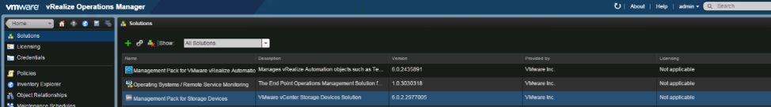

1.  On the **Configure adapters** page of the **Manage Solution - Management Pack for Storage Devices** dialog box, from the **Adapter Type** table at the top, select Storage Devices. Empty settings for the Storage Devices adapter appear under **Instance Settings** if vRealize Operations Manager does not have Storage Devices adapters configured. 

2.  Under **Instance Settings**, enter the settings for connection to the vCenter Server for the management cluster or to the vCenter Server for the compute and edge clusters.

> 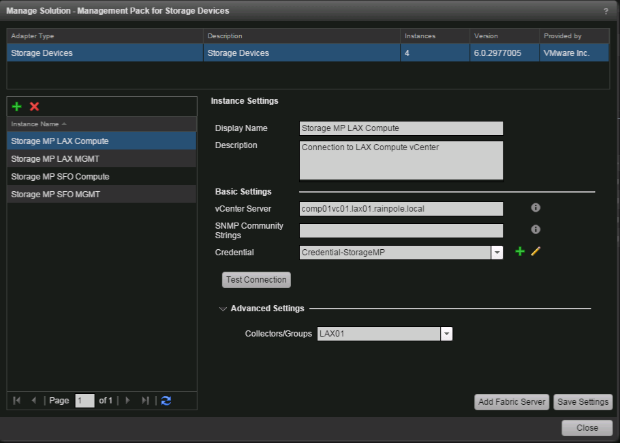

1.  If you have already added another Storage Devices adapter, click the **Add** icon to add an adapter setting.  

2.  Enter the name, description, FQDN of the vCenter Server instance.

| Storage Devices Adapter Attribute | Value                                |
|-----------------------------------|--------------------------------------|
| Name                              | Storage MP SFO MGMT                  |
| Description                       | Connection to SFO Management vCenter |
| vCenter Server                    | mgmt01vc01.sfo01.rainpole.local      |
| SNMP Community Strings            | -                                    |

| Storage Devices Adapter Attribute | Value                             |
|-----------------------------------|-----------------------------------|
| Name                              | Storage MP SFO Compute            |
| Description                       | Connection to SFO Compute vCenter |
| vCenter Server                    | comp01vc01.sfo01.rainpole.local   |
| SNMP Community Strings            | -                                 |

1.  Click the **+** icon, configure the credentials for connection to the vCenter Server, and click **OK**.

> 

| Credential          | Value                       |
|---------------------|-----------------------------|
| **Credential name** | Credential-StorageMP        |
| **User Name**       | administrator@vsphere.local |
| **Password**        | *vsphere\_admin\_password*  |

1.  Expand the **Advanced Settings** section of settings, and from the **Collectors/Groups** drop-down menu, select the **SFO01** remote collector group.

2.  Click **Test Connection** to validate the connection to the Management vCenter Server or the Compute vCenter Server.

3.  In the **Review and Accept Certificate** dialog box, verify the vCenter Server certificate information and click **OK**.

> 

1.  Click **Save Settings** and click **OK** in the information box that appears.

<!-- -->

1.  In the Manage Solution - Management Pack for Storage Devices dialog box, click **Close**.

The Storage Devices adapters appear on the Solutions page of the vRealize Operations Manager user interface. The Collection State of the adapters is Collecting and the Collection Status is Data receiving.

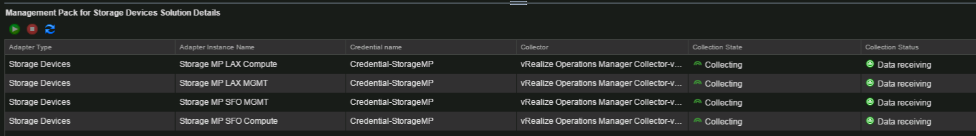

Configure User Access in vRealize Operations Manager in Region A
----------------------------------------------------------------

After you deploy vRealize Operations Manager, add the users from the Active Directory and configure their monitoring roles.

-   [Add an Authentication Source for the Active Directory](file:///C:\display\ITAC10\Add+an+Authentication+Source+for+the+Active+Directory)

-   [Assign Monitoring Roles to Groups in the Active Directory](file:///C:\display\ITAC10\Assign+Monitoring+Roles+to+Groups+in+the+Active+Directory)

-   [Assign Monitoring Roles to Users in the Active Directory](file:///C:\display\ITAC10\Assign+Monitoring+Roles+to+Users+in+the+Active+Directory)

    1.  ### Add an Authentication Source for the Active Directory

Connect vRealize Operations Manager to the Active Directory of the SDDC for central user management and access control.

Procedure

1.  In a Web browser, open the main page of vRealize Operations Manager.

-   If you use the public interface to the SDDC, go to **https://vrops-cluster-01.rainpole.local**.

-   If you can connect to the vSphere management network, go to **https://vrops-mstrn-01.rainpole.local**.

1.  Use the **admin **user name and the ***vrops\_admin\_password*** password to log in.

2.  In the left pane of vRealize Operations Manager, click **Administration** and click **Authentication** Sources.

> 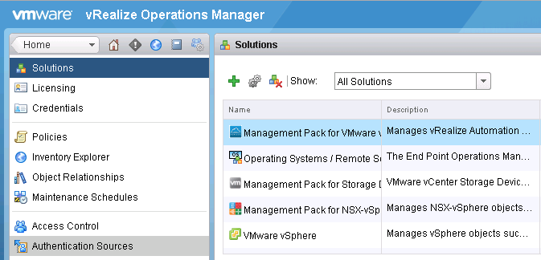

1.  In the **Authentication Sources** page, click the **Add** icon.

> 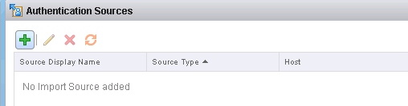

1.  In the **Add Source for User and Group Import** dialog box, enter the settings for the Active Directory.

> 

| Active Directory Setting                                             | Value                         |
|----------------------------------------------------------------------|-------------------------------|
| **Source Display Name**                                              | RAINPOLE.LOCAL                

                                                                        SFO01.RAINPOLE.LOCAL           |
| **Source Type**                                                      | Active Directory              |
| **Integration Mode**                                                 | Basic                         |
| **Domain/Subdomain**                                                 | RAINPOLE.LOCAL                

                                                                        SFO01.RAINPOLE.LOCAL           |
| **Use SSL/TLS**                                                      | Deselected                    |
| **User Name**                                                        | svc-vrops                     |
| **Password**                                                         | svc-vrops\_password           |
| **Settings under the Details section**                               |
| **Automatically synchronize user membership for configured groups ** | Selected                      |
| **Host**                                                             | dc01rpl.rainpole.local        

                                                                        dc01sfo.sfo01.rainpole.local   |
| **Base DN**                                                          | dc=RAINPOLE,dc=LOCAL          

                                                                        dc=SFO01,dc=RAINPOLE,dc=LOCAL  |
| **Common Name**                                                      | userPrincipalName             |

1.  Click the **Test** button to test the connection to the domain controller and in the **Info** success message click **OK**.

> 

1.  In the **Add Source for User and Group Import** dialog box, click **OK**.

    1.  ### Assign Monitoring Roles to Groups in the Active Directory

After you register the Active Directory domain as an authentication source in vRealize Operations Manager, import the user groups that are going to monitor the SDDC and configure the access of the group members to monitoring data. 

Members of the vCAdmins group monitor the operation of the vCenter Server instances and have a read-only access to vRealize Operations Manager data. 

1.  In a Web browser, log in to the user interface of vRealize Operations Manager.

-   If you use the public interface to the SDDC, go to **https://vrops-cluster-01.rainpole.local**.

-   If you can connect to the vSphere management network, go to **https://vrops-mstrn-01.rainpole.local**.

1.  Use the **admin **user name and the ***vrops\_admin\_password*** password to log in.

2.  In the left pane of vRealize Operations Manager, click **Administration** and click **Access Control**.

3.  On the **Access Control** page, click the **User Groups** tab.

> 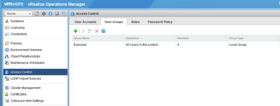

1.  Click the **Import Groups** icon. 

2.  In the Import Groups dialog, import the vCAdmins group.  

<!-- -->

1.  From the **Import From** drop-down menu, select **RAINPOLE.LOCAL**.

2.  Select the **Basic** option for the search query.

3.  In the **Search String** text box, enter **vcadmin** and click **Search**. The search results contain the **vCAdmins** user. 

4.  In the search result, select the **vCAdmins** entry.

5.  Click **Next**.

> 

1.  In the **Assign Groups, Roles, and Objects** page, assign the **ReadOnly** role to the **vCAdmins** user group.

<!-- -->

1.  Click the **Roles** tab.

2.  Select the **ReadOnly** item.

> 

1.  In the **Assign Groups, Roles, and Objects** page, configure read-only access of the **vCAdmins** user group on all objects.

<!-- -->

1.  Click the **Objects** tab.

2.  Select **Allow access to all objects in the system**.

> 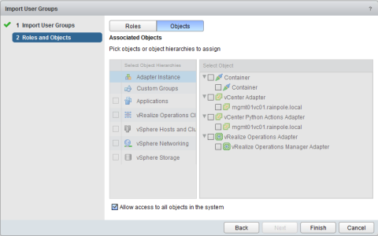

1.  Click **Finish**.

    1.  ### Assign Monitoring Roles to Users in the Active Directory

After you register the Active Directory domain as an authentication source in vRealize Operations Manager, import the users and groups that are going to monitor the SDDC and configure their access to monitoring data. 

Procedure

1.  In a Web browser, log into the user interface of vRealize Operations Manager.

-   If you use the public interface to the SDDC, go to **https://vrops-cluster-01.rainpole.local**.

-   If you can connect to the vSphere management network, go to **https://vrops-mstrn-01.rainpole.local**.

1.  Use the **admin **user name and the ***vrops\_admin\_password*** password to log in.

2.  In the left pane of vRealize Operations Manager, click **Administration** and click **Access Control**.

3.  On the **Access Control** page, click the **User Accounts** tab.

4.  Click the **Import Users** icon.

5.  In the **Import Users** dialog box, import the **vROps-Admin** user.

<!-- -->

1.  From the **Import From** drop-down menu, select **SFO01.RAINPOLE.LOCAL**.

2.  Select the **Basic** option for the search query.

3.  In the **Search String** text box, enter **vrops** and click **Search**. The search results contain the **vROps-Admin** user. 

4.  In the search result, select the **vROps-Admin@sfo01.rainpole.local** entry

5.  Click **Next**.

> 

1.  In the **Assign Groups, Roles, and Objects page**, assign the **ContentAdmin** role to the **vROps-Admin@sfo01.rainpole.local** user account.

<!-- -->

1.  Click the **Objects** tab.

2.  Select the **ContentAdmin** item from the drop-down menu.

3.  Select **Assign this role to the user**.

<!-- -->

1.  Select **Allow access to all objects in the system**.

> 

1.  Click **Finish**.

    1.  Configure E-Mail Alerts in vRealize Operations Manager
        ------------------------------------------------------

You configure e-mail notifications in vRealize Operations Manager so that users and applications receive the administrative alerts from vRealize Operations Manager about certain situations in the data center. 

Prerequisites

-   Verify that you have access to an SMTP server.

Procedure

1.  In a Web browser, open the main page of vRealize Operations Manager.

-   If you use the public interface to the SDDC, go to **https://vrops-cluster-01.rainpole.local**.

-   If you can connect to the vSphere management network, go to **https://vrops-mstrn-01.rainpole.local**.

1.  Use the **admin** user name and the **vrops\_admin\_password** password to log in.

2.  In the left pane of vRealize Operations Manager, click **Administration** and click **Outbound Alert Settings**.

3.  On the **Outbound Alert Settings** page, click the **Add** icon to create an outbound alert instance.

> 

1.  In the **Add/Edit Outbound Alert Instance** dialog box, configure the settings for the Standard Email Plug-in, and click **OK**. 

| Alert Instance Setting     | Value                                                                              |
|----------------------------|------------------------------------------------------------------------------------|
| **Plugin Type**            | Standard Email Plugin                                                              |
| **Instance Name**          | Rainpole Alert Mail Relay                                                          |
| **Use Secure Connection**  | Checked                                                                            |
| **SMTP Host**              | *FQDN of the mail server*                                                          |
| **SMTP Port**              | Server port for SMTP requests                                                      
                              The SMTP service application usually listens on TCP port 25 for incoming requests.  |
| **Secure Connection Type** | TLS                                                                                |
| **Sender Email Address**   | vrops@rainpole.local                                                               |
| **Sender Name**            | vRealize Operations Admin                                                          |

> 

1.  Click the **Test** button to verify the connection with the SMTP server.

2.  After the verification completes, click **OK**.

<!-- -->

1.  vRealize Log Insight Implementation in Region A
    ===============================================

    1.  Deploy vRealize Log Insight in Region A
        ---------------------------------------

Start the deployment of vRealize Log Insight in Region A by deploying the master and worker nodes and forming the vRealize Log Insight cluster.

-   Prerequisites for Deploying vRealize Log Insight in Region A

-   Deploy the Virtual Appliance for Each Node in the vRealize Log Insight Cluster in Region A

-   Configure a DRS Anti-Affinity Rule for vRealize Log Insight in Region A

-   Start the vRealize Log Insight Instance in Region A

-   Join the Worker Nodes to vRealize Log Insight in Region A

-   Enable the Integrated Load Balancer of vRealize Log Insight in Region A

-   Join vRealize Log Insight to the Active Directory

    1.  ### Prerequisites for Deploying vRealize Log Insight in Region A

Before you deploy vRealize Log Insight, verify that your environment satisfies the requirements for this deployment. 

**IP Addresses and Host Names**

Verify that static IP addresses and FQDNs for the vRealize Log Insight virtual pods are available for the Region A of the SDDC deployment.

For the application virtual network, allocate 3 static IP addresses for the vRealize Log Insight nodes and one IP address for the integrated load balancer. Map host names to the IP addresses.

1.  Region A must be routable via the vSphere management network.

Table . **IP Addresses and Host Name for the Analytics Cluster in Region A**

| **Role**                             | **IP Address** | **FQDN**                             |
|--------------------------------------|----------------|--------------------------------------|
| Integrated load balancer VIP address | 192.168.31.10  | vrli-cluster-01.sfo01.rainpole.local |
| Master node                          | 192.168.31.11  | vrli-mstr-01.sfo01.rainpole.local    |
| Worker node 1                        | 192.168.31.12  | vrli-wrkr-01.sfo01.rainpole.local    |
| Worker node 2                        | 192.168.31.13  | vrli-wrkr-02.sfo01.rainpole.local    |
| Default gateway                      | 192.168.31.1   | -                                    |
| DNS server                           | 172.16.11.5    | -                                    |
| Subnet mask                          | 255.255.255.0  | -                                    |
| NTP servers                          | 172.16.11.251  

                                        172.16.11.252   | ntp.rainpole.local                   |

Deployment Prerequisites

| Prerequisite            | Value                                                                                                                                                              |
|-------------------------|--------------------------------------------------------------------------------------------------------------------------------------------------------------------|
| Storage                 | -   Virtual disk provisioning.                                                                                                                                     

                           <!-- -->                                                                                                                                                            

                           -   Thin                                                                                                                                                            

                           <!-- -->                                                                                                                                                            

                           -   Required storage per node                                                                                                                                       

                           <!-- -->                                                                                                                                                            

                           -   Initial storage for node deployment: 270 GB                                                                                                                     

                           -   Additional storage: 190 GB                                                                                                                                      |
| Software Features       | -   vSphere                                                                                                                                                        

                           <!-- -->                                                                                                                                                            

                           -   Management vCenter Server                                                                                                                                       

                           -   Client Integration Plugin on the machine where you use the vSphere Web Client                                                                                   

                           -   Management cluster with DRS and HA enabled.                                                                                                                     

                           <!-- -->                                                                                                                                                            

                           -   NSX for vSphere                                                                                                                                                 

                           <!-- -->                                                                                                                                                            

                           -   Application virtual network for the 3-node vRealize Log Insight cluster                                                                                         |
| Installation Package    | Download the .ova file of the vRealize Log Insight virtual appliance on the machine where you use the vSphere Web Client.                                          |
| License                 | Obtain a license that covers the use of vRealize Log Insight.                                                                                                      |
| Active Directory        | Verify that you have a parent and child Active Directory domain controllers configured with the role-specific SDDC users and groups for the rainpole.local domain. |
| Certification Authority | Configure the Active Directory domain controller as a certificate authority for the environment.                                                                   |
| E-mail account          | Provide an email account to send vRealize Log Insight notifications from.                                                                                          |

### Deploy the Virtual Appliance for Each Node in the vRealize Log Insight Cluster in Region A

Use the vSphere Web Client to deploy each vRealize Log Insight node as a virtual appliance on the management cluster in Region A.

Procedure

1.  In a Web browser, open the vSphere Web Client. 

<!-- -->

1.  Log in to **https://mgmt01vc01.sfo01.rainpole.local/vsphere-client**. 

2.  Use the **administrator@vsphere.local** user name and the ***vsphere\_admin\_password*** password*.* 

<!-- -->

1.  Navigate to the **mgmt01vc01.sfo01.rainpole.local** vCenter Server object. 

2.  Right-click **mgmt01vc01.sfo01.rainpole.local** and select **Deploy OVF Template**.

3.  On the **Select source** page, select **Local file**, click **Browse** and browse to the location of the vRealize Log Insight .ova file on your local file system, and click **Next**.

> 

1.  On the **Review details** page, examine the virtual appliance details, such as product, version, download size, and disk size, and click **Next**.

> 

1.  On the **Accept License Agreements **page, accept the end user license agreements and click **Next**.

2.  On the **Select name and folder** page make the following selections, and click **Next**. 

<!-- -->

1.  Enter a name for the node according to its role. 

| Name         | Role          |
|--------------|---------------|
| vrli-mstr-01 | Master node   |
| vrli-wrkr-01 | Worker node 1 |
| vrli-wrkr-02 | Worker node 2 |

1.  Select the inventory folder for the virtual appliance.

| Object             | Value                           |
|--------------------|---------------------------------|
| **vCenter Server** | mgmt01vc01.sfo01.rainpole.local |
| **Data center**    | SFO01                           |
| **Folder**         | vRLI01                          |

> 

1.  On the **Select configuration** page, from the **Configuration** drop-down menu, select the **Medium** deployment configuration, and click **Next**.

> 

1.  On the **Setup a resource** page, select the **SFO01-Mgmt01** management cluster as the resource to run the virtual appliance on, and click **Next**.

> 

 

1.  On the **Select storage** page, select the datastore. By default, the virtual appliance disk is thin provisioned. 

<!-- -->

1.  From the **VM Storage Policy** drop-down menu, select **Virtual SAN Default Storage Policy**.

2.  From the datastore table, select the **SFO01A-VSAN01-MGMT01** Virtual SAN datastore.

3.  Click **Next**.

> 

1.  On the **Setup networks** page, select the distributed port group on the **vDS-Mgmt** distributed switch that ends with **vRLI01-VXLAN**, and click **Next**. NSX for vSphere creates the distributed port group for the logical switch that connects the vRealize Log Insight nodes and generates the port group name. The name of the port group contains the segment ID and the logical switch name vRLI01-VXLAN.

> 

1.  On the **Customize template** page, set networking settings and the **root** user credentials for the virtual appliance.

<!-- -->

1.  In the **Networking Properties** section, configure the following networking settings:

| Property                | Value                                                   |
|-------------------------|---------------------------------------------------------|
| **Host name**           | vrli-mstr-01.sfo01.rainpole.local for the master node   

                           vrli-wrkr-01.sfo01.rainpole.local for the worker node 1  

                           vrli-wrkr-02.sfo01.rainpole.local for the worker node 2  |
| **Default gateway**     | 192.168.31.1                                            |
| **DNS server**          | 172.16.11.5                                             |
| **Static IPv4 address** | 192.168.31.11 for the master node                       

                           192.168.31.12 for the worker node 1                      

                           192.168.31.13 for the worker node 2                      |
| **Subnet mask**         | 255.255.255.0                                           |

1.  In the **Other Properties** section, enter and confirm a password for the **root** user. The password must contain at least 8 characters, from which one uppercase character, one lowercase character, one digit and one special char. Use this password if you log in to the console of the vRealize Log Insight virtual appliance. 

2.  Click **Next**.

> 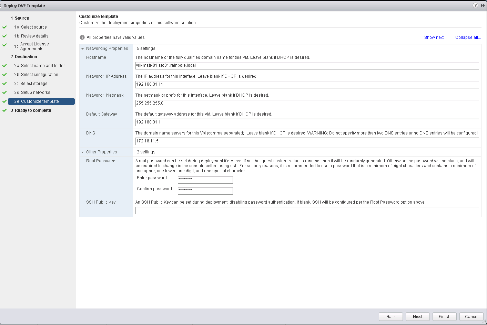

1.  On the **Ready to complete** page, click **Finish**. The deployment of the virtual appliance is in progress.

2.  After the virtual appliance is deployed, expand the data disk of the virtual appliance to collect and store data from a large number of virtual machines.

<!-- -->

1.  In the vSphere Web Client navigate to the virtual appliance object.

2.  Right-click the virtual appliance object and select **Edit Settings**.

3.  In the **Edit Settings** dialog box, from the **New device** drop-down menu at the bottom, select **New Hard Disk** and click **Add**.

4.  In the text box next to the **New Hard disk** label, enter **190 GB** for the size, and click **OK**.

>  
>  

1.  Right-click the virtual appliance object and select the **Power** &gt; **Power On** menu item.
    During the power-on process, the virtual appliance expands the vRealize Log Insight Manager logs partition.

2.  Repeat the steps to deploy the vRealize Log Insight virtual appliance for the next node in the cluster.

    1.  ### Configure a DRS Anti-Affinity Rule for vRealize Log Insight in Region A

To protect the vRealize Log Insight cluster from a host-level failure, configure vSphere DRS to run the worker virtual appliances on different hosts in the management cluster.

Procedure

1.  In a Web browser, open the vSphere Web Client.

<!-- -->

1.  Log in to **https://mgmt01vc01.sfo01.rainpole.local/vsphere-client**.

2.  Use the **administrator@vsphere.local** user name and the ***vsphere\_admin\_password*** password.

<!-- -->

1.  Navigate to the **mgmt01vc01.sfo01.rainpole.local** vCenter Server object, and under the SFO01 data center object select the **SFO01-Mgmt01** cluster.

2.  On the **Manage** tab, click the **Settings** tab.

3.  Under the **Configuration** group of settings, select **VM/Host Rules**.

> 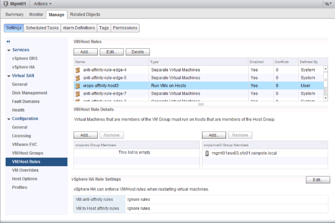

1.  In the **VM/Host Rules** list, click the **Add** button above the rules list and add a new anti-affinity rule called **vrli-antiaffinity-rule** for the **vrli-mstr01**, **rli-wrkr-01** and **vrli-wrkr-02** virtual machines, and click **OK**.

| Rule Attribute  | Value                     |
|-----------------|---------------------------|
| **Name**        | vrli-antiaffinity-rule    |
| **Enable rule** | Yes                       |
| **Type**        | Separate Virtual Machines |
| **Members**     | vrli-mstr-01              

                   vrli-wrkr-01               

                   vrli-wrkr-02               |

### Start the vRealize Log Insight Instance in Region A

Configure and start the vRealize Log Insight master node. To form a cluster by adding the worker nodes, vRealize Log Insight must be running.

Procedure

1.  In a Web browser, go to **https://vrli-mstr-01.sfo01.rainpole.local**.
    The initial configuration wizard opens.

2.  On the **Setup** page, click **Next**.

> 

1.  On the **Choose Deployment Type** page, click **Start New Deployment**. 

> 

1.  After the deployment is launched, on the **Admin Credentials** page, set the email address and the password of the **admin** user, and click **Save and Continue**.
    The password must contain at least 8 characters, and contain one uppercase character, one lowercase character, one number, and one special character.

> 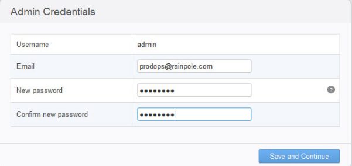

1.  On the **License** page, enter the license key, click **Add New License Key**, and click **Continue**.

> 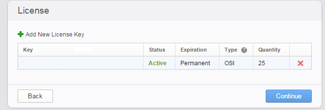

1.  On the **General Configuration** page, enter email addresses to receive system notifications on from vRealize Log Insight, and click **Save and Continue**.

> 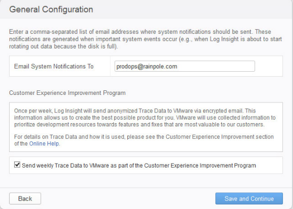

1.  On the **Time Configuration** page, from the **Sync Server Time with** drop-down menu, configure the following NTP server settings, and click **Save and Continue**.

| Time Configuration Option | Value                                                                                                      |
|---------------------------|------------------------------------------------------------------------------------------------------------|
| **Sync Server Time With** | NTP Server                                                                                                 |
| **NTP Servers**           | ntp.rainpole.local, 0.ntp.rainpole.local, 1.ntp.rainpole.local, 2.ntp.rainpole.local, 3.ntp.rainpole.local |

> 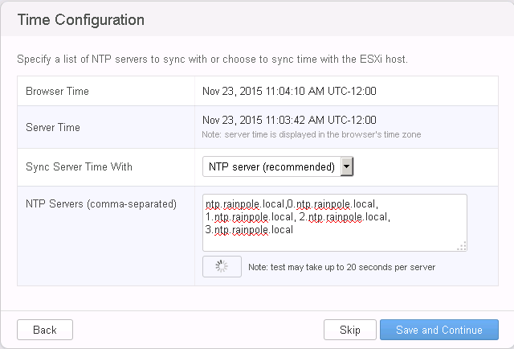

1.  On the **SMTP Configuration** page, specify the properties of an SMTP server to enable outgoing alerts and system notification emails, and to test the email notification.

<!-- -->

1.  Set the connection setting for the SMTP server that will send the email messages from vRealize Log Insight. Contact your system administrator for details about the email server.

| SMTP Option             | Description                                                                         |
|-------------------------|-------------------------------------------------------------------------------------|
| **SMTP Server**         | *FQDN of the SMTP server*                                                           |
| **Port**                | *Server port for SMTP requests*                                                     |
| **SSL (SMTPS)**         | Sets whether encryption should be enabled for the SMTP transport option connection. |
| **STARTTLS Encryption** | Enable or disable the STARTTLS encryption.                                          |
| **Sender**              | Address that appears as the sender of the email.                                    |
| **Username**            | User name on the SMTP server.                                                       |
| **Password**            | Password for the SMTP server you specified in Username.                             |

> 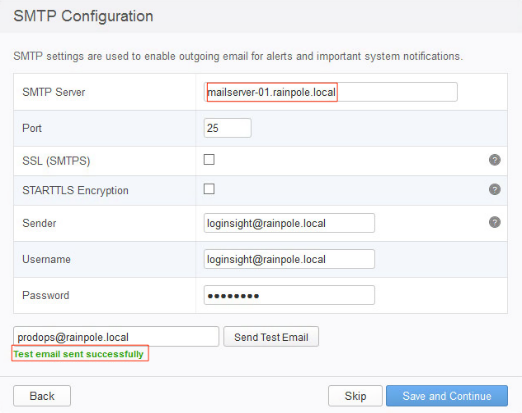

1.  To verify that the SMTP configuration is correct, type a valid email address and click **Send Test Email**.

> 

1.  On the **Setup Complete** page, click **Finish**.

vRealize Log Insight sends a test email to the address that you provided.

### Join the Worker Nodes to vRealize Log Insight in Region A

After you deploy the virtual appliances for vRealize Log Insight and start the vRealize Log Insight instance on the master node, join the two worker nodes to form a cluster.

Procedure

1.  For each worker node appliance, go to the initial setup UI in your Web browser. The initial configuration wizard opens.

| Worker Node   | HTTP URL                                  |
|---------------|-------------------------------------------|
| Worker node 1 | https://vrli-wrkr-01.sfo01.rainpole.local |
| Worker node 2 | https://vrli-wrkr-02.sfo01.rainpole.local |

1.  On the **Choose Deployment Type** page, click **Join Existing Deployment**.

> 

1.  On the **Join Existing Deployment** page, enter the mater node FQDN **vrli-mstr-01.sfo01.rainpole.local** and click **Go**.

> 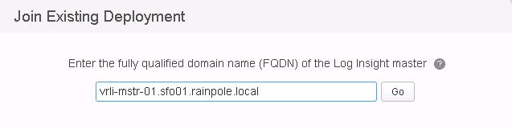
>
> The worker node sends a request to the vRealize Log Insight master node to join the existing deployment. 

1.  After the worker node contacts the master node, click the **Click here to access the Cluster Management page** link. 

> 
>
> The login page of the vRealize Log Insight user interface opens.

1.  On the Log Insight login page, log in as the **admin** user with the ***vrli\_admin\_password*** password.
    The **Cluster** page opens in the Log Insight user interface.

2.  On the right of the notification message about adding the worker node, click **Allow**.

> 
>
> After you join the first worker node to the cluster, the user interface displays a warning message that another worker node must be added.

1.  Repeat the steps to join the second worker node to the cluster.

2.  After you add the second worker node, the **Cluster** page of the vRealize Log Insight UI contains the master and worker nodes as components of the cluster.

> 

### Enable the Integrated Load Balancer of vRealize Log Insight in Region A

After you join the master and the worker nodes to create a vRealize Log Insight cluster, enable the Integrated Load Balancer (ILB) for balancing incoming ingestion traffic of syslog data among the Log Insight nodes and for high availability. 

Procedure

1.  In a Web browser, open the vRealize Log Insight user interface.

<!-- -->

1.  Log in to **https://vrli-mstr-01.sfo01.rainpole.local**.

2.  Use the admin user and the ***vrli\_admin\_password*** password to log in.

<!-- -->

1.  Click the configuration drop-down menu icon  and select **Administration**.

2.  Under **Management**, click **Cluster**.

3.  Under **Configuration**, select the **Enable Integrated Load Balancer** check box. 

4.  Enter the virtual IP address and the FQDN for load balancing, and click **Save**.

| ILB Setting    | Value                                |
|----------------|--------------------------------------|
| **IP address** | 192.168.31.10                        |
| **FQDN**       | vrli-cluster-01.sfo01.rainpole.local |

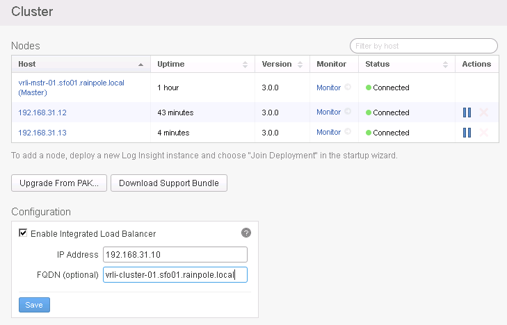

### Configure Public Access to vRealize Log Insight

The vRealize Log Insight integrated load balancer as configured is only available to the vSphere management network.  To enable access to vRealize Log Insight from the public network, add a NAT rule to the NSX Edge device that is fronting the application virtual network.

Procedure

1.  Log in to the Management vCenter Server by using the vSphere Web Client.

<!-- -->

1.  In a browser, go to **https://mgmt01vc01.sfo01.rainpole.local/vsphere-client**.

2.  Use the following credentials to log in.

| Setting       | Value                       |
|---------------|-----------------------------|
| **User name** | administrator@vsphere.local |
| **Password**  | vsphere\_admin\_password    |

1.  Create a Destination NAT (DNAT) rule to enable access from the public network.

<!-- -->

1.  In the **Navigator**, click **Networking & Security**, and** **click **NSX Edges**.

2.  From the** NSX Manager** drop-down menu, select **172.16.11.65**, and double-click the management application NSX Edge **vRLI01-Edge** to edit its settings.

3.  Click the **Manage** tab, click **NAT**, and click the **Add** &gt; **Add DNAT Rule** icon to create new Destination NAT rule.

> 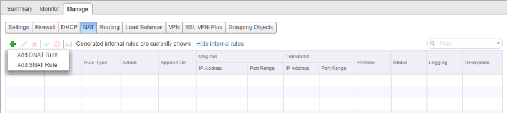
>  

1.  In the **Add DNAT Rule** dialog box, enter the following settings, and click **OK**.

| Setting                   | Value                                                 |
|---------------------------|-------------------------------------------------------|
| **Applied On**            | Public                                                |
| **Original IP/Range**     | 10.158.130.15                                         |
| **Protocol**              | TCP                                                   |
| **Original Port/Range**   | 443                                                   |
| **Translated IP/Range**   | 192.168.31.10                                         |
| **Translated Port/Range** | 443                                                   |
| **Description**           | Provide Public network access to vRealize Log Insight |
| **Enabled**               | Checked                                               |
| **Enable logging**        | Unchecked                                             |

> 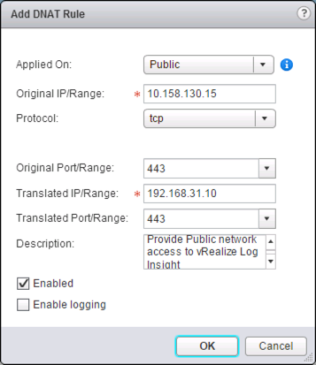

1.  On **NAT** tab, click **Publish Changes** to apply changes from the new DNAT rule changes.

> 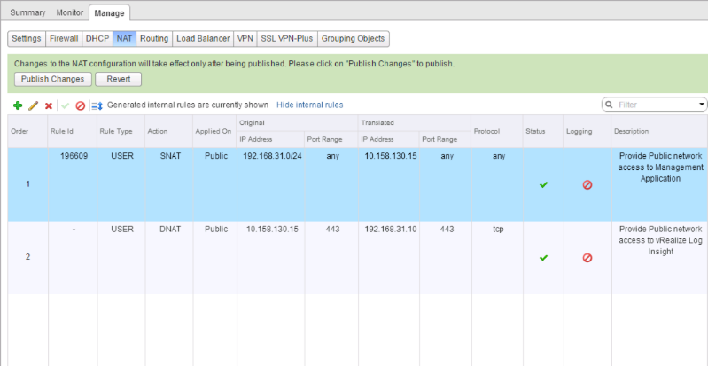 

### Join vRealize Log Insight to the Active Directory

To use user roles in vRealize Log Insight that are maintained centrally and are inline with the other solutions in the SDDC, join vRealize Log Insight to the Active Directory (AD) domain.

Procedure

1.  In a Web browser, open the vRealize Log Insight UI.

<!-- -->

1.  Go to **https://vrli-cluster-01.sfo01.rainpole.local/admin/auth**.

2.  Use the **admin** user name and ***vrli\_admin\_password*** password to log in.
    After you log in, the **Authentication** page opens. 

<!-- -->

1.  On the **Authentication** page, enable the support for Active Directory and configure the settings for connection to the Active Directory domain controller.

<!-- -->

1.  Configure the Active Directory connection settings according to the details from your IT administrator.

| Field                               | Value                                                             |
|-------------------------------------|-------------------------------------------------------------------|
| **Enable Active Directory support** | Yes                                                               |
| **Default Domain**                  | RAINPOLE.LOCAL                                                    |
| **User Name**                       | svc-loginsight                                                    |
| **Password**                        | *svc\_loginsight\_password*                                       |
| **Connection Type**                 | Standard                                                          |
| **Require SSL**                     | Yes or No according to the instructions from the IT administrator |

1.  Click **Test Connection** to verify the connection, and click **Save**.

> 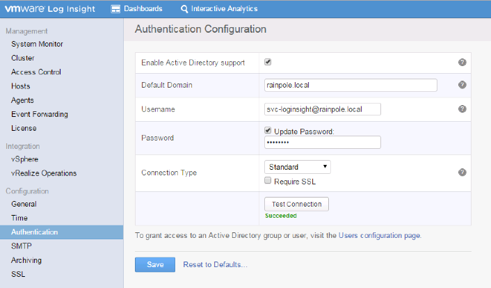

Connect vRealize Log Insight to the vSphere Environment in Region A
-------------------------------------------------------------------

Start collecting log information about the ESXi and vCenter Server instances in the SDDC. 

-   Configure User Privileges in vSphere for Integration with vRealize Log Insight for Region A

-   Connect vRealize Log Insight to vSphere in Region A

    1.  ### Configure User Privileges in vSphere for Integration with vRealize Log Insight for Region A

To collect log information from the vCenter Server instances and ESXi hosts in Region A, you must assign a role to the **svc-loginsight** AD user on the vCenter Server objects. The **svc-loginsight** user account is specifically dedicated to collecting log information from vCenter Server and ESXi. 

Procedure

1.  In a Web browser, log in to vCenter Server by using the vSphere Web Client.

<!-- -->

1.  Go to the following URL.

| vCenter Server                | URL                                                     |
|-------------------------------|---------------------------------------------------------|
| **Management vCenter Server** | https://mgmt01vc01.sfo01.rainpole.local/vsphere-client/ |
| **Compute vCenter Server**    | https://comp01vc01.sfo01.rainpole.local/vsphere-client/ |

1.  Use the administrator@vsphere.local user name and the *vsphere\_admin\_password* password to log in.

<!-- -->

1.  From the **Home** menu, select **Administration**.

2.  Under **Access Control**, click **Roles**. 

3.  Create a role specifically for vRealize Log Insight. 

<!-- -->

1.  Select **Read-only** and click the **Clone** icon. You clone the Read-only role because it includes the **System.Anonymous**, **System.View**, and **System.Read** privileges. vRealize Log Insight requires those privileges for accessing log information related to the vCenter Server instances.

    
     

2.  In the **Clone Role Read-only** dialog box, enter **LogInsight** in the **Role name** text box. 

3.  Select the **Host.Configuration.Advanced settings**,** Host.Configuration.Change settings**, **Host.Configuration.Network configuration** and **Host.Configuration.Security profile and firewall **privileges. These host privileges allow vRealize Log Insight to configure the syslog service on the ESXi hosts.

> 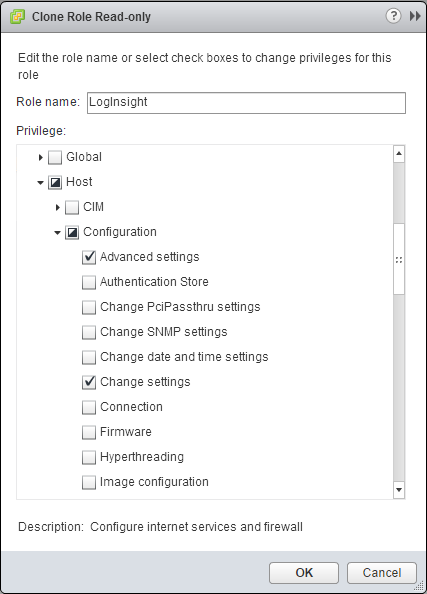 
>  

1.  Click **OK**.

<!-- -->

1.  Assign the **LogInsight** role to the **svc-loginsight** user on the Management vCenter Server and Compute vCenter Server.

<!-- -->

1.  In the vSphere Web Client, navigate to the vCenter Server object in Region A.

| vCenter Server                | Object                          |
|-------------------------------|---------------------------------|
| **Management vCenter Server** | mgmt01vc01.sfo01.rainpole.local |
| **Compute vCenter Server**    | comp01vc01.sfo01.rainpole.local |

1.  Right-click the vCenter Server object and click **Add Permission**.

>  
>  

1.  In the **Add Permission** dialog box, click the **Add** button to assign a role to a user or a group.

2.  In the **Select Users/Groups** dialog box, from the **Domain** drop-down menu, select **RAINPOLE**, and in the filter box type **svc**. 

3.  From the list of users and groups, select the **svc-loginsight** AD user, click the **Add **button, and click **OK**.

> 

1.  In the **Add Permission** dialog box, from the **Assigned Role** drop-down menu, select **Log Insight**, select **Propagate to children**, and click **OK**.

> 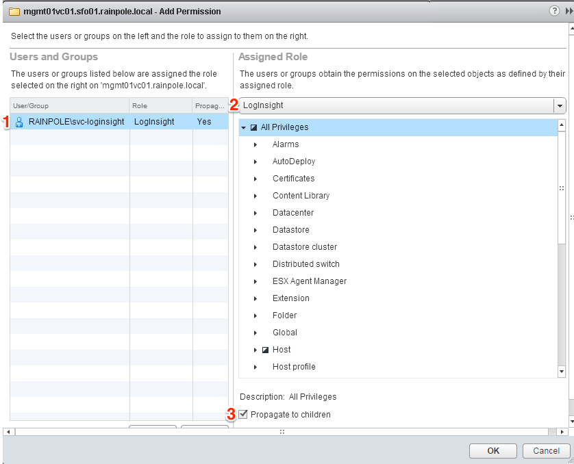

### Connect vRealize Log Insight to vSphere in Region A

After you configure the **svc-loginsight** AD user with the vSphere privileges that are required for retrieving log information from the vCenter Server instances and ESXi hosts, connect vRealize Log Insight to vSphere.

Procedure

1.  In a Web browser, open the vRealize Log Insight user interface.

<!-- -->

1.  Go to **https://vrli-cluster-01.sfo01.rainpole.local**.

2.  Use the **admin** user name and the ***vrli\_admin\_password*** password to log in.

<!-- -->

1.  Click the configuration drop-down menu icon  and select **Administration**.

2.  Under **Integration**, click **vSphere**.

3.  In the **vCenter Servers** pane, enter the connection settings for the Management vCenter Server and for the Compute vCenter Server.

<!-- -->

1.  Enter the host name, user credentials, and collection options for the vCenter Server instances, and click **Test Connection**.

| vCenter Server Option                                | Value                            |
|------------------------------------------------------|----------------------------------|
| **Hostname**                                         | mgmt01vc01.sfo01.rainpole.local  

                                                        comp01vc01.sfo01.rainpole.local   |
| **Username**                                         | svc-loginsight@rainpole.local    |
| **Password**                                         | *svc-loginsight\_user\_password* |
| **Collect vCenter Server events, tasks and alarms**  | Yes                              |
| **Configure ESXi hosts to send logs to Log Insight** | Yes                              |

> 

1.  Click **Advanced Options** and examine the list of ESXi hosts that are connected to the vCenter Server instance to verify that you connect to the correct vCenter Server.

> 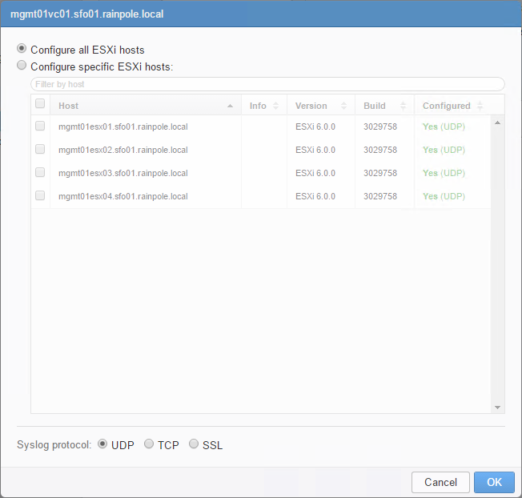
>  

1.  Click **Add vCenter Server **to add a new settings form and repeat the steps to add the settings for the second vCenter Server instance in Region A.

<!-- -->

1.  Click **Save**. A progress dialog box appears. 

> 
>  

1.  Click **OK** in the confirmation dialog box that appears after vRealize Log Insight contacts the vCenter Server instances. You see the vSphere dashboards under the **VMware - vSphere** content pack dashboard category.

> 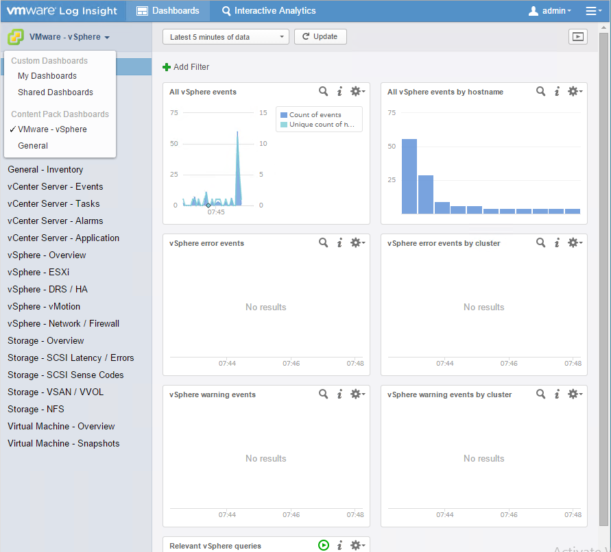

 

Enable the vRealize Log Insight Integration with vRealize Operations Manager for Region A
-----------------------------------------------------------------------------------------

Connect vRealize Log Insight in Region A with vRealize Operations Manager to launch vRealize Log Insight from within vRealize Operations Manager and to send alerts to vRealize Operations Manager.

Prerequisites

-   Verify that the vRealize Log Insight management pack is installed in vRealize Operations Manager.

-   Verify that you have connected vRealize Operations Manager and vRealize Log Insight to the **mgmt01vc01.sfo01.rainpole.local** or **comp01vc01.sfo01.rainpole.local** vCenter Server instances.

Procedure

1.  In a Web browser, open the vRealize Log Insight UI.

<!-- -->

1.  Go to **https://vrli-cluster-01.sfo01.rainpole.local/admin/auth**.

2.  Use the **admin** user name and ***vrli\_admin\_password*** password to log in.

<!-- -->

1.  In the vRealize Log Insight UI, click the configuration drop-down menu icon  and select **Administration**.

2.  Under **Integration**, click **vRealize Operations**.

3.  On the **vRealize Operations Manager** pane, configure the integration settings for vRealize Operations Manager.

> 

1.  Enter the host name and the user credentials for the vCenter Server instances.

| vRealize Operations Manager Option | Value                         |
|------------------------------------|-------------------------------|
| **Hostname**                       | vrops-mstrn-01.rainpole.local |
| **Username**                       | admin                         |
| **Password**                       | *vrops\_admin\_password*      |

1.  Click **Test Connection**.

2.  Select the **Enable alerts integration** check box.

3.  Select the **Enable launch in context** check box.

<!-- -->

1.  Click **Save**. A progress dialog box appears.
    

    1.  Install a CA-Signed Certificate on vRealize Log Insight in Region A
        -------------------------------------------------------------------

vRealize Log Insight comes with a default self-signed certificate that is generated and signed at installation time. After you start vRealize Log Insight in Region A, install a CA-signed certificate to secure the communication of vRealize Log Insight. 

vRealize Log Insight uses a certificate for the following communication:

-   Connection to the vRealize Log Insight UI

-   SSL syslog transfers

-   Communication from the Log Insight agents through the Ingestion API

vRealize Log Insight accepts only PEM encoded certificates that include the complete certification chain. The private key must not be encrypted by a pass phrase.

-   Generate a CA-Signed SSL Certificate for vRealize Log Insight in Region A

-   Upload the CA-Signed Certificate to vRealize Log Insight in Region A

    1.  ### Generate a CA-Signed SSL Certificate for vRealize Log Insight in Region A

To create a CA-signed certificate for vRealize Log Insight,  generate a certificate signing request (CSR) on the Linux appliance for the master node and use the root Windows AD domain controller to sign the certificate. 

Procedure

1.  On your computer, create a configuration file for OpenSSL certificate request generation, called vrli-sfo.cfg. Because all nodes in the cluster share the same certificate, the Subject Alternative Name field, subjectAltName, of the uploaded certificate must contain the IP addresses and FQDNs of all nodes and of the load balancer. For common name, use the full domain name of the integrated load balancer.

 

> \[ req \]
> default\_bits = 2048
> default\_keyfile = rui.key
> distinguished\_name = req\_distinguished\_name
> encrypt\_key = no
> prompt = no
> string\_mask = nombstr
> req\_extensions = v3\_req
>
> \[ v3\_req \]
> basicConstraints = CA:FALSE
> keyUsage = digitalSignature, keyEncipherment, dataEncipherment
> extendedKeyUsage = serverAuth, clientAuth
> subjectAltName = DNS:vrli-cluster-01, IP:192.168.31.10, DNS: vrli-cluster-01.sfo01.rainpole.local, DNS:vrli-mstr-01.sfo01.rainpole.local, DNS:vrli-mstr-01, DNS:vrli-wrkr-01.sfo01.rainpole.local, DNS:vrli-wrkr-01, DNS:vrli-wrkr-02.sfo01.rainpole.local, DNS:vrli-wrkr-02
>
> \[ req\_distinguished\_name \]
> countryName = US
> stateOrProvinceName = CA
> localityName = Palo Alto
> organizationName = Rainpole Inc.,
> organizationalUnitName = rainpole.local
> commonName = vrli-cluster-01.sfo01.rainpole.local

1.  Log in to the **vrli-mstr-01.sfo01.rainpole.local** over SSH with the **root** user name and ***vrli\_master\_root\_password*** password.

2.  Create a sub-directory called vrli in the root home directory and navigate to it.

> mkdir /root/vrli
> cd /root/vrli

1.  From the /root/vrli folder, generate an RSA private key that is 2048 bits long, and save it as a vrli.key file.

> openssl genrsa -out vrli.key 2048
>
>  

1.  Copy the vrli-sfo.cfg to the /root/vrli folder on the master node virtual appliance.You can use scp, FileZilla or WinSCP.

2.  Use the vrli.key private key and the vrli-sfo.cfg configuration file to create a CSR and save it as a vrli.pem file to the /root/vrli folder.

> openssl req -new -key vrli.key -out vrli.pem -config vrli-sfo.cfg
>
> The /root/vrli folder contains the vrli-sfo.cfg, vrli.key and vrli.pem files.

1.  Submit the CSR to the Windows domain controller CA.

<!-- -->

1.  Run the following console command.

> cat vrli.pem

1.  Copy the output from -----BEGIN CERTIFICATE REQUEST----- to -----END CERTIFICATE REQUEST----- inclusive.

> 

1.  In a Web browser, log in to **http://dc01rpl.rainpole.local/certsrv/certrqxt.asp** with the administrator user name and *ad\_admin\_password* password.

2.  Paste the request in the **Saved Request** text box, select **VMware** from the **Certificate Template** drop-down menu, and click **Submit**.

    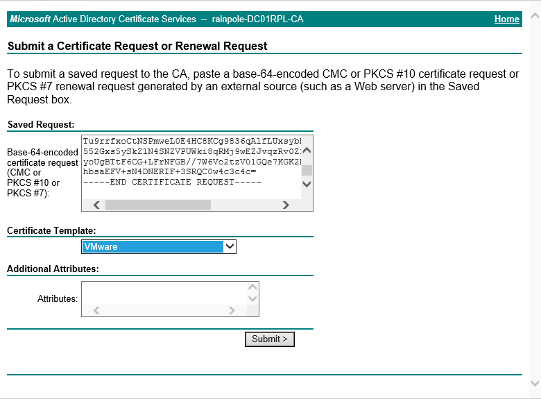

<!-- -->

1.  On the **Certificate Issued** page, download the signed server certificate as a vrli.cer file in Base 64 encoding.  If the save as dialog does not appear, the signed certificate is saved as certnew.cer in your downloads folder. Rename the file to vrli.cer.

>  
>  

1.  Download the root CA certificate. 

<!-- -->

1.  In a Web browser, go to **http://dc01rpl.rainpole.local/certsrv/certcarc.asp** and log in with the **administrator** user name and ***ad\_admin\_password*** password.

2.  Select **Base 64**, click **Download CA Certificate**, and save the certificate as rootca.cer on your computer. If the save as dialog does not appear, the CA certificate is saved as rootca.cer in your downloads folder.

> 

1.  Copy the vrli.cer and rootca.cer certificate files to the /root/vrli folder on the master virtual appliance. You can use scp, FileZilla or WinSCP.

2.  In the SSH console to the master node, create a vrli-chain.pem file in the /root/vrli folder that contains the signed certificate, CA certificate and private key file.

> The order of the certificates in a PEM file must follow the certificate chain sequence starting from the own certificate up to the root CA certificate. vrli.cer must be first, rootca.cer next and vrli.key last.
>
> cat vrli.cer rootca.cer vrli.key &gt; vrli-chain.pem

1.  Copy the **vrli-chain.pem** file to your computer. You can use scp, FileZilla or WinSCP.

    1.  ### Upload the CA-Signed Certificate to vRealize Log Insight in Region A

After you generate the vrli-chain.pem certificate chain file that contains the own certificate, the signer certificate and the private key file, upload the certificate chain to vRealize Log Insight.

1.  In a Web browser, open the vRealize Log Insight UI.

<!-- -->

1.  Go to **https://vrli-cluster-01.sfo01.rainpole.local/admin/auth**

2.  Use the **admin** user name and ***vrli\_admin\_password*** password to log in.

<!-- -->

1.  In the vRealize Log Insight UI, click the configuration drop-down menu icon  and select **Administration**.

2.  Under Configuration, click SSL.

3.  On the **SSL Configuration** page, next to **New Certificate File (PEM format)** click **Choose File**, browse to the location of the vrli-chain.pem file on your computer, and click Save.
     
    The certificate is uploaded to vRealize Log Insight.

>  

1.  In a Web browser, go to **https://vrli-cluser-01.sfo01.rainpole.local**.
    A warning message that the connection is not trusted appears.

2.  To review the certificate, click the padlock  in the address bar of the browser, and verify that the **Subject Alternative Name** contains the names of the vRealize Log Insight cluster nodes.

> 

1.  Import the certificate in your Web browser. For example, in Google Chrome under the **HTTPS/TLS** settings click the **Manage certificates** button, and in the **Certificates** dialog box import vrli-chain.pem. You can also use Certificate Manager on Windows or Keychain Access on MAC OS X. 

    1.  Configure Log Retention and Archiving in Region A
        -------------------------------------------------

In vRealize Log Insight, configure log retention for one week and archiving on storage sized for 90 days according to the vRealize Log Insight Design document.

**Prerequisites**

-   Create an NFS share of 1 TB in Region and export it as /V2D\_vRLI\_MgmtA\_1TB.

-   The NFS server must support NFS v3.

-   The NFS partition must allow reading and writing operations for guest accounts. 

-   Verify that the mount does not require authentication.

-   Verify that the NFS share is directly accessible to vRealize Log Insight

-   If using a Windows NFS server, allow unmapped user Unix access (by UID/GID).

Procedure

1.  In a Web browser, open the vRealize Log Insight UI.

<!-- -->

1.  Go to **https://vrli-cluster-01.sfo01.rainpole.local**.

2.  Use the ***admin*** user name and ***vrli\_admin\_password*** password to log in.

<!-- -->

1.  In the vRealize Log Insight UI, click the configuration drop-down menu icon  and select **Administration**.

2.  Configure retention threshold notification. Log Insight continually estimates how long data can be retained with the currently available pool of storage. If the estimation drops below the retention threshold of one week, Log Insight immediately notifies the administrator that the amount of searchable log data is likely to drop.

<!-- -->

1.  Under **Configuration**, click **General**.

2.  On the **General Configuration** page, under the **Alerts** section select the **Send a notification when capacity drops below** check box next to the **Retention Notification Threshold** settings, and enter a 1-week period in the text box underneath.

3.  Click **Save**.

> 

1.  Configure data archiving.

<!-- -->

1.  Under **Configuration**, click **Archiving**.

2.  Select the **Enable Data Archiving** check box.

> 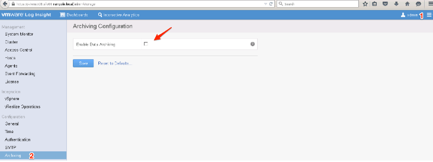 
>  

1.  In the **Archive Location** text box, enter the path in the form of **nfs://*nfs-server-address*/V2D\_vRLI\_MgmtA\_1TB** to an NFS partition where logs will be archived.

> .
> 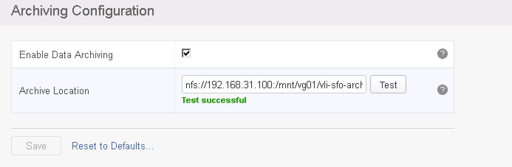
>  

1.  Click **Test** next to the **Archive Location** text box to verify that the share is accessible.

2.  Click **Save**.

    1.  Connect vRealize Log Insight to vRealize Operations Manager in Region A
        -----------------------------------------------------------------------

Install and configure vRealize Log Insight Content Pack for vRealize Operations Manager for troubleshooting vRealize Operations Manager by using dashboards and alerts in the vRealize Log Insight UI.

-   Install the vRealize Log Insight Content Pack for vRealize Operations Manager

-   Configure the Log Insight Agent on vRealize Operations Manager to Forward Log Events to vRealize Log Insight in Region A

    1.  ### Install the vRealize Log Insight Content Pack for vRealize Operations Manager

Install the content pack for vRealize Operations Manager to add the dashboards for viewing log information in vRealize Log Insight.

Procedure

1.  In a Web browser, open the vRealize Log Insight UI.

<!-- -->

1.  Go to **https://vrli-cluster-01.sfo01.rainpole.local**.

2.  Use the **admin** user and the ***vrli\_admin\_password*** password to log in.

<!-- -->

1.  In the vRealize Log Insight UI, click the configuration drop-down menu icon  and select Content Packs.

2.  Under **Content Pack Marketplace**, select **Marketplace**.

3.  In the list of content packs, locate the **VMware - vR Ops 6.x** content pack and click its icon.

> 

1.  In the **Install Content Pack** dialog box, click **Install**.

> 

1.  After the installation is complete, the VMware - vR Ops 6.x content pack appears in the Installed Content Packs list on the left.

> 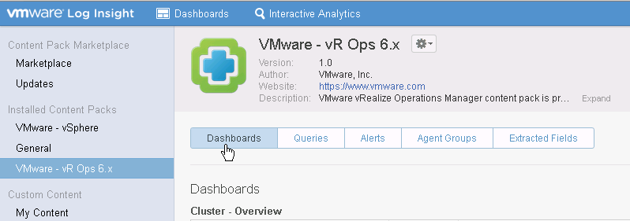

### Configure the Log Insight Agent on vRealize Operations Manager to Forward Log Events to vRealize Log Insight in Region A

After you install the content pack for vRealize Operations Manager, configure the Log Insight agent on vRealize Operations Manager to send audit logs and system events to vRealize Log Insight in Region A. 

Procedure

1.  On your computer, create a **liagent.ini** file for each of the 6 nodes of vRealize Operations Manager. 

<!-- -->

1.  Create an empty **liagent.ini** file and paste the following template configuration. 

> ; Client-side configuration of VMware Log Insight Agent
> ; See liagent-effective.ini for the actual configuration used by VMware Log Insight Agent
>
> \[server\]
> ; Log Insight server hostname or ip address
> ; If omitted the default value is LOGINSIGHT
> hostname=&lt;YOUR LOGINSIGHT HOSTNAME HERE&gt;
>
> ; Set protocol to use:
> ; cfapi - Log Insight REST API
> ; syslog - Syslog protocol
> ; If omitted the default value is cfapi
> ;
> ;proto=cfapi
>
> ; Log Insight server port to connect to. If omitted the default value is:
> ; for syslog: 512
> ; for cfapi without ssl: 9000
> ; for cfapi with ssl: 9543
> ;port=9000
>
> ;ssl - enable/disable SSL. Applies to cfapi protocol only.
> ; Possible values are yes or no. If omitted the default value is no.
> ;ssl=no
>
> ; Time in minutes to force reconnection to the server
> ; If omitted the default value is 30
> ;reconnect=30
>
> \[storage\]
> ;max\_disk\_buffer - max disk usage limit (data + logs) in MB:
> ; 100 - 2000 MB, default 200
> ;max\_disk\_buffer=200
>
> \[logging\]
> ;debug\_level - the level of debug messages to enable:
> ; 0 - no debug messages
> ; 1 - trace essential debug messages
> ; 2 - verbose debug messages (will have negative impact on performance)
> ;debug\_level=0
>
> \[filelog|messages\]
> directory=/var/log
> include=messages;messages.?
>
> \[filelog|syslog\]
> directory=/var/log
> include=syslog;syslog.?
>
> \[filelog|ANALYTICS-analytics\]
> tags = {"vmw\_vr\_ops\_appname":"vROps", "vmw\_vr\_ops\_logtype":"ANALYTICS","vmw\_vr\_ops\_clustername":"&lt;YOUR CLUSTER NAME HERE&gt;", "vmw\_vr\_ops\_clusterrole":"Master","vmw\_vr\_ops\_nodename":"&lt;YOUR NODE NAME HERE&gt;", "vmw\_vr\_ops\_hostname":"&lt;YOUR VROPS HOSTNAME HERE&gt;"}
> directory = /data/vcops/log
> include = analytics\*.log\*
> exclude\_fields=hostname
>
> \[filelog|COLLECTOR-collector\]
> tags = {"vmw\_vr\_ops\_appname":"vROps", "vmw\_vr\_ops\_logtype":"COLLECTOR","vmw\_vr\_ops\_clustername":"&lt;YOUR CLUSTER NAME HERE&gt;", "vmw\_vr\_ops\_clusterrole":"Master","vmw\_vr\_ops\_nodename":"&lt;YOUR NODE NAME HERE&gt;", "vmw\_vr\_ops\_hostname":"&lt;YOUR VROPS HOSTNAME HERE&gt;"}
> directory = /data/vcops/log
> include = collector.log\*
> exclude\_fields=hostname
> event\_marker=^\\d{4}-\\d{2}-\\d{2}\[\\s\]\\d{2}:\\d{2}:\\d{2}\\,\\d{3}
>
> \[filelog|COLLECTOR-collector\_wrapper\]
> tags = {"vmw\_vr\_ops\_appname":"vROps", "vmw\_vr\_ops\_logtype":"COLLECTOR","vmw\_vr\_ops\_clustername":"&lt;YOUR CLUSTER NAME HERE&gt;", "vmw\_vr\_ops\_clusterrole":"Master","vmw\_vr\_ops\_nodename":"&lt;YOUR NODE NAME HERE&gt;", "vmw\_vr\_ops\_hostname":"&lt;YOUR VROPS HOSTNAME HERE&gt;"}
> directory = /data/vcops/log
> include = collector-wrapper.log\*
> exclude\_fields=hostname
> event\_marker=^\\d{4}-\\d{2}-\\d{2}\[\\s\]\\d{2}:\\d{2}:\\d{2}\\.\\d{3}
>
> \[filelog|COLLECTOR-collector\_gc\]
> directory = /data/vcops/log
> tags = {"vmw\_vr\_ops\_appname":"vROps", "vmw\_vr\_ops\_logtype":"COLLECTOR","vmw\_vr\_ops\_clustername":"&lt;YOUR CLUSTER NAME HERE&gt;", "vmw\_vr\_ops\_clusterrole":"Master","vmw\_vr\_ops\_nodename":"&lt;YOUR NODE NAME HERE&gt;", "vmw\_vr\_ops\_hostname":"&lt;YOUR VROPS HOSTNAME HERE&gt;"}
> include = collector-gc\*.log\*
> exclude\_fields=hostname
> event\_marker=^\\d{4}-\\d{2}-\\d{2}\[\\w\]\\d{2}:\\d{2}:\\d{2}\\.\\d{3}
>
> \[filelog|WEB-web\]
> directory = /data/vcops/log
> tags = {"vmw\_vr\_ops\_appname":"vROps", "vmw\_vr\_ops\_logtype":"WEB","vmw\_vr\_ops\_clustername":"&lt;YOUR CLUSTER NAME HERE&gt;", "vmw\_vr\_ops\_clusterrole":"Master","vmw\_vr\_ops\_nodename":"&lt;YOUR NODE NAME HERE&gt;", "vmw\_vr\_ops\_hostname":"&lt;YOUR VROPS HOSTNAME HERE&gt;"}
> include = web\*.log\*
> exclude\_fields=hostname
> event\_marker=^\\d{4}-\\d{2}-\\d{2}\[\\s\]\\d{2}:\\d{2}:\\d{2}\\,\\d{3}
>
> \[filelog|GEMFIRE-gemfire\]
> tags = {"vmw\_vr\_ops\_appname":"vROps", "vmw\_vr\_ops\_logtype":"GEMFIRE","vmw\_vr\_ops\_clustername":"&lt;YOUR CLUSTER NAME HERE&gt;", "vmw\_vr\_ops\_clusterrole":"Master","vmw\_vr\_ops\_nodename":"&lt;YOUR NODE NAME HERE&gt;", "vmw\_vr\_ops\_hostname":"&lt;YOUR VROPS HOSTNAME HERE&gt;"}
> directory = /data/vcops/log
> include = gemfire\*.log\*
> exclude\_fields=hostname
>
> \[filelog|VIEW\_BRIDGE-view\_bridge\]
> tags = {"vmw\_vr\_ops\_appname":"vROps","vmw\_vr\_ops\_logtype":"VIEW\_BRIDGE","vmw\_vr\_ops\_clustername":"&lt;YOUR CLUSTER NAME HERE&gt;", "vmw\_vr\_ops\_clusterrole":"Master","vmw\_vr\_ops\_nodename":"&lt;YOUR NODE NAME HERE&gt;", "vmw\_vr\_ops\_hostname":"&lt;YOUR VROPS HOSTNAME HERE&gt;"}
> directory = /data/vcops/log
> include = view-bridge\*.log\*
> exclude\_fields=hostname
> event\_marker=^\\d{4}-\\d{2}-\\d{2}\[\\s\]\\d{2}:\\d{2}:\\d{2}\\,\\d{3}
>
> \[filelog|VCOPS\_BRIDGE-vcops\_bridge\]
> tags = {"vmw\_vr\_ops\_appname":"vROps","vmw\_vr\_ops\_logtype":"VCOPS\_BRIDGE","vmw\_vr\_ops\_clustername":"&lt;YOUR CLUSTER NAME HERE&gt;", "vmw\_vr\_ops\_clusterrole":"Master","vmw\_vr\_ops\_nodename":"&lt;YOUR NODE NAME HERE&gt;", "vmw\_vr\_ops\_hostname":"&lt;YOUR VROPS HOSTNAME HERE&gt;"}
> directory = /data/vcops/log
> include = vcops-bridge\*.log\*
> exclude\_fields=hostname
> event\_marker=^\\d{4}-\\d{2}-\\d{2}\[\\s\]\\d{2}:\\d{2}:\\d{2}\\,\\d{3}
>
> \[filelog|SUITEAPI-api\]
> directory = /data/vcops/log
> tags = {"vmw\_vr\_ops\_appname":"vROps", "vmw\_vr\_ops\_logtype":"SUITEAPI","vmw\_vr\_ops\_clustername":"&lt;YOUR CLUSTER NAME HERE&gt;", "vmw\_vr\_ops\_clusterrole":"Master","vmw\_vr\_ops\_nodename":"&lt;YOUR NODE NAME HERE&gt;", "vmw\_vr\_ops\_hostname":"&lt;YOUR VROPS HOSTNAME HERE&gt;"}
> include = api.log\*;http\_api.log\*;profiling\_api.log\*
> exclude\_fields=hostname
> event\_marker=^\\d{4}-\\d{2}-\\d{2}\[\\s\]\\d{2}:\\d{2}:\\d{2}\\,\\d{3}
>
> \[filelog|SUITEAPI-suite\_api\]
> directory = /data/vcops/log/suite-api
> tags = {"vmw\_vr\_ops\_appname":"vROps", "vmw\_vr\_ops\_logtype":"SUITEAPI","vmw\_vr\_ops\_clustername":"&lt;YOUR CLUSTER NAME HERE&gt;", "vmw\_vr\_ops\_clusterrole":"Master","vmw\_vr\_ops\_nodename":"&lt;YOUR NODE NAME HERE&gt;", "vmw\_vr\_ops\_hostname":"&lt;YOUR VROPS HOSTNAME HERE&gt;"}
> include = \*.log\*
> exclude\_fields=hostname
> event\_marker=^\\d{2}-\\w{3}-\\d{4}\[\\s\]\\d{2}:\\d{2}:\\d{2}\\.\\d{3}
>
> \[filelog|ADMIN\_UI-admin\_ui\]
> tags = {"vmw\_vr\_ops\_appname":"vROps", "vmw\_vr\_ops\_logtype":"ADMIN\_UI","vmw\_vr\_ops\_clustername":"&lt;YOUR CLUSTER NAME HERE&gt;", "vmw\_vr\_ops\_clusterrole":"Master","vmw\_vr\_ops\_nodename":"&lt;YOUR NODE NAME HERE&gt;", "vmw\_vr\_ops\_hostname":"&lt;YOUR VROPS HOSTNAME HERE&gt;"}
> directory = /data/vcops/log/casa
> include = \*.log\*;\*\_log\*
> exclude\_fields=hostname
>
> \[filelog|CALL\_STACK-call\_stack\]
> tags = {"vmw\_vr\_ops\_appname":"vROps","vmw\_vr\_ops\_logtype":"CALL\_STACK", "vmw\_vr\_ops\_clustername":"&lt;YOUR CLUSTER NAME HERE&gt;","vmw\_vr\_ops\_clusterrole":"Master", "vmw\_vr\_ops\_nodename":"&lt;YOUR NODE NAME HERE&gt;","vmw\_vr\_ops\_hostname":"&lt;YOUR VROPS HOSTNAME HERE&gt;"}
> directory = /data/vcops/log/callstack
> include = analytics\*.txt;collector\*.txt
> exclude\_fields=hostname
>
> \[filelog|TOMCAT\_WEBAPP-tomcat\_webapp\]
> tags = {"vmw\_vr\_ops\_appname":"vROps","vmw\_vr\_ops\_logtype":"TOMCAT\_WEBAPP","vmw\_vr\_ops\_clustername":"&lt;YOUR CLUSTER NAME HERE&gt;", "vmw\_vr\_ops\_clusterrole":"Master","vmw\_vr\_ops\_nodename":"&lt;YOUR NODE NAME HERE&gt;", "vmw\_vr\_ops\_hostname":"&lt;YOUR VROPS HOSTNAME HERE&gt;"}
> directory = /data/vcops/log/product-ui
> include = \*.log\*;\*\_log\*
> exclude\_fields=hostname
>
> \[filelog|OTHER-other1\]
> tags = {"vmw\_vr\_ops\_appname":"vROps", "vmw\_vr\_ops\_logtype":"OTHER","vmw\_vr\_ops\_clustername":"&lt;YOUR CLUSTER NAME HERE&gt;", "vmw\_vr\_ops\_clusterrole":"Master","vmw\_vr\_ops\_nodename":"&lt;YOUR NODE NAME HERE&gt;", "vmw\_vr\_ops\_hostname":"&lt;YOUR VROPS HOSTNAME HERE&gt;"}
> directory = /data/vcops/log
> include = aim\*.log\*;calltracer\*.log\*;casa.audit\*.log\*;distributed\*.log\*;hafailover\*.log;his\*.log\*;installer\*.log\*;locktrace\*.log\*;opsapi\*.log\*;query-service-timer\*.log\*;queryprofile\*.log\*;vcopsConfigureRoles\*.log\*
> exclude\_fields=hostname
> event\_marker=^\\d{4}-\\d{2}-\\d{2}\[\\s\]\\d{2}:\\d{2}:\\d{2}\\,\\d{3}
>
> \[filelog|OTHER-other2\]
> tags = {"vmw\_vr\_ops\_appname":"vROps", "vmw\_vr\_ops\_logtype":"OTHER", "vmw\_vr\_ops\_clustername":"&lt;YOUR CLUSTER NAME HERE&gt;", "vmw\_vr\_ops\_clusterrole":"Master", "vmw\_vr\_ops\_nodename":"&lt;YOUR NODE NAME HERE&gt;", "vmw\_vr\_ops\_hostname":"&lt;YOUR VROPS HOSTNAME HERE&gt;"}
> directory = /data/vcops/log
> include = env-checker.log\*
> exclude\_fields=hostname
> event\_marker=^\\d{2}\\D{1}\\d{2}\\D{1}\\d{4}\\s\\d{2}:\\d{2}:\\d{2}
>
> \[filelog|OTHER-other3\]
> tags = {"vmw\_vr\_ops\_appname":"vROps", "vmw\_vr\_ops\_logtype":"OTHER", "vmw\_vr\_ops\_clustername":"&lt;YOUR CLUSTER NAME HERE&gt;", "vmw\_vr\_ops\_clusterrole":"Master", "vmw\_vr\_ops\_nodename":"&lt;YOUR NODE NAME HERE&gt;", "vmw\_vr\_ops\_hostname":"&lt;YOUR VROPS HOSTNAME HERE&gt;"}
> directory = /data/vcops/log
> include = gfsh\*.log\*;HTTPPostAdapter\*.log\*;meta-gemfire\*.log\*;migration\*.log\*
> exclude\_fields=hostname
>
> \[filelog|OTHER-watchdog\]
> tags = {"vmw\_vr\_ops\_appname":"vROps", "vmw\_vr\_ops\_logtype":"OTHER", "vmw\_vr\_ops\_clustername":"&lt;YOUR CLUSTER NAME HERE&gt;", "vmw\_vr\_ops\_clusterrole":"Master", "vmw\_vr\_ops\_nodename":"&lt;YOUR NODE NAME HERE&gt;", "vmw\_vr\_ops\_hostname":"&lt;YOUR VROPS HOSTNAME HERE&gt;"}
> directory = /data/vcops/log/vcops-watchdog
> include = vcops-watchdog.log\*
> exclude\_fields=hostname
> event\_marker=^\\d{4}-\\d{2}-\\d{2}\[\\s\]\\d{2}:\\d{2}:\\d{2}\\,\\d{3}
>
> \[filelog|ADAPTER-vmwareadapter\]
> tags = {"vmw\_vr\_ops\_appname":"vROps", "vmw\_vr\_ops\_logtype":"ADAPTER", "vmw\_vr\_ops\_clustername":"&lt;YOUR CLUSTER NAME HERE&gt;", "vmw\_vr\_ops\_clusterrole":"Master", "vmw\_vr\_ops\_nodename":"&lt;YOUR NODE NAME HERE&gt;", "vmw\_vr\_ops\_hostname":"&lt;YOUR VROPS HOSTNAME HERE&gt;"}
> directory = /data/vcops/log/adapters/VMwareAdapter
> include = \*.log\*
> exclude\_fields=hostname
> event\_marker=^\\d{4}-\\d{2}-\\d{2}\[\\s\]\\d{2}:\\d{2}:\\d{2}\\,\\d{3}
>
> \[filelog|ADAPTER-vcopsadapter\]
> tags = {"vmw\_vr\_ops\_appname":"vROps", "vmw\_vr\_ops\_logtype":"ADAPTER", "vmw\_vr\_ops\_clustername":"&lt;YOUR CLUSTER NAME HERE&gt;", "vmw\_vr\_ops\_clusterrole":"Master", "vmw\_vr\_ops\_nodename":"&lt;YOUR NODE NAME HERE&gt;", "vmw\_vr\_ops\_hostname":"&lt;YOUR VROPS HOSTNAME HERE&gt;"}
> directory = /data/vcops/log/adapters/VCOpsAdapter
> include = \*.log\*
> exclude\_fields=hostname
> event\_marker=^\\d{4}-\\d{2}-\\d{2}\[\\s\]\\d{2}:\\d{2}:\\d{2}\\,\\d{3}
>
> \[filelog|ADAPTER-openapiadapter\]
> tags = {"vmw\_vr\_ops\_appname":"vROps", "vmw\_vr\_ops\_logtype":"ADAPTER", "vmw\_vr\_ops\_clustername":"&lt;YOUR CLUSTER NAME HERE&gt;", "vmw\_vr\_ops\_clusterrole":"Master", "vmw\_vr\_ops\_nodename":"&lt;YOUR NODE NAME HERE&gt;", "vmw\_vr\_ops\_hostname":"&lt;YOUR VROPS HOSTNAME HERE&gt;"}
> directory = /data/vcops/log/adapters/OpenAPIAdapter
> include = \*.log\*
> exclude\_fields=hostname
> event\_marker=^\\d{4}-\\d{2}-\\d{2}\[\\s\]\\d{2}:\\d{2}:\\d{2}\\,\\d{3}

1.  In the node-specific **liagent.ini** file, change the following parameters and save the file.

| Parameter                 | Description                                                                                                                                                         | Location in liagent.ini                   | Configuration Instructions                                                               |
|---------------------------|---------------------------------------------------------------------------------------------------------------------------------------------------------------------|-------------------------------------------|------------------------------------------------------------------------------------------|
| hostname                  | IP address or FQDN of the Log Insight VIP                                                                                                                           | \[server\] section                        | Replace &lt;YOUR LOGINSIGHT HOSTNAME HERE&gt; with vrli-cluster-01.sfo01.rainpole.local. |
| proto                     | Protocol that the agent uses to send events to the Log Insight server.                                                                                              | \[server\] section                        | Remove the ; comment in front of the parameter to set the log protocol to cfapi.         |
| port                      | Communication port that the agent uses to send events to the vRealize Log Insight server. | \[server\] section                        | Remove the ; comment in front of the parameter to set the port to 9000.                  |
| vmw\_vr\_ops\_clustername | Name of the vRealize Operations Manager cluster                                                                                                                     | each  \[filelog|*section\_name*\] section | Replace each &lt;YOUR CLUSTER NAME HERE&gt; with vrops-cluster-01.                       |
| vmw\_vr\_ops\_clusterrole | Role that the vRealize Operations Manager node                                                                                                                      | each  \[filelog|*section\_name*\] section | Set to Master, Replica, Data or Remote Collector.                                        |
| vmw\_vr\_ops\_hostname    | IP address or FQDN of the vRealize Operations Manager node                                                                                                          | each  \[filelog|*section\_name*\] section | Replace each &lt;YOUR VROPS HOSTNAME NAME HERE&gt; with the following FQDN:              
                                                                                                                                                                                                                                               vrops-mstrn-01.rainpole.local for the master node                                         
                                                                                                                                                                                                                                               vrops-repln-02.rainpole.local for the replica node                                        
                                                                                                                                                                                                                                               vrops-datan-03.rainpole.local for data node 1                                             
                                                                                                                                                                                                                                               vrops-datan-04.rainpole.local for data node 2                                             
                                                                                                                                                                                                                                               vrops-rmtcol-01.sfo01.rainpole.local for remote collector 1                               
                                                                                                                                                                                                                                               vrops-rmtcol-02.sfo01.rainpole.local for remote collector 2                               |
| vmw\_vr\_ops\_nodename    | Name of the vRealize Operations Manager node that is set during node initial configuration                                                                          | each  \[filelog|*section\_name*\] section | Replace each &lt;YOUR NODE NAME HERE&gt; with the following name:                        
                                                                                                                                                                                                                                               vrops-mstrn-01 for the master node                                                        
                                                                                                                                                                                                                                               vrops-repln-02 for the replica node                                                       
                                                                                                                                                                                                                                               vrops-datan-03 for data node 1                                                            
                                                                                                                                                                                                                                               vrops-datan-04 for data node 2                                                            
                                                                                                                                                                                                                                               vrops-rmtcol-01 for remote collector 1                                                    
                                                                                                                                                                                                                                               vrops-rmtcol-02 for remote collector 2                                                    |

> You change the \[server\] section as follows.
>
> \[server\]
> ; Log Insight server hostname or ip address
> ; If omitted the default value is LOGINSIGHT
> hostname=vrli-cluster-01.sfo01.rainpole.local
>
> ; Set protocol to use:
> ; cfapi - Log Insight REST API
> ; syslog - Syslog protocol
> ; If omitted the default value is cfapi
> ;
> proto=cfapi
>
> ; Log Insight server port to connect to. If omitted the default value is:
> ; for syslog: 512
> ; for cfapi without ssl: 9000
> ; for cfapi with ssl: 9543
> port=9000
>
> ;ssl - enable/disable SSL. Applies to cfapi protocol only.
> ; Possible values are yes or no. If omitted the default value is no.
> ;ssl=no
>
> ; Time in minutes to force reconnection to the server
> ; If omitted the default value is 30
> ;reconnect=30
> For example, on the master replica node you change the \[filelog|ANALYTICS-analytics\] section that is related to the logs files of the analytics module as follows.
>
> \[filelog|ANALYTICS-analytics\]
> tags = {"vmw\_vr\_ops\_appname":"vROps", "vmw\_vr\_ops\_logtype":"ANALYTICS","vmw\_vr\_ops\_clustername":"vrops-cluster-01", "vmw\_vr\_ops\_clusterrole":"Replica","vmw\_vr\_ops\_nodename":"vrops-repln-02", "vmw\_vr\_ops\_hostname":"vrops-repln-02.rainpole.local"}
> directory = /data/vcops/log
> include = analytics\*.log\*
> exclude\_fields=hostname

1.  Enable SSH on each node of vRealize Operations Manager.

<!-- -->

1.  In a Web browser, go to **https://mgmt01vc01.sfo01.rainpole.local/vsphere-client**.

2.  Use the **administrator@vsphere.local** user name and the **vsphere\_admin\_password** password to log in.

3.  Under the **mgmt01vc01.sfo01.rainpole.local** vCenter Server, navigate to the virtual appliance for the node.

| Virtual Appliance Name | Role                |
|------------------------|---------------------|
| vrops-mstrn-01         | Master node         |
| vrops-repln-02         | Master replica node |
| vrops-datan-03         | Data node 1         |
| vrops-datan-04         | Data node 2         |
| vrops-rmtcol-01        | Remote collector 1  |
| vrops-rmtcol-02        | Remote collector 2  |

1.  Right-click the appliance node and select **Open Console** to open the remote console to the appliance.

2.  Press **ALT+F1** to switch to the command prompt.

3.  If the node is not the master, at the command prompt, log in by using the root user name and an empty password, and change the default empty password.
    You must change the default password of the root user because you log in for the first time to the virtual appliance console.  

4.  Start the SSH service by running the command:

> service sshd start

1.  Close the virtual appliance console.

<!-- -->

1.  Apply the Log Insight agent configuration.

<!-- -->

1.  On the appliance, replace the **liagent.ini** file in the **/var/lib/loginsight-agent** folder with the node-specific file on your computer. You can use scp, FileZilla or WinSCP.  

2.  Restart the Log Insight agent on node by running the following console command as the **root** user.

> /etc/init.d/liagentd restart

1.  Stop the SSH service on the virtual appliance by running the following command. 

> service sshd stop

1.  Repeat the steps for each of the remaining five vRealize Operations Manager nodes.

You see log information about the operation of vRealize Operations Manager on the VMware - vR Ops 6.x Log Insight dashboards.

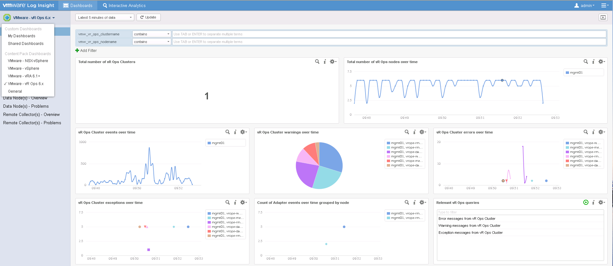

 

Connect vRealize Log Insight to the NSX Instances in Region A
-------------------------------------------------------------

Install and configure the vRealize Log Insight Content Pack for NSX for vSphere for log visualization and alerting of the NSX for vSphere real-time operation. You can the NSX-vSphere dashboards to monitor logs about installation and configuration, and about virtual networking services.

-   Install the vRealize Log Insight Content Pack for NSX for vSphere

-   Configure NSX Managers to Forward Log Events to vRealize Log Insight in Region A

-   Configure the NSX Controllers to Forward Events to vRealize Log Insight in Region A

-   Configure the NSX Edge Instances to Foward Log Events to vRealize Log Insight in Region A

    1.  ### Install the vRealize Log Insight Content Pack for NSX for vSphere

Install the content pack for NSX for vSphere to add the dashboards for viewing log information in vRealize Log Insight.

1.  In a Web browser, open the vRealize Log Insight UI.

<!-- -->

1.  Go to **https://vrli-cluster-01.sfo01.rainpole.local**.

2.  Use the **admin** user and the ***vrli\_admin\_password*** password to log in.

<!-- -->

1.  In the vRealize Log Insight UI, click the configuration drop-down menu icon  and select Content Packs.

2.  Under **Content Pack Marketplace**, select **Marketplace**.

3.  In the list of content packs, locate the **VMware - NSX-vSphere** content pack and click its icon.

> 

1.  In the **Install Content Pack** dialog box, click **Install**.

> 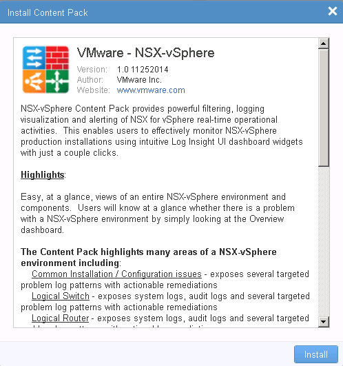

After the installation is complete, the VMware - NSX-vSphere content pack appears in the Installed Content Packs list on the left.

### Configure NSX Managers to Forward Log Events to vRealize Log Insight in Region A

Configure the NSX Manager for the management cluster and the NSX Manager for the compute and edge clusters to send audit logs and system events to vRealize Log Insight in Region A. 

Procedure

1.  In a Web browser, open the NSX Manager appliance UI.

<!-- -->

1.  Go to the following URL.

| NSX Manager                                   | URL                                       |
|-----------------------------------------------|-------------------------------------------|
| NSX Manager for the management cluster        | https://mgmt01nsxm01.sfo01.rainpole.local |
| NSX Manager for the compute and edge clusters | https://comp01nsxm01.sfo01.rainpole.local |

1.  Use the **admin** user name and ***nsx\_manager\_admin\_password*** password to log in.

<!-- -->

1.  On the main page of the appliance UI, click **Manage Appliance Settings**.

> 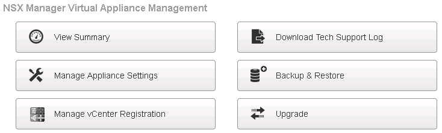

1.  Under **Settings**, click **General**, and in the **Syslog Server** pane, click **Edit**.

2.  In the **Syslog Server** dialog box, configure vRealize Log Insight as a syslog server by specifying the following settings and click **OK**.

| Syslog Server Setting | Value                                |
|-----------------------|--------------------------------------|
| **Syslog Server**     | vrli-cluster-01.sfo01.rainpole.local |
| **Port**              | 514                                  |
| **Protocol**          | UDP                                  |

> 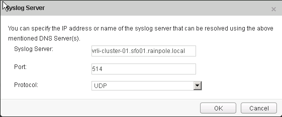

### Configure the NSX Controllers to Forward Events to vRealize Log Insight in Region A

Configure the NSX Controller instances for the management, compute and edge clusters to forward log information to vRealize Log Insight in Region A by using the NSX REST API. You can use a REST client, such as the RESTClient add-on for Firefox, to enable log forwarding.

Prerequisites

-   On a Windows host that has access to your data center, install a REST client, such as the RESTClient add-on for Firefox.

Procedure

1.  Log in to the Windows host that has access to your data center.

2.  In a Firefox browser, go to **chrome://restclient/content/restclient.html**.

3.  Specify the request headers for requests to the NSX Manager.

<!-- -->

1.  From the **Authentication** drop-down menu, select **Basic Authentication**.

> 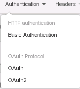

1.  In the **Basic Authorization** dialog box, enter the following credentials, select **Remember me** and click **Okay**.

| Authentication Attribute |  Value                                                                           |
|--------------------------|----------------------------------------------------------------------------------|
| **Username**             | admin                                                                            |
| **Password**             | *mngnsx\_admin\_password* for the NSX Manager for the management cluster         
                            *compnsx\_admin\_password *for the NSX Manager for the compute and edge clusters  |

> 
>
> The **Authorization:Basic XXX** header appears in the Headers pane.

1.  From the Headers drop-down menu, select Custom Header. 

> 

1.  In the **Request Header** dialog box, enter the following header details and click **Okay**.

| Request Header Attribute | Value           |
|--------------------------|-----------------|
| Name                     | Content-Type    |
| Value                    | application/xml |

> 

1.  The **Content-Type:application/xml** header appears in the **Headers** pane.

> 

1.  Contact the NSX Manager to retrieve the IDs of the associated NSX Controllers.  

<!-- -->

1.  In the **Request** pane, from the **Method** drop-down menu, select **GET**.

2.  In the **URL** text box, enter the following URL, and click **Send**.
    The RESTClient sends a query to the NSX Manager about the installed NSX controllers.

| NSX Manager                                       | URL                                                              |
|---------------------------------------------------|------------------------------------------------------------------|
| **NSX Manager for the management cluster**        | https://mgmt01nsxm01.sfo01.rainpole.local/api/2.0/vdn/controller |
| **NSX Manager for the compute and edge clusters** | https://comp01nsxm01.sfo01.rainpole.local/api/2.0/vdn/controller |

1.  After the NSX Manager sends a response back, click the **Response Body (Preview)** tab under **Response**. The response body contains a root &lt;controllers&gt; XML element which groups the details about the three controllers that form the controller cluster. 

2.  Within the **&lt;controllers&gt;** element, locate the **&lt;controller&gt;** element for each controller and write down the content of the id element.
    Controller IDs have the **controller-*id*** format where **id** represents the sequence number of the controller in the cluster, for example, **controller-2**.  

3.  Repeat the steps for the other NSX Manager.

> 

1.  For each NSX Controller, send a request to configure vRealize Log Insight as a remote syslog server.

<!-- -->

1.  In the **Request** pane, from the Method drop-down menu, select **POST**, and in the **URL** text box, enter the following URL.

| NSX Manager                                   | NSX Controller in the Controller Cluster | POST URL                                                                             |
|-----------------------------------------------|------------------------------------------|--------------------------------------------------------------------------------------|
| NSX Manager for the management cluster        | NSX Controller 1                         | https://mgmt01nsxm01.sfo01.rainpole.local/api/2.0/vdn/controller/controller-1/syslog |
|                                               | NSX Controller 2                         | https://mgmt01nsxm01.sfo01.rainpole.local/api/2.0/vdn/controller/controller-2/syslog |
|                                               | NSX Controller 3                         | https://mgmt01nsxm01.sfo01.rainpole.local/api/2.0/vdn/controller/controller-3/syslog |
| NSX Manager for the compute and edge clusters | NSX Controller 1                         | https://comp01nsxm01.sfo01.rainpole.local/api/2.0/vdn/controller/controller-1/syslog |
|                                               | NSX Controller 2                         | https://comp01nsxm01.sfo01.rainpole.local/api/2.0/vdn/controller/controller-2/syslog |
|                                               | NSX Controller 3                         | https://comp01nsxm01.sfo01.rainpole.local/api/2.0/vdn/controller/controller-3/syslog |

1.  In the **Request** pane, paste the following request body in the **Body** text box and click **Send**.

> &lt;controllerSyslogServer&gt;
>    &lt;syslogServer&gt;vrli-cluster-01.sfo01.rainpole.local&lt;/syslogServer&gt;
>    &lt;port&gt;514&lt;/port&gt;
>    &lt;protocol&gt;UDP&lt;/protocol&gt;
>    &lt;level&gt;INFO&lt;/level&gt;
> &lt;/controllerSyslogServer&gt;

1.  Repeat the steps for the next NSX Controller.

> 

1.  Verify the syslog configuration on each NSX Controller. 

<!-- -->

1.  In the **Request** pane, from the **Method** drop-down menu, select **GET**, and in the **URL** text box, enter the collector-specific syslog URL from Step 4.

2.  After the NSX Manager sends a response back, click the **Response Body (Preview)** tab under **Response**. The response body contains a root &lt;controllerSyslogServer&gt; element which represents the settings for the remote syslog server on the NSX Controller.

3.  Verify that the value of the &lt;syslogServer&gt; element is vrli-cluster-01.sfo01.rainpole.local. 

4.  Repeat the steps for the next NSX Controller.

> 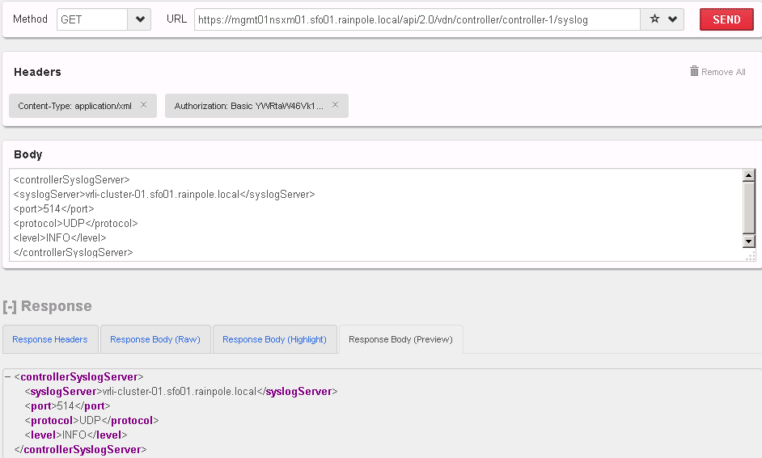

### Configure the NSX Edge Instances to Foward Log Events to vRealize Log Insight in Region A

Configure the NSX Edge service gateways for vRealize Operations Manager, vRealize Log Insight and vRealize Automation to forward log information to vRealize Log Insight in Region A.

**Procedure**

1.  In a Web browser, open the vSphere Web Client.

<!-- -->

1.  Go to **https://mgmt01vc01.sfo01.rainpole.local**.

2.  Use the **administrator@vsphere.local** user name and ***vsphere\_administrator\_password*** password to log in.

<!-- -->

1.  From the Home menu, select **Networking & Security**.

2.  From the **Networking & Security** menu on the left, click **NSX Edges**.

3.  On the **NSX Edges** page, select the **172.16.11.65** NSX Manager instance from the **NSX Manager** drop-down menu. The edge devices in the scope of the NSX Manager appear.

> 

1.  Configure the log forwarding on each edge service gateway.

<!-- -->

1.  Double-click the edge device to open its user interface.

| NSX Edge Service Gateway | Application Traffic                                |
|--------------------------|----------------------------------------------------|
| vRA01-Edge               | vRealize Automation                                

                            vRealize Orchestrator                               |
| vRA01IAS-Edge            | vSphere proxy agents for vRealize Automation       |
| vRLI01-Edge              | vRealize Log Insight nodes                         |
| vROps01-Edge             | vRealize Operations Manager analytics nodes        |
| vROps01RC-Edge           | vRealize Operations Manager remote collector nodes |

1.  On the NSX edge device page, click the **Manage** tab and click **Configuration**.

2.  In the **Details** panel, click **Change** next to **Syslog servers**.

> 

1.  In the **Edit Syslog Servers Configuration** dialog box, in the **Syslog Server 1** text box enter **192.168.31.10** and from the **Protocol** drop-down menu, select **udp**.

> 

1.  Click **OK**.

2.  Repeat the steps for the next NSX edge device.

The vRealize Log Insight user interface starts showing log data in the NSX-vSphere-Overview dashboard available under the VMware - NSX-vSphere group of content pack dashboards.

Connect vRealize Log Insight to vRealize Automation in Region A
---------------------------------------------------------------

Connect the vRealize Log to vRealize Automation to receive log information from all components of vRealize Automation in the vRealize Log Insight UI. 

-   Install the vRealize Log Insight Content Pack for vRealize Automation in Region A

-   Configure the Windows Components of vRealize Automation to Forward Log Events to vRealize Log Insight in Region A

-   Configure the Appliance Components of vRealize Automation to Forward Log Events to vRealize Log Insight in Region A

-   Configure vRealize Orchestrator to Forward Log Events to vRealize Log Insight in Region A.

    1.  ### Install the vRealize Log Insight Content Pack for vRealize Automation in Region A

Install the content pack for vRealize Automation to add the dashboards for viewing log information in vRealize Log Insight.

1.  In a Web browser, open the vRealize Log Insight UI.

<!-- -->

1.  Go to [**https://vrli-cluster-01.sfo01.rainpole.local**](https://vrli-cluster-01.sfo01.rainpole.local).

2.  Use the **admin** user and the ***vrli\_admin\_password** *password to log in.

<!-- -->

1.  In the vRealize Log Insight UI, click the configuration drop-down menu icon  and select **Content Packs**.

2.  Under **Content Pack Marketplace**, select **Marketplace**.

3.  In the list of content packs, locate the **VMware - vRA 6.1 +** content pack and click its icon.

> 

1.  In the **Install Content Pack** dialog box, click **Install**.

> 

1.  After the installation is complete, the **VMware - vRA 6.1 +** content pack appears in the **Installed Content Packs** list on the left.

> 

### Configure the Windows Components of vRealize Automation to Forward Log Events to vRealize Log Insight in Region A

Install the vRealize Log Insight agent to collect and forward events to vRealize Log Insight in Region A on the Windows virtual machines for the Distributed Execution Manager, IaaS Manager Service, IaaS Web Server, IaaS Microsoft SQL Server and the vSphere proxy agents. 

1.  Log in to the Windows virtual machine of the vRealize Automation component.

<!-- -->

1.  Connect to the following host address, or in the vSphere Web Client, navigate to the VM that has the following name and select **Actions** &gt; **Open** **Console** to open a remote console.

| vRealize Automation Component                 | Host Name/VM Name            |
|-----------------------------------------------|------------------------------|
| **IaaS Web Server**                           | vra01iws01a.rainpole.local   |
| **IaaS Web Server**                           | vra01iws01b.rainpole.local   |
| **IaaS Manager Service and DEM Orchestrator** | vra01ims01a.rainpole.local   |
| **IaaS Manager Service and DEM Orchestrator** | vra01ims01b.rainpole.local   |
| **IaaS DEM Worker**                           | vra01dem01.rainpole.local    |
| **IaaS DEM Worker**                           | vra01dem02.rainpole.local    |
| **vSphere Proxy Agent**                       | vra01ias01sfo.rainpole.local |
| **vSphere Proxy Agent**                       | vra01ias02sfo.rainpole.local |
| **Microsoft SQL Server**                      | vra01mssql01.rainpole.local  |

1.  Use the **administrator** user name and the *win\_vm\_administrator\_password* password to log in. 

<!-- -->

1.  In the Windows virtual machine, download the Windows agent for vRealize Log Insight.

<!-- -->

1.  In a Web browser, go to **https://vrli-cluster-01.sfo01.rainpole.local**.

2.  Use the **admin** user name and the ***vrli\_admin\_password*** password to log in.

3.  Click the configuration drop-down menu icon  and select **Administration**.

> 

1.  Under **Management**, click **Agents**.

2.  On the **Agents** page, click the **Download Log Insight Agent Version 3.0.0** link.

3.  In the **Download Log Insight Agent Version 3.0.0** dialog box, click **Windows MSI (32-bit/64-bit)** and save the .msi file on your computer.

> 

1.  Install the Log Insight agent on the virtual machine of the vRealize Automation Windows component.

<!-- -->

1.  Double-click the .msi file to run the installer.

2.  In the **VMware vRealize Log Insight Agent Setup** wizard, accept the license agreement and click **Next**.

> 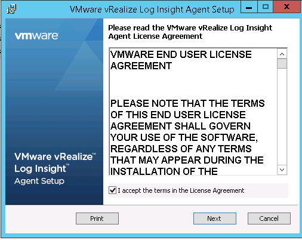

1.  On the **Server Configuration** page, enter **vrli-cluster-01.sfo01.rainpole.local** in the **Host** text box, and click **Install**.

> 

1.  After the installation is complete, click **Finish**.

<!-- -->

1.  After the installation, configure the Log Insight agent on the vRealize Automation Windows virtual machine.

<!-- -->

1.  Go to the **%ProgramData%\\VMware\\Log Insight Agent** folder and open the **liagnet.ini** file in an editor application.

2.  Add the following lines at the end of the **liagent.ini** file and save the file.

> ;;;vRA Windows configuration
>
> \[filelog|vra-server\]
> directory=C:\\Program Files (x86)\\VMware\\vCAC\\Server\\Logs\\
> include=\*All.log;Repository.log
> event\_marker=^\\\[\\w\\w\\w:\\d{4}-\\d{2}-\\d{2}
> tags={"vmw\_product":"vra","vmw\_product\_component":"server"}
>
> \[filelog|vra-mm\]
> directory=C:\\Program Files (x86)\\VMware\\vCAC\\Server\\Model Manager Web\\Logs\\
> include=\*All.log;Repository.log
> event\_marker=^\\\[\\w\\w\\w:\\d{4}-\\d{2}-\\d{2}
> tags={"vmw\_product":"vra","vmw\_product\_component":"mm"}
>
> \[filelog|vra-web\]
> directory=C:\\Program Files (x86)\\VMware\\vCAC\\Server\\Website\\Logs\\
> include=\*All.log;Repository.log
> event\_marker=^\\\[\\w\\w\\w:\\d{4}-\\d{2}-\\d{2}
> tags={"vmw\_product":"vra","vmw\_product\_component":"web"}
>
> \[filelog|vra-install\]
> directory=C:\\Program Files (x86)\\VMware\\vCAC\\InstallLogs\\
> event\_marker=^\\\[\\w\\w\\w:\\d{4}-\\d{2}-\\d{2}
> tags={"vmw\_product":"vra","vmw\_product\_component":"install"}
>
> \[filelog|vra-agent-Agent-vSphere-01\]
> directory=C:\\Program Files (x86)\\VMware\\vCAC\\Agents\\SFO-Agent-vSphere-01\\logs\\
> event\_marker=^\\\[\\d{1,2}/\\d{1,2}/\\d{4} \\d{1,2}:\\d{1,2}:\\d{1,2}
> tags={"vmw\_product":"vra","vmw\_product\_component":"agent"}
>
> \[filelog|vra-agent-Agent-vSphere-02\]
> directory=C:\\Program Files (x86)\\VMware\\vCAC\\Agents\\SFO-Agent-vSphere-02\\logs\\
> event\_marker=^\\\[\\d{1,2}/\\d{1,2}/\\d{4} \\d{1,2}:\\d{1,2}:\\d{1,2}
> tags={"vmw\_product":"vra","vmw\_product\_component":"agent"}
>
> \[filelog|vra-agent-Agent-vSphere-03\]
> directory=C:\\Program Files (x86)\\VMware\\vCAC\\Agents\\LAX-Agent-vSphere-01\\logs\\
> event\_marker=^\\\[\\d{1,2}/\\d{1,2}/\\d{4} \\d{1,2}:\\d{1,2}:\\d{1,2}
> tags={"vmw\_product":"vra","vmw\_product\_component":"agent"}
>
> \[filelog|vra-agent-Agent-vSphere-04\]
> directory=C:\\Program Files (x86)\\VMware\\vCAC\\Agents\\LAX-Agent-vSphere-02\\logs\\
> event\_marker=^\\\[\\d{1,2}/\\d{1,2}/\\d{4} \\d{1,2}:\\d{1,2}:\\d{1,2}
> tags={"vmw\_product":"vra","vmw\_product\_component":"agent"}
>
> \[filelog|vra-dem\]
> directory=C:\\Program Files (x86)\\VMware\\vCAC\\Distributed Execution Manager\\DEM-Worker-01\\Logs\\
> include=\*All.log;Repository.log
> event\_marker=^\\\[\\w\\w\\w:\\d{4}-\\d{2}-\\d{2}
> tags={"vmw\_product":"vra","vmw\_product\_component":"dem"}
>
> \[filelog|vra-dem\]
> directory=C:\\Program Files (x86)\\VMware\\vCAC\\Distributed Execution Manager\\DEM-Worker-02\\Logs\\
> include=\*All.log;Repository.log
> event\_marker=^\\\[\\w\\w\\w:\\d{4}-\\d{2}-\\d{2}
> tags={"vmw\_product":"vra","vmw\_product\_component":"dem"}
>
> \[filelog|vra-dem\]
> directory=C:\\Program Files (x86)\\VMware\\vCAC\\Distributed Execution Manager\\DEM-Worker-03\\Logs\\
> include=\*All.log;Repository.log
> event\_marker=^\\\[\\w\\w\\w:\\d{4}-\\d{2}-\\d{2}
> tags={"vmw\_product":"vra","vmw\_product\_component":"dem"}
>
> \[filelog|vra-dem\]
> directory=C:\\Program Files (x86)\\VMware\\vCAC\\Distributed Execution Manager\\DEM-Worker-04\\Logs\\
> include=\*All.log;Repository.log
> event\_marker=^\\\[\\w\\w\\w:\\d{4}-\\d{2}-\\d{2}
> tags={"vmw\_product":"vra","vmw\_product\_component":"dem"}
>
> \[filelog|vra-dem\]
> directory=C:\\Program Files (x86)\\VMware\\vCAC\\Distributed Execution Manager\\DEM-Worker-05\\Logs\\
> include=\*All.log;Repository.log
> event\_marker=^\\\[\\w\\w\\w:\\d{4}-\\d{2}-\\d{2}
> tags={"vmw\_product":"vra","vmw\_product\_component":"dem"}
>
> \[filelog|vra-dem\]
> directory=C:\\Program Files (x86)\\VMware\\vCAC\\Distributed Execution Manager\\DEM-Worker-06\\Logs\\
> include=\*All.log;Repository.log
> event\_marker=^\\\[\\w\\w\\w:\\d{4}-\\d{2}-\\d{2}
> tags={"vmw\_product":"vra","vmw\_product\_component":"dem"}
>
> \[filelog|vra-deo\]
> directory=C:\\Program Files (x86)\\VMware\\vCAC\\Distributed Execution Manager\\DEM-Orch-01\\Logs\\
> include=\*All.log;Repository.log
> event\_marker=^\\\[\\w\\w\\w:\\d{4}-\\d{2}-\\d{2}
> tags={"vmw\_product":"vra","vmw\_product\_component":"deo"}
>
> \[filelog|vra-deo\]
> directory=C:\\Program Files (x86)\\VMware\\vCAC\\Distributed Execution Manager\\DEM-Orch-02\\Logs\\
> include=\*All.log;Repository.log
> event\_marker=^\\\[\\w\\w\\w:\\d{4}-\\d{2}-\\d{2}
> tags={"vmw\_product":"vra","vmw\_product\_component":"deo"}
>
> \[filelog|vra-sql\]
>
> directory=C:\\Program Files\\Microsoft SQL Server\\MSSQL11.MSSQLSERVER\\MSSQL\\Log
>
> charset=UTF-16LE
>
> event\_marker=^\[^\\s\]

### Configure the Appliance Components of vRealize Automation to Forward Log Events to vRealize Log Insight in Region A

Install the vRealize Log Insight agent to collect and forward events to vRealize Log Insight in Region A on the virtual machines for the vRealize Appliance and the vRealize Automation Identity Appliance instances. 

1.  Download the Linux agent of vRealize Log Insight.

<!-- -->

1.  In a Web browser, go to [**https://vrli-cluster-01.sfo01.rainpole.local**](https://vrli-cluster-01.sfo01.rainpole.local/).

2.  Use the **admin** user and the ***vrli\_admin\_password*** password to log in.

3.  In the vRealize Log Insight UI, click the configuration drop-down menu icon  and select **Administration**.

4.  Under **Management**, click **Agents**.

5.  On the **Agents** page, click the **Download Log Insight Agent Version 3.0.0** link.

6.  In the **Download Log Insight Agent Version 3.0.0** dialog box, click **Linux BIN (32-bit/64-bit)** and save the .bin file on your computer.

> 

1.  Install the Log Insight agent on to the appliance.

<!-- -->

1.  Connect to the appliance over SSH.

| vRealize Automation Appliance          | FQDN                       |
|----------------------------------------|----------------------------|
| vRealize Automation Identity Appliance | vra01ids01a.rainpole.local |
| vRealize Appliance                     | vra01svr01a.rainpole.local |
| vRealize Appliance                     | vra01svr01b.rainpole.local |

1.  Use the **root** user name and ***vra\_appliance\_root\_password*** password to log in.

2.  Copy the **.bin** file to the **/root** folder of the vRealize Automation Appliance or the vRealize Automation Identity Appliance.
    You can use scp, FileZilla or WinSCP.  

3.  Run the following console commands to make the agent .bin file executable.

> cd /root
>
> chmod +x VMware-Log-Insight-Agent-3.0.0-2985111\_192.168.31.10.bin 

1.  Install the agent by running the following command.

> ./VMware-Log-Insight-Agent-3.0.0-2985111\_192.168.31.10.bin
>
> 

1.  Edit the /etc/liagent.ini file and save the changes.

<!-- -->

1.  Verify that the \[server\] section contains the following hostname parameter and add it if the parameter is not present.

> hostname=vrli-cluster-01.sfo01.rainpole.local

1.  On each vRealize Appliances, add the following lines within the \[logging\] section:

> ;;; vRA Appliance configuration
>
> \[filelog|vra\]
> directory=/var/log/vmware/vcac
> event\_marker=^\[^\\d\]
> tags={"vmw\_product":"vra","vmw\_product\_component":"cafe"}

1.  On the Identity Appliance, add the following lines within the **\[logging\]** section:

> ;;; vRA Identity Appliance
>
> \[filelog|vmw-sso\]
> directory=/var/log/vmware/sso
> exclude=vmware-\*
> event\_marker=^(\\\[\\d{4}-\\d{2}-\\d{2}|\\d{2}-\\w+-\\d{4})
> tags={"vmw\_product":"sso"}
>
> \[filelog|vmw-sso-sts-idmd-perf\]
> directory=/var/log/vmware/sso
> include=vmware-sts-idmd-perf\*
> event\_marker=^\\d{4}-\\d{2}-\\d{2}\\s\\S+\\s\\w+\\s+\\w+
> tags={"vmw\_product":"sso"}
>
> \[filelog|vmw-sso-sts-perf\]
> directory=/var/log/vmware/sso
> include=vmware-identity-sts-perf\*
> event\_marker=^\\\[\\d{4}-\\d{2}-\\d{2}\\s\\S+\\s\\S+\\s\\S+\\\]\\s+\\w+
> tags={"vmw\_product":"sso"}
>
> \[filelog|vmw-sso-sts-other\]
> directory=/var/log/vmware/sso
> include=vmware-sts-idmd.\*;vmware-identity-sts.\*
> event\_marker=^\\\[\\d{4}-\\d{2}-\\d{2}\\s\\S+\\s\\S+\\s\\S+
> tags={"vmw\_product":"sos"}

1.  Run as root: /etc/init.d/liagentd restart

    1.  ### Configure vRealize Orchestrator to Forward Log Events to vRealize Log Insight in Region A

Configure the Log4j module of vRealize Orchestrator to forward log information to vRealize Log Insight in Region A.

1.  Log in to the vRealize Orchestrator appliance.

| vRealize Orchestrator Appliance | FQDN/VM Name               |
|---------------------------------|----------------------------|
| vRealize Orchestrator A         | vra01vro01a.rainpole.local |
| vRealize Orchestrator B         | vra01vro01b.rainpole.local |

1.  Use the **root** user name and the ***vro\_appliance\_root\_password*** password to log in.

2.  Navigate to the **/etc/vco/app-server/** folder and open **log4j.xml** file in a text editor.

3.  Locate the following **&lt;appender&gt;** section.

> &lt;appender name="SYSLOG" class="[org.apache.log4j.net](http://org.apache.log4j.net).SyslogAppender"&gt;
>   &lt;param name="Threshold" value="INFO"/&gt;
>   &lt;param name="Facility" value="LOCAL1"/&gt;
>   &lt;param name="SyslogHost" value="&lt;LOGINSIGHT&gt;"/&gt;
>   &lt;param name="FacilityPrinting" value="false"/&gt;
>   &lt;layout class="org.apache.log4j.PatternLayout"&gt;
>     &lt;param name="ConversionPattern" value="vco: prio:%-5p thread:%t token:%X{token} wf:%X{workflowName} wfid:%X{workflow} user: %X{username} cat:%c{1} msg:%m%n"/&gt;
>    &lt;/layout&gt;
>  &lt;/appender&gt;

1.  Change the value of the name attribute of the **&lt;appender&gt;** element and the value of the SyslogHost parameter within the **&lt;appender&gt;** element to **vrli-cluster-01.sfo01.rainpole.local**. 

> &lt;appender name="vrli-cluster-01.sfo01.rainpole.local" class="[org.apache.log4j.net](http://org.apache.log4j.net/).SyslogAppender"&gt;
>   &lt;param name="Threshold" value="INFO"/&gt;
>   &lt;param name="Facility" value="LOCAL1"/&gt;
>   &lt;param name="SyslogHost" value="vrli-cluster-01.sfo01.rainpole.local"/&gt;
>   &lt;param name="FacilityPrinting" value="false"/&gt;
>   &lt;layout class="org.apache.log4j.PatternLayout"&gt;
>     &lt;param name="ConversionPattern" value="vco: prio:%-5p thread:%t token:%X{token} wf:%X{workflowName} wfid:%X{workflow} user: %X{username} cat:%c{1} msg:%m%n"/&gt;
>   &lt;/layout&gt;
> &lt;/appender&gt; 

1.  Locate the **&lt;root&gt;** section at the end of the log4j.xml file.

> &lt;root&gt;         
>   &lt;priority value="INFO" /&gt;
>   &lt;appender-ref ref="CONSOLE" /&gt;         
>   &lt;appender-ref ref="FILE" /&gt;         
>   &lt;!-- 
>     &lt;appender-ref ref="SYSLOG" /&gt;        
>   --&gt;        
>   &lt;!-- 
>      &lt;appender-ref ref="EVENT\_LOG" /&gt;         
>   --&gt;     
> &lt;/root&gt; 

1.  Remove the comment around the **&lt;appender-ref ref="SYSLOG" /&gt;** element.

> &lt;root&gt;         
>   &lt;priority value="INFO" /&gt;
>   &lt;appender-ref ref="CONSOLE" /&gt;         
>   &lt;appender-ref ref="FILE" /&gt;         
>   &lt;appender-ref ref="SYSLOG" /&gt;        
>   &lt;!-- 
>      &lt;appender-ref ref="EVENT\_LOG" /&gt;         
>   --&gt;     
> &lt;/root&gt; 
>
>  

1.  Save the **log4j.xml** file.

2.  Restart the vRealize Orchestrator by running the following console command.

> /etc/init.d/vco-server restart
>
> 

Cloud Management Platform Implementation in Region A
====================================================

The deployment of the Cloud Management Platform in Region A is deployed using the following process:

-   Generate Certificates for vRealize Automation and vRealize Orchestrator

-   Configure SQL Server for use with vRealize Automation and vRealize Orchestrator (Region A)

-   Create vSphere Image Customization Specifications

-   Create Windows Virtual Machines for vRealize Automation

-   Configure Load Balancing for vRealize Automation and vRealize Orchestrator in Region A

-   Install vRealize Automation in Region A (Region A)

-   Install and Configure the vRealize Orchestrator Cluster (Region A)

-   Create Anti-Affinity Rules for vRealize Automation and vRealize Orchestrator Virtual Machines

-   Create a vRealize Automation Tenant (Region A)

-   Configure a vRealize Automation Tenant (Region A)

-   Prepare a Compute vCenter Server System for vRealize Automation

-   Add a Compute vCenter Server Instance to vRealize Automation (Region A)

-   Configure Single Machine Blueprints for Region A (Region A)

    1.  Generate Certificates for vRealize Automation and vRealize Orchestrator
        -----------------------------------------------------------------------

vRealize Automation and vRealize Orchestrator use SSL certificates for secure communication among instances of the vRealize Automation Identity Appliance, of the vRealize Automaton appliance, and of vRealize Orchestrator. 

When you deploy each appliance, the deployment wizard prompts for certificate information. Before you run the appliance deployment wizard, you must generate certificates and place them in a directory that's visible to the wizards. You need three folders with certificate and key files, one for each installer (vRealize Automation Identity Appliance, vRealize Automation, vRealize Orchestrator). 

You repeat the following certificate generation process 3 times: 

1.  Run the **certgen.sh** script to generate a CSR type of certificate. 

2.  Submit the CSR to the CA, and place the **.cer** file and root certificate in the same location as the script.  

3.  Run the certgen.sh script again to generate **.pfx** and **jssecacerts** files

4.  Make a copy of the directory with the certificates, and place the directory in a location that the installer can access.

<!-- -->

1.  The script generates a vrealize.csr file and generates a  vrealize.crt file each time. Because of that, you have to complete the whole generation process for one product, copy the resulting directory, and then remove all files with the exception of the script as well before you repeat the process. 

Prerequisites

-   Certificate generation is performed on a Linux or Mac OS X system with an installation of keytool, a key and certificate management utility, and Java 1.6 or later. See *Prerequisites for Cloud Management Platform*. 

-   Prepare the vRealize Certificate Generation Tool, as follows:

1.  Download the vRealize Certificate Generation Tool at the following link: <http://kb.vmware.com/kb/2107816>

2.  Extract the vRealize Certificate Generation Tool zip file.

3.  Copy the **certgen.sh** file and place it in the **/tmp** directory.

4.  Change the **certgen.sh** permissions to execute by using the command **chmod u+x certgen.sh.**

**Procedure **

1.  Log in to the Linux or Mac OS system that you set up for certificate generation and generate the CSRs by following these steps: 

<!-- -->

1.  Execute the the script.

> **./certgen.sh**

1.  Respond to the prompts, as shown in the following table.

| Prompt                        | Response                                                                                                                                                     |
|-------------------------------|--------------------------------------------------------------------------------------------------------------------------------------------------------------|
| **Enter Organization**        | Rainpole                                                                                                                                                     |
| **Enter Organizational Unit** | Engineering                                                                                                                                                  |
| **Enter Locality/Town**       | San Francisco                                                                                                                                                |
| **Enter State/Country**       | CA                                                                                                                                                           |
| **Enter Country Code**        | US                                                                                                                                                           |
| **Enter server hostname**     | Supply all host names for that product. For example, for the vRealize Automation Identity Appliance, provide the following host names:                       

                                 vra01ids01.rainpole.local                                                                                                                                     

                                 vra01ids01a.rainpole.local                                                                                                                                    

                                 When you run the script a second time to generate the CSR for the vRealize Automation appliance, you supply those host names, as shown in the table below.    |
| **Enter domain name...**      | rainpole.local                                                                                                                                               |

> 
>
> Provide the host names that are listed in the following table to create the CSR for each host.

| Product                                    | Host names specify during CSR generation |
|--------------------------------------------|------------------------------------------|
| **vRealize Automation Identity Appliance** | vra01ids01.rainpole.local                

                                              vra01ids01a.rainpole.local                |
| **vRealize Automation**                    | vra01svr01.rainpole.local                

                                              vra01svr01a.rainpole.local                

                                              vra01svr01b.rainpole.local                

                                              vra01iws01.rainpole.local                 

                                              vra01iws01a.rainpole.local                

                                              vra01iws01b.rainpole.local                

                                              vra01ims01.rainpole.local                 

                                              vra01ims01a.rainpole.local                

                                              vra01ims01b.rainpole.local                |
| **vRealize Orchestrator**                  | vra01vro01.rainpole.local                

                                              vra01vro01a.rainpole.local                

                                              vra01vro01b.rainpole.local                |

1.  Submit the CSR file (**vrealize.csr**) to the CA and follow the steps in the "Obtain Custom Certificates" section to request a signed certificate.

2.  Export the certificate files as follows:

<!-- -->

1.  Export the **certnew.cer** file in base64 format to the **/tmp** directory and rename it to **vrealize.crt**. 

2.  Export the root certificate to the **/tmp** directory and rename it to **Root64.cer**.
    You now have the following files in the **/tmp** directory:

    certgen.sh
    vrealize.key
    vrealize.csr
    vrealize.crt
    Root64.cer

<!-- -->

1.  Run **certgen.sh** again and supply passwords when prompted.

<!-- -->

1.  **Important:** A simple password is sufficient, but you must provide passwords when prompted. The password you create will be required during configuration of the vRealize Automation Identity Appliance and the vRealize Automation virtual appliance. In addition, problems with the jssecacerts for vRealize Orchestrator result.
    The script creates a .pfx certificate file that is valid for all hosts that you specified during CSR generation, and a jssecacerts certificate file. 

<!-- -->

1.  Make a copy of the directory that contains the certificate and key files and rename the directory to reflect the individual product:

| Product                                | Folder |
|----------------------------------------|--------|
| vRealize Automation Identity Appliance | ids    |
| vRealize Automation appliance          | vra    |
| vRealize Orchestrator                  | vro    |

1.  Leave the **certgen.sh**  file in the /tmp directory, but remove all other files, then repeat the process to generate a folder with certificate files for each of the three products.

> At the end you have a directory for each product. 

| Product                                | Certificate Files  | VM Names     | Used for                    |
|----------------------------------------|--------------------|--------------|-----------------------------|
| vRealize Automation Identity Appliance | ids\\vrealize.key  
                                          ids\\vrealize.pem   | vra01ids01a  | Identity Server SSL         |
| vRealize Automation appliance          | vra\\vrealize.key  
                                          vra\\vrealize.pem   | vra01svr01a  
                                                               vra01svr01b   | vRA Virtual Appliance SSL   |
|                                        | vra\\vrealize.pfx  | vra01iws01a  
                                                               vra01iws01b   | IaaS Web IIS Server SSL     |
|                                        | vra\\vrealize.pfx  | vra01ims01a 
                                                               vra01ims01b   | IaaS Manager IIS Server SSL |
| vRealize Orchestrator                  | vro\\jssecacerts   | vra01vro01a  
                                                               vra01vro01b   | vRealize Orchestrator SSL   |

Configure SQL Server for use with vRealize Automation and vRealize Orchestrator (Region A)
------------------------------------------------------------------------------------------

vRealize Automation and vRealize Orchestrator require the use of a database to store data. Configure your SQL Server and Distributed Transaction Coordinator user accounts, database, and network access for use with vRealize Automation and vRealize Orchestrator.

Prerequisites

-   You must have installed Microsoft SQL Server before configuring vRealize Automation and vRealize Orchestrator to work with the database. See "Prerequisites for Cloud Management Platform."

-   The vRealize Automation service account <svc-vra@rainpole.local> exists in your Active Directory service.

-   A windows-2012r2-64-sql2012 VM from Virtual Machine Template Specifications with 8vCPU and 16GB memory.

Procedure Overview

Perform the following tasks to create and configure a database for use with vRealize Automation and vRealize Orchestrator.

-   Add the vRealize Automation Service Account to the SQL Server Administrators Group

-   Assign the SQL Server System Role to vRealize Automation

-   Create a SQL Server Database for vRealize Orchestrator

-   Configure Network Access for Distributed Transaction Coordinator

-   Disable Windows Firewall for Access by vRealize Automation 

    1.  ### Add the vRealize Automation Service Account to the SQL Server Administrators Group (Region A)

To provide database access for vRealize Automation, add the RAINPOLE\\svc-vra service account to the SQL Server local Administrators Group. SQL Server authenticates users based on their user account names or their group membership. If you grant a user or a user's group access to a database, the user is automatically granted access to that database. By default, several local user accounts are configured with database access, including the local Administrators Group.

1.  Log into VRA01MSSQL01.rainpole.local’s Virtual Machine Console using Rainpole domain administrator user **rainpole\\administrator**.

2.  From the Windows **Start **menu, select **Run**, and type **compmgmt.msc** in the **Open** text box.
    The **Computer Management** application window displays.

3.  In the navigation tree in the left-side panel, expand **System Tools** &gt;** Local User and Groups** &gt;** Groups**.

4.  Right-click on the **Administrators** group, and select **Properties** from the menu. The **Administrators Properties** dialog box displays.

5.  Select **Rainpole\\svc-vra** in the **Members** pane and click **Add**.
    The vRealize Automation service account **Rainpole\\svc-vra** is now included in the SQL Server Administrators group.

6.  Click **OK**.

> 

1.  Close the **Computer Management** application window. 

    1.  ### Assign the SQL Server System Role to vRealize Automation (Region A)

Assign the SQL Server sysadmin system role to the vRealize Automation service account. vRealize Automation uses the SQL Server system role privilege to create and execute scripts on the SQL Server database. By default, only users who are members of the sysadmin system role, or the db\_owner or db\_ddladmin database roles can create objects in the database.

Procedure 

1.  From the Windows **Start **menu, select **Run**, and type **ssms.exe** in the **Open** text box. Click **OK**.

2.  **SQL Server Management Studio** opens. 
    **SQL Server Management Studio **is an integrated environment for configuring and managing all components of SQL Server.
    **SQL Server Management Studio** provides the **Connect to Server** dialog box to configure connection properties to SQL Server components. When **SQL Server Management Studio** starts, it opens the **Connect to Server** dialog box and prompts you to connect to a server. The **Connect to Server** dialog box retains the connection settings from the last time it was used. 

3.  In the **Connect to Server** dialog box, leave the already populated **Server Name** text box as default, and select** Windows Authentication** from the **Authentication** drop-down menu.

> 

1.  In **Object Explorer**, expand the folder for the server instance **VRA01MSSQL01**.
    **Note**: **Object Explorer** is visible in **SQL Server Management Studio** by default. If you cannot see **Object Explorer**, select **View** &gt; **Object Explorer Details**.

2.  Right-click the **Security **folder, select **New**, and then select **Login**. 
    The **Login Properties** dialog box opens. 

> 

1.  Select the** General** page of the **Login Properties** dialog box.

2.  In the **Object Explorer Details** pane, select the **General** page, and type **Rainpole\\Svc-vRA** in the **Login name** text box.

> 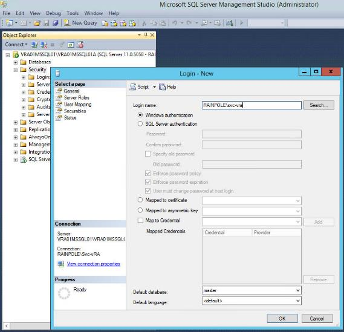

1.  In the **Object Explorer Details** pane, select the **Server Role** page. 

2.  From the **Server roles** list item field select the **sysadmin** check box. 

3.  Click **OK**.

> 

### Create a SQL Server Database for vRealize Orchestrator (Region A)

vRealize Orchestrator requires a database for storing data related to workflows and actions. You must create an empty database specifically for use by vRealize Orchestrator.

Prerequisites

Have available an instance of Microsoft SQL Server running in your environment that you can use in conjunction with vRealize Orchestrator. For information about creating a new database, see the documentation of your database provider.

Procedure

1.  From the Windows **Start **menu select **Run**, and type **ssms.exe** in the **Open** text box. Click **OK**.

2.  **SQL Server Management Studio** opens. 

3.  **SQL Server Management Studio **is an integrated environment for configuring and managing all components of SQL Server. **SQL Server Management Studio** provides the **Connect to Server** dialog box to configure connection properties to SQL Server components. When **SQL Server Management Studio** starts, it opens the **Connect to Server** dialog box and prompts you to connect to a server. The **Connect to Server** dialog box retains the connection settings from the last time it was used.

4.  In the **Connect to Server** dialog box, leave the already populated **Server Name** text box as default, and select** Windows Authentication** from the **Authentication **drop-down menu.

> 

1.  In **Object Explorer**, expand the folder for the server instance **VRA01MSSQL01**.
    **Note**: **Object Explorer** is visible in **SQL Server Management Studio** by default. If you cannot see **Object Explorer**, select **View** &gt; **Object Explorer Details**.

2.  Right-click the **Security **folder, select **New**, and then select **Login**. 
    The **Login Properties** dialog box opens. 

> 

1.  Select the** General** page of the **Login Properties** dialog box.

2.  In the **Object Explorer Details** pane, select the **General** page, and type **RAINPOLE\\svc-vro** in the **Login name** text box.

> 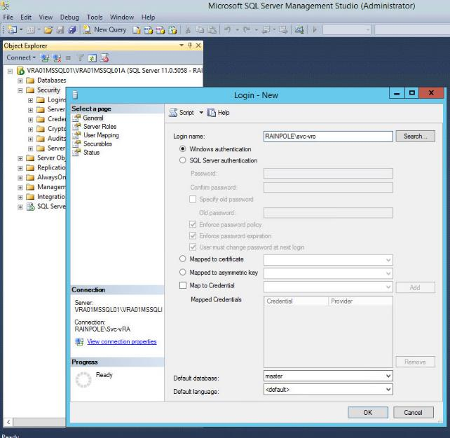

1.  Click **OK** 

2.  In **Object Explorer**, expand the **VRA01MSSQL01** folder.

<!-- -->

1.  **Object Explorer** is visible in **SQL Server Management Studio** by default. If you cannot see **Object Explorer**, select **View** &gt; **Object Explorer Details**. 

<!-- -->

1.  Right-click the **Databases** folder, and select** New Database**. The **New Database** dialog box displays.

> 

1.  In the **Object Explorer Details** pane, select the** General** page of the **New Database** dialog box, and type **VRODB-01** in the **Database name** text box.

> 

1.  In the **Object Explorer Details** pane, select the **Options** page. The **Database Properties - VRODB-01** dialog box displays.  The Database Properties - VRODB-01 dialog box displays different types of editing fields, depending on the needs of a particular property. Properties shown in gray are read-only.

2.  Navigate to the **Miscellaneous** field, and specify **True** for the settings listed in the table below**.**

| Setting                           | Value  |
|-----------------------------------|--------|
| **Recovery Model**                | Simple |
| **Allow Snapshot Isolation**      | True   |
| **Is Read Committed Snapshot On** | True   |

> 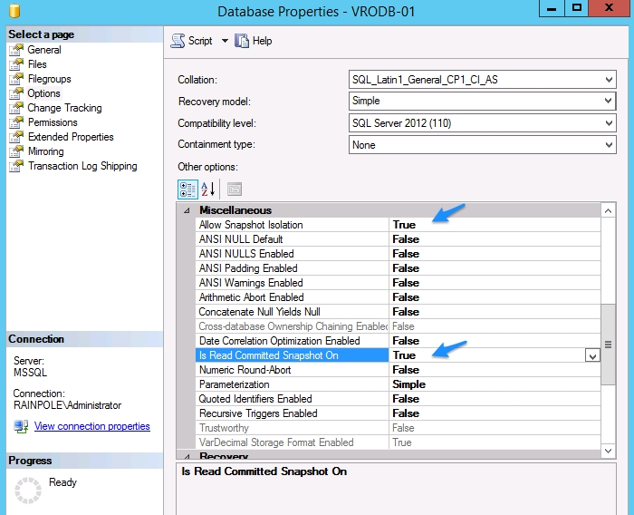
>  

1.  Click **OK**.

2.  In the **Object Explorer Details** pane, expand the **VRODB-01** database server.

3.  Expand the **Security** folder, then expand the **Users** folder.

4.  Right-click the **User** folder, and select **New User**.

> 

1.  In the **User name** text box type** **the** **vRealize Orchestrator** **service account name RAINPOLE\\svc-vro.

2.  In the **Login name** text box type the vRealize Orchestrator service account name **RAINPOLE\\svc-vro**.

> 

1.  In the **Object Explorer Details** pane, select the **Membership** page. The **Database User - New** window displays.

2.  In the **Database role membership** list item field, select the **db\_owner** check box.

> 

 

1.  Click **OK** 

    1.  ### Configure Network Access for Distributed Transaction Coordinator (Region A)

You must configure network access and security between vRealize Automation and your SQL Server database using Distributed Transaction Coordinator (DTC). DTC coordinates transactions that update two or more transaction-protected resources, such as databases, message queues, files systems, and so on. These transaction-protected resources may be on a single computer or distributed across many networked computers.

Procedure

1.  From the Windows **Start **menu select **Run**, and type comexp.msc in the **Open** text box.
    The **Component Services** manager displays. **Component Services** lets you manage Component Object Model (COM+) applications.

2.  Using the navigation tree in the left-side pane, expand **Component Services** &gt;** Computers** &gt;** My Computer** &gt;** Distributed Transaction List** &gt; **Local DTC**.

3.  Right-click **Local DTC **and select **Properties**.
    The **Local DTC Properties** dialog box displays.

4.  Click the **Security** tab.

5.  Apply the following configuration settings in the **Local DTC Properties** dialog box.

<!-- -->

1.  Select the **Network DTC Access** check box.

2.  Select the **Allow Remote Clients** check box.

3.  Deselect the **Allow Remote Administration** check box.

4.  Select the **Allow Inbound** and **Allow Outbound** check boxes.

5.  Select the **Mutual Authentication Required** check box.

6.  Deselect the **Enable XA Transactions** check box.

7.  Select the Enable SNA LU 6.2 Transactions check box.

8.  Leave the **Account** text box with its default setting.

9.  Leave the **Password** text box blank.

<!-- -->

1.  Click **OK**.

> 

1.  Exit **Component Services**.

    1.  ### Disable Windows Firewall for vRealize Automation (Region A)

You can disable specific network connections in Windows Firewall to ensure that network access to Distributed Transaction Coordinator (DTC) and SQL Server is not blocked.

Procedure

1.  From the Windows **Start **menu select **Run**, and type **WF.msc** in the **Open** text box.
    The **Windows Firewall with Advanced Security** window displays. You use this dialog box to configure basic firewall properties for each network profile.

> 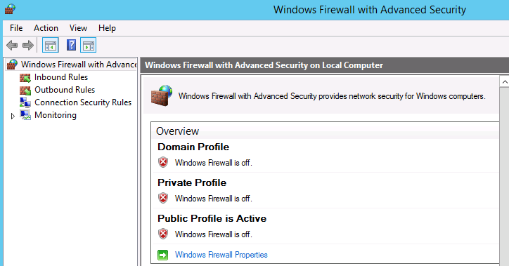

1.  In the navigation pane, right-click **Windows Firewall with Advanced Security**, and then click **Properties**.
    The **Windows Firewall with Advanced Security on Local Computer Properties **dialog box displays.** **

2.  Disable the firewall for the Domain, Private, Public network profiles.** **

    1.  Select the **Domain Profile** tab, and select **Off** from the **Firewall state** drop-down menu.

    2.  Select the **Private Profile** tab, and select **Off** from the **Firewall state** drop-down menu.

    3.  Select the **Public Profile** tab, and select **Off** from the **Firewall state** drop-down menu.

> 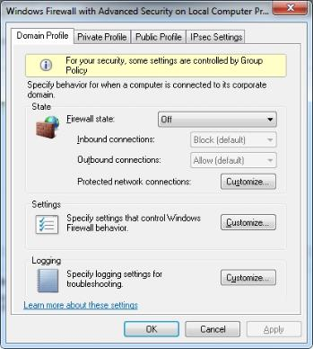

1.  Click **OK,** and exit the **Windows Firewall with Advanced Security **window.

    1.  Create vSphere Image Customization Specifications (Region A)
        ------------------------------------------------------------

Customization specifications are XML files that contain guest operating system settings for virtual machines. You create customization specifications with the **Guest Customization** wizard, and manage specifications using the Customization Specification Manager.

vCenter Server saves the customized configuration parameters in the vCenter Server database. If the customization settings are saved, the administrator, and domain administrator, passwords are stored in encrypted format in the database. Because the certificate used to encrypt the passwords is unique to each vCenter Server system, reinstalling vCenter Server, or attaching a new instance of the server the database, invalidates the encrypted passwords. The passwords must be re-entered before they can be used.

Prerequisites

The Management Cluster is deployed and configured. See "Deploy and Configure the Management Cluster Components (Region A).

-   Create a Customization Specification File for IaaS Servers

-   Create a Customization Specification File for IaaS Proxy Agent Servers

    1.  ### Create a Customization Specification File for IaaS Servers

Create a vSphere Image Customization template to use with your vRealize Automation IaaS Servers deployment. The vSphere Image Customization template sysprep answer file stores a number of customization settings such as computer name, licensing information, and workgroup or domain settings. You can supply a custom sysprep answer file as an alternative to specifying many of the settings in the Guest Customization wizard.

Procedure

1.  Log in to vCenter Server with the vSphere Web Client.

<!-- -->

1.  Open a Web browser and go to **https://mgmt01vc01.sfo01.rainpole.local/vsphere-client**.

2.  Log in using the following credentials.

| Setting       | Value                       |
|---------------|-----------------------------|
| **User name** | administrator@vsphere.local |
| **Password**  | *vcenter\_admin\_password*  |

1.  From the **vSphere Web Client Home** page, select **Customization Specification Manager**.

2.  Select **mgmt01vc01.sfo01.rainpole.local** from the **vCenter Server** drop down menu.

3.  Click the **New** icon. The **Guest Customization** wizard displays.

> 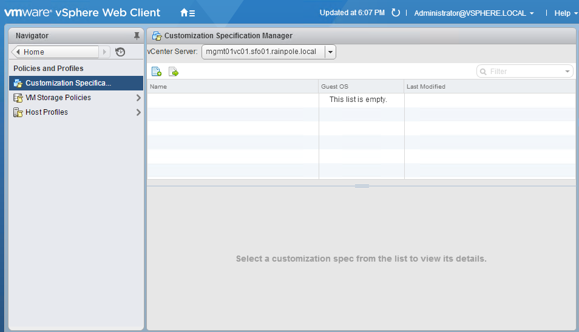

1.  In the **Specify Properties** page, enter the following settings, and click **Next**.

| Setting                            | Value                                |
|------------------------------------|--------------------------------------|
| **Target VM Operating System**     | Windows                              |
| **Use custom SysPrep answer file** | Deselect check box (leave unchecked) |
| **Customization Spec Name**        | windows2012r2-vra                    |
| **Description**                    | Leave blank                          |

> 

1.  In the **Set Registration Information** page, enter the following settings, and click **Next**.

| Setting          | Value       |
|------------------|-------------|
| **Name**         | Rainpole    |
| **Organization** | Rainpole IT |

> 

1.  In the **Set Computer Name** page, select the **Enter a name** in the Clone/Deploy wizard radio button, and click **Next**.

> 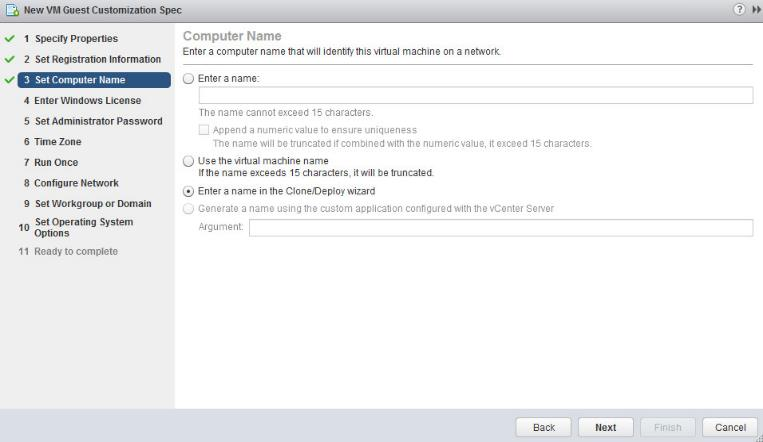

1.  In the **Enter Windows License** page, enter the following settings, and click **Next**.

| Setting                                | Value                                                                         |
|----------------------------------------|-------------------------------------------------------------------------------|
| **Product Key**                        | Type the volume license key. Note: If you are using Microsoft License Server,
                                          or have multiple single license keys, leave this text box blank.               |
| **Include Server License Information** | Select the check box.                                                         |
| **Server License Mode**                | Select the Per server check box.                                              |
| **Max connections**                    | 5                                                                             |

> 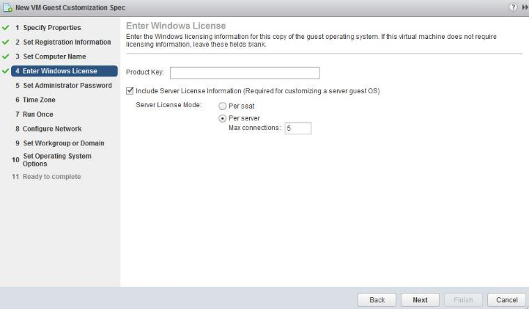

1.  In the **Set Administrator Password** page, enter the following settings, and click **Next**.

| Setting                                    | Value                                                                                            |
|--------------------------------------------|--------------------------------------------------------------------------------------------------|
| **Password**                               | Type a password for the administrator account and confirm the password by typing it again.       |
| **Automatically logon as Administrator**   | Select the check box. Enabling this logs users into the guest operating system as Administrator. |
| **Number of times to logon automatically** | 1                                                                                                |

> 

1.  In the **Time Zone** page, select **(GMT-08:00) Pacific Time (US & Canada)** from the **Time Zone** drop down menu, and click **Next**.

> 

1.  On the **Run Once** page, do not specify any commands to run the first time a user logs into the guest operating system. Click **Next**.

> 

1.  On the **Configure Network** page, select the **Manually select custom settings** radio button, select **NIC1** from the list of network interfaces in the virtual machine, and click **Edit**. The **Network Properties** dialog box displays.

> 

1.  In the **Network** **Properties** dialog box, select **IPv4**.

<!-- -->

1.  Select the Prompt the user for an address when the specification is used check box.

2.  Type **255.255.255.0** in the **Subnet Mask** text box.

3.  Type **192.168.11.1** in the **Default Gateway** text box.

> 

1.  Select **DNS**.

<!-- -->

1.  Select the Use the following DNS server address radio button.

2.  Type **172.16.11.5** in the **Preferred DNS Server** text box.

3.  Type **172.17.11.5** in the **Alternate DNS Server** text box.

4.  Type **rainpole.local** in the **For all connections with TCP/IP enabled**... text box.

5.  Click the **Add** button.

6.  Click **OK** to confirm the network settings and close the **Network Properties** dialog box. 

> 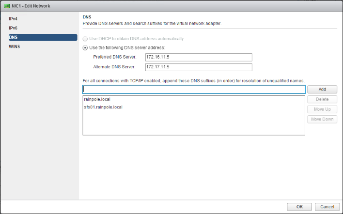

1.  Click **Next**.

2.  In the **Windows Server Domain** page, enter the following settings, and click **Next**.

| Setting                   | Value                           |
|---------------------------|---------------------------------|
| **Windows Server Domain** | rainpole.local                  |
| **Username**              | rainpole.local\\ad\_admin\_acct |
| **Password**              | ad\_admin\_password             |

> 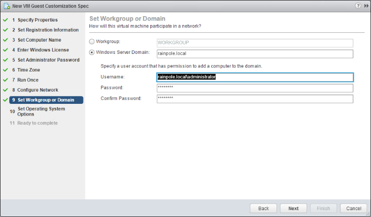

1.  In the Set Operating System options page, select the **Generate New Security ID (SID)** check box, and click **Next**. 

> A Windows Security ID (SID) is used in some Windows operating systems to uniquely identify systems and users. If you do not select this option, the new virtual machine has the same SID as the virtual machine or template from which it was cloned or deployed.
>
> Duplicate SIDs do not cause problems when the computers are part of a domain and only domain user accounts are used. However, if the computers are part of a Workgroup or local user accounts are used, duplicate SIDs can compromise file access controls. For more information, see the documentation for your Microsoft Windows operating system.
>
> 

1.  In the **Ready to Complete** page, review the settings you entered to confirm their validity, and click **Finish**.

> 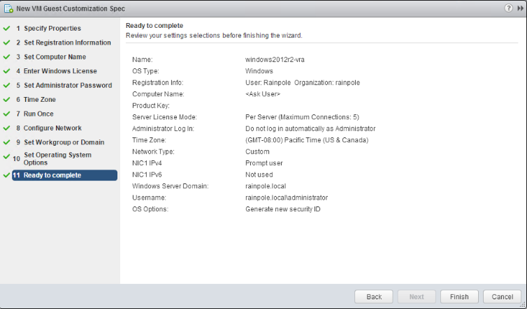

The customization specification you created is listed in the Customization Specification Manager, and can be used to customize virtual machine guest operating systems**.**

### Create a Customization Specification File for IaaS Proxy Agent Servers (Region A)

Create a vSphere Image Customization template to use with your vRealize Automation IaaS Proxy Agent deployment. The vSphere Image Customization template sysprep answer file stores a number of customization settings such as computer name, licensing information, and workgroup or domain settings. You can supply a custom sysprep answer file as an alternative to specifying many of the settings in the **Guest Customization** wizard.

Procedure

1.  Log in to vCenter Server with the vSphere Web Client.

<!-- -->

1.  Open a Web browser and go to **https://mgmt01vc01.sfo01.rainpole.local/vsphere-client**.

2.  Log in using the following credentials.

| Setting       | Value                       |
|---------------|-----------------------------|
| **User name** | administrator@vsphere.local |
| **Password**  | *vcenter\_admin\_password * |

1.  From the vSphere Web Client Home page, select **Customization Specification Manager**.

2.  Select **mgmt01vc01.sfo01.rainpole.local** from the vCenter Server drop down menu.

3.  Click the **New** icon. The **Guest Customization Spec** wizard displays.

> 

1.  In the **Specify Properties** page, enter the following settings, and click **Next**.

| Options                            | Values                               |
|------------------------------------|--------------------------------------|
| **Target VM Operating System**     | Windows                              |
| **Use custom SysPrep answer file** | Deselect check box (leave unchecked) |
| **Customization Spec Name**        | windows2012r2-vra-ias                |
| **Description**                    | Leave blank                          |

> 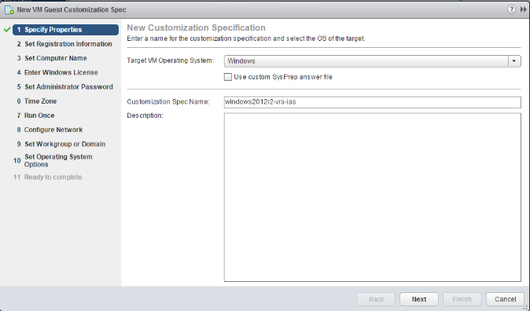

1.  In the **Set Registration Information** page, enter the following settings, and click **Next**.

| Setting          | Value       |
|------------------|-------------|
| **Name**         | Rainpole    |
| **Organization** | Rainpole IT |

> 

1.  In the **Set Computer Name** page, select the **Enter a name in the Clone/Deploy wizard** radio button, and click **Next**.

> 

1.  In the **Enter Windows License** page, enter the following settings, and click **Next**.

| Options                                | Values                                                               |
|----------------------------------------|----------------------------------------------------------------------|
| **Product Key**                        | Type the volume license key.                                         

                                          1.  If you are using Microsoft License Server,                        
                                              or have multiple single license keys, leave this text box blank.  |
| **Include Server License Information** | Select the check box.                                                |
| **Server License Mode**                | Select the Per server check box.                                     |
| **Max connections**                    | 5                                                                    |

> 

1.  In the **Set Administrator Password** page, enter the following settings, and click **Next**.

| Setting                                    | Value                                                                                            |
|--------------------------------------------|--------------------------------------------------------------------------------------------------|
| **Password**                               | Type a password for the administrator account and confirm the password by typing it again.       |
| **Automatically logon as Administrator**   | Select the check box. Enabling this logs users into the guest operating system as Administrator. |
| **Number of times to logon automatically** | 1                                                                                                |

> 

1.  In the **Time Zone** page, select **(GMT-08:00) Pacific Time (US & Canada)** from the **Time Zone** drop down menu, and click **Next**.

> 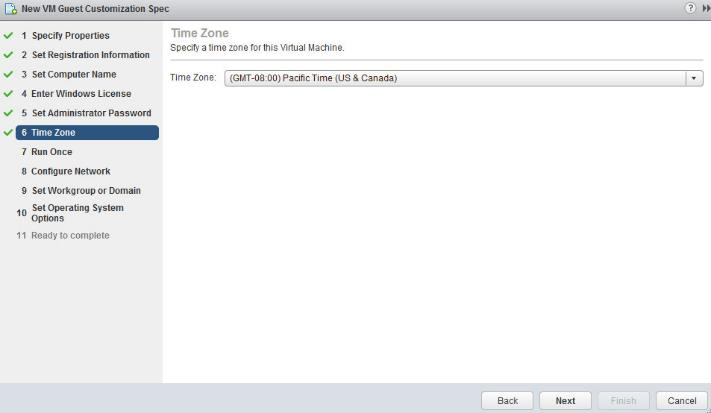

1.  On the **Run Once** page, do not specify any commands to run the first time a user logs into the guest operating system. Click **Next**

> 

1.  On the **Configure Network** page, select the **Manually select custom settings** radio button, select **NIC1 **from the list of network interfaces in the virtual machine, and click **Edit**. The **Network Properties **dialog box displays.

> 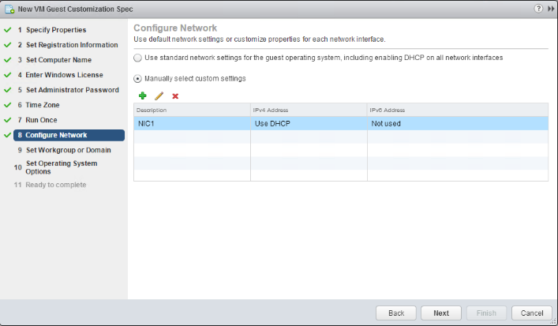

1.  In the **Network Properties** dialog box, select **IPv4**.

<!-- -->

1.  Select the Prompt the user for an address when the specification is used check box.

2.  Type **255.255.255.0** in the Subnet Mask text box.

3.  Type **192.168.12.1** in the Default Gateway text box.

> 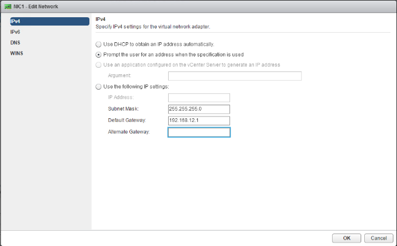

1.  Select **DNS**.

<!-- -->

1.  Select the Use the following DNS server address radio button.

2.  Type **172.16.11.5** in the **Preferred DNS Server** text box.

3.  Type **172.17.11.5** in the **Alternate DNS Server** text box.

4.  Type **rainpole.local** in the **For all connections with TCP/IP enabled**... text box.

5.  Click the **Add** button.

6.  Click **OK** to confirm the network settings and close the **Network Properties** dialog box. 

> 

1.  Click **Next**.

2.  In the **Windows Server Domain** page, enter the following settings, and click **Next**.

| Setting                   | Value                    |
|---------------------------|--------------------------|
| **Windows Server Domain** | sfo01.rainpole.local     |
| **Username**              | SFO01\\*ad\_admin\_acct* |
| **Password**              | ad\_admin\_password      |

> 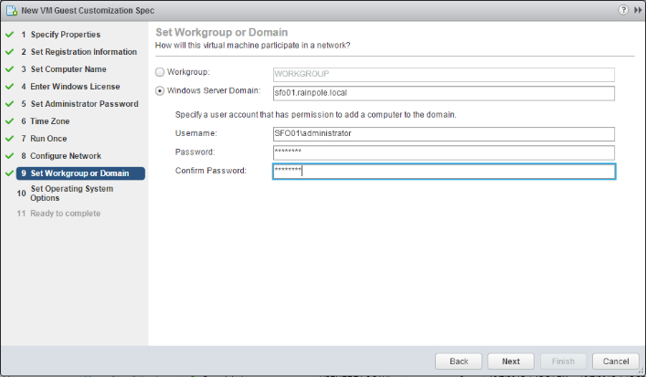

1.  In the **Set Operating System options** page, select the **Generate New Security ID (SID)** check box, and click **Next**.

> 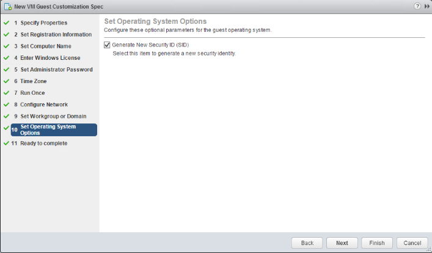

1.  In the **Ready to Complete** page, review the settings you entered to confirm their validity, and click **Finish**.

> 

The customization specification you created is listed in the **Customization Specification Manager,** and can be used to customize virtual machine guest operating systems.

Create Windows Virtual Machines for vRealize Automation (Region A)
------------------------------------------------------------------

vRealize Automation requires several Windows virtual machines to act as IaaS components in a distributed configuration. These redundant components provide high availability for the vRealize Automation infrastructure features.

To facilitate the cloning process, this design uses the window2012r2-vra image customization specification template and a windows2012r2 virtual machine template. A fully redundant vRealize Automation deployment requires 6 Windows virtual machines. Details of the virtual machines are listed at the end of this section. 

Prerequisites 

-   On the mgmt01vc01.sfo01.rainpole.local vCenter Server system, create a Windows 2012 R2 windows template (windows2012r2-template) following the steps in the "Creating a Window Server 2012 R2 Virtual Machine Template" section. 

-   On the mgmt01vc01.sfo01.rainpole.local vCenter Server system, create a vSphere Image Customization Specification template (windows2012r2-vra) following the steps in the "Creating a vSphere Image Customization template" section.  

Procedure

1.  In a Web browser, connect to **https://mgmt01vc01.sfo01.rainpole.local/vsphere-client** and log in as **administrator@vsphere.local** with the ***vCenter\_admin\_password***. 

2.  Click vCenter Servers, and click **mgmt01vc01.sfo01.rainpole.local**.

3.  Click **VM Templates** in Folders.

4.  In the **VM Templates in Folders** pane, select **win2012r2-template**.

5.  In the **Basic Tasks** pane, click **Deploy to a new virtual machine**.

> 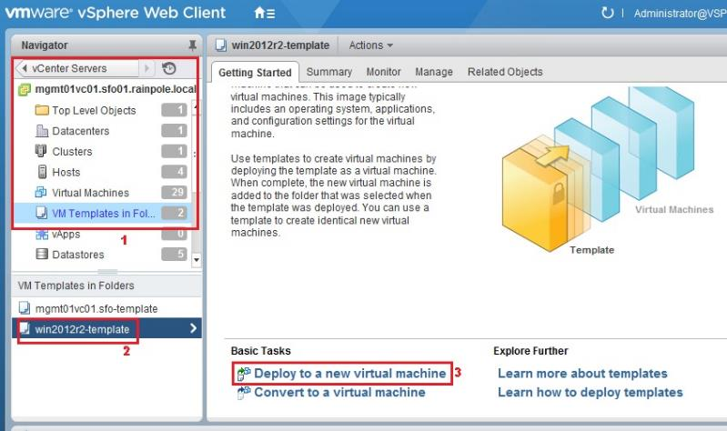

1.  In the **Deploy From Template** wizard, follow these steps:

<!-- -->

1.  In the **Enter a name for the virtual machine** text box, enter **vra01iws01a.rainpole.local**.

2.  In the **Select a location for the virtual machine** pane, select the **SFO01** datacenter under **mgmt01vc01.sfo01.rainpole.local** and click **Next**. 

> 

1.  In the **Select a compute resource** pane, select **SFO01-Mgmt01** and click **Next**.

> 

1.  On the **Select storage** page, select the datastore.

<!-- -->

1.  By default, the virtual appliance disk is thin provisioned.  No need to adjust this. 

2.  Select **Virtual SAN Default Storage Policy** from the **VM Storage Policy** drop-down menu.

3.  Select the **SFO01A-VSAN01-MGMT01** Virtual SAN datastore from the datastore table.

4.  Click **Next**.

> 

1.  In the **Select Clone** options pane, check **Customize the operating system**, leave the default for the other check boxes, and click **Next**.

> 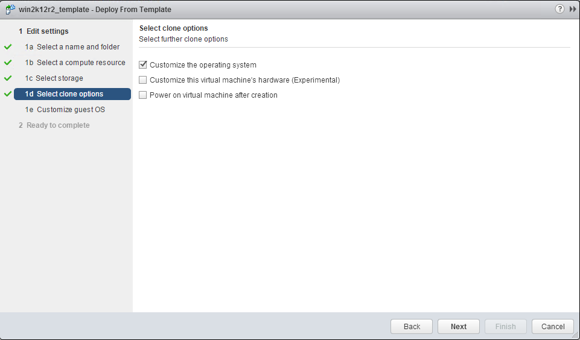

1.  In the **Customize guest OS** pane, select **windows2012r2-vra** from the table and click **Next**. 

> 

1.  In the **User Settings** pane, enter the follow values, leave the default for other fields, and click **Next**. 

| Options       | Values        |
|---------------|---------------|
| NetBIOS name: | vra01iws01a   |
| IPv4 address: | 192.168.11.54 |

> 

1.  With **Ready to Complete** selected on the left, review all settings on the right and click **Finish**. 

> 

1.  When the virtual machine deployment completes, customize the virtual machine, as follows:

<!-- -->

1.  In the Navigator, click Virtual Machines.

2.  Right click the **vra01iws01a.rainpole.local** virtual machine and select **Edit Settings**.

3.  Select **Virtual Hardware** and make the following changes:

    1.  Select **Memory** and change it to **4096 MB**.

    2.  Select **Network adapter 1** and select **vxw-dvs-xxxx-vRA01-VXLAN**.

> 

1.  Right click the **vra01iws01a.rainpole.local** virtual machine again and select **Power &gt; Power on**. From the Virtual Machine Console, vra01iws01a.rainpole.local reboots on its own and processes the configuration settings. 

<!-- -->

1.  When the Windows customization completes (a clean desktop appears), log in to Windows and perform final verification and customization.

<!-- -->

1.  Verify that the VM's IP address, computer name, and domain are correctly configured

2.  Add vRealize Automation service account <svc-vra@rainpole.local> in to Local Administrators Group.

3.  Disable the Windows Firewall for both Domain Networks and Private Networks.

<!-- -->

1.  Deploy and configure additional virtual machines with the following settings and roles.

| Name for Virtual Machines  | NetBIOS name | IP            | Memory Size |
|----------------------------|--------------|---------------|-------------|
| vra01iws01a.rainpole.local | vra01iws01a  | 192.168.11.54 | 4GB         |
| vra01iws01b.rainpole.local | vra01iws01b  | 192.168.11.55 | 4GB         |
| vra01ims01a.rainpole.local | vra01ims01a  | 192.168.11.57 | 4GB         |
| vra01ims01b.rainpole.local | vra01ims01b  | 192.168.11.58 | 4GB         |
| vra01dem01.rainpole.local  | vra01dem01   | 192.168.11.61 | 6GB         |
| vra01dem02.rainpole.local  | vra01dem02   | 192.168.11.62 | 6GB         |

Configure Load Balancing for vRealize Automation and vRealize Orchestrator in Region A
--------------------------------------------------------------------------------------

You can configure load balancing for all services and components related to vRealize Automation and vRealize Orchestrator using an NSX Edge load balancer.You configure the load balancer before you deploy the vRealize Automation appliance, providing VIP addresses that you later use during deployment.

This design configures load balancing for the following appliances:

-   vRealize Automation Identity Appliance

-   vRealize Automation virtual appliances

-   vRealize Automation IaaS web servers

-   vRealize Automation IaaS managers

-   VRealize Orchestrator virtual appliances

Prerequisites

-   Verify that gateways for the virtual vRealize Automation network are configured. See "Deploy and Configure Gateway for the Management Networks (Region A)" in Region A Virtual Infrastructure Implementation.  

-   Install and configure all required vRealize Automation services.  Please refer to "Cloud Management Layer Elements" section in vRealize Automation Design document for vRealize Automation services details.

-   Plan and assign the required network components including IP addresses and corresponding port groups, as shown in the following table.

Table . Network Components Settings

| Edge Interface     | Port group          | Number of IP addresses required | Primary IP address | Secondary IP address                                        |
|--------------------|---------------------|---------------------------------|--------------------|-------------------------------------------------------------|
| Internal           | vRA-VXLAN           | 2                               | 192.168.11.1       | 192.168.11.43 (vRealize Orchestrator VIP)                   |
| vSphere-Management | vDS-Mgmt-Management | 1                               | 172.20.11.111      |                                                             |
| Public             | vDS-Mgmt-Ext-Mgmt   | 5                               | 10.158.130.13      

                                                                                                  | 10.158.130.206 (vRealize Automation Server VIP)             

                                                                                                   10.158.130.207 (vRealize Automation IaaS Web Server VIP)     

                                                                                                   10.158.130.208 (vRealize Automation IaaS Manager VIP)        

                                                                                                   10.158.130.209 (vRealize Automation Identity Appliance VIP)  |

**Procedure Overview**

-   Add IP addresses as VIPs to Edge Interfaces

-   Enable load balancer

-   Create application profiles

-   Create service monitoring

-   Create server pools

-   Create virtual servers

    1.  ### Add Virtual IP Addresses to Edge Interfaces

As the first step of configuring load balancing, you add virtual IP Addresses to the edge interfaces.

Procedure

1.  Use vSphere Web Client to log in to **mgmt01vc01.sfo01.rainpole.local** vCenter Server as **administrator@vsphere.local**.

2.  Select **Networking & Security**.

3.  In the **Navigator**, select **NSX Edges**.

4.  From the **NSX Manager** drop-down menu, select **172.16.11.65** as the NSX Manager and double-click on **vRA01-Edge** to manage the network settings.

> 

1.  Click the **Manage** tab and the **Settings** subtab and click **Interfaces**.

2.  Select the interface **Public** and click the edit icon.

> 

1.  In the **Edit NSX Edge Interface** dialog, add all 4 VIP addresses that are used for vRealize Automation load balancing in the **Secondary IP Addresses** text box.

2.  Click **OK** to save the configuration.

> 

1.  In the **Edit NSX Edge Interface** dialog, select the interface **Internal **and click the edit icon.

2.  Add the vRealize Orchestrator virtual IP, **192.168.11.43, 192.168.11.41**, in the **Secondary IP Addresses** text box.

3.  Click **OK** to save the configuration.

> 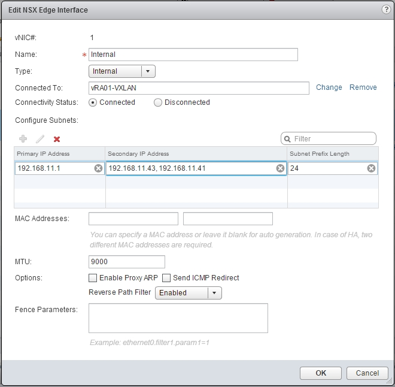

### Enable Load Balancer

Once you add all the necessary virtual IPs for all the vRealize Automation services, you enable the Load Balancer feature in the edge interface. After that, the NSX Edge load balancer can distribute traffic to internal servers for load balancing.

Procedure

1.  Use vSphere Web Client to log in to** mgmt01vc01.sfo01.rainpole.local** vCenter Server as **administrator@vsphere.local**.

2.  Click **Networking & Security.**

3.  In the** Navigator** on the left, click** NSX Edges**.

4.  From the **NSX Manager** drop-down menu, select **172.16.11.65** as the NSX Manager and double-click **vRA01-Edge **to manage the network settings.

> 

1.  Select the **Manage** tab and click the **Load Balancer** subtab.

2.  Select **Global Configuration** and click **Edit**.

3.  In the **Edit Load balancer global configuration** dialog box, check the **Enable Load Balancer** and **Enable Acceleration** check boxes and leave the defaults for everything else. .

4.  Click **OK** to save the configuration.

> 

### Create Application Profiles

Create an application profile to define the behavior of a particular type of network traffic. After configuring a profile, you associate the profile with a virtual server. The virtual server then processes traffic according to the values specified in the profile. Using profiles enhances your control over managing network traffic, and makes traffic-management tasks easier and more efficient.

Procedure

1.  Use vSphere Web Client to log in to** mgmt01vc01.sfo01.rainpole.local** vCenter Server as **administrator@vsphere.local**.

2.  Click **Networking & Security**.

3.  Click** NSX Edges** in the **Navigator** on the left.

4.  From the **NSX Manager** drop-down menu, select **172.16.11.65** as the NSX Manager and double-click **vRA01-Edge **to manage the network settings.

> 

1.  Select the **Manage** tab and click the **Load Balancer** subtab.

2.  Select **Application Profiles** and click the **Add** icon.

> 

1.  In the **New Profile** dialog, enter the following values (leave the defaults for everything else).

| Option                     | Value               |
|----------------------------|---------------------|
| **Name**                   | vRealize Automation |
| **Type**                   | HTTPS               |
| **Enable SSL Passthrough** | Checked             |
| **Persistence**            | Source IP           |
| **Expires in (Seconds)**   | 120                 |

> 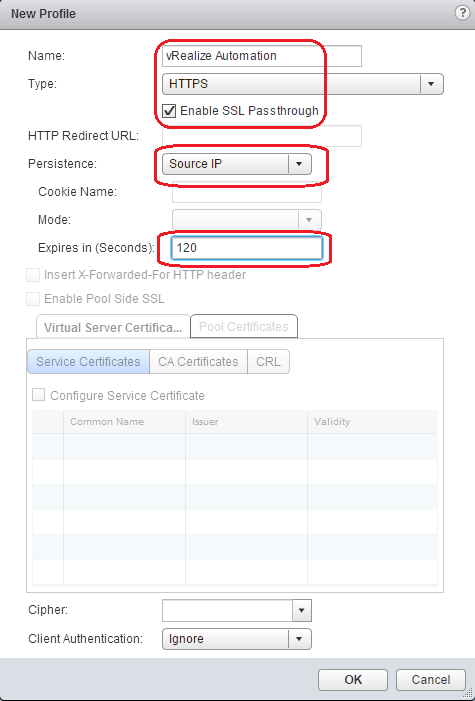

1.  Click **OK** to save the configuration.

2.  Repeat the steps to create the following additional profiles. 

| Profile Name                     | Type  | Enable SSL | Persistence | Expires in (Seconds) |
|----------------------------------|-------|------------|-------------|----------------------|
| vRealize Automation vPostgres    | TCP   | n/a        | None        | n/a                  |
| vRealize Automation              | HTTPS | Enabled    | Source IP   | 120                  |
| vRealize Automation IaaS Web     | HTTPS | Enabled    | Source IP   | 120                  |
| vRealize Automation IaaS Manager | HTTPS | Enabled    | Source IP   | 120                  |
| vRealize Automation Orchestrator | HTTPS | Enabled    | Source IP   | 120                  |
| vRealize Automation Identity     | HTTPS | Enabled    | Source IP   | 120                  |

### Create Service Monitoring

The service monitor defines health check parameters for the load balancer. You have to create a service monitor for each component.

Procedure

1.  Use vSphere Web Client to log in to** mgmt01vc01.sfo01.rainpole.local** vCenter Server as **administrator@vsphere.local**.

2.  Click **Networking & Security.**

3.  In the** Navigator** on the left, click **NSX Edges**.

4.  From the **NSX Manager** drop-down menu, select **172.16.11.65** as the NSX Manager and double-click **vRA01-Edge **to manage the network settings.

> 

1.  Select the **Manage** tab and the **Load Balancer** subtab.

2.  Select **Service Monitoring** on the left and click the **Add** icon on the right.

> 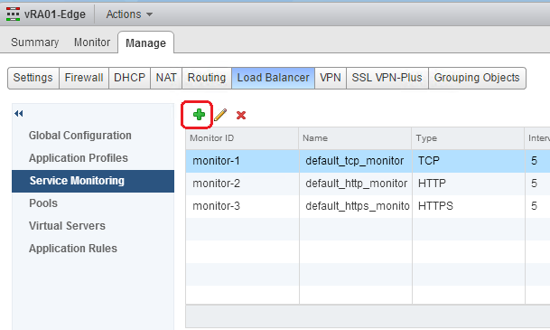

1.  In the **Edit Service Monitor** dialog, provide the following values (leave the default for other fields).

| Option          | Value                    |
|-----------------|--------------------------|
| **Name**        | vra-svr-443-monitor      |
| **Interval**    | 3 (seconds)              |
| **Timeout**     | 9 (seconds)              |
| **Max Retries** | 3                        |
| **Type**        | HTTPS                    |
| **Method**      | Get                      |
| **URL**         | /vcac/service/api/status |
| **Receive**     | REGISTERED               |

> 

1.  Click **OK** to save the configuration.

<!-- -->

1.  Repeat the steps to create service monitors for the other components using the values in following table.

| Service Monitor Name       | Interval | Timeout | Max Retries | Type  | Method | URL                       | Receive                                  |
|----------------------------|----------|---------|-------------|-------|--------|---------------------------|------------------------------------------|
| vra-vpostgres-5432-monitor | 3        | 9       | 3           | TCP   |        |                           |                                          |
| vra-svr-443-monitor        | 3        | 9       | 3           | HTTPS | GET    | /vcac/services/api/status | REGISTERED                               |
| vra-iaas-web-443-monitor   | 3        | 9       | 3           | HTTPS | GET    |                           |                                          |
| vra-iaas-mgr-443-monitor   | 3        | 9       | 3           | HTTPS | GET    | /VMPS2                    | BasicHttpBinding\_VMPSProxyAgent\_Policy |
| vra-vro-8281-monitor       | 3        | 9       | 3           | HTTPS | GET    | /vco/api/status           | REGISTERED                               |
| vra-identity-7444-monitor  | 3        | 9       | 3           | HTTPS | GET    |  /websso/HealthStatus     |  GREEN                                   |

### Create Server Pools

A server pool consists of backend server members. After you create a server pool, you can associate a service monitor with the pool to manage and share the backend servers flexibly and efficiently.

Procedure

1.  Use vSphere Web Client to log in to the** mgmt01vc01.sfo01.rainpole.local** vCenter Server as **administrator@vsphere.local**.

2.  Click **Networking & Security. **

3.  In the** Navigator** on the left, click** NSX Edges.**

4.  From the **NSX Manager** drop-down menu, select **172.16.11.65** as the NSX Manager and double-click **vRA01-Edge**.

> 

1.  Select the **Manage** tab and the **Load Balancer** subtab.

2.  Click **Pools** on the left, and click the **Add** icon on the right.

> 

1.  In the **New Pool** dialog box, specify the following values and leave the defaults for all other fields.

| Option        | Value                 |
|---------------|-----------------------|
| **Name**      | vra-svr-443           |
| **Algorithm** | LEASTCONN             |
| **Monitors**  | default\_tcp\_monitor |

> 

1.  Still in the **New Pool** dialog, click the **Add** icon to add the first pool member.

2.  In the **New Member** dialog, specify the following values, and click **OK**.

| Option                      | Value         |
|-----------------------------|---------------|
| **Enable Member**           | Checked       |
| **Name**                    | vra01svr0a    |
| **IP Address/VC Container** | 192.168.11.51 |
| **Port**                    | 443           |
| **Monitor Port**            | 443           |

> 

1.  Still in the **New Pool** dialog, click the **Add** icon again to add the second pool member and specify the following values.

| Option                      | Description   |
|-----------------------------|---------------|
| **Enable Member**           | Unchecked     |
| **Name**                    | vra01svr01b   |
| **IP Address/VC Container** | 192.168.11.52 |
| **Port**                    | 443           |
| **Monitor Port**            | 443           |

> 

1.  Click **OK** to save the second pool member.

> 

1.  Click **OK** to save the vRealize Automation server pool.

2.  Repeat the steps to create additional server pools, as specified in the table below.

> The setup is designed as follows.

-   The configuration uses default\_tcp\_monitor as the health monitor for all the server pools, and switches to default\_tcp\_monitor during installation or power cycle of vRealize Automation. 
    This is because before vRealize Automation is fully installed and started, the health monitor marks pool members as offline. These health monitors can only correctly indicated the status of pool members after the vRealize Automaton is fully installed and initialized.

-   The configuration disables the second pool member's vRealize Automation postgres database service (vra-vpostgres-5432) because the vRealize Automation postgres database cluster runs in an Active-Replica mode. In Active-Replica mode, the second database node cannot accept any SQL transactions. In case of a database failure, manual failover is always required.

-   The configuration disables the second pool member of 3 vRealize Automation VIPs (vra-svr-443, vra-iaas-web-443 and vra-iaas-mgr-443). This is because during the installation or power cycle of vRealize Automation, the service inside the second node might not be installed or initialized yet. In this period of time, if the load balancer passes a request to the second node, the request fails. If the second pool member is not disabled, you might see random failures during vRealize Automation installation, and you might see service initialization or registration failure during a vRealize Automation power cycle. 

Table . Pool Member Enablement Settings

| Pool Name          | Algorithm  | Monitors              | Members       | Port        | Monitor Port  |
|--------------------|------------|-----------------------|---------------|-------------|---------------|
|                    |            |                       | Enable Member | Member Name | IP address    |
| vra-vpostgres-5432 | Roundrobin | default\_tcp\_monitor | Yes           | vra01svr01a | 192.168.11.51 |
|                    |            |                       | **No**        | vra01svr01b | 192.168.11.52 |
| vra-svr-443        | Leastconn  | default\_tcp\_monitor | Yes           | vra01svr01a | 192.168.11.51 |
|                    |            |                       | **No**        | vra01svr01b | 192.168.11.52 |
| vra-iaas-web-443   | Leastconn  | default\_tcp\_monitor | Yes           | vra01iws01a | 192.168.11.54 |
|                    |            |                       | **No**        | vra01iws01b | 192.168.11.55 |
| vra-iaas-mgr-443   | Leastconn  | default\_tcp\_monitor | Yes           | vra01ims01a | 192.168.11.57 |
|                    |            |                       | **No**        | vra01ims01b | 192.168.11.58 |
| vra-vro-8281       | Leastconn  | default\_tcp\_monitor

                                                          | Yes           | vra01vro01a | 192.168.11.44 |
|                    |            |                       | Yes           | vra01vro01b | 192.168.11.45 |
| vra-identity-7444  | Leastconn  | default\_tcp\_monitor | Yes           | vra01ids01a | 192.168.11.46 |

 

### Create Virtual Servers

After load balancing is set up, the NSX Load Balancer distributes network traffic across multiple servers. When a virtual server receives a request, it chooses the appropriate pool to send traffic to. Each pool consists of one or more members.

Procedure

1.  Use vSphere Web Client to log in to** mgmt01vc01.sfo01.rainpole.local** vCenter Server as **administrator@vsphere.local**.

2.  Click on **Networking & Security. **

3.  In the** Navigator** on the left, click **NSX Edges**.

4.  From the **NSX Manager** drop-down menu, select **172.16.11.65** as the NSX Manager and double-click on **vRA01-Edge**.

> 

1.  Select the **Manage** tab and click the **Load Balancer** subtab.

2.  Select **Virtual Servers** on the left and click the **Add** icon on the left.

> 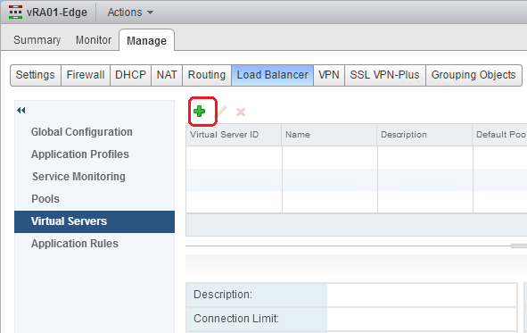

1.  In the **New Virtual Server** dialog, specify the following values, leave the default for all other fields and check boxes, and click **OK**.

| Option                    | Value                                                          |
|---------------------------|----------------------------------------------------------------|
| **Enable Virtual server** | Checked                                                        |
| **Application Profile**   | vRealize Automation                                            |
| **Name**                  | vra-svr-443                                                    |
| **IP Address**            | 10.158.130.206 (the vRealize Automation virtual appliance VIP) |
| **Protocol**              | HTTPS                                                          |
| **Port**                  | 443                                                            |
| **Default Pool**          | vra-svr-443                                                    |

> 

1.  Repeat the steps to create additional virtual servers, using the values in the following table.

| Virtual Server Name | Application Profile              | IP Address     | Protocol | Port | Default Pool       |
|---------------------|----------------------------------|----------------|----------|------|--------------------|
| vra-vpostgres-5432  | vRealize Automation vPostgres    | 192.168.11.1   | TCP      | 5432 | vra-vpostgres-5432 |
| vra-svr-443         | vRealize Automation              | 10.158.130.206 | HTTPS    | 443  | vra-svr-443        |
| vra-iaas-web-443    | vRealize Automation IaaS Web     | 10.158.130.207 | HTTPS    | 443  | vra-iaas-web-443   |
| vra-iaas-mgr-443    | vRealize Automation IaaS Manager | 10.158.130.208 | HTTPS    | 443  | vra-iaas-mgr-443   |
| vra-vro-8281        | vRealize Automation Orchestrator | 192.168.11.43  | HTTPS    | 8281 | vra-vro-8281       |
| vra-identity-7444   | vRealize Automation Identity     | 10.158.130.209 | HTTPS    | 7444 | vra-identity-7444  |

Install vRealize Automation (Region A)
--------------------------------------

Prerequisites

-   Foundation deployment ready in Region SFO

-   Management virtual Pod for vRealize Automation is created by following Implementation Guide for Management Network Virtual Pods

-   Dynamic Routing is configured by following Deploy and Configure Gateways for the Management Application Networks (Region A)

-   Load balancing for vRealize Automation is configured following Configure Load Balancing for vRealize Automation and vRealize Orchestrator in Region A

Procedure Overview

-   Deploy and Configure the vRealize Automation Identity Appliance (Region A)

-   Deploy the vRealize Automation Virtual Appliance (Region A)

-   Initial Configuration of vRA Virtual Appliance

-   Configure PostgreSQL Replication (Region A)

-   Configure the Single Sign-On Connection and Apply the vRealize Automation License (Region A)

-   Configure vRealize Automation Appliance Clustering (Region A)

-   Resolve Windows Server Dependencies

-   Install IaaS Web Servers (Region A)

-   Install IaaS Manager Services (Region A)

-   Install Distributed Execution Managers Workers (Region A)

-   Enable vRealize Automation Load Balancer Health Monitoring (Region A)

    1.  ### Deploy and Configure the vRealize Automation Identity Appliance (Region A)

The VMware vRealize Automation Identity Appliance is a preconfigured virtual appliance that provides Single Sign-On (SSO) capabilities for the vRealize Automation environment. You download the Identity Appliance and deploy it into your vCenter Server or ESX/ESXi inventory.

To deploy the vRealize Identity Appliance, a system administrator logs in to the vSphere Web client and selects deployment settings.

Procedure

1.  In a Web browser, open the vSphere Web Client. 

<!-- -->

1.  Log in to [**https://mgmt01vc01.sfo01.rainpole.local/vsphere-client**](https://mgmt01vc01.sfo01.rainpole.local/vsphere-client).

2.  Use the **administrator@vsphere.local** user name and the **vcenter\_admin\_password** password.

<!-- -->

1.  Navigate to the **mgmt01vc01.sfo01.rainpole.local** vCenter Server object.

2.  Right-click the **mgmt01vc01.sfo01.rainpole.local** object and select **Deploy OVF Template.**

3.  On the **Select source** page, select **Local file**, browse to the location of the VMware Identity Appliance Virtual Appliance file on your file system, and click **Next**.

> 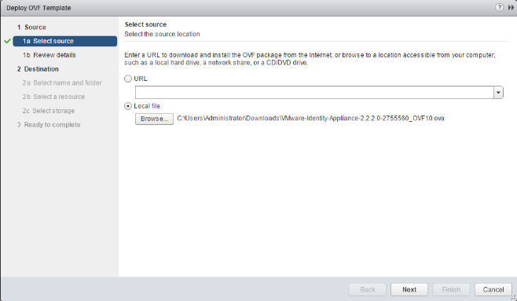 

1.  Click **Next**.

2.  Review the **OVF Template Details** page, and click **Next**.

3.  Read and accept the license agreement, and click **Next**.

4.  Type the virtual appliance hostname **vra01ids01a.rainpole.local** in the **Name** text box, and select the **SFO01 **datacenter and the **vRA01 **virtual machine folder.  These are the datacenter and location to which you want to deploy the virtual appliance. Click **Next**.

5.  On the **Select a Resource** page, select cluster **SFO01-Mgmt01**. Click **Next**

6.  On the **Select storage** page, select the datastore.

<!-- -->

1.  By default, the virtual appliance disk is thin provisioned.  No need to adjust this. 

2.  From the **VM Storage Policy** drop-down menu, select **Virtual SAN Default Storage Policy**.

3.  From the datastore table, select the **SFO01A-VSAN01-MGMT01** Virtual SAN datastore.

4.  Click **Next**.

> 

1.  On the **Setup networks** page specify the network to use with the vRealize Automation Identity Appliance. Select the destination network** vRA01-VXLAN** from the **Destination** drop-down menu, then click **Next**.

> 

1.  Configure the following values on the **Customize template** page.

<!-- -->

1.  Type the **root** password to use when you log in to the virtual appliance console in the **Enter **password and **Confirm** password text boxes.

2.  Uncheck the **Enable SSH** service in the appliance check box.

3.  Type **vra01ids01a.rainpole.local** in the **Hostname** text box.

4.  Type **192.168.11.1** in the **Default gateway** text box.

5.  Type **172.16.11.5, 172.17.11.5** in the **DNS** text box.

6.  Type **192.168.11.46** in the **Network 1 IP Address** text box.

7.  Type **255.255.255.0** in the **Network 1 Netmask** text box.

8.  Click **Next**.

> 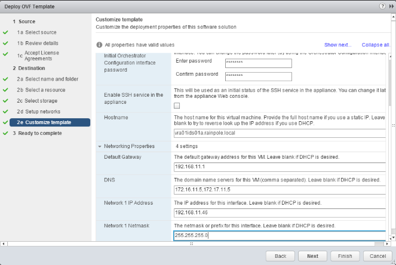

1.  Power on the Identity Appliance virtual machine. 

<!-- -->

1.  Select **Power on after deployment** and click **Finish**.

2.  Click **Close **after the file finishes deploying to your vCenter Server.

3.  Wait until the Identity Appliance virtual machine is completely powered on. This may take several minutes.

<!-- -->

1.  When the Identity Appliance virtual machine restarts, verify that the fully qualified domain name can be resolved against the IP address of the Identity Appliance by opening a command prompt and pinging the hostname, **vra01ids01a.rainpole.local**.

Enable Time Synchronization on the Identity Appliance

Synchronize the clocks on the vRealize Automation Identity Appliance server, the vRealize Automation server, and Windows servers to ensure a successful installation.

1.  If you see certificate warnings during this procedure, continue past them. 

<!-- -->

1.  Using a Web browser, open the **vRealize Automation management console** for the Rainpole tenant using its fully qualified domain name, **https://vra01ids01a.rainpole.local:5480**.

2.   Log into the **vRealize Automation management console** as the **root** user.

3.  Select the **Admin** tab, then select **Time Settings**.

4.  Configure the **Time Settings** page using the following values.

<!-- -->

1.  Select **Use Time Server** from the **Time Sync Mode** menu to use Network Time Protocol. 

2.  In the **Time Server \#1** text box, type the host name **ntp.sfo01.rainpole.local**.

3.  In the **Time Server \#2** text box, type the host name **ntp.lax01.rainpole.local**.

<!-- -->

1.  Click **Save Settings**.

> 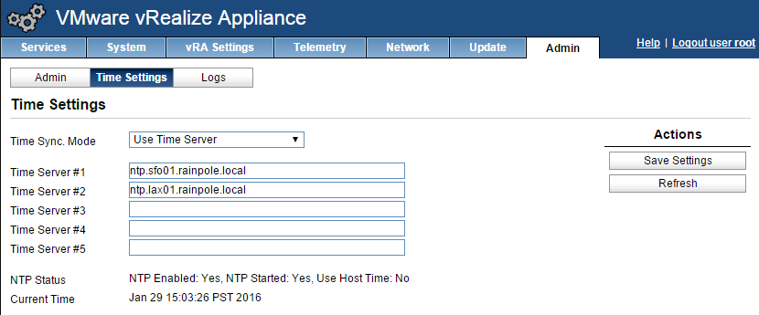

1.  Click **Refresh**.

2.  Verify that the value in **Current Time** is correct. 

Configure Correct Time Zone on the Identity Appliance

1.  Select the **System **tab.

2.  Click **Time Zone** page.

3.  Select **US/Pacific System Time Zone** from the menu choices.

4.  Click **Save Settings**.

Configure the Identity Appliance

To prepare the vRealize Appliance for use, a system administrator configures the host settings, generates an SSL certificate, and provides SSO connection information.

1.  Navigate to the vRealize Appliance management console using its fully qualified domain name, [**https://vra01ids01a.rainpole.local:5480**](https://vra01ids01a.rainpole.local:5480).

<!-- -->

1.  Log in with user name **root** and the password you specified when you deployed vRealize Appliance.

2.  Click **SSO** and specify SSO configuration settings in the **SSO configuration** page.

<!-- -->

1.  Type **vsphere.local** in the **System Domain** text field. This is the local default domain for the Identity Appliance. The default tenant is created with this name and the system administrator is **administrator@vsphere.local**. Record the user name and password in a secure place for later use.

2.  Type the ***vra\_administrator\_password*** password for the SSO administrator in the **Admin Password** and **Repeat Password** text boxes.

3.  Click **Apply** to save your changes.

> 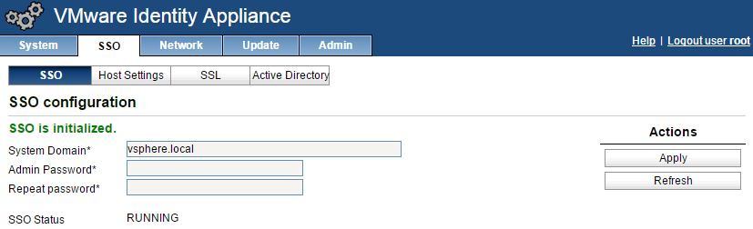

1.  Configure the **SSO Host Settings** that the vRealize Appliance uses to interact with the Identity Appliance. These settings must match the settings you entered when configuring the Identity Appliance.

<!-- -->

1.  Select the **SSO** tab, then click **Host Settings**.

2.  Type the fully qualified domain name of the Identity Appliance, **vra01ids01.rainpole.local**, in the **SSO Hostname** text box.

<!-- -->

1.  Do not use an https:// prefix.

<!-- -->

1.  Click **Apply** to save your changes.

> 

1.  Select the **SSL **tab and specify SSL configuration settings in the **Replace the SSL Certificate **page.

<!-- -->

1.  Select **Import PEM encoded Certificate **from the** Choose Action** menu.

<!-- -->

1.  Certificates that you import must be trusted and must also be applicable to all instances of vRealize Appliance and any load balancer by using Subject Alternative Name (SAN) certificates.

<!-- -->

1.  Open the vrealize.key certificate file, and copy the certificate values from BEGIN PRIVATE KEY to END PRIVATE KEY, including the header and footer, and paste them in the **RSA Private Key** text box.

2.  Open the vrealize.pem certificate file, and copy the certificate values from BEGIN CERTIFICATE to END CERTIFICATE, including the header and footer, and paste them in the **Certificate Chain** text box. For multiple certificate values, include a BEGIN CERTIFICATE header and END CERTIFICATE footer for each certificate.

3.  Type the certificate pass phrase you created during certificate generation into the **Pass Phrase** text field. The pass phrase encrypts the certificate key.
    See "Generate Certificates for vRealize Automation and vRealize Orchestrator" to learn about the pass phrase you created.

4.  Click **Apply Settings** to save your configuration changes.

> After several minutes the certificate details appear on the **Replace the SSL Certificate **page, confirming their activation.
>
> 

1.  Join the Identity Appliance to your Native Active Directory domain.

<!-- -->

1.  If you are running Windows 2012 R2 Active Directory please see the following KB article first http://kb.vmware.com/kb/2134063

<!-- -->

1.  Click the **Active Directory** tab.

2.  Type the domain name **rainpole.local** in the **Domain Name** text box.

3.  Enter the credentials for the domain user in the **Domain User** and **Password **text boxes.

| Setting     | Value                          |
|-------------|--------------------------------|
| Domain User | svc-vra                        |
| Password    | *vra\_administrator\_password* |

1.  Click **Join AD Domain**.

> 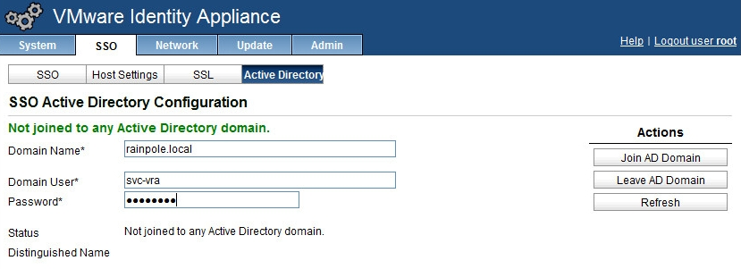

The SSO host is initialized. If your Identity Appliance does not function correctly after configuration, redeploy and reconfigure the appliance. Do not make changes to the existing appliance as the configuration settings you applied are persistent, and cannot be overwritten. 

### Deploy the vRealize Automation Virtual Appliance (Region A)

vRealize Appliance is a pre-configured virtual appliance that deploys the vRealize Automation server. vRealize Automation is delivered as an open virtualization format (OVF) template. The system administrator deploys the virtual appliance to an existing virtualized infrastructure.

The server includes the vRealize Appliance console, which provides a single portal for self-service provisioning and management of cloud services, authoring, administration, and governance.

Appliance Database

During deployment of the virtual appliances, the Appliance Database is created automatically on the first vRealize Appliance. A replica database can be installed on a second vRealize Appliance to create a high-availability environment.

Deploy Two Instances of vRealize Appliance

You deploy two instances of vRealize Appliance. Repeat this procedure twice to deploy the two appliances, using the values for host A for the first appliance, and the values for host B for the second appliance.  

| Setting        | Host A                     | Host B                     |
|----------------|----------------------------|----------------------------|
| **Hostname**   | vra01svr01a.rainpole.local | vra01svr01b.rainpole.local |
| **IP address** | 192.168.11.51              | 192.168.11.52              |
| **Network**    | vra01-vxlan (192.168.11.x) | vra01-vxlan (192.168.11.x) |

Procedure

1.  In a Web browser, open the vSphere Web Client. 

<!-- -->

1.  Log in to [**https://mgmt01vc01.sfo01.rainpole.local/vsphere-client**](https://mgmt01vc01.sfo01.rainpole.local/vsphere-client).

2.  Use the **administrator@vsphere.local** user name and the **vcenter\_admin\_password** password*.* 

<!-- -->

1.  Navigate to the **mgmt01vc01.sfo01.rainpole.local** vCenter Server object. 

2.  Right-click the **mgmt01vc01.sfo01.rainpole.local** object and select **Deploy OVF Template**.

3.  On the **Select source** page, select **Local file**, browse to the location of the vRealize Automation Virtual Machine Template file on your file system, and click **Next**.

> 

1.  On the **Review details** page, examine the virtual appliance details, such as product, version, download and disk size, and click **Next**.

2.  On the **Accept License Agreements** page, accept the end user license agreements and click **Next**.

3.  On the **Select name and folder** page, type in the following information, and click **Next**.

| Setting                           | Host A                     | Host B                     |
|-----------------------------------|----------------------------|----------------------------|
| **Name**                          | vra01svr01a.rainpole.local | vra01svr01b.rainpole.local |
| **Select a folder or datacenter** | vRA01                      | vRA01                      |

> 

1.  On the **Select a Resource** page, select cluster **SFO01-Mgmt01**. Click **Next**

2.  On the **Select storage** page, select the datastore.

<!-- -->

1.  By default, the virtual appliance disk is thin provisioned.  No need to adjust this. 

2.  Select **Virtual SAN Default Storage Policy** from the** VM Storage Policy **drop-down menu.

3.  Select the **SFO01A-VSAN01-MGMT01** Virtual SAN datastore from the datastore table.

4.  Click **Next**.

> 

1.  On the **Setup networks** page specify the network to use with the template. Select the destination network** vra01-VXLAN **from the** Destination **drop-down menu, then click **Next**.

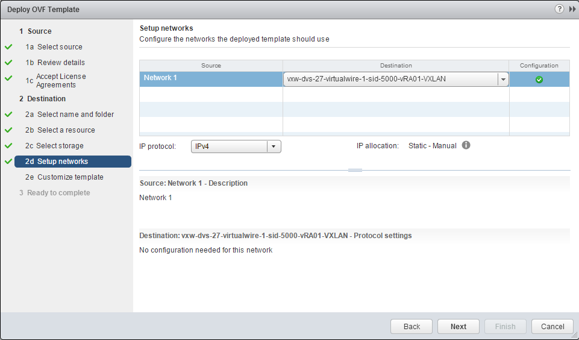

 

1.  Configure the following values on the Customize template page.

<!-- -->

1.  Type the **root** password to use when you log in to the virtual appliance console in the **Enter **password and **Confirm** password text boxes.

2.  Check **Enable SSH service in the appliance**.

3.  Type **vra01svr01a.rainpole.local** in the **Hostname **text box.

4.  Type **192.168.11.1** in the **Default gateway **text box.

5.  Type **172.16.11.5, 172.17.11.5 **in the **DNS **text box.

6.  Type **192.168.11.51** in the **Network 1 IP Address **text box.

7.  Type **255.255.255.0** in the **Network 1 Netmask **text box.

8.  Click **Next**.

>  

1.  Do not select** Power on after deployment**. 

2.  Click **Next**.

3.  When the deployment completes configure the virtual CPU and memory. 

<!-- -->

1.  Select **Virtual Hardware**.

2.  Select 4 from the **CPU** drop down menu.

3.  Select **16384 MB** (16 GB) from the **Memory** drop down menu.

> 

1.  Power on the vRealize Automation virtual machine. Wait until the Identity Appliance virtual machine is completely powered on. This may take several minutes. 

2.  Repeat this procedure in its entirety to add to a second vRealize Automation virtual machine (host B) using the hostname vra01svr01b with the IP address 192.168.11.52. Refer to the table at the beginning of this topic for hostname, IP addresses, and the network name to use for host B.

    1.  ### Initial vRealize Automation Virtual Appliance Configuration (Region A)

Perform an initial configuration on both of the vRealize Automation virtual appliances to prepare them for clustering.  Load balancing configuration must be completed before starting the following procedure.  Please refer the Prerequisite section for load balancing configuration steps

Prerequisites

-   See "Configure Load Balancing for vRealize Automation and vRealize Orchestrator in Region A".

Enable Time Synchronization for the vRealize Automation Virtual Appliance

You configure both instances of vRealize Appliance. Repeat this procedure twice to configure the two appliances, using the values for host A for the first appliance, and the values for host B for the second appliance. The procedure below uses the configuration values for host A. Replace them with the values for host B when you repeat the procedure.

| Setting             | Host A                                   | Host B                                   |
|---------------------|------------------------------------------|------------------------------------------|
| **Virtual Machine** | vra01svr01a.rainpole.local               | vra01svr01b.rainpole.local               |
| **Web Address**     | https:// vra01svr01a.rainpole.local:5480 | https:// vra01svr01b.rainpole.local:5480 |

Procedure

1.  Using a Web browser, open the **vRealize Automation management console** using its fully qualified domain name, [**https://vra01svr01a.rainpole.local:5480**](https://vra01svr01a.rainpole.local:5480).

2.  Log into the **vRealize Automation management console **as the user **root**, with the root user password you created when you deployed the vRealize Automation appliance.

3.  Select the **Admin** tab, then select **Time Settings**.

4.  Configure the **Time Settings** page using the following values.

<!-- -->

1.  Select **Use Time Server** from the **Time Sync Mode** menu to use Network Time Protocol. 

2.  In the **Time Server \#1** text box, type the host name **ntp.sfo01.rainpole.local**.

3.  In the **Time Server \#2** text box, type the host name **ntp.lax01.rainpole.local**.

4.  Click **Save Settings**.

> 

1.  Repeat these steps for Host B.

**Configure Host Settings for Host A**

Perform the following configuration task for the vra01svr01a.rainpole.local virtual machine (host A) only. Do not configure the host settings for the vra01svr01b.rainpole.local virtual machine (host B)

**Procedure**

1.  Using a Web browser, open the **vRealize Automation management console** using its fully qualified domain name, [**https://vra01svr01a.rainpole.local:5480**](https://vra01svr01a.rainpole.local:5480).

2.  Log into the **vRealize Automation management console **as the user **root**, with the root user password you created when you deployed the vRealize Automation appliance.

3.  Select the **vRealize Automation Settings **tab, then select the **Host Settings** tab.

4.  Configure the **Host Settings** page using the values from the table below.

<!-- -->

1.  Select the **Update Host** check box.

2.  Enter the fully qualified domain name of the vRealize Appliance, **vra01svr01.rainpole.local**, in the **Host Name** text box.

3.  Select the **Import** radio button from the **Certificate Action** menu. When using a PEM-encoded certificate for a distributed environment, you import the certificates.
    **Note**: Certificates that you import must be trusted and must also be applicable to all instances of vRealize Appliance and any load balancer through the use of Subject Alternative Name (SAN) certificates. 

4.  Open the vrealize.key certificate file, and copy the certificate values from BEGIN PRIVATE KEY to END PRIVATE KEY, including the header and footer, and paste them in the **RSA Private Key** text box.

5.  Open the vrealize.pem certificate file, and copy the certificate values from BEGIN CERTIFICATE to END CERTIFICATE, including the header and footer, and paste them in the **Certificate Chain** text box. For multiple certificate values, include a BEGIN CERTIFICATE header and END CERTIFICATE footer for each certificate.

6.  Type the pass phrase to encrypt the certificate key in the **Passphrase **text box.

<!-- -->

1.  Click **Save Settings**.

> 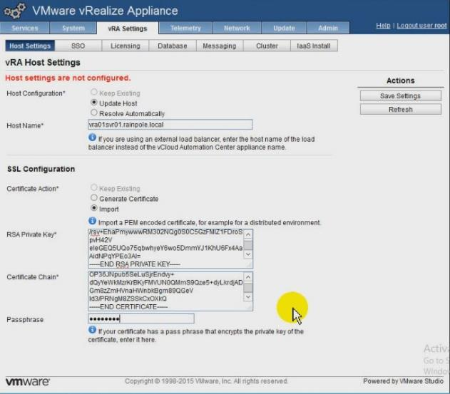

 

1.  Verify Settings were successfully saved. A success message appears informing you that the SSL certificate has been successfully configured.

> 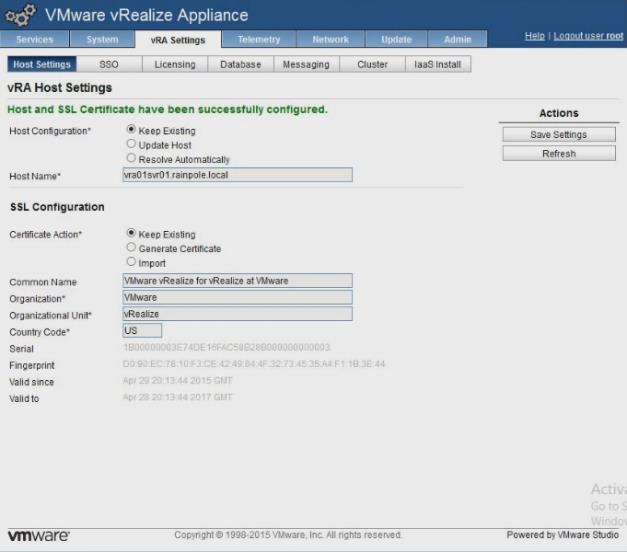

1.  Click the **Admin** tab.

<!-- -->

1.  Ensure that the **SSH service** and **Administrator SSH login** check boxes are selected.

2.  Click **Save** Settings.

<!-- -->

1.  Click the **System** tab.

2.  Click the **Restart** button to restart the vRealize Automation virtual appliance.

3.  Confirm that you can log into vRealize Automation console. Verify that NSX Edge load balancing is configured correctly, and successfully passing the **vra01svr01.rainpole.local** request to the vRealize Automation virtual appliance.

<!-- -->

1.  Using a Web browser, type the vRealize Automation virtual appliance address in the address bar, **https://vra01svr01a.rainpole.local**.

2.  The configuration is successful the vRealize Automation virtual appliance page displays.
    If you instead receive a "service unavailable" error, the NSX configuration for vRealize Automation server appliance is not correct.  Verify your NSX configuration and correct any errors before you continue.

<!-- -->

1.  If you receive Apache Web server errors it is okay since vRealize Automation server hasn't started yet. You need to ensure that you can access vRealize Automation from the VIP address.

> 

  

Configure log rotation by file size

1.  Connect to the vRealize Automation virtual appliance from a computer using a SSH client.

<!-- -->

1.  Log in to the **vra01svr01a.rainpole.local** virtual machine over SSH as the user **root**.

2.  Navigate to /etc/logrotate.d/.

3.  Edit the **vcac.lr** file using the vi text editor.

> vi vcac.lr

1.  Create a new line and add the entry **size 100M** to specify a maximum file size of 100MB for the catalina.out log file. This sets the minimum file size detected before rotation occurs:

/var/log/vmware/vcac/catalina.out {

daily

rotate 5

dateext

compress

minsize 5M

missingok

nocreate

notifempty

sharedscripts

copytruncate

su vcac vcac

size 100M

}

> 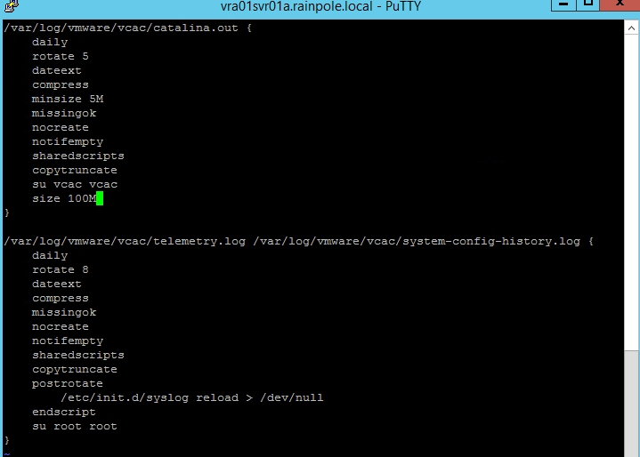

1.  Type **:wq!** to save the file and exit the editor.

> :wq!

1.  Edit the vco.lr by entering command.

> vi vco.lr

1.  Create a new line and add the entry **size 100M** to specify a maximum file size of 100MB for the **catalina.out** log file:

> /var/log/vmware/vco/app-server/catalina.out /var/log/vmware/vco/configuration/catalina.out {

daily

rotate 5

dateext

compress

minsize 5M

missingok

nocreate

notifempty

sharedscripts

copytruncate

su vco vco

size 100M

}

> 

1.  Type **:wq!** to save the file and exit the vi text editor.

> :wq!

1.  Configure a cron job to run **logrotate** based on a time interval. Type the command **crontab -e** to edit the crontab file, and enter the following new lines in the **crontab**:

> 0 \*/1 \* \* \* /usr/sbin/logrotate /etc/logrotate.d/vcac.lr

5 \*/1 \* \* \* /usr/sbin/logrotate /etc/logrotate.d/vco.lr

> The first line sets **logrotate** to run against the vRealize Automation logs at the start of each hour. The second line sets **logrotate** to run against the vRealize Orchestrator logs 5 minutes after the start of each hour.
>
> 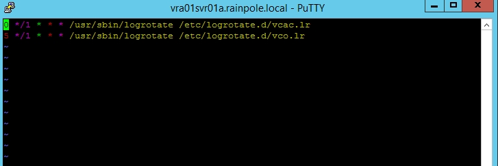

1.  Type **:wq!** to save the file and exit the **crontab** editor.

> :wq!

1.  Run the command crontab -l to confirm that you correctly entered the configuration information.

> crontab -l

1.  Exit the SSH client.

    1.  ### Configure PostgreSQL Replication (Region A)

To ensure high availability (HA) the vRealize Automation virtual appliances must be able to synchronize and replicate the PostgreSQL database.

You configure both instances of vRealize Appliance. Repeat this procedure twice to configure the two appliances, using the values for host A for the first appliance, and the values for host B for the second appliance. The procedure below uses the configuration values for host A. Replace them with the values for host B when you repeat the procedure.

Table . Host Names

| Host   | Virtual Machine Name       |
|--------|----------------------------|
| Host A | vra01svr01a.rainpole.local |
| Host B | vra01svr01b.rainpole.local |

 

Procedure

1.  Using the vSphere Web client, navigate to **https://mgmt01vc01.sfo01.rainpole.local/vsphere-client.**

2.  Add a 20 GB disk and a 25 GB disk to the virtual appliance. 

<!-- -->

1.  From the inventory, right click the **vra01svr01a.rainpole.local** virtual machine, and select **Edit Settings**

2.  On the **Virtual Hardware** tab, select **New Hard Disk** from the **New device** drop-down menu and click **Add**. The hard disk appears in the **Virtual Hardware** devices list.

> 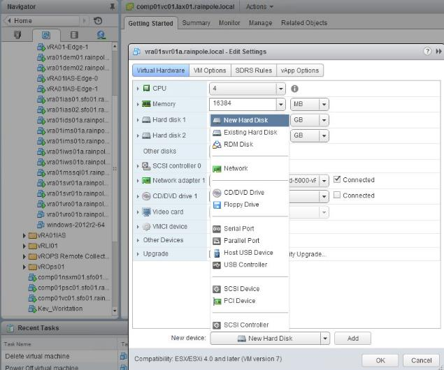 

1.  Type a value of **20** for the hard disk and select **GB** from the drop-down menu to specify the storage capacity of the **New Hard Disk**.

> 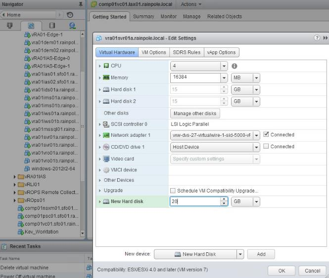

1.  To add another hard disk, select **New Hard Disk** from the **New device** drop-down menu and click **Add**.

2.  Type a value of **25** for the hard disk and select **GB** from the drop-down menu to specify the storage capacity of the **New Hard Disk**.

3.  Click **OK** 

<!-- -->

1.  Verify that SSH is enabled on the virtual appliance.

<!-- -->

1.  Log in to the Virtual Appliance Management Interface at:  <https://vra01svr01a.rainpole.local:5480>

2.  Click the **Admin** tab.

3.  Ensure that the** SSH service** and **Administrator SSH login** check boxes are selected.

4.  Click **Save Settings**.

<!-- -->

1.  Click **Reboot**.

2.  Copy the PostgreSQL clustering script (2108923\_dbCluster.zip to the vra01svr01a.rainpole.local virtual machine's root directory.

<!-- -->

1.  For information on downloading the script, see Software Requirements of Planning and Preparation.

<!-- -->

1.  Connect to the vRealize Automation virtual appliance from a computer using a SSH client.

2.  Log in to the **vra01svr01a.rainpole.local** virtual machine over SSH as the user **root**.

3.  Change directory to /root directory.

4.  Unzip the 2108923\_dbCluster.zip.

> unzip 2108923\_dbCluster.zip

1.  Extract the 2108923\_dbCluster.tar file.

> tar xvf 2108923\_dbCluster.tar

1.  Locate the disk you added earlier in this procedure using the fdisk -1 command.

> fdisk –l
> The disk name should be /dev/sdd. The name differs depending on the original version of vRealize Automation deployed. You will receive a warning message stating that the disk /dev/sdd does not contain a valid partition table.
>
> 

1.  Configure the disk using the script configureDisk.sh.

> ./configureDisk.sh /dev/sdd

1.  Configure the second hard disk you added, which should be /dev/sde using the following command sequence. Run each command and ensure that no error messages are returned after each command completes. When you complete this command sequence, your terminal should look similar the screen illustrated below.

> parted /dev/sde mklabel gpt -- mkpart primary 1 -1
>
> mkfs.ext3 /dev/sde1
>
> mkdir /storage/xlog\_archive
>
> mount -t ext3 /dev/sde1 /storage/xlog\_archive
>
> echo /dev/sde1 /storage/xlog\_archive ext3 rw,nosuid,nodev,exec,auto,nouser,async 0 1 &gt;&gt; /etc/fstab
>
> ln -s /storage/xlog\_archive /storage/db/pgdata/pg\_xlog
>
> chown postgres:users /storage/xlog\_archive
>
> chown postgres:users -h /storage/db/pgdata/pg\_xlog
>
> 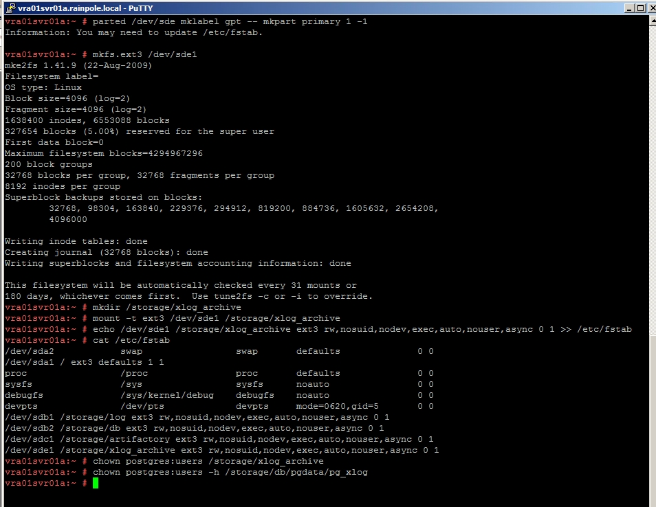

1.  Run the **pgClusterSetup.sh** script using the following arguments and parameters.

> ./pgClusterSetup.sh -d vra01vpostgres01.rainpole.local -D 192.168.11.1 -w VMware1! -r VMware1! -p VMware1!
>
> 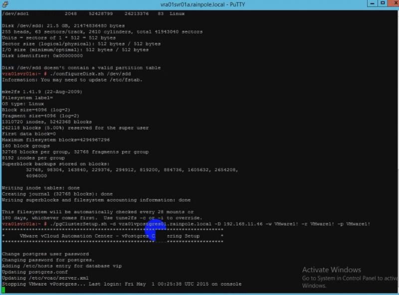

1.  Repeat the above procedure for host b, the **vra01svr01b.rainpole.local** virtual appliance.

Configure Appliance Database Replication on the Secondary Appliance

Configure database replication on the designated secondary appliance, **vra01svr01b.rainpole.local**, so that the appliance database on the primary appliance is replicated on the secondary appliance in the event of a failover.

Procedure

1.  Log in to the vra01svr01b.rainpole.local virtual machine over SSH as the user **root**.

2.  Log in to the database using su -postgres command.

> su - postgres 

1.  Type the command shown below to configure replication.

> /opt/vmware/vpostgres/current/share/run\_as\_replica -h vra01svr01a.rainpole.local -b -W -U replicate

1.  When prompted, type the **replicate user **password.

2.  When prompted, type **yes** to verify the thumbprint of the primary machine.

3.  When prompted, type the **postgres user **password, and type **yes** when prompted.

4.  Type **yes** to enable WAL archiving on the primary appliance.

5.  Type **yes** in response to the following system message. 

    WARNING: the base backup operation will replace the current contents of the data directory. Please confirm by typing yes:

**Validate Primary Appliance Database Replication**

After configuring the appliance database on designated master and replica appliance host machines, test that the database on the secondary machine, **vra01svr0bb.rainpole.local**, functions with your system.

**Procedure**

1.  Log in to the **vra01svr01a.rainpole.local** virtual machine over SSH as the user **root**.

<!-- -->

1.  Run the **pg\_is\_in\_recovery** command to validate that the master appliance database is ready for read-write connections.

> su - postgres
> =
> SELECT pg\_is\_in\_recovery() ;
>
> The output from the command appears as shown.
>
> 

1.  Exit psql using the \\q command.

> vcac=\# \\q

Validate Secondary Appliance Database Replication

After configuring the appliance database on designated master and replica appliance host machines, test that the database on the secondary machine (vra01svr0bb.rainpole.local) functions with your system.

Procedure

1.  Log in to the **vra01svr01b.rainpole.local** virtual machine over SSH as the user **root**.

2.  Run the **pg\_is\_in\_recovery** command to validate that the replica database is read only.

> \#su – postgres
>
> \# /opt/vmware/vpostgres/current/bin/psql vcac
>
> SELECT pg\_is\_in\_recovery();
>
> The output from the command appears as shown.
>
> 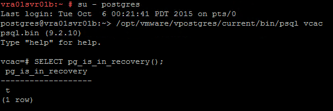

1.  Run the \\q command to exist psql.

> vcac=\# \\q

### Configure the Single Sign-On Connection and Apply the vRealize Automation License (Region A)

To prepare the vRealize Appliance for use, a system administrator provides the SSO connection information and license key.

**Procedure**

1.  Log out of, then log back into, the vRealize Automation appliance management console.

<!-- -->

1.  If you have not already done so, log out of the vRealize Automation appliance management console. 

2.  Navigate to the vRealize Automation appliance management console by using its fully qualified domain name. Type **https://vra01svr01a.rainpole.local:5480** into the Web browser address bar. 

3.  Log in with user name **root **and the password you specified when deploying the Identity Appliance.

<!-- -->

1.  Select the **vRealize Automation Settings** tab, and click **SSO**. The **SSO Settings** page displays. 

2.  Specify the SSO configuration settings in the **SSO Settings **page.

<!-- -->

1.  Type the fully qualified name for the VMware Identity Appliance, **vra01ids01.rainpole.local**, in the **SSO Host** text box.

2.  Verify that **7444** is the entry in the **SSO Port** text box.

3.  Type the default administrator name **administrator@vsphere.local** in the **SSO Admin User** text box.

4.  Type the SSO administrator password in the** SSO Admin Password** text box.
    **Note**: The password must match the SSO password you specified for the Identity Appliance. 

5.  Leave the **Apply Branding** check box unchecked.

6.  Click **Save Settings**. After a few minutes, a success message confirms that the SSO configuration has been successfully updated.

> 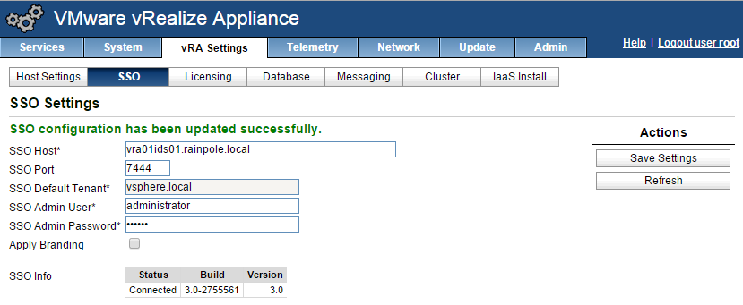

1.  Configure the license to enable the **Infrastructure** tab on the **vRealize Automation** console. 

<!-- -->

1.  Click **Licensing**.

2.  Type the valid vRealize Automation license key and click **Submit Key**.

    1.  ### Configure vRealize Automation Appliance Clustering (Region A)

Distributed installations that use load balancers support the use of more than one vRealize Appliance in a deployment. Each appliance in the deployment must belong to a cluster.

You join a vRealize Appliance to a cluster from the management console. The join operation copies appliance configuration information for the cluster to the appliance you are adding to the cluster, including certificate, SSO, licensing, database, and messaging information.

Perform this task from the management console of each server you want to join to the cluster except for the leading cluster node.

The join operation is not required for the leading cluster node because the join operation links the leading cluster node with the node from whose management console you are working, which makes both nodes part of the same cluster. After an appliance is part of the cluster, you can specify its FQDN as the leading cluster node.

Procedure

1.  Log in to the** vRealize Automation appliance management** console using its fully qualified domain name, **https://vra01ids01b.rainpole.local:5480** 

2.  Log in with user name **root **and the password you specified when deploying the Identity Appliance.

3.  Click on **vRA Settings**.

4.  Click on **Cluster**.

5.  Select the **vRA Settings** tab, and click **Cluster**. The **Cluster** page displays.

6.  Specify the cluster configuration settings in the **Cluster **page.

<!-- -->

1.  Enter the FQDN of the vRealize Appliance, **vra01svr01a.rainpole.local, **in the** Leading Cluster Node** text box.

2.  Type the **root** user password in the **Password **text box.

3.  Click **Join Cluster**.

<!-- -->

1.  Continue past any certificate warnings.

2.  Services for the cluster are restarted.

3.  Verify that services are running.

<!-- -->

1.  Click the **Services** tab. 

2.  Click the **Refresh **tab to monitor the progress of service start up.

<!-- -->

1.  Log out of, then log back into, the vRealize Automation appliance management console.

<!-- -->

1.  Log out of the **vRealize Automation appliance management** console. 

2.  Log in to the **vRealize Automation appliance management** console using its fully qualified domain name, **https://vra01svr01b.rainpole.local:5480**.

3.  Log in as the **root **user.

<!-- -->

1.  Verify that SSO and licensing settings have transferred from the Leading Cluster Node.

<!-- -->

1.  Select the **vRA Settings** tab, and click **SSO**.

2.  Verify SSO settings have transferred from the Leading Cluster Node.

3.  Click **Licensing.**

4.  Verify Licensing settings have transferred from the Leading Cluster Node.

<!-- -->

1.  Log out of the **vRealize Automation appliance management** console.

    1.  ### Resolve Windows Server Dependencies

The Windows virtual machine hosting the IaaS components must meet configuration requirements for the IaaS database, the IaaS server components, the IaaS Manager Service, and Distributed Execution Managers. A series of scripts are used to resolve dependency issues. 

Prepare file server

1.  Please refer to the SDDC Planning and Preparation section for the location of Windows 2012R2 installation media, NTRights.exe and Java runtime environment installer

2.  Create a file server that is accessible by all of the virtual machines vra01iws01a, vra01iws01b, vra01ims01a, vra01ims01b, vra01dem01, and vra01dem02. For example: \\\\AD-01\\FILES\\.

3.  Create vracerts and software subdirectories on the file server. For example: \\\\AD-01\\FILES\\vracerts, \\\\AD-01\\FILES\\software.

4.  Copy the content of certification folder vra (example: vrealize.key, vRoot64.pem, and vrealize.pfx certification files) to the \\\\AD-01\\FILES\\vracerts\\ directory.

5.  Please verify the Certification Authority Root Certification file name is Root64.cer, if it's not please rename the file to Root64.cer

6.  Extract the content of the Windows 2012R2 installation CD or ISO file to the win2012r2 directory under the software directory on the file server. For example: \\\\AD-01\\FILES\\software\\win2012r2\\.

7.  Copy the file jre-7u67-windows-x64.exe to the software directory of the file server. For example: \\\\AD-01\\FILES\\software\\

8.  Copy the file NTRights.exe to the software directory of the file server. For example: \\\\AD-01\\FILES\\software\\.

    1.  #### **Create** vra-prereqs-winfeatures-v1.ps1 **script file**

<!-- -->

1.  Log into the **vra01iws01a** virtual machine as the user administrator.

2.  Open the **Notepad** application.

3.  Copy and Paste the following into **Notepad**.

> \[CmdletBinding()\]
>
> Param(
>
>   \[Parameter(Mandatory=$True)\]
>
>    \[string\]$source
>
> )
>
>  
>
> Import-Module ServerManager
>
>  
>
> $svcs="Web-Webserver,Web-Http-Redirect,Web-Windows-Auth,Web-Mgmt-Console,Web-Mgmt-Compat,"\`
>
> + "Web-Asp-Net,net-wcf-http-activation45,was-Net-Environment,NET-Non-HTTP-Activ"  -split ','
>
>  
>
> \# no: NET-Framework-Core,
>
>  
>
> foreach ($svc in $svcs) {
>
>     write-host $svc
>
>     Install-WindowsFeature -Name $svc -WarningAction:SilentlyContinue -Source $source
>
> }

1.  Go to **File** then **Save As**.

2.  Select the file server's software subdirectory For example **\\\\AD-01\\FILES\\software**

3.  Select **All Files (\*.\*)** from the drop down menu **Save as type**:

4.  Type in **vra-prereqs-winfeatures-v1.ps1** in File name: text box.

5.  Click on **Save** button.

> 

1.  Close the Notepad application

    1.  #### **Create** vra-prereqs-iis-v1.ps1 **script file**

<!-- -->

1.  Open a new **Notepad** application

2.  Copy and paste the following into the **Notepad**.

> \[CmdletBinding()\]
> Param(
>   \[Parameter(Mandatory=$True)\]
>    \[string\]$wwwroot
> )
> Import-Module WebAdministration
> \# Setting the default website location used in vCAC   
> Set-ItemProperty 'IIS:\\Sites\\Default Web Site' -name physicalPath -value $wwwroot    
> \# Setting authentication values for IIS
> \# Anonymous Authentication needs to be disabled
> \# Windows Authentication needs to be enabled
> Write-Host "Setting authentication values for IIS" -ForegroundColor Yellow
> Set-WebConfigurationProperty -Location 'Default Web Site' -Filter /system.webServer/security/authentication/AnonymousAuthentication  -Name Enabled -Value $true
> Set-WebConfigurationProperty -Location 'Default Web Site' -Filter /system.webServer/security/authentication/AnonymousAuthentication  -Name Enabled -Value $false
> Set-WebConfigurationProperty -Location 'Default Web Site' -Filter /system.webServer/security/authentication/windowsAuthentication  -Name Enabled -Value $false
> Set-WebConfigurationProperty -Location 'Default Web Site' -Filter /system.webServer/security/authentication/windowsAuthentication  -Name Enabled -Value $true
> \# Sometimes the pre-req checker cannot distinguish the values of the Windows authentication without
> \# The providers being removed and added back in.
> \# Removing and re-adding Windows authentication providers
> Write-Host "Removing & Re-Adding Windows authentication providers" -ForegroundColor Yellow
> \# Authentication Providers code by Jonathan Medd http://www.jonathanmedd.net
> Get-WebConfigurationProperty -Filter system.webServer/security/authentication/WindowsAuthentication -Location 'Default Web Site' -Name providers.Collection | Select-Object -ExpandProperty Value | ForEach-Object {Remove-WebConfigurationProperty -Filter system.webServer/security/authentication/WindowsAuthentication -Location 'Default Web Site' -Name providers.Collection -AtElement @{value=$\_}}
> Add-WebConfigurationProperty -Filter system.webServer/security/authentication/WindowsAuthentication -Location 'Default Web Site' -Name providers.Collection -AtIndex 0 -Value "Negotiate"
> Add-WebConfigurationProperty -Filter system.webServer/security/authentication/WindowsAuthentication -Location 'Default Web Site' -Name providers.Collection -AtIndex 1 -Value "NTLM"
> \# Extended protection needs to be enabled and disabled for vCAC to recognize the value
> \# Enable and disable the Extended Protection
> Write-Host "Enabling and disabling Extended Protection" -ForegroundColor Yellow
> Set-WebConfigurationProperty -Filter system.webServer/security/authentication/WindowsAuthentication -Location 'Default Web Site' -Name extendedProtection.tokenChecking -Value 'Allow'
> Set-WebConfigurationProperty -Filter system.webServer/security/authentication/WindowsAuthentication -Location 'Default Web Site' -Name extendedProtection.tokenChecking -Value 'None'
> \# The same must happen with Kernel-Mode. This will disable then re-enable the value
> \# Resetting KERNEL MODE
> Write-Host "Resetting Kernel Mode" -ForegroundColor Yellow
> Set-WebConfigurationProperty -Filter system.webServer/security/authentication/WindowsAuthentication -Location 'Default Web Site' -Name useKernelMode -Value $false
> Set-WebConfigurationProperty -Filter system.webServer/security/authentication/WindowsAuthentication -Location 'Default Web Site' -Name useKernelMode -Value $true

1.  Go to **File** then **Save As.**

2.  Select the file server's software subdirectory For example **\\\\AD-01\\FILES\\software**.

3.  Select **All Files (\*.\*)** from the drop down menu **Save as type**:

4.  Type in **vra-prereqs-iis-v1.ps1** in File name: text box.

5.  Click on **Save** button

6.  Close the **Notepad** application.

    1.  #### **Create** vra-resolve-mgr-web-deps.cmd **script file**

<!-- -->

1.  Open a new **Notepad** application

2.  Copy and paste the following into **Notepad**

> @echo off
> set SHAREDIR=\\\\AD-01\\FILES
>
> set WINSRC=%SHAREDIR%\\software\\win2012r2\\sources\\sxs
>
> set DOMAINACCT=RAINPOLE\\svc-vra
>
> set CERTPW=-p ca$hc0w
>
> set INETPUBROOT=c:\\Inetpub
>
> set INETPUBLOG=c:\\Inetpub\\Log
>
> set INETPUBWWWROOT=c:\\Inetpub\\WWWRoot

1.  Edit the following options

| Options        | Values                                                                   |
|----------------|--------------------------------------------------------------------------|
| **SHAREDIR**   | Location of file server For Example: \\\\AD-01\\FILES                    |
| **DOMAINACCT** | RAINPOLE\\svc-vra                                                        |
| **CERTPW**     | *Certification password and passphrase*. Be sure to leave the -p option. |

1.  Copy and paste the following into the same **Notepad**, but in a new line.

> dism /online /enable-feature /featurename:NetFx3 /All /Source:%WINSRC%
>
> certutil.exe -importPFX %CERTPW% %SHAREDIR%\\vracerts\\vrealize.pfx
>
> certutil.exe -addstore root %SHAREDIR%\\vracerts\\Root64.cer
>
> REG ADD HKLM\\SYSTEM\\CurrentControlSet\\Control\\Lsa /v DisableLoopbackCheck /t REG\_DWORD /d 00000001 /f
>
> REG ADD HKLM\\SOFTWARE\\Microsoft\\Windows\\CurrentVersion\\RunOnce /v seclogon  /d "net start seclogon" /f
>
> netsh advfirewall set allprofiles state off
>
> net localgroup Administrators %DOMAINACCT% /add
>
> %SHAREDIR%\\software\\NTRights.exe +r SeBatchLogonRight -u %DOMAINACCT%
>
> %SHAREDIR%\\software\\NTRights.exe +r SeServiceLogonRight -u %DOMAINACCT%
>
> md %INETPUBROOT% %INETPUBLOG% %INETPUBWWWROOT%
>
> icacls %INETPUBWWWROOT% /grant BUILTIN\\IIS\_IUSRS:(OI)(CI)(RX) BUILTIN\\Users:(OI)(CI)(RX)
>
> icacls %INETPUBLOG% /grant "NT SERVICE\\TrustedInstaller":(OI)(CI)(F)
>
> echo Enabling MSDTC...
>
> REG ADD HKLM\\SOFTWARE\\Microsoft\\MSDTC\\Security /v LuTransactions /t REG\_DWORD /d 1 /f
>
> REG ADD HKLM\\SOFTWARE\\Microsoft\\MSDTC\\Security /v NetworkDtcAccess /t REG\_DWORD /d 1 /f
>
> REG ADD HKLM\\SOFTWARE\\Microsoft\\MSDTC\\Security /v NetworkDtcAccessInbound /t REG\_DWORD /d 1 /f
>
> REG ADD HKLM\\SOFTWARE\\Microsoft\\MSDTC\\Security /v NetworkDtcAccessOutbound /t REG\_DWORD /d 1 /f
>
> REG ADD HKLM\\SOFTWARE\\Microsoft\\MSDTC\\Security /v NetworkDtcClients /t REG\_DWORD /d 1 /f
>
> REG ADD HKLM\\SOFTWARE\\Microsoft\\MSDTC\\Security /v NetworkDtcAccessTransactions /t REG\_DWORD /d 1 /f
>
> REG ADD HKLM\\SOFTWARE\\Microsoft\\MSDTC\\Security /v NetworkDtcAccessAdmin /t REG\_DWORD /d 1 /f
>
> REG ADD HKLM\\SOFTWARE\\Microsoft\\MSDTC\\Security /v NetworkDtcAccessClients /t REG\_DWORD /d 1 /f
>
> powershell.exe -executionpolicy unrestricted %SHAREDIR%\\software\\vra-prereqs-winfeatures-v1.ps1 -source %WINSRC%
>
> powershell.exe -executionpolicy unrestricted %SHAREDIR%\\software\\vra-prereqs-iis-v1.ps1 -wwwroot %INETPUBWWWROOT%
>
> echo Installing Java...
>
> %SHAREDIR%\\software\\jre-7u67-windows-x64.exe /s
>
> setx /m JAVA\_HOME "C:\\Program Files\\Java\\jre7"
>
> echo Press Key to continue
>
> pause
>
> exit

1.  Go to **File** then **Save As**

2.  Select the file server's software subdirectory For example **\\\\AD-01\\FILES\\software**

3.  Select **All Files (\*.\*)** from the drop down menu **Save as type**:

4.  Type in vra-resolve-mgr-web-deps.cmd in File name: text **box**

5.  Click on the **Save** button

6.  Close the notepad application

    1.  #### Execute the dependency scripts

<!-- -->

1.  Log into the **vra01iws01a** virtual machine as the user **administrator**.

2.  From the Windows operating system, click **Start**, click **Computer**

3.  Type in **\\\\AD-01\\FILES\\software\\** in the Address Bar text box

4.  Enter **svc-vra** user credential

5.  Right-click **vra-resolve-mgr-web-deps.cmd**, and then click **Run as administrator**.

6.  During the installation process please Type in **R** and then **Enter** when **Prompt if you want to run scripts**.

7.  Ensure the **vra-resolve-mgr-web-deps.cmd** script successfully completes.

> 

1.  Repeat procedure steps 1-6 for the following virtual machines.

-   vra01iws01b.rainpole.local

-   vra01ims01a.rainpole.local

-   vra01ims01b.rainpole.local

-   vra01dem01.rainpole.local

-   vra01dem02.rainpole.local

 

### Install IaaS Web Servers (Region A)

Deploy two load balanced IaaS Web servers; vra01iws01a.rainpole.local and vra01iws01b.rainpole.local.

#### Install IaaS Web Servers on vra01iws01a.rainpole.local

Deploy an IaaS Web server to the virtual machine** vra01iws01a.rainpole.local**.

Procedure

1.  Log into the vra01iws01a.rainpole.local virtual machine console with **rainpole\\svr-vra** user

2.  Open a Web browser and navigate to https://vra01svr01a.rainpole.local:5480/installer/ 

3.  Click the **IaaS Installer** link from Download the ***IaaS Installer*** to install the IaaS components on Windows.  

4.  When prompted, save the installer: setup\_\_vra01svr01a.rainpole.local@5480.exe.

5.  Right-click setup\_\_vra01svr01a.rainpole.local@5480.exe and select Run as administrator.

6.  The vCloud Automation Center Configuration wizard displays. 

7.  Click **Next**.

> 

1.  On the **End-User License Agreement** page, read the License Agreement, select **I accept the terms in the license agreement**, then click **Next**.

> 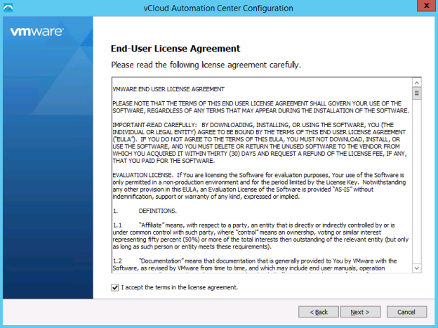

1.  Click **Next**. 

2.  In the **Log In** page, complete the following setting.

> Type the **root** user credentials for the vra01svr01a appliance.

1.  Select **Accept Certificate**.

2.  Click **Next.**

> 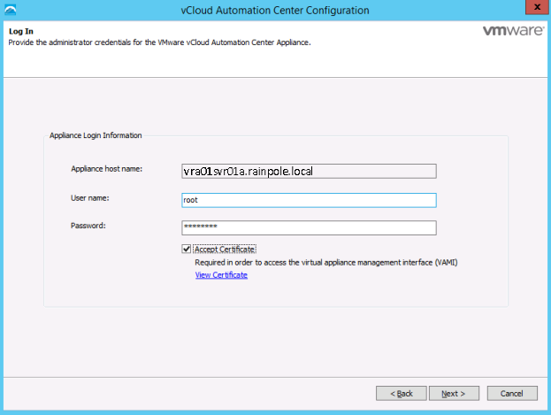

1.  On the **Installation Type** page select the **Custom Install** and **IaaS Server** radio buttons, accept the folder path in the **Root Install Location** text box, and click **Next**. 

> 

1.  On the **IaaS Server Custom Install** page. Left side on the **IaaS feature selection** panel select the Database, Website, and ModelManagerData list items.

2.  On the **IaaS Server Custom Install** page. Right side on the **Database** tab

<!-- -->

1.  Select **vra01mssql01** from the **Database Instance** drop down menu.

2.  Type **VRADB-01** in the **Database name** text box, and select the **Use default data and log directories** check box.

3.  Under Authentication, select the **Use Windows identity of the currently logged on user**... check box.

4.  Leave all other check boxes deselected.

> 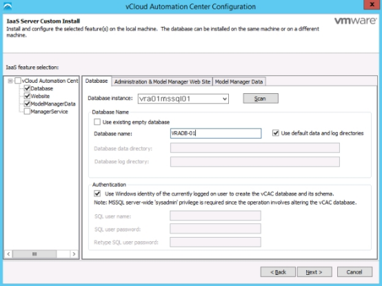

1.  Click on **Administration & Manager Web Site** tab.

2.  Verify that the settings populating the **Administration & Manager Web Site** match those in the table below.

| Options                                                   | Values           |
|-----------------------------------------------------------|------------------|
| **Available web sites**                                   | Default Web Site |
| **Port number**                                           | 443              |
| **Available certificates**                                | vrealize         |
| **Display certificates using certificate-friendly names** | Selected         |
| **Suppress certificate mismatch**                         | Deselected       |

> 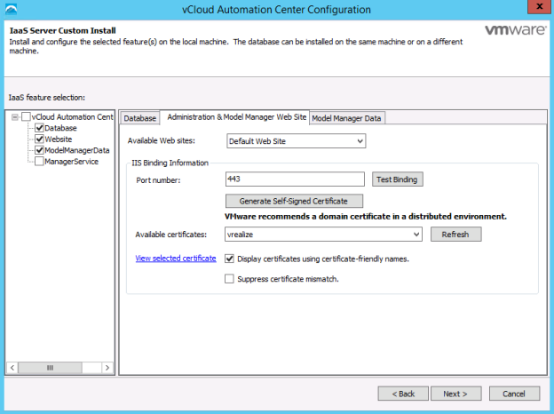

1.  Select the **Model Manager Data** tab.

2.  Type **vra01svr01.rainpole.local** in the Server text box.

3.  Click on the **Load** button and verify **SSO Default Tenant** is **vsphere.local**.

4.  Click the **Download** button and verify **Certificate** is populated correctly.

5.  Select **Accept Certificate**.

6.  Type the user name **administrator@vsphere.local** in the **User name** text box.

7.  Type the ***vra\_administrator\_password*** password in the **Password** and **Confirm** text boxes*.*

8.  Type **vra01iws01.rainpole.local** in the IaaS Server text box.

9.  Click both **Test** buttons, and verify that the tests pass successfully. 

10. Click **Next**.

> 

1.  The **Verify Prerequisites** page verifies that all of the necessary configuration settings have been entered. Verify that there are no errors and that the prerequisite check is successful. 

> 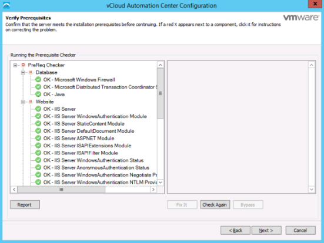

1.  Click **Next**

2.  In the **Server and Account Settings** page, enter the following settings.

<!-- -->

1.  Type the user name** RAINPOLE\\svc-vra** in the **User name** text box.

2.  Type the ***svc\_vra\_password** * in the **Password **and **Confirm** text boxes.

3.  In the **Security** section, type the ***db\_encryption\_password*** password in the **Passphrase **and **Confirm** text boxes*.*

> 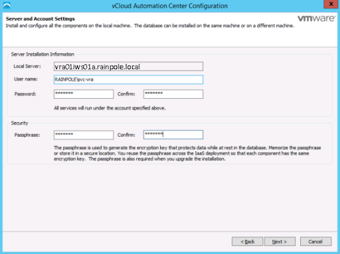 

1.  Click **Next**.

2.  In the **Ready to Install** page, verify the components you plan to install, and click **Install**.

> 

1.  The **Installing** page displays a progress bar and the installer log file.

> 

1.  A status message informs you when the installation completes. Click **Next**.

> 

1.  Deselect the check box **Guide me through the initial system configuration**, and click Finish.

> 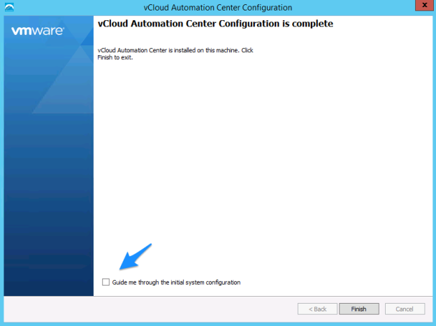

1.  You have successfully deployed the IaaS Web server on the **vra01iws01a.rainpole.local** virtual machine.

    1.  #### Enable Anonymous Authentication on IIS Default Web Site for NSX Load Balance Monitor Services

<!-- -->

1.  Click on **Start** then **Control Panel** then **Administrative Tools** then select **Internet Information Services(IIS) Manager**.

2.  Expand **VRA01IWS01A** from the left Navigation panel.

3.  Expand **Sites** and select **Default Web Site**.

4.  Click on **Authentication** under **IIS** section.

> 

1.  Right Click on **Anonymous Authentication** and select **Enabled**.

> 

1.  Close the **Internet Information Services IIS Manager** window by click on the Red X on the top right corner.

2.  You have successfully deployed the IaaS Web server on the **vra01iws01a.rainpole.local** virtual machine.

    1.  #### Install IaaS Web Servers on vra01iws01b.rainpole.local

Deploy an IaaS Web server to the virtual machine vra01iws01b.rainpole.local.

Procedure

1.  Log into the **vra01iws01b.rainpole.local** virtual machine console as the **rainpole\\svr-vra** user.

2.  Open a Web browser, and navigate to https://vra01svr01a.rainpole.local:5480/installer/ 

3.  Click the **IaaS Installer** link from Download the IaaS Installer to install the IaaS components on Windows.  

4.  When prompted, save the installer file **setup\_\_vra01svr01a.rainpole.local@5480.exe**.

5.  Right-click [**setup\_\_vra01svr01a.rainpole.local@5480.exe**](mailto:setup__vra01svr01a.rainpole.local@5480.exe) and select **Run as administrator**.

6.  The **vCloud Automation Center Configuration wizard** start page displays.

7.  Click **Next**.

> 

1.  On the **End-User License Agreement** page, read the License Agreement, select **I accept the terms in the license agreement**, then click **Next**.

> 

1.  Click **Next**

2.  In the **Log In** page, complete the following setting.

<!-- -->

1.  Type the **root** user credentials for the vra01svr01b appliance.

2.  Select **Accept Certificate**.

3.  Click **Next.**

<!-- -->

1.  On the **Installation Type** page select the **Custom Install** and **IaaS Server** radio buttons, accept the folder path in the **Root Install Location** text box, and click **Next**.

> 

1.  On the **IaaS Server Custom Install** page. Left side on the **IaaS feature selection** panel select the **Website** list items.

2.  On the **IaaS Server Custom Install** page. Right side on the Administration & Model Manager Web Site tab.

<!-- -->

1.  Select **Default Web Site** from the **Available Web Sites** drop down menu.

2.  Type **443** in the **Port number** text box.

3.  Click on **Test Binding** button.

4.  Click on Generate Self-Signed Certificate button.

5.  Select **vRealize** from the **Available certificates** drop down menu.

6.  Select Display certificates using certificate-friendly names.

7.  Deselect Suppress certificate mismatch.

8.  Type **vra01iws01.rainpole.local** for **IaaS server** text box.

9.  Click on **Test link**.

10. Click **Next**.

> 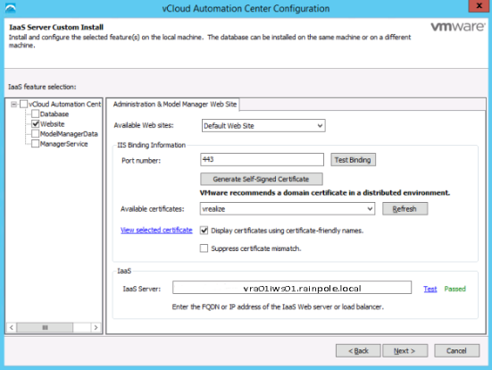

1.  The **Verify Prerequisites** page verifies that all of the necessary configuration settings have been entered.

2.  Verify that there are no errors and that the prerequisite check is successful, then click **Next**

> 

1.  In the **Server and Account Settings** page, enter the following settings.

<!-- -->

1.  Type the user name** RAINPOLE\\svc-vra** in the **User name** text box.

2.  Type the **svc\_vra\_password** in the Password and Confirm text boxes.

3.  In the Security section, type the **db\_encryption\_password** password in the **Passphrase** and **Confirm** text boxes.

4.  In Microsoft SQL Server Database Installation Information Type in **VRA01MSSQL01.RAINPOLE.LOCAL** in the Server text boxes 

5.  Type in **VRADB-01** in the **Database name** text box

6.  Click **Next**.

> 

1.  In the **Ready to Install** page, verify the components you plan to install, and click **Install**.

> 

1.  The **Installing** page displays a progress bar and the installer log file.

>  

1.  A status message informs you when the installation completes. Click **Next**.

> 

1.  Deselect the check box **Guide me through the initial system configuration**, and click **Finish**.

> 

#### Set recovery mode for VRADB-01 to Simple

1.  Log into **VRA01MSSQL01.rainpole.local**’s Virtual Machine Console using Rainpole domain administrator user **rainpole\\administrator**.

2.  From the Windows **Start** menu select **Run**, and type **ssms.exe** in the **Open** text box. Click **OK**. SQL Server Management Studio opens.

3.  In the **Connect to Server** dialog box, leave the already populated **Server Name** text box as default, and select **Windows Authentication** from the **Authentication** drop-down menu.

4.  In **Object Explorer**, expand the folder for the server instance **VRA01MSSQL01**, then expand the folder for Database.

5.  Right click on **VRADB**-01 and select **Properties**.

6.  Click on **Options**.

7.  Select **Simple** from drop down menu of **Recovery Model**.

> 

1.  Click **OK**.

    1.  #### Verify Load balancing of IaaS Web Servers

Ensure that NSX load balancing is properly configured, and successfully passing the vra01iws01.rainpole.local request to the vRealize Automation IaaS Web Services (either the vra01iws01a or vra01iws01b virtual machines).

Procedure

1.  Open a Web browser and navigate to [**h**](https://vra-svr.rainpole.local/)**ttps://vra01iws01.rainpole.local/WAPI/api/status**.

2.  A Web page with the Service Name **iaas-service** should display.

<!-- -->

1.  Distributed Execution Managers (DEM) has not yet been deployed, so this error message is to be expected.

> 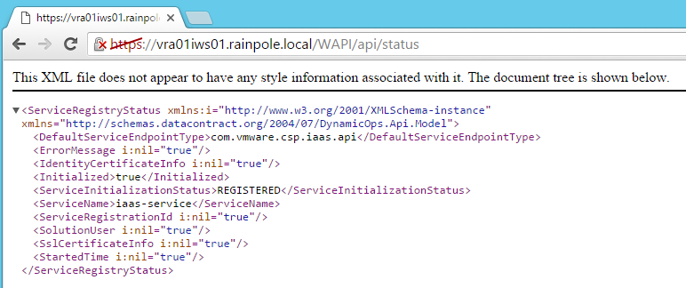

1.  If you receive a **404 not found **error message, NSX is not passing the connection request to the vra01iws01a or vra01iws01b virtual machines.

    1.  ### Install IaaS Manager Services (Region A)

Procedure

-   [Install the Manager Service on Host A](#InstallIaaSManagerServices-InstalltheMa)

-   [Install Distributed Execution Managers Orchestrators on Host A](#InstallIaaSManagerServices-InstallDistr)

-   [Install the Manager Service on Host B](#InstallIaaSManagerServices-InstalltheMa)

-   [Install Distributed Execution Manager Orchestrator on Host B](#InstallIaaSManagerServices-InstallDistr)

The system administrator installs the IaaS components after the appliances are deployed and fully configured. The IaaS components provide access to vRealize Automation Infrastructure features.

All components must run under the same service account.

The virtual machines on which you will install Manager Services and Distributed Execution Managers are listed in the table below.

| Host       | Virtual Machine            |
|------------|----------------------------|
| **Host A** | vra01ims01a.rainpole.local |
| **Host B** | vra01ims01b.rainpole.local |

#### Install the Manager Service on Host A

The Manager Service component coordinates communication between agents and proxy agents, the database, and SMTP. A minimum of one instance of the Manager Service component must be installed. You can install one primary instance and one backup instance of the Manager Service component to provide redundancy in a high-availability deployment.

Procedure

1.  Log into the **vra01ims01a.rainpole.local** virtual machine console with **rainpole\\svr-vra** user.  

2.  Open a Web browser and navigate to https://vra01svr01a.rainpole.local:5480/installer/ 

3.  Click the **IaaS Installer** link from Download the **IaaS Installer** to install the IaaS components on Windows.  

4.  When prompted, save the installer: setup\_\_vra01svr01a.rainpole.local@5480.exe.

5.  Right-click **setup\_\_vra01svr01a.rainpole.local@5480.exe** and select Run as administrator.

6.  The vCloud Automation Center Configuration wizard displays. 

7.  Click **Next.**

> 

1.  On the **End-User License Agreement** page, read the License Agreement, select **I accept the terms in the license agreement**, then click **Next**.

> 

1.  Click **Next**

2.  In the **Log In** page, complete the following setting.

<!-- -->

1.  Type the** root** user credentials for the **vra01svr01a **appliance.

2.  Select Accept Certificate.

3.  Click **View Certificate**. Compare the certificate thumbprint with the thumbprint set for the vRealize Appliance. You can view the vRealize Appliance certificate in the client browser when the management console is accessed on port 5480.

4.  Click **Next**.

> 

1.  On the **Installation Type** page select the **Custom Install **and **IaaS Server **radio buttons, accept the folder path in the **Root Install Location **text box, and click **Next**. 

> 

1.  Specify the following settings on the **IaaS Server Custom Install** page.

<!-- -->

1.  From the **IaaS feature selection** panel select the select the **ManagerService **list item.

2.  Type **vra01iws01.rainpole.local** in the IaaS Server text box.

3.  In the **Manager Service Startup Type** select the **Active node with startup type** set to **automatic** radio button.

4.  Select **Default Web Site** from the **Available Web Sites** drop down menu.

5.  Type **443** in the **Port number** text box, and click **Test binding**. 

6.  Click the **Generate Self-Signed Certificate** button.

7.  Select **vrealize** from the **Available Certificates** drop down menu.

8.  Select the **Display certificates using certificate-friendly names** check box.

<!-- -->

1.  Click **Next**.

> 

1.  Click **Next**

2.  The **Verify Prerequisites** page ensures that all of the necessary configuration settings have been entered. Verify that there are no errors and that the prerequisite check is successful, then click **Next**.

> 

1.  In the **Server and Account Settings** page, enter the following settings.

<!-- -->

1.  Type the user name **RAINPOLE\\svc-vra** in the User name text box.

2.  Type the ***svc\_vra\_password*** password in the Password and Confirm text boxes.

3.  In the Security section, type the ***db\_encryption\_password*** password in the **Passphrase** and **Confirm** text boxes.

4.  Type **VRA01MSSQL01.RAINPOLE.LOCAL** in the **Server text** box.

5.  Type **VRADB-01** in the **Database name** text box.

6.  Select the **Use Windows Authentication** check box.

7.  Click **Next**.

> 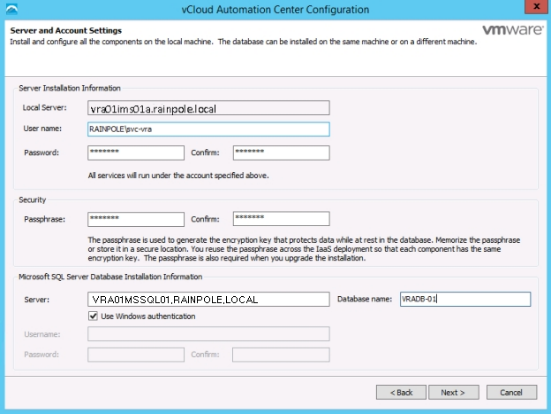

1.  In the **Ready to Install** page, verify the components you plan to install, and click **Install**.

> 

1.  The **Installing** page displays a progress bar and the installer log file.

> 

1.  A status message informs you when the installation completes. Click **Next**.

2.  Deselect the **Guide me through the initial system configuration** check box, and click **Finish**.

> 

#### Install Distributed Execution Managers Orchestrators on Host A

Distributed Execution Managers (DEM) Orchestrators support active-active high availability. Typically you install a single DEM Orchestrator on each Manager Service machine. You can then install DEM Orchestrators and DEM workers on the same machine.

Install Distributed Execution Managers Orchestrators on the vra01ims01a virtual machine. 

Procedure

1.  If you have not already done so, log into the **vra01ims01a.rainpole.local** virtual machine as the **rainpole\\svr-vra **user.

2.  Run the installer on the **vra01ims01a** virtual machine.

3.  Right-click **setup\_\_vra01svr01a.rainpole.local@5480.exe** and select **Run as administrator**.

4.  On the **Installation Type** page select the **Custom Install **and **Distributed Execution Managers **radio buttons, accept the folder path in the **Root Install Location **text box, and click **Next**.

> 

1.  Click **Next**

2.  The **Verify Prerequisites** page ensures that all necessary configuration settings have been entered. Verify that there are no errors and that the prerequisite check is successful, then click **Next**.

> 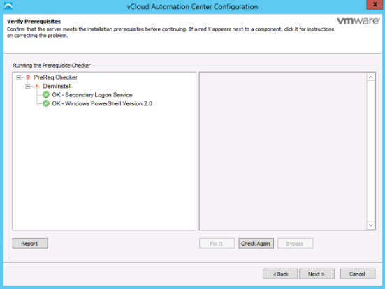

1.  Type the following credentials to log in.

| Settings      | Value              |
|---------------|--------------------|
| **User name** | RAINPOLE\\svc-vra  |
| **Password**  | svc\_vra\_password |

> 

1.  Click **Next**.

2.  On the **Install Distributed Execution Managers **page, enter the following settings. 

| Setting                                 | Values                    |
|-----------------------------------------|---------------------------|
| **DEM role**                            | Orchestrator              |
| **DEM name**                            | DEM-Orch-01               |
| **Manager Service Host name**           | vra01ims01.rainpole.local |
| **Model Manager Web Service Host name** | vra01iws01.rainpole.local |

> 

1.  Click **Test **to test the connections to the Manager Service and Model Manager Web Service. 

2.  Click the **Add** button.

3.  Click **Next.**

4.  In the** Ready to Install page**, verify the components you plan to install, and click** Install**.

> 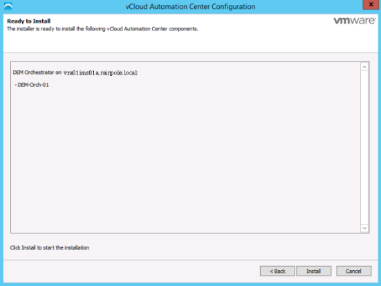

1.  The **Installing** page displays a progress bar and the installer log file.

> 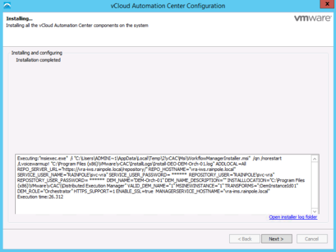

1.  A status message informs you when the installation completes. Click **Next**.

2.  Deselect the check box **Guide me through the initial system** configuration, and click **Finish**.

> 

#### Configure IMS for large scale deployment

1.  Click **Start** and type **Notepad** into the search box.

2.  Right click on **Notepad** and select **Run As Administrator**.

3.  Select **FILE** then **Open...**

4.  Browse to **C:\\Program Files (x86)\\VMware\\vCAC\\Server** folder.

5.  Type **ManagerService.exe.config** for **File name** field.

6.  Click **Open**.

7.  Make sure the file has been opened in Notepad.

8.  Change values for the following attributes

| Settings                                 | Value     |
|------------------------------------------|-----------|
| MaxOutstandingResourceIntensiveWorkItems | 8         |
| maxReceivedMessageSize                   | 131072000 |
| maxStringContentLength                   | 131072000 |

> 

1.  Select **FILE** then **Save**.

2.  Close **Notepad** program.

3.  Click on **Start** then **Restart** to restart the Virtual Machine.

    1.  #### Install the Manager Service on Host B

Procedure

1.  Log into the **vra01ims01b.rainpole.local** virtual machine console with **rainpole\\svr-vra** user.  

2.  Open a Web browser and navigate to https://vra01svr01a.rainpole.local:5480/installer/ 

3.  Click the **IaaS Installer** link from Download the **IaaS Installer** to install the IaaS components on Windows.  

4.  When prompted, save the installer: **setup\_\_vra01svr01a.rainpole.local@5480.exe**.

5.  Right-click setup\_\_vra01svr01a.rainpole.local@5480.exe and select **Run as administrator**.

6.  The **vCloud Automation Center Configuration wizard** displays. 

7.  Click **Next**.

> 

1.  On the **End-User License Agreement** page, read the License Agreement, select **I accept the terms in the license agreement**, then click **Next**.

> 

1.  Click **Next**

2.  In the **Log In** page, complete the following settings.

<!-- -->

1.  Type the root user credentials for the **vra01svr01a** appliance.

2.  Select **Accept Certificate**.

3.  Click **View Certificate**. Compare the certificate thumbprint with the thumbprint set for the vRealize Appliance. You can view the vRealize Appliance certificate in the client browser when the management console is accessed on port 5480.

4.  Click **Next**.

> 

1.  On the **Installation Type** page select the **Custom Install **and **IaaS Server **radio buttons, accept the folder path in the **Root Install Location **text box, and click **Next**. 

> 

1.  Specify the following settings on the **IaaS Server Custom Install** page.

<!-- -->

1.  From the **IaaS feature** selection panel select the select the **ManagerService** list item.

2.  Type **vra01iws01.rainpole.local** in the IaaS Server text box.

3.  In the **Manager Service Startup Type** select the **Disaster recovery cold standby node** radio button.

4.  Select **Default Web Site** from the **Available Web Sites** drop down menu.

5.  Type **443** in the **Port number** text box, and click **Test binding**. 

6.  Click the **Generate Self-Signed Certificate** button.

7.  Select **vrealize** from the **Available Certificates** drop down menu.

8.  Select the **Display certificates using certificate-friendly names** check box.

9.  Click **Next**.

> 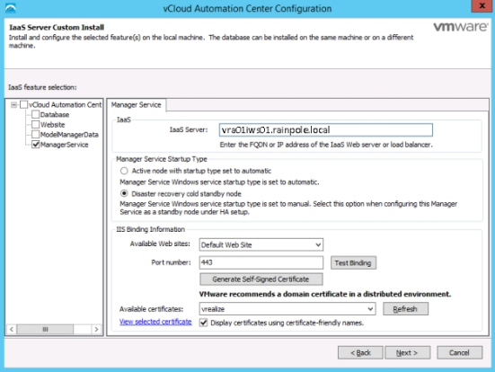

1.  The **Verify Prerequisites** page ensures that all necessary configuration settings have been entered. Verify that there are no errors and that the prerequisite check is successful, then click **Next**.

> 

1.  In the **Server and Account Settings** page, enter the following settings.

<!-- -->

1.  Type the user name **RAINPOLE\\svc-vra** in the **User name** text box.

2.  Type the ***svc\_vra\_password*** password in the **Password** and **Confirm** text boxes.

3.  In the **Security** section, type the ***db\_encryption\_password*** password in the **Passphrase** and **Confirm** text boxes.

4.  Type **VRA01MSSQL01.RAINPOLE.LOCAL** in the Server text box.  

5.  Type **VRADB-01** in the **Database name** text box.

6.  Select the **Use Windows Authentication** check box.

7.  Click **Next**.

> 

1.  In the **Ready to Install** page, verify the components you plan to install, and click **Install**.

> 

1.  The **Installing** page displays a progress bar and the installer log file.

> 

1.  A status message informs you when the installation completes. 

2.  Deselect the **Guide me through the initial system configuration** check box, and click **Finish**

> 

#### Install Distributed Execution Manager Orchestrator on Host B

Procedure

1.  If you have not already done so, log into the **vra01ims01b.rainpole.local** virtual machine as the **rainpole\\svr-vra** user

2.  Run the installer on the **vra01ims01b** virtual machine. 

3.  Right-click **setup\_\_vra01svr01a.rainpole.local@5480.exe** and select Run as administrator.

4.  On the **Installation Type** page select the **Custom Install and Distributed Execution Managers** radio buttons, accept the folder path in the **Root Install Location** text box, and click **Next**.

> 

1.  The **Verify Prerequisites** page ensures that the necessary configuration settings have been entered. Verify that there are no errors and that the prerequisite check is successful, then click **Next**.

> 

1.  Type the following credentials to log in.

| Settings      | Value              |
|---------------|--------------------|
| **User name** | RAINPOLE\\svc-vra  |
| **Password**  | svc\_vra\_password |

> 

1.  Click **Next**

2.  On the **Install Distributed Execution Managers **page, enter the following settings.

| Setting                                 | Value                     |
|-----------------------------------------|---------------------------|
| **DEM role**                            | Orchestrator              |
| **DEM name**                            | DEM-Orch-02               |
| **Manager Service Host name**           | vra01ims01.rainpole.local |
| **Model Manager Web Service Host name** | vra01iws01.rainpole.local |

> 

1.  Click both **Test** links to test the connections to the Manager Service and Model Manager Web Service. 

2.  Click the **Add **button.

3.  Click **Next.**

4.  In the** Ready to Install page**, verify the components you plan to install, and click** Install**.

> 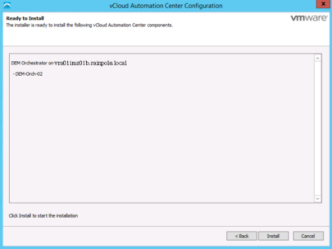

1.  The **Installing** page displays a progress bar and the installer log file. When the installation complete, click **Next**.

> 

1.  Deselect the check box **Guide me through the initial system configuration**, and click **Finish**. 

> 

#### Configure IMS for large scale deployment

1.  Click **Start** and type **Notepad** into the search box.

2.  Right click on **Notepad** and select **Run As Administrator**.

3.  Select **FILE** then **Open...**

4.  Browse to **C:\\Program Files (x86)\\VMware\\vCAC\\Server** folder.

5.  Type **ManagerService.exe.config** for **File name** field.

6.  Click **Open**.

7.  Make sure the file has been opened in Notepad.

8.  Change values for the following attributes

| Settings                                 | Value     |
|------------------------------------------|-----------|
| MaxOutstandingResourceIntensiveWorkItems | 8         |
| maxReceivedMessageSize                   | 131072000 |
| maxStringContentLength                   | 131072000 |

> 

1.  Select **FILE** then **Save**.

2.  Close **Notepad** program.

3.  Click on **Start** then **Restart** to restart the Virtual Machine.

    1.  ### Install Distributed Execution Managers Workers (Region A)

Install Distributed Execution Managers (DEM) Workers on the IaaS Manager Service server or on a separate server. The server must have network connectivity to the Model Manager host.

| Settings   | Value                     |
|------------|---------------------------|
| **Host A** | vra01dem01.rainpole.local |
| **Host B** | vra01dem02.rainpole.local |

#### Install Distributed Execution Managers Workers on Host A

Install DEM Workers on the vvra01dem01.rainpole.local virtual machine.

Procedure

1.  Log into the **vra01dem01.rainpole.local** virtual machine console with **rainpole\\svr-vra** user.  

2.  Open a Web browser and navigate to **https://vra01svr01a.rainpole.local:5480/installer**.

3.  Click the **IaaS Installer** link from Download the **IaaS Installer** to install the IaaS components on Windows.  

4.  When prompted, save the installer: **setup\_\_vra01svr01a.rainpole.local@5480.exe**.

5.  Right-click **setup\_\_vra01svr01a.rainpole.local@5480.exe** and select **Run as administrator**.

6.  The **vCloud Automation Center Configuration wizard** displays. 

7.  Click **Next**.

8.  On the **End-User License Agreement** page, read the License Agreement, select **I accept the terms in the license agreement**, then click **Next**.

> 

1.  In the **Log In** page, complete the following setting.

<!-- -->

1.  Type the **root** user credentials for the vra01dem01 appliance.

2.  Select **Accept Certificate**.

3.  Click **View Certificate**. Compare the certificate thumbprint with the thumbprint set for the vRealize Appliance. You can view the vRealize Appliance certificate in the client browser when the management console is accessed on port 5480.

4.  Click **Next**.

> 

1.  On the **Installation Type** page select the **Custom Install **and **Distributed Execution Managers **radio buttons, accept the folder path in the **Root Install Location **text box, and click **Next**.

> 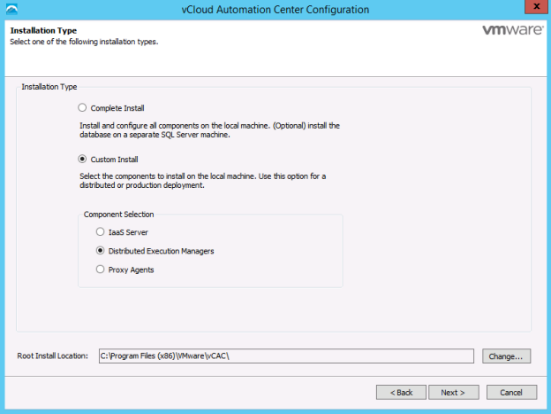

1.  The **Verify Prerequisites** page ensures that all necessary configuration settings have been entered. Verify that there are no errors and that the prerequisite check is successful, then click **Next**.

> 

1.  Type the following credentials to log in, and click **Next**.

| Settings      | Value                |
|---------------|----------------------|
| **User name** | RAINPOLE\\svc-vra    |
| **Password**  | *svc\_vra\_password* |

> 

1.  On the **Install Distributed Execution Managers** page, enter the following settings for the DEM work you are creating. You will repeat this perform this process three times to create three DEM workers: DEM-Worker-01, DEM-Worker-02, and DEM-Worker-03.

| Setting                             | Values for DEM-Worker-01  | Values for DEM-Worker-02  | Values for DEM-Worker-03  |
|-------------------------------------|---------------------------|---------------------------|---------------------------|
| DEM role                            | Worker                    | Worker                    | Worker                    |
| DEM name                            | DEM-Worker-01             | DEM-Worker-02             | DEM-Worker-03             |
| Manager Service Host name           | vra01ims01.rainpole.local | vra01ims01.rainpole.local | vra01ims01.rainpole.local |
| Model Manager Web Service Host name | vra01iws01.rainpole.local | vra01iws01.rainpole.local | vra01iws01.rainpole.local |

1.  Click **Test **to test the connections to the Manager Service and Model Manager Web Service. 

2.  Click the **Add **button.

3.  Repeat the above steps add two additional DEM workers named **DEM-Worker-02** and **DEM-Worker-03**. All other configuration values remain the same as those previously entered. When you have added the additional DEM workers, continue the installation procedure beginning with the step below.

> 

1.  Click **Next.**

2.  In the **Ready to Install** page, verify the components you plan to install, and click **Install**.

3.  The **Installing **page displays a progress bar and the installer log file.

>  

1.  A status message informs you when the installation completes. Click **Next**.

2.  Deselect the check box **Guide me through the initial system configuration**, and click **Finish**.

> 

1.  Enable automatic restart of the Distributed Execution Manager Worker service.

<!-- -->

1.  Open the **DynamicOps.DEM.exe.config** file for DEM-Worker-01 in a text editor.

<!-- -->

1.  The default location is C:\\Program Files (x86)\\VMware\\vCAC\\Distributed Execution Manager\\DEM-Worker-01\\

<!-- -->

1.  In the appSettings section of the configuration file add these parameters to enable automatic restart.

> &lt;add key="FailureExceptions" value="System.Xaml.XamlObjectWriterException:1"/&gt;
>
> &lt;add key="ClosedownTimeoutSeconds" value="60" /&gt;
>
> &lt;add key="RestartOnFailure" value="True" /&gt;

1.  Repeat this for DEM-Worker-02 and DEM-Worker-03.

2.  Restart the Virtual Machine **vra01dem01.rainpole.local**.

    1.  #### Install Distributed Execution Managers Workers on Host B

Procedure

1.  Log into the **vvra01dem02.rainpole.local** virtual machine as the **rainpole\\svr-vra** user.

2.  Open a Web browser and navigate to **https://vra01svr01a.rainpole.local:5480/installer**.

3.  Click the **IaaS Installer** link from **Download the IaaS Installer** to install the IaaS components on Windows.  

4.  When prompted, save the installer: **setup\_\_vra01svr01a.rainpole.local@5480.exe**.

5.  Right-click **setup\_\_vra01svr01a.rainpole.local@5480.exe** and select Run as administrator.

6.  The vCloud Automation Center Configuration wizard displays. 

7.  Click **Next**.

> 

1.  On the **End-User License Agreement** page, read the License Agreement, select **I accept the terms in the license agreement**, then click **Next**.

> 

1.  In the **Log In** page, complete the following settings.

<!-- -->

1.  Type the root user credentials for the **vra01svr01a** appliance.

2.  Select **Accept Certificate**.

3.  Click **View Certificate**. Compare the certificate thumbprint with the thumbprint set for the vRealize Appliance. You can view the vRealize Appliance certificate in the client browser when the management console is accessed on port 5480.

4.  Click **Next**.

> 

1.  On the **Installation Type** page select the **Custom Install and Distributed Execution Managers** radio buttons, accept the folder path in the **Root Install Location** text box, and click **Next**.

> 

1.  The **Verify Prerequisites** page ensures that all necessary configuration settings have been entered. Verify that there are no errors and that the prerequisite check is successful, then click **Next**.

> 

1.  Type the following credentials to log in, and click **Next**.

| Settings      | Value                |
|---------------|----------------------|
| **User name** | RAINPOLE\\svc-vra    |
| **Password**  | *svc\_vra\_password* |

> 

1.  On the **Install Distributed Execution Managers** page, enter the following settings for the DEM work you are creating. You will perform this process three times to create three DEM workers: DEM-Worker-04, DEM-Worker-05, and DEM-Worker-06.

| Setting                             | Values for DEM-Worker-04  | Values for DEM-Worker-05  | Values for DEM-Worker-06  |
|-------------------------------------|---------------------------|---------------------------|---------------------------|
| DEM role                            | Worker                    | Worker                    | Worker                    |
| DEM name                            | DEM-Worker-04             | DEM-Worker-05             | DEM-Worker-06             |
| Manager Service Host name           | vra01ims01.rainpole.local | vra01ims01.rainpole.local | vra01ims01.rainpole.local |
| Model Manager Web Service Host name | vra01iws01.rainpole.local | vra01iws01.rainpole.local | vra01iws01.rainpole.local |

1.  Click **Test **to test the connections to the Manager Service and Model Manager Web Service. 

2.  Click the **Add **button.

3.  Repeat the above steps to add two additional DEM workers named **DEM-Worker-05** and **DEM-Worker-06**. All other configuration values remain the same as those previously entered. When you have added the additional DEM workers, continue the installation procedure beginning with the step below.

4.  Click **Next.**

>  

1.  In the **Ready to Install** page, verify the components you plan to install, and click **Install**.

2.  The **Installing **page displays a progress bar and the installer log file.

3.  A status message informs you when the installation completes. Click **Next**.

4.  Deselect the check box **Guide me through the initial system configuration**, and click **Finish**.

5.  Enable automatic restart of the Distributed Execution Manager Worker service.

<!-- -->

1.  Open the **DynamicOps.DEM.exe.config** file for DEM-Worker-04 in a text editor.

<!-- -->

1.  The default location is C:\\Program Files (x86)\\VMware\\vCAC\\Distributed Execution Manager\\DEM-Worker-04\\

<!-- -->

1.  In the appSettings section of the configuration file add these parameters to enable automatic restart.

> &lt;add key="FailureExceptions" value="System.Xaml.XamlObjectWriterException:1"/&gt;
>
> &lt;add key="ClosedownTimeoutSeconds" value="60" /&gt;
>
> &lt;add key="RestartOnFailure" value="True" /&gt;

1.  Repeat this for DEM-Worker-05 and DEM-Worker-06.

2.  Restart the Virtual Machine **vra01dem02.rainpole.local**.

    1.  ### Enable vRealize Automation Load Balancer Health Monitoring (Region A)

Enable the health checks for the load balancer that you previously disabled to proceed with configuration of the vRealize Automation appliance.

Procedure

1.  Open a browser**.**

> Go to **https://mgmt01vc01.sfo01.rainpole.local/web-client** and login as **administrator@vsphere.local**.

1.  In the **Navigator** on the left, select **Networking & Security**.

2.  In the **Navigator**, select **NSX Edges**.

3.  From the **NSX Manager** drop-down menu, select **172.16.11.65** as the NSX Manager and double-click **vRA01-Edge **to manage the network settings.

> 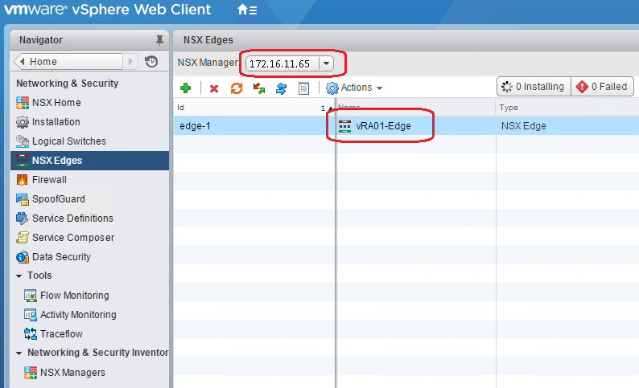

1.  Select the **Manage** tab, and then select **Load Balancer**.

2.  Click **Pools **in the **Navigator** pane, and then select the **vra-svr-443** server pool.

3.  Click **Edit.**

4.  The **Edit Pool** dialog box displays. Edit the following server pool settings.

<!-- -->

1.  Select **LEASTCONN** from the **Algorithm** drop down menu.

2.  Select **vra-svr-443-monitor **from the **Monitors** drop down menu.
    (Please refer to the table below for monitors setting for each server pool.)

| Pool Name          | Monitors                   |
|--------------------|----------------------------|
| vra-vpostgres-5432 | vra-vpostgres-5432-monitor |
| vra-svr-443        | vra-svr-443-monitor        |
| vra-iaas-web-443   | vra-iaas-web-443-monitor   |
| vra-iaas-mgr-443   | vra-iaas-mgr-443-monitor   |

> 

1.  Select **vra01svr01b**, and click **Edit**. The **Edit Member** dialog box displays. 

2.  Select the **Enable Member** check box.
    (Please refer to the table below for member options for each server pool.)

| Pool Name          | Member Name | IP address    | Enable Member check box |
|--------------------|-------------|---------------|-------------------------|
| vra-vpostgres-5432 | vra01svr01b | 192.168.11.52 | Deselect                |
| vra-svr-443        | vra01svr01b | 192.168.11.52 | Select                  |
| vra-iaas-web-443   | vra01iws01b | 192.168.11.55 | Select                  |
| vra-iaas-mgr-443   | vra01ims01b | 192.168.11.58 | Deselect                |

> 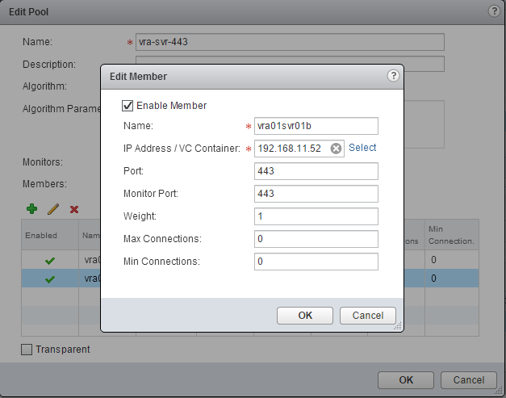

1.  Click **OK** to close the **Edit Member** dialog box.

2.  Click **OK to **close the **Edit Pool** dialog box.

<!-- -->

1.  Repeat Steps 7-9 for each server pool in your environment.
    The server pools and configuration settings are repeated in the table below for your convenience. 

| Pool Name          | Monitors                   | Member Name | IP address    | Enable Member check box |
|--------------------|----------------------------|-------------|---------------|-------------------------|
| vra-vpostgres-5432 | vra-vpostgres-5432-monitor | vra01svr01b | 192.168.11.52 | Deselect                |
| vra-svr-443        | vra-svr-443-monitor        | vra01svr01b | 192.168.11.52 | Select                  |
| vra-iaas-web-443   | vra-iaas-web-443-monitor   | vra01iws01b | 192.168.11.55 | Select                  |
| vra-iaas-mgr-443   | vra-iaas-mgr-443-monitor   | vra01ims01b | 192.168.11.58 | Deselect                |
| vra-identity-7444  | vra-identity-7444-monitor  | vra01ids01a | 192.168.11.46 | Select                  |

Install and Configure the vRealize Orchestrator Cluster (Region A)
------------------------------------------------------------------

*Install and Configure the vRealize Orchestrator Cluster* provides information and instructions about installing, upgrading and configuring VMware® vRealize Orchestrator.

This information is intended for advanced vSphere administrators and experienced system administrators who are familiar with virtual machine technology and datacenter operations.

**Prerequisites**

-   Install and configure vRealize Automation.

-   Create the vRealize Orchestrator Certificate file jssecacerts. See "Generate Certificates for vRealize Automation and vRealize Orchestrator."

-   Create an empty Microsoft SQL Server database for use with vRealize Orchestrator.  See "Create a SQL Server Database for vRealize Orchestrator."

**Procedure Overview**

-   Deploy the vRealize Orchestrator Virtual Appliances (Region A)

-   Configure Certificate and NTP for vRealize Orchestrator (Region A)

-   Configure Log Rotation by File Size in vRealize Orchestrator (Region A)

-   Install the NSX Plug-in for vRealize Orchestrator (Region A)

-   Configure Component Registry Authentication for the First vRealize Orchestrator (Region A)

-   Configure Cluster Mode for the First vRealize Orchestrator Server (Region A)

-   Import the Cluster Mode Configuration to the Second vRealize Orchestrator Server (Region A)

-   Configure Component Registry Authentication for the Second vRealize Orchestrator (Region A)

-   Enable Health Monitor and Verify Health Status (Region A)

    1.  ### Deploy the vRealize Orchestrator Virtual Appliances (Region A)

VMware® vRealize® Orchestrator™ is an automation and management engine that helps you to automate your cloud and integrate the VMware vCloud Suite with the rest of your management systems.

 You deploy two vRealize Orchestrator virtual appliances. Perform this procedure twice to deploy the two appliances, using the values for host A for the first appliance and the values for host B for the second appliance.

Prerequisites

Verify that your environment meets the following requirements.

-   vCenter Server (mgmt01vc01.sfo01.rainpole.local) is installed and running.

-   The host on which you are deploying the vRealize Orchestrator appliance has enough free disk space.

-   Download the vRealize Orchestrator virtual appliance OVF file from the VMware Web site and save it to your local file system (i.e. C:\\Temp).

Procedure

1.  In a Web browser, open the vSphere Web Client. 

<!-- -->

1.  Log in to **https://mgmt01vc01.sfo01.rainpole.local/vsphere-client**.

2.  Use the **administrator@vsphere.local** user name and the ***vcenter\_admin\_password*** password*.* 

<!-- -->

1.  Navigate to the **mgmt01vc01.sfo01.rainpole.local** vCenter Server object. 

2.  Right-click the **mgmt01vc01.sfo01.rainpole.local** object and select **Deploy OVF Template**.

3.  On the **Select source** page, select **Local file**, browse to the location of the vRealize Orchestrator Virtual Machine Template file on your file system, and click **Next**.

> 

1.  On the **Review details** page, examine the virtual appliance details, such as product, version, download and disk size, and click Next.

2.  On the **Accept License Agreements** page, accept the end user license agreements and click **Next**.

3.  On the **Select name and folder** page, type in the following information, and click **Next**.

| Setting                            | Host A                     | Host B                     |
|------------------------------------|----------------------------|----------------------------|
| **Name**                           | vra01vro01a.rainpole.local | vra01vro01b.rainpole.local |
| **Select a folder or data center** | vRA01                      | vRA01                      |

> 

1.  On the **Select a Resource** page, select cluster **SFO01-Mgmt01**. Click **Next**

2.  On the **Select storage** page, select the datastore.

<!-- -->

1.  By default, the virtual appliance disk is thin provisioned.  No need to adjust this. 

2.  From the **VM Storage Policy** drop-down menu, select **Virtual SAN Default Storage Policy**.

3.  From the datastore table, select the **SFO01A-VSAN01-MGMT01** Virtual SAN datastore.

4.  Click **Next**.

> 

 

1.  On the **Setup networks** page, select the distributed port group on the **vDS-Mgmt** distributed switch that ends with **vRA01-VXLAN**, and click **Next**.

2.  On the Customize template page, configure the network settings using the values in the table below. 

| Setting                                      | Host A                     | Host B                      |
|----------------------------------------------|----------------------------|-----------------------------|
| **Initial Root Password **                   | *hostA\_root\_pwd*         | *hostB\_root\_pwd*          |
| **Initial configuration interface password** | *hostA\_GUI\_pwd*          | *hostB\_GUI\_pwd!*          |
| **Enable SSH service in the appliance**      | Check                      | Check                       |
| **Hostname **                                | vra01vro01a.rainpole.local |  vra01vro01b.rainpole.local |
| **Default Gateway**                          | 192.168.11.1               | 192.168.11.1                |
| **DNS server**                               | 172.16.11.5,172.17.11.5    | 172.16.11.5,172.17.11.5     |
| **Network 1 IP address**                     | 192.168.11.44              | 192.168.11.45               |
| **Network 1 Netmask**                        | 255.255.255.0              | 255.255.255.0               |

> 

1.  Do not select **Power on after deployment**. Click Next.

2.  Review the **Ready to Complete** page and click **Finish**.

3.  After the deployment completes, increase Memory to 4 GB.

<!-- -->

1.  Select the vRealize Orchestrator virtual Machine deployed

2.  Right click **Edit Settings**.

3.  Select **Virtual Hardware**.

4.  Select **Memory** and change **RAM** to 4GB

> 

 

1.  Repeat the process for **Host B**, and power on both appliances.

    1.  ### Configure Certificate and NTP for vRealize Orchestrator (Region A)

You generate a server package signing certificate, which is used to sign the workflow package file when you export your vRealize Orchestrator workflow.

Prerequisites

-   vRealize Orchestrator has been successfully deployed.  See "Deploy the vRealize Orchestrator Virtual Appliances (Region A)".

-   The certificate for vRealize Orchestrator has been created, signed, and stored on the local file system.  "See Generate Certificates for vRealize Automation and vRealize Orchestrator".

Procedure

1.  Using the vSphere Web Client, open the vRealize Orchestrator home page for the host whose component registry you wish to configure.

| Setting                         | Host A                                   | Host B                                  |
|---------------------------------|------------------------------------------|-----------------------------------------|
| vRealize Orchestrator home page | https://vra01vro01a.rainpole.local:8281/ | https://vra01vro01b.rainpole.local:8281 |

1.  Click **Start Orchestrator Client**.

> 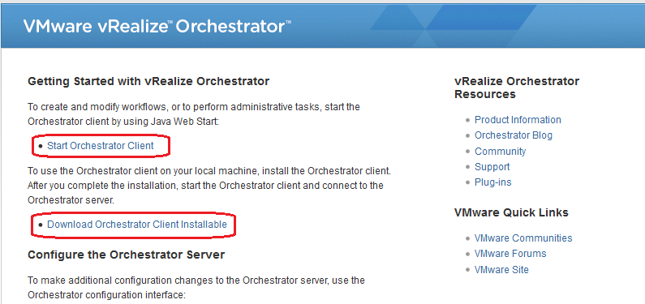

1.  Import the vRealize Orchestrator Certificate **vro\\jssecacerts** file.

> Copy the signed SSL certificate file jssecacerts to replace /etc/vco/app-server/security/jssecacerts in the vRealize Orchestrator appliance.
> .pscp .\\jssecacerts root@vra01vro01a.rainpole.local:/etc/vco/app-server/security/

1.  Change the owner of the keystore file to vco.

> chmod 600 /etc/vco/app-server/security/jssecacerts
>
> chown vco:vco /etc/vco/app-server/security/jssecacerts

1.  Using an SSH connection, log into the vRealize Orchestrator virtual appliance, and restart the vco-configurator and vco-server services.

> service vco-configurator restart && service vco-server restart

1.  Configure the NTP time server on the virtual appliance.

<!-- -->

1.  Using an SSH connection log into the virtual appliance. The host names for the appliances are vra01vro01a.rainpole.local and vra01vro01b.rainpole.local.

2.  Create a backup copy of the NTP time server configuration file (ntp.conf).

> cp /etc/ntp.conf /etc/ntp.conf.bk

1.  Open ntp.conf in a text editor, and modify the file as follows

> Replace the line server 127.127.1.0 \# local clock (LCL) with the lines shown below.
>
> server ntp.sfo01.rainpole.local iburst
>
> server ntp.lax01.rainpole.local iburst
>
> Comment out the line restrict ::1 using the pound symbol (\#):

\# restrict ::1

1.  Restart the NTP client.

> service ntp restart

1.  Verify your NTP configuration using the ntpq -p command.  This lists the NTP server hostname.

> ntpq -p

### Configure Log Rotation by File Size in vRealize Orchestrator (Region A)

This step is necessary for better performance of the vRO in a large scale deployment. We will be setting vRO logs to rotate by log file size rather than time intervals

**Prerequisites**

-   vRealize Orchestrator has been successfully deployed. See "Deploy the vRealize Orchestrator Virtual Appliances (Region A)."

Procedure

1.  Log into each of the vRealize Orchestrator virtual appliances using SSH as the user **root**.

| Setting                             | Host A                                   | Host B                                  |
|-------------------------------------|------------------------------------------|-----------------------------------------|
| **vRealize Orchestrator home page** | https://vra01vro01a.rainpole.local:8281/ | https://vra01vro01b.rainpole.local:8281 |

1.  Navigate to /etc/logrotate.d/.

2.  Edit the **vco.lr** file using the vi text editor

> vi vco.lr

1.  Create a new line and add the entry **size 100M** to specify a maximum file size of 100MB for the **catalina.out** log file. This sets the minimum file size detected before rotation occurs.

> /var/log/vmware/vco/app-server/catalina.out /var/log/vmware/vco/configuration/catalina.out {
>
> daily
>
> rotate 5
>
> dateext
>
> compress
>
> minsize 5M
>
> missingok
>
> nocreate
>
> notifempty
>
> sharedscripts
>
> copytruncate
>
> su vco vco
>
> size 100M
>
> }
>
> 

1.  Type :wq! to save the file and exit the editor.

> :wq!

1.  Configure a cron job to run **logrotate** based on a time interval. Type the command **crontab -e** to edit the crontab file, and enter the following new line in the **crontab**.

> crontab –e
>
> 5 \*/1 \* \* \* /usr/sbin/logrotate /etc/logrotate.d/vco.lr

This configures **logrotate** to run against the vRealize Orchestrator logs 5 minutes after the start of each hour.

> 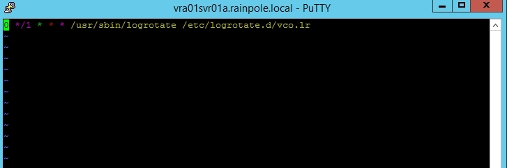

1.  Type **:wq!** to save the file and exit the **crontab** editor.

> :wq!

1.  Run the command **crontab -l** to confirm that you correctly entered the configuration information.

crontab -l

1.  Exit the SSH client.

2.  Close the SSH client.

    1.  ### Install the NSX Plug-in for vRealize Orchestrator (Region A)

Install the NSX Plugin for vRealize Orchestrator for each vRealize Orchestrator virtual appliance that will be part of your vRealize Orchestrator cluster.

You must perform this task twice to configure the NSX plugin for both of the vRealize Orchestrator virtual appliances. Repeat the below procedure for both Host A and Host B.

Table . NSX Plugin Settings

| Setting                             | Host A                                   | Host B                                  |
|-------------------------------------|------------------------------------------|-----------------------------------------|
| **Virtual appliance**               | vra01vro01a.rainpole.local               | vra01vro01b.rainpole.local              |
| **vRealize Orchestrator home page** | https://vra01vro01a.rainpole.local:8281/ | https://vra01vro01b.rainpole.local:8281 |
| **Username**                        | vmware                                   | vmware                                  |
| **Password**                        | *password for vmware*                    | *password for vmware*                   |

Prerequisites

-   Configure component registry authentication with vRealize Automation before you install the NSX plug-in. See "Configure Component Registry Authentication with vRealize Automation."

-   Download the NSX Plug-in for vRealize Orchestrator file and place it in a location that is accessible from the vRealize Orchestrator UI.

Procedure

1.  Using the vSphere WebCclient, open the vRealize Orchestrator home page for the host you wish to configure, and log in as the user **vmware**.

2.  Select **Plug**-**ins**.

3.  Click on the Search icon, select the NSX plug-in file, and click **Upload and install**.
    In this example, the plug-in file o11nplugin-nsx-1.0.2.vmoapp is for use with NSX 6.1 and NSX 6.2.

> 

1.  Accept the license agreement and verify that the NSX plugin will install when the server restarts.

> 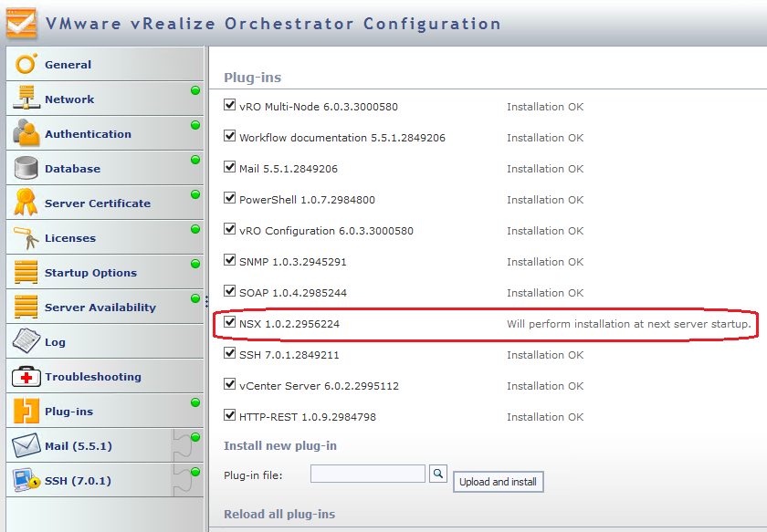

1.  Select **Startup Options**, and click **Restart** **service** to restart the vRealize Orchestrator service.

2.  Select Plug-ins, and verify that the NSX plug-in status is **Installation OK**.

> 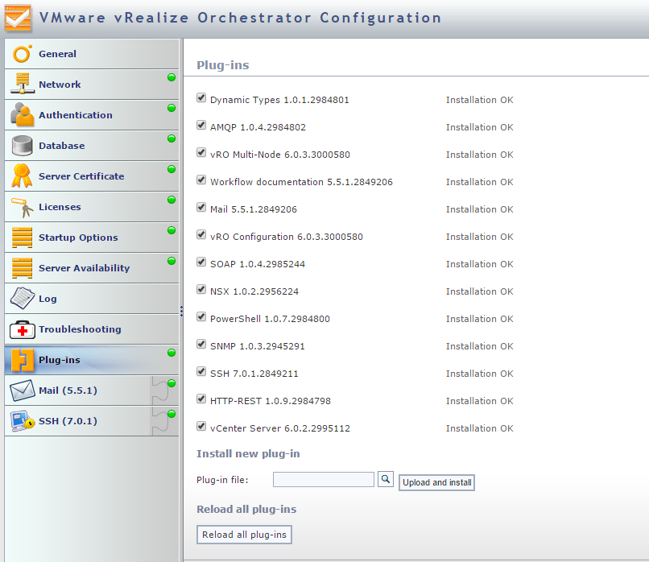

1.  Repeat the above procedure for the second vRealize Orchestrator virtual appliance, Host B (**vra01vro01b.rainpole.local**).

    1.  ### Configure Component Registry Authentication for the First vRealize Orchestrator (Region A)

After the NSX plugin is installed, the system administrator configures component registry authentication with vRealize Automation for the first vRealize Orchestrator. It is recommended to use component registry authentication mode when configuring vRealize Orchestrator as an external Orchestrator with a vRealize Automation system. This enables the usage of Single Sign-On authentication through vRealize Automation.

Prerequisites

-   Before configuring the component registry authentication, ensure that you have successfully deployed the vRealize Orchestrator virtual appliances. See "Deploy the vRealize Orchestrator Virtual Appliances."

-   Power on the  vRealize Orchestrator virtual appliances.

-   vRealize Orchestrator SSL certificates has be replaced. See "Configure Certificate and NTP for vRealize Orchestrator"

Start the Configuration Workflow for Component Registry Authentication on the virtual appliance.

Procedure

1.  Using the vSphere Web Client, open the vRealize Orchestrator home page **https://vra01vro01a.rainpole.local:8281**

2.  Click **Start Orchestrator Client**.

> 

1.  If the \*.jnlp does not start, click the Download Orchestrator Client Installable link, download the Windows Installer file, and run the installer.

<!-- -->

1.  Log in to the vRealize Orchestrator client with the following login credentials:

| Setting      | Value                           |
|--------------|---------------------------------|
| **Hostname** | vra01vro01a.rainpole.local:8281 |
| **Username** | vcoadmin                        |
| **Password** | vcoadmin                        |

> 

1.  Navigate to **Workflows &gt; Library &gt; Configuration &gt; Authentication &gt; Cafe** and start the **Register Orchestrator in vRealize Automation component registry** workflow with the settings below. Accept the default settings for any parameters that are not listed in the table below.

| Setting                                   | Value                                                 |
|-------------------------------------------|-------------------------------------------------------|
| **Component registry URL**                | https://vra01svr01.rainpole.local/component-registry/ |
| **Single Sign-On administrator user**     | administrator@vsphere.local                           |
| **Single Sign-On administrator password** | *vra\_administrator\_password*                        |
| **Orchestrator Administrator Group**      | vsphere.local\\vcoadmins                              |

> 

1.  Two certificate warnings display during the workflow execution. One for the vRealize Automation Identity server, the other for the vRealize Automation server.  These warnings are innocuous and just denote that these appliances do not share the same certificates or root certificates.  This will not negatively affect the registration.  Click **Next** to accept the certificate warnings.

> 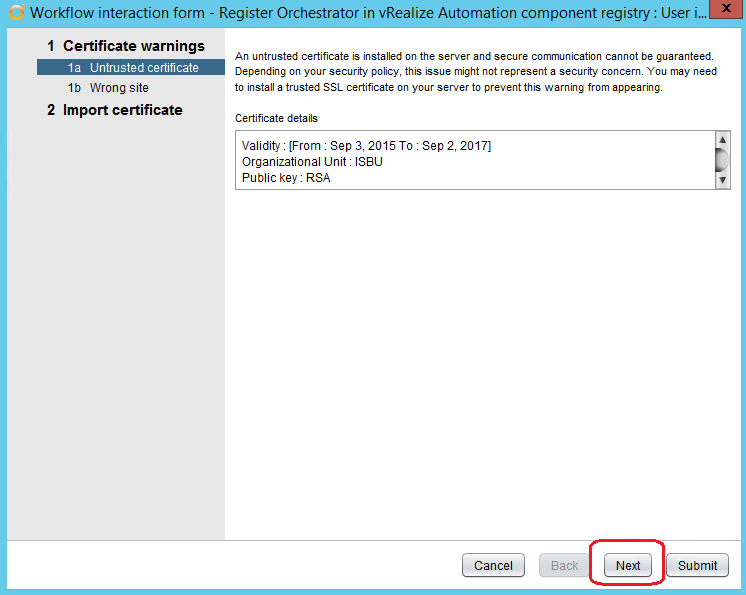

1.  Select **Yes** for **Import certificate anyway?** and click **Submit**.

> 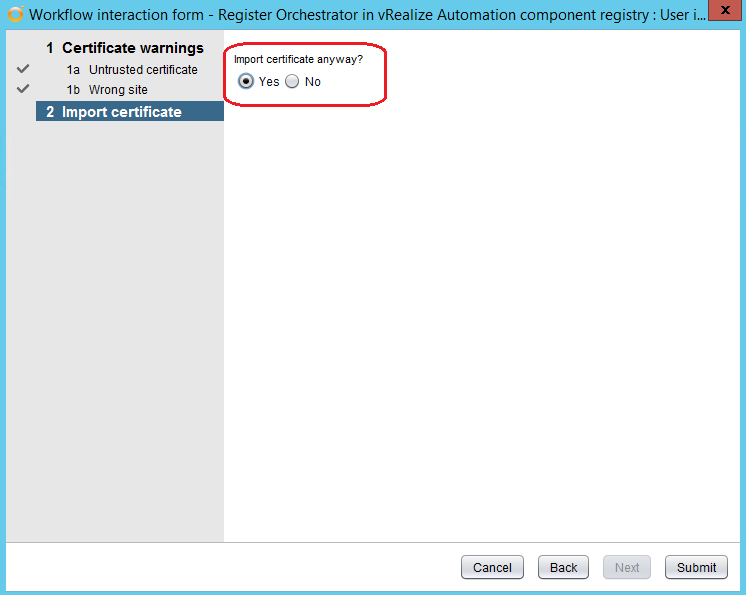

1.  Verify that the workflow completes successfully.

2.  Log in to the vRealize Orchestrator configuration portal **https://vra0vro01a.rainpole.local:8283** username **vmware**.

3.  Select the **Startup Options** tab and click **Restart service** to restart the vRealize Orchestrator service.

<!-- -->

1.  You must restart the service for any authentication configuration.

> 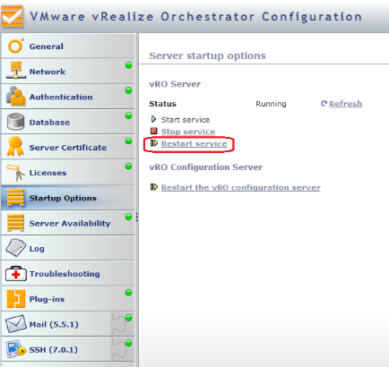

1.  After the service restarts, select **Authentication**. Verify the configuration settings you specified are active and correct.

<!-- -->

1.  It might take several minutes for the vRealize Orchestrator service to restart.

> 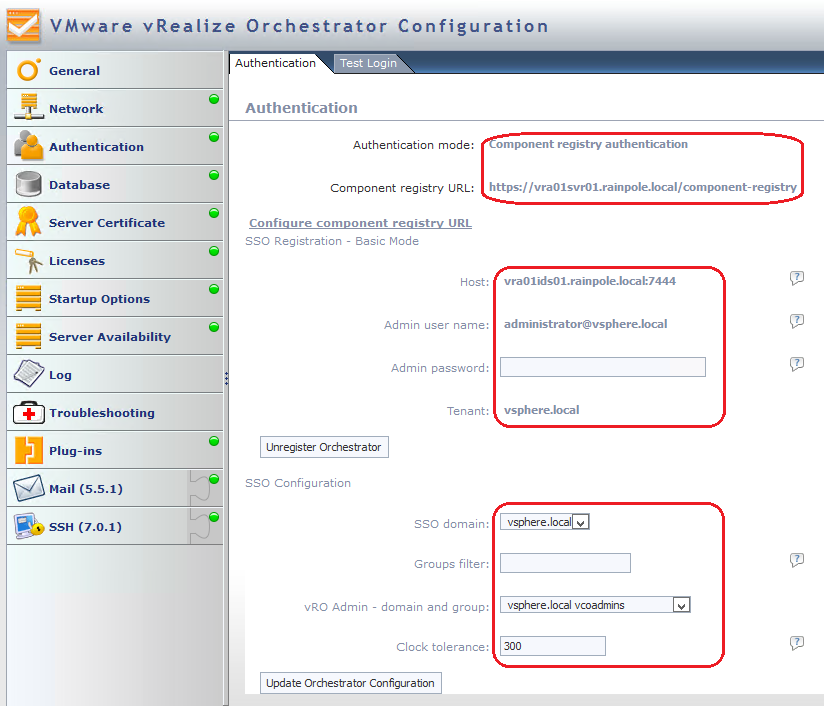

### Configure Cluster Mode for the First vRealize Orchestrator Server (Region A)

An essential component of all services offered by the SDDC is high availability to the end user.  To increase the availability of Orchestrator services, configure a cluster of vRealize Orchestrator server instances.

An Orchestrator cluster consists of at least two Orchestrator server instances that share one database.

Prerequisites

-   You must have installed and configured an empty SQL Server database. See "Configure SQL Server for use with vRealize Automation and vRealize Orchestrator".

-   Two vRealize Orchestrator appliances are successfully deployed and configured.

Procedure Overview

-   Configure the SQL Server Database for vRealize Orchestrator

-   Generate the Server Certificate

-   Configure the vRealize Orchestrator License

-   Reset All vRealize Orchestrator Plug-ins

-   Configure Cluster Mode

-   Export Configuration to Configure Second Node

    1.  #### Configure the SQL Server Database for vRealize Orchestrator

To correctly cluster Orchestrator services, you need to configure the database that you plan to use as a shared database to accept multiple connections, so that it can accept connections from the different Orchestrator instances.

Procedure

1.  Log in to the vRealize Orchestrator configuration portal for Host A (**https://vra0vro01a.rainpole.local:8283/vco-config**) with the username vmware.

| Setting                                        | Host A                                              |
|------------------------------------------------|-----------------------------------------------------|
| **vRealize Orchestrator configuration portal** | https://vra01vro01a.rainpole.local:8283/vco-config/ |
| **Username**                                   | vmware                                              |
| **Password**                                   | *password\_for\_vmware*                             |

1.  Select **Database**, configure the SQL Server database with the following settings, and click **Apply Changes**.

| Settings                                     | Value                                                                                       |
|----------------------------------------------|---------------------------------------------------------------------------------------------|
| **Database Type**                            | SQLServer                                                                                   |
| **User name**                                | svc-vro                                                                                     |
| **Password**                                 | *svc\_vro\_password*                                                                        |
| **Use SSL**                                  | No                                                                                          |
| **Database server IP or hostname**           | vra01mssql01.rainpole.local                                                                 |
| **Port**                                     | 1433                                                                                        |
| **Database Name**                            | VRODB-01                                                                                    |
| **Instance Name**                            | VRA01MSSQL01A                                                                               

                                                **Note:** Leave blank if the SQL Server is installed with the default server instance name.  |
| **Domain**                                   | rainpole.local                                                                              |
| **Use Windows authentication mode (NTLMv2)** | Yes                                                                                         |

> 

1.  Select **Create the database tables** to initialize the empty database.

> 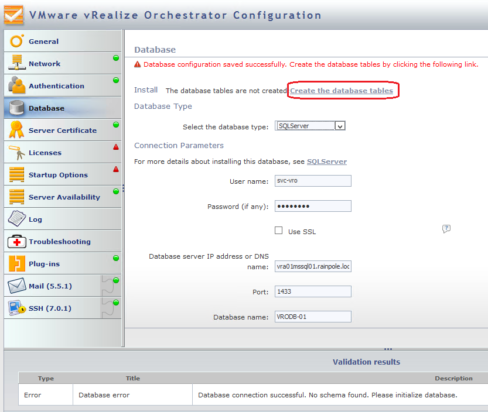

1.  Verify that the database initialization is successful.

> 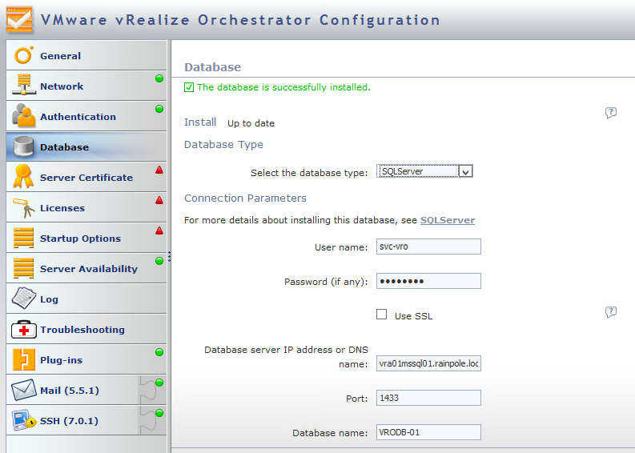

#### Generate the Server Certificate

vRealize Orchestrator utilizes two certificates.  One of those was previously created using an external Certificate Authority, and this procedure describes creating the second, self-signed certificate by the appliance.  You would have applied the other certificate in an earlier procedure.

Procedure

1.  Select **Server Certificate**, and click **Create a certificate database and self-signed server certificate**.

2.  In the Create a server certificate page, specify the following settings, and click Create.

| Setting                 | Value                     |
|-------------------------|---------------------------|
| **Common name**         | vra01vro01.rainpole.local |
| **Organization**        | VMware                    |
| **Organizational unit** | ISBU                      |
| **Country**             | United States (US)        |

> 

1.  Verify that the certificate generates successfully.

> 

#### Configure the vRealize Orchestrator License

Procedure

1.  Select **Network** &gt; **SSL Trust Manager**.

2.  In the **SSL Trust Manager** page, specify the following URL (the URL of the Platform Services Controller for Region A) in the **Import from URL** field and click Import.

> https://comp01psc01.sfo01.rainpole.local/

1.  Repeat the process for the following URL (the URL of the vCenter Server system for Region A) and click Import.

> https://comp01vc01.sfo01.rainpole.local/
>
> 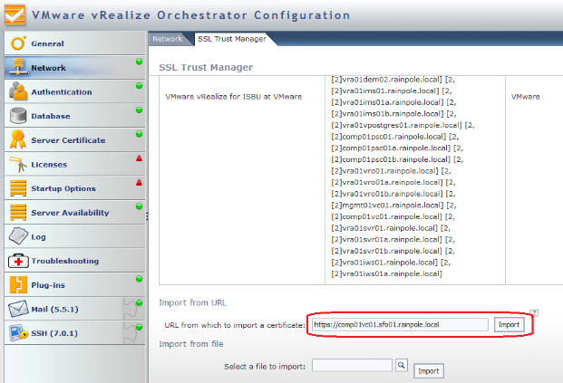

1.  Select **Licenses** on the left, specify the following values in the **vCenter Server Licenses** tab, and click **Apply Changes**.

| Method:            | Use vCenter Server license      |
|--------------------|---------------------------------|
| **Host**           | comp01vc01.sfo01.rainpole.local |
| **Port**           | 443                             |
| **Secure channel** | Yes                             |
| **Path**           | /sdk                            |
| **User name**      | svc-vro@rainpole.local          |
| **Password**       | svc\_vro\_password              |

> 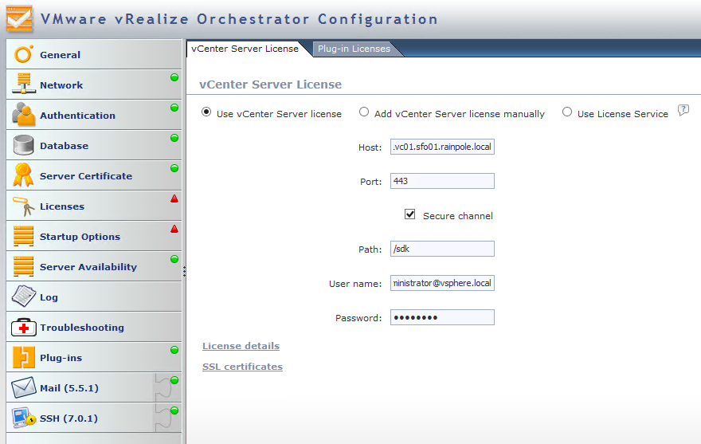

1.  Verify that the license import is successful, as shown in the following screen shot.

> 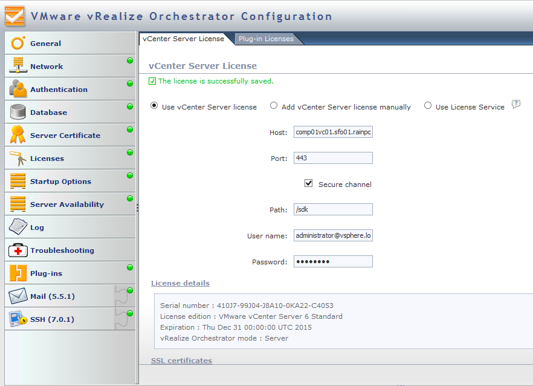

#### Reset All vRealize Orchestrator Plug-ins

After configuring the new SQL Server database, all vRealize Orchestrator plug-ins are invisible to vRealize Orchestrator, and cannot be used for workflow execution. To make the plug-ins available to vRealize Orchestrator, you can set up the environment to reinstall plug-ins when the server starts, and then restart the server.

Procedure

1.  On the left, select **Troubleshooting** and click **Reset current version** on the right.

> 

1.  On the left, select **Startup options** and click the **Restart service** link to restart the vRealize Orchestrator service. It can take several seconds for the service to restart.

2.  When restart of the vRealize Orchestrator service is complete, select **Plug-ins** on the left and verify that the vRealize Orchestrator plug-ins are visible and selected on the right, as shown in the following illustration.

> 

#### Configure Cluster Mode

To increase the availability of Orchestrator services, you can configure a cluster of Orchestrator server instances.

An Orchestrator cluster consists of at least two Orchestrator server instances that share one database.

Prerequisites

-   Configure the database that you plan to use as a shared database to accept multiple connections, so that it can accept connections from the different Orchestrator instances.

-   To prevent possible transactional deadlocks when the database is Microsoft SQL Server database, you must set the ALLOW\_SNAPSHOT\_ISOLATION and READ\_COMMITTED\_SNAPSHOT database options on.

-   Install and configure at least two identical Orchestrator server instances.

-   If you export the configuration of one Orchestrator server instance and import it to another Orchestrator server or if you clone the machine on which the Orchestrator server is running, you must type the credentials for the new Orchestrator server that you want to use to establish the connection to your vCenter Server instance. You can do this on the vCenter Server tab of the Orchestrator configuration interface.

-   Verify that the Orchestrator instances use the same database

-   Synchronize the clocks of the machines on which the Orchestrator server instances are installed.

Procedure

1.  Select **Server Availability**.

2.  Select the **Cluster mode** check box. If you have configured the Orchestrator server nodes properly, Orchestrator detects the other nodes when you select the check box.

3.  Configure cluster mode using the following settings and click Apply Changes.
    For those settings that do not have a value listed in the table below, use the default value.

| Setting                    | Value        |
|----------------------------|--------------|
| **Server Mode**            | Cluster Mode |
| **Number of Active Nodes** | 2            |

> 

1.  Select **Startup Options**, and click **Restart the Orchestrator configuration server**. 

2.  Select **Startup Options**, and click **Restart service** to restart the vRealize Orchestrator service.

    1.  #### Export Configuration to Configure Second Node

The Orchestrator configuration interface provides a mechanism to export the Orchestrator configuration settings to a local file. You can take a snapshot of your system configuration and import this configuration into a new Orchestrator instance.

Procedure

1.  Select **General** and click the **Export Configuration** tab.

2.  Leave the password field blank, and click **Export**.

> 

1.  Copy the exported vmoconfig file from the Region A vRealize Orchestrator server (vra01vro01a.rainpole.local) to your local machine.

    1.  ### Import the Cluster Mode Configuration to the Second vRealize Orchestrator Server (Region A)

This procedure is a continuation of the Cluster Mode Configuration process.  We are clustering vRealize Orchestrator to insure high availability of orchestration services.

Prerequisites 

You must configure the first instance of the vRealize Orchestrator server before you can import the configuration. See "Configure Cluster Mode for the First vRrealize Orchestrator Server."

Procedure

1.  Log into the second vRealize Orchestrator server configuration portal **https://vra0vro01b.rainpole.local:8283** with user **vmware** with the vRealize Orchestrator password.

2.  Click **General** on the left and select the **Import Configuration** tab.

3.  Select the **vmoconfig** file that you copied to your local machine when you were configuring Cluster Mode on the first server. 

4.  Uncheck **Override the current Orchestrator internal certificate and network settings** and click **Import**.

> 

1.  Wait for the configuration file to import successfully.

> 

1.  Select **Database** on the left, verify that the database server host name is **vra01mssql01.rainpole.local**, and verify that the database name is **VRODB-01**.

> 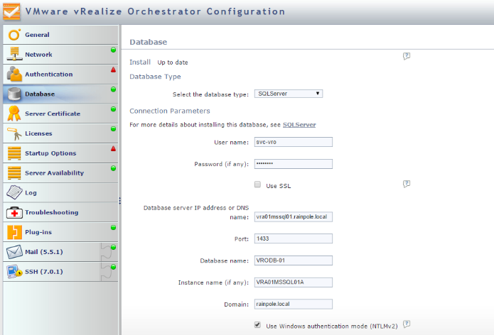

1.  Select **Authentication**. Select **LDAP Authentication** for Authentication Mode. Click **Apply Changes**. This step is required for configuring Component Registry Authentication for the second vRealize Orchestrator.

> 

1.  Select the **Startup Options** tab and click **Restart service** to restart the vRealize Orchestrator service. 

<!-- -->

1.  You must restart the service for any authentication configuration.

> 

### Configure Component Registry Authentication for the Second vRealize Orchestrator (Region A)

After the NSX plugin is installed, the system administrator configures component registry authentication with vRealize Automation for the second vRealize Orchestrator. It is recommended to use component registry authentication mode when configuring vRealize Orchestrator as an external Orchestrator with a vRealize Automation system. This enables the usage of Single Sign-On authentication through vRealize Automation.

Prerequisites

-   Before configuring the component registry authentication, ensure that you have successfully deployed the vRealize Orchestrator virtual appliances. See "Deploy the vRealize Orchestrator Virtual Appliances."

-   Power on the  vRealize Orchestrator virtual appliances.

-   vRealize Orchestrator SSL certificates has be replaced. See "Configure Certificate and NTP for vRealize Orchestrator"

-   vRealize Orchestrator cluster configuration has been imported. See "Import the Cluster Mode Configuration to the Second vRealize Orchestrator Server"

Start the Configuration Workflow for Component Registry Authentication on the virtual appliance.

1.  Using the vSphere Web Client, open the vRealize Orchestrator home page **https://vra01vro01b.rainpole.local:8281**.

2.  Click **Start Orchestrator Client**.

> 

1.  If the \*.jnlp does not start, click the Download Orchestrator Client Installable link, download the Windows Installer file, and run the installer.

<!-- -->

1.  Log in to the vRealize Orchestrator client with the following login credentials: 

| Setting      | Value                           |
|--------------|---------------------------------|
| **Hostname** | vra01vro01b.rainpole.local:8281 |
| **Username** | vcoadmin                        |
| **Password** | vcoadmin                        |

> 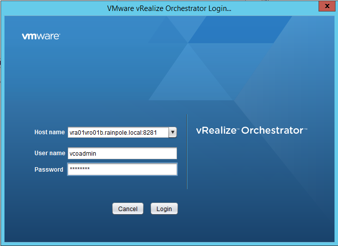

1.  Navigate to **Workflows &gt; Library &gt; Configuration &gt; Authentication &gt; Cafe** and start **the Register Orchestrator in vRealize Automation component registry** workflow with the settings below. Accept the default settings for any parameters that are not listed in the table below.

| Setting                                   | Value                                                 |
|-------------------------------------------|-------------------------------------------------------|
| **Component registry URL**                | https://vra01svr01.rainpole.local/component-registry/ |
| **Single Sign-On administrator user**     | administrator@vsphere.local                           |
| **Single Sign-On administrator password** | *password for administrator@vsphere.local*            |
| **Orchestrator Administrator Group**      | vsphere.local\\vcoadmins                              |

> 

1.  Two certificate warnings display during the workflow execution. One for the vRealize Automation Identity server, the other for the vRealize Automation server.  These warnings are innocuous and just denote that these appliances do not share the same certificates or root certificates.  This will not negatively affect the registration.  Click **Next** to accept the certificate warnings.

> 

1.  Select **Yes for Import certificate anyway?** and click **Submit**.

> 

1.  Verify that the workflow completes successfully.

2.  Log in to the vRealize Orchestrator configuration portal **https://vra0vro01b.rainpole.local:8283** with username vmware.

3.  Select the **Startup Options** tab and click **Restart service** to restart the vRealize Orchestrator service.

<!-- -->

1.  You must restart the service for any authentication configuration.

> 

1.  When the service restarts, select Authentication. Verify the configuration settings you specified are active and correct.

<!-- -->

1.  It might take several minutes for the vRealize Orchestrator service to restart.

> 

1.  Select **Server Availability** on the left, and verify that **Cluster mode** is selected and Number of Active nodes is set to 2. Click **Apply changes**.  

2.  Wait for a few seconds. Refresh the page by clicking **Server Availability**. Verify that both vRealize Orchestrator nodes are running.

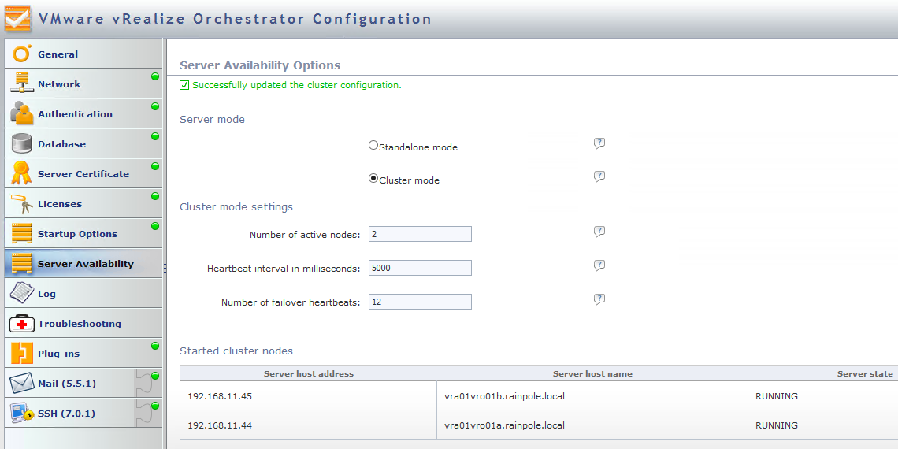

### Enable Health Monitor and Verify Health Status (Region A)

Previously, it was necessary to suspend the health monitors to successfully install and configure vRealize Orchestrator.  This procedure guides you through re-enabling those health monitors and verifying that health of the system.

Procedure

1.  Using the vSphere Web Client, Select **Networking & Security**.

2.  In the **Navigator** on the left, select **NSX Edges**.

3.  Select the **NSX Manager**, in this example, the NSX Manager with IP address **172.20.11.65**, and double click **vRA01-Edge**.

> 

1.  Select the **Manage tab** and the **Load Balancer** subtab.

2.  Click on **Pools** on the left.

3.  Click on **vra-vro-8281**.

4.  Click on **Edit**.

<!-- -->

1.  Select "**LEASTCONN**" for Algorithm.

2.  Select "**vra-vro-8281-monitor**" for Monitors.

>  

1.  Click **OK**.

2.  Click **Show Pool Statistics**. Verify Member Status of both vRealize Orchestrator Servers is **UP**.

> 

Create Anti-Affinity Rules for vRealize Automation and vRealize Orchestrator Virtual Machines (Region A)
--------------------------------------------------------------------------------------------------------

After deploying the vRealize Automation and vRealize Orchestrator appliances, set up anti-affinity rules. A VM-Host anti-affinity (or affinity) rule specifies a relationship between a group of virtual machines and a group of hosts. Anti-affinity rules force specified virtual machines to remain apart during failover actions, and are a requirement for high availability.

Prerequisites

-   vRealize Automation is successfully deployed and running. See Install vRealize Automation in Region A.

-   vRealize Orchestrator is successfully deployed and running. See Install and Configure the vRealize Orchestrator Cluster.

-   Create the virtual machines to which the VM-Host anti-affinity rules apply.

Procedure

1.  Open a Web browser and go to **https://mgmt01vc01.sfo01.rainpole.local/vsphere-client.**

2.  Login as **administrator@vsphere.local**.

3.  Navigate to **Home** and select **Hosts and Clusters**.

4.  Select the **SFO01Mgmt01 **cluster where the vRealize Automation and vRealize Orchestrator virtual machines are running.

5.  Click the **Manage** tab**.**

6.  Click **Settings**,** **expand the **Configuration** menu, and select **VM/Host Rules**.

> 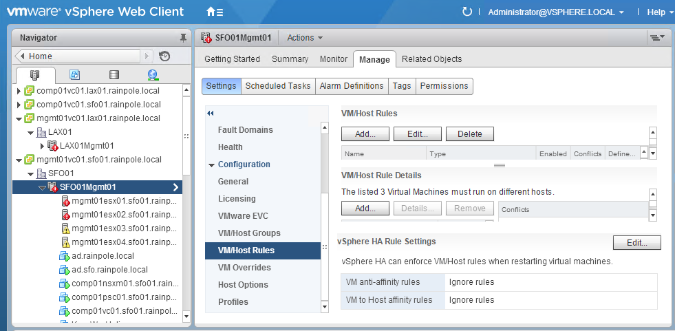

1.  Click **Add** to create a virtual machine anti-affinity rule. Repeat the following series of steps to create six unique anti-affinity rules for the virtual machines listed in the Member column of the table below.

| Name    | Enable rule | Type                      | Member                                                 |
|---------|-------------|---------------------------|--------------------------------------------------------|
| vra-svr | Checked     | Separate Virtual Machines | vra01svr01a.rainpole.local, vra01svr01b.rainpole.local |
| vra-iws | Checked     | Separate Virtual Machines | vra01iws01a.rainpole.local, vra01iws01b.rainpole.local |
| vra-ims | Checked     | Separate Virtual Machines | vra01ims01a.rainpole.local, vra01ims01b.rainpole.local |
| vra-dem | Checked     | Separate Virtual Machines | vra01dem01.rainpole.local, vra01dem02.rainpole.local   |
| vra-ias | Checked     | Separate Virtual Machines | vra01ias01.rainpole.local, vra01ias02.rainpole.local   |
| vra-vro | Checked     | Separate Virtual Machines | vra01vro01a.rainpole.local, vra01vro01b.rainpole.local |

1.  In the **Name** field type the name to identify the anti-affinity rule. For example, type **vra-svr**.

2.  Select the **Enable rule** check box.

3.  Select **Separate Virtual Machines** from the **Type** drop down menu.

4.  Click **Add**.

5.  Select the **vra01svr01a.rainpole.local** and **vra01svr01b.rainpole.local** virtual machines.
    In this procedure we apply anti-affinity rules to both the vRealize Automation and vRealize Orchestrator virtual machines simultaneously. 

6.  Click **OK.**

> 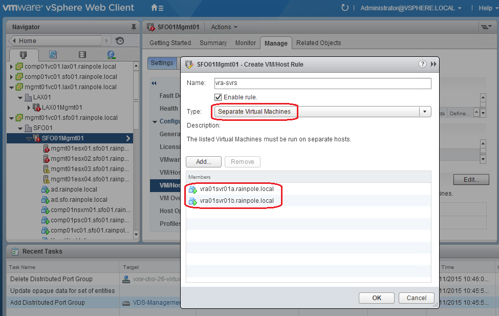

1.  For each of the remaining anti-affinity rules, repeat the steps below the table to add the rule to the vRealize Automation and vRealize Orchestrator virtual machines.

    1.  Create a vRealize Automation Tenant (Region A)
        ----------------------------------------------

Tenants represent groups of users, business units in an enterprise, or individual companies that subscribe to cloud services from a service provider. Tenants share common access with specific privileges to a software instance, and are the end users of vRealize Automation. 

Prerequisites

-   Deploy vRealize Automation and vRealize Orchestrator, start both applications, and verify that they are running. See "Install vRealize Automation (Region A)" and "Install and Configure the vRealize Orchestrator Cluster (Region A)".

-   Active Directory is available as an identity source for vRealize Automation. See "Install vRealize Automation (Region A)".

-   You have the necessary users and groups for use by vRealize Automation. See "Active Directory Users and Groups".

-   One email account ready for configuring vRealize Automation event notifications.

Procedure Overview

-   Configure an Identity Store for the Default Tenant (Region A)

-   Create the Rainpole Tenant (Region A)

-   Brand the Tenant Login Pages (Region A)

-   Configure the Default Email Servers  (Region A)

-   Configure vRealize Orchestrator Server (Region A)

    1.  ### Configure an Identity Store for the Default Tenant (Region A)

Configure an identity store for use by vRealize Automation. vRealize Automation uses identity stores to authenticate users. Each tenant is associated with at least one identity store when it is created, but you can add new ones if necessary.

Procedure

1.  Navigate to the vRealize Automation console using its fully qualified domain name, **https://vra01svr01.rainpole.local/vcac**.

2.  Log into the vRealize Automation console with the username **administrator@vsphere.local** and the ***vra\_administrator\_password*** password you specified when the appliance was deployed.

3.  By default, the vRealize Automation console opens to the **Tenants** panel (**Administration &gt; Tenants**).

4.  Click the default tenant name **vsphere.local**.

> 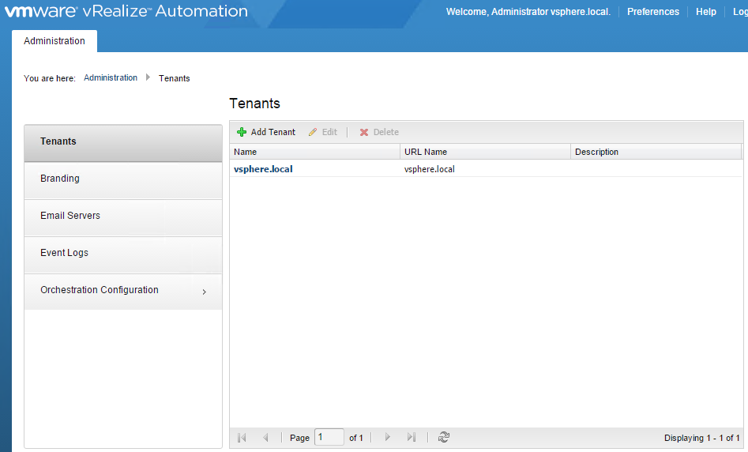

1.  Click the **Identity Stores** tab.

2.  In the **Identity Stores** panel, click **Add Identity Store** and configure the identity store for the default tenant.

> 

1.  Type the following Active Directory settings in the corresponding text boxes for the identity store. Leave all other text boxes with their default settings intact.

| Setting | Value                   |
|---------|-------------------------|
| Type    | Native Active Directory |
| Domain  | rainpole.local          |

1.  Click **Add**.

2.  Verify that the **rainpole.local** identity store was successfully created and associated with the tenant, and click **Update**.

> 

### Create the Rainpole Tenant (Region A)

The vRealize Automation Identity Server provides Single-Sign On (SSO) capability for vRealize Automation users. SSO is an authentication broker and security token exchange that interacts with the enterprise identity store (Active Directory or OpenLDAP) to authenticate users. As the system administrator, you configure SSO to provide access to vRealize Automation by the *Rainpole tenant*. The Rainpole tenant is the tenant (the users) through which you manage system-wide configuration, including global system defaults for branding and notifications, and monitor system logs.

Procedure

1.  Navigate to the **vRealize Automation Identity Server management console** using its fully qualified domain name, [**https://vra01svr01.rainpole.local/vcac**](https://vra01svr01.rainpole.local/vcac).

2.  Log into the **vRealize Automation Identity Server management console **with the username **administrator@vsphere.local**. Use the ***vRA\_administrator\_password*** password you specified when the appliance was deployed.

3.  By default, the **vRealize Automation management console** opens to the **Tenants** panel (**Administration** &gt; **Tenants**). Click **Add Tenant**.

> 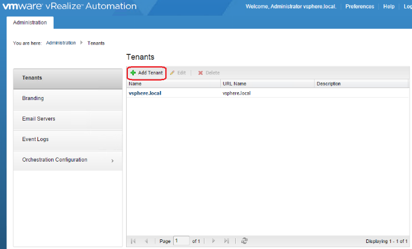

1.  Select the **General** tab, and type the following information in the corresponding text boxes to identify the Rainpole tenant. 

| **Setting**       | **Value**                    |
|-------------------|------------------------------|
| **Name**          | Rainpole                     |
| **URL Name**      | rainpole                     |
| **Contact email** | administrator@rainpole.local |

>  

1.  Click **Submit and Next**.

2.  In the **Identity Stores** tab, click **Add Identity Store** and configure the identity store for the Rainpole Tenant.

> 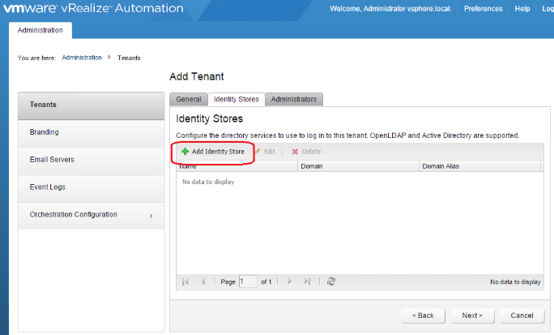

1.  Type the following Active Directory settings in the corresponding text boxes for the identity store. Leave all other text boxes with their default settings intact.

| Setting                  | Value                                    |
|--------------------------|------------------------------------------|
| **Name**                 | rainpole.local                           |
| **Type**                 | Active Directory                         |
| **URL**                  | ldap://rainpole.local:389                |
| **Domain**               | rainpole.local                           |
| **Login user DN**        | CN=svc-vra,CN=Users,DC=rainpole,DC=local |
| **Group search base DN** | DC=rainpole,DC=local                     |

> 

1.  Click **Test Connection** to verify that the identity store connection is available. 

2.  Click **Add**.

3.  Verify that the **rainpole.local** identity store was successfully created and associated with the tenant, and then click **Next** to proceed to the **Administrators** tab.

> 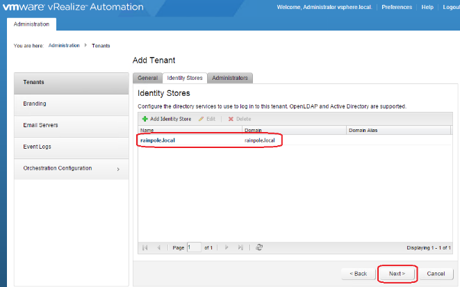

1.  Appoint tenant and infrastructure administrators.

<!-- -->

1.  Enter ug-**ITAC-TenantAdmins** in the **Tenant Administrators** search text box and press **Enter**. 

2.  Enter ug-**ITAC-TenantAdmins** in the **Infrastructure Administrators **search text box and press **Enter**.

3.  Verify that the ug-**ITAC-TenantAdmins** group name appears in the **Tenant Administrators** and **Infrastructure Administrators** lists.

4.  Click **Add**.

> 

1.  Verify that you have successfully created the Rainpole tenant.

> 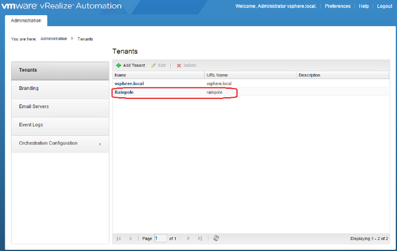

### Brand the Tenant Login Pages (Region A)

You can apply custom branding on a per customer level to the vRealize Automation tenant login pages. System administrators control the default branding for all tenants. As a tenant administrator, you can change the branding of the portal including the logo, the background color, and the information in the header and footer. If the branding for a tenant is changed, a tenant administrator can always revert back to the system defaults.

Procedure

1.  If you have not already done so, navigate to the **vRealize Automation management console** using its fully qualified domain name, [**https://vra01svr01.rainpole.local/vcac**](https://vra01svr01.rainpole.local/vcac).

<!-- -->

1.  This is the management console you accessed in the previous task, "Create the Rainpole Tenant.["](https://confluence.eng.vmware.com/display/ITAC10/Create+the+Rainpole+Tenant)

<!-- -->

1.  Log into the **vRealize Automation management console** as the administrator, with the username [**administrator@vsphere.local**](mailto:administrator@vsphere.local). Use the ***vra\_administrator\_password* **password you specified when the appliance was deployed.

2.  Navigate to **Administration** &gt; **Branding**, and** **deselect the** Use default** check box.

3.  Select the **Header** tab, and** **type the following settings in the corresponding text boxes for the header banding. Leave all other settings with their default values.

| Setting                  | Value                         |
|--------------------------|-------------------------------|
| **Company Name**         | Rainpole                      |
| **Product Name**         | Infrastructure Service Portal |
| **Background hex color** | *3989C7*                      |
| **Text hex color**       | *FFFFFF*                      |

> 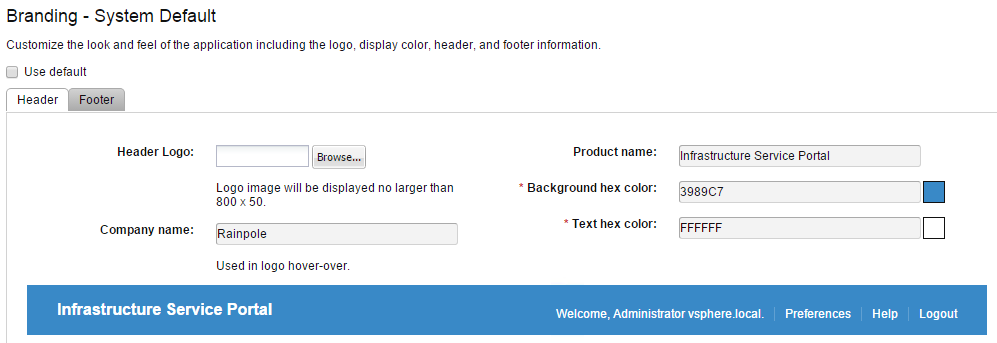

 

1.  Click the **Footer** tab and** **type the following settings in the corresponding text boxes for the footer banding. Click **Update**.

| Setting                 | Value                                   |
|-------------------------|-----------------------------------------|
| **Copyright notice**    | Copyright Rainpole. All Rights Reserved |
| **Privacy policy link** | https://www.rainpole.local              |
| **Contact link**        | https://www.rainpole.local/contact      |

 

Refresh the Web page, and verify that it is appropriately branded according to the settings you entered.

Result

The login console now uses the customized Rainpole branding.

### Configure the Default Email Servers (Region A)

System administrators configure inbound and outbound email servers to handle email notifications about events involving tenants' machines.  You can create only one of each of these servers, which appears as the default for all tenants. If tenant administrators do not override these settings before enabling notifications, vRealize Automation uses the globally configured email server.

Procedure

1.  If you have not already done so, navigate to the **vRealize Automation management console** using its fully qualified domain name, [**https://vra01svr01.rainpole.local/vcac**](https://vra01svr01.rainpole.local/vcac).

2.  Log into the **vRealize Automation management console** as the administrator, with the username **administrator@vsphere.local**. Use the ***vra\_administrator\_password*** password you specified when the appliance was deployed.

3.  Navigate to **Administration** &gt; **Email Servers**, and click **Add**.

> 

1.  Select the **Email - Inbound** check box and click **OK**.

> 

1.  Type the inbound email settings into the corresponding text boxes and select the check box shown in the table below. Click **Test Connection** to verify that the settings are correct, and click **Add** to save the settings.

| Value             | Setting                        |
|-------------------|--------------------------------|
| **Name**          | Rainpole-Inbound               |
| **Protocol**      | Select the **I**MAP check box  |
| **Server Name**   | email.rainpole.local           |
| **Server Port**   | 143                            |
| **Folder Name**   | INBOX                          |
| **User Name**     | administrator@rainpole.local   |
| **Password**      | *vra\_administrator\_password* |
| **Email Address** | itac@rainpole.local            |

> 

1.  Navigate to **Administration** &gt; **Email Servers** and click **Add**. 

2.  Select the **Email - Outbound** check box and click **OK**.

3.  Type the outbound email settings into the corresponding text boxes and select the check box shown in the table below. Click **Test Connection** to verify that the settings are correct, and click **Add** to save the settings.

| Value              | Setting                           |
|--------------------|-----------------------------------|
| **Name**           | Rainpole-Outbound                 |
| **Server Name**    | email.rainpole.local              |
| **Server Port**    | 25                                |
| **Authentication** | Select the **Required** check box |
| **User Name**      | administrator@rainpole.local      |
| **Password**       | *vra\_administrator\_password*    |
| **Sender Address** | itac@rainpole.local               |

> 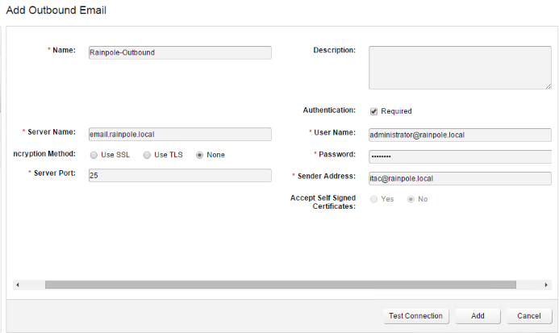

 

### Configure vRealize Orchestrator Server (Region A)

vRealize Orchestrator is an automation and management engine that helps integrate vRealize Automation with the rest of your management systems. If you are using vRealize Automation workflows to call vRealize Orchestrator workflows, you must configure the vRealize Orchestrator as an endpoint.

Procedure

1.  If you have not already done so, navigate to the **vRealize Automation management console** using its fully qualified domain name, [**https://vra01svr01.rainpole.local/vcac**](https://vra01svr01.rainpole.local/vcac).

2.  Log into the **vRealize Automation management console** as the system administrator, with the username [**administrator@vsphere.local**](mailto:administrator@vsphere.local). Use the ***vRA\_administrator\_password*** password you specified when the appliance was deployed.

3.  Navigate to **Administration** &gt; **Orchestration Configuration** &gt; **Server Configuration**. 

4.  In the **Server Configuration** pane, select the **Use an external Orchestrator Server** check box.

5.  Type the following vRealize Orchestrator server configuration settings into the corresponding text boxes in the **Server Configuration** pane.

| Setting            | Value                     |
|--------------------|---------------------------|
| **Name**           | vra01vro01.rainpole.local |
| **Host**           | vra01vro01.rainpole.local |
| **Port**           | 8281                      |
| **Authentication** | Single-Sign On            |

> 

1.  Click **Test Connection** and verify that you can successfully connect to the vRealize** **Orchestrator server. 

2.  Click **Update** to save the settings.

3.  Click **OK** to accept the warning message. 

4.  Verify that the server configuration has successfully updated.

> 

 

Configure a vRealize Automation Tenant (Region A)
-------------------------------------------------

Once you create the vRealize Automation tenant, you provide a license key and specify configuration settings to enable the tenant to function within your environment.

Prerequisites

-   vRealize Automation License

-   Active Directory is available as an identity source for vRealize Automation. See "Install vRealize Automation (Region A)".

-   You have the necessary users and groups for use by vRealize Automation. See "Active Directory Users and Groups".

-   Rainpole Tenant has been created. See "Create a vRealize Automation Tenant (Region A)".

Procedure Overview

-   Provide the Infrastructure License (Region A)

-   Configure User Roles (Region A)

-   Configure the vRealize Orchestrator Administrator Group (Region A)

-   Create a vRealize Orchestrator Endpoint (Region A)

-   Create Fabric Groups (Region A)

-   Configure Machine Prefixes (Region A)

-   Create Business Groups (Region A)

-   Create Reservation Policies (Region A)

    1.  ### Provide the Infrastructure License (Region A)

After installation, the IaaS administrator logs into the vRealize Automation console and provides a license for the Infrastructure components.

Procedure

1.  Using a Web browser, open the **vRealize Automation management console** for the Rainpole tenant using its fully qualified domain name, **https://vra01svr01.rainpole.local/vcac/org/rainpole.**

2.  Log into the **vRealize Automation management console **with the username ITAC-TenantAdmin@rainpole.local. This is the IaaS administrator role for the Rainpole tenant. Use the ***rainpole\_admin\_password** *password.

<!-- -->

1.  If you are already logged into the console as another user, log out, and then log back in using the IaaS administrator credentials for the Rainpole tenant. 

<!-- -->

1.  Click the **Infrastructure **tab.

2.  Navigate to **Administration **&gt; **Licensing**.

3.  Click **Add License**. 

4.  Enter the VMware license code in the **License key** text box, and click **OK**.

5.  Verify that your license key displays in the **License Information** table.

> 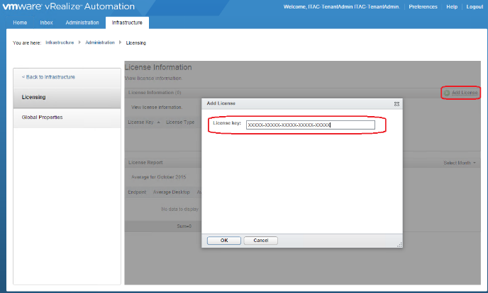

### Configure User Roles (Region A)

Roles consist of a set of privileges that can be associated with users to determine what tasks they can perform. Based on their responsibilities, individuals might have one or more roles associated with their user account. All user roles are assigned within the context of a specific tenant. However, some roles in the default tenant can manage system-wide configuration that applies to multiple tenants.

In this procedure you assign roles to the ug-ITAC-TenantAdmins and ug-ITAC-TenantArchitects users and groups.

Procedure

1.  Select the **Administration** tab.

2.  Navigate to **Users & Groups** &gt; **Identity Store Users & Groups**. 

3.  Enter the name **ug-ITAC-TenantAdmins **in the **Tenant Administrators** search box and press **Enter**. This lists all of the **ug-ITAC-TenantAdmins** users and groups. 

> 
> In the **Details** tab, click the user group name **ug-ITAC-TenantAdmins**. 

1.  In the **Add Roles to this Group** item list, select the **Approval Administrator**, **IaaS Administrator**, **Service Architect**,** **and **Tenant Administrator **check boxes. 

2.  Click **Update**.

> 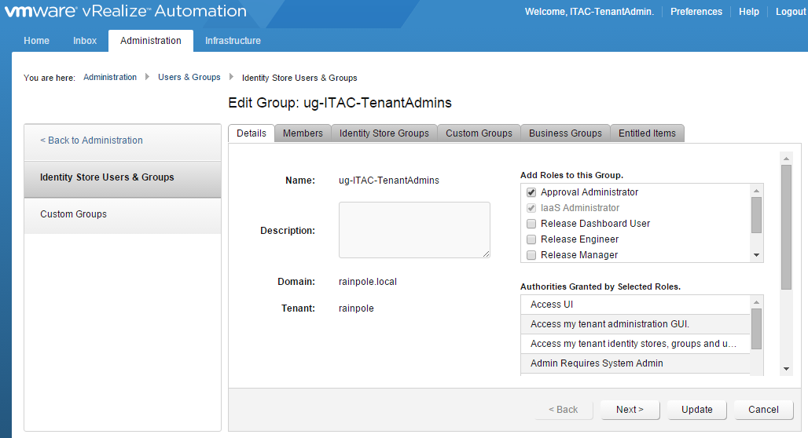

1.  Enter the name **ug-ITAC-TenantArchitects **in the **Tenant Administrators** search box and press **Enter**. This lists the ug-**ITAC-TenantArchitects** group. 

2.  In the **Details** tab, click the user group name **ug-ITAC-TenantArchitects**. 

3.  In the **Add Roles to this Group** item list, select the **Service Architect** check box. 

4.  Click **Update**.

    1.  ### Configure the vRealize Orchestrator Administrator Group (Region A)

You configure SSO authentication for the vRealize Orchestrator administrator user group. This allows administrative users to more easily log into vRealize Orchestrator and vRealize Automation using a user name and password to specifically for the cloud management components.

Procedure

1.  Enter the following URL in a Web browser, **https://vra0vro01a.rainpole.local:8283**, and navigate to the vRealize Orchestrator configuration portal.

2.  Log in with the username **vmware**.

3.  Select **Authentication**, and in the **SSO Configuration** section of the page, enter the following settings from the following table.

| Setting                          | Value                       |
|----------------------------------|-----------------------------|
| **SSO domain**                   | rainpole.local              |
| **Groups filter**                | Leave blank                 |
| **vRO Admin - domain and group** | rainpole.local ug-vROAdmins |
| **Clock tolerance**              | 300                         |

> 

1.  Click **Update Orchestrator Configuration**, and verify that the SSO configuration is successfully saved.

> 

1.  Select **Startup Options**, and click **Restart service**.

> 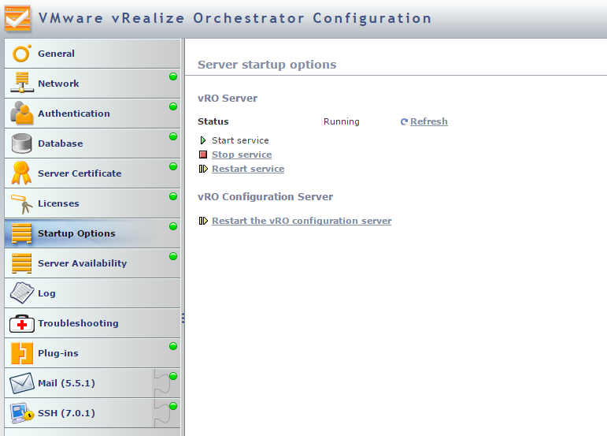

1.  Wait for the server to restart.

2.  Enter the URL **https://vra01vro01a.rainpole.local:8281** in a Web browser to open the vRealize Orchestrator console.

3.  Click **Start Orchestrator Client**.

> 

1.  If the \*.jnlp does not start, click the **Download Orchestrator Client Installable** link, download the Windows Installer file, and run the installer.

<!-- -->

1.  Verify that you can log into vRealize Orchestrator using the following login credentials.

| Setting      | Value                           |
|--------------|---------------------------------|
| **Hostname** | vra01vro01a.rainpole.local:8281 |
| **Username** | svc-vra@rainpole.local          |
| **Password** | svc\_vra\_password              |

> 

1.  Repeat the above steps for the other vRealize Orchestrator server, **vra0vro01b.rainpole.local**.

    1.  ### Create a vRealize Orchestrator Endpoint (Region A)

IaaS administrators are responsible for creating the endpoints that allow vRealize Automation to communicate with your infrastructure. You create a vRealize Orchestrator endpoint for use by Realize Automation to communicate workflows.

Procedure

1.  If you have not already done so, navigate to the vRealize Automation management** console** using its fully qualified domain name, **https://** **vra01svr01.rainpole.local/vcac/org/rainpole.**

2.  Log into the **vRealize Automation management console** as the vRealize Automation tenant administrator, with the username **ITAC-TenantAdmin@rainpole.local**.

3.  Navigate to **Infrastructure** &gt; **Endpoints** &gt; **Credentials**. 

4.  Click **New Credentials**.

5.  Type the credentials in the **User name and Password** text boxes.

6.  Create a credential for the vRealize Orchestrator administrator.

<!-- -->

1.  Type **vro admin** in the **Name** text box.

2.  Type **Administrator of vra01vro01** in the **Description** text box.

3.  Type **svc-vra@vsphere.local** in the **User name** text box, and the svc-vra\_password password in the **Password **text box.

4.  Click the **Save** icon (green checkmark**)** to save the credential.

> 
>
>  

1.  Navigate to **Infrastructure** &gt; **Endpoints** &gt; **Endpoints**. 

2.  Click **New Endpoints** &gt; **Orchestration** &gt; **vCenter Orchestrator**.

3.  Create a vRealize Orchestrator endpoint.

<!-- -->

1.  Type **vra01vro01.rainpole.local** in the **Name** text box.

2.  Type **https://vra01vro01.rainpole.local/vco** in the **Address **text box.

3.  Type **vro admin** in the **Credentials **text box.

4.  In the **Custom properties** section, click **New Property**.

5.  Type **VMware.VCenterOrchestrator.Priority** in the **Name** column. Specify **1** in the **Value** column. Leave the checkbox unchecked in the **Encrypted** column. Click the **Save** icon (green checkmark).

6.  Click **OK** to save the vRealize Orchestrator endpoint configuration.

> 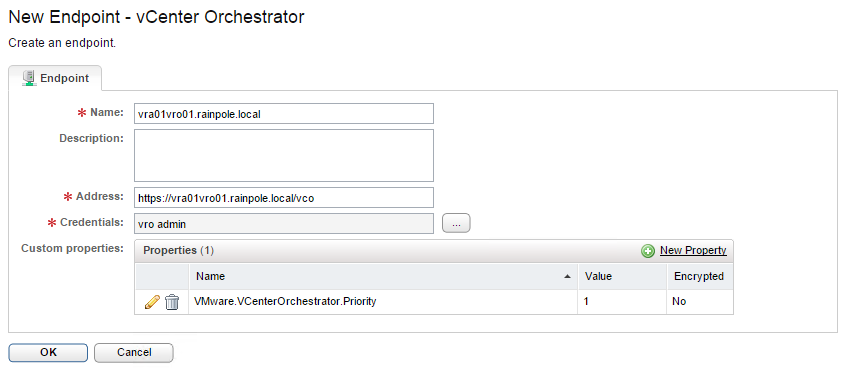

1.  Verify that the vRealize Orchestrator endpoint creates successfully.

2.  Point to the vRealize Orchestrator endpoint** **in the **Endpoints** list (hover the mouse pointer over the** vRealize Orchestrator Endpoint** label), and select **Data Collection**.

> 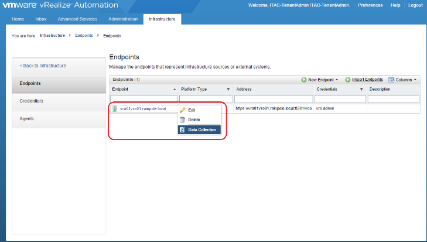

1.  Click **Start**. The vRealize Orchestrator data collection starts. Wait several minutes for the data collection process to complete.

2.  Verify that the data collection was successful. Click **Refresh **to receive an updated message about the status of the data collection you initiated.

3.  Click **Cancel **to return to the **Endpoints **page.

> 

### Create Fabric Groups (Region A)

An IaaS administrator organizes virtualization compute resources and cloud endpoints into fabric groups by type and intent. One or more fabric administrators manage the resources in each fabric group. Fabric administrators are responsible for creating reservations on the compute resources in their groups to allocate fabric to specific business groups.  Fabric groups are created in a specific tenant, but their resources can be made available to users who belong to business groups in all tenants.

Procedure

1.  Select to **Infrastructure** &gt; **Groups** &gt; **Fabric Groups**. 

2.  Click **New Fabric Group**.

3.  Create the Fabric Group for Region A.

<!-- -->

1.  Type **SFO Fabric Group** in the **Name **text box. 

2.  Type **ug-ITAC-TenantAdmins@rainpole.local** in the **Fabric administrators** text box.

3.  Click **OK**.

<!-- -->

1.  You have not yet configured a vCenter Endpoint. No compute resource is currently available for selection. You will configure this when you add a compute vCenter to vRealize Automation. 

>  

1.  You must log out and log back in to the vRealize Automation console before you can navigate to the pages to which you have been granted access. This allows you to access additional controls that were not previously available to you.

> 
>  

### Configure Machine Prefixes (Region A)

Use machine prefixes to generate names for provisioned machines. Machine prefixes are shared across all tenants.  Every business group has a default machine prefix. Every blueprint must have a machine prefix or use the group default prefix.  Fabric administrators are responsible for managing machine prefixes. A prefix is a base name to be followed by a counter of a specified number of digits. A prefix can also specify a number other than 1 to start the counter.

As a fabric administrator, you create machine prefixes that are used to create names for machines provisioned through vRealize Automation. Tenant administrators and business group managers select these machine prefixes and assign them to provisioned machines through blueprints and business group defaults.

A prefix is a base name to be followed by a counter of a specified number of digits. When the digits are all used, vRealize Automation rolls back to the first number.

Procedure

1.  If you have not already done so, navigate to the vRealize Automation management console using its fully qualified domain name, **https://vra01svr01.rainpole.local/vcac/org/rainpole**.

2.  Log into the **vRealize Automation management console** as the vRealize Automation tenant administrator, with the username **itac-tenantadmin@rainpole.local**.

3.  Select **Infrastructure** &gt; **Blueprints** &gt; **Machine Prefixes**. 

4.  Create a default machine prefix for the Production group.

<!-- -->

1.  Click the **New Machine Prefix** icon ().

2.  Type **Prod-** in the **Machine Prefix** text box.

3.  Type **5** in the **Number of Digits** text box. 

4.  Type **1** in the **Next Number** text box. 

5.  Click the **Save **icon ().

<!-- -->

1.  Create a default machine prefix for the Development group.

<!-- -->

1.  Click the **Add** icon ().

2.  Type** Dev-** in the **Machine Prefix** text box.

3.  Type **5** in the **Number of Digits** text box. 

4.  Type **1** in the **Next Number** text box. 

5.  Click the **Save **icon ().

>  

### Create Business Groups (Region A)

Tenant administrators create business groups to associate a set of services and resources to a set of users, often corresponding to a line of business, department, or other organizational unit. Users must belong to a business group to request machines.

Prerequisites

Request a machine prefix from the fabric administrator. For this implementation the machine prefixes are **Prod-** and **Dev-**. See "Configure Machine Prefixes."

Procedure

1.  Navigate to **Infrastructure** &gt; **Groups** &gt; **Business Groups**.  Create two business groups, the Production business group and the Development business group.

2.  Click **New Business Group**. 

3.  Click the **New Business Group **icon ().

<!-- -->

1.  Type **Production** in the **Name **text box.

2.  Type **Prod-** in the **Default Machine Prefix** text box. 

3.  Leave the **Active directory container** text box with its default setting.

4.  Type **ug-ITAC-TenantAdmin@rainpole.local** in the **Group manager role** search box and press **Enter**.

5.  Type **ITAC-TenantAdmin@rainpole.local** in the **Send Manager emails to** text box.

6.  Leave the **Support Role** and **User Role** text boxes blank.

7.  Click **OK**.

<!-- -->

1.  Click the **New Business Group **icon (). 

<!-- -->

1.  Type D**evelopment **in the **Name **text box.

2.  Type **Dev-** in the **Default Machine Prefix** text box. 

3.  Leave the **Active directory container** text box with its default setting.

4.  Type** ug-ITAC-TenantAdmin@rainpole.local** in the **Group manager role** search box and press **Enter**.

5.  Type **ITAC-TenantAdmin@rainpole.local** in the** Send Manager emails to **text box.

6.  Leave the **Support Role** and **User Role** text boxes blank.

7.  Click **OK**.

> 

### Create Reservation Policies (Region A)

Use reservation policies to group similar reservations together. Create the reservation policy tag first, then add the policy to reservations to allow a tenant administrator or business group manager to use the reservation policy in a blueprint.

When you request a machine, it can be provisioned on any reservation of the appropriate type that has sufficient capacity for the machine. You can apply a reservation policy to a blueprint to restrict the machines provisioned from that blueprint to a subset of available reservations. A reservation policy is often used to collect resources into groups for different service levels, or to make a specific type of resource easily available for a particular purpose. You can add multiple reservations to a reservation policy, but a reservation can belong to only one policy. You can assign a single reservation policy to more than one blueprint. A blueprint can have only one reservation policy. A reservation policy can include reservations of different types, but only reservations that match the blueprint type are considered when selecting a reservation for a particular request.

Procedure

1.  Navigate to **Infrastructure** &gt; **Reservation** &gt; **Reservation Polices.**

2.  Create the** **Region-A-Production-Policy reservation policy.

<!-- -->

1.  Click **New Reservation Policy**.

2.  Type **Region-A-Production-Policy** in the **Name** text box.

3.  Type **Reservation policy for Production Business Group in Region A** in the **Description** text box. 

4.  Click the **Save** icon ().

<!-- -->

1.  Create the Region-A-Development-Policy reservation policy.

<!-- -->

1.  Click **New Reservation Policy**.

2.  Type **Region-A-Development-Policy** in the **Name** text box.

3.  Type **Reservation policy for Development Business Group in Region A** in the **Description** text box. 

4.  Click the **Save** icon ().

<!-- -->

1.  Create the Region-A-Edge-Policy reservation policy.

<!-- -->

1.  Click **New Reservation Policy**.

2.  Type **Region-A-Edge-Policy** in the **Name** text box.

3.  Type **Reservation policy for Edge Cluster in Region A** in the **Description** text box. 

4.  Click the **Save** icon ().

> 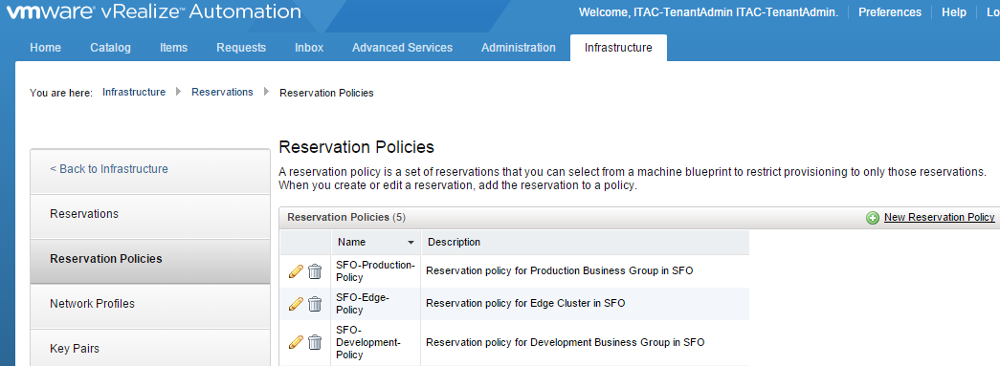

 

Prepare a Compute vCenter Server System for vRealize Automation (Region A)
--------------------------------------------------------------------------

Configure all vCenter Server compute clusters you intend to add to vRealize Automaton. In addition to the vCenter Server compute cluster comp01vc01.sfo01.rainpole.local, you can configure additional vCenter Server compute clusters.

Prerequisites

-   Verify that the foundation deployment is complete, with at least one running vCenter Server compute system.

-   Verify that the OVF files for the virtual machine templates for the vRealize Automaton blueprints are ready and accessible.

Procedure Overview

-   Create Logical Switches for Business Groups (Region A)

-   Configure a Content Library in the First Compute vCenter Server Instance (Region A)

-   Import the Virtual Machine Template OVF Files (Region A)

-   Subscribe Additional Compute vCenter Server Systems to the Content Library (Region A)

-   Create Virtual Machines Using VM Templates in the Content Library (Region A)

-   Convert the Virtual Machine to a VM Template (Region A)

-   Create Customization Specifications for Compute vCenter Server Systems

-   Configure Service Account Privileges in the Compute vCenter Server (Region A)

-   Configure Service Account Privilege in Compute NSX (Region A)

    1.  ### Create Logical Switches for Business Groups (Region A)

For each vCenter Server compute instance, create three logical switches to simulate networks for the Web, Database, and Application tiers.

Prerequisites

-   Verify that a vCenter Server compute cluster has been deployed and configured. See "Deploy and Configure the Compute and Edge Clusters Components (Region A)".

-   Verify that an NSX instance has been configured for use by the vCenter Server compute cluster. See "Deploy and Configure the Compute and Edge Clusters NSX Instance (Region A)".

Procedure

1.  If you have not already done so, log in to the vCenter Server using the vSphere Web Client.

<!-- -->

1.  Open a Web browser and go to **https://comp01vc01.sfo01.rainpole.local/vsphere-client**.

2.  Log in using the following credentials.

| Setting       | Value                       |
|---------------|-----------------------------|
| **User name** | administrator@vsphere.local |
| **Password**  | *vcenter\_admin\_password * |

1.  Create a logical switch.

<!-- -->

1.  Select **Networking & Security**.

2.  In the **Navigator**, select **NSX Edges**.

3.  From the **NSX Manager** drop-down menu, select **172.16.11.66** as the NSX Manager.

4.  Click **Logical Switches**, and click the **New Logical Switch** icon.

5.  In the **New Logical Switch** dialog box, enter the following settings, and click **OK**. 

| Setting                 | Value                                                    |
|-------------------------|----------------------------------------------------------|
| **Name**                | Production-Web-VXLAN                                     |
| **Description**         | Logical switch for Web tier of Production Business Group |
| **Transport Zone**      | Compute Transport Zone                                   |
| **Replication Mode**    | Hybrid                                                   |
| **Enable IP Discovery** | Selected                                                 |
| **Enable MAC Learning** | Deselected                                               |

> 

1.  Repeat the above steps to create the logical switches shown in the following table.

| Logical Switch        |     | Description                                                       |
|-----------------------|-----|-------------------------------------------------------------------|
| Production-Web-VXLAN  |     | Logical switch for Web tier of Production Business Group          |
| Production-DB-VXLAN   |     | Logical switch for Database tier of Production Business Group     |
| Production-App-VXLAN  |     | Logical switch for Application tier of Production Business Group  |
| Development-Web-XLAN  |     | Logical switch for Web tier of Development Business Group         |
| Development-DB-VXLAN  |     | Logical switch for Database tier of Development Business Group    |
| Development-App-VXLAN |     | Logical switch for Application tier of Development Business Group |

### Configure Content Library in the first Compute vCenter Server Instance (Region A)

You can create a content library and populate it with templates, which you can use to deploy virtual machines in your environment. Content libraries let you synchronize templates among different vCenter Servers so that all of the templates in your environment are consistent. While you only create one vCenter Server compute cluster in this design, additional compute PODs can also use the content library.

1.  You only need to create a content library for your first vCenter Server compute cluster. You can skip this section for any additional vCenter Servers compute clusters you add to the environment.

Create Content Library

1.  Log in to the Computer vCenter Server by using the vSphere Web Client.

<!-- -->

1.  Open a Web browser and go to **https://comp01vc01.sfo01.rainpole.local/vsphere-client**.

2.  Use the following credentials to log in.

| Setting       | Value                       |
|---------------|-----------------------------|
| **User name** | administrator@vsphere.local |
| **Password**  | *vcenter\_admin\_password*  |

1.  Select **Home** &gt; **Content Libraries** and click **Create new content library**.

2.  In the **New Library** dialog box, create a new library with the following settings and click **Next**.

| Setting            | Value                           |
|--------------------|---------------------------------|
| **Name**           | SFO01-ContentLib01              |
| **vCenter Server** | comp01vc01.sfo01.rainpole.local |

> 

1.  In the **Configure library** dialog, configure the library, as follows, and then click **Next**: 

<!-- -->

1.  Select **Local content library**. 

2.  Check **Publish content library externally** and **Enable authentication** check boxes. 

3.  Type a password in the **Password** and **Confirm password** text boxes to secure the content library.

> 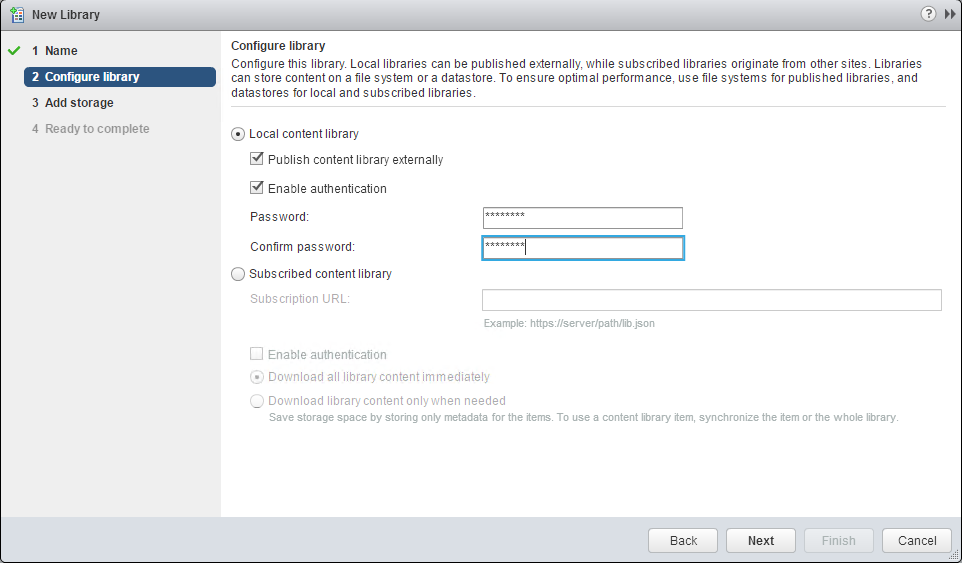

1.  Select datastore **SFO01A-NFS01-VRALIB01** to store the content library, and click **Next**.

> 

1.  After you create the library it appears in the content libraries inventory list.

2.  Right-click the content library **SFO01-ContentLib01** and select **Edit Settings**. The **Edit Library** dialog box displays.

3.  Click **Copy Link** to save the **Subscription URL** for this content library. You copy the **Subscription URL** so that additional vCenter Server instances can subscribe to this library.

> 

### Import the Virtual Machine Template OVF Files (Region A)

You add items to a content library by importing files from your local system. You can import an OVF package to use as a template for deploying virtual machines. You can also import other types of files, such as scripts, ISO files, and so on, that you want to use in your vCenter Server instance, or you want to share across multiple vCenter Server systems. In this instance, the virtual machine templates you add to the content library are used as vRealize Automation blueprints.

Repeat this procedure to import all virtual machine templates listed in the table below.

| VM Template Name          | Guest OS                             | vCPU | vRAM(GB) | Hard Disk(GB) | SCSI Controller | vNIC    |
|---------------------------|--------------------------------------|------|----------|---------------|-----------------|---------|
| redhat6-enterprise-64     | Red Hat Enterprise Server 6 (64-bit) | 1    | 6        | 20            | LSI Logic SAS   | VMXNET3 |
| windows-2012r2-64         | Windows Server 2012 R2 (64-bit)      | 1    | 4        | 50            | LSI Logic SAS   | VMXNET3 |
| windows-2012r2-64-sql2012 | Windows Server 2012 R2 (64-bit)      | 1    | 8        | 100           | LSI Logic SAS   | VMXNET3 |

Procedure

1.  Log in to the vCenter Server using the vSphere Web Client.

<!-- -->

1.  Open a Web browser and go to **https://comp01vco1.sfo01.rainpole.local/vsphere-client**.

2.  Use the following credentials to log in.

| Setting       | Value                       |
|---------------|-----------------------------|
| **User name** | administrator@vsphere.local |
| **Password**  | *vcenter\_admin\_password * |

1.  Select **Home &gt; Content Libraries**, and then click the **Objects** tab.

2.  Right-click the content library **SFO01-ContentLib01** and select **Edit Settings**. The Import Library Item dialog box displays.

3.  In the **Source** section, select the **Local file** check box and click **Browse** to navigate to the file that you want to import from your local system, and click **OK**.

4.  In the **Destination** section, type a name and description for the item, and click **OK**

> 

1.  When the upload completes verify that the template has successfully uploaded.

    In the **Recent Tasks** pane you see two tasks, one about creating a new item in the library, and the second about uploading the contents of the item to the library. After the task is complete, the item appears on the **Related Objects** tab under **Templates or Other Types**.

2.  Repeat this procedure to import all virtual machine templates listed in the table below.

<!-- -->

1.  These templates will be referred to in other documents.

| VM Template Name          | Guest OS                             | vCPU | vRAM(GB) | Hard Disk(GB) | SCSI Controller | vNIC    |
|---------------------------|--------------------------------------|------|----------|---------------|-----------------|---------|
| redhat6-enterprise-64     | Red Hat Enterprise Server 6 (64-bit) | 1    | 6        | 20            | LSI Logic SAS   | VMXNET3 |
| windows-2012r2-64         | Windows Server 2012 R2 (64-bit)      | 1    | 4        | 50            | LSI Logic SAS   | VMXNET3 |
| windows-2012r2-64-sql2012 | Windows Server 2012 R2 (64-bit)      | 1    | 8        | 100           | LSI Logic SAS   | VMXNET3 |

### Subscribe Additional Compute vCenter Server Systems to the Content Library (Region A)

Subscribe any additional vCenter Server Compute clusters to the content library. Perform this procedure if you deploy two or more vCenter Server compute systems in the same region.

1.  Skip this procedure for the first vCenter Server compute system deployed in your environment.

Procedure

1.  Log in to the vCenter Server compute cluster using the vSphere Web Client.

<!-- -->

1.  Open a Web browser and go to **https://comp01vc01.sfo01.rainpole.local/vsphere-client**.

2.  Log in using the following credentials.

| Setting       | Value                       |
|---------------|-----------------------------|
| **User name** | administrator@vsphere.local |
| **Password**  | *vcenter\_admin\_password * |

1.  Navigate to **Home** &gt; **vCenter Inventory Lists** &gt; **Content Libraries**.

2.  With the **Objects** tab selected, click **Create new content library**.

3.  In the **New Content Library** dialog, create a new library with the following settings and click **Next**.

| Setting            | Value                           |
|--------------------|---------------------------------|
| **Name**           | SFO01-ContentLib02              |
| **vCenter Server** | comp02vc01.sfo01.rainpole.local |

> 

1.  In the **Configure content library** dialog, select **Subscribed content library** and perform these steps.

<!-- -->

1.  In the **Subscription URL** text box, copy and paste the content library of the first vCenter Server content library.

2.  Select the **Enable authentication** checkbox.

3.  Specify the password you used to create the content library for the first vCenter Server compute cluster. 

4.  Click **Next**.

> 

1.  In the **Add Storage** dialog box, select a datastore to act as storage for the contents of the library, click **Next**, and then click **Finish.**

> 

1.  Wait until the content library creation completes. The length of time this can take depends on the network bandwidth between vCenter Server instances, overall virtual machine template size, and datastore performance. It can take from minutes to hours for the content library synchronization to complete.

> 

### Create Virtual Machine Using VM Templates in Content Library (Region A)

vRealize Automation cannot directly access virtual machine templates in the content library. You must create a virtual machine using the virtual machine templates in the content library, then convert the template in vCenter Server. Perform this procedure on all vCenter Servers compute clusters you add to vRealize Automation, including the first vCenter Server compute instance.

Repeat this procedure for each of the VM Templates in the content library. The table below lists the VM Templates and the guest OS each template uses to create a virtual machine.

| VM Template Name          | Guest OS                             |
|---------------------------|--------------------------------------|
| redhat6-enterprise-64     | Red Hat Enterprise Server 6 (64-bit) |
| windows-2012r2-64         | Windows Server 2012 R2 (64-bit)      |
| windows-2012r2-64-sql2012 | Windows Server 2012 R2 (64-bit)      |

Procedure

1.  Log in to the vCenter Server using the vSphere Web Client.

<!-- -->

1.  Open a Web browser and go to **https://comp01vc01.sfo01.rainpole.local/vsphere-client**.

2.  Log in using the following credentials.

| Setting       | Value                       |
|---------------|-----------------------------|
| **User name** | administrator@vsphere.local |
| **Password**  | *vcenter\_admin\_password * |

1.  Navigate to **Home** &gt; **VMs and Templates**.

2.  Expand the **comp01vc01.sfo01.rainpole.local** vCenter Server.

3.  Right-click the **SFO01** data center object and select **New Folder &gt; New VM and Template Folder**.

4.  Create a folder and label it **VM Templates**.

> 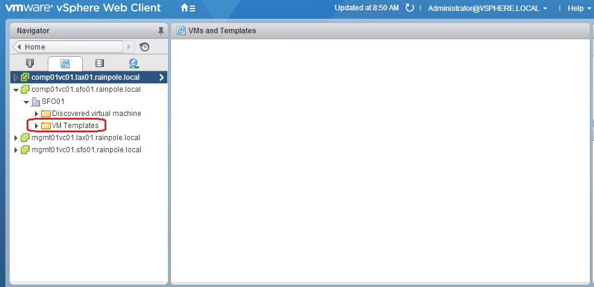

1.  Navigate to **Home** &gt; **Content Libraries**.

2.  Click **SFO01-ContentLib01** &gt; **Templates**.

3.  Right-click the **VM Template** and select **New VM from This Template**. The New Virtual Machine from Content Library wizard opens.

> 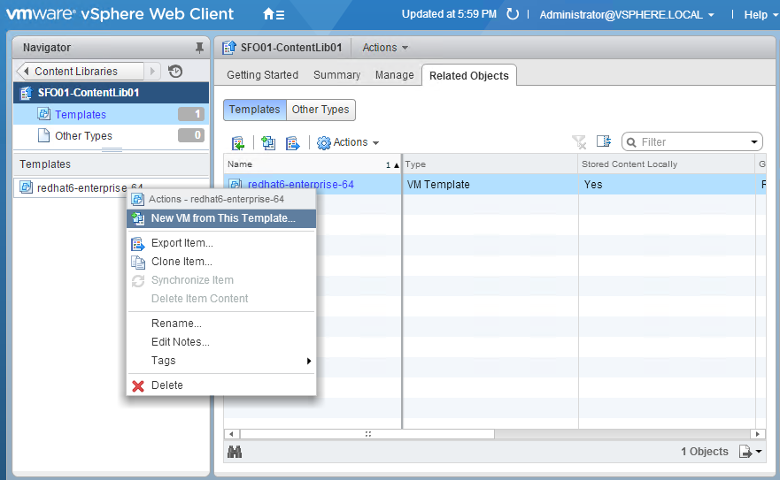

1.  In the **Select name and location** page, use the same template name.

<!-- -->

1.  Use the same template name to create a common service catalog that works across different vCenter Server instances within your datacenter environment.

<!-- -->

1.  Select **VM Templates** as the folder for this virtual machine, and click **Next**.

> 

1.  In the **Select a resource** page, select the compute cluster you want to deploy the virtual machine to. Do not select an **Edge Cluster**.

2.  On the **Review details** page, verify the template details and click **Next**.

3.  In the **Select storage** page, select the **SFO01A-NFS01-VRALIB01** datastore and **Thin Provisioning** for the virtual disk format.

> 

1.  In the **Select networks** dialog, select **VM Network** for the Destination Network, and click **Next**.

<!-- -->

1.  vRealize Automation will change the network according to the blueprint configuration.

<!-- -->

1.  In the **Ready to complete** page, review the configurations you made for the virtual machine, and click **Finish**. A new task for creating the virtual machine appears in the Recent Tasks pane. After the task is complete, the new virtual machine is created.

2.  Repeat this procedure for all of the VM Templates in the content library. The table below lists the VM Templates and the guest OS each template uses to create a virtual machine.

| VM Template Name          | Guest OS                             |
|---------------------------|--------------------------------------|
| redhat6-enterprise-64     | Red Hat Enterprise Server 6 (64-bit) |
| windows-2012r2-64         | Windows Server 2012 R2 (64-bit)      |
| windows-2012r2-64-sql2012 | Windows Server 2012 R2 (64-bit)      |

### Convert the Virtual Machine to VM Template (Region A)

You can convert a virtual machine directly to a template instead of making a copy by cloning.

1.  Log in to the vCenter Server using the vSphere Web Client.

<!-- -->

1.  Open a Web browser and go to **https://comp01vc01.sfo01.rainpole.local/vsphere-client**.

2.  Log in using the following credentials.

| Setting       | Value                       |
|---------------|-----------------------------|
| **User name** | administrator@vsphere.local |
| **Password**  | *vcenter\_admin\_password * |

1.  Navigate to **Home** &gt; **VMs and Templates**.

2.  In the **Navigator** pane, expand **comp01vc01.sfo01.rainpole.local** &gt; **SFO** &gt; **VM Templates**.

3.  Right-click the **redhat6-enterprise-64** virtual machine located in the **VM Templates** folder, and select **Template &gt; Convert to Template**.

4.  Click **Yes** to confirm the template conversion.

> 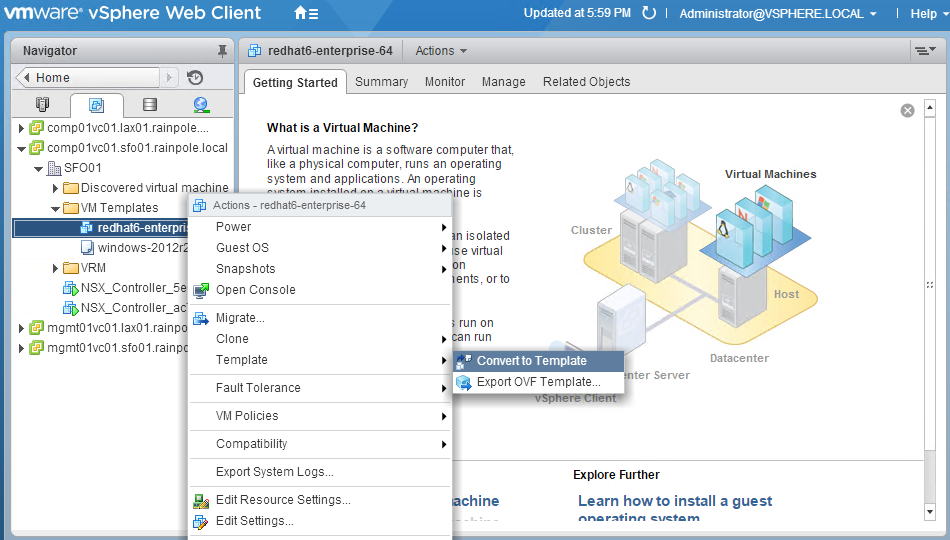

1.  Repeat the above steps for all of the VM Templates in the content library, verifying that each VM Template appears in the **VM Templates** folder.

The table below lists the VM Templates and the guest OS each template uses to create a virtual machine.

| VM Template Name          | Guest OS                             |
|---------------------------|--------------------------------------|
| redhat6-enterprise-64     | Red Hat Enterprise Server 6 (64-bit) |
| windows-2012r2-64         | Windows Server 2012 R2 (64-bit)      |
| windows-2012r2-64-sql2012 | Windows Server 2012 R2 (64-bit)      |

### Create Customization Specifications for Compute vCenter Server Systems (Region A)

Create two customization specifications, one for Linux and one for Windows, for use by the virtual machines you will deploy. Customization specifications are XML files that contain system configuration settings for the guest operating systems used by virtual machines. When you apply a specification to a guest operating system during virtual machine cloning or deployment, you prevent conflicts that might result if you deploy virtual machines with identical settings, such as duplicate computer names.

You will later use the customization specifications you create when you create blueprints for use with vRealize Automation.

Procedure

1.  Log in to vCenter Server using the vSphere Web Client.

<!-- -->

1.  Open a Web browser and go to **https://comp01vc01.sfo01.rainpole.local/vsphere-client**.

2.  Log in using the following credentials.

| Setting       | Value                       |
|---------------|-----------------------------|
| **User name** | administrator@vsphere.local |
| **Password**  | *vcenter\_admin\_password * |

1.  Navigate to **Home** &gt; **Policies and Profiles** &gt; **Customization Specification Manager**

2.  Select the vCenter Server **comp01vc01.sfo01.rainpole.local** from the drop-down menu.

3.  Click the **Create a new specification** icon and complete the **Guest Customization** wizard.

<!-- -->

1.  In the **Specify Properties** page, select Linux from the **Target VM Operating System** drop-down menu, and type the name **itac-linux-custom-spec** for the specification. Optionally, you can type a description for the specification. Click **Next**.

2.  In the **Set Computer Name** page, select **Use the virtual machine name**.

3.  Type the domain name **sfo01.rainpole.local** for the computer, and click **Next**.

4.  In the **Time Zone** page, specify the time zone as shown in the table below for the virtual machine and click **Next**.

| Setting                   | Value      |
|---------------------------|------------|
| **Area**                  | America    |
| **Location**              | Los Angles |
| **Hardware Clock Set To** | Local Time |

1.  In the **Configure Network** page, leave the default settings and click **Next**.

2.  In the **Enter DNS and domain settings** page, leave the default settings and click **Next**.

<!-- -->

1.  Click **Finish** to save your changes.

> The customization specification that you created is listed in the Customization Specification Manager. You can use the specification to customize virtual machine guest operating systems.

Create a Customization Specification for Windows

1.  Click the **Create a new specification** icon again, and complete the **Guest Customization** wizard.

<!-- -->

1.  In the **Specify Properties** page, select **Windows** from the **Target VM Operating System** drop-down menu, and type the name **itac-windows-joindomain-custom-spec** for the specification. Optionally, you can type a description for the specification. Click **Next**.

2.  On the **Set Registration Information** page, type **Rainpole** for the virtual machine owner’s name and organization, and click **Next**.

3.  In the **Set Computer Name** page, select **Use the virtual machine name**, and click **Next**.

> The operating system uses this name to identify itself on the network. On Linux systems, this is called the host name.

1.  In the **Enter Windows License** page, provide licensing information for the Windows operating system. Type the **windows\_product\_keycode** and click **Next**.

2.  Specify the administrator password for use with the virtual machine, and click **Next**.

3.  In the Time Zone page, select **(GMT-08:00) Tijuana, Los Angeles, Seattle, Vancouver** and click **Next**.

4.  Type the domain name **sfo01.rainpole.local** for the computer, and click **Next**.

5.  In the **Run Once** page, leave the default settings and click **Next**.

6.  In the **Set Workgroup or Domain** page, select **Windows Server Domain** and specify the following settings. Click **Next**.

| Setting       | Value                |
|---------------|----------------------|
| **Domain**    | sfo01.rainpole.local |
| **User name** | SFO01\\administrator |
| **Password**  | admin\_pwd           |

1.  In the **Set Operating System Options** page, select Ge**nerate New Security ID (SID)** and click **Next**.

<!-- -->

1.  Click **Finish** to save your changes.

The customization specification that you created is listed in the Customization Specification Manager. You can use the specification to customize virtual machine guest operating systems.

### Configure Service Account Privileges in the Compute vCenter Server (Region A)

Configure the service account privileges so that the svc-vra and svc-vro users have Administrator privileges for all compute vCenter Servers instances in Region A.

Procedure

1.  Log in to vCenter Server using the vSphere Web Client.

<!-- -->

1.  Open a Web browser and go to **https://comp01vc01.sfo01.rainpole.local/vsphere-client**.

2.  Log in using the following credentials.

| Setting       | Value                       |
|---------------|-----------------------------|
| **User name** | administrator@vsphere.local |
| **Password**  | vcenter\_admin\_password    |

1.  Navigate to **Home** &gt; **vCenter Inventory Lists** &gt; **vCenter Servers**.

2.  In the **Navigator** pane, right-click the vCenter Server **comp01vc01.sfo01.rainpole.local** and select **Add Permissions**.

> 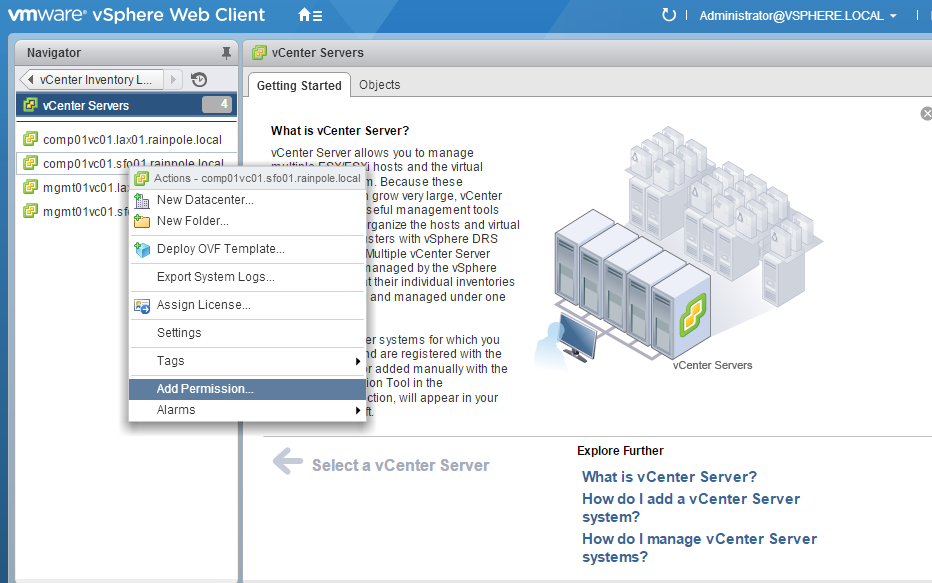

1.  In the **Add Permission** dialog box, click the **Add button**. The **Select Users/Groups** dialog box appears.

> 

1.  Select **RAINPOLE** from the **Domain** drop-down menu, and in the **Show Users First** text box type **svc** to filter for user and group names containing the letters "svc."

2.  Select **svc-vra** and **svc-vro** from the **User/Group** list, and click the **Add** button.

> 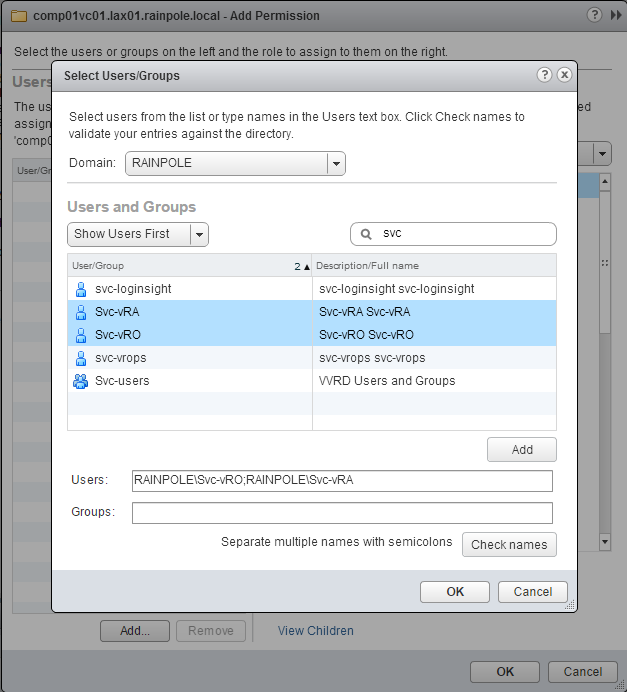

1.  Click **OK**.

2.  In the **Add Permission** dialog box, select **Administrator** from the **Assigned Role** drop-down menu and click **OK**.

> 

1.  Repeat the above steps for all of the other compute vCenter Servers in Region A.

Now, the **svc-vra** and **svc-vro** users have Administrator privilege to all Compute vCenter Servers in Region A.

### Configure Service Account Privilege in Compute NSX (Region A)

Configure user account privileges for the svc-vra@rainpole.local service account.

Procedure

1.  Log in to vCenter Server using the vSphere Web Client.

<!-- -->

1.  Open a Web browser and go to **https://comp01vc01.sfo01.rainpole.local/vsphere-client**.

2.  Log in using the following credentials.

| Setting       | Value                       |
|---------------|-----------------------------|
| **User name** | administrator@vsphere.local |
| **Password**  | vcenter\_admin\_password    |

1.  Navigate to **Home** &gt; **Networking & Security**. Click **NSX Managers**.

2.  In the **Navigator** pane, double-click the Compute NSX Manager labeled **172.16.11.66**.

3.  Select **Manage** &gt; **Users**.

> 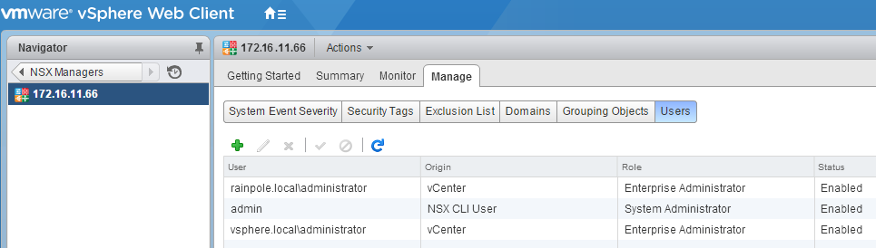

1.  Click the **Add** icon. The Assign Role wizard appears.

2.  In the **Identify User** page, select the **Specify a vCenter User** check box, type **svc-vra@rainpole.local** in the **User** text box, and click **Next**.

> 

1.  In the **Select Roles** page, select the **Enterprise Administrator** check box, and click **Finish**.

> 

1.  Verify that the user **rainpole\\svc-vra** is configured as an **Enterprise Administrator** for the NSX Manager compute cluster.

> 

Add a Compute vCenter Server Instance to vRealize Automation (Region A)
-----------------------------------------------------------------------

This guide illustrates how you add a Compute vCenter Server instance to vRealize Automation. The guide uses **comp01vc01.sfo01.rainpole.local** as an example. The same steps can be applied to any other Compute vCenter Server in any region.

Prerequisites

-   vRealize Automation is deployed and up and running.  See *Install vRealize Automation in Region A*.

-   Rainpole tenant is created and configured.  See *Create a vRealize Automation Tenant*.

-   The Compute vCenter Server is deployed and configured. See Prepare a Compute vCenter Server System for vRealize Automation

-   The management virtual network for the vRealize Automation proxy agent is configured. See *Deploy and Configure Gateways for the Management Application Networks (Region A)*

-   Dynamic Routing is configured. See Deploy and Configure Gateways for the Management Application Networks (Region A)

-   Two management virtual network IP addresses and host names are required for installing the proxy agents. For example, you use the following host names and IP addresses for first Compute vCenter Server.

| Agent name           | Hostname                     | IP address   |
|----------------------|------------------------------|--------------|
| SFO-Agent-vSphere-01 | vra01ias01sfo.rainpole.local | 192.168.12.2 |
| SFO-Agent-vSphere-02 | vra01ias02sfo.rainpole.local | 192.168.12.3 |

Procedure Overview

-   Add a vCenter Server Instance to vRealize Orchestrator

-   Create Windows Virtual Machines for Proxy Agents

-   Install IaaS vSphere Proxy Agents

-   Create a vSphere Endpoint in vRealize Automation

-   Add Compute Resources to a Fabric Group

-   Create External Network Profiles

-   Create a Reservation for the Compute Cluster

-   Create a Reservation for the Edge Cluster

    1.  ### Add a vCenter Server Instance to vRealize Orchestrator

For each vCenter Server instance that contributes resources to vRealize Automation and that uses vRealize Orchestrator workflows, you have to add a vCenter Server instance to vRealize Orchestrator. Adding the vCenter Server instance allows vCenter Server and vRealize Orchestrator to communicate.

Prerequisites

-   Install vRealize Orchestrator and set up a vRealize Orchestrator cluster.

Procedure

1.  Launch the vRealize Orchestrator Client. 

<!-- -->

1.  Log in to the first vRealize Orchestrator server, as **ITAC-Tenant@rainpole.local** with the ***rainpole\_admin\_password***.

<!-- -->

1.  Navigate to **Workflows** &gt; **Library** &gt; **vCenter** &gt; **Configuration**.

2.  Run the **Add a vCenter Server instance** workflow

<!-- -->

1.  On the **Set the vCenter Server Instance** page, configure the following settings and click **Next**.

| Setting                                 | Value                           |
|-----------------------------------------|---------------------------------|
| **vCenter Server hostname**             | comp01vc01.sfo01.rainpole.local |
| **HTTPS port**                          | 443                             |
| **Location of SDK**                     | /sdk                            |
| **Will you orchestrate this instance?** | Yes                             |
| **Ignore certificate warnings?**        | Yes                             |

> 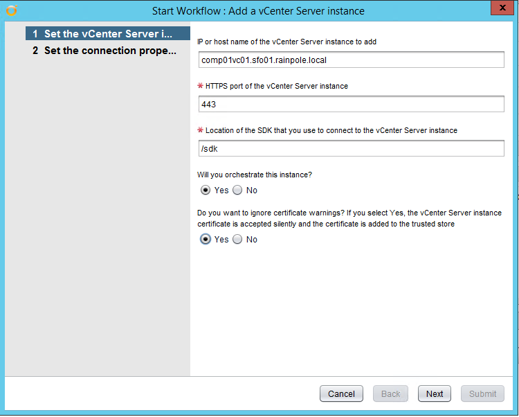

1.  On the **Set the connection properties** page, configure the following settings, and click **Submit.**

| Setting                          | Value                  |
|----------------------------------|------------------------|
| **Use a session per user**       | No                     |
| **vCenter Server user name**     | svc-vro@rainpole.local |
| **vCenter Server user password** | *svc\_vro\_password*   |

1.  To verify that the workflow completed successfully, go to the **Inventory** tab and select **vCenter Server**.  You see the vCenter Server instance that you just added.

> 

1.  Repeat this procedure to add this Compute vCenter Server instance to the second vRealize Orchestrator server, **vra01vro01b.rainpole.local**.

    1.  ### Create Windows Virtual Machines for Proxy Agents

vRealize Automation requires two Windows virtual machines to run IaaS vSphere proxy agents in a distributed configuration. These two virtual machines provide high availability for the proxy agent. 

To facilitate the process, this design uses the windows2012r2 virtual machine template and the window2012r2-vra-ias image customization spec.

Prerequisites 

-   On the **mgmt01vc01.sfo01.rainpole.local** vCenter Server system, create a Windows 2012 R2 windows template (windows2012r2-template) following the steps in the "Creating a Window Server 2012 R2 Virtual Machine Template" section. 

-   On the **mgmt01vc01.sfo01.rainpole.local** vCenter Server system, create a vSphere Image Customization Specification template (windows2012r2-vra) following the steps in the "Creating a vSphere Image Customization template" section.

Procedure

1.  From the vSphere Web Client, log in to the Management vCenter Server.

<!-- -->

1.  Open a Web browser and go to **https://mgmt01vc01.sfo01.rainpole.local/vsphere-client.**

2.  Log in as the **administrator@vsphere.local** user with the ***vcenter\_admin\_password*** password.

<!-- -->

1.  In the **Navigator**, click **vCenter Servers**, and click **mgmt01vc01.sfo01.rainpole.local**.

2.  Select the **VM** tab, and click **VM Templates in Folders**

3.  In the **VM Templates in Folders** pane, select the **win2012r2-template.**

4.  In the **Basic Tasks** pane, click **Deploy to a new virtual machine.**

> 

1.  In the **Deploy From Template** wizard, follow these steps:

<!-- -->

1.  On the **Select a name and folder** page, make the following selections and click **Next.**

| Setting                                       | Value                                                                       |
|-----------------------------------------------|-----------------------------------------------------------------------------|
| **Enter a name for the virtual machine**      | vra01ias01.sfo01.rainpole.local                                             |
| **Select a location for the virtual machine** | Select the **SFO01** data center under mgmt01vc01.sfo01.rainpole.local**.** |

> 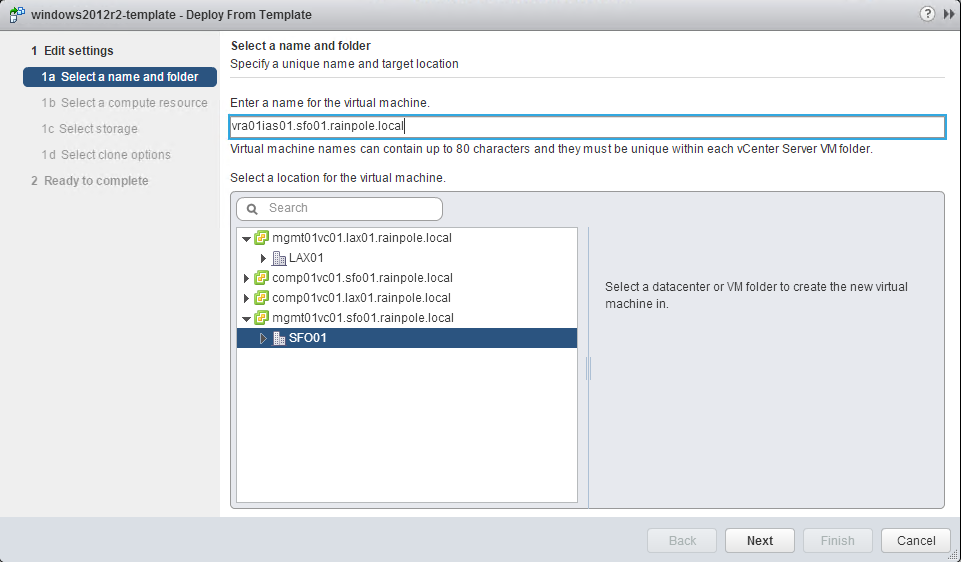

1.  On the **Select a compute resource** page, select **SFO01-Mgmt01 **and click **Next.**

> 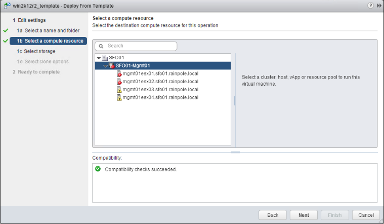

1.  On the **Select storage** page, specify the following settings for the datastore and click **Next**.

| Setting                        | Value                                                                               |
|--------------------------------|-------------------------------------------------------------------------------------|
| **Select virtual disk format** | Leave the default                                                                   |
| **VM Storage Policy**          | **Virtual SAN Default Storage Policy**                                              |
| **Datastore**                  | Select the **SFO01A-VSAN01-MGMT01** Virtual SAN datastore from the datastore table. |

> 

1.  In the **Select Clone options** page, check **Customize the operating system**, leave the default for the other check boxes, and click **Next.**

> 

1.  In the **Customize guest OS** page, select **windows2012r2-vra-ias** from the table and click **Next.**

> 

1.  In the **User Settings** pane, enter the follow values, leave the default for other fields, and click **Next**.

| Options          | Values       |
|------------------|--------------|
| **NetBIOS name** | vra01ias01   |
| **IPv4 address** | 192.168.12.2 |

> 

1.  With **Ready to Complete** selected on the left, review all settings on the right and click **Finish**.

> 

1.  When the virtual machine deployment completes, customize the virtual machine, as follows:

<!-- -->

1.  In the **Navigator**, click **Virtual Machines.**

2.  Right click the **vra01ias01.sfo01.rainpole.local** virtual machine and select **Edit Settings**.

3.  Select **Virtual Hardware**, and change **Memory** to **4096 MB**. 

4.  Select **Network Adapter 1** and select **vxw-dvs-27-virtualwire-2-sid-5001-vRA01IAS-VXLAN.**

5.  Click **OK.**

> 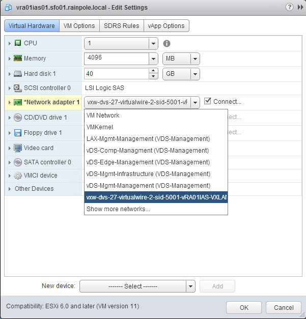

1.  Right click the **vra01ias02.sfo01.rainpole.local** virtual machine again and select **Power &gt; Power on**.

<!-- -->

1.  When the Windows customization completes, log in to Windows as administrator and perform verification and customization:

<!-- -->

1.  Verify that the VM's IP address, computer name, and domain are correctly configured.

2.  Add the vRealize Automation service account **svc-vra@rainpole.local** to the Local Administrators Group.

<!-- -->

1.  Repeat the steps to create one additional virtual machine with the following settings.

| Virtual Machine Name            | NetBIOS name | IP           | Memory Size |
|---------------------------------|--------------|--------------|-------------|
| vra01ias02.sfo01.rainpole.local | vra01ias02   | 192.168.12.3 | 4 GB        |

1.  Create an anti-affinity rule to separate these two virtual machines. See Create Anti-Affinity Rules for vRealize Automation and vRealize Orchestrator Virtual Machines.

    1.  ### Install IaaS vSphere Proxy Agents

Proxy agents are required so vRealize Automation can communicate with vCenter Server instances.  For every vCenter Server instance that will be a target for vRealize Automation, deploy at least two proxy agents. 

Prerequisites

-   Verify that vRealize Automation has been deployed. See* Install vRealize Automation in Region A.*

-   Verify that two proxy agent Windows virtual machines are available and configured. See *Create Windows Virtual Machines for Proxy Agents.*

Procedure

1.  Log in to the **vra01ias01.sfo01.rainpole.local** virtual machine console using the vRealize Automation service account **svc-vra@rainpole.local** with the password ***svc-vra\_password***.

2.  In a Web browser, connect to **https://vra01svr01a.rainpole.local:5480/insta**ller and download the **IaaS installer**. 

> 

1.  Save the installer with the default name. 

2.  Right-click the installer and select **Run as administrator**.

3.  On the **Log In** page, configure the following settings and click **Next**. 

| Setting                 | Value             |
|-------------------------|-------------------|
| **Appliance host name** | Leave the default |
| **User name**           | root              |
| **Password**            | *root\_password*  |
| **Accept Certificate**  | Checked           |

> 
>  

1.  On the **Installation Type** page, select **Custom Install**, click **Proxy Agents,** and click **Next**.

> 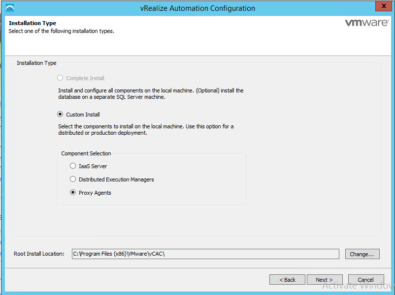

1.  On the **Server and Account Settings** page, specify the following values and click **Next**. 

| Setting          | Value                                                        |
|------------------|--------------------------------------------------------------|
| **Local server** | Leave the default                                            |
| **User name**    | svc-vra@rainpole.local (vRealize Automation service account) |
| **Password**     | *svc-vra\_password.*                                         |

> 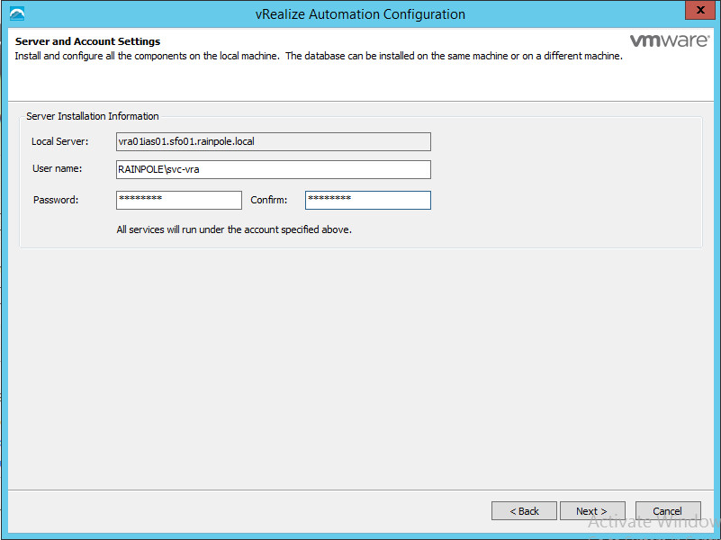

1.  On the **Install Proxy Agent** page, specify the following values, click **Add**, and then click **Next.
    Note**: You use the vSphere endpoint later to create a vCenter Endpoint in vRealize Automation.

| Setting                            | Value                           |
|------------------------------------|---------------------------------|
| **Agent type**                     | vSphere                         |
| **Agent name**                     | SFO-Agent-vSphere-01            |
| **Manager Service Host**           | vra01ims01.rainpole.local       |
| **Model Manager Web Service Host** | vra01iws01.rainpole.local       |
| **vSphere Endpoint**               | comp01vc01.sfo01.rainpole.local |

> 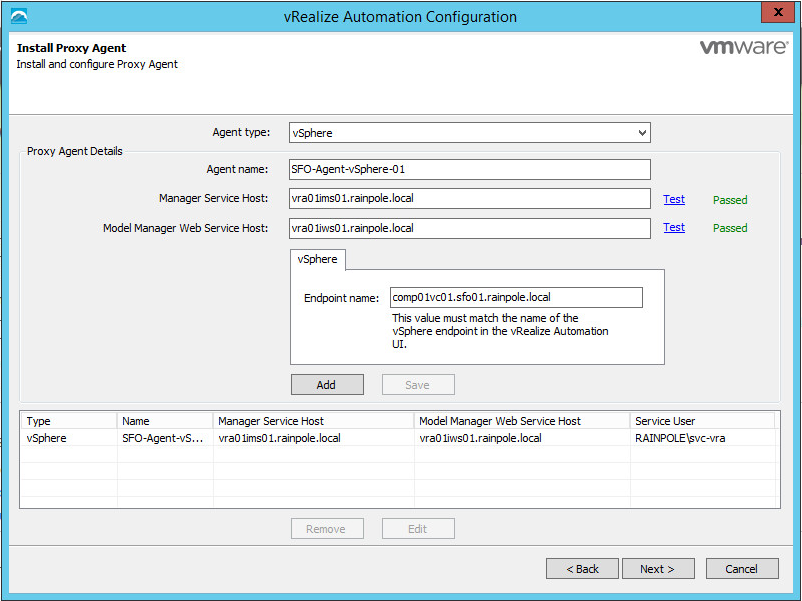

1.  Verify the configuration, and click **Install** to install the proxy agent.

2.  Repeat the procedure for virtual machine vra01ias02.sfo01.rainpole.local to install another proxy agent for redundancy, using the following values on the **Install Proxy Agent** pages.

<!-- -->

1.  Use the same vSphere Endpoint as the **SFO-Agent-vSphere-01** is using.

| Setting                                 | Value                           |
|-----------------------------------------|---------------------------------|
| **Agent Type**                          | vSphere                         |
| **Agent Name**                          | SFO-Agent-vSphere-02            |
| **Manager Service Host name**           | vra01ims01.rainpole.local       |
| **Model Manager Web Service Host name** | vra01iws01.rainpole.local       |
| **vSphere Endpoint**                    | comp01vc01.sfo01.rainpole.local |

### Create a vSphere Endpoint in vRealize Automation

To allow vRealize Automation to manage the infrastructure, IaaS administrators create endpoints and configure user-credentials for those endpoints. When you create a vSphere Endpoint, vRealize Automation can to communicate with the vSphere environment and discover compute resources that are managed by vCenter Server, collect data, and provision machines.

**Prerequisites**

-   Proxy agents have been deployed. See *Install IaaS vSphere Proxy Agents*.

Procedure

1.  From a Web browser, log in to the vRealize Automation console by connecting to **https://vra01svr01.rainpole.local/vcac/org/rainpole** and log in with the tenant admin account ITAC-TenantAdmin@rainpole.local with password *tenant\_pwd*. 

2.  Navigate to **Infrastructure** &gt; **Endpoints** &gt; **Credentials** and click **New Credentials**.

3.  On the **Credentials** page, configure the vRealize Automation credential for the administrator of **comp01vc01.sfo01.rainpole.local** with the following settings, and click the green checkmark to save the credential.

| Setting         | Value                                            |
|-----------------|--------------------------------------------------|
| **Name**        | comp01vc01sfo01 admin                            |
| **Description** | administrator of comp01vc01.sfo01.rainpole.local |
| **User Name**   | svc-vra@rainpole.local                           |
| **Password**    | svc\_vra\_password                               |

> 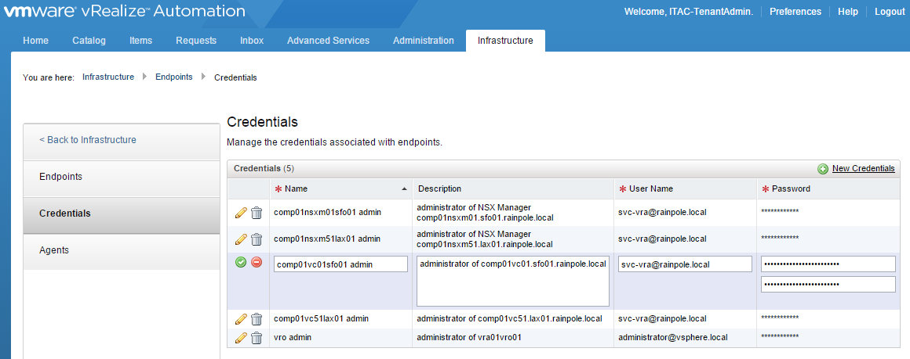

1.  Repeat the previous step to create credentials for the NSX Admin with the following settings:

| Setting         | Value                                                         |
|-----------------|---------------------------------------------------------------|
| **Name**        | comp01nsxm01sfo01 admin                                       |
| **Description** | administrator of NSX system comp01nsxm01.sfo01.rainpole.local |
| **User Name**   | svc-vra@rainpole.local                                        |
| **Password**    | svc\_vra\_password                                            |

1.  Navigate to **Infrastructure** &gt; **Endpoints** &gt; **Endpoints** and click **New Endpoints** &gt; **Virtual** &gt; **vSphere (vCenter)**.

2.  On the **New Endpoint - vSphere (vCenter)** page, create a vSphere Endpoint with the following settings, and click **OK** to save the endpoint. 

<!-- -->

1.  The vSphere Endpoint Name must be identical to the name that you used to install the proxy agent in the section "Install IaaS vSphere Proxy Agents."

| Setting                                               | Value                                       |
|-------------------------------------------------------|---------------------------------------------|
| **Name**                                              | comp01vc01.sfo01.rainpole.local             |
| **Address**                                           | https://comp01vc01.sfo01.rainpole.local/sdk |
| **Credentials**                                       | comp01vc01sfo01 admin                       |
| **Specify manager for network and security platform** | Yes                                         |
| **NSX Address**                                       | https://comp01nsxm01.sfo01.rainpole.local   |
| **NSX Credentials**                                   | comp01nsxm01sfo01 admin                     |

> 

 

### Add Compute Resources to a Fabric Group

You allocate compute resources to fabric groups so that vRealize Automation can use the resources in that compute resource for that fabric group when provisioning virtual machines.

Prerequisites

-   Verify that the fabric group has been created.

-   Verify that compute resources have been configured.

Procedure

1.  From a Web browser, log in to the vRealize Automation console by connecting to **https://vra01svr01.rainpole.local/vcac/org/rainpole** and log in with the tenant admin account **ITAC-TenantAdmin@rainpole.local** with password ***tenant\_pwd*.**

2.  Navigate to **Infrastructure** &gt; **Groups** &gt; **Fabric Groups**.

3.  In the **Name** column, hover over the fabric group **SFO Fabric Group** and click **Edit**.

> 

1.  In the **Edit Fabric Group** page, in the** Compute Resources** table, select both the compute cluster (**SFO01-Comp01**) and the edge cluster (**SFO01-Edge01**) and click **OK**.

<!-- -->

1.  It might take a few minutes for vRealize Automation to connect to the Compute vCenter Server system and associated clusters.

> 

1.  Navigate to **Infrastructure** &gt; **Computer Resources** &gt; **Compute Resources**. 

2.  In the **Compute Resource** column, hover over the compute cluster **SFO01-Comp01** and click **Data Collection**.

> 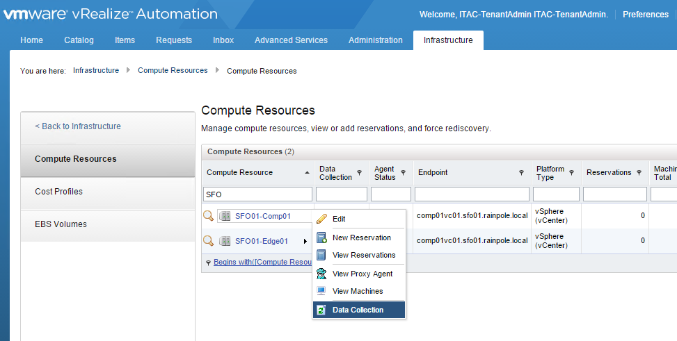

1.  Wait for data collection to complete and verify that the **Status** for both **Inventory** and **Network and Security Inventory** shows Succeeded.

> 

1.  Repeat this process to do data collection for the edge cluster **SFO01-Edge01**.

    1.  ### Create External Network Profiles

Before members of a business group can request virtual machines, fabric administrators must create network profiles to define the subnet and routing configuration for those virtual machines.  Each network profile is configured for a specific network port group or virtual network to specify IP address and routing configuration for virtual machines provisioned to that network.

Prerequisites

-   Business Groups have been created.

-   Fabric Groups have been created.

-   Compute resources have been provisioned to fabric groups.

Procedure

1.  From a Web browser, log in to the vRealize Automation console by connecting to **https://vra01svr01.rainpole.local/vcac/org/rainpole** and log in with the tenant admin account **ITAC-TenantAdmin@rainpole.local** with password ***tenant\_pwd***.

2.  Navigate to **Infrastructure** &gt; **Reservations** &gt; **Network Profiles** and click **New Network Profile** &gt; **External**.

3.  On the **New Network Profile - External** page, select the **Network Profile Information** tab, enter the following values**,** but do not click **OK** yet. 

| Setting               | Value                                                              |
|-----------------------|--------------------------------------------------------------------|
| **Name**              | Ext-Net-Profile-Production-Web                                     |
| **Description**       | External Network profile for Web Tier of Production Business Group |
| **Subnet mask**       | 255.255.255.0                                                      |
| **Gateway**           | 172.11.10.1                                                        |
| **Primary DNS**       | 172.16.11.5                                                        |
| **Secondary DNS**     | 172.17.11.5                                                        |
| **DNS suffix**        | sfo01.rainpole.local                                               |
| **DNS search suffix** | sfo01.rainpole.local                                               |

> 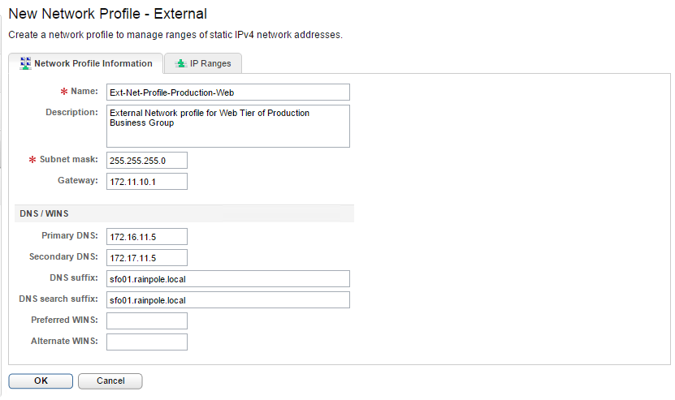

1.  Still on the **New Network Profile - External** page, select the **IP Ranges** tab, select the **New Network Range** icon.

<!-- -->

1.  Enter the following values, and click **OK**. 

| Setting                 | Value                                            |
|-------------------------|--------------------------------------------------|
| **Name**                | Production-Web                                   |
| **Description**         | Static IP range for Web Tier of Production Group |
| **Starting IP address** | 172.11.10.20                                     |
| **Ending IP address**   | 172.11.10.250                                    |

> 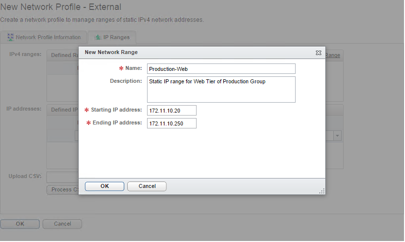

1.  Verify that all the static IP addresses are added to the profile and click **OK**.

> 

1.  Repeat the steps to create additional external network profiles with the following settings:

| Profile Name                    | Subnet Mask   | Gateway     | Primary DNS | Secondary DNS | DNS suffix           | DNS search suffix    | Network Range Name | Starting IP address | Ending IP address |
|---------------------------------|---------------|-------------|-------------|---------------|----------------------|----------------------|--------------------|---------------------|-------------------|
| Ext-Net-Profile-Production-DB   | 255.255.255.0 | 172.11.11.1 | 172.16.11.5 | 172.17.11.5   | sfo01.rainpole.local | sfo01.rainpole.local | Production-DB      | 172.11.11.20        | 172.11.11.250     |
| Ext-Net-Profile-Production-App  | 255.255.255.0 | 172.11.12.1 | 172.16.11.5 | 172.17.11.5   | sfo01.rainpole.local | sfo01.rainpole.local | Production-App     | 172.11.12.20        | 172.11.12.250     |
| Ext-Net-Profile-Development-Web | 255.255.255.0 | 172.12.10.1 | 172.16.11.5 | 172.17.11.5   | sfo01.rainpole.local | sfo01.rainpole.local | Development-Web    | 172.12.10.20        | 172.12.10.250     |
| Ext-Net-Profile-Production-DB   | 255.255.255.0 | 172.12.11.1 | 172.16.11.5 | 172.17.11.5   | sfo01.rainpole.local | sfo01.rainpole.local | Development-DB     | 172.12.11.20        | 172.12.11.250     |
| Ext-Net-Profile-Production-App  | 255.255.255.0 | 172.12.12.1 | 172.16.11.5 | 172.17.11.5   | sfo01.rainpole.local | sfo01.rainpole.local | Development-App    | 172.12.12.20        | 172.12.12.250     |

### Create a Reservation for the Compute Cluster

Before members of a business group can request machines, fabric administrators must allocate resources to them by creating a reservation.  Each reservation is configured for a specific business group to grant them access to request machines on a specified compute resource. 

Prerequisites

-   Business Groups have been created.

-   Fabric Groups have been created.

-   Compute resources have been provisioned to fabric groups.

-   Reservation policies have been created.

Procedure

1.  From a Web browser, log in to the vRealize Automation console by connecting to **https://vra01svr01.rainpole.local/vcac/org/rainpole** and log in with the tenant admin account **ITAC-TenantAdmin@rainpole.local** with password ***tenant\_pwd***.

2.  Navigate to **Infrastructure** &gt; **Reservations** &gt; **Reservations** and click **New Reservation** &gt; **Virtual** &gt; **vSphere** (**vCenter**).

3.  On the **New Reservation - vSphere (vCenter)** page, click the **Reservation Information** tab and enter the following values.

> Table . Reservation Details Production

| Setting                      | Value                                          |
|------------------------------|------------------------------------------------|
| **Compute Resource**         | SFO01-Comp01 (comp01vc01.sfo01.rainpole.local) |
| **Name**                     | SFO01-Comp01-Prod-Res01                        |
| **Tenant**                   | rainpole                                       |
| **Business Group**           | Production Business Group                      |
| **Reservation Policy**       | SFO-Production-Policy                          |
| **Priority**                 | 100                                            |
| **Enabled This Reservation** | Checked                                        |

> 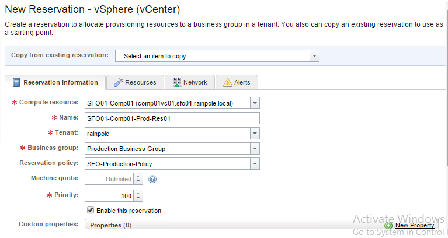

1.  Still on the **New Reservation - vSphere (vCenter)** page, click the **Resources** tab. 

2.  For **Memory** select **200** for **This Reservation**.

For **Storage,** reserve **4000** on **SDRS-Comp-Bronze** and **4000** on** SDRS-Comp-Gold**

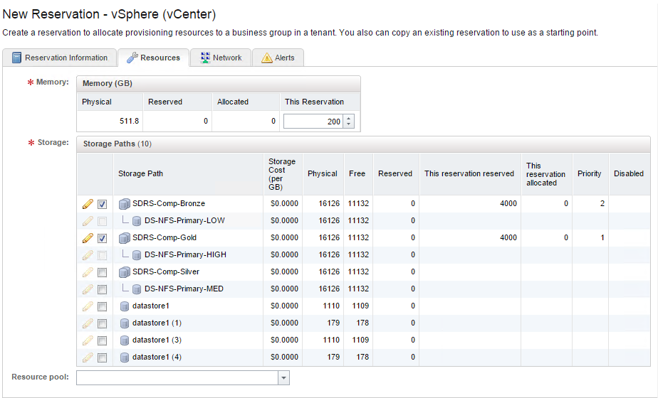

1.  Still on the **New Reservation - vSphere (vCenter)** page, click the **Network** tab and select the following port groups and network profiles for the **Production** business group.

| Port Group                         | Network Profile                |
|------------------------------------|--------------------------------|
| vxw-dvs-xxxxx-Production-Web-VXLAN | Ext-Net-Profile-Production-Web |
| vxw-dvs-xxxxx-Production-DB-VXLAN  | Ext-Net-Profile-Production-DB  |
| vxw-dvs-xxxxx-Production-App-VXLAN | Ext-Net-Profile-Production-App |

> 

1.  Click **OK** to save this reservation.

2.  Repeat the process to create a reservation for the **Development Business Group.** Use the same memory and storage, and use** **the following settings.

| Setting                | Value                                          |
|------------------------|------------------------------------------------|
| **Computer Resource**  | SFO01-Comp01 (comp01vc01.sfo01.rainpole.local) |
| **Name**               | SFO01-Comp01-DEV-RES01                         |
| **Tenant**             | rainpole                                       |
| **Business Group**     | Development Business Group                     |
| **Reservation Policy** | SFO-Development-Policy                         |
| **Priority**           | 100                                            |

| Port Group                          | Network Profile                 |
|-------------------------------------|---------------------------------|
| vxw-dvs-xxxxx-Development-Web-VXLAN | Ext-Net-Profile-Development-Web |
| vxw-dvs-xxxxx-Development-DB-VXLAN  | Ext-Net-Profile-Development-DB  |
| vxw-dvs-xxxxx-Development-App-VXLAN | Ext-Net-Profile-Development-App |

1.  Confirm that both reservations have been created successfully.

> 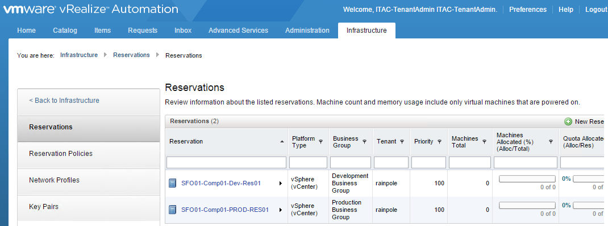

### Create a Reservation for the Edge Cluster

Before members of a business group can request virtual machines, fabric administrators must allocate resources to that business group by creating a reservation.  Each reservation is configured for a specific business group to grant them access to request virtual machines on a specified compute resource.

Prerequisites

-   Business groups have been created.

-   Fabric groups have been created.

-   Compute resources have been provisioned to fabric groups.

-   Reservation policies have been created properly.

Procedure

1.  From a Web browser, log in to the vRealize Automation console by connecting to **https://vra01svr01.rainpole.local/vcac/org/rainpole** and log in with the tenant admin account **ITAC-TenantAdmin@rainpole.local** with password ***tenant\_pwd***.

2.  Navigate to **Infrastructure** &gt; **Reservations** &gt; **Reservations** and click **New Reservation** &gt; **Virtual** &gt; **vSphere** (**vCenter**).

3.  On the **New Reservation - vSphere (vCenter)** page, click the **Reservation Information** tab and enter the following values.

| Setting                     | Value                                          |
|-----------------------------|------------------------------------------------|
| **Compute Resource**        | SFO01-Edge01 (comp01vc01.sfo01.rainpole.local) |
| **Name**                    | SFO01-Edge01-Prod-Res01                        |
| **Tenant**                  | rainpole                                       |
| **Business Group**          | Production Business Group                      |
| **Reservation Policy**      | SFO-Edge-Policy                                |
| **Priority**                | 100                                            |
| **Enable this reservation** | Checked                                        |

> 

1.  Still on the **New Reservation - vSphere (vCenter)** page, click the **Resources** tab.

2.  For **Memory**, select **200** for **This Reservation**. 

3.  For **Storage,** reserve **4000** on **SDRS-Comp-Bronze** and **4000** on **SDRS-Comp-Gold**.

> 

1.  On the **New Reservation - vSphere (vCenter)** page, click the **Network** tab and select the port group for the **Production Business Group**.

| Port Group                         | Network Profile                |
|------------------------------------|--------------------------------|
| vxw-dvs-xxxxx-Production-Web-VXLAN | Ext-Net-Profile-Production-Web |
| vxw-dvs-xxxxx-Production-DB-VXLAN  | Ext-Net-Profile-Production-DB  |
| vxw-dvs-xxxxx-Production-App-VXLAN | Ext-Net-Profile-Production-App |

> 

1.  Click **OK** to save this reservation.

2.  Repeat the process to create a reservation for the **Development Business Group.** Use the same memory and storage, and use** **the following settings:

| Setting                | Value                                          |
|------------------------|------------------------------------------------|
| **Computer Resource**  | SFO01-Edge01 (comp01vc01.sfo01.rainpole.local) |
| **Name**               | SFO01-Edge01-Dev-Res01                         |
| **Tenant**             | rainpole                                       |
| **Business Group**     | Development Business Group                     |
| **Reservation Policy** | SFO-Edge-Policy                                |
| **Priority**           | 100                                            |

| Port Group                          | Network Profile                 |
|-------------------------------------|---------------------------------|
| vxw-dvs-xxxxx-Development-Web-VXLAN | Ext-Net-Profile-Development-Web |
| vxw-dvs-xxxxx-Development-DB-VXLAN  | Ext-Net-Profile-Development-DB  |
| vxw-dvs-xxxxx-Development-App-VXLAN | Ext-Net-Profile-Development-App |

1.  Confirm that both reservations have been created successfully.

> 

Configure Single Machine Blueprints (Region A)
----------------------------------------------

Machine blueprints are the complete specification for a virtual, cloud, or physical machine. Blueprints determine a machine's attributes, the manner in which it is provisioned, and its policy and management settings.

This guide explains how to create single machine blueprints using the Computer vCenter Server instance comp01vc01.sfo01.rainpole.local as an example. The same steps can be applied to other vCenter Server instances.

Prerequisites

-   Verify that vRealize Automation is deployed and running.

-   Verify that the Rainpole tenant is created and configured.

-   Verify that at least one vCenter Server instances have been added to vRealize Automation. See “Prepare a Compute vCenter Server System for vRealize Automation (Region A)”.

Procedure Overview

1.  Create Service Catalog and Entitlements (Region A)

2.  Create a Single Machine Blueprint (Region A)

    1.  ### Create Service Catalog and Entitlements

A service catalog provides a common interface for consumers of IT services to request and manage the services and resources they need. This section demonstrates how to create a service catalog. VMware Validated Design users can then browse the catalog to request services they need, track their requests, and manage their provisioned service items.   

After the service catalog has been created, business group managers can create entitlements for services, catalog items, and resource actions to groups of users. It is necessary to add the entitlement. The entitlement allows members of a particular business group, in this example, the Production business group, to use the blueprint. Without the entitlement, users cannot use the blueprint. 

1.  The workflow requires that you create the entitlement before you create the blueprint itself.

Procedure

1.  From a Web browser, log in to the vRealize Automation console by connecting to **https://vra01svr01.rainpole.local/vcac/org/rainpole** and log in with the tenant admin account **ITAC-TenantAdmin@rainpole.local** with password **tenant\_pwd**.

2.  Create a service catalog, as follows:

<!-- -->

1.  Click the **Administration** tab, and click **Catalog Management &gt; Services** on the left. 

2.  In the **Add Service** dialog, specify the following settings, leave the default for the other text boxes, and click **Add**.

| Setting    | Value               |
|------------|---------------------|
| **Name**   | SFO Service Catalog |
| **Status** | Active              |

> 

1.  Create an entitlement, as follows.

<!-- -->

1.  With the **Administration** tab still selected, navigate to **Catalog Management** &gt; **Entitlement**. 

2.  In the **Add Entitlement** dialog box, select the **Details** tab, specify the following values, leave the default for the other text boxes, and click **Next**. 

| Setting            | Value                                                                                                                 |
|--------------------|-----------------------------------------------------------------------------------------------------------------------|
| **Name**           | Prod-SingleVM-Entitlement                                                                                             |
| **Status**         | Active                                                                                                                |
| **Business Group** | Production Business Group                                                                                             |
| **Users & Groups** | ug-ITAC-TenantAdmin                                                                                                   

                      Note: After you enter the name, it changes in the display, as shown in the screen shot below. This is to be expected.  |

> 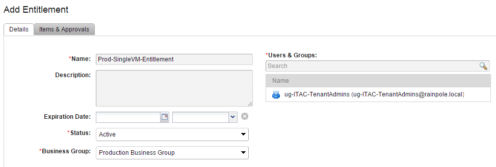

1.  Select the **Items & Approvals** tab.

<!-- -->

1.  Leave both the **Entitled Services** and **Entitled Catalog Items** empty for now. You will add the catalog items in this dialog box after you create them at a later time.

2.   Click the **Add** icon above **Entitlement Actions** and add the following actions: 

-   Connect by Using RDP (Machine).

-   Power Cycle (Machine)

-   Power Off (Machine)

-   Power On (Machine)

-   Reboot (Machine)

-   Shutdown (Machine)

> 

1.  Click **Add**.

> Repeat the entitlement creation steps to create an entitlement **Dev-SingleVM-Entitlement** for the **Development business group**. Use the same Entitled Actions as for the Production business group.

| Entitlement Name         | Status | Business Group             | User & Groups       |
|--------------------------|--------|----------------------------|---------------------|
| Dev-SingleVM-Entitlement | Active | Development Business Group | ug-ITAC-TenantAdmin |

> 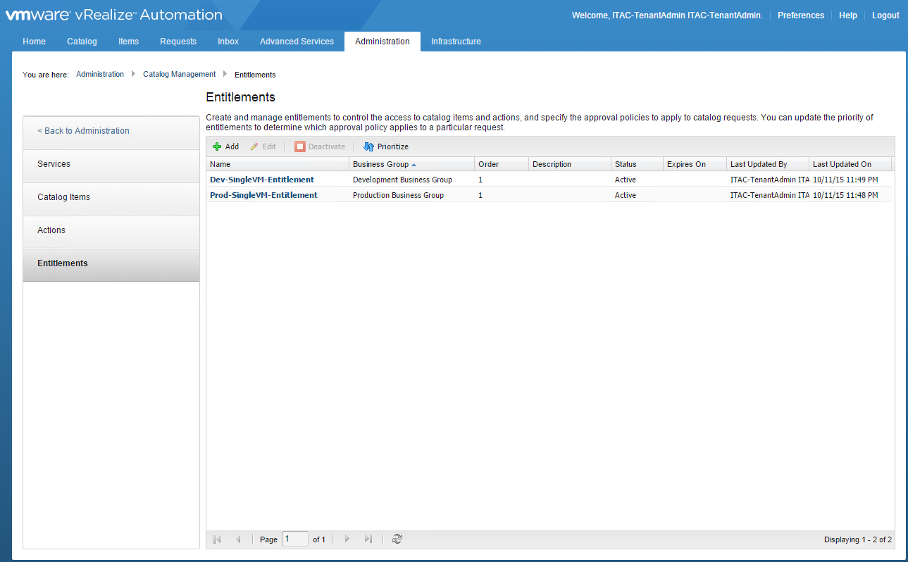

### Create a Single Machine Blueprint

A blueprints is the complete specification for a virtual, cloud, or physical machine. Blueprints determine a machine's attributes, the manner in which it is provisioned, and its policy and management settings.

In this section, you create a blueprint for cloning the windows-2012r2-64 virtual machine using the pre-specified resources on the Compute vCenter Server. Tenants can later use this blueprint for automatic provisioning.

Procedure

1.  From a Web browser, log in to the vRealize Automation console by connecting to **https://vra01svr01.rainpole.local/vcac/org/rainpole** and log in with the tenant admin account **ITAC-TenantAdmin@rainpole.local** with password ***tenant\_pwd***.

2.  Navigate to** Infrastructure** &gt; **Blueprints** &gt;** Blueprints**. 

3.  Click **New Blueprints** &gt; **Virtual** &gt; **vSphere (vCenter)**.

4.  In the **New Blueprint - vSphere (vCenter)** dialog, select the **Blueprint Information** tab, provide the following values, and click **OK.**

| Setting                | Value                             |
|------------------------|-----------------------------------|
| **Name**               | Windows Server 2012 R2 - SFO Prod |
| **Reservation Policy** | SFO-Production-Policy             |
| **Machine Prefix**     | Use group default                 |
| **Archive (days)**     | 15                                |

> 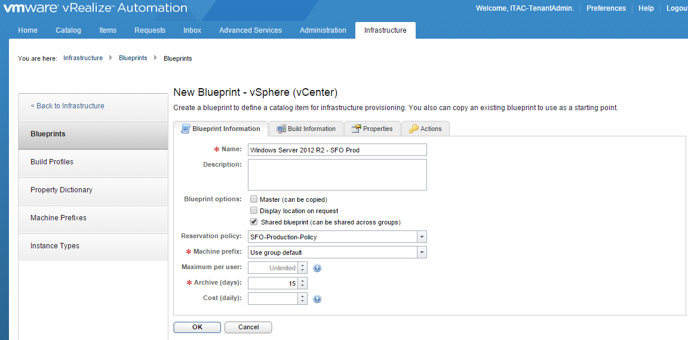

1.  Select the **Build Information** tab and specify the values in the following table, and click **OK** to save the blueprint.

> The system updates the storage volume to match the storage volume for the virtual machine that you are cloning. 

1.  If some VM templates are not visible in the selection list, run data collection on the cluster where the VM templates are located.  See the*** **Add Compute Resources to a Fabric Group* section under ***Add a Compute vCenter to vRealize Automation*** for details. vRealize Automation pulls the inventory data only periodically from the vCenter Server system, so you have to manually trigger the inventory update if you uploaded VM templates after the last data collection. 

| Setting                   | Value                                                      |
|---------------------------|------------------------------------------------------------|
| **Blueprint type**        | Server                                                     |
| **Action**                | Clone                                                      |
| **Provisioning workflow** | CloneWorkflow                                              |
| **Clone from**            | windows-2012r2-64 *(from comp01vc01.sfo01.rainpole.local)* |
| **Customization spec**    | itac-windows-joindomain-custom-spec                        |

| Setting           | Minimum | Maximum |
|-------------------|---------|---------|
| **CPU**           | 1       | 4       |
| **Memory (MB):**  | 4096    | 16384   |
| **Storage (GB):** | 50      | 60      |
| **Lease (days):** | 30      | 270     |

> 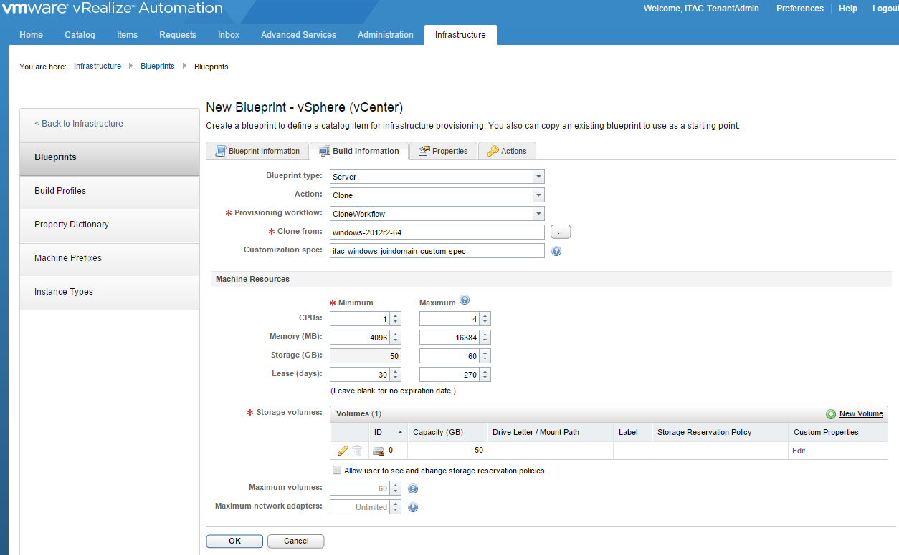

1.  Hover over the blueprint and click **Publish** to publish the blueprint.

2.  Configure the blueprint by following these steps:

<!-- -->

1.  With the **Administration** tab still selected, navigate to **Catalog Management** &gt;** Catalog Items** and select the **Windows Server 2012 R2 - SFO Prod** blueprint in the **Catalog Items** list.

2.  In the **Configure Catalog Items** dialog box, set **Service** to **SFO Service Catalog** and click **Update**.

> 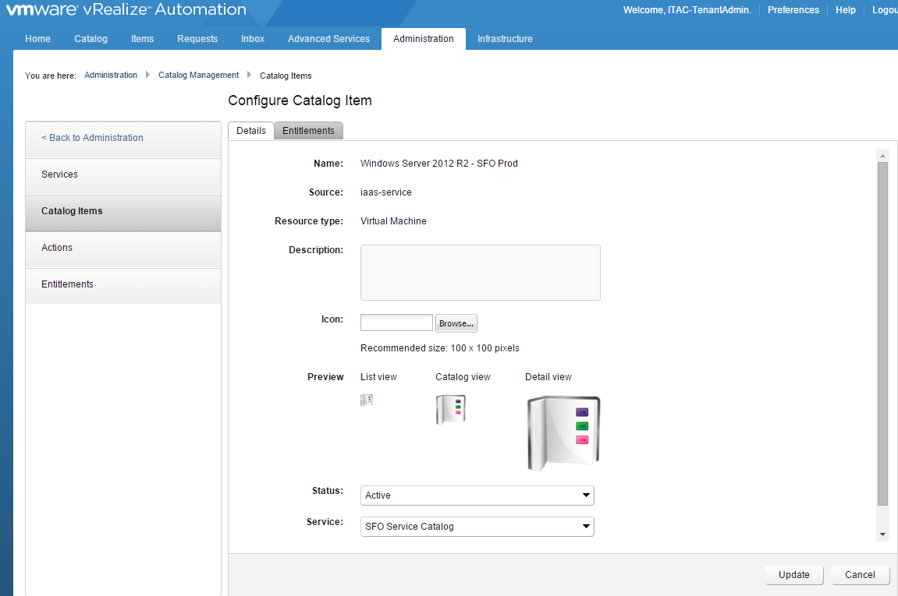

1.  Associate the blueprint with the two entitlements, **Prod-SingleVM-Entitlement** and **Dev-SingleVM-Entitlement**, created earlier.

<!-- -->

1.  Click **Entitlements** and select **Prod-SingleVM-Entitlement** to bring up the **Edit Entitlement** pane. 

2.  Select the** Items & Approvals** tab and add the **Windows Server 2012 R2 - SFO Prod** blueprint to the **Entitled Catalog Items** list.

3.  Click **Update** to save the changes.

4.  Repeat the steps for **Dev-SingleVM-Entitlement**.

> 

1.  Select the **Catalog** tab and verify that the blueprint is shown there. 

> 

1.  Repeat the steps to create additional blueprints using the settings in the table below.

| Blueprint Name                                 | VM Template                                                | Reservation Policy     | Service Catalog     | Add to Entitlement        |
|------------------------------------------------|------------------------------------------------------------|------------------------|---------------------|---------------------------|
| Windows Server 2012 R2 - SFO Dev               | windows-2012r2-64 (comp01vc01.sfo01.rainpole.local)        | SFO-Development-Policy | SFO Service Catalog | Dev-SingleVM-Entitlement  |
| Windows Server 2012 R2 With SQL2012 - SFO Prod | windows-2012r2-64-sql2012(comp01vc01.sfo01.rainpole.local) | SFO-Production-Policy  | SFO Service Catalog | Prod-SingleVM-Entitlement |
| Windows Server 2012 R2 With SQL2012 - SFO Dev  | windows-2012r2-64-sql2012(comp01vc01.sfo01.rainpole.local) | SFO-Development-Policy | SFO Service Catalog | Dev-SingleVM-Entitlement  |
| Redhat Enterprise Linux 6 - SFO Prod           | redhat6-enterprise-64(comp01vc01.sfo01.rainpole.local)     | SFO-Production-Policy  | SFO Service Catalog | Prod-SingleVM-Entitlement |
| Redhat Enterprise Linux 6 - SFO Dev            | redhat6-enterprise-64(comp01vc01.sfo01.rainpole.local)     | SFO-Development-Policy | SFO Service Catalog | Dev-SingleVM-Entitlement  |
