Version History

| Date        | Ver. | Author     | Description                                                             | Reviewers |
|-------------|------|------------|-------------------------------------------------------------------------|-----------|
| 15-Feb-2016 | 1.0  | ISBU / PSE | General Availability of VMware Validated Design for IT Automation Cloud | Tech Pubs |

© 2016 VMware, Inc. All rights reserved. This product is protected by U.S. and international copyright and intellectual property laws. This product is covered by one or more patents listed at [http://www.vmware.com/download/patents.html](http://www.microsoft.com/).

VMware is a registered trademark or trademark of VMware, Inc. in the United States and/or other jurisdictions. All other marks and names mentioned herein may be trademarks of their respective companies.

VMware, Inc.
3401 Hillview Avenue
Palo Alto, CA 94304
www.vmware.com

Contents

[1. Purpose and Assumptions 5](#_Toc443067917)

[2. Virtual Infrastructure Implementation in Region B 6](#virtual-infrastructure-implementation-in-region-b)

[2.1 Install and Configure ESXi Hosts (Region B) 6](#install-and-configure-esxi-hosts-region-b)

[2.2 Deploy and Configure the Management Cluster Components (Region B) 20](#deploy-and-configure-the-management-cluster-components-region-b)

[2.3 Deploy and Configure the Management Cluster NSX Instance (Region B) 68](#deploy-and-configure-the-management-cluster-nsx-instance-region-b)

[2.4 Deploy and Configure Gateway for the Management Networks (Region B) 87](#deploy-and-configure-gateway-for-the-management-networks-region-b)

[2.5 Configure Network Connectivity Between Regions 105](#configure-network-connectivity-between-regions)

[2.6 Deploy and Configure the Compute and Edge Clusters Components (Region B) 122](#deploy-and-configure-the-compute-and-edge-clusters-components-region-b)

[2.7 Deploy and Configure the Compute and Edge Clusters NSX Instance (Region B) 176](#deploy-and-configure-the-compute-and-edge-clusters-nsx-instance-region-b)

[2.8 Deploy and Configure Gateways for the Management Application Networks (Region B) 196](#deploy-and-configure-gateways-for-the-management-application-networks-region-b)

[2.9 Deploy and Configure VMware Site Recovery Manager 219](#deploy-and-configure-vmware-site-recovery-manager)

[2.10 Deploy and Configure vSphere Replication 237](#deploy-and-configure-vsphere-replication)

[2.11 Replace Certificates (Region B) 260](#replace-certificates-region-b)

[2.12 Deploy vSphere Data Protection in Region B 279](#deploy-vsphere-data-protection-in-region-b)

[3. vRealize Operations Implementation in Region B 295](#vrealize-operations-implementation-in-region-b)

[3.1 Deploy vRealize Operations Manager in Region B 295](#deploy-vrealize-operations-manager-in-region-b)

[3.2 Configure Load Balancer for vRealize Operations Manager in Region B 308](#configure-load-balancer-for-vrealize-operations-manager-in-region-b)

[3.3 Connect vRealize Operations Manager to the vSphere Environment in Region B 318](#connect-vrealize-operations-manager-to-the-vsphere-environment-in-region-b)

[3.4 Connect vRealize Operations Manager to the NSX Managers in Region B 325](#connect-vrealize-operations-manager-to-the-nsx-managers-in-region-b)

[3.5 Add Storage Devices Adapters for Region B in vRealize Operations Manager 332](#add-storage-devices-adapters-for-region-b-in-vrealize-operations-manager)

[3.6 Extend User Access in vRealize Operations Manager in Region B 336](#extend-user-access-in-vrealize-operations-manager-in-region-b)

[4. vRealize Log Insight Implementation in Region B 342](#vrealize-log-insight-implementation-in-region-b)

[4.1 Deploy vRealize Log Insight in Region B 342](#deploy-vrealize-log-insight-in-region-b)

[4.2 Connect vRealize Log Insight to the vSphere Environment in Region B 362](#connect-vrealize-log-insight-to-the-vsphere-environment-in-region-b)

[4.3 Install a CA-Signed Certificate on vRealize Log Insight in Region B 369](#install-a-ca-signed-certificate-on-vrealize-log-insight-in-region-b)

[4.4 Configure Log Retention and Archiving in Region B 375](#configure-log-retention-and-archiving-in-region-b)

[4.5 Connect vRealize Log Insight to vRealize Operations Manager in Region B 377](#connect-vrealize-log-insight-to-vrealize-operations-manager-in-region-b)

[4.6 Connect vRealize Log Insight to the NSX Instances in Region B 384](#connect-vrealize-log-insight-to-the-nsx-instances-in-region-b)

[4.7 Connect vRealize Log Insight to vRealize Automation in Region B 394](#connect-vrealize-log-insight-to-vrealize-automation-in-region-b)

[4.8 Configure Event Forwarding Between Region A and Region B 398](#configure-event-forwarding-between-region-a-and-region-b)

[5. Cloud Management Platform Implementation in Region B 404](#cloud-management-platform-implementation-in-region-b)

[5.1 Create vSphere Image Customization Specifications (Region B) 404](#create-vsphere-image-customization-specifications-region-b)

[5.2 Configure Load Balancing for vRealize Automation and vRealize Orchestrator in Region B (Region B) 412](#configure-load-balancing-for-vrealize-automation-and-vrealize-orchestrator-in-region-b-region-b)

[5.3 Configure a vRealize Automation Tenant (Region B) 432](#configure-a-vrealize-automation-tenant-region-b)

[5.4 Prepare a Compute vCenter Server System for vRealize Automation (Region B) 434](#prepare-a-compute-vcenter-server-system-for-vrealize-automation-region-b)

[5.5 Add a Compute vCenter Server Instance to vRealize Automation (Region B) 455](#add-a-compute-vcenter-server-instance-to-vrealize-automation-region-b)

[5.6 Configure Single Machine Blueprints (Region B) 482](#configure-single-machine-blueprints-region-b)

[5.7 Configure Unified Single Machine Blueprints for Cross-Region Deployment (Region B) 489](#configure-unified-single-machine-blueprints-for-cross-region-deployment-region-b)

Purpose and Assumptions
============================================================================================================================================================================================================================================================================================================================================================================================================================================================================================================================================================

The VMware Validated Design for IT Automation Cloud Installation and Configuration Procedures provide step-by-step instructions for installing, configuring, and operating a software-defined data center based on a VMware Validated Design called IT Automation Cloud.

It does not cover step-by-step instructions for performing all of the required post-configuration tasks, as these are often dependent on the customer requirements.

For easier consumption these installation and configuration procedures have been broken down into smaller documents as defined in the table below:

Table 1. Installation and Configuration Procedures Document Set

| Document Name                | Description                                                                                                                                                                                 |
|------------------------------|---------------------------------------------------------------------------------------------------------------------------------------------------------------------------------------------|
| 1.  Planning and Preparation | Detailed information surrounding the requirements of software, tools and external services required to successfully implement the VMware Validated Design for IT Automation Cloud platform. |
| 1.  Deployment of Region A   | Step-by-step instructions for installing and configuring all components deployed within Region A of the VMware Validated Design for IT Automation Cloud platform.                           |
| 1.  Deployment of Region B   

 (This Document)               | Step-by-step instructions for installing and configuring all components deployed within Region B of the VMware Validated Design for IT Automation Cloud platform.                           |
| 1.  Operational Guidance     | Step-by-step instructions for performing operational tasks such as monitoring, alerting and business continuity operations of the VMware Validated Design for IT Automation Cloud platform. |

The documents are written with the assumption that the reader that uses these procedures is already familiar with the products. It’s not intended for those that have no prior knowledge of the concepts and terminology. 

1.  Virtual Infrastructure Implementation in Region B
    =================================================

    1.  Install and Configure ESXi Hosts (Region B)
        -------------------------------------------

Start the deployment of your virtual infrastructure by installing and configuring all the ESXi hosts.

-   Prerequisites for Installation of ESXi Hosts in Region B

-   Install ESXi Interactively on All Hosts (Region B)

-   Configure the Network on All Hosts (Region B)

-   Configure vSphere Standard Switch on a Host in the Management Cluster (Region B)

-   Configure NTP on All Hosts (Region B)

-   Set Up Virtual SAN Datastore (Region B)

Prerequisites for Installation of ESXi Hosts in Region B

Install and configure the ESXi hosts for the management cluster, compute cluster, and edge cluster by using the same process.

Before you start

-   Make sure that you have a Windows host that has access to your data center. You use this host to connect to your hosts and perform configuration steps.

-   Ensure that Routing is in place between the two regional management networks 172.16.11.0/24 and 172.17.11.0/24 as this will be needed to join the common SSO domain.

You must also prepare the installation files.

-   Download the ESXi ISO installer.

-   Create a bootable USB drive that contains the ESXi Installation. For more information, see [Format a USB Flash Drive to Boot the ESXi Installation or Upgrade](https://pubs.vmware.com/vsphere-60/index.jsp?topic=%2Fcom.vmware.vsphere.install.doc%2FGUID-33C3E7D5-20D0-4F84-B2E3-5CD33D32EAA8.html) in the *vSphere Installation and Setup* documentation.

IP Addresses, Hostnames, and Network Configuration

The following tables contain all the values needed to configure your hosts.

Table 2. Management Cluster Hosts in Region B

| Hostname    | FQDN                             | IP            |
|-------------|----------------------------------|---------------|
| mgmt01esx51 | mgmt01esx51.lax01.rainpole.local | 172.17.11.101 |
| mgmt01esx52 | mgmt01esx52.lax01.rainpole.local | 172.17.11.102 |
| mgmt01esx53 | mgmt01esx53.lax01.rainpole.local | 172.17.11.103 |
| mgmt01esx54 | mgmt01esx54.lax01.rainpole.local | 172.17.11.104 |

Table 3. Management Cluster Global Settings in Region A

| Setting             | Value                    |
|---------------------|--------------------------|
| **Management VLAN** | 1711                     |
| **Default Gateway** | 172.17.11.253            |
| **NTP Server**      | ntp.lax01.rainpole.local |

Table 4. Compute Cluster Hosts in Region B

| Hostname    | FQDN                             | IP            |
|-------------|----------------------------------|---------------|
| comp01esx51 | comp01esx51.lax01.rainpole.local | 172.17.21.101 |
| comp01esx52 | comp01esx52.lax01.rainpole.local | 172.17.21.102 |
| comp01esx53 | comp01esx53.lax01.rainpole.local | 172.17.21.103 |
| comp01esx54 | comp01esx54.lax01.rainpole.local | 172.17.21.104 |

Table 5. Compute Cluster Global Settings in Region A

| Setting             | Value                    |
|---------------------|--------------------------|
| **Management VLAN** | 1721                     |
| **Default Gateway** | 172.17.21.253            |
| **NTP Server**      | ntp.lax01.rainpole.local |

Table 6. Edge Cluster Hosts in Region B

| Hostname    | FQDN                             | IP            |
|-------------|----------------------------------|---------------|
| edge01esx51 | edge01esx51.lax01.rainpole.local | 172.17.31.101 |
| edge01esx52 | edge01esx52.lax01.rainpole.local | 172.17.31.102 |
| edge01esx53 | edge01esx53.lax01.rainpole.local | 172.17.31.103 |
| edge01esx54 | edge01esx54.lax01.rainpole.local | 172.17.31.104 |

Table 7. Edge Cluster Global Settings in Region A

| Setting             | Value                    |
|---------------------|--------------------------|
| **Management VLAN** | 1731                     |
| **Default Gateway** | 172.17.31.253            |
| **NTP Server**      | ntp.lax01.rainpole.local |

### Install ESXi Interactively on All Hosts (Region B)

-   Install all ESXi hosts for all clusters interactively.

Procedure

1.  Power on mgmt01esx51 host in Region B, mount the USB drive containing the ESXi ISO file, and boot from that USB drive. 

2.  On the **Welcome to** the **VMware 6.0.0 Installation** screen, press **Enter** to start the installation.

3.  On the **End User License Agreement (EULA)** screen, press the **F11** to accept the **EULA**.

4.  On the **Select a Disk to Install or Upgrade** screen, select the USB drive or SD card under local storage to install ESXi, and press **Enter** to continue.

> <embed src="media/image2.png" width="401" height="202" />

1.  Select the keyboard layout, and press **Enter**. 

> <embed src="media/image3.png" width="296" height="183" />

1.  Enter the **esxi\_root\_user\_password**, confirm, and press **Enter**. 

> <embed src="media/image4.png" width="445" height="199" />

1.  On the **Confirm Install** screen, press **F11** to start the installation.

2.  After the installation has completed, unmount the USB drive, and press **Enter** to reboot the host.

> <embed src="media/image5.png" width="403" height="226" />

1.  Repeat all steps for all hosts in the data center, enter the respective values for each host that you configure.

    1.  ### Configure the Network on All Hosts (Region B)

After the initial boot, use the ESXi Direct Console User Interface (DCUI) for initial host network configuration and administrative access. You configure the following host network settings:

-   Set network adapter (vmk0) and VLAN ID for the Management Network.

-   Set IP address, subnet mask, gateway, DNS server and host FQDN for the ESXi host.

Procedure

1.  Open the DCUI on the physical ESXi host **mgmt01esx51**.

    1.  Open a console window to the host.

    2.  Press **F2** to enter the DCUI.

    3.  Enter **root** as login name, and **esxi\_root\_user\_password**, and press Enter. 

<!-- -->

1.  Configure the network.

<!-- -->

1.  Select **Configure Management Network** and press **Enter**.

2.  Select **Network Adapters** and press Enter.

3.  Select **VLAN (Optional)** and press **Enter**.

4.  Enter **1711** as VLAN ID for the Management Network and press **Enter**.

> <embed src="media/image6.png" width="479" height="246" />

1.  Select **IP Configuration** and press **Enter**.

2.  Configure IPv4 network by using the following settings, and press **Enter**.

| Option                                                | Value         |
|-------------------------------------------------------|---------------|
| **Set static IPv4 address and network configuration** | Selected      |
| **IPv4 Address**                                      | 172.17.11.101 |
| **Subnet Mask**                                       | 255.255.255.0 |
| **Default Gateway**                                   | 172.17.11.253 |

> <embed src="media/image7.png" width="614" height="151" />

1.  Select **DNS Configuration** and press **Enter**. 

2.  Configure the DNS by using the following settings, and press **Enter**.

| Option                                                | Value       |
|-------------------------------------------------------|-------------|
| **Use the following DNS Server address and hostname** | Selected    |
| **Primary DNS Server**                                | 172.17.11.5 |
| **Hostname**                                          | mgmt01esx51 |

1.  Select **Custom DNS Suffixes** and press **Enter**.

2.  Enter **lax01.rainpole.local** as suffix, and press **Enter**.

<!-- -->

1.  After completing all host network settings, press **Escape** to exit, and press **Y** to confirm the changes. 

> <embed src="media/image8.png" width="545" height="234" />

1.  Repeat all steps for all hosts in the management, compute, and edge pods, enter the respective values from the prerequisites section for each host that you configure.

    1.  ### Configure vSphere Standard Switch on a Host in the Management Cluster (Region B)

You must perform network configuration from the vSphere Client only for the mgmt01esx51 host. You perform all other host networking configuration after deployment of the vCenter Server systems that manage the hosts.

You configure a vSphere Standard Switch with two port groups:

-   Virtual machine port group.

-   VMkernel port group.

This configuration provides connectivity and common network configuration for virtual machines that reside on each host. 

Procedure

1.  Install the VMware vSphere Client to manage the mgmt01esx51 host.

<!-- -->

1.  Log in to the Windows host that has access to your data center as an administrator.

2.  In a browser, go to **https://mgmt01esx51.lax01.rainpole.local**.

3.  On the **VMware ESXi Welcome** page, click **Download vSphere Client for Windows**.

4.  Download and install the vSphere Client.

<!-- -->

1.  Log in to the **mgmt01esx51.lax01.rainpole.local** host by using the vSphere Client.

2.  Open the vSphere Client, go to **Start** &gt; **All Programs** &gt; **VMware** &gt; **VMware vSphere Client**.

3.  Log in by using the following values.

| Option                | Value                            |
|-----------------------|----------------------------------|
| **IP address / Name** | mgmt01esx51.lax01.rainpole.local |
| **User name**         | root                             |
| **Password**          | esxi\_root\_user\_password       |

1.  Create new VMkernel Connection.

<!-- -->

1.  On the **Home** page, click **Inventory**, click the **Configuration** tab, and click **Networking**.

> <embed src="media/image9.png" width="579" height="188" />

1.  Click **vSphere Standard Switch**, and click **Properties** next to the **vSwitch0**.

2.  In the **vSwitch0 Properties** window, click **Add**.

3.  In the **Add Network Wizard**, on the **Connection Type** page, select **VMkernel**, and click **Next**.

4.  On the **VMkernel - Connection Settings** page, enter the following settings, and click **Next**.

| Option            | Value |
|-------------------|-------|
| **Network Label** | VSAN  |
| **VLAN ID**       | 1713  |

1.  On the **VMkernel - IP Connection Settings** page, enter the following settings, and click Next.

| Option          | Value         |
|-----------------|---------------|
| **IP Address**  | 172.17.13.101 |
| **Subnet Mask** | 255.255.255.0 |

1.  On **Ready to Complete** page, click **Finish**.

    1.  ### Configure NTP on All Hosts (Region B)

Time synchronization issues can result in serious problems with your environment. Configure NTP for each of your hosts in the management, compute, and edge clusters.

1.  Log in to the **mgmt01esx51.lax01.rainpole.local** host by using the vSphere 6.0 Client. 

<!-- -->

1.  Log in to the Windows host that has access to your data center as an administrator.

2.  Open the VMware vSphere Client, go to **Start** **&gt; All Programs** &gt; **VMware** &gt; **VMware vSphere Client**.

3.  Log in by using the following values.

| Option                | Value                             |
|-----------------------|-----------------------------------|
| **IP address / Name** | mgmt01esx51.lax01.rainpole.local  |
| **User name**         | root                              |
| **Password**          | esxi\_root\_user\_password        |

1.  Configure the NTP Daemon (ntpd).

<!-- -->

1.  Click **Configuration**, click **Time Configuration**, and click **Properties**.

> <embed src="media/image10.png" width="471" height="294" />

1.  In the **Time Configuration** dialog box, select the **NTP Client Enabled** check box, and click **Options**.

2.  In the **NTP Daemon (ntpd) Options** dialog box, select **General** on the left, and select **Start and stop with host** as the Startup Policy.

> <embed src="media/image11.png" width="520" height="264" />

1.  In the **NTP Daemon (ntpd) Options** dialog box, select **NTP Settings**, and click **Add**.

2.  Enter **ntp.lax01.rainpole.local** and click **OK**. 

3.  Select the **Restart NTP service to apply changes** check box, and click **OK**.

> <embed src="media/image12.png" width="520" height="264" />

1.  Click **OK** again to exit the **Time Configuration** dialog box.

2.  Repeat all steps for all hosts in the data center, enter the respective values to log in on each host that you configure.

    1.  ### Set Up Virtual SAN Datastore (Region B)

Before you can use Virtual SAN storage in your environment, you must set it up. This process is divided into two main tasks:

-   Bootstrap the first ESXi host from the command line and create the Virtual SAN datastore.

-   After vCenter Server installation, perform Virtual SAN configuration for all other hosts from the vSphere Web Client. 

Procedure

1.  Open the ESXi Shell on the physical ESXi host **mgmt01esx51.lax01.rainpole.local**.

<!-- -->

1.  Open a console window to the host.

2.  Press **Alt+F1** to access the ESXi Shell. 

3.  Enter **root** as localhost login and press **Enter**.

4.  Enter the **esxi\_root\_user\_password** and press **Enter**.

<!-- -->

1.  Execute the following command to determine the current Virtual SAN storage policy.

> esxcli vsan policy getdefault
>
> <embed src="media/image13.png" width="515" height="113" />

1.  Modify the default Virtual SAN storage policy to force provisioning of Virtual SAN datastore without generating errors.
    esxcli vsan policy setdefault -c vdisk -p "((\\"hostFailuresToTolerate\\" i1) (\\"forceProvisioning\\" i1))"
    esxcli vsan policy setdefault -c vmnamespace -p "((\\"hostFailuresToTolerate\\" i1) (\\"forceProvisioning\\" i1))"
    esxcli vsan policy getdefault

> <embed src="media/image14.png" width="515" height="75" />

1.  List the devices and determine the device name for the SSD and HDD.  These disks will be used to provision the Virtual SAN datastore.
    vdq -q
    Identify all devices that can be used by Virtual SAN.

| Property  | SDD Value                | HDD Value                |
|-----------|--------------------------|--------------------------|
| **State** | Eligible for use by VSAN | Eligible for use by VSAN |
| **IsSSD** | 1                        | 0                        |

> <embed src="media/image15.png" width="264" height="694" />

1.  Generate the Virtual SAN cluster UUID and create the Virtual SAN cluster.
    python -c 'import uuid; print str(uuid.uuid4());'

<!-- -->

1.  You need the $UUID\_GENERATED from the generated output for the next command.

> esxcli vsan cluster join -u &lt;UUID\_GENERATED&gt;
>
> esxcli vsan cluster get
> <embed src="media/image16.png" width="560" height="226" />

1.  Create Virtual SAN datastore by using the available SSD and HDD disks determined in the previous step.
    esxcli vsan storage add -s &lt;SSD\_Device\_name&gt; -d &lt;HDD\_Device\_Name&gt;

<embed src="media/image17.png" width="624" height="11" />

1.  Verify that the Virtual SAN datastore has been created successfully.

> esxcli storage filesystem list
>
> <embed src="media/image18.png" width="554" height="132" />

Virtual SAN datastore is now created and ready for the Management vCenter Server installation.

Deploy and Configure the Management Cluster Components (Region B)
-----------------------------------------------------------------

-   Configure Temporary Routing for the Management Components in Region A

-   Deploy the External Platform Services Controller for the Management vCenter Server (Region B)

-   Join the Platform Services Controller for the Management vCenter Server to the Active Directory (Region B)

-   Deploy the Management vCenter Server Instance (Region B)

-   Configure the Management Cluster (Region B)

-   Configure the Distributed Virtual Switch for the Management Cluster (Region B)

-   Configure the Link Aggregation Control Protocol for the Management Cluster (Region B)

-   Change the Default Domain Administration Group on the ESXi Hosts in the Management Cluster (Region B)

-   Mount NFS Storage for Management Cluster (Region B)

    1.  ### Configure Temporary Routing for the Management Components in Region A

You must establish connectivity to the management cluster components in Region A before you can deploy the management cluster components in Region B.

Add static routes on the Management Platform Services Controller and vCenter Server instances in Region A so that they use the physical router to connect to the Region B management networks. Remove these static routes after you configure VPN and BGP routing.

**Procedure**

1.  Add static route on the Management Platform Service Controller to the physical router.

    1.  Log in to the **mgmt01psc01.sfo01.rainpole.local** virtual appliance over SSH with the root user name and ***mgmtpsc\_root\_password*** password.

    2.  Run the following console command to add a static route.

        ip route add 172.17.11.0/24 via 172.16.11.253

<!-- -->

1.  Add static route on the Management vCenter Server to the physical router.

    1.  Log in to the **mgmt01vc01.sfo01.rainpole.local** virtual appliance over SSH with the root user name and ***mgmtvc\_root\_password*** password.

    2.  Run the following console command to add a static route.

        ip route add 172.17.11.0/24 via 172.16.11.253

2.  Add static route on the Compute Platform Service Controller to the physical router.

    1.  Log in to the **comp01psc01.sfo01.rainpole.local** virtual appliance over SSH with the root user name and ***mgmtpsc\_root\_password*** password.

    2.  Run the following console command to add a static route.

        ip route add 172.17.11.0/24 via 172.16.11.253

3.  Add static route on the Compute vCenter Server to the physical router.

    1.  Log in to the **comp01vc01.sfo01.rainpole.local** virtual appliance over SSH with the root user name and ***mgmtvc\_root\_password*** password.

    2.  Run the following console command to add a static route.

        ip route add 172.17.11.0/24 via 172.16.11.253

        1.  ### Deploy the External Platform Services Controller for the Management vCenter Server (Region B)

You must first install the external Platform Services Controller instance from the vCenter Server appliance ISO file. 

Procedure

1.  Log in to the Windows host that has access to your data center as an administrator.

2.  Install the VMware Client Integration Plug-in.

<!-- -->

1.  Browse the vCenter Server Appliance ISO file.

2.  Navigate to the **vcsa** directory.

3.  Start the **VMware-ClientIntegrationPlugin-x.x.x.exe** file.

4.  Follow the prompts and finish the installation.

<!-- -->

1.  Start the VMware vCenter Server Appliance Deployment Wizard.

<!-- -->

1.  Browse to the vCenter Server Appliance ISO file.

2.  Open the **vcsa-setup.html** file in a Web browser. 

3.  Click **Install** to start the installation.

> 

1.  Complete the **VMware vCenter Server Appliance Deployment** wizard.

<!-- -->

1.  On the **End User License Agreement** page, select the **I accept the terms of the license agreement** check box, and click **Next**.

> 

1.  On the **Connect to target server** page, enter the following settings, and click **Next**.

| Setting                | Value                            |
|------------------------|----------------------------------|
| **FQDN or IP Address** | mgmt01esx51.lax01.rainpole.local |
| **User name**          | root                             |
| **Password**           | esxi\_root\_user\_password       |

> <embed src="media/image21.png" width="413" height="265" />

1.  In the **Certificate Warning** dialog box, click **Yes** to accept the host certificate.

> <embed src="media/image22.png" width="324" height="226" />

1.  On the **Set up virtual machine** page, enter the following settings, and click **Next**.

| Setting                 | Value                   |
|-------------------------|-------------------------|
| **Appliance name**      | mgmt01psc51.lax01       |
| **OS password**         | mgmtpsc\_root\_password |
| **Confirm OS password** | mgmtpsc\_root\_password |

> <embed src="media/image23.png" width="414" height="264" />

1.  On the **Select deployment type** page, under **External Platform Services Controller,** select the **Install Platform Services Controller** radio button, and click **Next**.

> 

1.  On the **Set up Single Sign-on (SSO)** page, select the **Join an SSO domain in an existing vCenter 6.0 platform services controller** radio button, enter the following settings, and click **Next**.

| Setting                                                 | Value                            |
|---------------------------------------------------------|----------------------------------|
| **Platform Services Controller** **FQDN or IP address** | mgmt01psc01.sfo01.rainpole.local |
| **vCenter SSO Password**                                | vcenter\_admin\_password         |
| **Port**                                                | 443                              |

> <embed src="media/image25.png" width="414" height="264" />

1.  On the **Single Sign-on site **page, select the **Create a new site** radio button, enter **LAX01** as Site name, and click **Next**.

> <embed src="media/image26.png" width="415" height="264" />

1.  On the **Select appliance size** page, click **Next**.

> 

1.  On the **Select datastore** page, select the **vsanDatastore** datastore to deploy the Platform Services Controller on, select the **Enable Thin Disk Mode** check box, and click **Next**.

> 

1.  On the **Network Settings** page, enter the following settings,** **and click **Next**.

| Setting                 | Value                            |
|-------------------------|----------------------------------|
| **Choose a network**    | VM Network                       |
| **IP address family**   | IPv4                             |
| **Network type**        | Static                           |
| **Network address**     | 172.17.11.61                     |
| **System name**         | mgmt01psc51.lax01.rainpole.local |
| **Subnet mask**         | 255.255.255.0                    |
| **Network gateway**     | 172.17.11.253                    |
| **Network DNS servers** | 172.17.11.5                      |
| **Configure time sync** | ntp.lax01.rainpole.local         |
| **Enable SSH**          | Enabled (Select checkbox)        |

> <embed src="media/image29.png" width="384" height="245" />

1.  On the **Ready to complete** page, review the configuration, and click **Finish** to start the deployment.

 

### Join the Platform Services Controller for the Management vCenter Server to the Active Directory (Region B)

After you have successfully installed the Platform Services Controller instance, you must add the appliance to your Active Directory domain.

**Procedure**

1.  Log in to the Platform Services Controller administration interface.

<!-- -->

1.  In a browser, go to **https://mgmt01psc51.lax01.rainpole.local/psc**.

2.  Enter the following credentials, and click **Login**.

| Setting       | Value                       |
|---------------|-----------------------------|
| **User name** | administrator@vsphere.local |
| **Password**  | vcenter\_admin\_password    |

> <embed src="media/image30.png" width="394" height="231" />

1.  Add the management Platform Services Controller instance to the Active Directory domain.

<!-- -->

1.  In the **Navigator**, click **Appliance Settings**, click the **Manage **tab, and click the **Join **button.

> <embed src="media/image31.png" width="595" height="137" />

1.  In the **Join Active Directory Domain** dialog box, enter the following settings, and click **OK**.

| Setting       | Value                                  |
|---------------|----------------------------------------|
| **Domain**    | lax01.rainpole.local                   |
| **User name** | *ad\_admin\_acct*@lax01.rainpole.local |
| **Password**  | ad\_admin\_password                    |

> <embed src="media/image32.png" width="289" height="226" />** **

1.  Reboot the Platform Services Controller instance to apply the changes.

<!-- -->

1.  Click the **Appliance** settings tab, and click the **VMware Platform Services Appliance** link.

> 

1.  Log in to the VMware vCenter Server Appliance administration interface with the following credentials.

| Setting       | Value                   |
|---------------|-------------------------|
| **User name** | root                    |
| **Password**  | mgmtpsc\_root\_password |

> 

1.  On the **Summary** page, click **Reboot**. 

> <embed src="media/image35.png" width="576" height="130" />

1.  In the **System Reboot** dialog box, click **Yes**.

> 

1.  Wait for the reboot process to finish. 

    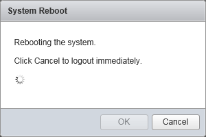

<!-- -->

1.  After the reboot process finishes, log in **to https://mgmt01psc51.lax01.rainpole.local/psc** again, by using the following credentials.

| Setting       | Value                       |
|---------------|-----------------------------|
| **User name** | administrator@vsphere.local |
| **Password**  | vcenter\_admin\_password    |

1.  To verify that the Platform Services Controller successfully joined the domain, click* ***Appliance Settings**,** **and click the **Manage** tab.

> <embed src="media/image38.png" width="596" height="143" />

1.  To verify that the **rainpole.local** domain is available as an** **Identity Source, in the **Navigator**, click **Configuration**, and click the **Identity Sources** tab.

> <embed src="media/image39.png" width="593" height="123" />

### Deploy the Management vCenter Server Instance (Region B)

You can now install the vCenter Server appliance and add the license.

**Procedure**

1.  Start the VMware vCenter Server Appliance deployment wizard.

    1.  Browse to the vCenter Server Appliance ISO file.

    2.  Open the **vcsa-setup.html** file in a browser.

    3.  Click **Install** to start the installation.

> 

1.  Complete the VMware vCenter Server Appliance Deployment wizard.

<!-- -->

1.  On the **End User License Agreement** page, select the **I accept the terms of the license agreement** check box and click **Next**.

> 

1.  On the **Connect to target server** page, enter the following settings, and click **Next**.

| Setting                | Value                            |
|------------------------|----------------------------------|
| **FQDN or IP Address** | mgmt01esx51.lax01.rainpole.local |
| **User name**          | root                             |
| **Password**           | esxi\_root\_user\_password       |

> <embed src="media/image21.png" width="412" height="264" />

1.  In the **Certificate Warning** dialog box, click **Yes** to accept the host certificate. 

> <embed src="media/image22.png" width="324" height="226" />

1.  On the **Set up virtual machine** page, enter the following settings, and click **Next**.

| Setting                 | Value                  |
|-------------------------|------------------------|
| **Appliance name**      | mgmt01vc51.lax01       |
| **OS password**         | mgmtvc\_root\_password |
| **Confirm OS password** | mgmtvc\_root\_password |

> <embed src="media/image40.png" width="412" height="264" />

1.  On the **Select deployment type** page, under **External Platform Services Controller,** select **Install vCenter Server (Requires External Platform Services Controller) **radio button, and click **Next.**

> 

1.  On the **Configure Single Sign-On (SSO)** page, enter the following values, and click **Next**.

| Setting                                                  | Value                            |
|----------------------------------------------------------|----------------------------------|
| **Platform Services Controller** **FQDN or IP address ** | mgmt01psc51.lax01.rainpole.local |
| **vCenter SSO password**                                 | vcenter\_admin\_password         |
| **vCenter Single Sign-On** **HTTPS Port **               | 443                              |

> <embed src="media/image42.png" width="414" height="264" />

1.  On the **Select appliance size** page, select **Small (up to 100 hosts, 1,000 VMs)**, and click **Next**.

> <embed src="media/image43.png" width="415" height="264" />

1.  On the **Select datastore** page, select the **vsanDatastore** datastore, select the **Enable Thin Disk Mode** check box, and click **Next**.

> 

1.  On the **Configure database** page, select **Use an embedded database (PostgreSQL)** radio button, and click **Next**.

> 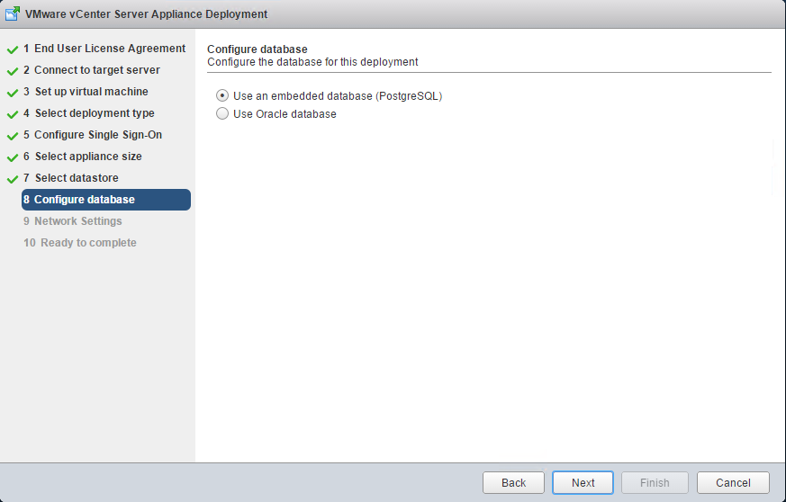

1.  On the **Network Settings** page, enter the following settings,** **and click **Next**.

| Setting                 | Value                           |
|-------------------------|---------------------------------|
| **Choose a network**    | VM Network                      |
| **IP address family**   | IPv4                            |
| **Network type**        | Static                          |
| **Network address**     | 172.17.11.62                    |
| **System name**         | mgmt01vc51.lax01.rainpole.local |
| **Subnet mask**         | 255.255.255.0                   |
| **Network gateway**     | 172.17.11.253                   |
| **Network DNS servers** | 172.17.11.5                     |
| **Configure time sync** | ntp.lax01.rainpole.local        |
| **Enable SSH**          | Enabled (Select checkbox)       |

> <embed src="media/image45.png" width="412" height="264" />

1.  On the **Ready to complete** page, review the configuration, and click **Finish** to start the deployment.

<!-- -->

1.  Add new licenses for this vCenter Server instance and the management cluster ESXi hosts if needed.

<!-- -->

1.  In a browser go to **https://mgmt01vc51.lax01.rainpole.local/vsphere-client**, and log in by using the following credentials. 

| Setting       | Value                       |
|---------------|-----------------------------|
| **User name** | administrator@vsphere.local |
| **Password**  | vcenter\_admin\_password    |

> <embed src="media/image46.png" width="437" height="264" />

1.  Click **Licensing**.

> 

1.  Click the **Licenses** tab.

> 

1.  Click the **Create New Licenses** icon to add license keys.

> <embed src="media/image49.png" width="455" height="264" />

1.  On the **Enter license keys** page, enter license keys for vCenter Server and ESXi, one per line, and click **Next**.

> <embed src="media/image50.png" width="450" height="264" />

1.  On the **Edit license name** page, enter a descriptive name for each license key, and click **Next**.

2.  On the **Ready to complete** page, review your entries, and click **Finish**.

<!-- -->

1.  Assign the newly added licenses to the respective assets.

<!-- -->

1.  Click the **Assets** tab*.*

> <embed src="media/image51.png" width="524" height="302" />

1.  Select the vCenter Server instance, and click the **Assign License** icon.

> 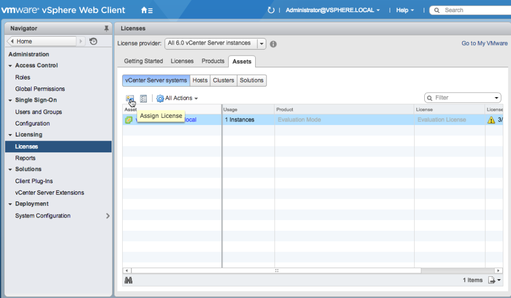

1.  Select the vCenter Server license that you entered in the previous step, and click **OK**.

<!-- -->

1.  Assign the *vCenterAdmins *domain group to the vCenter Server Administrator role.

<!-- -->

1.  In the **Navigator**, click **Home**.

2.  Click **Hosts and Clusters**.

> <embed src="media/image53.png" width="477" height="264" />

1.  Select the **mgmt01vc51.lax01.rainpole.local** tree.

2.  Click the **Manage** tab, click **Permissions**, and click the **Add** icon.

> <embed src="media/image54.png" width="556" height="188" />

1.  In the **mgmt01vc51.lax01.rainpole.local - Add Permission** dialog box, click the **Add** button.

2.  In the **Select Users/Groups** dialog box, select **LAX01** from the **Domain** drop-down menu.

3.  In the search box, enter **vCenterAdmins**, and press **Enter**.

4.  Select **vCenterAdmins**, and click **Add**.

> <embed src="media/image55.png" width="360" height="377" />

1.  Click** OK**.

2.  In the **mgmt01vc51.lax01.rainpole.local - Add Permission** dialog box, select **Administrator** as **Assigned Role **and select the **Propagate to children** check box.

> <embed src="media/image56.png" width="342" height="377" />

1.  Click **OK**.

    1.  ### Configure the Management Cluster (Region B)

You must now create and configure the management cluster. This process consists of the following actions:

-   Create the cluster.

-   Configure DRS.

-   Enable Virtual SAN for the cluster.

-   Add the hosts to the cluster.

-   Add the hosts to the active directory domain.

-   Set the Platform Services Controller and vCenter Server appliances to the default Virtual SAN storage policy.

-   Reset the Virtual SAN Storage Policy to default for the ESXi host that is used for Bootstrap.

**Procedure**

1.  Log in to the Management vCenter Server by using the vSphere Web Client.

<!-- -->

1.  In a browser, go to **https://mgmt01vc51.lax01.rainpole.local/vsphere-client**.

2.  Use the following credentials to log in.

| Setting       | Value                       |
|---------------|-----------------------------|
| **User name** | administrator@vsphere.local |
| **Password**  | vcenter\_admin\_password    |

1.  Create a new data center.

<!-- -->

1.  In the **Navigator**, click **Hosts and Clusters.**

2.  Right-click the mgmt01vc51.lax01.rainpole.local instance, and select **New Datacenter**.

3.  In the **New Datacenter** dialog box, enter **LAX01 **as name, and click **OK**.

<!-- -->

1.  Right-click the **LAX01** data center and click **New Cluster.**

2.  In the **New Cluster **wizard, enter the following values, and click **OK.**

| Setting         | Value                                                                               |
|-----------------|-------------------------------------------------------------------------------------|
| **Name**        | LAX01-Mgmt01                                                                        |
| **DRS**         | Turn ON (select check box)                                                          
                   (Leave other DRS options with default values)                                        |
| **vSphere HA**  | *Do not* turn ON (leave check box empty)                                            |
| **EVC**         | Set EVC mode to the lowest available setting supported for the hosts in the cluster |
| **Virtual SAN** | Turned ON (select check box)                                                        
                   (Leave default values)                                                               |

> <embed src="media/image57.png" width="416" height="309" />

1.  Add a management host to the management cluster.

<!-- -->

1.  Right-click the **LAX01-Mgmt01 **cluster, and click **Add Host**.

2.  On the **Name and location** page, enter **mgmt01esx51.lax01.rainpole.local** in the **Host name or IP address **text box, and click **Next**.

> <embed src="media/image58.png" width="451" height="264" />

1.  On the **Connection settings** page, enter the following credentials, and click** Next***.*

| Setting       | Value                      |
|---------------|----------------------------|
| **User name** | root                       |
| **Password**  | esxi\_root\_user\_password |

1.  In the **Security Alert **dialog box, click **Yes**.

2.  On the **Host summary** page, review the host information, and click **Next**.

3.  On the **Assign license** page, select the ESXi license key that you entered during the vCenter Server deployment, and click **Next**.

4.  On the **Lockdown mode** page, leave default, and click **Next**.

5.  On the **Resource pool** page, leave default, and click **Next**.

6.  On the **Ready to complete **page, review your entries, and click **Finish.** 

<!-- -->

1.  Repeat the previous step for the three remaining hosts, to add them to the management cluster.

| Object                | FQDN                              |
|-----------------------|-----------------------------------|
| **Management host 2** | mgmt01esx52.lax01.rainpole.local  |
| **Management host 3** | mgmt01esx53.lax01.rainpole.local  |
| **Management host 4** | mgmt01esx54.lax01.rainpole.local  |

1.  Add ESXi hosts to the active directory domain.

<!-- -->

1.  In the **Navigator**, click **Hosts and Clusters,** expand the entire **mgmt01vc51.lax01.rainpole.local **tree.

2.  Select the **mgmt01esx51.lax01.rainpole.local** host.

3.  Click the **Manage** tab, and click **Settings**.

4.  Under **System**, select **Authentication Services**.

5.  In the **Authentication Services** panel, click the **Join Domain** button.

> <embed src="media/image59.png" width="577" height="248" />

1.  In the **Join Domain** dialog box, enter the following settings and click **OK**.

| Setting       | Value                                  |
|---------------|----------------------------------------|
| **Domain**    | lax01.rainpole.local                   |
| **User name** | *ad\_admin\_acct*@lax01.rainpole.local |
| **Password**  | ad\_admin\_lax\_password               |

> <embed src="media/image60.png" width="403" height="325" />

1.  Repeat the previous step to add all remaining hosts to the domain.

| Object                | FQDN                              |
|-----------------------|-----------------------------------|
| **Management host 2** | mgmt01esx52.lax01.rainpole.local  |
| **Management host 3** | mgmt01esx53.lax01.rainpole.local  |
| **Management host 4** | mgmt01esx54.lax01.rainpole.local  |

1.  Rename the Virtual SAN datastore**.**

<!-- -->

1.  Select the **LAX01-Mgmt01** cluster.

2.  Click **Related Objects**, and click **Datastores**.

3.  Select **vsanDatastore**, and click **Actions** &gt; **Rename.**

4.  In the **Datastore - Rename** dialog box, enter **LAX01A-VSAN01-MGMT01** as datastore name, and click **OK**.

> <embed src="media/image61.png" width="401" height="157" />

1.  Set the Platform Services Controller and vCenter Server appliances to the default Virtual SAN storage policy.

<!-- -->

1.  In the **Navigator**, click **Hosts and Clusters**.

2.  Expand the entire **mgmt01vc51.lax01.rainpole.local** tree.

3.  Select the **mgmt01psc51.lax01** virtual machine*.*

4.  Click the **Manage** tab, click **Policies**, and click **Edit VM Storage Policies**.

5.  In the **mgmt01psc51.lax01:Manage VM Storage Policies** dialog box, from the VM storage policy drop-down menu, select **Virtual SAN Default Storage Policy**, and click **Apply to all**. 

> <embed src="media/image62.png" width="609" height="302" />

1.  Click **OK** to apply the changes.

2.  Verify that the **Compliance Status** column shows a Compliant status for all items in the table.

> <embed src="media/image63.png" width="441" height="264" />

1.  Repeat the step to apply the Virtual SAN Default Storage Policy on the **mgmt01vc01.lax01** virtual machine.

<!-- -->

1.  Reset the Virtual SAN Storage Policy to default for the ESXi host that is used for Bootstrap.

<!-- -->

1.  Log in to the **mgmt01esx51.lax01.rainpole.local** host over SSH with the root user name and *esxi\_root\_user\_password* password.

2.  Execute the following command to determine the current Virtual San storage policy.

> esxcli vsan policy getdefault
>
> 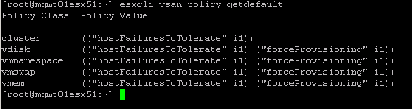

1.  Modify the default Virtual SAN storage policy to force provisioning of Virtual SAN datastore without generating errors. 

> esxcli vsan policy setdefault -c vdisk -p "((\\"hostFailuresToTolerate\\" i1))"
>
> esxcli vsan policy setdefault -c vmnamespace -p "((\\"hostFailuresToTolerate\\" i1))"
>
> esxcli vsan policy getdefault
>
> 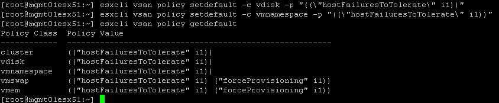

### Configure the Distributed Virtual Switch for the Management Cluster (Region B)

After all ESXi hosts have been added to the management cluster, create a Distributed Virtual Switch. You must also create port groups to prepare your environment to migrate the Platform Services Controller and vCenter Server instances to the distributed switch.

**Procedure**

1.  Log in to the Management vCenter Server by using the vSphere Web Client.

<!-- -->

1.  In a browser, go to **https://mgmt01vc51.lax01.rainpole.local/vsphere-client**.

2.  Use the following credentials to log in. 

| Setting       | Value                       |
|---------------|-----------------------------|
| **User name** | administrator@vsphere.local |
| **Password**  | vcenter\_admin\_password    |

1.  Create a Distributed Virtual Switch.

<!-- -->

1.  In the **Navigator**, click **Networking**.

2.  Right-click the **LAX01** data center, and select **Distributed Switch** &gt; **New Distributed Switch **to start the **New Distributed Switch** wizard.

3.  On the **Name and location** page, enter **vDS-Mgmt** as the name, and click **Next**.

4.  On the **Select version** page, ensure the **Distributed switch version - 6.0.0** radio button is selected, and click **Next**.

5.  On the **Edit settings **page, enter the following settings, and click **Next**.

| Setting                         | Value                   |
|---------------------------------|-------------------------|
| **Number of uplinks**           | 2                       |
| **Network I/O Control**         | Enabled                 |
| **Create a default port group** | No (deselect check box) |

1.  On the **Ready to complete **page, review your entries, and click **Finish**.

<!-- -->

1.  Edit the settings of the **vDS-Mgmt** distributed switch.

<!-- -->

1.  Right-click the **vDS-Mgmt** distributed switch, and select **Settings*** &gt;* **Edit Settings**.

2.  Click the **Advanced **tab.

3.  Enter **9000 **as **MTU (Bytes)** value, and click **OK**.

<!-- -->

1.  Create new port groups in the **vDS-Mgmt** distributed switch.

<!-- -->

1.  Right-click the **vDS-Mgmt** distributed switch, and select **Distributed Port Group** &gt;** New Distributed Port Group***.*

2.  Create port groups with the following settings, and click **Next**.

| Port Group Name          | Port Binding           | VLAN type | VLAN ID |
|--------------------------|------------------------|-----------|---------|
| vDS-Mgmt-Management      | Ephemeral - no binding | VLAN      | 1711    |
| vDS-Mgmt-vMotion         | Static binding         | VLAN      | 1712    |
| vDS-Mgmt-VSAN            | Static binding         | VLAN      | 1713    |
| vDS-Mgmt-NFS             | Static binding         | VLAN      | 1715    |
| vDS-Mgmt-VR              | Static binding         | VLAN      | 1716    |
| vDS-Mgmt-Ext-Management  | Static binding         | VLAN      | 150     |
| vDS-Mgmt-Comp-Management | Static binding         | VLAN      | 1721    |
| vDS-Mgmt-Edge-Management | Static binding         | VLAN      | 1731    |

1.  VXLAN port group will be created later during NSX Manager (Management Cluster) configuration.

<embed src="media/image66.png" width="453" height="264" />

1.  On the **Ready to complete** page, review your entries, and click **Finish**.

<!-- -->

1.  Start the **Add and Manage Hosts** wizard to attach the ESXi hosts to the distributed switch by migrating their VMkernel and virtual machine network adapters.

<!-- -->

1.  Right-click the **vDS-Mgmt** distributed switch,** **and click **Add and Manage Hosts**.

2.  On the **Select task** page, select **Add hosts**, and click **Next**.

> 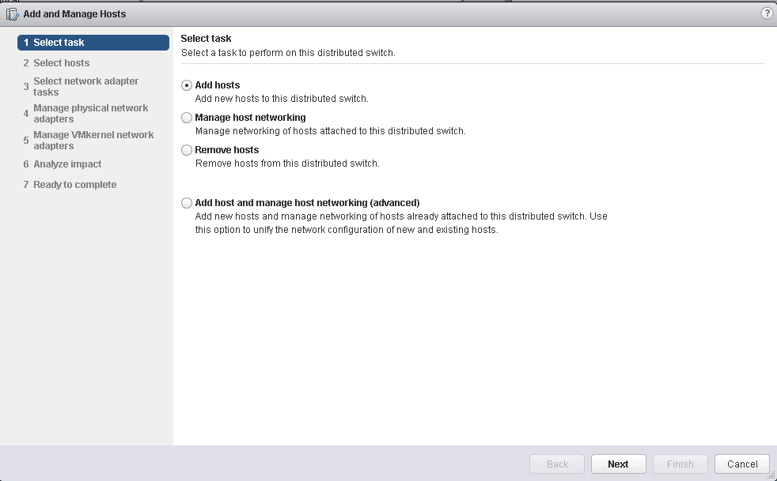

1.  On the **Select hosts** page, click **New hosts**.

2.  In the **Select new hosts **dialog box, select all four hosts, and click **OK**.

3.  On the **Select hosts** page, select **Configure identical network settings...(template mode) **check box, and click **Next**.

4.  On the **Select template host** page, select the first host as a template host, and click **Next***.*

5.  On the **Select network adapter tasks** page, ensure both Manage physical adapters (template mode) and Manage VMkernel adapters (template mode) check boxes are checked, and click **Next**.

6.  On the **Manage physical network adapters (template mode)** page, click **vmnic1**, and click **Assign uplink**.

7.  In the **Select an Uplink for vmnic1** dialog box, select **Uplink 1**, and click **OK**.

8.  On the **Manage physical network adapters (template mode)** page, click **Apply to all**, and click **Next**.

> <embed src="media/image68.png" width="428" height="264" />

1.  Configure the VMkernel network adapters, edit the existing, and add new adapters as needed.

<!-- -->

1.  On the **Manage VMkernel network adapters (template mode)** page, click **vmk0**, and click **Assign port group**.

| vmnic    | Source Port Group  | Destination port group | Port Properties    | MTU  |
|----------|--------------------|------------------------|--------------------|------|
| **vmk0** | Management Network | vDS-Mgmt-Management    | Management traffic | 1500 |

1.  In the **Assign destination port groups** dialog box, select **vDS-Mgmt-Management**, and click **OK**.

2.  On the **Manage VMkernel network adapters (template mode)** page, click **Edit adapter**.

3.  In the **vmk0 - Edit Settings** wizard, on the **Port properties** page, select the **Management traffic** check box.

4.  On the **NIC Settings** page, enter **1500** as MTU, and click **OK**.

5.  On the **Manage VMkernel network adapters (template mode)** page, click **On this switch**, and click **New Adapter** to add new VMkernel adapter.

6.  On the **Select target device **page, select **vDS-Mgmt-VMotion** as the existing network, and click **Next**.

7.  On the **Port properties **page, select **vMotion traffic**, and click **Next.**

8.  Under **IPv4 settings**,** **select **Use static IPv4 settings**, enter **172.17.12.101 **as the IPv4 address, enter **255.255.255.0** as Subnet mask, and click **Next.**

9.  On the **Ready to complete** page, click **Finish.**

10. Click **Edit adapter** to change the MTU setting for the vmk1 adapter.

11. In the **vmk1 - Edit Settings** wizard, click the **NIC Settings** page, enter **9000** as MTU value, and click **OK**.

12. Add more network adapters with the following settings.

| Adapter  | Existing network | Service                           | Static IPv4 Address | Subnet mask   | MTU  |
|----------|------------------|-----------------------------------|---------------------|---------------|------|
| **vmk2** | vDS-Mgmt-VSAN    | Virtual SAN traffic               | 172.17.13.101       | 255.255.255.0 | 9000 |
| **vmk3** | vDS-Mgmt-NFS     | N/A                               | 172.17.15.101       | 255.255.255.0 | 9000 |
| **vmk4** | vDS-Mgmt-VR      | • vSphere Replication traffic     
                               • vSphere Replication NFC traffic  | 172.17.16.101       | 255.255.255.0 | 9000 |

1.  On the **Manage VMkernel network adapters (template mode)** page, click **Apply to all**.

2.  In the **mgmt01esx51...configuration to other hosts **dialog box, enter the following IPv4 addresses, respective for each of the VMkernel adapters, and click **OK**.

| vmk       | IPv4 address     |
|-----------|------------------|
| **vmk0**  | 172.17.11.102\#3 |
| **vmk1**  | 172.17.12.102\#3 |
| **vmk2**  | 172.17.13.102\#3 |
| **vmk3**  | 172.17.15.102\#3 |
| **vmk4**  | 172.17.16.102\#3 |

> <embed src="media/image69.png" width="545" height="264" />

1.  On the **Analyze impact** page, click **Next**.

2.  On the **Ready to complete** page, review your entries, and click **Finish**.

<!-- -->

1.  Migrate the Platform Services Controller and vCenter Server instances from the standard switch to the distributed switch.

<!-- -->

1.  Right-click the **vDS-Mgmt** distributed switch, and click **Migrate VM to Another Network**.

2.  On the **Select source and destination networks** page, browse the following networks, and click **Next**.

| Setting                 | Value               |
|-------------------------|---------------------|
| **Source network**      | VM Network          |
| **Destination network** | vDS-Mgmt-Management |

1.  On the **Select VMs to migrate** page, select both** mgmt01psc51.lax01.rainpole.local, **and **mgmt01vc51.lax01.rainpole.local**, and click **Next**.

2.  On the **Ready to complete** page, review your entries, and click **Finish**.

<!-- -->

1.  Enable* *vSphere HA for the management cluster. 

<!-- -->

1.  In the **Navigator**, click** **the **Hosts and Clusters** icon.

2.  Expand the entire **mgmt01vc51.lax01.rainpole.local** tree, and click the **LAX01-Mgmt01** cluster.

3.  Click the **Manage** tab, click **Settings**, click **vSphere HA,** and click the **Edit** button.

4.  In the **Edit Cluster Settings** dialog box, select the **Turn on vSphere HA **check box.

> <embed src="media/image70.png" width="408" height="264" />

1.  In the **Edit Cluster Settings** dialog box, under **Virtual Machine Monitoring**, select **VM Monitoring Only** from the drop-down menu.

2.  Under **Virtual Machine Monitoring**, expand the **Failure conditions and VM response** setting.

3.  Select **Power off and restart VMs** from the **Response for Host Isolation** drop-down menu.

> <embed src="media/image71.png" width="328" height="249" />

1.  Under **Virtual Machine Monitoring**, expand the **Admission Control** setting.

2.  Select **Define failover capacity by reserving a percentage of the cluster resources**, and enter the following settings, and click **OK**.

| Setting                                          | Value |
|--------------------------------------------------|-------|
| **Reserved failover CPU capacity (% CPU)**       | 25    |
| **Reserved failover Memory capacity (% Memory)** | 25    |

<embed src="media/image72.png" width="349" height="264" />

1.  Define Network I/O Control Shares values for the different traffic types.

<!-- -->

1.  In the **Navigator**, click the **Networking** icon, and click the **LAX01** data center.

2.  Click the* ***vDS-Mgmt** distributed switch.

3.  Click the **Manage** tab, and click **Resource Allocation**.

4.  Under System Traffic, edit each of the following traffic types with the following values, and click **OK.**

| Traffic Type            | Physical Adapter Shares |
|-------------------------|-------------------------|
| **Virtual SAN Traffic** | High, 100               |
| **NFS Traffic**         | High, 100               |
| **vMotion Traffic**     | High, 100               |

1.  Migrate the last physical adapter from the standard switch to the **vDS-Mgmt** distributed switch.

<!-- -->

1.  Right-click the **vDS-Mgmt **distributed switch and select **Add and Manage hosts**.

2.  On the **Select task** page, select **Manage host networking**, and click **Next**.

3.  On the **Select hosts** page, click **Attached hosts**. 

4.  In the **Select member hosts** dialog box, select all four ESXi hosts, and click **OK**.

5.  On the **Select hosts **page, click **Next**.

6.  On the **Select network adapter tasks** page, select **Manage Physical adapters** only, and click **Next**.

7.  On the **Manage physical network adapters** page, under **mgmt01esx51.lax01.rainpole.local**, select **vmnic0**, and click **Assign uplink**.

8.  In the **Select an Uplink** dialog box, select **dvUplink2**, and click **OK**.

9.  Assign uplinks for the 3 remaining hosts to reassign their vmnics, and click **Next**.

10. On the **Analyze Impact** page, click **Next**.

11. On the **Ready to complete** page, click **Finish**.

    1.  ### Configure the Link Aggregation Control Protocol for the Management Cluster (Region B)

Configure Link Aggregation Control Protocol to optimize redundancy and performance across the uplinks in the SDDC.

**Procedure**

1.  Log in to the Management vCenter Server, by using the vSphere Web Client.

<!-- -->

1.  In a browser, go to **https://mgmt01vc51.lax01.rainpole.local/vsphere-client**.

2.  Use the following credentials to log in.

| Setting       | Value                       |
|---------------|-----------------------------|
| **User name** | administrator@vsphere.local |
| **Password**  | vcenter\_admin\_password    |

1.  Add a new Link Aggregation Group.

<!-- -->

1.  In the **Navigator**, click **Networking**.

2.  Expand the **mgmt01vc51.lax01.rainpole.local** tree.

3.  Click the **vDS-Mgmt** distributed switch, click the **Manage **tab, click **Settings**, and click **LACP**.

4.  Click the **New Link Aggregation Group **icon to add a new Link Aggregation Group with the following properties, and click **OK**.

| Setting                 | Value                                                    |
|-------------------------|----------------------------------------------------------|
| **Name**                | lag1                                                     |
| **Number of ports**     | 2                                                        |
| **Mode**                | Active                                                   |
| **Load balancing mode** | Source and destination IP address, TCP/UDP port and VLAN |

> 

1.  Under **LACP**, click the **Migrating network traffic to LAGs** link** **to start the migrate network traffic to the LAG process.

<!-- -->

1.  In the **Migrating Network Traffic to Link Aggregation Groups** dialog box, click the **Manage Distributed Port Groups** link.

2.  On the **Manage Distributed Port Groups** page, select **Teaming and failover**, and click **Next**.

3.  On the **Select port groups** page, click **Select distributed port groups**.

4.  In the **Select Distributed Port Groups** dialog box, select all the available port groups, and click **OK**.

5.  On the **Select port groups** page, click **Next**.

6.  On the **Teaming and failover** page, configure as described in the table, and click **Next**.

| Setting                       | Value                  |
|-------------------------------|------------------------|
| **Load balancing**            | Route based on IP hash |
| **Network failure detection** | Link status only       |
| **Notify switches**           | Yes                    |
| **Failback**                  | No                     |
| **Active uplinks**            | dvUplink1, dvUplink2   |
| **Standby uplinks**           | lag1                   |

> 

1.  In the **Confirm Teaming and Failover Settings** dialog box, click **OK**.

<!-- -->

1.  It is expected that the following warning appears during this process.

> <embed src="media/image75.png" width="413" height="188" />

1.  On the **Ready to complete** page, review your entries, and click **Finish**.

<!-- -->

1.  In the **Migrating Network Traffic to Link Aggregation Groups** dialog box, click **Add and Manage Hosts**.

<!-- -->

1.  On the **Select task** page, select **Manage host networking**, and click **Next**.

> 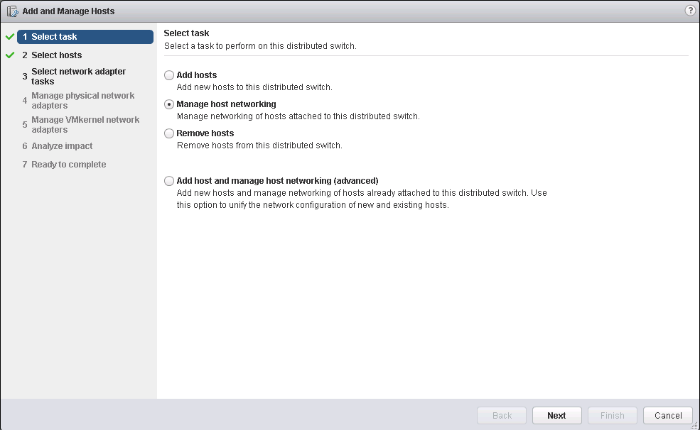

1.  On the **Select hosts** page, click **Attached hosts**. 

2.  In the **Select member hosts** dialog box, select **all four hosts**, and click **OK**.

3.  On the **Select hosts** page, select **Configure identical network settings...(template mode) **check box, and click **Next**.

4.  On the **Select template host** page, select the first host as a template host, and click **Next***.*

5.  On the **Select network adapter tasks** page, check **Manage physical adapters** check box only, and click **Next**.

<!-- -->

1.  Migrate the distributed switch uplinks to Link Aggregation Groups for all hosts in the cluster.

<!-- -->

1.  On the **Manage physical network adapters (template mode)** page, under **mgmt01esx51.lax01.rainpole.local**, select **vmnic0**, and click **Assign uplink**.

2.  In the **Select an Uplink for vmnic0** dialog box, select **lag1-0**, and click **OK**.

3.  On the **Manage physical network adapters (template mode)** page, under **mgmt01esx51.lax01.rainpole.local**, select **vmnic1**, and click **Assign uplink**.

4.  In the **Select an Uplink for vmnic1** dialog box, select **lag1-1**, and click **OK**.

5.  On the **Manage physical network adapters (template mode)** page, click **Apply to all**, and click **Next**.

> <embed src="media/image77.png" width="380" height="234" />

1.  On the **Analyze impact** page, click **Next**.

2.  On the **Ready to complete** page, review your entries, and click **Finish**.

<!-- -->

1.  In the **Migrating Network Traffic to Link Aggregation Groups** dialog box, click **Manage Distributed Port Groups**.

<!-- -->

1.  On the **Select port group policies** page, select **Teaming and failover**, and click **Next**.

2.  On the **Select port groups** page, click **Select distributed port groups**.

3.  In the **Select distributed port groups** dialog box, select all available port groups, and click **OK**.

4.  On the **Select port groups** page, click **Next**.

5.  On the **Teaming and failover **page, configure as described in the table, and click **Next**.

| Setting                       | Value                  |
|-------------------------------|------------------------|
| **Load balancing**            | Route based on IP hash |
| **Network failure detection** | Link status only       |
| **Notify switches**           | Yes                    |
| **Failback**                  | No                     |
| **Active uplinks**            | lag1                   |
| **Unused uplinks**            | dvUplink1, dvUplink2   |

> 

1.  On the **Ready to complete** page, review your entries, and click **Finish**.

<!-- -->

1.  Any port group created after this process is done will need its configuration altered to ensure that LAG1 is the only active link and that all other dvuplinks are configured as unused.

    1.  ### Change the Default Domain Administration Group on the ESXi Hosts in the Management Cluster (Region B)

Change the default ESX Admins group to achieve greater levels of security by removing a known administrative access point.

**Procedure**

1.  Log in to the Management vCenter Server, by using the vSphere Web Client.

<!-- -->

1.  In a browser, go to **https://mgmt01vc51.lax01.rainpole.local/vsphere-client**.

2.  Use the following credentials to log in.

| Option        | Value                       |
|---------------|-----------------------------|
| **User name** | administrator@vsphere.local |
| **Password**  | vcenter\_admin\_password    |

1.  In the **Navigator**, click **Hosts and Clusters**. 

2.  Expand the entire **mgmt01vc51.lax01.rainpole.local** vCenter inventory tree, and select the mgmt01esx51.lax01.rainpole.local host.

3.  Click the **Manage** tab, click **Settings**, and under **System** click **Advanced System Settings**.

4.  In the **search box**, enter **esxAdmins **and wait for the search results. 

> <embed src="media/image79.png" width="476" height="160" />

1.  Select **Config.HostAgent.plugins.hostsvc.esxAdminsGroup**, and click the **Edit** icon to change the ESXi host admin group.

2.  In the **plugins.hostsvc.esxAdminsGroup** text box, enter **SDDC-Admins**, and click **OK**. 

> <embed src="media/image80.png" width="462" height="118" />

1.  Repeat the process for all remaining hosts in the management cluster.

| Object                | FQDN                              |
|-----------------------|-----------------------------------|
| **Management host 2** | mgmt01esx52.lax01.rainpole.local  |
| **Management host 3** | mgmt01esx53.lax01.rainpole.local  |
| **Management host 4** | mgmt01esx54.lax01.rainpole.local  |

1.  Reboot all hosts in the management cluster.

    1.  ### Mount NFS Storage for Management Cluster (Region B)

You must mount a NFS datastore where vSphere Data Protection will later be deployed.

**Procedure**

1.  In a browser go to **https://mgmt01vc51.lax01.rainpole.local/vsphere-client**, and log in by using the following credentials. 

| Option        | Value                       |
|---------------|-----------------------------|
| **User name** | administrator@vsphere.local |
| **Password**  | vcenter\_admin\_password    |

1.  Create new datastore for the *LAX01-Mgmt01* cluster.

<!-- -->

1.  In the **Navigator**, select** vCenter Inventory Lists**, and select **Datastores**.

2.  Click the **Create a New Datastore** icon.

3.  On the **Location** page, expand the entire **mgmt01vc51.lax01.rainpole.local** tree, select the **LAX01-Mgmt01** cluster, and click **Next**.

> <embed src="media/image81.png" width="396" height="230" />

1.  On the **Type** page, select **NFS **and click **Next**.

2.  On the **NFS version** page, select **NFS 3**, and click **Next**.

3.  On the **Name and configuration** page, enter the following datastore information, and click **Next**.

| Option             | Value                 |
|--------------------|-----------------------|
| **Datastore Name** | LAX01A-NFS01-VDP01    |
| **Folder**         | /V2D\_vDP\_MgmtB\_4TB |
| **Server**         | 172.17.15.251         |

> <embed src="media/image82.png" width="390" height="226" />

1.  On the **Host accessibility** page, select all the hosts that require access to the datastore, and click **Next**.

> <embed src="media/image83.png" width="388" height="226" />

1.  On the **Ready to complete** page, review the configuration, and click **Finish**.

    1.  Deploy and Configure the Management Cluster NSX Instance (Region B)
        -------------------------------------------------------------------

-   Deploy the NSX Manager for the Management Cluster NSX Instance (Region B)

-   Deploy the NSX Controllers for the Management Cluster NSX Instance (Region B)

-   Prepare the ESXi Hosts in the Management Cluster for NSX (Region B)

-   Configure the NSX Logical Network for the Management Cluster (Region B)

-   (Optional) Test the Management Cluster NSX Configuration (Region B)

    1.  ### Deploy the NSX Manager for the Management Cluster NSX Instance (Region B)

For this implementation, NSX Manager and vCenter Server have a one-to-one relationship. For every instance of NSX Manager, there is one connected vCenter Server. 

First assign a domain service account that NSX uses to the vCenter Server Administrator role. After that deploy the NSX Manager virtual appliance for the management cluster. After the NSX Manager is deployed connect it to the Management vCenter Server instance.

Procedure

1.  Log in to the Management vCenter Server by using the vSphere Web Client.

<!-- -->

1.  In a browser, go to **https://mgmt01vc51.lax01.rainpole.local/vsphere-client**

2.  Use the following credentials to log in.

| Setting       | Value                       |
|---------------|-----------------------------|
| **User name** | administrator@vsphere.local |
| **Password**  | vcenter\_admin\_password    |

1.  Assign a service account the vCenter Server Administrator role.

<!-- -->

1.  In the **Navigator**, click **Hosts and Clusters**.

> <embed src="media/image53.png" width="478" height="264" />

1.  Select the **mgmt01vc51.lax01.rainpole.local** tree.

2.  Click the **Manage** tab, click **Permissions**, and click the **Add** icon.

> <embed src="media/image54.png" width="556" height="188" />

1.  In the **mgmt01vc51.lax01.rainpole.local - Add Permission** dialog box, click the Add button.

2.  In the **Select Users/Groups** dialog box, select **RAINPOLE** from the **Domain** drop-down menu.

3.  In the search box, enter **svc-nsxmanager**, and press **Enter**.

4.  Select **svc-nsxmanager**, and click **Add**.

> <embed src="media/image84.png" width="331" height="346" />

1.  Click **OK**.

2.  In the **mgmt01vc51.lax01.rainpole.local - Add Permission** dialog box, select **Administrator** as **Assigned Role** and select the **Propagate to children** check box.

> <embed src="media/image85.png" width="365" height="404" />

1.  Click **OK**.

<!-- -->

1.  Open the Deploy OVF Template wizard.

<!-- -->

1.  In the **Navigator**, expand the entire **mgmt01vc51.lax01.rainpole.local** tree.

2.  Right-click the **LAX01-Mgmt01** cluster, and click **Deploy OVF Template**

> .<embed src="media/image86.png" width="369" height="249" />

1.  Complete the wizard to deploy the NSX Manager virtual appliance.

<!-- -->

1.  On the **Select source** page, click the **Browse** button, select the **VMware NSX Manager .ova** file, and click **Next**.

2.  On the **Review details** page, select the **Accept extra configuration option** check box, and click **Next**.

3.  On the **Accept License Agreements** page, click **Accept**, and click **Next**.

4.  On the **Select name and folder** page, enter the following settings, and click **Next**.

| Setting                  | Value              |
|--------------------------|--------------------|
| **Name**                 | mgmt01nsxm51.lax01 |
| **Folder or Datacenter** | LAX01              |

> <embed src="media/image87.png" width="520" height="302" />

1.  On the **Select storage** page, enter the following settings, and click **Next**.

| Setting               | Value                              |
|-----------------------|------------------------------------|
| **VM Storage Policy** | Virtual SAN Default Storage Policy |
| **Datastore**         | LAX01A-VSAN01-MGMT01               |

> <embed src="media/image88.png" width="514" height="302" />

1.  On the **Setup networks** page, under **Destination**, select **vDS-Mgmt-Management**, and click **Next**.

2.  On the **Customize template** page, expand all options, enter the following settings, and click **Next**.

| Setting                               | Value                             |
|---------------------------------------|-----------------------------------|
| CLI "admin" User Password / enter     | mngnsx\_admin\_password           |
| CLI "admin" User Password / confirm   | mngnsx\_admin\_password           |
| CLI Privilege Mode Password / enter   | mngnsx\_privilege\_password       |
| CLI Privilege Mode Password / confirm | mngnsx\_privilege\_password       |
| Hostname                              | mgmt01nsxm51.lax01.rainpole.local |
| Network 1 IPv4 Address                | 172.17.11.65                      |
| Network 1 Netmask                     | 255.255.255.0                     |
| Default IPv4 Gateway                  | 172.17.11.253                     |
| DNS Server List                       | 172.17.11.5                       |
| Domain Search List                    | lax01.rainpole.local              |
| NTP Server List                       | ntp.lax01.rainpole.local          |
| Enable SSH                            | Yes (Select check box)            |

1.  On the **Ready to complete** page, select the **Power on after deployment** check box, and click **Finish**.

> <embed src="media/image89.png" width="378" height="220" />

1.  Connect the NSX Manager to the Management vCenter Server.

<!-- -->

1.  In a browser, go to **https://mgmt01nsxm51.lax01.rainpole.local**.

2.  Use the following credentials to log in.

| Setting       | Value                   |
|---------------|-------------------------|
| **User name** | admin                   |
| **Password**  | mngnsx\_admin\_password |

1.  Click **Manage vCenter Registration**.

2.  Under **Lookup Service**, click the **Edit** button.

3.  In the **Lookup Service** dialog box, enter the following settings, and click **OK**.

| Setting                     | Value                            |
|-----------------------------|----------------------------------|
| Lookup Service IP           | mgmt01psc51.lax01.rainpole.local |
| Lookup Service Port         | 443                              |
| SSO Administrator User Name | administrator@vsphere.local      |
| Password                    | vcenter\_admin\_password         |

1.  In the **Trust Certificate?** dialog box, click **Yes**.

2.  Under **vCenter Server**, click the **Edit** button.

3.  In the **vCenter Server** dialog box, enter the following settings, and click **OK**.

| Setting           | Value                           |
|-------------------|---------------------------------|
| vCenter Server    | mgmt01vc51.lax01.rainpole.local |
| vCenter User Name | svc-nsxmanager@rainpole.local   |
| Password          | svc-nsxmanager\_password        |

1.  In the **Trust Certificate?** dialog box, click **Yes**.

2.  Wait until the Status indicators for the Lookup Service and vCenter Server change to Connected.

<!-- -->

1.  Log out from the Management vCenter Server session in the vSphere Web Client.

    1.  ### Deploy the NSX Controllers for the Management Cluster NSX Instance (Region B)

After the NSX Manager is successfully connected to the Management vCenter Server, you deploy three NSX Controller nodes that form the NSX Controller cluster. Deploy every node only after the previous one is successfully deployed.

Procedure

1.  Log in to the Management vCenter Server by using the vSphere Web Client.

<!-- -->

1.  In a browser, go to **https://mgmt01vc51.lax01.rainpole.local/vsphere-client.**

2.  Use the following credentials to log in.

| Setting       | Value                       |
|---------------|-----------------------------|
| **User name** | administrator@vsphere.local |
| **Password**  | vcenter\_admin\_password    |

1.  Configure an IP pool for the NSX Controller cluster.

<!-- -->

1.  Under **Inventories**, click **Networking & Security**.

> <embed src="media/image53.png" width="478" height="264" />

1.  In the Navigator, click NSX Managers.

2.  Under **NSX Managers**, click the **172.17.11.65** instance.

3.  Click the **Manage** tab, click **Grouping Objects**, click **IP Pools**, and click the A**dd New IP Pool** icon.

4.  In the **Add Static IP Pool** dialog box, enter the following settings, and click **OK**.

| Setting        | Value                       |
|----------------|-----------------------------|
| Name           | Mgmt01-NSXC01               |
| Gateway        | 172.17.11.1                 |
| Prefix Length  | 24                          |
| Primary DNS    | 172.17.11.5                 |
| DNS Suffix     | lax01.rainpole.local        |
| Static IP Pool | 172.17.11.118-172.17.11.120 |

> <embed src="media/image90.png" width="292" height="255" />

1.  Deploy the NSX Controller cluster.

<!-- -->

1.  In the **Navigator**, click **Networking & Security** to go back, and click Installation.

2.  Under **NSX Controller nodes**, click the **Add** icon.

> <embed src="media/image91.png" width="430" height="234" />

1.  In the **Add Controller** page, enter the following settings and click **OK**.

<!-- -->

1.  You configure password only during the deployment of the first controller. The other controllers use the same password.

| Setting               | Value                         |
|-----------------------|-------------------------------|
| NSX Manager           | 172.17.11.65                  |
| Datacenter            | LAX01                         |
| Cluster/Resource Pool | LAX01-Mgmt01                  |
| Datastore             | LAX01A-VSAN01-MGMT01          |
| Connected To          | vDS-Mgmt-Management           |
| IP Pool               | Mgmt01-NSXC01                 |
| Password              | mngnsx\_controllers\_password |
| Confirm Password      | mngnsx\_controllers\_password |

> <embed src="media/image92.png" width="332" height="276" />

1.  After the **Status** of the controller node changes to **Connected**, repeat the step and deploy the remaining two NSX Controller nodes, with the same configuration, that form the controller cluster.

> <embed src="media/image93.png" width="503" height="265" />

1.  Configure DRS affinity rules for the NSX Controllers.

<!-- -->

1.  Go back to the **Home** page.

2.  In the **Navigator**, click **Hosts and Clusters**, and expand the **mgmt01vc51.lax01.rainpole.local tree.**

3.  Select the **LAX01-Mgmt01** cluster, and click the **Manage** tab.

4.  Under **Configuration**, click **VM/Host Rules**.

5.  Under **VM/Host Rules**, click **Add**.

6.  In the **LAX01-Mgmt01 - Create VM/Host Rule** dialog box, enter the following settings, and click **Add**.

| Setting     | Value                     |
|-------------|---------------------------|
| Name        | Mgmt\_NSX\_Controllers    |
| Enable rule | Yes (select check box)    |
| Type        | Separate Virtual Machines |

1.  In the **Add Rule Member** dialog box, select the three NSX Controller VMs, and click **OK**.

2.  In the **LAX01-Mgmt01 - Create VM/Host Rule** dialog box, click **OK**.

    1.  ### Prepare the ESXi Hosts in the Management Cluster for NSX (Region B)

NSX kernel modules packaged in VIB files run within the hypervisor kernel and provide services such as distributed routing, distributed firewall, and VXLAN bridging capabilities.  You must install the NSX kernel modules on the management cluster ESXi hosts to be able to use NSX.

Procedure

1.  Log in to the Management vCenter Server by using the vSphere Web Client.

<!-- -->

1.  In a browser, go to **https://mgmt01vc51.lax01.rainpole.local/vsphere-client**

2.  Use the following credentials to log in.

| Setting       | Value                       |
|---------------|-----------------------------|
| **User name** | administrator@vsphere.local |
| **Password**  | vcenter\_admin\_password    |

1.  Install the NSX kernel modules on the management cluster ESXi hosts.

<!-- -->

1.  In the **Navigator**, click **Networking & Security**.

> <embed src="media/image53.png" width="546" height="302" />

1.  In the **Navigator**, click **Installation**, and click the **Host Preparation** tab.

2.  Change the **NSX Manager** that you edit to **172.17.11.65**.

3.  Select **LAX01-Mgmt01** cluster and under **Actions** click **Install**.

4.  In the confirmation dialog box, click **Yes**.

5.  Verify that the **Installation Status** column shows the NSX version for all hosts in the cluster to confirm that NSX kernel modules are successfully installed

> <embed src="media/image94.png" width="571" height="242" />

### Configure the NSX Logical Network for the Management Cluster (Region B)

After all the deployment tasks are ready, you must configure the NSX logical network. Complete this process in three main steps:

-   Configure the Segment ID allocation.

-   Configure the VXLAN networking.

-   Configure the transport zone.

Procedure

1.  Log in to the Management vCenter Server by using the vSphere Web Client.

<!-- -->

1.  In a browser, go to **https://mgmt01vc51.lax01.rainpole.local/vsphere-client**.

2.  Use the following credentials to log in.

| Setting       | Value                       |
|---------------|-----------------------------|
| **User name** | administrator@vsphere.local |
| **Password**  | vcenter\_admin\_password    |

1.  Configure the Segment ID allocation.

<!-- -->

1.  In the **Navigator**, click **Networking & Security**.

2.  Click **Installation**, click the **Logical Network Preparation** tab, and click **Segment ID**.

> <embed src="media/image95.png" width="564" height="226" />

1.  Change the NSX Manager that you edit to **172.17.11.65**.

2.  Click **Edit**, enter the following values, and click **OK**.

| Setting                         | Value                       |
|---------------------------------|-----------------------------|
| **Segment ID pool**             | 6000-6200                   |
| **Enable Multicast addressing** | Yes (select check box)      |
| **Multicast addresses**         | 239.255.17.0-239.255.17.255 |

> <embed src="media/image96.png" width="554" height="302" />

1.  Configure the VXLAN networking.

<!-- -->

1.  Click the **Host Preparation** tab.

2.  Under **VXLAN**, click **Not Configured**, enter the following values, and click **OK**.

| Setting                   | Value         |
|---------------------------|---------------|
| **Switch**                | vDS-Mgmt      |
| **VLAN**                  | 1714          |
| **MTU**                   | 9000          |
| **VMKNic IP Addressing**  | Use DHCP      |
| **VMKNic Teaming Policy** | Enhanced LACP |
| **VTEP**                  | 1             |

1.  Configure the transport zone.

<!-- -->

1.  With **Installation** still selected in the **Navigator**, click the **Logical Network Preparation** tab, and click **Transport Zones**.

2.  Change the **NSX Manager** that you edit to **172.17.11.65**

> <embed src="media/image97.png" width="579" height="302" />

1.  Click the **Add New Transport** zone icon, enter the following settings, and click **OK**.

| Setting                                        | Value               |
|------------------------------------------------|---------------------|
| **Name**                                       | Mgmt Transport Zone |
| **Replication mode**                           | Hybrid              |
| **Select clusters part of the Transport Zone** | LAX01-Mgmt01        |

> <embed src="media/image98.png" width="347" height="326" />

### (Optional) Test the Management Cluster NSX Configuration (Region B)

Test the configuration of the NSX logical network.

Procedure

1.  Log in to the Management vCenter Server by using the vSphere Web Client.

<!-- -->

1.  In a browser, go to **https://mgmt01vc51.lax01.rainpole.local/vsphere-client**

2.  Use the following credentials to log in.

| Setting       | Value                       |
|---------------|-----------------------------|
| **User name** | administrator@vsphere.local |
| **Password**  | vcenter\_admin\_password    |

1.  Create a logical switch to test the logical network.

<!-- -->

1.  In the **Navigator**, click **Networking & Security**.

2.  Click **Logical Switches**, change the **NSX Manager** that you edit to **172.17.11.65**, and click the **New Logical Switch** icon.

> <embed src="media/image99.png" width="405" height="246" />

1.  In the **New Logical Switch** dialog box, enter the following settings, and click **OK**.

| Setting              | Value                 |
|----------------------|-----------------------|
| **Name**             | mgmt01-logical-switch |
| **Transport Zone**   | Mgmt Transport Zone   |
| **Replication mode** | Hybrid                |

 

> <embed src="media/image100.png" width="393" height="276" />

1.  Use the ping monitor to test connectivity.

<!-- -->

1.  Under **Logical Switches**, double-click **mgmt01-logical-switch**.

2.  Click the **Monitor** tab.

3.  Under **Test Parameters**, select **mgmt01esx54.lax01.rainpole.local** as the **Source host**.

4.  Under **Test Parameters**, select **mgmt01esx51.lax01.rainpole.local** as the **Destination host**, and click **Start Test**.

5.  Under **Results** verify that no error messages appear

> <embed src="media/image101.png" width="340" height="282" />

Deploy and Configure Gateway for the Management Networks (Region B)
-------------------------------------------------------------------

-   Deploy Network Exchange and Heartbeat Logical Switches (Region B)

-   Deploy NSX Edge to Interconnect the Management Networks (Region B)

-   Configure NAT to Provide Public Access to the Management Applications (Region B)

-   Configure OSPF Routing in the SDDC (Region B)

    1.  ### Deploy Network Exchange and Heartbeat Logical Switches (Region B)

Deploy two logical switches to host the router exchange network and the HA heartbeat networks. The switch responsible for router exchange is used for the interconnection of management application gateways to transit traffic between networks and also exchange routing information in the form of OSPF. The HA Heartbeat network is used for transmission of keep alive heartbeats between different Edge heartbeat interfaces.

Procedure

1.  Log in to the Management vCenter Server by using the vSphere Web Client.

<!-- -->

1.  In a browser, go to **https://mgmt01vc51.lax01.rainpole.local/vsphere-client**.

2.  Use the following credentials to log in.

| Setting       | Value                       |
|---------------|-----------------------------|
| **User name** | administrator@vsphere.local |
| **Password**  | vcenter\_admin\_password    |

1.  Create a logical switch.

<!-- -->

1.  In the **Navigator**, click **Networking & Security**, and click **Logical Switches**.

2.  From the NSX Manager drop-down menu, select **172.17.11.65**.

3.  Click the **New Logical Switch** icon to create a new logical switch.

4.  In the **New Logical Switch** dialog box, enter the following settings, and click **OK**. 

| Setting                 | Value                                                          |
|-------------------------|----------------------------------------------------------------|
| **Name**                | networkExchange-VXLAN                                          |
| **Description**         | Router exchange transit network for interconnection of routers |
| **Transport Zone**      | Mgmt Transport Zone                                            |
| **Replication mode**    | Hybrid                                                         |
| **Enable IP Discovery** | Selected                                                       |
| **Enable MAC Learning** | Deselected                                                     |

> <embed src="media/image102.png" width="538" height="377" />

1.  Create another logical switch with the following settings.

| Setting                 | Value                                    |
|-------------------------|------------------------------------------|
| **Name**                | Heartbeat-VXLAN                          |
| **Description**         | Dedicated Heartbeat network for gateways |
| **Transport Zone**      | Mgmt Transport Zone                      |
| **Replication mode**    | Hybrid                                   |
| **Enable IP Discovery** | Selected                                 |
| **Enable MAC Learning** | Deselected                               |

### Deploy NSX Edge to Interconnect the Management Networks (Region B)

After the logical switch is configured, deploy the NSX Edge.

Procedure

1.  Log in to the Management vCenter Server by using the vSphere Web Client.

<!-- -->

1.  In a browser, go to **https://mgmt01vc51.lax01.rainpole.local/vsphere-client**.

2.  Use the following credentials to log in.

| Setting       | Value                       |
|---------------|-----------------------------|
| **User name** | administrator@vsphere.local |
| **Password**  | vcenter\_admin\_password    |

1.  Start the **New NSX Edge** wizard to deploy the NSX Edge that interconnects the management networks in the SDDC.

<!-- -->

1.  In the **Navigator**, click **Networking & Security**, and click **NSX Edges**.

2.  From the NSX Manager drop-down menu, select **172.17.11.65**.

3.  Click the **Add** icon to deploy a new NSX Edge.

<!-- -->

1.  On the **Name and description** page, enter the following settings, and click **Next**.

| Setting                      | Value                        |
|------------------------------|------------------------------|
| **Install Type**             | Edge Services Gateway        |
| **Name**                     | MgmtLAX01-Edge               |
| **Hostname**                 | MgmtLAX01-Edge               |
| **Description**              | LAX01 Edge Services Gateway  |
| **Deploy NSX Edge**          | Selected                     |
| **Enable High Availability** | Selected                     |

> <embed src="media/image103.png" width="403" height="377" />

1.  On the **Settings** page, enter the following settings, and click **Next**.

| Setting                         | Value                       |
|---------------------------------|-----------------------------|
| **User Name**                   | admin                       |
| **Password**                    | mgmt\_edge\_admin\_password |
| **Enable SSH access**           | Selected                    |
| **Enable auto rule generation** | Selected                    |
| **Edge Control Level logging**  | INFO                        |

> <embed src="media/image104.png" width="404" height="377" />

1.  On the **Configure deployment** page, enter the following settings.

<!-- -->

1.  Under **Configure deployment**, enter the following settings, and click the **Add** icon to configure two appliances with identical settings.

| Setting            | Value |
|--------------------|-------|
| **Datacenter**     | LAX01 |
| **Appliance Size** | Large |

1.  In the **Add NSX Edge Appliance** dialog box, enter the following settings, and click **OK**.

| Setting                   | Value                |
|---------------------------|----------------------|
| **Cluster/Resource Pool** | LAX01-Mgmt01         |
| **Datastore**             | LAX01A-VSAN01-MGMT01 |

> <embed src="media/image105.png" width="343" height="248" />

1.  On the Configure deployment page, click Next.

> <embed src="media/image106.png" width="404" height="377" />

1.  On the **Configure Interfaces** page, click the **Add** icon to configure a new interface. 

<!-- -->

1.  In the **Add NSX Edge Interface** dialog box, enter the following settings.

| Setting                 | Value                                           |
|-------------------------|-------------------------------------------------|
| **Name**                | Public                                          |
| **Type**                | Uplink                                          |
| **Connected To **       | vDS-Mgmt-Ext-Management (Distributed Portgroup) |
| **Connectivity Status** | Connected                                       |
| **MTU**                 | 1500                                            |

> <embed src="media/image107.png" width="412" height="377" />

1.  Click the **Add** icon.

2.  Under **Primary Address**, enter **10.158.150.240**.

3.  Under **Subnet Prefix length**, enter **24**, and click **OK**.

> <embed src="media/image108.png" width="412" height="377" />

1.  Configure additional interfaces with the following settings, and click **Next**.

| Name            | Type     | Connected To                                     | Connectivity Status | Primary Address | Subnet Prefix Length | MTU  |
|-----------------|----------|--------------------------------------------------|---------------------|-----------------|----------------------|------|
| Mgmt-Management | Internal | (Distributed Portgroup) vDS-Mgmt-Management      | Connected           | 172.17.11.1     | 24                   | 1500 |
| Comp-Management | Internal | (Distributed Portgroup) vDS-Mgmt-Comp-Management | Connected           | 172.17.21.1     | 24                   | 1500 |
| Edge-Management | Internal | (Distributed Portgroup) vDS-Mgmt-Edge-Management | Connected           | 172.17.31.1     | 24                   | 1500 |
| networkExchange | Uplink   | (Logical Switch) networkExchange-VXLAN           | Connected           | 192.168.1.1     | 24                   | 9000 |
| Heartbeat       | Internal | (Logical Switch) Heartbeat-VXLAN                 | Connected           |                 |                      | 9000 |

> <embed src="media/image109.png" width="515" height="302" />

1.  On the **Default gateway settings** page, enter the following settings, and click **Next**.

| Setting                       | Value          |
|-------------------------------|----------------|
| **Configure Default Gateway** | Selected       |
| **vNIC**                      | Public         |
| **Gateway IP**                | 10.158.150.253 |
| **MTU**                       | 1500           |

> <embed src="media/image110.png" width="404" height="377" />

1.  On the **Firewall and HA** page, enter the following settings, and click **Next**.

| Setting                               | Value          |
|---------------------------------------|----------------|
| **Configure Firewall default policy** | Selected       |
| **Default Traffic Policy**            | Accept         |
| **Logging**                           | Enable         |
| **vNIC**                              | Heartbeat      |
| **Declare Dead Time**                 | 25             |
| **Management IPs**                    | 10.11.150.1/30
                                         10.11.150.2/30  |

 

> <embed src="media/image111.png" width="370" height="346" />

1.  On the **Ready to complete** page, review your entries, and click **Finish**.

    1.  ### Configure NAT to Provide Public Access to the Management Applications (Region B)

VMware solutions in the SDDC need access to the Internet. Configure source NAT rules to provide access from the vSphere management network and the management application networks.

Procedure

1.  Log in to the Management vCenter Server by using the vSphere Web Client.

<!-- -->

1.  In a browser, go to **https://mgmt01vc51.lax01.rainpole.local/vsphere-client**.

2.  Use the following credentials to log in.

| Setting       | Value                       |
|---------------|-----------------------------|
| **User name** | administrator@vsphere.local |
| **Password**  | vcenter\_admin\_password    |

1.  Create Source NAT rules that will enable VMware solutions to access the public network.

<!-- -->

1.  In the **Navigator**, click **Networking & Security**, and click **NSX Edges**.

2.  From the NSX Manager drop-down menu, select **172.17.11.65**, and double-click the **MgmtLAX01-Edge** device to edit its settings.

3.  Click the **Manage** tab, click **NAT**, and click the **Add &gt; Add SNAT Rule** icon to create new Source NAT rule for the vSphere management network.

> <embed src="media/image112.png" width="596" height="132" />

1.  In the **Add SNAT Rule** dialog box, enter the following settings, and click **OK**.

| Setting                        | Value                                                    |
|--------------------------------|----------------------------------------------------------|
| **Applied On**                 | Public                                                   |
| **Original Source IP/Range**   | 192.168.0.0/16                                           |
| **Translated Source IP/Range** | 10.158.150.240                                           |
| **Description**                | Provide Public network access to Management Applications |
| **Enabled**                    | Selected                                                 |
| **Enable logging**             | Deselected                                               |

> <embed src="media/image113.png" width="394" height="302" />

1.  Click the **Add &gt; Add SNAT Rule** icon to create another Source NAT rule for the management networks.

| Setting                        | Value                                                |
|--------------------------------|------------------------------------------------------|
| **Applied On**                 | Public                                               |
| **Original Source IP/Range**   | 172.17.0.0/16                                        |
| **Translated Source IP/Range** | 10.158.150.240                                       |
| **Description**                | Provide Public network access to Management Networks |
| **Enabled**                    | Selected                                             |
| **Enable logging**             | Deselected                                           |

1.  Under **NAT**, click **Publish Changes**, for the new SNAT rule changes to take effect.

> <embed src="media/image114.png" width="589" height="226" />

### Configure OSPF Routing in the SDDC (Region B)

To provide routing for all components in the SDDC, the management networks NSX Edge must be configured to run OSPF. The edge shares connected interface information with all the other edges that are part of the vSphere management network, as well as learn about the management application networks that will later be configured.

Procedure

1.  Log in to the Management vCenter Server by using the vSphere Web Client.

<!-- -->

1.  In a browser, go to **https://mgmt01vc51.lax01.rainpole.local/vsphere-client**.

2.  Use the following credentials to log in.

| Setting       | Value                       |
|---------------|-----------------------------|
| **User name** | administrator@vsphere.local |
| **Password**  | vcenter\_admin\_password    |

1.  Enable dynamic routing.

<!-- -->

1.  In the **Navigator**, click **Networking & Security**, and click **NSX Edges**.

2.  From the NSX Manager drop-down menu, select **172.17.11.65**, and double-click the **MgmtLAX01-Edge** device to edit its settings.

3.  Click the **Manage** tab, click **Routing**, click **Global Configuration** and under **Dynamic Routing Configuration**, click **Edit**.

> <embed src="media/image115.png" width="575" height="207" />

1.  In the **Edit Dynamic Routing Configuration **dialog box, enter the following settings, and click **OK**.

| Setting            | Value           |
|--------------------|-----------------|
| **Router ID**      | networkExchange |
| **Enable Logging** | Selected        |
| **Log Level**      | Info            |

> <embed src="media/image116.png" width="339" height="231" />

1.  Click **Publish Changes**.

<!-- -->

1.  Configure and enable OSPF.

<!-- -->

1.  Under **Routing**, click **OSPF**.

2.  Under **Area Definitions**, click the **New Area Definition** icon.

3.  In the **New Area Definition** dialog box, enter the following settings, and click **OK**.

| Setting            | Value            |
|--------------------|------------------|
| **Area ID**        | 17               |
| **Type**           | Normal           |
| **Authentication** | MD5              |
| **Value**          | area17\_password |

> <embed src="media/image117.png" width="270" height="208" />

1.  Under **Area to Interface Mapping**, click the New Area to Interface Mapping icon.

2.  In the **New Area to Interface Mapping** dialog box, enter the following settings, and click **OK**.

| Setting                          | Value           |
|----------------------------------|-----------------|
| **vNIC**                         | networkExchange |
| **Area**                         | 17              |
| **Ignore Interface MTU setting** | Deselected      |
| **Hello Interval**               | 10              |
| **Dead Interval **               | 40              |
| **Priority**                     | 128             |
| **Cost**                         | 1               |

 

> <embed src="media/image118.png" width="279" height="302" />

1.  Under **OSPF Configuration**, click **Edit** to enable OSPF.

2.  In the **OSPF Configuration** dialog box, select the following settings, and click **OK**.

| Setting                      | Value      |
|------------------------------|------------|
| **Enable OSPF**              | Selected   |
| **Enable Graceful Restart**  | Selected   |
| **Enable Default Originate** | Deselected |

> <embed src="media/image119.png" width="281" height="247" />

1.  Click **Publish Changes**.

> <embed src="media/image120.png" width="507" height="377" />

1.  Configure and enable route redistribution.

<!-- -->

1.  Under **Routing**, click **Route Redistribution**, and under **Route Redistribution table**, click the **Add** icon.

2.  In the **New Redistribution criteria** dialog box, select the following settings, and click **OK**.

| Setting              | Value      |
|----------------------|------------|
| **Prefix Name**      | Any        |
| **Learner Protocol** | OSPF       |
| **ISIS**             | Deselected |
| **BGP**              | Selected   |
| **Static routes**    | Selected   |
| **Connected**        | Selected   |
| **Action**           | Permit     |

> <embed src="media/image121.png" width="209" height="222" />

1.  Under **Route Redistribution Status**, click **Edit**.

2.  In the **Change redistribution settings** dialog box, select **OSPF**, and click **OK**.

> <embed src="media/image122.png" width="205" height="128" />

1.  Click **Publish Changes**.

> <embed src="media/image123.png" width="593" height="302" />

Configure Network Connectivity Between Regions
----------------------------------------------

To provide connectivity between regions you must configure VPN and then configure BGP routing.

-   Configure VPN for Region A

-   Configure VPN for Region B

-   Configure BGP Routing in All Regions

-   Delete the Temporary Routing for the Management Components in Region A

    1.  ### Configure VPN for Region A

To provide connectivity between regions you must configure VPN and then configure BGP routing. Start by configuring VPN on the MgmtSFO01-Edge appliance in Region A.

Procedure

1.  Log in to the Management vCenter Server for Region A by using the vSphere Web Client.

<!-- -->

1.  In a browser, go to **https://mgmt01vc01.sfo01.rainpole.local/vsphere-client**.

2.  Use the following credentials to log in.

| Setting       | Value                       |
|---------------|-----------------------------|
| **User name** | administrator@vsphere.local |
| **Password**  | vcenter\_admin\_password    |

1.  Configure the VPN settings.

<!-- -->

1.  In the **Navigator**, click **Networking & Security**, and click NSX Edges.

2.  From the **NSX Manager** drop-down menu, select **172.16.11.65**.

3.  Double-click the **MgmtSFO01-Edge** appliance.

4.  Click the **Manage** tab, and click **VPN**.

5.  Click **IPsec VPN**, and click the **Add** icon to add a new IPsec VPN connection.

> <embed src="media/image124.png" width="513" height="229" />

1.  In the **Add IPsec VPN** dialog box, enter the following settings to allow the application virtual networks in the different regions to traverse the VPN, and click **OK**.

| Setting                                 | Value                                                           |
|-----------------------------------------|-----------------------------------------------------------------|
| **Enabled**                             | Selected                                                        |
| **Enable perfect forward secrecy(PFS)** | Selected                                                        |
| **Name**                                | SFO2LAX                                                         |
| **Local Id**                            | MgmtSFO01-Edge                                                  |
| **Local Endpoint**                      | 10.158.130.240                                                  |
| **Local Subnets**                       | 172.16.11.0/24,172.16.21.0/24,172.16.31.0/24,192.168.11.0/24,   
                                           192.168.12.0/24,192.168.21.0/24,192.168.22.0/24,192.168.31.0/24  |
| **Peer Id**                             | MgmtLAX01-Edge                                                  |
| **Peer Endpoint**                       | 10.158.150.240                                                  |
| **Peer Subnets**                        | 172.17.11.0/24,172.17.21.0/24,172.17.31.0/24,192.168.13.0/24,   
                                           192.168.23.0/24,192.168.32.0/24                                  |
| **Encryption Algorithm**                | AES256                                                          |
| **Authentication**                      | PSK                                                             |
| **Pre-Shared Key**                      | SFO\_LAX\_PSK\_password                                         |
| **Diffie-Hellman Group**                | DH5                                                             |

1.  Local subnet and peer subnet values are detailed in the following table.

| Network                                                                   | Local Subnets   | Peer Subnets    |
|---------------------------------------------------------------------------|-----------------|-----------------|
| SFO01 Mgmt management network                                             | 172.16.11.0/24  | N/A             |
| SFO01 Comp management network                                             | 172.16.21.0/24  | N/A             |
| SFO01 Edge management network                                             | 172.16.31.0/24  | N/A             |
| LAX01 Mgmt management network                                             | N/A             | 172.17.11.0/24  |
| LAX01 Comp management network                                             | N/A             | 172.17.21.0/24  |
| LAX01 Edge management network                                             | N/A             | 172.17.31.0/24  |
| vRealize Automation application virtual network                           | 192.168.11.0/24 | N/A             |
| vRealize Automation Proxy Agent application virtual network               | 192.168.12.0/24 | 192.168.13.0/24 |
| vRealize Operations Manager application virtual network                   | 192.168.21.0/24 | N/A             |
| vRealize Operations Manager Remote Collectors application virtual network | 192.168.22.0/24 | 192.168.23.0/24 |
| vRealize Log Insight application virtual network                          | 192.168.31.0/24 | 192.168.32.0/24 |

> <embed src="media/image125.png" width="318" height="491" />

1.  Click **Enable**, and click **Publish Changes **for the new changes to take effect.

> <embed src="media/image126.png" width="624" height="206" />

### Configure VPN for Region B

After Region A VPN is configured, configure VPN on the MgmtLAX01-Edge appliance in Region B.

Procedure 

1.  Log in to the Management vCenter Server by using the vSphere Web Client.

<!-- -->

1.  In a browser, go to **https://mgmt01vc51.lax01.rainpole.local/vsphere-client**.

2.  Use the following credentials to log in.

| Setting       | Value                       |
|---------------|-----------------------------|
| **User name** | administrator@vsphere.local |
| **Password**  | vcenter\_admin\_password    |

1.  Configure the VPN settings.

<!-- -->

1.  In the **Navigator**, click **Networking & Security**, and click **NSX Edges**.

2.  From the **NSX Manager** drop-down menu, select **172.17.11.65**.

3.  Double-click the **MgmtLAX01-Edge** appliance.

4.  Click the **Manage** tab, and click **VPN**.

5.  Click **IPsec VPN**, and click the **Add** icon to add a new IPsec VPN connection.

> <embed src="media/image124.png" width="547" height="244" />

1.  In the **Add IPsec VPN** dialog box, enter the following settings to allow the application virtual networks in the different regions to traverse the VPN, and click **OK**.

| Setting                                 | Value                                                           |
|-----------------------------------------|-----------------------------------------------------------------|
| **Enabled**                             | Selected                                                        |
| **Enable perfect forward secrecy(PFS)** | Selected                                                        |
| **Name**                                | LAX2SFO                                                         |
| **Local Id**                            | MgmtLAX01-Edge                                                  |
| **Local Endpoint**                      | 10.158.150.240                                                  |
| **Local Subnets**                       | 172.17.11.0/24,172.17.21.0/24,172.17.31.0/24,192.168.13.0/24,   

                                           192.168.23.0/24,192.168.32.0/24                                  |
| **Peer Id**                             | MgmtSFO01-Edge                                                  |
| **Peer Endpoint**                       | 10.158.130.240                                                  |
| **Peer Subnets**                        | 172.16.11.0/24,172.16.21.0/24,172.16.31.0/24,192.168.11.0/24,   

                                           192.168.12.0/24,192.168.21.0/24,192.168.22.0/24,192.168.31.0/24  |
| **Encryption Algorithm**                | AES256                                                          |
| **Authentication**                      | PSK                                                             |
| **Pre-Shared Key**                      | SFO\_LAX\_PSK\_password                                         |
| **Diffie-Hellman Group**                | DH5                                                             |

1.  Local subnet and peer subnet values are detailed in the following table.

| Network                                                                   | Local Subnets   | Peer Subnets    |
|---------------------------------------------------------------------------|-----------------|-----------------|
| SFO01 Mgmt management network                                             | N/A             | 172.16.11.0/.24 |
| SFO01 Comp management network                                             | N/A             | 172.16.21.0/.24 |
| SFO01 Edge management network                                             | N/A             | 172.16.31.0/.24 |
| LAX01 Mgmt management network                                             | 172.17.11.0/24  | N/A             |
| LAX01 Comp management network                                             | 172.17.21.0/24  | N/A             |
| LAX01 Edge management network                                             | 172.17.31.0/24  | N/A             |
| vRealize Automation application virtual network                           | N/A             | 192.168.11.0/24 |
| vRealize Automation Proxy Agent application virtual network               | 192.168.13.0/24 | 192.168.12.0/24 |
| vRealize Operations Manager application virtual network                   | N/A             | 192.168.21.0/24 |
| vRealize Operations Manager Remote Collectors application virtual network | 192.168.23.0/24 | 192.168.22.0/24 |
| vRealize Log Insight application virtual network                          | 192.168.32.0/24 | 192.168.31.0/24 |

> <embed src="media/image127.png" width="250" height="388" />

1.  Click **Enable**, and click **Publish Changes** for the changes to take effect.

> <embed src="media/image128.png" width="570" height="188" />

1.  Verify VPN connectivity.

<!-- -->

1.  Click **Show IPsec Statistics**.

2.  In the **IPsec VPN Statistics** dialog box, verify that the **Channel Status** column shows a green check mark.

3.  In the **IPsec VPN Statistics** dialog box, verify that the **Tunnel State** column shows a green check mark for all tunnel connections.

> <embed src="media/image129.png" width="421" height="302" />

If there is a problem with the configuration of the VPN, double-check the following settings:

-   Pre-Shared key on all endpoints.

-   Local ID and Peer ID match on all endpoints.

-   Local subnets and remote subnets match an all endpoints.

    1.  ### Configure BGP Routing in All Regions

After VPN is successfully configured in all regions, you must configure BGP routing redistribution.

Procedure

1.  Log in to the Management vCenter Server for Region A by using the vSphere Web Client.

<!-- -->

1.  In a browser, go to **https://mgmt01vc01.sfo01.rainpole.local/vsphere-client**

2.  Use the following credentials to log in.

| Setting       | Value                       |
|---------------|-----------------------------|
| **User name** | administrator@vsphere.local |
| **Password**  | vcenter\_admin\_password    |

1.  Configure BGP routing redistribution on the **MgmtSFO01-Edge **appliance in Region A.

<!-- -->

1.  In the **Navigator**, click **Networking & Security**, and click **NSX Edges**.

2.  From the **NSX Manager** drop-down menu, select **172.16.11.65**.

3.  Double-click the **MgmtSFO01-Edge** appliance.

4.  Click the **Manage** tab, and click **Routing**.

5.  Click **BGP**, and click the **Add** icon to add new neighbors.

> 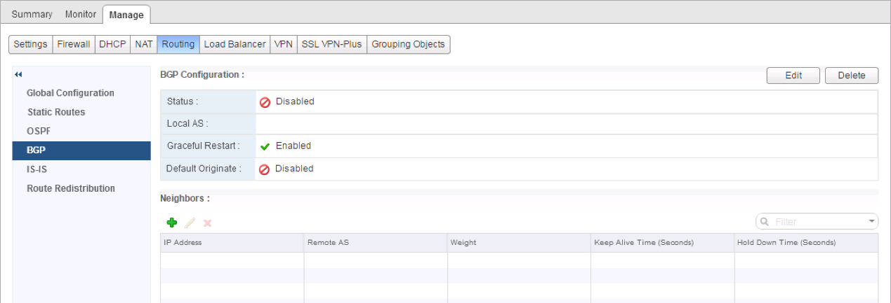

1.  In the **New Neighbor** dialog box, enter the following values, and click **OK**.

| Setting             | Value                   |
|---------------------|-------------------------|
| **IP Address**      | 10.158.150.240          |
| **Remote AS**       | 65432                   |
| **Password**        | BGP\_Neighbor\_password |
| **Weight**          | 60                      |
| **Keep Alive Time** | 60                      |
| **Hold Down Time**  | 180                     |

> <embed src="media/image131.png" width="291" height="300" />

1.  Under **BGP Configuration**, click **Edit** to configure a new BGP Configuration for this appliance.

> <embed src="media/image132.png" width="624" height="240" />

1.  In the **Edit BGP Configuration** dialog box, enter the following settings, and click **OK**.

| Setting                      | Value      |
|------------------------------|------------|
| **Enable BGP**               | Selected   |
| **Enable Graceful Restart**  | Selected   |
| **Enable Default Originate** | Deselected |
| **Local AS**                 | 65432      |

> <embed src="media/image133.png" width="271" height="264" />

1.  Click **Publish Changes** for the changes to take effect.

> <embed src="media/image134.png" width="624" height="242" />

1.  Enable BGP routing redistribution on the **MgmtSFO01-Edge** appliance in Region A.

<!-- -->

1.  Click **Route Redistribution**.

2.  Under **Route Redistribution** table, click the **Add** icon.

> <embed src="media/image135.png" width="467" height="302" />

1.  In the **New Redistribution criteria** dialog box, select the following settings, and click **OK**.

| Setting              | Value     |
|----------------------|-----------|
| **Prefix Name**      | Any       |
| **Learner Protocol** | BGP       |
| **OSPF**             | Checked   |
| **ISIS**             | Unchecked |
| **Connected**        | Checked   |
| **Action**           | Permit    |

> <embed src="media/image136.png" width="251" height="264" />

1.  Under **Route Redistribution Status**, click **Edit**.

> <embed src="media/image137.png" width="461" height="264" />

1.  Select both **OSPF** and **BGP**, and click **OK**.

> <embed src="media/image138.png" width="364" height="188" />

1.  Click **Publish Changes** for the changes to take effect.

> <embed src="media/image139.png" width="528" height="302" />

1.  Configure BGP routing redistribution on the **MgmtLAX01-Edge** appliance in Region B.

<!-- -->

1.  In the **Navigator**, go back to **Networking & Security**, and click **NSX Edges**.

2.  From the **NSX Manager** drop-down menu, select **172.17.11.65**.

3.  Double-click the **MgmtLAX01-Edge** appliance.

4.  Click the **Manage** tab, and click **Routing**.

5.  Click **BGP**, and click the **Add** icon to add new neighbors.

6.  In the **New Neighbor** dialog box, enter the following values, and click **OK**.

| Setting             | Value                   |
|---------------------|-------------------------|
| **IP Address**      | 10.159.130.240          |
| **Remote AS**       | 65432                   |
| **Password**        | BGP\_Neighbor\_password |
| **Weight**          | 60                      |
| **Keep Alive Time** | 60                      |
| **Hold Down Time**  | 180                     |

> <embed src="media/image140.png" width="294" height="302" />

1.  Under **BGP Configuration**, click **Edit** to configure a new BGP Configuration for this Edge appliance.

2.  In the **Edit BGP Configuration** dialog box, enter the following settings and click **OK**.

| Setting                      | Value      |
|------------------------------|------------|
| **Enable BGP**               | Selected   |
| **Enable Graceful Restart**  | Selected   |
| **Enable Default Originate** | Deselected |
| **Local AS**                 | 65432      |

1.  Click **Publish Changes** for the changes to take effect.

<!-- -->

1.  Enable BGP routing redistribution on the **MgmtLAX01-Edge** appliance in Region B.

<!-- -->

1.  Click **Route Redistribution**.

2.  Under **Route Redistribution table**, click the **Add** icon.

3.  In the **New Redistribution criteria** dialog box, select the following settings and click **OK**.

| Setting              | Value     |
|----------------------|-----------|
| **Prefix Name**      | Any       |
| **Learner Protocol** | BGP       |
| **OSPF**             | Checked   |
| **ISIS**             | Unchecked |
| **Connected**        | Checked   |

1.  Under **Route Redistribution Status**, click **Edit**.

2.  Select both **OSPF**, and **BGP**, and click **OK**.

3.  Click **Publish Changes** for the changes to take effect.

    1.  ### Delete the Temporary Routing for the Management Components in Region A

After you configure BGP route redistribution, you no longer need the static routes on the Management Platform Services Controller and vCenter Server instances in Region A, and you can delete them.

**Procedure**

1.  Delete the static route on the Management Platform Service Controller to the physical router.

    1.  Log in to the **mgmt01psc01.sfo01.rainpole.local** virtual appliance over SSH with the root user name and ***mgmtpsc\_root\_password*** password.

    2.  Run the following console command to delete the static route.

        ip route delete 172.17.11.0/24

<!-- -->

1.  Delete the static route on the Management vCenter Server to the physical router.

    1.  Log in to the **mgmt01vc01.sfo01.rainpole.local** virtual appliance over SSH with the root user name and ***mgmtvc\_root\_password*** password.

    2.  Run the following console command to delete the static route.

        ip route delete 172.17.11.0/24

2.  Delete the static route on the Compute Platform Service Controller to the physical router.

    1.  Log in to the **comp01psc01.sfo01.rainpole.local** virtual appliance over SSH with the root user name and ***mgmtpsc\_root\_password*** password.

    2.  Run the following console command to delete the static route.

        ip route delete 172.17.11.0/24

3.  Delete the static route on the Compute vCenter Server to the physical router.

    1.  Log in to the **comp01vc01.sfo01.rainpole.local** virtual appliance over SSH with the root user name and ***mgmtvc\_root\_password*** password.

    2.  Run the following console command to delete the static route.

        ip route delete 172.17.11.0/24

4.  Reconfigure SDDC hosts to use the **MgmtLAX01-Edge** as their default gateway.

<!-- -->

1.  To avoid connectivity loss, you must add static routes on the client that you use to access the environment before you start the process.

    route add -p 172.17.0.0/16 172.17.11.1 (for Windows clients)

    route add 172.17.0.0/16 gw 172.17.11.1 (for for Linux clients, add to /etc/rc.local to make permanent)

| Hostname                                | Old Gateway   | New Gateway |
|-----------------------------------------|---------------|-------------|
| mgmt01esx\[51-54\].lax01.rainpole.local | 172.17.11.253 | 172.17.11.1 |
| comp01esx\[51-54\].lax01.rainpole.local | 172.17.21.253 | 172.17.21.1 |
| edge01esx\[51-54\].lax01.rainpole.local | 172.17.31.253 | 172.17.31.1 |
| mgmt01psc51.lax01.rainpole.local        | 172.17.11.253 | 172.17.11.1 |
| mgmt01vc51.lax01.rainpole.local         | 172.17.11.253 | 172.17.11.1 |
| mgmt01nsxm51.lax01.rainpole.local       | 172.17.11.253 | 172.17.11.1 |
| dc01lax.lax01.rainpole.local            | 172.17.11.253 | 172.17.11.1 |

Deploy and Configure the Compute and Edge Clusters Components (Region B)
------------------------------------------------------------------------

-   Deploy the External Platform Services Controller for the Compute vCenter Server (Region B)

-   Join the Platform Services Controller for the Compute vCenter Server to the Active Directory (Region B)

-   Deploy the Compute vCenter Server Instance (Region B)

-   Configure the Compute and Edge Clusters (Region B)

-   Create Distributed Virtual Switch for the Compute Cluster (Region B)

-   Create Distributed Virtual Switch for the Edge Cluster (Region B)

-   Configure the Link Aggregation Control Protocol for the Compute and Edge Clusters (Region B)

-   Change the Default Domain Administration Group on the ESXi Hosts in the Compute and Edge Clusters (Region B)

-   Mount NFS Storage for the Compute Cluster (Region B)

-   Configure Lockdown Mode on All ESXi Hosts (Region B)

    1.  ### Deploy the External Platform Services Controller for the Compute vCenter Server (Region B)

You must first install the external Platform Services Controller instance from the vCenter Server appliance ISO file. 

Procedure

1.  Log in to the Windows host that has access to your data center as an administrator.

2.  Start the VMware vCenter Server Appliance Deployment wizard.

<!-- -->

1.  Browse to the vCenter Server Appliance **.iso** file.

2.  Open the **vcsa-setup.html** file in a Web browser.

3.  Click **Install** to start the installation.

> 

1.  Complete the **VMware vCenter Server Appliance Deployment** wizard.

<!-- -->

1.  On the **End User License Agreement** page, select the **I accept the terms of the license agreement** check box, and click **Next**.

> 

1.  On the **Connect to target server** page, enter the following settings, and click **Next**. 

| Setting                | Value                            |
|------------------------|----------------------------------|
| **FQDN or IP Address** | mgmt01esx51.lax01.rainpole.local |
| **User name**          | root                             |
| **Password**           | esxi\_root\_user\_password       |

> <embed src="media/image21.png" width="401" height="257" />

1.  In the **Certificate Warning** dialog box, click **Yes** to accept the host certificate.

> <embed src="media/image22.png" width="297" height="208" />

1.  On the **Set up virtual machine** page, enter the following settings, and click **Next**. 

| Setting                 | Value                   |
|-------------------------|-------------------------|
| **Appliance name**      | comp01psc51.lax01       |
| **OS password**         | comppsc\_root\_password |
| **Confirm OS password** | comppsc\_root\_password |

> <embed src="media/image141.png" width="444" height="283" />

1.  On the **Select deployment type** page, under **External Platform Services Controller**, select the **Install Platform Services Controller **radio button, and click **Next**.

> 

1.  On the **Set up Single Sign-on (SSO)** page, select the **Join an SSO domain in an existing vCenter 6.0 platform services controller** radio button, enter the following settings, and click **Next**.

| Setting                                              | Value                            |
|------------------------------------------------------|----------------------------------|
| **Platform Services Controller FQDN or IP address ** | mgmt01psc51.lax01.rainpole.local |
| **vCenter SSO Password**                             | vcenter\_admin\_password         |
| **Port**                                             | 443                              |

> <embed src="media/image142.png" width="414" height="264" />

1.  On the **Single Sign-on site **page, select the **Join an existing sit**e radio button, select **LAX01** from the drop-down list, and click **Next**.

> <embed src="media/image143.png" width="473" height="302" />

1.  On the **Select appliance size** page, click **Next**.

> 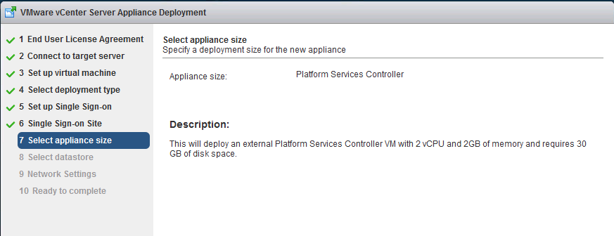

1.  On the **Select datastore** page, select the **LAX01A-VSAN01-MGMT01** datastore to deploy the Platform Services Controller on, select the **Enable Thin Disk Mode** check box, and click **Next**.

> <embed src="media/image145.png" width="472" height="302" />

1.  On the **Network Settings** page, enter the following settings, and click **Next**.

| Setting                 | Value                            |
|-------------------------|----------------------------------|
| **Choose a network**    | vDS-Mgmt-Management              |
| **IP address family**   | IPv4                             |
| **Network type**        | Static                           |
| **Network address**     | 172.17.11.63                     |
| **System name**         | comp01psc51.lax01.rainpole.local |
| **Subnet mask**         | 255.255.255.0                    |
| **Network gateway**     | 172.17.11.1                      |
| **Network DNS servers** | 172.17.11.5                      |
| **Configure time sync** | ntp.lax01.rainpole.local         |
| **Enable SSH**          | Enabled (Select checkbox)        |

> <embed src="media/image146.png" width="472" height="302" />

1.  On the **Ready to complete** page, review the configuration, and click **Finish** to start the deployment.

<!-- -->

1.  Create replication agreement between the Platform Services Controllers for the compute clusters in the regions.

<!-- -->

1.  Log in to the **comp01psc01.sfo01.rainpole.local** virtual appliance over SSH with the **root** user name and **comppsc\_root\_password** password.

2.  Execute the following commands to enable BASH access, and launch BASH.

> shell.set --enabled True 
>
> shell

1.  Create a new replication agreement between the Platform Services Controllers for the compute clusters in the regions.

<!-- -->

1.  The following command uses the credentials of the administrator@vsphere.local account.

> /usr/lib/vmware-vmdir/bin/vdcrepadmin -f createagreement -2 -h comp01psc01.sfo01.rainpole.local -u Administrator -w *vcenter\_admin\_password* -H comp01psc51.lax01.rainpole.local
>
> <embed src="media/image147.png" width="581" height="28" />

### Join the Platform Services Controller for the Compute vCenter Server to the Active Directory (Region B)

After you have successfully installed the Platform Services Controller instance, you must join it to the Active Directory.

Procedure

1.  Log in to the Platform Services Controller administration interface.

<!-- -->

1.  In a browser, go to **https://comp01psc51.lax01.rainpole.local/psc**.

2.  Enter the following credentials, and click Login.

| Setting       | Value                       |
|---------------|-----------------------------|
| **User name** | administrator@vsphere.local |
| **Password**  | vcenter\_admin\_password    |

> <embed src="media/image148.png" width="536" height="302" />

1.  Add the Compute Platform Services Controller instance to the Active Directory domain*.*

<!-- -->

1.  In the **Navigator**, click **Appliance Settings**, click the **Manage** tab, and click the **Join button**.

> 

1.  In the **Join Active Directory Domain** dialog box, enter the following settings, and click **OK**.

| Setting       | Value                                  |
|---------------|----------------------------------------|
| **Domain**    | lax01.rainpole.local                   |
| **User name** | *ad\_admin\_acct*@lax01.rainpole.local |
| **Password**  | ad\_admin\_password                    |

> <embed src="media/image32.png" width="386" height="302" />

1.  Reboot the Platform Services Controller node to apply the changes.

<!-- -->

1.  Click the **Appliance settings** tab, and click the **VMware Platform Services Appliance** link.

> 

1.  Log in to the VMware vCenter Server Appliance administration interface with the following credentials. 

| Setting       | Value                   |
|---------------|-------------------------|
| **User name** | root                    |
| **Password**  | comppsc\_root\_password |

> 

1.  On the **Summary** page, click **Reboot**. 

> <embed src="media/image150.png" width="563" height="183" />

1.  In the **System Reboot** dialog box, click **Yes**.

> 

1.  Wait for the reboot process to finish. 

> 

1.  After the reboot process finishes, log in to **https://comp01psc51.lax01.rainpole.local/psc** again, by using the following credentials. 

| Setting       | Value                       |
|---------------|-----------------------------|
| **User name** | administrator@vsphere.local |
| **Password**  | vcenter\_admin\_password    |

1.  To verify that the Platform Services Controller successfully joined the domain, click* ***Appliance Settings**, and click the **Manage** tab.

> <embed src="media/image151.png" width="568" height="174" />

1.  To verify that the rainpole.local domain is available as an Identity Source, in the **Navigator**, click **Configuration**, and click the **Identity Sources** tab.

> <embed src="media/image39.png" width="576" height="119" />

### Deploy the Compute vCenter Server Instance (Region B)

You can now install the vCenter Server appliance and add the license.

Procedure

1.  Start the VMware vCenter Server Appliance deployment wizard.

<!-- -->

1.  Browse the vCenter Server Appliance ISO file.

2.  Open the **vcsa-setup.html** file in a browser.

3.  Click **Install** to start the installation.

> 

1.  Complete the VMware vCenter Server Appliance deployment wizard.

<!-- -->

1.  On the **End User License Agreement** page, select the **I accept the terms of the license agreement** check box and click **Next**.

> 

1.  On the **Connect to target server** page, enter the following settings, and click **Next**.

| Setting                | Value                            |
|------------------------|----------------------------------|
| **FQDN or IP Address** | mgmt01esx51.lax01.rainpole.local |
| **User name**          | root                             |
| **Password**           | esxi\_root\_user\_password       |

> <embed src="media/image21.png" width="413" height="264" />

1.  In the **Certificate Warning** dialog box, click **Yes** to accept the host certificate.

> <embed src="media/image22.png" width="311" height="218" />

1.  On the **Set up virtual machine** page, enter the following settings, and click **Next**.

| Setting                 | Value                  |
|-------------------------|------------------------|
| **Appliance name**      | comp01vc51.lax01       |
| **OS password**         | compvc\_root\_password |
| **Confirm OS password** | compvc\_root\_password |

> <embed src="media/image152.png" width="414" height="264" />

1.  On the **Select deployment type** page, under **External Platform Services Controller**, select the **Install vCenter Server (Requires External Platform Services Controller)** radio button, and click **Next**.

> 

1.  On the **Configure Single Sign-On (SSO)** page, enter the following values, and click **Next**.

| Setting                                              | Value                            |
|------------------------------------------------------|----------------------------------|
| **Platform Services Controller FQDN or IP address ** | comp01psc51.lax01.rainpole.local |
| **vCenter SSO password**                             | vcenter\_admin\_password         |
| **vCenter Single Sign-On HTTPS Port **               | 443                              |

> <embed src="media/image153.png" width="414" height="264" />

1.  On the **Select appliance size** page, select **Large (up to 1,000 hosts, 10,000 VMs)**, and click **Next**.

> <embed src="media/image154.png" width="414" height="264" />

1.  On the **Select datastore** page, select the **LAX01A-VSAN01-MGMT01** datastore, select the **Enable Thin Disk Mode** check box, and click **Next**.

> <embed src="media/image145.png" width="413" height="264" />

1.  On the **Configure database** page, select **Use an embedded database (PostgreSQL)** radio button, and click **Next**.

> 

1.  On the **Network Settings** page, enter the following settings, and click **Next**.

| Setting                 | Value                           |
|-------------------------|---------------------------------|
| **Choose a network**    | vDS-Mgmt-Management             |
| **IP address family**   | IPv4                            |
| **Network type**        | Static                          |
| **Network address**     | 172.17.11.64                    |
| **System name**         | comp01vc51.lax01.rainpole.local |
| **Subnet mask**         | 255.255.255.0                   |
| **Network gateway**     | 172.17.11.1                     |
| **Network DNS servers** | 172.17.11.5                     |
| **Configure time sync** | ntp.lax01.rainpole.local        |
| **Enable SSH**          | Enabled (Select checkbox)       |

> <embed src="media/image155.png" width="414" height="264" />

1.  On the **Ready to complete** page, review the configuration, and click **Finish** to start the deployment.

<!-- -->

1.  Add new licenses for this vCenter Server instance and the compute and edge clusters ESXi hosts, if it was not done prior in the Management vCenter Server in Region A or B.

<!-- -->

1.  In a browser go to **https://comp01vc51.lax01.rainpole.local/vsphere-client**, and log in by using the following credentials. 

| Setting       | Value                       |
|---------------|-----------------------------|
| **User name** | administrator@vsphere.local |
| **Password**  | vcenter\_admin\_password    |

>  <embed src="media/image156.png" width="473" height="271" />

1.  Click **Licensing**.

> 

1.  Click the **Licenses** tab.

> 

1.  Assign the licenses to the respective assets.

<!-- -->

1.  Verify that you have the licenses required for this functionality. Talk to your VMware representative for details. 

<!-- -->

1.  Click the **Assets*** *tab*.*

> <embed src="media/image51.png" width="523" height="302" />

1.  Select the vCenter Server instance, and click the **Assign License** icon.

> 

1.  Select the vCenter Server license that you entered in the previous step, and click **OK**. 

<!-- -->

1.  Assign the *vCenterAdmins *domain group to the vCenter Server Administrator role.

<!-- -->

1.  In the **Navigator**, click **Home**.

2.  Click **Hosts and Clusters**.

> <embed src="media/image53.png" width="546" height="302" />

1.  Select the **comp01vc51.lax01.rainpole.local** tree.

2.  Click the **Manage** tab, click **Permissions**, and click the **Add** icon.

> <embed src="media/image157.png" width="603" height="151" />

1.  In the **comp01vc51.lax01.rainpole.local - Add Permission** dialog box, click the **Add** button.

2.  In the **Select Users/Groups** dialog box, select **LAX01** from the **Domain** drop-down menu.

3.  In the search box, enter **vCenterAdmins**, and press **Enter**.

4.  Select **vCenterAdmins**, and click **Add**.

> <embed src="media/image55.png" width="361" height="377" />

1.  Click **OK**.

2.  In the **comp01vc51.lax01.rainpole.local - Add Permission** dialog box, select **Administrator** as **Assigned Role** and select the **Propagate to children** check box.

> <embed src="media/image158.png" width="290" height="321" />

1.  Click **OK**.

    1.  ### Configure the Compute and Edge Clusters (Region B)

You must now create and configure the compute and edge clusters. This process consists of the following actions:

-   Create the clusters.

-   Configure DRS.

-   Enable Virtual SAN datastore for the Edge cluster.

-   Add the hosts to the clusters.

-   Add the hosts to the active directory domain.

Procedure

1.  Log in to the Compute vCenter Server by using the vSphere Web Client.

<!-- -->

1.  In a browser, go to **https://comp01vc51.lax01.rainpole.local/vsphere-client**.

2.  Use the following credentials to log in.

| Setting       | Value                       |
|---------------|-----------------------------|
| **User name** | administrator@vsphere.local |
| **Password**  | vcenter\_admin\_password    |

1.  Create new data center.

<!-- -->

1.  In the **Navigator**, click **Hosts and Clusters**.

2.  Right-click the **comp01vc51.lax01.rainpole.local** instance and select **New Datacenter**.

3.  In the **New Datacenter** dialog box, enter **LAX01 **as name, and click **OK**.

<!-- -->

1.  First, create the compute cluster. 

<!-- -->

1.  Right-click the **LAX01** data center and click **New Cluster**.

2.  In the **New Cluster** wizard, enter the following values, and click **OK**. 

| Setting     | Value                                                                               |
|-------------|-------------------------------------------------------------------------------------|
| Name        | LAX01-Comp01                                                                        |
| DRS         | Turn ON (select check box)                                                          
               (Leave other DRS options with default values)                                        |
| vSphere HA  | *Do not* Turn ON (leave check box empty)                                            |
| EVC         | Set EVC mode to the lowest available setting supported for the hosts in the cluster |
| Virtual SAN | *Do not* Turn ON (leave check box empty)                                            |

> <embed src="media/image159.png" width="586" height="302" />

1.  Next, create the edge cluster.

<!-- -->

1.  Right-click the **LAX01** data center and click **New Cluster**.

2.  Enter the following values, in the **New Cluster** wizard, and click **OK**.

| Setting         | Value                                                                               |
|-----------------|-------------------------------------------------------------------------------------|
| **Name**        | LAX01-Edge01                                                                        |
| **DRS**         | Turn ON (select check box)                                                          
                   (Leave default values)                                                               |
| **vSphere HA**  | *Do not* Turn ON (leave check box empty)                                            |
| **EVC**         | Set EVC mode to the lowest available setting supported for the hosts in the cluster |
| **Virtual SAN** | *Do not* Turn ON (leave check box empty)                                            |

> <embed src="media/image160.png" width="586" height="302" />

1.  Add a compute host to the compute cluster.

<!-- -->

1.  Right-click the **LAX01-Comp01** cluster, and click **Add Host**.

2.  On the **Name and location** page, enter **comp01esx51.lax01.rainpole.local** in the **Host name or IP address** text box, and click **Next**.

> <embed src="media/image161.png" width="517" height="302" />

1.  On the **Connection settings** page, enter the following credentials, and click **Next***.*

| Setting       | Value                      |
|---------------|----------------------------|
| **User name** | root                       |
| **Password**  | esxi\_root\_user\_password |

1.  In the **Security Alert** dialog box, click **Yes**.

2.  On the **Host summary** page, review the host information, and click **Next**.

3.  On the **Assign license** page, select the ESXi license key, that you entered during the vCenter Server deployment, and click **Next**.

4.  On the **Lockdown mode** page, leave default, and click **Next**.

5.  On the **Resource pool** page, leave default, and click **Next**.

6.  On the **Ready to complete** page, review your entries, and click **Finish**.

<!-- -->

1.  Repeat the previous step for the three remaining hosts, to add them to the compute cluster.

| Object             | FQDN                             |
|--------------------|----------------------------------|
| **Compute host 2** | comp01esx52.lax01.rainpole.local |
| **Compute host 3** | comp01esx53.lax01.rainpole.local |
| **Compute host 4** | comp01esx54.lax01.rainpole.local |

1.  Add all hosts to the edge cluster as well.

| Object          | FQDN                              |
|-----------------|-----------------------------------|
| **Edge host 1** | edge01esx51.lax01.rainpole.local  |
| **Edge host 2** | edge01esx52.lax01.rainpole.local  |
| **Edge host 3** | edge01esx53.lax01.rainpole.local  |
| **Edge host 4** | edge01esx54.lax01.rainpole.local  |

1.  Add ESXi hosts to the active directory domain

<!-- -->

1.  In the **Navigator**, click **Hosts and Clusters**, expand the entire **comp01vc51.lax01.rainpole.local **tree.

2.  Select the **comp01esx51.lax01.rainpole.local** host.

3.  Click the **Manage** tab, and click **Settings**.

4.  Under **System**, select **Authentication Services**.

5.  In the **Authentication Services** panel, click the **Join Domain** button. 

<embed src="media/image162.png" width="594" height="151" />

1.  In the **Join Domain** dialog box, enter the following settings and click **OK**.

| Setting       | Value                                  |
|---------------|----------------------------------------|
| **Domain**    | lax01.rainpole.local                   |
| **User name** | *ad\_admin\_acct*@lax01.rainpole.local |
| **Password**  | ad\_admin\_password                    |

 

> <embed src="media/image60.png" width="469" height="377" />

1.  Repeat the previous step to add all remaining hosts to the domain.

| Object             | FDQN                              |
|--------------------|-----------------------------------|
| **Compute host 2** | comp01esx52.lax01.rainpole.local  |
| **Compute host 3** | comp01esx53.lax01.rainpole.local  |
| **Compute host 4** | comp01esx54.lax01.rainpole.local  |
| **Edge host 1**    | edge01esx51.lax01.rainpole.local  |
| **Edge host 2**    | edge01esx52.lax01.rainpole.local  |
| **Edge host 3**    | edge01esx53.lax01.rainpole.local  |
| **Edge host 4**    | edge01esx54.lax01.rainpole.local  |

1.  Configure the Virtual SAN datastore for the edge cluster. 

<!-- -->

1.  In the **Navigator**, click **Hosts and Clusters**.

2.  Click the **LAX01-Edge01** cluster, click **Manage** tab, click **Settings**.
    Under **Virtual SAN**, select **General**, and click the **Edit** button.  

> <embed src="media/image163.png" width="608" height="302" />

1.  In the **Edit Virtual SAN Settings** dialog box, select the **Turn ON Virtual SAN** check box, select **Automatic** in the **Add disks to storage** drop-down menu, and click **OK**.

> <embed src="media/image164.png" width="448" height="302" />

1.  Click **Related Objects** tab, and click **Datastores**.

2.  Select the **vsanDatastore**, click the **Actions** icon, and click **Rename**.

3.  In the **Datastore - Rename** dialog box, enter **LAX01A-VSAN01-EDGE01** as datastore name, and click **OK**.

> <embed src="media/image165.png" width="571" height="113" />

### Create Distributed Virtual Switch for the Compute Cluster (Region B)

After all ESXi hosts have been added to the clusters, create Distributed Virtual Switches. 

Procedure

1.  Log in to the Compute vCenter Server by using the vSphere Web Client.

<!-- -->

1.  In a browser, go to **https://comp01vc51.lax01.rainpole.local/vsphere-client**.

2.  Use the following credentials to log in.

| Setting       | Value                       |
|---------------|-----------------------------|
| **User name** | administrator@vsphere.local |
| **Password**  | vcenter\_admin\_password    |

1.  Create a Distributed Virtual Switch for the compute cluster.

<!-- -->

1.  In the **Navigator**, click **Networking**.

2.  Expand comp01vc51.lax01.rainpole.local.

3.  Right-click the **LAX01** data center, and select Distributed Switch &gt; **New Distributed Switch **to start the** New Distributed Switch **wizard.

4.  On the **Name and location** page, enter **vDS-Comp** as the name, and click **Next**.

5.  On the **Select version** page, ensure the **Distributed switch version - 6.0.0** radio button is selected, and click **Next**.

6.  On the **Edit settings** page, enter the following values, and click **Next**.

| Setting                         | Value                   |
|---------------------------------|-------------------------|
| **Number of uplinks**           | 2                       |
| **Network I/O Control**         | Enabled                 |
| **Create a default port group** | No (deselect check box) |

1.  On the **Ready to complete** page, review your entries, and click **Finish**.

<!-- -->

1.  Edit the settings of the vDS-Comp distributed switch.

<!-- -->

1.  Right-click the **vDS-Comp** distributed switch, and select **Settings **&gt;** Edit Settings**.

2.  Click the **Advanced** tab.

3.  Enter **9000** as **MTU (Bytes)** value, and click **OK**.

<!-- -->

1.  Create new port groups in the **vDS-Comp** distributed switch.

<!-- -->

1.  Right-click the **vDS-Comp** distributed switch, and select **Distributed Port Grou**p*** ***&gt; **New Distributed Port Group***. *

2.  Create port groups with the following settings, and click **Next**.

| Port Group Name     | Port Binding   | VLAN type | VLAN ID |
|---------------------|----------------|-----------|---------|
| vDS-Comp-Management | Static binding | VLAN      | 1721    |
| vDS-Comp-vMotion    | Static binding | VLAN      | 1722    |
| vDS-Comp-NFS        | Static binding | VLAN      | 1725    |

1.  VXLAN port group will be created later during NSX Manager (Compute Cluster) configuration.

> <embed src="media/image166.png" width="517" height="302" />

1.  On the **Ready to complete** page, review your entries, and click **Finish**.

<!-- -->

1.  Attach the ESXi hosts to the **vDS-Comp** distributed switch by migrating their VMkernel and virtual machine network adapters.

<!-- -->

1.  Right-click the **vDS-Comp** distributed switch, and click **Add and Manage Hosts**.

2.  On the **Select task** page, select **Add hosts**, and click **Next**. 

> 

1.  On the **Select hosts** page, click **New hosts**.

2.  In the **Select new hosts** dialog box, select all four hosts, and click **OK**.

3.  On the **Select hosts** page, select the **Configure identical network settings... (template mode) **check box, and click **Next**.

4.  On the **Select template host** page, select the first host as a template host, and click **Next***.*

5.  On the **Select network adapter tasks** page, ensure both **Manage physical adapters (template mode)** and **Manage VMkernel adapters (template mode)** check boxes are selected, and click **Next**.

6.  On the **Manage physical network adapters (template mode)** page, click **vmnic1**, and click **Assign uplink**.

7.  In the **Select an Uplink for vmnic1** dialog box, select **Uplink 1**, and click **OK**.

8.  On the **Manage physical network adapters (template mode)** page, click **Apply to all**, and click **Next**.

> 

1.  On the **Manage VMkernel network adapters (template mode)** page, click **vmk0**, and click **Assign port group**.

| vmnic    | Source Port Group  | Destination Port Group | Port Properties    | MTU  |
|----------|--------------------|------------------------|--------------------|------|
| **vmk0** | Management Network | vDS-Comp-Management    | Management traffic | 1500 |

1.  Select **vDS-Comp-Management**, and click **OK**.

2.  Select **vmk0**, and click on **Edit** **adapter**.

3.  In **vmk0 - Edit Settings** page, under **Port properties**, check the box for **Management traffic**.

4.  In **vmk0 - Edit Settings** page, click on NIC Settings.

5.  Enter the **MTU** value of **1500**, and click **OK**.

6.  On the **Manage VMkernel network adapters (template mode)** page, click **On this switch**

| vmnic    | Port Group       | Port Properties | IPv4 Address  | Netmask       | MTU  |
|----------|------------------|-----------------|---------------|---------------|------|
| **vmk1** | vDS-Comp-vMotion | vMotion traffic | 172.17.22.101 | 255.255.255.0 | 9000 |
| **vmk2** | vDS-Comp-NFS     | N/A             | 172.17.25.101 | 255.255.255.0 | 9000 |

1.  Click on **+ New adapter** to add new VMkernel adapter.

2.  In **Add Networking** page, browse to select **vDS-Comp-vMotion** in the **Select Network** and click **OK**. Click **Next**.

3.  Under **Port properties**, check box **vMotion traffic**. Click **Next**.

4.  Under **IPv4 settings**, select radio button **Use static IPv4 settings** and enter the IP address and Subnet mask. Click **Next**.

5.  On the **Ready to complete** page, click **Finish**.

6.  Select **vmk1**, and click on **Edit adapter**.

7.  In **vmk1 - Edit Settings** page, click on **NIC Settings**.

8.  Enter the **MTU** value of **9000**, and click **OK**.

9.  Repeat steps to create **vmk2**.

10. In the **Manage VMkernel network adapters (template mode) **page, click **Apply to all**.

<!-- -->

1.  In the **comp01esx51...configuration to other hosts** dialog box, enter the following IPv4 addresses for each of the VMkernel adapters, and click **OK**.

| VMkernel adapter |     | IPv4 address     |
|------------------|-----|------------------|
| **vmk0**         |     | 172.17.21.102\#3 |
| **vmk1**         |     | 172.17.22.102\#3 |
| **vmk2**         |     | 172.17.25.102\#3 |

 

> <embed src="media/image168.png" width="535" height="264" />

1.  On the **Analyze impact** page, click **Next**.

2.  On the **Ready to complete** page, review your entries, and click **Finish**.

<!-- -->

1.  Enable* *vSphere HA for the compute cluster. 

<!-- -->

1.  In the **Home** &gt; **Hosts and Clusters**, expand the entire **comp01vc51.lax01.rainpole.local** tree, and click the **LAX01-Comp01** cluster.

2.  Click the **Manage** tab, click **Settings**, and click **vSphere HA**.

3.  Click **Edit**.

4.  In the **Edit Cluster Settings** dialog box, select the **Turn on vSphere HA** check box.

> <embed src="media/image169.png" width="408" height="264" />

1.  In the **Edit Cluster Settings** dialog box, under **Virtual Machine Monitoring**, select **VM Monitoring Only** from the drop-down menu.

2.  Under **Virtual Machine Monitoring**, expand the **Admission Control** settings.

3.  Under **Admission Control** settings, select **Define failover capacity by reserving a percentage of the cluster resources**, and enter the following settings. Click **OK**.

| Setting                                          | Value |
|--------------------------------------------------|-------|
| **Reserved failover CPU capacity (% CPU)**       | 25    |
| **Reserved failover Memory capacity (% Memory)** | 25    |

> <embed src="media/image170.png" width="407" height="264" />

1.  Define Network I/O Control Shares values for the different traffic types on the vDS-Comp distributed switch.

<!-- -->

1.  In the **Navigator**, click the **Networking** icon, expand the entire **comp01vc51.lax01.rainpole.local** tree and click the **LAX01** data center.

2.  Click the* ***vDS-Comp** distributed switch.

3.  Click the **Manage** tab, and click **Resource Allocation**.

4.  Under **System Traffic**, edit each of the following traffic types with the values from the table.

| Traffic Type        | Physical Adapter Shares |
|---------------------|-------------------------|
| **NFS Traffic**     | High, 100               |
| **vMotion Traffic** | High, 100               |

1.  Migrate the last physical adapter from the standard switch to the **vDS-Comp** distributed switch.

<!-- -->

1.  In the **Navigator**, click Networking, expand the entire comp01vc51.lax01.rainpole.local tree.

2.  Right-click the **vDS-Comp** distributed switch and select **Add and Manage hosts**.

3.  On the **Select task** page, select **Manage host networking**, and click **Next**.

4.  On the **Select hosts** page, click **Attached hosts**.

5.  In the **Select member hosts** dialog box, select all ESXi hosts, and click **OK**.

6.  On the **Select hosts** page, click **Next**.

7.  On the **Select network adapter tasks** page, select **Manage Physical adapters only**, and click **Next**.

8.  On the **Manage physical network adapters** page, under **comp01esx51.lax01.rainpole.local**, select **vmnic0**, and click **Assign uplink**.

9.  In the **Select an Uplink** dialog box, select **dvUplink2**, and click **OK**.

10. Assign uplinks for the 3 remaining hosts to reassign their vmnics, and click **Next**.

11. On the **Analyze Impact** page, click **Next**.

12. On the **Ready to complete** page, click **Finish**.

 

 

### Create Distributed Virtual Switch for the Edge Cluster (Region B)

After the distributed virtual switch for the compute cluster is configured, create distributed virtual switch for the edge cluster.

Procedure

1.  Log in to the Compute vCenter Server by using the vSphere Web Client.

<!-- -->

1.  In a browser, go to **https://comp01vc51.lax01.rainpole.local/vsphere-client**.

2.  Use the following credentials to log in.

| Setting       | Value                       |
|---------------|-----------------------------|
| **User name** | administrator@vsphere.local |
| **Password**  | vcenter\_admin\_password    |

1.  Create a Distributed Virtual Switch for the edge cluster.

<!-- -->

1.  In the **Navigator**, click **Networking**.

2.  Expand **comp01vc51.lax01.rainpole.local**.

3.  Right-click the **LAX01** data center, and select **Distributed Switch &gt; New Distributed Switch** to start the New Distributed Switch wizard.

4.  On the **Name and location** page, enter **vDS-Edge** as the name, and click **Next**.

5.  On the **Select version** page, ensure the **Distributed switch version - 6.0.0** radio button is selected, and click **Next**.

6.  On the **Edit settings** page, enter the following values, and click **Next**.

| Setting                         | Value                   |
|---------------------------------|-------------------------|
| **Number of uplinks**           | 2                       |
| **Network I/O Control**         | Enabled                 |
| **Create a default port group** | No (deselect check box) |

1.  On the **Ready to complete** page, review your entries, and click **Finish**.

<!-- -->

1.  Edit the settings of the **vDS-Edge** distributed switch.

<!-- -->

1.  Right-click the **vDS-Edge** distributed switch, and select **Settings** &gt;*** *Edit Settings**.

2.  Click the **Advanced** tab.

3.  Enter **9000** as **MTU (Bytes)** value, and click **OK**.

<!-- -->

1.  Create new port groups in the **vDS-Edge** distributed switch.

<!-- -->

1.  Right-click the **vDS-Edge** distributed switch, and select **Distributed Port Group* ***&gt; **New Distributed Port Group***. *

2.  Create port groups with the following settings, and click **Next**.

| Port Group Name      | Port Binding   | VLAN type | VLAN ID |
|----------------------|----------------|-----------|---------|
| vDS-Edge-Management  | Static binding | VLAN      | 1731    |
| vDS-Edge-vMotion     | Static binding | VLAN      | 1732    |
| vDS-Edge-VSAN        | Static binding | VLAN      | 1733    |
| vDS-Edge-NFS         | Static binding | VLAN      | 1735    |
| vDS-Edge-Ext-Tenants | Static binding | VLAN      | 160     |

1.  VXLAN port group will be created later during NSX Manager (Compute Cluster) configuration.

<embed src="media/image171.png" width="515" height="302" />

1.  On the **Ready to complete** page, review your entries, and click **Finish**.

<!-- -->

1.  Attach the ESXi hosts to the **vDS-Edge** distributed switch by migrating their VMkernel and virtual machine network adapters.

<!-- -->

1.  Right-click the **vDS-Edge** distributed switch, and click **Add and Manage Hosts**.

2.  On the **Select task** page, select **Add hosts**, and click **Next**. 

> 

1.  On the **Select hosts** page, click **New hosts**.

2.  In the **Select new hosts** dialog box, select all four hosts, and click **OK**.

3.  On the **Select hosts **page, select **Configure identical network settings... (template mode)** check box, and click **Next**.

4.  On the **Select template** **host** page, select the first host as a template host, and click **Next***.*

5.  On the **Select network adapter tasks** page, ensure both **Manage physical adapters (template mode)** and **Manage VMkernel adapters (template mode)** check boxes are checked, and click **Next**.

6.  On the **Manage physical network adapters (template mode)** page, click **vmnic1**, and click **Assign uplink**.

7.  In the **Select an Uplink for vmnic1** dialog box, select **Uplink 1**, and click **OK**.

8.  On the **Manage physical network adapters (template mode)** page, click **Apply to all**, and click **Next**.

> 

1.  On the **Manage VMkernel network adapters (template mode) **page, click **vmk0**, and click **Assign port group**.

| vmnic | Source Port Group  | Destination port group | Port Properties    | MTU  |
|-------|--------------------|------------------------|--------------------|------|
| vmk0  | Management Network | vDS-Edge-Management    | Management traffic | 1500 |

1.  Select **vDS-Edge-Management**, and click **OK**.

2.  Select **vmk0**, and click on **Edit adapter**.

3.  In **vmk0 - Edit Settings** page, under **Port properties**, check the box for **Management traffic**.

4.  In **vmk0 - Edit Settings** page, click on **NIC Settings**.

5.  Enter the **MTU** value of **1500**, and click **OK**

6.  On the **Manage VMkernel network adapters (template mode)** page, click **On this switch**.

| vmnic | Port Group       | Port Properties     | IPv4 Address  | Netmask       | MTU  |
|-------|------------------|---------------------|---------------|---------------|------|
| vmk1  | vDS-Edge-vMotion | vMotion traffic     | 172.17.32.101 | 255.255.255.0 | 9000 |
| vmk2  | vDS-Edge-VSAN    | Virtual SAN traffic | 172.17.33.101 | 255.255.255.0 | 9000 |
| vmk3  | vDS-Edge-NFS     | N/A                 | 172.17.35.101 | 255.255.255.0 | 9000 |

1.  Click on **+ New adapter** to add new VMkernel adapter.

2.  In **Add Networking** page, browse to select **vDS-Edge-vMotion** in the **Select Network** and click **OK**. Click **Next**.

3.  Under **Port properties**, check box **vMotion traffic**. Click **Next**.

4.  Under **IPv4 settings**, select radio button **Use static IPv4 settings**, enter the IP address and subnet mask, and click **Next**.

5.  On the **Ready to complete** page, click **Finish**.

6.  Select **vmk1**, and click on **Edit adapter**.

7.  In vmk1 - Edit Settings page, click on NIC Settings.

8.  Enter the **MTU** value of **9000**, and click **OK**.

9.  Repeat steps to create **vmk2** and **vmk3**.

10. On the **Manage VMkernel network adapters (template mode)** page, click **Apply to all**.

<!-- -->

1.  In the **edge01esx51...configuration to other hosts **dialog box, enter the following IPv4 addresses for each of the VMkernel adapters, and click **OK**.

| VMkernel adapter | IPv4 address     |
|------------------|------------------|
| **vmk0**         | 172.17.31.102\#3 |
| **vmk1**         | 172.17.32.102\#3 |
| **vmk2**         | 172.17.33.102\#3 |
| **vmk3**         | 172.17.35.102\#3 |

 

> <embed src="media/image172.png" width="548" height="264" />

1.  On the **Analyze impact** page, click **Next**.

2.  On the **Ready to complete** page, review your entries, and click **Finish**.

<!-- -->

1.  Enable vSphere HA for the edge cluster. 

<!-- -->

1.  In the **Home** &gt; **Host and Clusters**, expand the entire **comp01vc51.lax01.rainpole.local** tree, and click the **LAX01-Edge01** cluster. 

2.  Click the **Manage** tab, click **Settings**, and click **vSphere HA**.

3.  Click **Edit**.

4.  In the **Edit Cluster Settings** dialog box, select the **Turn on vSphere HA** check box

> <embed src="media/image173.png" width="466" height="302" />

1.  In the **Edit Cluster Settings** dialog box, under **Virtual Machine Monitoring**, select **VM Monitoring Only** from the drop-down menu.

2.  Under **Virtual Machine Monitoring**, expand the **Failure conditions and VM response** setting.

3.  Select **Power off and restart VMs** from the **Response for Host Isolation** drop-down menu.

> <embed src="media/image174.png" width="465" height="302" />

1.  Under **Virtual Machine Monitoring**, expand the **Admission Control** settings.

2.  Under **Admission Control** settings, select **Define failover capacity by reserving a percentage of the cluster resources**, enter the following settings. Click **OK**.

| Setting                                          | Value |
|--------------------------------------------------|-------|
| **Reserved failover CPU capacity (% CPU)**       | 25    |
| **Reserved failover Memory capacity (% Memory)** | 25    |

> <embed src="media/image175.png" width="466" height="302" />

1.  Define Network I/O Control Share values for the different traffic types on the **vDS-Edge** distributed switch.

<!-- -->

1.  In the **Navigator**, click the **Networking** icon, and click the **LAX01** data center.

2.  Click the* ***vDS-Edge** distributed switch.

3.  Click the **Manage** tab, and click **Resource Allocation**.

4.  Under **System Traffic**, edit each of the following traffic types with the values from the table.

| Traffic Type            | Physical adapter Shares |
|-------------------------|-------------------------|
| **Virtual SAN Traffic** | High, 100               |
| **NFS Traffic**         | High, 100               |
| **vMotion Traffic**     | High, 100               |

1.  Migrate the last physical adapter from the standard switch to the **vDS-Edge** distributed switch.

<!-- -->

1.  In the **Navigator**, click **Networking** and expand the entire **comp01vc51.lax01.rainpole.local** tree.

2.  Right-click the **vDS-Edge** distributed switch and select **Add and Manage hosts**.

3.  On the **Select task** page, select **Manage host networking**, and click **Next**.

4.  On the **Select hosts** page, click **Attached hosts**.

5.  In the **Select member hosts** dialog box, select all four ESXi hosts, and click **OK**.

6.  On the **Select hosts** page, click **Next**.

7.  On the **Select network adapter tasks** page, select **Manage Physical adapters only**, and click **Next**.

8.  On the **Manage physical network adapters** page, under **edge01esx51.lax01.rainpole.local**, select **vmnic0**, and click **Assign uplink**.

9.  In the **Select an Uplink** dialog box, select **dvUplink2**, and click **OK**.

10. Assign uplinks for the 3 remaining hosts to reassign their vmnics, and click **Next**.

11. On the **Analyze Impact** page, click **Next**.

12. On the **Ready to complete** page, click **Finish**.

    1.  ### Configure the Link Aggregation Control Protocol for the Compute and Edge Clusters (Region B)

Configure Link Aggregation Control Protocol to optimize redundancy and performance across the uplinks in the SDDC.

Procedure

1.  Log in to the Compute vCenter Server, by using the vSphere Web Client.

<!-- -->

1.  In a browser, go to **https://comp01vc51.lax01.rainpole.local/vsphere-client**.

2.  Use the following credentials to log in.

| Setting       | Value                       |
|---------------|-----------------------------|
| **User name** | administrator@vsphere.local |
| **Password**  | vcenter\_admin\_password    |

1.  Add new Link Aggregation Group.

<!-- -->

1.  In the **Navigator**, click **Networking**.

2.  Expand the **comp01vc51.lax01.rainpole.local** tree.

3.  Click the **vDS-Comp** distributed switch.

4.  Click the **Manage** tab, click **Settings**, and click **LACP**.

5.  Click the **Add** icon to add a new Link Aggregation Group with the following properties, and click **OK**.

| Setting                 | Value                                                    |
|-------------------------|----------------------------------------------------------|
| **Name**                | lag1                                                     |
| **Number of ports**     | 2                                                        |
| **Mode**                | Active                                                   |
| **Load balancing mode** | Source and destination IP address, TCP/UDP port and VLAN |

> 

1.  Under LACP, click the Migrating network traffic to LAGs link to start the migrate network traffic to the LAG process.

<!-- -->

1.  In the **Migrating Network Traffic to Link Aggregation Groups** dialog box, click the **Manage Distributed Port Groups **link.

2.  On the **Manage Distributed Port Groups** page, select **Teaming and failover**, and click **Next**.

3.  On the **Select port groups** page, click **Select distributed port groups**.

4.  In the **Select Distributed Port Groups** dialog box, select all available port groups, and click **OK**.

5.  On the **Select port groups** page, click **Next**.

6.  On the **Teaming and failover** page, configure as described in the table, and click **Next**.

| Setting                       | Value                  |
|-------------------------------|------------------------|
| **Load balancing**            | Route based on IP hash |
| **Network failure detection** | Link status only       |
| **Notify switches**           | Yes                    |
| **Failback**                  | No                     |
| **Active uplinks**            | dvUplink1, dvUplink2   |
| **Standby uplinks**           | lag1                   |

 

> 

1.  In the **Confirm Teaming and Failover Settings** dialog box, click **OK**.

<!-- -->

1.  It is expected that the following warning appears during this process. 

> <embed src="media/image75.png" width="422" height="192" />

1.  On the **Ready to complete** page, review your entries, and click **Finish**.

<!-- -->

1.  In the **Migrating Network Traffic to Link Aggregation Groups** dialog box, click **Add and Manage Hosts** to continue.

<!-- -->

1.  On the **Select task** page, select **Manage host networking**, and click **Next**.

> 

1.  On the **Select hosts** page, click **Attached hosts**.

2.  In the **Select member hosts** dialog box, select all four hosts, and click **OK**.

3.  On the **Select hosts** page, select **Configure identical network settings...(template mode) **check box, and click **Next**.

4.  On the **Select network adapter tasks** page, check **Manage physical adapters only** check box, and click **Next**.

<!-- -->

1.  Migrate vDS uplinks to Link Aggregation Groups for all hosts in the cluster.

<!-- -->

1.  On the **Manage physical network adapters (template mode)** page, under **comp01esx51.lax01.rainpole.local**, select **vmnic0**, and click **Assign uplink**.

2.  In the **Select an Uplink for vmnic0** dialog box, select **lag1-0**, and click **OK**.

3.  On the **Manage physical network adapters (template mode**) page, under **comp01esx51.lax01.rainpole.local**, select **vmnic1**, and click **Assign uplink**.

4.  In the **Select an Uplink for vmnic1** dialog box, select **lag1-1**, and click **OK**.

5.  On the **Manage physical network adapters (template mod**e)** **page, click **Apply to all**, and click **Next**.

> <embed src="media/image178.png" width="490" height="302" />

1.  On the **Analyze impact** page, click **Next**.

2.  On the **Ready to complete** page, review your entries, and click **Finish**.

<!-- -->

1.  In the **Migrating Network Traffic to Link Aggregation Groups** dialog box, click **Manage Distributed Port Groups** to continue.

<!-- -->

1.  On the **Select port group policies** page, select **Teaming and failover**, and click **Next**.

2.  On the **Select port groups** page, click **Select distributed port groups**.

3.  In the **Select distributed port groups** dialog box, select all available port groups, and click **OK**.

4.  On the **Select port groups** page, click **Next**.

5.  On the **Teaming and failover** page, configure as described in the table, and click **Next**

| Setting                       | Value                  |
|-------------------------------|------------------------|
| **Load balancing**            | Route based on IP hash |
| **Network failure detection** | Link status only       |
| **Notify switches**           | Yes                    |
| **Failback**                  | No                     |
| **Active uplinks**            | lag1                   |
| **Unused uplinks**            | dvUplink1, dvUplink2   |

> 

1.  On the **Ready to complete** page, review your entries, and click **Finish**.

<!-- -->

1.  Repeat all steps to configure LACP on the **vDS-Edge** distributed switch, use the respective values for the edge cluster.

<!-- -->

1.  Any port group created after this process is done will need its configuration altered to ensure that LAG1 is the only active link and that all other dvuplinks are configured as unused.

    1.  ### Change the Default Domain Administration Group on the ESXi Hosts in the Compute and Edge Clusters (Region B)

Change the default ESX Admins group to achieve greater levels of security by removing a known administrative access point.

Procedure

1.  Log in to the Compute vCenter Server, by using the vSphere Web Client.

<!-- -->

1.  In a browser, go to **https://comp01vc51.lax01.rainpole.local/vsphere-client**.

2.  Use the following credentials to log in.

| Setting       | Value                       |
|---------------|-----------------------------|
| **User name** | administrator@vsphere.local |
| **Password**  | vcenter\_admin\_password    |

1.  In the **Navigator**, click **Hosts and Clusters**. 

2.  Expand the entire **comp01vc51.lax01.rainpole.local** vCenter inventory tree, and select the **comp01.esx51.lax01.rainpole.local** host.

3.  Click the **Manage** tab, click **Settings**, and click **System** &gt; **Advanced System Settings**.

4.  In the search box, enter **esxAdmins** and wait for the search results.

> <embed src="media/image180.png" width="557" height="180" />

1.  Select the **Config.HostAgent.plugins.hostsvc.esxAdminsGroup**, and click the **Edit** icon to change the ESXi host admin group.

2.  In the **plugins.hostsvc.esxAdminsGroup** text box, enter **SDDC-Admins**, and click **OK**.

> <embed src="media/image181.png" width="406" height="105" />

1.  Repeat the same for all remaining hosts in the compute and edge clusters.

| Object             | FQDN                              |
|--------------------|-----------------------------------|
| **Compute host 2** | comp01esx52.lax01.rainpole.local  |
| **Compute host 3** | comp01esx53.lax01.rainpole.local  |
| **Compute host 4** | comp01esx54.lax01.rainpole.local  |
| **Edge host 1**    | edge01esx51.lax01.rainpole.local  |
| **Edge host 2**    | edge01esx52.lax01.rainpole.local  |
| **Edge host 3**    | edge01esx53.lax01.rainpole.local  |
| **Edge host 4**    | edge01esx54.lax01.rainpole.local  |

1.  Reboot all hosts in the compute and edge clusters.

    1.  ### Mount NFS Storage for the Compute Cluster (Region B)

You must mount a NFS datastore that will be used by vRealize Automation Cloud Management Platform Content Library.

Procedure

1.  In a browser go to **https://comp01vc51.lax01.rainpole.local/vsphere-client**, and log in by using the following credentials.

| Option    | Value                       |
|-----------|-----------------------------|
| User name | administrator@vsphere.local |
| Password  | vcenter\_admin\_password    |

1.  Create new datastore for the **LAX01-Comp01** cluster.

<!-- -->

1.  In the **Navigator**, select **vCenter Inventory Lists**, and select **Datastores**.

2.  Click the **Create a New Datastore** icon.

3.  On the **Location** page, under **comp01vc51.lax01.rainpole.local**, under **LAX01** data center, select the **LAX01-Comp01** cluster, and click **Next**.

> <embed src="media/image182.png" width="453" height="264" />

1.  On the **Type** page, select **NFS** and click **Next**.

2.  On the **NFS version** page, select **NFS 3**, and click **Next**.

3.  On the **Name and configuration** page, enter the following datastore information, and click **Next**

| Option             | Value                    |
|--------------------|--------------------------|
| **Datastore Name** | LAX01A-NFS01-VRALIB01    |
| **Folder**         | /V2D\_vRA\_ComputeA\_1TB |
| **Server**         | 172.17.25.251            |

> <embed src="media/image183.png" width="455" height="264" />

1.  On the **Host accessibility** page, select all the hosts that require access to the datastore, and click **Next**.

> <embed src="media/image184.png" width="453" height="264" />

1.  On the **Ready to complete** page, review the configuration, and click **Finish**.

    1.  ### Configure Lockdown Mode on All ESXi Hosts (Region B)

To increase security of your ESXi hosts, you put them in Lockdown mode, so that administrative operations can be performed only from vCenter Server.

vSphere supports an Exception User list, which is for service accounts that have to log in to the host directly. Accounts with administrator privileges that are on the Exception Users list can log in to the ESXi Shell. In addition, these users can log in to a host's DCUI in normal lockdown mode and can exit lockdown mode.

Procedure

1.  In a browser go to **https://mgmt01vc51.lax01.rainpole.local/vsphere-client**, and log in by using the following credentials. 

| Option        | Value                       |
|---------------|-----------------------------|
| **User name** | administrator@vsphere.local |
| **Password**  | vcenter\_admin\_password    |

1.  Activate normal lockdown mode on the **mgmt01esx51.lax01.rainpole.local** host.

<!-- -->

1.  In the **Navigator**, click **Hosts and Clusters**, expand the entire **mgmt01vc51.lax01.rainpole.local** tree.

2.  Select the **mgmt01esx51.lax01.rainpole.local** host.

3.  Click the **Manage** tab and click **Settings**.

4.  Under **System**, select **Security Profile**.

5.  In the **Lockdown Mode** panel, click **Edit**.

> <embed src="media/image185.png" width="607" height="226" />

1.  In the **Lockdown Mode** dialog box, select the **Normal** radio button, and click **OK**.

>  
>  

1.  Repeat the previous step to enable normal lockdown mode for all remaining hosts in the data center.

| Object                | FQDN                               |
|-----------------------|------------------------------------|
| **Management host 2** | mgmt01esx52.lax01.rainpole.local   |
| **Management host 3** | mgmt01esx53.lax01.rainpole.local   |
| **Management host 4** | mgmt01esx54.lax01.rainpole.local   |
| **Compute host 1**    | comp01esx51.lax01.rainpole.local   |
| **Compute host 2**    | comp01esx52.lax01.rainpole.local   |
| **Compute host 3**    | comp01esx53.lax01.rainpole.local   |
| **Compute host 4**    | comp01esx54.lax01.rainpole.local   |
| **Edge host 1**       | edge01esx51.lax01.rainpole.local   |
| **Edge host 2**       | edge01esx52.lax01.rainpole.local   |
| **Edge host 3**       | edge01esx53.lax01.rainpole.local   |
| **Edge host 4**       | edge01esx54.lax01.rainpole.local   |

Deploy and Configure the Compute and Edge Clusters NSX Instance (Region B)
--------------------------------------------------------------------------

-   Deploy the NSX Manager for the Compute and Edge Clusters NSX Instance (Region B)

-   Deploy the NSX Controllers for the Compute and Edge Clusters NSX Instance (Region B)

-   Prepare the ESXi Hosts in the Compute and Edge Clusters for NSX (Region B)

-   Configure the NSX Logical Network for the Compute and Edge Clusters (Region B)

-   (Optional) Test the Compute and Edge Clusters NSX Configuration (Region B)

    1.  ### Deploy the NSX Manager for the Compute and Edge Clusters NSX Instance (Region B)

You must first deploy the NSX Manager virtual appliance. After the NSX Manager is successfully deployed you must connect it to the Management vCenter Server instance.

**Procedure**

1.  Log in to the Management vCenter Server by using the vSphere Web Client.

<!-- -->

1.  In a browser, go to **https://comp01vc51.lax01.rainpole.local/vsphere-client**.

2.  Use the following credentials to log in.

| Setting       | Value                       |
|---------------|-----------------------------|
| **User name** | administrator@vsphere.local |
| **Password**  | vcenter\_admin\_password    |

1.  Assign a service account the vCenter Server Administrator role.

<!-- -->

1.  In the **Navigator**, click **Hosts and Clusters**.

> <embed src="media/image53.png" width="547" height="302" />

1.  Select the **comp01vc51.lax01.rainpole.local** tree.

2.  Click the** Manage **tab, click **Permissions**, and click the **Add **icon.

> <embed src="media/image187.png" width="596" height="188" />

1.  In the **comp01vc51.lax01.rainpole.local - Add Permission** dialog box, click the **Add** button.

2.  In the **Select Users/Groups** dialog box, select **RAINPOLE** from the **Domain** drop-down menu.

3.  In the search box, enter **svc-nsxmanager**, and press **Enter**.

4.  Select** svc-nsxmanager**, and click** Add**.

> <embed src="media/image84.png" width="361" height="377" />

1.  Click** OK.**

2.  In the **comp01vc51.lax01.rainpole.local - Add Permission** dialog box, select **Administrator** as **Assigned Role **and select the **Propagate to children **check box.

> <embed src="media/image188.png" width="301" height="334" />

1.  Click **OK**.

<!-- -->

1.  Open the Deploy OVF Template wizard.

<!-- -->

1.  In the **Navigator**, expand the entire **mgmt01vc51.lax01.rainpole.local** tree.

2.  Right-click the **LAX01-Mgmt01** cluster, and click **Deploy OVF Template**.

> <embed src="media/image86.png" width="448" height="302" />

1.  Complete the wizard to deploy the NSX Manager virtual appliance.

<!-- -->

1.  On the **Select source** page, click the **Browse** button, select the VMware NSX Manager .ova file, and click **Next**. 

2.  On the **Review details** page, select the **Accept extra configuration option** check box, and click **Next**.

3.  On the **Accept License Agreements** page, click **Accept**, and click **Next**.

4.  On the **Select name and folder** page, enter the following settings, and click **Next**.

| Setting                  | Value              |
|--------------------------|--------------------|
| **Name**                 | comp01nsxm51.lax01 |
| **Folder or Datacenter** | LAX01              |

> <embed src="media/image189.png" width="517" height="302" />

1.  On the** Select storage** page, enter the following settings, and click **Next**.

| Setting               | Value                              |
|-----------------------|------------------------------------|
| **VM Storage Policy** | Virtual SAN Default Storage Policy |
| **Datastore**         | LAX01A-VSAN01-MGMT01               |

> <embed src="media/image190.png" width="517" height="302" />

1.  On the **Setup networks** page, under **Destination**, select **vDS-Mgmt-Management**, and click **Next**.

2.  On the **Customize template** page, expand the different options, enter the following settings, and click **Next**.

| Setting                                   | Value                             |
|-------------------------------------------|-----------------------------------|
| **CLI "admin" User Password / enter**     | compnsx\_admin\_password          |
| **CLI "admin" User Password / confirm**   | compnsx\_admin\_password          |
| **CLI Privilege Mode Password / enter**   | compnsx\_priviledge\_password     |
| **CLI Privilege Mode Password / confirm** | compnsx\_priviledge\_password     |
| **Hostname**                              | comp01nsxm51.lax01.rainpole.local |
| **Network 1 IPv4 Address**                | 172.17.11.66                      |
| **Network 1 Netmask**                     | 255.255.255.0                     |
| **Default IPv4 Gateway**                  | 172.17.11.1                       |
| **DNS Server List**                       | 172.17.11.5                       |
| **Domain Search List**                    | lax01.rainpole.local              |
| **NTP Server List**                       | ntp.lax01.rainpole.local          |
| **Enable SSH**                            | Yes (Select check box)            |

1.  On the** Ready to complete** page, select the** Power on after deployment** check box, and click **Finish**.

> <embed src="media/image191.png" width="452" height="264" />

1.  Connect the NSX Manager to the Compute vCenter Server.

<!-- -->

1.  In a browser, go to https://comp01nsxm51.lax01.rainpole.local.

2.  Use the following credentials to log in.

| Setting       | Value                    |
|---------------|--------------------------|
| **User name** | admin                    |
| **Password**  | compnsx\_admin\_password |

1.  Click **Manage vCenter Registration**.

2.  Under **Lookup Service**, click the **Edit** button.

3.  In the **Lookup Service** dialog box, enter the following settings, and click **OK**.

| Setting                         | Value                            |
|---------------------------------|----------------------------------|
| **Lookup Service IP**           | comp01psc51.lax01.rainpole.local |
| **Lookup Service Port**         | 443                              |
| **SSO Administrator User Name** | administrator@vsphere.local      |
| **Password**                    | vcenter\_admin\_password         |

1.  In the **Trust Certificate?** dialog box, click **Yes**.

2.  Under **vCenter Server**, click the **Edit** button.

3.  In the **vCenter Server** dialog box, enter the following settings, and click **OK**.

| Setting               | Value                           |
|-----------------------|---------------------------------|
| **vCenter Server**    | comp01vc51.lax01.rainpole.local |
| **vCenter User Name** | svc-nsxmanager@rainpole.local   |
| **Password**          | svc-nsxmanager\_password        |

1.  In the **Trust Certificate?** dialog box, click **Yes**.

2.  Wait until the **Status** indicators for the Lookup Service and vCenter Server change to **Connected**.

<!-- -->

1.  Log out from the Compute vCenter Server session in the vSphere Web Client.

    1.  ### Deploy the NSX Controllers for the Compute and Edge Clusters NSX Instance (Region B)

After the NSX Manager is successfully connected to the Compute vCenter Server, you must deploy the three NSX Controller nodes that form the NSX Controller cluster. It is important to deploy every node only after the previous one is successfully deployed.

**Procedure**

1.  Log in to the Compute vCenter Server by using the vSphere Web Client.

<!-- -->

1.  In a browser, go to **https://comp01vc51.lax01.rainpole.local/vsphere-client**.

2.  Use the following credentials to log in.

| Setting       | Value                       |
|---------------|-----------------------------|
| **User name** | administrator@vsphere.local |
| **Password**  | vcenter\_admin\_password    |

1.  Configure an IP pool for the NSX Controller Cluster.

<!-- -->

1.  Under **Inventories**, click **Networking & Security**.

> <embed src="media/image53.png" width="546" height="302" />

1.  In the **Navigator**, click **NSX Managers**.

2.  Under **NSX Managers**, click the **172.17.11.66** instance.

3.  Click the **Manage** tab, click **Grouping Objects**, click **IP Pools**, and click the **Add New IP Pool** icon.

4.  In the **Add Static IP Pool** dialog box, enter the following settings, and click **OK**.

| Setting            | Value                       |
|--------------------|-----------------------------|
| **Name**           | Edge01-NSXC01               |
| **Gateway**        | 172.17.31.1                 |
| **Prefix Length**  | 24                          |
| Primary DNS        | 172.17.11.5                 |
| **DNS Suffix**     | lax01.rainpole.local        |
| **Static IP Pool** | 172.17.31.118-172.17.31.120 |

> <embed src="media/image192.png" width="433" height="377" />

1.  Deploy the NSX Controller cluster.

<!-- -->

1.  In the **Navigator**, click** Networking & Security** to go back, and click **Installation**.

2.  Under **NSX Controller nodes**, click the **Add** icon to deploy three NSX Controller nodes with the same configuration.

> <embed src="media/image193.png" width="529" height="302" />

1.  In the **Add Controller** page, enter the following settings and click **OK**.

<!-- -->

1.  You configure password only during the deployment of the first controller. The other controllers use the same password.

| Setting                   | Value                          |
|---------------------------|--------------------------------|
| **NSX Manager**           | 172.17.11.66                   |
| **Datacenter**            | LAX01                          |
| **Cluster/Resource Pool** | LAX01-Edge01                   |
| **Datastore**             | LAX0101A-VSAN01-EDGE01         |
| **Connected To**          | vDS-Edge-Management            |
| **IP Pool**               | Edge01-NSXC01                  |
| **Password**              | compnsx\_controllers\_password |
| **Confirm Password**      | compnsx\_controllers\_password |

> <embed src="media/image194.png" width="460" height="377" />

1.  After the **Status** of the controller node changes to **Connected**, repeat the step and deploy the remaining two NSX Controller nodes, with the same configuration, that form the controller cluster.

> <embed src="media/image195.png" width="489" height="302" />

1.  Configure DRS affinity rules for the NSX Controllers.

<!-- -->

1.  Go back to the **Home** page.

2.  In the **Navigator**, click** Hosts and Clusters**, and expand the **comp01vc51.lax01.rainpole.local** tree.

3.  Select the **LAX01-Edge01** cluster, and click the **Manage** tab.

4.  Under **Configuration**, click **VM/Host Rules**.

5.  Under **VM/Host Rules**, click **Add**.

6.  In the **LAX01-Edge01 - Create VM/Host Rule** dialog box, enter the following settings, and click **Add**.

| Setting         | Value                    |
|-----------------|--------------------------|
| **Name**        | Edge\_NSX\_Controllers   |
| **Enable rule** | Yes (select check box)   |
| **Type**        | Separate Virtual Machine |

1.  In the **Add Rule Member** dialog box, select the** three NSX Controller VMs**, and click **OK**.

2.  In the **LAX01-Edge01 - Create VM/Host Rule** dialog box, click **OK**.

    1.  ### Prepare the ESXi Hosts in the Compute and Edge Clusters for NSX (Region B)

You must install the NSX kernel modules on the compute and edge clusters ESXi hosts to be able to use NSX.

**Procedure**

1.  Log in to the Compute vCenter Server by using the vSphere Web Client.

<!-- -->

1.  In a browser, go to **https://comp01vc51.lax01.rainpole.local/vsphere-client**.

2.  Use the following credentials to log in.

| Setting       | Value                       |
|---------------|-----------------------------|
| **User name** | administrator@vsphere.local |
| **Password**  | vcenter\_admin\_password    |

1.  Install the NSX kernel modules on the compute and edge clusters ESXi hosts.

<!-- -->

1.  In the **Navigator**, click** Networking & Security**.

> <embed src="media/image53.png" width="546" height="302" />

1.  In the **Navigator**, click **Installation**, and click the **Host Preparation **tab.

2.  Change the **NSX Manager** that you edit to **172.17.11.66**.

3.  Select **LAX01-Edge01** cluster and under **Actions** click **Install**.  

> <embed src="media/image196.png" width="618" height="264" />

1.  In the confirmation dialog box, click **Yes**.

2.  Repeat the same for the **LAX01-Comp01** cluster hosts.

<!-- -->

1.  Verify that the **Installation Status** column shows the NSX version for all hosts in the cluster to confirm that NSX kernel modules are successfully installed.

> <embed src="media/image197.png" width="606" height="264" />

### Configure the NSX Logical Network for the Compute and Edge Clusters (Region B)

After all the deployment tasks are ready, you must configure the NSX logical network. Complete this process in three main steps:

-   Configure the Segment ID allocation.

-   Configure the VXLAN networking.

-   Configure the transport zone.

**Procedure**

1.  Log in to the Compute vCenter Server by using the vSphere Web Client.

<!-- -->

1.  In a browser, go to **https://comp01vc01.sfo01.rainpole.local/vsphere-client**.

2.  Use the following credentials to log in.

| Setting       | Value                       |
|---------------|-----------------------------|
| **User name** | administrator@vsphere.local |
| **Password**  | vcenter\_admin\_password    |

1.  Configure the Segment ID allocation.

<!-- -->

1.  In the **Navigator**, click** Networking & Security**.

2.  Click **Installation**, click **Logical Network Preparation**, and click **Segment ID**.

> <embed src="media/image198.png" width="563" height="302" />

1.  Change the **NSX Manager** that you edit to **172.17.11.66.**

2.  Click **Edit**, enter the following settings, and click **OK**.  

| Setting                         | Value                   |
|---------------------------------|-------------------------|
| **Segment ID pool**             | 5000-9000               |
| **Enable Multicast addressing** | Yes (select check box)  |
| **Multicast addresses**         | 239.1.0.0-239.1.255.255 |

> <embed src="media/image199.png" width="480" height="264" />

1.  Configure the VXLAN networking.

<!-- -->

1.  Click the **Host Preparation** tab.

2.  Under VXLAN, click **Not Configured **on the **LAX01-Comp01** row, enter the following settings, and click **OK**.

| Setting                   | Value         |
|---------------------------|---------------|
| **Switch**                | vDS-Comp      |
| **VLAN**                  | 1724          |
| **MTU**                   | 9000          |
| **VMKNic IP Addressing**  | Use DHCP      |
| **VMKNic Teaming Policy** | Enhanced LACP |
| **VTEP**                  | 1             |

1.  Under VXLAN, click **Not Configured **on the **LAX01-Edge01** row, enter the following settings, and click **OK**.

| Setting                   | Value         |
|---------------------------|---------------|
| **Switch**                | vDS-Edge      |
| **VLAN**                  | 1734          |
| **MTU**                   | 9000          |
| **VMKNic IP Addressing**  | Use DHCP      |
| **VMKNic Teaming Policy** | Enhanced LACP |
| **VTEP**                  | 1             |

1.  Configure the transport zone.

<!-- -->

1.  With **Installation** still selected in the **Navigator**, click the **Logical Network Preparation** tab, and click **Transport Zones**.

2.  Change the **NSX Manager** that you edit to **172.17.11.66.**

> <embed src="media/image200.png" width="540" height="302" />

1.  Click the **Add New Transport zone** icon, enter the following settings, and click **OK**.

| Setting                                        | Value                      |
|------------------------------------------------|----------------------------|
| **Name**                                       | Comp Transport Zone        |
| **Replication mode**                           | Hybrid                     |
| **Select clusters part of the Transport Zone** | LAX01-Edge01, LAX01-Comp01 |

> <embed src="media/image201.png" width="308" height="302" />

### (Optional) Test the Compute and Edge Clusters NSX Configuration (Region B)

Test the configuration of the NSX logical network.

**Procedure**

1.  Log in to the Management vCenter Server by using the vSphere Web Client.

<!-- -->

1.  In a browser, go to **https://comp01vc51.lax01.rainpole.local/vsphere-client**.

2.  Use the following credentials to log in.

| Setting       | Value                       |
|---------------|-----------------------------|
| **User name** | administrator@vsphere.local |
| **Password**  | vcenter\_admin\_password    |

1.  Create a logical switch to test the logical network.

<!-- -->

1.  In the **Navigator**, click** Networking & Security**.

2.  Click** Logical Switches**, change the **NSX Manager** that you edit to **172.17.11.66, **and click the** New Logical Switch **icon.

> <embed src="media/image202.png" width="466" height="264" />
>  

1.  In the **New Logical Switch** dialog box, enter the following settings, and click **OK**.

| Setting              | Value                 |
|----------------------|-----------------------|
| **Name**             | comp01-logical-switch |
| **Transport Zone**   | Comp Transport Zone   |
| **Replication mode** | Hybrid                |

 

> <embed src="media/image203.png" width="284" height="199" />

1.  Use the Ping Monitor to test connectivity.

<!-- -->

1.  Under** Logical Switches**, double-click **comp01-logical-switch**.

2.  Click the **Monitor** tab.

3.  Under **Test Parameters**, select **comp01esx52.lax01.rainpole.local** as the **Source host**.

4.  Under **Test Parameters**, select **comp01esx51.lax01.rainpole.local** as the **Destination host**, and click **Start Test**.

5.  Under **Results** there must be no error messages.

> <embed src="media/image204.png" width="412" height="309" />

Deploy and Configure Gateways for the Management Application Networks (Region B)
--------------------------------------------------------------------------------

-   Create VM and Template Folders (Region B)

-   Deploy Management Application Logical Switch (Region B)

-   Deploy NSX Edges for the Management Application Networks (Region B)

-   Configure NAT to Provide Public Access (Region B)

-   Configure OSPF Routing on the Management Application Edges (Region B)

-   Enable Route Distribution on the Management Application Edges (Region B)

    1.  ### Create VM and Template Folders (Region B)

Create folders to group objects of the same type for easier management.

**Procedure**

1.  Log in to the Management vCenter Server by using the vSphere Web Client.

<!-- -->

1.  In a browser, go to **https://mgmt01vc51.lax01.rainpole.local/vsphere-client**.

2.  Use the following credentials to log in.

| Setting       | Value                       |
|---------------|-----------------------------|
| **User name** | administrator@vsphere.local |
| **Password**  | vcenter\_admin\_password    |

1.  Create folders for each of the management applications.

| Management Application                          | Folder Name |
|-------------------------------------------------|-------------|
| vRealize Automation + vRealize Orchestrator     | vRA01       |
| vRealize Automation (Proxy Agent)               | vRA01IAS    |
| vRealize Operations Manager                     | vROps01     |
| vRealize Operations Manager (Remote Collectors) | vROps01RC   |
| vRealize Log Insight                            | vRLI01      |

1.  In the **Navigator**, click **VMs and Templates**.

> <embed src="media/image53.png" width="478" height="264" />

1.  Expand the **mgmt01vc51.lax01.rainpole.local** tree.

2.  Right-click the **LAX01** data center, and select **New Folder** &gt; **New VM and Template Folder**.

> <embed src="media/image205.png" width="478" height="264" />

1.  In the **New Folder** dialog box, enter **vRA01** as name, and click **OK**.

> <embed src="media/image206.png" width="385" height="151" />

1.  Repeat the step to create the remaining folders.

> <embed src="media/image207.png" width="197" height="151" />

### Deploy Management Application Logical Switch (Region B)

Deploy logical switches that will host the management application networks. You deploy five different logical switches.

Procedure

1.  Log in to the Management vCenter Server by using the vSphere Web Client.

<!-- -->

1.  In a browser, go to **https://mgmt01vc51.lax01.rainpole.local/vsphere-client**.

2.  Use the following credentials to log in.

| Setting       | Value                       |
|---------------|-----------------------------|
| **User name** | administrator@vsphere.local |
| **Password**  | vcenter\_admin\_password    |

1.  Create logical switches by using the same settings; only change the names as described in the table.

| Management Application                          | Logical Switch Name |
|-------------------------------------------------|---------------------|
| vRealize Automation + vRealize Orchestrator     | vRA01-VXLAN         |
| vRealize Automation (Proxy Agents)              | vRA01IAS-VXLAN      |
| vRealize Operations Manager                     | vROps01-VXLAN       |
| vRealize Operations Manager (Remote Collectors) | vROps01RC-VXLAN     |
| vRealize Log Insight                            | vRLI01-VXLAN        |

1.  In the **Navigator**, click **Networking & Security**, and** **click **Logical Switches**.

2.  From the **NSX Manager** drop-down menu, select **172.17.11.65**.

3.  Click the **New Logical Switch** icon to create a new logical switch.

4.  In the **New Logical Switch **dialog box, enter the following settings, and click **OK**. 

| Setting                 | Value                                     |
|-------------------------|-------------------------------------------|
| **Name**                | vRA01-VXLAN                               |
| **Description**         | Router network for management application |
| **Transport Zone**      | Mgmt Transport Zone                       |
| **Replication mode**    | Hybrid                                    |
| **Enable IP Discovery** | Checked                                   |
| **Enable MAC Learning** | Unchecked                                 |

> <embed src="media/image208.png" width="432" height="302" /> 

1.  Repeat the previous step to create the remaining logical switches.

> <embed src="media/image209.png" width="570" height="113" />

### Deploy NSX Edges for the Management Application Networks (Region B)

You must deploy and configure NSX Edges for the management application networks by following the same procedure.

The following procedure provides detailed guidance only for one of the NSX Edges that must be deployed. You must repeat the procedure and use the values from the tables to configure the remaining NSX Edges.

The following two tables show the specific values that you must use during the deployment process. If a value is not described in the tables, use the value as instructed in the procedure.

| Management Application      | NSX Edge Name  | Folder Name | Internal        

                                                              Logical Switch   | Public           

                                                                                IP Address        | Network Exchange 

                                                                                                   IP Address         | Internal        

                                                                                                                       IP Address       | Edge HA Heartbeat 

                                                                                                                                         IP Addresses        |
|-----------------------------|----------------|-------------|-----------------|------------------|-------------------|-----------------|--------------------|
| vRealize Automation and     

 vRealize Orchestrator        | vRA01-Edge     | vRA01       | vRA01-VXLAN     | 10.158.150.13/24 | 192.168.1.11/24   | 192.168.11.1/24 | 10.11.11.1/30      

                                                                                                                                         10.11.11.2/30       |
| vRealize Automation         

 (vSphere Proxy Agents)       | vRA01IAS-Edge  | vRA01IAS    | vRA01IAS-VXLAN  | N/A              | 192.168.1.13/24   | 192.168.13.1/24 | 10.11.13.1/30      

                                                                                                                                         10.11.13.2/30       |
| vRealize Operations Manager | vROps01-Edge   | vROps01     | vROps01-VXLAN   | 10.158.150.14/24 | 192.168.1.21/24   | 192.168.21.1/24 | 10.11.21.1/30      

                                                                                                                                         10.11.21.2/30       |
| vRealize Operations Manager

 (Remote Collectors)          | vROps01RC-Edge | vROps01RC   | vROps01RC-VXLAN | N/A              | 192.168.1.23/24   | 192.168.23.1/24 | 10.11.23.1/30      

                                                                                                                                         10.11.23.2/30       |
| vRealize Log Insight        | vRLI01-Edge    | vRLI01      | vRLI01-VXLAN    | 10.158.150.15/24 | 192.168.1.32/24   | 192.168.32.1/24 | 10.11.32.1/30      

                                                                                                                                         10.11.32.2/30       |

| Interface Name  | Uplink Type | Connected To            | Port Type             | Connectivity Status | MTU  |
|-----------------|-------------|-------------------------|-----------------------|---------------------|------|
| Public          | Uplink      | vDS-Mgmt-Ext-Management | Distributed Portgroup | Connected           | 1500 |
| networkExchange | Uplink      | networkExchange-VXLAN   | Logical Switch        | Connected           | 9000 |
| Internal        | Internal    | Application-VXLAN       | Logical Switch        | Connected           | 9000 |
| Heartbeat       | Internal    | Heartbeat-VXLAN         | Logical Switch        | Connected           | 9000 |

**Procedure**

1.  Log in to the Management vCenter Server by using the vSphere Web Client.

<!-- -->

1.  In a browser, go to **https://mgmt01vc51.lax01.rainpole.local/vsphere-client**.

2.  Use the following credentials to log in.

| Setting       | Value                       |
|---------------|-----------------------------|
| **User name** | administrator@vsphere.local |
| **Password**  | vcenter\_admin\_password    |

1.  Start the **New NSX Edge** wizard to deploy the NSX Edge that interconnects the management networks in the SDDC.

<!-- -->

1.  In the **Navigator**, click **Networking & Security**, and** **click **NSX Edges**.

2.  From the** NSX Manager** drop-down menu, select **172.17.11.65**.

3.  Click the **Add** icon to deploy a new NSX Edge.

<!-- -->

1.  On the **Name and description** page, enter the following settings, and click **Next**.

| Setting                      | Value                      |
|------------------------------|----------------------------|
| **Install Type**             | Edge Service Gateway       |
| **Name**                     | vRA01-Edge                 |
| **Hostname**                 | vRA01-Edge                 |
| **Description**              | vRA Edge Services Gateway  |
| **Deploy NSX Edge**          | Selected                   |
| **Enable High Availability** | Selected                   |

> <embed src="media/image210.png" width="363" height="340" />

1.   On the **Settings** page, enter the following settings, and click **Next**.

| Setting                         | Value                       |
|---------------------------------|-----------------------------|
| **User Name**                   | admin                       |
| **Password**                    | mgmt\_edge\_admin\_password |
| **Enable SSH access**           | Selected                    |
| **Enable auto rule generation** | Selected                    |
| **Edge Control Level logging**  | INFO                        |

> <embed src="media/image211.png" width="329" height="308" />

1.  On the **Configure deployment** page, configure the size and storage for the NSX Edge appliance.

<!-- -->

1.  On the **Configure deployment** page, enter the following settings, and click the **Add** icon.

| Setting            | Value |
|--------------------|-------|
| **Datacenter**     | LAX01 |
| **Appliance Size** | Large |

1.  In the **Add NSX Edge Appliance** dialog box, enter the following settings, and click **OK**.

| Setting                   | Value                |
|---------------------------|----------------------|
| **Cluster/Resource Pool** | LAX01-Mgmt01         |
| **Datastore**             | LAX01A-VSAN01-MGMT01 |
| **Folder**                | vRA01                |

> <embed src="media/image212.png" width="364" height="264" />

1.  On the **New NSX Edge** page, click **Next**.

> <embed src="media/image213.png" width="363" height="340" />

1.  On the **Configure Interfaces** page, click the **Add** icon to configure a new interface. 

<!-- -->

1.  The first interface configured is for access to the public network. Do not configure this interface for the vRealize Automation (vSphere Proxy Agents) and vRealize Operations Manager (Remote Collectors) edges.

<!-- -->

1.  In the **Add NSX Edge Interface** dialog box, enter the following settings.

| Setting                 | Value                                           |
|-------------------------|-------------------------------------------------|
| **Name**                | Public                                          |
| **Type**                | Uplink                                          |
| **Connected To **       | (Distributed Portgroup) vDS-Mgmt-Ext-Management |
| **Connectivity Status** | Connected                                       |
| **MTU**                 | 1500                                            |

 

> <embed src="media/image107.png" width="371" height="340" />

1.  Click the **Add** icon to configure the IP address for the current interface, enter the following settings, and click **OK**.

| Setting                  | Value         |
|--------------------------|---------------|
| **Primary IP Address**   | 10.158.150.13 |
| **Subnet Prefix Length** | 24            |

> <embed src="media/image214.png" width="412" height="377" />

1.  Configure additional interfaces with the following settings, and click **Next**.

| Name            | Type     | Connected To                           | Connectivity Status | Primary Address | Subnet Prefix Length | MTU  |
|-----------------|----------|----------------------------------------|---------------------|-----------------|----------------------|------|
| networkExchange | Uplink   | (Logical Switch) networkExchange-VXLAN | Connected           | 192.168.1.11    | 24                   | 9000 |
| Internal        | Internal | (Logical Switch) vRA01-VXLAN           | Connected           | 192.168.11.1    | 24                   | 9000 |
| Heartbeat       | Internal | (Logical Switch) Heartbeat-VXLAN       | Connected           |                 |                      | 9000 |

> <embed src="media/image215.png" width="505" height="340" />

1.  On the **Default gateway settings** page, enter the following settings, and click **Next**.

<!-- -->

1.  Configure the Default Gateway only on Edge gateways that have a Public interface. For Edge gateways that have no Public interface configured, leave the Configure Default Gateway check box deselected, and proceed with the deployment.

| Setting                       | Value          |
|-------------------------------|----------------|
| **Configure Default Gateway** | Selected       |
| **vNIC**                      | Public         |
| **Gateway IP**                | 10.158.150.253 |
| **MTU**                       | 1500           |

> <embed src="media/image216.png" width="404" height="377" />

1.  On the **Firewall and HA** page, enter the following settings, and click **Next**.

| Setting                               | Value         |
|---------------------------------------|---------------|
| **Configure Firewall default policy** | Selected      |
| **Default Traffic Policy**            | Accept        |
| **Logging**                           | Enable        |
| **vNIC**                              | Heartbeat     |
| **Declare Dead Time**                 | 25            |
| **Management IPs**                    | 10.11.11.1/30
                                         10.11.11.2/30  |

> <embed src="media/image111.png" width="404" height="377" />

1.  On the **Ready to complete** page, review your entries, and click **Finish**. 

2.  Repeat the procedure to deploy the remaining Management Application Network Edges.

> <embed src="media/image217.png" width="511" height="307" />**
> **

### Configure NAT to Provide Public Access (Region B)

For each of the management application edges that have a public interface, you must configure a Source NAT rule to provide masqueraded access to that interface.

Procedure

1.  Log in to the Management vCenter Server by using the vSphere Web Client.

<!-- -->

1.  In a browser, go to **https://mgmt01vc51.lax01.rainpole.local/vsphere-client**.

2.  Use the following credentials to log in.

| Setting       | Value                       |
|---------------|-----------------------------|
| **User name** | administrator@vsphere.local |
| **Password**  | vcenter\_admin\_password    |

1.  Create Source NAT (SNAT) rules to enable VMware solutions to access the public network from the management network by using the values in the table.

| Management Application Edge | Management Application Network and Mask | Public Address |
|-----------------------------|-----------------------------------------|----------------|
| vRA01-Edge                  | 192.168.11.0/24                         | 10.158.150.13  |
| vROps01-Edge                | 192.168.21.0/24                         | 10.158.150.14  |
| vRLI01-Edge                 | 192.168.32.0/24                         | 10.158.150.15  |

1.  In the **Navigator**, click **Networking & Security**, and** **click **NSX Edges**.

2.  From the** NSX Manager** drop-down menu, select **172.17.11.65**.

3.  Double-click the **vRA01-Edge** to edit its settings.

4.  Click the **Manage** tab, and click **NAT**.

5.  Click the **Add** &gt; **Add SNAT Rule** icon to create new Source NAT rule.

> <embed src="media/image112.png" width="624" height="138" />
>  

1.  In the **Add SNAT Rule** dialog box, enter the following settings, and click **OK**.

| Setting                        | Value                                                    |
|--------------------------------|----------------------------------------------------------|
| **Applied On**                 | Public                                                   |
| **Original Source IP/Range**   | 192.168.11.0/24                                          |
| **Translated Source IP/Range** | 10.158.150.13                                            |
| **Description**                | Provide Public network access to Management Applications |
| **Enabled**                    | Selected                                                 |
| **Enable logging**             | Deselected                                               |

> <embed src="media/image218.png" width="288" height="220" />

1.  Under **NAT**, click **Publish Changes**, for the new SNAT rule changes to take effect.

> <embed src="media/image219.png" width="624" height="184" />

 

1.  Repeat the previous step to add SNAT rules for the remaining management application edges.

    1.  ### Configure OSPF Routing on the Management Application Edges (Region B)

Configure OSPF routing on all the management application edges.

Procedure

1.  Log in to Management vCenter Server by using the vSphere Web Client.

<!-- -->

1.  In a browser, go to **https://mgmt01vc51.lax01.rainpole.local/vsphere-client**.

2.  Use the following credentials to log in.

| Setting       | Value                       |
|---------------|-----------------------------|
| **User name** | administrator@vsphere.local |
| **Password**  | vcenter\_admin\_password    |

1.  Enable and configure OSPF routing.

<!-- -->

1.  In the **Navigator**, click **Networking & Security**, and** **click **NSX Edges**.

2.  From the** NSX Manager** drop-down menu, select **172.17.11.65**, and double-click the **vRA01-Edge **device to edit its settings.

3.  Click the **Manage** tab, click **Routing**, click **Global Configuration **and under **Dynamic Routing Configuration**, click **Edit**.

> <embed src="media/image115.png" width="572" height="206" />
>  

1.  In the **Edit Dynamic Routing Configuration** dialog box, enter the following settings, and click **OK**.

| Setting            | Value           |
|--------------------|-----------------|
| **Router ID**      | networkExchange |
| **Enable Logging** | Selected        |
| **Log Level**      | Info            |

> <embed src="media/image220.png" width="238" height="161" />

1.  Click **Publish Changes**.

2.  Under **Routing**, click **OSPF** to configure and enable OSPF.

3.  Under **Area Definitions**, click the **New Area Definition **icon.

4.  In the **New Area Definition** dialog box, enter the following settings, and click **OK**.

| Setting            | Value            |
|--------------------|------------------|
| **Area ID**        | 17               |
| **Type**           | Normal           |
| **Authentication** | MD5              |
| **Value**          | area17\_password |

> <embed src="media/image117.png" width="282" height="217" />

1.  Under **Area to Interface Mapping**, click the **New Area to Interface Mapping** icon.

2.  In the **New Area to Interface Mapping **dialog box, enter the following settings, and click **OK**.

| Setting                          | Value           |
|----------------------------------|-----------------|
| **vNIC**                         | networkExchange |
| **Area**                         | 17              |
| **Ignore Interface MTU setting** | Deselected      |
| **Hello Interval**               | 10              |
| **Dead Interval **               | 40              |
| **Priority**                     | 128             |
| **Cost**                         | 1               |

> <embed src="media/image118.png" width="218" height="236" />

1.  Under **OSPF Configuration**, click **Edit** to enable OSPF.

2.  In the **OSPF Configuration** dialog box, select the following settings, and click **OK**.

| Setting                      | Value      |
|------------------------------|------------|
| **Enable OSPF**              | Selected   |
| **Enable Graceful Restart**  | Selected   |
| **Enable Default Originate** | Deselected |

> <embed src="media/image221.png" width="221" height="194" />

1.  Click **Publish Changes**.

> <embed src="media/image222.png" width="499" height="288" />
>  

1.  Repeat the previous step to enable dynamic routing on the remaining management application edges.

| Management Application Edge |
|-----------------------------|
| vRA01IAS-Edge               |
| vRLI01-Edge                 |
| vROps01-Edge                |
| vROps01RC-Edge              |

### Enable Route Distribution on the Management Application Edges (Region B)

Enable route distribution on the edge gateways to share their connected networks with the peer gateways. Enable connected interface information injection into the OSPF route updates that are sent out to the peer gateways.

Enable route redistribution only on the management edges that have applications running in Region B:

-   *vRLI-Edge*

-   *vRA01IAS-Edge*

-   *vROps01RC-Edge*

Procedure 

1.  Log in to the Management vCenter Server by using the vSphere Web Client.

<!-- -->

1.  In a browser, go to **https://mgmt01vc51.lax01.rainpole.local/vsphere-client**.

2.  Use the following credentials to log in.

| Setting       | Value                       |
|---------------|-----------------------------|
| **User name** | administrator@vsphere.local |
| **Password**  | vcenter\_admin\_password    |

1.  Configure and enable route redistribution.

<!-- -->

1.  In the **Navigator**, click **Networking & Security**, and** **click **NSX Edges**.

2.  From the** NSX Manager** drop-down menu, select **172.17.11.65**, and double-click the vRA01IAS-Edge** **device to edit its settings.

3.  Click the **Manage** tab, click **Routing**, and click **Route Redistribution**.

4.  Under **IP Prefixes**, click the **Add** icon.

5.  In the **New IP Prefix** dialog box, enter the following settings, and click **OK**.

| Setting    | Value           |
|------------|-----------------|
| Name       | Public          |
| IP/Network | 10.158.150.0/24 |

1.  Under **Route Redistribution table**, click the **Add** icon.

2.  In the **New Redistribution criteria** dialog box, select the following settings, and click **OK**.

| Setting              | Value      |
|----------------------|------------|
| **Prefix Name**      | Public     |
| **Learner Protocol** | OSPF       |
| **ISIS**             | Deselected |
| **BGP**              | Deselected |
| **Static routes**    | Deselected |
| **Connected**        | Selected   |
| **Action**           | Deny       |

> <embed src="media/image223.png" width="165" height="158" />

1.  Under **Route Redistribution table**, click the **Add** icon.

2.  In the **New Redistribution criteria** dialog box, select the following settings, and click **OK**.

| Setting              | Value      |
|----------------------|------------|
| **Prefix Name**      | Any        |
| **Learner Protocol** | OSPF       |
| **ISIS**             | Deselected |
| **BGP**              | Deselected |
| **Static routes**    | Deselected |
| **Connected**        | Selected   |
| **Action**           | Permit     |

> <embed src="media/image224.png" width="232" height="222" />

1.  Under **Route Redistribution Status**, click **Edit**.

2.  In the **Change redistribution settings** dialog box, select **OSPF**, and click **OK**.

<!-- -->

1.  Enable route redistribution only on the management edges that have applications running in Region B.

> <embed src="media/image225.png" width="245" height="150" />

1.  Click **Publish Changes**.

> <embed src="media/image226.png" width="495" height="288" />

1.  Repeat the previous step to configure route redistribution for the remaining management application edges. 

**Important**: After you configure IP prefixes, and route redistribution tables, do not enable route redistribution for the* vRA01-Edge* and *vROps01-Edge* edges. 

| Management Application Edge |
|-----------------------------|
| vRA01-Edge                  |
| vRLI01-Edge                 |
| vROps01-Edge                |
| vROps01RC-Edge              |

Deploy and Configure VMware Site Recovery Manager
-------------------------------------------------

-   Prerequisites for the VMware Site Recovery Manager Deployment

-   Deploy the VMware Site Recovery Manager Server (Region A)

-   Deploy the VMware Site Recovery Manager Server (Region B)

-   Configure the VMware Site Recovery Manager Instances

    1.  ### Prerequisites for the VMware Site Recovery Manager Deployment

Install two VMware Site Recovery Manager instances, one in the protected site (Region A), and one in the recovery site (Region B), both on Windows Server 2012 R2 virtual machines.  See the following tables that describe the hardware and software requirements for the two Site Recovery Manager Server VMs.

Table 8. Hardware Requirements

| Component      | Requirement                                             |
|----------------|---------------------------------------------------------|
| **vCPU**       | Two 2.0GHz or higher Intel or AMD x86 processors        |
| **Memory**     | 2GB minimum                                             |
| **Disk**       | 5GB minimum                                             |
| **Networking** | 1 Gigabit recommended for communication between regions |

Table 9. Software Requirements

| Component                                   | Requirement                                                                                    |
|---------------------------------------------|------------------------------------------------------------------------------------------------|
| **Operating System**                        | Windows Server 2012 R2.                                                                        |
| **Active Directory**                        | Join both VMs to their respective domains (*sfo01.rainpole.local* or *lax01.rainpole.local*).  |
| **DNS Server role**                         | Both VMs must have the DNS Server role installed.                                              |
| **Network interface**                       | Connect the VMs to the *vDS-Mgmt-Management* port group on the *vDS-Mgmt* distributed switch.  |
| **NTP server**                              | Synchronize both VMs with NTP servers (ntp.sfo01.rainpole.local and ntp.lax01.rainpole.local). |
| **Site Recovery Manager installation file** | Download Site Recovery Manager installer to both of the VMs.                                   |

 

Prepare email addresses of the Site Recovery Manager site administrators. 

IP Addresses, Host Names, and Network Configuration

Table 10. SRM instance Region A

| Host Name   | Static IPv4 Address | Subnet Mask   | Default Gateway | DNS Servers | FQDN                             |
|-------------|---------------------|---------------|-----------------|-------------|----------------------------------|
| mgmt01srm01 | 172.16.11.124       | 255.255.255.0 | 172.16.11.1     | 172.16.11.5 | mgmt01srm01.sfo01.rainpole.local |

Table 11. SRM instance Region A (part 2)

| Ports Used | NTP Servers              | Administrator E-mail            |
|------------|--------------------------|---------------------------------|
| 9086, 5678 | ntp.sfo01.rainpole.local

              ntp.lax01.rainpole.local  | srm\_admin\_sfo\_email\_address |

Table 12. SRM instance Region B

| Hostname    | Static IPv4 Address | Subnet Mask   | Default Gateway | DNS Servers | FQDN                             |
|-------------|---------------------|---------------|-----------------|-------------|----------------------------------|
| mgmt01srm51 | 172.17.11.124       | 255.255.255.0 | 172.17.11.1     | 172.17.11.5 | mgmt01srm51.lax01.rainpole.local |

Table 13. SRM instance Region B (part 2)

| Ports used | NTP Servers              |  Administrator E-mail           |
|------------|--------------------------|---------------------------------|
| 9086, 5678 | ntp.lax01.rainpole.local

              ntp.sfo01.rainpole.local  | srm\_admin\_lax\_email\_address |

### Deploy the VMware Site Recovery Manager Server (Region A)

Deploy the first Site Recovery Manager instance.

**Procedure**

1.  Log in to the Windows host, **mgmt01srm01.sfo01.rainpole.local**, as an administrator.

2.  Navigate to the folder where you downloaded the VMware Site Recovery Manager installer, and open the file to start the installation wizard.

3.  In the **Select Language** dialog box, click **OK**.

4.  On the **Welcome** page, click **Next**.

5.  On the **VMware Patents** page, click **Next**.

6.  On the **End User License Agreement** page, select the **I agree to the terms in the license agreement** radio button, and click **Next**.

7.  On the **Installation Prerequisites** page, click **Next**.

8.  On the **Destination Folder** page, click **Next**.

> <embed src="media/image227.png" width="345" height="264" />

1.  On the **vSphere Platform Services Controller** page, enter the following settings, and click **Next**.

| Setting        | Value                            |
|----------------|----------------------------------|
| **Address**    | mgmt01psc01.sfo01.rainpole.local |
| **HTTPS Port** | 443                              |
| **Username**   | administrator@vsphere.local      |
| **Password**   | vcenter\_admin\_password         |

> <embed src="media/image228.png" width="332" height="247" />

1.  In the **Platform Services Controller Certificate** dialog box, click **Accept**.

2.  On the **VMware vCenter Server** page, select **mgmt01vc01.sfo01.rainpole.local** from the drop-down menu, and click **Next**.

> <embed src="media/image229.png" width="333" height="254" />
>  

1.  In the **vCenter Server** **Certificate **dialog box, click **Accept**.

2.  On the **Site Recovery Manager Extension** page, enter the following settings, and click **Next**.

| Setting                  | Value                           |
|--------------------------|---------------------------------|
| **Local Site Name**      | mgmt01vc01.sfo01.rainpole.local |
| **Administrator E-mail** | srm\_admin\_sfo\_email\_address |
| **Local Host**           | 172.16.11.124                   |
| **Listener Port**        | 9086                            |

> 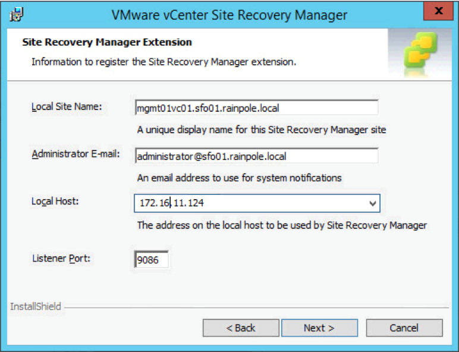

1.  On the **Site Recovery Manager Plug-in ID** page, select **Default Site Recovery Manager Plug-in Identifier**, and click **Next**.

> <embed src="media/image231.png" width="332" height="252" />

1.  On the **Certificate Type** page, select **Automatically generate a certificate**, and click **Next**.

> <embed src="media/image232.png" width="343" height="264" />

1.  On the **Generate Certificate** page, enter the following settings, and click **Next**.

| Setting               | Value    |
|-----------------------|----------|
| **Organization**      | Rainpole |
| **Organization Unit** | Rainpole |

1.  On the **Database Server Selection** page, select **Use the embedded database server**, and click **Next**.

> <embed src="media/image233.png" width="345" height="264" />

1.  On the **Embedded Database Configuration** page, enter the following settings, and click **Next**.

| Setting                | Value                     |
|------------------------|---------------------------|
| **Data Source Name**   | SRM\_SITE\_SFO            |
| **Database User Name** | srm\_admin                |
| **Database Password**  | srm\_admin\_sfo\_password |
| **Database Port**      | 5678                      |
| **Connection Count**   | 5                         |
| **Max. Connections**   | 20                        |

> <embed src="media/image234.png" width="354" height="264" />

1.  On the **Site Recovery Manager Service Account** page, deselect the **Use Local System account** check box, enter the following credentials, and click **Next**.

| Setting      | Value                        |
|--------------|------------------------------|
| **Username** | MGMT01SRM01\\Administrator   |
| **Password** | mgmt01srm01\_admin\_password |

1.  On the **Ready to Install the Program** page, click **Install**.

    1.  ### Deploy the VMware Site Recovery Manager Server (Region B)

Deploy the second VMware Site Recovery Manager instance.

**Procedure**

1.  Log in to the Windows host, **mgmt01srm51.lax01.rainpole.local**, as an administrator.

2.  Navigate to the folder where you downloaded the VMware Site Recovery Manager installer, and open the file to start the installation wizard.

3.  In the **Select Language** dialog box, click **OK**.

4.  On the **Welcome** page, click **Next**.

5.  On the **VMware Patents** page, click **Next**.

6.  On the **End User License Agreement** page, select the **I agree to the terms in the license agreement** radio button, and click **Next**.

7.  On the **Installation Prerequisites** page, click **Next**.

8.  On the **Destination Folder** page, click **Next**.

> <embed src="media/image227.png" width="345" height="264" />

1.  On the **vSphere Platform Services Controller** page, enter the following settings, and click **Next**.

| Setting        | Value                            |
|----------------|----------------------------------|
| **Address**    | mgmt01psc51.lax01.rainpole.local |
| **HTTPS Port** | 443                              |
| **Username**   | administrator@vsphere.local      |
| **Password**   | vcenter\_admin\_password         |

 

> <embed src="media/image235.png" width="363" height="264" />

1.  In the **Platform Services Controller Certificate **dialog box, click **Accept**.

2.  On the **VMware vCenter Server** page, select **mgmt01vc51.lax01.rainpole.local** from the drop-down menu, and click **Next**.

> <embed src="media/image236.png" width="346" height="264" />

1.  In the **vCenter Server** **Certificate **dialog box, click **Accept**.

2.  On the **Site Recovery Manager Extension** page, enter the following settings, and click **Next**.

| Setting                  | Value                           |
|--------------------------|---------------------------------|
| **Local Site Name**      | mgmt01vc51.lax01.rainpole.local |
| **Administrator E-mail** | srm\_admin\_lax\_email\_address |
| **Local Host**           | 172.17.11.124                   |
| **Listener Port**        | 9086                            |

> 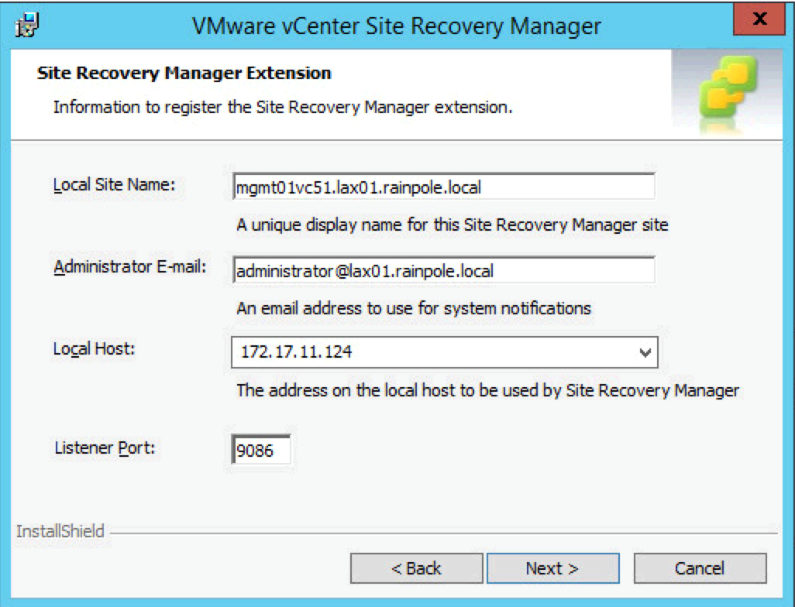

1.  On the **Site Recovery Manager Plug-in ID** page, select **Default Site Recovery Manager Plug-in Identifier**, and click **Next**.

> <embed src="media/image231.png" width="347" height="264" />

1.  On the **Certificate Type** page, select **Automatically generate a certificate**, and click **Next**.

> <embed src="media/image232.png" width="343" height="264" />

1.  On the **Generate Certificate** page, enter the following settings, and click **Next**.

| Setting               | Value    |
|-----------------------|----------|
| **Organization**      | Rainpole |
| **Organization Unit** | Rainpole |

1.  On the **Database Server Selection** page, select **Use the embedded database server**, and click **Next**.

> <embed src="media/image233.png" width="345" height="264" />

1.  On the **Embedded Database Configuration** page, enter the following settings, and click **Next**.

| Setting                | Value                     |
|------------------------|---------------------------|
| **Data Source Name**   | SRM\_SITE\_LAX            |
| **Database User Name** | srm\_admin                |
| **Database Password**  | srm\_admin\_lax\_password |
| **Database Port**      | 5678                      |
| **Connection Count**   | 5                         |
| **Max. Connections**   | 20                        |

> 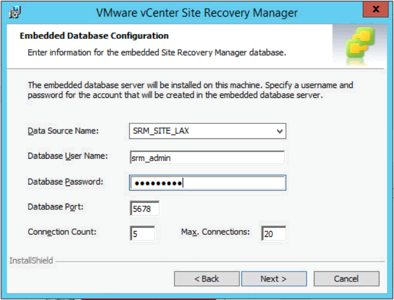

1.  On the **Site Recovery Manager Service Account** page, deselect the **Use Local System account** check box, enter the following credentials, and click **Next**.

| Setting      | Value                        |
|--------------|------------------------------|
| **Username** | MGMT01SRM51\\Administrator   |
| **Password** | mgmt01srm51\_admin\_password |

1.  On the **Ready to Install the Program** page, click **Install**.

    1.  ### Configure the VMware Site Recovery Manager Instances

After both Site Recovery Manager Instances are deployed, you must pair them and configure the mappings between them.

**Procedure**

1.  Log in to the Management vCenter Server, by using the vSphere Web Client.

    1.  In a browser, go to **https://mgmt01vc01.sfo01.rainpole.local/vsphere-client**

    2.  Use the following credentials to log in.

| Setting       | Value                       |
|---------------|-----------------------------|
| **User name** | administrator@vsphere.local |
| **Password**  | vcenter\_admin\_password    |

1.  License the Site Recovery Manager instances.

<!-- -->

1.  Under **Administration**, click **Licensing**.

2.  Click the **Assets **tab, and click **Solutions**.

3.  Select the **mgmt01vc01.sfo01.rainpole.local** instance, and click the **Assign License** icon.

> <embed src="media/image239.png" width="560" height="170" />

1.  Select the available license from the list, and click **OK**.

2.  Select the **mgmt01vc51.lax01.rainpole.local** instance, and click the **Assign License** icon.

3.  Select the available license from the list, and click **OK**.

<!-- -->

1.  Pair the two Site Recovery Manager sites.

<!-- -->

1.  Go back to **Home**.

2.  Under **Inventories**, click **Site Recovery**.

3.  In the **Navigator**, click **Sites**.

4.  Under **Sites**, click the **mgmt01vc01.sfo01.rainpole.local** site.

5.  Under **Guide to configuring SRM**, click **Pair sites**.

6.  On the **Select site** page, enter **mgmt01psc51.lax01.rainpole.local** in the **PSC address** text box, leave the port value, and click **Next**.

> 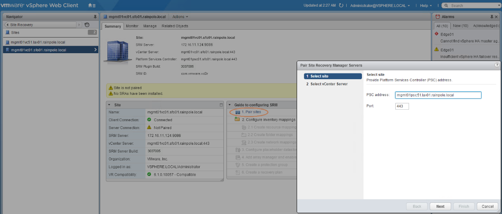

1.  On the **Select vCenter Server** page, select **mgmt01vc51.lax01.rainpole.local**, enter the following credentials**, **and click **Finish.**

| Setting       | Value                       |
|---------------|-----------------------------|
| **User name** | administrator@vsphere.local |
| **Password**  | vcenter\_admin\_password    |

> <embed src="media/image241.png" width="354" height="264" />

1.  In the **Security Alert** dialog box that appears twice, click **Yes, **and wait until a new pane, **Paired Site**, appears on the Summary tab.

> 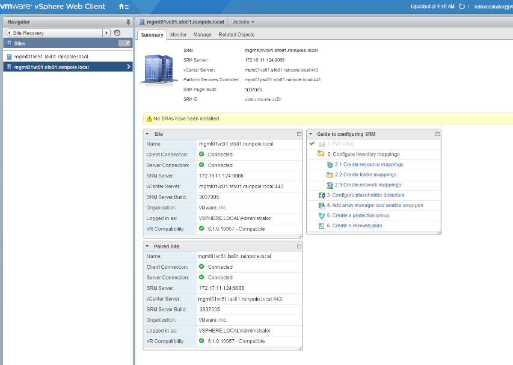

1.  Configure resource mappings.

<!-- -->

1.  Under **Guide to configuring SRM**, click **2.1** **Create resource mappings**.

> 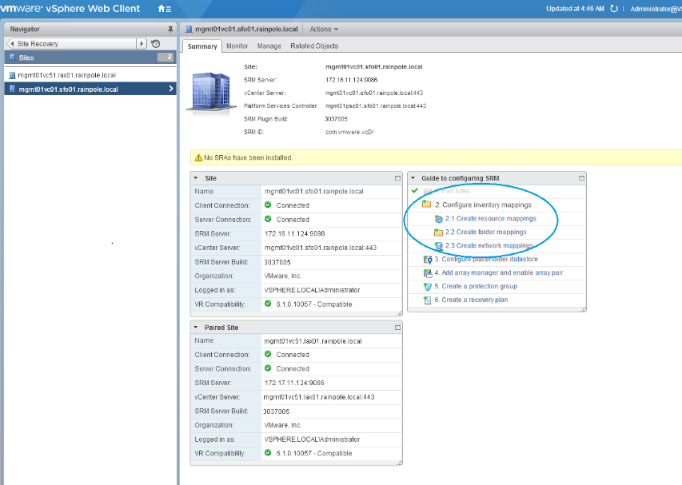

1.  On the **Prepare mappings** page, under **mgmt01vc01.sfo01.rainpole.local**, select **SFO01-Mgmt01**, and under **mgmt01vc51.lax01.rainpole.local**, select **LAX01-Mgmt01**, click **Add mappings**, and click **Next**.

2.  On the **Prepare reverse mappings** page, click **Select all applicable**, and click **Finish**.

<!-- -->

1.  Configure folder mappings.

<!-- -->

1.  Under **Guide to configuring SRM**, click **2.2** **Create folder mappings**.

2.  On the **Select creation mode** page, select **Automatically prepare mappings for folders with matching names**, and click **Next**.

3.  On the **Prepare mappings** page, under **mgmt01vc01.sfo01.rainpole.local**, select **SFO01**, and under **mgmt01vc51.lax01.rainpole.local**, select **LAX01**, click **Add mappings**, and click **Next**.

4.  On the **Prepare reverse mappings** page, click **Select all applicable**, and click **Finish**.

<!-- -->

1.  Configure network mappings to enable fail over for vRealize Operations Manager and vRealize Automation.

<!-- -->

1.  Under **Guide to configuring SRM**, click **2.3 Create network mappings**.

2.  On the **Select creation mode** page, select **Prepare mappings manually**, and click **Next**.

> <embed src="media/image244.png" width="576" height="226" />

1.  On the **Prepare mappings** page, expand the **vDS-Mgmt** trees under **mgmt01vc01.sfo01.rainpole.local** in the left pane,** **and the **mgmt01vc51.lax01.rainpole.local** instances in the right pane to add the respective network mappings.

2.  In both panes, under *vDS-Mgmt*, select the port groups that contain ***vxw-dvs-xxx-vRA01-VXLAN*** in the name, and click **Add mappings**.  

3.  In both panes, under *vDS-Mgmt*, select the port groups that contain ***vxw-dvs-xxx-vROps01-VXLAN*** in the name, click **Add mappings**, and click **Next**.

> <embed src="media/image245.png" width="397" height="264" />

1.  On the **Select test networks** page, keep the default values, and click **Next**.

2.  On the **Prepare reverse mappings** page, click **Select all applicable**, and click **Finish**.

> <embed src="media/image246.png" width="570" height="113" />

1.  Configure placeholder datastore.

<!-- -->

1.  Under **Guide to configuring SRM**, click **3. Configure placeholder datastore**.

2.  In the **Configure Placeholder Datastore** dialog box, select the **SFO01A-VSAN01-MGMT01** datastore, and click **OK**.

3.  Under **Sites**, click the **mgmt01vc51.lax01.rainpole.local** site.

4.  Under **Guide to configuring SRM**, click **3. Configure placeholder datastore**.

5.  In the **Configure Placeholder Datastore** dialog box, select the **LAX01A-VSAN01-MGMT01 **datastore, and click **OK**.

    1.  Deploy and Configure vSphere Replication
        ----------------------------------------

-   Prerequisites for the vSphere Replication Deployment

-   Deploy vSphere Replication (Region A)

-   Deploy vSphere Replication (Region B)

-   Connect the vSphere Replication Instances

-   Isolate the Network Traffic of vSphere Replication

    1.  ### Prerequisites for the vSphere Replication Deployment

Deploy two vSphere Replication virtual appliances, one in the protected site, and one in the recovery site.

Before you proceed to deployment, download the vSphere Replication virtual appliance.

Prepare the email address of the vSphere Replication sites administrators.  

IP Addresses, Host Names, and Network Configuration

Table 14. **vSphere Replication Virtual Appliance Region A**

| Host Name    | Static IPv4 Address | Subnet Mask   | Default Gateway | DNS Servers | FQDN                              | Ports Used | NTP Servers              |
|--------------|---------------------|---------------|-----------------|-------------|-----------------------------------|------------|--------------------------|
| mgmt01vrms01 | 172.16.11.123       | 255.255.255.0 | 172.16.11.1     | 172.16.11.5 | mgmt01vrms01.sfo01.rainpole.local | 5480       | ntp.sfo01.rainpole.local

                                                                                                                                       ntp.lax01.rainpole.local  |

Table 15. **vSphere Replication Virtual Appliance Region B**

| Host Name    | Static IPv4 address | Subnet Mask   | Default Gateway | DNS Servers | FQDN                              | Ports used | NTP Servers              |
|--------------|---------------------|---------------|-----------------|-------------|-----------------------------------|------------|--------------------------|
| mgmt01vrms51 | 172.17.11.123       | 255.255.255.0 | 172.17.11.1     | 172.17.11.5 | mgmt01vrms51.lax01.rainpole.local | 5480       | ntp.lax01.rainpole.local

                                                                                                                                       ntp.sfo01.rainpole.local  |

Table 16. **vSphere Replication dedicated traffic VLAN and IP Requirements**

|                  | VLAN ID | Static IPv4 Address | Subnet Mask   | Gateway       |
|------------------|---------|---------------------|---------------|---------------|
| Region-A (SFO01) | 1616    | 172.16.16.71        | 255.255.255.0 | 172.16.16.253 |
| Region-B (LAX01) | 1716    | 172.17.16.71        | 255.255.255.0 | 172.17.16.253 |

### Deploy vSphere Replication (Region A)

Deploy the vSphere Replication appliance on the protected site. The process is performed in two steps:

-   Deploy the vSphere Replication OVF template through the vSphere Web Client.

-   Register the vSphere Appliance with the Platform Services Controller from the vSphere Replication Management Interface.

Procedure

1.  Log in to the Management vCenter Server, by using the vSphere Web Client.

<!-- -->

1.  In a browser, go to **https://mgmt01vc01.sfo01.rainpole.local/vsphere-client**.

2.  Use the following credentials to log in.

| Setting       | Value                       |
|---------------|-----------------------------|
| **User name** | administrator@vsphere.local |
| **Password**  | vcenter\_admin\_password    |

1.  Deploy the vSphere Replication appliance.

<!-- -->

1.  In the **Navigator**, click **Hosts and Clusters**.

2.  Right-click **mgmt01vc01.sfo01.rainpole.local**, and click **Deploy OVF Template**.

3.  On the **Select source** page, click the **Browse** button, select the vSphere Replication .ovf file, and click **Next**.

4.  On the **Review details** page, click **Next**.

5.  On the **Accept License Agreements** page, click **Accept**, and click **Next**.

6.  On the **Select name and folder** page, enter **mgmt01vrms01.sfo01** as name, select the **SFO01** data center, and click **Next**.

> 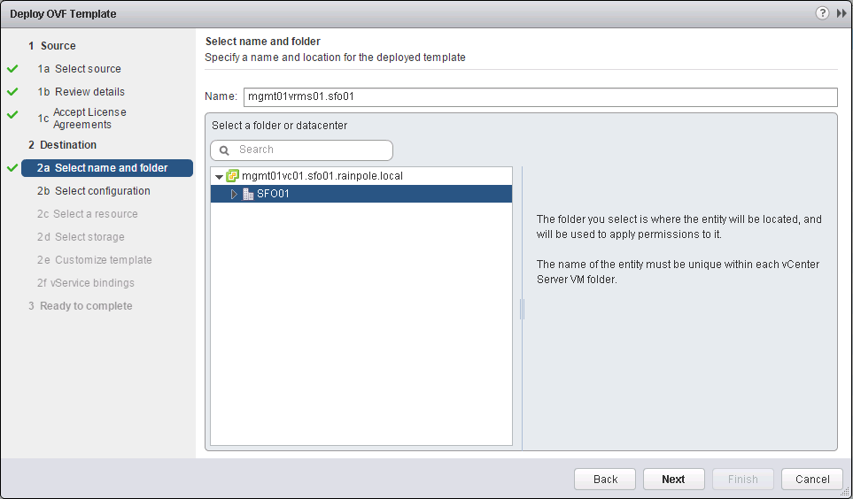

1.  On the **Select configuration** page, leave the default **4 vCPU** option selected, and click **Next**.

> 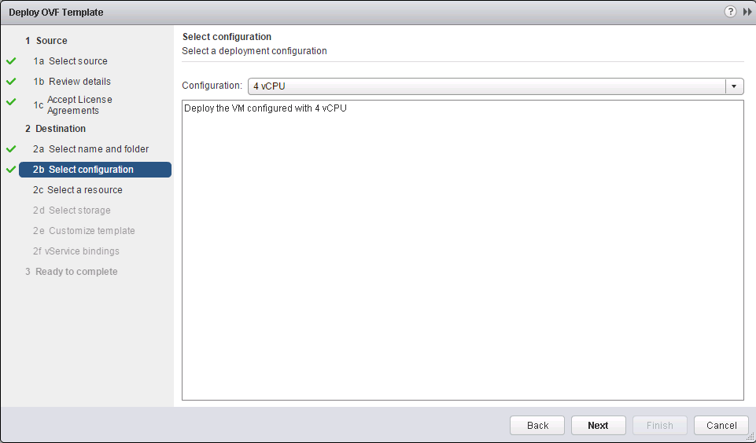

1.  On the **Select a resource** page, select the **SFO01-Mgmt01** cluster, and click **Next**.

> 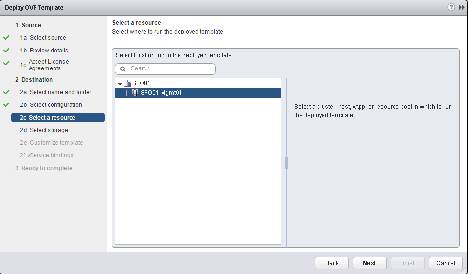

1.  On the** Select storage** page, enter the following settings, and click **Next**.

| Setting               | Value                              |
|-----------------------|------------------------------------|
| **VM Storage Policy** | Virtual SAN Default Storage Policy |
| **Datastore**         | SFO01A-VSAN01-MGMT01               |

> 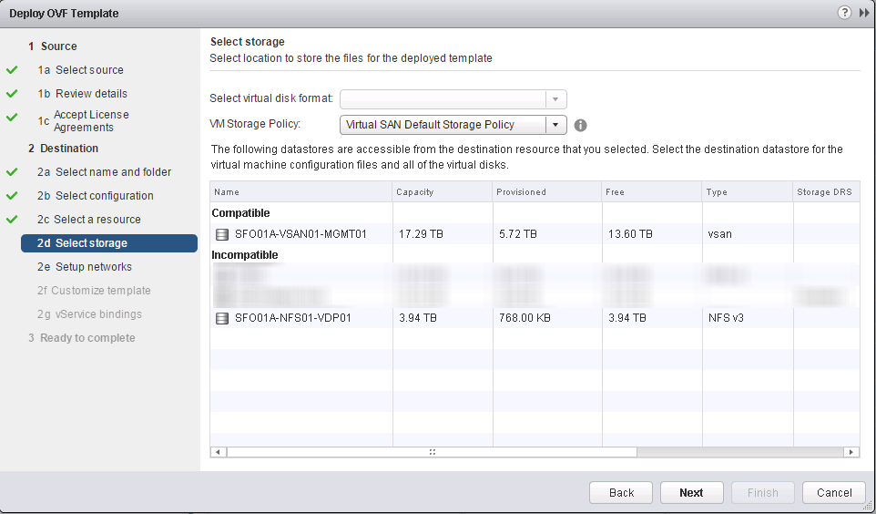

1.  On the **Setup networks** page, select the following settings, and click **Next**.

| Setting                            | Value               |
|------------------------------------|---------------------|
| **Management Network Destination** | vDS-Mgmt-Management |
| **IP protocol**                    | IPv4                |
| **IP allocation**                  | Static - Manual     |
| **DNS servers**                    | 172.16.11.5         |
| **Gateway**                        | 172.16.11.1         |
| **Netmask**                        | 255.255.255.0       |

> 

1.  On the **Customize template** page, enter the following settings, and click **Next**.

| Setting                           | Value                                             |
|-----------------------------------|---------------------------------------------------|
| **Enter password**                | vr\_sfo\_root\_password                           |
| **Confirm password**              | vr\_sfo\_root\_password                           |
| **NTP Servers**                   | ntp.sfo01.rainpole.local,ntp.lax01.rainpole.local |
| **Management Network IP Address** | 172.16.11.123                                     |

 

> 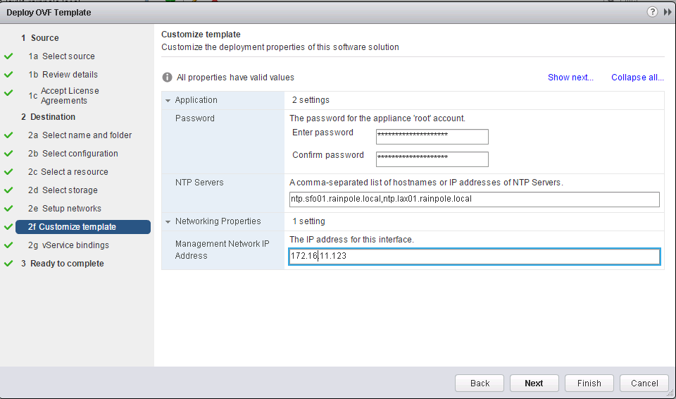

1.  On the **vService bindings** page, click **Next**.

> 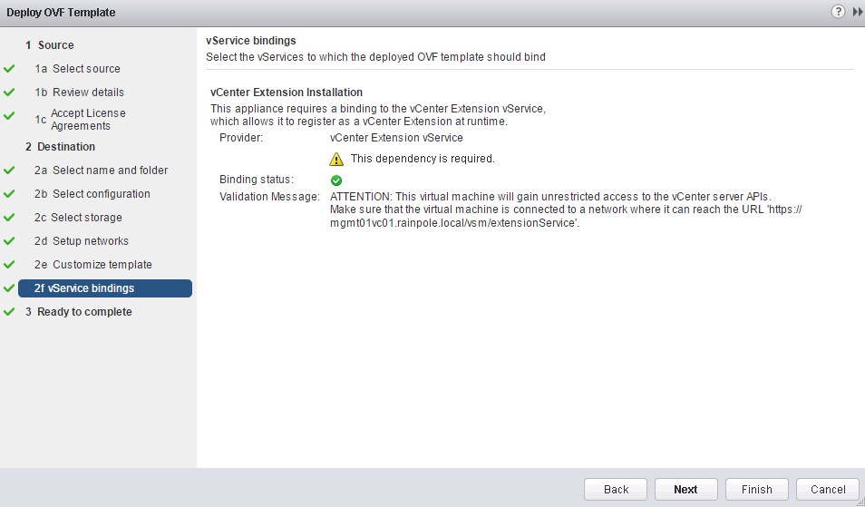

1.  On the **Ready to complete** page, select the **Power on after deployment** check box, and click **Finish**.

> 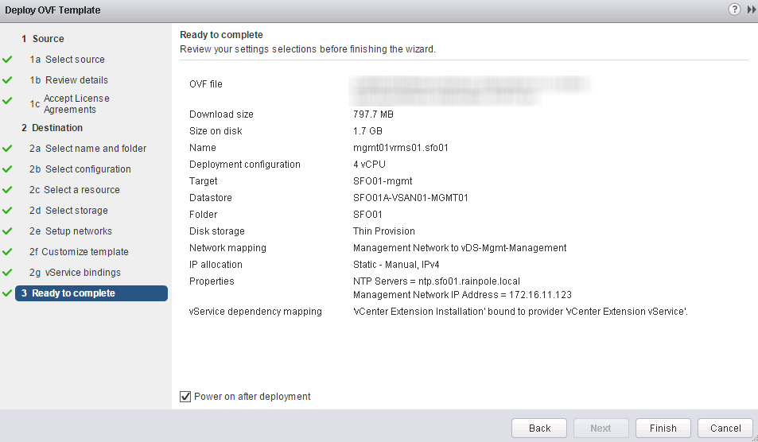

1.  Register the vSphere Appliance with the Platform Services Controller from the vSphere Replication Management interface.

<!-- -->

1.  In a browser, go to **https://mgmt01vrms01.sfo01.rainpole.local:5480**.

2.  Use the following credentials to log in.

| Setting       | Value                   |
|---------------|-------------------------|
| **User name** | root                    |
| **Password**  | vr\_sfo\_root\_password |

1.  Click **Configuration**, enter the following settings, and click **Save and Restart Service**.

| Setting                       | Value                                 |
|-------------------------------|---------------------------------------|
| **Configuration Mode**        | Configure using the embedded database |
| **LookupService Address**     | mgmt01psc01.sfo01.rainpole.local      |
| **SSO Administrator**         | administrator@vsphere.local           |
| **Password**                  | vcenter\_admin\_password              |
| **VRM Host**                  | 172.16.11.123                         |
| **VRM Site Name**             | mgmt01vc01.sfo01.rainpole.local       |
| **vCenter Server Address**    | mgmt01vc01.sfo01.rainpole.local       |
| **vCenter Server Port**       | 80                                    |
| **vCenter Server Admin Mail** | vcenter\_admin\_password              |

> 

1.  In the **Confirm SSL Certificate** dialog box, click **Accept**.

> 

1.  Wait for the new changes to take effect.

> 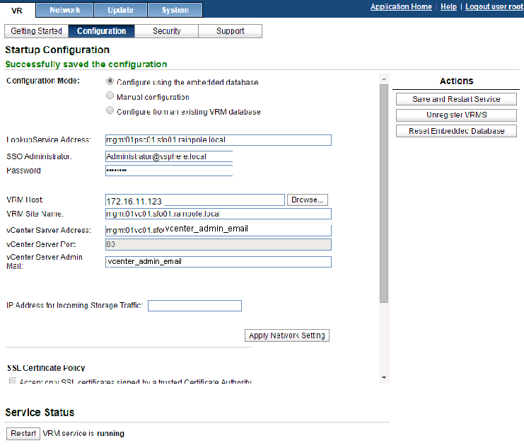

1.  Under **Service Status**, verify that the status of the VRM service is running.

<!-- -->

1.  Log out from the vSphere Replication Management Interface.

    1.  ### Deploy vSphere Replication (Region B)

Deploy the vSphere Replication appliance on the recovery site. The process is performed in two steps:** **

-   Deploy the vSphere Replication OVF template through the vSphere Web Client.

-   Register the vSphere Appliance with the Platform Services Controller from the vSphere Replication Management Interface.

Procedure

1.  Log in to the Management vCenter Server, by using the vSphere Web Client.

<!-- -->

1.  In a browser, go to **https://mgmt01vc51.lax01.rainpole.local/vsphere-client**.

2.  Use the following credentials to log in.

| Setting       | Value                       |     |
|---------------|-----------------------------|-----|
| **User name** | administrator@vsphere.local |     |
| **Password**  | vcenter\_admin\_password    |     |

1.  Deploy the vSphere Replication appliance.

    1.  In the **Navigator**, click **Hosts and Clusters**.

    2.  Right-click **mgmt01vc51.lax01.rainpole.local**, and click **Deploy OVF Template**.

    3.  On the **Select source** page, click the **Browse** button, select the vSphere Replication .ovf file, and click **Next**.

    4.  On the **Review details** page, click **Next**.

    5.  On the **Accept License Agreements** page, click **Accept**, and click **Next**.

    6.  On the **Select name and folder** page, enter **mgmt01vrms51.lax01** as name, select the **LAX01** data center, and click **Next**.

> 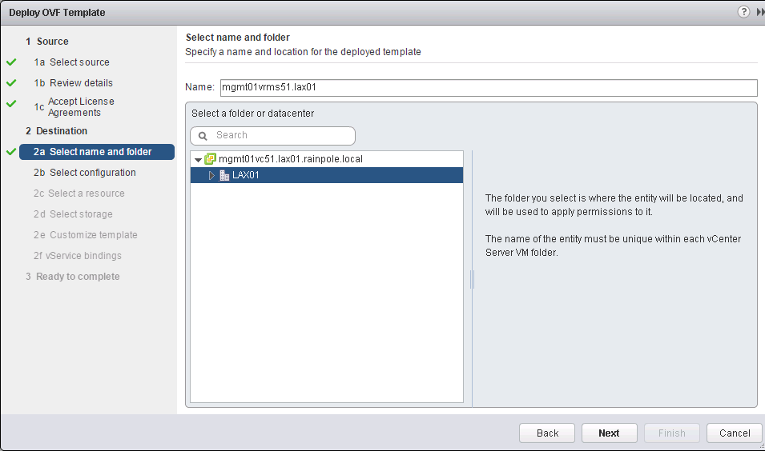

1.  On the **Select configuration** page, leave the default **4 vCPU** option selected, and click **Next**.

> 

1.  On the **Select a resource** page, select the **LAX01-Mgmt01** cluster, and click **Next**.

> 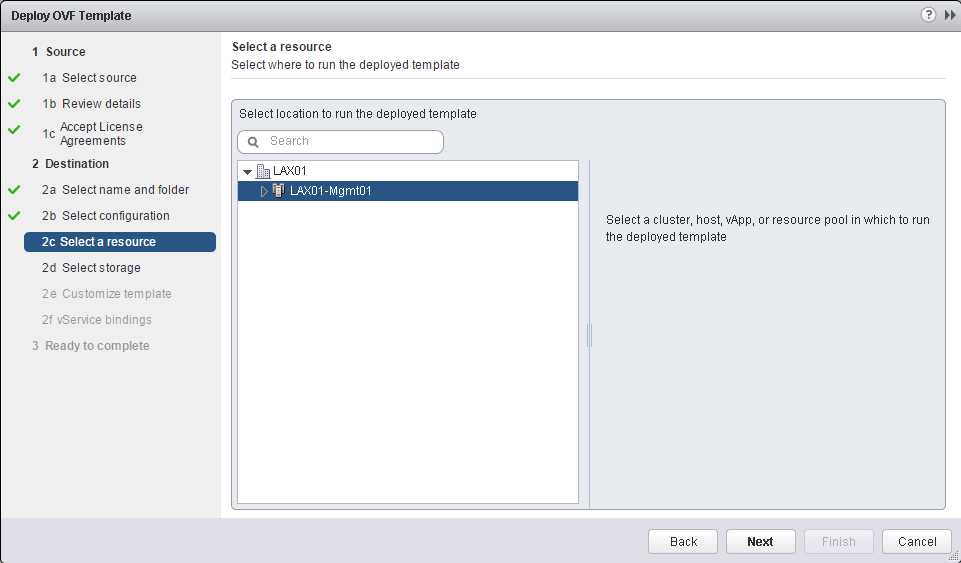

1.  On the** Select storage** page, enter the following settings, and click **Next**.

| Setting               | Value                              |
|-----------------------|------------------------------------|
| **VM Storage Policy** | Virtual SAN Default Storage Policy |
| **Datastore**         | LAX01A-VSAN01-MGMT01               |

> 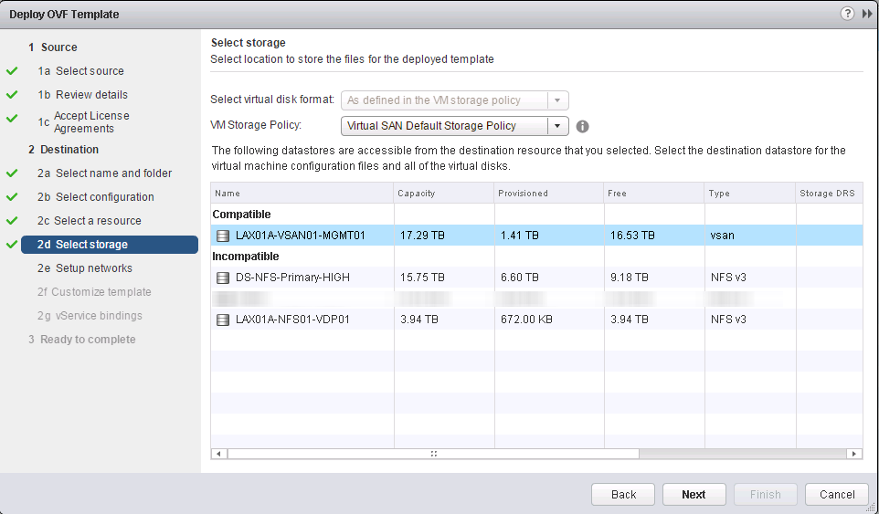

1.  On the **Setup networks** page, select the following settings, and click **Next**.

| Setting                            | Value               |
|------------------------------------|---------------------|
| **Management Network Destination** | vDS-Mgmt-Management |
| **IP protocol**                    | IPv4                |
| **IP allocation**                  | Static - Manual     |
| **DNS servers**                    | 172.17.11.5         |
| **Gateway**                        | 172.17.11.1         |
| **Netmask**                        | 255.255.255.0       |

> 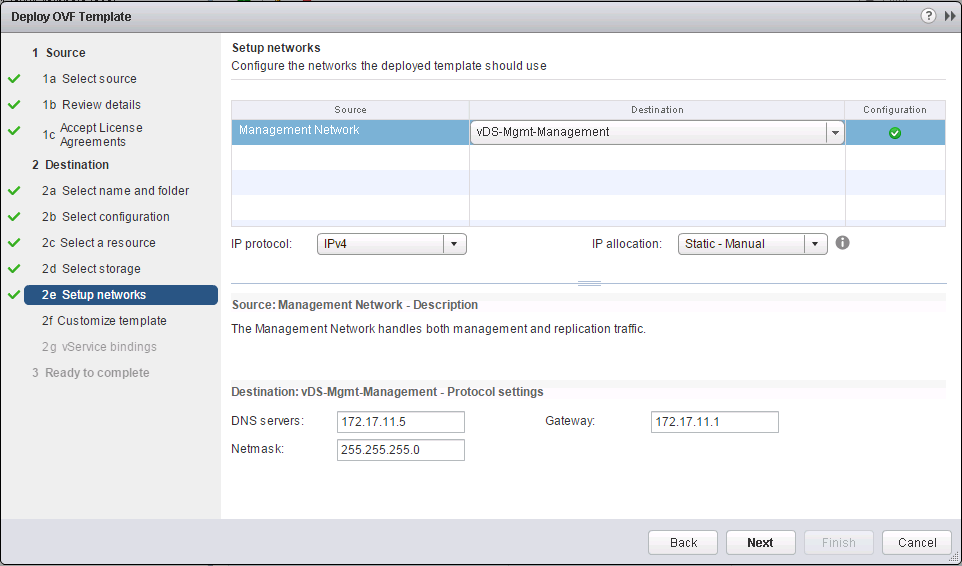

1.  On the **Customize template** page, enter the following settings, and click **Next**.

| Setting                           | Value                                             |
|-----------------------------------|---------------------------------------------------|
| **Enter password**                | vr\_lax\_root\_password                           |
| **Confirm password**              | vr\_lax\_root\_password                           |
| **NTP Servers**                   | ntp.lax01.rainpole.local,ntp.sfo01.rainpole.local |
| **Management Network IP Address** | 172.17.11.123                                     |

> 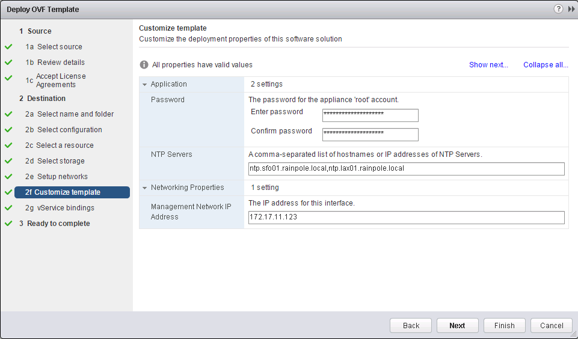

1.  On the **vService bindings** page, click **Next**.

> 

1.  On the **Ready to complete** page, select the **Power on after deployment** check box, and click **Finish**.

> 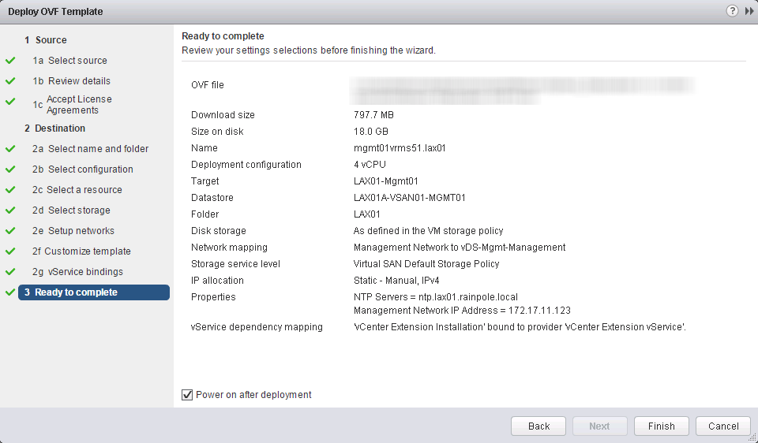

1.  Register the vSphere Appliance with the Platform Services Controller from the vSphere Replication Management Interface.

    1.  In a browser, go to **https://mgmt01vrms51.lax01.rainpole.local:5480.**

    2.  Use the following credentials to log in.

| Setting       | Value                   |
|---------------|-------------------------|
| **User name** | root                    |
| **Password**  | vr\_lax\_root\_password |

1.  Click **Configuration**, enter the following settings, and click **Save and Restart Service**.

| Setting                       | Value                                 |
|-------------------------------|---------------------------------------|
| **Configuration Mode**        | Configure using the embedded database |
| **LookupService Address**     | mgmt01psc51.lax01.rainpole.local      |
| **SSO Administrator**         | administrator@vsphere.local           |
| **Password**                  | vcenter\_admin\_password              |
| **VRM Host**                  | 172.17.11.123                         |
| **VRM Site Name**             | mgmt01vc51.lax01.rainpole.local       |
| **vCenter Server Address**    | mgmt01vc51.lax01.rainpole.local       |
| **vCenter Server Port**       | 80                                    |
| **vCenter Server Admin Mail** | vcenter\_admin\_email                 |

> 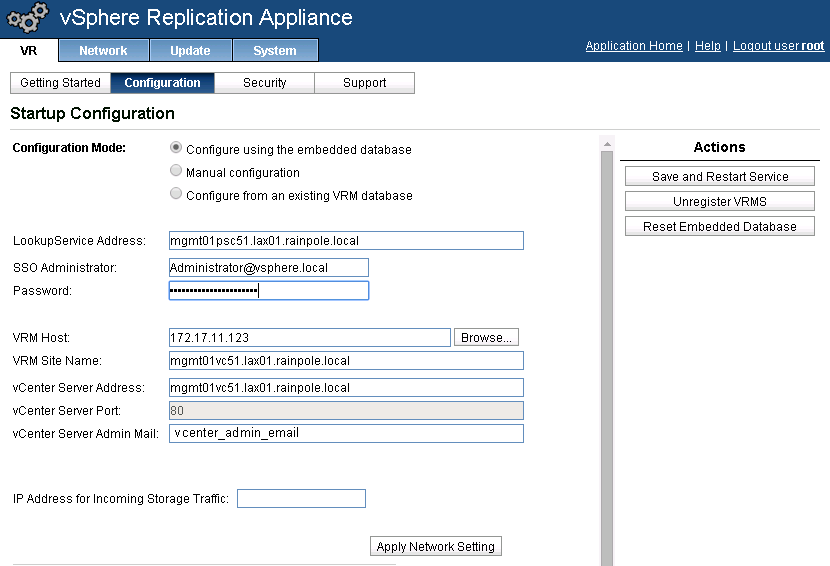

1.  In the **Confirm SSL Certificate** dialog box, click **Accept**.

> 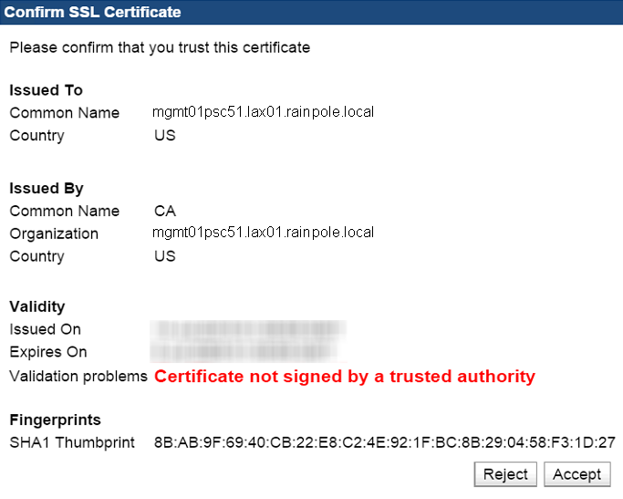

1.  Wait for the new changes to take effect.

> 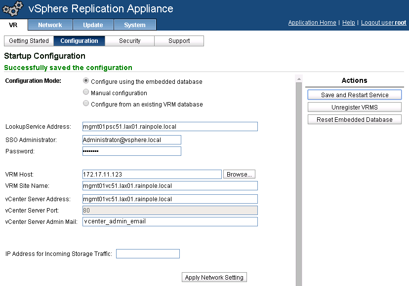

1.  Under **Service Status**, verify that the status of the VRM service is running.

<!-- -->

1.  Log out from the vSphere Replication Management Interface.

    1.  ### Connect the vSphere Replication Instances

To use vSphere Replication between two sites managed by different vCenter Server instances, you must configure a connection between the two vSphere Replication appliances.

Procedure

1.  Log in to the Management vCenter Server, by using the vSphere Web Client.

    1.  In a browser, go to **https://mgmt01vc01.sfo01.rainpole.local/vsphere-client**.

    2.  Use the following credentials to log in.

| Setting       | Value                       |
|---------------|-----------------------------|
| **User name** | administrator@vsphere.local |
| **Password**  | vcenter\_admin\_password    |

1.  Connect the two vSphere Replication instances.

    1.  In the **Navigator**, select the **mgmt01vc01.sfo01.rainpole.local** instance, click **Manage**, and click **vSphere Replication**.

    2.  Click **Target Sites**, and click the **Connect to target site to configure replications** icon.

> 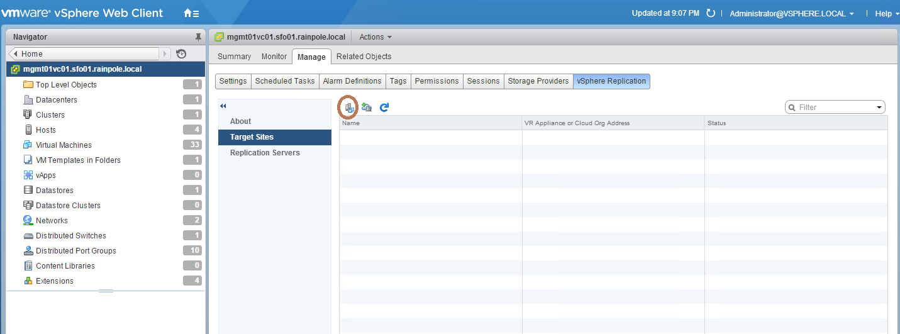

1.  In the **Connect to Target Site** dialog box, select **Connect to a remote site**, enter the following settings, and click the **Log In** button.

| Setting                            | Value                            |
|------------------------------------|----------------------------------|
| **PSC address of the remote site** | mgmt01psc51.lax01.rainpole.local |
| **User name**                      | administrator@vsphere.local      |
| **Password**                       | vcenter\_admin\_password         |

1.  In the **Security Alert** dialog box, click **Yes**.

2.  In the **Connect to Target site** dialog box, **mgmt01vc51.lax01.rainpole.loca** is now selected, click **OK**.

<!-- -->

1.  Verify that the value under Status is **Connected**.

> 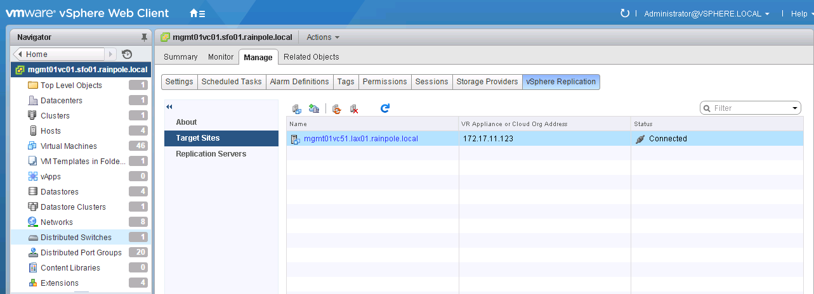

### Isolate the Network Traffic of vSphere Replication

vSphere Replication can consume a lot of bandwidth during initial replication and when virtual machines are added or destroyed. To avoid network problems in the data center, it is recommended that you isolate replication traffic from other network traffic. Isolating the replication traffic helps you ensure that sensitive information is not routed through untrusted public networks, and enhances the network performance in the data center, by reducing the impact of vSphere Replication on other types of traffic.

You isolate the network traffic to the vSphere Replication Server by dedicating a VMKernel NIC on each ESXi host that sends data to the vSphere Replication Server and use a dedicated NIC on the vSphere Replication Server VM. By default, the vSphere Replication appliance has one virtual network adapter that is used by the vSphere Replication server for replication traffic, and by the vCenter Server for virtual machine management. To isolate the replication traffic, you add a second adapter to the appliances in both regions, and configure them for replication traffic only as described in the following table.

Table 17. Configuration for the second adapter needed for each vSphere Replication Appliance

| vSphere Replication

 Appliance            | Connect New Network Adapter To | IPv4 Address Type | IPv4 Address | Netmask       | IP Address For Incoming Storage Traffic |
|---------------------|--------------------------------|-------------------|--------------|---------------|-----------------------------------------|
| mgmt01vrms01.sfo01.

 rainpole.local       | vDS-Mgmt-VR                    | Static            | 172.16.16.71 | 255.255.255.0 | 172.16.16.71                            |
| mgmt01vrms51.lax01.

 rainpole.local       | vDS-Mgmt-VR                    | Static            | 172.16.16.71 | 255.255.255.0 | 172.17.16.71                            |

Procedure

1.  Log in to the Management vCenter Server, by using the vSphere Web Client.

    1.  In a browser, go to **https://mgmt01vc01.sfo01.rainpole.local/vsphere-client**.

    2.  Use the following credentials to log in.

| Setting       | Value                       |
|---------------|-----------------------------|
| **User name** | administrator@vsphere.local |
| **Password**  | vcenter\_admin\_password    |

1.  Shut down the vSphere Replication appliance to allow changes in the hardware configuration.

    1.  In the **Navigator**, click **Hosts and Clusters**. 

    2.  Expand the entire **mgmt01vc01.sfo01.rainpole.local** tree.

    3.  Right-click the **mgmt01vrms01.sfo01.rainpole.local **virtual appliance, and select **Power** &gt; **Power Off**.

    4.  In the **Confirm Power Off **dialog box, click **Yes** to proceed.

2.  Add a VM network adapter to the vSphere Replication virtual appliance, that handles replication traffic only.

    1.  Right-click the **mgmt01vrms01.sfo01.rainpole.local** virtual appliance, and select **Edit Settings**.

    2.  In the **Edit Settings **dialog box, click **Yes **to proceed.

    3.  In the **mgmt01vrms01.sfo01.rainpole.local - Edit Settings **dialog box, from the **New device** drop-down menu, select **Network**, and click **Add**.
        New **Network device** appears at the bottom of the **Virtual Hardware** list.

    4.  From the **New Network** device drop-down menu, select **vDS-Mgmt-VR**, and click **OK**

> <embed src="media/image270.png" width="365" height="377" />
>  

1.  Right-click the **mgmt01vrms01.sfo01.rainpole.local **virtual appliance, and select **Power** &gt; **Power On**.

2.  In the **Confirm Power On **dialog box, click **Yes** to proceed.

<!-- -->

1.  Log in to the vSphere Replication Management Interface.

    1.  In a browser, go to **https://mgmt01vrms01.sfo01.rainpole.local:5480**.

    2.  Use the following credentials to log in.

| Setting       | Value                   |
|---------------|-------------------------|
| **User name** | root                    |
| **Password**  | vr\_sfo\_root\_password |

1.  Configure the network settings for the new network adapter (*eth1*).

    1.  Click the **Network** tab, and click **Address**.

    2.  Under **eth1 info**, enter the following settings, and click **Save Settings**.

| Setting               | Value         |
|-----------------------|---------------|
| **IPv4 Address Type** | Static        |
| **IPv4 Address**      | 172.16.16.71  |
| **Netmask**           | 255.255.255.0 |
| **IPv6 Address Type** | Auto          |

> <embed src="media/image271.png" width="476" height="377" />

1.  Click the **VR **tab, and click **Configuration**.

2.  In the** IP Address for Incoming Storage Traffic** text box, enter **172.16.16.71**, as this is the IP address of the new network adapter that will be used for replication traffic, and click **Apply Network Setting**.

> <embed src="media/image272.png" width="347" height="329" />

1.  Repeat the steps to reconfigure the vSphere Replication appliance **mgmt01vrms51.lax01.rainpole.local** in Region B, use the values from the following table.

| Setting                                     | Value                             |
|---------------------------------------------|-----------------------------------|
| **Object to configure**                     | mgmt01vrms51.lax01.rainpole.local |
| **Connect New Network Adapter To**          | vDS-Mgmt-VR                       |
| **IPv4 Address Type**                       | Static                            |
| **IPv4 Address**                            | 172.16.16.71                      |
| **Netmask**                                 | 255.255.255.0                     |
| **IP Address For Incoming Storage Traffic** | 172.17.16.71                      |

1.  Add static network routes on the management cluster ESXi hosts in all regions.

| Hostname                         | Source Gateway | Target Network | Command To Execute                                                                |
|----------------------------------|----------------|----------------|-----------------------------------------------------------------------------------|
| mgmt01esx01.sfo01.rainpole.local | 172.16.16.253  | 172.17.16.0/24 | esxcli network ip route ipv4 add --gateway 172.16.16.253 --network 172.17.16.0/24 |
| mgmt01esx02.sfo01.rainpole.local | 172.16.16.253  | 172.17.16.0/24 | esxcli network ip route ipv4 add --gateway 172.16.16.253 --network 172.17.16.0/24 |
| mgmt01esx03.sfo01.rainpole.local | 172.16.16.253  | 172.17.16.0/24 | esxcli network ip route ipv4 add --gateway 172.16.16.253 --network 172.17.16.0/24 |
| mgmt01esx04.sfo01.rainpole.local | 172.16.16.253  | 172.17.16.0/24 | esxcli network ip route ipv4 add --gateway 172.16.16.253 --network 172.17.16.0/24 |
| mgmt01esx51.lax01.rainpole.local | 172.17.16.253  | 172.16.16.0/24 | esxcli network ip route ipv4 add --gateway 172.17.16.253 --network 172.16.16.0/24 |
| mgmt01esx52.lax01.rainpole.local | 172.17.16.253  | 172.16.16.0/24 | esxcli network ip route ipv4 add --gateway 172.17.16.253 --network 172.16.16.0/24 |
| mgmt01esx53.lax01.rainpole.local | 172.17.16.253  | 172.16.16.0/24 | esxcli network ip route ipv4 add --gateway 172.17.16.253 --network 172.16.16.0/24 |
| mgmt01esx54.lax01.rainpole.local | 172.17.16.253  | 172.16.16.0/24 | esxcli network ip route ipv4 add --gateway 172.17.16.253 --network 172.16.16.0/24 |

1.  Login into the console of the **mgmt01esxi01.sfo01.rainpole.local** host, use the following credentials to log in.

| Setting       | Value                      |
|---------------|----------------------------|
| **User name** | root                       |
| **Password**  | esxi\_root\_user\_password |

1.  Execute the following command to create a route to the recovery site.

> esxcli network ip route ipv4 add --gateway 172.16.16.253 --network 172.17.16.0/24

1.  Repeat the step for all remaining ESXi hosts in the *SFO01-Mgmt01*, and *LAX01-Mgmt01* clusters.

Replace Certificates (Region B)
-------------------------------

By default, vSphere 6.0 components use TLS/SSL certificates that are signed by VMware Certificate Authority (VMCA). These certificates are not trusted by end-user devices. That might mean, for example, that a certificate warning results when a user connects to a vCenter Server system with the vSphere Web Client. 

In this design, we replace user-facing certificates with certificates that are signed by a custom Microsoft Certificate Authority (CA). Infrastructure administrators connect to different vSphere components, such as vCenter Server systems or a Platform Services Controller from a web browser to perform configuration, management and troubleshooting.
The authenticity of the network node to which the administrator connects must be confirmed with a valid TLS/SSL certificate.

We do not replace certificates for machine-to-machine communication; if necessary, we can manually trust those certificates. 

In a dual-region implementation, certificate replacement has to happen in both regions for the following VMware products. 

-   Platform Services Controller (both management pod and compute pod)

-   vCenter Server system (both management pod and compute pod)

-   VMware NSX Manager (both management pod and compute pod)

-   VMware Site Recovery Manager 

-   VMware vSphere Replication

    1.  ### Replacement Tasks Order

Before you start the Region B Certificate Replacement implementation, you complete preparation for certificate replacement and perform certificate replacement for Region A:

-   Set up your Microsoft CA, create a custom template, and add the custom templates to the set of available templates. You do this only once. 

-   Replace certificates in Region A, as follows:

-   Then you replace certificates in Region B, in this order:

-   Management Platform Services Controller

-   Management vCenter Server system

-   Management NSX Manager

-   Compute Platform Services Controller

-   Compute vCenter Server system

-   Compute NSX Manager

Finally, you perform certificate replacement for vCenter Site Recovery Manager and vSphere Replication, which are only included in a dual-region deployment. You replace those certificates in both Region A and Region B.

### Replace the Platform Services Controller Certificate (Region B)

The first step is replacing the machine SSL certificate on each Platform Services Controller instance with a custom certificate. For details on performing this tasks, see Replace the Machine SSL Certificate with Custom Certificates in the *vSphere Security* documentation, or VMware Knowledge Base article 2112277. 

This sequence of step-by-step instructions explains how to replace the certificate for a Platform Services Controller instance. You perform this task twice. The steps use mgmt01psc51.lax01.rainpole.local as an example in a few places. 

Table 18. SSL Certificates Replacement Order for Platform Service Controllers

| PSC Name                         | CSR file name              | Certificate Name      | Replacement Time                       |
|----------------------------------|----------------------------|-----------------------|----------------------------------------|
| mgmt01psc51.lax01.rainpole.local | mgmt01psc51.lax01\_ssl.csr | mgmt01psc51.lax01.cer | First replacement task.                |
| comp01psc51.lax01.rainpole.local | comp01psc51.lax01\_ssl.csr | comp01psc51.lax01.cer | After mgmt01psc51.lax01.rainpole.local |

1.  Log in to a Windows host that has access to both the AD-CA server and the Platform Services Controller as an administrator.

2.  Generate the CSR using VMware Certificate Manager utility.  

    1.  Login to the Platform Services Controller via SSH or Console.

| Host                           | User | Password                |
|--------------------------------|------|-------------------------|
| mgmt01psc51.lax01.rainpole.com | root | mgmtpsc\_root\_password |
| comp01psc51.lax01.rainpole.com | root | comppsc\_root\_password |

1.  Go to the bash shell by running these commands:

> shell.set --enabled True
>
> shell
>
> chsh -s /bin/bash root

1.  Launch the vSphere 6.0 Certificate Manager utility:

> /usr/lib/vmware-vmca/bin/certificate-manager

1.  Select **Option 1 (Replace Machine SSL certificate with Custom Certificate).**

2.  Provide the administrator@vsphere.local password when prompted. 

3.  Select **Option 1 (Generate Certificate Signing Request(s) and Key(s) for Machine SSL certificate)**

4.  Provide a directory (e.g. /tmp/ssl) to save the certificate signing request and private key to.
    The files created have the names machine\_ssl.csr and machine\_ssl.key.

5.  To avoid confusion later, rename the files to use the machine name, for example mgmt01psc51.lax01\_ssl.csr and mgmt01psc51.lax01\_ssl.key for the mgmt01psc51.lax01.rainpole.com host. 

6.  Using a Web browser, connect to http://dc01rpl.rainpole.local/CertSrv/, the Web interface of the AD-CA server and follow the steps in the *Obtain Custom Certificates* section to enroll the certificate for this Platform Services Controller with the AD-CA server. If prompted, log in as the AD administrator with the *ad\_admin\_password* password.

7.  Save the two files on the Platform Services Controller in the /tmp/ssl directory.

| Host                           | Files                                        |
|--------------------------------|----------------------------------------------|
| mgmt01psc51.lax01.rainpole.com | mgmt01psc51.lax01.cer  (signed certificate) 

                                  Root64.cer file (root certificate)            |
| comp01psc51.lax01.rainpole.com | comp01psc51.lax01.cer  (signed certificate) 

                                  Root64.cer file (root certificate)            |

1.  Start the vSphere Certificate Manager utility again on the Platform Services Controller, select **Option 1**, and select **Option 2** **(Import custom certificate(s) and key(s) to replace existing Machine SSL certificate).**

2.  When prompted, provide the full path to the signed certificate file, the key file that was generated by Certificate Manager, and the issuing CA certificate file.
    For example, for mgmt01psc51.lax01.rainpole.com:
    Please provide valid custom certificate for Machine SSL.
    File : /tmp/ssl/mgmt01psc51.lax01.cer
    Please provide valid custom key for Machine SSL.
    File : /tmp/ssl/mgmt01psc51.lax01\_ssl.key
    Please provide the signing certificate of the Machine SSL certificate
    File : /tmp/ssl/Root64.cer

3.  Answer **Yes (Y)** to the confirmation request. 

4.  When **Status** shows **100% Completed**, you have to restart all services in each vCenter Server that is managed by this Platform Services Controller.

    1.  Connect to the vCenter Server instance.

    2.  Run the following commands:

> service-control --stop –all
>
> service-control --start –all

1.  As a final step, you have to update the lookup service on the Platform Services Controller to include the new certificate information. If you don't, external solutions such as VMware NSX will later have problems connecting to vCenter Server. See [VMware Knowledge Base Article 2121701](http://kb.vmware.com/kb/2121701) for details - this procedure gives only an overview of the process. 

    1.  Log in to the Platform Services Controller appliance shell.

| Host                           | User | Password                |
|--------------------------------|------|-------------------------|
| mgmt01psc51.lax01.rainpole.com | root | mgmtpsc\_root\_password |
| comp01psc51.lax01.rainpole.com | root | comppsc\_root\_password |

1.  Retrieve the old certificate from the backup store and extract the thumbprint.

<!-- -->

1.  If you performed more than one certificate replacement, extract the certificate from the Managed Object Browser instead.  

> Output the certificate:
>
> /usr/lib/vmware-vmafd/bin/vecs-cli entry getcert --store BACKUP\_STORE --alias bkp\_\_\_MACHINE\_CERT --output /old.cer
>
> Extract the thumbprint from the certificate:
>
> openssl x509 -in /old.cer -noout -sha1 -fingerprint
>  
> The output look similar to the following: SHA1 Fingerprint=5A:E6:C4:12:2B:E7:B0:28:42:57:58:01:27:FE:8A:74:59:00:B4:90

1.  Run the ls\_update\_certs.py script with the following inputs:  

> --fingerprint –  Thumbprint of the old certificate, which you retrieved in the previous step.
> --certfile – The new certificate file. 
>
> /usr/lib/vmidentity/tools/scripts/ls\_update\_certs.py --url https://mgmt01psc51.lax01.rainpole.local/lookupservice/sdk --fingerprint 5A:E6:C4:12:2B:E7:B0:28:42:57:58:01:27:FE:8A:74:59:00:B4:90 --certfile /tmp/ssl/mgmt01psc51.lax01.cer --user <administrator@vsphere.local> --password sso\_admin\_pwd
>
> The result of this command would look like the following example:
>
> 2015-08-18 16:39:46,942 INFO com.vmware.vim.vmomi.core.types.impl.VmodlContextImpl$NonValidatingClassPathXmlApplicationContext - Closing com.vmware.vim.vmomi.core.types.impl.VmodlContextImpl$NonValidatingClassPathXmlApplicationContext@3f9b12fb: startup date \[Tue Aug 18 16:39:46 UTC 2015\]; root of context hierarchy
> 2015-08-18 16:39:47,725 WARN com.vmware.vim.vmomi.client.http.impl.HttpConfigurationCompilerBase$ConnectionMonitorThreadBase - Shutting down the connection monitor.
> Don't update service b7b1bf2c-49e9-4fff-945e-d730645a7235
> Updated 9 service(s)

### Replace the vCenter Server Machine SSL Certificates (Region B)

After you replace the Platform Services Controller certificate, you replace the vCenter Server machine SSL certificate. For details on performing this tasks, see [Replace the Machine SSL Certificate with Custom Cerrtificates](http://pubs.vmware.com/vsphere-60/topic/com.vmware.vsphere.security.doc/GUID-41B3B37E-5C48-4333-BA3F-5A00B3BBCC76.html) in the *vSphere Security* documentation, or[ VMware Knowledge Base article 2112277](http://kb.vmware.com/kb/2112277) .

This sequence of step-by-step instructions explains how to replace the certificate for vCenter Server systems. Follow the steps twice, once for each vCenter Server system. The steps use  mgmt01vc01.lax01.rainpole.local as an example in a few places.

The following table gives an overview. 

| vCenter Server Name             | CSR File Name             | Certificate Name     | Replacement Time                                      |
|---------------------------------|---------------------------|----------------------|-------------------------------------------------------|
| mgmt01vc51.lax01.rainpole.local | mgmt01vc51.lax01\_ssl.csr | mgmt01vc51.lax01.cer | After replacing both PSC instances in the LAX region. |
| comp01vc51.lax01.rainpole.local | comp01vc51.lax01\_ssl.csr | comp01vc51.lax01.cer | After mgmt01vc51.lax01.rainpole.local                 |

1.  Log in to a Windows host that has access to both the AD-CA server and the vCenter Server systems as an administrator.

2.  Generate the CSR for the vCenter Server instance using the VMware Certificate Manager utility. 

    1.  Connect to the** **vCenter Server instance via SSH or Console.  

| Host                            | Username | Password               |
|---------------------------------|----------|------------------------|
| mgmt01vc51.lax01.rainpole.local | root     | mgmtvc\_root\_password |
| comp01vc51.lax01.rainpole.local | root     | compvc\_root\_password |

1.  Enter into bash shell mode by running the following commands:

> shell.set --enabled True
>
> shell
>
> chsh -s /bin/bash root

1.  Launch the vSphere 6.0 Certificate Manager utility:

> /usr/lib/vmware-vmca/bin/certificate-manager

1.  Select **Option 1 (Replace Machine SSL certificate with Custom Certificate)**

2.  Provide the administrator@vsphere.local password when prompted.

3.  When prompted for the **Infrastructure Server IP**, provide the IP address of the Platform Services Controller that manages this vCenter Server instance.

4.  Select **Option 1 (Generate Certificate Signing Request(s) and Key(s) for Machine SSL certificate).**

5.  Provide a directory (e.g. /tmp/ssl) for the certificate signing request and private key.
    Certificate Manager creates two files named machine\_ssl.csr and machine\_ssl.key.

6.  To avoid confusion later, rename the files to match the machine name, for example, mgmt01vc51.lax01\_ssl.csr and mgmt01vc51.lax01\_ssl.key for the mgmt01vc51.lax01.rainpole.local host.

7.  Using a Web browser, connect to http://dc01rpl.rainpole.local/CertSrv/, the Web interface of the AD-CA server and follow the steps in the *Obtain Custom Certificates* section to enroll the certificate for this vCenter Server system with the AD-CA server.
    If prompted, provide the credentials for AD administrator user (*ad\_admin\_password*).  

8.  Save the two files on each vCenter Server system in the /tmp/ssl directory.

| Host                            | Files                                           |
|---------------------------------|-------------------------------------------------|
| mgmt01vc51.lax01.rainpole.local | mgmt01vc51.lax01.cer file (signed certificate) 
                                   Root64.cer file (root certificate)               |
| comp01vc51.lax01.rainpole.local | comp01vc51.lax01.cer file (signed certificate) 
                                   Root64.cer file (root certificate)               |

1.  Restart the vSphere Certificate Manager utility on the vCenter Server system, select **Option 1**, and select **Option 2 (Import custom certificate(s) and key(s) to replace existing Machine SSL certificate)**.

2.  When prompted, provide the full path to the custom certificate, to the issuing CA certificate Root64.cer that you copied from your CA, and to the *machine*\_ssl.key that was generated by Certificate Manager earlier.
    For example, for mgmt01vc01.lax01.rainpole.local you answer the prompts as follows.
    Please provide valid custom certificate for Machine SSL.
    File : /tmp/ssl/mgmt01vc51.lax01.cer
    Please provide valid custom key for Machine SSL.
    File : /tmp/ssl/mgmt01vc51.lax01\_ssl.key
    Please provide the signing certificate of the Machine SSL certificate
    File : /tmp/ssl/Root64.cer

3.  Answer **Yes (Y)** to the confirmation request to proceed. 

4.  When you see **100% Completed**, wait for all vCenter services to restart.
    This can take few minutes.

5.  As a final step, you have to update the lookup service information for the vCenter Server instance on the Platform Services Controller to include the new certificate information. If you don't, external solutions such as VMware NSX will later have problems connecting to vCenter Server.
    See http://kb.vmware.com/kb/2121701 for details - this procedure gives only the overview of the process. 

    1.  Log in to the console of the vCenter Server system mgmt01vc51.lax01.rainpole.local as the root user.  

    2.  Retrieve the old certificate from the backup store and extract the thumbprint (NOTE: If you performed more than one certificate replacement, extract the certificate from the Managed Object Browser instead, as discussed in the KB article). 

        1.  View the contents of the backup store:

> /usr/lib/vmware-vmafd/bin/vecs-cli entry list --store BACKUP\_STORE --text 
>  

1.  Output the certificate:

> /usr/lib/vmware-vmafd/bin/vecs-cli entry getcert --store BACKUP\_STORE --alias bkp\_\_\_MACHINE\_CERT --output /old.cer

1.  Extract the thumbprint from the certificate:

> openssl x509 -in /old.cer -noout -sha1 –fingerprint
>
> The output looks similar to the following: 
>
> SHA1 Fingerprint=5A:E6:C4:12:2B:E7:B0:28:42:57:58:01:27:FE:8A:74:59:00:B4:90

1.  Copy the new certificate file to the Platform Services Controller and place the file in /tmp/ssl.

2.  Log in to the Platform Services Controller appliance shell.

| Host                           | Username | Password                |
|--------------------------------|----------|-------------------------|
| mgmt01psc51.lax01.rainpole.com | root     | mgmtpsc\_root\_password |
| comp01psc51.lax01.rainpole.com | root     | comppsc\_root\_password |

1.  Run the ls\_update\_certs.py script with the following inputs:

> --fingerprint – You can copy the fingerprint from the vCenter Server shell to the Platform Services Controller shell where you run the command.
>
> --certfile – The new certificate file. If you no longer have the file, you can extract it from VECS as discussed in <http://kb.vmware.com/kb/2121701>.
>
> /usr/lib/vmidentity/tools/scripts/ls\_update\_certs.py --url https://mgmt01psc51.lax01.rainpole.local/lookupservice/sdk --fingerprint 5A:E6:C4:12:2B:E7:B0:28:42:57:58:01:27:FE:8A:74:59:00:B4:90 --certfile /tmp/ssl/mgmt01vc51.lax01.cer --user administrator@vsphere.local --password sso\_admin\_pwd
>
> The result of running this command looks like the following example.
>
> 2015-08-17 06:34:30,583 INFO org.springframework.beans.factory.xml.XmlBeanDefinitionReader - Loading XML bean definitions from class path resource \[com/vmware/vim/binding/lookup/context.xml\]
> 2015-08-17 06:34:30,681 INFO com.vmware.vim.vmomi.core.types.impl.VmodlContextImpl$NonValidatingClassPathXmlApplicationContext - Closing com.vmware.vim.vmomi.core.types.impl.VmodlContextImpl$NonValidatingClassPathXmlApplicationContext@19799338: startup date \[Mon Aug 17 06:34:30 UTC 2015\]; root of context hierarchy
> 2015-08-17 06:34:31,372 WARN com.vmware.vim.vmomi.client.http.impl.HttpConfigurationCompilerBase$ConnectionMonitorThreadBase - Shutting down the connection monitor.
> Don't update service b7b1bf2c-49e9-4fff-945e-d730645a7235
> Updated 21 service(s)

### Replace the NSX Manager SSL Certificate (Region B)

After you replace the certificates of all Platform Services Controller instances and all vCenter Server instances, you are ready to replace the certificates for the NSX Manager instances. 

1.  This sequence of step-by-step instructions explains how to replace the certificate for both NSX Manager hosts in Region B. You perform the process twice, once for each host. In a few cases, the steps use mgmt01nsxm51.lax01.rainpole.local as an example. 

| NSX Manager name                  | CSR file name               | Certificate name       | Replacement Time                        |
|-----------------------------------|-----------------------------|------------------------|-----------------------------------------|
| mgmt01nsxm51.lax01.rainpole.local | mgmt01nsxm51.lax01\_ssl.csr | mgmt01nsxm51.lax01.cer | First replacement task.                 |
| comp01nsxm51.lax01.rainpole.local | comp01nsxm51.lax01\_ssl.csr | comp01nsxm51.lax01.cer | After mgmt01nsxm51.lax01.rainpole.local |

1.  Log in to a Windows host that has access to both the AD-CA server and the NSX Manager systems as an administrator.  

2.  Open a Web browser and connect to the NSX Manager Web interface.

| URL                                        | User  | Password         |
|--------------------------------------------|-------|------------------|
|  https://mgmt01nsxm51.lax01.rainpole.local | admin |  *nsx\_password* |
|  https://comp01nsxm51.lax01.rainpole.local | admin |  *nsx\_password* |

1.  Click **Manage Appliance Settings.** 

2.  In the **Settings** panel on the left, click **SSL Certificates**.

3.  Under **SSL Certificates** on the right, click **Generate CSR.**

4.  In the **Generate Certificate Signing Request** dialog, supply the following information, and click **OK**.

| CSR Info              | Value                                                                                               |
|-----------------------|-----------------------------------------------------------------------------------------------------|
| **Algorithm**         | RSA                                                                                                 |
| **Key size**          | 2048                                                                                                |
| **Common Name**       | mgmt01nsxm51.lax01.rainpole.local (for the first NSX Manager instance)                              
                         comp01nsxm51.lax01.rainpole.local (when you repeat the process for the second NSX Manager instance)  |
| **Organization Unit** | Rainpole                                                                                            |
| **Organization Name** | Rainpole                                                                                            |
| **Locality Name**     | LAX                                                                                                 |
| **State Name**        | CA                                                                                                  |
| **Country Code**      | US                                                                                                  |

1.  Under SSL Certificates, click **Download CSR.**

> VMware NSX downloads a .csr file named NSX to the default download directory.  
>
> <embed src="media/image273.png" width="624" height="96" />

1.  Copy the NSX file to the local **c:\\certs\\nsx\\lax\\** directory. Create the directory if necessary.

2.  Rename the file (Be sure to add the .csr extension to the file name).

| Host                              | Filename                    |
|-----------------------------------|-----------------------------|
| mgmt01nsxm51.lax01.rainpole.local | mgmt01nsxm51.lax01\_ssl.csr |
| comp01nsxm51.lax01.rainpole.local | comp01nsxm51.lax01\_ssl.csr |

1.  Follow the steps in the *Obtain Custom Certificates *section to enroll the certificate of this NSX Manager instance

2.  Save the signed certificates to the local **c:\\certs\\nsx\\lax **directory.

| Host                              | Filenames              |
|-----------------------------------|------------------------|
| mgmt01nsxm51.lax01.rainpole.local | mgmt01nsxm51.lax01.cer

                                     Root64.cer              |
| comp01nsxm51.lax01.rainpole.local | comp01nsxm51.lax01.cer

                                     Root64.cer              |

1.  Combine the certificate file with the CA's root certificate file into a single file as follows.

    1.  Open a command prompt and navigate to the directory c:\\certs\\nsx\\lax.

    2.  Run the following command.

| Host                              | Command                                                             |
|-----------------------------------|---------------------------------------------------------------------|
| mgmt01nsxm51.lax01.rainpole.local | copy mgmt01nsxm51.lax01.cer+Root64.cer mgmt01nsxm51.lax01.chain.cer |
| comp01nsxm51.lax01.rainpole.local | copy comp01nsxm51.lax01.cer+Root64.cer comp01nsxm51.lax01.chain.cer |

1.  From the Web browser that is connected to the NSX Manager interface, with the **Manage** tab and the **SSL Certificate** setting still selected on the left, click **Import** and provide your chained certificate file. 

| Host                               | Filenames                    |
|------------------------------------|------------------------------|
| mgmt01nsxm51.lax01.rainpole.local  | mgmt01nsxm51.lax01.chain.cer |
| comp01nsxm51.lax01.rainpozle.local | comp01nsxm51.lax01.chain.cer |

> <embed src="media/image273.png" width="624" height="96" />

1.  Reboot NSX Manager so the custom certificate is used.

    1.  In the right corner of the NSX Manager page click the **Settings** icon. 

    2.  From the pull-down menu, choose **Reboot Appliance**.

> <embed src="media/image274.png" width="544" height="122" />

### Replace the VMware Site Recovery Manager Certificate

After you have replaced the certificates of all Platform Services Controller instances and all vCenter Server instances, you are ready to replace the certificates for the Site Recovery Manager server instances. 

The procedure consists of several tasks, which you perform in order.

-   Generate the Certificate Signing Request (CSR)

-   Convert the certificate to PKCS\#12 format

-   Replace the SRM certificates

This sequence of steps explains how to replace certificates and gives options when the process differs for the two servers. 

| SRM Server Name                   | CSR file name              | Certificate Name      | Key file name              | PKCS\#12 file name    |
|-----------------------------------|----------------------------|-----------------------|----------------------------|-----------------------|
| mgmt01srm01.sfo01.rainpole.local  | mgmt01srm01.sfo01\_ssl.csr | mgmt01srm01.sfo01.cer | mgmt01srm01.sfo01\_ssl.key | mgmt01srm01.sfo01.p12 |
| mgmt01srm51.lax011.rainpole.local | mgmt01srm01.lax01\_ssl.csr | mgmt01srm01.lax01.cer | mgmt01srm01.lax01\_ssl.key | mgmt01srm01.lax01.p12 |

 

You can generate the certificate signing request using OpenSSL. If you have already installed the Site Recovery Manager server using the default certificates, OpenSSL is available on the SRM server under C:\\Program Files\\VMware\\VMware vCenter Site Recovery Manager\\bin.

1.  Log in to the SRM Server Windows machine as the Administrator user with the *srm\_pwd*  password. 

| Region   |  FQDN                             |
|----------|-----------------------------------|
| Region A | mgmt01srm01.sfo01.rainpole.local  |
| Region B | mgmt01srm51.sfo01.rainpole.local  |

1.  Generate the CSR:

    1.  Create a **C:\\certs** directory on the Site Recovery Manager Server Windows machine.

    2.  In the **C:\\certs**.directory, open Notepad and create an OpenSSL configuration file named **mgmt01srm01.sfo01.cfg** (Region A).or **mgmt01srm01.lax01.cfg** (Region B).

    3.  Change the following information in the file.

|                        | Region A                                                                   | Region B                                                                  |
|------------------------|----------------------------------------------------------------------------|---------------------------------------------------------------------------|
| subjectAltName         | DNS: mgmt01srm01, IP: 172.16.11.124, DNS: mgmt01srm01.sfo01.rainpole.local | DNS:mgmt01srm51, IP: 172.17.11.124, DNS: mgmt01srm51.lax01.rainpole.local |
| countryName            | US                                                                         | US                                                                        |
| StateOrProvinceName    | CA                                                                         | CA                                                                        |
| localityName           | Palo Alto                                                                  | Palo Alto                                                                 |
| organizationalUnitName | Rainpole                                                                   | Rainpole                                                                  |
| commonName             | mgmt01srm01.sfo01.rainpole.local                                           | mgmt01srm51.lax01.rainpole.local                                          |

The following example shows the changes for Region A in red.

\[ req \]
default\_bits = 2048
default\_keyfile = rui.key
distinguished\_name = req\_distinguished\_name
encrypt\_key = no
prompt = no
string\_mask = nombstr
req\_extensions = v3\_req
 
\[ v3\_req \]
basicConstraints = CA:FALSE
keyUsage = digitalSignature, keyEncipherment, dataEncipherment
extendedKeyUsage = serverAuth, clientAuth
subjectAltName = DNS: mgmt01srm01 , IP: 172.16.11.124 , DNS: mgmt01srm01.sfo01.rainpole.local
\[ req\_distinguished\_name \]
0.organizationName = Rainpole
organizationalUnitName = Rainpole
commonName = mgmt01srm01.sfo01.rainpole.local

1.  On the command prompt, run the following command to set the Windows PATH variable:

> set PATH=%PATH%;C:\\Program Files\\VMware\\VMware vCenter Site Recovery Manager\\bin
>
> This step is required so you can run openssl.exe.

1.  On the command prompt, switch to c:\\certs directory, generate the certificate signing request by running this command:

| Region   | Command                                                                                                                      |
|----------|------------------------------------------------------------------------------------------------------------------------------|
| Region A | openssl.exe req -new -nodes -out mgmt01srm01.sfo01\_ssl.csr -keyout mgmt01srm01.sfo01-orig.key -config mgmt01srm01.sfo01.cfg |
| Region B | openssl.exe req -new -nodes -out mgmt01srm01.lax01\_ssl.csr -keyout mgmt01srm01.lax01-orig.key -config mgmt01srm01.lax01.cfg |

1.  If you see a message *WARNING: can't open config file: /usr/local/ssl/openssl.cnf*, you can ignore it.

    1.  Convert the key to the proper RSA format:

| Region   | Command                                                                        |
|----------|--------------------------------------------------------------------------------|
| Region A | openssl.exe rsa -in mgmt01srm01.sfo01-orig.key -out mgmt01srm01.sfo01\_ssl.key |
| Region B | openssl.exe rsa -in mgmt01srm01.lax01-orig.key -out mgmt01srm01.lax01\_ssl.key |

1.  Copy the mgmt01srm01.sfo01\_ssl.csr (or mgmt01srm01.lax01\_ssl.csr) file to your AD-CA Server.

2.  Log in to the AD-CA server, and follow the steps in *Obtain Custom Certificates* to generate a signed certificate for this Site Recovery Manager instance.

3.  Save the certificate as mgmt01srm01.sfo01.cer (or mgmt01srm01.lax01.cer) and copy the certificate and the root certificate from the AD-CA server to the C:\\certs directory.

<!-- -->

1.  Next, you convert the signed certificate to PKS\#12 format using openssl.exe.

> You need the key file that was returned when you generated the CSR and the signed certificate file you just copied to the c:\\certs directory.

1.  Log in to the SRM server as the Administrator user with the *srm\_pwd* password.

| Region       | FQDN                               |
|--------------|------------------------------------|
| **Region A** |  mgmt01srm01.sfo01.rainpole.local  |
| **Region B** |  mgmt01srm51.lax01.rainpole.local  |

1.  Go to C:\\certs and locate the .cer file and the root certificate file.

| Region       | Certificate Files                  |
|--------------|------------------------------------|
| **Region A** | mgmt01srm01.sfo01.cer, Root64.cer  |
| **Region B** |  mgmt01srm01.lax01.cer, Root64.cer |

1.  Open the command prompt and run the following command to generate the PKCS\#12 certificate:

| Region   | Command                                                                                                                                                        |
|----------|----------------------------------------------------------------------------------------------------------------------------------------------------------------|
| Region A | openssl.exe pkcs12 -export -in mgmt01srm01.sfo01.cer -inkey mgmt01srm01.sfo01\_ssl.key -name "srmprotected" -passout pass:srmserver -out mgmt01srm01.sfo01.p12 |
| Region B | openssl.exe pkcs12 -export -in mgmt01srm01.lax01.cer -inkey mgmt01srm01.lax01\_ssl.key -name "srmprotected" -passout pass:srmserver -out mgmt01srm01.lax01.p12 |

This example sets the password to **srmserver**. You can specify a different password if you like.

1.  Replace the SRM certificate.

    1.  Still logged into the SRM Server Windows machine, select **Control Panel &gt; Programs &gt; Programs and Features**

    2.  From the list of programs, click **VMware vCenter Site Recovery Manager** and click **Change.**

    3.  Follow the wizard until you reach the **Certificate Type Selection** screen.

    4.  Click **Use a PKCS\#12 certificate file** and click **Next**.

    5.  Browse to C:\\certs, the location of the certificate file, select the mgmt01srm01.sfo01.p12 (or mgmt01srm01.lax01.p12) file, and enter the certificate password that you specified when generating the PKS\#12 file, in this example srmserver.

    6.  Complete the **Modify installation** wizard.

2.  (Optional) If you were previously using credential-based authentication, it might be necessary to repair the connection between the two SRM sites after replacing the default certificates with CA-signed certificates. You can initiate the reconfiguration from either site, even if you only changed the installation on one of the sites.

    1.  From a Web Browser, log in to the vCenter Server instance as the **administrator@vsphere.local** user.

| Region       | URL                                     |
|--------------|-----------------------------------------|
| **Region A** | https://mgmt01vc01.sfo01.rainpole.local |
|              |                                         |

1.  In the vSphere Web Client, click **Site Recovery &gt; Sites**.

2.   Right-click the site **mgmt01vc01.sfo01.rainpole.local** and select **Reconfigure Pairing**.

3.  Enter the address of the Platform Services Controller **mgmt01psc51.lax01.rainpole.local** on the remote site and click **Next**.

4.  Select the vCenter Server instance **mgmt01vc51.lax01.rainpole.local** with which Site Recovery Manager is registered on the remote site, provide the vCenter Single Sign-On administrator user name and password, and click **Finish**.

    1.  ### Replace the vSphere Replication Appliance Certificate

After you have replaced the certificates of all Platform Services Controller instances and all vCenter Server instances, you are ready to replace the certificates for the vSphere Replication Manager instances. 

A vSphere Replication appliance uses certificate-based authentication for all connections that it establishes with vCenter Server instances and remote site vSphere Replication appliances.

vSphere Replication does not use username and password based authentication. vSphere Replication generates a standard SSL certificate when the appliance first boots and registers with vCenter Server. The default certificate policy uses trust by thumbprint. You change the certificate by using the virtual appliance management interface (VAMI) of the vSphere Replication appliance.

For additional information, see: 

-   [vSphere Replication Certificate Verification](http://pubs.vmware.com/vsphere-replication-61/index.jsp?topic=%2Fcom.vmware.vsphere.replication-admin.doc%2FGUID-FAE28EC2-9136-47F5-9DED-ADBBAA6AB33D.html)

-   [VMware Knowledge Base article 2080395](http://kb.vmware.com/kb/2080395). 

1.  This sequence of step-by-step instructions explains how the process for Region A and for Region B. In your environment, you first update Region A, and then Region B.

| vSphere Replication Appliance Name | CSR file name               | Certificate Name        | Key file name               | PKCS\#12 file name     |
|------------------------------------|-----------------------------|-------------------------|-----------------------------|------------------------|
| mgmt01vrms01.sfo01.rainpole.local  | mgmt01vrms01.sfo01\_ssl.csr |  mgmt01vrms01.sfo01.cer | mgmt01vrms01.sfo01\_ssl.key | mgmt01vrms01.sfo01.p12 |
| mgmt01vrms51.lax01.rainpole.local  | mgmt01vrms01.lax01\_ssl.csr | mgmt01vrms01.lax01.cer  | mgmt01vrms01.lax01\_ssl.key | mgmt01vrms01.lax01.p12 |

 

#### Prerequisites

-   Verify that the vSphere Replication appliance mgmt01vrms01.sfo01.rainpole.local is powered on, and that you have access to the appliance console.

-   To enable SSH on the vSphere Replication Appliance:

-   Open the virtual machine console and log in as root with the password *vrms\_appliance\_pwd.*

-   Run this script **/usr/bin/enable-sshd.sh** on the console.

-   Create a /tmp/ssl directory on the vSphere Replication appliance. 

The vSphere Replication appliance ships with OpenSSL, so you do not need to install it.

Procedure

You can generate the certificate signing request on using OpenSSL, which is included on the vSphere Replication appliance. 

1.  Log in to the console of the vSphere Replication appliance as root with the password ***vrms\_appliance\_pwd**.*

| Region       | FQDN                                   |
|--------------|----------------------------------------|
| **Region A** | ** **mgmt01vrms01.sfo01.rainpole.local |
| **Region B** |  mgmt01vrms51.lax01.rainpole.local     |

1.  Create an OpenSSL configuration file:

    1.  Go to /tmp/ssl and create a file named mgmt01vrms01.sfo01.cfg (or mgmt01vrms01.lax01.cfg) in a text editor.

    2.  Change the following information in the file.

|                        | **Region A**                                                                 | **Region B**                                                                |
|------------------------|------------------------------------------------------------------------------|-----------------------------------------------------------------------------|
| subjectAltName         | DNS: mgmt01vrms01, IP: 172.16.11.123, DNS: mgmt01vrms01.sfo01.rainpole.local | DNS:mgmt01vrms51, IP: 172.17.11.123, DNS: mgmt01vrms51.lax01.rainpole.local |
| countryName            | US                                                                           | US                                                                          |
| StateOrProvinceName    | CA                                                                           | CA                                                                          |
| localityName           | Palo Alto                                                                    | Palo Alto                                                                   |
| organizationalUnitName | vSphere Replication                                                          | vSphere Replication                                                         |
| commonName             | mgmt01vrms01.sfo01.rainpole.local                                            | mgmt01vrms51.lax01.rainpole.local                                           |

The following example shows the changes for Region A in red.

\[ req \]
default\_bits = 2048
default\_keyfile = rui.key
distinguished\_name = req\_distinguished\_name
encrypt\_key = no
prompt = no
string\_mask = nombstr
req\_extensions = v3\_req

\[ v3\_req \]
basicConstraints = CA:FALSE
keyUsage = digitalSignature, keyEncipherment, dataEncipherment
extendedKeyUsage = serverAuth, clientAuth
subjectAltName = DNS: mgmt01vrms01, IP: 172.16.11.123, DNS: mgmt01vrms01.sfo01.rainpole.local

\[ req\_distinguished\_name \]

countryName = US
stateOrProvinceName = CA
localityName = Palo Alto
0.organizationName = Rainpole
organizationalUnitName = vSphereReplication
commonName = mgmt01vrms01.sfo01.rainpole.local

1.  Generate the certificate signing request by running the following command: 

| Region   | **Command**                                                                                                                     |
|----------|---------------------------------------------------------------------------------------------------------------------------------|
| Region A | **openssl req -new -nodes -out mgmt01vrms01.sfo01\_ssl.csr -keyout mgmt01vrms01.sfo01-orig.key -config mgmt01vrms01.sfo01.cfg** |
| Region B | **openssl req -new -nodes -out mgmt01vrms01.lax01\_ssl.csr -keyout mgmt01vrms01.lax01-orig.key -config mgmt01vrms01.lax01.cfg** |

1.  Convert the key returned by the command to the RSA format:

| Region   | Command                                                                                    |
|----------|--------------------------------------------------------------------------------------------|
| Region A | openssl rsa -in** **mgmt01vrms01.sfo01-orig.key** -out **mgmt01vrms01.sfo01\_ssl.key** **  |
| Region B | openssl rsa -in** **mgmt01vrms01.lax01-orig.key** -out **mgmt01vrms01.lax01\_ssl.key** **  |

1.  Copy the mgmt01vrms01.sfo01\_ssl.csr (or mgmt01vrms01.lax01\_ssl.csr) file to the AD-CA server.

2.  Log in to the AD-CA Server and follow the steps in *Obtain Certificates* to generate a signed certificate for this vSphere Replication Management instance.

3.  Use WinSCP and copy the two files from the AD-CA server to the /tmp/ssl directory on the vSphere Replication Server.

4.  Log in to the vSphere Replication Server console again and run the following command to convert the certificate to PKCS\#12 format.

| Region                                | Command                                                                                                                                                               |
|---------------------------------------|-----------------------------------------------------------------------------------------------------------------------------------------------------------------------|
| Region A                              
 (mgmt01vrms01.sfo01.rainpole.local)    | openssl pkcs12 -export -in mgmt01vrms01.sfo01.cer -inkey mgmt01vrms01.sfo01\_ssl.key -name "vrmsprotected" -passout pass:vrmsserver -out mgmt01vrms01.sfo01.p12** **  |
| Region B                              
 (mgmt01vrms051.lax01.rainpole.local)   | openssl pkcs12 -export -in mgmt01vrms01.lax01.cer -inkey mgmt01vrms01.lax01\_ssl.key -name "vrmsprotected" -passout pass:vrmsserver -out mgmt01vrms01.lax01.p12       |

> You can specify any password you like, but you will need the password when you upload and install the certificate. 

1.  Copy the mgmt01vrms01.sfo01.p12 (or mgmt01vrms01.lax01.p12) file to the AD-CA server.

2.  Still on the vSphere Replication Server, add the Root64.cer root certificate to the HMS trust store. The process is the same on each region. 

    1.  Run this command to get the internal HMS keystore password: 

> /opt/vmware/hms/bin/hms-configtool -cmd list | grep truststore

1.  Run this command to import the certificate into the HMS truststore:

> /usr/java/default/bin/keytool -import -trustcacerts -alias root -file /tmp/ssl/Root64.cer -keystore /opt/vmware/hms/security/hms-truststore.jks -storepass keystore\_password

1.  Type **yes **at the prompt and press **Enter** to complete the certificate import process: 

> Trust this certificate? \[no\]: yes
>
> You see this text which confirms that the import was successful:
>
> Certificate was added to keystore
>  

1.  Run this command to verify that the certificate is now present in the HMS truststore:

    /usr/java/default/bin/keytool -list -keystore /opt/vmware/hms/security/hms-truststore.jks -storepass keystore\_password –v

<!-- -->

1.  Upload the certificate (PKCS\#12 file).  

    1.  Log in to the vSphere Replication Appliance interface (VAMI) as user root with password root password for the appliance.  

| Region       | URL                                            |
|--------------|------------------------------------------------|
| **Region A** | https://mgmt01vrms01.sfo01.rainpole.local:5480 |
| **Region B** | https://mgmt01vrms51.lax01.rainpole.local:5480 |

1.  Navigate to the **Configuration** tab

2.  Specify the vCenter Single Sign-On administrator password *mgmtpsc\_root\_password*

3.  Click **Choose File** next to **Upload PKCS\#12 (\*.pfx) file** and locate the mgmt01vrms01.sfo01.p12 file (or mgmt01vrms01.lax01.p12 file) that you created.

> The following screen shot shows Region A. 
>
> <embed src="media/image275.png" width="368" height="377" />

1.  Click the **Upload and Install** button and enter the certificate password (vrmsserver in this example) when you are prompted to install the new certificate. 

> You set the password when you converted the file to PKCS\#12 format.

1.  After you complete certificate replacement for both vSphere Replication instances, you must reconnect sites to resolve the Connection issue.

    1.  Log in to Web client for mgmt01vc01.sfo01.rainpole.local and navigate to **Home &gt; vSphere Replication**,

    2.  Select mgmt01vc01.sfo01.rainpole.local, click **Manage**, and then select **Target Sites**.

    3.  Right-click mgmt01vc51.lax01.rainpole.local and click **Reconnect site**.

> <embed src="media/image276.png" width="577" height="226" />

Deploy vSphere Data Protection in Region B
------------------------------------------

Deploy vSphere Data Protection for backup and restore of SDDC management components in Region B.

### Prerequisites for Deploying vSphere Data Protection in Region B

Before you deploy vSphere Data Protection in Region B, verify that your environment satisfies the requirements for this deployment. 

IP Addresses and Host Names

Verify that static IP address and FQDN for vSphere Data Protection are available for the Region B of the SDDC deployment.

| Network Setting     | Value                            |
|---------------------|----------------------------------|
| **IP address**      | 172.17.11.81                     |
| **FQDN**            | vdp-mgmt-51.lax01.rainpole.local |
| **DNS servers**     | 172.17.11.5, 172.16.11.4         |
| **Default gateway** | 172.17.11.253                    |
| **Subnet mask**     | 255.255.255.0                    |

Deployment Prerequisites

Verify that you have fulfilled the following prerequisites in addition to the networking settings.

| Prerequisite             | Value                                                                                                                         |
|--------------------------|-------------------------------------------------------------------------------------------------------------------------------|
| **Initial Storage**      | -   Virtual disk provisioning.                                                                                                

                            <!-- -->                                                                                                                       

                            -   Thin                                                                                                                       

                            <!-- -->                                                                                                                       

                            -   Required storage                                                                                                           

                            <!-- -->                                                                                                                       

                            -   4 TB NFS                                                                                                                   |
| **Software Features**    | -   vSphere                                                                                                                   

                            <!-- -->                                                                                                                       

                            -   Management vCenter Server                                                                                                  

                            -   Client Integration Plugin on the machine where you use the vSphere Web Client                                              

                            -   Management cluster with enabled DRS and HA.                                                                                

                            -   vSphere Distributed Switch configured for the vSphere management network                                                   |
| **Installation Package** | Download the .ova file of the vSphere Data Protection virtual appliance on the machine where you use the vSphere Web Client.  |

### Deploy the Virtual Appliance of vSphere Data Protection in Region B

Deploy vSphere Data Protection as a virtual appliance on the management cluster in Region A.

1.  In a Web browser, log in to the **mgmt01vc51.lax01.rainpole.local** Management vCenter Sever as an SDDC administrator. 

2.  In the vSphere Web Client, navigate to the **LAX01-Mgmt01** cluster object.

| Inventory Object   | Value                           |
|--------------------|---------------------------------|
| **vCenter Server** | mgmt01vc51.lax01.rainpole.local |
| **Data center**    | LAX01                           |
| **Cluster**        | LAX01-Mgmt01                    |

1.  Right-click the **LAX01-Mgmt01** object and select **Deploy OVF Template**.

> <embed src="media/image277.png" width="188" height="377" />

1.  On the **Select source** page, select **Local file**, browse to the location of the vSphere Data Protection OVA file on your file system, and click **Next**.

> <embed src="media/image278.png" width="453" height="264" />

1.  On the **Review details** page, examine the virtual appliance details, such as product, version, download and disk size, and click **Next**.

2.  On the **Accept License Agreements **page, accept the end user license agreements and click **Next**.

> <embed src="media/image279.png" width="452" height="264" />

1.  On the **Select name and folder** page, enter a node name, select the inventory folder for the virtual appliance, and click **Next**.

| Name or Folder Option | Value                            |
|-----------------------|----------------------------------|
| **Name**              | vdp-mgmt-51.lax01.rainpole.local |
| **vCenter Server**    | mgmt01vc51.lax01.rainpole.local  |
| **Data center**       | LAX01                            |

1.  Select the** LAX01A-NFS01-VDP01** NFS datastore provisioned for vSphere Data Protection, leave thin provisioned virtual disk format and the default VM storage policy, and click **Next**. 

> <embed src="media/image280.png" width="454" height="264" />

1.  On the **Setup networks** page, select the **vDS-Mgmt-Management** distributed port group from the **Isolated Network** drop-down menu, select **IPv4** from the **IP protocol** drop-down menu, and click **Next**.

> <embed src="media/image281.png" width="440" height="257" />

1.  On the **Customize template** page, enter the networking settings for the virtual appliance, and click **Next**.

| IPv4 Setting            | Value                    |
|-------------------------|--------------------------|
| **Default gateway**     | 172.17.11.253            |
| **DNS server**          | 172.16.11.4, 172.17.11.5 |
| **Static IPv4 address** | 172.17.11.81             |
| **Subnet mask**         | 255.255.255.0            |

> <embed src="media/image282.png" width="431" height="250" />

1.  On the **Ready to complete** page, verify that the settings are correct, select the **Power on after deployment** check box, and click **Finish**.

> <embed src="media/image283.png" width="453" height="264" />

### Register vSphere Data Protection with Management vCenter Server in Region B

After you deploy the virtual appliance for vSphere Data Protection on the management POD in Region B, complete the initial configuration of vSphere Data Protection.

1.  In a Web browser, log into **https://vdp-mgmt-51.lax01.rainpole.local:8543/vdp-configure** with user name **root** and default password ***changeme***.
    The configuration wizard of vSphere Data Protection appears. 

2.  On the **Welcome** page, click **Next**.

3.  On the **Network Settings** page, verify that the network settings are populated correctly and click **Next**.

> <embed src="media/image284.png" width="381" height="264" />

1.  On the **Time Zone** page, select the **UTC** timezone and click **Next**.

2.  On the **VDP Credentials** page, enter and confirm a new password for the root Linux appliance user and click **Next**. 

> The password must satisfy the following requirements:

-   If all four character classes are used, the password must be at least 6 characters. 

-   If three character classes are used, the password must be at least 7 characters.

-   If one or two character classes are used, the password must be at least 8 characters.

-   The four-character classes are as follows:

<!-- -->

-   Upper case letters A-Z

-   Lower case letters a-z

-   Numbers 0-9

-   Special characters (for example: ~!@\#,.) 

1.  On the **vCenter Server Registration** page, configure the settings for registration with the Management vCenter Server.

> <embed src="media/image285.png" width="381" height="264" />

1.  Enter the settings for connection to the Management vCenter Server

| vCenter Server Setting                | Value                              |
|---------------------------------------|------------------------------------|
| **vCenter Server user name**          | administrator@vsphere.local        |
| **vCenter Server password**           | *vcenter\_administrator\_password* |
| **vCenter FQDN or IP address**        | mgmt01vc51.lax01.rainpole.local    |
| **vCenter Server HTTP port**          | 80                                 |
| **vCenter Server HTTPS port**         | 443                                |
| **Verify vCenter Server certificate** | No                                 |

1.  Deselect the **Use vCenter for SSO authentication** check box and enter the settings for VMware Single Sign-On on the Management Platform Services Controller.

| Single Sign-On Setting                 | Value                            |
|----------------------------------------|----------------------------------|
| **Use vCenter for SSO authentication** | No                               |
| **SSO FQDN or IP address**             | mgmt01psc51.lax01.rainpole.local |
| **SSO port**                           | 443                              |

1.  Click **Test Connection** and in the success message box, click **OK**.

>  

1.  On the **vCenter Registration** page, click **Next**.

<!-- -->

1.  On the **Create Storage** page, select **Create new storage**, in the **Capacity** text box enter 4 TB, and click **Next**.

> <embed src="media/image287.png" width="378" height="264" /> 
>  

1.  On the **Device Allocation** page, leave the default settings and click **Next**.

2.  On the **CPU and Memory** page, leave the default settings and click **Next**.

3.  On the **Product Improvement** page, select **Enable **Customer Experience Improvement Program and click **Next**.

> <embed src="media/image288.png" width="381" height="264" /> 

1.  On the **Ready to Complete** page, select **Run performance analysis on storage configuration** and **Restart the appliance if successful**, and click **Next**.

> <embed src="media/image289.png" width="382" height="264" /> 

1.  In the warning message box about storage configuration, click **Yes**.

> <embed src="media/image290.png" width="389" height="188" />
>
> vSphere Data Protection setup starts configuring data disks.
>
> <embed src="media/image291.png" width="381" height="264" />  

1.  After disk configuration is complete, click **OK** in the success box.

> 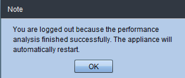
>  

1.  1.  ### Install a CA-Signed SSL Certificate for vSphere Data Protection in Region B

vSphere Data Protection comes with a default self-signed certificate. Install a CA-signed certificate that authenticates vSphere Data Protection over HTTPS.

1.  In a Web browser, open the vSphere Web Client. 

    1.  Log in to **https://mgmt01vc51.lax01.rainpole.local/vsphere-client.**

    2.  Use the **administrator@vsphere.local** user name and the ***vsphere\_admin\_password*** password.

2.  Navigate to the vSphere Data Protection virtual appliance **vdp-mgmt-51.lax01.rainpole.local**.

3.  Change the SSH configuration.   

    1.  Right-click **vdp-mgmt-51.lax01.rainpole.local** and select **Open Console** to open the remote console to the appliance.

    2.  Log in by using the **root** user name and ***vdp\_root\_password*** password.

    3.  Run the following console command to open the sshd\_config file for editing.

> vi /etc/ssh/sshd\_config

1.  Remove the \# comment from the beginning of the line \#PermitRootLogin yes.

>  

1.  Run the following command in the vi editor to save the file and exit the editor.

> :wq!

1.  In the console, restart the SSH service to update the running configuration.

> /etc/init.d/sshd restart
>
>  

1.  Log out and close the console to the appliance.

<!-- -->

1.  Open an SSH connection to the vSphere Data Protection appliance **vdp-mgmt-51.lax01.rainpole.local** with the root user name and ***vdp\_root\_password*** password.

2.  Stop the vSphere Data Protection Services by running the following command. 

> emwebapp.sh –stop
>
> 

1.  Delete the Tomcat alias from the certificate store.

> /usr/java/latest/bin/keytool -delete -alias tomcat
>
> When prompted for the keystore password use changeit**.**
>
> ** **

1.  Generate a certificate signing request (CSR) vdpcsr.csr by running the following two commands:

> /usr/java/latest/bin/keytool -genkeypair -v -alias tomcat -keyalg RSA -sigalg SHA256withRSA -keystore /root/.keystore -storepass changeit -keypass changeit -validity 3650 -dname "CN=vdp-mgmt-01.lax01.rainpole.local, OU=rainpole.local, O=Rainpole Inc., L=Palo Alto, S=CA, C=US" 
>
> /usr/java/latest/bin/keytool -certreq -keyalg RSA -alias tomcat -file vdpcsr.csr 
>
> When prompted for the keystore password use changeit.

1.  Submit the CSR to the Windows domain controller CA.

    1.  Run the following console command.

> cat vdpcsr.csr

1.  Copy the output from -----BEGIN CERTIFICATE REQUEST----- to -----END CERTIFICATE REQUEST----- inclusive.

> 

1.  In a Web browser, log into http://dc01rpl.rainpole.local/certsrv/certrqxt.asp with a domain administrator user name and *domain\_admin\_password* password.

2.  Paste the request in the **Saved Request** text box, select **VMware** from the **Certificate Template** drop-down menu, and click **Submit**.

> 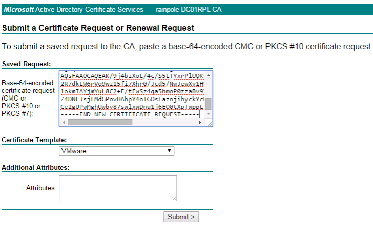 

1.  On the **Certificate Issued** page, select the **Base 64 encoded** radio box, click the **Download certificate chain** link and save the file as a vdp.p7b . 

> 
>
> If the save as dialog does not appear, the signed certificate is saved as certnew.p7b in your default downloads folder. Rename the file to vdp.p7b.

1.  Copy the vdp.p7b certificate file to the /root folder on the vSphere Data Protection virtual appliance.
    You can use scp, FileZilla or WinSCP.

2.  Import the certificate.

    1.  Run the following console command.

> /usr/java/latest/bin/keytool -import -alias tomcat -keystore /root/.keystore -file /root/vdp.p7b

1.  When prompted for the keystore password use** **changeit.

2.  When prompted to trust the certificate type **yes** and press **enter.**

> 

1.  Verify that the certificate is installed successfully. 

    1.  Run the following command.

> /usr/java/latest/bin/keytool -list -v -keystore /root/.keystore -storepass changeit -keypass changeit | grep tomcat

1.  Verify that the output contains Alias name: tomcat.

> 

1.  Run the addFingerprint.sh script.

> /usr/local/avamar/bin/addFingerprint.sh

This script does not return any output.

1.  Start the vSphere Data Protection services.

> emwebapp.sh --start 
>
> 

vRealize Operations Implementation in Region B
==============================================

For a dual-region monitoring implementation, after you deploy the analytics cluster and the remote collectors in Region A, complete the installation and configuration of vRealize Operations Manager for Region B.

Perform the following operations in Region B:

-   Deploy remote collector nodes in Region B to collect monitoring data from management applications in Region B.

-   Enable monitoring from vRealize Operations Manager of the management applications that are deployed in Region B:

<!-- -->

-   Management vCenter Server and Compute vCenter Server

-   NSX Manager instances for the management cluster and for the compute and edge clusters.

-   Storage topology and storage capacity

<!-- -->

-   Deploy vRealize Operations Manager in Region B

-   Configure Load Balancer for vRealize Operations Manager in Region B

-   Connect vRealize Operations Manager to the vSphere Environment in Region B

-   Connect vRealize Operations Manager to the NSX Managers in Region B

-   Add Storage Devices Adapters for Region B in vRealize Operations Manager

-   Extend User Access in vRealize Operations Manager in Region B

    1.  Deploy vRealize Operations Manager in Region B
        ----------------------------------------------

In Region B, deploy 2 remote collector nodes for vRealize Operations Manager to monitor the Compute vCenter Server and Management vCenter Server, NSX for vSphere and storage components.

Deploying a separate group of remote collectors in Region B makes the data collection in each region independent from the location of the analytics cluster. If you fail over the analytics cluster, data collection continues for those nodes that are accessible in the active region.

-   Prerequisites for Deploying the Remote Collectors in Region B

-   Deploy the Remote Collector Virtual Appliances in Region B

-   Connect the Remote Collector Node in Region B to the Analytics Cluster

-   Configure a DRS Anti-Affinity Rule for vRealize Operations Manager in Region B

-   Group Remote Collectors in Region B

    1.  ### Prerequisites for Deploying the Remote Collectors in Region B

Before you deploy the remote collector nodes of vRealize Operations Manager in Region B, verify that your environment satisfies the requirements for this deployment.

IP Addresses and Host Names

Verify that static IP addresses and FQDNs for the vRealize Operations Manager application virtual network are available for Region B of the SDDC deployment. Allocate static IP addresses and host names for the 2 remote collector nodes.

| Role               | IP Address               | FQDN                                 |
|--------------------|--------------------------|--------------------------------------|
| Remote collector 1 | 192.168.23.25            | vrops-rmtcol-51.lax01.rainpole.local |
| Remote collector 2 | 192.168.23.26            | vrops-rmtcol-52.lax01.rainpole.local |
| Default gateway    | 192.168.23.1             | -                                    |
| DNS server         | 172.17.11.5, 172.16.11.5 | -                                    |
| Subnet mask        | 255.255.255.0            | -                                    |
| NTP servers        | 172.17.11.251            

                      172.17.11.252             |  0.ntp.lax01.rainpole.local          

                                                  1.ntp.lax01.rainpole.local           |

Deployment Prerequisites

| Prerequisite             | Value                                                                                                                                         |
|--------------------------|-----------------------------------------------------------------------------------------------------------------------------------------------|
| **Storage**              | -   Virtual disk provisioning.                                                                                                                

                            <!-- -->                                                                                                                                       

                            -   Thin                                                                                                                                       

                            <!-- -->                                                                                                                                       

                            -   Required storage per node                                                                                                                  

                            <!-- -->                                                                                                                                       

                            -   1.3 GB                                                                                                                                     

                            -   Storage for monitoring data for analytics cluster nodes: 1 TB                                                                              |
| **Software Features**    | -   vSphere                                                                                                                                   

                            <!-- -->                                                                                                                                       

                            -   Management vCenter Server                                                                                                                  

                            -   Client Integration Plugin on the machine where you use the vSphere Web Client                                                              

                            -   Management cluster with enabled DRS and HA                                                                                                 

                            <!-- -->                                                                                                                                       

                            -   NSX for vSphere                                                                                                                            

                            <!-- -->                                                                                                                                       

                            -   Application virtual network for the 4-node analytics cluster for failover of the analytics cluster by using vCenter Site Recovery Manager  

                            -   Application virtual network for the 2-node remote collector cluster                                                                        

                            <!-- -->                                                                                                                                       

                            -   vRealize Operations Manager                                                                                                                

                            <!-- -->                                                                                                                                       

                            -   4-node analytics cluster and 2-node remote collector cluster in Region A                                                                   

                            -   2-node remote collector cluster in Region B                                                                                                |
| **Installation Package** | Download the .ova file of the vRealize Operations Manager virtual appliance on the machine where you use the vSphere Web Client.              |

### Deploy the Remote Collector Virtual Appliances in Region B

After you deploy and configure the analytics and remote collector cluster nodes in Region A, use the vSphere Web Client to deploy the two virtual appliances for the remote collectors in Region B. You use the two remote collectors to forward data from the vCenter Server instances in Region B to the analytics cluster of vRealize Operations Manager.

Procedure

1.  Log in to the Management vCenter Server by using the vSphere Web Client.

    1.  Go to **https://mgmt01vc51.lax01.rainpole.local/vsphere-client**.

    2.  Use the **administrator@vsphere.local** user name and **vsphere\_admin\_password** password.

2.  Navigate to the **mgmt01vc51.lax01.rainpole.local** vCenter Server object. 

3.  Right-click the **mgmt01vc51.lax01.rainpole.local** object and select **Deploy OVF Template**.

4.  On the **Select source** page, select **Local file**, browse to the location of the vRealize Operations Manager OVA file on your file system, and click **Next**.

> <embed src="media/image303.png" width="400" height="234" />

1.  On the **Review details** page, examine the virtual appliance details, such as product, version, download and disk size, and click **Next**.

> <embed src="media/image304.png" width="408" height="236" />
>  

1.  On the **Accept License Agreements** page, accept the end user license agreements and click **Next**.

2.  On the **Select name and folder** page, enter a node name, select the inventory folder for the virtual appliance, and click **Next**.

| Attribute          | Value                                  |
|--------------------|----------------------------------------|
| **Name**           | vrops-rmtcol-51 for remote collector 1
                      vrops-rmtcol-52 for remote collector 2  |
| **vCenter Server** | mgmt01vc51.lax01.rainpole.local        |
| **Data center**    | LAX01                                  |
| **Folder**         | vROps01RC                              |

> 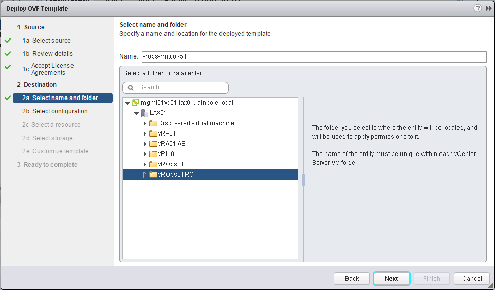

1.  On the **Select configuration** page, from the **Configuration** drop-down menu, select **Remote Collector (Standard)**, and click **Next**.

> 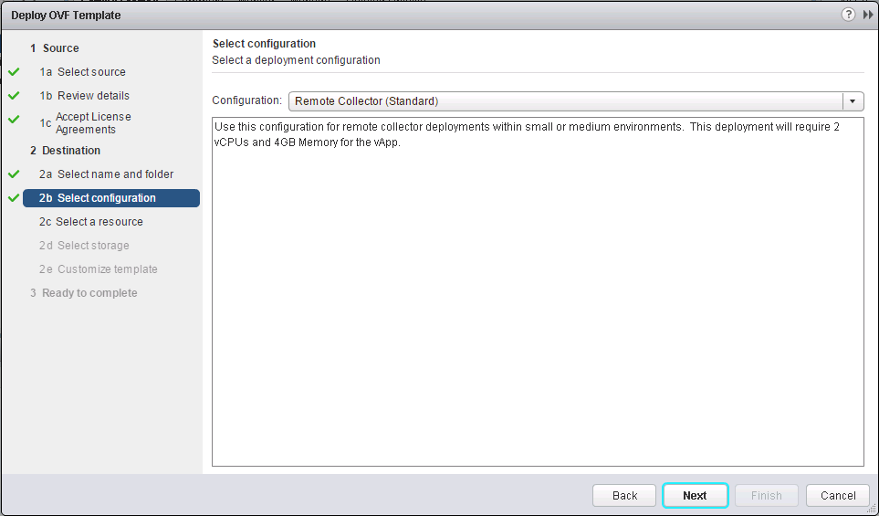

1.  On the **Select a resource** page, select the **LAX01-Mgmt01** management cluster as the resource to run the virtual appliance, and click **Next**.

> 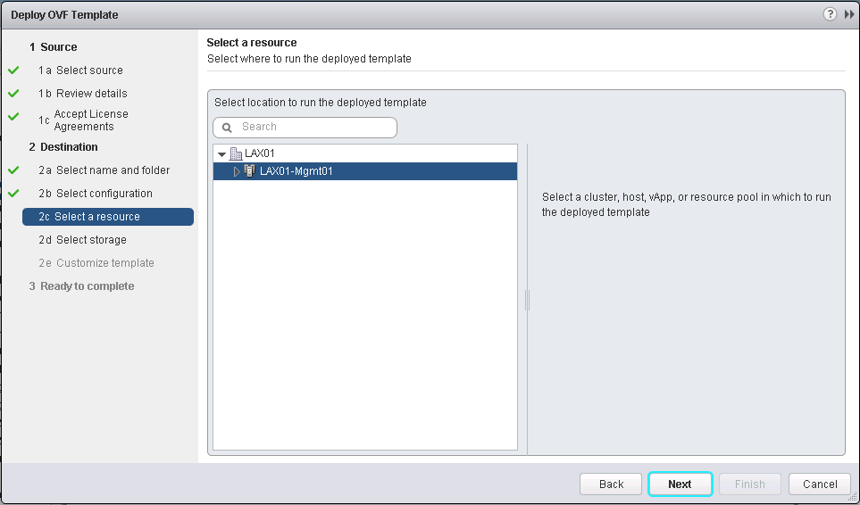

1.  On the **Select storage** page, for storage, select the **Virtual SAN datastore**, and click **Next**. By default, the virtual appliance disk is thin provisioned. 

    1.  From the **VM Storage Policy **drop-down menu, select **Virtual SAN Default Storage Policy**.

    2.  From the datastore table, select the **LAX01A-VSAN01-MGMT01** Virtual SAN datastore.

    3.  Click **Next**.

> 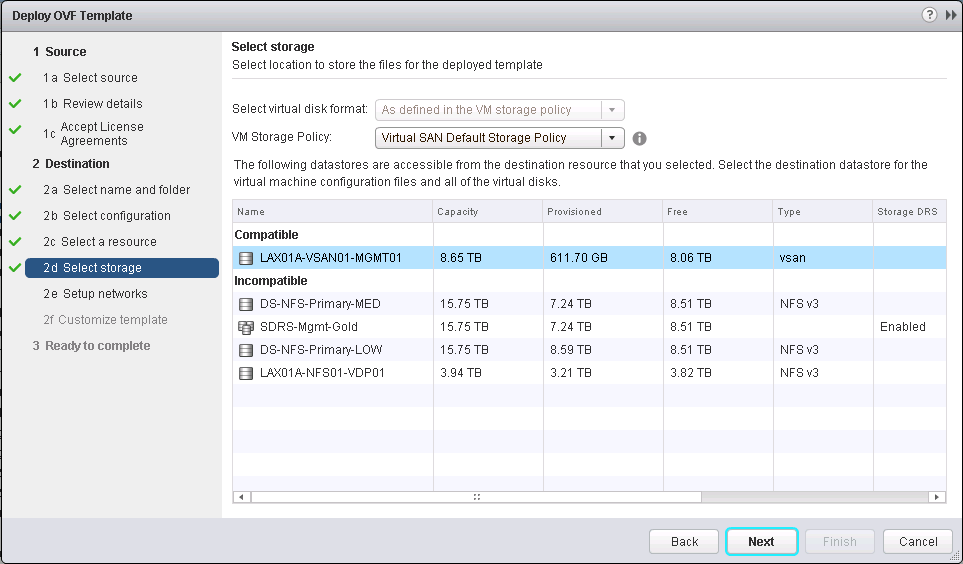

1.  On the **Setup networks** page, select the distributed port group on the **vDS**-**Mgmt** distributed switch that ends with vROps01RC-VXLAN, and click **Next**.

> NSX for vSphere creates the distributed port group for the logical switch that connects the remote collector nodes. The name of the port group indicates the segment ID and the logical switch name vROps01RC-VXLAN.

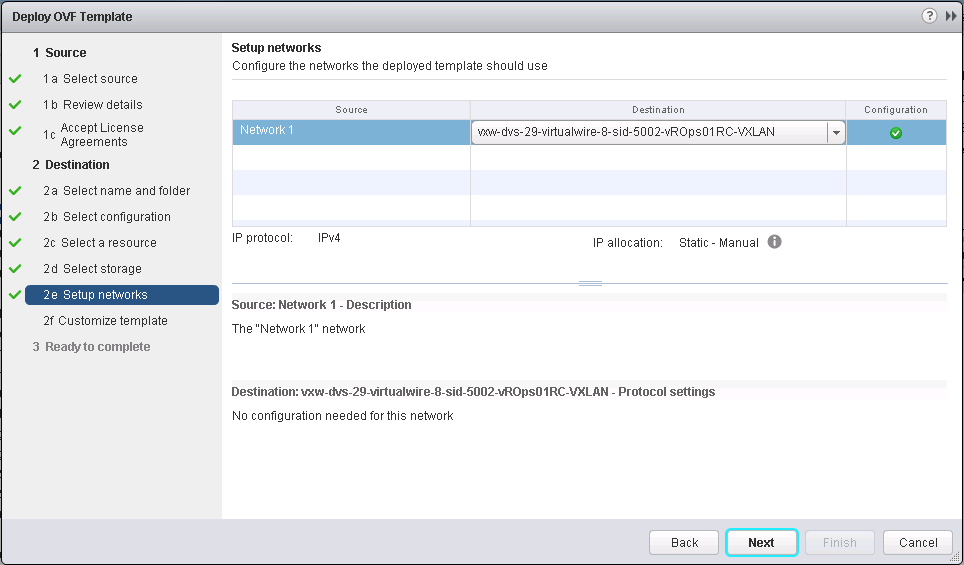

1.  On the **Customize template** page, select the time zone and set the IPv4 settings for the virtual appliance.

    1.  From the **Timezone** setting drop-down menu, select the **Etc/UTC** time zone.

    2.  In the **Networking Properties** section, configure the following **IPv4 settings**:

| IPv4 Setting            | Value                                |
|-------------------------|--------------------------------------|
| **Default gateway**     | 192.168.23.1                         |
| **DNS server**          | 172.17.11.5                          |
| **Static IPv4 address** | 192.168.23.25 for remote collector 1
                           192.168.23.26 for remote collector 2  |
| **Subnet mask**         | 255.255.255.0                        |

> 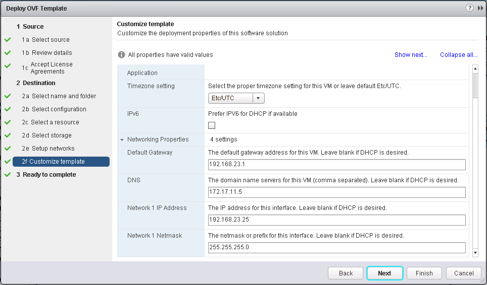

1.  On the **Ready to complete** page, verify that the settings for deployment are correct and the **Power on after deployment** check box is selected, and click Finish.

> 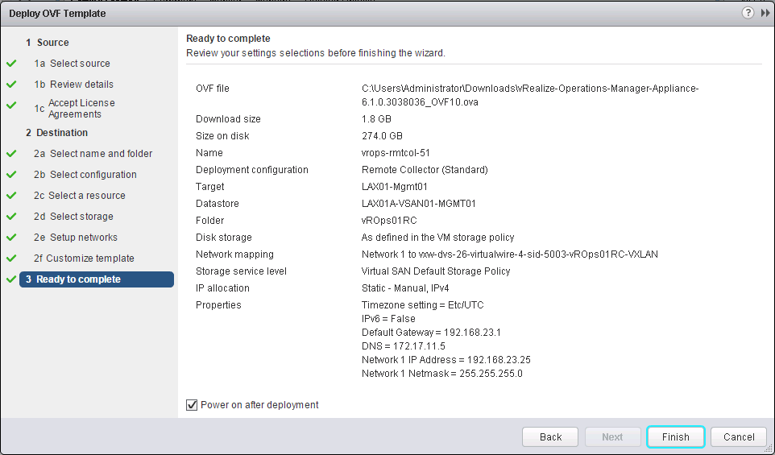

1.  Repeat the steps to deploy the second remote collector appliance.

    1.  ### Connect the Remote Collector Node in Region B to the Analytics Cluster

After you deploy the virtual appliances for the remote collector nodes on the Management vCenter Server in Region B, configure the settings of the remote collectors and connect them to the analytics cluster.

Procedure

1.  In a Web browser, go to the initial setup UI of each remote collector node virtual appliance.

| Remote Collector Node  | URL                                          |
|------------------------|----------------------------------------------|
| **Remote collector 1** | https://vrops-rmtcol-51.lax01.rainpole.local |
| **Remote collector 2** | https://vrops-rmtcol-52.lax01.rainpole.local |

1.  In the initial setup page, click **Expand an Existing Installation** and click **Next**.

> <embed src="media/image312.png" width="327" height="217" /> 

1.  On the **Note Settings and Cluster Info** page, configure the settings of the node in the analytics cluster. 

    1.  In the **Node Name** text box, еnter the name for the remote collector node.

| Remote Collector Node  | Node Name       |
|------------------------|-----------------|
| **Remote collector 1** | vrops-rmtcol-51 |
| **Remote collector 2** | vrops-rmtcol-52 |

1.  From the **Node Type** drop-down menu, select **Remote Collector**.

2.  Enter the master node FQDN **vrops-mstrn-01.rainpole.local** and click **Validate**.

> The certificate of the master node appears underneath.

1.  Validate that the master certificate is correct, and click **Accept this certificate**.

> The certificate on the remote collector node is replaced with the CA-aware certificate chain of the analytics cluster. 

1.  Click **Next**.

> 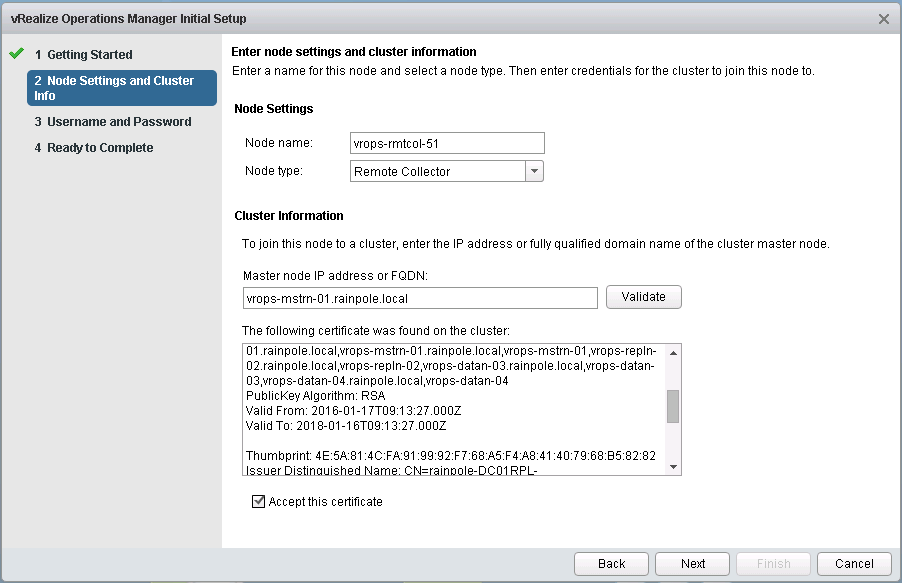

1.  On the **Username and password** page, select **Use cluster administrator user name and password**, enter the password for the cluster admin user, and click **Next**.

> 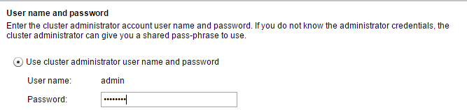 
>  

1.  Click **Finish**. 

> The cluster administration UI of vRealize Operations Manager appears. The cluster admin interface displays that the configuration of the node is in progress.
>
> 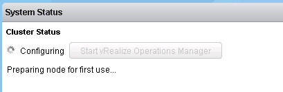

1.  After the operation is complete, in the administration UI of vRealize Operations Manager, click **Finish Adding New Nodes** next to **Cluster Status**.

> 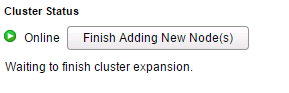

1.  In the **Finish Adding New Node(s)** dialog box, confirm adding the nodes

> 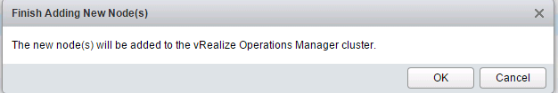 

1.  Repeat the steps to configure the second remote collector node. 

> After the configuration of the remote collectors in Region B is complete, the cluster on the **System Status** page of the administration UI consists of vrops-mstrn-01, vrops-repln-02, vrops-datan-03, vrops-datan-04, two remote collectors for Region A vrops-rmtcol-01 and vrops-rmtcol-02, and two remote collectors for Region B vrops-rmtcol-51 and vrops-rmtcol-52.
>
> 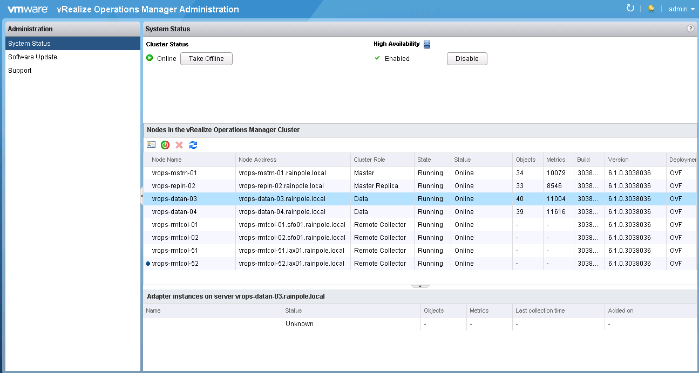

### Configure a DRS Anti-Affinity Rule for vRealize Operations Manager in Region B

To protect the vRealize Operations Manager virtual machines from a host-level failure, configure vSphere DRS to run the virtual machines for the remote collectors on different hosts in the management cluster in Region B.

Procedure

1.  In a Web browser, open the vSphere Web Client.

    1.  Log in to **https://mgmt01vc51.lax01.rainpole.local/vsphere-client**.

    2.  Use the **administrator@vsphere.local** user name and the **vsphere\_admin\_password** password.

2.  Navigate to the **mgmt01vc51.lax01.rainpole.local** vCenter Server object, and under the **LAX01** data center object select the **LAX01-Mgmt01** cluster.

3.  On the **Manage** tab, click the **Settings** tab.

4.  Under the **Configuration** group of settings, select **VM/Host Rules**.  

5.  In the **VM/Host Rules** list, click the **Add** button above the rules list and add a new anti-affinity rule called **vropscollectors-antiaffinity-rule** for the two remote collector virtual machines of vRealize Operations Manager, and click **OK**.

| Rule Attribute  | Value                             |
|-----------------|-----------------------------------|
| **Name**        | vropscollectors-antiaffinity-rule |
| **Enable rule** | Yes                               |
| **Type**        | Separate Virtual Machines         |
| **Members**     | vrops-rmtcol-51                   
                   vrops-rmtcol-52                    |

### Group Remote Collectors in Region B

After you configure the remote collector nodes for vRealize Operations Manager in Region B, join the remote collectors in a group for adapter resiliency in the cases where the collector experiences network interruption or becomes unavailable. 

Procedure

1.  In a Web browser, log in to vRealize Operations Manager.

    1.  Go to **https://vrops-mstrn-01.rainpole.local**.

    2.  Use the **admin** user name and the **vrops\_admin\_password** password to log in.

2.  From the **Home** page, click **Administration**, and click **Collector Groups**.

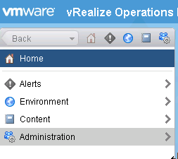 <embed src="media/image320.png" width="201" height="377" /> **
** 

1.  Click the **Add** icon.

> 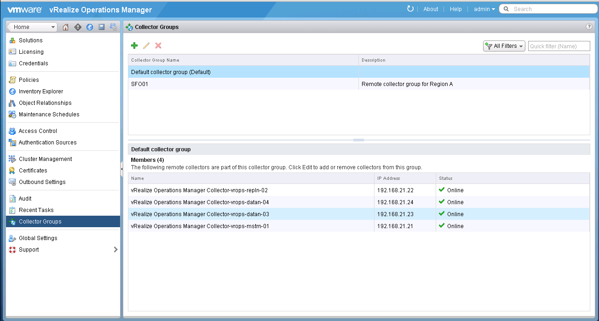

1.  In the **Add New Collector Group** dialog, for group name enter **LAX01** and for description **Remote collector group for Region B**.

2.  Select the **vrops-rmtcol-51** and **vrops-rmtcol-52** collectors, and click **Save**.

> 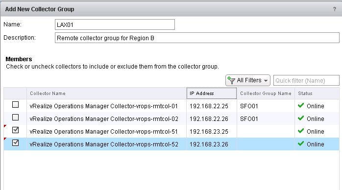
>
> The LAX01 group appears on the Collector Groups page.
>
> 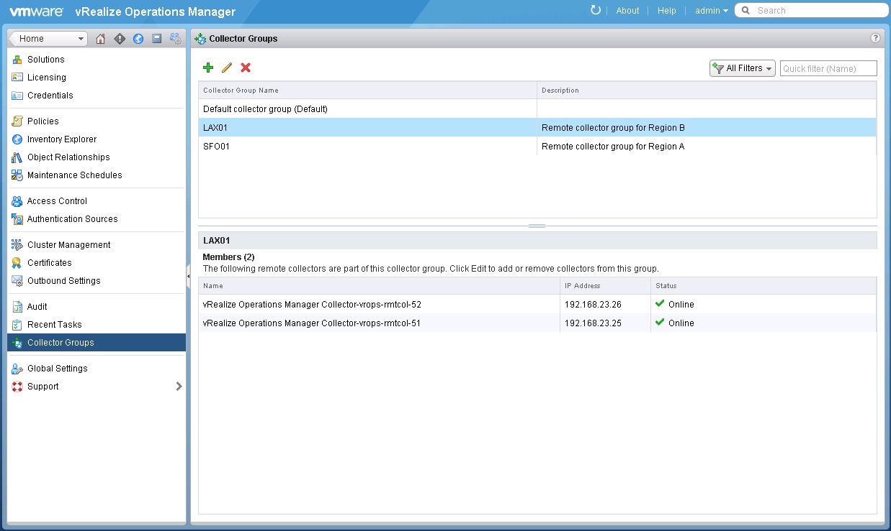

Configure Load Balancer for vRealize Operations Manager in Region B
-------------------------------------------------------------------

Configure load balancing for the analytics cluster on the dedicated NSX Edge service gateway for Region B. Load balancing must be available if a failover of the analytics cluster occurs.

The remote collector cluster for Region B does not require load balancing.

Prerequisites

-   Verify that the NSX Manager for the management cluster in Region B has the management application virtual network for the analytics cluster configured. 

Procedure

1.  In a Web browser, log in to the Management vCenter Server by using the vSphere Web Client.

    1.  Go to https://mgmt01vc51.lax01.rainpole.local/vsphere-client.

    2.  Use the **administrator@vsphere.local** user name and the **vsphere\_admin\_password** password to log in.

2.  From the **Home** menu, select **Networking & Security**.  The vSphere Web Client displays the NSX Home page.

3.  On the **NSX Home** page, click **NSX Edges** and select **172.17.11.65** from the **NSX Manager** drop-down menu at the top of the **NSX Edges** page.

4.  On the **NSX Edges** page, double-click the **vROps01-Edge** NSX edge.

> 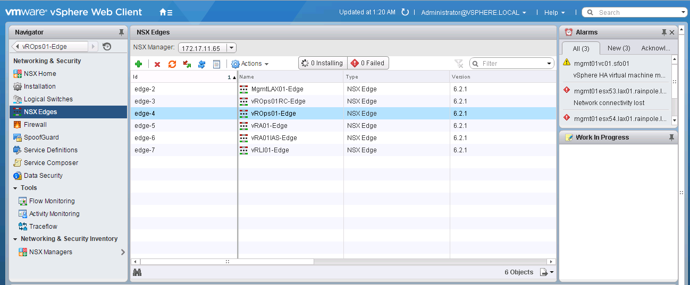

1.  On the **Manage** tab for the edge, click the **Settings** tab and click Interfaces.

2.  Select the interface **Public** and click the **Edit** icon.

3.  In the **Edit NSX Edge Interface** dialog box, click the **Edit** icon and in the **Secondary IP Addresses** text box enter the **10.158.150.48** VIP address.

> You use the VIP address for vRealize Operations Manager load balancing.
>
> 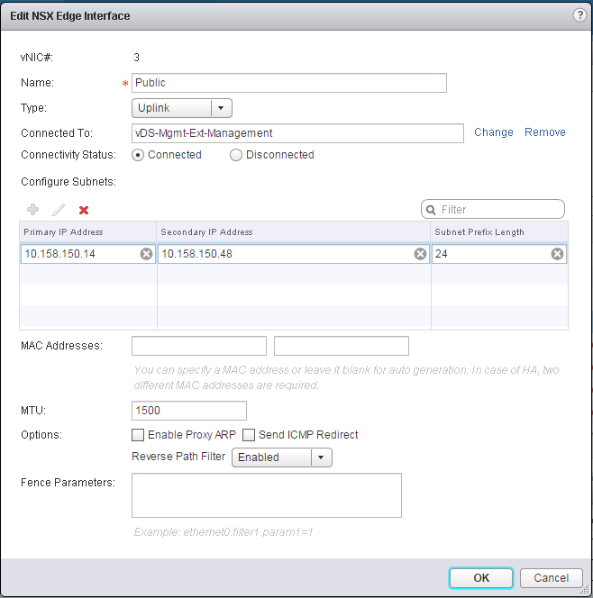

1.  Click on **OK** to save the configuration. 

2.  Enable load balancing on the edge.

    1.  On the **Manage** tab for the **vRops01-Edge** device, click the **Load Balancer** tab.

    2.  Under **Global Configuration**, click **Edit**.

> 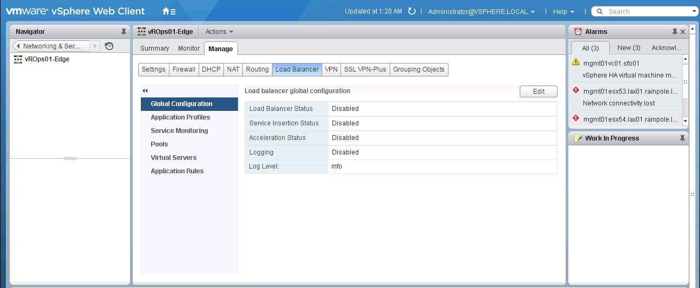

1.  In the **Edit Load balancer global configuration** dialog box, enable the load balancer and click **OK**.

<!-- -->

1.  Do not enable acceleration.

| Option                       | Value        |
|------------------------------|--------------|
| **Enable Load Balancer**     | Selected     |
| **Logging **                 | Selected     |
| **Log Level**                | Info         |
| **Enable Service Insertion** | Not selected |

> <embed src="media/image327.png" width="377" height="377" />

1.  Create an application profile.

    1.  On the **Manage** tab for the **vRops01-Edge** device, click the **Load Balancer** tab,

    2.  Click **Application profiles**, and click the **Add** icon.

    3.  In the **New Profile** dialog box, configure the profile for **HTTPS** traffic, and click **OK**.

| Option                     | Value        |
|----------------------------|--------------|
| **Name**                   | VROPS\_HTTPS |
| **Type**                   | HTTPS        |
| **Enable SSL Passthrough** | Selected     |
| **Persistence**            | Source IP    |
| **Expires in (Seconds)**   | 1800         |
| **Client Authentication**  | Ignore       |

> <embed src="media/image328.png" width="256" height="377" />

1.  Create a service monitoring entry.

    1.  On the **Load Balancer** tab for the of the **vROps01-Edge** device, click **Service Monitoring** and click the **Add** icon.

    2.  In the **New Service Monitoring** dialog box, configure the health check parameters for **HTTPS** traffic, and click **OK**.

| Option       | Value                     |
|--------------|---------------------------|
| **Name**     | VROPS\_MONITOR            |
| **Interval** | 3                         |
| **Timeout**  | 5                         |
| **Retries**  | 2                         |
| **Type**     | HTTPS                     |
| **Method**   | GET                       |
| **URL**      | /ui/heartbeat.action      |
| **Receive**  | ok (*must be lower case*) |

> <embed src="media/image329.png" width="250" height="377" /> 
>  

1.  Add a server pool. 

    1.  On the **Load Balancer** tab of the **vROps01-Edge** device, select **Pools**, and click the **Add** icon. 

    2.  In the **New Pool** dialog box, configure the load balancing profile.

| Option        | Value          |
|---------------|----------------|
| **Name**      | VROPS\_POOL    |
| **Algorithm** | LEASTCONN      |
| **Monitors**  | VROPS\_MONITOR |

> <embed src="media/image330.png" width="537" height="212" />

1.  In the Members section, add one member for each node of the analytics cluster and click OK.

| Option              | Value                            |
|---------------------|----------------------------------|
| **Enable Member**   | Selected.                        |
| **Name**            | vrops-mstrn-01                   
                       vrops-repln-02                    
                       vrops-datan-03                    
                       vrops-datan-04                    |
| **IP Address**      | 192.168.21.21 for vrops-mstrn-01
                       192.168.21.22 for vrops-repln-02  
                       192.168.21.23 for vrops-datan-03  
                       192.168.21.24 for vrops-datan-04  |
| **Port**            | 443                              |
| **Monitor Port**    | 443                              |
| **Weight**          | 1                                |
| **Max Connections** | 8                                |
| **Min Connections** | 8                                |

> <embed src="media/image331.png" width="341" height="302" />
>
> After you add the analytics cluster nodes to the pool, you see them in the Members table.
>
> <embed src="media/image332.png" width="624" height="175" />

1.  In the **New Pool** dialog box, click **OK**.

<!-- -->

1.  Add a virtual server.

    1.  On the **Load Balancer** tab of the **vROps01-Edge** device, select **Virtual Servers** and click the **Add** icon.

    2.  In the **New Virtual Server** dialog box, configure the settings of the virtual server for the analytics cluster and click **OK**.

| Option                    | Value                                                                                                                |
|---------------------------|----------------------------------------------------------------------------------------------------------------------|
| **Enable Virtual Server** | Selected.                                                                                                            |
| **Application Profile**   | VROPS\_HTTPS                                                                                                         |
| **Name**                  | VROPS\_VIRTUAL\_SERVER                                                                                               |
| **IP Address**            | 10.158.150.48                                                                                                        
                             Click Select IP Address, select Public from the drop-down menu and then select 10.158.150.48 IP for the virtual NIC.  |
| **Protocol**              | HTTPS                                                                                                                |
| **Port**                  | 443                                                                                                                  |
| **Default Pool**          | VROPS\_POOL                                                                                                          |

> You can connect to the analytics cluster at the public Virtual Server IP address over HTTPS: https://vrops-cluster-01.rainpole.local.
>
> 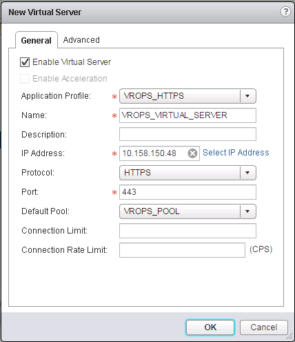

1.  Configure auto redirect from HTTP to HTTPS requests. The NSX Edge can redirect clients from HTTP to HTTPS without entering another URL in the browser.

    1.  On the **Load Balancer** tab of the **vROps01-Edge** device, select **Application Profiles** and click the **Add** icon.

    2.  In the **Add Application Rule** dialog box, configure the application profile settings and click **OK**.

| Option                   | Value                                 |
|--------------------------|---------------------------------------|
| **Name**                 | VROPS\_REDIRECT                       |
| **Type**                 | HTTP                                  |
| **HTTP Redirect URL**    | https://10.158.150.48/ui/login.action |
| **Persistence**          | Source IP                             |
| **Expires in (Seconds)** | 1800                                  |

> 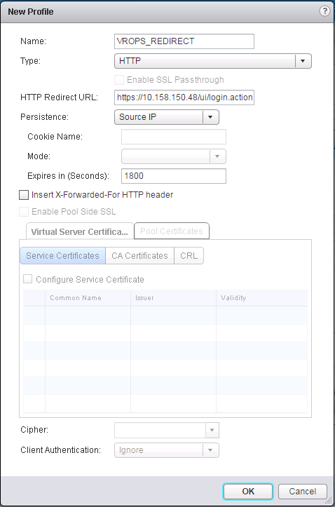

1.  On the **Load Balancer** tab of the **vROps01-Edge** device, select **Virtual Servers** and click **Add**.

2.  Configure the settings of the virtual server for **HTTP** redirects.

| Option                    | Name            |
|---------------------------|-----------------|
| **Enable Virtual Server** | Selected        |
| **Application Profile**   | VROPS\_REDIRECT |
| **Name**                  | VROPS\_REDIRECT |
| **IP Address**            | 10.158.150.48   |
| **Protocol**              | HTTP            |
| **Port**                  | 80              |
| Default Pool              | NONE            |

You can connect to the analytics cluster at the public Virtual Server IP address over HTTP at the http://vrops-cluster-01.rainpole.local address if the analytics cluster is failed over to Region B.

> 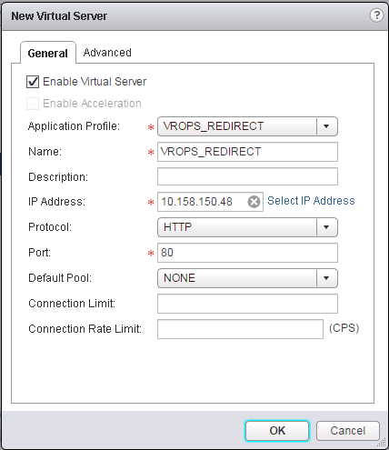

 

Connect vRealize Operations Manager to the vSphere Environment in Region B
--------------------------------------------------------------------------

After you set up the vRealize Operations Manager remote collectors in Region B and the network access for the analytics cluster in the case of failover, connect it to the Management vCenter Server and the Compute vCenter Server to start collecting monitoring data from the vCenter Server instances and the ESXi hosts in Region B.

-   Configure User Privileges in vSphere for Integration with vRealize Operations Manager for Region B

-   Add vCenter Adapter Instances for Region B in vRealize Operations Manager

    1.  ### Configure User Privileges in vSphere for Integration with vRealize Operations Manager for Region B

Assign the permissions to the svc-vrops user for access from vRealize Operations Manager to the Management vCenter Server and Compute vCenter Server in Region B.

Prerequisites

-   Verify that the Management vCenter Server and Compute vCenter Server for Region B are connected to the Active Directory domain.

-   Verify that the users and groups from the rainpole.local domain are available in the Management vCenter Server and in the Compute vCenter Server for Region B.

Procedure

1.  In a Web browser, log in to vCenter Server by using the vSphere Web Client.

    1.  Go to the following URL.

| vCenter Server                | URL                                                     |
|-------------------------------|---------------------------------------------------------|
| **Management vCenter Server** | https://mgmt01vc51.lax01.rainpole.local/vsphere-client/ |
| **Compute vCenter Server**    | https://comp01vc51.lax01.rainpole.local/vsphere-client/ |

1.  Use the **administrator@vsphere.local** user name and the **vsphere\_admin\_password** password to log in.

<!-- -->

1.  In the vSphere Web Client, navigate to the vCenter Server object in Region B.

| vCenter Server                | Object                          |
|-------------------------------|---------------------------------|
| **Management vCenter Server** | mgmt01vc51.lax01.rainpole.local |
| **Compute vCenter Server**    | comp01vc51.lax01.rainpole.local |

1.  Right-click the vCenter Server object and click **Add Permission**.

> 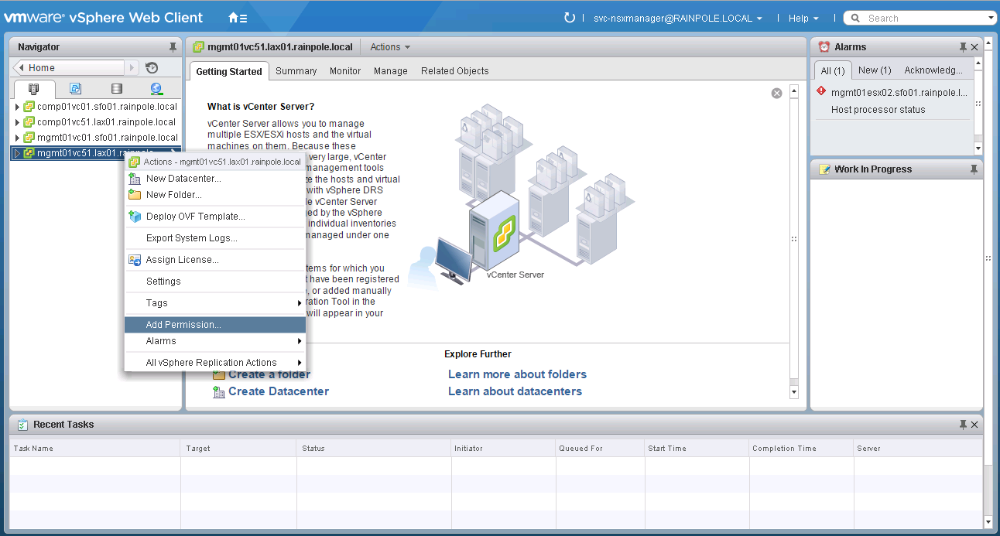

1.   In the **Add Permission** dialog box, click the **Add** button to add permissions to a user or a group.

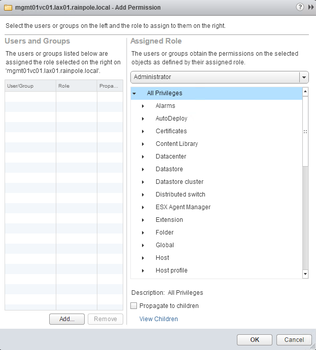 

 

1.  In the **Select Users/Groups** dialog box, from the **Domain** drop-down menu, select **RAINPOLE** and in the filter box type svc. 

2.  From the list of **users and groups**, select **svc-vrops**, click the **Add** button, and click **OK**.

> 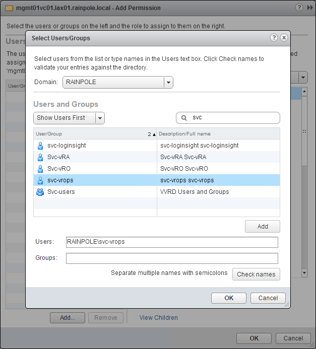

1.  In **Add Permission** dialog box, from the **Assigned Role** drop-down menu, select **Read**-**only**, and click **OK**.

> 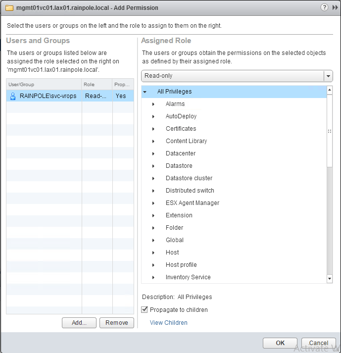 

1.  Repeat the steps for the other vCenter Server instance in Region B. The svc-vrops user has read-only access to all objects in vCenter Server.

    1.  ### Add vCenter Adapter Instances for Region B in vRealize Operations Manager

After you deploy the remote collector nodes of vRealize Operations Manager in Region B, add vCenter Adapter instances for the Management and Compute vCenter Server instances in Region B.

Prerequisites

-   Verify that the Management vCenter Server and Compute vCenter Server are running.

-   Verify that the Management vCenter Server and Compute vCenter Server are configured with the rainpole.local Active Directory domain.

-   Create a custom read-only role for user svc-vrops. 

Procedure

1.  In a Web browser, log in to the user interface of vRealize Operations Manager.

    1.  If you use the public interface to the SDDC, go to **https://vrops-cluster-01.rainpole.local**

    2.  If you have access to the vSphere management network, go to **https://vrops-mstrn-01.rainpole.local**

2.  Use the **admin** user name and the **vrops\_admin\_password** password to log in.

3.  In the left pane of vRealize Operations Manager, click **Administration**, and click **Solutions**.

4.  From the solution table on the **Solutions** page, select the **VMware vSphere solution**, and click **Configure**. The Manage Solution - VMware vSphere wizard appears.

> 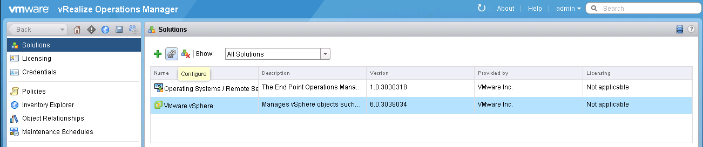

1.  On the **Configure adapters** page, from the **Adapter Type** table at the top, select **vCenter Adapter**.
    The **Instance Name** list contains the vCenter Adapter Instances for the vCenter Server adapter for Region A.

2.  Under **Instance Settings**, enter the settings for connection to vCenter Server.

    1.  If you already have added another vCenter Adapter, click the **Add** icon to add an adapter setting.

    2.  Enter the name, description and FQDN of vCenter Server.

| Management vCenter Server Attribute | Value                                  |
|-------------------------------------|----------------------------------------|
| **Name**                            | mgmt01vc51-lax01                       |
| **Description**                     | Management vCenter Server for Region B |
| **vCenter Server**                  | mgmt01vc51.lax01.rainpole.local        |

| Compute vCenter Server Attribute | Value                               |
|----------------------------------|-------------------------------------|
| **Name**                         | comp01vc51-lax01                    |
| **Description**                  | Compute vCenter Server for Region B |
| **vCenter Server**               | comp01vc51.lax01.rainpole.local     |

> 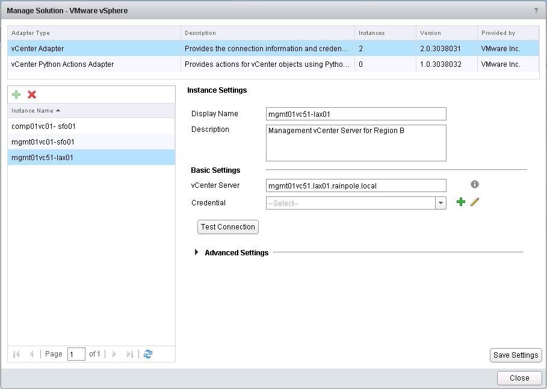

1.  Click the **Add** icon, and configure the credentials for connection to vCenter Server

| Management vCenter Server Credentials Attribute | Value                        |
|-------------------------------------------------|------------------------------|
| **Credential name**                             | mgmt01vc51-lax01-credentials |
| **User Name**                                   | svc-vrops@rainpole.local     |
| **Password**                                    | *svc-vrops-password*         |

| Compute vCenter Server Credentials Attribute | Value                        |
|----------------------------------------------|------------------------------|
| **Credential name**                          | comp01vc51-lax01-credentials |
| **User Name**                                | svc-vrops@rainpole.local     |
| **Password**                                 | *svc-vrops-password*         |

> 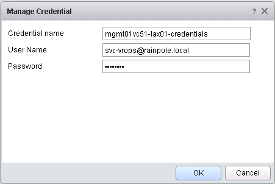

1.  Click **Test Connection** to validate the connection to vCenter Server.
    The vCenter Server certificate appears.

2.  In the **Review and Accept Certificate** dialog box, verify the certificate information and click **OK**.

> 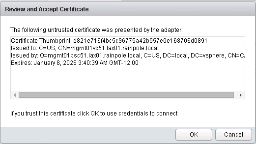
>  

1.  Click **OK** in the test connection Info dialog box.

2.  Expand the **Advanced Settings** group of settings.

3.  From the Collectors/Groups drop-down menu, select the **LAX01** group.

> 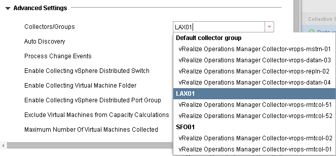

1.  Click **Save Settings**.

2.  Repeat the steps for the other vCenter Server instance.

On the Solutions page, when you select VMware vSphere from the solution table, the Collection State of the vCenter Adapters is Collecting and the Collection Status is Data receiving.

vRealize Operations Manager applies the monitoring policy that has been configured when the first vCenter Server connection setup in Region A. 

Connect vRealize Operations Manager to the NSX Managers in Region B
-------------------------------------------------------------------

Configure the vRealize Operations Management Pack for NSX for vSphere to monitor the NSX networking services deployed in each vSphere cluster in Region B and view the vSphere hosts in the NSX transport zones. You can also access end to end logical network topologies between any two virtual machines or NSX objects for better visibility into logical connectivity. Physical host and network device relationship in this view also helps in isolating problems in the logical or physical network.

-   Configure NSX-vSphere Adapters for Region B in vRealize Operations Manager

-   Configure a Physical Discovery Adapter for Region B in vRealize Operations Manager

    1.  ### Configure NSX-vSphere Adapters for Region B in vRealize Operations Manager

Configure NSX-vSphere Adapters for Region B: one for the NSX Manager for the management cluster and one for the NSX Manager for the compute and edge clusters. 

Procedure

1.  In a Web browser, open the main page of vRealize Operations Manager.

-   If you use the public interface to the SDDC, go to **https://vrops-cluster-01.rainpole.local**

-   If you can connect to the vSphere management network, go to **https://vrops-mstrn-01.rainpole.local**

1.  Use the **admin** user name and the ***vrops\_admin\_password*** password to log in.

2.  In the left pane of vRealize Operations Manager, click **Administration**, and click **Solutions**.

3.  From the solution table on the **Solutions** page, select the **Management Pack for NSX-vSphere solution**, and click **Configure**.

> 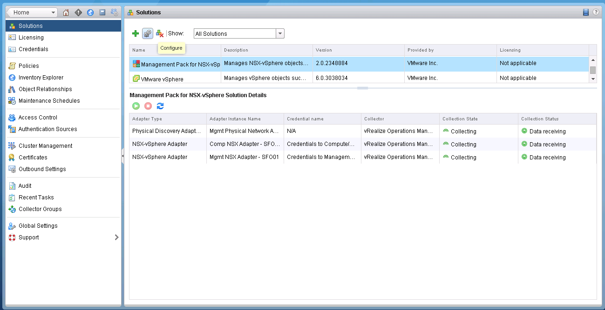

1.  On the **Configure adapters** page of the **Manage Solution - Management Pack for NSX-vSphere** wizard, from the **Adapter Type** table at the top, select **NSX-vSphere Adapter**. Empty settings for the NSX-vSphere Adapter appear under Instance Settings if vRealize Operations Manager does not have NSX-vSphere Adapters configured. 

2.  Under **Instance Settings**, enter the settings for connection to the NSX Manager for the management cluster or to the NSX Manager for the compute and edge clusters.

    1.  If you already have added another NSX-vSphere Adapter, click the **Add** icon to add an adapter setting.

    2.  Enter the name, the description, the FQDN of the NSX Manager and the FQDN of the vCenter Server instance that is connected to the NSX Manager.

> 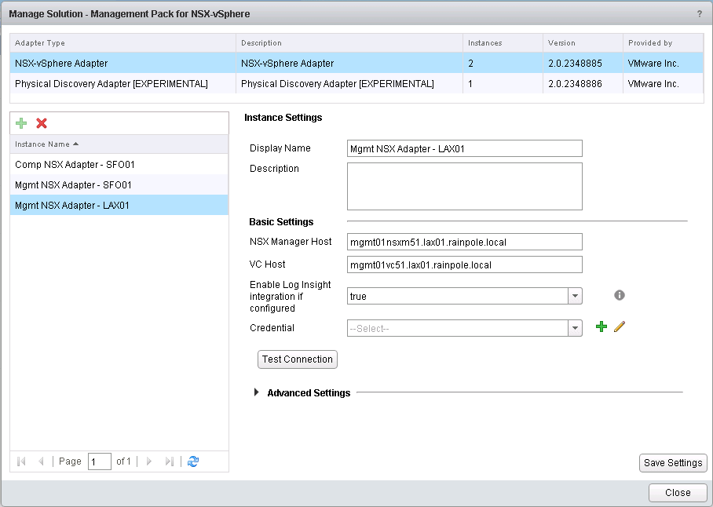

| Management NSX for vSphere Attribute             | Value                                                 |
|--------------------------------------------------|-------------------------------------------------------|
| **Name**                                         | Mgmt NSX Adapter - LAX01                              |
| **Description**                                  | -                                                     |
| **NSX Manager Host**                             | mgmt01nsxm51.lax01.rainpole.local                     |
| **VC Host**                                      | mgmt01vc51.lax01.rainpole.local                       |
| **Enable Log Insight integration if configured** | true                                                  

                                                    You enable automatic log forwarding to                 
                                                    Log Insight for log data related to NSX for vSphere.   |

| Compute/Edge NSX for vSphere Attribute           | Value                                                |
|--------------------------------------------------|------------------------------------------------------|
| **Name**                                         | Comp NSX Adapter - LAX01                             |
| **Description**                                  | -                                                    |
| **NSX Manager Host**                             | comp01nsxm51.lax01.rainpole.local                    |
| **VC Host**                                      | comp01vc51.lax01.rainpole.local                      |
| **Enable Log Insight integration if configured** | true                                                 

                                                    You enable automatic log forwarding to                
                                                    Log Insight for log data related to NSX for vSphere.  |

1.  Click the **Add** icon, and configure the credentials for connection to the NSX Manager and vCenter Server, and click **OK**.

> 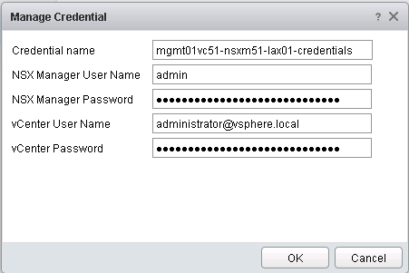

| Management NSX for vSphere and vCenter Server Credential | Value                               |
|----------------------------------------------------------|-------------------------------------|
| **Credential name**                                      | mgmt01vc51-nsxm51-lax01-credentials |
| **NSX User Name**                                        | admin                               |
| **NSX Manager Password**                                 | *mgmt\_nsx\_manager\_password*      |
| **vCenter User Name**                                    | administrator@vsphere.local         |
| **vCenter Password**                                     | *mgmt\_vc\_administrator\_password* |

| Compute/Edge NSX for vSphere and vCenter Server Credential | Value                               |
|------------------------------------------------------------|-------------------------------------|
| **Credential name**                                        | comp01vc51-nsxm51-lax01-credentials |
| **NSX Manager User Name**                                  | admin                               |
| **NSX Manager Password**                                   | *comp\_nsx\_manager\_password*      |
| **vCenter User Name**                                      | administrator@vsphere.local         |
| **vCenter Password**                                       | *comp\_vc\_administrator\_password* |

1.  Click **Test Connection** to validate the connection to the Management NSX Manager or Compute NSX Manager. The NSX Manager certificate appears.

2.  In the **Review and Accept Certificate** dialog box, verify the NSX certificate information and click **OK**.

> 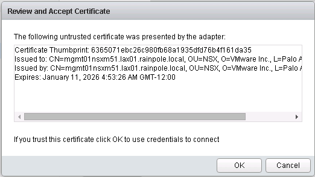

1.  Click **OK** in the test connection dialog box.

> 
>  

1.  Expand the **Advanced Settings** section of settings, and from the **Collectors/Groups** drop-down menu, select the **LAX01** group.

2.  Click **Save Settings** and click **OK** in the information box that appears.

>  
>  

1.  Repeat the steps to create an NSX-vSphere Adapter for the second NSX Manager.

<!-- -->

1.  In the **Manage Solution - Management Pack for NSX-vSphere** dialog box, click **Close**. The two NSX-vSphere Adapters are available on the Solutions page of the vRealize Operations Manager user interface. The Collection State of the adapters is **Collecting** and the Collection Status is **Data receiving**.

> 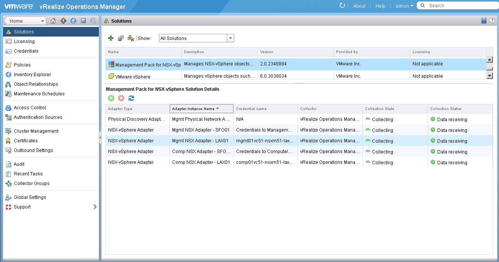

### Configure a Physical Discovery Adapter for Region B in vRealize Operations Manager

Configure a Physical Discovery Adapter to monitor the switches and routers in your environment, and view related alerts, metrics and object capacity.

Prerequisites

-   To monitor network devices, SNMP must be enabled in your network environment. 

-   For complete monitoring of your environment, Link Layer Discovery Protocol (LLDP) or Cisco Discovery Protocol (CDP) must also be enabled on each network device.

Procedure

1.  In a Web browser, open the main page of vRealize Operations Manager.

-   If you use the public interface to the SDDC, go to **https://vrops-cluster-01.rainpole.local**

-   If you can connect to the vSphere management network, go to **https://vrops-mstrn-01.rainpole.local**

1.  Use the **admin** user name and the ***vrops\_admin\_password*** password to log in.

2.  In the left pane of vRealize Operations Manager, click **Administration** and click **Solutions**.

3.  From the solution table on the **Solutions** page, select the **Management Pack for NSX-vSphere **solution and click **Configure**.

4.  On the **Configure adapters** page of the **Manage Solution - Management Pack for NSX-vSphere** wizard, from the **Adapter Type** table at the top, select **Physical Discovery Adapter**. Empty settings for the Physical Adapter appear under Instance Settings if vRealize Operations Manager does not have Physical Discovery Adapters configured. 

5.  Under **Instance Settings**, enter the settings for SNMP connection to the NSX Manager for the management cluster or to the NSX Manager for the compute and edge clusters.

-   For SNMPv1 and SNMPv2 devices, enter a comma-separated list of community names (default is public) and SNMP ports (default is 161).

-   For SNMPv3 devices, provide SNMPv3 credentials in addition to the settings for SNMPv1 and SNMPv2.

> 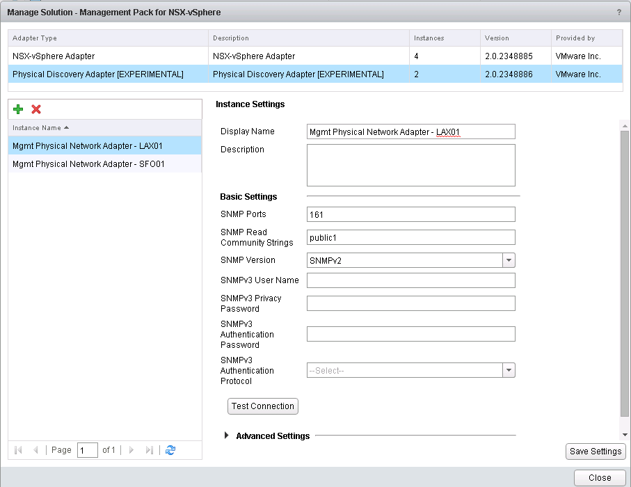

1.  Click **Test Connection** to verify the settings, and if the test is successful click the **OK** button. 

> 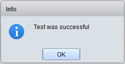

1.  Expand the **Advanced Settings** section of settings, and from the **Collectors/Groups** drop-down menu, select the **LAX01** group.

2.  Click **Save Settings** and click **Yes** in the information box that appears.

> 

1.  In the **Manage Solution - Management Pack for NSX-vSphere** dialog box, click **Close**.

> The Physical Discovery Adapter appears on the Solutions page of the vRealize Operations Manager user interface. The adapter is collecting data about the network devices in Region B of the SDDC.
>
> 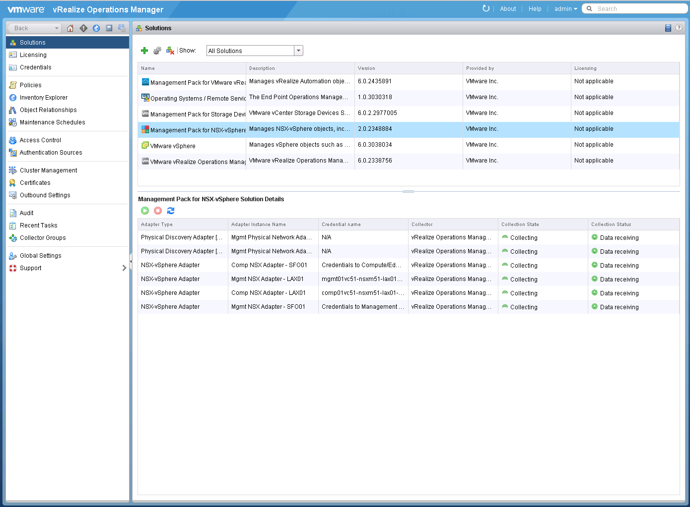

Add Storage Devices Adapters for Region B in vRealize Operations Manager
------------------------------------------------------------------------

Configure Storage Devices adapter for Region B to collect monitoring data about the storage devices in the SDDC.

Procedure

1.  In a Web browser, log in to the user interface of vRealize Operations Manager.

-   If you use the public interface to the SDDC, go to **https://vrops-cluster-01.rainpole.local**

-   If you can connect to the vSphere management network, go to **https://vrops-mstrn-01.rainpole.local**

1.  Use the **admin** user name and the ***vrops\_admin\_password*** password to log in.

2.  From the solution table on the **Solutions** page, select the **Management pack for Storage Devices **solution and click the **Configure** button.

> 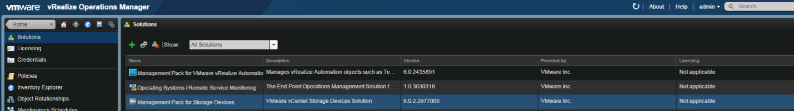

1.  On the **Configure adapters** page of the **Manage Solution - Management Pack for Storage Devices **dialog box under **Instance Settings**, enter the settings for connection to the vCenter Server for the management cluster or to the vCenter Server for the compute and edge clusters.

> 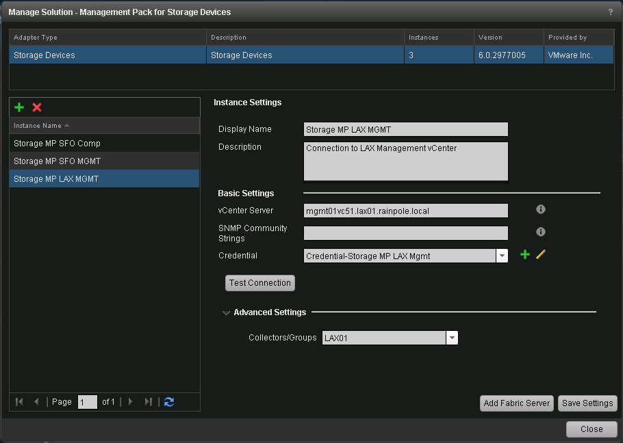

1.  If you have already added another Storage Devices adapter, click the **Add** icon to add an adapter setting.  

2.  Enter the name and description of the adapter, and the FQDN of the vCenter Server instance.

| Storage Devices Adapter Attribute |     | Value                                |
|-----------------------------------|-----|--------------------------------------|
| **Name**                          |     | Storage MP LAX MGMT                  |
| **Description**                   |     | Connection to LAX Management vCenter |
| **vCenter Server**                |     | mgmt01vc51.lax01.rainpole.local      |
| **SNMP Community Strings**        |     | -                                    |

| Storage Devices Adapter Attribute | Value                             |
|-----------------------------------|-----------------------------------|
| **Name**                          | Storage MP LAX Compute            |
| **Description**                   | Connection to LAX Compute vCenter |
| **vCenter Server**                | comp01vc51.lax01.rainpole.local   |
| **SNMP Community Strings**        | -                                 |

1.  Click the + icon, configure the credentials for connection to the vCenter Server instances in Region B, and click **OK**.

> 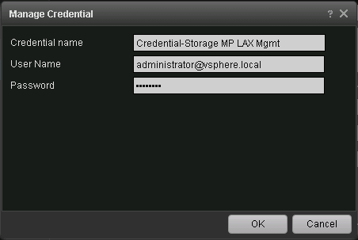

| Management vCenter Server Credentials Attribute | Value                          |
|-------------------------------------------------|--------------------------------|
| **Credential name**                             | Credential-Storage MP LAX Mgmt |
| **User Name**                                   | administrator@vsphere.local    |
| **Password**                                    | *vsphere\_admin\_password*     |

| Compute vCenter Server Credentials Attribute        | Value                             |
|-----------------------------------------------------|-----------------------------------|
| **Credential name**                                 | Credential-Storage MP LAX Compute |
| **User Name**                                       | administrator@vsphere.local       |
| **Password**                                        | *vsphere\_admin\_password*        |

1.  Expand the **Advanced Settings** section of settings, and from the **Collectors/Groups** drop-down menu, select the **LAX01** remote collector group.

2.  Click **Test Connection** to validate the connection to the Management vCenter Server or the Compute vCenter Server.

3.  In the **Review and Accept Certificate** dialog box, verify the vCenter Server certificate information and click **OK**.

> 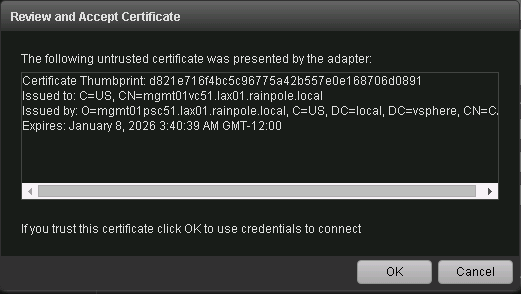

1.  Click **Save Settings** and click **OK** in the information box that appears.

2.  Repeat the steps for the other vCenter Server instance.

<!-- -->

1.  In the **Manage Solution - Management Pack for Storage Devices** dialog box, click Close.

> The Storage Devices adapter instances appear on the Solutions page of the vRealize Operations Manager user interface. The Collection State of the adapters is **Collecting** and the Collection Status is **Data receiving**.
>
> 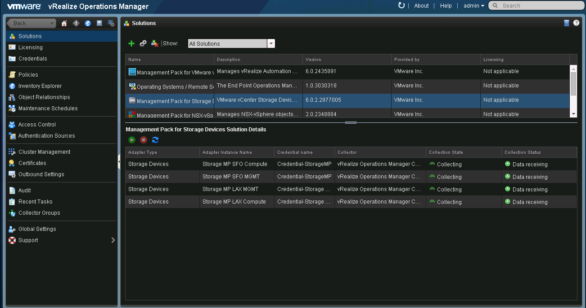

Extend User Access in vRealize Operations Manager in Region B
-------------------------------------------------------------

After you connect the management application components in the region to vRealize Operations Manager, add the users from the child Active Directory domain to vRealize Operations Manager and configure their monitoring roles.

-   Add an Authentication Source for the Child Active Directory Domain in Region B

-   Assign Monitoring Roles to Users in the Child Active Directory in Region B

    1.  ### Add an Authentication Source for the Child Active Directory Domain in Region B

Connect vRealize Operations Manager to the child Active Directory domain lax01.rainpole.local for central user management and access control in Region B.

Procedure

1.  In a Web browser, open the main page of vRealize Operations Manager.

-   If you use the public interface to the SDDC, go to **https://vrops-cluster-01.rainpole.local**

-   If you can connect to the vSphere management network, go to **https://vrops-mstrn-01.rainpole.local**

1.  Use the ***admin*** user name and the ***vrops\_admin\_password*** password to log in.

2.  In the left pane of vRealize Operations Manager, click **Administration** and click **Authentication Sources**.

> 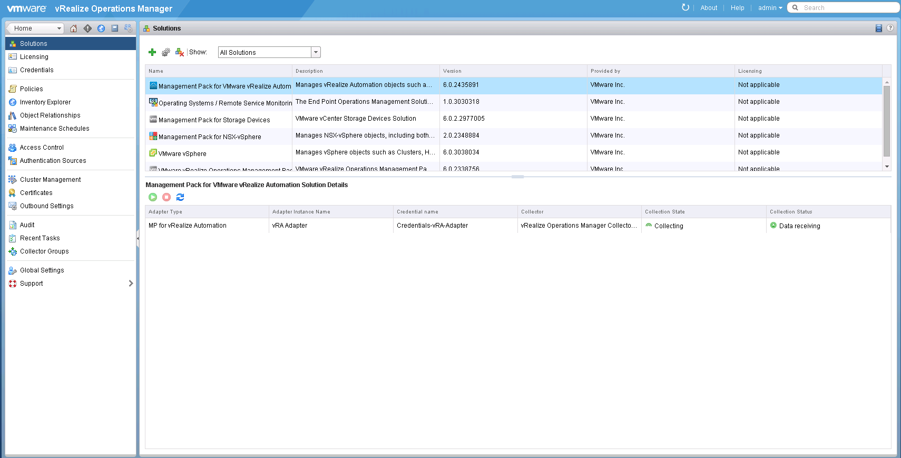

1.   In the **Authentication Sources** page, click the **Add** icon.

> 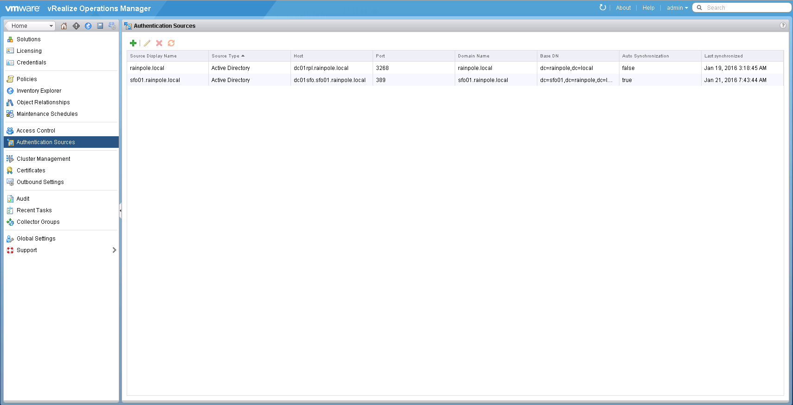

1.  In the **Add Source for User and Group Import** dialog box, enter the settings for the Active Directory.

> 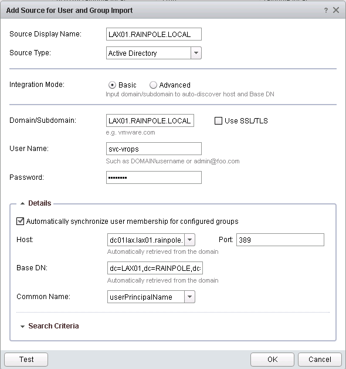

| Active Directory Setting                                             | Value                         |
|----------------------------------------------------------------------|-------------------------------|
| **Source Display Name**                                              | LAX01.RAINPOLE.LOCAL          |
| **Source Type**                                                      | Active Directory              |
| **Integration Mode**                                                 | Basic                         |
| **Domain/Subdomain**                                                 | LAX01.RAINPOLE.LOCAL          |
| **Use SSL/TLS**                                                      | Deselected                    |
| **User Name**                                                        | svc-vrops                     |
| **Password**                                                         | svc-vrops\_password           |
| **Settings under the Details section**                               |
| **Automatically synchronize user membership for configured groups ** | Selected                      |
| **Host**                                                             | dc01lax.lax01.rainpole.local  |
| **Base DN**                                                          | dc=LAX01,dc=RAINPOLE,dc=LOCAL |
| **Common Name**                                                      | userPrincipalName             |

1.  Click the **Test** button to test the connection to the domain controller and in the Info success message click **OK**.

> 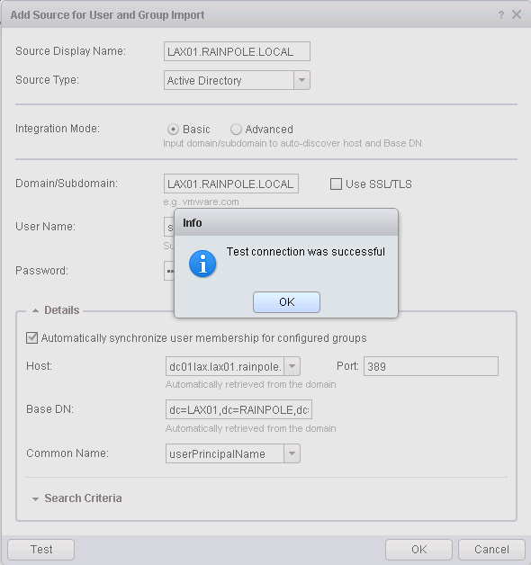

1.  In the **Add Source for User and Group** Import dialog box, click **OK**.

    1.  ### Assign Monitoring Roles to Users in the Child Active Directory in Region B

After you register the lax01.rainpole.local Active Directory domain as an authentication source in vRealize Operations Manager, import the users and groups that are going to monitor the SDDC, and configure their access to monitoring data. 

Procedure

1.  In a Web browser, log into the user interface of vRealize Operations Manager.

-   If you use the public interface to the SDDC, go to **https://vrops-cluster-01.rainpole.local**

-   If you can connect to the vSphere management network, go to **https://vrops-mstrn-01.rainpole.local**

1.  Use the **admin** user name and the *vrops\_admin\_password* password to log in.

2.  In the left pane of vRealize Operations Manager, click **Administration** and click **Access Control**.

3.  On the **Access Control** page, click the **User Accounts** tab.

4.  Click the **Import Users** icon.

5.  In the Import Users dialog box, import the **vrops-admin@lax01.rainpole.local** user.

    1.  From the **Import From** drop-down menu, select **LAX01.RAINPOLE.LOCAL**.

    2.  Select the **Basic** option for the search query.

    3.  In the **Search String** text box, enter **vrops** and click **Search**. The search results contain the **vrops-admin** user. 

    4.  In the search result, select the **vrops-admin@lax01.rainpole.local** entry

    5.  Click **Next**.

> 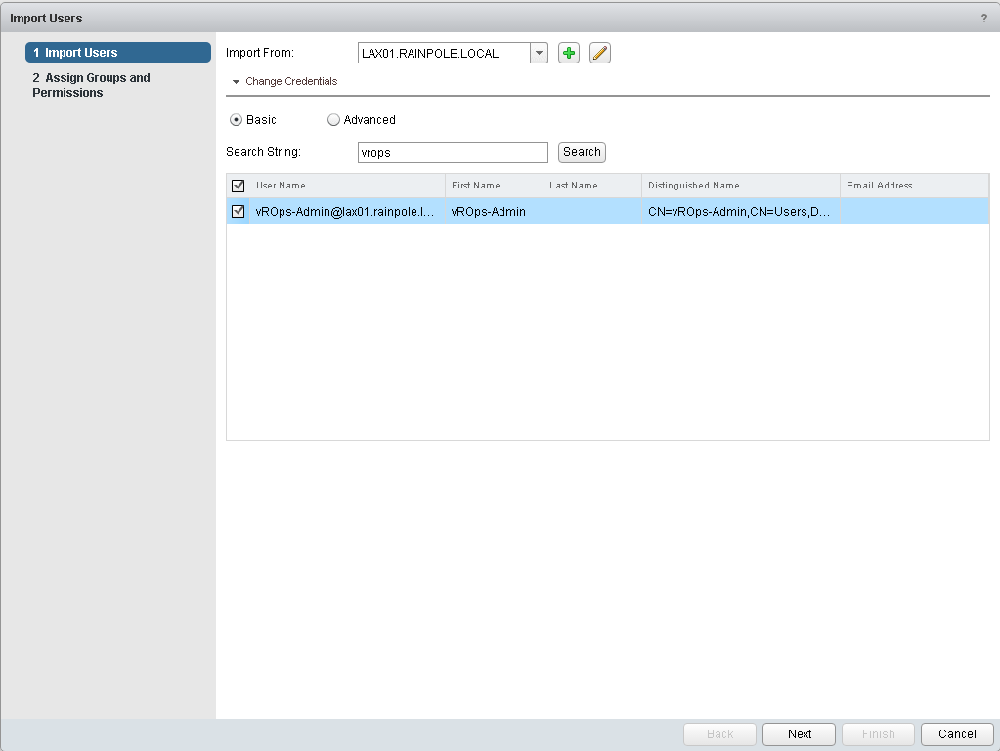

1.  In the Assign Groups and Permissions page, assign the **ContentAdmin** role to the **vrops-admin@lax01.rainpole.local** user account.

    1.  Click the **Objects** tab.

    2.  Select the **ContentAdmin** item from the drop-down menu

    3.  Select **Assign** this role to the user.

    4.  Select **Allow access to all objects in the system**.

> 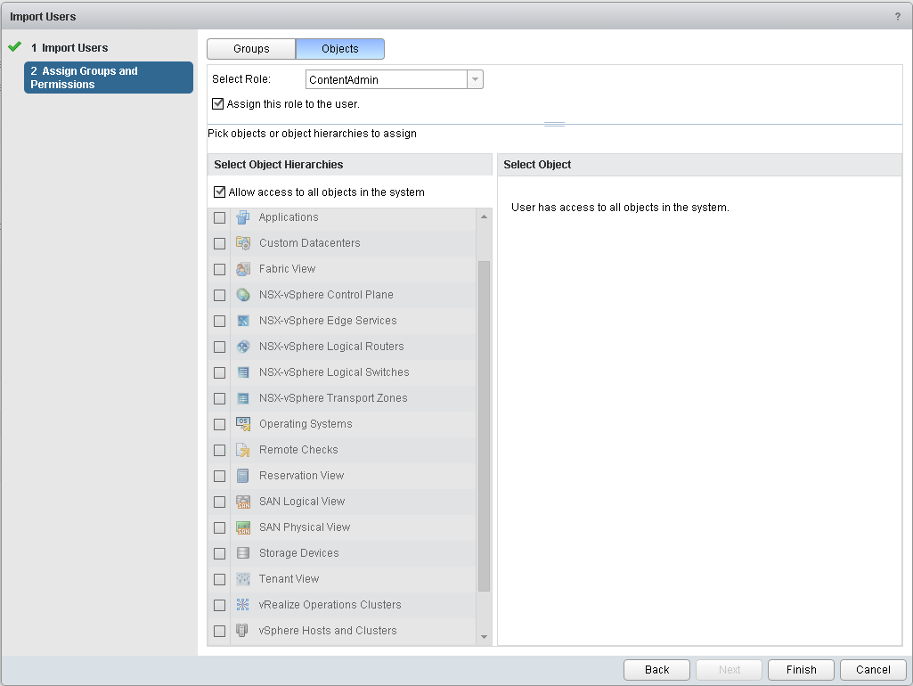

1.  Click **Finish**.

vRealize Log Insight Implementation in Region B
===============================================

-   Deploy vRealize Log Insight in Region B

-   Connect vRealize Log Insight to the vSphere Environment in Region B

-   Install a CA-Signed Certificate on vRealize Log Insight in Region B

-   Configure Log Retention and Archiving in Region B

-   Connect vRealize Log Insight to vRealize Operations Manager in Region B

-   Connect vRealize Log Insight to the NSX Instances in Region B

-   Connect vRealize Log Insight to vRealize Automation in Region B

-   Configure Event Forwarding Between Region A and Region B

    1.  Deploy vRealize Log Insight in Region B
        ---------------------------------------

Start the deployment of vRealize Log Insight in Region B by deploying the master and worker nodes and forming the vRealize Log Insight cluster.

-   Prerequisites for Deploying vRealize Log Insight in Region B

-   Deploy the Virtual Appliance for Each Node in the vRealize Log Insight Cluster in Region B

-   Configure a DRS Anti-Affinity Rule for vRealize Log Insight in Region B

-   Start the vRealize Log Insight Instance in Region B

-   Join the Worker Nodes to vRealize Log Insight in Region B

-   Enable the Integrated Load Balancer of vRealize Log Insight in Region B

-   Configure Public Access to vRealize Log Insight Region B

-   Join vRealize Log Insight to the Active Directory in Region B

    1.  ### Prerequisites for Deploying vRealize Log Insight in Region B

Before you deploy vRealize Log Insight in Region B, verify that your environment satisfies the requirements for this deployment. 

IP Addresses and Host Names

Verify that static IP addresses and FQDNs for the vRealize Log Insight virtual application network are available for Region B of the SDDC deployment.

For the application virtual network, allocate 3 static IP addresses for the vRealize Log Insight nodes and one IP address for the integrated load balancer. Map host names to the IP addresses.

1.  Region B must be routable via the vSphere management network.

Table 19. **IP Addresses and Host Name for the Analytics Cluster in Region B**

| **Role**                                 | **IP Address** | **FQDN**                             |
|------------------------------------------|----------------|--------------------------------------|
| **Integrated load balancer VIP address** | 192.168.32.10  | vrli-cluster-51.lax01.rainpole.local |
| **Master node**                          | 192.168.32.11  | vrli-mstr-51.lax01.rainpole.local    |
| **Worker node 1**                        | 192.168.32.12  | vrli-wrkr-51.lax01.rainpole.local    |
| **Worker node 2**                        | 192.168.32.13  | vrli-wrkr-52.lax01.rainpole.local    |
| **Default gateway**                      | 192.168.32.1   | -                                    |
| **DNS server**                           | 172.17.11.5    | -                                    |
| **Subnet mask**                          | 255.255.255.0  | -                                    |
| **NTP servers**                          | 172.16.11.251  
                                            172.16.11.252   

                                            172.17.11.251   
                                            172.17.11.252   | ntp.sfo01.rainpole.local             

                                                                                                   

                                                             ntp.lax01.rainpole.local              |

Deployment Prerequisites

| Prerequisite                | Value                                                                                                                                                              |
|-----------------------------|--------------------------------------------------------------------------------------------------------------------------------------------------------------------|
| **Storage**                 | -   Virtual disk provisioning.                                                                                                                                     

                               <!-- -->                                                                                                                                                            

                               -   Thin                                                                                                                                                            

                               <!-- -->                                                                                                                                                            

                               -   Required storage per node                                                                                                                                       

                               <!-- -->                                                                                                                                                            

                               -   Initial storage for node deployment: 270 GB                                                                                                                     

                               -   Additional storage: 190 GB                                                                                                                                      |
| **Software Features**       | -   vSphere                                                                                                                                                        

                               <!-- -->                                                                                                                                                            

                               -   Management vCenter Server                                                                                                                                       

                               -   Client Integration Plugin on the machine where you use the vSphere Web Client                                                                                   

                               -   Management cluster with DRS and HA enabled.                                                                                                                     

                               <!-- -->                                                                                                                                                            

                               -   NSX for vSphere                                                                                                                                                 

                               <!-- -->                                                                                                                                                            

                               -   Application virtual network for the 3-node vRealize Log Insight cluster                                                                                         |
| **Installation Package**    | Download the .ova file of the vRealize Log Insight virtual appliance on the machine where you use the vSphere Web Client.                                          |
| **License**                 | Obtain a license that covers the use of vRealize Log Insight.                                                                                                      |
| **Active Directory**        | Verify that you have a parent and child Active Directory domain controllers configured with the role-specific SDDC users and groups for the rainpole.local domain. |
| **Certification Authority** | Configure the Active Directory domain controller as a certificate authority for the environment.                                                                   |
| **E-mail account**          | Provide an email account to send vRealize Log Insight notifications from.                                                                                          |

### Deploy the Virtual Appliance for Each Node in the vRealize Log Insight Cluster in Region B

Use the vSphere Web Client to deploy each vRealize Log Insight node as a virtual appliance on the management cluster in Region B.

You deploy three nodes of vRealize Log Insight in Region B extending their log storage. 

| vRealize Log Insight Node in Region B | VM Name      | IP Address    | Host Name                         |
|---------------------------------------|--------------|---------------|-----------------------------------|
| **Master Node**                       | vrli-mstr-51 | 192.168.32.11 | vrli-mstr-51.lax01.rainpole.local |
| **Worker Node 1**                     | vrli-wrkr-51 | 192.168.32.12 | vrli-wrkr-51.lax01.rainpole.local |
| **Worker Node 2**                     | vrli-wrkr-52 | 192.168.32.13 | vrli-wrkr-52.lax01.rainpole.local |

Procedure

1.  In a Web browser, open the vSphere Web Client. 

    1.  Log in to **https://mgmt01vc51.lax01.rainpole.local/vsphere-client.**

    2.  Use the **administrator@vsphere.local** user name and the ***vsphere\_admin\_password*** password*.* 

2.  Navigate to the **mgmt01vc51.lax01.rainpole.local** vCenter Server object. 

3.  Right-click **mgmt01vc51.lax01.rainpole.local** and select **Deploy OVF Template**.

4.  On the **Select source** page, select **Local file**, click **Browse** and browse to the location of the vRealize Log Insight .ova file on your local file system, and click **Next**.

> <embed src="media/image367.png" width="450" height="264" />

1.  On the **Review details** page, examine the virtual appliance details, such as product, version, download size, and disk size, and click **Next**. 

> <embed src="media/image368.png" width="452" height="264" />

1.  On the **Accept License Agreements **page, accept the end user license agreements and click **Next**.

2.  On the **Select name and folder** page make the following selections, and click **Next**. 

    1.  Enter a name for the node according to its role. 

| Name         | Role          |
|--------------|---------------|
| vrli-mstr-51 | Master node   |
| vrli-wrkr-51 | Worker node 1 |
| vrli-wrkr-52 | Worker node 2 |

1.  Select the inventory folder for the virtual appliance.

| Object             | Value                           |
|--------------------|---------------------------------|
| **vCenter Server** | mgmt01vc51.lax01.rainpole.local |
| **Data center**    | LAX01                           |
| **Folder**         | vRLI01                          |

> <embed src="media/image369.png" width="452" height="264" />

1.  On the **Select configuration** page, from the **Configuration** drop-down menu, select the **Medium** deployment configuration, and click **Next**. 

> <embed src="media/image370.png" width="453" height="264" />

1.  On the **Select storage** page, select the datastore. By default, the virtual appliance disk is thin provisioned. 

    1.  From the **VM Storage Policy** drop-down menu, select **Virtual SAN Default Storage Policy**.

    2.  From the datastore table, select the **LAX01A-VSAN01-MGMT01** Virtual SAN datastore.

    3.  Click **Next**.

> <embed src="media/image371.png" width="453" height="264" />

1.  On the **Setup networks** page, select the distributed port group on the **vDS-Mgmt** distributed switch that ends with **vRLI01-VXLAN**, and click **Next**.

> NSX for vSphere creates the distributed port group for the logical switch that connects the vRealize Log Insight nodes and generates the port group name. The name of the port group contains the segment ID and the logical switch name vRLI01-VXLAN.
>
> <embed src="media/image372.png" width="453" height="264" />

1.  On the **Customize template** page, set networking settings and the root user credentials for the virtual appliance.

    1.  In the **Networking Properties** section, configure the following networking settings:

| Property                | Value                                                   |
|-------------------------|---------------------------------------------------------|
| **Host name**           | vrli-mstr-51.lax01.rainpole.local for the master node   
                           vrli-wrkr-51.lax01.rainpole.local for the worker node 1  
                           vrli-wrkr-52.lax01.rainpole.local for the worker node 2  |
| **Default gateway**     | 192.168.32.1                                            |
| **DNS server**          | 172.17.11.5                                             |
| **Static IPv4 address** | 192.168.32.11 for the master node                       
                           192.168.32.12 for the worker node 1                      
                           192.168.32.13 for the worker node 2                      |
| **Subnet mask**         | 255.255.255.0                                           |

1.  In the **Other Properties** section, enter and confirm a password for the **root** user.
    The password must contain at least 8 characters, from which one uppercase character, one lowercase character, one digit and one special char. Use this password if you log in to the console of the vRealize Log Insight virtual appliance. 

2.  Click **Next**.

> <embed src="media/image373.png" width="452" height="264" />

1.  On the **Ready to complete** page, click **Finish**.
    The deployment of the virtual appliance is in progress.

2.  After the virtual appliance is deployed, expand the data disk of the virtual appliance to collect and store data from a large number of virtual machines.

    1.  In the vSphere Web Client. Navigate to the virtual appliance object.

    2.  Right-click the virtual appliance object and select **Edit Settings**.

    3.  In the **Edit Settings** dialog box, from the **New device** drop-down menu at the bottom, select **New Hard Disk** and click **Add**.

    4.  In the text box next to the **New Hard disk** label, enter **190 GB** for the size, and click **OK**.

> <embed src="media/image374.png" width="466" height="488" />
>  

1.  Right-click the virtual appliance object and select the **Power** &gt; **Power On** menu item.
    During the power-on process, the virtual appliance expands the vRealize Log Insight Manager logs partition.

2.  Repeat the steps to deploy the vRealize Log Insight virtual appliances for the remaining two nodes in the cluster.

    1.  ### Configure a DRS Anti-Affinity Rule for vRealize Log Insight in Region B

To protect the vRealize Log Insight cluster in Region B from a host-level failure, configure vSphere DRS to run the worker virtual appliances on different hosts in the management cluster.

Procedure

1.  In a Web browser, open the vSphere Web Client.

    1.  Log in to **https://mgmt01vc51.lax01.rainpole.local/vsphere-client**

    2.  Use the **administrator@vsphere.local** user name and the ***vsphere\_admin\_password*** password.

2.  Navigate to the **mgmt01vc51.lax01.rainpole.local** vCenter Server object, and under the LAX01 data center object select the **LAX01-Mgmt01** cluster.

3.  On the **Manage** tab, click the **Settings** tab.

4.  Under the **Configuration** group of settings, select **VM/Host Rules**.

> <embed src="media/image375.png" width="499" height="243" />
>  

1.  In the VM/Host Rules list, click the Add button above the rules list and add a new anti-affinity rule called **vrli-antiaffinity-rule** for the **vrli-mstr-51**, **vrli-wrkr-51** and vrli-wrkr-52 virtual machines, and click **OK**.

| Rule Attribute  | Value                     |
|-----------------|---------------------------|
| **Name**        | vrli-antiaffinity-rule    |
| **Enable rule** | Yes                       |
| **Type**        | Separate Virtual Machines |
| **Members**     | vrli-mstr-51              

                   vrli-wrkr-51               

                   vrli-wrkr-52               |

> <embed src="media/image376.png" width="219" height="213" />

### Start the vRealize Log Insight Instance in Region B

Configure and start the vRealize Log Insight master node in Region B. To form a cluster by adding the worker nodes, vRealize Log Insight must be running.

Procedure

1.  In a Web browser, go to **https://vrli-mstr-51.lax01.rainpole.local.** The initial configuration wizard opens.

2.  On the **Setup** page, click **Next**.

> <embed src="media/image377.png" width="412" height="142" />

1.  On the **Choose Deployment Type** page, click **Start New Deployment**. 

> <embed src="media/image378.png" width="412" height="244" />

1.  After the deployment is launched, on the **Admin Credentials** page, set the email address and the password of the **admin** user, and click **Save and Continue**.

> The password must contain at least 8 characters, from which one uppercase character, one lowercase character, one number, and one special character.
>
> <embed src="media/image379.png" width="333" height="157" /> 

1.  On the **License** page, enter the license key, click **Add New License Key**, and click **Continue**.

> <embed src="media/image380.png" width="384" height="130" />

1.  On the **General Configuration** page, enter email addresses to receive system notifications on from vRealize Log Insight, and click **Save and Continue**.

> <embed src="media/image381.png" width="424" height="302" />
>
>  

1.  On the **Time Configuration** page, from the **Sync Server Time With** drop-down menu, configure the following NTP server settings, and click **Save and Continue**.

| Time Configuration Option | Value                    |
|---------------------------|--------------------------|
| **Sync Server Time With** | NTP Server               |
| **NTP Servers**           | ntp.lax01.rainpole.local |

> <embed src="media/image382.png" width="422" height="274" />

1.  On the **SMTP Configuration** page, specify the properties of an SMTP server to enable outgoing alerts and system notification emails, and to test the email notification.

    1.  Set the connection setting for the SMTP server that will send the email messages from vRealize Log Insight. Contact your system administrator for details about the email server.

| SMTP Option             | Description                                                                         |
|-------------------------|-------------------------------------------------------------------------------------|
| **SMTP Server**         | *FQDN of the SMTP server*                                                           |
| **Port**                | Server port for SMTP requests                                                       |
| **SSL (SMTPS)**         | Sets whether encryption should be enabled for the SMTP transport option connection. |
| **STARTTLS Encryption** | Enable or disable the STARTTLS encryption.                                          |
| **Sender**              | Address that appears as the sender of the email.                                    |
| **Username**            | User name on the SMTP server.                                                       |
| **Password**            | Password for the SMTP server you specified in Username.                             |

> <embed src="media/image383.png" width="393" height="302" />

1.  To verify that the SMTP configuration is correct, type a valid email address and click **Send Test Email**.

> vRealize Log Insight sends a test email to the address that you provided.
>
> <embed src="media/image384.png" width="316" height="283" />

 

1.  On the **Setup Complete** page, click **Finish**.

> vRealize Log Insight starts operating in standalone mode.

### Join the Worker Nodes to vRealize Log Insight in Region B

After you deploy the virtual appliances for vRealize Log Insight and start the vRealize Log Insight instance on the master node in Region B, join the two worker nodes to form a cluster.

Procedure

1.  For each worker node appliance, go to the initial setup UI in your Web browser.  The initial configuration wizard opens.

| Worker Node       | HTTP URL                                  |
|-------------------|-------------------------------------------|
| **Worker node 1** | https://vrli-wrkr-51.lax01.rainpole.local |
| **Worker node 2** | https://vrli-wrkr-52.lax01.rainpole.local |

1.  On the **Choose Deployment Type** page, click Join Existing Deployment.

> <embed src="media/image385.png" width="363" height="108" />

1.  On the **Join Existing Deployment** page, enter the mater node FQDN **vrli-mstr-51.lax01.rainpole.local** and click **Go**. 

> <embed src="media/image386.png" width="343" height="113" />
>
> The worker node sends a request to the vRealize Log Insight master node to join the existing deployment. 

1.  After the worker node contacts the master node, click the **Click here to access the Cluster Management page** link. 

> <embed src="media/image387.png" width="400" height="141" />
>
> The login page of the vRealize Log Insight user interface opens.

1.  On the Log Insight login page, log in as the admin user with the *vrli\_admin\_password* password.
    The **Cluster** page opens in the Log Insight user interface.

2.  On the right of the notification message about adding the worker node, click **Allow**.

> <embed src="media/image388.png" width="528" height="235" />
>
> After you join the first worker node to the cluster, the user interface displays a warning message that another worker node must be added.

1.  Repeat the steps to join the second worker node to the cluster.

> After you add the second worker node, the **Cluster** page of the vRealize Log Insight UI contains the master and worker nodes as components of the cluster.
>
> <embed src="media/image389.png" width="537" height="296" />

 

### Enable the Integrated Load Balancer of vRealize Log Insight in Region B

After you join the master and the worker nodes to create a vRealize Log Insight cluster in Region B, enable the Integrated Load Balancer (ILB) for balancing incoming ingestion traffic of syslog data among the Log Insight nodes and for high availability. 

1.  In a Web browser, open the vRealize Log Insight user interface.

    1.  Log in to **https://vrli-mstr-51.lax01.rainpole.local**

    2.  Use the **admin** user and the ***vrli\_admin\_password*** password to log in.

2.  Click the configuration drop-down menu icon <embed src="media/image390.png" width="28" height="24" /> and select **Administration**.

3.  Under **Management**, click **Cluster**.

4.  Under **Configuration**, select the **Enable Integrated Load Balancer** check box. 

5.  Enter the virtual IP address and the FQDN for load balancing, and click Save.

| ILB Setting    | Value                                |
|----------------|--------------------------------------|
| **IP address** | 192.168.32.10                        |
| **FQDN**       | vrli-cluster-51.lax01.rainpole.local |

> <embed src="media/image391.png" width="468" height="302" />

### Configure Public Access to vRealize Log Insight Region B

The vRealize Log Insight integrated load balancer in Region B as configured is only available to the vSphere management network.  To enable access to vRealize Log Insight in Region B from the public network, add a NAT rule to the NSX Edge device that is fronting the application virtual network.

1.  Log in to the Management vCenter Server by using the vSphere Web Client.

    1.  In a browser, go to **https://mgmt01vc51.lax01.rainpole.local/vsphere-client**

    2.  Use the following credentials to log in.

| Setting       | Value                       |
|---------------|-----------------------------|
| **User name** | administrator@vsphere.local |
| **Password**  | vsphere\_admin\_password    |

1.  Create a Destination NAT (DNAT) rule to enable access from the public network.

    1.  In the **Navigator** pane, click **Networking & Security**, and** **click **NSX Edges**.

    2.  From the** NSX Manager** drop-down menu, select **172.17.11.65**, and double-click the management application NSX Edge **vRLI01-Edge** to edit its settings.

    3.  Click the **Manage** tab, click **NAT**, and click the **Add** &gt; **Add DNAT Rule** icon to create new Destination NAT rule.

> <embed src="media/image112.png" width="558" height="124" />
>  

1.  In the **Add DNAT Rule** dialog box, enter the following settings, and click **OK**.

| Setting                   | Value                                                          |
|---------------------------|----------------------------------------------------------------|
| **Applied On**            | Public                                                         |
| **Original IP/Range**     | 10.158.150.15                                                  |
| **Protocol**              | TCP                                                            |
| **Original Port/Range**   | 443                                                            |
| **Translated IP/Range**   | 192.168.32.10                                                  |
| **Translated Port/Range** | 443                                                            |
| **Description**           | Provide Public network access to vRealize Log Insight Region B |
| **Enabled**               | Se                                                             |
| **Enable logging**        | Unchecked                                                      |

> <embed src="media/image392.png" width="317" height="369" />

1.  On the **NAT** tab, click **Publish Changes** to apply the changes from the new DNAT rule.

> <embed src="media/image393.png" width="624" height="233" />

### Join vRealize Log Insight to the Active Directory in Region B

To propagate user roles in vRealize Log Insight that are maintained centrally and are in line with the other solutions in the SDDC, configure vRealize Log Insight in Region B to use the Active Directory (AD) domain as an authentication source.

1.  In a Web browser, open the vRealize Log Insight UI.

    1.  Go to **https://vrli-cluster-51.lax01.rainpole.local/admin/auth**

    2.  Use the **admin** user name and ***vrli\_admin\_password*** password to log in.
        After you log in, the **Authentication** page opens. 

2.  On the **Authentication** page, enable the support for Active Directory and configure the settings for connection to the Active Directory domain controller.

    1.  Configure the Active Directory connection settings according to the details from your IT administrator.

| Field                               | Value                                                             |
|-------------------------------------|-------------------------------------------------------------------|
| **Enable Active Directory support** | Yes                                                               |
| **Default Domain**                  | RAINPOLE.LOCAL                                                    |
| **User Name**                       | svc-loginsight                                                    |
| **Password**                        | *svc\_loginsight\_password*                                       |
| **Connection Type**                 | Standard                                                          |
| **Require SSL**                     | Yes or No according to the instructions from the IT administrator |

1.  Click **Test Connection** to verify the connection, and click **Save**.

> <embed src="media/image394.png" width="477" height="279" />

Connect vRealize Log Insight to the vSphere Environment in Region B
-------------------------------------------------------------------

Start collecting log information about the ESXi and vCenter Server instances in the SDDC in Region B. 

-   Configure User Privileges in vSphere for Integration with vRealize Log Insight for Region B

-   Connect vRealize Log Insight to vSphere in Region B

    1.  ### Configure User Privileges in vSphere for Integration with vRealize Log Insight for Region B

To collect log information from the vCenter Server instances and ESXi hosts in Region B, you must assign a role to the svc-loginsight AD user on the vCenter Server objects. The svc-loginsight user account is specifically dedicated to collecting log information from vCenter Server and ESXi. 

1.  In a Web browser, log in to vCenter Server by using the vSphere Web Client.

    1.  Go to the following URL.

    2.  Use the **administrator@vsphere.local** user name and the ***vsphere\_admin\_password*** password to log in.

| vCenter Server                | URL                                                     |
|-------------------------------|---------------------------------------------------------|
| **Management vCenter Server** | https://mgmt01vc51.lax01.rainpole.local/vsphere-client/ |
| **Compute vCenter Server**    | https://comp01vc51.lax01.rainpole.local/vsphere-client/ |

1.  From the **Home** menu, select **Administration**.

2.  Under **Access Control**, click **Roles**. 

3.  Create a role specifically for vRealize Log Insight. 

    1.  Select **Read-only** and click the **Clone** icon.

> You clone the Read-only role because it includes the **System.Anonymous**, **System.View**, and **System.Read** privileges. vRealize Log Insight requires those privileges for accessing log information related to the vCenter Server instances.
>
> <embed src="media/image395.png" width="563" height="161" />
>  

1.  In the **Clone Role Read-only** dialog box, enter LogInsight in the **Role name** text box. 

2.  Select the **Host.Configuration.Advanced settings**,** Host.Configuration.Change settings**, **Host.Configuration.Network configuration** and **Host.Configuration.Security profile and firewall** privileges. 

> These host privileges allow vRealize Log Insight to configure the syslog service on the ESXi hosts. 
>
>  <embed src="media/image396.png" width="271" height="377" />

1.  Click **OK**.

<!-- -->

1.  Assign the **LogInsight** role to the **svc-loginsight** user on the Management vCenter Server and Compute vCenter Server.

    1.  In the vSphere Web Client, navigate to the vCenter Server object in Region B.

| vCenter Server                | Object                          |
|-------------------------------|---------------------------------|
| **Management vCenter Server** | mgmt01vc51.lax01.rainpole.local |
| **Compute vCenter Server**    | comp01vc51.lax01.rainpole.local |

1.  Right-click the vCenter Server object and click **Add Permission**.

> <embed src="media/image397.png" width="588" height="286" />

1.  In the **Add Permission** dialog box, click the **Add** button to assign a role to a user or a group.

2.  In the **Select Users/Groups** dialog box, from the **Domain** drop-down menu, select **RAINPOLE**, and in the filter box type svc. 

3.  From the list of users and groups, select the **svc-loginsight** AD user, click the **Add **button, and click **OK**.

> <embed src="media/image398.png" width="339" height="377" />

1.  In the **Add Permission** dialog box, from the **Assigned Role** drop-down menu, select **Log Insight**, select **Propagate to children**, and click **OK**.

> <embed src="media/image399.png" width="451" height="364" />

 

### Connect vRealize Log Insight to vSphere in Region B

After you configure the svc-loginsight AD user with the vSphere privileges that are required for retrieving log information from the vCenter Server instances and ESXi hosts, in Region B connect vRealize Log Insight to vSphere.

1.  In a Web browser, open the vRealize Log Insight user interface.

    1.  Go to **https://vrli-cluster-51.lax01.rainpole.local**

    2.  Use the **admin** user name and the ***vrli\_admin\_password*** password to log in.

2.  Click the configuration drop-down menu icon  and select **Administration**.

3.  Under **Integration**, click **vSphere**.

4.  In the **vCenter Servers** pane, enter the connection settings for the Management vCenter Server and for the Compute vCenter Server.

    1.  Enter the host name, user credentials, and collection options for the vCenter Server instances, and click **Test Connection**.

| vCenter Server Option                                | Value                            |
|------------------------------------------------------|----------------------------------|
| **Hostname**                                         | mgmt01vc51.lax01.rainpole.local  

                                                        comp01vc51.lax01.rainpole.local   |
| **Username**                                         | svc-loginsight@rainpole.local    |
| **Password**                                         | *svc-loginsight\_user\_password* |
| **Collect vCenter Server events, tasks and alarms**  | Yes                              |
| **Configure ESXi hosts to send logs to Log Insight** | Yes                              |

> <embed src="media/image401.png" width="438" height="283" />

1.  Click **Advanced Options** and examine the list of ESXi hosts that are connected to the vCenter Server instance to verify that you connect to the correct vCenter Server.

> <embed src="media/image402.png" width="342" height="326" />

1.  Click **Add vCenter Server **to add a new settings form and repeat the steps to add the settings for the second vCenter Server instance in Region B.

<!-- -->

1.  Click **Save**. A progress dialog box appears. 

> <embed src="media/image403.png" width="321" height="211" />
>  

1.  Click **OK** in the confirmation dialog box that appears after vRealize Log Insight contacts the vCenter Server instances.

> You see the vSphere dashboards under the **VMware - vSphere** content pack dashboard category.
>
> 

 

**Install a** CA-Signed Certificate on vRealize Log Insight in Region B
-----------------------------------------------------------------------

vRealize Log Insight comes with a default self-signed certificate that is generated and signed at installation time. After you start vRealize Log Insight in Region B, install a CA-signed certificate to secure the communication of vRealize Log Insight. 

vRealize Log Insight uses a certificate for the following communication:

-   Connection to the vRealize Log Insight UI

-   SSL syslog transfers

-   Communication from the Log Insight agents through the Ingestion API

vRealize Log Insight accepts only PEM encoded certificates that include the complete certification chain. The private key must not be encrypted by a pass phrase.

-   Generate a CA-Signed SSL Certificate for vRealize Log Insight in Region B

-   Upload the CA-Signed Certificate to vRealize Log Insight in Region B

    1.  ### Generate a CA-Signed SSL Certificate for vRealize Log Insight in Region B

To create a CA-signed certificate for vRealize Log Insight in Region B, generate a certificate signing request (CSR) on the Linux appliance for the master node and use the root Windows AD domain controller to sign the certificate. 

1.  On your computer, create a configuration file for OpenSSL certificate request generation, called vrli-lax.cfg.

> Because all nodes in the cluster share the same certificate, the Subject Alternative Name field, subjectAltName, of the uploaded certificate must contain the IP addresses and FQDNs of all nodes and of the load balancer. For common name, use the full domain name of the integrated load balancer. 
>
> \[ req \]
> default\_bits = 2048
> default\_keyfile = rui.key
> distinguished\_name = req\_distinguished\_name
> encrypt\_key = no
> prompt = no
> string\_mask = nombstr
> req\_extensions = v3\_req
>
> \[ v3\_req \]
> basicConstraints = CA:FALSE
> keyUsage = digitalSignature, keyEncipherment, dataEncipherment
> extendedKeyUsage = serverAuth, clientAuth
> subjectAltName = DNS:vrli-cluster-51, IP:192.168.32.10, DNS: vrli-cluster-51.lax01.rainpole.local, DNS:vrli-mstr-51.lax01.rainpole.local, DNS:vrli-mstr-51, DNS:vrli-wrkr-51.lax01.rainpole.local, DNS:vrli-wrkr-51, DNS:vrli-wrkr-52.lax01.rainpole.local, DNS:vrli-wrkr-52
>
> \[ req\_distinguished\_name \]
> countryName = US
> stateOrProvinceName = CA
> localityName = Palo Alto
> organizationName = Rainpole Inc.,
> organizationalUnitName = rainpole.local
> commonName = vrli-cluster-51.lax01.rainpole.local

1.  Log in to the **vrli-mstr-51.lax01.rainpole.local** over SSH with the root user name and ***vrli\_master\_root\_password*** password.

2.  Create a sub-directory called **vrli** in the root home directory and navigate to it.

> mkdir /root/vrli
>
> cd /root/vrli

1.  From the /root/vrli folder, generate an RSA private key that is 2048 bits long, and save it as a vrli.key file.

> openssl genrsa -out vrli.key 2048
>
> <embed src="media/image405.png" width="608" height="107" /> 

1.  Copy the vrli-lax.cfg to the /root/vrli folder on the master node virtual appliance. You can use scp, FileZilla or WinSCP.

2.  Use the vrli.key private key and the vrli-lax.cfg configuration file to create a CSR and save it as a vrli.pem file to the /root/vrli folder.

    openssl req -new -key vrli.key -out vrli.pem -config vrli-lax.cfg
    The /root/vrli folder contains the vrli-lax.cfg, vrli.key and vrli.pem files.

3.  Submit the CSR to the Windows domain controller CA.

    1.  Run the following console command.

> cat vrli.pem

1.  Copy the output from -----BEGIN CERTIFICATE REQUEST----- to -----END CERTIFICATE REQUEST----- inclusive.

> <embed src="media/image406.png" width="470" height="370" />

1.  In a Web browser, log in to **http://dc01rpl.rainpole.local/certsrv/certrqxt.asp** with the **administrator** user name and ***ad\_admin\_password*** password.

2.  Paste the request in the **Saved Request** text box, select **VMware** from the **Certificate Template** drop-down menu, and click **Submit**.

> <embed src="media/image407.png" width="431" height="317" />

1.  On the **Certificate Issued** page, download the signed server certificate as a vrli.cer file in Base 64 encoding.  If the save as dialog does not appear, the signed certificate is saved as certnew.cer in your downloads folder. Rename the file to vrli.cer.

> <embed src="media/image408.png" width="574" height="161" />
>  

1.  Download the root CA certificate. 

    1.  In a Web browser, go to **http://dc01rpl.rainpole.local/certsrv/certcarc.asp** and log in with the **administrator** user name and ***ad\_admin\_password*** password.

    2.  Select **Base 64**, click **Download CA Certificate**, and save the certificate as rootca.cer on your computer.
        If the save as dialog does not appear, the CA certificate is saved as rootca.cer in your downloads folder.

> <embed src="media/image409.png" width="396" height="241" />

1.  Copy the vrli.cer and rootca.cer certificate files to the /root/vrli folder on the master virtual appliance. You can use scp, FileZilla or WinSCP.

2.  In the SSH console to the master node, create a vrli-chain.pem file in the /root/vrli folder that contains the signed certificate, CA certificate and private key file.

> The order of the certificates in a PEM file must follow the certificate chain sequence starting from the own certificate up to the root CA certificate. vrli.cer must be first, rootca.cer next and vrli.key last.
>
> cat vrli.cer rootca.cer vrli.key &gt; vrli-chain.pem

1.  Copy the vrli-chain.pem file to your computer. You can use scp, FileZilla or WinSCP.

    1.  ### Upload the CA-Signed Certificate to vRealize Log Insight in Region B

After you generate the vrli-chain.pem certificate chain file that contains the own certificate, the signer certificate and the private key file, upload the certificate chain to vRealize Log Insight in Region B.

1.  In a Web browser, open the vRealize Log Insight UI.

    1.  Go to **https://vrli-cluster-51.lax01.rainpole.local/admin/auth**

    2.  Use the **admin** user name and ***vrli\_admin\_password*** password to log in.

2.  In the vRealize Log Insight UI, click the configuration drop-down menu icon <embed src="media/image390.png" width="28" height="24" /> and select **Administration**.

3.  Under **Configuration**, click **SSL**.

4.  On the **SSL Configuration** page, next to **New Certificate File (PEM format)** click **Choose File**,** **browse to the location of the vrli-chain.pem file on your computer, and click Save.

> The certificate is uploaded to vRealize Log Insight.
>
> <embed src="media/image410.png" width="387" height="278" />

1.  In a Web browser, go to **https://vrli-cluser-51.lax01.rainpole.local**. A warning message that the connection is not trusted appears.

2.  To review the certificate, click the padlock  in the address bar of the browser, and verify that the **Subject Alternative Name** contains the names of the vRealize Log Insight cluster nodes.

> 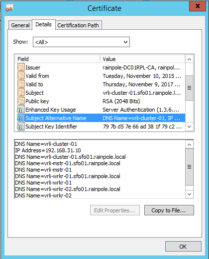

1.  Import the certificate in your Web browser.

> For example, in Google Chrome under the **HTTPS/TLS** settings click the **Manage certificates** button, and in the **Certificates** dialog box import vrli-chain.pem. You can also use Certificate Manager on Windows or Keychain Access on MAC OS X. 

Configure Log Retention and Archiving in Region B
-------------------------------------------------

In vRealize Log Insight in Region B, configure log retention for one week and archiving on storage sized for 90 days according to the vRealize Log Insight Design document.

**Prerequisites**

-   Create an NFS share of 1 TB in Region and export it as /V2D\_vRLI\_MgmtB\_1TB.

-   The NFS server must support NFS v3.

-   The NFS partition must allow reading and writing operations for guest accounts. 

-   Verify that the mount does not require authentication.

-   Verify that the NFS share is directly accessible to vRealize Log Insight

-   If using a Windows NFS server, allow unmapped user Unix access (by UID/GID).

**Procedure**

1.  In a Web browser, open the vRealize Log Insight UI.

    1.  Go to **https://vrli-cluster-51.lax01.rainpole.local**

    2.  Use the **admin** user name and ***vrli\_admin\_password*** password to log in.

2.  In the vRealize Log Insight UI, click the configuration drop-down menu icon  and select **Administration**.

3.  Configure retention threshold notification.

> Log Insight continually estimates how long data can be retained with the currently available pool of storage. If the estimation drops below the retention threshold of one week, Log Insight immediately notifies the administrator that the amount of searchable log data is likely to drop.

1.  Under **Configuration**, click **General**.

2.  On the **General Configuration** page, under the **Alerts** section select the **Send a notification when capacity drops below** check box next to the **Retention Notification Threshold** settings, and enter a 1-week period in the text box underneath.

3.  Click **Save**.

> <embed src="media/image413.png" width="428" height="266" />

1.  Configure data archiving.

    1.  Under **Configuration**, click **Archiving**.

    2.  Select the **Enable Data Archiving** check box.

> 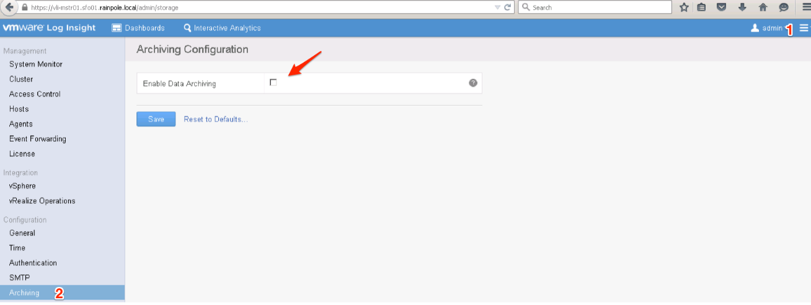 
>  

1.  In the **Archive Location** text box, enter the path in the form of nfs://nfs-server-address/V2D\_vRLI\_MgmtB\_1TB to an NFS partition where logs will be archived.

> <embed src="media/image415.png" width="554" height="193" />

1.  Click **Test** next to the **Archive Location** text box to verify that the share is accessible.

2.  Click **Save**.

 

Connect vRealize Log Insight to vRealize Operations Manager in Region B
-----------------------------------------------------------------------

Install and configure vRealize Log Insight Content Pack for vRealize Operations Manager in Region B for troubleshooting vRealize Operations Manager by using dashboards and alerts in the vRealize Log Insight UI.

-   Install the vRealize Log Insight Content Pack for vRealize Operations Manager in Region B

-   Configure the Log Insight Agent on vRealize Operations Manager to Forward Log Events to vRealize Log Insight in Region B

    1.  ### Install the vRealize Log Insight Content Pack for vRealize Operations Manager in Region B

Install the content pack for vRealize Operations Manager to add the dashboards for viewing log information in vRealize Log Insight.

Procedure

1.  In a Web browser, open the vRealize Log Insight UI.

    1.  Go to **https://vrli-cluster-51.lax01.rainpole.local**

    2.  Use the **admin** user and the ***vrli\_admin\_password** *password to log in.

2.  In the vRealize Log Insight UI, click the configuration drop-down menu icon <embed src="media/image390.png" width="27" height="23" />  and select **Content Packs**.

3.  Under **Content Pack Marketplace**, select **Marketplace**.

4.  In the list of content packs, locate the **VMware - vR Ops 6.x **content pack and click its icon.

> <embed src="media/image416.png" width="436" height="302" />

1.  In the **Install Content Pack** dialog box, click **Install**.

> <embed src="media/image417.png" width="285" height="302" />
>
> After the installation is complete, the **VMware - vR Ops 6.x** content pack appears in the **Installed Content Packs** list on the left.
>
> <embed src="media/image418.png" width="589" height="206" />

### Configure the Log Insight Agent on vRealize Operations Manager to Forward Log Events to vRealize Log Insight in Region B

After you install the content pack for vRealize Operations Manager, configure the Log Insight agent on the remote collector nodes of vRealize Operations Manager in Region B to send audit logs and system events to vRealize Log Insight. 

1.  On your computer, create a liagent.ini file for each of the 2 remote collector nodes of vRealize Operations Manager in Region B. 

    1.  Create an empty **liagent.ini** file and paste the following template configuration. 

> ; Client-side configuration of VMware Log Insight Agent
> ; See liagent-effective.ini for the actual configuration used by VMware Log Insight Agent
>
>  
>
> \[server\]
> ; Log Insight server hostname or ip address
> ; If omitted the default value is LOGINSIGHT
> hostname=&lt;YOUR LOGINSIGHT HOSTNAME HERE&gt;
>
>  
>
> ; Set protocol to use:
> ; cfapi - Log Insight REST API
> ; syslog - Syslog protocol
> ; If omitted the default value is cfapi
> ;
> ;proto=cfapi
>
>  
>
> ; Log Insight server port to connect to. If omitted the default value is:
> ; for syslog: 512
> ; for cfapi without ssl: 9000
> ; for cfapi with ssl: 9543
> ;port=9000
>
>  
>
> ;ssl - enable/disable SSL. Applies to cfapi protocol only.
> ; Possible values are yes or no. If omitted the default value is no.
> ;ssl=no
>
>  
>
> ; Time in minutes to force reconnection to the server
> ; If omitted the default value is 30
> ;reconnect=30
>
>  
>
> \[storage\]
> ;max\_disk\_buffer - max disk usage limit (data + logs) in MB:
> ; 100 - 2000 MB, default 200
> ;max\_disk\_buffer=200
>
>  
>
> \[logging\]
> ;debug\_level - the level of debug messages to enable:
> ; 0 - no debug messages
> ; 1 - trace essential debug messages
> ; 2 - verbose debug messages (will have negative impact on performace)
> ;debug\_level=0
>
>  
>
> \[filelog|messages\]
> directory=/var/log
> include=messages;messages.?
>
>  
>
> \[filelog|syslog\]
> directory=/var/log
> include=syslog;syslog.?
>
>  \[filelog|COLLECTOR-collector\]
> tags = {"vmw\_vr\_ops\_appname":"vROps", "vmw\_vr\_ops\_logtype":"COLLECTOR","vmw\_vr\_ops\_clustername":"&lt;YOUR CLUSTER NAME HERE&gt;", "vmw\_vr\_ops\_clusterrole":"Master","vmw\_vr\_ops\_nodename":"&lt;YOUR NODE NAME HERE&gt;", "vmw\_vr\_ops\_hostname":"&lt;YOUR VROPS HOSTNAME HERE&gt;"}
> directory = /data/vcops/log
> include = collector.log\*
> exclude\_fields=hostname
> event\_marker=^\\d{4}-\\d{2}-\\d{2}\[\\s\]\\d{2}:\\d{2}:\\d{2}\\,\\d{3}
>
>  
>
> \[filelog|COLLECTOR-collector\_wrapper\]
> tags = {"vmw\_vr\_ops\_appname":"vROps", "vmw\_vr\_ops\_logtype":"COLLECTOR","vmw\_vr\_ops\_clustername":"&lt;YOUR CLUSTER NAME HERE&gt;", "vmw\_vr\_ops\_clusterrole":"Master","vmw\_vr\_ops\_nodename":"&lt;YOUR NODE NAME HERE&gt;", "vmw\_vr\_ops\_hostname":"&lt;YOUR VROPS HOSTNAME HERE&gt;"}
> directory = /data/vcops/log
> include = collector-wrapper.log\*
> exclude\_fields=hostname
> event\_marker=^\\d{4}-\\d{2}-\\d{2}\[\\s\]\\d{2}:\\d{2}:\\d{2}\\.\\d{3}
>
>  
>
> \[filelog|COLLECTOR-collector\_gc\]
> directory = /data/vcops/log
> tags = {"vmw\_vr\_ops\_appname":"vROps", "vmw\_vr\_ops\_logtype":"COLLECTOR","vmw\_vr\_ops\_clustername":"&lt;YOUR CLUSTER NAME HERE&gt;", "vmw\_vr\_ops\_clusterrole":"Master","vmw\_vr\_ops\_nodename":"&lt;YOUR NODE NAME HERE&gt;", "vmw\_vr\_ops\_hostname":"&lt;YOUR VROPS HOSTNAME HERE&gt;"}
> include = collector-gc\*.log\*
> exclude\_fields=hostname
> event\_marker=^\\d{4}-\\d{2}-\\d{2}\[\\w\]\\d{2}:\\d{2}:\\d{2}\\.\\d{3}
>
>   
>
> \[filelog|CALL\_STACK-call\_stack\]
>
> tags = {"vmw\_vr\_ops\_appname":"vROps","vmw\_vr\_ops\_logtype":"CALL\_STACK", "vmw\_vr\_ops\_clustername":"&lt;YOUR CLUSTER NAME HERE&gt;","vmw\_vr\_ops\_clusterrole":"Master", "vmw\_vr\_ops\_nodename":"&lt;YOUR NODE NAME HERE&gt;","vmw\_vr\_ops\_hostname":"&lt;YOUR VROPS HOSTNAME HERE&gt;"}
> directory = /data/vcops/log/callstack
> include = collector\*.txt
> exclude\_fields=hostname

1.  In the node-specific liagent.ini file, change the following parameters and save the file.

| Parameter                 | Description                                                                                | Location in liagent.ini                   | Configuration Instructions                                                                   |
|---------------------------|--------------------------------------------------------------------------------------------|-------------------------------------------|----------------------------------------------------------------------------------------------|
| Hostname                  | IP address or FQDN of the Log Insight VIP                                                  | \[server\] section                        | Replace &lt;YOUR LOGINSIGHT HOSTNAME HERE&gt;** **with vrli-cluster-51.lax01.rainpole.local. |
| Proto                     | Protocol that the agent uses to send events to the Log Insight server.                     | \[server\] section                        | Remove the ; comment in front of the parameter to set the log protocol to cfapi.             |
| Port                      | Communication port that the agent uses to send events to the vRealize Log Insight server.  | \[server\] section                        | Remove the ; comment in front of the parameter to set the port to 9000.                      |
| vmw\_vr\_ops\_clustername | Name of the vRealize Operations Manager cluster                                            | each  \[filelog|*section\_name*\] section | Replace each &lt;YOUR CLUSTER NAME HERE&gt;** **with **vrops-cluster-01**.                   |
| vmw\_vr\_ops\_clusterrole | Role of the vRealize Operations Manager node                                               | each  \[filelog|*section\_name*\] section | Set to Remote Collector.                                                                     |
| vmw\_vr\_ops\_hostname    | IP address or FQDN of the vRealize Operations Manager node                                 | each  \[filelog|*section\_name*\] section | Replace each &lt;YOUR VROPS HOSTNAME NAME HERE&gt;** **with the following FQDN:              
                                                                                                                                                                      vrops-rmtcol-51.lax01.rainpole.local for remote collector 1                                   
                                                                                                                                                                      vrops-rmtcol-52.lax01.rainpole.local for remote collector 2                                   |
| vmw\_vr\_ops\_nodename    | Name of the vRealize Operations Manager node that is set during node initial configuration | each  \[filelog|*section\_name*\] section | Replace each &lt;YOUR NODE NAME HERE&gt;** **with the following name:                        
                                                                                                                                                                      vrops-rmtcol-51 for remote collector 1                                                        
                                                                                                                                                                      vrops-rmtcol-52 for remote collector 2                                                        |

You change the \[server\] section as follows.

\[server\]
; Log Insight server hostname or ip address
; If omitted the default value is LOGINSIGHT
hostname=**vrli-cluster-51.lax01.rainpole.local**

; Set protocol to use:
; cfapi - Log Insight REST API
; syslog - Syslog protocol
; If omitted the default value is cfapi
;
proto=cfapi

; Log Insight server port to connect to. If omitted the default value is:
; for syslog: 512
; for cfapi without ssl: 9000
; for cfapi with ssl: 9543
port=9000

;ssl - enable/disable SSL. Applies to cfapi protocol only.
; Possible values are yes or no. If omitted the default value is no.
;ssl=no

; Time in minutes to force reconnection to the server
; If omitted the default value is 30
;reconnect=30
For example, on the remote collector node vrops-rmtcol-51 you change the \[filelog|ANALYTICS-analytics\] section that is related to the logs files of the analytics module as follows.

\[filelog|ANALYTICS-analytics\]
tags = {"vmw\_vr\_ops\_appname":"vROps", "vmw\_vr\_ops\_logtype":"COLLECTOR","vmw\_vr\_ops\_clustername":"**vrops-cluster-51**", "vmw\_vr\_ops\_clusterrole":"Remote Collector","vmw\_vr\_ops\_nodename":"vrops-rmtcol-51", "vmw\_vr\_ops\_hostname":"vrops-rmtcol-51.lax01.rainpole.local"}
directory = /data/vcops/log
include = analytics\*.log\*
exclude\_fields=hostname

1.  Enable SSH on each node of vRealize Operations Manager.

    1.  In a Web browser, go to ***https://mgmt01vc51.lax01.rainpole.local/vsphere-clien**t*

    2.  Use the **administrator@vsphere.local** user name and the ***vsphere\_admin\_password*** password to log in.
        Under the **mgmt01vc51.lax51.rainpole.local**  vCenter Server, navigate to the virtual appliance for the node.

| Virtual Appliance Name | Role               |
|------------------------|--------------------|
| vrops-rmtcol-51        | Remote collector 1 |
| vrops-rmtcol-52        | Remote collector 2 |

1.  Right-click the appliance node and select **Open Console** to open the remote console to the appliance.

2.  Press **ALT+F1** to switch to the command prompt.

3.  Log in by using the root user name and an empty password, and change the default empty password.
    You must change the default password of the root user because you log in for the first time to the virtual appliance console.  

4.  Start the SSH service by running the command:

> service sshd start

1.  Close the virtual appliance console.

<!-- -->

1.  Apply the Log Insight agent configuration. 

    1.  On the appliance, replace the **liagent.ini** file in the **/var/lib/loginsight-agent** folder with the node-specific file on your computer. You can use scp, FileZilla or WinSCP.  

    2.  Restart the Log Insight agent on node by running the following console command as the root user.

> /etc/init.d/liagentd restart

1.  Stop the SSH service on the virtual appliance by running the following command. 

> service sshd stop

1.  Repeat the steps for the second remote collector node.

> You see log information about the operation of the remote collectors of vRealize Operations Manager in Region B on the **VMware - vR Ops 6.x** Log Insight dashboards.

<embed src="media/image419.png" width="624" height="270" />

 

Connect vRealize Log Insight to the NSX Instances in Region B
-------------------------------------------------------------

Install and configure the vRealize Log Insight Content Pack for NSX for vSphere for log visualization and alerting of the NSX for vSphere real-time operation in Region B. You can use the NSX-vSphere dashboards to monitor logs about installation and configuration, and about virtual networking services.

-   Install the vRealize Log Insight Content Pack for NSX for vSphere in Region B

-   Configure NSX Managers to Forward Log Events to vRealize Log Insight in Region B

-   Configure the NSX Controllers to Forward Events to vRealize Log Insight in Region B

-   Configure the NSX Edge Instances to Forward Log Events to vRealize Log Insight in Region B

    1.  ### Install the vRealize Log Insight Content Pack for NSX for vSphere in Region B

Install the content pack for NSX for vSphere to add the dashboards for viewing log information in vRealize Log Insight in Region B.

Procedure

1.  In a Web browser, open the vRealize Log Insight UI.

    1.  Go to **https://vrli-cluster-51.lax01.rainpole.local**

    2.  Use the **admin** user and the ***vrli\_admin\_password*** password to log in.

2.  In the vRealize Log Insight UI, click the configuration drop-down menu icon <embed src="media/image390.png" width="27" height="23" /> and select **Content Packs**.

3.  Under **Content Pack Marketplace**, select **Marketplace**.

4.  In the list of content packs, locate the **VMware - NSX-vSphere** content pack and click its icon.

> <embed src="media/image416.png" width="436" height="302" />

1.  In the **Install Content Pack** dialog box, click **Install**.

> <embed src="media/image420.png" width="354" height="377" />

After the installation is complete, the **VMware - NSX-vSphere** content pack appears in the **Installed Content Packs** list on the left.

<embed src="media/image421.png" width="624" height="184" />

### Configure NSX Managers to Forward Log Events to vRealize Log Insight in Region B

Configure the NSX Manager for the management cluster and the NSX Manager for the compute and edge clusters to send audit logs and system events to vRealize Log Insight in Region B. 

Procedure

1.  In a Web browser, open the NSX Manager appliance UI.

    1.  Go to the following URL. 

| NSX Manager                                       | URL                                           |
|---------------------------------------------------|-----------------------------------------------|
| **NSX Manager for the management cluster**        | **https://mgmt01nsxm51.lax01.rainpole.local** |
| **NSX Manager for the compute and edge clusters** | **https://comp01nsxm51.lax01.rainpole.local** |

1.  Use the **admin** user name and ***nsx\_manager\_admin\_password*** password to log in.

<!-- -->

1.  On the main page of the appliance UI, click **Manage Appliance Settings**.

> <embed src="media/image422.png" width="624" height="188" />

1.  Under **Settings**, click **General**, and in the **Syslog Server** pane, click **Edit**.

2.  In the **Syslog Server** dialog box, configure vRealize Log Insight as a syslog server by specifying the following settings and click **OK**.

| Syslog Server Setting | Value                                |
|-----------------------|--------------------------------------|
| **Syslog Server**     | vrli-cluster-51.lax01.rainpole.local |
| **Port**              | 514                                  |
| **Protocol**          | UDP                                  |

> <embed src="media/image423.png" width="376" height="157" />

### Configure the NSX Controllers to Forward Events to vRealize Log Insight in Region B

Configure the NSX Controller instances for the management, compute and edge clusters to forward log information to vRealize Log Insight in Region B by using the NSX REST API. You can use a REST client, such as the RESTClient add-on for Firefox, to enable log forwarding.

Prerequisite**s**

On a Windows host that has access to your data center, install a REST client, such as the RESTClient add-on for Firefox.

**Procedure**

1.  Log in to the Windows host that has access to your data center.

2.  In a Firefox browser, go to **chrome://restclient/content/restclient.html**

3.  Specify the request headers for requests to the NSX Manager. 

    1.  From the **Authentication** drop-down menu, select **Basic Authentication**. 

> <embed src="media/image424.png" width="137" height="152" />

1.  In the **Basic Authorization** dialog box, enter the following credentials, select **Remember me** and click **Okay**.

| Authentication Attribute | Value                                                                           |
|--------------------------|---------------------------------------------------------------------------------|
| Username                 | Admin                                                                           |
| Password                 | *mngnsx\_admin\_password* for the NSX Manager for the management cluster*       
                            compnsx\_admin\_password *for the NSX Manager for the compute and edge clusters  |

> <embed src="media/image425.png" width="454" height="220" />

The Authorization:Basic XXX header appears in the **Headers** pane.

1.  From the **Headers** drop-down menu, select **Custom Header**. 

> <embed src="media/image426.png" width="215" height="142" />

1.  In the **Request Header** dialog box, enter the following header details and click **Okay**.

| Request Header Attribute | Value           |
|--------------------------|-----------------|
| **Name**                 | Content-Type    |
| **Value**                | application/xml |

> <embed src="media/image427.png" width="461" height="222" />
>
> The Content-Type:application/xml header appears in the Headers pane.
>
> <embed src="media/image428.png" width="437" height="100" />

1.  Contact the NSX Manager to retrieve the IDs of the associated NSX Controllers.  

    1.  In the **Request** pane, from the **Method** drop-down menu, select **GET.**

    2.  In the **URL** text box, enter the following URL, and click **Send**. The RESTClient sends a query to the NSX Manager about the installed NSX controllers.

| NSX Manager                                       | URL                                                              |
|---------------------------------------------------|------------------------------------------------------------------|
| **NSX Manager for the management cluster**        | https://mgmt01nsxm51.lax01.rainpole.local/api/2.0/vdn/controller |
| **NSX Manager for the compute and edge clusters** | https://comp01nsxm51.lax01.rainpole.local/api/2.0/vdn/controller |

1.  After the NSX Manager sends a response back, click the **Response Body (Preview) ** tab under **Response**.

> The response body contains a root &lt;controllers&gt; XML element which groups the details about the three controllers that form the controller cluster. 

1.  Within the &lt;controllers&gt; element, locate the &lt;controller&gt; element for each controller and write down the content of the id element.
    Controller IDs have the controller-*id* format where *id* represents the sequence number of the controller in the cluster, for example, controller-2.  

2.  Repeat the steps for the other NSX Manager.

> <embed src="media/image429.png" width="413" height="245" />

1.  For each NSX Controller, send a request to configure vRealize Log Insight as a remote syslog server.

    1.  In the **Request** pane, from the **Method** drop-down menu, select **POST**, and in the **URL** text box, enter the following URL.

| NSX Manager                                       | NSX Controller in the Controller Cluster | POST URL                                                                               |
|---------------------------------------------------|------------------------------------------|----------------------------------------------------------------------------------------|
| **NSX Manager for the management cluster**        | NSX Controller 1                         | <https://mgmt01nsxm51.lax01.rainpole.local/api/2.0/vdn/controller/controller-1/syslog> |
|                                                   | NSX Controller 2                         | <https://mgmt01nsxm51.lax01.rainpole.local/api/2.0/vdn/controller/controller-2/syslog> |
|                                                   | NSX Controller 3                         | <https://mgmt01nsxm51.lax01.rainpole.local/api/2.0/vdn/controller/controller-3/syslog> |
| **NSX Manager for the compute and edge clusters** | NSX Controller 1                         | <https://comp01nsxm51.lax01.rainpole.local/api/2.0/vdn/controller/controller-1/syslog> |
|                                                   | NSX Controller 2                         | <https://comp01nsxm51.lax01.rainpole.local/api/2.0/vdn/controller/controller-2/syslog> |
|                                                   | NSX Controller 3                         | <https://comp01nsxm51.lax01.rainpole.local/api/2.0/vdn/controller/controller-3/syslog> |

1.  In the **Request** pane, paste the following request body in the **Body** text box and click **Send**.

> &lt;controllerSyslogServer&gt;
>    &lt;syslogServer&gt;vrli-cluster-51.lax01.rainpole.local&lt;/syslogServer&gt;
>    &lt;port&gt;514&lt;/port&gt;
>    &lt;protocol&gt;UDP&lt;/protocol&gt;
>    &lt;level&gt;INFO&lt;/level&gt;
> &lt;/controllerSyslogServer&gt; 

1.  Repeat the steps for the next NSX Controller.

> <embed src="media/image430.png" width="536" height="182" />

1.  Verify the syslog configuration on each NSX Controller. 

    1.  In the **Request** pane, from the **Method** drop-down menu, select **GET**, and in the **URL** text box, enter the controller-specific syslog URL from Step 5.

    2.  After the NSX Manager sends a response back, click the **Response Body (Preview) ** tab under **Response**.
         The response body contains a root &lt;controllerSyslogServer&gt; element which represents the settings for the remote syslog server on the NSX Controller.

    3.  Verify that the value of the &lt;syslogServer&gt; element is vrli-cluster-51.lax01.rainpole.local. 

    4.  Repeat the steps for the next NSX Controller.

> <embed src="media/image431.png" width="422" height="253" />

### Configure the NSX Edge Instances to Forward Log Events to vRealize Log Insight in Region B

Configure the NSX Edge service gateways for vRealize Operations Manager, vRealize Log Insight and vRealize Automation to forward log information to vRealize Log Insight in Region B.

1.  In a Web browser, open the vSphere Web Client.

    1.  Go to **https://mgmt01vc51.lax01.rainpole.local**

    2.  Use the **administrator@vsphere.local** user name and ***vsphere\_administrator\_password*** password to log in.

2.  From the **Home** menu, select Networking & Security.

3.  From the **Net**working & Security menu on the left, click **NSX Edges**.

4.  On the **NSX Edges** page, select the **172.17.11.65** NSX Manager instance from the **NSX Manager** drop-down menu. The edge devices in the scope of the NSX Manager appear.

> <embed src="media/image432.png" width="564" height="112" />

1.  Configure the log forwarding on each edge service gateway.

    1.  Double-click the edge device to open its user interface.

| NSX Edge Service Gateway | Application Traffic                                |
|--------------------------|----------------------------------------------------|
| vRA01-Edge               | vRealize Automation                                

                            vRealize Orchestrator                               |
| vRA01IAS-Edge            | vSphere proxy agents for vRealize Automation       |
| vRLI01-Edge              | vRealize Log Insight nodes                         |
| vROps01-Edge             | vRealize Operations Manager analytics nodes        |
| vROps01RC-Edge           | vRealize Operations Manager remote collector nodes |

1.  On the NSX edge device page, click the **Manage** tab and click **Configuration**.

2.  In the **Details **panel, click **Change **next to **Syslog servers**.

> <embed src="media/image433.png" width="539" height="274" />

1.  In the **Edit Syslog Servers Configuration** dialog box, in the **Syslog Server 1** text box enter **192.168.32.10** and from the **Protocol** drop-down menu, select udp.

>  <embed src="media/image434.png" width="254" height="146" />

1.  Click **OK**.

2.  Repeat the steps for the next NSX edge device.

The vRealize Log Insight user interface in Region B starts showing log data in the **NSX-vSphere-Overview** dashboard available under the **VMware - NSX-vSphere** group of content pack dashboards. 

<embed src="media/image435.png" width="624" height="197" />

 

Connect vRealize Log Insight to vRealize Automation in Region B
---------------------------------------------------------------

Connect the vRealize Log to vRealize Automation to receive log information from the components of vRealize Automation in Region B in the vRealize Log Insight UI. 

-   Install the vRealize Log Insight Content Pack for vRealize Automation in Region B

-   Configure the Windows Components of vRealize Automation to Forward Log Events to vRealize Log Insight in Region B

    1.  ### Install the vRealize Log Insight Content Pack for vRealize Automation in Region B

Install the content pack for vRealize Automation to add the dashboards for viewing log information in vRealize Log Insight in Region B.

Procedure

1.  In a Web browser, open the vRealize Log Insight UI.

    1.  Go to **https://vrli-cluster-51.lax01.rainpole.local**

    2.  Use the **admin** user and the ***vrli\_admin\_password** *password to log in.

2.  In the vRealize Log Insight UI, click the configuration drop-down menu icon <embed src="media/image390.png" width="28" height="24" /> and select **Content** Packs.

3.  Under **Content Pack Marketplace**, select **Marketplace**.

4.  In the list of content packs, locate the **VMware - vRA 6.1 +** content pack and click its icon.

> <embed src="media/image416.png" width="436" height="302" />

1.  In the **Install Content Pack** dialog box, click **Install**.

> <embed src="media/image436.png" width="284" height="302" />
>
> After the installation is complete, the **VMware - vRA 6.1 +** content pack appears in the **Installed Content Packs** list on the left.
>
> <embed src="media/image437.png" width="223" height="406" />

### Configure the Windows Components of vRealize Automation to Forward Log Events to vRealize Log Insight in Region B

Install the vRealize Log Insight agent to collect and forward events to vRealize Log Insight in Region B on the Windows virtual machines for the vSphere proxy agents. 

1.  Log in to the Windows virtual machine of the vRealize Automation component.

    1.  Connect to the following host address, or in the vSphere Web Client, navigate to the VM that has the following name and select **Actions** &gt; **Open Console** to open a remote console.

| vRealize Automation Component | Host Name/VM Name |
|-------------------------------|-------------------|
| **vSphere Proxy Agent**       | vra01ias51        |
| **vSphere Proxy Agent**       | vra01ias52        |

1.  Use the **administrator** user name and the ***win\_vm\_administrator\_password*** password to log in. 

<!-- -->

1.  In the Windows virtual machine, download the Windows agent for vRealize Log Insight.

    1.  In a Web browser, go to **https://vrli-cluster-51.lax01.rainpole.local**

    2.  Use the **admin** user name and the ***vrli\_admin\_password*** password to log in.

    3.  Click the configuration drop-down menu icon  and select **Administration**.

> <embed src="media/image438.png" width="197" height="208" />

1.  Under **Management**, click **Agents**.

2.  On the **Agents** page, click the **Download Log Insight Agent Version 3.0.0** link.

3.  In the **Download Log Insight Agent Version 3.0.0** dialog box, click **Windows MSI (32-bit/64-bit)** and save the .msi file on your computer.

> <embed src="media/image439.png" width="318" height="113" />

1.  Install the Log Insight agent on the virtual machine of the vRealize Automation Windows component.

    1.  Double-click the .msi file to run the installer.

    2.  In the **VMware vRealize Log Insight Agent Setup** wizard, accept the license agreement and click **Next**.

> <embed src="media/image440.png" width="333" height="264" />

1.  On the **Server Configuration** page, enter **vrli-cluster-51.lax01.rainpole.local** in the **Host** text box, and click **Install**.

> <embed src="media/image441.png" width="336" height="264" />

1.  After the installation is complete, click **Finish**.

<!-- -->

1.  After the installation, configure the Log Insight agent on the vRealize Automation Windows virtual machine.

    1.  Go to the %ProgramData%\\VMware\\Log Insight Agent folder and open the liagnet.ini file in an editor application.

    2.  Add the following lines at the end of the liagent.ini file and save the file.

> ;;;vRA Windows configuration
>
> \[filelog|vra-agent-Agent-vSphere-03\]
> directory=C:\\Program Files (x86)\\VMware\\vCAC\\Agents\\LAX-Agent-vSphere-01\\logs\\
> event\_marker=^\\\[\\d{1,2}/\\d{1,2}/\\d{4} \\d{1,2}:\\d{1,2}:\\d{1,2}
> tags={"vmw\_product":"vra","vmw\_product\_component":"agent"}
>
> \[filelog|vra-agent-Agent-vSphere-04\]
> directory=C:\\Program Files (x86)\\VMware\\vCAC\\Agents\\LAX-Agent-vSphere-02\\logs\\
> event\_marker=^\\\[\\d{1,2}/\\d{1,2}/\\d{4} \\d{1,2}:\\d{1,2}:\\d{1,2}
> tags={"vmw\_product":"vra","vmw\_product\_component":"agent"}

Configure Event Forwarding Between Region A and Region B
--------------------------------------------------------

According to this design, vRealize Log Insight will not be failed over to the recovery region, Region B. Use log event forwarding in vRealize Log Insight to retain real-time logs in the protected region if one region becomes unavailable. See *Log Insight Architecture* and *vRealize Log Insight Design*.

-   Configure Event Forwarding in Region A

-   Configure Event Forwarding in Region B

-   Add a Log Filter in Region A

    1.  ### Configure Event Forwarding in Region A

You enable log forwarding from vRealize Log Insight in Region A to vRealize Log Insight in Region B to prevent from losing Region A related logs in the event of disaster.

Provide the following settings for log forwarding to vRealize Log Insight in Region B:

-   Target URL, protocol and tagging 

-   Disk cache - Disk cache represents the amount of local disk space to reserve for buffering events that you configure to be forwarded. Buffering is used when the remote destination is unavailable or unable to process the events being sent to it. If the local buffer becomes full and the remote destination is still unavailable, then the oldest local events are dropped and not forwarded to the remote destination even when the remote destination is back online.

Procedure 

1.  In a Web browser, open the vRealize Log Insight UI.

    1.  Go to **https://vrli-cluster-01.sfo01.rainpole.local**.

    2.  Use the **admin** user name and ***vrli\_admin\_password*** password to log in.

2.  In the vRealize Log Insight UI, click the configuration drop-down menu icon  and select **Administration**.

3.  Under **Management**, click **Event Forwarding**.

> 

1.  On the **Event Forwarding** page, click **New Destination** and enter the following forwarding settings in the **New Destination** dialog box. 

| Forwarding Destination Option | Value                                |
|-------------------------------|--------------------------------------|
| **Name**                      | SFO01 to LAX01                       |
| **Host**                      | vrli-cluster-51.lax01.rainpole.local |
| **Protocol**                  | Ingestion API                        |
| **Use SSL**                   | Deselected                           |
| **Tags**                      | tag='SFO01'                          |
| **Advanced Settings**         |
| **Port**                      | 9000                                 |
| **Disk Cache**                | 2000 MB                              |
| Worker **Count**              | 8                                    |

> 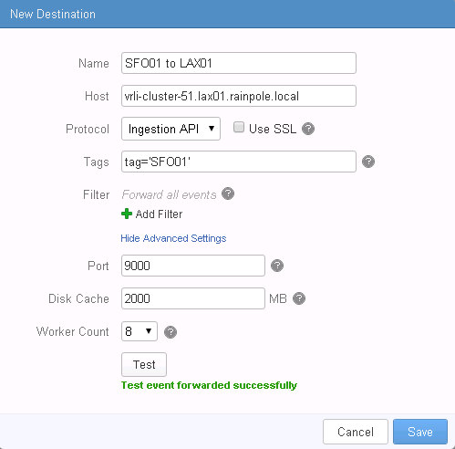

1.  In the New Destination dialog box, click Test to verify that the connection settings are correct.

2.  Click Save to save the forwarding new destination.

> The **Event Forwarding** page in the vRealize Log Insight UI shows a summary of the forwarded events.
>
> 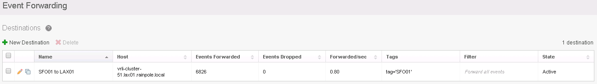

### Configure Event Forwarding in Region B

You enable log forwarding from vRealize Log Insight in Region B to vRealize Log Insight in Region A to prevent from losing Region B related logs in the event of disaster.

Provide the following settings for log forwarding to vRealize Log Insight in Region A:

-   Target URL, protocol and tagging 

-   Filtering - Add a filter to avoid forwarding log events back to the Log Insight deployment in Region A. Using a filter prevents from looping when the Log Insight deployments in Region A and Region B forward logs to each other.  

-   Disk cache - Disk cache represents the amount of local disk space to reserve for buffering events that you configure to be forwarded. Buffering is used when the remote destination is unavailable or unable to process the events being sent to it. If the local buffer becomes full and the remote destination is still unavailable, then the oldest local events are dropped and not forwarded to the remote destination even when the remote destination is back online.  

Procedure

1.  In a Web browser, open the vRealize Log Insight UI.

    1.  Go to **https://vrli-cluster-51.lax01.rainpole.local**

    2.  Use the **admin** user name and ***vrli\_admin\_password*** password to log in.

2.  In the vRealize Log Insight UI, click the configuration drop-down menu icon  and select **Administration**.

3.  Under **Management**, click **Event Forwarding**.

> 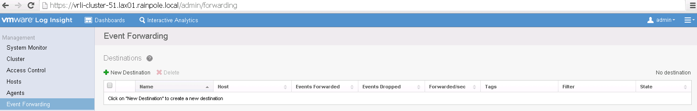

1.  On the **Event Forwarding** page, click **New Destination** and enter the following forwarding settings in the **New Destination** dialog box. 

| Forwarding Destination Option | Value                                |
|-------------------------------|--------------------------------------|
| **Name**                      | LAX01 to SFO01                       |
| **Host**                      | vrli-cluster-01.sfo01.rainpole.local |
| **Protocol**                  | Ingestion API                        |
| **Use SSL**                   | Deselected                           |
| **Tags**                      | tag='LAX01'                          |
| **Filter**                    |
| **Filter Type**               | tag                                  |
| **Operator**                  | matches                              |
| **Value**                     | \*SFO01\*                            |
| **Advanced Settings**         |
| **Port**                      | 9000                                 |
| **Disk Cache**                | 2000 MB                              |
| **Worker Count**              | 8                                    |

> 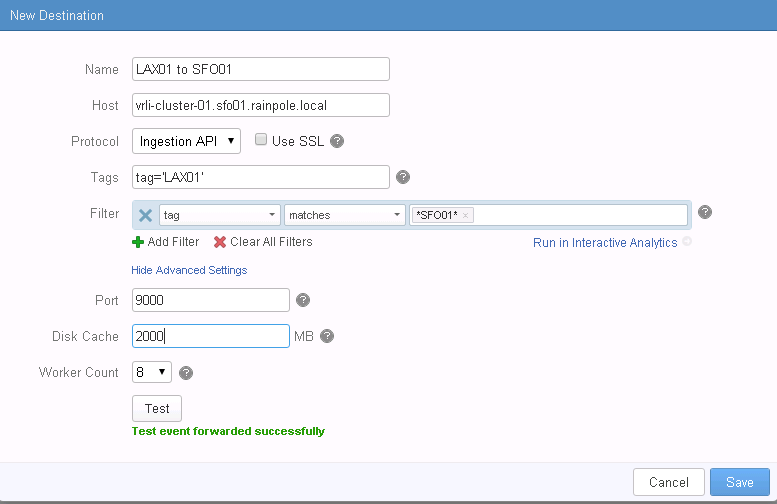

1.  In the **New Destination** dialog box, click **Test** to verify that the connection settings are correct.

2.  Click **Save** to save the forwarding new destination.

> The **Event Forwarding** page in the vRealize Log Insight UI shows a summary of the forwarded events.
>
> 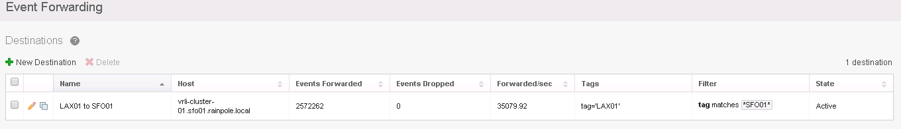

### Add a Log Filter in Region A

Add a filter to avoid forwarding Region B log events back to the Log Insight deployment in Region B. Using a filter prevents from looping when the Log Insight deployments in Region A and Region B forward logs to each other.

Procedure

1.  In a Web browser, open the vRealize Log Insight UI.

    1.  Go to **https://vrli-cluster-01.sfo01.rainpole.local**

    2.  Use the **admin** user name and ***vrli\_admin\_password*** password to log in.

2.  In the vRealize Log Insight UI, click the configuration drop-down menu icon  and select **Administration**.

3.  Under **Management**, click **Event Forwarding**.

4.  Add a filter to prevent from forwarding loops.

    1.  In the **Event Forwarding** page of the vRealize Log Insight UI, click the **Edit** icon of the **SFO01 to LAX01** destination.

    2.  In the **Edit Destination** dialog box, click **Add Filter** and enter the following filter attributes.

| Filter Attribute | Value     |
|------------------|-----------|
| **Filter Type**  | Tag       |
| **Operator**     | Matches   |
| **Value**        | \*LAX01\* |

> 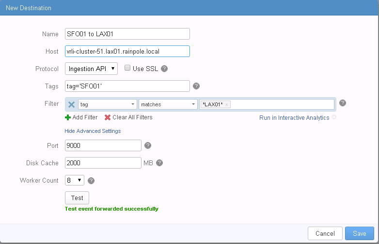

1.  Click **Save.**

> The **Event Forwarding** page in the vRealize Log Insight UI shows a summary of the forwarded events.
>
> 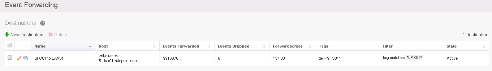

1.  Cloud Management Platform Implementation in Region B
    ====================================================

    1.  Create vSphere Image Customization Specifications (Region B)
        ------------------------------------------------------------

Customization specifications are XML files that contain guest operating system settings for virtual machines. You create customization specifications with the Guest Customization wizard, and manage specifications using the **Customization Specification Manager**.

vCenter Server saves the customized configuration parameters in the vCenter Server database. If the customization settings are saved, the administrator and domain administrator passwords are stored in encrypted format in the database. Because the certificate used to encrypt the passwords is unique to each vCenter Server system, reinstalling vCenter Server, or attaching a new instance of the server database, invalidates the encrypted passwords. The passwords must be re-entered before they can be used.

**Prerequisites**

The Management Cluster is deployed and configured. See "Deploy and Configure the Management Cluster Components (Region B)"

### Create a Customization Specification File for IaaS Proxy Agent Servers (Region B)

Create a vSphere Image Customization template to use with your vRealize Automation IaaS Proxy Agent deployment. The vSphere Image Customization template sysprep answer file stores a number of customization settings such as computer name, licensing information, and workgroup or domain settings. You can supply a custom sysprep answer file as an alternative to specifying many of the settings in the **Guest Customization** wizard.

1.  Log in to vCenter Server with the vSphere Web Client.

    1.  Open a Web browser and type** https://mgmt01vc51.lax01.rainpole.local/vsphere-client** into the Web browser address bar. 

    2.  Log in using the following credentials:

| Setting       | Value                       |
|---------------|-----------------------------|
| **User name** | administrator@vsphere.local |
| **Password**  | *vcenter\_admin\_password * |

1.  From the **vSphere Web Client Home** page, select **Customization Specification Manager**.

2.  Select **mgmt01vc51.lax01.rainpole.local** from the** vCenter Server **drop down menu.

3.  Click the **New **icon. The **Guest Customization **wizard displays.

> 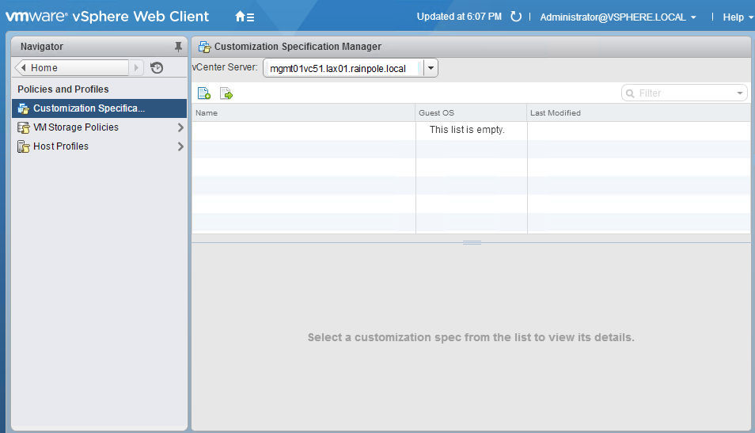

1.  In the **Specify Properties** page enter the following settings, and click **Next**.

| Setting                            | Values                               |
|------------------------------------|--------------------------------------|
| **Target VM Operating System**     | Windows                              |
| **Use custom SysPrep answer file** | Deselect check box (leave unchecked) |
| **Customization Spec Name**        | windows2012r2-vra-ias                |
| **Description**                    | Leave blank                          |

> 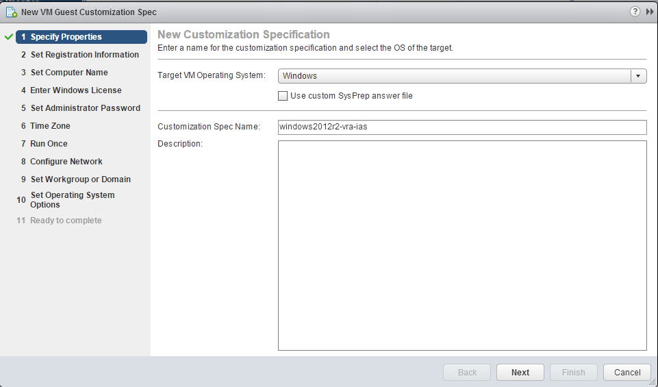

1.  In the **Set Registration Information** page, enter the following settings, and click **Next**.

| Setting          | Value       |
|------------------|-------------|
| **Name**         | Rainpole    |
| **Organization** | Rainpole IT |

> 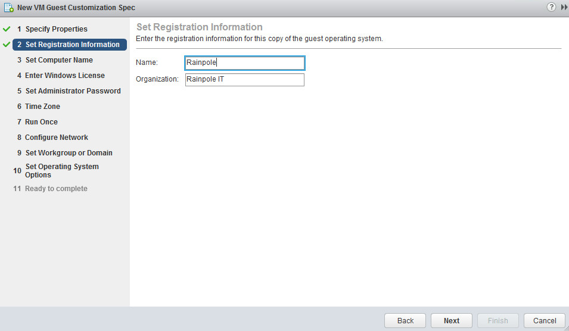

1.  In the **Set Computer Name** page, select the **Enter a name in the Clone/Deploy wizard** radio button, and click **Next**.

> 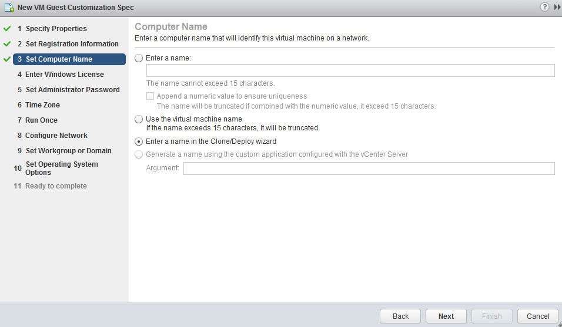

1.  In the **Enter Windows License** page, enter the following settings, and click **Next**.

| Options                                | Values                                                                                                                                             |
|----------------------------------------|----------------------------------------------------------------------------------------------------------------------------------------------------|
| **Product Key**                        | Type the volume license key. **Note**: If you are using Microsoft License Server, or have multiple single license keys, leave this text box blank. |
| **Include Server License Information** | Select the check box.                                                                                                                              |
| **Server License Mode**                | Select the **Per server **check box.                                                                                                               |
| **Max connections**                    | 5                                                                                                                                                  |

> 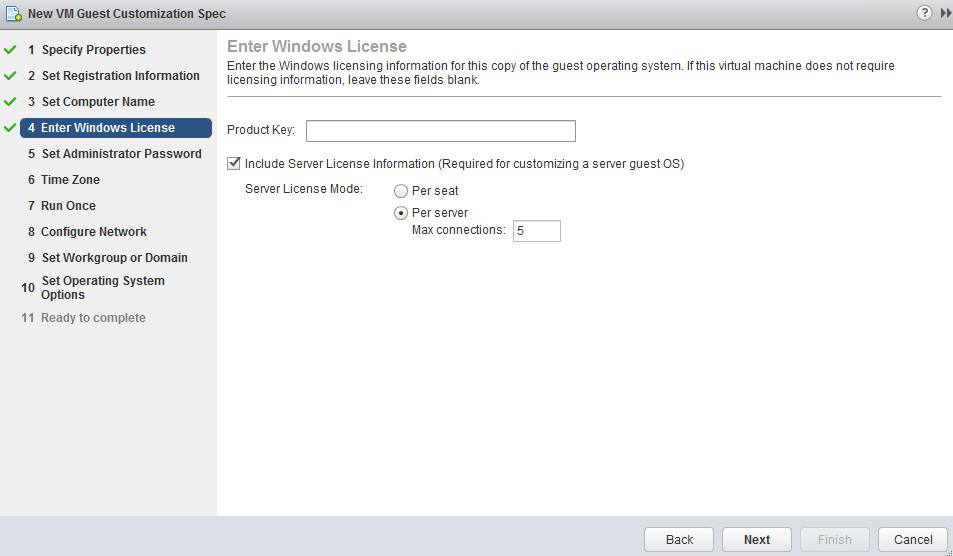

1.  In the **Set Administrator Password** page, enter the following settings, and click **Next**.

| Setting                                    | Value                                                                                            |
|--------------------------------------------|--------------------------------------------------------------------------------------------------|
| **Password**                               | Type a password for the administrator account and confirm the password by typing it again.       |
| **Automatically logon as Administrator**   | Select the check box. Enabling this logs users into the guest operating system as Administrator. |
| **Number of times to logon automatically** | 1                                                                                                |

> 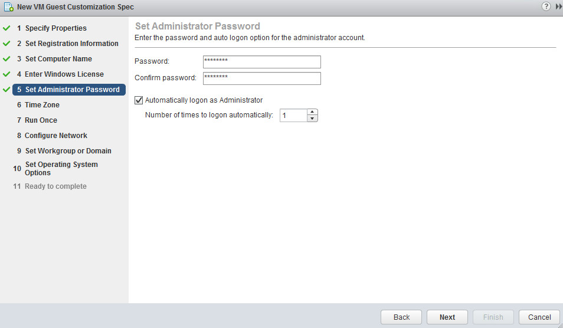

1.  In the** Time Zone **page,** **select **(GMT-08:00) Pacific Time (US & Canada) **from the **Time Zone** drop down menu, and click **Next**.

> 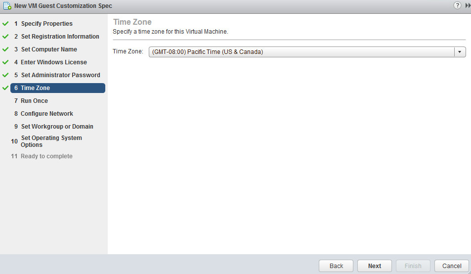

1.  On the** Run Once** page, do not specify any commands to run the first time a user logs into the guest operating system. Click **Next.**

> 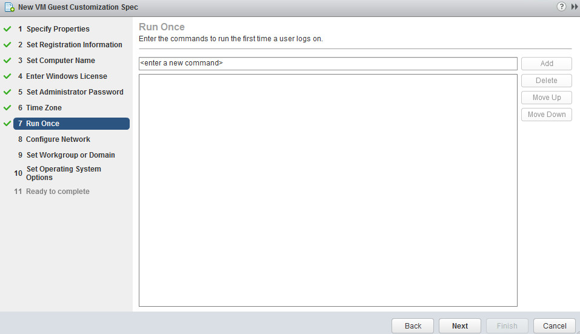

1.  On the **Configure Network** page, select the **Manually select custom settings** radio button, select **NIC1** from the list of network interfaces in the virtual machine, and click **Edit. 
    **The **Network Properties** dialog box displays.

> 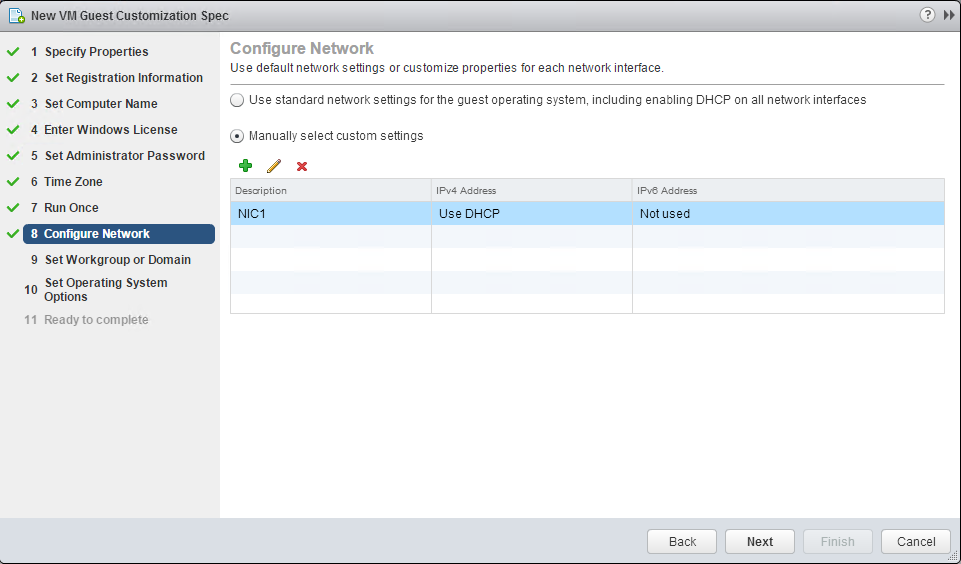

1.  In the **Network Properties** dialog box, select **IPv4**.

    1.  Select the Prompt the user for an address when the specification is used check box.

    2.  Type **255.255.255.0** in the **Subnet Mask** text box.

    3.  Type **192.168.13.1** in the **Default Gateway** text box.

> 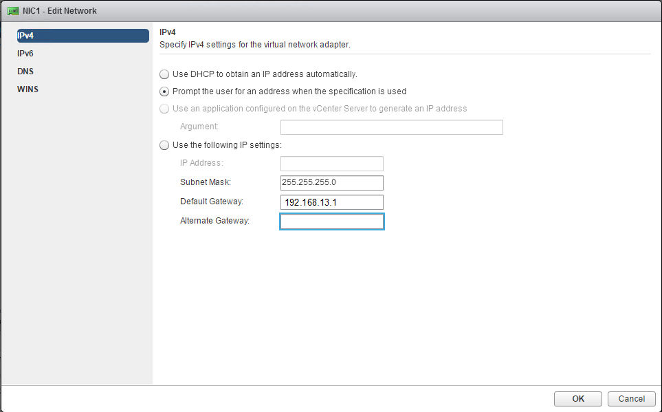

1.  Select **DNS**.

    1.  Select the **Use the following DNS server address **radio button.

    2.  Type **172.17.11.5** in the **Preferred DNS Server** text box.

    3.  Type **172.16.11.5** in the **Alternate DNS Server** text box.

    4.  Type **rainpole.local** in the **For all connections with TCP/IP enabled...** text box.

    5.  Click the **Add** button.

    6.  Click **OK** to confirm the network settings and close the **Network Properties** dialog box. 

> 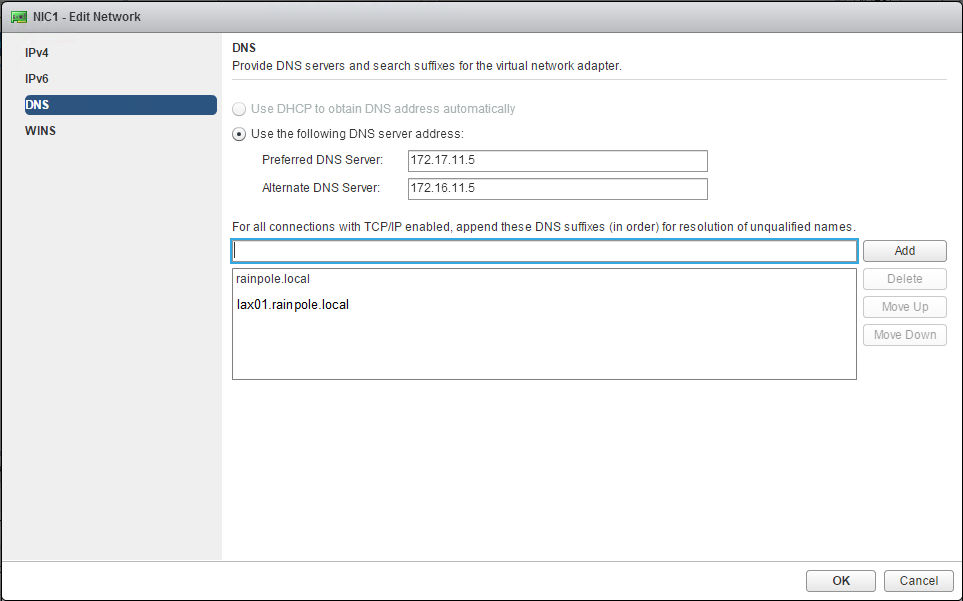

1.  Click **Next**.

2.  In the **Windows Server Domain** page, enter the following settings, and click **Next**.

| Setting                   | Value                  |
|---------------------------|------------------------|
| **Windows Server Domain** | lax01.rainpole.local   |
| **Username**              | LAX01\\ad\_admin\_acct |
| **Password**              | ad\_admin\_password    |

> 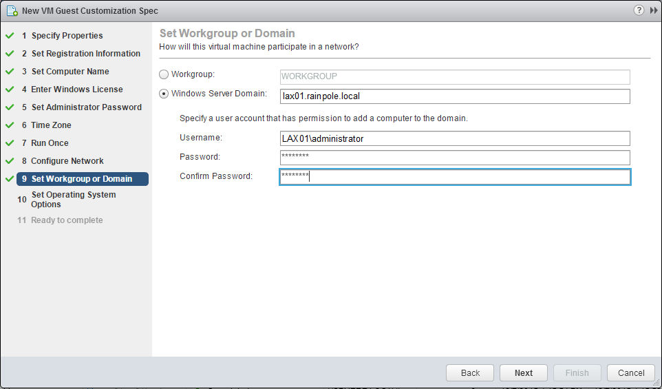

1.  In the **Set Operating System options** page, select the **Generate New Security ID (SID) **check box, and click **Next**.

> 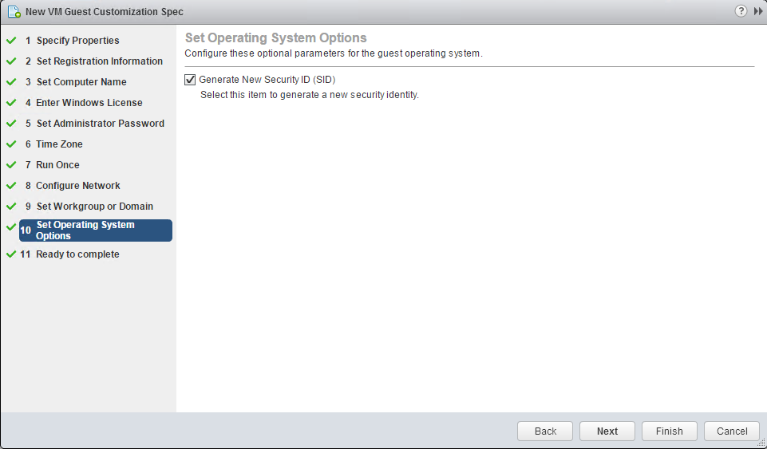

1.  In the **Ready to Complete** page, review the settings you entered to confirm their validity, and click **Finish**.

> 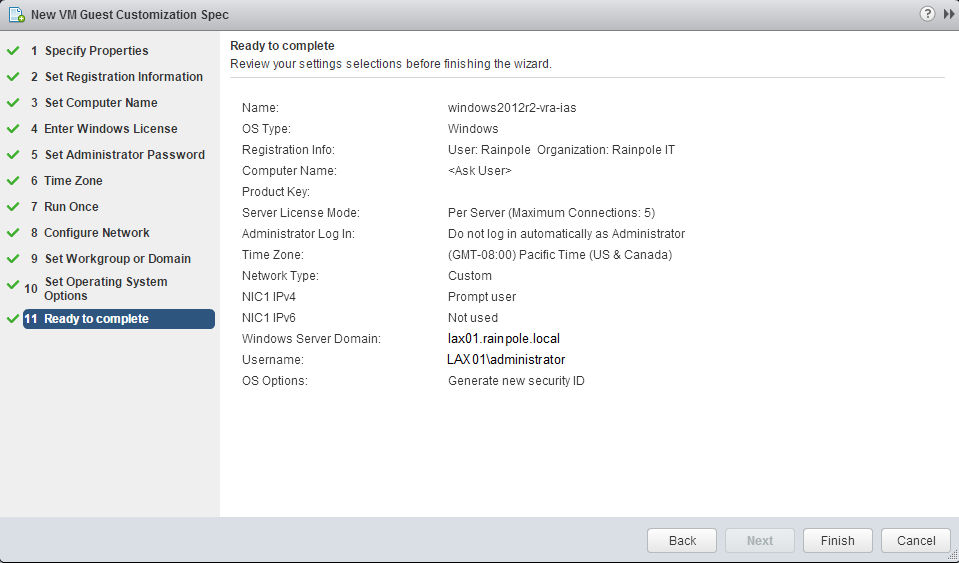

The customization specification you created is listed in the **Customization Specification Manager.** You can** **use the specification you created to customize virtual machine guest operating systems.

Configure Load Balancing for vRealize Automation and vRealize Orchestrator in Region B (Region B)
-------------------------------------------------------------------------------------------------

Configure the load balancer before deploying the vRealize Automation appliance. The load balancer provides virtual IP addresses that you later use during deployment. You configure load balancing for all services and components related to vRealize Automation and vRealize Orchestrator using the NSX Edge load balancer.

This design configures load balancing for the following appliances.

-   vRealize Automation Identity Appliance

-   vRealize Automation virtual appliances

-   vRealize Automation IaaS web servers

-   vRealize Automation IaaS managers

-   vRealize Orchestrator virtual appliances

Prerequisites

-   Verify that gateways for the virtual vRealize Automation network are configured. See "Deploy and Configure Gateway for the Management Networks (Region B)" in *Region B Virtual Infrastructure Implementation. * 

-   Install and configure all required vRealize Automation services.  Please refer to "Cloud Management Layer Elements" section in *vRealize Automation Design* document for vRealize Automation services details.

-   Make sure NSX Edges for the management application networks are deployed and working correctly.  Please refer to **Deploy NSX Edges for the Management Application Networks** under **Deploy and Configure Gateways for the Management Application Networks** for vRA's **Management Application Network Edges Configuration.**

-   Plan and assign the required network components as shown in the following table:

| Edge Interface         | Port group          | Number of IP addresses required | Secondary IP address                                       |
|------------------------|---------------------|---------------------------------|------------------------------------------------------------|
| **Internal**           | vRA-VXLAN           | 2                               | 192.168.11.43 (vRealize Orchestrator VIP)                  |
| **vSphere-Management** | vDS-Mgmt-Management | 1                               |                                                            |
| **Public**             | vDS-Mgmt-Ext-Mgmt   | 5                               | 10.158.150.53 (vRealize Automation Server VIP)             
                                                                                  10.158.150.54 (vRealize Automation IaaS Web Server VIP)     
                                                                                  10.158.150.55 (vRealize Automation IaaS Manager VIP)        
                                                                                  10.158.150.52 (vRealize Automation Identity Appliance VIP)  |

### Add Virtual IP Addresses to Edge Interfaces (Region B)

Add virtual IP addresses to the NSX Edge interfaces.

1.  Using the vSphere Web Client, log in to** **vCenter Server **mgmt01vc51.lax01.rainpole.local** as **administrator@vsphere.local**.

2.  Select **Networking & Security**.

3.  In the **Navigator**, select **NSX Edges**.

4.  From the **NSX Manager** drop-down menu, select **172.17.11.65** as the NSX Manager and double-click on **vRA01-Edge **to manage the network settings.

> 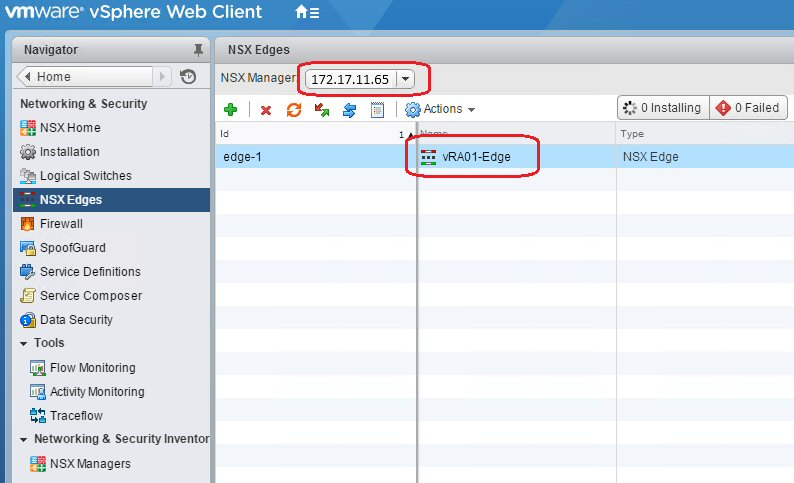

1.  Click the **Manage** tab and the **Settings** sub-tab and click **Interfaces**.

2.  Select the interface **Public** and click the edit icon.

> 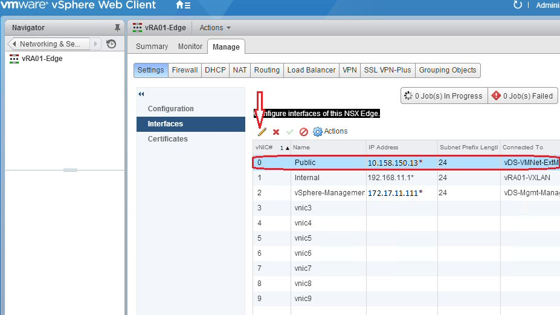

1.  In the **Edit NSX Edge Interface** dialog, add all 4 VIP addresses that are used for vRealize Automation load balancing in the **Secondary IP Addresses** text box.

2.  Change the **MTU** to **1500**.

3.  Click **OK** to save the configuration.

> 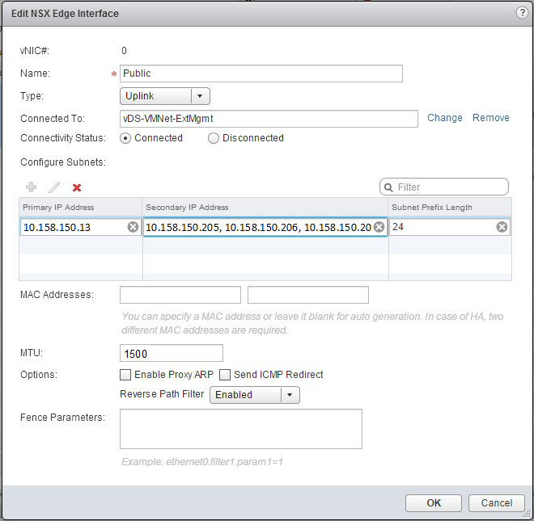

1.  In the **Edit NSX Edge Interface** dialog, select the interface **Internal **and click the edit icon.

2.  Add the vRealize Orchestrator virtual IP, **192.168.11.43**, and the vPostgres virtual IP, **192.168.11.41** in the **Secondary IP Addresses** text box.

3.  Click **OK** to save the configuration.

> 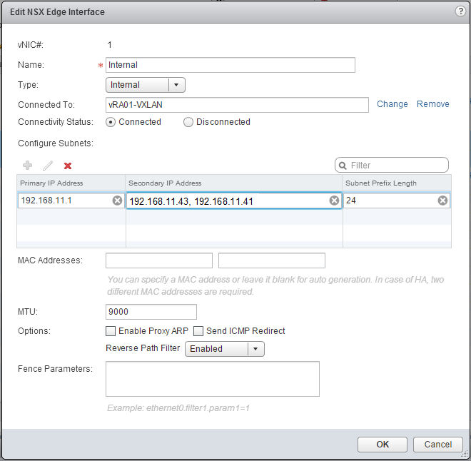

### Enable Load Balancer (Region B)

Once you add the necessary virtual IP addresses for the vRealize Automation services, you can enable the NSX Edge load balancer. The load balancer distributes traffic to internal servers.

1.  Using the vSphere Web Client, log in to** **vCenter Server** mgmt01vc51.lax01.rainpole.local** as **administrator@vsphere.local**.

2.  Click **Networking & Security.**

3.  In the** Navigator** on the left, click** NSX Edges**.

4.  From the **NSX Manager** drop-down menu, select **172.17.11.65** as the NSX Manager and double-click **vRA01-Edge **to manage the network settings.

> 

1.  Select the **Manage** tab and click the **Load Balancer** subtab.

2.  Select **Global Configuration** and click **Edit**.

3.  In the **Edit Load balancer global configuration** dialog box, check the **Enable Load Balancer** and **Enable Acceleration** check boxes and leave the defaults for everything else.

4.  Click **OK** to save the configuration.

> <embed src="media/image468.png" width="379" height="289" />

### Create Application Profiles (Region B)

Create an application profile to define the behavior of a particular type of network traffic. After configuring a profile, you associate the profile with a virtual server. The virtual server then processes traffic according to the values specified in the profile. Using profiles enhances your control over managing network traffic, and makes traffic-management tasks easier and more efficient.

1.  Using the vSphere Web Client, in to vCenter Server** mgmt01vc51.lax01.rainpole.local** as **administrator@vsphere.local**.

2.  Click **Networking & Security**.

3.  Click** NSX Edges** in the **Navigator** on the left.

4.  From the **NSX Manager** drop-down menu, select **172.17.11.65** as the NSX Manager and double-click **vRA01-Edge **to manage the network settings.

> 

1.  Select the **Manage** tab and click the **Load Balancer** subtab.

2.  Select **Application Profiles** and click the **Add** icon.

> <embed src="media/image469.png" width="482" height="302" />

1.  In the **New Profile** dialog, enter the following values (leave the defaults for everything else).

| Option                     | Value               |
|----------------------------|---------------------|
| **Name**                   | vRealize Automation |
| **Type**                   | HTTPS               |
| **Enable SSL Passthrough** | Checked             |
| **Persistence**            | Source IP           |
| **Expires in (Seconds)**   | 120                 |

> <embed src="media/image470.png" width="256" height="377" />

1.  Click **OK** to save the configuration

2.  Repeat the steps to create the following additional profiles. 

| Profile Name                     | Type  | Enable SSL | Persistence | Expires in (Seconds) |
|----------------------------------|-------|------------|-------------|----------------------|
| vRealize Automation vPostgres    | TCP   | n/a        | None        | n/a                  |
| vRealize Automation              | HTTPS | Enabled    | Source IP   | 120                  |
| vRealize Automation IaaS Web     | HTTPS | Enabled    | Source IP   | 120                  |
| vRealize Automation IaaS Manager | HTTPS | Enabled    | Source IP   | 120                  |
| vRealize Automation Orchestrator | HTTPS | Enabled    | Source IP   | 120                  |
| vRealize Automation Identity     | HTTPS | Enabled    | Source IP   | 120                  |

### Create Service Monitoring (Region B)

The service monitor defines health check parameters for the load balancer. Create a service monitor for each component.

1.  Using the vSphere Web Client, log in to vCenter Server** mgmt01vc51.lax01.rainpole.local** as **administrator@vsphere.local**.

2.  Click **Networking & Security**.

3.  In the** Navigator** on the left, click **NSX Edges**.

4.  From the **NSX Manager** drop-down menu, select **172.17.11.65** as the NSX Manager and double-click **vRA01-Edge **to manage the network settings.

> 

1.  Select the **Manage** tab and the **Load Balancer** subtab.

2.  Select **Service Monitoring** on the left and click the **Add** icon on the right.

> <embed src="media/image471.png" width="505" height="302" />

1.  In the **Edit Service Monitor** dialog, specify the following values for the service monitor. Use the default for any fields not listed in the table.

| Option          | Value                    |
|-----------------|--------------------------|
| **Name**        | vra-svr-443-monitor      |
| **Interval**    | 3 (seconds)              |
| **Timeout**     | 9 (seconds)              |
| **Max Retries** | 3                        |
| **Type**        | HTTPS                    |
| **Method**      | Get                      |
| **URL**         | /vcac/service/api/status |
| **Receive**     | REGISTERED               |

> 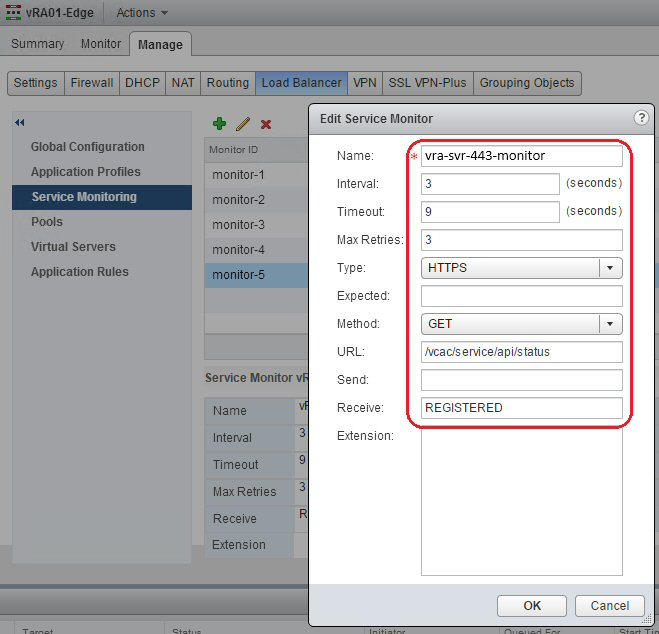

1.  Click **OK** to save the configuration.

2.  Repeat this procedure to create service monitors for the other components using the values in following table.

| Service Monitor Name       | Interval | Timeout | Max Retries | Type  | Method | URL                       | Receive                                  |
|----------------------------|----------|---------|-------------|-------|--------|---------------------------|------------------------------------------|
| vra-vpostgres-5432-monitor | 3        | 9       | 3           | TCP   |        |                           |                                          |
| vra-svr-443-monitor        | 3        | 9       | 3           | HTTPS | GET    | /vcac/services/api/status | REGISTERED                               |
| vra-iaas-web-443-monitor   | 3        | 9       | 3           | HTTPS | GET    |                           |                                          |
| vra-iaas-mgr-443-monitor   | 3        | 9       | 3           | HTTPS | GET    | /VMPS2                    | BasicHttpBinding\_VMPSProxyAgent\_policy |
| vra-vro-8281-monitor       | 3        | 9       | 3           | HTTPS | GET    | /vco/api/status           | REGISTERED                               |
| vra-identity-7444-monitor  | 3        | 9       | 3           | HTTPS | GET    | /websso/HealthStatus      | GREEN                                    |

### Create Server Pools (Region B)

A server pool consists of back-end server members. After you create a server pool, you associate a service monitor with the pool to manage and share the back-end server's flexibly and efficiently.

Procedure

1.  Using the vSphere Web Client, log in to vCenter Server** mgmt01vc51.lax01.rainpole.local** as **administrator@vsphere.local**.

2.  Click **Networking & Security. **

3.  In the** Navigator** pane, click** NSX Edges.**

4.  From the **NSX Manager** drop-down menu, select **172.17.11.65** as the NSX Manager and double-click **vRA01-Edge**.

> 

1.  Select the **Manage** tab, then click the **Load Balancer** button.

2.  Click **Pools** on the left, and click the **Add** icon on the right.

> <embed src="media/image473.png" width="462" height="302" />

1.  In the **New Pool** dialog, specify the following values for the server pool. Use the default for any fields not listed in the table.

| Option        | Value                 |
|---------------|-----------------------|
| **Name**      | vra-svr-443           |
| **Algorithm** | LEASTCONN             |
| **Monitors**  | default\_tcp\_monitor |

> <embed src="media/image474.png" width="482" height="377" />

1.  In the **New Pool** dialog box, click the **Add** icon to add the first pool member.

2.  In the **New Member** dialog box, specify the following values, and then click **OK**.

| Option                      | Value         |
|-----------------------------|---------------|
| **Enable Member**           | Checked       |
| **Name**                    | vra01svr01a   |
| **IP Address/VC Container** | 192.168.11.51 |
| **Port**                    | 443           |
| **Monitor Port**            | 443           |

> <embed src="media/image475.png" width="482" height="377" />

1.  Still in the **New Pool** dialog box, click the **Add** icon again to add the second pool member and specify the following values.

| Option                      | Description   |
|-----------------------------|---------------|
| **Enable Member**           | Checked       |
| **Name**                    | vra01svr01b   |
| **IP Address/VC Container** | 192.168.11.52 |
| **Port**                    | 443           |
| **Monitor Port**            | 443           |

> <embed src="media/image476.png" width="482" height="377" />

1.  Click **OK** to save the second pool member.

> <embed src="media/image477.png" width="479" height="377" />

1.  Click **OK** to save the vRealize Automation server pool.

2.  Repeat the steps to create additional server pools, as specified in the table below. The setup is designed as follows.

The configuration uses default\_tcp\_monitor as the health monitor for all the server pools, and switches to default\_tcp\_monitor during installation or power cycle of vRealize Automation. This is because before vRealize Automation is fully installed and started, the health monitor marks pool members as offline. These health monitors can only correctly indicate the status of pool members after the vRealize Automaton is fully installed and initialized. 

| Pool Name          | Algorithm  | Monitors              | Members       | Port        | Monitor Port  |
|--------------------|------------|-----------------------|---------------|-------------|---------------|
|                    |            |                       | Enable Member | Member Name | IP address    |
| vra-vpostgres-5432 | Roundrobin | default\_tcp\_monitor | Yes           | vra01svr01a | 192.168.11.51 |
|                    |            |                       | No            | vra01svr01b | 192.168.11.52 |
| vra-svr-443        | Leastconn  | default\_tcp\_monitor | Yes           | vra01svr01a | 192.168.11.51 |
|                    |            |                       | Yes           | vra01svr01b | 192.168.11.52 |
| vra-iaas-web-443   | Leastconn  | default\_tcp\_monitor | Yes           | vra01iws01a | 192.168.11.54 |
|                    |            |                       | Yes           | vra01iws01b | 192.168.11.55 |
| vra-iaas-mgr-443   | Leastconn  | default\_tcp\_monitor | Yes           | vra01ims01a | 192.168.11.57 |
|                    |            |                       | No            | vra01ims01b | 192.168.11.58 |
| vra-vro-8281       | Leastconn  | default\_tcp\_monitor

                                                          | Yes           | vra01vro01a | 192.168.11.44 |
|                    |            |                       | Yes           | vra01vro01b | 192.168.11.45 |
| vra-identity-7444  | Leastconn  | default\_tcp\_monitor | Yes           | vra01ids01a | 192.168.11.46 |

### Create Virtual Servers (Region B)

The NSX Load Balancer you configured in the previous procedure distributes network traffic across multiple servers. When a virtual server receives a request, it chooses the appropriate pool to send traffic to. Each pool consists of one or more members.

1.  Using the vSphere Web Client, log in to vCenter Server** mgmt01vc51.lax01.rainpole.local** as administrator@vsphere.local.

2.  Click on **Networking & Security. **

3.  In the** Navigator **panel, click **NSX Edges**.

4.  From the **NSX Manager** drop-down menu, select **172.17.11.65** as the NSX Manager, and double-click on **vRA01-Edge**.

> 

1.  Select the **Manage** tab, and click the **Load Balancer** button.

2.  Select **Virtual Servers** from the left-side panel and click the **Add** button.

> <embed src="media/image478.png" width="480" height="302" />

1.  In the **New Virtual Server** dialog, specify the following values. Leave the default values for any fields and check boxes not listed in the table below. Click **OK**.

| Option                    | Value                                                                        |
|---------------------------|------------------------------------------------------------------------------|
| **Enable Virtual server** | Checked                                                                      |
| **Application Profile**   | vRealize Automation                                                          |
| **Name**                  | vra-svr-443                                                                  |
| **IP Address**            | 10.158.150.53 (the vRealize Automation virtual appliance virtual IP address) |
| **Protocol**              | HTTPS                                                                        |
| **Port**                  | 443                                                                          |
| **Default Pool**          | vra-svr-443                                                                  |

> 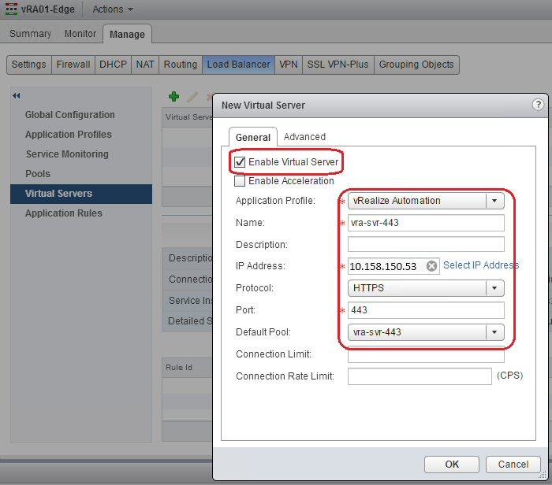

1.  Repeat this procedure to create additional virtual servers using the values in the following table.

| Virtual Server Name | Application Profile              | IP Address    | Protocol | Port | Default Pool       |
|---------------------|----------------------------------|---------------|----------|------|--------------------|
| vra-vpostgres-5432  | vRealize Automation vPostgres    | 192.168.11.1  | TCP      | 5432 | vra-vpostgres-5432 |
| vra-svr-443         | vRealize Automation              | 10.158.150.53 | HTTPS    | 443  | vra-svr-443        |
| vra-iaas-web-443    | vRealize Automation IaaS Web     | 10.158.150.54 | HTTPS    | 443  | vra-iaas-web-443   |
| vra-iaas-mgr-443    | vRealize Automation IaaS Manager | 10.158.150.55 | HTTPS    | 443  | vra-iaas-mgr-443   |
| vra-vro-8281        | vRealize Automation Orchestrator | 192.168.11.43 | HTTPS    | 8281 | vra-vro-8281       |
| vra-identity-7444   | vRealize Automation Identity     | 10.158.150.52 | HTTPS    | 7444 | vra-identity-7444  |

Configure a vRealize Automation Tenant (Region B)
-------------------------------------------------

Once you create the vRealize Automation tenant, you provide a license key and specify configuration settings to enable the tenant to function within your environment.

### Create Fabric Groups (Region B)

An IaaS administrator organizes virtualization compute resources and cloud endpoints into fabric groups by type and intent. One or more fabric administrators manage the resources in each fabric group. Fabric administrators are responsible for creating reservations on the compute resources in their groups to allocate fabric to specific business groups.  Fabric groups are created in a specific tenant, but their resources can be made available to users who belong to business groups in all tenants.

1.  Using a Web browser, open the **vRealize Automation management console** for the Rainpole tenant.

    1.  Type the URL **https://vra01svr01.rainpole.local/vcac/org/rainpole** in the Web browser address text box.   

    2.  Log in** **the IaaS administrator role for the Rainpole tenant** **with the username **ITAC-TenantAdmin@rainpole.local**. Use the *rainpole\_admin\_password *password.

<!-- -->

1.  If you are already logged into the console as another user, log out, and then log back in using the IaaS administrator credentials for the Rainpole tenant.   

<!-- -->

1.  Select to **Infrastructure** &gt; **Groups** &gt; **Fabric Groups**. 

2.  Click **New Fabric Group**.

3.  Create the Fabric Group for Region B.

    1.  Type **LAX Fabric Group** in the **Name **text box. 

    2.  Type** ug-ITAC-TenantAdmins@rainpole.local** in the **Fabric administrators** text box.

    3.  Click **OK**.

<!-- -->

1.  You have not yet configured a vCenter Endpoint. No compute resource is currently available for selection. You will configure this when you add a compute vCenter to vRealize Automation. 

> 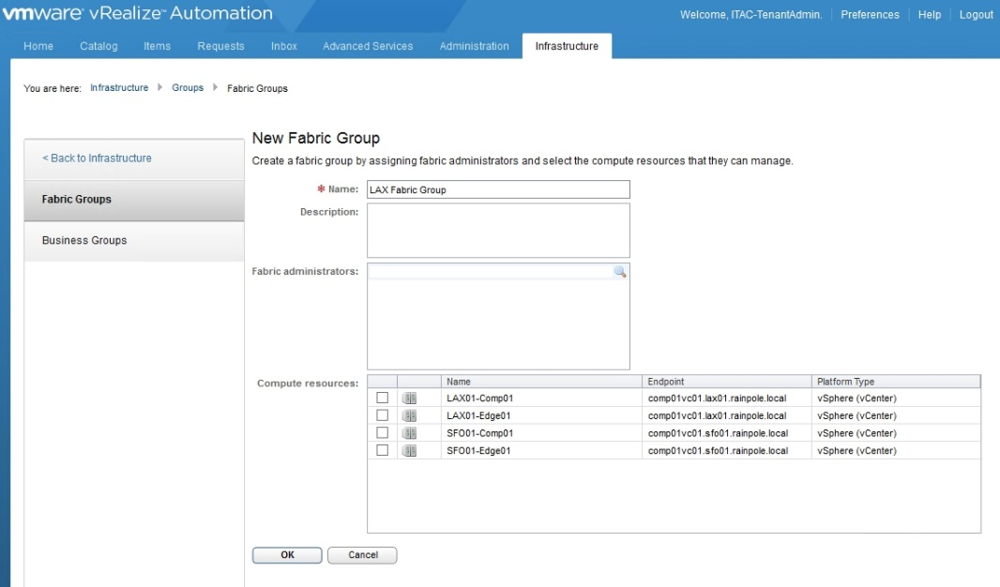

### Create Reservation Policies (Region B)

Use reservation policies to group similar reservations together. Create the reservation policy tag first, then add the policy to reservations to allow a tenant administrator or business group manager to use the reservation policy in a blueprint.

When you request a machine, it can be provisioned on any reservation of the appropriate type that has sufficient capacity for the machine. You can apply a reservation policy to a blueprint to restrict the machines provisioned from that blueprint to a subset of available reservations. A reservation policy is often used to collect resources into groups for different service levels, or to make a specific type of resource easily available for a particular purpose. You can add multiple reservations to a reservation policy, but a reservation can belong to only one policy. You can assign a single reservation policy to more than one blueprint. A blueprint can have only one reservation policy. A reservation policy can include reservations of different types, but only reservations that match the blueprint type are considered when selecting a reservation for a particular request.

1.  Using a Web browser, open the **vRealize Automation management console** for the Rainpole tenant.

    1.  Type the URL **https://vra01svr01.rainpole.local/vcac/org/rainpole** in the Web browser address text box.   

    2.  Log in** **the IaaS administrator role for the Rainpole tenant** **with the username **ITAC-TenantAdmin@rainpole.local**. Use the *rainpole\_admin\_password *password.

<!-- -->

1.  If you are already logged into the console as another user, log out, and then log back in using the IaaS administrator credentials for the Rainpole tenant.

<!-- -->

1.  Navigate to **Infrastructure** &gt; **Reservation** &gt; **Reservation Polices.**

2.  Create the** **Region-B-Production-Policy reservation policy.

    1.  Click **New Reservation Policy**.

    2.  Type **LAX-Production-Policy** in the **Name** text box.

    3.  Type **Reservation policy for Production Business Group in LAX** in the **Description** text box. 

    4.  Click the **Save** icon ().

3.  Create the Region-B-Development-Policy reservation policy.

    1.  Click **New Reservation Policy**.

    2.  Type **LAX-Development-Policy** in the **Name** text box.

    3.  Type **Reservation policy for Development Business Group in LAX** in the **Description** text box. 

    4.  Click the **Save** icon ().

4.  Create the Region-B-Edge-Policy reservation policy.

    1.  Click **New Reservation Policy**.

    2.  Type **LAX-Edge-Policy** in the **Name** text box.

    3.  Type **Reservation policy for Edge Cluster in LAX** in the **Description** text box. 

    4.  Click the **Save** icon ().

> 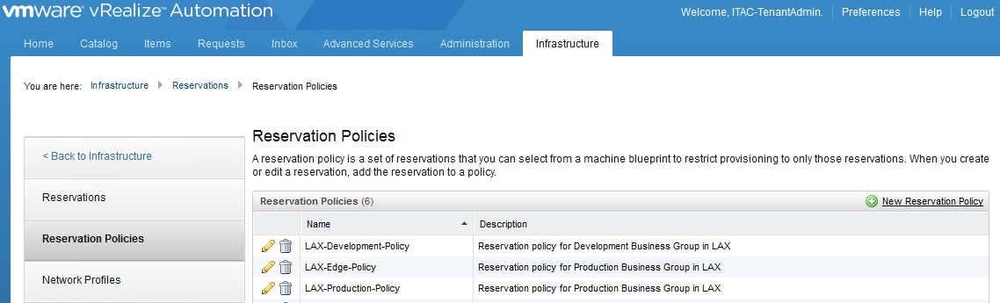

 

Prepare a Compute vCenter Server System for vRealize Automation (Region B)
--------------------------------------------------------------------------

Configure all vCenter Server compute clusters you intend add to vRealize Automaton.

**Prerequisites**

-   Verify that the OVF files for the virtual machine templates for the vRealize Automaton blueprints are ready and accessible.

-   Verify that a vCenter Server compute cluster has been deployed and configured. See "Deploy and Configure the Compute and Edge Clusters Components (Region B)"

-   Verify that an NSX instance has been configured for use by the vCenter Server compute cluster. See "Deploy and Configure the Compute and Edge Clusters NSX Instance (Region B)"

    1.  ### Create Logical Switches for Business Groups (Region B)

For each vCenter Server compute instance, create three logical switches to simulate networks for the Web, Database, and Application tiers.

1.  If you have not already done so, log in to the vCenter Server using the vSphere Web Client.

    1.  Open a Web browser and go to** https://comp01vc51.lax01.rainpole.local/vsphere-client**.

    2.  Log in using the following credentials.

| Setting       | Value                       |
|---------------|-----------------------------|
| **User name** | administrator@vsphere.local |
| **Password**  | *vcenter\_admin\_password*  |

1.  Create a logical switch.

    1.  Select **Networking & Security**.

    2.  In the **Navigator**, select **NSX Edges**.

    3.  From the **NSX Manager** drop-down menu, select **172.17.11.66** as the NSX Manager.

    4.  Click **Logical Switches**, and click the **New Logical Switch** icon.

    5.  In the **New Logical Switch **dialog box, enter the following settings, and click **OK**. 

| Setting                  | Value                                                    |
|--------------------------|----------------------------------------------------------|
| **Name**                 | Production-Web-VXLAN                                     |
| **Description**          | Logical switch for Web tier of Production Business Group |
| **Transport Zone:**      | Compute Transport Zone                                   |
| **Replication Mode:**    | Hybrid                                                   |
| **Enable IP Discovery:** | Checked                                                  |
| **Enable MAC Learning:** | Unchecked                                                |

> 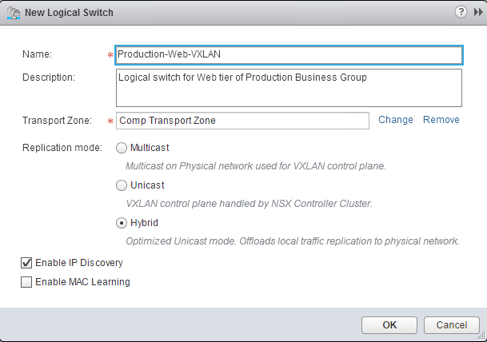

1.  Repeat the above steps to create the logical switches shown in the following table.

| Logical Switch Name   | Description                                                       |
|-----------------------|-------------------------------------------------------------------|
| Production-Web-VXLAN  | Logical switch for Web tier of Production Business Group          |
| Production-DB-VXLAN   | Logical switch for Database tier of Production Business Group     |
| Production-App-VXLAN  | Logical switch for Application tier of Production Business Group  |
| Development-Web-VXLAN | Logical switch for Web tier of Development Business Group         |
| Development-DB-VXLAN  | Logical switch for Database tier of Development Business Group    |
| Development-App-VXLAN | Logical switch for Application tier of Development Business Group |

### Configure a Content Library in the First Compute vCenter Server Instance (Region B)

You can create a content library and populate it with templates, which you can use to deploy virtual machines in your environment. Content libraries let you synchronize templates among different vCenter Servers so that all of the templates in your environment are consistent. While you only create one vCenter Server compute cluster in this design, additional compute PODs can also use the content library.

1.  You only need to create a content library for your first vCenter Server compute cluster. You can skip this section for any additional vCenter Servers compute clusters you add to the environment.

<!-- -->

1.  Log in to vCenter Server using the vSphere Web Client.

    1.  Open a Web browser and go to** https://comp01vc51.lax01.rainpole.local/vsphere-client**.

    2.  Use the following credentials to log in.

| Setting       | Value                       |
|---------------|-----------------------------|
| **User name** | administrator@vsphere.local |
| **Password**  | *vcenter\_admin\_password*  |

1.  Select** Home &gt; Content Libraries** and** **click **Create new content library.**

2.  In the **New Library** dialog box, create a new library with the following settings and click **Next**.

| Setting            | Value                           |
|--------------------|---------------------------------|
| **Name**           | LAX01-ContentLib01              |
| **vCenter Server** | comp01vc51.lax01.rainpole.local |

> 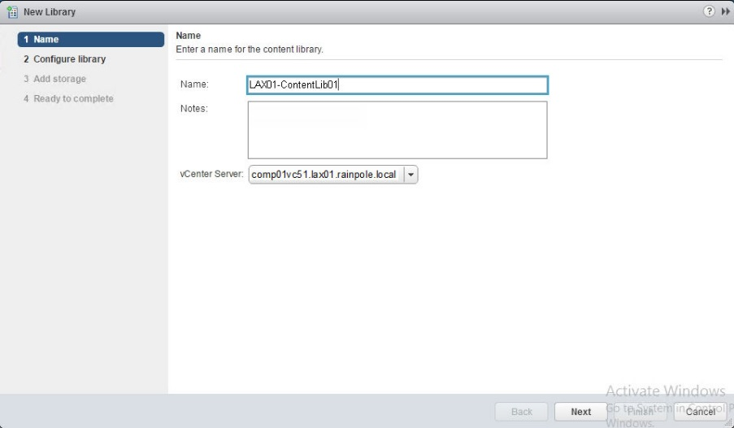

1.  In the **Configure library** dialog, configure the library, as follows, and then click **Next**.

    1.  Select **Local content library**. 

    2.  Select the **Publish content library externally** and **Enable authentication** check boxes.

    3.  Type a password in the **Password** and **Confirm password** text boxes to secure the content library. 

> 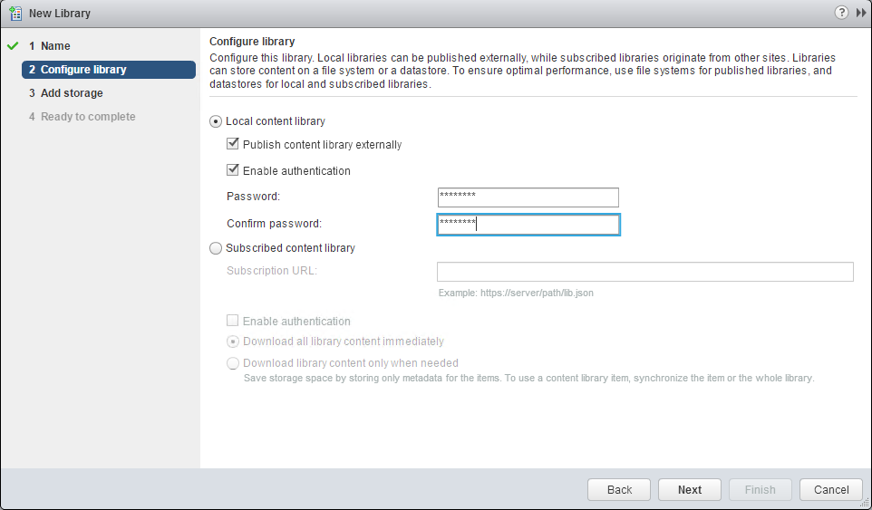

1.  Select datastore **LAXO1A-NFS01-VRALIB01** to store the content library, and click **Next**.

> 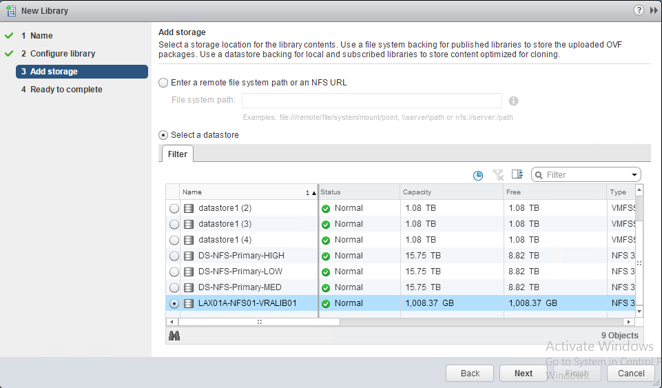

1.  After you create the library it appears in the content libraries inventory list.  

2.  Right-click the content library **LAX01-ContentLib01** and select **Edit Settings**.
    The** Edit Library** dialog box displays.

3.  Click **Copy Link** to save the **Subscription URL** for this content library. 
    You copy the **Subscription URL** so that additional vCenter Server instances can subscribe to this library.

> 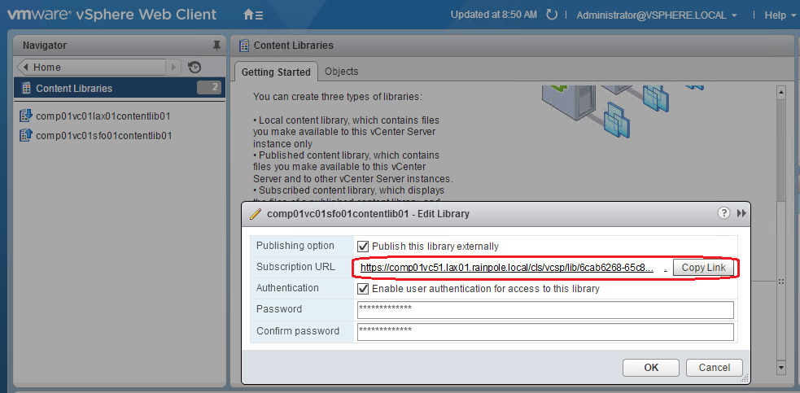

### Import the Virtual Machine Template OVF Files (Region B)

You add items to a content library by importing files from your local system. You can import an OVF package to use as a template for deploying virtual machines. You can also import other types of files, such as scripts, ISO files, and so on, that you want to use in your vCenter Server instance, or you want to share across multiple vCenter Server systems. In this instance, the virtual machine templates you add to the content library are used as vRealize Automation blueprints.

Repeat this procedure to import all virtual machine templates listed in the table below.  

Table 20. Virtual Machine Templates

| VM Template Name          | Guest OS                             | vCPU | vRAM(GB) | Hard Disk(GB) | SCSI Controller | vNIC    |
|---------------------------|--------------------------------------|------|----------|---------------|-----------------|---------|
| redhat6-enterprise-64     | Red Hat Enterprise Server 6 (64-bit) | 1    | 6        | 20            | LSI Logic SAS   | VMXNET3 |
| windows-2012r2-64         | Windows Server 2012 R2 (64-bit)      | 1    | 4        | 50            | LSI Logic SAS   | VMXNET3 |
| windows-2012r2-64-sql2012 | Windows Server 2012 R2 (64-bit)      | 1    | 8        | 100           | LSI Logic SAS   | VMXNET3 |

1.  Log in to the vCenter Server using the vSphere Web Client.

    1.  Open a Web browser and go to** https://comp01vc51.lax01.rainpole.local/vsphere-client**.

    2.  Use the following credentials to log in.

| Setting       | Value                       |
|---------------|-----------------------------|
| **User name** | administrator@vsphere.local |
| **Password**  | *vcenter\_admin\_password*  |

1.  Select** Home &gt; Content Libraries**, and then click the **Objects** tab.

2.  Right-click the content library **LAX01-ContentLib01** and select **Edit Settings**.
    The** Import Library Item** dialog box displays. 

3.  In the **Source** section, select the **Local file** check box and click **Browse **to navigate to the file that you want to import from your local system, and click **OK**.

4.  In the **Destination** section, type a name and description for the item, and click **OK**.

> 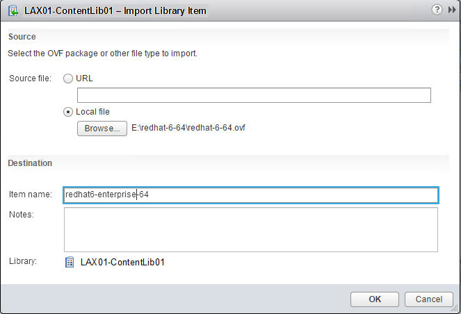

1.  When the upload completes verify that the template has successfully uploaded.
    In the **Recent Tasks** pane you see two tasks, one about creating a new item in the library, and the second about uploading the contents of the item to the library. After the task is complete, the item appears on the **Related Objects** tab under **Templates or ****Other Types**. 

2.  Repeat this procedure to import all virtual machine templates listed in the table below.

<!-- -->

1.  These templates will be referred to in other documents.

| VM Template Name          | Guest OS                             | vCPU | vRAM(GB) | Hard Disk(GB) | SCSI Controller | vNIC    |
|---------------------------|--------------------------------------|------|----------|---------------|-----------------|---------|
| redhat6-enterprise-64     | Red Hat Enterprise Server 6 (64-bit) | 1    | 6        | 20            | LSI Logic SAS   | VMXNET3 |
| windows-2012r2-64         | Windows Server 2012 R2 (64-bit)      | 1    | 4        | 50            | LSI Logic SAS   | VMXNET3 |
| windows-2012r2-64-sql2012 | Windows Server 2012 R2 (64-bit)      | 1    | 8        | 100           | LSI Logic SAS   | VMXNET3 |

### Subscribe Additional Compute vCenter Server Systems to the Content Library (Region B)

Subscribe any additional vCenter Server Compute clusters to the content library. Perform this procedure if you deploy two or more vCenter Server compute systems in the same region.

1.  Skip this procedure for the first vCenter Server compute system deployed in your environment.

<!-- -->

1.  Log in to the vCenter Server compute cluster using the vSphere Web Client.

    1.  Open a Web browser and go to **https://comp01vc51.lax01.rainpole.local/vsphere-client**.

    2.  Log in using the following credentials.

| Setting       | Value                       |
|---------------|-----------------------------|
| **User name** | administrator@vsphere.local |
| **Password**  | *vcenter\_admin\_password*  |

1.  Navigate to **Home** &gt; **vCenter Inventory Lists &gt; Content Libraries**.

2.  Select the **Objects** tab, and then click **Create new content library**.

3.  In the **New Content Library** dialog, create a new library with the following settings and click **Next**.

| Setting            | Value                           |
|--------------------|---------------------------------|
| **Name**           | LAX01-ContentLib01              |
| **vCenter Server** | comp01vc51.lax01.rainpole.local |

> 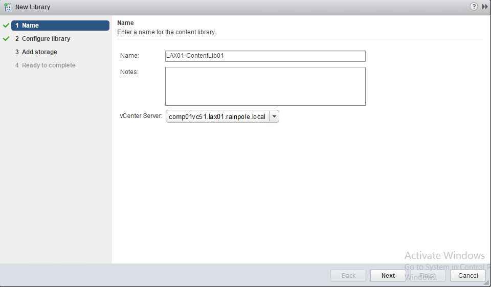

1.  In the **Configure content library** dialog, select **Subscribed content library** and follow these steps:

    1.  In the **Subscription URL** text box, copy and paste the content library of the first vCenter Server content library.

    2.  Check **Enable authentication**

    3.  Specify the password you used to create the content library for the first vCenter Server compute cluster. 

    4.  Click **Next**.

> 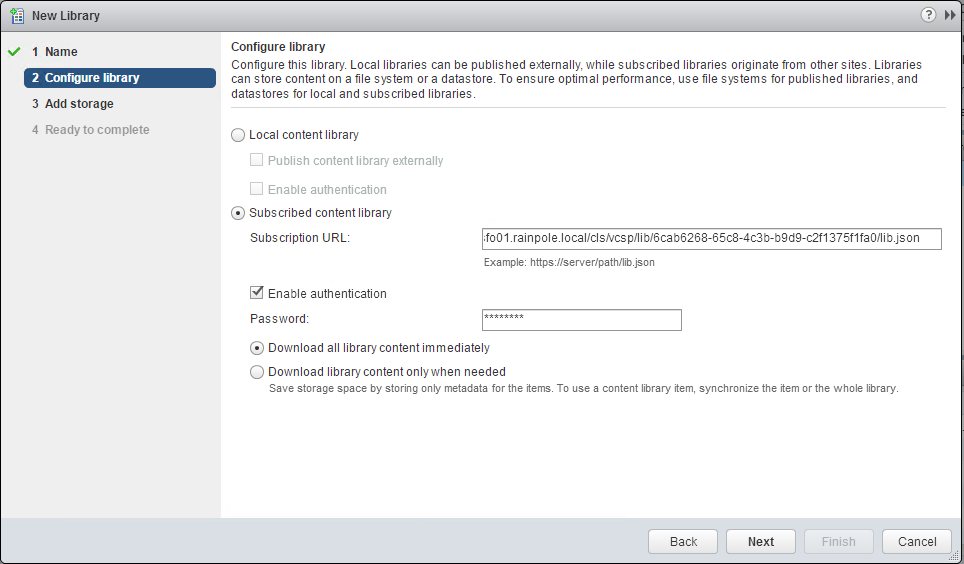

1.  In the **Add Storage** dialog box, select a datastore to act as storage for the contents of the library, click **Next**, and then click **Finish**.

> 

1.  Wait until the content library creation completes. The length of time this can take depends on the network bandwidth between vCenter Server instances, overall virtual machine template size, and datastore performance. It can take from minutes to hours for the content library synchronization to complete.

> 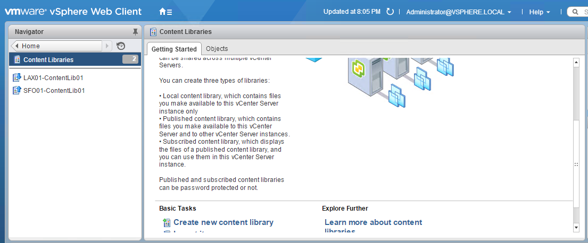

### Create Virtual Machines Using VM Templates in the Content Library (Region B)

vRealize Automation cannot directly access virtual machine templates in the content library. You must create a virtual machine using the virtual machine templates in the content library, then convert the template in vCenter Server. Perform this procedure on all vCenter Servers compute clusters you add to vRealize Automation, including the first vCenter Server compute instance.

Repeat this procedure for each of the VM Templates in the content library. The table below lists the VM Templates and the guest OS each template uses to create a virtual machine.

Table 11. Virtual Machine Templates

| VM Template Name          | Guest OS                             |
|---------------------------|--------------------------------------|
| redhat6-enterprise-64     | Red Hat Enterprise Server 6 (64-bit) |
| windows-2012r2-64         | Windows Server 2012 R2 (64-bit)      |
| windows-2012r2-64-sql2012 | Windows Server 2012 R2 (64-bit)      |

1.  Log in to the vCenter Server using the vSphere Web Client.

    1.  Open a Web browser and go to** https://comp01vc51.lax01.rainpole.local/vsphere-client**.

    2.  Log in using the following credentials.

| Setting       | Value                       |
|---------------|-----------------------------|
| **User name** | administrator@vsphere.local |
| **Password**  | *vcenter\_admin\_password*  |

1.  Navigate to **Home** &gt; **VMs and Templates**. 

2.  Expand the **comp01vc51.lax01.rainpole.local** vCenter Server.

3.  Right-click the **LAX01** data center object and select **New Folder** &gt; **New VM and Template Folder**. 

4.  Create a folder and label it **VM Templates**.

> 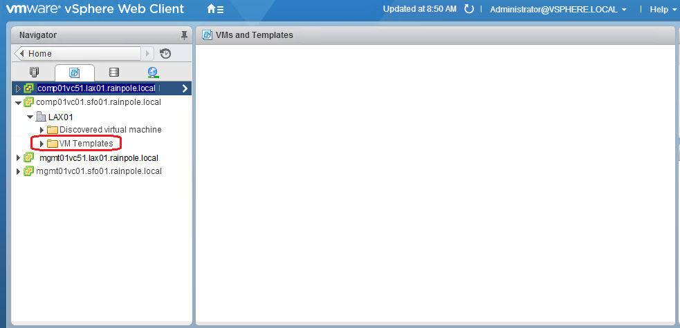

1.  Navigate to **Home &gt; Content Libraries**. 

2.  Click **LAX01-ContentLib01** &gt; **Templates**.

3.  Right-click the **VM Template** and select **New VM from This Template**.
    The **New Virtual Machine from Content Library** wizard opens.

> 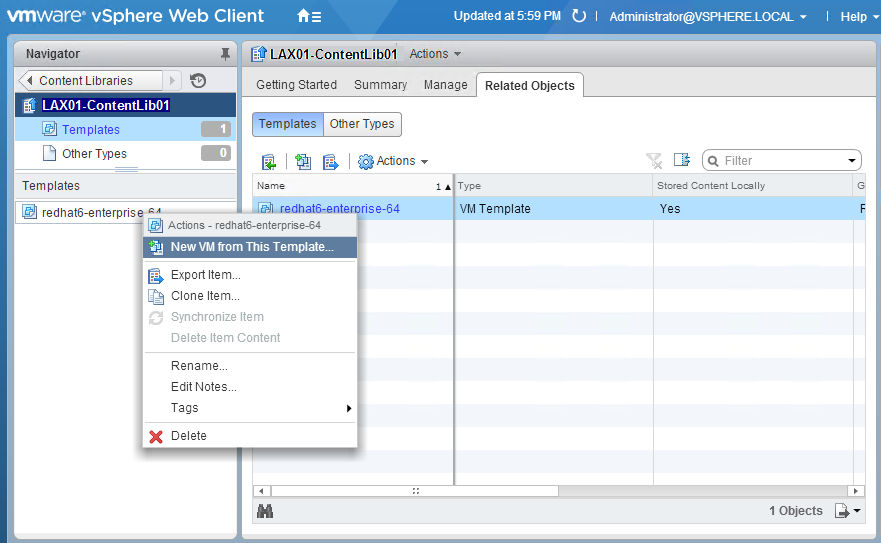

1.  In the **Select name and location** page, use the same template name.  

<!-- -->

1.  Use the same template name to create a common service catalog that works across different vCenter Server instances within your datacenter environment. 

<!-- -->

1.  Select **VM Templates** as the folder for this virtual machine, and click **Next**.

> 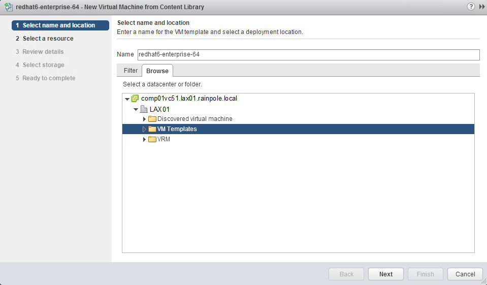

1.  In the **Select a resource** page, select the compute cluster you want to deploy the virtual machine to. Do not select an **Edge Cluster**.

2.  On the **Review** details page, verify the template details and click** Next**.

3.  In the **Select storage** page, select the **LAX01A-NFS01-VRALIB01** datastore and **Thin Provisioning** for the virtual disk format.

> 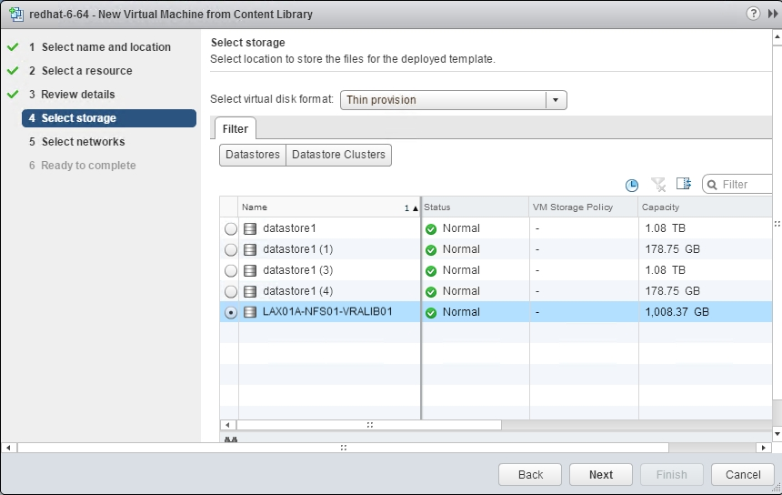

1.  In the **Select networks** dialog, select **VM Network** for the **Destination Network**, and click **Next**.
    **Note**: vRealize Automation will change the network according to the blueprint configuration.

2.  In the **Ready to complete** page, review the configurations you made for the virtual machine, and click **Finish**.
    A new task for creating the virtual machine appears in the **Recent Tasks** pane. After the task is complete, the new virtual machine is created. 

3.  Repeat this procedure for all of the VM Templates in the content library. The table below lists the VM Templates and the guest OS each template uses to create a virtual machine.

| VM Template Name          | Guest OS                             |
|---------------------------|--------------------------------------|
| redhat6-enterprise-64     | Red Hat Enterprise Server 6 (64-bit) |
| windows-2012r2-64         | Windows Server 2012 R2 (64-bit)      |
| windows-2012r2-64-sql2012 | Windows Server 2012 R2 (64-bit)      |

### Convert the Virtual Machine to a VM Template (Region B)

You can convert a virtual machine directly to a template instead of making a copy by cloning.

1.   Log in to the vCenter Server using the vSphere Web Client.

    1.  Open a Web browser and go to** https://comp01vc51.lax01.rainpole.local/vsphere-client.**

    2.  Log in using the following credentials.

| Setting       | Value                       |
|---------------|-----------------------------|
| **User name** | administrator@vsphere.local |
| **Password**  | *vcenter\_admin\_password*  |

1.  Navigate to **Home &gt; VMs and Templates**.

2.  In the **Navigator** pane, expand **comp01vc51.lax01.rainpole.local &gt; LAX &gt; VM Templates**.

3.  Right-click the **redhat6-enterprise-64** virtual machine located in the **VM Templates **folder, and select **Template &gt; Convert to Template**.

4.  Click **Yes** to confirm the template conversion. 

> 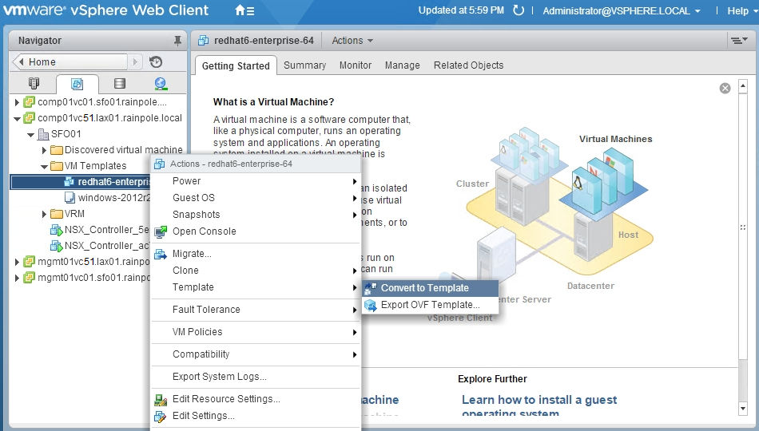

1.  Repeat the above steps for all of the VM Templates in the content library, verifying that each VM Template appears in the **VM Templates** folder.
    The table below lists the VM Templates and the guest OS each template uses to  create a virtual machine.

| VM Template Name          | Guest OS                             |
|---------------------------|--------------------------------------|
| redhat6-enterprise-64     | Red Hat Enterprise Server 6 (64-bit) |
| windows-2012r2-64         | Windows Server 2012 R2 (64-bit)      |
| windows-2012r2-64-sql2012 | Windows Server 2012 R2 (64-bit)      |

### Create Customization Specifications for Compute vCenter Server Systems (Region B)

Create two customization specifications, one for Linux and one for Windows, for use by the virtual machines you will deploy. Customization specifications are XML files that contain system configuration settings for the guest operating systems used by virtual machines. When you apply a specification to a guest operating system during virtual machine cloning or deployment, you prevent conflicts that might result if you deploy virtual machines with identical settings, such as duplicate computer names.

You will later use the customization specifications you create when you create blueprints for use with vRealize Automation.

#### Create a Customization Specification for Linux

1.  Log in to vCenter Server using the vSphere Web Client.

    1.  Open a Web browser and go to** https://comp01vc51.lax01.rainpole.local/vsphere-client**.

    2.  Log in using the following credentials.

| Setting       | Value                       |
|---------------|-----------------------------|
| **User name** | administrator@vsphere.local |
| **Password**  | *vcenter\_admin\_password*  |

1.  Navigate to **Home** &gt; **Policies and Profiles** &gt; **Customization Specification Manager**.

2.  Select the vCenter Server **comp01vc51.lax01.rainpole.local** from the drop-down menu.

3.  Click the **Create a new specification** icon and complete the **Guest Customization** wizard.

    1.  In the **Specify Properties** page, select **Linux **from the **Target VM Operating System** drop-down menu, and type the name **itac-linux-custom-spec** for the specification. Optionally, you can type a description for the specification. Click **Next**. 

    2.  In the **Set Computer Name** page, select **Use the virtual machine name**.  

    3.  Type the domain name **lax01.rainpole.local **for the computer, and click **Next**.

    4.  In the **Time Zone** page, specify the time zone as shown in the table below for the virtual machine and click **Next**.

| Setting                   | Value      |
|---------------------------|------------|
| **Area**                  | America    |
| **Location**              | Los Angles |
| **Hardware Clock Set To** | Local Time |

1.  In the **Configure Network** page, leave the default settings and click **Next**. 

2.  In the **Enter DNS and domain settings** page, leave the default settings and click **Next**.

<!-- -->

1.  Click **Finish **to save your changes. The customization specification that you created is listed in the **Customization Specification Manager**. You can use the specification to customize virtual machine guest operating systems. 

    1.  #### Create a Customization Specification for Windows

<!-- -->

1.  Click the **Create a new specification** icon again, and complete the **Guest Customization** wizard. 

    1.  In the **Specify Properties** page, select **Windows **from the **Target VM Operating System** drop-down menu, and type the name **itac-windows-joindomain-custom-spec **for the specification. Optionally, you can type a description for the specification. Click **Next**.

    2.  On the **Set Registration Information** page, type **Rainpole** for the** **virtual machine owner’s name and organization, and click **Next**.

    3.  In the **Set Computer Name** page, select **Use the virtual machine name**, and click **Next**.
        The operating system uses this name to identify itself on the network. On Linux systems, this is called the host name. 

    4.  In the **Enter Windows License** page, provide licensing information for the Windows operating system. Type the ***windows\_product\_keycode*** and click **Next**.

    5.  Specify the administrator password for use with the virtual machine, and click **Next**.

    6.  In the **Time Zone** page, select (**GMT-08:00) Tijuana, Los Angeles, Seattle, Vancouver** and click **Next**.

    7.  Type the domain name **lax01.rainpole.local **for the computer, and click **Next**.

    8.  In the **Run Once **page, leave the default settings and click **Next**. 

    9.  In the **Set Workgroup or Domain** page, select **Windows Server Domain** and specify the following settings. 

| Setting       | Value                |
|---------------|----------------------|
| **Domain**    | lax01.rainpole.local |
| **User name** | LAX01\\administrator |
| **Password**  |  *admin\_pwd*        |

1.  Click **Next**.

2.  In the **Set Operating System Options** page, select **Generate New Security ID (SID)** and click **Next**.

<!-- -->

1.  Click **Finish **to save your changes. The customization specification that you created is listed in the **Customization Specification Manager**. You can use the specification to customize virtual machine guest operating systems.

    1.  ### Configure Service Account Privileges in the Compute vCenter Server (Region B)

Configure the service account privileges so that the svc-vra and svc-vro users have Administrator privileges for all compute vCenter Servers instances in Region B.

1.  Log in to vCenter Server using the vSphere Web Client.

    1.  Open a Web browser and go to** https://comp01vc51.lax01.rainpole.local/vsphere-client.**

    2.  Log in using the following credentials.

| Setting       | Value                       |
|---------------|-----------------------------|
| **User name** | administrator@vsphere.local |
| **Password**  | *vcenter\_admin\_password*  |

1.  Navigate to **Home **&gt; **vCenter Inventory Lists &gt; vCenter Servers**.

2.  In the **Navigator** pane, right-click the vCenter Server **comp01vc51.lax01.rainpole.local **and select **Add Permissions**.

> 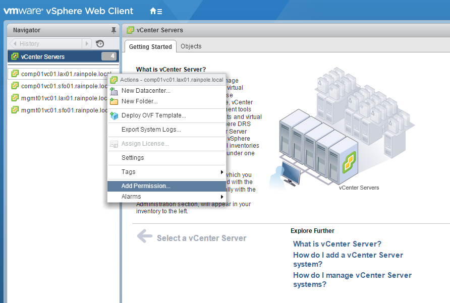

1.   In the **Add Permission** dialog box, click the **Add** button to add permissions to a user or a group.

> 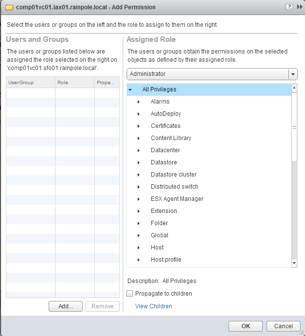

1.  In the **Select Users/Groups** dialog box, from the **Domain** drop-down menu, select **RAINPOLE,** and type **svc **in the filter box.

2.  From the list of users and groups, select **svc-vra** and **svc-vro**, and click the **Add **button. 

> 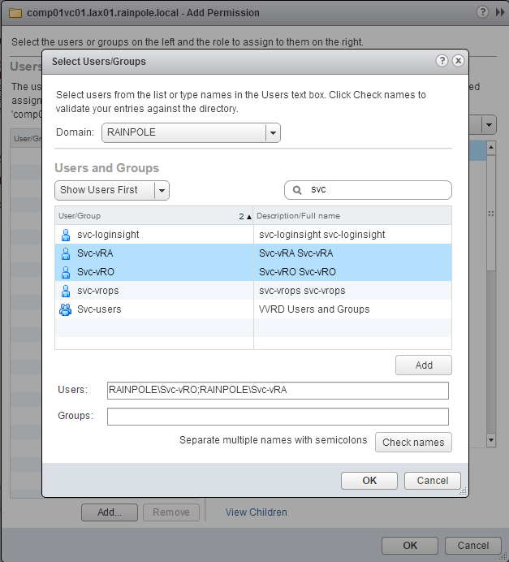

1.  Click **OK**.

2.  In **Add Permission** dialog box, select **Administrator **from the** Assigned Role **drop-down menu and click** OK**.

> 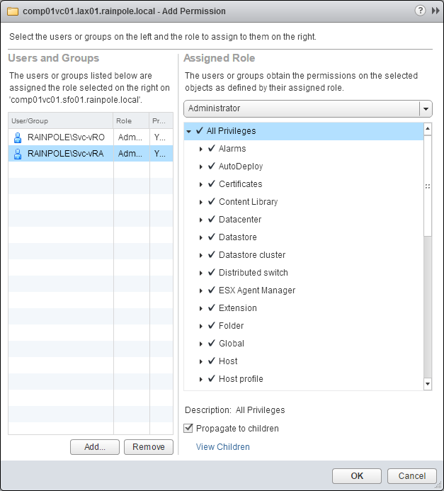

1.  Repeat the above steps for all of the other compute vCenter Servers in Region B.

    1.  ### Configure Service Account Privileges in Compute NSX (Region B)

Configure user account privileges for the **svc-vra@rainpole.local **service account.

1.  Log in to vCenter Server using the vSphere Web Client.

    1.  Open a Web browser and go to** https://comp01vc51.lax01.rainpole.local/vsphere-client**.

    2.  Log in using the following credentials.

| Setting       | Value                       |
|---------------|-----------------------------|
| **User name** | administrator@vsphere.local |
| **Password**  | *vcenter\_admin\_password*  |

1.  Navigate to **Home &gt; Networking & Security**, and click **NSX Managers**.

2.  In the **Navigator** pane, double-click the Compute NSX Manager labeled **172.17.11.66**.

3.  Select **Manage &gt; Users**.

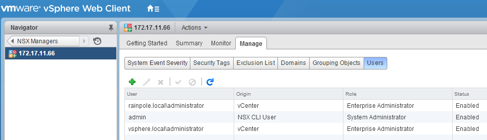

1.  Click the **Add** icon.

> The **Assign Role** wizard appears.

1.  In the **Identify User** page, select the **Specify a vCenter User** check box, type **svc-vra@rainpole.local** in the **User** text box, and click **Next**.

> 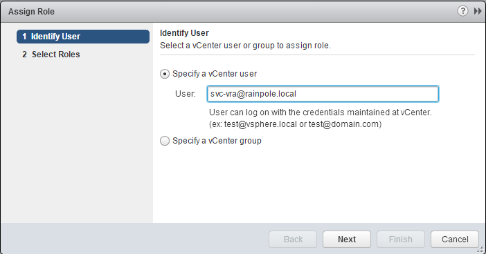

1.  In the **Select Roles** page, select the **Enterprise Administrator** check box, and click **Finish**.

> 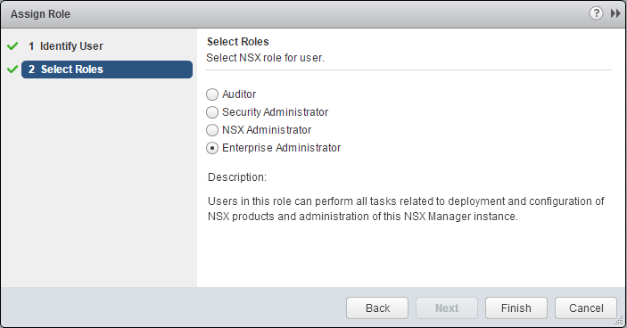

1.  Verify that the user **rainpole\\svc-vra** is configured as an **Enterprise Administrator** for the NSX Manager compute cluster. 

> 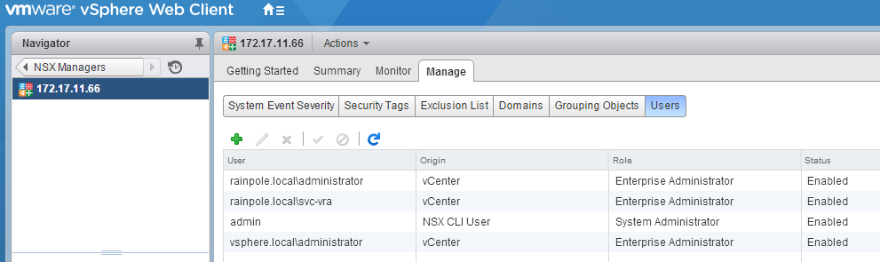

Add a Compute vCenter Server Instance to vRealize Automation (Region B)
-----------------------------------------------------------------------

This guide illustrates how you add a Compute vCenter Server instance to vRealize Automation. The guide uses **comp01vc51.lax01.rainpole.local** as an example. The same steps can be applied to any other Compute vCenter Server in any region.

**Prerequisites**

-   vRealize Automation is deployed and up and running.  See Install vRealize Automation in Region A (Region A).

-   Rainpole tenant is created and configured.  See Create a vRealize Automation Tenant (Region A).

-   The Compute vCenter Server is deployed and configured. See Prepare a Compute vCenter Server System for vRealize Automation (Region B).

-   The management virtual network for the vRealize Automation proxy agent is configured. See Deploy and Configure Gateways for the Management Application Networks (Region B)

-   Dynamic Routing is configured. See Deploy and Configure Gateways for the Management Application Networks (Region B)

-   Two management virtual network IP addresses and host names are required for installing the proxy agents. For example, you use the following host names and IP addresses for second Compute vCenter Server.

| Agent name           | Hostname                        | IP address   |
|----------------------|---------------------------------|--------------|
| LAX-Agent-vSphere-01 | vra01ias51.lax01.rainpole.local | 192.168.13.2 |
| LAX-Agent-vSphere-02 | vra01ias52.lax01.rainpole.local | 192.168.13.3 |

### Add a vCenter Server Instance to vRealize Orchestrator (Region B)

For each vCenter Server instance that contributes resources to vRealize Automation, and which uses vRealize Orchestrator workflows, you have to add a vCenter Server instance to vRealize Orchestrator. Adding the vCenter Server instance allows vCenter Server and vRealize Orchestrator to communicate.

Prerequisites

-   Install vRealize Orchestrator and set up a vRealize Orchestrator cluster.

Procedure

1.  Launch the vRealize Orchestrator Client. 
    Log in to the first vRealize Orchestrator server, **vra01vro01a.rainpole.local:8281**, as **ITAC-TenantAdmin@rainpole.local** with the **rainpole\_admin*\_password***.

2.  Navigate to **Workflows** &gt; **Library** &gt; **vCenter** &gt; **Configuration**.

3.  Run the **Add a vCenter Server instance** workflow.

    1.  On the **Set the vCenter Server Instance** page, configure the following settings and click **Next**.

| Setting                                 | Value                           |
|-----------------------------------------|---------------------------------|
| **vCenter Server hostname**             | comp01vc51.lax01.rainpole.local |
| **HTTPS port**                          | 443                             |
| **Location of SDK**                     | /sdk                            |
| **Will you orchestrate this instance?** | Yes                             |
| **Ignore certificate warnings?**        | Yes                             |

> 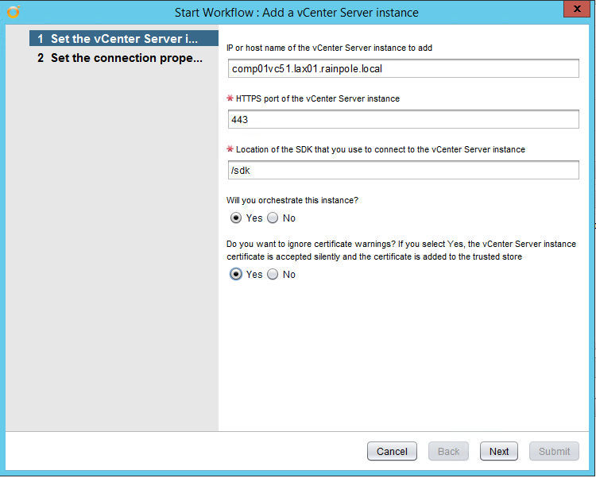

1.  On the **Set the connection properties** page, configure the following settings, and click **Submit.**

| Setting                          | Value                  |
|----------------------------------|------------------------|
| **Use a session per user**       | No                     |
| **vCenter Server user name**     | svc-vro@rainpole.local |
| **vCenter Server user password** | *svc\_vro\_password*   |

1.  To verify that the workflow completed successfully, click the **Inventory** tab and expand the **vCenter Server** node. The vCenter Server instance you added appears in the **vCenter Server** tree control node. 

> 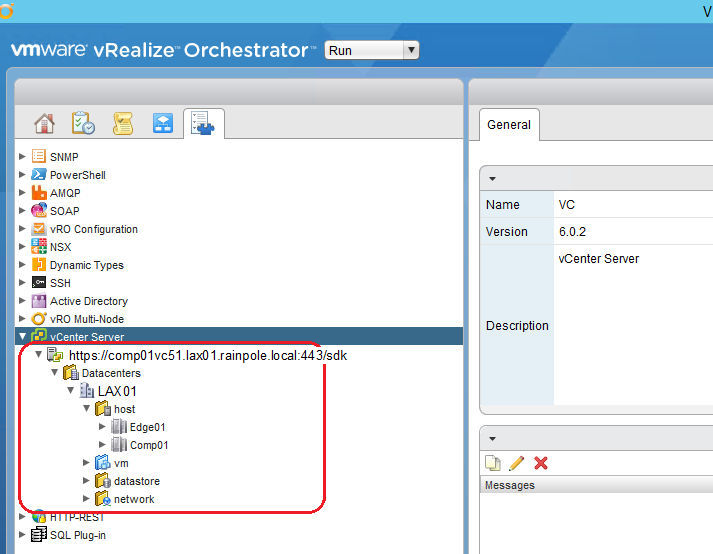

1.  Repeat this procedure to add this Compute vCenter Server instance to the second vRealize Orchestrator server, **vra01vro01b.rainpole.local**.

    1.  ### Create Windows Virtual Machines for Proxy Agents (Region B)

vRealize Automation requires two Windows virtual machines to run IaaS vSphere proxy agents in a distributed configuration. These two virtual machines provide high availability for the proxy agent. 

To facilitate creating the Windows virtual machines to run the proxy agents, the design uses the windows2012r2 virtual machine template and the window2012r2-vra-ias image customization specification.

**Prerequisites **

-   On the mgmt01vc51.lax01.rainpole.local vCenter Server system, create a Windows 2012 R2 windows template (windows2012r2-template) following the steps in the "Creating a Window Server 2012 R2 Virtual Machine Template" section. 

-   On the mgmt01vc51.lax01.rainpole.local vCenter Server system, create a vSphere Image Customization Specification template (windows2012r2-vra) following the steps in the "Creating a vSphere Image Customization template" section.

**Procedure**

1.  From the vSphere Web Client, log in to the Management vCenter Server.

    1.  Open a Web browser and go to** https://mgmt01vc51.lax01.rainpole.local/vsphere-client**.

    2.  Log in as the administrator@vsphere.local user with the *vcenter\_admin\_password* password.

2.  In the **Navigator**, click **vCenter Servers**, and click **mgmt01vc51.lax01.rainpole.local**.

3.  Select the **VM** tab, and click **VM Templates in Folders**

4.  In the **VM Templates in Folders** pane, select the **win2012r2-template.**

5.  In the **Basic Tasks** pane, click **Deploy to a new virtual machine.**

6.  In the **Deploy From Template** wizard, follow these steps:

    1.  On the **Select a name and folder** page, make the following selections and click **Next.**

| Setting                                       | Value                                                                       |
|-----------------------------------------------|-----------------------------------------------------------------------------|
| **Enter a name for the virtual machine**      | vra01ias51.lax01.rainpole.local                                             |
| **Select a location for the virtual machine** | Select the **LAX01** data center under mgmt01vc51.lax01.rainpole.local**.** |

> 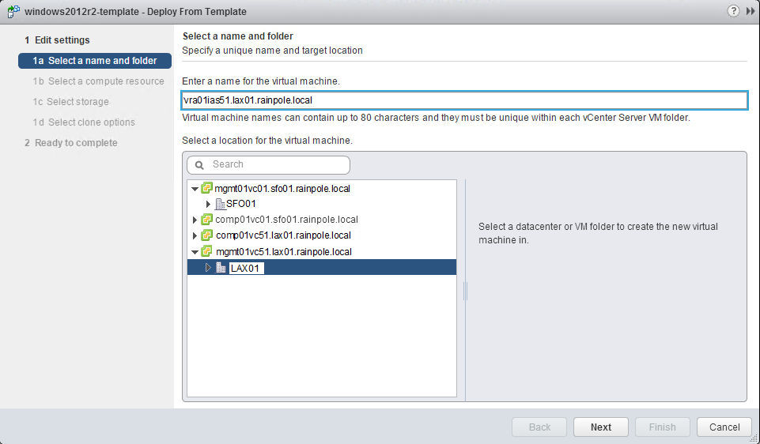

1.  On the **Select a compute resource** page, select **LAX01-Mgmt01 **and click **Next.**

> 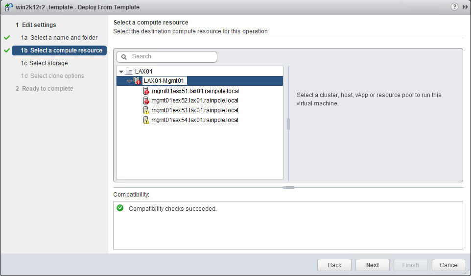

1.  On the **Select storage** page, specify the following settings for the datastore and click **Next**.

| Setting                        | Value                                                                           |
|--------------------------------|---------------------------------------------------------------------------------|
| **Select virtual disk format** | Leave the default virtual disk format.                                          |
| **VM Storage Policy**          | Virtual SAN Default Storage Policy                                              |
| **Datastore**                  | Select the LAX01A-VSAN01-MGMT01 Virtual SAN datastore from the datastore table. |

> 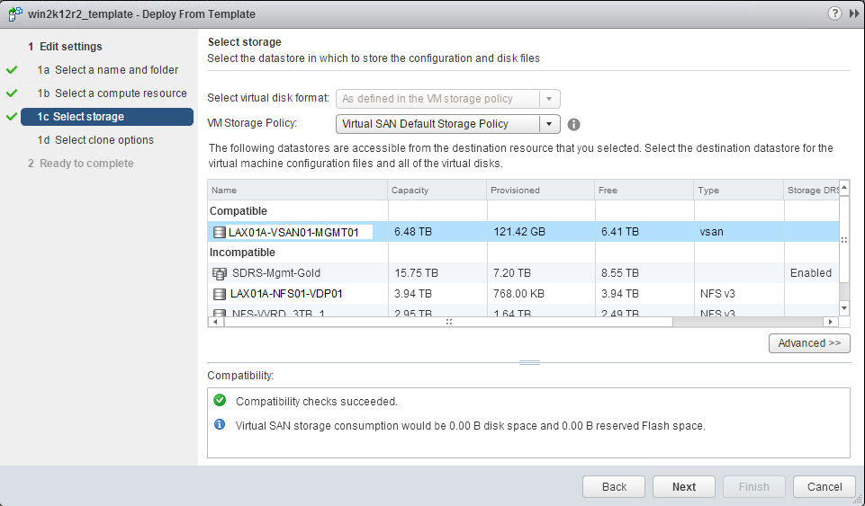

1.  In the **Select Clone options** page, select **Customize the operating system **check box. Leave the other check boxes deselected, and click **Next.**

> <embed src="media/image510.png" width="452" height="264" />

1.  In the **Customize guest OS** page, select **windows2012r2-vra-ias** from the table and click **Next.**

> 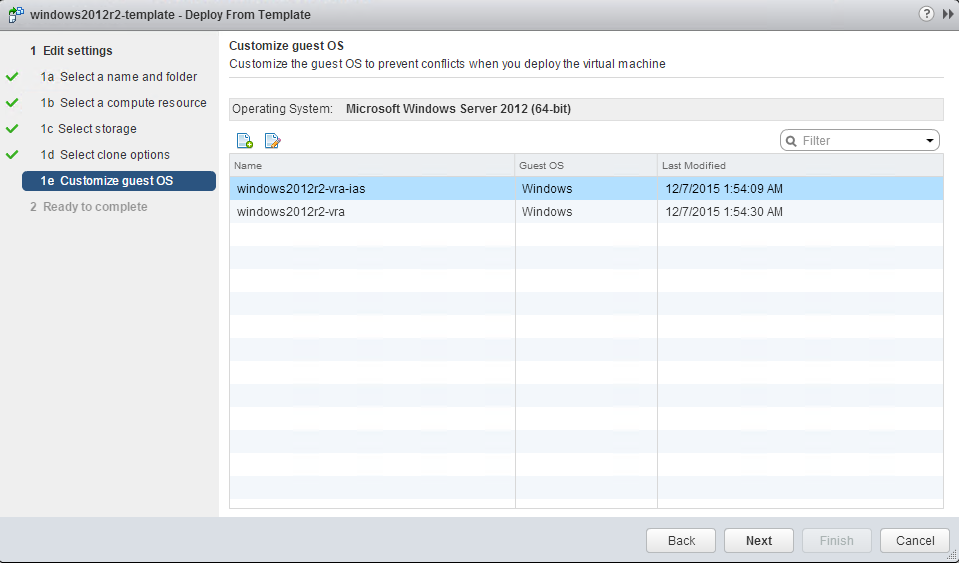

1.  In the **User Settings** pane enter the values specified in the table below. Leave the default settings for the other fields, and click **Next**.

| Setting      | Value        |
|--------------|--------------|
| NetBIOS name | vra01ias51   |
| IPv4 address | 192.168.13.2 |

> 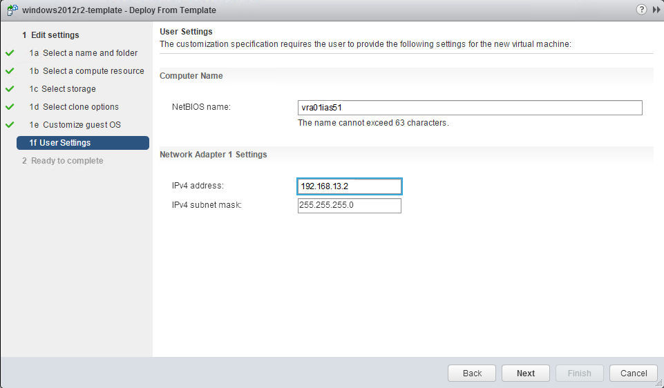

1.  With **Ready to Complete** selected on the left, review all settings on the right and click **Finish**.

> 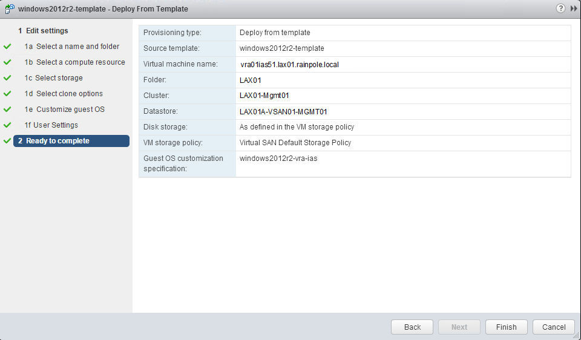

1.  When the virtual machine deployment completes, customize the virtual machine, as follows.

    1.  In the **Navigator**, click **Virtual Machines.**

    2.  Right click the **vra01ias51.lax01.rainpole.local** virtual machine and select **Edit Settings**.

    3.  Select **Virtual Hardware**, and change **Memory** to **4096 MB**. 

    4.  Select **Network Adapter 1** and select **vxw-dvs-27-virtualwire-2-sid-5001-vRA01IAS-VXLAN**.

    5.  Click **OK.**

> 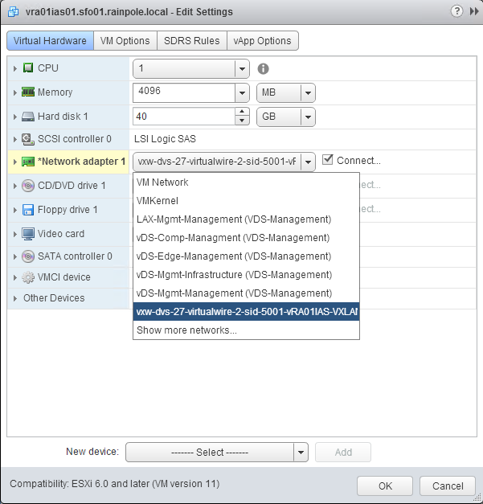

1.  Right click the **vra01ias52.sfo01.rainpole.local** virtual machine again and select **Power &gt; Power on**.

<!-- -->

1.  When the Windows customization completes, log in to Windows as an administrator and perform verification and customization.

    1.  Verify that the virtual machine's IP address, computer name, and domain are correct.

    2.  Add the vRealize Automation service account **svc-vra@rainpole.local** to the Local Administrators Group.

2.  Repeat the steps to create one additional virtual machine with the following settings.

| Setting              | Value                           |
|----------------------|---------------------------------|
| Virtual Machine Name | vra01ias52.lax01.rainpole.local |
| NetBIOS name         | vra01ias52                      |
| IP address           | 192.168.13.3                    |
| Memory Size          | 4 GB                            |

1.  Create an anti-affinity rule to separate these two virtual machines. See *Create Anti-Affinity Rules for vRealize Automation and vRealize Orchestrator Virtual Machines*.

    1.  ### Install IaaS vSphere Proxy Agents (Region B)

Proxy agents are required so vRealize Automation can communicate with vCenter Server instances.  For every vCenter Server instance that will be a target for vRealize Automation, deploy at least two proxy agents. 

**Prerequisites**

-   Verify that vRealize Automation has been deployed. See* *Install vRealize Automation in Region A.

-   Verify that two proxy agent Windows virtual machines are available and configured. See Create Windows Virtual Machines for Proxy Agents.

**Procedure**

1.  Log in to the **vra01ias51.lax01.rainpole.local** virtual machine console using the vRealize Automation service account **svc-vra@rainpole.local** with the password *svc-vra\_password*.

2.  Open a Web browser, navigate to https://vra01svr01a.rainpole.local:5480/installer, and download the **IaaS installer**. 

> 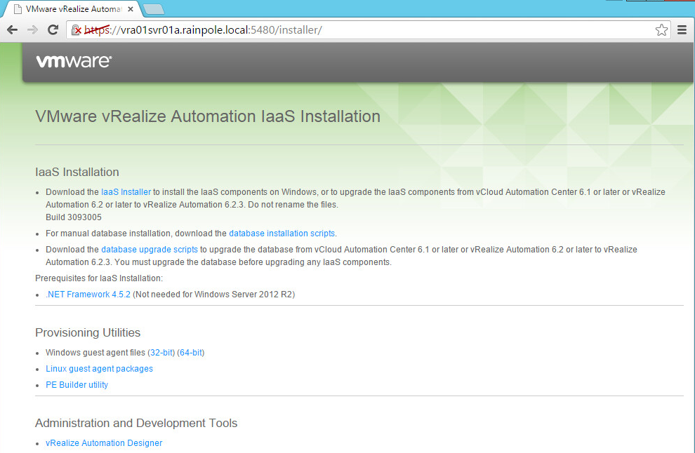

1.  Save the installer with the default name. 

2.  Right-click the installer and select **Run as administrator**.

3.  On the **Log In** page, configure the following settings and click **Next**. 

| Setting             | Value                        |
|---------------------|------------------------------|
| Appliance host name | Leave the default host name. |
| User name           | root                         |
| Password            | *root\_password*             |
| Accept Certificate  | Select the check box.        |

> 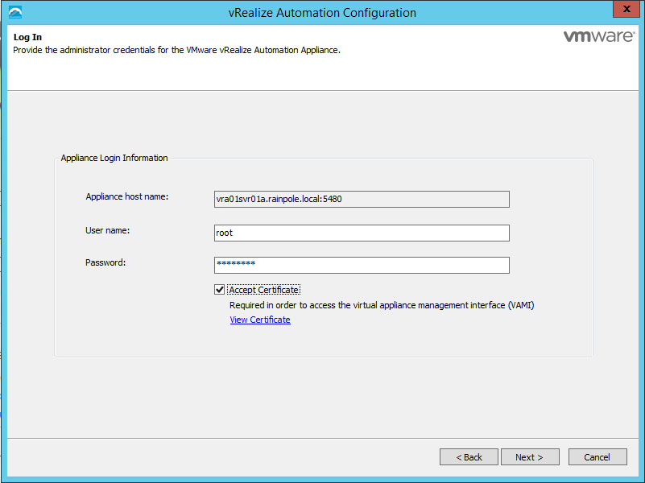

1.  On the **Installation Type** page, select **Custom Install**, click **Proxy Agents,** and click **Next**.

> 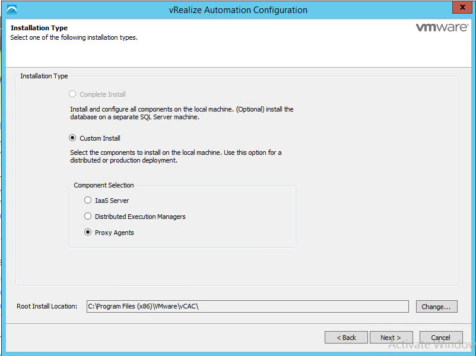

1.  On the **Server and Account Settings** page, specify the following values and click **Next**. 

| Setting      | Value                        |
|--------------|------------------------------|
| Local server | Leave the default host name. |
| User name    | svc-vra@rainpole.local       |
| Password     | *svc-vra\_password*          |

> 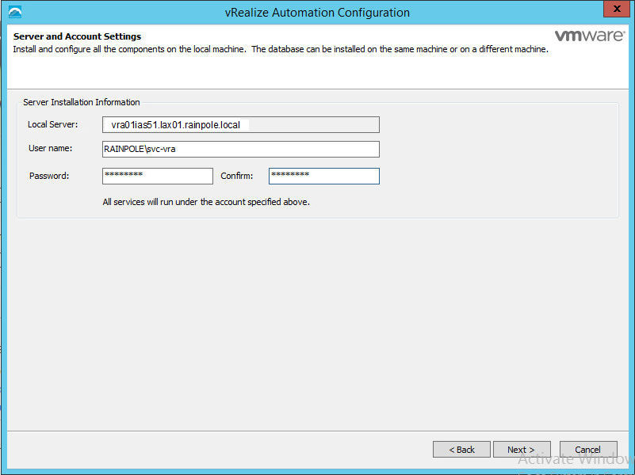

1.  On the **Install Proxy Agent** page, specify the following values, and click **Add**. 
    **Note**: You will later use the vSphere endpoint you define to create a vCenter Endpoint in vRealize Automation. 

| Setting                        | Value                           |
|--------------------------------|---------------------------------|
| Agent type                     | vSphere                         |
| Agent name                     | LAX-Agent-vSphere-01            |
| Manager Service Host           | vra01ims01.rainpole.local       |
| Model Manager Web Service Host | vra01iws01.rainpole.local       |
| vSphere Endpoint               | comp01vc51.lax01.rainpole.local |

> 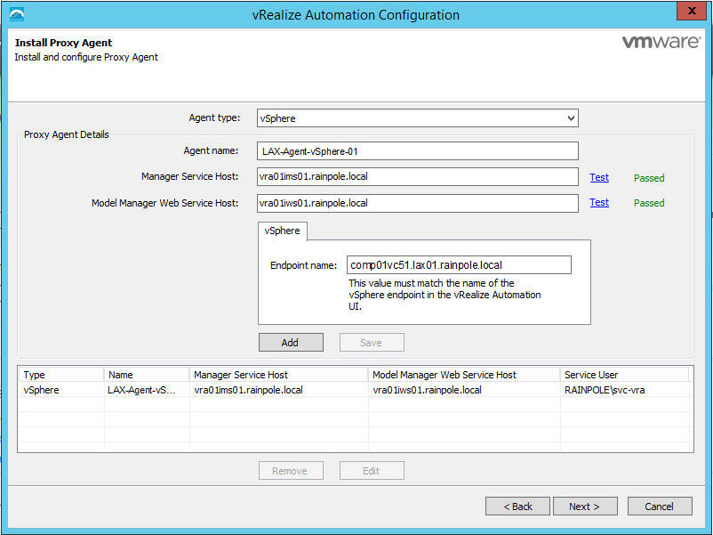

1.  Click **Next.**

2.  Verify the configuration, and click **Install** to install the proxy agent.

3.  Repeat the procedure for virtual machine **vra01ias52.lax01.rainpole.local** to install another proxy agent for redundancy, using the following values on the **Install Proxy Agent** pages.

<!-- -->

1.  Use the same vSphere Endpoint as the** LAX-Agent-vSphere-01** is using.

| Setting                             | Value                           |
|-------------------------------------|---------------------------------|
| Agent Type                          | vSphere                         |
| Agent Name                          | LAX-Agent-vSphere-02            |
| Manager Service Host name           | vra01ims01.rainpole.local       |
| Model Manager Web Service Host name | vra01iws01.rainpole.local       |
| vSphere Endpoint                    | comp01vc51.lax01.rainpole.local |

### Create a vSphere Endpoint in vRealize Automation (Region B)

To allow vRealize Automation to manage the infrastructure, IaaS administrators create endpoints and configure user-credentials for those endpoints. When you create a vSphere Endpoint, vRealize Automation can to communicate with the vSphere environment and discover compute resources that are managed by vCenter Server, collect data, and provision machines.

**Prerequisites**

-   Proxy agents have been deployed. See *Install IaaS vSphere Proxy Agents*.

**Procedure**

1.  From a Web browser, log in to the vRealize Automation console by connecting to **https://vra01svr01.rainpole.local/vcac/org/rainpole** and log in with the tenant admin account **ITAC-TenantAdmin@rainpole.local** with password *tenant\_pwd*. 

2.  Navigate to **Infrastructure** &gt; **Endpoints** &gt; **Credentials** and click **New Credentials**.

3.  On the **Credentials** page, configure the vRealize Automation credential for the administrator of comp01vc51.lax01.rainpole.local with the following settings, and click the green checkmark to save the credential.

| Setting     | Value                                            |
|-------------|--------------------------------------------------|
| Name        | comp01vc51lax01 admin                            |
| Description | administrator of comp01vc51.lax01.rainpole.local |
| User Name   | svc-vra@rainpole.local                           |
| Password    | *svc\_vra\_password*                             |

> 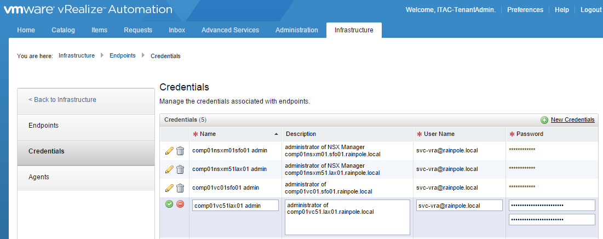

1.  Repeat the previous step to create credentials for the NSX Admin with the following settings:

| Setting     | Value                                                          |
|-------------|----------------------------------------------------------------|
| Name        | comp01nsxm51lax01 admin                                        |
| Description | administrator of NSX Manager comp01nsxm51.lax01.rainpole.local |
| User Name   | svc-vra@rainpole.local                                         |
| Password    | *svc\_vra\_password*                                           |

1.  Navigate to **Infrastructure** &gt; **Endpoints** &gt; **Endpoints** and click **New Endpoints** &gt; **Virtual** &gt; **vSphere (vCenter)**.

2.  On the **New Endpoint - vSphere (vCenter)** page, create a vSphere Endpoint with the following settings, and click **OK**. 

<!-- -->

1.  The vSphere Endpoint Name must be identical to the name that you used to install the proxy agent in the section "Install IaaS vSphere Proxy Agents." 

| Setting                                           | Value                                       |
|---------------------------------------------------|---------------------------------------------|
| Name                                              | comp01vc51.lax01.rainpole.local             |
| Address                                           | https://comp01vc51.lax01.rainpole.local/sdk |
| Credentials                                       | comp01vc51lax01 admin                       |
| Specify manager for network and security platform | Yes                                         |
| NSX Address                                       | https://comp01nsxm51.lax01.rainpole.local/  |
| NSX Credentials                                   | comp01nsxm51lax01 admin                     |

> 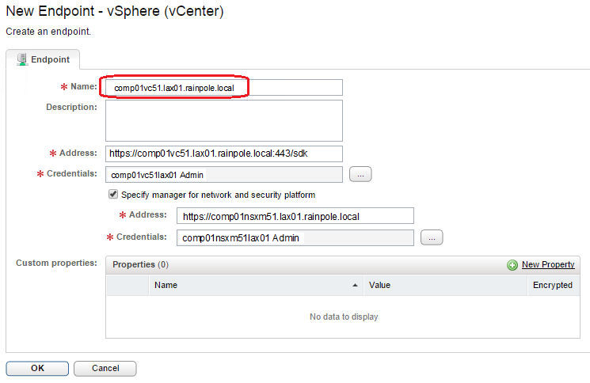

### Add Compute Resources to a Fabric Group (Region B)

You allocate compute resources to fabric groups so that vRealize Automation can use the resources in that compute resource for that fabric group when provisioning virtual machines.

**Prerequisites**

-   Verify that the fabric group has been created.

-   Verify that compute resources have been configured.

**Procedure**

1.  From a Web browser, log in to the vRealize Automation console by connecting to **https://vra01svr01.rainpole.local/vcac/org/rainpole** and log in with the tenant admin account **ITAC-TenantAdmin@rainpole.local** with password *tenant\_pwd*.

2.  Navigate to **Infrastructure** &gt; **Groups** &gt; **Fabric Groups**.

3.  In the **Name** column, hover the mouse pointer over the fabric group name **LAX Fabric Group**,** **and select **Edit**.

> 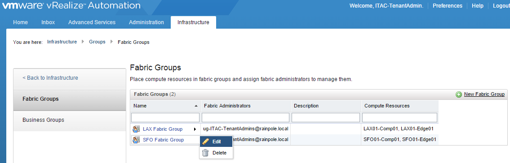

1.  In the **Edit Fabric Group** page, in the** Compute Resources** table, select both the compute cluster, **LAX01-Comp01**, and the edge cluster, **LAX01-Edge01**, and click **OK**.

<!-- -->

1.  It may take several minutes for vRealize Automation to connect to the Compute vCenter Server system and associated clusters.

> 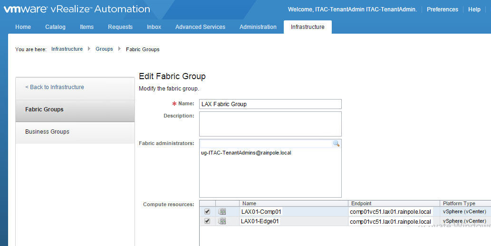

1.  Navigate to **Infrastructure** &gt; **Computer Resources** &gt; **Compute Resources**. 

2.  In the **Compute Resource** column, hover the mouse pointer over the compute cluster name **LAX01-Comp01**, and click **Data Collection**.

> 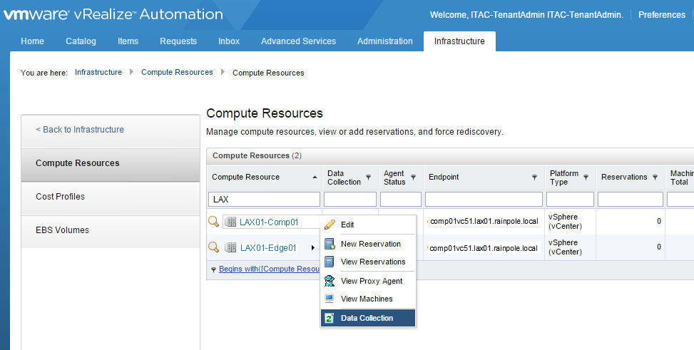

1.  Wait for data collection to complete, and verify that the **Inventory**, **Networking**, and **Security** panes display **Status:** **Succeeded**.

> 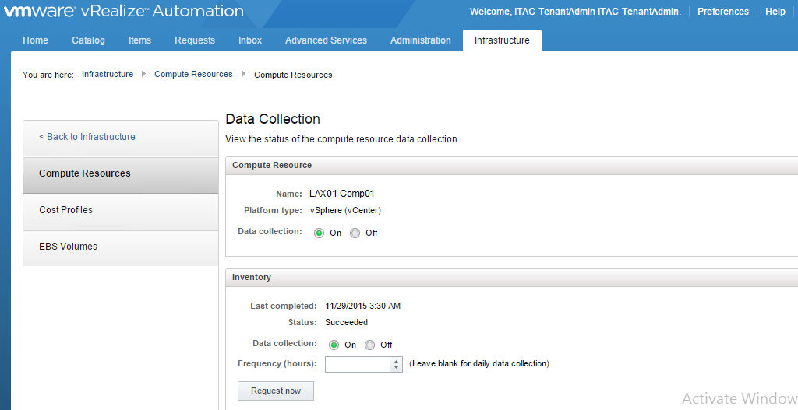

1.  Repeat this procedure to configure data collection for the **LAX01-Edge01** edge cluster.

    1.  ### Create External Network Profiles (Region B)

Before members of a business group can request virtual machines, fabric administrators must create network profiles to define the subnet and routing configuration for those virtual machines.  Each network profile is configured for a specific network port group or virtual network to specify IP address and routing configuration for virtual machines provisioned to that network.

**Prerequisites**

-   Business Groups have been created.

-   Fabric Groups have been created.

-   Compute resources have been provisioned to fabric groups.

**Procedure**

1.  From a Web browser, log in to the vRealize Automation console by connecting to **https://vra01svr01.rainpole.local/vcac/org/rainpole** and log in with the tenant admin account **ITAC-TenantAdmin@rainpole.local** with password *tenant\_pwd*.

2.  Navigate to **Infrastructure** &gt; **Reservations** &gt; **Network Profiles** and click **New Network Profile** &gt; **External**.

3.  On the **New Network Profile - External** page, select the **Network Profile Information** tab, enter the following values**,** but do not click **OK** yet. 

| Setting               | Value                                                              |
|-----------------------|--------------------------------------------------------------------|
| **Name**              | Ext-Net-Profile-Production-Web                                     |
| **Description**       | External Network profile for Web Tier of Production Business Group |
| **Subnet mask**       | 255.255.255.0                                                      |
| **Gateway**           | 172.11.10.1                                                        |
| **Primary DNS**       | 172.16.11.5                                                        |
| **Secondary DNS**     | 172.17.11.5                                                        |
| **DNS suffix**        | lax01.rainpole.local                                               |
| **DNS search suffix** | lax01.rainpole.local                                               |

> 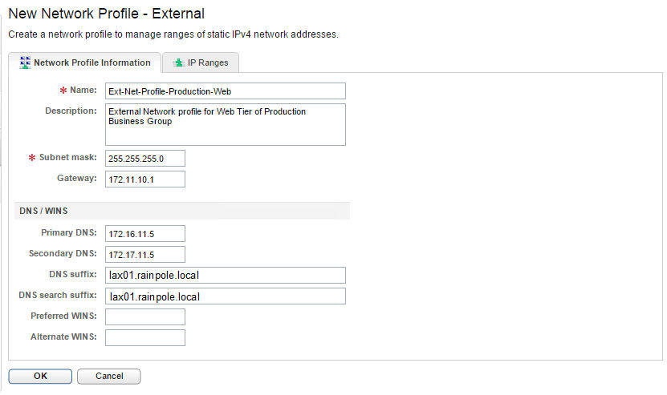

1.  Still on the **New Network Profile - External** page, select the **IP Ranges** tab, select the **New Network Range** icon.

    1.  Enter the following values, and click **OK**. 

| Setting                 | Value                                            |
|-------------------------|--------------------------------------------------|
| **Name**                | Production-Web                                   |
| **Description**         | Static IP range for Web Tier of Production Group |
| **Starting IP address** | 172.11.10.20                                     |
| Ending IP address       | 172.11.10.250                                    |

> 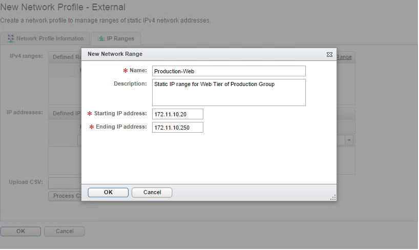

1.  Verify that all the static IP addresses are added to the profile and click **OK**.

> 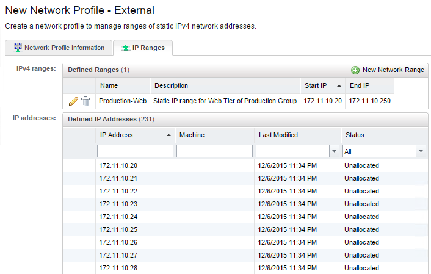

1.  Repeat the steps to create additional external network profiles with the following settings:

|                                 |                      |             |                    |                     |                   |
|---------------------------------|----------------------|-------------|--------------------|---------------------|-------------------|
| Primary DNS                     | 172.16.11.5          |             |                    |                     |
| Secondary DNS                   | 172.17.11.5          |             |                    |                     |
| DNS suffix                      | lax01.rainpole.local |             |                    |                     |
| DNS search suffix               | lax01.rainpole.local |             |                    |                     |
| Profile Name                    | Subnet Mask          | Gateway     | Network Range Name | Starting IP address | Ending IP address |
| Ext-Net-Profile-Production-DB   | 255.255.255.0        | 172.11.11.1 | Production-DB      | 172.11.11.20        | 172.11.11.250     |
| Ext-Net-Profile-Production-App  | 255.255.255.0        | 172.11.12.1 | Production-App     | 172.11.12.20        | 172.11.12.250     |
| Ext-Net-Profile-Development-Web | 255.255.255.0        | 172.12.10.1 | Development-Web    | 172.12.10.20        | 172.12.10.250     |
| Ext-Net-Profile-Production-DB   | 255.255.255.0        | 172.12.11.1 | Development-DB     | 172.12.11.20        | 172.12.11.250     |
| Ext-Net-Profile-Production-App  | 255.255.255.0        | 172.12.12.1 | Development-App    | 172.12.12.20        | 172.12.12.250     |

> 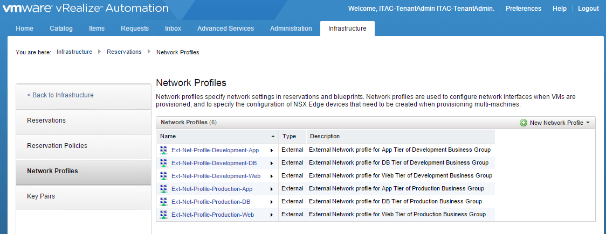

### Create a Reservation for the Compute Cluster (Region B)

Before members of a business group can request machines, fabric administrators must allocate resources to them by creating a reservation.  Each reservation is configured for a specific business group to grant them access to request machines on a specified compute resource. 

**Prerequisites**

Business Groups have been created.

Fabric Groups have been created.

Compute resources have been provisioned to fabric groups.

Reservation policies have been created.

**Procedure**

1.  Log in to the Management vCenter Server using the vSphere Web Client.

    1.  In a Web browser, go to **https://vra01svr01.rainpole.local/vcac/org/rainpole**.

    2.  Log in using the following credentials.

| Setting   | Value                           |
|-----------|---------------------------------|
| User name | ITAC-TenantAdmin@rainpole.local |
| Password  | *tenant\_pwd*                   |

1.  Navigate to **Infrastructure** &gt; **Reservations** &gt; **Reservations** and click **New Reservation** &gt; **Virtual** &gt; **vSphere** (**vCenter**).

2.  On the **New Reservation - vSphere (vCenter)** page, click the **Reservation Information** tab and enter the following values.

| Setting                  | Value                                          |
|--------------------------|------------------------------------------------|
| Compute Resource         | LAX01-Comp01 (comp01vc51.lax01.rainpole.local) |
| Name                     | LAX01-Comp01-Prod-Res01                        |
| Tenant                   | rainpole                                       |
| Business Group           | Production Business Group                      |
| Reservation Policy       | LAX-Production-Policy                          |
| Priority                 | 100                                            |
| Enabled This Reservation | Checked                                        |

> 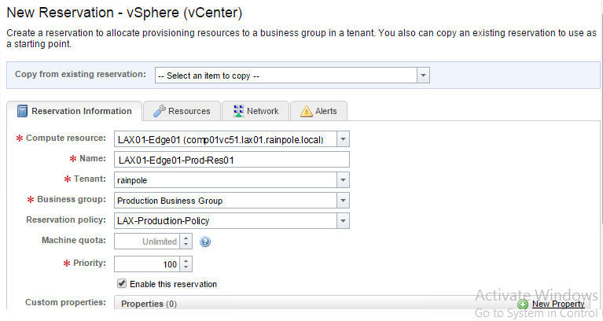

1.  Still on the **New Reservation - vSphere (vCenter)** page, click the **Resources** tab. 

2.  For **Memory** select **200** for **This Reservation**.

3.  For **Storage,** reserve **4000** on **SDRS-Comp-Bronze** and **4000** on** SDRS-Comp-Gold**.

> 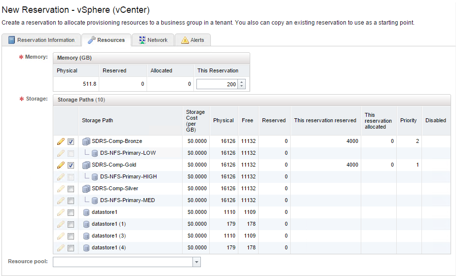

1.  Still on the **New Reservation - vSphere (vCenter)** page, click the **Network** tab and select the following port groups and network profiles for the **Production** business group.

| Port Group                         | Network Profile                |
|------------------------------------|--------------------------------|
| vxw-dvs-xxxxx-Production-Web-VXLAN | Ext-Net-Profile-Production-Web |
| vxw-dvs-xxxxx-Production-DB-VXLAN  | Ext-Net-Profile-Production-DB  |
| vxw-dvs-xxxxx-Production-App-VXLAN | Ext-Net-Profile-Production-App |

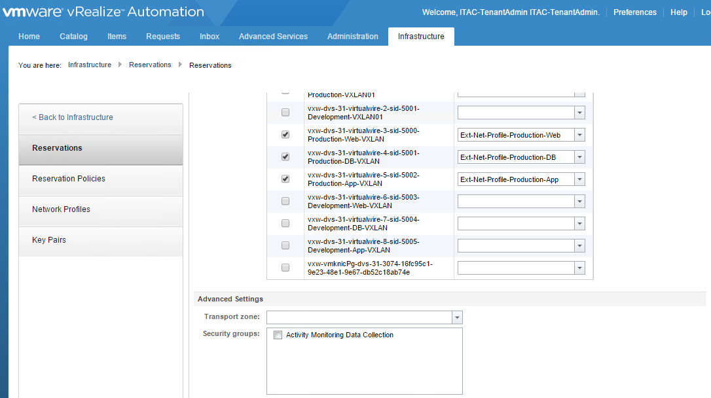

1.  Click **OK** to save this reservation.

2.  Repeat the process to create a reservation for the **Development Business Group.** Use the same memory and storage, and use** **the following settings.

| Setting            | Value                                          |
|--------------------|------------------------------------------------|
| Computer Resource  | LAX01-Comp01 (comp01vc51.lax01.rainpole.local) |
| Name               | LAX01-Comp01-Dev-Res01                         |
| Tenant             | rainpole                                       |
| Business Group     | Development Business Group                     |
| Reservation Policy | LAX-Development-Policy                         |
| Priority           | 100                                            |

| Port Group                          | Network Profile                 |
|-------------------------------------|---------------------------------|
| vxw-dvs-xxxxx-Development-Web-VXLAN | Ext-Net-Profile-Development-Web |
| vxw-dvs-xxxxx-Development-DB-VXLAN  | Ext-Net-Profile-Development-DB  |
| vxw-dvs-xxxxx-Development-App-VXLAN | Ext-Net-Profile-Development-App |

1.  Confirm that you have successfully created both reservations.

> 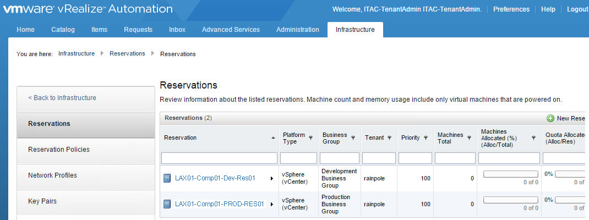 

### Create a Reservation for the Edge Cluster (Region B)

Before members of a business group can request virtual machines, fabric administrators must allocate resources to that business group by creating a reservation.  Each reservation is configured for a specific business group to grant them access to request virtual machines on a specified compute resource.

**Prerequisites**

-   Business groups have been created.

-   Fabric groups have been created.

-   Compute resources have been provisioned to fabric groups.

-   Reservation policies have been created properly.

**Procedure**

1.  From a Web browser, log in to the vRealize Automation console by connecting to **https://vra01svr01.rainpole.local/vcac/org/rainpole** and log in with the tenant admin account **ITAC-TenantAdmin@rainpole.local** with password *tenant\_pwd*.

2.  Navigate to **Infrastructure** &gt; **Reservations** &gt; **Reservations** and click **New Reservation** &gt; **Virtual** &gt; **vSphere** (**vCenter**).

3.  On the **New Reservation - vSphere (vCenter)** page, click the **Reservation Information** tab and enter the following values.

| Setting                     | Value                                          |
|-----------------------------|------------------------------------------------|
| **Compute Resource**        | LAX01-Edge01 (comp01vc51.lax01.rainpole.local) |
| **Name**                    | LAX01-Edge01-Prod-Res01                        |
| **Tenant**                  | rainpole                                       |
| **Business Group**          | Production Business Group                      |
| **Reservation Policy**      | LAX-Edge-Policy                                |
| **Priority**                | 100                                            |
| **Enable this reservation** | Checked                                        |

> 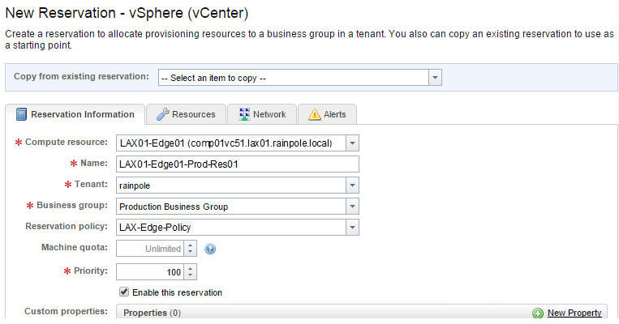

1.  Still on the **New Reservation - vSphere (vCenter)** page, click the **Resources** tab.

2.  For **Memory**, select 200 for **This Reservation**. 

3.  For **Storage,** reserve **4000** on **SDRS-Comp-Bronze** and **4000** on **SDRS-Comp-Gold**.

> 

1.  On the **New Reservation - vSphere (vCenter)** page, click the **Network** tab and select the port group for the **Production Business Group**.

| Port Group                         | Network Profile                |
|------------------------------------|--------------------------------|
| vxw-dvs-xxxxx-Production-Web-VXLAN | Ext-Net-Profile-Production-Web |
| vxw-dvs-xxxxx-Production-DB-VXLAN  | Ext-Net-Profile-Production-DB  |
| vxw-dvs-xxxxx-Production-App-VXLAN | Ext-Net-Profile-Production-App |

> 

1.  Click **OK** to save this reservation.

2.  Repeat the process to create a reservation for the **Development Business Group.** Use the same memory and storage, and use** **the following settings:

| Setting                | Value                                          |
|------------------------|------------------------------------------------|
| **Computer Resource**  | LAX01-Edge01 (comp01vc51.lax01.rainpole.local) |
| **Name**               | LAX01-Edge01-Dev-Res01                         |
| **Tenant**             | rainpole                                       |
| **Business Group**     | Development Business Group                     |
| **Reservation Policy** | LAX-Edge-Policy                                |
| **Priority**           | 100                                            |

| Port Group                          | Network Profile                 |
|-------------------------------------|---------------------------------|
| vxw-dvs-xxxxx-Development-Web-VXLAN | Ext-Net-Profile-Development-Web |
| vxw-dvs-xxxxx-Development-DB-VXLAN  | Ext-Net-Profile-Development-DB  |
| vxw-dvs-xxxxx-Development-App-VXLAN | Ext-Net-Profile-Development-App |

1.  Confirm that both reservations have been created successfully.

> 

 Configure Single Machine Blueprints (Region B)
-----------------------------------------------

Machine blueprints are specifications for virtual, cloud, or physical machines. Blueprints determine a machine's attributes, the manner in which it is provisioned, and its policy and management settings. You create single machine blueprints using the vCenter Server instance comp01vc51.lax01.rainpole.local. You can apply the same procedure to other vCenter Server instances.

**Prerequisites**

-   Verify that vRealize Automation is deployed and running

-   Verify that the Rainpole tenant is created and configured.

-   Verify that at least two vCenter Server instances have been added to vRealize Automation.

    1.  ### Create a Service Catalog (Region B)

The service catalog provides a common interface for consumers of IT services to request and manage the services and resources they need. This section demonstrates how to create a service catalog. VMware Validated Design users can then browse the catalog to request services they need, track their requests, and manage their provisioned service items.   

After the service catalog has been created, business group managers can create entitlements for services, catalog items, and resource actions to groups of users. It is necessary to add the entitlement. The entitlement allows members of a particular business group, in this example, the Production business group, to use the blueprint. Without the entitlement, users cannot use the blueprint. 

1.  The workflow requires that you create the entitlement before you create the blueprint itself.

<!-- -->

1.  From a Web browser, log in to the vRealize Automation console by connecting to **https://vra01svr01.rainpole.local/vcac/org/rainpole** and log in with the tenant admin account ITAC-TenantAdmin@rainpole.local with password *tenant\_pwd*.

2.  Create a service catalog, as follows:

    1.  Click the **Administration** tab, and click **Catalog Management &gt; Services** on the left. 

    2.  In the **Add Service** dialog, specify the following settings, leave the default for the other text boxes, and click **Add**.

| Setting | Value               |
|---------|---------------------|
| Name    | LAX Service Catalog |
| Status  | Active              |

> 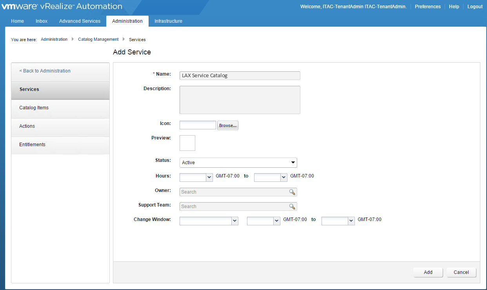

### Create a Single Machine Blueprint (Region B)

Create a blueprint for cloning the windows-2012r2-64 virtual machine using the pre-specified resources on the Compute vCenter Server. Tenants use this blueprint to automatically provision virtual machines. 

1.  Using a Web browser, log in to the vRealize Automation console.

<!-- -->

1.  Type the URL **https://vra01svr01.rainpole.local/vcac/org/rainpole**

2.  Log in using the tenant administrative account **ITAC-TenantAdmin@rainpole.local**, and the *tenant\_pwd *password.

<!-- -->

1.  Navigate to** Infrastructure** &gt; **Blueprints** &gt;** Blueprints.**

2.  Click **New Blueprints** &gt; **Virtual** &gt; **vSphere (vCenter)**.

3.  In the **New Blueprint - vSphere (vCenter)** dialog, select the **Blueprint Information** tab, provide the following values, and click **OK.**

| Setting                | Value                             |
|------------------------|-----------------------------------|
| **Name**               | Windows Server 2012 R2 - LAX Prod |
| **Reservation Policy** | LAX-Production-Policy             |
| **Machine Prefix**     | Use group default                 |
| **Archive (days)**     | 15                                |

> 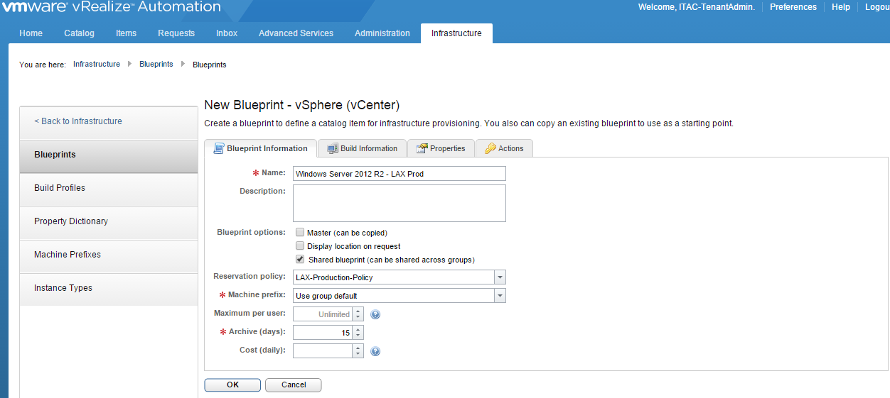

1.  Select the **Build Information** tab, specify the values in the following table, and click **OK** to save the blueprint.

> The system updates the storage volume to match the storage volume for the virtual machine that you are cloning. 

1.  vRealize Automation periodically polls for inventory data from vCenter Server. Because of this, you may have to manually trigger the inventory update if you uploaded virtual machine templates after the last data collection.** **If some virtual machine templates are not visible in the selection list, run data collection on the cluster where the virtual machine templates are located. See "Add Compute Resources to a Fabric Group" in *Add a Compute vCenter to vRealize Automation*. 

| Setting                   | Value                                                      |
|---------------------------|------------------------------------------------------------|
| **Blueprint type**        | Server                                                     |
| **Action**                | Clone                                                      |
| **Provisioning workflow** | CloneWorkflow                                              |
| **Clone from**            | windows-2012r2-64 *(from comp01vc51.lax01.rainpole.local)* |
| **Customization spec**    | itac-windows-joindomain-custom-spec                        |

| Setting          | Minimum | Maximum |
|------------------|---------|---------|
| **CPU**          | 1       | 4       |
| **Memory (MB)**  | 4096    | 16384   |
| **Storage (GB)** | 50      | 60      |
| **Lease (days)** | 30      | 270     |

> 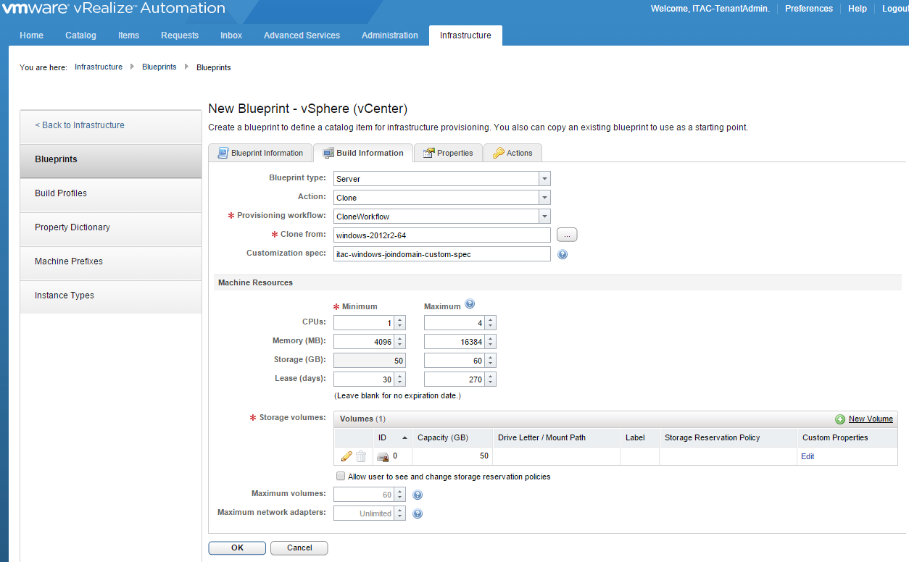

1.  Hover the mouse pointer over the blueprint, and click **Publish**.

2.  Configure service catalog for this blueprint.

    1.  With the **Administration** tab still selected, navigate to **Catalog Management** &gt;** Catalog Items** and select the **Windows Server 2012 R2 - SFO Prod** blueprint in the **Catalog Items** list.

    2.  In the **Configure Catalog Items** dialog box, set **Service** to **LAX Service Catalog** and click **Update**.

> 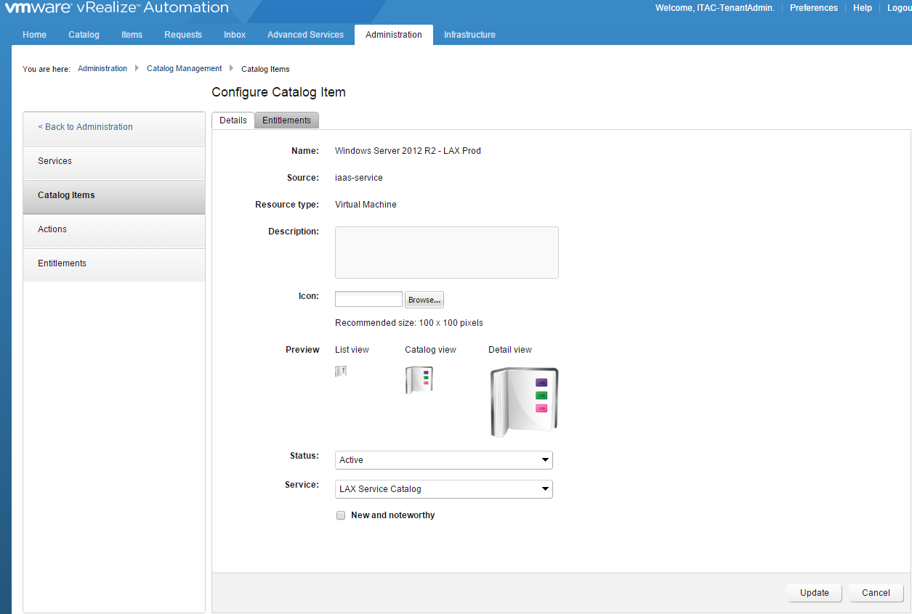

1.  Associate the blueprint with the two entitlements, **Prod-SingleVM-Entitlement** and **Dev-SingleVM-Entitlement**, created earlier.

    1.  Click **Entitlements** and select **Prod-SingleVM-Entitlement** to bring up the **Edit Entitlement** pane. 

    2.  Select the** Items & Approvals** tab and add the **Windows Server 2012 R2 - SFO Prod **blueprint to the **Entitled Catalog Items** list.

    3.  Click **Update** to save the changes.

    4.  Repeat the steps for **Dev-SingleVM-Entitlement.**

> 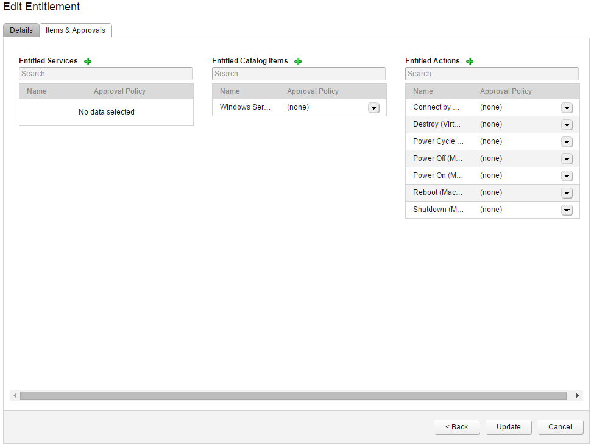

1.  Select the **Catalog** tab and verify that the blueprint is shown there. 

    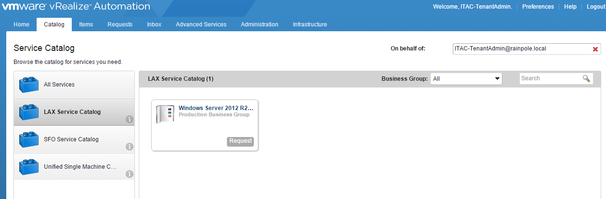

2.  Repeat this procedure to create additional blueprints using the settings in the table below if not created already.

| Blueprint Name                                 | VM Template                                                | Reservation Policy     | Service Catalog     | Add to Entitlement        |
|------------------------------------------------|------------------------------------------------------------|------------------------|---------------------|---------------------------|
| Windows Server 2012 R2 - LAX Prod              | windows-2012r2-64 (comp01vc51.lax01.rainpole.local)        | LAX-Production-Policy  | LAX Service Catalog | Prod-SingleVM-Entitlement |
| Windows Server 2012 R2 - LAX Dev               | windows-2012r2-64 (comp01vc51.lax01.rainpole.local)        | LAX-Development-Policy | LAX Service Catalog | Dev-SingleVM-Entitlement  |
| Windows Server 2012 R2 With SQL2012 - LAX Prod | windows-2012r2-64-sql2012(comp01vc51.lax01.rainpole.local) | LAX-Production-Policy  | LAX Service Catalog | Prod-SingleVM-Entitlement |
| Windows Server 2012 R2 With SQL2012 - LAX Dev  | windows-2012r2-64-sql2012(comp01vc51.lax01.rainpole.local) | LAX-Development-Policy | LAX Service Catalog | Dev-SingleVM-Entitlement  |
| Redhat Enterprise Linux 6 - LAX Prod           | redhat6-enterprise-64(comp01vc51.lax01.rainpole.local)     | LAX-Production-Policy  | LAX Service Catalog | Prod-SingleVM-Entitlement |
| Redhat Enterprise Linux 6 - LAX Dev            | redhat6-enterprise-64(comp01vc51.lax01.rainpole.local)     | LAX-Development-Policy | LAX Service Catalog | Dev-SingleVM-Entitlement  |

Configure Unified Single Machine Blueprints for Cross-Region Deployment (Region B)
----------------------------------------------------------------------------------

To provision blueprints from a specific vRealize Automation deployment to multiple regions, you define the additional regions in vRealize Automation, and associate the blueprints with those locations.

Prerequisites

-   vCenter Server compute clusters have been appropriately prepared and configured. See "Prepare a Compute vCenter Server System for vRealize Automation (Region B)."

-   Virtual machine templates have been synchronized, and use the same name on all vCenter Server compute clusters in your environment. See "Prepare a Compute vCenter Server System for vRealize Automation (Region B)."

    1.  ### Add Data Center Locations to the Compute Resource Menu

You can configure new data center locations and resources in the **Compute Resource** menu of the vRealize Automation deployment selection screen, allowing you to more easily select new compute resources for deployment. To add a new location to the **Compute Resource** menu, you edit an XML file on the vRealize Automation server.

Perform this procedure for both the region A and region B IaaS Web server virtual machines: **vra01iws01a** and **vra01iws01b**.

Procedure

1.  Log in to the vSphere Web Client.

    1.  Open a Web browser and go to** https://mgmt01vc01.sfo01.rainpole.local/vsphere-client**

    2.  Log in using the following credentials.

| Setting       | Value                       |
|---------------|-----------------------------|
| **User name** | administrator@vsphere.local |
| **Password**  | *vcenter\_admin\_password*  |

1.  Open a VM console to the IaaS Web server virtual machine **vra01iws01a**, and log in using administrator credentials.

2.  Open the file** C:\\Program Files (x86)\\VMware\\VCAC\\Server\\Website\\XMLData\\DataCenterLocations.xml** in a text editor.

3.  Update the **Data Name** and **Description** attributes to use the following settings.

| Data Name | Description               |
|-----------|---------------------------|
| SFO       | San Francisco Data Center |
| LAX       | Los Angeles Data Center   |

> 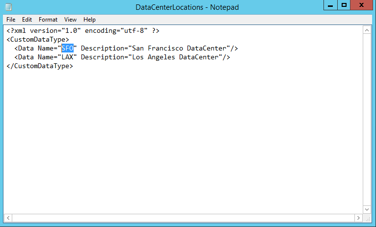

1.  Save and close the file.

2.  Restart the IaaS Web server virtual machine **vra01iws01a**.
    Wait until the virtual machine restarts and is successfully running.

3.  Repeat this procedure for the IaaS web server virtual machine **vra01iws01b**.

    1.  ### Associate Compute Resources with a Location

Each data center location has its own compute resources, which you associate with that site for its dedicated use.

Procedure

1.  Log into the vRealize Automation console.

    1.  Open a Web browser and go to** https://comp01vc51.lax01.rainpole.local/vsphere-client**

    2.  Log in as the IaaS administrator for the Rainpole tenant using the following credentials.

<!-- -->

1.  If you are already logged into the vRealize Automation console as another user, log out, and then log back in using the IaaS administrator credentials for the Rainpole tenant.  

| Setting       | Value                           |
|---------------|---------------------------------|
| **User name** | ITAC-TenantAdmin@rainpole.local |
| **Password**  | *rainpole\_admin\_password *    |

1.  Select** Infrastructure &gt; Compute Resources &gt; Compute Resources**.

2.  Using the mouse pointer, point to the compute resource **SFO01-Comp01 **and click **Edit**.

> 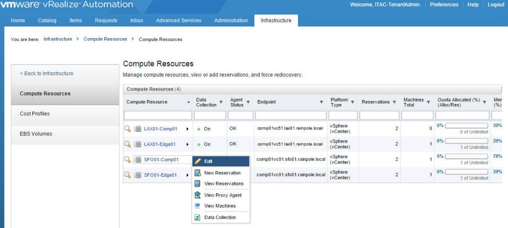

1.  Select the **SFO** data center location from the **Locations** drop-down menu.  This will be the data center location for the **SFO01-Comp01** compute cluster.

    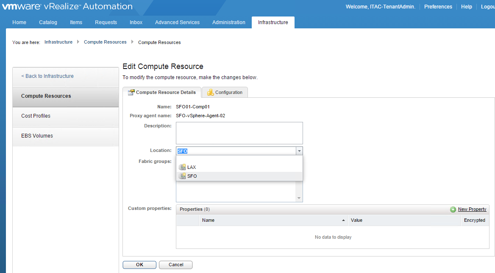

2.  Click **OK**.

3.  Repeat this procedure for the following vCenter Server compute clusters.

| Cluster      | Location |
|--------------|----------|
| SFO01-Comp01 | SFO      |
| SFO01-Edge01 | SFO      |
| LAX01-Comp01 | LAX      |
| LAX01-Edge01 | LAX      |

### Add a Property Definition for a Data Center Location

Property definitions let you more easily control which location to deploy a blueprint, and based upon that choice, which storage and network to use with that blueprint. 

Procedure

1.  Log into the vRealize Automation console.

    1.  Open a Web browser and go to **https://vra01svr01.rainpole.local/vcac/org/rainpole**

    2.  Log in as the IaaS administrator for the Rainpole tenant using the following credentials.

<!-- -->

1.  **I**f you are already logged into the vRealize Automation console as another user, log out, and then log back in using the IaaS administrator credentials for the Rainpole tenant.  

| Setting       | Value                           |
|---------------|---------------------------------|
| **User name** | ITAC-TenantAdmin@rainpole.local |
| **Password**  | *rainpole\_admin\_password *    |

1.  Select **Infrastructure &gt; Blueprints &gt; Property Dictionary**.

2.  Click **New Property Definition**, and create a property definition with the following settings.

| Setting                | Value                                                                                                                                                              |
|------------------------|--------------------------------------------------------------------------------------------------------------------------------------------------------------------|
| **Name**               | Vrm.DataCenter.Location **Note**: The property definition name is case sensitive, and must exactly match the property name used in the blueprint or build profile. |
| **Display Name**       | Select a Region                                                                                                                                                    |
| **Description**        | Region Selection                                                                                                                                                   |
| **Control Type**       | DropDownList                                                                                                                                                       |
| **Required check box** | Selected                                                                                                                                                           |

> 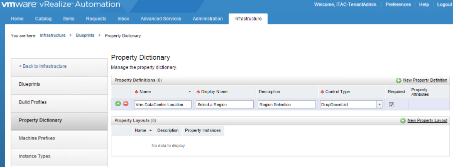

1.  Click **Save** .

    1.  ### Create Property Attributes for Data Center Location

Each of the Property Definitions requires Property Attributes. You can use the ValueList attribute to create a list of available values for a drop-down menu. The ValueList attribute is available for the DropDown and DropDownList property value control types.

Procedure

1.  Log into the vRealize Automation console.

    1.  Open a Web browser and go to **https://vra01svr01.rainpole.local/vcac/org/rainpole**.

    2.  Log in as the IaaS administrator for the Rainpole tenant using the following credentials.

<!-- -->

1.  If you are already logged into the vRealize Automation console as another user, log out, and then log back in using the IaaS administrator credentials for the Rainpole tenant.  

| Setting       | Value                           |
|---------------|---------------------------------|
| **User name** | ITAC-TenantAdmin@rainpole.local |
| **Password**  | *rainpole\_admin\_password *    |

1.  Select **Infrastructure &gt; Blueprints &gt; Property Dictionary**.

2.  Click **Edit** in the **Property Attributes** column of the property row.

> 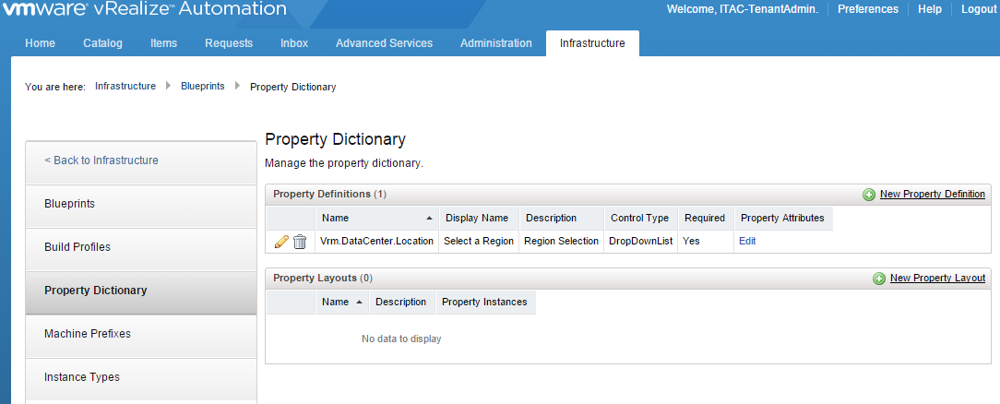

1.  Click **New Property Attribute**, and** **enter the following attributes for the Vrm.DataCenter.Location property definition.

    1.  Select **ValueList **from the **Type **drop-down menu.

    2.  Type the attribute name **Value **in the **Name **text box.

    3.  In the **Value **text box, type **SFO,LAX**. 
        This text displays when the user pauses on the property display name.

    4.  Click **Save** .

> 

1.  Click **OK**.

> 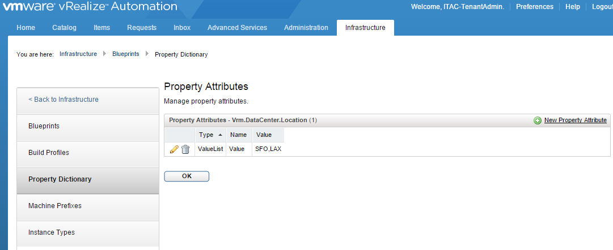 

### Create a Reservation Policy for the Unified Blueprint

When tenant administrators and business group managers create a new blueprint, the option to add a reservation policy become available. To add a reservation policy to an existing blueprint, edit the blueprint.

Procedure

1.  Log into the vRealize Automation console.

    1.  Open a Web browser and go to **https://vra01svr01.rainpole.local/vcac/org/rainpole**.

    2.  Log in as the IaaS administrator for the Rainpole tenant using the following credentials.

<!-- -->

1.  If you are already logged into the vRealize Automation console as another user, log out, and then log back in using the IaaS administrator credentials for the Rainpole tenant.  

| Setting       | Value                           |
|---------------|---------------------------------|
| **User name** | ITAC-TenantAdmin@rainpole.local |
| **Password**  | *rainpole\_admin\_password *    |

1.  Navigate to **Infrastructure** &gt; **Reservations** &gt; **Reservation Polices.**

    1.  Click **New Reservation Policy**.

    2.  Type **UnifiedBlueprint-Policy** in the **Name** text box.

    3.  Type **Reservation policy for Unified Blueprint** in the **Description** text box. 

    4.  Click **Save**.

> 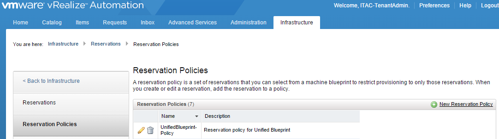

### Specify Reservation Information for the Unified Blueprint

Each reservation is configured for a specific business group to grant them access to request specific physical machines.

Before members of a business group can request machines, fabric administrators must allocate resources for them by creating a reservation. Each reservation is configured for a specific business group, and grants access to request machines on a specified compute resource. 

Procedure

1.  Log into the vRealize Automation console.

<!-- -->

1.  Open a Web browser and go to **https://vra01svr01.rainpole.local/vcac/org/rainpole**.

2.  Log in as the IaaS administrator for the Rainpole tenant using the following credentials.

<!-- -->

1.  **I**f you are already logged into the vRealize Automation console as another user, log out, and then log back in using the IaaS administrator credentials for the Rainpole tenant.  

| Setting   | Value                           |
|-----------|---------------------------------|
| User name | ITAC-TenantAdmin@rainpole.local |
| Password  | *rainpole\_admin\_password *    |

1.  Select **Infrastructure** &gt; **Reservations** &gt; **Reservations**.

2.  Select **New Reservation** &gt; **Virtual** &gt; **vSphere** (**vCenter**), and click the **Reservation Information** tab.

3.   Enter the following values to create a reservation.

    1.  Select **SFO01-Comp01 (comp01vc01.sfo01.rainpole.local)** from the **Compute resource** drop-down menu.

    2.  Type **SFO01-Comp01-Prod-Res02** in the **Name **text box. 

    3.  Select **rainpole from** the **Tenant** drop-down menu.

    4.  Select **Production Business Group** from the **Business** group drop-down menu.
        Only users in this business group can provision machines by using this reservation. 

    5.  Select the **UnifiedBlueprint-Policy** reservation policy from the **Reservation **policy drop-down menu.

    6.  Leave the default setting for the** Machine quota **text box.
        The machine quota specifies the maximum number of machines that can be provisioned on a reservation. Only machines that are powered on are counted towards the quota. Leaving this text box blank makes the reservation unlimited.

    7.  Type the number **100** in the **Priority **text box to set the priority for the reservation.

    8.  Select the **Enable this reservation** checkbox.

> 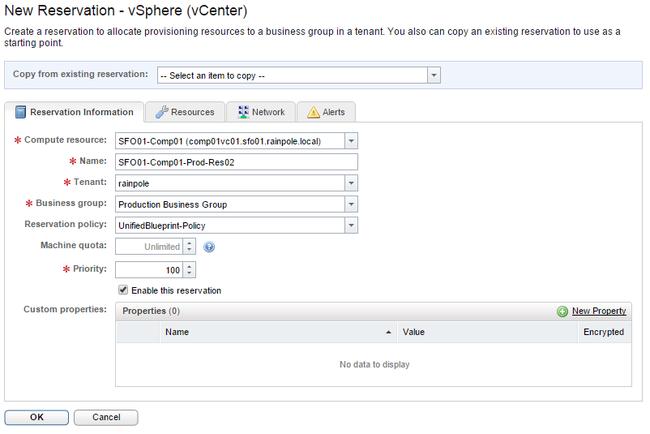

1.  Remain on the** New Reservation - vSphere (vCenter)** page, and select the **Resources** tab. 

    1.  In the **Memory** section of the panel, select **200** in the **This Reservation** text box.

    2.  In the **Storage** section of the panel, select the **SDRS-Comp-Bronze** and **SDRS-Comp-Gold** check boxes in the **Storage Path **column, and specify **4000** in the **This reservation reserved** column for both of these storage paths.** **

> 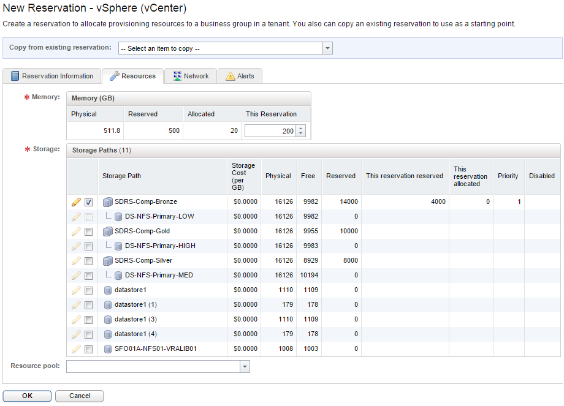

1.  Remain on the** New Reservation - vSphere (vCenter)** page, and select the **Network** tab.
    Configure a network path for machines provisioned using this reservation. 

2.  In the **Network** table, select the **vxw-dvs-xxxxx-Production-Web-VXLAN **port groups check box, and select the network profile **Ext-Net-Profile-Production-Web** from the drop-down menu for the **Production** business group.

> 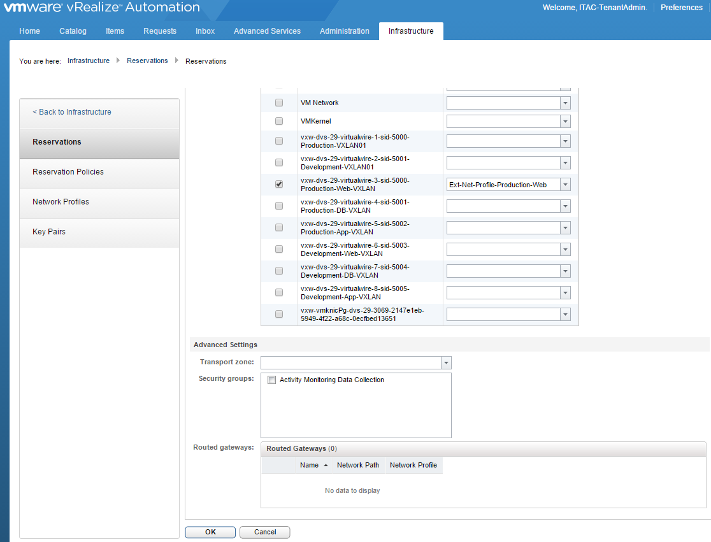 

1.  Click **OK** to save this reservation.

2.  Repeat this procedure to create a reservation for the **Development Business Group. 
    **Use the same memory and storage values, and use** **the following settings.

| Setting                | Value                                          |
|------------------------|------------------------------------------------|
| **Computer Resource**  | SFO01-Comp01 (comp01vc01.sfo01.rainpole.local) |
| **Name**               | SFO01-Comp01-Dev-Res01                         |
| **Tenant**             | rainpole                                       |
| **Business Group**     | Development Business Group                     |
| **Reservation Policy** | LAX-Development-Policy                         |
| **Priority**           | 100                                            |

| Port Group                            | Network Profile                 |
|---------------------------------------|---------------------------------|
| vxw-dvs-*xxxxx*-Development-Web-VXLAN | Ext-Net-Profile-Development-Web |

1.  Confirm that you have successfully created both reservations.

> 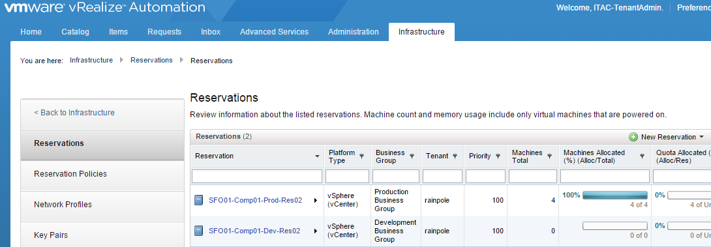

1.  Repeat this procedure to create reservations for unified single machine blueprints for all other vCenter Server compute clusters in your environment. 

> 

### Create a Service Catalog for the Unified Blueprint

The service catalog provides a common interface for consumers of IT services to request and manage the services and resources they need. Users can browse the catalog to request services, track their requests, and manage their provisioned service items.   

After the service catalog is created, business group managers can create entitlements for services, catalog items, and resource actions to groups of users. The entitlement allows members of a particular business group, for example, the Production business group, to use the blueprint. Without an entitlement, users cannot use the blueprint. 

1.  You must create the entitlement before you create the blueprint.

Procedure

1.  Log into the vRealize Automation console.

    1.  Open a Web browser and go to **https://vra01svr01.rainpole.local/vcac/org/rainpole**

    2.  Log in as the IaaS administrator for the Rainpole tenant using the following credentials.

<!-- -->

1.  If you are already logged into the vRealize Automation console as another user, log out, and then log back in using the IaaS administrator credentials for the Rainpole tenant.  

| Setting       | Value                           |
|---------------|---------------------------------|
| **User name** | ITAC-TenantAdmin@rainpole.local |
| **Password**  | *rainpole\_admin\_password *    |

1.  Click the **Administration** tab, and select **Catalog Management &gt; Services**. 
    The **Add Service** dialog box appears.

    1.  Type **Unified Single Machine Catalog** in the **Name** text box.

    2.  Select **Active** from the **Status** drop-down menu.

    3.  Click **Add**.

> 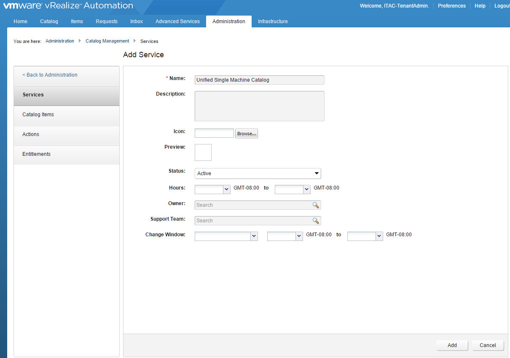

### Create an Entitlement for the Unified Blueprint Catalog

Entitle all blueprints in the Unified Blueprint Catalog to the Production and Development business groups. Entitlements determine which users and groups can request specific catalog items or perform specific actions. Entitlements are specific to a business group, and allow users in different business groups to access the blueprint catalog. 

Perform this procedure twice, first to associate the **Unified Blueprint Catalog** with the **Prod-SingleVM-Entitlement **entitlement, and then once again to associate the **Unified Blueprint Catalog** with the **Dev-SingleVM-Entitlement **entitlement.

Procedure

1.  Log into the vRealize Automation console.

    1.  Open a Web browser and go to **https://vra01svr01.rainpole.local/vcac/org/rainpole**.

    2.  Log in as the IaaS administrator for the Rainpole tenant using the following credentials.

<!-- -->

1.  If you are already logged into the vRealize Automation console as another user, log out, and then log back in using the IaaS administrator credentials for the Rainpole tenant.  

| Setting       | Value                           |
|---------------|---------------------------------|
| **User name** | ITAC-TenantAdmin@rainpole.local |
| **Password**  | *rainpole\_admin\_password *    |

1.  Associate the **Unified Blueprint Catalog** with the **Prod-SingleVM-Entitlement** entitlement you** **created earlier.

    1.  Select **Administration &gt; Catalog Management &gt; ****Entitlements**. 

    2.  Click **Prod-SingleVM-Entitlement**. The **Edit Entitlement** pane appears. 

    3.  Select the** Items & Approvals** tab.

    4.  Click the **Add** icon.** **

    5.  Add the **Unified Single Machine Catalog** to the **Entitled Services** list.

    6.  Click **Update** to save your changes.

> 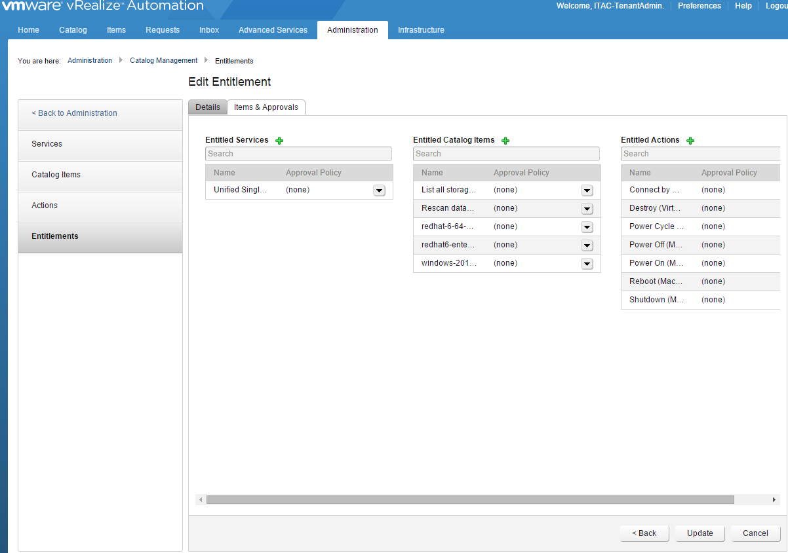

1.  Repeat this procedure and associate the **Unified Blueprint Catalog** with the **Dev-SingleVM-Entitlement **entitlement you created earlier.

    1.  ### Create Unified Single Machine Blueprints

A blueprint is the complete specification for a virtual, cloud, or physical machine. Blueprints determine a machine's attributes, the manner in which it is provisioned, and its policy and management settings. Create three blueprints from which to clone the virtual machine for your environment using pre-configured resources on the vCenter Server compute cluster in both Region A and Region B. Tenants use these blueprints to automatically provision virtual machines. 

You create three blueprints using this procedure. Repeat this procedure to create a Unified Single Machine blueprint for each blueprint name listed in the following table.

Table 21. Blueprints

| Blueprint Name                                | VM Template                                                | Reservation Policy      | Service Catalog                |
|-----------------------------------------------|------------------------------------------------------------|-------------------------|--------------------------------|
| Windows Server 2012 R2 - Unified              | windows-2012r2-64 (comp01vc01.sfo01.rainpole.local)        | UnifiedBlueprint-Policy | Unified Single Machine Catalog |
| Windows Server 2012 R2 With SQL2012 - Unified | windows-2012r2-64-sql2012(comp01vc01.sfo01.rainpole.local) | UnifiedBlueprint-Policy | Unified Single Machine Catalog |
| Redhat Enterprise Linux 6 - Unified           | redhat6-enterprise-64(comp01vc01.sfo01.rainpole.local)     | UnifiedBlueprint-Policy | Unified Single Machine Catalog |

Procedure

1.  Log into the vRealize Automation console.

    1.  Open a Web browser and go to **https://vra01svr01.rainpole.local/vcac/org/rainpole**.

    2.  Log in as the IaaS administrator for the Rainpole tenant using the following credentials.

<!-- -->

1.  If you are already logged into the vRealize Automation console as another user, log out, and then log back in using the IaaS administrator credentials for the Rainpole tenant.  

| Setting       | Value                           |
|---------------|---------------------------------|
| **User name** | ITAC-TenantAdmin@rainpole.local |
| **Password**  | *rainpole\_admin\_password *    |

1.  Navigate to** Infrastructure** &gt; **Blueprints** &gt;** Blueprints**. 

2.  Click **New Blueprints **&gt;** Virtual **&gt;** vSphere (vCenter)**.

3.  Select the **Blueprint Information** tab, provide the following values, and click **OK**.

    1.  Type the name **Windows Server 2012 R2 - Unified** in the **Name** text box, and, optionally, a description.

    2.  Type **UnifiedBlueprint-Policy** in the **Reservation Policy** text box. 

    3.  Select **Use group default** from the **Machine prefix** drop-down menu.

    4.  Type **15 **in the **Archive (days)** text box. This is the number of days to archive machines provisioned from this blueprint.

> 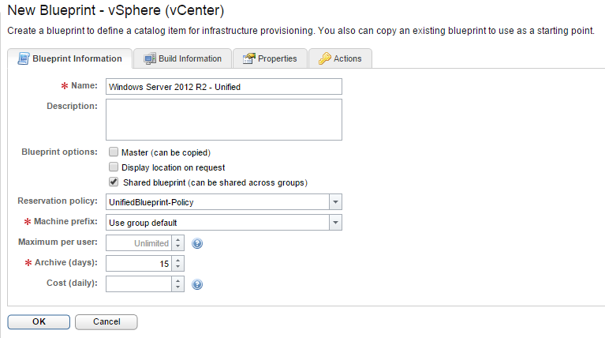

 

1.  Select the **Build Information** tab, specify the values in the following table, and click **OK**.
    The system updates the storage volume to match the storage volume for the virtual machine that you are cloning. 

    1.  Select **Server** from the **Blueprint type** drop-down menu.

    2.  Select **Clone **from the **Action **drop-down menu.

    3.  Select **CloneWorkflow **from the **Provisioning workflow** drop-down menu.

    4.  Click the **Browse **icon next to the **Clone from** text box, and select the template **windows-2012r2-64** (from comp01vc01.sfo01.rainpole.local).

<!-- -->

1.  If some virtual machine templates are not visible in the selection list, run data collection on the cluster where the virtual machine templates are located. See "Add Compute Resources to a Fabric Group" in *Add a Compute vCenter to vRealize Automation*. vRealize Automation pulls the inventory data only periodically from the vCenter Server system, so you have to manually trigger the inventory update if you uploaded virtual machine templates after the last data collection.  

    1.  Type the customization specification name **itac-windows-joindomain-custom-spec** in the **Customization spec** text box. 

<!-- -->

1.  Configure Machine Resources.

    1.  Specify CPU settings for provisioned machines. Type **1** in the **Minimum **text box, and **4** in the **Maximum** text box.

    2.  Specify memory settings for provisioned machines. Type **4096 **in the **Minimum **text box, and **16384 **in the **Maximum** text box.

    3.  Specify storage settings for provisioned machines. Type **50 **in the **Minimum **text box, and **60 **in the **Maximum** text box.

    4.  Specify the lease settings for provisioned machines. Type **30 **in the **Minimum **text box, and **270 **in the **Maximum** text box.

> 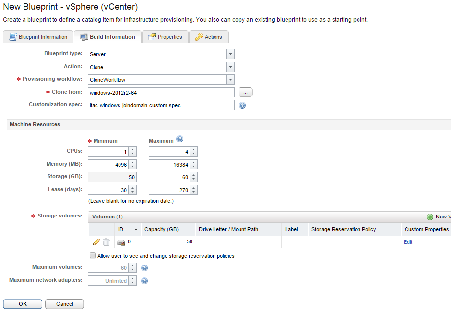

1.  Select the **Properties** tab, and click **New Property** to create a custom property with the following settings.

    1.  Type the custom property name **Vrm.DataCenter.Location** in the **Name **text box.
        **Note**: The custom property name is case sensitive. 

    2.  Type the number 4 in the **Value **text box.

    3.  Deselect the **Encrypted** check box, which stores the custom property in the database unencrypted.

    4.  Select the **Prompt user** check box to require the user to provide a value when they request a machine.

    5.  This prompts users for a value, and the value you provided in the custom property is presented to them as the default. If you do not provide a default, users cannot continue with the machine request until they provide a value for the custom property. 

    6.  Click the **Save** icon ().

2.  Click **OK**.

> 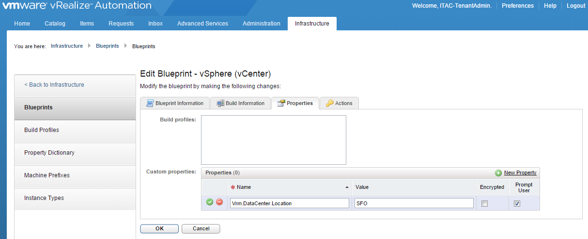

1.  Hover the mouse pointer over the blueprint label **Windows Server 2012 R2 - Unified**, and click **Publish** to publish the blueprint.

2.  Add the blueprint to the **Unified Single Machine Catalog**.

    1.  Select the **Administration** tab, navigate to **Catalog Management** &gt;** Catalog Items**.

    2.  In the **Catalog Items** list, click the blueprint label **Windows Server 2012 R2 - Unified**.

    3.  In the **Configure Catalog Items** dialog box, set** Service** to **Unified Single Machine Catalog** and click **Update**.

> 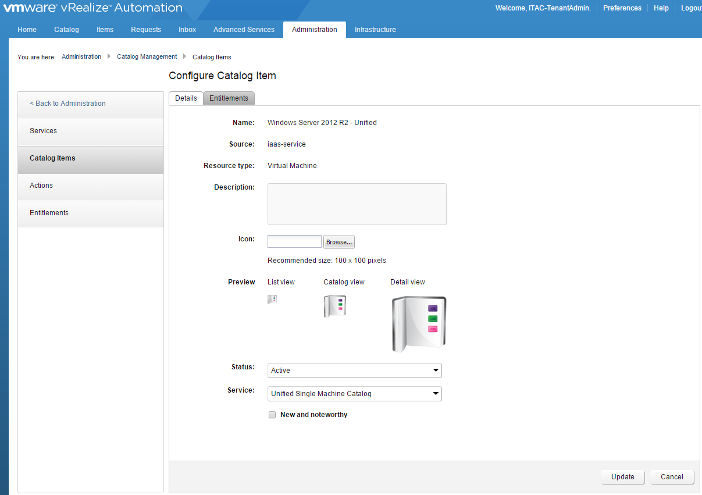

1.  Repeat this procedure to create a Unified Single Machine blueprint for each blueprint name listed in the following table. 

| Blueprint Name                                | VM Template                                                | Reservation Policy      | Service Catalog                |
|-----------------------------------------------|------------------------------------------------------------|-------------------------|--------------------------------|
| Windows Server 2012 R2 - Unified              | windows-2012r2-64 (comp01vc01.sfo01.rainpole.local)        | UnifiedBlueprint-Policy | Unified Single Machine Catalog |
| Windows Server 2012 R2 With SQL2012 - Unified | windows-2012r2-64-sql2012(comp01vc01.sfo01.rainpole.local) | UnifiedBlueprint-Policy | Unified Single Machine Catalog |
| Redhat Enterprise Linux 6 - Unified           | redhat6-enterprise-64(comp01vc01.sfo01.rainpole.local)     | UnifiedBlueprint-Policy | Unified Single Machine Catalog |

### Test the Cross-Region Deployment of the Single Machine Blueprints

The data center environment is now ready for the multi-site deployment of virtual machines using vRealize Automation. Test your environment and confirm the successful provisioning of virtual machines using the blueprints you created to both Region A and Region B.

1.  Log into the vRealize Automation console.

    1.  Open a Web browser and go to **https://vra01svr01.rainpole.local/vcac/org/rainpole**.

    2.  Log in as the IaaS administrator for the Rainpole tenant using the following credentials.

<!-- -->

1.  If you are already logged into the vRealize Automation console as another user, log out, and then log back in using the IaaS administrator credentials for the Rainpole tenant.  

| Setting       | Value                           |
|---------------|---------------------------------|
| **User name** | ITAC-TenantAdmin@rainpole.local |
| **Password**  | *rainpole\_admin\_password *    |

1.  Select the **Catalog** tab, and click **Unified Single Machine Catalog** from the catalog of available services.

> 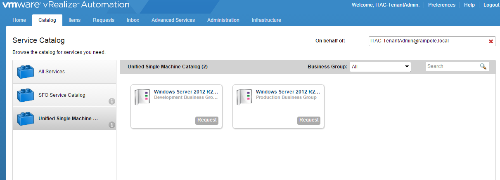

1.  Click the **Request** button for the **Windows Server 2012 R2 - Unified **blueprint.** **
    The **New Request** window appears.  

2.  Select **SFO** from the **Select a Region** drop-down men, and click **Submit**.

> 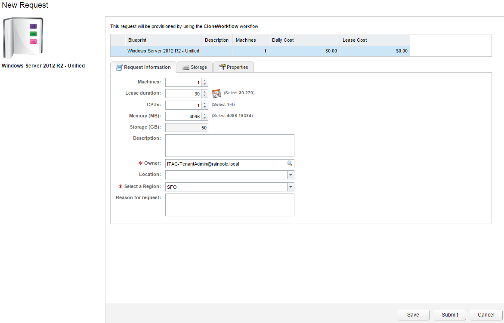

1.  Verify the request finishes successfully, and that the virtual machine provisions in the SFO vCenter Server compute cluster.

    1.  Select the **Requests** tab. 

    2.  Select the request you submitted, and wait several minutes for the request to complete. Click the **Refresh** icon every few minutes until you see a **Successful** message appear under **Status**.

    3.  Click **View Details**.

> Under **Status Details**, verify that the virtual machine successfully provisioned. In this case, the virtual machine name is **Prod-00037**, and the system output appears as **Request succeeded. Created Prod-00037.**
>
> 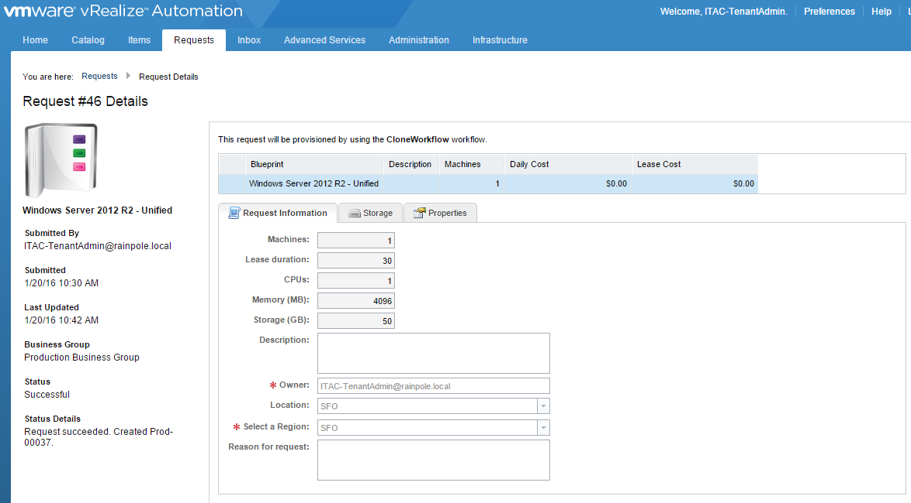

1.  Log into the vCenter Server console.

    1.  Open a Web browser and go to **https://comp01vc01.sfo01.rainpole.local/vsphere-client**

    2.  Log in as the vCenter Server administrator using the following credentials.

| Setting       | Value                       |
|---------------|-----------------------------|
| **User name** | administrator@vsphere.local |
| **Password**  | *vcenter\_admin\_password*  |

1.  Select **Home &gt; VMs and Templates**. 

2.  In the Navigator panel, expand the vCenter Server compute cluster **comp01vc01.sfo01.rainpole.local**, and verify the existence of the **Prod-00037** virtual machine.

> 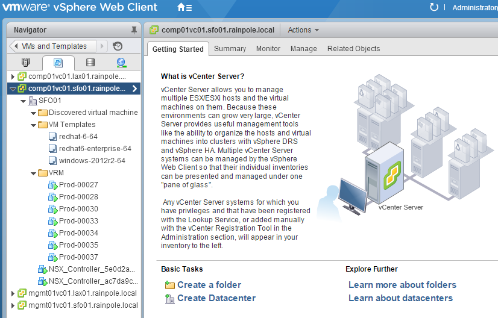

1.  Repeat this procedure and provision virtual machines to the LAX vCenter Server compute cluster. Verify the request finishes successfully and that the virtual machine is provisioned in the LAX vCenter Server compute cluster.
