Version History

| Date        | Ver. | Author     | Description                                                             | Reviewers |
|-------------|------|------------|-------------------------------------------------------------------------|-----------|
| 15-Feb-2016 | 1.0  | ISBU / PSE | General Availability of Vmware Validated Design for IT Automation Cloud | Tech Pubs |

© 2016 VMware, Inc. All rights reserved. This product is protected by U.S. and international copyright and intellectual property laws. This product is covered by one or more patents listed at [http://www.vmware.com/download/patents.html](http://www.microsoft.com/).

VMware is a registered trademark or trademark of VMware, Inc. in the United States and/or other jurisdictions. All other marks and names mentioned herein may be trademarks of their respective companies.

VMware, Inc.
3401 Hillview Avenue
Palo Alto, CA 94304
www.vmware.com

Contents

[1. Purpose and Assumptions 6](#_Toc443068007)

[2. Monitoring and Alerting 7](#monitoring-and-alerting)

[2.1 Creating Alerts in vRealize Log Insight 7](#creating-alerts-in-vrealize-log-insight)

[2.2 Creating Custom SDDC vRealize Operations Dashboards 38](#creating-custom-sddc-vrealize-operations-dashboards)

[2.3 Configure vRealize Operations Manager to Notify of SDDC Issues 55](#configure-vrealize-operations-manager-to-notify-of-sddc-issues)

[3. Business Continuity Operations 70](#business-continuity-operations)

[3.1 Region A Backup and Restore 70](#region-a-backup-and-restore)

[3.2 Region B Backup and Restore 99](#region-b-backup-and-restore)

[3.3 Verifying vRealize Automation Operation after Restore or Disaster Recovery Failover 128](#verifying-vrealize-automation-operation-after-restore-or-disaster-recovery-failover)

[3.4 Promote the Replica vRealize Automation PostgreSQL Database to Primary 140](#promote-the-replica-vrealize-automation-postgresql-database-to-primary)

[4. SDDC Startup and Shutdown 142](#sddc-startup-and-shutdown)

[4.1 Shutdown Order of the Management VMs 142](#shutdown-order-of-the-management-vms)

[4.2 Startup Order of the Management VMs 146](#startup-order-of-the-management-vms)

[5. Site Protection and Recovery 149](#site-protection-and-recovery)

[5.1 Before You Initiate Disaster Recovery of the Management Stack 149](#before-you-initiate-disaster-recovery-of-the-management-stack)

[5.2 Prerequisites for SDDC Failover 151](#prerequisites-for-sddc-failover)

[5.3 BCDR Failover Checklist 152](#bcdr-failover-checklist)

[5.4 Failover of the SDDC Management Applications 153](#failover-of-the-sddc-management-applications)

[5.5 Post-Failover Configuration of the Management Applications 239](#post-failover-configuration-of-the-management-applications)

[5.6 SDDC Failover Validation 253](#sddc-failover-validation)

Purpose and Assumptions
===========================================================================================================================================================================================================================================================================================================================================================================================================================================================================================================================================================================================================

The VMware Validated Design for IT Automation Cloud Installation and Configuration Procedures provide step-by-step instructions for installing, configuring, and operating a software-defined data center based on a VMware Validated Design called IT Automation Cloud.

It does not cover step-by-step instructions for performing all of the required post-configuration tasks, as these are often dependent on the customer requirements.

For easier consumption, these installation and configuration procedures have been broken down into smaller documents as defined in the table below:

Table . Installation and Configuration Procedures Document Set

| Document Name                | Description                                                                                                                                                                                |
|------------------------------|--------------------------------------------------------------------------------------------------------------------------------------------------------------------------------------------|
| 1.  Planning and Preparation | Detailed information surrounding the requirements of software, tools and external services required to succesfully implement the VMware Validated Design for IT Automation Cloud platform. |
| 1.  Deployment of Region A   | Step-by-step instructions for installing and configuring all components deployed within Region A of the VMware Validated Design for IT Automation Cloud platform.                          |
| 1.  Deployment of Region B   | Step-by-step instructions for installing and configuring all components deployed within Region B of the VMware Validated Design for IT Automation Cloud platform.                          |
| 1.  Operational Guidance     

 (This Document)               | Step-by-step instructions for performing operational tasks such as monitoing, alerting and business continuity operations of the VMware Validated Design for IT Automation Cloud platform. |

The documents are written with the assumption that the reader that uses these procedures is already familiar with the products. It is not intended for those that have no prior knowledge of the concepts and terminology.

Monitoring and Alerting
=======================

Configure monitoring of the operations in the SDDC in vRealize Operations Manager and vRealize Log Insight, and enable notifications about issues in your environment.

-   Creating Alerts in vRealize Log Insight

-   Creating Custom SDDC vRealize Operations Dashboards

-   Configure vRealize Operations Manager to Notify of SDDC issues

-   Monitor vSphere Data Protection Jobs by Email

-   Configure vRealize Automation System Notification Events

    1.  Creating Alerts in vRealize Log Insight
        ---------------------------------------

Use the vRealize Log Insights known event signature engine to monitor key events. You can use a set of alerts to send to vRealize Operations Manager and via SMTP for operations team notification.

The integration between vRealize Log Insight and vRealize Operations Manager allows for implementing the following cross-product event tracking:

-   Sending alerts from vRealize Log Insight to vRealize Operations Manager which automatically maps them to the target objects

-   Launching in context from a vRealize Operations Manager object to the objects logs in vRealize Log Insight

-   Launching in context from a vRealize Log Insight event to the objects in vRealize Operations Manager

For example, you can enable alerting for the following products:

-   vSphere resource availability

<!-- -->

-   ESXi availability and hardware alerting

-   vCenter Server connectivity to hosts

<!-- -->

-   Storage availability

<!-- -->

-   Connectivity to NFS datastores

-   Capacity threshold altering

<!-- -->

-   Networking availability

<!-- -->

-   Network uplink connectivity

For applications that are failed over between regions, such as vRealize Automation and vRealize Operations Manager, configure alerting in both regions to avoid missing any alerts when applications move between regions.

### Configure vCenter Server to Forward Log Events to vRealize Log Insight

Install the vRealize Log Insight agent to collect and forward events to vRealize Log Insight on the vCenter Server instances and Platform Services Controllers in the data center.

By installing the Log Insight agent on vCenter Server and Platform Services Controller, you collect log data that is related to the vCenter Server operation.

Procedure

1.  Download the Linux agent of vRealize Log Insight.

    1.  In a Web browser, go to the following URL.

| Region       | vRealize Log Insight URL                     |
|--------------|----------------------------------------------|
| **Region A** | https://vrli-cluster-01.sfo01.rainpole.local |
| **Region B** | https://vrli-cluster-51.lax01.rainpole.local |

1.  Use the **admin** user and the **vrli\_admin\_password** password to log in.

2.  In the vRealize Log Insight UI, click the configuration drop-down menu icon  and select **Administration**.

3.  Under **Management**, click **Agents**.

4.  On the **Agents** page, click the **Download Log Insight Agent Version 3.0.0** link.

<!-- -->

1.  In the **Download Log Insight Agent Version 3.0.0** dialog box, click **Linux BIN (32-bit/64-bit)** and save the .bin file on your computer.

    

<!-- -->

1.  Create a vCenter Server Agent Group.

    1.  In the vRealize Log Insight UI, click the configuration drop-down menu icon  and select **Administration**.

    2.  Under **Management**, click **Agents**.

    3.  On the **Agents** page, from the **Agents** drop-down list at the top select **vSphere 6.x - vCenter (Linux) Complete**.

        You see the agent configuration template file.

    4.  Under the agent configuration text box, click **Copy Template**, and in the **Copy Agent Group** dialog box click **Copy**.

        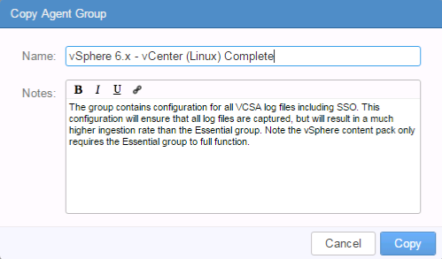

    5.  In the agent filter, set filter attribute to **Hostname**, the operator to **matches,** and the value to the host name for each vCenter Server or Platform Services Controller appliance for the region that you are working in.

| Appliances                        | Host Names in Region A           | Host Names in Region B           |
|-----------------------------------|----------------------------------|----------------------------------|
| **vCenter Server instances**      | mgmt01vc01.sfo01.rainpole.local  

                                     comp01vc01.sfo01.rainpole.local   | mgmt01vc51.lax01.rainpole.local  

                                                                        comp01vc51.lax01.rainpole.local   |
| **Platform Services Controllers** | mgmt01psc01.sfo01.rainpole.local

                                     comp01psc01.sfo01.rainpole.local  | mgmt01psc51.lax01.rainpole.local

                                                                        comp01psc51.lax01.rainpole.local  |

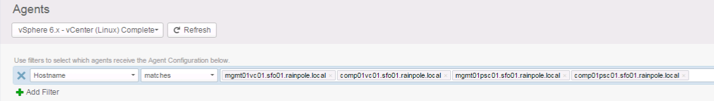

1.  Scroll down to the bottom of the page and click the **Save New Group** button.

<!-- -->

1.  Install the Log Insight agent on the vCenter Server Appliance or Platform Services Controller appliance.

    1.  Connect to the appliance over SSH.

| Appliances                        | Host Names in Region A           | Host Names in Region B           |
|-----------------------------------|----------------------------------|----------------------------------|
| **vCenter Server instances**      | mgmt01vc01.sfo01.rainpole.local  

                                     comp01vc01.sfo01.rainpole.local   | mgmt01vc51.lax01.rainpole.local  

                                                                        comp01vc51.lax01.rainpole.local   |
| **Platform Services Controllers** | mgmt01psc01.sfo01.rainpole.local

                                     comp01psc01.sfo01.rainpole.local  | mgmt01psc51.lax01.rainpole.local

                                                                        comp01psc51.lax01.rainpole.local  |

1.  Use the **root** user name and **appliance\_root\_password** password to log in.

<!-- -->

1.  Copy the .bin file of the agent to the /root folder of the vCenter Server Appliance or the Platform Services Controller appliance. You can use scp, FileZilla or WinSCP.

2.  Run the following console commands to make the agent .bin file executable.

> cd /root
>
> chmod +x VMware-Log-Insight-Agent-3.0.0-2985111\_192.168.31.10.bin

1.  Install the agent by running the following command.

    ./VMware-Log-Insight-Agent-3.0.0-2985111\_192.168.31.10.bin

    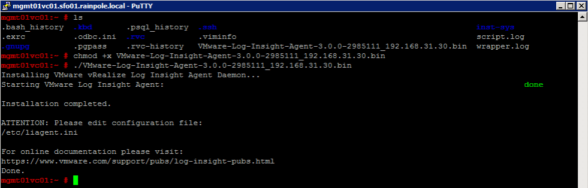

<!-- -->

1.  Verify whether the /etc/liagent.ini file is configured to send logs to vRealize Log Insight.

    1.  Verify that the \[server\] section contains the following hostname parameter

        hostname=vrli-cluster-01.sfo01.rainpole.local (for Region A appliances)

        hostname=vrli-cluster-51.lax01.rainpole.local (for Region B appliances)

    2.  If the hostname parameter is not available, add it and save the changes to /etc/liagent.ini.

2.  Repeat steps 4 and 5 for each appliance.

3.  Verify that the appliances are in the **vSphere 6.x - vCenter (Linux) Complete** agent group in vRealize Log Insight.

    1.  In a Web browser, go to the following URL.

| Region       | vRealize Log Insight URL                     |
|--------------|----------------------------------------------|
| **Region A** | https://vrli-cluster-01.sfo01.rainpole.local |
| **Region B** | https://vrli-cluster-51.lax01.rainpole.local |

1.  Use the **admin** user and the **vrli\_admin\_password** password to log in.

2.  In the vRealize Log Insight UI, click the configuration drop-down menu icon  and select **Administration**.

3.  Under **Management**, click **Agents**.

4.  On the **Agents** page, from the **Agents** drop-down menu select **vSphere 6.x - vCenter (Linux) Complete**.

5.  Verify that the appliances are registered on the page.

    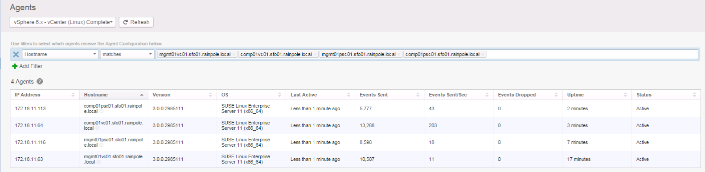

<!-- -->

1.  Repeat the process for the appliances in the other region.

    1.  ### View the Full List of Alerts for a Management Product

Explore the alerts and queries that are available in vRealize Log Insight for the management products in the SDDC such as vSphere, NSX for vSphere, vRealize Automation, and so on. The alerts and queries are handled by the content packs for these products.

Procedure

1.  Open the vRealize Log Insight user interface

    1.  In a Web browser, go to the following URL.

| Region       | vRealize Log Insight URL                     |
|--------------|----------------------------------------------|
| **Region A** | https://vrli-cluster-01.sfo01.rainpole.local |
| **Region B** | https://vrli-cluster-51.lax01.rainpole.local |

1.  Use the **admin** user name and the **vrli\_admin\_password** password to log in.

<!-- -->

1.  Locate the content pack for the management product.

    1.  In the vRealize Log Insight UI, click the configuration drop-down menu icon  and select **Content Packs**.

    2.  Under **Installed Content Packs**, select the pack.

    3.  Click **Alerts** or **Queries** to view the full list of alerts for the product.

        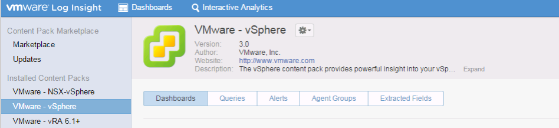

        1.  ### vSphere Resource Alerting

Create alerts for the main resource indicators in vSphere and enable them to track the critical issues in the vSphere environment.

-   Create Alerts for vSphere Resources

-   Enable the Alerts for vSphere Resources

    1.  #### Create Alerts for vSphere Resources

Use the inbuilt problem and alert signatures in vRealize Log Insight for ESXi host and vCenter Server to enable alerts about issues.

For basic monitoring the vSphere components, use the following alerts.

| Alert Name                                                      | Purpose                                                                                                                                                                                                                                                              | Severity |
|-----------------------------------------------------------------|----------------------------------------------------------------------------------------------------------------------------------------------------------------------------------------------------------------------------------------------------------------------|----------|
| \*\*\* CRITICAL \*\*\* Hardware: Physical event detected        | The purpose of this widget is to notify when the following physical hardware events have been detected, which indicates a hardware problem. Under most normal conditions, this widget should return no results. The following types of hardware events are returned:

                                                                   • Advanced Programmable Interrupt Controller (APIC)                                                                                                                                                                                                                   
                                                                   • Machine Check Exception (MCE)                                                                                                                                                                                                                                       
                                                                   • Non-Maskable Interrupt (NMI)                                                                                                                                                                                                                                        | Critical |
| Hardware: Faulty memory detected                                | During the previous boot of an ESXi host faulty memory was detected. Unless a corresponding corrected message is seen, the memory should be replaced.                                                                                                                | Critical |
| \*\*\* CRITICAL \*\*\* ESX/ESXi: Core dump detected             | A core dump has been detected, which indicates the failure of a component in ESX/ESXi. This issue may lead to VM crashes and/or host PSODs.                                                                                                                          | Critical |
| \*\*\* CRITICAL \*\*\* vCenter Server: ESX/ESXi stopped logging | The purpose of this alert is to notify when an ESXi host has stopped sending syslog to a remote server.                                                                                                                                                              | Critical |
| \*\*\* CRITICAL \*\*\* ESX/ESXi: RAM disk / inode table is full | A root file system has reached its resource pool limit. Various administrative actions depend on the ability to write files to various parts of the root file system and might fail if the RAM disk and/or inode table is full.                                      | Critical |
| vCenter Server: HA connection failure detected                  | A HA cluster has detected one or more unresponsive ESXi hosts. If the host(s) are marked as dead then VMs running on those hosts will be migrated to other systems.                                                                                                  | Serious  |
| ESX/ESXi: HA isolated events by hostname                        | During a health check, HA determined that a host was isolated. Depending on how HA is configured this may mean that VMs have been failed over from the isolated host.                                                                                                | Critical |

Procedure

1.  Open the vRealize Log Insight user interface.

    1.  In a Web browser, go to the following URL.

| Region       | vRealize Log Insight URL                     |
|--------------|----------------------------------------------|
| **Region A** | https://vrli-cluster-01.sfo01.rainpole.local |
| **Region B** | https://vrli-cluster-51.lax01.rainpole.local |

1.  Use the **admin** user name and the **vrli\_admin\_password** password to log in.

<!-- -->

1.  In the vRealize Log Insight UI, click the configuration drop-down menu icon  and select **Content Packs**.

2.  Under **Installed Content Packs**, select **VMware - vSphere** and click **Alerts**.

3.  In the list of alerts, click the alert name of the **\*\*\* CRITICAL \*\*\* Hardware: Physical event detected** alert to open the **New Alert** dialog.

    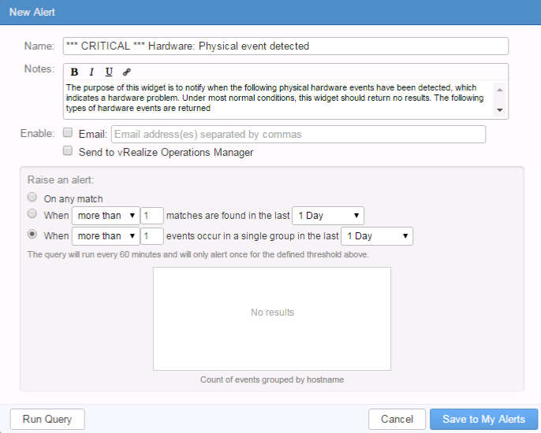

4.  Configure the following alert settings.

    1.  Select Email and enter the email address to send alerts to.

    2.  Select the **Send to vRealize Operations Manager** checkbox.
        Options about selecting a data center and criticality appear.

    3.  Underneath **Send to vRealize Operations Manager,** click the **Select** button, select **SFO01** or **LAX01** data center and select **critical** from the **Criticality** drop-down menu.

    4.  Under **Raise an alert**, select **On any match**.

        

5.  Click **Save to My Alerts**.

6.  Repeat the steps for the other basic alerts about vSphere.

    1.  #### Enable the Alerts for vSphere Resources

After you create alerts for vSphere resources, enable them to start sending notifications about critical issues in the vSphere environment.

1.  Open the vRealize Log Insight user interface.

    1.  In a Web browser, go to the following URL.

| Region       | vRealize Log Insight URL                     |
|--------------|----------------------------------------------|
| **Region A** | https://vrli-cluster-01.sfo01.rainpole.local |
| **Region B** | https://vrli-cluster-51.lax01.rainpole.local |

1.  Use the **admin** user name and the **vrli\_admin\_password** password to log in.

<!-- -->

1.  In the vRealize Log Insight UI, click **Interactive Analytics**.

2.  Click the  icon and select **Manage Alerts**. You see all available alerts.

    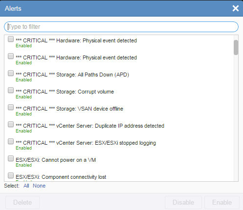

3.  Select the alerts for the vSphere resources and click **Enable**.

| Alert Name                                                      |
|-----------------------------------------------------------------|
| \*\*\* CRITICAL \*\*\* Hardware: Physical event detected        |
| Hardware: Faulty memory detected                                |
| \*\*\* CRITICAL \*\*\* ESX/ESXi: Core dump detected             |
| \*\*\* CRITICAL \*\*\* vCenter Server: ESX/ESXi stopped logging |
| \*\*\* CRITICAL \*\*\* ESX/ESXi: RAM disk / inode table is full |
| vCenter Server: HA connection failure detected                  |
| ESX/ESXi: HA isolated events by hostname                        |

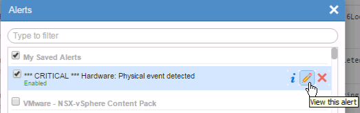

### Storage Alerting

Create alerts for storage indicators and enable them to track critical storage issues in the environment.

-   Create Alerts for Storage Resources

-   Enable the Alerts for Storage Resources

    1.  #### Create Alerts for Storage Resources

Use the inbuilt problem and alert signatures in vRealize Log Insight for storage monitoring.

For monitoring storage in the Software-Defined Data Center, you can use the following alerts in vRealize Log Insight.

| Alert Name                                           | Purpose                                                                                                                                                                                                                                                                                                               | Severity  |
|------------------------------------------------------|-----------------------------------------------------------------------------------------------------------------------------------------------------------------------------------------------------------------------------------------------------------------------------------------------------------------------|-----------|
| \*\*\* CRITICAL \*\*\* Storage: All Paths Down (APD) | One or more datastores has experienced an All Paths Down (APD) outage situation. This indicates that one or more datastores is or was unavailable. As a result of this issue, VMs are or were unavailable and ESX/ESXi hosts may have been disconnected from vCenter Server. This issue requires immediate attention. | Critical  |
| \*\*\* CRITICAL \*\*\* Storage: VSAN device offline  | A Virtual SAN storage device that backs up the datastores might fail.                                                                                                                                                                                                                                                 
                                                        This occurs due to a faulty device firmware, physical media, or storage controller or when certain storage devices are not readable or writeable.                                                                                                                                                                      

                                                        Typically, such failures are irreversible. In some instances, permanent data loss might also occur, especially when data is not replicated on other nodes before failure. Virtual SAN automatically recovers data when new devices are added to the storage cluster, unless data lost is permanent.                    | Critical  |
| Storage: NFS connectivity issue                      | The purpose of this alert is to notify when an NFS connectivity issue was detected. This means an NFS datastore is or was unavailable. Do to this issue, one or more VMs may be unavailable.                                                                                                                          | Critical  |
| Storage: NFS lock file issue                         | The purpose of this alert is to notify when an NFS lock file issue has been detected. Stale NFS lock files can prevent VMs from powering on.                                                                                                                                                                          | Critical  |
| Storage SCSI Path dead                               | The purpose of this alert is to notify when a SCSI path has become unavailable. Assuming multiple paths are in use and the other paths are online this means reduced redundancy and performance. If all paths to a storage device become unavailable then VMs running on the storage device will become unavailable.  | Immediate |
| Storage: Snapshot consolidation required             | The purpose of this alert is to notify when a snapshot consolidation is required. A failed snapshot consolidation operation that is not manually addressed can lead to a full datastore.                                                                                                                              | Immediate |

Procedure

1.  Open the vRealize Log Insight user interface.

    1.  In a Web browser, go to the following URL.

| Region       | vRealize Log Insight URL                     |
|--------------|----------------------------------------------|
| **Region A** | https://vrli-cluster-01.sfo01.rainpole.local |
| **Region B** | https://vrli-cluster-51.lax01.rainpole.local |

1.  Use the **admin** user name and the **vrli\_admin\_password** password to log in.

<!-- -->

1.  In the vRealize Log Insight UI, click the configuration drop-down menu icon  and select **Content Packs**.

2.  Under **Installed Content Packs**, select **VMware - vSphere** and click **Alerts**.

3.  In the list of alerts, click the alert name of the **\*\*\* CRITICAL \*\*\* Storage: All Paths Down (APD)** alert to open the **New Alert** dialog.

    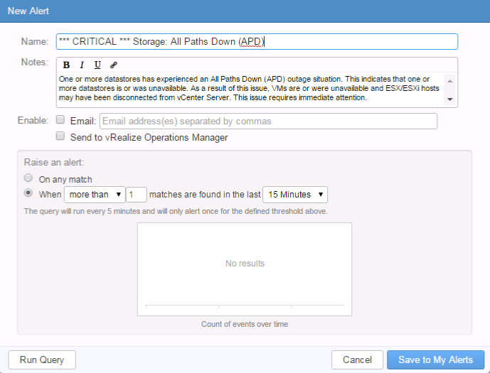

4.  Configure the following alert settings.

    1.  Select **Email** and enter the email address to send alerts to.

    2.  Select the **Send to vRealize Operations Manager** checkbox.
        Options about selecting a data center and criticality appear.

    3.  Underneath **Send to vRealize Operations Manager,** click the **Select** button, select **SFO01** or **LAX01** data center and select **critical** from the **Criticality** drop-down menu.

    4.  Under **Raise an alert**, select **On any match**.

        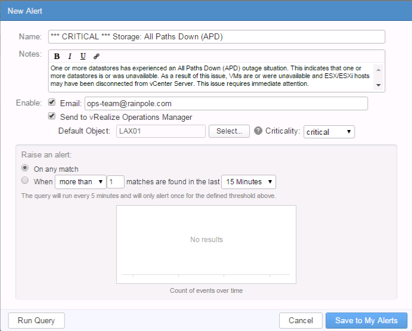

5.  Click **Save to My Alerts**.

6.  Repeat the steps for the other alerts for storage.

    1.  #### Enable the Alerts for Storage Resources

After you create alerts for storage resources, enable them to start sending notifications about critical issues in the vSphere storage configuration.

1.  Open the vRealize Log Insight user interface.

<!-- -->

1.  In a Web browser, go to the following URL.

| Region       | vRealize Log Insight URL                     |
|--------------|----------------------------------------------|
| **Region A** | https://vrli-cluster-01.sfo01.rainpole.local |
| **Region B** | https://vrli-cluster-51.lax01.rainpole.local |

1.  Use the **admin** user name and the **vrli\_admin\_password** password to log in.

<!-- -->

1.  In the vRealize Log Insight UI, click **Interactive Analytics**.

2.  Click the  icon and select **Manage Alerts**. You see all available alerts.

    

3.  Select the alerts for the storage resources and click **Enable**.

| Alert Name                                           |
|------------------------------------------------------|
| \*\*\* CRITICAL \*\*\* Storage: All Paths Down (APD) |
| \*\*\* CRITICAL \*\*\* Storage: VSAN device offline  |
| Storage: NFS connectivity issue                      |
| Storage: NFS lock file issue                         |
| Storage SCSI Path dead                               |
| Storage: Snapshot consolidation required             |

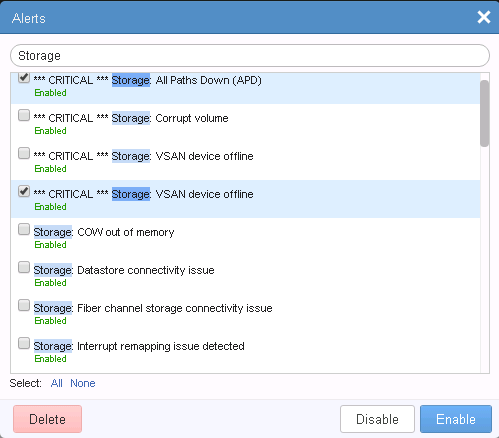

### vSphere Network Alerting

Create alerts for the main resource indicators in vSphere networking and enable them to track the critical issues in the networking configuration.

-   Create Alerts for vSphere Networking

-   Enable the Alerts for vSphere Networking

    1.  #### Create Alerts for vSphere Networking

Use the inbuilt problem and alert signatures in vRealize Log Insight for networking to enable alerts about issues.

For basic monitoring the vSphere networking components, use the following alerts.

| Alert Name                               | Purpose                                                                                                                                                                    | Severity |
|------------------------------------------|----------------------------------------------------------------------------------------------------------------------------------------------------------------------------|----------|
| Network: ESXi physical NIC down          | ESXi has reported that a physical NIC has become unavailable. Assuming other NICs are still online this indicates a lack of redundancy and a potential performance impact.

                                            If all physical NICs for a vSwitch/dvSwitch are unavailable then communication problems to VMs and/or the ESXi host may be possible.                                        | Critical |
| Network: ESX/ESXi uplink redundancy lost | Only one physical NIC is currently connected, one more failure will result in a loss of connectivity.                                                                      | Critical |
| Network: Out of Memory                   | Under certain circumstances, hosts with NetQ enabled may run out of memory when using jumbo frames.                                                                        

                                            Out of memory conditions could lead to lost connectivity between vCenter Server, NFS datastores, and the virtual machine level.                                             | Critical |

Procedure

1.  Open the vRealize Log Insight user interface.

<!-- -->

1.  In a Web browser, go to the following URL.

| Region       | vRealize Log Insight URL                     |
|--------------|----------------------------------------------|
| **Region A** | https://vrli-cluster-01.sfo01.rainpole.local |
| **Region B** | https://vrli-cluster-51.lax01.rainpole.local |

1.  Use the **admin** user name and the **vrli\_admin\_password** password to log in.

<!-- -->

1.  In the vRealize Log Insight UI, click the configuration drop-down menu icon  and select **Content Packs**.

2.  Under **Installed Content Packs**, select **VMware - vSphere** and click **Alerts**. In the list of alerts, click the alert name of the **Network: ESXi physical NIC down** alert to open the **New Alert** dialog.

    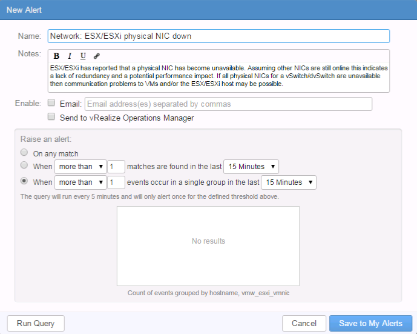

3.  Configure the following alert settings.

<!-- -->

1.  Select **Email** and enter the email address to send alerts to.

2.  Select the **Send to vRealize Operations Manager** checkbox.

    Options about selecting a data center and criticality appear.

3.  Underneath **Send to vRealize Operations Manager,** click the **Select** button, select **SFO01** or **LAX01** data center and select **critical** from the **Criticality** drop-down menu.

4.  Under **Raise an alert**, select **On any match**.

    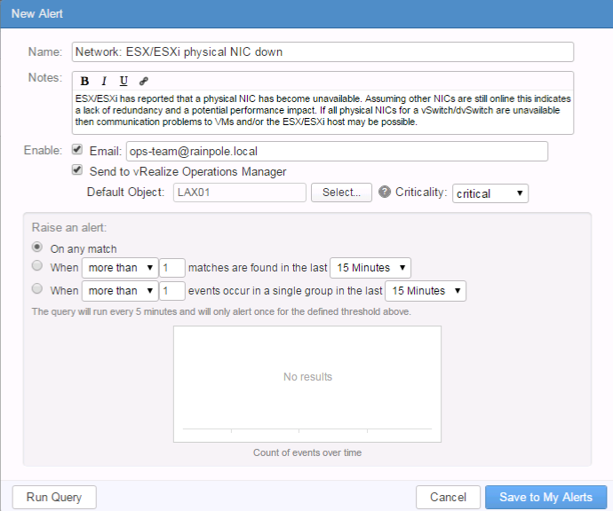

<!-- -->

1.  Click **Save to My Alerts**.

2.  Repeat the steps for the other alerts about vSphere networking.

    1.  #### Enable the Alerts for vSphere Networking

After you create alerts for vSphere networking, enable them to start sending notifications about critical issues in the vSphere environment.

1.  Open the vRealize Log Insight user interface.

<!-- -->

1.  In a Web browser, go to the following URL.

| Region       | vRealize Log Insight URL                     |
|--------------|----------------------------------------------|
| **Region A** | https://vrli-cluster-01.sfo01.rainpole.local |
| **Region B** | https://vrli-cluster-51.lax01.rainpole.local |

1.  Use the **admin** user name and the **vrli\_admin\_password** password to log in.

<!-- -->

1.  In the vRealize Log Insight UI, click **Interactive Analytics**.

2.  Click the  icon and select **Manage Alerts**. You see all available alerts.

> 

1.  Select the alerts for the vSphere networking and click **Enable**.

| Alert Name                               |
|------------------------------------------|
| Network: ESXi physical NIC down          |
| Network: ESX/ESXi uplink redundancy lost |
| Network: Out of Memory                   |

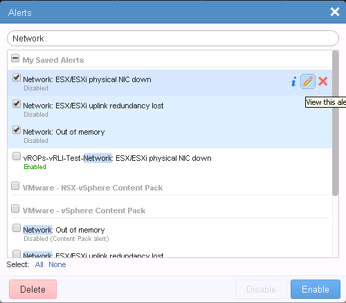

### vRealize Automation Alerting

Create alerts for the main indicators in vRealize Automation and enable them to track the critical issues in the vRealize Automation configuration.

-   Create Alerts for vRealize Automation

-   Enable the Alerts for vRealize Automation

    1.  #### Create Alerts for vRealize Automation

Use the inbuilt problem and alert signatures in vRealize Log Insight for vRealize Automation.

For monitoring the vRealize Automation deployment in the Software-Defined Data Center, you can use the following alerts in vRealize Log Insight.

| Alert Name                                               | Purpose                                                                                                                                                                                                                                                                                                                                                                                                                                                                          | Severity |
|----------------------------------------------------------|----------------------------------------------------------------------------------------------------------------------------------------------------------------------------------------------------------------------------------------------------------------------------------------------------------------------------------------------------------------------------------------------------------------------------------------------------------------------------------|----------|
| \*\*\* CRITICAL \*\*\* vRO service unavailable!          | If vRealize Operations is unavailable then this could impact Advanced Service Designer workflows or customized IAAS workflows that leverage vRO.                                                                                                                                                                                                                                                                                                                                 | Critical |
| \*\*\* CRITICAL \*\*\* vRA authentication issue detected | The SSO server of the identity appliance is unable to correctly collect information on the account since the UPN domain is not associated with the AD domain. For example, the AD domain is corp.mydomain.com, but the UPN (userPrincipalName) is myname@mydomain.com. As a result, after authenticating user's may be getting a blank page or a page with a single submit button appears and the URL loops between the identity server and the vRealize Automation server URLs. | Critical |
| \*\*\* CRITICAL \*\*\* vRA service unavailable!          | A vRealize Automation service has become unavailable. This may happen because:                                                                                                                                                                                                                                                                                                                                                                                                   

                                                            -   A service has failed - if the service does not automatically restart this may impact vRA's ability to function.                                                                                                                                                                                                                                                                                                                                                               

                                                            -   A service is blocked and cannot response at the moment - this may indicate increased load within the environment.                                                                                                                                                                                                                                                                                                                                                             

                                                            -   vRA is starting and certain dependencies of the component are not available yet - this issue should clear automatically as all services come online.                                                                                                                                                                                                                                                                                                                          | Critical |
| \*\*\* CRITICAL \*\*\* vRA disk is full                  | Windows host(s) have disk that is at capacity. If disk space runs out completely, it will impact the Infrastructure services provided by IaaS component of vRA and the Infrastructure tab will become unavailable from the vRA UI.                                                                                                                                                                                                                                               | Critical |

**Procedure**

1.  Open the vRealize Log Insight user interface.

<!-- -->

1.  In a Web browser, go to the following URL.

| Region       | vRealize Log Insight URL                     |
|--------------|----------------------------------------------|
| **Region A** | https://vrli-cluster-01.sfo01.rainpole.local |
| **Region B** | https://vrli-cluster-51.lax01.rainpole.local |

1.  Use the **admin** user name and the **vrli\_admin\_password** password to log in.

<!-- -->

1.  In the vRealize Log Insight UI, click the configuration drop-down menu icon  and select **Content Packs**.

2.  Under **Installed Content Packs**, select **VMware - vRA 6.1+** and click **Alerts**.

> 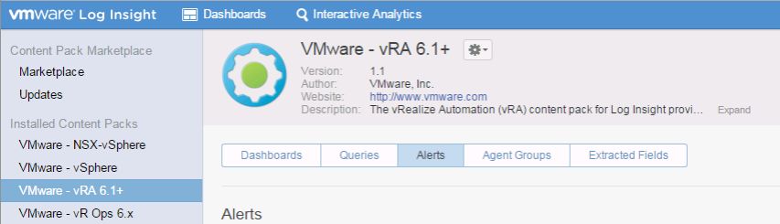

1.  In the list of alerts, click the alert name of the **\*\*\* CRITICAL \*\*\* vRO service unavailable!** alert to open the **New Alert** dialog.

    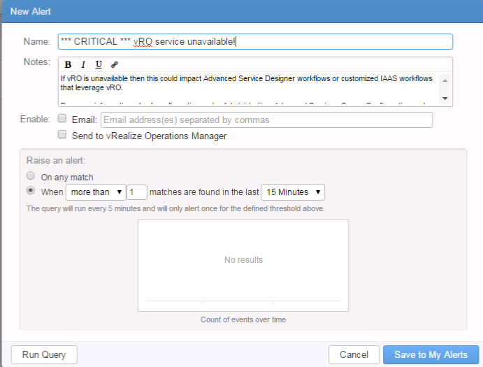

2.  Configure the following alert settings.

<!-- -->

1.  Select **Email** and enter the email address to send alerts to.

2.  Select the **Send to vRealize Operations Manager** checkbox.
    Options about selecting a data center and criticality appear.

3.  Underneath **Send to vRealize Operations Manager,** click the **Select** button, select **vra01svr01a** vRealize Appliance, and select **critical** from the **Criticality** drop-down menu.

4.  Under **Raise an alert**, select **On any match**.

    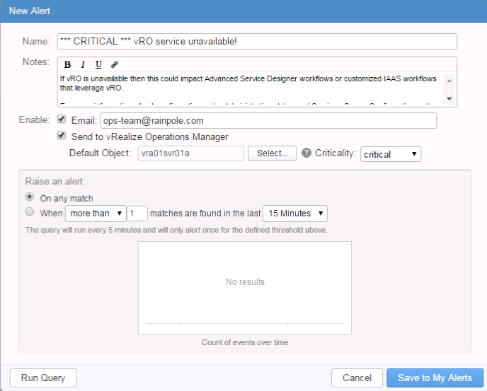

<!-- -->

1.  Click **Save to My Alerts**.

2.  Repeat the steps for the other alerts for vRealize Automation.

    1.  #### Enable the Alerts for vRealize Automation

After you create alerts for vRealize Automation, enable them to start sending notifications about critical issues in the vRealize Automation configuration.

1.  Open the vRealize Log Insight user interface.

<!-- -->

1.  In a Web browser, go to the following URL.

| Region       | vRealize Log Insight URL                     |
|--------------|----------------------------------------------|
| **Region A** | https://vrli-cluster-01.sfo01.rainpole.local |
| **Region B** | https://vrli-cluster-51.lax01.rainpole.local |

1.  Use the **admin** user name and the **vrli\_admin\_password** password to log in.

<!-- -->

1.  In the vRealize Log Insight UI, click **Interactive Analytics**.

2.  Click the  icon and select **Manage Alerts**. You see all available alerts.

> 

1.  Select the alerts for vRealize Automation and click **Enable**.

| Alert Name                                               |
|----------------------------------------------------------|
| \*\*\* CRITICAL \*\*\* vRO service unavailable!          |
| \*\*\* CRITICAL \*\*\* vRA authentication issue detected |
| \*\*\* CRITICAL \*\*\* vRA service unavailable!          |
| \*\*\* CRITICAL \*\*\* vRA disk is full                  |

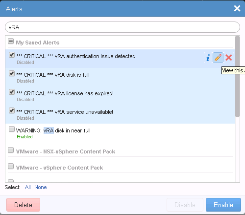

### Alerting for NSX for vSphere

Create alerts for the main indicators in NSX for vSphere and enable them to track the critical issues in the NSX for vSphere configuration.

-   [Create Alerts for NSX for vSphere](file:///\\vmware-host\display\ITAC10\Create+Alerts+for+NSX+for+vSphere)

-   [Enable the Alerts for NSX for vSphere](file:///\\vmware-host\display\ITAC10\Enable+the+Alerts+for+NSX+for+vSphere)

    1.  #### Create Alerts for NSX for vSphere

Use the inbuilt problem and alert signatures in vRealize Log Insight for NSX for vSphere.

For monitoring the NSX for vSphere configuration in the Software-Defined Data Center, you can use the following alerts in vRealize Log Insight.

| Alert Name                                    | Purpose                                                                                                                                                                                                               | Severity |
|-----------------------------------------------|-----------------------------------------------------------------------------------------------------------------------------------------------------------------------------------------------------------------------|----------|
| VXLAN dataplane lost connection to controller | Indicates the controller is losing the connection to the ESXi host                                                                                                                                                    | Critical |
| OSPF MTU Mismatch                             | This message will be generated when there is MTU mismatch on OSPF neighbors that are establishing relationship. Check if the OSPF neighbor state is stuck in "EXSTART".                                               | Critical |
| OSPF Invalid Area ID                          | This message will be generated by Edge Router or Logical Router VM when it is configured for OSPF and it receives Hello Packet with invalid Area ID. This indicates configuration error on one of the OSPF neighbors. | Critical |
| OSPF Subnet mask mismatch                     | This message is generated when there is mismatch in subnet mask of OSPF neighbors' interfaces. Please check the subnet mask configuration of the router vnics that are trying to establish neighbor relationship.     | Critical |

Procedure

1.  Open the vRealize Log Insight user interface.

<!-- -->

1.  In a Web browser, go to the following URL.

| Region       | vRealize Log Insight URL                     |
|--------------|----------------------------------------------|
| **Region A** | https://vrli-cluster-01.sfo01.rainpole.local |
| **Region B** | https://vrli-cluster-51.lax01.rainpole.local |

1.  Use the **admin** user name and the **vrli\_admin\_password** password to log in.

<!-- -->

1.  In the vRealize Log Insight UI, click the configuration drop-down menu icon  and select **Content Packs**.

2.  Under **Installed Content Packs**, select **VMware - NSX-vSphere** and click **Alerts**.

> 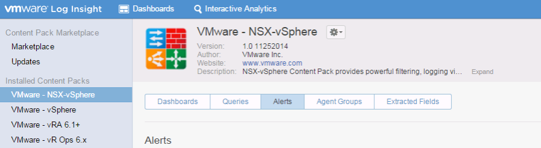

1.  In the list of alerts, click the alert name of the **VXLAN dataplane lost connection to controller** alert to open the **New Alert** dialog.

    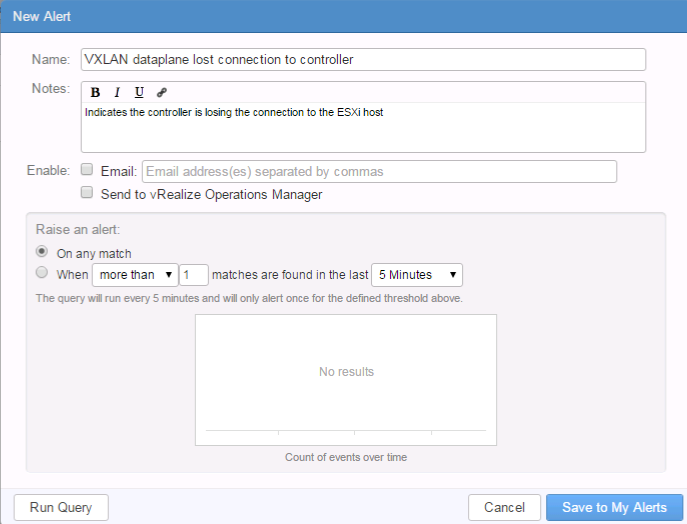

2.  Configure the following alert settings.

    1.  Select **Email** and enter the email address to send alerts to.

    2.  Select the **Send to vRealize Operations Manager** checkbox.

        Options about selecting a data center and criticality appear.

    3.  Underneath **Send to vRealize Operations Manager,** click the **Select** button, select the NSX Manager instance for the management cluster in the region, and select **critical** from the **Criticality** drop-down menu.

| Region       | NSX Manager Instance |
|--------------|----------------------|
| **Region A** | mgmt01nsxm01         |
| **Region B** | mgmt01nsxm51         |

1.  Under **Raise an alert**, select **On any match**.

    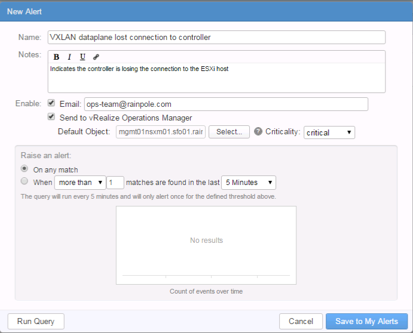

<!-- -->

1.  Click **Save to My Alerts**.

2.  Repeat the steps for the other alerts for NSX for vSphere.

    1.  #### Enable the Alerts for NSX for vSphere

After you create alerts for NSX for vSphere, enable them to start sending notifications about critical issues in the NSX for vSphere configuration.

1.  Open the vRealize Log Insight user interface.

    1.  In a Web browser, go to the following URL.

| Region       | vRealize Log Insight URL                     |
|--------------|----------------------------------------------|
| **Region A** | https://vrli-cluster-01.sfo01.rainpole.local |
| **Region B** | https://vrli-cluster-51.lax01.rainpole.local |

1.  Use the **admin** user name and the **vrli\_admin\_password** password to log in.

<!-- -->

1.  In the vRealize Log Insight UI, click **Interactive Analytics**.

2.  Click the  icon and select **Manage Alerts**. You see all available alerts.

    

3.  Select the alerts for NSX for vSphere and click **Enable**.

| Alert Name                                    |
|-----------------------------------------------|
| VXLAN dataplane lost connection to controller |
| OSPF MTU Mismatch                             |
| OSPF Invalid Area ID                          |
| OSPF Subnet mask mismatch                     |

### vRealize Operations Manager Alerting

Create alerts for the main indicators in vRealize Operations Manager and enable them to track the critical issues in the vRealize Operations Manager configuration.

-   [Create Alerts for vRealize Operations Manager](file:///\\vmware-host\display\ITAC10\Create+Alerts+for+vRealize+Operations+Manager)

-   [Enable the Alerts for vRealize Operations Manager](file:///\\vmware-host\display\ITAC10\Enable+the+Alerts+for+vRealize+Operations+Manager)

    1.  #### Create Alerts for vRealize Operations Manager

Use the inbuilt problem and alert signatures in vRealize Log Insight for vRealize Operations Manager.

For monitoring the vRealize Operations Manager deployment in the Software-Defined Data Center, you can use the following alerts in vRealize Log Insight.

| Alert Name                               | Purpose                                                                                                                                                  | Severity |
|------------------------------------------|----------------------------------------------------------------------------------------------------------------------------------------------------------|----------|
| vR Ops: Out of Memory errors occurred    | This alert gets generated when OutOfMemoryError: Java heap space occurs. This could indicate memory issues and could lead to degradation in performance. | Critical |
| vR Ops: Analytics Service is terminating | This alert indicates that the Analytics Service is terminating. This is a possible indication of an issue with the environment.                          | Critical |

Procedure

1.  Open the vRealize Log Insight user interface.

    1.  In a Web browser, go to the following URL.

| Region       | vRealize Log Insight URL                     |
|--------------|----------------------------------------------|
| **Region A** | https://vrli-cluster-01.sfo01.rainpole.local |
| **Region B** | https://vrli-cluster-51.lax01.rainpole.local |

1.  Use the **admin** user name and the **vrli\_admin\_password** password to log in.

<!-- -->

1.  In the vRealize Log Insight UI, click the configuration drop-down menu icon  and select **Content Packs**.

2.  Under **Installed Content Packs**, select **VMware - VR Ops 6.x** and click **Alerts**.

    

3.  In the list of alerts, click the alert name of the **vR Ops: Out of Memory errors occurred** alert to open the **New Alert** dialog.

    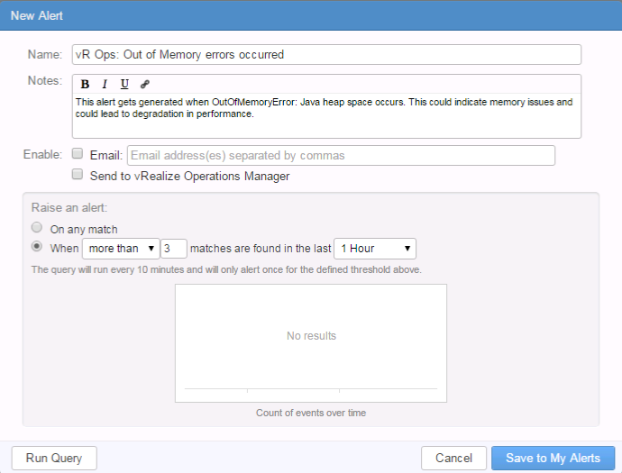

4.  Configure the following alert settings.

    1.  Select **Email** and enter the email address to send alerts to.

    2.  Select the **Send to vRealize Operations Manager** checkbox.

        Options about selecting a data center and criticality appear.

    3.  Underneath **Send to vRealize Operations Manager,** click the **Select** button, select the vRealize Operations Manager master node, **vrops-mstrn-01**, and select **critical** from the **Criticality** drop-down menu.

    4.  Under **Raise an alert**, select **On any match**.

        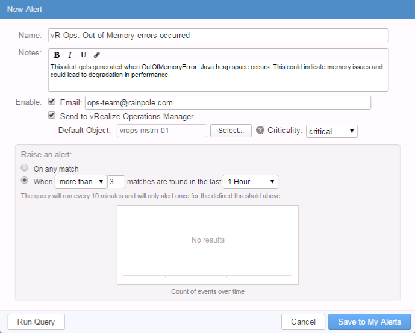

5.  Click **Save to My Alerts**.

6.  Repeat the steps for the other alerts for vRealize Operations Manager.

    1.  #### Enable the Alerts for vRealize Operations Manager

After you create alerts for vRealize Operations Manager, enable them to start sending notifications about critical issues in the vRealize Operations Manager deployment.

1.  Open the vRealize Log Insight user interface.

    1.  In a Web browser, go to the following URL.

| Region       | vRealize Log Insight URL                     |
|--------------|----------------------------------------------|
| **Region A** | https://vrli-cluster-01.sfo01.rainpole.local |
| **Region B** | https://vrli-cluster-51.lax01.rainpole.local |

1.  Use the **admin** user name and the **vrli\_admin\_password** password to log in.

<!-- -->

1.  In the vRealize Log Insight UI, click **Interactive Analytics**.

2.  Click the  icon and select **Manage Alerts**. You see all available alerts.

    

3.  Select the alerts for vRealize Operations Manager and click **Enable**.

| Alert Name                               |
|------------------------------------------|
| vR Ops: Out of Memory errors occurred    |
| vR Ops: Analytics Service is terminating |

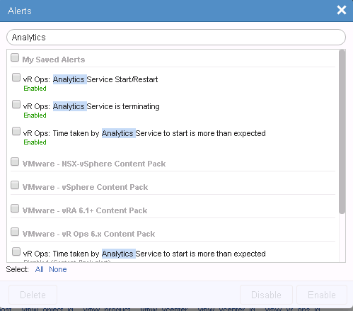

Creating Custom SDDC vRealize Operations Dashboards
---------------------------------------------------

Monitoring the Software-Defined Data Center (SDDC) is critical to the health of the environment. You create custom vRealize Operations Manager dashboards to provide centralized SDDC dashboards. Using such dashboards simplifies monitoring the health of the SDDC as opposed to having to switch between multiple product-specific dashboards.

To create custom dashboards, verify that you have deployed vRealize Operations Manager according to implementation guides. You must have the following management packs installed and configured:

-   vRealize Operations Manager Management Pack for VMware vSphere

-   vRealize Operations Manager Management Pack for NSX-vSphere

-   vRealize Operations Manager Management Pack for vRealize Automation

-   vRealize Operations Manager Management Pack for Storage Devices

-   vRealize Operations Manager Management Pack for vRealize Log Insight

    1.  ### Configure a Dashboard that Shows Capacity Trends

In the SDDC, monitor the trends in the CPU and memory consumption on the ESXi hosts and the storage capacity of the datastores from a common dashboard.

Procedure

1.  In a Web browser, open the main page of vRealize Operations Manager.

-   If you use the public interface to the SDDC, go to https://vrops-cluster-01.rainpole.local/

-   If you can connect to the vSphere management network, go to https://vrops-mstrn-01.rainpole.local

1.  Use the **admin** user name and the **vrops\_admin\_password** password to log in.

2.  On the **Home** page, from the **Actions** menu select **Create Dashboard**.

> 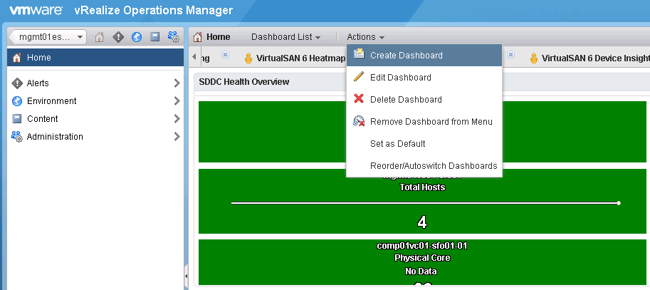

1.  In the **Dashboard Configuration** section of the **New Dashboard** dialog box, configure the following settings.

| Dashboard Option | Value                |
|------------------|----------------------|
| **Name**         | SDDC Capacity Trends |
| **Is default**   | No                   |

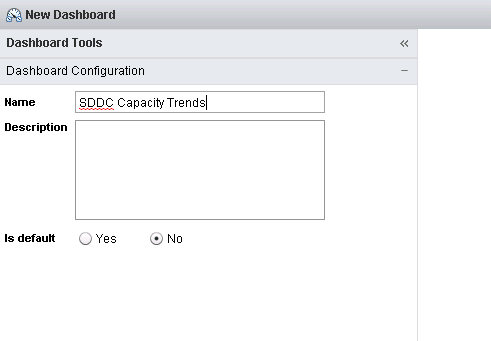

1.  Add widgets to the dashboard.

    1.  Expand the **Widget List** section.

    2.  Drag 3 **Scoreboard** widgets to the layout pane on the right.

2.  Configure the first **Scoreboard** widget to show metrics for CPU usage.

    1.  In the upper-right corner of the first **Scoreboard** widget, click the **Edit** icon.

        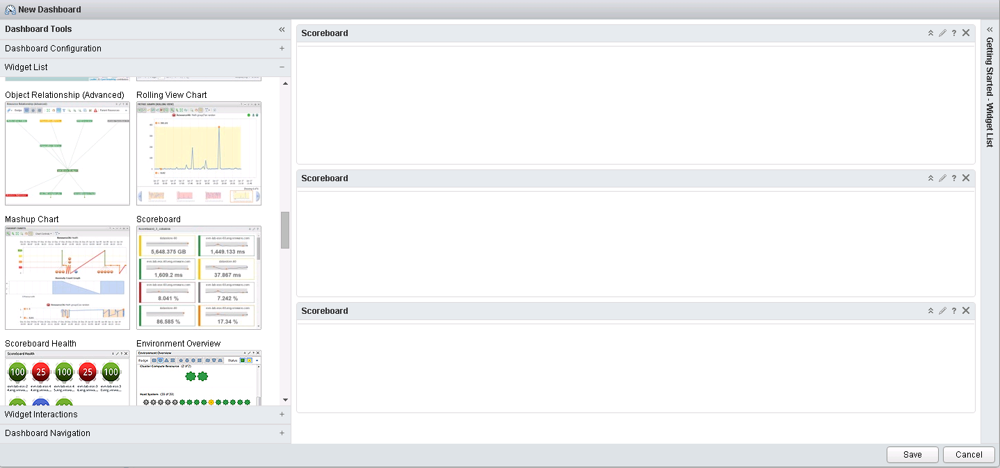

    2.  Configure the following settings at the top of the **Edit Scoreboard** dialog box.

| Scoreboard Widget Option | Value          |
|--------------------------|----------------|
| **Title**                | SDDC CPU Usage |
| **Refresh Content**      | On             |
| **Refresh Interval**     | 300s           |
| **Self Provider**        | On             |
| **Show Sparkline **      | On             |

1.  Click the **Object Types** tab, and add the metrics that this widget displays.

| Object Type Attribute | Value           |
|-----------------------|-----------------|
| **Adapter Type**      | vCenter Adapter |
| **Object Type**       | Host System     |

1.  In the metrics pane on the right, enter **Capacity Usage** in the search box, and press Enter.

2.  In the search result, expand the **CPU** metric category and double-click **the Capacity Usage (%)** metric to add it to the list of metrics that the widget displays.

3.  In the metrics list, double-click each of the following collection options, customize it and click **Update**.

| Collection Option | Value  |
|-------------------|--------|
| **Color Method**  | Custom |
| **Yellow Bound**  | 60     |
| **Orange Bound**  | 75     |
| **Red Bound**     | 90     |

1.  In the **Edit Scoreboard** dialog box, click **Save**.

    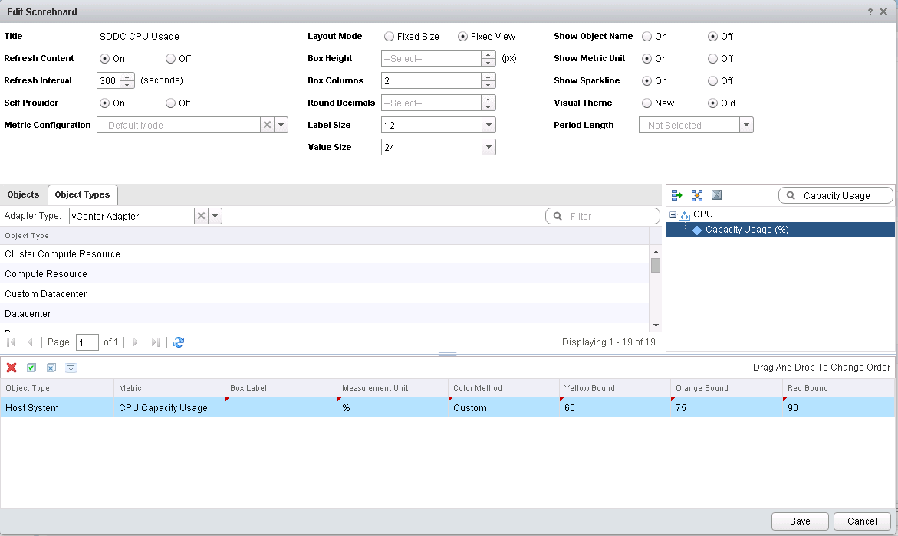

<!-- -->

1.  Configure the second **Scoreboard** widget to show metrics for memory usage.

    1.  In the upper-right corner of the second **Scoreboard** widget, click the **Edit** icon.

    2.  Configure the following settings at the top of the **Edit Scoreboard** dialog box.

| Scoreboard Widget Option | Value                |
|--------------------------|----------------------|
| **Title**                | SDDC Memory Overview |
| **Refresh Content**      | On                   |
| **Refresh Interval**     | 300s                 |
| **Self Provider**        | On                   |
| **Show Sparkline **      | On                   |

1.  Click the **Object Types** tab, and add the metrics that this widget displays.

| Object Type Attribute | Value           |
|-----------------------|-----------------|
| **Adapter Type**      | vCenter Adapter |
| **Object Type**       | Host System     |

1.  In the metrics pane on the right, enter **Usage / Usable** in the search box, and press **Enter**.

2.  In the search result, expand the **Memory** metric category and double-click the **Usage / Usable (%)** metric to add it to the list of metrics that the widget displays.

3.  In the metrics list, double-click each of the following collection options, customize it and click **Update**.

| Collection Option | Value  |
|-------------------|--------|
| **Color Method**  | Custom |
| **Yellow Bound**  | 70     |
| **Orange Bound**  | 80     |
| **Red Bound**     | 90     |

1.  In the **Edit Scoreboard** dialog box, click **Save**.

    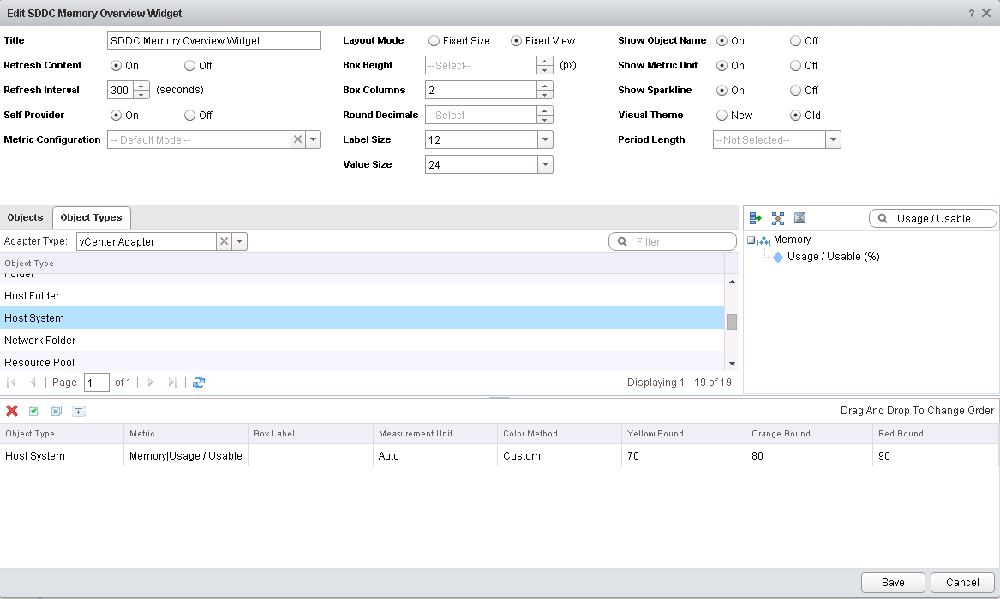

<!-- -->

1.  Configure the third **Scoreboard** widget to show metrics for storage usage.

    1.  In the upper-right corner of the third **Scoreboard** widget, click the **Edit** icon.

    2.  Configure the following settings at the top of the **Edit Scoreboard** dialog box.

| Scoreboard Widget Option | Value                    |
|--------------------------|--------------------------|
| **Title**                | SDDC Storage Consumption |
| **Refresh Content**      | On                       |
| **Refresh Interval**     | 300s                     |
| **Self Provider**        | On                       |
| **Show Sparkline **      | On                       |

1.  Click the **Object Types** tab, and add the metrics that this widget displays.

| Object Type Attribute | Value           |
|-----------------------|-----------------|
| **Adapter Type**      | vCenter Adapter |
| **Object Type**       | Datastore       |

1.  In the metrics pane on the right, enter **Used Space** in the search box, and press **Enter**.

2.  In the search result, expand the **Capacity** metric category and double-click the **Used Space (%)** metric to add it to the list of metrics that the widget displays.

3.  Enter **Number of VMs** in the search box and press **Enter**.

4.  In the search result, expand the **Summary** metric category and double-click the **Total Number of VMs** metric to add the number of VMs in the datastore to the list of metrics in the widget.

5.  In the metrics list at the bottom, double-click each metric row, customize the following collection attribute for the metric and click **Update**.

| Collection Option | Value  |
|-------------------|--------|
| **Color Method**  | Custom |
| **Yellow Bound**  | 60     |
| **Orange Bound**  | 70     |
| **Red Bound**     | 80     |

1.  In the **Edit Scoreboard** dialog box, click **Save**.

    

<!-- -->

1.  In the **New Dashboard** dialog box, click **Save**.

    The SDDC Capacity Trends dashboard becomes available on the **Home** page of the vRealize Operations Manager user interface.

    

    1.  ### Configure a Dashboard that the Provides an Overview of SDDC Operation

Create a dashboard in vRealize Operations Manager where you can monitor the objects of the SDDC management stack.

To model the SDDC overview dashboard, perform the following tasks:

-   Define applications for the virtual machines of the SDDC management applications, such vRealize Log Insight and vRealize Orchestrator

-   Create a custom group to track the state of the management applications that are connected to vRealize Operations Manager

-   Create and configure a dashboard that shows the state of the hosts and virtual machines in the management cluster

-   [Create an Application for vRealize Log Insight](file:///\\vmware-host\display\ITAC10\Create+an+Application+for+vRealize+Log+Insight)

-   [Create an Application for vRealize Orchestrator](file:///\\vmware-host\display\ITAC10\Create+an+Application+for+vRealize+Orchestrator)

-   [Collect the SDDC objects in a group](file:///\\vmware-host\display\ITAC10\Collect+the+SDDC+Objects+in+a+Group)

-   [Configure a dashboard that provides an overview of the SDDC state](file:///\\vmware-host\display\ITAC10\Configure+a+Dashboard+that+Provides+an+Overview+of+the+SDDC+State)

    1.  #### Create an Application for vRealize Log Insight

Create an application in vRealize Operations Manager to group the monitoring data about the virtual machines of vRealize Log Insight.

vRealize Operations Manager builds an application to determine how your environment is affected when one or more components in an application experiences problems. You can also monitor the overall health and performance of the application.

Because the Management Pack for vRealize Log Insight does not collect monitoring data about the virtual machines of the vRealize Log Insight deployment, you create an application to watch their state.

**Procedure**

1.  In a Web browser, open the main page of vRealize Operations Manager.

-   If you use the public interface to the SDDC, go to **https://vrops-cluster-01.rainpole.local**

-   If you can connect to the vSphere management network, go to **https://vrops-mstrn-01.rainpole.local**

1.  Use the **admin** user name and the **vrops\_admin\_password** password to log in.

2.  In the left pane of vRealize Operations Manager, click **Environment** menu and click **Applications**.

3.  On the **Applications** tab page, click **Add** icon to add an application.

4.  In the **Add Application** dialog box, select **Custom** and click **OK**.

    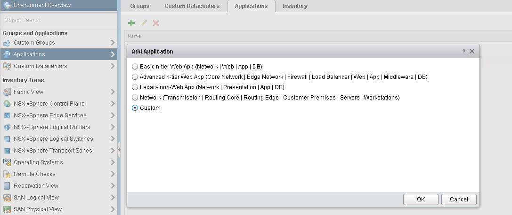

    The **Application Management** dialog box appears where you select the objects for the application.

5.  In the **Application Management** dialog box, in the **Name** text box enter **vRealize Log Insight**.

6.  In the **Tiers** pane, click **Add Tier**, enter **Log Insight VMs** as **Tier Name** and click **Update**.

7.  In the objects list underneath, enter **vrli** in the search box, and press **Enter**.

8.  Select the virtual machine objects of vRealize Log Insight and drag them to the **Tier Objects** pane.

| Region A VMs | Region B VMs |
|--------------|--------------|
| vrli-mstr-01 | vrli-mstr-51 |
| vrli-wrkr-01 | vrli-wrkr-51 |
| vrli-wrkr-02 | vrli-wrkr-52 |

> 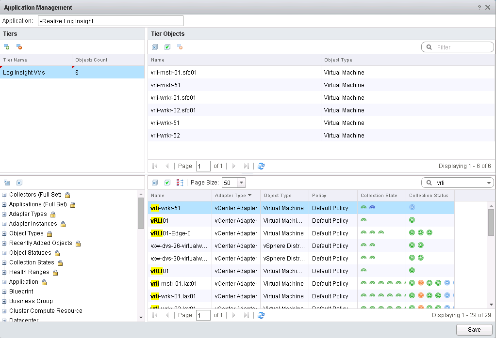

1.  Click **Save**.

    1.  #### Create an Application for vRealize Orchestrator

Create an application in vRealize Operations Manager to group the monitoring data for the virtual machines of vRealize Orchestrator.

vRealize Operations Manager builds an application to determine how your environment is affected when one or more components in an application experiences problems. You can also monitor the overall health and performance of the application.

vRealize Operations Manager collects data from the components in the application and displays the results in a summary dashboard for each application with a real-time analysis for any or all of the components.

Because the Management Pack for vRealize Automation does not collect monitoring data about the virtual machines of the vRealize Orchestrator cluster, you create an application to watch their state.

Procedure

1.  In a Web browser, open the main page of vRealize Operations Manager.

-   If you use the public interface to the SDDC, go to **https://vrops-cluster-01.rainpole.local**

-   If you can connect to the vSphere management network, go to **https://vrops-mstrn-01.rainpole.local**

1.  Use the **admin** user name and the **vrops\_admin\_password** password to log in.

2.  In the left pane of vRealize Operations Manager, click **Environment** menu and click **Applications**.

3.  On the **Applications** tab of the **Application** page in the vRealize Operations Manager UI, click **Add** icon to add an application.

4.  In the **Add Application** dialog box, select **Custom** and click **OK**.

5.  In the **Application Management** dialog box, enter **vRealize Orchestrator** in the **Name** text box.

6.  In the **Tiers** pane, click **Add Tier**, enter **Orchestrator VMs** as **Tier Name** and click **Update**.

7.  In the objects list underneath, enter **vravro** in the search box and press **Enter**.

8.  Select the **vra01vro01a** and **vra01vro01b** virtual machine objects of vRealize Orchestrator, and drag them to the **Tier Objects** pane.

9.  Click **Save**.

    1.  #### Collect the SDDC Objects in a Group

Create a custom group for each management application to monitor the health of the entire application stack as opposed to individual virtual machine health.

Procedure

1.  In a Web browser, open the main page of vRealize Operations Manager.

-   If you use the public interface to the SDDC, go to **https://vrops-cluster-01.rainpole.local**

-   If you can connect to the vSphere management network, go to **https://vrops-mstrn-01.rainpole.local**

1.  Use the **admin** user name and the **vrops\_admin\_password** password to log in.

2.  In the left pane of vRealize Operations Manager, click **Environment** menu and click **Custom Groups**.

3.  Click **Add** icon to add a custom group.

4.  In the **New group** dialog box, enter **SDDC Management** in the **Name** text box.

5.  From the **Group Type** drop-down menu, select **Function**.

6.  Expand the **Define membership criteria** section.

7.  To add the objects about vRealize Automation, from the **Select the Object Type that matches all of the following criteria** drop-down menu, select **MP for vRealize Automation** &gt; **MP for vRealize Automation Instance**.

8.  Click **Add another criteria set** and repeat Step 8 to add each of the following object types representing the other management applications in the SDDC.

-   **vCenter Adapter** &gt; **vSphere World**

-   **NSX-vSphere Adapter** &gt; **NSX-vSphere Environment**

-   **vRealize Operations Adapter** &gt; **vRealize Operations Cluster**

    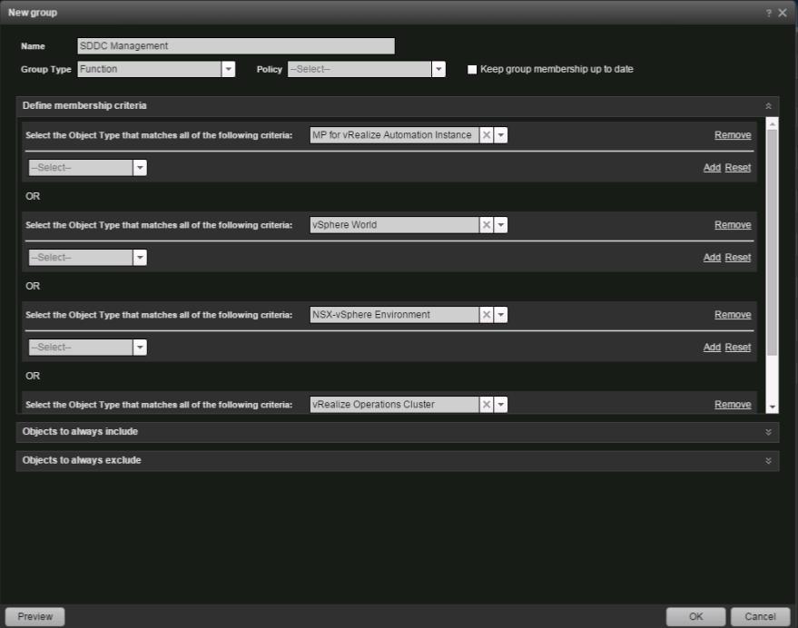

1.  Expand the **Objects to always include** section.

2.  Add the following vRealize Log Insight and vRealize Orchestrator application objects.

    1.  Under **Filtered objects**, select **Applications**.

    2.  Select **vRealize Log Insight** **and vRealize Orchestrator**, and click the **Add** button to add the application objects to **Objects to always include** list on the right.

        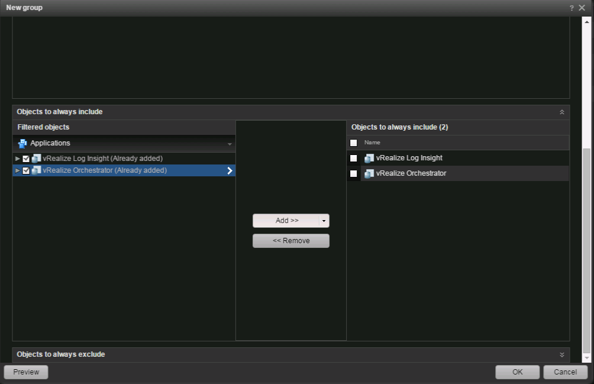

3.  Click **OK**.

    1.  #### Configure a Dashboard that Provides an Overview of the SDDC State

Create a central dashboard that you can use to track the overall state of the SDDC.

The SDDC overview dashboard has the following two aspects:

-   Display the main indicators for the state of CPU, memory, connectivity and storage in the management cluster that hosts the management applications.

-   Show the overall state of the management applications in the SDDC.
    You use the SDDC Management custom group that represents a common object for all management applications.

Procedure

1.  In a Web browser, open the main page of vRealize Operations Manager.

-   If you use the public interface to the SDDC, go to **https://vrops-cluster-01.rainpole.local**

-   If you can connect to the vSphere management network, go to **https://vrops-mstrn-01.rainpole.local**

1.  Use the **admin** user name and the **vrops\_admin\_password** password to log in.

2.  On the **Home** page, from the **Actions** menu select **Create Dashboard**.

3.  In the **Dashboard Configuration** section of the **New Dashboard** dialog box, configure the following settings.

| Dashboard Option | Value         |
|------------------|---------------|
| **Name**         | SDDC Overview |
| **Is default**   | Yes           |

1.  Add widgets to the dashboard.

    1.  Expand the **Widget List** section.

    2.  Drag 12 **Heatmap** widgets to the layout pane on the right and align them so that they are all approximately equal in size.

    3.  Drag a **Health** widget to the layout pane on the right.

2.  Configure the heatmap widgets.

    1.  In the upper-right corner of each widget, click the **Edit** icon and configure the widget.

    2.  In the **Edit Heatmap** dialog box, configure the following settings of the heatmap widget and click **Save**.

        Widgets are labeled **Heatmap x.y** where *x* is the column number and *y* is the row number in the dashboard.

| Widget Option        | Heatmap 1.1                        | Heatmap 1.2                                             | Heatmap 1.3                           |
|----------------------|------------------------------------|---------------------------------------------------------|---------------------------------------|
| **Title**            | Physical CPU Remaining             | Physical Network I/O                                    | Storage Read Latency                  |
| **Refresh Content**  | On                                 | On                                                      | On                                    |
| **Refresh Interval** | 300s                               | 300s                                                    | 300s                                  |
| **Description**      | Management Hosts                   | Management Hosts                                        | Datastores                            |
| **Group by**         | vCenter Adapter &gt; Datacenter    | vCenter Adapter &gt; Datacenter                         | vCenter Adapter &gt; Datacenter       |
| **Then by**          | -                                  | -                                                       | -                                     |
| **Mode**             | Instance                           | Instance                                                | Instance                              |
| **Object type**      | vCenter Adapter &gt; Host System   | vCenter Adapter &gt; Host System                        | vCenter Adapter &gt; Datastore        |
| **Attribute type**   | CPU &gt; Capacity Remaining (%)    | Network I/O &gt; Usage Rate &gt; Capacity Remaining (%) | Datastore I/O -&gt; Read Latency (ms) |
| **Min Value**        | 0                                  | 0                                                       | 0                                     |
| **Max Value**        | 25                                 | 20                                                      | 30                                    |
| **Widget Option**    | Heatmap 2.1                        | Heatmap 2.2                                             | Heatmap 2.3                           |
| **Title**            | Physical Memory Remaining          | Physical Dropped Packets                                | Storage Write Latency                 |
| **Refresh Content**  | On                                 | On                                                      | On                                    |
| **Refresh Interval** | 300s                               | 300s                                                    | 300s                                  |
| **Description**      | Management Hosts                   | Management Hosts                                        | Datastores                            |
| **Group by**         | vCenter Adapter &gt; Datacenter    | vCenter Adapter &gt; Datacenter                         | vCenter Adapter &gt; Datacenter       |
| **Then by**          | -                                  | -                                                       | -                                     |
| **Mode**             | Instance                           | Instance                                                | Instance                              |
| **Object type**      | vCenter Adapter &gt; Host System   | vCenter Adapter &gt; Host System                        | vCenter Adapter &gt; Datastore        |
| **Attribute type**   | Memory &gt; Capacity Remaining (%) | Network I/O &gt; Packets Dropped                        | Datastore I/O &gt; Write Latency (ms) |
| **Min Value**        | 0                                  | 0                                                       | 0                                     |
| **Max Value**        | 25                                 | 1                                                       | 30                                    |

| Widget Option        | Heatmap 3.1                          | Heatmap 3.2                          | Heatmap 3.3                          |
|----------------------|--------------------------------------|--------------------------------------|--------------------------------------|
| **Title**            | Management VM CPU Used               | Management VM Memory Used            | Management VM Storage Latency        |
| **Refresh Content**  | On                                   | On                                   | On                                   |
| **Refresh Interval** | 300s                                 | 300s                                 | 300s                                 |
| **Description**      | Management VMs                       | Management VMs                       | Management VMs                       |
| **Group by**         | vCenter Adapter &gt; Datacenter      | vCenter Adapter &gt; Datacenter      | vCenter Adapter &gt; Datacenter      |
| **Then by**          | -                                    | -                                    | -                                    |
| **Mode**             | Instance                             | Instance                             |                                      |
| **Object type**      | vCenter Adapter &gt; Virtual Machine | vCenter Adapter &gt; Virtual Machine | vCenter Adapter &gt; Virtual Machine |
| **Attribute type**   | CPU &gt; Usage (%)                   | Memory &gt; Usage (%)                | Virtual Disk &gt; Total Latency      |
| **Min Value**        | 80                                   | 50                                   | 0                                    |
| **Max Value**        | 100                                  | 90                                   | 30                                   |

| Widget Option        | Heatmap 4.1                          | Heatmap 4.2                          | Heatmap 4.3                            |
|----------------------|--------------------------------------|--------------------------------------|----------------------------------------|
| **Title**            | Management VM CPU Contention         | Management VM Swap Rate              | Management VM Disk Free                |
| **Refresh Content**  | On                                   | On                                   | On                                     |
| **Refresh Interval** | 300s                                 | 300s                                 | 300s                                   |
| **Description**      | Management VMs                       | Management VMs                       | Management VMs                         |
| **Group by**         | vCenter Adapter &gt; Datacenter      | vCenter Adapter &gt; Datacenter      | vCenter Adapter &gt; Datacenter        |
| **Then by**          | -                                    | -                                    | -                                      |
| **Mode**             | Instance                             | Instance                             | Instance                               |
| **Object type**      | vCenter Adapter &gt; Virtual Machine | vCenter Adapter &gt; Virtual Machine | vCenter Adapter &gt; Virtual Machine   |
| **Attribute type**   | CPU &gt; CPU Contention (%)          | Memory &gt; Swapped (KB)             | Disk Space &gt; Capacity Remaining (%) |
| **Min Value**        | 0                                    | 0                                    | 5                                      |
| **Max Value**        | 2                                    | 1                                    | 20                                     |

1.  Configure the **Health Chart** widget.

    1.  In the upper-right corner of the widget, click the **Edit** icon and configure the widget.

    2.  In the **Edit Heatmap** dialog box, configure the following settings of the **Health Chart** widget.

| Health Widget Option  | Value                   |
|-----------------------|-------------------------|
| **Title**             | Management Applications |
| **Refresh Content**   | On                      |
| **Refresh Interval**  | 300s                    |
| **Self Provider**     | On                      |
| **Mode**              | Children                |
| **Order By**          | Value Asc               |
| **Pagination number** | 15                      |
| **Period Length**     | Last 6 hours            |
| **Metric**            | Health                  |

1.  From the objects list at the bottom, expand **Function** and select the **SDDC Management** custom group.

<!-- -->

1.  In the **New Dashboard** dialog box, click **Save**.

The **SDDC Overview** dashboard becomes available on the Home page of the vRealize Operations Manager user interface.

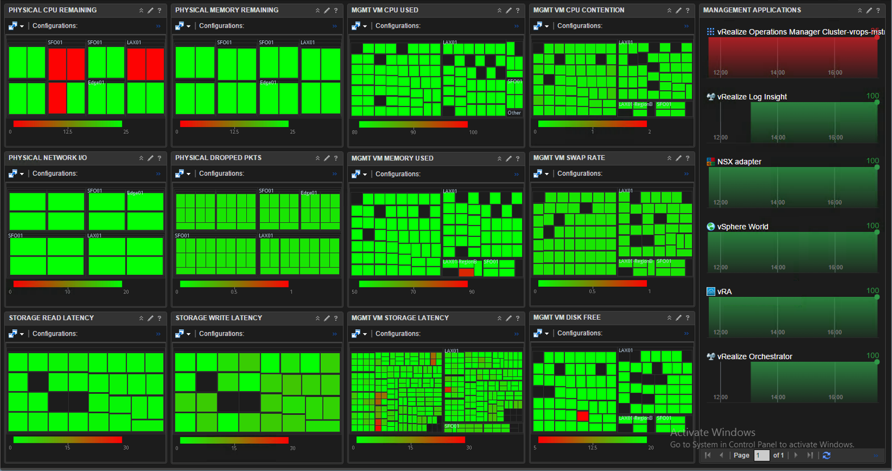

Configure vRealize Operations Manager to Notify of SDDC Issues
--------------------------------------------------------------

Create a set of notifications in vRealize Operations Manager so that data center operators receive alerts about issues in the SDDC main functions.

-   Create Notifications in vRealize Operations Manager

-   List of Notifications for vRealize Operations Manager

    1.  ### Create Notifications in vRealize Operations Manager

Create email notifications in vRealize Operations Manager so that the SDDC operators know of issues in the main monitoring parameters of the environment.

Procedure

1.  In a Web browser, open the main page of vRealize Operations Manager.

-   If you use the public interface to the SDDC, go to **https://vrops-cluster-01.rainpole.local**

-   If you can connect to the vSphere management network, go to **https://vrops-mstrn-01.rainpole.local**

1.  Use the **admin** user name and the **vrops\_admin\_password** password to log in.

2.  In the left pane of vRealize Operations Manager, click **Content** and click **Notifications**.

    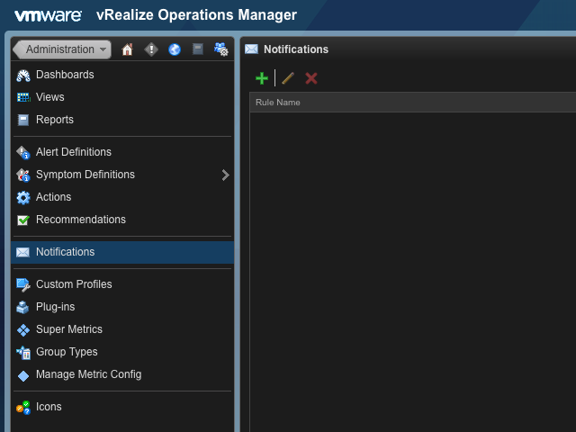

3.  Click the **Add** icon and configure the following notification settings in the **Add Rule** dialog box.

| Notification Option | Value                                                 |
|---------------------|-------------------------------------------------------|
| **Name**            | Virtual machine is projected to run out of disk space |
| **Method**          | Standard Email Plugin                                 |
| **Instance**        | Rainpole Alert Mail Relay                             |
| **Recipients**      | ops-team@rainpole.com                                 |
| Filtering Criteria  |
| **Scope**           | Object Type                                           
                       vCenter Adapter &gt; Virtual Machine                   |

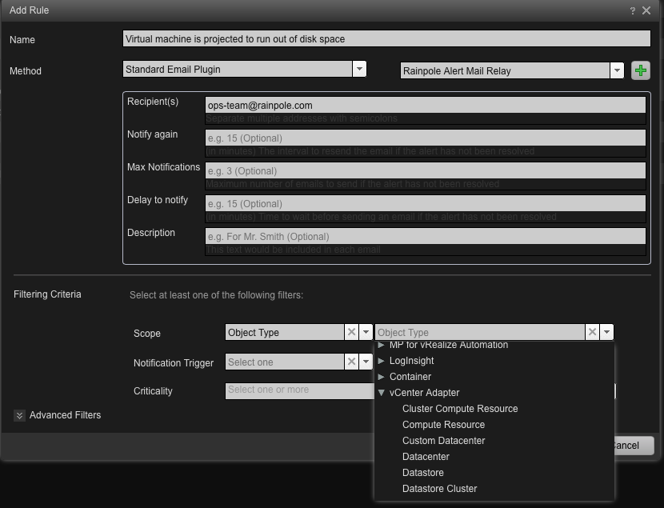

1.  Configure the trigger for the notification.

    1.  From the **Notification Trigger** drop-down menu, **Alert Definition** and click the **Select an Alert Definition** button.

    2.  In the search box of the **Alert Definitions** dialog box, enter **disk space** and press **Enter**.

    3.  Select the Virtual machine is projected to run out of disk space alert definition and click **Select**.

        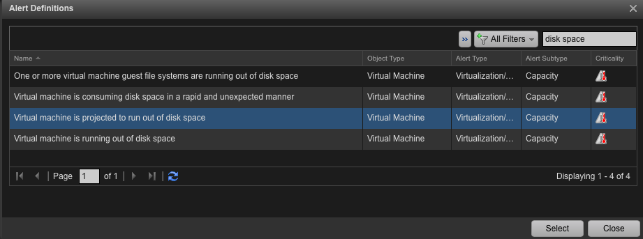

2.  In the **Add Rule** dialog box, click **Save**.

    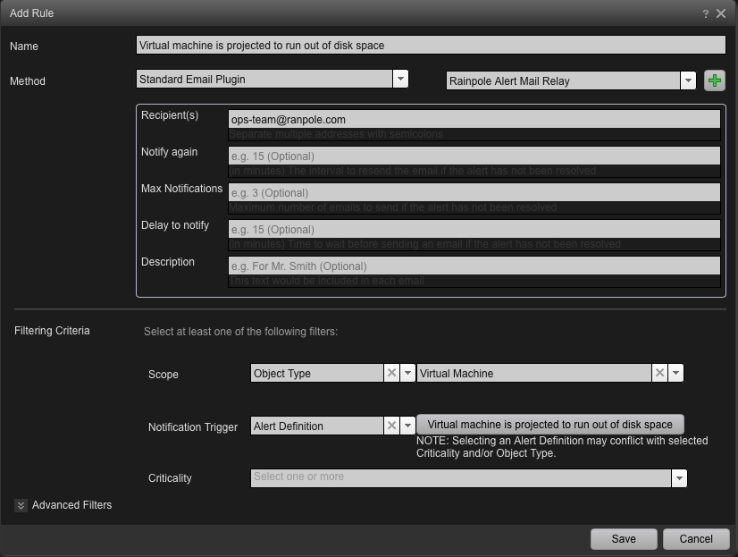

3.  Repeat the steps to create the notifications that are defined in List of Notifications for vRealize Operations Manager.

    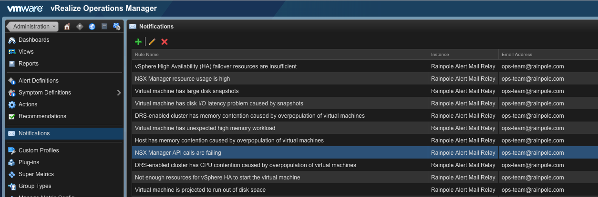

    1.  ### List of Notifications for vRealize Operations Manager

Configure vRealize Operations Manager to send email notifications about important alerts in the SDDC.

You define notifications from the **Content** &gt; **Notifications** page in vRealize Operations UI. See *Create Notifications in vRealize Operations Manager*.

#### Notification Delivery Properties

When you define notifications from vRealize Operations Manager, use the following properties to direct them by email to the operations team in your organization.

Table . Delivery Properties of vRealize Operations Manager Notifications

| Notification Delivery Property | Value                      |
|--------------------------------|----------------------------|
| **Method**                     | Standard Email Plugin      |
| **Instance**                   | Rainpole Alert Email Relay |
| **Recipients**                 | ops-team@rainpole.com      |

#### Virtual Machine and Host Notifications

Create notifications for most important virtual machines and ESXi host issues.

Table . VM and Host Notifications for vRealize Operations Manager

| Name                                                                                                | Scope                                             | Notification Trigger | Alert Definition                                                                                          |
|-----------------------------------------------------------------------------------------------------|---------------------------------------------------|----------------------|-----------------------------------------------------------------------------------------------------------|
| Virtual machine is projected to run out of disk space\*                                             
 \* Step-by-step instructions are provided in *Create Notifications in vRealize Operations Manager.*  | 1.  Object Type                                   

                                                                                                       2.  vCenter Adapter &gt; Virtual Machine           | Alert Definition     | Virtual machine is projected to run out of disk space                                                     |
| Virtual machine has CPU contention caused by co-stop                                                | 1.  Object Type                                   

                                                                                                       <!-- -->                                           

                                                                                                       1.  vCenter Adapter &gt; Virtual Machine           | Alert Definition     | Virtual machine has CPU contention due to multi-vCPU scheduling issues (co-stop) caused by too many vCPUs |
| Virtual machine has unexpected high CPU workload                                                    | 1.  Object Type                                   

                                                                                                       <!-- -->                                           

                                                                                                       1.  vCenter Adapter &gt; Virtual Machine           | Alert Definition     | Virtual machine has unexpected high CPU workload                                                          |
| Virtual machine has unexpected high memory workload                                                 | 1.  Object Type                                   

                                                                                                       <!-- -->                                           

                                                                                                       1.  vCenter Adapter &gt; Virtual Machine           | Alert Definition     | Virtual machine has unexpected high memory workload                                                       |
| Virtual machine has disk I/O latency problem caused by snapshots                                    | 1.  Object Type                                   

                                                                                                       <!-- -->                                           

                                                                                                       1.  vCenter Adapter &gt; Virtual Machine           | Alert Definition     | Virtual machine has disk I/O latency problem caused by snapshots                                          |
| Virtual Machine is running out of disk space                                                        | 1.  Object Type                                   

                                                                                                       <!-- -->                                           

                                                                                                       1.  vCenter Adapter &gt; Virtual Machine           | Alert Definition     | Virtual Machine is running out of disk space                                                              |
| Virtual machine has large disk snapshots                                                            | 1.  Object Type                                   

                                                                                                       <!-- -->                                           

                                                                                                       1.  vCenter Adapter &gt; Virtual Machine           | Alert Definition     | Virtual machine has large disk snapshots                                                                  |
| Not enough resources for vSphere HA to start the virtual machine                                    | 1.  Object Type                                   

                                                                                                       <!-- -->                                           

                                                                                                       1.  vCenter Adapter &gt; Virtual Machine           | Alert Definition     | Not enough resources for vSphere HA to start the virtual machine                                          |
| vSphere HA cannot perform a failover operation for the virtual machine                              | 1.  Object Type                                   

                                                                                                       <!-- -->                                           

                                                                                                       1.  vCenter Adapter &gt; Virtual Machine           | Alert Definition     | vSphere HA cannot perform a failover operation for the virtual machine                                    |
| Host has CPU contention caused by overpopulation of virtual machines                                | 1.  Object Type                                   

                                                                                                       <!-- -->                                           

                                                                                                       1.  vCenter Adapter &gt; Host System               | Alert Definition     | Host has CPU contention caused by overpopulation of virtual machines                                      |
| Host has memory contention caused by overpopulation of virtual machines                             | 1.  Object Type                                   

                                                                                                       <!-- -->                                           

                                                                                                       1.  vCenter Adapter &gt; Host System               | Alert Definition     | Host has memory contention caused by overpopulation of virtual machines                                   |
| vSphere DRS enabled cluster has CPU contention caused by overpopulation of virtual machines         | 1.  Object Type                                   

                                                                                                       <!-- -->                                           

                                                                                                       1.  vCenter Adapter &gt; Cluster Compute Resource  | Alert Definition     | DRS-enabled cluster has CPU contention caused by overpopulation of virtual machines                       |
| vSphere DRS enabled cluster has unexpected high CPU workload                                        | 1.  Object Type                                   

                                                                                                       <!-- -->                                           

                                                                                                       1.  vCenter Adapter &gt; Cluster Compute Resource  | Alert Definition     | DRS-enabled cluster has unexpected high CPU workload                                                      |
| vSphere DRS enabled cluster has memory contention caused by overpopulation of virtual machines      | 1.  Object Type                                   

                                                                                                       <!-- -->                                           

                                                                                                       1.  vCenter Adapter &gt; Cluster Compute Resource  | Alert Definition     | DRS-enabled cluster has memory contention caused by overpopulation of virtual machines                    |
| vSphere DRS enabled cluster has unexpected high memory workload and contention                      | 1.  Object Type                                   

                                                                                                       <!-- -->                                           

                                                                                                       1.  vCenter Adapter &gt; Cluster Compute Resource  | Alert Definition     | DRS-enabled cluster has unexpected high memory workload and contention                                    |
| vSphere HA failover resources are insufficient                                                      | 1.  Object Type                                   

                                                                                                       <!-- -->                                           

                                                                                                       1.  vCenter Adapter &gt; Cluster Compute Resource  | Alert Definition     | vSphere High Availability (HA) failover resources are insufficient                                        |

#### Networking Notifications

Create notifications for most important networking issues in distributed switches and NSX components.

Table . Networking Notifications for vRealize Operations Manager

| Name                                                    | Scope                                                        | Notification Trigger | Alert Definition                                          |
|---------------------------------------------------------|--------------------------------------------------------------|----------------------|-----------------------------------------------------------|
| Distributed switch configuration is out of sync         | 1.  Object Type                                              

                                                           <!-- -->                                                      

                                                           1.  vCenter Adapter &gt; vSphere Distributed Switch           | Alert Definition     | Distributed Switch configuration is out of sync           |
| NSX Manager resource usage is high                      | 1.  Object Type                                              

                                                           <!-- -->                                                      

                                                           1.  NSX-vSphere Adapter &gt; NSX-vSphere Manager              | Alert Definition     | Manager resource usage is high                            |
| NSX Manager API calls are failing                       | 1.  Object Type                                              

                                                           <!-- -->                                                      

                                                           1.  NSX-vSphere Adapter &gt; NSX-vSphere Manager              | Alert Definition     | Manager API calls are failing                             |
| VXLAN segment range has been exhausted                  | 1.  Object Type                                              

                                                           <!-- -->                                                      

                                                           1.  NSX-vSphere Adapter &gt; NSX-vSphere Manager              | Alert Definition     | VXLAN segment range has been exhausted                    |
| Less than three NSX Controllers are active              | 1.  Object Type                                              

                                                           <!-- -->                                                      

                                                           1.  NSX-vSphere Adapter -&gt; NSX-vSphere Controller Cluster  | Alert Definition     | Less than three controllers are active                    |
| Host NSX messaging infrastructure is reporting an issue | 1.  Object Type                                              

                                                           <!-- -->                                                      

                                                           1.  vCenter Adapter &gt; Host System                          | Alert Definition     | Host’s NSX messaging infrastructure is reporting an issue |
| Logical switch is experiencing network contention       | 1.  Object Type                                              

                                                           <!-- -->                                                      

                                                           1.  NSX-vSphere Adapter &gt; NSX-vSphere Logical Switch       | Alert Definition     | Logical switch is experiencing network contention         |
| Edge resource usage is high                             | 1.  Object Type                                              

                                                           <!-- -->                                                      

                                                           1.  NSX-vSphere Adapter &gt; NSX-vSphere Edge                 | Alert Definition     | Edge resource usage is high                               |
| The Edge is not highly available                        | 1.  Object Type                                              

                                                           <!-- -->                                                      

                                                           1.  NSX-vSphere Adapter &gt; NSX-vSphere Edge                 | Alert Definition     | The Edge is not highly available                          |
| Edge VM is not responding to health check               | 1.  Object Type                                              

                                                           <!-- -->                                                      

                                                           1.  NSX-vSphere Adapter &gt; NSX-vSphere Edge                 | Alert Definition     | Edge VM is not responding to health check                 |
| One or more Load Balancer pool members are down         | 1.  Object Type                                              

                                                           <!-- -->                                                      

                                                           1.  NSX-vSphere Adapter &gt; NSX-vSphere Edge                 | Alert Definition     | One or more Load Balancer pool members are down           |

#### Storage Notifications

Create notifications for most important storage issues.

Table . Storage Notifications for vRealize Operations Manager

| Name                                            | Scope                                        | Notification Trigger | Alert Definition                                |
|-------------------------------------------------|----------------------------------------------|----------------------|-------------------------------------------------|
| Datastore is running out of disk space          | 1.  Object Type                              

                                                   <!-- -->                                      

                                                   1.  vCenter Adapter &gt; Datastore            | Alert Definition     | Datastore is running out of disk space          |
| Datastore is projected to run out of disk space | 1.  Object Type                              

                                                   <!-- -->                                      

                                                   1.  vCenter Adapter &gt; Datastore            | Alert Definition     | Datastore is projected to run out of disk space |
| Virtual SAN cluster partitioned                 | 1.  Object Type                              

                                                   <!-- -->                                      

                                                   1.  Storage Devices -&gt; VirtualSAN Cluster  | Alert Definition     | VirtualSAN cluster partitioned                  |
| Virtual SAN cluster multicast address issue     | 1.  Object Type                              

                                                   <!-- -->                                      

                                                   1.  Storage Devices -&gt; VirtualSAN Cluster  | Alert Definition     | VirtualSAN cluster multicast address issue      |

#### Notifications about vRealize Operations Manager

Create notifications for most important issues in the operation of vRealize Operations Manager.

Table .Notifications about vRealize Operations Manager Issues

| Name                                                                                                                     | Scope                                                                      | Notification Trigger | Alert Definition                                                                                                                        |
|--------------------------------------------------------------------------------------------------------------------------|----------------------------------------------------------------------------|----------------------|-----------------------------------------------------------------------------------------------------------------------------------------|
| One or more vRealize Operations services are down                                                                        | 1.  Object Type                                                            

                                                                                                                            <!-- -->                                                                    

                                                                                                                            1.  vRealize Operations Adapter &gt; vRealize Operations Node               | Alert Definition     | One or more vRealize Operations services are down                                                                                       |
| Disk space on a vRealize Operations Manager node is low                                                                  | 1.  Object Type                                                            

                                                                                                                            <!-- -->                                                                    

                                                                                                                            1.  vRealize Operations Adapter &gt; vRealize Operations Node               | Alert Definition     | Disk space on node is low                                                                                                               |
| FSDB corrupted files                                                                                                     | 1.  Object Type                                                            

                                                                                                                            <!-- -->                                                                    

                                                                                                                            1.  vRealize Operations Adapter -&gt; vRealize Operations Fsdb              | Alert Definition     | Fsdb corrupted files                                                                                                                    |
| FSDB failed to repair corrupted files                                                                                    | 1.  Object Type                                                            

                                                                                                                            <!-- -->                                                                    

                                                                                                                            1.  vRealize Operations Adapter -&gt; vRealize Operations Fsdb              | Alert Definition     | Fsdb failed to repair corrupted files                                                                                                   |
| FSDB overload                                                                                                            | 1.  Object Type                                                            

                                                                                                                            <!-- -->                                                                    

                                                                                                                            1.  vRealize Operations Adapter -&gt; vRealize Operations Fsdb              | Alert Definition     | Fsdb high load                                                                                                                          |
| Node processing queue is backing up                                                                                      | 1.  Object Type                                                            

                                                                                                                            <!-- -->                                                                    

                                                                                                                            1.  vRealize Operations Adapter -&gt; vRealize Operations Node              | Alert Definition     | Node processing queue is backing up                                                                                                     |
| Number of objects monitored by this vRealize Operations Manager node exceeds the configured limit. Possible loss of data | 1.  Object Type                                                            

                                                                                                                            <!-- -->                                                                    

                                                                                                                            1.  vRealize Operations Adapter &gt; vRealize Operations Analytics          | Alert Definition     | Number of Objects being monitored by this vRealize Operations Manager Node instance exceeds the configured limit. Possible loss of data |
| Remote Collector One or more vRealize Operations services are down                                                       | 1.  Object Type                                                            

                                                                                                                            <!-- -->                                                                    

                                                                                                                            1.  vRealize Operations Adapter &gt; vRealize Operations Remote Collector   | Alert Definition     | One or more vRealize Operations services are down                                                                                       |
| Remote Collector not reporting correct number of services                                                                | 1.  Object Type                                                            

                                                                                                                            <!-- -->                                                                    

                                                                                                                            1.  vRealize Operations Adapter -&gt; vRealize Operations Remote Collector  | Alert Definition     | Remote Collector not reporting correct number of services                                                                               |
| vRealize Operations Cluster processes might be out of memory                                                             | 1.  Object Type                                                            

                                                                                                                            <!-- -->                                                                    

                                                                                                                            1.  vRealize Operations Adapter -&gt; vRealize Operations Cluster           | Alert Definition     | vRealize Operations Cluster processes may not have enough memory                                                                        |

### Monitor vSphere Data Protection Jobs by Email

vSphere Data Protection supports email notifications about the status of backup jobs. Configure vSphere Data Protection to send daily emails. You can regularly check them as a part of your daily monitoring activities.

1.  Open the vSphere Web Client

    1.  In a Web browser, go to the following address.

| Region       | vCenter Server URL                                     |
|--------------|--------------------------------------------------------|
| **Region A** | https://mgmt01vc01.sfo01.rainpole.local/vsphere-client |
| **Region B** | https://mgmt01vc51.lax01.rainpole.local/vsphere-client |

1.  Use the **administrator@vsphere.local** user name and the **vsphere\_admin\_password** password to log in.

<!-- -->

1.  On the vSphere Web Client **Home** page, click **vSphere Data Protection**.

2.  On the **Welcome to vSphere Data Protection** page, select the region-specific vSphere Data Protection instance from the **VDP Appliance** drop-down menu and click **Connect**.

| Region       | vSphere Data Protection Instance |
|--------------|----------------------------------|
| **Region A** | vdp-mgmt-01.sfo01.rainpole.local |
| **Region B** | vdp-mgmt-51.lax01.rainpole.local |

1.  On the **Configuration** tab, click the **Email** button and click **Edit**.

    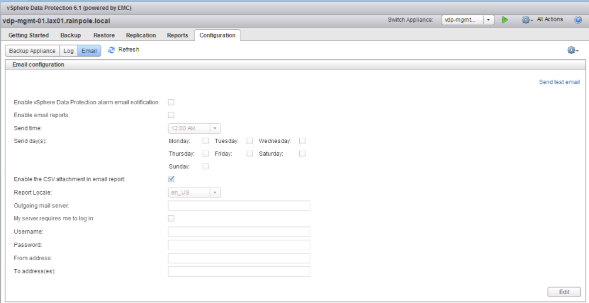

2.  Configure the following settings for email notification and click **Save**.

| Email Notification Settings                                 | Value                      |
|-------------------------------------------------------------|----------------------------|
| **Enable vSphere Data Protection alarm email notification** | Selected                   |
| **Enable email reports**                                    | Selected                   |
| **Send time**                                               | 6:00 AM                    |
| **Send day(s)**                                             | All days                   |
| **Enable the CSV attachment in email report **              | Selected                   |
| **Outgoing mail server**                                    | smtp.rainpole.local        |
| **From address**                                            | vdp-mgmt-01@rainpole.local
                                                               vdp-mgmt-51@rainpole.local  |
| **To address(es)**                                          | sddc-admin@rainpole.local  |

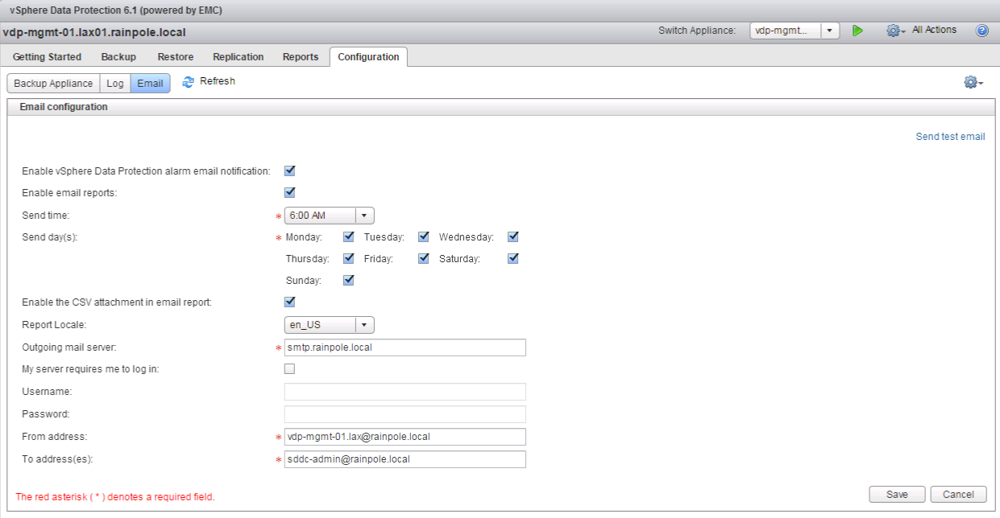

1.  Click the **Send test email** hyperlink and verify that you receive the test email.

    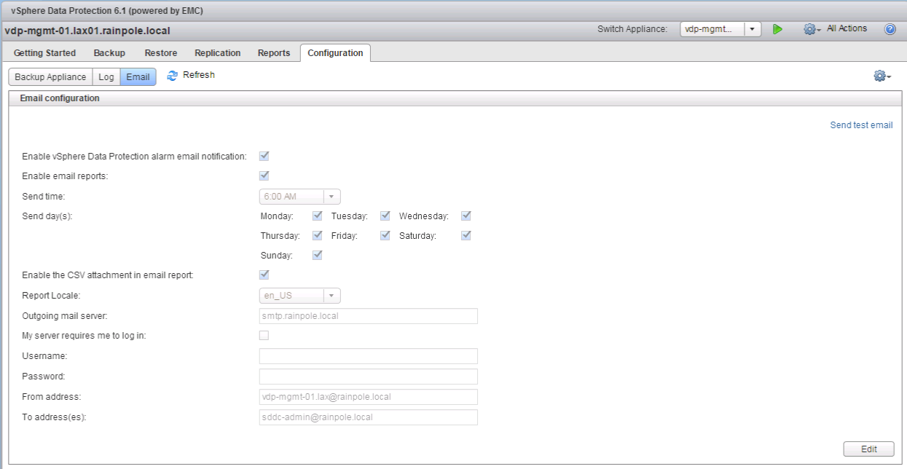

    1.  ### Configure vRealize Automation System Notification Events

You can receive automatic notifications for several types of events, such as the successful completion of a catalog request or a required approval.

System administrators can configure global email servers that handle email notifications.

Tenant administrators can override the system default servers, or add their own servers if no global servers are specified. Tenant administrators select which events, also known as scenarios, trigger notifications. Each component, such as the service catalog or IaaS, can define events that can trigger notifications.

Each user can choose whether to receive notifications. Users either receive all notifications configured by the tenant administrator or no notifications, they do not have the fine-grained control over which notifications to receive.

**Prerequisites**

-   Verify that vRealize Automation has the inbound and outbound email servers configured. See *Configure the Default Email Servers (Region A)*.

**Procedure**

1.  Open the vRealize Automation management console for the Rainpole tenant.

    1.  In a Web browser, go to **https://vra01svr01.rainpole.local/vcac/org/rainpole.**

    2.  Use the **ITAC-TenantAdmin@rainpole.local** user name and **rainpole\_tenant\_admin\_password** password to log in.

        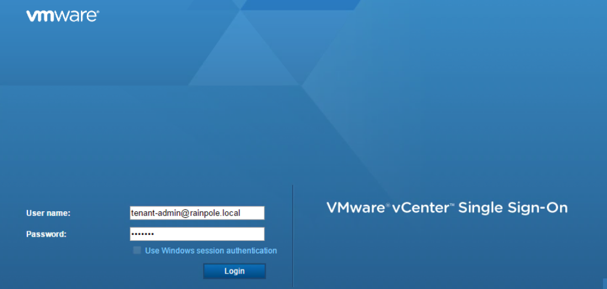

<!-- -->

1.  On the **Home** page of the vRealize Automation management console, click the **Administration** tab and click **Notifications**.

2.  Configure the scenarios to receive notifications about. By default all scenarios are active.

    1.  On the **Notifications** page, select **Scenarios** in the navigator.

    2.  If you do not want to be alerted on a scenario, select it and click the **Suspend** button.

    3.  Verify that each of the scenarios you want receive notifications about is **Active**.

        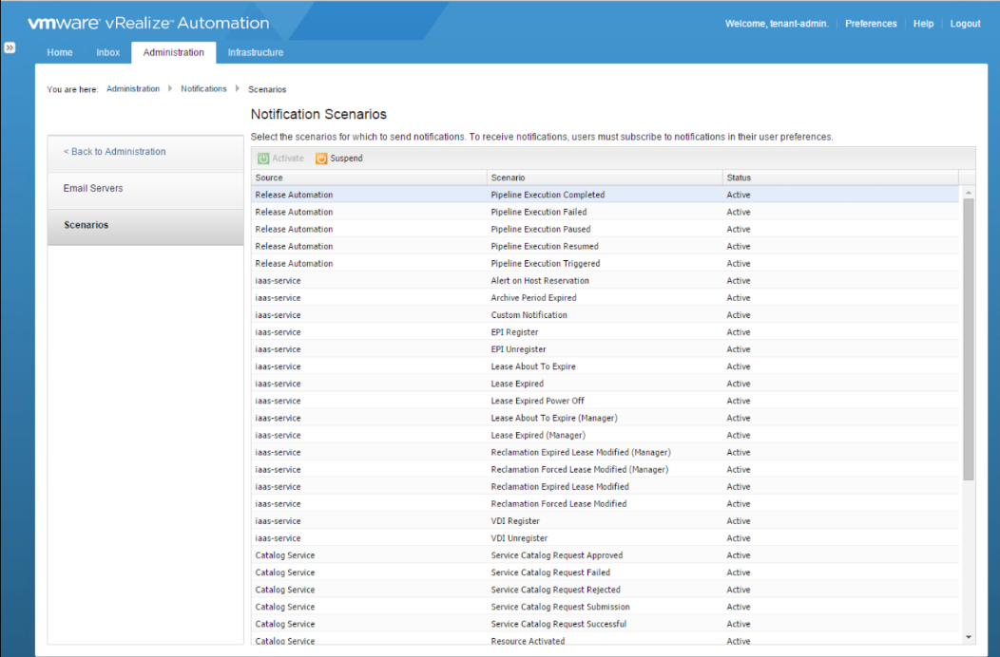

3.  Subscribe to notifications from vRealize Automation.

    1.  Click **Preferences** next to the **ITAC-TenantAdmin** username.

        

    2.  Under **Notifications**, select **English (United States)** from the **Language** drop-down menu.

    3.  Select **Enabled** next to the **Email** protocol, click **Apply** and click **Close**.

        

Notifications are now enabled for the **ITAC-TenantAdmin** account.

1.  Business Continuity Operations
    ==============================

    1.  Region A Backup and Restore
        ---------------------------

Create backup jobs in vSphere Data Protection for the vRealize Operations Manager, vRealize Log Insight, NSX and vRealize Automation. If a hardware failure occurs, you can restore the components of these products from the saved backups.

-   Backing Up and Restoring vCenter Server in Region A

-   Backing Up and Restoring vRealize Operations Manager in Region A

-   Backing Up and Restoring vRealize Log Insight in Region A

-   Backing Up and Restoring vRealize Automation in Region A

-   Backing Up and Restoring the NSX Instances in Region A

    1.  ### Backing Up and Restoring vCenter Server in Region A

Schedule regular backup jobs of the vCenter Server instances and the connected Platform Services Controllers, and perform restore in cases of corrupt appliance instances.

1.  Backing up the embedded PostgresSQL database is not required for this validated design. If you plan to add such an additional layer of recoverability, see VMware Knowledge Base article 2091961.

-   Create Scheduled Backup Jobs for the vCenter Server Instances in Region A

-   Restore the Management vCenter Server in Region A

-   Restore the Compute vCenter Server in Region A

    1.  #### Create Scheduled Backup Jobs for the vCenter Server Instances in Region A

Create a scheduled job for full image backup of vCenter Server and the connected external Platform Services Controller. Schedule backups for both the Management vCenter Server and Compute vCenter Server.

Procedure

1.  Open the vSphere Web Client

    1.  In a Web browser, go to **https://mgmt01vc01.sfo01.rainpole.local/vsphere-client**.

    2.  Use **administrator@vsphere.local** user name and the **vsphere\_admin\_password** password to log in.

<!-- -->

1.  On the **vSphere Home** page, click **vSphere Data Protection**.

2.  On the **Welcome to vSphere Data Protection** page, select **vdp-mgmt-01** from the **VDP Appliance** drop-down menu and click **Connect**.

3.  Click the **Backup** tab.

4.  From the **Backup Job Actions** menu, select **New** to run the **Create new backup job** wizard.

5.  On the **Job Type** page, select **Guest Images**, and click **Next**.

6.  On the **Data Type** page, select **Full Image**, and leave the **Fallback to non-quiescence failure** option selected, and click **Next**.

7.  On the **Backup Sources** page, fully expand the **Virtual Machines** tree, select the virtual appliances for vCenter Server and the Platform Services Controller, and click **Next**.

| Object                              | Value for Management vCenter Server | Value for Compute vCenter Server |
|-------------------------------------|-------------------------------------|----------------------------------|
| **vCenter Server**                  | mgm01vc01.sfo01.rainpole.local      | comp01vc01.sfo01.rainpole.local  |
| **Data center**                     | SFO01                               | SFO01                            |
| **Cluster**                         | SFO01-Mgmt01                        | SFO01-Comp01                     |
| **Platform Services Controller VM** | mgmt01psc01.sfo01                   | comp01psc01.sfo01                |
| **vCenter Server VM**               | mgmt01vc01.sfo01                    | comp01vc01.sfo01                 |

1.  On the **Schedule** page, set **Backup Schedule** to **Daily** and click **Next**.

2.  On the **Retention Policy** page, set **Keep** to **for 3 days**, and click **Next**.

3.  On the **Job Name** page, enter a name for the backup job, and click **Next**.

-   For the Management vCenter Server, enter **Management vCenter Server Backups**.

-   For the Compute vCenter Server, enter **Compute vCenter Server Backups**.

1.  On the **Ready to Complete** page, review the summary information for the backup job and click **Finish**.

2.  In the dialog box that shows a confirmation that the job is created, click **OK**.

3.  Repeat the steps for create a backup job for the second vCenter Server.

    1.  #### Restore the Management vCenter Server in Region A

If the Management vCenter Server stops responding or becomes corrupt as a result of a failure in the environment, to restore the Management vCenter Server, perform a direct-to-host emergency restore. vSphere Data Protection restores the VM that contains the vCenter Server or Platform Services Controller directly on the ESXi host that is running the vSphere Data Protection appliance.

You perform the direct-to-host emergency restore from backups of vCenter Server and Platform Services Controller that vSphere Data Protection has previously saved according to the settings in the backup job you have created. You cannot use a regular restore in this case because both the Management vCenter Server and the associated Platform Services Controller must be available.

Procedure

1.  Open the vSphere Data Protection Configure Utility.

    1.  In a Web browser, go to **https://vdp-mgmt-01.sfo01.rainpole.local:8543/vdp-configure**.

    2.  Use the **root** user name and the **vdp\_appliance\_root\_password** password to log in.

<!-- -->

1.  Click the **Configuration** tab, in the **Proxies** table locate the ESXi host that runs the **vdp-mgmt-01** appliance and write down the FQDN of the host.

2.  Disconnect the ESXi host that is running the vSphere Data Protection appliance from the Management vCenter Server.

    1.  On the Windows host that has access to your data center, open the vSphere Client.

    2.  Log in to the ESXi host by using the **root** user name and the **esxi\_root\_user\_password** password.

        Use the FQDN that you have located in the vSphere Data Protection Configure Utility.

    3.  Navigate to the host object in the inventory.

    4.  Click the **Summary** tab.

    5.  In the **Host Management** pane, click **Disassociate host from vCenter Server**, and click **OK** in the **Confirm Disassociate** dialog box.

3.  Go again to the vSphere Data Protection Configure Utility.

4.  Click the **Emergency Restore** tab.

5.  Expand the virtual appliance node for the Management vCenter Server or Platform Services Controller that you must restore, expand the virtual machine and select the latest backup to restore from.

| Role                                                                                | Virtual Appliance Name |
|-------------------------------------------------------------------------------------|------------------------|
| **Management vCenter Server**                                                       | mgmt01vc01.sfo01       |
| **Platform Services Controller that is connected to the Management vCenter Server** | mgmt01psc01.sfo01      |

1.  Click the **Restore** button

2.  In the **Host Credentials** dialog box, enter the credentials for connection to the ESXi host that is running the vSphere Data Protection appliance.

| ESXi Host Connection Option | Value                      |
|-----------------------------|----------------------------|
| **Hostname or IP**          | Leave the default value.   |
| **Port number**             | 443                        |
| **Username**                | root                       |
| **Password**                | esxi\_root\_user\_password |

1.  In the **Restore a Backup** dialog box, enter a new name for the restored VM in the **New Name** text box.

| Role                                                                            | Virtual Appliance Name     |
|---------------------------------------------------------------------------------|----------------------------|
| Management vCenter Server                                                       | mgmt01vc01.sfo01.restored  |
| Platform Services Controller that is connected to the Management vCenter Server | mgmt01psc01.sfo01.restored |

1.  From the **Datastore** drop-down menu, select the **SFO01A-VSAN01-MGMT01** datastore and click **OK**.

2.  Repeat Step 6 to Step 10 to restore the other appliance.

3.  Remove the physical adapter assigned to **dvUplink2** from the distributed switch.

    1.  In the vSphere Client, navigate to **Configuration** &gt; **Networking**.

    2.  Click the **vSphere Distributed Switch** button.

    3.  Click the **Manage Physical Adapters** link.

    4.  Click the **remove** link under **dvUplink2** then click **OK.**

4.  Create a vSphere Standard Switch and port group.

    1.  In the vSphere Client, navigate to **Configuration** &gt; **Networking**.

    2.  Click the **vSphere Standard Switch** button.

    3.  Click the **Add Networking** link.

    4.  Choose **Virtual Machine** and click **Next**.

    5.  Choose Create a **vSphere Stand Switch**, choose the physical adapter removed in the previous step and click **Next**.

    6.  Enter **vCenter-Restore** as the **Network Label** and **1611** for the **VLAN** and click **Next**.

    7.  Click **Finish**.

5.  Reconfigure the restored appliances to use the vCenter-Restore port group.

    1.  In the vSphere Client, navigate to the virtual machine of Platform Services Controller **mgmt01psc01.sfo01.restored**.

    2.  Right-click the virtual machine and select **Edit Settings**.

    3.  Click on **Network adapter 1** from the list.

    4.  Change the **Network Label** to **vCenter-Restore** and click **OK**.

    5.  Repeat for any other restored appliances.

6.  Power on the vCenter Server and Platform Services Controller virtual machines.

    1.  In the vSphere Client, navigate to the virtual machine of Platform Services Controller **mgmt01psc01.sfo01.restored**.

    2.  Right-click the virtual machine and select **Power** &gt; **Power On**.

    3.  Navigate to the virtual machine of vCenter Server **mgmt01vc01.sfo01.restored**.

    4.  Right-click the virtual machine and select **Power** &gt; **Power On**.

7.  After the Management vCenter Server is running again, reconnect the ESXi host that is running the vSphere Data Protection appliance.

    1.  In a Web browser, go to **https://mgmt01vc01.sfo01.rainpole.local/vsphere-client**.

    2.  Use the **administrator@vsphere.local** user name and the **vsphere\_admin\_password** password.

    3.  Right-click the host and select **Connection** &gt; **Connect**.

8.  Reconfigure the restored appliances to use the vDS-Mgmt-Management port group.

    1.  In a Web browser, go to **https://mgmt01vc01.sfo01.rainpole.local/vsphere-client**.

    2.  Use the **administrator@vsphere.local** user name and the **vsphere\_admin\_password** password.

    3.  Right-click the virtual machine and select **Edit Settings**.

    4.  Change the drop-down box for **Network adapter 1** to **vDS-Mgmt-Management** and click **OK**.

    5.  Repeat for any other restored appliances.

9.  Remove the vSphere Standard Switch.

    1.  In a Web browser, go to **https://mgmt01vc01.sfo01.rainpole.local/vsphere-client**.

    2.  Use the **administrator@vsphere.local** user name and the **vsphere\_admin\_password** password.

    3.  Select the ESXi host reconnected in step 16.

    4.  Click on **Manage** &gt; **Networking** &gt; **Virtual Switches**.

    5.  Select the vSphere Standard Switch and then click the red **X** to remove it.

    6.  Click **Yes** to remove the vSphere Standard Switch.

10. Add the physical adapter back to dvUplink2.

    1.  In a Web browser, go to **https://mgmt01vc01.sfo01.rainpole.local/vsphere-client**.

    2.  Use the **administrator@vsphere.local** user name and the **vsphere\_admin\_password** password.

    3.  Select the ESXi host reconnected in step 16.

    4.  Click on **Manage** &gt; **Networking** &gt; **Virtual Switches**.

    5.  Select **vDS-Mgmt** and click the **Manage the physical network adapters** icon.

    6.  Click the green plus (**+**) icon.

    7.  Select the physical adapter and click **OK**.

    8.  Click **OK**.

        1.  #### Restore the Compute vCenter Server in Region A

Restore the Compute vCenter Server or the associated Platform Services Controller if a major hardware failure occurs.

Procedure

1.  Open the vSphere Web Client

<!-- -->

1.  In a Web browser, go to **https://mgmt01vc01.sfo01.rainpole.local/vsphere-client**.

2.  Use **administrator@vsphere.local** user name and the **vsphere\_admin\_password** password to log in.

3.  According to the component that you restore, power off the appliance vCenter Server and Platforms Service Controller component being restored

    1.  Navigate to the appliance that you restore.

| Role                                                                     | Virtual Appliance Name |
|--------------------------------------------------------------------------|------------------------|
| **Compute vCenter Server**                                               | comp01vc01.sfo01       |
| **Platform Services Controller connected to the Compute vCenter Server** | comp01psc01.sfo01      |

1.  Right-click the appliance object and select **Power** &gt; **Power Off**.

<!-- -->

1.  Right-click the appliance object, click **Delete from Disk** and click **Yes** in the **Confirm Delete** dialog box.

2.  Restore latest vCenter Server and Platform Services Controller backup from vSphere Data Protection.

    1.  On the vSphere Web Client **Home** page, click **vSphere Data Protection**.

    2.  On the **Welcome to vSphere Data Protection** page, select **vdp-mgmt-01** from the **VDP Appliance** drop-down menu, and click **Connect**.

    3.  Click the **Restore** tab and select the **comp01psc01.sfo01** virtual appliance.

        You see the list of the backups for the appliance.

    4.  Select the check box for the latest backup and click the back arrow to return to the list of VMs.

    5.  From the list of VMs, select the **comp01vc01.sfo01** virtual appliance and select the latest backup.

    6.  Click **Restore** on the toolbar.

        The **Restore backup** wizard opens.

    7.  On the **Select Backup** page, click **Next**.

    8.  On the **Set Restore Options** page, select **Restore to original location** and click **Next**.

    9.  On the **Ready to Complete** page, click **Finish**.

3.  Power on the Compute vCenter Server and Platform Services Controller virtual machines.

    1.  Navigate to the virtual machine of Platform Services Controller **comp01psc01.sfo01**.

    2.  Right-click the **comp01psc01.sfo01** appliance object and select **Power** &gt; **Power On**.

    3.  Navigate to the virtual machine of Compute vCenter Server **comp01vc01.sfo01**.

    4.  Right-click the **comp01vc01.sfo01** appliance object and select **Power** &gt; **Power On**.

4.  Wait until the appliance starts and verify Platform Services Controller services status

    1.  Log in to the Platform Services Controller Appliance shell as root user.

    2.  Run service-control --status --all command to verify the status of Platform Services Controller services.

    3.  If the services are not running then run the psc-restore script as below:

        psc-restore -u administrator@vsphere.local -p vsphere\_admin\_password

5.  Verify that vCenter Server is running.

    1.  In a Web browser, go to **https://comp01vc01.sfo01.rainpole.local/vsphere-client**.

    2.  Use the **administrator@vsphere.local** and the **vsphere\_admin\_password** password to log in.

    3.  Select **Home** &gt; **Hosts and Clusters** and verify that the inventory items are accessible.

    4.  Verify that you can create a new virtual machine from the **SFO01** data center object under the **comp01vc01.sfo01.rainpole.local** vCenter Server parent object.

        1.  ### Backing Up and Restoring vRealize Operations Manager in Region A

Backup and restore the virtual appliances for the vRealize Operations Manager nodes in the analytics cluster and the remote collector cluster in Region A. Restore vRealize Operations Manager according to the dependencies between the nodes.

-   Create a Scheduled Backup Job for vRealize Operations Manager in Region A

-   Restore vRealize Operations Manager in Region A

    1.  #### Create a Scheduled Backup Job for vRealize Operations Manager in Region A

Create a scheduled job for full image backup of the vRealize Operations Manager nodes in Region A.

Procedure

1.  Open the vSphere Web Client

    1.  In a Web browser, go to **https://mgmt01vc01.sfo01.rainpole.local/vsphere-client**.

    2.  Use **administrator@vsphere.local** user name and the **vsphere\_admin\_password** password to log in.

<!-- -->

1.  On the vSphere **Home** page, click **vSphere Data Protection**.

2.  On the **Welcome to vSphere Data Protection** page, select **vdp-mgmt-01** from the **VDP Appliance** drop-down menu and click **Connect**.

3.  Click the **Backup** tab.

4.  From the **Backup Job Actions** menu, select **New** to run the **Create new backup job** wizard.

5.  On the **Job Type** page, select **Guest Images**, and then click **Next**.

6.  On the **Data Type** page, select **Full Image**, and leave the **Fallback to non-quiescence failure** option selected, and click **Next**.

7.  On the **Backup Sources** page, fully expand the **Virtual Machines** tree.

| Object             | Value                          |
|--------------------|--------------------------------|
| **vCenter Server** | mgm01vc01.sfo01.rainpole.local |
| **Data center**    | SFO01                          |
| **Cluster**        | SFO01-Mgmt01                   |

1.  Select the virtual appliances for vRealize Operations Manager, and click **Next**.

| Virtual Appliance Name | Role                |
|------------------------|---------------------|
| vrops-mstrn-01         | Master node         |
| vrops-repln-02         | Master replica node |
| vrops-datan-03         | Data node 1         |
| vrops-datan-04         | Data node 2         |
| vrops-rmtcol-01        | Remote collector 1  |
| vrops-rmtcol-02        | Remote collector 2  |

1.  On the **Schedule** page, set **Backup Schedule** to **Daily** and click **Next**.

2.  On the **Retention Policy** page, set **Keep** to **for 3 days**, and click **Next**.

3.  On the **Job Name** page, enter **vRealize Operations Manager Backups** as a name for the backup job, and click **Next**.

4.  On the **Ready to Complete** page, review the summary information for the backup job and click **Finish**.

5.  In the dialog box that shows a confirmation that the job is created, click **OK**.

    1.  #### Restore vRealize Operations Manager in Region A

Restore the vRealize Operations Manager nodes if a major hardware failure occurs by using a backup that is created as a result from the scheduled backup job for the nodes.

**Procedure**

1.  Open the vSphere Web Client

    1.  In a Web browser, go to **https://mgmt01vc01.sfo01.rainpole.local/vsphere-client**.

    2.  Use **administrator@vsphere.local** user name and the **vsphere\_admin\_password** password to log in.

<!-- -->

1.  Power off all vRealize Operations Manager virtual appliances.

    1.  Select **Home** &gt; **Hosts and Clusters**.

    2.  Navigate to each appliance.

| Object Type    | Object              | Value                           |
|----------------|---------------------|---------------------------------|
| Path           | vCenter Server      | mgmt01vc01.sfo01.rainpole.local |
|                | Data center         | SFO01                           |
|                | Cluster             | SFO01-Mgmt01                    |
| Appliance Name | Master node         | vrops-mstrn-01                  |
|                | Master replica node | vrops-repln-02                  |
|                | Data node 1         | vrops-datan-03                  |
|                | Data node 2         | vrops-datan-04                  |
|                | Remote collector 1  | vrops-rmtcol-01                 |
|                | Remote collector 2  | vrops-rmtcol-02                 |

1.  Right-click the appliance object and select **Power** &gt; **Power Off**.

2.  Repeat the steps to power the other five appliances off.

3.  Right-click the appliance object, click **Delete from Disk** and click **Yes** in the **Confirm Delete** dialog box

<!-- -->

1.  Restore latest vRealize Operations Manager VMs backup from the vSphere Data Protection server

    1.  On the vSphere Web Client **Home** page, click **vSphere Data Protection**.

    2.  On the **Welcome to vSphere Data Protection** page, select **vdp-mgmt-01** from the **VDP Appliance** drop-down menu, and click **Connect**.

    3.  Click the **Restore** tab and select a node appliance of vRealize Operations Manager.
        You see the list of the backups for the appliance.

    4.  Select the check box for the latest appliance backup and click the back arrow to return to the list of backups.

    5.  Repeat Step 2c to Step 2d to select the latest backups of the other appliances of vRealize Operations Manager.

    6.  Click **Restore** on the toolbar.

        The **Restore backup** wizard opens.

    7.  On the **Select Backup** page, click **Next**.

    8.  On the **Set Restore Options** page, select **Restore to original location** for each appliance, and click **Next**.

    9.  On the **Ready to Complete** page, click **Finish**.

2.  Verify that the restore is successful.

    1.  Click the **Configuration** tab on the vSphere Data Protection page, and click **Log**.

    2.  Locate logs **Restore of client named vrops\_vm\_name completed**.

3.  Power on the nodes of vRealize Operations Manager.

    1.  Navigate to the **vrops-mstrn-01** appliance, right-click the appliance object and select **Power** &gt; **Power On**.

    2.  Wait until the appliance is running.

    3.  Repeat the steps to power on the other nodes in the following order.

-   **vrops-repln-02 **

-   **vrops-datan-03**

-   **vrops-datan-04**

-   **vrops-rmtcol-01**

-   **vrops-rmtcol-02 **

    1.  ### Backing Up and Restoring vRealize Log Insight in Region A

Backup and restore the virtual appliances for the vRealize Log Insight nodes in Region A. Restore vRealize Log Insight according to the dependencies between the nodes.

-   Create a Scheduled Backup Job for vRealize Log Insight in Region A

-   Restore vRealize Log Insight in Region A

    1.  #### Create a Scheduled Backup Job for vRealize Log Insight in Region A

Create a scheduled job for full image backup of the vRealize Log Insight nodes in Region A.

**Procedure**

1.  Open the vSphere Web Client

    1.  In a Web browser, go to **https://mgmt01vc01.sfo01.rainpole.local/vsphere-client**.

    2.  Use **administrator@vsphere.local** user name and the **vsphere\_admin\_password** password to log in.

<!-- -->

1.  On the vSphere **Home** page, click **vSphere Data Protection**.

2.  On the **Welcome to vSphere Data Protection** page, select **vdp-mgmt-01** from the **VDP Appliance** drop-down menu and click **Connect**.

3.  Click the **Backup** tab.

4.  From the **Backup Job Actions** menu, select **New** to open the **Create new backup job** wizard.

5.  On the **Job Type** page, select **Guest Images**, and then click **Next**.

6.  On the **Data Type** page, select **Full Image**, and leave the **Fallback to non-quiescence failure** option selected, and click **Next**.

7.  On the **Backup Sources** page, fully expand the **Virtual Machines** tree.

| Object             | Value                          |
|--------------------|--------------------------------|
| **vCenter Server** | mgm01vc01.sfo01.rainpole.local |
| **Data center**    | SFO01                          |
| **Cluster**        | SFO01-Mgmt01                   |

1.  Select the virtual appliances for vRealize Log Insight, and click **Next**.

| Virtual Appliance Name | Role          |
|------------------------|---------------|
| vrli-mstr-01           | Master node   |
| vrli-wrkr-01           | Worker node 1 |
| vrli-wrkr-02           | Worker node 2 |

1.  On the **Schedule** page, set **Backup Schedule** to **Daily** and click **Next**.

2.  On the **Retention Policy** page, set **Keep** to **for 3 days**, and click **Next**.

3.  On the **Job Name** page, enter **vRealize Log Insight Backups** as a name for the backup job, and click **Next**.

4.  On the **Ready to Complete** page, review the summary information for the backup job and click **Finish**.

5.  In the dialog box that shows a confirmation that the job is created, click **OK**.

    1.  #### Restore vRealize Log Insight in Region A

Restore the vRealize Log Insight nodes by using a backup that is created as a result from the scheduled backup job for the nodes.

**Procedure**

1.  Open the vSphere Web Client

    1.  In a Web browser, go to **https://mgmt01vc01.sfo01.rainpole.local/vsphere-client**.

    2.  Use **administrator@vsphere.local** user name and the **vsphere\_admin\_password** password to log in.

<!-- -->

1.  Power off all vRealize Log Insight virtual appliances.

    1.  Select **Home** &gt; **Hosts and Clusters**.

    2.  Navigate to each appliance.

| Object Type    | Object         | Value                           |
|----------------|----------------|---------------------------------|
| Path           | vCenter Server | mgmt01vc01.sfo01.rainpole.local |
|                | Data center    | SFO01                           |
|                | Cluster        | SFO01-Mgmt01                    |
| Appliance Name | Master node    | vrli-mstr-01                    |
|                | Data node 1    | vrli-wrkr-01                    |
|                | Data node 2    | vrli-wrkr-01                    |

1.  Right-click the appliance object and select **Power** &gt; **Power Off**.

2.  Repeat the steps to power the other five appliances off.

3.  Right-click the appliance object, click **Delete from Disk** and click **Yes** in the **Confirm Delete** dialog box.

<!-- -->

1.  Restore latest vRealize Log Insight VMs backup from the vSphere Data Protection server

    1.  On the vSphere Web Client **Home** page, click **vSphere Data Protection**.

    2.  On the **Welcome to vSphere Data Protection** page, select **vdp-mgmt-01** from the **VDP Appliance** drop-down menu, and click **Connect**.

    3.  Click the **Restore** tab and select a node appliance of vRealize Log Insight Manager.

        You see the list of the backups of the appliance.

    4.  Select the check box for the latest appliance backup and click the back arrow to return to the list of backups.

    5.  Repeat Step 2c to Step 2d to select the latest backups of the other appliances of vRealize Log Insight.

    6.  Click the **Restore** tab.

        The **Restore backup** wizard opens showing the selected backups.

    7.  On the **Select Backup** page, click **Next**.

    8.  On the **Set Restore Options** page, select **Restore to original location** for each appliance, and click **Next**.

    9.  On the **Ready to Complete** page, click **Finish**.

2.  Verify that the restore is successful.

    1.  Click the **Configuration** tab on the vSphere Data Protection page, and click **Log**.

    2.  Locate the logs **Restore of client named vrli\_vm\_name completed**.

3.  Power on the nodes of vRealize Log Insight.

    1.  Navigate to the **vrli-mstr-01** appliance, right-click the appliance object and select **Power** &gt; **Power On**.

    2.  Wait until the appliance is running.

    3.  Repeat the steps to power on the other nodes in the following order.

> **vrli-wrkr-01**
>
> **vrli-wrkr-02**

1.  Verify that vRealize Log Insight is operational.

    1.  In a Web browser, go to **https://vrli-cluster-01.sfo01.rainpole.local**.

    2.  Use the **admin** user name and the **vrli\_admin\_password** password to log in.

    3.  Click the configuration drop-down menu icon  and select **Administration**.

    4.  Under **Management**, click **System Monitor**.

    5.  On the **System Monitor** page, click the **Statistics** tab, and verify that the tab shows incoming syslog events.

        Several minutes might pass before syslog events start showing.

        1.  ### Backing Up and Restoring vRealize Automation in Region A

Backup the Linux virtual appliances and the Windows virtual machines of vRealize Automation. Use guest-level backups for the Microsoft SQL Server instance that hosts the databases for the IaaS components and vRealize Orchestrator.

-   Create a Scheduled Backup Job for vRealize Automation in Region A

-   Create a Job for Application Backups of Microsoft SQL Server in Region A

-   Restore vRealize Automation in Region A

    1.  #### Create a Scheduled Backup Job for vRealize Automation in Region A

Create a scheduled job for full image backup of the vRealize Automation Linux appliances and Windows virtual machines in Region A.

**Procedure**

1.  Open the vSphere Web Client

    1.  In a Web browser, go to **https://mgmt01vc01.sfo01.rainpole.local/vsphere-client**.

    2.  Use **administrator@vsphere.local** user name and the **vsphere\_admin\_password** password to log in.

<!-- -->

1.  On the vSphere **Home** page, click **vSphere Data Protection**.

2.  On the **Welcome to vSphere Data Protection** page, select **vdp-mgmt-01** from the **VDP Appliance** drop-down menu and click **Connect**.

3.  Click the **Backup** tab.

4.  From the **Backup Job Actions** menu, select **New** to open the **Create new backup job** wizard.

5.  On the **Job Type** page, select **Guest Images**, and then click **Next**.

6.  On the **Data Type** page, select **Full Image**, and leave the **Fallback to non-quiescence failure** option selected, and click **Next**.

7.  On the **Backup Sources** page, fully expand the **Virtual Machines** tree.

| Object             | Value                          |
|--------------------|--------------------------------|
| **vCenter Server** | mgm01vc01.sfo01.rainpole.local |
| **Data center**    | SFO01                          |
| **Cluster**        | SFO01-Mgmt01                   |

1.  Select the virtual machines for vRealize Log Insight, and click **Next**.

| vRealize Automation Component                 | VM Name                     |
|-----------------------------------------------|-----------------------------|
| **vRealize Automation Identity Appliance**    | vra01ids01a.rainpole.local  |
| **vRealize Appliance**                        | vra01svr01a.rainpole.local  |
| **vRealize Appliance**                        | vra01svr01b.rainpole.local  |
| **IaaS Manager Service and DEM Orchestrator** | vra01ims01a.rainpole.local  |
| **IaaS Manager Service and DEM Orchestrator** | vra01ims01b.rainpole.local  |
| **IaaS Web Server**                           | vra01iws01a.rainpole.local  |
| **IaaS Web Server**                           | vra01iws01b.rainpole.local  |
| **Microsoft SQL Server**                      | vra01mssql01.rainpole.local |
| **vSphere Proxy Agent**                       | vra01ias01.rainpole.local   |
| **vSphere Proxy Agent**                       | vra01ias02.rainpole.local   |
| **vRealize Automation DEM Worker**            | vra01dem01.rainpole.local   |
| **vRealize Automation DEM Worker**            | vra01dem02.rainpole.local   |
| **vRealize Orchestrator Appliance**           | vra01vro01a.rainpole.local  |
| **vRealize Orchestrator Appliance**           | vra01vro01b.rainpole.local  |

1.  On the **Schedule** page, set **Backup Schedule** to **Daily** and click **Next**.

2.  On the **Retention Policy** page, set **Keep** to **for 3 days**, and click **Next**.

3.  On the **Job Name** page, enter **vRealize Automation Backups** as a name for the backup job, and click **Next**.

4.  On the **Ready to Complete** page, review the summary information for the backup job and click **Finish**.

5.  In the dialog box that shows a confirmation that the job is created, click **OK**.

    1.  #### Create a Job for Application Backups of Microsoft SQL Server in Region A

Install the backup agent on the Microsoft SQL Server for vRealize Automation and create a scheduled job for application backup in vSphere Data Protection.

**Procedure**

1.  Download the backup agent on the Microsoft SQL Server machine.

    1.  On the vra01mssql01.rainpole.local Microsoft SQL Server, go to **https://**mgmt01vc01.sfo01.rainpole.local/vsphere-client in a Web browser.

    2.  Use the **administrator@vsphere.local** user name and the **vsphere\_admin\_password** password to log in.

    3.  On the vSphere **Home** page, click **vSphere Data Protection**.

    4.  On the **Welcome to vSphere Data Protection** page, select **vdp-mgmt-01** from the **VDP Appliance** drop-down menu and click **Connect**.

    5.  Click the **Configuration** tab and click the **Microsoft SQL Server 64 bit** link in the **Downloads** pane.

        The Web browser starts downloading the installer of the vSphere Data Protection backup agent.

<!-- -->

1.  Install the backup agent on the Microsoft SQL Server machine.

    1.  After the VMwareVDPSQL-windows-x86\_64\_version.msi file is saved, double-click it to start the installation.

    2.  The **VMware VDP for SQL Server Setup** wizard opens.

    3.  On the **Welcome to the VMware VDP for SQL Server Setup** page, click **Next**.

    4.  On the **End-User License Agreement** page, accept the end user license agreements and click **Next**.

    5.  On the **VMware VDP for SQL Server Setup** page, click **Next** to accept the default installation path for the backup agent.

    6.  On the **Appliance Registration Information** page, enter **vdp-mgmt-01.sfo01.rainpole.local** in the **VDP Appliance** text box, and click **Next**.

    7.  On the **Ready to install VMware VDP for SQL Server** page, click **Install**.

    8.  After the installation is complete, on the **Completed the VMware VDP for SQL Server Setup Wizard** page, click **Finish**.

2.  Open the vSphere Web Client

    1.  In a Web browser, go to **https://mgmt01vc01.sfo01.rainpole.local/vsphere-client**.

    2.  Use **administrator@vsphere.local** user name and the **vsphere\_admin\_password** password to log in.

    3.  On the vSphere **Home** page, click **vSphere Data Protection**.

    4.  On the **Welcome to vSphere Data Protection** page, select **vdp-mgmt-01** from the **VDP Appliance** drop-down menu and click **Connect**.

    5.  Click the **Backup** tab, and from the **Backup Job Actions** menu, select **New** to open the **Create new backup job** wizard.

    6.  On the **Job Type** page, select **Applications**, and then click **Next**.

    7.  On the **Data Type** page, select **Full Server**, and click **Next**.

    8.  On the **Backup Sources** page, expand **Microsoft SQL Server**, select **vra01mssql01.rainpole.local**, and click **Next**.

    9.  On **Backup Options** page, leave all default values and click **Next**.

    10. On the **Schedule** page, set **Backup Schedule** to **Daily** and click **Next**.

    11. On the **Retention Policy** page, set **Keep** to **for 3 days**, and click **Next**.

    12. On the **Job Name** page, enter **vRealize Automation MSSQL Backups** as a name for the backup job, and click **Next**.

    13. On the **Ready to Complete** page, review the summary information for the backup job and click **Finish**.

    14. In the dialog box that shows a confirmation that the job is created, click **OK**.

        1.  #### Restore vRealize Automation in Region A

Restore the vRealize Automation nodes by using a backup that is created as a result from the scheduled backup job for the nodes.

Procedure

1.  Open the vSphere Web Client

    1.  In a Web browser, go to [**https://mgmt01vc01.sfo01.rainpole.local/vsphere-client**](https://mgmt01vc01.sfo01.rainpole.local/vsphere-client).

    2.  Use [**administrator@vsphere.local**](mailto:administrator@vsphere.local) user name and the **vsphere\_admin\_password** password to log in.

<!-- -->

1.  Power off all vRealize Automation virtual machines.

    1.  Select **Home** &gt; **Hosts and Clusters**.

    2.  On the **Backup Sources** page, fully expand the **Virtual Machines** tree.

| Object             | Value                          |
|--------------------|--------------------------------|
| **vCenter Server** | mgm01vc01.sfo01.rainpole.local |
| **Data center**    | SFO01                          |
| **Cluster**        | SFO01-Mgmt01                   |

1.  Navigate to each vRealize Automation virtual machine.

| vRealize Automation Component             | VM Name      |
|-------------------------------------------|--------------|
| vRealize Automation Identity Appliance    | vra01ids01a  |
| vRealize Appliance                        | vra01svr01a  |
| vRealize Appliance                        | vra01svr01b  |
| IaaS Manager Service and DEM Orchestrator | vra01ims01a  |
| IaaS Manager Service and DEM Orchestrator | vra01ims01b  |
| IaaS Web Server                           | vra01iws01a  |
| IaaS Web Server                           | vra01iws01b  |
| Microsoft SQL Server                      | vra01mssql01 |
| vSphere Proxy Agent                       | vra01ias01   |
| vSphere Proxy Agent                       | vra01ias02   |
| vRealize Automation DEM Worker            | vra01dem01   |
| vRealize Automation DEM Worker            | vra01dem02   |
| vRealize Orchestrator Appliance           | vra01vro01a  |
| vRealize Orchestrator Appliance           | vra01vro01b  |

1.  Right-click the appliance object and select **Power** &gt; **Power Off**.

2.  Repeat the steps to power the other virtual machines off.

3.  Right-click the appliance object, click **Delete from Disk** and click **Yes** in the **Confirm Delete** dialog box.

<!-- -->

1.  Restore latest vRealize Automation backups from the vSphere Data Protection server.

    1.  On the vSphere Web Client **Home** page, click **vSphere Data Protection**.

    2.  On the **Welcome to vSphere Data Protection** page, select **vdp-mgmt-01** from the **VDP Appliance** drop-down menu, and click **Connect**.

    3.  Click the **Restore** tab and select a node virtual machine of vRealize Automation.

        You see the list of the backups of the virtual machine.

    4.  Select the check box for the latest virtual machine backup and click the back arrow to return to the list of backups.

    5.  Repeat Step 2c to Step 2d to select the latest backups of the other virtual machines of vRealize Automation.

    6.  After you select the virtual machines, click the **vra01mssql01.rainpole.local** application entry and select the check box for the latest backup.

    7.  Click the **Restore** tab.

        The **Restore backup** wizard opens showing the selected backups.

    8.  On the **Select Backup** page, click **Next**.

    9.  On the **Set Restore Options** page, select **Restore to original location** for each virtual machine, and click **Next**.

    10. On the **Ready to Complete** page, click **Finish**.

2.  Verify that the restore is successful.

    1.  Click the **Configuration** tab on the vSphere Data Protection page, and click **Log**.

    2.  Locate the logs **Restore of client named vra\_vm\_name completed**.

3.  Power on the nodes of vRealize Automation.

    1.  Navigate to the **vra01svr01a** virtual machine, right-click the appliance object and select **Power** &gt; **Power On**.

    2.  Wait until the appliance is running.

    3.  Repeat the steps to power on the other vRealize Automation virtual machines in the order specified in the *SDDC Startup and Shutdown* documentation.

        1.  ### Backing Up and Restoring the NSX Instances in Region A

You can back up certain components of NSX for the management cluster and for the compute and edge clusters to restore the working state of the system in the event of failure.

The following components support backup and restore:

-   NSX Manager

-   NSX Firewall Rules

-   NSX Service Composer

-   vSphere Distributed Switch

Backing up NSX Manager regularly enables you to restore the working state of your system in the event of catastrophic failure. You can schedule backups to suit business needs and operational requirements. Set the backup frequency according to the rate of configuration changes occurring in NSX. You can back up NSX manually or schedule hourly, daily, or weekly automatic backups.

Back up NSX and vCenter Server before and after the following events:

-   NSX or vCenter Server upgrade.

-   Day 0 deployment and configuration of NSX components.

-   Major Day 2 changes.

**Procedure Overview**

-   Back Up NSX Manager in Region A

-   Restore NSX Manager in Region A

-   Export the NSX Firewall Configuration in Region A

-   Import the NSX Firewall Configuration in Region A

-   Export a Service Composer Configuration in Region A

-   Import a Security Policies Configuration in Region A

-   Export Configurations of the Distributed Switches in Region A

-   Restore the Configuration of a Distributed Switch in Region A

    1.  #### Back Up NSX Manager in Region A

You can back up the NSX Manager data by scheduling a regular backup.

You configure backup and restore operations from the NSX Manager virtual appliance UI. You can schedule backups on an hourly, daily, or weekly basis. The backup data is saved out to a remote location that NSX Manager can access through FTP or SFTP. Backed up data includes System Configuration, Audit Logs, System Events, and Flow Records. Configuration tables are included in every backup. Backup for the NSX Manager certificate is not supported.

You can restore backed up data only on the same NSX Manager version as the backup

**Prerequisites**

-   Provide a space on an FTP server that is accessible from the NSX Manager for the management cluster and from the NSX Manager for the compute and edge clusters.

-   Obtain a user name and password for access to the FTP server. Contact your system administrator.

**Procedure**

1.  In a Web browser, open the NSX Manager appliance UI.

    1.  Go to the following URL.

| NSX Manager                                       | URL                                       |
|---------------------------------------------------|-------------------------------------------|
| **NSX Manager for the management cluster**        | https://mgmt01nsxm01.sfo01.rainpole.local |
| **NSX Manager for the compute and edge clusters** | https://comp01nsxm01.sfo01.rainpole.local |

1.  Use the **admin** user name and **nsx\_manager\_admin\_password** password to log in.

<!-- -->

1.  On the main page of the appliance UI, click **Backup & Restore**.

    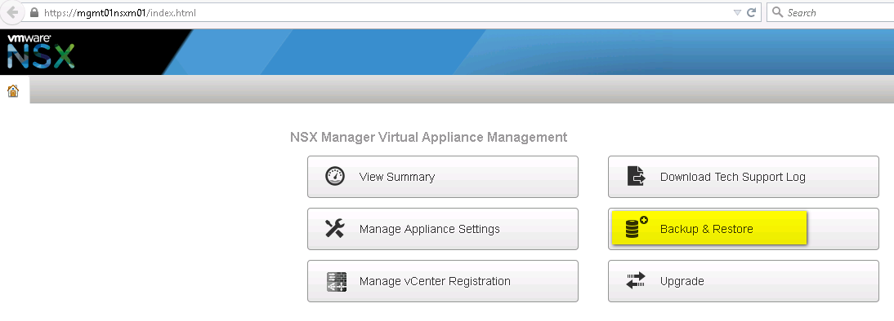

2.  On the **Backup & Restore** page, click **Change** next to **FTP Server Settings** set a storage location for the backup job.

3.  In the **Backup Location** dialog box, configure the following settings for the backup storage on the FTP server and click **OK**. Enter the settings from your system administrator.

<!-- -->

1.  Write down the details about the FTP backup. You need them to restore the NSX Manager from the backup.

| Backup Location Option | Value                                                                              |
|------------------------|------------------------------------------------------------------------------------|
| **IP/Host name**       | FQDN of the FTP Server                                                             |
| **Transfer protocol**  | FTP                                                                                
                          SFTP                                                                                |
| **Port**               | Server port for FTP or SFTP requests                                               |
| **User name**          | User name on the FTP server.                                                       |
| **Password**           | Password for the name you specified in User name                                   |
| **Backup Directory**   | Absolute path to the location on the FTP server where you want to store the backup |
| **Filename Prefix**    | NSX                                                                                |
| **Pass Phrase**        | nsx\_backup\_pass\_phrase                                                          |

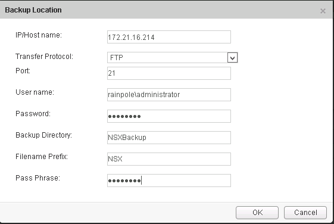

1.  On the **Backup & Restore** page, click **Change** next to **Schedule**.

2.  In the **Create or Schedule Backup** dialog box, configure the following schedule for the backup and click **Schedule**.

| Backup Options       | Value  |
|----------------------|--------|
| **Backup Frequency** | Hourly |
| **Day of week**      | -      |
| **Hour of day**      | -      |
| **Minute**           | 0      |

#### Restore NSX Manager in Region A

When you restore NSX Manager from a backup, deploy a new NSX Manager appliance to restore the backup on. Restore on existing NSX Manager instances is not supported.

The new NSX manager appliance on which the restore is performed must be the same version as the NSX Manager appliance on which the backup was taken.

**Prerequisites**

-   Verify that you have the FTP backup details written down.

-   Verify that the FTP server storing the backup data is running.

-   Deploy a new NSX Manager appliance. See *Deploy the NSX Manager for the Management Cluster NSX Instance (Region A)* and *Deploy the NSX Manager for the Compute and Edge Clusters NSX Instance (Region A)*.

**Procedure**

1.  In a Web browser, open the NSX Manager appliance UI.

    1.  Go to the following URL.

| NSX Manager                                       | URL                                        |
|---------------------------------------------------|--------------------------------------------|
| **NSX Manager for the management cluster**        | https://mgmt01nsxm01.sfo01.rainpole.local/ |
| **NSX Manager for the compute and edge clusters** | https://comp01nsxm01.sfo01.rainpole.local/ |

1.  Use the **admin** user name and **nsx\_manager\_admin\_password** password to log in.

<!-- -->

1.  On the main page of the appliance UI, click **Backup & Restore**.

2.  On the **Backup & Restore** page, click **Change** next to **FTP Server Settings** set a storage location for the backup job.

3.  In the **Backup Location** dialog box, configure the following settings for the backup storage on the FTP server and click **OK**.

| Backup Location Option | Value                                                              |
|------------------------|--------------------------------------------------------------------|
| **IP/Host name**       | FQDN of the FTP Server                                             |
| **Transfer protocol**  | FTP                                                                
                          SFTP                                                                |
| **Port**               | Server port for FTP or SFTP requests                               |
| **User name**          | User name on the FTP server.                                       |
| **Password**           | Password for the name you specified in User name                   |
| **Backup Directory**   | Absolute path to the location of the backup data on the FTP server |
| **Filename Prefix**    | NSX                                                                |
| **Pass Phrase**        | nsx\_backup\_pass\_phrase                                          |

1.  In the Backups History section on the **Backup & Restore** page, select the latest restore point, and click **Restore**.

2.  In the **Restore from Backup** dialog box, click **Yes** to confirm the restart of the appliance.

    The appliance management is unavailable for some time.

3.  After the appliance is running again, verify that the NSX Manager is restored.

    1.  In the NSX Manager UI, click the **Summary** tab and verify that the **NSX Management Service** is running in the **NSX Management Components** table.

    2.  Click the **Manage** tab, click **NSX Management Service** under **Components** and verify that the NSX Manager is connected to the Lookup Service and vCenter Server.

        1.  #### Export the NSX Firewall Configuration in Region A

Export all firewall rules in an NSX Manager to an XML file and save it to a central local. You can use the configuration file to import and load firewall rules on another NSX instance in Region A, or to recover the rule configuration in the case of misconfiguration.

1.  Open the vSphere Web Client.

    1.  In a Web browser, go to **https://mgmt01vc01.sfo01.rainpole.local/vsphere-client**.

    2.  Use **administrator@vsphere.local** user name and the **vsphere\_admin\_password** password to log in.

<!-- -->

1.  From the **Home** menu, select **Networking and Security**.

2.  From the **Networking and Security** section in the **Navigator**, click **Firewall**.

    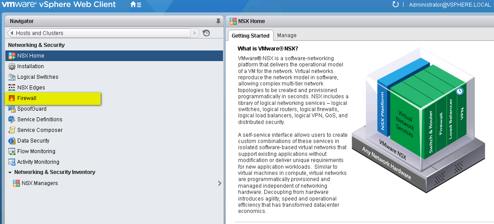

3.  On the **Firewall** page, from the **NSX Manager** drop-down menu, select the IP address of the NSX Manager instance that runs the firewall rules.

| NSX Manager                                       | IP Address   |
|---------------------------------------------------|--------------|
| **NSX Manager for the management cluster**        | 172.16.11.65 |
| **NSX Manager for the compute and edge clusters** | 172.16.11.66 |

1.  Click the **Configuration** tab and click the **General** tab.

2.  Click the **Export configuration** () icon.

    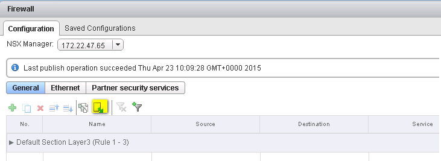

3.  In the **Export configuration** dialog box, click **Download** and save the exported firewall configuration file on your computer.

    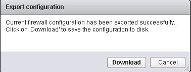

4.  Repeat the steps to export the firewall configuration of the second NSX Manager.

    1.  #### Import the NSX Firewall Configuration in Region A

You can import a firewall configuration XML file you have saved on a central location, and then load the configuration in the firewall table. The imported configuration overwrites the existing rules.

1.  Open the vSphere Web Client.

    1.  In a Web browser, go to **https://mgmt01vc01.sfo01.rainpole.local/vsphere-client**.

    2.  Use **administrator@vsphere.local** user name and the **vsphere\_admin\_password** password to log in.

<!-- -->

1.  From the **Home** menu, select **Networking & Security**.

2.  From the **Networking & Security** section in the **Navigator**, click **Firewall**.

    

3.  On the **Firewall** page, click the **Saved Configurations** tab.

4.  From the **NSX Manager** drop-down menu, select the IP address of the NSX Manager instance that runs the firewall rules.

| NSX Manager                                       | IP Address   |
|---------------------------------------------------|--------------|
| **NSX Manager for the management cluster**        | 172.16.11.65 |
| **NSX Manager for the compute and edge clusters** | 172.16.11.66 |

1.  On the **Saved Configurations** tab, click the **Import configuration** () icon.

    

2.  In the **Import configuration** dialog box, locate the firewall configuration XML file and click **OK**.

    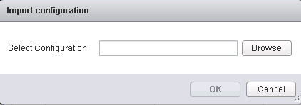

Rules are imported based on rule names. During the import, the firewall ensures that each object referenced in the rule exists in your environment. If an object is not found, the rule is marked as invalid. If a rule references a dynamic security group, the dynamic security group is created in NSX Manager during the import.

If your current configuration contains rules that are managed by Service Composer, these rules are overwritten when you load the imported firewall configuration. Synchronize the imported rules to have them managed by the Service Composer again. On the **Service Compose** page, click the **Security Policies** tab and select **Actions** &gt; **Synchronize Firewall Config**.

#### Export a Service Composer Configuration in Region A

You can export a Service Composer configuration of security policies and save the configuration file to your computer. The saved configuration can be used as a backup for situations where you accidentally delete a policy configuration, or for replication in another NSX Manager environment.

The backed up configuration also includes the security groups to which the security policies are mapped.

1.  Open the vSphere Web Client.

    1.  In a Web browser, go to **https://mgmt01vc01.sfo01.rainpole.local/vsphere-client**.

    2.  Use **administrator@vsphere.local** user name and the **vsphere\_admin\_password** password to log in.

<!-- -->

1.  From the **Home** menu, select **Networking & Security**.

2.  From the **Networking & Security** section in the **Navigator**, click **Service Composer**.

    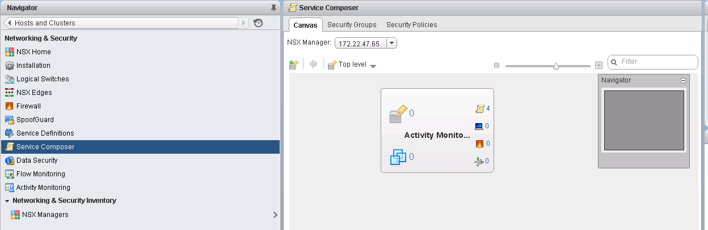

3.  Click the **Security Policies** tab.

4.  On the **Security Policies** tab, from the **NSX Manager** drop-down menu, select the IP address of the NSX Manager instance that runs the Service Composer.

| NSX Manager                                       | IP Address   |
|---------------------------------------------------|--------------|
| **NSX Manager for the management cluster**        | 172.16.11.65 |
| **NSX Manager for the compute and edge clusters** | 172.16.11.66 |

1.  Select the security policy that you want to export and select the **Actions** &gt; **Export Configuration** menu item. The **Export Services Composer Configuration** wizard opens.

2.  In the **Name and description** page, enter name, description and prefix for the backup, and click **Next**.

    The prefix is added to the security policies and security groups that are being exported. Setting a prefix makes the names of the exported security policies unique.

3.  On the **Select security policies** page, select the security policies that you want to export, and click **Next**.

4.  On the **Ready to complete** page, preview the security policies and the associated objects, and click **Finish**. You see the security groups on which the policies apply, and the endpoint services, firewall rules and network introspection services that are a part of the policies.

    1.  #### Import a Security Policies Configuration in Region A

Import a saved security policies configuration (along with the security groups to which the security policies are mapped) to restore a misconfigured policy or to replicate the configuration on a different NSX Manager in Region A.

1.  Open the vSphere Web Client.

    1.  In a Web browser, go to **https://mgmt01vc01.sfo01.rainpole.local/vsphere-client**.

    2.  Use **administrator@vsphere.local** user name and the **vsphere\_admin\_password** password to log in.

<!-- -->

1.  From the **Home** menu, select **Networking & Security**.

2.  From the **Networking & Security** section in the **Navigator**, click **Service Composer**.

3.  Click the **Security Policies** tab.

4.  On the **Security Policies** tab, from the **NSX Manager** drop-down menu, select the IP address of the NSX Manager instance that runs the Service Composer.

| NSX Manager                                       | IP Address   |
|---------------------------------------------------|--------------|
| **NSX Manager for the management cluster**        | 172.16.11.65 |
| **NSX Manager for the compute and edge clusters** | 172.16.11.66 |

1.  Click the **Import Service Configuration** icon. The **Import Configuration** wizard opens.

2.  On the **Select configuration file** page, browse to the security policies configuration file on your computer, enter a suffix for the names of the imported policies, and click **Next**.

3.  Service Composer verifies that all services referred to in the configuration are available in the destination environment. If not, the Manage Missing Services page is displayed, where you can map missing services to available target services.

4.  On the **Ready to complete** page, examine the security policies along with associated objects and click **Finish**.

    The page shows the security groups on which the policies are applied, and the endpoint services, firewall rules and network introspection services that are a part of the policies.

    1.  #### Export Configurations of the Distributed Switches in Region A

You can export vSphere Distributed Switch and distributed port group configurations to a file. The file preserves validated network configurations, enabling transfer of these configurations to other environments.

You can use the file to create multiple copies of the distributed switch configuration on an existing deployment, or overwrite the settings of existing distributed switches and port groups.

1.  Open the vSphere Web Client.

    1.  In a Web browser, go to the following URL.

| vCenter Server                | URL                                                    |
|-------------------------------|--------------------------------------------------------|
| **Management vCenter Server** | https://mgmt01vc01.sfo01.rainpole.local/vsphere-client |
| **Compute vCenter Server**    | https://comp01vc01.sfo01.rainpole.local/vsphere-client |

1.  Use the **administrator@vsphere.local** user name and the **vsphere\_admin\_password** password to log in.

<!-- -->

1.  From the **Home** menu, select **Networking**, expand the vCenter Server tree and locate the distributed switch.

| vCenter Server                  | Distributed Switch |
|---------------------------------|--------------------|
| mgmt01vc01.sfo01.rainpole.local | vDS-Mgmt           |
| comp01vc01.sfo01.rainpole.local | vDS-Comp           |
|                                 | vDS-Edge           |

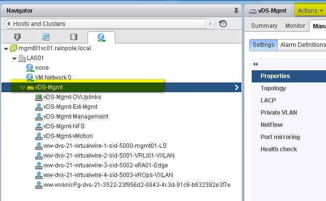

1.  Right-click the distributed switch and select **Settings** &gt; **Export Configuration**.

    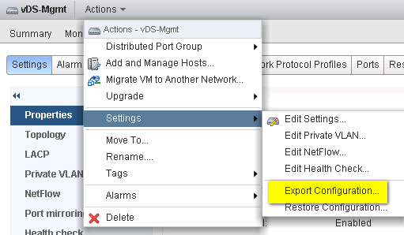

2.  In the **vDS - Export Configuration** dialog box, select Distributed switch and all port groups next to **Configurations to export**, and click **OK**.

    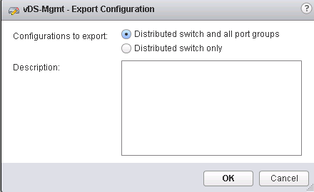

3.  After the configuration is generated, click **Yes** to save the configuration file to your computer.

    1.  #### Restore the Configuration of a Distributed Switch in Region A

Use the restore option to reset the configuration of one of the distributed switches in Region A to the settings in a configuration file. The restoring operation changes the settings on the selected switch back to the settings saved in the configuration file. The operation overwrites the current settings of the distributed switch and its port groups. It does not delete existing port groups that are not part of the configuration file.

1.  Open the vSphere Web Client.

    1.  In a Web browser, go to the following URL.

| vCenter Server                | URL                                                    |
|-------------------------------|--------------------------------------------------------|
| **Management vCenter Server** | https://mgmt01vc01.sfo01.rainpole.local/vsphere-client |
| **Compute vCenter Server**    | https://comp01vc01.sfo01.rainpole.local/vsphere-client |

1.  Use the **administrator@vsphere.local** user name and the **vsphere\_admin\_password** password to log in.

<!-- -->

1.  From the **Home** menu, select **Networking**, expand the vCenter Server tree and locate the distributed switch.

| vCenter Server                  | Distributed Switch |
|---------------------------------|--------------------|
| mgmt01vc01.sfo01.rainpole.local | vDS-Mgmt           |
| comp01vc01.sfo01.rainpole.local | vDS-Comp           |
|                                 | vDS-Edge           |

1.  Right-click the distributed switch and select **Settings** &gt; **Restore Configuration**.

2.  In the **vDS - Restore Configuration** wizard, browse to the location of the configuration file for the distributed switch.

3.  Select the **Restore distributed switch and all port groups** option and click **Next**

4.  On the **Ready to complete** page, examine the changes and click **Finish**.

    1.  Region B Backup and Restore
        ---------------------------

Create backup jobs in vSphere Data Protection for vCenter Server, NSX and vRealize Log Insight, and for vRealize Operations Manager and vRealize Automation if these product instances are failed over to Region B. If a hardware failure occurs, you can restore the components of these products from the saved backups.

### Backing Up and Restoring vCenter Server in Region B

Schedule regular backup jobs of the vCenter Server instances and the connected Platform Services Controllers in Region B, and perform restore in cases of corrupt appliance instances.

1.  Backing up the embedded PostgresSQL database is not required for this validated design. If you plan to add such an additional layer of recoverability, see VMware Knowledge Base article 2091961.

    1.  #### Create Scheduled Backup Jobs for the vCenter Server Instances in Region B

Create a scheduled job for full image backup of vCenter Server and the connected external Platform Services Controller in Region B. Schedule backups for both the Management vCenter Server and Compute vCenter Server.

Procedure

1.  Open the vSphere Web Client.

    1.  In a Web browser, go to **https://mgmt01vc51.lax01.rainpole.local/vsphere-client**.

    2.  Use the **administrator@vsphere.local** user name and the **vsphere\_admin\_password** password to log in.

<!-- -->

1.  On the vSphere Web Client **Home** page, click **vSphere Data Protection**.

2.  On the **Welcome to vSphere Data Protection** page, select **vdp-mgmt-51.lax01.rainpole.local** from the **VDP Appliance** drop-down menu and click **Connect**.

3.  Click the **Backup** tab.

4.  From the **Backup job actions** menu, select **New** to run the **Create new backup job** wizard.

5.  On the **Job Type** page, select **Guest Images**, and click **Next**.

6.  On the **Data Type** page, select **Full Image**, leave the **Fallback to non-quiescence failure** option selected, and click **Next**.

7.  On the **Backup Sources** page, fully expand the **Virtual Machines** tree, select the virtual appliances for vCenter Server and Platform Services Controller, and click **Next**.

| Object                              | Value for Management vCenter Server | Value for Compute vCenter Server |
|-------------------------------------|-------------------------------------|----------------------------------|
| **vCenter Server**                  | mgmt01vc51.lax01.rainpole.local     | comp01vc51.lax01.rainpole.local  |
| **Data center**                     | LAX01                               | LAX01                            |
| **Cluster**                         | LAX01-Mgmt01                        | LAX01-Mgmt01                     |
| **Platform Services Controller VM** | mgmt01psc51.lax01                   | comp01psc51.lax01                |
| **vCenter Server VM**               | mgmt01vc51.lax01                    | comp01vc51.lax01                 |

1.  On the **Schedule** page, set **Backup Schedule** to **Daily** and click **Next**.

2.  On the **Retention Policy** page, set **Keep** to **for 3 days**, and click **Next**.

3.  On the **Job Name** page, enter a name for the backup job, and click **Next**.

-   For the Management vCenter Server, enter **Management vCenter Server Backups**.

-   For the Compute vCenter Server, enter **Compute vCenter Server Backups**.

1.  On the **Ready to Complete** page, review the summary information for the backup job and click **Finish**.

2.  In the dialog box that shows a confirmation that the job is created, click **OK**.

3.  Repeat the steps to create a backup job for the second vCenter Server.

    1.  #### Restore the Management vCenter Server in Region B

If the Management vCenter Server in Region B stops responding or its data is corrupt as a result of a failure in the environment, to restore the Management vCenter Server, perform a direct-to-host emergency restore. vSphere Data Protection restores the VM that contains the vCenter Server or Platform Services Controller directly on the ESXi host in Region B that is running the vSphere Data Protection appliance.

You perform the direct-to-host emergency restore from backups of vCenter Server and Platform Services Controller that vSphere Data Protection has previously saved according to the settings in the backup job you have created. You cannot use a regular restore in this case because both the Management vCenter Server and the associated Platform Services Controller must be available.

**Procedure**

1.  Open the vSphere Data Protection Configure Utility.

    1.  In a Web browser, go to **https://vdp-mgmt-51.lax01.rainpole.local:8543/vdp-configure**.

    2.  Use the **root** user name and the **vdp\_appliance\_root\_password** password to log in.

<!-- -->

1.  Click the **Configuration** tab, in the **Proxies** table locate the ESXi host that runs the **vdp-mgmt-01** appliance and write down the FQDN of the host.

2.  Disconnect the ESXi host that is running the vSphere Data Protection appliance from the Management vCenter Server.

    1.  On the Windows host that has access to your data center, open the vSphere Client.

    2.  Log in to the ESXi host by using the **root** user name and the **esxi\_root\_user\_password** password.

        Use the FQDN that you have located in the vSphere Data Protection Configure Utility.

    3.  Navigate to the host object in the inventory.

    4.  Click the **Summary** tab.

    5.  In the **Host Management** pane, click **Disassociate host from vCenter Server**, and click **OK** in the **Confirm Disassociate** dialog box.

3.  Go again to the vSphere Data Protection Configure Utility.

4.  Click the **Emergency Restore** tab.

5.  Expand the virtual appliance node for the Management vCenter Server or Platform Services Controller that you must restore, expand the virtual machine and select the latest backup to restore from.

| Role                                                                                | Virtual Appliance Name |
|-------------------------------------------------------------------------------------|------------------------|
| **Management vCenter Server**                                                       | mgmt01vc51.lax01       |
| **Platform Services Controller that is connected to the Management vCenter Server** | mgmt01psc51.lax01      |

1.  Click the **Restore** button

2.  In the **Host Credentials** dialog box, enter the credentials for connection to the ESXi host that is running the vSphere Data Protection appliance.

| ESXi Host Connection Option | Value                      |
|-----------------------------|----------------------------|
| **Host name or IP**         | Leave the default value.   |
| **Port number**             | 443                        |
| **User name**               | root                       |
| **Password**                | esxi\_root\_user\_password |

1.  In the **Restore a Backup** dialog box, enter a new name for the restored VM in the **New Name** text box.

| Role                                                                                | Virtual Appliance Name     |
|-------------------------------------------------------------------------------------|----------------------------|
| **Management vCenter Server**                                                       | mgmt01vc51.lax01.restored  |
| **Platform Services Controller that is connected to the Management vCenter Server** | mgmt01psc51.lax01.restored |

1.  From the **Datastore** drop-down menu, select the **LAX01A-VSAN01-MGMT01** datastore and click **OK**.

2.  Repeat Step 6 to Step 10 to restore the other appliance.

3.  Remove the physical adapter assigned to **dvUplink2** from the distributed switch.

    1.  In the vSphere Client that is connected to the ESXi host of the restored VMs and vSphere Data Protection, navigate to **Configuration** &gt; **Networking**.

    2.  Click the **vSphere Distributed Switch** button.

    3.  Click the **Manage Physical Adapters** link.

    4.  Click the **remove** link under **dvUplink2** then click **OK.**

4.  Create a vSphere Standard Switch and port group.

    1.  In the vSphere Client, navigate to **Configuration** &gt; **Networking**.

    2.  Click the **vSphere Standard Switch** button.

    3.  Click the **Add Networking** link. The **Add Network Wizard** appears.

    4.  On the **Connection Type** page, select **Virtual Machine** and click **Next**.

    5.  On the **Virtual Machines - Network Access** page, select **Create a vSphere Standard Switch**, select the physical adapter removed in the previous step, and click **Next**.

    6.  Enter **vCenter-Restore** as the **Network Label** and **1611** for the **VLAN** and click **Next**.

    7.  Click **Finish**.

5.  Reconfigure the restored appliances to use the vCenter-Restore port group.

    1.  In the vSphere Client, navigate to the virtual machine of the Platform Services Controller **mgmt01psc51.lax01.restored**.

    2.  Right-click the virtual machine and select **Edit Settings**.

    3.  On the **Hardware** tab, click **Network adapter 1** from the list.

    4.  Under **Network Connection**, select **vCenter-Restore** from the **Network Label** drop-down menu, and click **OK**.

    5.  If you have restore both vCenter Server and Platform Services Controllers appliances, repeat these steps for the other restored appliance.

6.  Power on the vCenter Server and Platform Services Controller virtual machines.

    1.  In the vSphere Client, navigate to the virtual machine of the Platform Services Controller **mgmt01psc51.lax01.restored**.

    2.  Right-click the virtual machine and select **Power** &gt; **Power On**.

    3.  Navigate to the virtual machine of vCenter Server **mgmt01vc51.lax01.restored**.

    4.  Right-click the virtual machine and select **Power** &gt; **Power On**.

7.  Wait until the appliance starts and verify the status of the Platform Services Controller services.

    1.  Log in to the Platform Services Controller Appliance shell as the root user.

    2.  Run the service-control --status --all command to verify the status of the Platform Services Controller services.

    3.  If the services are not running, run the psc-restore script in the following way.

        psc-restore -u administrator@vsphere.local -p vsphere\_admin\_password

8.  After the Management vCenter Server is running again, reconnect the ESXi host that is running the vSphere Data Protection appliance.

    1.  In a Web browser, go to **https://mgmt01vc51.lax01.rainpole.local/vsphere-client**.

    2.  Use the **administrator@vsphere.local** user name and the **vsphere\_admin\_password** password.

    3.  Right-click the host and select **Connection** &gt; **Connect**.

9.  Reconfigure the restored appliances to use the vDS-Mgmt-Management port group.

    1.  In a Web browser, go to **https://mgmt01vc51.lax01.rainpole.local/vsphere-client**.

    2.  Use the **administrator@vsphere.local** user name and the **vsphere\_admin\_password** password.

    3.  Right-click the virtual machine and select **Edit Settings**.

    4.  For **Network adapter 1**, select **vDS-Mgmt-Management** from the port group drop-down menu, and click **OK**.

    5.  If you have restore both vCenter Server and Platform Services Controllers appliances, repeat these steps for the other restored appliance.

10. Remove the vSphere Standard Switch.

    1.  In a Web browser, go to **https://mgmt01vc51.lax01.rainpole.local/vsphere-client**.

    2.  Use the **administrator@vsphere.local** user name and the **vsphere\_admin\_password** password.

    3.  Select the ESXi host reconnected in step 16.

    4.  Click on **Manage** &gt; **Networking** &gt; **Virtual Switches**.

    5.  Select the vSphere Standard Switch, click the **Remove** button to remove it and click **Yes** to confirm in the confirmation dialog.

11. Add the physical adapter back to dvUplink2.

    1.  In a Web browser, go to **https://mgmt01vc51.lax01.rainpole.local/vsphere-client**.

    2.  Use the **administrator@vsphere.local** user name and the **vsphere\_admin\_password** password.

    3.  Select the ESXi host reconnected in step 17.

    4.  On the **Manage** tab, click **Networking** and click **Virtual Switches**.

    5.  Select **vDS-Mgmt** and click **Manage the physical network adapters**.

    6.  In the **Manage Network Physical Adapters for vDS-Mgmt** dialog box, click the **Add adapter** icon.

    7.  Select the physical adapter and click **OK**.

    8.  Click **OK** to close the **Manage Network Physical Adapters for vDS-Mgmt** dialog box.

        1.  #### Restore the Compute vCenter Server in Region B

Restore the Compute vCenter Server or the associated Platform Services Controller if a major hardware failure occurs.

Procedure

1.  Open the vSphere Web Client

    1.  In a Web browser, go to **https://mgmt01vc51.lax01.rainpole.local/vsphere-client**.

    2.  Use the **administrator@vsphere.local** user name and the **vsphere\_admin\_password** password to log in.

<!-- -->

1.  Power off and delete the appliances of the vCenter Server and Platform Services Controller.

    1.  Navigate to the **comp01psc51.lax01** appliance.

    2.  Right-click the appliance object and select **Power** &gt; **Power Off**.

    3.  Right-click the appliance object, click **Delete from Disk** and click **Yes** in the **Confirm Delete** dialog box.

    4.  Repeat the steps to power off and delete from the host disk the **comp01vc51.lax01** vCenter Server appliance.

2.  Restore the latest vCenter Server and Platform Services Controller backup from vSphere Data Protection.

    1.  On the vSphere Web Client **Home** page, click **vSphere Data Protection**.

    2.  On the **Welcome to vSphere Data Protection** page, select **vdp-mgmt-51.lax01.rainpole.local** from the **VDP Appliance** drop-down menu, and click **Connect**.

    3.  Click the **Restore** tab and select the **comp01psc51.lax01** virtual appliance.

        You see the list of the backups for the appliance.

    4.  Select the check box for the latest backup and click the back arrow to return to the list of VMs.

    5.  From the list of VMs, select the **comp01vc51.lax01** virtual appliance and select the latest backup.

    6.  Click **Restore** on the toolbar.

        The **Restore backup** wizard opens.

    7.  On the **Select Backup** page, click **Next**.

    8.  On the **Set Restore Options** page, select **Restore to original location** and click **Next**.

    9.  On the **Ready to Complete** page, click **Finish**.

3.  Power on the Compute vCenter Server and Platform Services Controller virtual machines.

    1.  Navigate to the virtual machine of Platform Services Controller **comp01psc51.lax01**.

    2.  Right-click the **comp01psc51.lax01** appliance object and select **Power** &gt; **Power On**.

    3.  Navigate to the virtual machine of Compute vCenter Server **comp01vc51.lax01**.

    4.  Right-click the **comp01vc51.lax01** appliance object and select **Power** &gt; **Power On**.

4.  Wait until the appliance starts and verify the status of the Platform Services Controller services.

    1.  Log in to the Platform Services Controller Appliance shell as the root user.

    2.  Run the service-control --status --all command to verify the status of the Platform Services Controller services.

    3.  If the services are not running, run the psc-restore script in the following way.

        psc-restore -u administrator@vsphere.local -p vsphere\_admin\_password

5.  Verify that vCenter Server is running.

    1.  In a Web browser, go to **https://comp01vc51.lax01.rainpole.local/vsphere-client**.

    2.  Use the **administrator@vsphere.local** and the **vsphere\_admin\_password** password to log in.

    3.  Select **Home** &gt; **Hosts and Clusters** and verify that the inventory items are accessible.

    4.  Verify that you can create a new virtual machine from the **LAX01** data center object under the **comp01vc51.lax01.rainpole.local** vCenter Server parent object.

        1.  ### Backing Up and Restoring vRealize Operations Manager in Region B

Back up and restore the virtual appliances for the vRealize Operations Manager nodes in the remote collector cluster in Region B.

#### Create a Scheduled Backup Job for vRealize Operations Manager in Region B

Create a scheduled job for full image backup of the vRealize Operations Manager remote collector nodes in Region B.

Procedure

1.  Open the vSphere Web Client.

    1.  In a Web browser, go to **https://mgmt01vc51.lax01.rainpole.local/vsphere-client**.

    2.  Use the **administrator@vsphere.local** user name and the **vsphere\_admin\_password** password to log in.

<!-- -->

1.  On the vSphere Web Client **Home** page, click **vSphere Data Protection**.

2.  On the **Welcome to vSphere Data Protection** page, select **vdp-mgmt-51.lax01.rainpole.local** from the **VDP Appliance** drop-down menu and click **Connect**.

3.  Click the **Backup** tab.

4.  From the **Backup Job Actions** menu, select **New** to run the **Create new backup job** wizard.

5.  On the **Job Type** page, select **Guest Images**, and then click **Next**.

6.  On the **Data Type** page, select **Full Image**, leave the **Fallback to non-quiescence failure** option selected, and click **Next**.

7.  On the **Backup Sources** page, fully expand the **Virtual Machines** tree.

| Object             | Value                           |
|--------------------|---------------------------------|
| **vCenter Server** | mgmt01vc51.lax01.rainpole.local |
| **Data center**    | LAX01                           |
| **Cluster**        | LAX01-Mgmt01                    |

1.  Select the virtual appliances for vRealize Operations Manager, and click **Next**.

| Virtual Appliance Name | Role               |
|------------------------|--------------------|
| vrops-rmtcol-51        | Remote collector 1 |
| vrops-rmtcol-52        | Remote collector 2 |

1.  On the **Schedule** page, set **Backup Schedule** to **Daily** and click **Next**.

2.  On the **Retention Policy** page, set **Keep** to **for 3 days**, and click **Next**.

3.  On the **Job Name** page, enter **vRealize Operations Manager Backups** as a name for the backup job, and click **Next**.

4.  On the **Ready to Complete** page, review the summary information for the backup job and click **Finish**.

5.  In the dialog box that shows a confirmation that the job is created, click **OK**.

    1.  #### Restore vRealize Operations Manager in Region B

Restore the vRealize Operations Manager remote collector nodes in Region B if a major hardware failure occurs by using a backup that is created as a result from the scheduled backup job for the nodes.

Procedure

1.  Open the vSphere Web Client.

    1.  In a Web browser, go to **https://mgmt01vc51.lax01.rainpole.local/vsphere-client**.

    2.  Use the **administrator@vsphere.local** user name and the **vsphere\_admin\_password** password to log in.

<!-- -->

1.  Power off all vRealize Operations Manager virtual appliances.

    1.  Select **Home** &gt; **Hosts and Clusters**.

    2.  Navigate to each appliance.

| Object Type        | Object             | Value                           |
|--------------------|--------------------|---------------------------------|
| **Path**           | vCenter Server     | mgmt01vc51.lax01.rainpole.local |
|                    | Data center        | LAX01                           |
|                    | Cluster            | LAX01-Mgmt01                    |
| **Appliance Name** | Remote collector 1 | vrops-rmtcol-51                 |
|                    | Remote collector 2 | vrops-rmtcol-52                 |

1.  Right-click the appliance object and select **Power** &gt; **Power Off**.

2.  Repeat the steps to power off the other remote collector appliance.

3.  Right-click the appliance object, click **Delete from Disk** and click **Yes** in the **Confirm Delete** dialog box.

4.  Repeat the steps to power off and delete the other remote collector appliance.

<!-- -->

1.  Restore latest vRealize Operations Manager VMs backup from the vSphere Data Protection server.

    1.  On the vSphere Web Client **Home** page, click **vSphere Data Protection**.

    2.  On the **Welcome to vSphere Data Protection** page, select **vdp-mgmt-51.lax01.rainpole.local** from the **VDP Appliance** drop-down menu, and click **Connect**.

    3.  Click the **Restore** tab and select a node appliance of vRealize Operations Manager.
        You see the list of the backups for the appliance.

    4.  Select the check box for the latest appliance backup and click the back arrow to return to the list of backups.

    5.  Repeat Step 3c to Step 3d to select the latest backups of the other appliances of vRealize Operations Manager.

    6.  Click **Restore** on the toolbar.

        The **Restore backup** wizard opens.

    7.  On the **Select Backup** page, click **Next**.

    8.  On the **Set Restore Options** page, select **Restore to original location** for each appliance, and click **Next**.

    9.  On the **Ready to Complete** page, click **Finish**.

2.  Verify that the restore is successful.

    1.  Click the **Configuration** tab on the vSphere Data Protection page, and click **Log**.

    2.  Locate the following logs.

        Restore of client named vrops-rmtcol-51 completed

        Restore of client named vrops-rmtcol-52 completed

3.  Power on the nodes of vRealize Operations Manager.

    1.  Navigate to the **vrops-rmtcol-51** appliance, right-click the appliance object and select **Power** &gt; **Power On**.

    2.  Navigate to the **vrops-rmtcol-52** appliance, right-click the appliance object and select **Power** &gt; **Power On**.

Wait until the appliances start running.

### Backing Up and Restoring vRealize Log Insight in Region B

Back up and restore the virtual appliances for the vRealize Log Insight nodes in Region B. Restore vRealize Log Insight according to the dependencies between the nodes.

#### Create a Scheduled Backup Job for vRealize Log Insight in Region B

Create a scheduled job for full image backup of the vRealize Log Insight nodes in Region B.

Procedure

1.  Open the vSphere Web Client

    1.  In a Web browser, go to **https://mgmt01vc51.lax01.rainpole.local/vsphere-client**.

    2.  Use the **administrator@vsphere.local** user name and the **vsphere\_admin\_password** password to log in.

<!-- -->

1.  On the vSphere Web Client **Home** page, click **vSphere Data Protection**.

2.  On the **Welcome to vSphere Data Protection** page, select **vdp-mgmt-51.lax01.rainpole.local** from the **VDP Appliance** drop-down menu and click **Connect**.

3.  Click the **Backup** tab.

4.  From the **Backup Job Actions** menu, select **New** to open the **Create new backup job** wizard.

5.  On the **Job Type** page, select **Guest Images**, and then click **Next**.

6.  On the **Data Type** page, select **Full Image**, leave the **Fallback to non-quiescence failure** option selected, and click **Next**.

7.  On the **Backup Sources** page, fully expand the **Virtual Machines** tree.

| Object             | Value                           |
|--------------------|---------------------------------|
| **vCenter Server** | mgmt01vc51.lax01.rainpole.local |
| **Data center**    | LAX01                           |
| **Cluster**        | LAX01-Mgmt01                    |

1.  Select the virtual appliances for vRealize Log Insight, and click **Next**.

| Virtual Appliance Name | Role          |
|------------------------|---------------|
| vrli-mstr-51           | Master node   |
| vrli-wrkr-51           | Worker node 1 |
| vrli-wrkr-52           | Worker node 2 |

1.  On the **Schedule** page, set **Backup Schedule** to **Daily** and click **Next**.

2.  On the **Retention Policy** page, set **Keep** to **for 3 days**, and click **Next**.

3.  On the **Job Name** page, enter **vRealize Log Insight Backups** as a name for the backup job, and click **Next**.

4.  On the **Ready to Complete** page, review the summary information for the backup job and click **Finish**.

5.  In the dialog box that shows a confirmation that the job is created, click **OK**.

    1.  #### Restore vRealize Log Insight in Region B

Restore the vRealize Log Insight nodes that are deployed in Region B by using a backup that is created as a result from the scheduled backup job for the nodes.

Procedure

1.  Open the vSphere Web Client

    1.  In a Web browser, go to **https://mgmt01vc51.lax01.rainpole.local/vsphere-client**.

    2.  Use the **administrator@vsphere.local** user name and the **vsphere\_admin\_password** password to log in.

<!-- -->

1.  Power off all vRealize Log Insight virtual appliances.

    1.  Select **Home** &gt; **Hosts and Clusters**.

    2.  Navigate to each appliance.

| Object Type        | Object         | Value                           |
|--------------------|----------------|---------------------------------|
| **Path**           | vCenter Server | mgmt01vc51.lax01.rainpole.local |
|                    | Data center    | LAX01                           |
|                    | Cluster        | LAX01-Mgmt01                    |
| **Appliance Name** | Master node    | vrli-mstr-51                    |
|                    | Worker node 1  | vrli-wrkr-51                    |
|                    | Worker node 2  | vrli-wrkr-52                    |

1.  Right-click the appliance object and select **Power** &gt; **Power Off**.

2.  Right-click the appliance object, click **Delete from Disk** and click **Yes** in the **Confirm Delete** dialog box.

3.  Repeat the steps to power the other appliances off and delete them.

<!-- -->

1.  Restore the latest vRealize Log Insight VMs backup from the vSphere Data Protection server.

    1.  On the vSphere Web Client **Home** page, click **vSphere Data Protection**.

    2.  On the **Welcome to vSphere Data Protection** page, select **vdp-mgmt-51.lax01.rainpole.local** from the **VDP Appliance** drop-down menu, and click **Connect**.

    3.  Click the **Restore** tab and select a node appliance of vRealize Log Insight.

        You see the list of the backups of the appliance.

    4.  Select the check box for the latest appliance backup and click the back arrow to return to the list of backups.

    5.  Repeat Step 3c to Step 3d to select the latest backups of the other appliances of vRealize Log Insight.

    6.  Click the **Restore** tab.

        The **Restore backup** wizard opens showing the selected backups.

    7.  On the **Select Backup** page, click **Next**.

    8.  On the **Set Restore Options** page, select **Restore to original location** for each appliance, and click **Next**.

    9.  On the **Ready to Complete** page, click **Finish**.

2.  Verify that the restore is successful.

    1.  Click the **Configuration** tab on the vSphere Data Protection page, and click **Log**.

    2.  Locate the logs **Restore of client named vrli\_vm\_name completed**.

3.  Power on the nodes of vRealize Log Insight.

    1.  In the vSphere Web Client, navigate to the **vrli-mstr-01** appliance, right-click the appliance object and select **Power** &gt; **Power On**.

    2.  Wait until the appliance starts running.

    3.  Repeat the steps to power on the other nodes in the following order.

> **vrli-wrkr-51**
>
> **vrli-wrkr-52**

1.  Verify that vRealize Log Insight is operational.

    1.  In a Web browser, go to **https://vrli-cluster-51.lax01.rainpole.local**.

    2.  Use the **admin** user name and the **vrli\_admin\_password** password to log in.

    3.  Click the configuration drop-down menu icon  and select **Administration**.

    4.  Under **Management**, click **System Monitor**.

    5.  On the **System Monitor** page, click the **Statistics** tab, and verify that the tab shows incoming syslog events.

        Several minutes might pass before syslog events start showing.

        1.  ### Backing Up and Restoring vRealize Automation in Region B

Backup the Windows virtual machines running the vSphere Proxy Agents for vRealize Automation in Region B.

#### Create a Scheduled Backup Job for vRealize Automation in Region B

Create a scheduled job for full image backup of the vSphere Proxy Agent virtual machines in Region B that a part of the vRealize Automation instance.

Procedure

1.  Open the vSphere Web Client

    1.  In a Web browser, go to **https://mgmt01vc51.lax01.rainpole.local/vsphere-client**.

    2.  Use the **administrator@vsphere.local** user name and the **vsphere\_admin\_password** password to log in.

<!-- -->

1.  On the vSphere Web Client **Home** page, click **vSphere Data Protection**.

2.  On the **Welcome to vSphere Data Protection** page, select **vdp-mgmt-51.lax01.rainpole.local** from the **VDP Appliance** drop-down menu and click **Connect**.

3.  Click the **Backup** tab.

4.  From the **Backup job actions** menu, select **New** to open the **Create new backup job** wizard.

5.  On the **Job Type** page, select **Guest Images**, and then click **Next**.

6.  On the **Data Type** page, select **Full Image**, leave the **Fallback to non-quiescence failure** option selected, and click **Next**.

7.  On the **Backup Sources** page, fully expand the **Virtual Machines** tree.

| Object             | Value                           |
|--------------------|---------------------------------|
| **vCenter Server** | mgmt01vc51.lax01.rainpole.local |
| **Data center**    | LAX01                           |
| **Cluster**        | LAX01-Mgmt01                    |

1.  Select the virtual machines of the vSphere Proxy Agents, and click **Next**.

| vRealize Automation Component | VM Name                         |
|-------------------------------|---------------------------------|
| **vSphere Proxy Agent**       | vra01ias51.lax01.rainpole.local |
| **vSphere Proxy Agent**       | vra01ias52.lax01.rainpole.local |

1.  On the **Schedule** page, set **Backup Schedule** to **Daily** and click **Next**.

2.  On the **Retention Policy** page, set **Keep** to **for 3 days**, and click **Next**.

3.  On the **Job Name** page, enter **vRealize Automation Backups** as a name for the backup job, and click **Next**.

4.  On the **Ready to Complete** page, review the summary information for the backup job and click **Finish**.

5.  In the dialog box that shows a confirmation that the job is created, click **OK**.

    1.  #### Restore vRealize Automation in Region B

Restore the vRealize Automation vSphere Proxy Agent nodes in Region B by using a backup that is created as a result from the scheduled backup job for the nodes.

Procedure

1.  Open the vSphere Web Client.

    1.  In a Web browser, go to **https://mgmt01vc51.lax01.rainpole.local/vsphere-client**.

    2.  Use the **administrator@vsphere.local** user name and the **vsphere\_admin\_password** password to log in.

<!-- -->

1.  Power off all vRealize Automation virtual machines.

    1.  Select **Home** &gt; **Hosts and Clusters**.

    2.  On the **Backup Sources** page, fully expand the **Virtual Machines** tree.

| Object             | Value                           |
|--------------------|---------------------------------|
| **vCenter Server** | mgmt01vc51.lax01.rainpole.local |
| **Data center**    | LAX01                           |
| **Cluster**        | LAX01-Mgmt01                    |

1.  Navigate to each vRealize Automation virtual machine.

| vRealize Automation Component | VM Name                         |
|-------------------------------|---------------------------------|
| **vSphere Proxy Agent**       | vra01ias51.lax01.rainpole.local |
| **vSphere Proxy Agent**       | vra01ias52.lax01.rainpole.local |

1.  Right-click the appliance object and select **Power** &gt; **Power Off**.

2.  Right-click the appliance object, click **Delete from Disk**, and click **Yes** in the **Confirm Delete** dialog box.

3.  Repeat the steps to power the other virtual machine off and delete it.

<!-- -->

1.  Restore the latest vRealize Automation backups from the vSphere Data Protection server.

    1.  On the vSphere Web Client **Home** page, click **vSphere Data Protection**.

    2.  On the **Welcome to vSphere Data Protection** page, select **vdp-mgmt-51.lax01.rainpole.local** from the **VDP Appliance** drop-down menu, and click **Connect**.

    3.  Click the **Restore** tab and select a node virtual machine of vRealize Automation.

        You see the list of the backups of the virtual machine.

    4.  Select the check box for the latest virtual machine backup and click the back arrow to return to the list of backups.

    5.  Repeat Step 3c to Step 3d to select the latest backups of the other virtual machines of vRealize Automation.

    6.  Click the **Restore** tab.

        The **Restore backup** wizard opens showing the selected backups.

    7.  On the **Select Backup** page, click **Next**.

    8.  On the **Set Restore Options** page, select **Restore to original location** for each virtual machine, and click **Next**.

    9.  On the **Ready to Complete** page, click **Finish**.

2.  Verify that the restore is successful.

    1.  Click the **Configuration** tab on the vSphere Data Protection page, and click **Log**.

    2.  Locate the following logs.

> Restore of client named vra01ias51.lax01.rainpole.local completed
>
> Restore of client named vra01ias52.lax01.rainpole.local completed

1.  Power on the nodes of vRealize Automation.

    1.  Navigate to the **vra01ias51** virtual machine, right-click the appliance object and select **Power** &gt; **Power On**.

    2.  Navigate to the **vra01ias52** virtual machine, right-click the appliance object and select **Power** &gt; **Power On**.

        1.  ### Backing Up and Restoring the NSX Instances in Region B

You can back up certain components of NSX for the management cluster and for the compute and edge clusters in Region B to restore the working state of the system in the event of failure.

The following components support backup and restore in Region B:

-   NSX Manager

-   NSX Firewall Rules

-   NSX Service Composer

-   vSphere Distributed Switch

You can schedule regular backups to suit business needs and operational requirements. Set the backup frequency according to the rate of configuration changes occurring in NSX. You can back up NSX manually or schedule hourly, daily, or weekly automatic backups.

Back up NSX and vCenter Server before and after the following events:

-   NSX or vCenter Server upgrade.

-   Day 0 deployment and configuration of NSX components.

-   Major Day 2 changes.

    1.  #### Back Up NSX Manager in Region B

In Region B, you can back up the NSX Manager data by scheduling a regular backup.

You configure backup and restore operations from the NSX Manager virtual appliance UI. The backup data is saved out to a remote location that NSX Manager can access through FTP or SFTP. Backed up data includes System Configuration, Audit Logs, System Events, and Flow Records. Configuration tables are included in every backup. Backup for the NSX Manager certificate is not supported.

You can restore backed up data only on the same NSX Manager version as the backup

**Prerequisites**

-   Provide a space on an FTP server that is accessible from the NSX Manager for the management cluster and from the NSX Manager for the compute and edge clusters.

-   Obtain a user name and password for access to the FTP server. Contact your system administrator.

Procedure

1.  In a Web browser, open the NSX Manager appliance UI.

    1.  Go to the following URL.

| NSX Manager                                       | URL                                       |
|---------------------------------------------------|-------------------------------------------|
| **NSX Manager for the management cluster**        | https://mgmt01nsxm51.lax01.rainpole.local |
| **NSX Manager for the compute and edge clusters** | https://comp01nsxm51.lax01.rainpole.local |

1.  Use the **admin** user name and **nsx\_manager\_admin\_password** password to log in.

<!-- -->

1.  On the main page of the appliance UI, click **Backup & Restore**.

1.  On the **Backup & Restore** page, click **Change** next to **FTP Server Settings** to set a storage location for the backup job.

2.  In the **Backup Location** dialog box, configure the following settings for the backup storage on the FTP server and click **OK**. Enter the settings from your system administrator.

<!-- -->

1.  Write down the details about the FTP backup. You need them to restore the NSX Manager from the backup.

| Backup Location Option | Value                                                                              |
|------------------------|------------------------------------------------------------------------------------|
| **IP/Host name**       | FQDN of the FTP Server                                                             |
| **Transfer protocol**  | FTP                                                                                
                          SFTP                                                                                |
| **Port**               | Server port for FTP or SFTP requests                                               |
| **User name**          | User name on the FTP server                                                        |
| **Password**           | Password for the name you specified in User name                                   |
| **Backup Directory**   | Absolute path to the location on the FTP server where you want to store the backup |
| **Filename Prefix**    | NSX\_Mgmt\_51 for the NSX Manager for the management cluster                       
                          NSX\_Comp\_51 for the NSX Manager for the compute and edge clusters                 |
| **Pass Phrase**        | nsx\_backup\_pass\_phrase                                                          |

1.  On the **Backup & Restore** page, click **Change** next to **Schedule**.

2.  In the **Create or Schedule Backup** dialog box, configure the following schedule for the backup and click Schedule.

| Backup Options       | Value  |
|----------------------|--------|
| **Backup Frequency** | Hourly |
| **Day of week**      | -      |
| **Hour of day**      | -      |
| **Minute**           | 0      |

#### Restore NSX Manager in Region B

When you restore NSX Manager in Region B from a backup, deploy a new NSX Manager appliance to restore the backup on. Restore on existing NSX Manager instances is not supported.

The new NSX manager appliance on which the restore is performed must be the same version as the NSX Manager appliance on which the backup was taken.

**Prerequisites**

-   Verify that you have the FTP backup details written down.

-   Verify that the FTP server storing the backup data is running.

-   Deploy a new NSX Manager appliance. See Deploy the NSX Manager for the Management Cluster NSX Instance (Region B) and Deploy the NSX Manager for the Compute and Edge Clusters NSX Instance (Region B).

Procedure

1.  In a Web browser, open the NSX Manager appliance UI.

    1.  Go to the following URL.

| NSX Manager                                       | URL                                        |
|---------------------------------------------------|--------------------------------------------|
| **NSX Manager for the management cluster**        | https://mgmt01nsxm51.lax01.rainpole.local/ |
| **NSX Manager for the compute and edge clusters** | https://comp01nsxm51.lax01.rainpole.local/ |

1.  Use the **admin** user name and **nsx\_manager\_admin\_password** password to log in.

<!-- -->

1.  On the main page of the appliance UI, click **Backup & Restore**.

2.  On the **Backup & Restore** page, click **Change** next to **FTP Server Settings** to set a storage location for the backup job.

3.  In the **Backup Location** dialog box, configure the following settings for the backup storage on the FTP server and click **OK**.

| Backup Location Option | Value                                                               |
|------------------------|---------------------------------------------------------------------|
| **IP/Host name**       | FQDN of the FTP Server                                              |
| **Transfer protocol**  | FTP                                                                 
                          SFTP                                                                 |
| **Port**               | Server port for FTP or SFTP requests                                |
| **User name**          | User name on the FTP server                                         |
| **Password**           | Password for the name you specified in User name                    |
| **Backup Directory**   | Absolute path to the location of the backup data on the FTP server  |
| **Filename Prefix**    | NSX\_Mgmt\_51 for the NSX Manager for the management cluster        
                          NSX\_Comp\_51 for the NSX Manager for the compute and edge clusters  |
| **Pass Phrase**        | nsx\_backup\_pass\_phrase                                           |

1.  In the **Backups History** section on the **Backup & Restore** page, select the latest restore point, and click **Restore**.

2.  In the **Restore from Backup** dialog box, click **Yes** to confirm the restart of the appliance.

    The appliance management is unavailable for some time.

3.  After the appliance is running again, verify that the NSX Manager is restored.

    1.  In the NSX Manager UI, click the **Summary** tab and verify that the **NSX Management Service** is running in the **NSX Management Components** table.

    2.  Click the **Manage** tab, click **NSX Management Service** under **Components** and verify that the NSX Manager is connected to the Lookup Service and vCenter Server.

        1.  #### Export the NSX Firewall Configuration in Region B

Export all firewall rules in an NSX Manager to an XML file and save it to a central local. You can use the configuration file to import and load firewall rules on another NSX instance in Region B, or to recover the rule configuration in the case of misconfiguration.

Procedure

1.  Open the vSphere Web Client.

    1.  In a Web browser, go to **https://mgmt01vc51.lax01.rainpole.local/vsphere-client**.

    2.  Use **administrator@vsphere.local** user name and the **vsphere\_admin\_password** password to log in.

<!-- -->

1.  From the **Home** menu, select **Networking & Security**.

2.  From the **Networking & Security** section in the **Navigator**, pane click **Firewall**.

    

3.  On the **Firewall** page, from the **NSX Manager** drop-down menu, select the IP address of the NSX Manager instance that runs the firewall rules.

| NSX Manager                                       | IP Address   |
|---------------------------------------------------|--------------|
| **NSX Manager for the management cluster**        | 172.17.11.65 |
| **NSX Manager for the compute and edge clusters** | 172.17.11.66 |

1.  Click the **Configuration** tab and click the **General** tab.

2.  Click the **Export configuration** () icon.

    

3.  In the **Export configuration** dialog box, click **Download** and save the exported firewall configuration file on your computer.

    

4.  Repeat the steps to export the firewall configuration of the second NSX Manager.

    1.  #### Import the NSX Firewall Configuration in Region B

You can import a firewall configuration XML file you have saved on a central location, and then load the configuration in the firewall table for Region B. The imported configuration overwrites the existing rules.

Procedure

1.  Open the vSphere Web Client.

    1.  In a Web browser, go to **https://mgmt01vc51.lax01.rainpole.local/vsphere-client**.

    2.  Use **administrator@vsphere.local** user name and the **vsphere\_admin\_password** password to log in.

<!-- -->

1.  From the **Home** menu, select **Networking &Security**.

2.  From the **Networking & Security** section in the **Navigator** pane, click **Firewall**.

    

3.  On the **Firewall** page, click the **Saved Configurations** tab.

4.  From the **NSX Manager** drop-down menu, select the IP address of the NSX Manager instance that runs the firewall rules.

| NSX Manager                                       | IP Address   |
|---------------------------------------------------|--------------|
| **NSX Manager for the management cluster**        | 172.17.11.65 |
| **NSX Manager for the compute and edge clusters** | 172.17.11.66 |

1.  On the **Saved Configurations** tab, click the **Import configuration** () icon.

    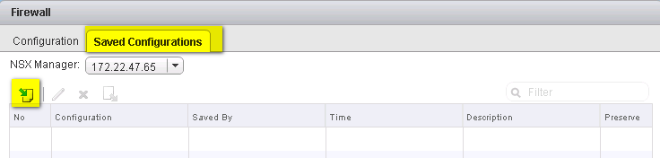

2.  In the **Import configuration** dialog box, locate the firewall configuration XML file and click **OK**.

    

Rules are imported based on rule names. During the import, the firewall ensures that each object referenced in the rule exists in your environment. If an object is not found, the rule is marked as invalid. If a rule references a dynamic security group, the dynamic security group is created in NSX Manager during the import.

If your current configuration contains rules that are managed by Service Composer, these rules are overwritten when you load the imported firewall configuration. Synchronize the imported rules to have them managed by the Service Composer again. On the Service Compose page, click the **Security Policies** tab and select **Actions** &gt; **Synchronize Firewall Config**.

#### Export a Service Composer Configuration in Region B

You can export a Service Composer configuration of security policies in Region B and save the configuration file to your computer. You can use the saved configuration as a backup for situations where you accidentally delete a policy configuration, or for replication in another NSX Manager environment.

The backed up configuration also includes the security groups to which the security policies are mapped.

Procedure

1.  Open the vSphere Web Client.

    1.  In a Web browser, go to **https://mgmt01vc51.lax01.rainpole.local/vsphere-client**.

    2.  Use the **administrator@vsphere.local** user name and the **vsphere\_admin\_password** password to log in.

<!-- -->

1.  From the **Home** menu, select **Networking & Security**.

2.  From the **Networking & Security** section in the **Navigator** pane, click **Service Composer**.

    

3.  Click the **Security Policies** tab.

4.  On the **Security Policies** tab, from the **NSX Manager** drop-down menu, select the IP address of the NSX Manager instance that runs the Service Composer.

| NSX Manager                                       | IP Address   |
|---------------------------------------------------|--------------|
| **NSX Manager for the management cluster**        | 172.17.11.65 |
| **NSX Manager for the compute and edge clusters** | 172.17.11.66 |

1.  Select the security policy that you want to export and select the **Actions** &gt; **Export Configuration** menu item.

    The **Export Services Composer Configuration** wizard opens.

2.  In the **Name and description** page, enter name, description and prefix for the backup, and click **Next**. The prefix is added to the security policies and security groups that are being exported. Setting a prefix makes the names of the exported security policies unique.

3.  On the **Select security policies** page, select the security policies that you want to export, and click **Next**.

4.  On the **Ready to complete** page, preview the security policies and the associated objects, and click **Finish**. You see the security groups on which the policies apply, and the endpoint services, firewall rules and network introspection services that are a part of the policies.

    1.  #### Import a Security Policies Configuration in Region B

Import a saved security policies configuration (along with the security groups to which the security policies are mapped) to restore a misconfigured policy or to replicate the configuration on a different NSX Manager in Region B.

Procedure

1.  Open the vSphere Web Client.

    1.  In a Web browser, go to **https://mgmt01vc51.lax01.rainpole.local/vsphere-client**.

    2.  Use the **administrator@vsphere.local** user name and the **vsphere\_admin\_password** password to log in.

<!-- -->

1.  From the **Home** menu, select **Networking and Security**.

2.  From the **Networking and Security** section in the **Navigator**, click **Service Composer**.

3.  Click the **Security Policies** tab.

4.  On the **Security Policies** tab, from the **NSX Manager** drop-down menu, select the IP address of the NSX Manager instance that runs the Service Composer.

| NSX Manager                                       | IP Address   |
|---------------------------------------------------|--------------|
| **NSX Manager for the management cluster**        | 172.17.11.65 |
| **NSX Manager for the compute and edge clusters** | 172.17.11.66 |

1.  Click the **Import Configuration** icon. The **Import Configuration** wizard opens.

2.  On the **Select configuration file** page, browse to the security policies configuration file on your computer, enter a suffix for the names of the imported policies, and click **Next**.

3.  Service Composer verifies that all services referred to in the configuration are available in the destination environment. If not, the **Manage Missing Services** page is displayed, where you can map missing services to available target services.

4.  On the **Ready to complete** page, examine the security policies along with associated objects and click **Finish**.

    The page shows the security groups on which the policies are applied, and the endpoint services, firewall rules and network introspection services that are a part of the policies.

    1.  #### Export Configurations of the Distributed Switches in Region B

You can export a vSphere Distributed Switch and distributed port group configuration in Region B to a file. The file preserves validated network configurations, enabling transfer of these configurations to other environments.

You can use the file to create multiple copies of the distributed switch configuration on an existing deployment, or overwrite the settings of existing distributed switches and port groups.

Procedure

1.  Open the vSphere Web Client.

    1.  In a Web browser, go to the following URL.

| vCenter Server                | URL                                                    |
|-------------------------------|--------------------------------------------------------|
| **Management vCenter Server** | https://mgmt01vc51.lax01.rainpole.local/vsphere-client |
| **Compute vCenter Server**    | https://comp01vc51.lax01.rainpole.local/vsphere-client |

1.  Use the **administrator@vsphere.local** user name and the **vsphere\_admin\_password** password to log in.

<!-- -->

1.  From the **Home** menu, select **Networking**, expand the vCenter Server tree and locate the distributed switch.

| vCenter Server                  | Distributed Switch |
|---------------------------------|--------------------|
| mgmt01vc51.lax01.rainpole.local | vDS-Mgmt           |
| comp01vc51.lax01.rainpole.local | vDS-Comp           |
|                                 | vDS-Edge           |

1.  Right-click the distributed switch and select **Settings** &gt; **Export** Configuration.

    

2.  In the **vDS - Export Configuration** dialog box, select Distributed switch and all port groups next to **Configurations to export**, and click **OK**.

    

3.  After the configuration is generated, click **Yes** to save the configuration file to your computer.

    1.  #### Restore the Configuration of a Distributed Switch in Region B

Use the restore option to reset the configuration of one of the distributed switches in Region B to the settings in a configuration file. The restoring operation changes the settings on the selected switch back to the settings saved in the configuration file. The operation overwrites the current settings of the distributed switch and its port groups. It does not delete existing port groups that are not part of the configuration file.

Procedure

1.  Open the vSphere Web Client.

    1.  In a Web browser, go to the following URL.

| vCenter Server                | URL                                                    |
|-------------------------------|--------------------------------------------------------|
| **Management vCenter Server** | https://mgmt01vc51.lax01.rainpole.local/vsphere-client |
| **Compute vCenter Server**    | https://comp01vc51.lax01.rainpole.local/vsphere-client |

1.  Use the **administrator@vsphere.local** user name and the **vsphere\_admin\_password** password to log in.

<!-- -->

1.  From the **Home** menu, select **Networking**, expand the vCenter Server tree and locate the distributed switch.

| vCenter Server                  | Distributed Switch |
|---------------------------------|--------------------|
| mgmt01vc51.lax01.rainpole.local | vDS-Mgmt           |
| comp01vc51.lax01.rainpole.local | vDS-Comp           |
|                                 | vDS-Edge           |

1.  Right-click the distributed switch and select **Settings** &gt; **Restore Configuration**.

2.  In the **vDS - Restore Configuration** wizard, browse to the location of the configuration file for the distributed switch.

3.  Select the **Restore distributed switch and all port groups** option and click **Next**

4.  On the **Ready to complete** page, examine the changes and click **Finish**.

    1.  Verifying vRealize Automation Operation after Restore or Disaster Recovery Failover
        -----------------------------------------------------------------------------------

Verify that vRealize Automation is up and functions flawlessly after a full vRealize Automation restart, restore, or disaster recovery failover.

-   Verify that All vRealize Automation and vRealize Orchestrator VMs Are Powered On

-   Verify That All vRealize Automation Services Are Registered

-   Verify that Both vRealize Orchestrator Servers Are Working

-   Verify the Status of Distributed Execution Managers and vSphere Proxy Agents in vRealize Automation

-   Verify the Integration of vRealize Automation with Active Directory

-   Request a Single-Machine Blueprint from the Service Catalog

    1.  ### Verify that All vRealize Automation and vRealize Orchestrator VMs Are Powered On

All virtual machines of vRealize Automation and vRealize Orchestrator must be running for a fully functional cloud platform. All virtual machines must be assigned the FQDNs and IP addresses that are predefined in the design.

Procedure

1.  Start up all vRealize Automation VMs according to the order in the *SDDC Startup and Shutdown* documentation.

<!-- -->

1.  Verify that all VMs of vRealize Automation and vRealize Orchestrator are powered on, and have the correct FQDNs and IP addresses assigned.

    See *List of registered DNS names* for more information about the FQDN and IP address of each VM.

| VM Name      | FQDN                        | IP Address    |
|--------------|-----------------------------|---------------|
| vra01dem01   | vra01dem01.rainpole.local   | 192.168.11.59 |
| vra01dem02   | vra01dem02.rainpole.local   | 192.168.11.60 |
| vra01ias01   | vra01ias01.rainpole.local   | 192.168.12.2  |
| vra01ias02   | vra01ias02.rainpole.local   | 192.168.12.3  |
| vra01ias51   | vra01ias51.rainpole.local   | 192.168.13.2  |
| vra01ias52   | vra01ias52.rainpole.local   | 192.168.13.3  |
| vra01ids01a  | vra01ids01a.rainpole.local  | 192.168.11.46 |
| vra01ims01a  | vra01ims01a.rainpole.local  | 192.168.11.57 |
| vra01ims01b  | vra01ims01b.rainpole.local  | 192.168.11.58 |
| vra01iws01a  | vra01iws01a.rainpole.local  | 192.168.11.54 |
| vra01iws01b  | vra01iws01b.rainpole.local  | 192.168.11.55 |
| vra01mssql01 | vra01mssql01.rainpole.local | 192.168.11.27 |
| vra01svr01a  | vra01svr01a.rainpole.local  | 192.168.11.51 |
| vra01svr01b  | vra01svr01b.rainpole.local  | 192.168.11.52 |
| vra01vro01a  | vra01vro01a.rainpole.local  | 192.168.11.44 |
| vra01vro01b  | vra01vro01b.rainpole.local  | 192.168.11.45 |

### Verify that All vRealize Automation Services Are Registered

Verify that all services of the vRealize Appliance are registered and the functional modules in the appliance are running.

1.  Open the vRealize Appliance management console.

    1.  In a Web browser, go to the following URL.

| vRealize Appliance       | URL                                     |
|--------------------------|-----------------------------------------|
| **vRealize Appliance A** | https://vra01svr01a.rainpole.local:5480 |
| **vRealize Appliance B** | https://vra01svr01b.rainpole.local:5480 |

1.  Use the **root** user name and the **vra\_appliance\_root\_password**.

2.  In the management console of the vRealize Appliance, click the **Services** tab and verify that the status of all the services is **REGISTERED**.

    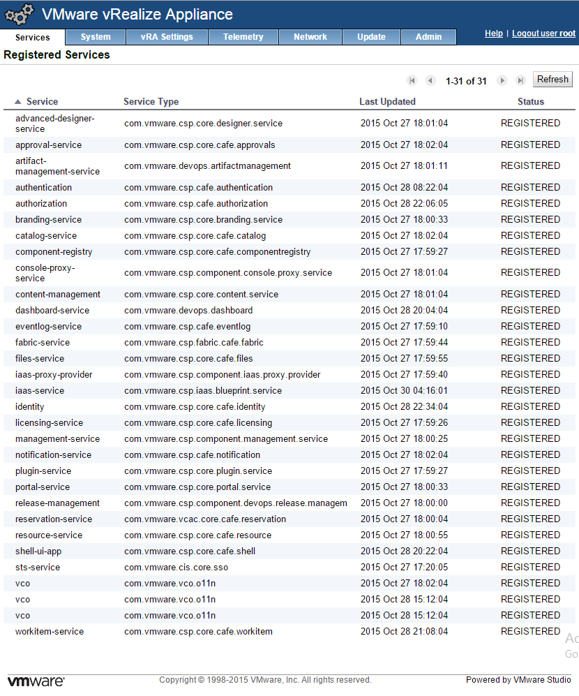

3.  Repeat the steps for the other vRealize Appliance.

<!-- -->

1.  (Optional) Verify that the services on the vRealize Automation Windows VMs are running.

    1.  Log in to the following Windows VMs by using the **svc-vra@rainpole.local** user name and the **svc-vra\_password** password.

| Role                                      | VM Name/Host Name           | IP Address    |
|-------------------------------------------|-----------------------------|---------------|
| IaaS Web Server                           | vra01iws01a.rainpole.local  | 192.168.11.54 |
| IaaS Web Server                           | vra01iws01b.rainpole.local  | 192.168.11.55 |
| IaaS Manager Service and DEM Orchestrator | vra01ims01a.rainpole.local  | 192.168.11.57 |
| IaaS Manager Service and DEM Orchestrator | vra01ims01b.rainpole.local  | 192.168.11.58 |
| vRealize Automation DEM Worker            | vra01dem01.rainpole.local   | 192.168.11.59 |
| vRealize Automation DEM Worker            | vra01dem02.rainpole.local   | 192.168.11.60 |
| Microsoft SQL Server                      | vra01mssql01.rainpole.local | 192.168.11.27 |

1.  Go to **Administrative Tools** and select **Services**.

2.  Verify that the status of the following services is **Running** on all Windows VMs.

| Role                                      | VM Name                     | Service Name                                     |
|-------------------------------------------|-----------------------------|--------------------------------------------------|
| IaaS Web Server                           | vra01iws01a.rainpole.local  | VMware vCloud Automation Center Management Agent |
| IaaS Web Server                           | vra01iws01b.rainpole.local  | VMware vCloud Automation Center Management Agent |
| IaaS Manager Service and DEM Orchestrator | vra01ims01a.rainpole.local  | VMware vCloud Automation Center Management Agent

                                                                           VMware vCloud Automation Center Service           

                                                                           VMware DEM-Orchestrator - DEM-Orch-01             |
| IaaS Manager Service and DEM Orchestrator | vra01ims01b.rainpole.local  | VMware vCloud Automation Center Management Agent

                                                                           VMware vCloud Automation Center Service(Manual)   

                                                                           VMware DEM-Orchestrator - DEM-Orch-02             |
| vRealize Automation DEM Worker            | vra01dem01.rainpole.local   | VMware vCloud Automation Center Management Agent

                                                                           VMware DEM-Worker - DEM-Worker-01                 

                                                                           VMware DEM-Worker - DEM-Worker-02                 

                                                                           VMware DEM-Worker - DEM-Worker-03                 |
| vRealize Automation DEM Worker            | vra01dem02.rainpole.local   | VMware vCloud Automation Center Management Agent

                                                                           VMware DEM-Worker - DEM-Worker-04                 

                                                                           VMware DEM-Worker - DEM-Worker-05                 

                                                                           VMware DEM-Worker - DEM-Worker-06                 |
| Microsoft SQL Server                      | vra01mssql01.rainpole.local | MSSQLSERVER                                      |

#### vRA-IWS (vra01iws01a.rainpole.local)

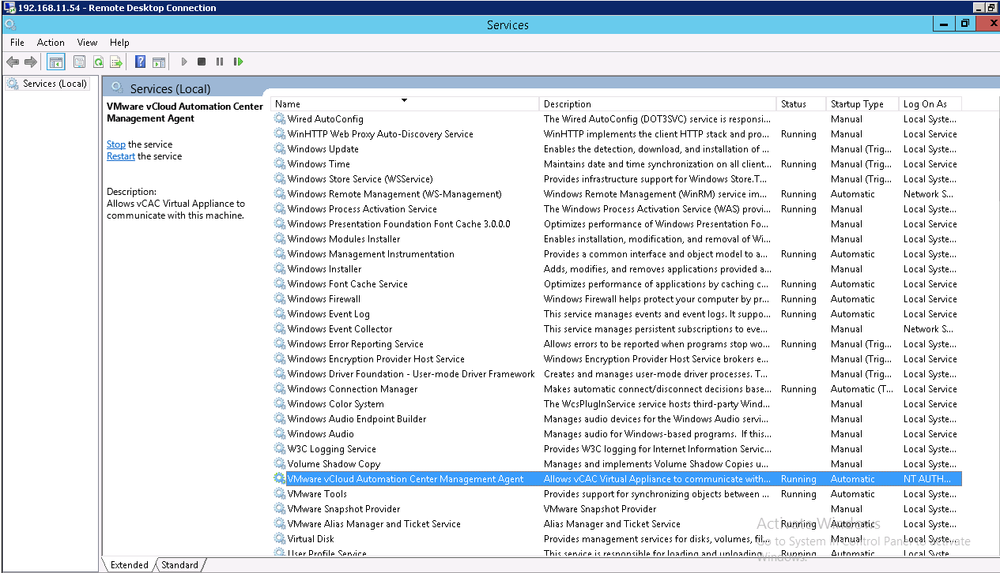

#### vRA-IMS (vra01ims01a.rainpole.local)

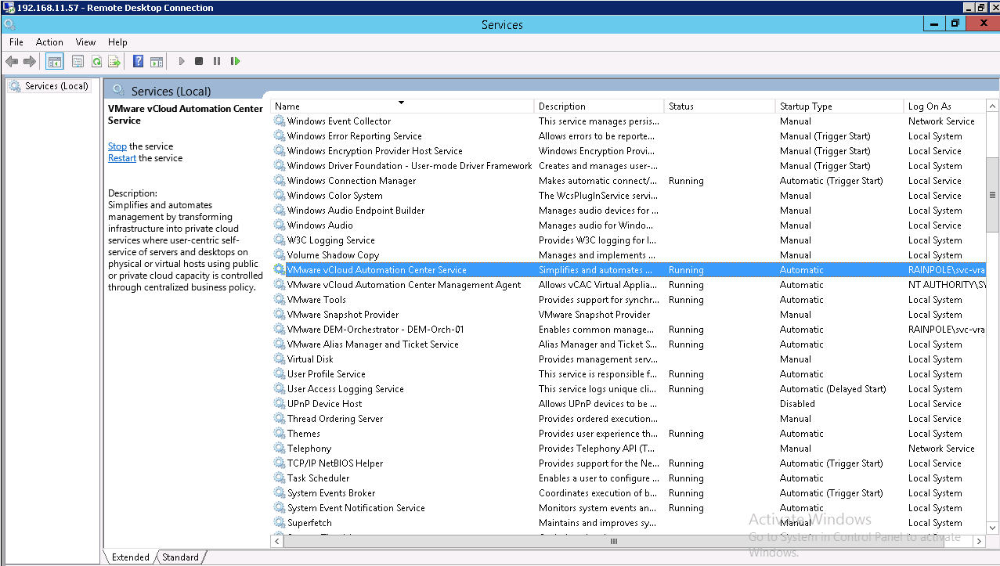

#### vRA-DEM (vra01dem01.rainpole.local)

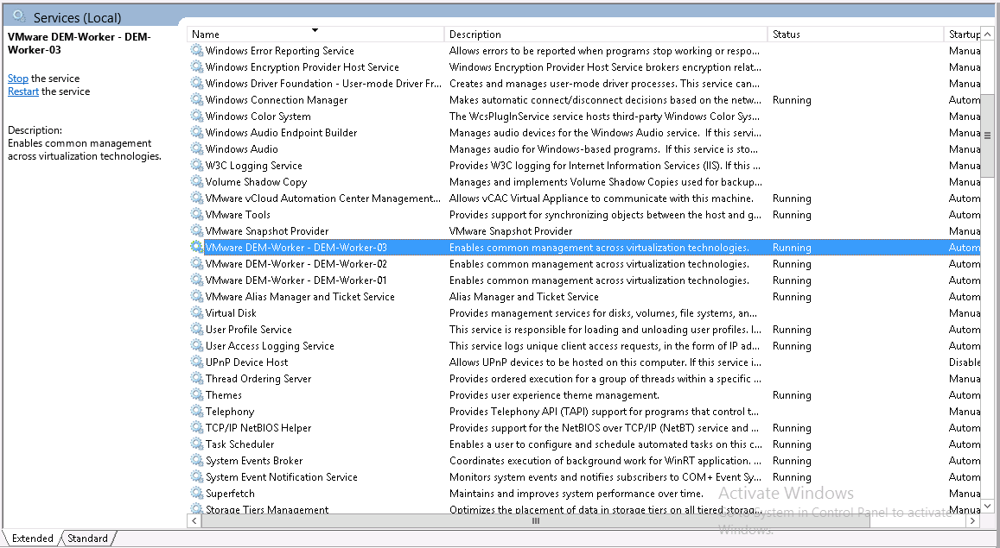

#### vRA-MSSQL (vra01mssql01.rainpole.local)

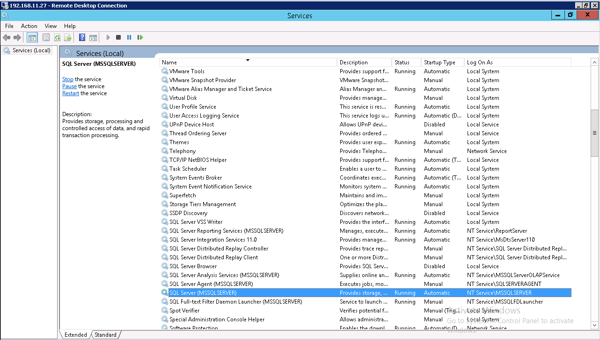

### Verify that Both vRealize Orchestrator Servers Are Working

Make sure that the two servers in the vRealize Orchestrator cluster are working.

1.  Verify the state of the vRealize Orchestrator servers.

    1.  Log in to **https://vra01vro01a.rainpole.local:8283/vco-config** as the administrator.

    2.  Click **Server Availability**.

    3.  In the **Started cluster nodes** table, verify that both vRealize Orchestrator servers are present and that the **Server state** state of both of them is **RUNNING.**

| vRealize Orchestrator server | Server State |
|------------------------------|--------------|
| vra01vro01a.rainpole.local   | Running      |
| vra01vro01b.rainpole.local   | Running      |

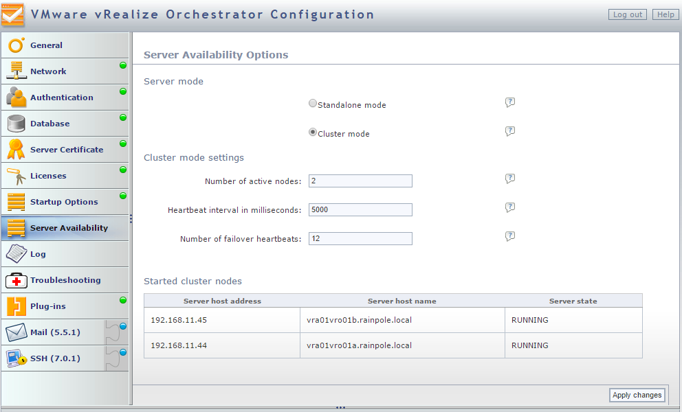

1.  Verify that you can log in to the vRealize Orchestrator client for the vRealize Orchestrator servers.

    1.  In a Web browser, go to https://vra01vro01a.rainpole.local:8281.

    2.  On the main page of vRealize Orchestrator, click the **Start Orchestrator Client** link

    3.  Use the **administrator@vsphere.local** user name and the **vsphere\_admin\_password** to log in.

        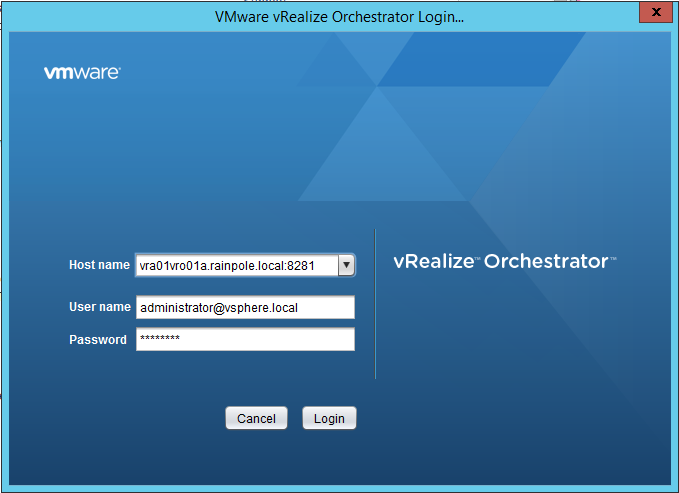

    4.  Verify that login is successful.

        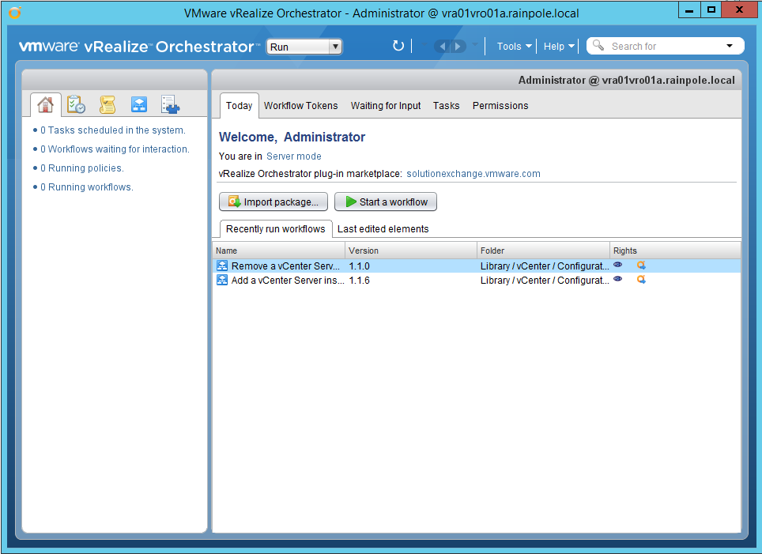

2.  Log out from the vRealize Orchestrator server.

3.  Repeat the same procedure for the second vRealize Orchestrator server at https://vra01vro01b.rainpole.local:8281 to verify that login is successful.

    1.  ### Verify the Status of Distributed Execution Managers and vSphere Proxy Agents in vRealize Automation

Verify that the Distributed Execution Managers (DEM) orchestrators and workers are online and that the IaaS vSphere Proxy Agents are connecting vRealize Automation to the compute and edge pods in Region B.

In case of disaster recovery, the vSphere Proxy Agents in Region A vra01ias01.sfo01.rainpole.local and vra01ias02.sfo01.rainpole.local are not accessible because the region is down.

1.  In a Web browser, go to https://vra01svr01.rainpole.local/vcac/org/rainpole.

<!-- -->

1.  Use the **ITAC-TenantAdmin@rainpole.local** user name and the **rainpole\_tenant\_admin\_password** password to log in.

2.  Verify the status of the DEM nodes.

    1.  On the **Infrastructure** tab, click **Monitoring** and click **Distributed Execution Status**.

    2.  Verify that the status of **DEM-Orch** and **DEM-Workers** virtual machines is **Online**.

| vRealize Automation Node                  | Virtual Machine            |
|-------------------------------------------|----------------------------|
| IaaS Manager Service and DEM Orchestrator | vra01ims01a.rainpole.local |
| IaaS Manager Service and DEM Orchestrator | vra01ims01b.rainpole.local |
| vRealize Automation DEM Worker            | vra01dem01.rainpole.local  |
| vRealize Automation DEM Worker            | vra01dem02.rainpole.local  |

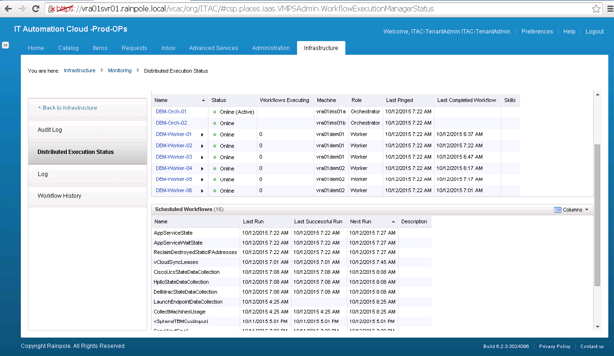

1.  Verify that the vSphere Proxy Agents is working properly.

    1.  In the vRealize Automation management console, on the **Infrastructure** tab, click **Compute Resources** and click **Compute Resources**.

    2.  Verify that the **Agent Status** for the compute and edge compute instances is **OK**.

        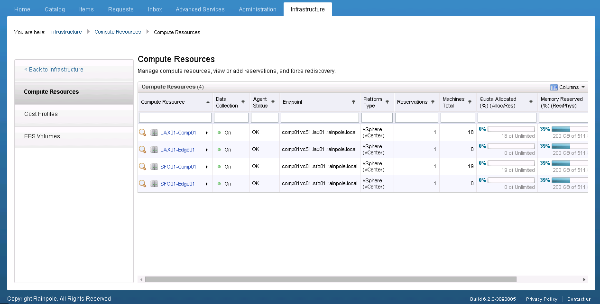

2.  If the **Agent Status** for the compute and edge instances is **Down**, restart the vRealize Automation services on the vSphere Agents VMs.

    1.  Log in to the Windows VMs of each agent that is down.

| vRealize Automation Node | Virtual Machine       |
|--------------------------|-----------------------|
| **Region A**             | vra01ias01 vra01ias02 |
| **Region B**             | vra01ias51 vra01ias52 |

1.  From the Windows Start menu, click **Administrative Tools** and click **Services**.

2.  In the **Services dialog** box, restart the following services:

-   VMware vCloud Automation Center Management Agent

-   VMware vCloud Automation Center Agent

1.  If an agent is still down after services restart, reboot the agent VM.

    1.  ### Verify the Integration of vRealize Automation with Active Directory

Verify that vRealize Automation is connected to the Active Directory domain after disaster recovery.

**Procedure**

1.  In a Web browser, go to **https://vra01svr01.rainpole.local/vcac**.

2.  Use the **administrator@vsphere.local** user name and the **vra\_administrator\_password** password to log in.

3.  On the **Administration** tab, click **Tenants** and click the **Rainpole** tenant.

4.  On the Edit Tenant page, click the **Identity Stores** tab and click **rainpole.local**.

5.  In the **Edit Identity Store** dialog box, enter the **svc\_vra\_password** password in the **Password** text box and click **Test Connection**.

6.  Verify that the dialog box displays **Connection is available**. The other properties are filled in during initial tenant configuration.

    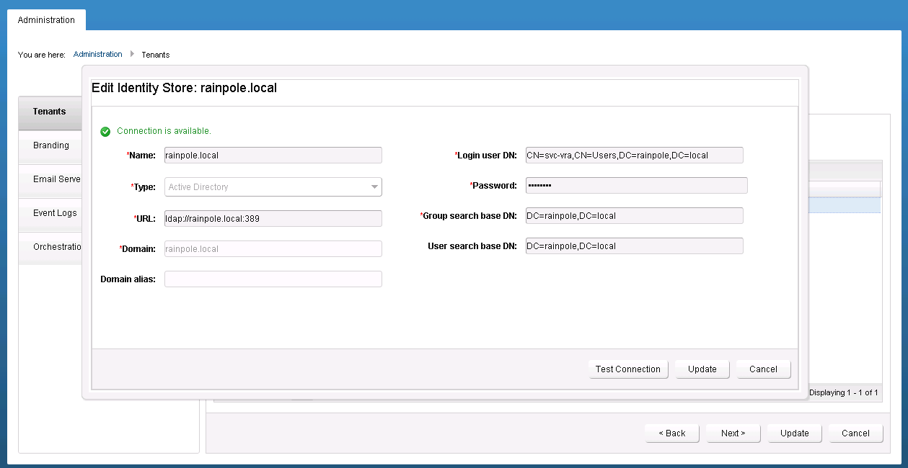

    1.  ### Request a Single-Machine Blueprint from the Service Catalog

Request a single-machine blueprint item from the service catalog to easily verify that vRealize Automation provisions items to the designated cloud environment.

1.  In a Web browser, go to **https://vra01svr01.rainpole.local/vcac/org/rainpole**.

<!-- -->

1.  Use the **ITAC-TenantAdmin@rainpole.local** user name and **rainpole\_tenant\_admin\_password** password.

2.  Click the **Catalog** tab and verify that all the entitled blueprints are available in the catalog.

    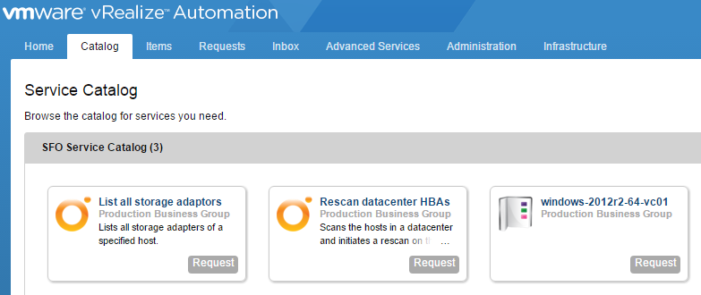

3.  Locate a single-machine blueprint, click Request and click Submit to submit a request to provision it.

    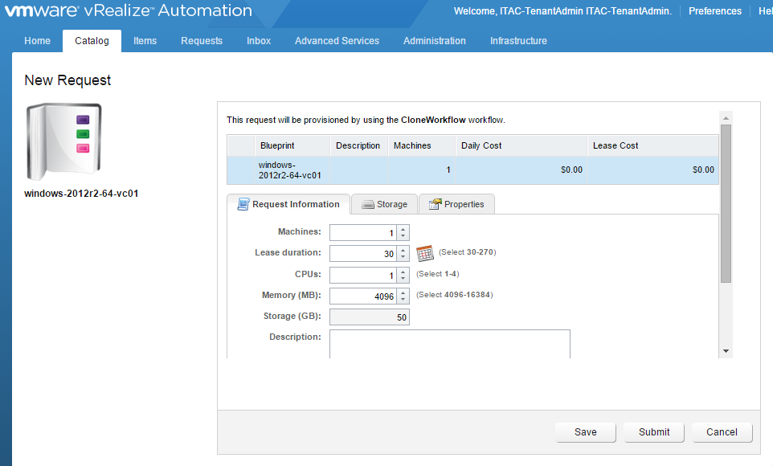

4.  Click the **Requests** tab and verify that the request for the single-machine blueprint provisioning is successful.

    1.  Promote the Replica vRealize Automation PostgreSQL Database to Primary
        ----------------------------------------------------------------------

The PostgreSQL database is replicated from the primary vRealize Automation appliance, vra01svr01a, to the secondary appliance vra01svr01b. In the event the primary appliance is not available, the PostgreSQL database must be manually promoted to the primary role on the secondary appliance.

1.  Connect to the secondary vRealize Automation appliance with SSH vra01svr01b using the postgres user account.

    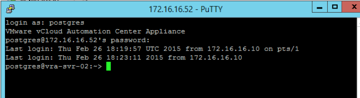

<!-- -->

1.  Run the following command to stop replication and promote this PostgreSQL instance to the primary role.

    opt/vmware/vpostgres/current/share/promote\_replica\_to\_primary

> 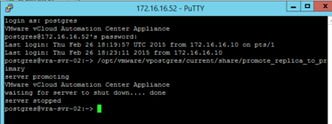

1.  Run the command again and verify that the message that the system returns states that the database is already running as the primary.

    opt/vmware/vpostgres/current/share/promote\_replica\_to\_primary

> 

1.  Connect to the Management vCenter Server instance using the vSphere Web Client

    1.  In a Web browser, go to **https://mgmt01vc01.sfo01.rainpole.local/vsphere-client**.

    2.  Log in as the **administrator@vsphere.local** user with the **vsphere\_admin\_password** password.

2.  On the vCenter Server Home page, click **Networking and Security**.

3.  In the **Navigator**, select **NSX Edges**.

4.  From the **NSX Manager** drop-down menu, select **172.16.11.65** as the NSX Manager and double-click on **vRA01-Edge** to manage the network settings.

5.  Select the **Manage** tab and the **Load Balancer** subtab.

6.  Click **Pools** on the left.

    1.  Select the **vra-vpostgres-5432** pool and click the edit icon.

    2.  Disable member server vra01svr01a.

    3.  Enable member server vra01svr01b.

    4.  Click **OK**.

7.  When the primary server is online, make it the replica by following the steps in the *Configure PostgreSQL Replication (Region A)* document.

 SDDC Startup and Shutdown
==========================

When you restore or configure failover of the SDDC management applications, make sure that you start up and shut down the management virtual machines according to a predefined order.

Shutdown Order of the Management VMs
------------------------------------

Shut down the virtual machines of the SDDC management stack by following a strict order to avoid data losses and faults in the applications when you restore them.

Table . Shutdown Order of the SDDC Management VMs

| Virtual Machine in Region **A**        | **Virtual Machine in Region B** | Shutdown Order | **Dependency **                                                                                                             |
|----------------------------------------|---------------------------------|----------------|-----------------------------------------------------------------------------------------------------------------------------|
| **vSphere Data Protection**            
 **Total Number of VMs (1)**             | **vSphere Data Protection**     
                                          **Total Number of VMs (1)**      | **1**          | **No**                                                                                                                      |
| vdp-mgmt-01                            | vdp-mgmt-51                     | 1              | -                                                                                                                           |
| **vRealize Log Insight**               
 **Total Number of VMs (3)**             | **vRealize Log Insight**        
                                          **Total Number of VMs (3)**      | **1**          | **No**                                                                                                                      |
| vrli-wrkr-01                           | vrli-wrkr-51                    | 1              | -                                                                                                                           |
| vrli-wrkr-02                           | vrli-wrkr-52                    | 1              | -                                                                                                                           |
| vrli-mstr-01                           | vrli-mstr-51                    | **2**          | Shut this virtual machine from the vRealize Log Insight cluster down last.                                                  |
| **vRealize Operations Manager**        
 **Total Number of VMs (6)**             | **vRealize Operations Manager**
                                          **Total Number of VMs (2)**      | **1**          | Before you power the node virtual machines off, stop the nodes by using the vRealize Operations Manager admin UI.           |
| vrops-rmtcol-01                        | vrops-rmtcol-51                 | 1              | -                                                                                                                           |
| vrops-rmtcol-02                        | vrops-rmtcol-52                 | 1              | -                                                                                                                           |
| vrops-datan-04                         | -                               | 2              | -                                                                                                                           |
| vrops-datan-03                         | -                               | 2              | -                                                                                                                           |
| vrops-repln-02                         | -                               | 3              | -                                                                                                                           |
| vrops-mstrn-01                         | -                               | **4**          | Shut down this virtual machine from the vRealize Operations Manager cluster last.                                           |
| **vRealize Automation**                
 **Total Number of VMs (14)**            | **vRealize Automation**         
                                          **Total Number of VMs (2)**      | **2**          |                                                                                                                             |
| vra01ias01                             | vra01ias51                      | 1              | -                                                                                                                           |
| vra01ias02                             | vra01ias51                      | 1              | -                                                                                                                           |
| vra01dem01                             | -                               | 2              | -                                                                                                                           |
| vra01dem02                             | -                               | 2              | -                                                                                                                           |
| vra01ims01b                            | -                               | 3              | -                                                                                                                           |
| vra01ims01a                            | -                               | 4              | -                                                                                                                           |
| vra01iws01b                            | -                               | 5              | -                                                                                                                           |
| vra01iws01a                            | -                               | 6              | -                                                                                                                           |
| vra01svr01b                            | -                               | 7              | -                                                                                                                           |
| vra01svr01a                            | -                               | 8              | Verify that the vra01svr01b virtual machine is already shut down.                                                           |
| vra01vro01b                            | -                               | 9              | -                                                                                                                           |
| vra01vro01a                            | -                               | 9              | -                                                                                                                           |
| vra01mssql01                           | -                               | 10             | Verify that all vRealize Automation virtual machines except vra01ids01a are powered off.                                    |
| vra01ids01a                            | -                               | **11**         | Shut down this virtual machine from the vRealize Automation deployment last.                                                |
| **Site Recovery Manager**              
 **Total Number of VMs (2)**             | **0Site Recovery Manager**      
                                          **Total Number of VMs (2)**      | **3**          | **No**                                                                                                                      |
| mgmt01vrms01                           | mgmt01vrms51                    | 1              | -                                                                                                                           |
| mgmt01srm01                            | mgmt01srm51                     | **2**          | Shut down this virtual machine from the disaster recovery group last.                                                       |
| **Core Stack**                         
 **Total Number of VMs (24)**            | **Core Stack**                  
                                          **Total Number of VMs (24)**     | **4**          | **Yes**                                                                                                                     

                                                                                             Wait until all of the following solutions are powered off.                                                                   |
| vRA01-Edge-0                           | vRA01-Edge-0                    | 1              | -                                                                                                                           |
| vRA01-Edge-1                           | vRA01-Edge-1                    | 1              | -                                                                                                                           |
| vRA01IAS-Edge-0                        | vRA01IAS-Edge-0                 | 1              | -                                                                                                                           |
| vRA01IAS-Edge-1                        | vRA01IAS-Edge-1                 | 1              | -                                                                                                                           |
| vRLI01-Edge-0                          | vRLI01-Edge-0                   | 1              | -                                                                                                                           |
| vRLI01-Edge-1                          | vRLI01-Edge-1                   | 1              | -                                                                                                                           |
| vROps01-Edge-0                         | vROps01-Edge-0                  | 1              | -                                                                                                                           |
| vROps01-Edge-1                         | vROps01-Edge-1                  | 1              | -                                                                                                                           |
| vROps01RC-Edge-0                       | vROps01RC-Edge-0                | 1              | -                                                                                                                           |
| vROps01RC-Edge-1                       | vROps01RC-Edge-01               | 1              | -                                                                                                                           |
| MgmtSFO01-Edge-0                       | MgmtLAX01-Edge-0                | 1              | -                                                                                                                           |
| MgmtSFO01-Edge-1                       | MgmtLAX01-Edge-1                | 1              | -                                                                                                                           |
| mgmt01nsxm01                           | mgmt01nsxm51                    | 2              | Shut down the NSX Manager before the NSX Controllers to guarantee that all changes are pushed to the NSX Controllers first. |
| comp01nsxm01                           | comp01nsxm51                    | 2              | Shut down the NSX Manager before the NSX Controllers to guarantee that all changes are pushed to the NSX Controllers first. |
| NSX\_Controller\_0-Mgmt                | NSX\_Controller\_0-Mgmt         | 3              | Shut down the NSX Controllers after the NSX Manager is down.                                                                |
| NSX\_Controller\_1-Mgmt                | NSX\_Controller\_1-Mgmt         | 3              | Shut down the NSX Controllers after the NSX Manager is down.                                                                |
| NSX\_Controller\_2-Mgmt                | NSX\_Controller\_2-Mgmt         | 3              | Shut down the NSX Controllers after the NSX Manager is down.                                                                |
| NSX\_Controller\_0-Edge                | NSX\_Controller\_0-Edge         | 3              | Shut down the NSX Controllers after the NSX Manager is down.                                                                |
| NSX\_Controller\_1-Edge                | NSX\_Controller\_1-Edge         | 3              | Shut down the NSX Controllers after the NSX Manager is down.                                                                |
| NSX\_Controller\_2-Edge                | NSX\_Controller\_2-Edge         | 3              | Shut down the NSX Controllers after the NSX Manager is down.                                                                |
| mgmt01vc01                             | mgmt01vc51                      | 4              | -                                                                                                                           |
| comp01vc01                             | comp01vc51                      | 4              | -                                                                                                                           |
| comp01psc01                            | comp01psc51                     | 5              | -                                                                                                                           |
| mgmt01psc01                            | mgmt01psc51                     | **5**          | Shut down the Platform Services Controller for the Management vCenter Server last.                                          |
| **Region A: Total Number of VMs (50)** |                                 |                |                                                                                                                             |
| **Region B: Total Number of VMs (34)** |                                 |                |                                                                                                                             |

Startup Order of the Management VMs
-----------------------------------

Start up the virtual machines of the SDDC management stack by following a strict order to guarantee the faultless operation of and the integration between the applications.

Table . Startup Order of the SDDC Management VMs

| **Virtual Machine in Region A**        | **Virtual Machine in Region B** | **Startup**
                                                                            **Order**    | **Dependency **             |
|----------------------------------------|---------------------------------|-------------|-----------------------------|
| **Core Stack**                         
 **Total Number of VMs (24)**            | **Core Stack**                  
                                          **Total Number of VMs (24)**     | **1**       |                             |
| mgmt01psc01                            | mgmt01psc51                     | 1           | External on AD, DNS and NTP |
| comp01psc01                            | comp01psc51                     | 1           | External on AD, DNS and NTP |
| mgmt01vc01                             | mgmt01vc51                      | 2           | mgmt01psc01                 |
| comp01vc01                             | comp01vc51                      | 2           | comp01psc01                 |
| mgmt01nsxm01                           | mgmt01nsxm51                    | 3           | mgmt01vc01                  |
| comp01nsxm01                           | comp01nsxm51                    | 3           | comp01vc01                  |
| NSX\_Controller\_0-Mgmt                | NSX\_Controller\_0-Mgmt         | 4           | mgmt01nsxm01                |
| NSX\_Controller\_1-Mgmt                | NSX\_Controller\_1-Mgmt         | 4           | mgmt01nsxm01                |
| NSX\_Controller\_2-Mgmt                | NSX\_Controller\_2-Mgmt         | 4           | mgmt01nsxm01                |
| vRA01-Edge-0                           | vRA01-Edge-0                    | 4           | mgmt01nsxm01                |
| vRA01-Edge-1                           | vRA01-Edge-1                    | 4           | mgmt01nsxm01                |
| vRA01IAS-Edge-0                        | vRA01IAS-Edge-0                 | 4           | mgmt01nsxm01                |
| vRA01IAS-Edge-1                        | vRA01IAS-Edge-1                 | 4           | mgmt01nsxm01                |
| vRLI01-Edge-0                          | vRLI01-Edge-0                   | 4           | mgmt01nsxm01                |
| vRLI01-Edge-1                          | vRLI01-Edge-1                   | 4           | mgmt01nsxm01                |
| vROps01-Edge-0                         | vROps01-Edge-0                  | 4           | mgmt01nsxm01                |
| vROps01-Edge-1                         | vROps01-Edge-1                  | 4           | mgmt01nsxm01                |
| vROps01RC-Edge-0                       | vROps01RC-Edge-0                | 4           | mgmt01nsxm01                |
| vROps01RC-Edge-1                       | vROps01RC-Edge-1                | 4           | mgmt01nsxm01                |
| MgmtSFO01-Edge-0                       | MgmtLAX01-Edge-0                | 4           | mgmt01nsxm01                |
| MgmtSFO01-Edge-1                       | MgmtLAX01-Edge-1                | 4           | mgmt01nsxm01                |
| NSX\_Controller\_0-Edge                | NSX\_Controller\_0-Edge         | 4           | comp01nsxm01                |
| NSX\_Controller\_1-Edge                | NSX\_Controller\_1-Edge         | 4           | comp01nsxm01                |
| NSX\_Controller\_2-Edge                | NSX\_Controller\_2-Edge         | 4           | comp01nsxm01                |
| **vSphere Data Protection**            
 **Total Number of VMs (1)**             | **vSphere Data Protection**     
                                          **Total Number of VMs (1)**      | **2**       |                             |
| vdp-mgmt-01                            | vdp-mgmt-51                     | 1           | mgmt01vc01                  |
| **vRealize Log Insight**               
 **Total Number of VMs (3)**             | **vRealize Log Insight**        
                                          **Total Number of VMs (3)**      | **2**       |                             |
| vrli-mstr-01                           | vrli-mstr-51                    | 1           | -                           |
| vrli-wrkr-01                           | vrli-wrkr-51                    | 2           | vrli-mstr-01                |
| vrli-wrkr-02                           | vrli-wrkr-52                    | 2           | vrli-mstr-01                |
| **vRealize Operations Manager**        
 **Total Number of VMs (6)**             | **vRealize Operations Manager**
                                          **Total Number of VMs (2)**      | **2**       |                             |
| vrops-mstrn-01                         | -                               | 1           |                             |
| vrops-repln-02                         | -                               | 2           | vrops-mstrn-01              |
| vrops-datan-04                         | -                               | 3           | vrops-mstrn-01              |
| vrops-datan-03                         | -                               | 3           | vrops-mstrn-01              |
| vrops-rmtcol-01                        | vrops-rmtcol-51                 | 4           | Analytics cluster           |
| vrops-rmtcol-02                        | vrops-rmtcol-52                 | 4           | Analytics cluster           |
| **Site Recovery Manager**              
 **Total Number of VMs (2)**             | **Site Recovery Manager**       
                                          **Total Number of VMs (2)**      | **3**       |                             |
| mgmt01vrms01                           | mgmt01vrms51                    | 1           |                             |
| mgmt01srm01                            | mgmt01srm51                     | 2           | mgmt01vrms01                |
| **vRealize Automation**                
 **Total Number of VMs (14)**            | **vRealize Automation**         
                                          **Total Number of VMs (2)**      | **4**       |                             |
| vra01mssql01                           |                                 | 1           |                             |
| vra01ids01a                            |                                 | 1           |                             |
| vra01vro01a                            |                                 | 2           |                             |
| vra01vro01b                            |                                 | 2           |                             |
| vra01svr01a                            |                                 | 3           |                             |
| vra01svr01b                            |                                 | 4           | vra01svr01a                 |
| vra01iws01a                            |                                 | 5           |                             |
| vra01iws01b                            |                                 | 5           | vra01iws01a                 |
| vra01ims01a                            |                                 | 6           |                             |
| vra01ims01b                            |                                 | 7           | vra01ims01a                 |
| vra01ias01                             | vra01ias51                      | 8           |                             |
| vra01ias02                             | vra01ias52                      | 8           |                             |
| vra01dem01                             | -                               | 9           |                             |
| vra01dem02                             | -                               | 9           |                             |
| **Region A: Total Number of VMs (50)** |                                 |             |                             |
| **Region B: Total Number of VMs (34)** |                                 |             |                             |

**Site** Protection and Recovery
================================

Perform region recovery and protection of the management components of the SDDC by using Site Recovery Manager and vSphere Replication.

-   Before You Initiate Disaster Recovery of the Management Stack

-   Prerequisites for SDDC Failover

-   BCDR Failover Checklist

-   Failover of the SDDC Management Applications

-   Post-Failover Configuration of the Management Applications

-   SDDC Failover Validation

    1.  Before You Initiate Disaster Recovery of the Management Stack
        -------------------------------------------------------------

Assess the main requirements and tasks to activate a disaster recovery plan. You must have a disaster recovery process in place so that critical applications can continue their work if a disaster or an incident occurs.

### Overview the Disaster Recovery Design

This SDDC design supports disaster recovery of the management components on a recovery region, Region B, in a multi-region deployment. According to the *BCDR Design* documentation, you fail over only two management applications by using Site Recovery Manager - vRealize Operations Manager, and vRealize Automation and vRealize Orchestrator. The architecture of vRealize Log Insight supports the deployment of a separate Log Insight cluster in each region. Each Log Insight cluster collects and archives data that is specific to its home region. The region-local instance is also a remote collector for the paired region. The rest of the management components, such as vCenter Server, NSX Manager, Site Recovery Manager and vSphere Data Protection, perform operations that are specific to their local region too. You do not fail them over to Region B.

The design supports continued deployments of customer workloads in the recovery region after the failover of the management applications. The design does not on the other hand, cover the recovery of workloads that are running in the failed region.

### Plan Failover Testing

After you prepare a plan for disaster recovery, test it and ensure that all covered components, scripts, and manual processes result in a guaranteed recovery at component or region level. Schedule planned failover tests that are realistic, well documented, and repeatable. Conduct tests quarterly or more frequently as needed.

### Steps Before You Initiate Disaster Recovery

The initiation of disaster recovery involves certain steps.

Table . Steps to Initiate Failover

|     | Step                 | Description                                                                                                                                                                                                                                                                                                                                                                |
|-----|----------------------|----------------------------------------------------------------------------------------------------------------------------------------------------------------------------------------------------------------------------------------------------------------------------------------------------------------------------------------------------------------------------|
| 1   | Activation           | Identify the event that triggers planned disaster recovery according to disaster type, severity, impact on production and expected event duration.                                                                                                                                                                                                                         

                              This step includes determining if disaster recovery activation is valid because not all problems constitute a disaster. For example, an application failure might not be a cause for disaster recovery, while an extended region outage is a valid cause. Consider also business continuity events such as planned building maintenance or the possibility of a hurricane.  |
| 2   | Assessment           | Evaluate whether the predefined criteria are met to trigger the activation of disaster recovery                                                                                                                                                                                                                                                                            |
| 3   | Approval             | Get the approval to activate the initiation of disaster recovery, for example, from the IT personnel, business owners, and senior management.                                                                                                                                                                                                                              |
| 4   | Activation Logistics | Ensure that all required facilities and personnel are available to start and complete the disaster recovery process.                                                                                                                                                                                                                                                       |
| 5   | Communication        | Verify that the right process to communicate the initiation and completion of disaster recovery is in place. Notify employees, customers and third parties that are involved in or affected by the disaster recovery operations.                                                                                                                                           |

For a step-by-step process for failover, see the *BCDR Failover Prerequisites Checklist*.

Prerequisites for SDDC Failover
-------------------------------

For faultless failover to the recovery region, Region B, verify that that your environment satisfies the requirements for a failover-capable SDDC configuration.

Table . Failover Prerequisites

| Prerequisite           | Value                                                                                                                                                                                                |
|------------------------|------------------------------------------------------------------------------------------------------------------------------------------------------------------------------------------------------|
| Compute                | The compute in the recovery region must mirror the compute in the protected region.                                                                                                                  |
| Storage                | The storage configuration and capacity in the recovery region must mirror the storage configuration and capacity in the protected region.                                                            

                          Shared datastore space on the management pod with enough capacity must be available for all VMs of vRealize Automation and vRealize Operations Manager.                                               |
| IP Addresses           | Allocate five IP addresses for vRealize Automation and two IP addresses for vRealize Operations Manager on the external management network in the recovery region.                                   

                          -   vRealize Automation                                                                                                                                                                               

                          <!-- -->                                                                                                                                                                                              

                          -   10.158.150.13                                                                                                                                                                                     

                          -   10.158.150.52                                                                                                                                                                                     

                          -   10.158.150.53                                                                                                                                                                                     

                          -   10.158.150.54                                                                                                                                                                                     

                          -   10.158.150.55                                                                                                                                                                                     

                          <!-- -->                                                                                                                                                                                              

                          -   vRealize Operations Manager                                                                                                                                                                       

                          <!-- -->                                                                                                                                                                                              

                          -   10.158.150.14                                                                                                                                                                                     

                          -   10.158.150.48                                                                                                                                                                                     |
| External Services      | Provide the following services in the recovery region. See *External Service Dependencies* from *Planning and Preparing*.                                                                            

                          -   Active Directory                                                                                                                                                                                  

                          -   DNS                                                                                                                                                                                               

                          -   NTP                                                                                                                                                                                               

                          -   SMTP                                                                                                                                                                                              

                          -   Syslog                                                                                                                                                                                            |
| Virtual Infrastructure | ESXi, vCenter Server and NSX for vSphere mirrored in the protected region.                                                                                                                           

                          Site Recovery Manager and vSphere Replication deployed in both regions and paired.                                                                                                                    

                          Application virtual networks in NSX for vSphere to accommodate the migration of vRealize Automation/vRealize Orchestrator and vRealize Operations Manager. See *Software-Defined Networking Design*.  |

BCDR Failover Checklist
-----------------------

Use a checklist to verify that you have satisfied all requirements to initiate business continuity and disaster recovery (BCDR).

Table . Checklist for Failover

| Step to Initiate Disaster Recovery                | Description                                                                                                                                                                           |
|---------------------------------------------------|---------------------------------------------------------------------------------------------------------------------------------------------------------------------------------------|
| Activation and Assessment                         | Verify BCDR failover is required.                                                                                                                                                     
                                                     For example, an application failure might not be a cause to perform a failover.                                                                                                        |
| Approval                                          | Submit required documentation for approval to the following roles:                                                                                                                    

                                                     IT management                                                                                                                                                                          

                                                     Business users                                                                                                                                                                         

                                                     CTO                                                                                                                                                                                    |
| Activation Logistics                              | -   Verify that Site Recovery Manager is available in Region B.                                                                                                                       

                                                     -   Verify the replication status of the applications.                                                                                                                                 

                                                     -   Verify the state of the NSX Edge for each application virtual network in Region B.                                                                                                 

                                                     <!-- -->                                                                                                                                                                               

                                                     -   Is the NSX Edge for the network container available?                                                                                                                               

                                                     -   Are the IP addresses for the internal, and external VXLAN backed networks correct?                                                                                                 

                                                     -   Is load balancer on the NSX Edge configured according to the design?                                                                                                               

                                                     -   Is the firewall on the NSX Edge correctly configured according to the design?                                                                                                      |
| Communication, Initiation and Failover Validation | -   In the case of a business continuity failover                                                                                                                                     

                                                     <!-- -->                                                                                                                                                                               

                                                     -   Notify the users of the outage.                                                                                                                                                    

                                                     <!-- -->                                                                                                                                                                               

                                                     -   At the scheduled time initiate the failover process.                                                                                                                               

                                                     <!-- -->                                                                                                                                                                               

                                                     -   In the case of a disaster recovery failover, notify all stakeholders and initiate the failover process                                                                             

                                                     -   Test application availability after you complete the failover.                                                                                                                     

                                                     -   Notify all stakeholders of completed failover.                                                                                                                                     |
| Post-Failover Configuration                       | -   Update the backup jobs to include the applications that are now running in Region B.                                                                                              

                                                     -   Redirect log data from the failed over applications to vRealize Log Insight in Region B.                                                                                           

                                                     -   Complete a post BCDR assessment, for example, note which items worked and which did not work, and identify places for improvement that you can incorporate back in the BCDR plan.  |

Failover of the SDDC Management Applications
--------------------------------------------

Configure and perform failover from the protected region, Region A, to the recovery region, Region B, of the management applications in the SDDC.

You fail over the following management components:

-   Analytics cluster of vRealize Operations Manager - The remote collector nodes are not failed over. You deploy a separate pair of remote collectors in each region in an application isolated network.

-   The primary components of vRealize Automation and vRealize Orchestrator - The vSphere Proxy Agents are not failed over. You deploy a separate pair of agents in each region in an application isolated network.

**Procedure Overview**

-   Configure Failover of Management Applications

-   Test the Failover of Management Applications

-   Perform Disaster Recovery or Planned Migration of Management Applications

    1.  ### Configure Failover of Management Applications

Prepare the management applications in the SDDC for failover or planned migration. Replicate application-specific virtual machines by using vSphere Replication and create recovery plans for these virtual machines by using Site Recovery Manager.

-   Configure Failover of vRealize Operations Manager

-   Configure Failover of vRealize Automation and vRealize Orchestrator

**Configure Failover of vRealize Operations Manager**

Prepare vRealize Operations Manager for failover by replicating the virtual machines of the analytics cluster and creating a recovery plan for them in Site Recovery Manager.

-   Replicate the VMs of vRealize Operations Manager

-   Create a Protection Group for vRealize Operations Manager

-   Create a Recovery Plan for vRealize Operations Manager

-   Customize the Recovery Plan for vRealize Operations Manager

    1.  #### Replicate the VMs of vRealize Operations Manager

Enable the replication of the virtual machines that participate in the analytics cluster of the vRealize Operations Manager to support failover of vRealize Operations Manager to Region B.

Procedure

1.  Log in to the Management vCenter Server in Region A by using the vSphere Web Client.

    1.  In a browser, go to **https://mgmt01vc01.sfo01.rainpole.local/vsphere-client**.

    2.  Use the following credentials to log in.

| Setting       | Value                        |
|---------------|------------------------------|
| **User name** | administrator@vsphere.local  |
| **Password**  | **vsphere\_admin\_password** |

1.  From the **Home** menu of the vSphere Web Client, select **VMs and Templates**.

2.  Navigate to the **vROps01** VM folder.

| Object             | Value                           |
|--------------------|---------------------------------|
| **vCenter Server** | mgmt01vc01.sfo01.rainpole.local |
| **Data center**    | SFO01                           |
| **Folder**         | vROps01                         |

1.  On the **vROps01** page, click the **Related Objects** tab, click **Top Level Objects** and select the virtual machines of the analytics cluster.

| Name           | Role                |
|----------------|---------------------|
| vrops-mstrn-01 | Master node         |
| vrops-repln-02 | Master replica node |
| vrops-datan-03 | Data node 1         |
| vrops-datan-04 | Data node 2         |

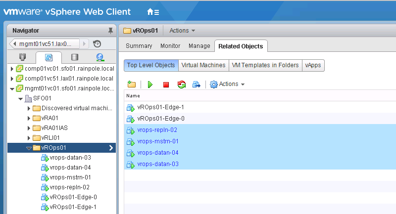

1.  Right-click the VM selection, and select **All vSphere Replication Actions** &gt; **Configure Replication**.

    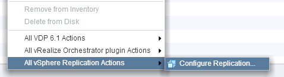

2.  Click **Yes** in the dialog box about performing replication for all objects.

3.  On the **Validation** page of the **Configuration Replication** dialog box, if all validation checks pass, click **Next**.

    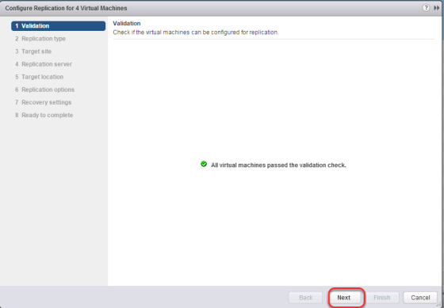

4.  On the **Replication type** page, select **Replicate to a vCenter Server** and click **Next**.

    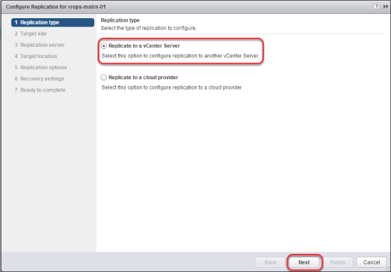

5.  On the **Target site** page, select the **mgmt01vc51.lax01.rainpole.local** vCenter Server in Region B, and click **Next**.

    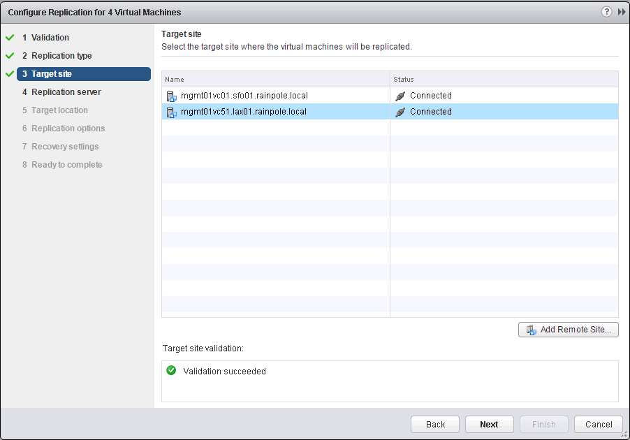

6.  On the **Replication server** page, select **Auto-assign vSphere Replication server** and click **Next**.

    If the environment contains several replications servers, selecting this option makes use of any of these replication servers.

    

7.  On the **Target location**, set the location on the Virtual SAN datastore in Region B to store replicated VM files.

    1.  Click the **Edit for all** link.

        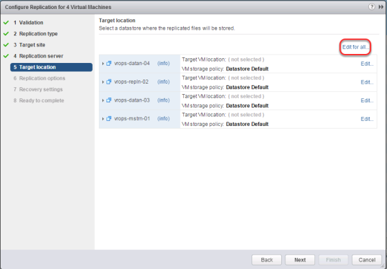

    2.  In the **Select Target Location** dialog box, select the **LAX01A-VSAN01-MGMT01** datastore in the upper part of the dialog box, and in the **Select a target location** pane, select the root folder of datastore underneath.

    3.  vSphere Replication will create a folder in the root folder for the vRealize Operations Manager VMs.

        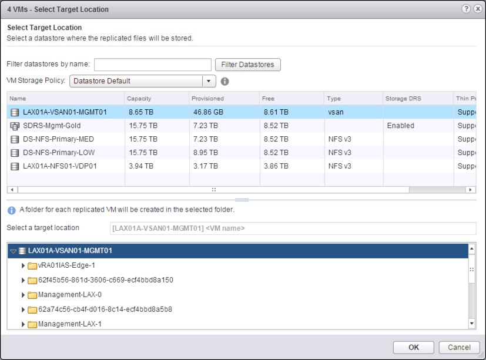

    4.  Click **OK**.

    5.  Back on the **Target Location** page, click **Next**.

        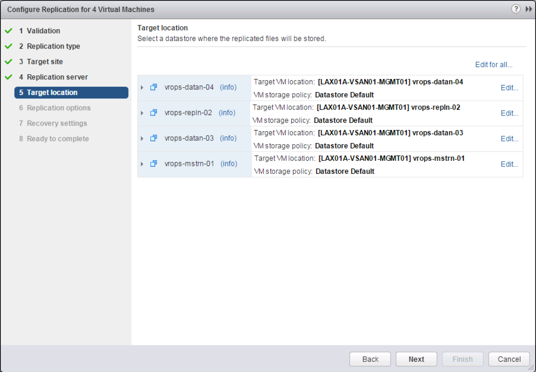

8.  On the **Replication options** page, under **Network Compressions** click **Enable network compression for VR data**, and click **Next** to continue.

-   Do not enable guest OS quiescing because some of the vRealize Operations Manager databases do not support quiescing. Quiescing might result in a cluster failure because virtual disks remain in frozen state for too long.

-   Compression requires extra resources. Do not enable it if the hosts are over-utilized.

    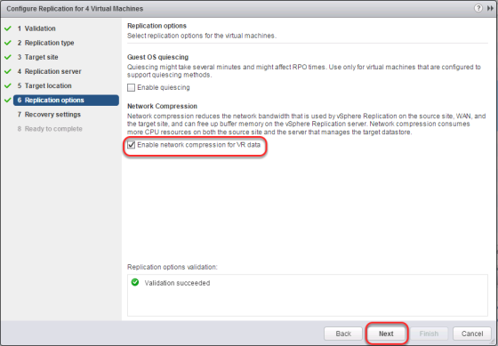

1.  On the **Recovery settings** page, set the **Recovery Point Objective (RPO)** to 15 minutes, and click **Next**.

    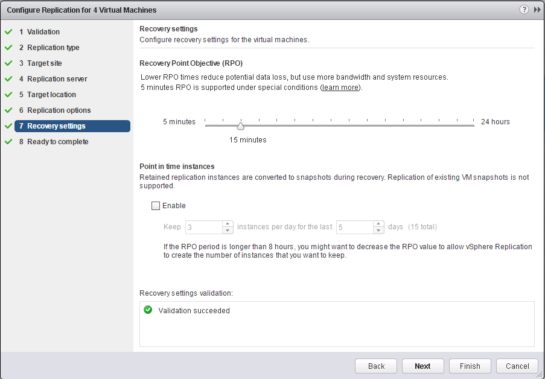

2.  On the **Ready to complete** page, review the configuration and click **Finish**.

    Replication configuration for the virtual machines from the analytics cluster starts.

    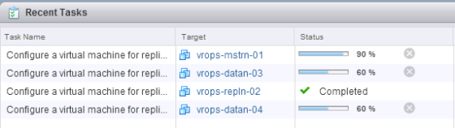

3.  (Optional) Monitor the replication progress.

    1.  In the vSphere Web Client, click **Home** &gt; **vSphere Replication** and click the **Home** tab.

    2.  Double-click the **mgmt01vc01.sfo01.rainpole.local** source vCenter Server to open the page for replication configuration page for this vCenter Server instance.

    3.  On the **Monitor** tab, click the **vSphere Replication** tab and select **Outgoing Replications**.

        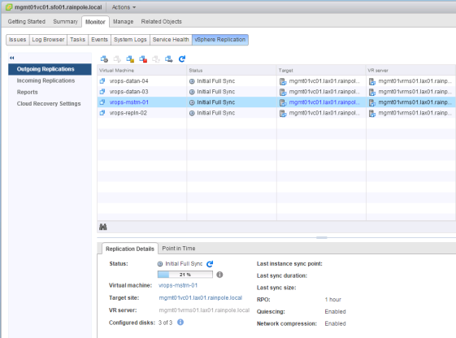

        1.  #### Create a Protection Group for vRealize Operations Manager

After you configure a replication solution for the analytics virtual machines of vRealize Operations Manager, include the virtual machines in a protection group so that Site Recovery Manager protects them together.

Procedure

1.  Log in to the Management vCenter Server in Region A by using the vSphere Web Client.

    1.  In a browser, go to **https://mgmt01vc01.sfo01.rainpole.local/vsphere-client**.

    2.  Use the following credentials to log in.

| Setting       | Value                       |
|---------------|-----------------------------|
| **User name** | administrator@vsphere.local |
| **Password**  | vsphere\_admin\_password    |

1.  From the **Home** menu of the vSphere Web Client, select **Site Recovery**.

2.  On the Site Recovery Home page, click **Sites** and select the **mgmt01vc01.sfo01.rainpole.local** protected site.

3.  If the **Log In Site** dialog box appears, enter the **administrator@vsphere.local** user name and **vsphere\_admin\_password** password.

4.  On the **Related Objects** tab, click the **Protection Groups** tab and click **Create Protection Group**.

    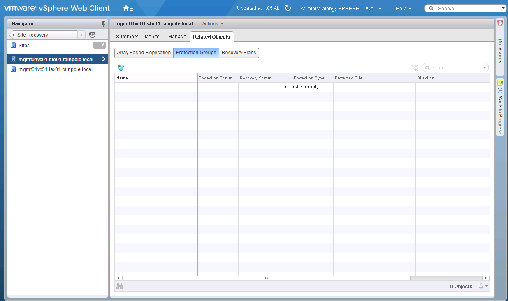

5.  On the **Name and location** page, configure the following properties and click **Next**.

| Property    | Value                                                             |
|-------------|-------------------------------------------------------------------|
| Name        | vROps-PG                                                          |
| Description | vROps Cluster Protection Group                                    |
| Site pair   | mgmt01vc01.sfo01.rainpole.local - mgmt01vc51.lax01.rainpole.local |

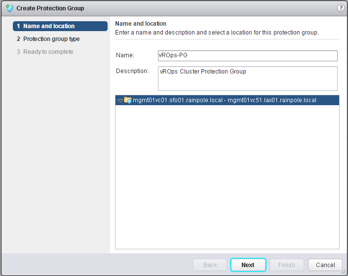

1.  On the **Protection group type** page, configure the following settings and click **Next**.

| Protection Setting          | Value                                                                 |
|-----------------------------|-----------------------------------------------------------------------|
| **Direction of protection** | mgmt01vc01.sfo01.rainpole.local -&gt; mgmt01vc51.lax01.rainpole.local |
| **Protection group type**   | Individual VMs                                                        |

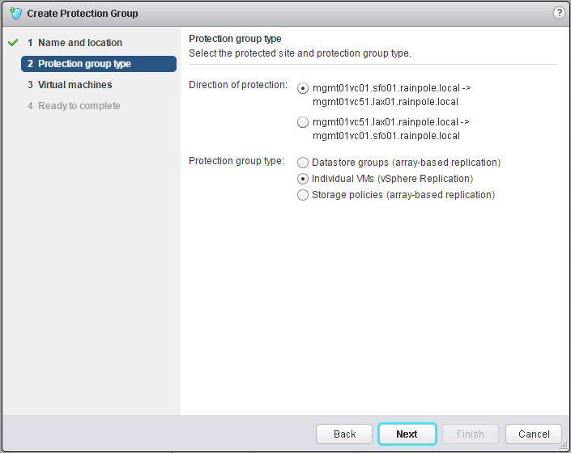

1.  On the **Virtual machines** page, select the analytics virtual machines from the list of machines replicated by using vSphere Replication and click **Next**.

-   vrops-mstrn-01

-   vrops-repln-02

-   vrops-datan-03

-   vrops-datan-04

    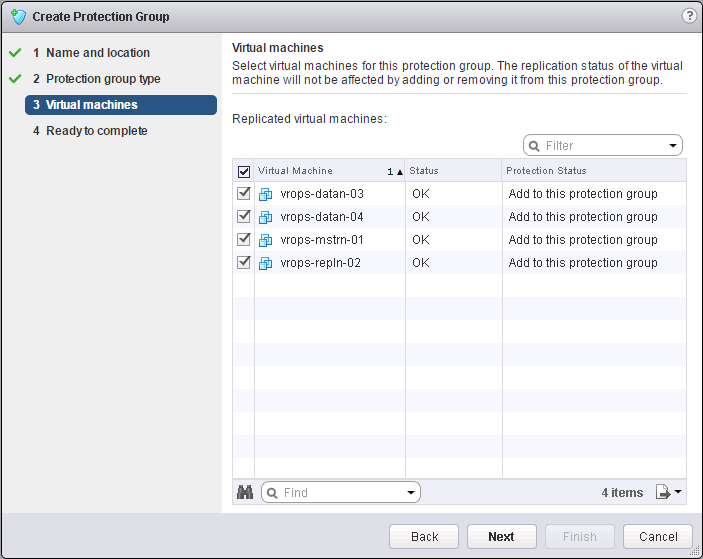

1.  On the **Ready to complete page**, review the protection group settings and click **Finish**.

    The vROps-PG protection group appears in the list of protection groups for Site Recovery Manager.

    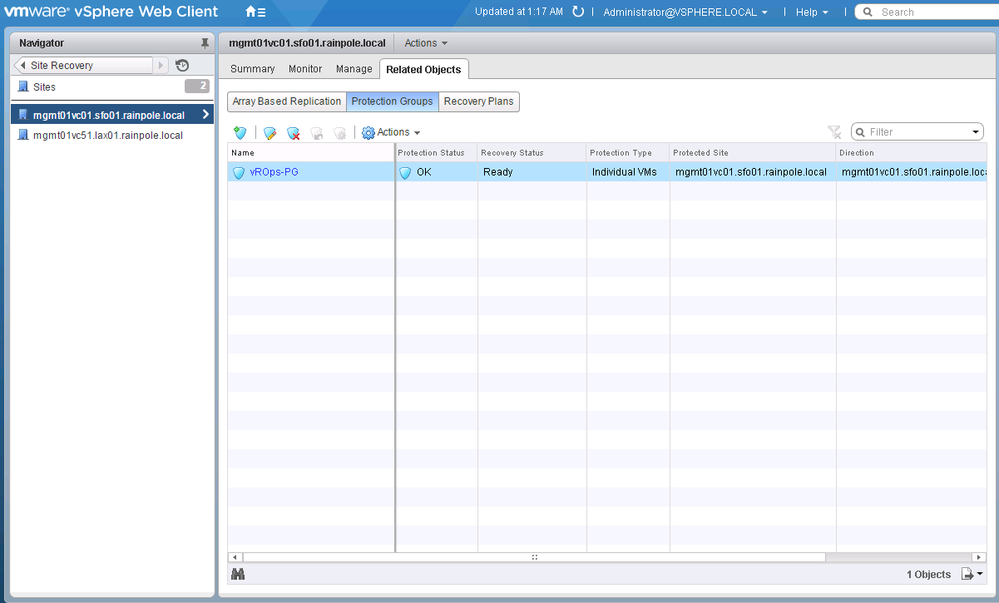

    1.  #### Create a Recovery Plan for vRealize Operations Manager

After you create a protection group for the virtual machines of the vRealize Operations Manager analytics cluster, create a recovery plan. You use this plan to run commands on Site Recovery Manager and the analytics virtual machines, and configure dependencies between the virtual machines.

**Procedure**

1.  Log in to the Management vCenter Server in Region A by using the vSphere Web Client.

    1.  In a browser, go to **https://mgmt01vc01.sfo01.rainpole.local/vsphere-client**.

    2.  Use the following credentials to log in.

| Setting       | Value                       |
|---------------|-----------------------------|
| **User name** | administrator@vsphere.local |
| **Password**  | vsphere\_admin\_password    |

1.  From the **Home** menu of the vSphere Web Client, select **Site Recovery.**

2.  On the Site Recovery Home page, click **Sites** and select **mgmt01vc01.sfo01.rainpole.local**.

3.  On the **Related Objects** tab, click the **Recovery Plans** tab and click the **Create Recovery Plan** icon.

    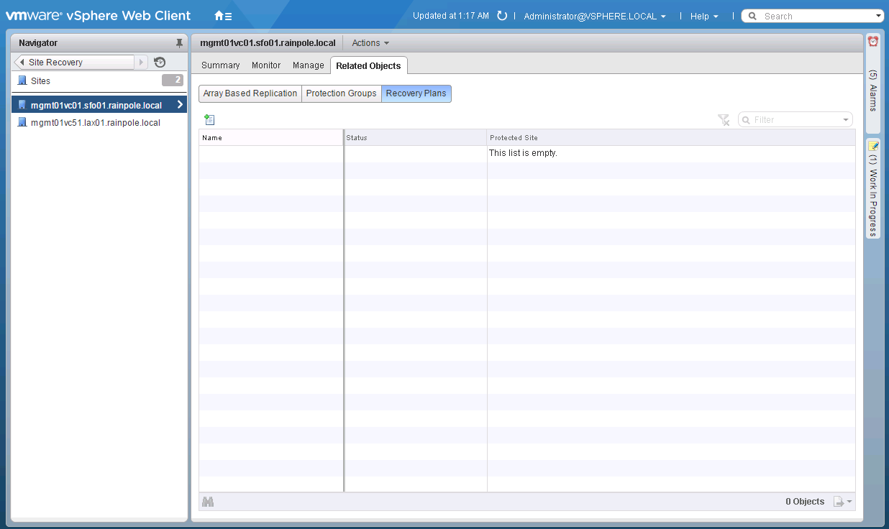

4.  On the **Name and location** page, configure the following settings and click **Next**.

| Property        | Value                                                             |
|-----------------|-------------------------------------------------------------------|
| **Name**        | vROps-RP                                                          |
| **Description** | Recovery Plan for vROps Cluster                                   |
| **Site pair**   | mgmt01vc01.sfo01.rainpole.local - mgmt01vc51.lax01.rainpole.local |

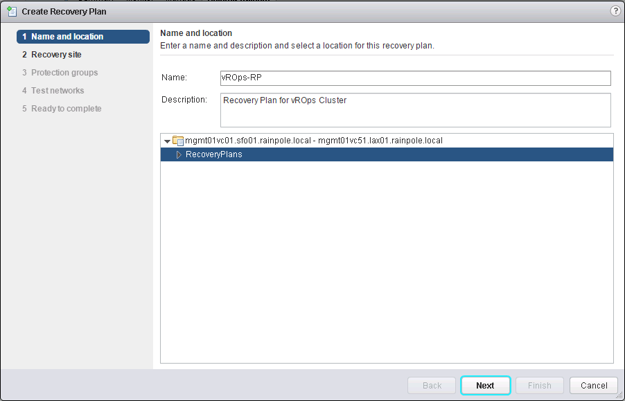

1.  On the **Recovery Site** page, select **mgmt01vc51.lax01.rainpole.local** in the **Recovery Site** pane and click **Next**.

    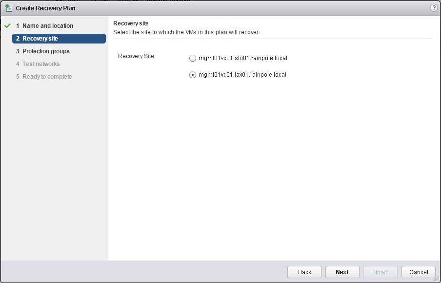

2.  On the **Protection group** page, select the protection group for the recovery plan and click **Next**.

| Protection Group Option | Value                |
|-------------------------|----------------------|
| **Group type**          | VM protection groups |
| **Protection group**    | vROps-PG             |

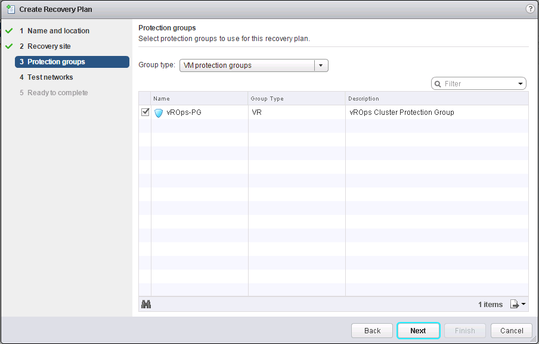

1.  On the **Test networks** page, select the distributed port group on the **vDS-Mgmt** distributed switch in Region B that ends with **vROps01-VXLAN** and click **Next**.

> 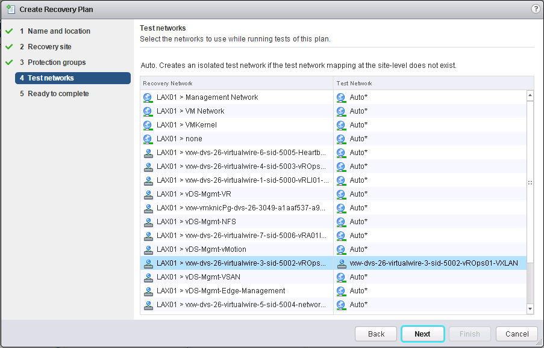

1.  On the **Ready to complete** page, click **Finish**.

> 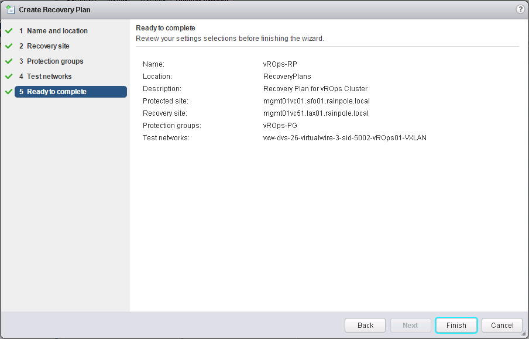

1.  The vROps-RP recovery plan appears in the list of the recovery plans available in Site Recovery Manager.

> 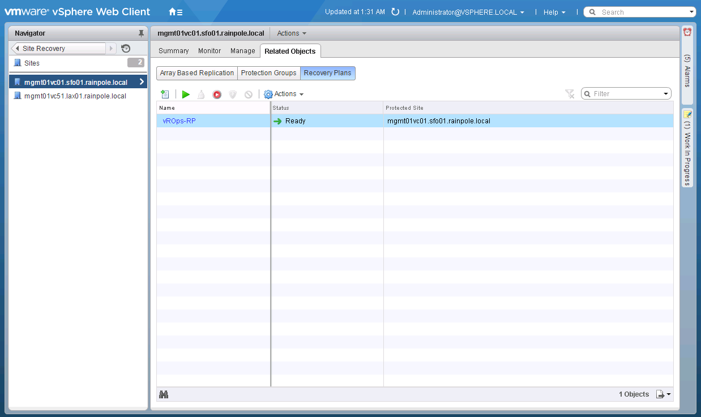

#### Customize the Recovery Plan for vRealize Operations Manager

After you create the recovery plan for the vRealize Operations Manager failover, configure the correct startup priority for the virtual machines of the analytics cluster.

**Procedure**

1.  In a Web browser, log in to the Management vCenter Server by using the vSphere Web Client.

    1.  Go to **https://mgmt01vc01.sfo01.rainpole.local/vsphere-client**.

    2.  Use the **administrator@vsphere.local** user name and the **vsphere\_admin\_password** password to log in.

<!-- -->

1.  From the **Home** menu, select **Site Recovery.**

2.  On the Site Recovery Home page, click **Sites** and select **mgmt01vc01.sfo01.rainpole.local** protected site.

3.  On the **Related Objects** tab, click the **Recovery Plans** tab and click the **vROps-RP** recovery plan to open it.

    

4.  On the **Recovery Plan** page, click the **Monitor** tab and expand **Power** on priority 3 VMs.

5.  Right-click **vrops-mstrn-01** and select **All Priority Actions** &gt; **Priority 1** to change the startup priority of the **vrops-mstrn-01** machine to Priority 1 in all recovery plans that it is in.

    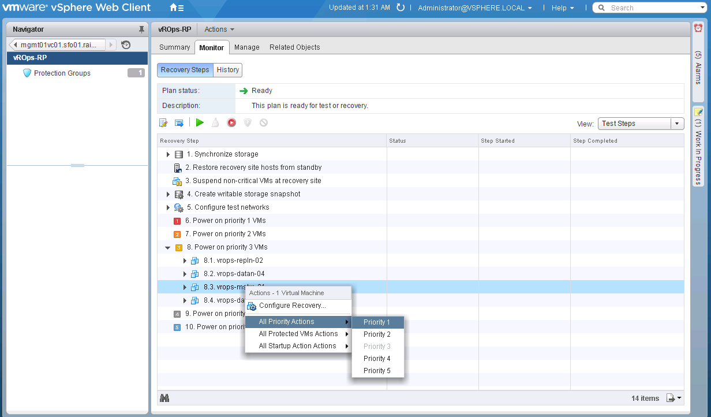

6.  Click **Yes** to change the priority in the **Change Priority** dialog box.

7.  Right-click again **vrops-mstrn-01** and select **Configure Recovery**.

8.  In the **VM Recovery Properties** dialog box, configure the following recovery settings.

    1.  Expand **Shutdown Actions** and increase **Shutdown guest OS before power off** to 10 minutes.

    2.  Expand **Startup Actions** and increase the timeout to 10 minutes.

    3.  Click **OK**.

        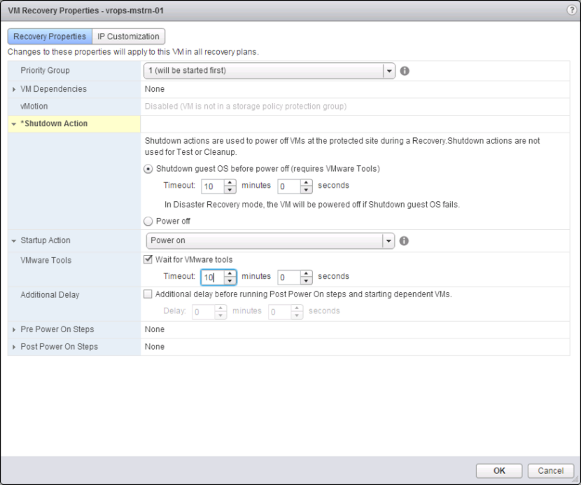

9.  Repeat the Step 6 through Step 9 for the other virtual machines.

-   For **vrops-repln-02**, change the startup priority to 2.

-   For **vrops-datan-03** and **vrops-datan-04**, leave the default priority 3, but update the timeout values.

| VM Name        | Priority |
|----------------|----------|
| vrops-mstrn-01 | 1        |
| vrops-repln-02 | 2        |
| vrops-data-03  | 3        |
| vrops-data-04  | 3        |

> 

1.  Add a prompt to wait for configuring the environment so as to retain the access to the analytics cluster.

    You must update the DNS record for **the vrops-cluster-01.rainpole.local** FQDN, make the **192.168.21.0/24** subnet in Region B the local network, and enable route redistribution in Region B. For information about performing the required configuration steps during failover, see the following documentation.

-   Update the DNS Entry for vRealize Operations Manager

-   Modify IPsec VPN Settings for vRealize Operations Manager

-   Swap OSPF Redistribution Flag for vRealize Operations Manager

    1.  Right-click Step 6. Power on Priority 1 VMs and select Add Step Before.

        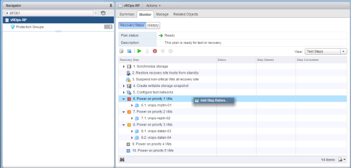

    2.  In the **Add Recovery Plan Step Before** dialog box, configure the following values, and click **OK**.

| Option      | Value                                                                        |
|-------------|------------------------------------------------------------------------------|
| **Type**    | Prompt                                                                       |
| **Name**    | Enter a meaningful name for what kind of operations to carry out             
               Ex: Update DNS entries, Modify IPsec VPN, Enable/Disable OSPF flag for vROps  |
| **Content** | Please perform the following operations for vROps:                           

               1.  Update DNS entries                                                        

               <!-- -->                                                                      

               1.  Modify IPsec VPN settings                                                 

               2.  Enable/Disable OPF redistribution flag                                    

               Once done, please Dismiss this dialog to continue...                          |
| **Timeout** | NA                                                                           |

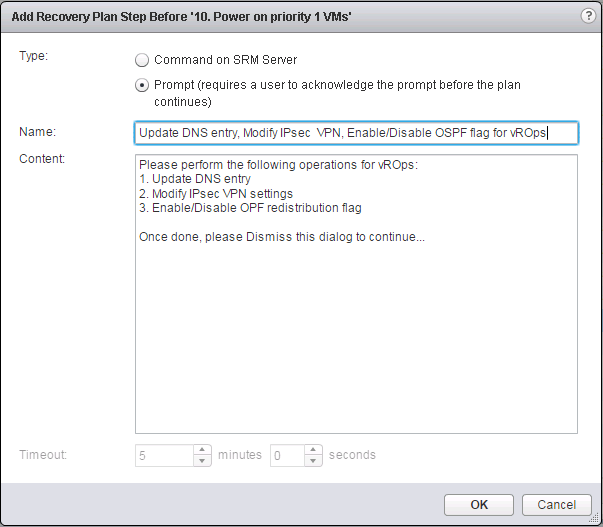

### Configure Failover of vRealize Automation and vRealize Orchestrator

Prepare vRealize Automation and vRealize Orchestrator for failover by replicating the virtual machines of the primary vRealize Automation components and of Realize Orchestrator, and creating a recovery plan for them in Site Recovery Manager.

-   Replicate the VMs of vRealize Automation and vRealize Orchestrator

-   Create a Protection Group for vRealize Automation and vRealize Orchestrator

-   Create a Recovery Plan for vRealize Automation and vRealize Orchestrator

-   Customize the Recovery Plan of vRealize Automation and vRealize Orchestrator

    1.  #### Replicate the VMs of vRealize Automation and vRealize Orchestrator

Enable the replication of the virtual machines that build up the primary functionality of vRealize Automation and the virtual machines of vRealize Orchestrator cluster to support failover of the cloud platform to Region B.

Procedure

1.  Log in to the Management vCenter Server in Region A by using the vSphere Web Client.

    1.  In a browser, go to **https://mgmt01vc01.sfo01.rainpole.local/vsphere-client**.

    2.  Use the following credentials to log in.

| Setting       | Value                       |
|---------------|-----------------------------|
| **User name** | administrator@vsphere.local |
| **Password**  | vsphere\_admin\_password    |

1.  From the **Home** menu of the vSphere Web Client, select **VMs and Templates**.

2.  Navigate to the **vRA01** VM folder.

| Object             | Value                           |
|--------------------|---------------------------------|
| **vCenter Server** | mgmt01vc01.sfo01.rainpole.local |
| **Data center**    | SFO01                           |
| **Folder**         | vRA01                           |

1.  On the **vRA01** page, click the **Related Objects** tab, click **Top Level Objects** and select the virtual machines of vRealize Automation and vRealize Orchestrator.

| vRealize Automation Component             | VM Name                     |
|-------------------------------------------|-----------------------------|
| IaaS Manager Service and DEM Orchestrator | vra01ims01a.rainpole.local  |
| IaaS Manager Service and DEM Orchestrator | vra01ims01b.rainpole.local  |
| IaaS Web Server                           | vra01iws01a.rainpole.local  |
| IaaS Web Server                           | vra01iws01b.rainpole.local  |
| Microsoft SQL Server                      | vra01mssql01.rainpole.local |
| vRealize Appliance                        | vra01svr01a.rainpole.local  |
| vRealize Appliance                        | vra01svr01b.rainpole.local  |
| vRealize Automation DEM Worker            | vra01dem01.rainpole.local   |
| vRealize Automation DEM Worker            | vra01dem02.rainpole.local   |
| vRealize Automation Identity Appliance    | vra01ids01a.rainpole.local  |
| vRealize Orchestrator Appliance           | vra01vro01a.rainpole.local  |
| vRealize Orchestrator Appliance           | vra01vro01b.rainpole.local  |

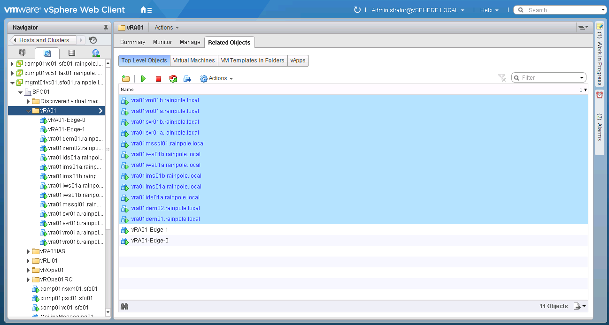

1.  Right-click the VM selection, and select **All vSphere Replication Actions** &gt; **Configure Replication**.

    

2.  Click **Yes** in the dialog box about performing replication for all objects.

3.  On the **Validation** page of the **Configuration Replication** dialog box, if all validation checks pass, click **Next**.

    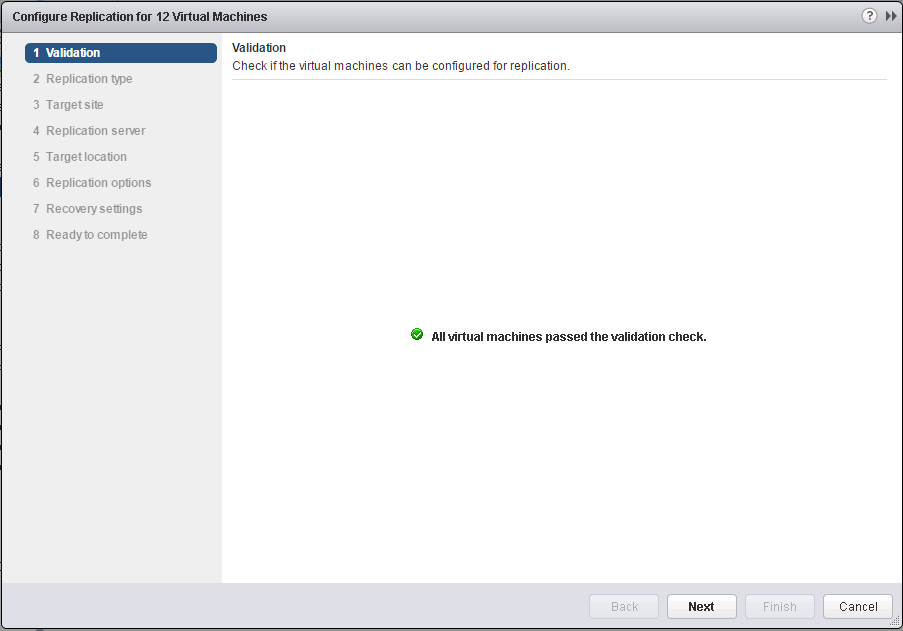

4.  On the **Replication type** page, select **Replicate to a vCenter Server** and click **Next**.

    

5.  On **the Target site** page, select the **mgmt01vc51.lax01.rainpole.local** vCenter Server in Region B, and click **Next**.

    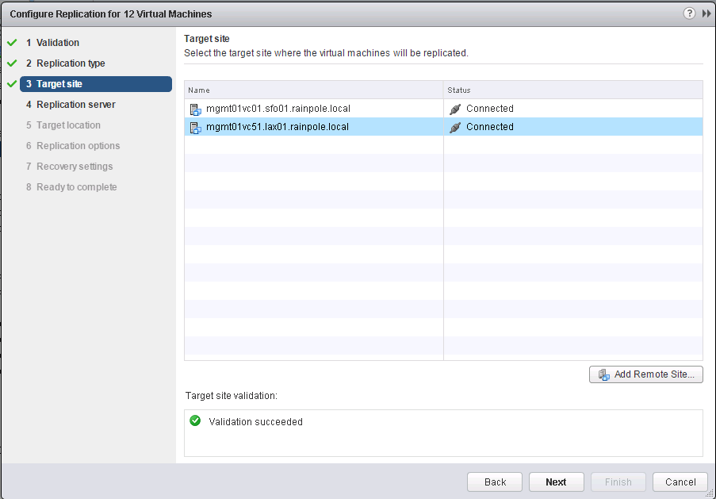

6.  On the **Replication server** page, select **Auto-assign vSphere Replication server** and click **Next**.

    If the environment contains several replications servers, selecting this option makes use of any of these replication servers.

> 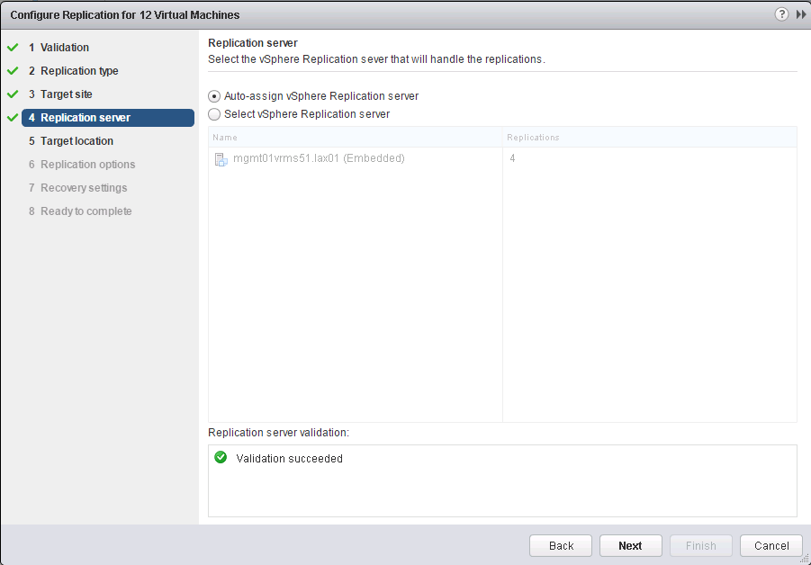

1.  On the **Target location**, set the location on the Virtual SAN datastore in Region B to store replicated VM files.

    1.  Click the **Edit for all** link.

        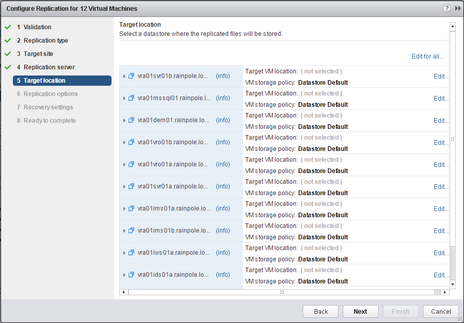

    2.  In the **Select Target Location** dialog box, select the **LAX01A-VSAN01-MGMT01** datastore in the upper part of the dialog box, and in the **Select a target location** pane, select the root folder of datastore. vSphere Replication will create a folder in the root folder for the VMs of vRealize Automation and vRealize Orchestrator.

        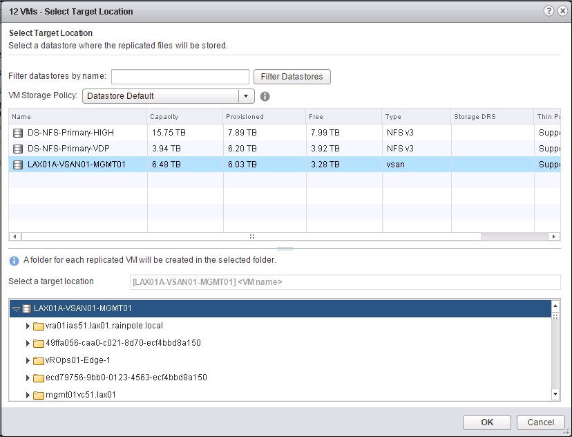

    3.  Click **OK**.

    4.  Back on the **Target Location** page, click **Next**.

> 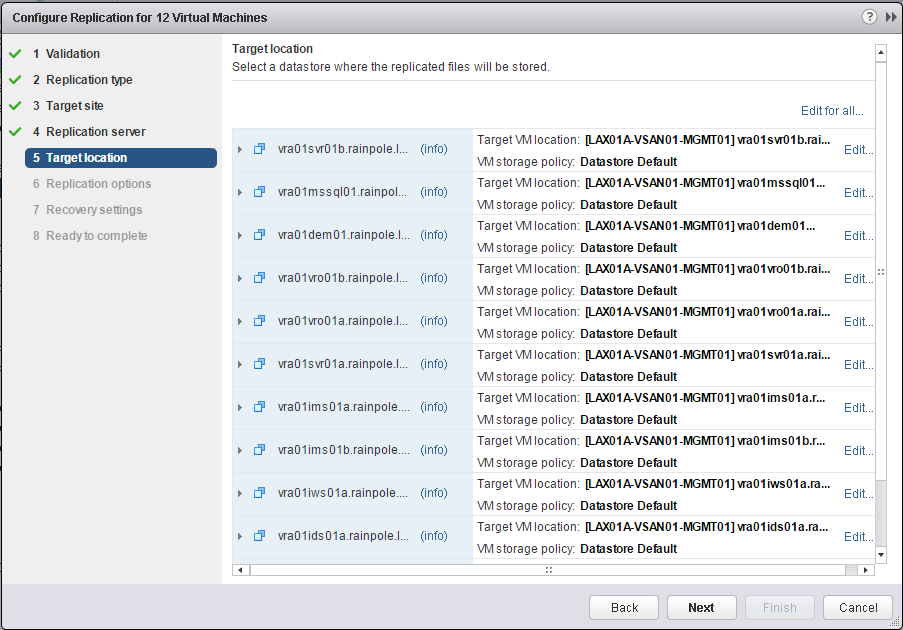

1.  On the **Replication options** page, under **Network Compressions** click **Enable network compression for VR data**, and click Next to continue.

-   Do not enable guest OS quiescing because some of the vRealize Automation and vRealize Orchestrator databases do not support quiescing. Quiescing might result in a cluster failure because virtual disks remain in frozen state for too long.

-   Compression requires extra resources. Do not enable it if the hosts are over-utilized.

> 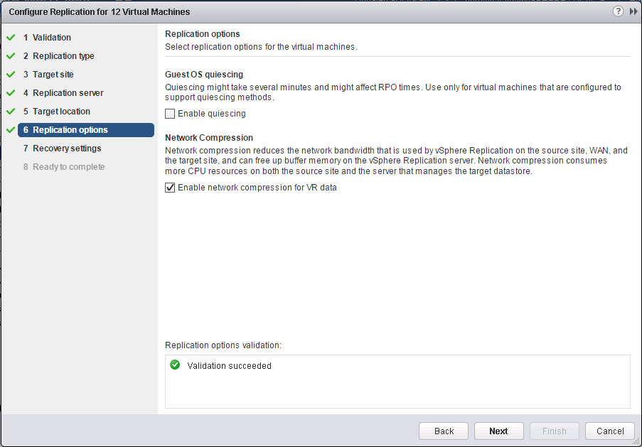

1.  On the **Recovery settings** page, set the **Recovery Point Objective (RPO)** to 15 minutes, and click **Next**.

> 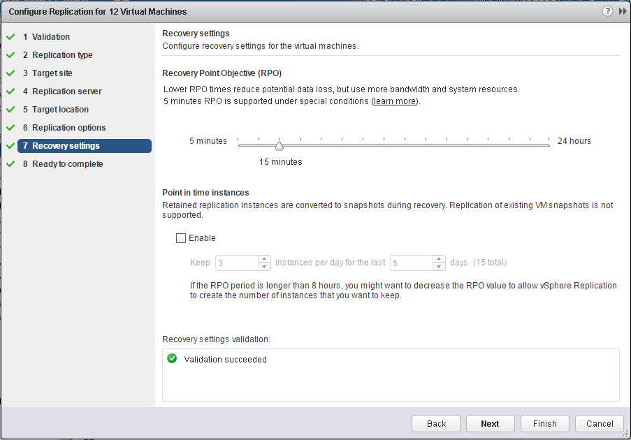

1.  On the **Ready to complete** page, review the configuration and click **Finish**.

Replication configuration for the virtual machines from the cloud management platform starts.

1.  (Optional) Monitor the replication progress.

    1.  In the vSphere Web Client, click **Home** &gt; **vSphere Replication** and click the **Home** tab.

    2.  Double-click the **mgmt01vc01.sfo01.rainpole.local** source vCenter Server to open the page for replication configuration page for this vCenter Server instance.

    3.  On the **Monitor** tab, click the **vSphere Replication** tab and select **Outgoing Replications**.

        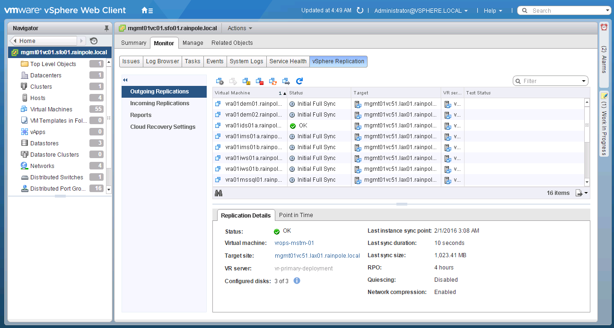

        1.  #### Create a Protection Group for vRealize Automation and vRealize Orchestrator

After you configure a replication solution for the virtual machines of vRealize Automation and vRealize Orchestrator, include the virtual machines in a protection group so that Site Recovery Manager protects them together.

**Procedure**

1.  Log in to the Management vCenter Server in Region A by using the vSphere Web Client.

    1.  In a browser, go to **https://mgmt01vc01.sfo01.rainpole.local/vsphere-client**.

    2.  Use the following credentials to log in.

| Setting       | Value                       |
|---------------|-----------------------------|
| **User name** | administrator@vsphere.local |
| **Password**  | vsphere\_admin\_password    |

1.  From the **Home** menu of the vSphere Web Client, select **Site Recovery**.

2.  On the Site Recovery **Home** page, click **Sites** and select the mgmt01vc01.sfo01.rainpole.local protected site.

3.  If the **Log In Site** dialog box appears, enter the **administrator@vsphere.local** user name and **vsphere\_admin\_password** password.

4.  On the **Related Objects** tab, click the **Protection Groups** tab and click **Create Protection Group**.

5.  On the **Name and location** page, configure the following properties and click **Next**.

| Property        | Value                                                             |
|-----------------|-------------------------------------------------------------------|
| **Name**        | vRA-vRO-PG                                                        |
| **Description** | vRA-vRO Cluster Protection Group                                  |
| **Site pair**   | mgmt01vc01.sfo01.rainpole.local - mgmt01vc51.lax01.rainpole.local |

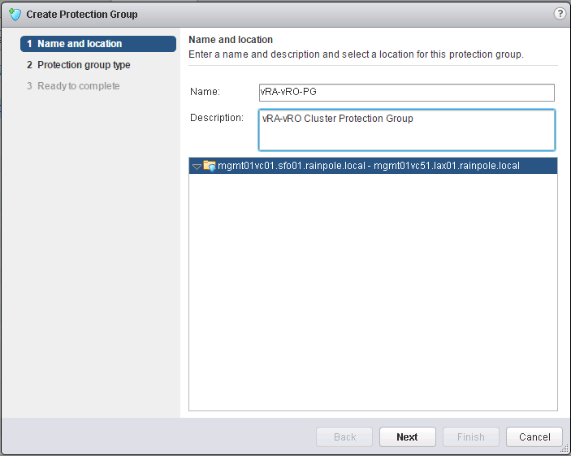

1.  On the **Protection group type** page, configure the following settings and click **Next**.

| Protection Setting          | Value                                                                 |
|-----------------------------|-----------------------------------------------------------------------|
| **Direction of protection** | mgmt01vc01.sfo01.rainpole.local -&gt; mgmt01vc51.lax01.rainpole.local |
| **Protection group type**   | Individual VMs                                                        |

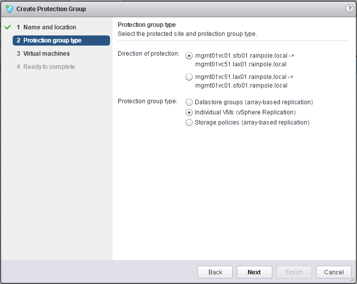

1.  On the **Virtual machines** page, select the virtual machines of vRealize Automation and vRealize Orchestrator from the list of machines replicated by using vSphere Replication and click **Next**.

| VM Name                     |
|-----------------------------|
| vra01ims01a.rainpole.local  |
| vra01ims01b.rainpole.local  |
| vra01iws01a.rainpole.local  |
| vra01iws01b.rainpole.local  |
| vra01mssql01.rainpole.local |
| vra01svr01a.rainpole.local  |
| vra01svr01b.rainpole.local  |
| vra01dem01.rainpole.local   |
| vra01dem02.rainpole.local   |
| vra01ids01a.rainpole.local  |
| vra01vro01a.rainpole.local  |
| vra01vro01b.rainpole.local  |

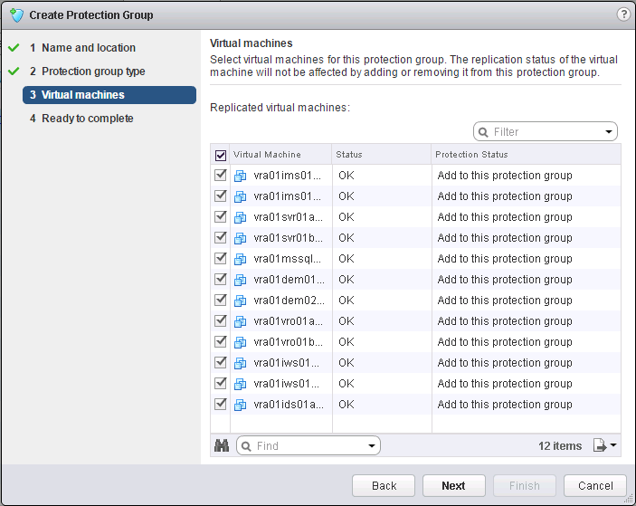

1.  On the **Ready to complete** page, review the protection group settings and click **Finish**.

    The vRA-vRO-PG protection group appears in the list of protection groups for Site Recovery Manager.

> 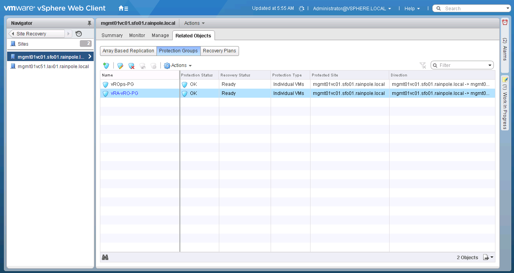

#### Create a Recovery Plan for vRealize Automation and vRealize Orchestrator

After you create a protection group for the virtual machines of vRealize Automation and vRealize Orchestrator, create a recovery plan. You use this plan to run commands on Site Recovery Manager, and configure dependencies between the virtual machines.

Procedure

1.  Log in to the Management vCenter Server in Region A by using the vSphere Web Client.

    1.  In a browser, go to **https://mgmt01vc01.sfo01.rainpole.local/vsphere-client**.

    2.  Use the following credentials to log in.

| Setting       | Value                       |
|---------------|-----------------------------|
| **User name** | administrator@vsphere.local |
| **Password**  | vsphere\_admin\_password    |

1.  From the **Home** menu of the vSphere Web Client, select **Site Recovery.**

2.  On the Site Recovery **Home** page, click **Sites** and select **mgmt01vc01.sfo01.rainpole.local**.

3.  On the **Related Objects** tab, click the **Recovery Plans** tab and click the **Create Recovery Plan** icon.

4.  On the **Name and location** page, configure the following settings and click **Next**.

| Property        | Value                                                             |
|-----------------|-------------------------------------------------------------------|
| **Name**        | vRA-vRO-RP                                                        |
| **Description** | Recovery Plan for vRA-vRO                                         |
| **Site pair**   | mgmt01vc01.sfo01.rainpole.local - mgmt01vc51.lax01.rainpole.local |

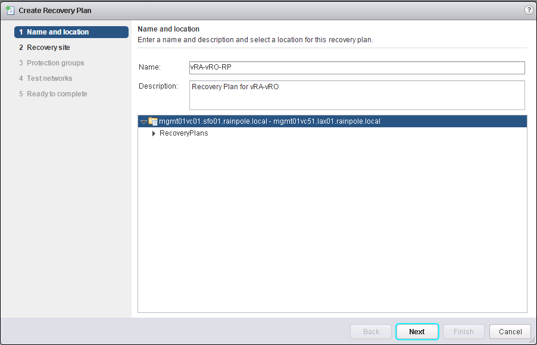

1.  On the **Recovery Site** page, select **mgmt01vc51.lax01.rainpole.local** in the **Recovery Site** pane and click **Next**.

> 

1.  On the **Protection group** page, select the protection group for the recovery plan and click **Next**.

| Protection Group Option | Value                |
|-------------------------|----------------------|
| **Group type**          | VM protection groups |
| **Protection group**    | vRA-vRO-PG           |

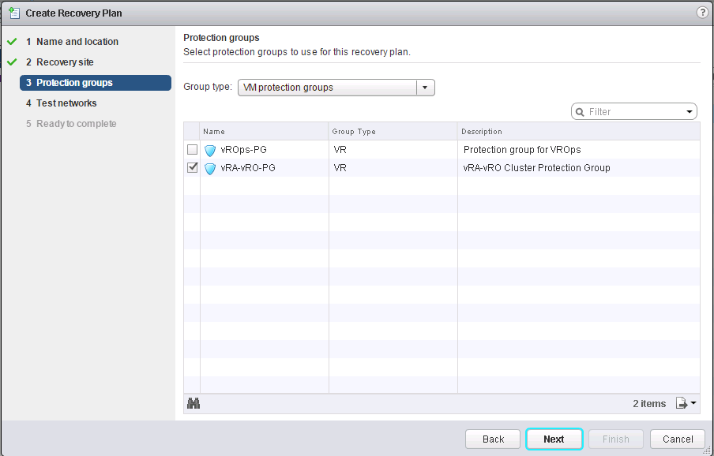

1.  On the **Test networks** page, select the distributed port group on the **vDS-Mgmt** distributed switch in Region B that ends with **vRA01-VXLAN** and click **Next**.

    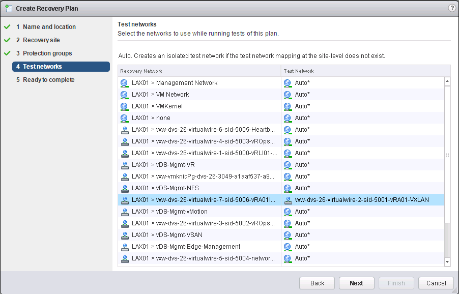

2.  On the **Ready to complete** page, click **Finish**.

    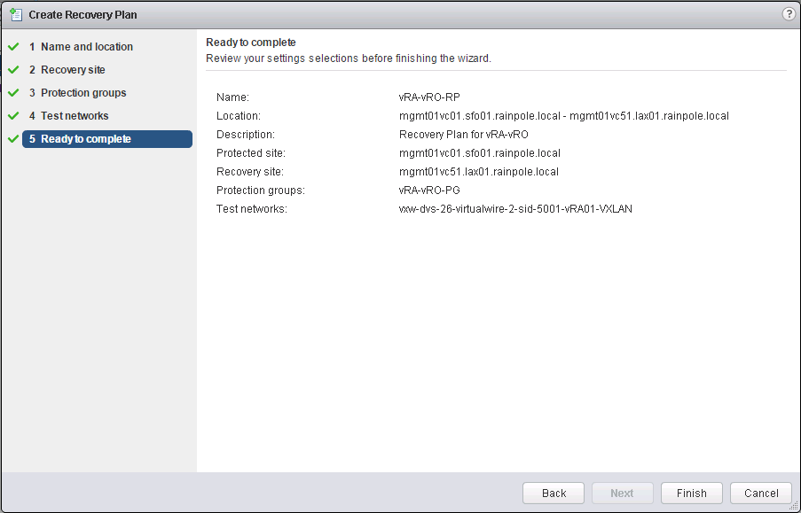

The vRA-vRO-RP recovery plan appears in the list of the recovery plans available in Site Recovery Manager.

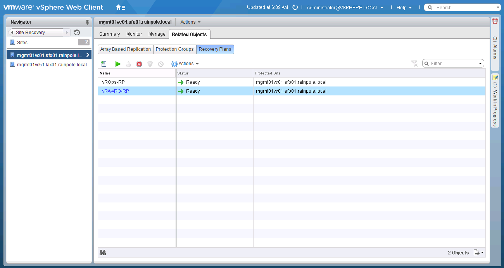

#### Customize the Recovery Plan of vRealize Automation and vRealize Orchestrator

After you create the recovery plan for the vRealize Automation and vRealize Orchestrator failover, configure the correct startup priority for the virtual machines of these management applications.

1.  Log in to the Management vCenter Server by using the vSphere Web Client.

    1.  In a Web browser, go to **https://mgmt01vc01.sfo01.rainpole.local/vsphere-client**.

    2.  Use the following credentials to log in.

| Setting       | Value                       |
|---------------|-----------------------------|
| **User name** | administrator@vsphere.local |
| **Password**  | vsphere\_admin\_password    |

1.  From the **Home** menu, select **Site Recovery.**

2.  On the Site Recovery **Home** page, click **Sites** and select the **mgmt01vc01.sfo01.rainpole.local** protected site.

3.  On the **Related Objects** tab, click the **Recovery Plans** tab and click **vRA-vRO-RP** recovery plan to open it.

    

4.  On the **Recovery Plan** page, click the **Monitor** tab and expand **Power** on priority 3 VMs.

5.  Right-click **vra01ids01a.rainpole.local** and select **All Priority Actions** &gt; **Priority 1**.

    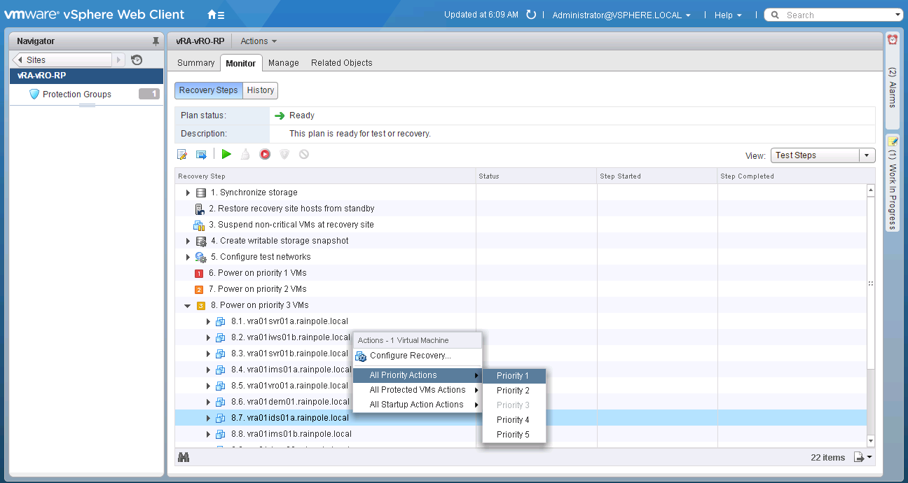

6.  Click **Yes** to change the priority in the **Change Priority** dialog box.

7.  Repeat Step 6 and Step 7 to configure the priorities of the following VMs.

| VM Name                     | Priority |
|-----------------------------|----------|
| vra01mssql01.rainpole.local | 1        |
| vra01svr01a.rainpole.local  | 2        |
| vra01svr01b.rainpole.local  | 2        |
| vra01vro01a.rainpole.local  | 2        |
| vra01vro01b.rainpole.local  | 2        |
| vra01iws01a.rainpole.local  | 3        |
| vra01iws01b.rainpole.local  | 3        |
| vra01ims01a.rainpole.local  | 4        |
| vra01ims01b.rainpole.local  | 4        |
| vra01dem01.rainpole.local   | 5        |
| vra01dem02.rainpole.local   | 5        |

1.  Configure the VM dependencies.

2.  Right-click **vra01svr01b.rainpole.local** in the recovery plan and select **Configure Recovery**.

3.  In the **VM Recovery Properties** dialog box, expand the **VM Dependencies** section and click **Configure**.

4.  Select **vra01svr01a.rainpole.local** and click **OK**.

5.  In the **VM Recovery Properties** dialog box, click **OK**.

    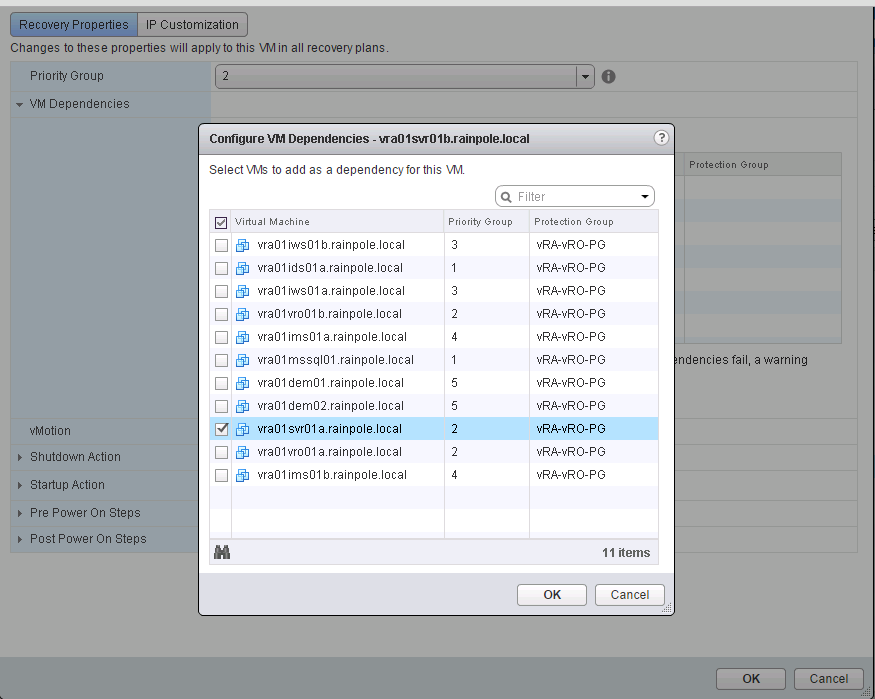

6.  Repeat the steps to configure the VM dependencies for the following VMs.

| VM Name                    | Priority | VM Dependencies                       |
|----------------------------|----------|---------------------------------------|
| vra01svr01b.rainpole.local | 2        | Depends on vra01svr01a.rainpole.local |
| vra01vro01a.rainpole.local | 2        | Depends on vra01svr01b.rainpole.local |
| vra01vro01b.rainpole.local | 2        | Depends on vra01svr01b.rainpole.local |
| vra01iws01b.rainpole.local | 3        | Depends on vra01iws01a.rainpole.local |
| vra01ims01b.rainpole.local | 4        | Depends on vra01ims01a.rainpole.local |

1.  Configure additional startup delay for the second IaaS Web Server instance and the IaaS Manager Service.

    1.  Right-click **vra01iws01b.rainpole.local** and select **Configure Recovery**.

    2.  Expand the **Startup Action** section, under **Additional Delay** set **Delay** to 5 minutes and click **OK**.

        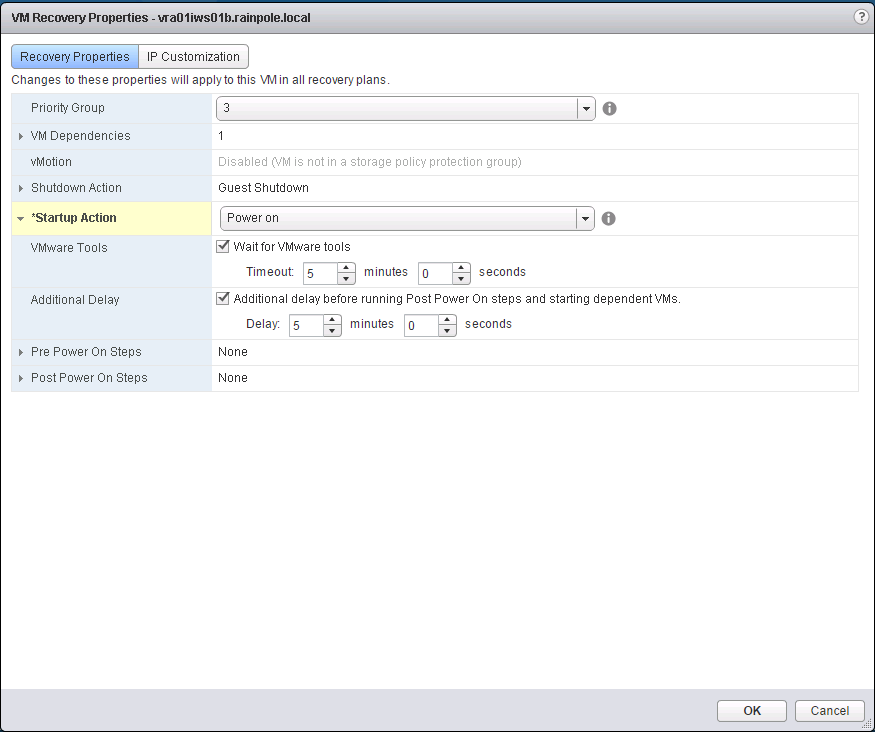

    3.  Repeat the steps to configure additional delay of 5 minutes for the **vra01ims01b.rainpole.local** VM.

2.  Add a prompt to wait for configuring the environment so as to retain the access to the cloud management platform.

    You must update the DNS record for the vRealize Automation FQDNs, make the 192.168.11.0/24 subnet in Region B the local network, and enable route redistribution in Region B. For information about performing the required configuration steps during failover, see the following documentation.

-   Update the DNS Entries for vRealize Automation

-   Modify IPsec VPN Settings for vRealize Automation

-   Swap OSPF Redistribution Flag for vRealize Automation

    1.  Right-click 6. Power on Priority 1 VMs and select **Add Step Before**.

        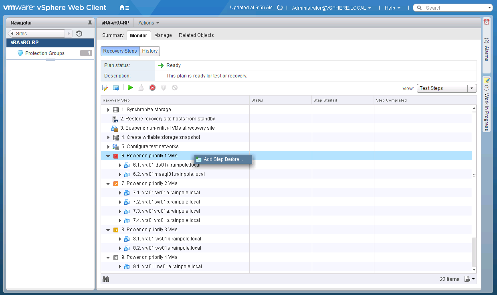

    2.  In the **Add Recovery Plan Step Before** dialog box, configure the following values, and click **OK**

| Option      | Value                                                                      |
|-------------|----------------------------------------------------------------------------|
| **Type**    | Prompt                                                                     |
| **Name**    | Enter a meaningful name for what kind of operations to carry out           
               Ex: Update DNS entries, Modify IPsec VPN, Enable/Disable OSPF flag for vRA  |
| **Content** | Please perform the following operations for vRA:                           

               1.  Update DNS entries                                                      

               <!-- -->                                                                    

               1.  Modify IPsec VPN settings                                               

               2.  Enable/Disable OPF redistribution flag                                  

               Once done, please Dismiss this dialog to continue...                        |
| **Timeout** | NA                                                                         |

### Test the Failover of Management Applications

Test the recovery plan for the management applications in the SDDC to eliminate potential problems during a future failover.

-   Test the Failover of vRealize Operations Manager

-   Test the Failover of vRealize Automation and vRealize Orchestrator

    1.  #### Test the Failover of vRealize Operations Manager

Test the recovery plan for vRealize Operations Manager to eliminate potential problems during a future failover.

Site Recovery Manager runs the analytics virtual machines on the vRealize Operations Manager logical network and on a temporary snapshot of replicated data in Region B.

1.  Log in to the Management vCenter Server by using the vSphere Web Client.

    1.  In a browser, go to **https://mgmt01vc01.sfo01.rainpole.local/vsphere-client**.

    2.  Use the following credentials to log in.

| Setting       | Value                       |
|---------------|-----------------------------|
| **User name** | administrator@vsphere.local |
| **Password**  | vsphere\_admin\_password    |

1.  From the **Home** menu, select **Site Recovery.**

2.  On the **Site Recovery Home** page, click **Sites** and double-click the **mgmt01vc01.sfo01.rainpole.local** protected site.

3.  If the **Log In Site** dialog box appears, enter the **administrator@vsphere.local** user name and **vsphere\_admin\_password** password.

4.  Click the **Recovery Plans** and click the **vROps-RP** recovery plan.

5.  On the **vROps-RP** page, click the **Monitor** tab and click **Recovery Steps**.

6.  Click the **Test Recovery Plan** icon to run through a test recovery.

    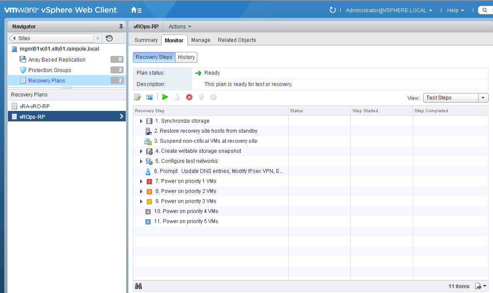

7.  In the **Confirmation options** page of the **Test** wizard, leave the **Replicate recent changes to recovery site** check box selected and click **Next**.

    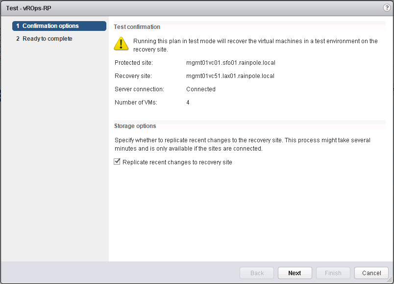

8.  On the **Ready to complete** page, click **Finish** to start the test recovery.

    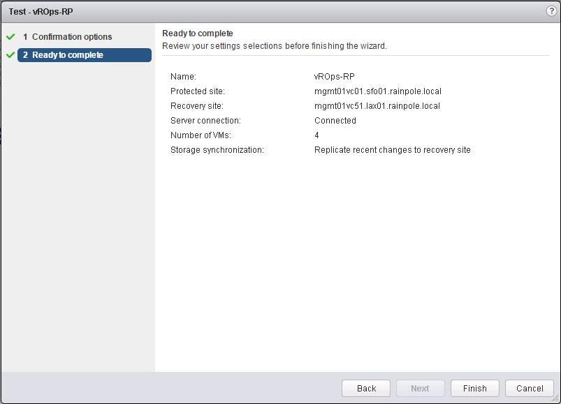

    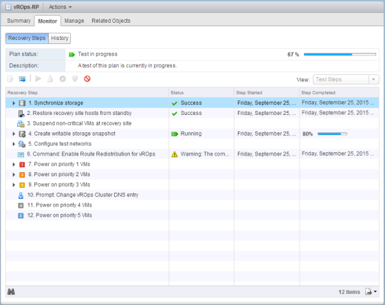

9.  After the test recovery is complete, click the **Cleanup** icon to clean up all the created test VMs.

    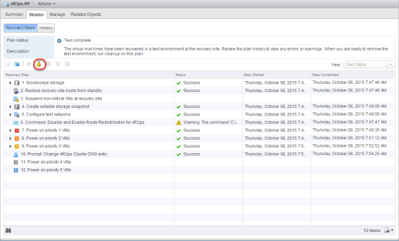

10. On the **Confirmation options** page of the cleanup wizard, click **Next**.

    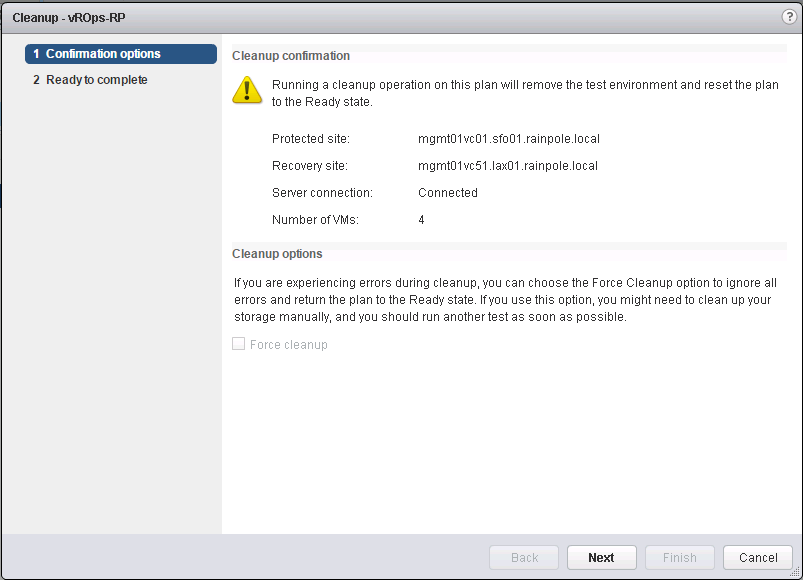

11. On the **Ready to complete** page, click **Finish** to start the clean-up process.

    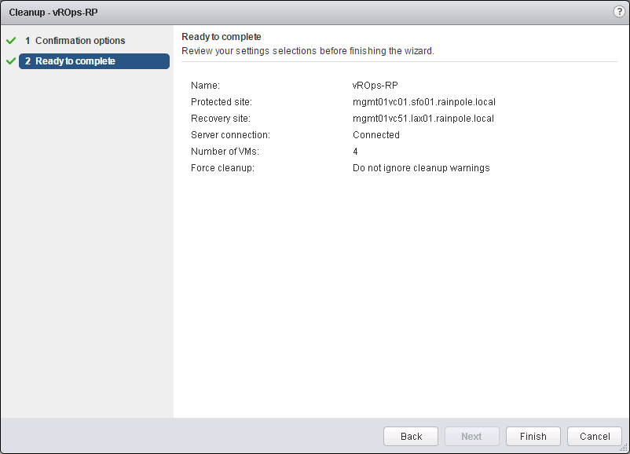

    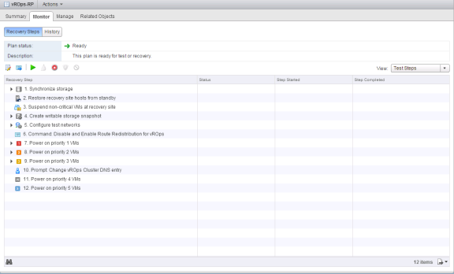

    1.  #### Test the Failover of vRealize Automation and vRealize Orchestrator

Test the recovery plan for vRealize Automation and vRealize Orchestrator to eliminate potential problems during a future failover.

Site Recovery Manager runs the virtual machines on the vRealize Automation logical network and on a temporary snapshot of replicated data in Region B.

**Procedure**

1.  Log in to the Management vCenter Server by using the vSphere Web Client.

    1.  In a browser, go to **https://mgmt01vc01.sfo01.rainpole.local/vsphere-client**.

    2.  Use the following credentials to log in.

| Setting       | Value                       |
|---------------|-----------------------------|
| **User name** | administrator@vsphere.local |
| **Password**  | vsphere\_admin\_password    |

1.  From the **Home** menu, select **Site Recovery.**

2.  On the Site Recovery **Home** page, click **Sites** and select the **mgmt01vc01.sfo01.rainpole.local** protected site.

3.  If the **Log In Site** dialog box appears, enter the **administrator@vsphere.local** user name and **vsphere\_admin\_password** password.

4.  Click the **Recovery Plans** and click the **vRA-vRO-RP** recovery plan.

5.  On the **vRA-vRO-RP** page, click the **Monitor** tab and click **Recovery Steps**.

6.  Click the **Test Recovery Plan** icon to run through a test recovery.

    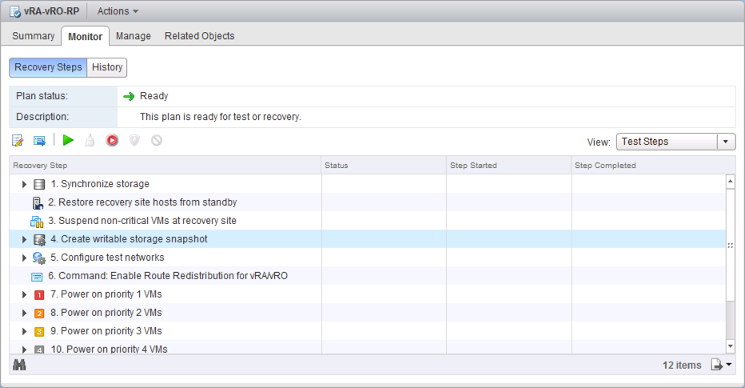

7.  In the **Confirmation options** page of the **Test** wizard, leave the **Replicate recent changes to recovery site** check box selected and click **Next**.

    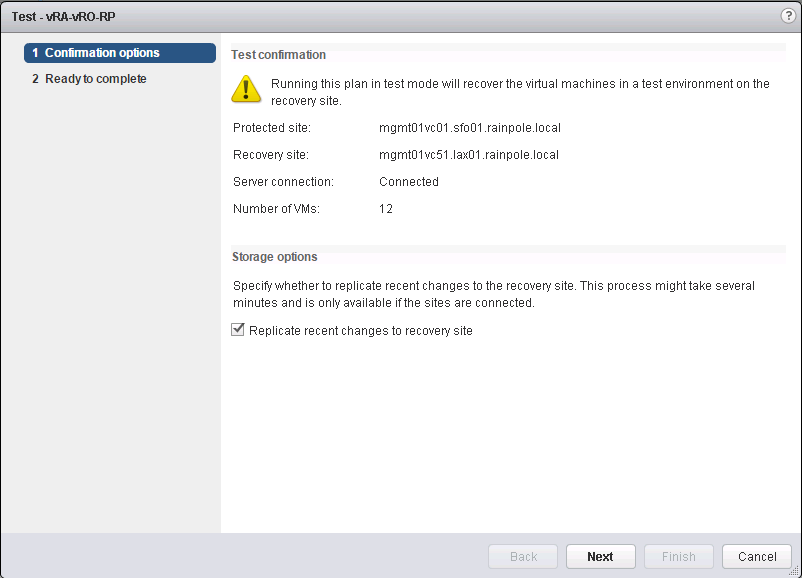

8.  On the **Ready to complete** page, click **Finish** to start the test recovery.

    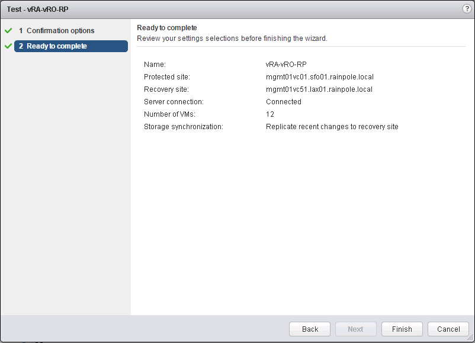

    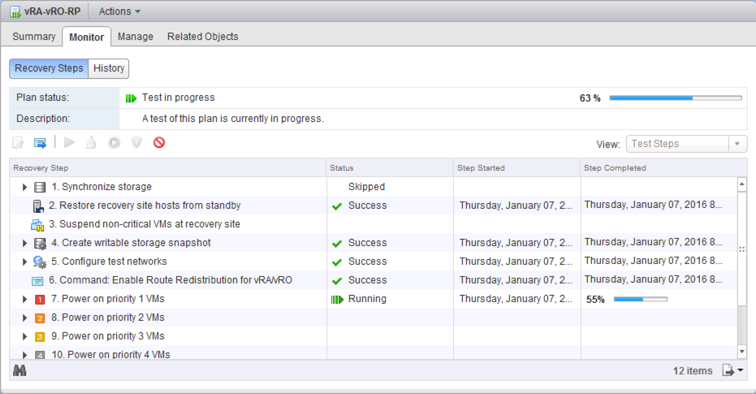

9.  After the test recovery is complete, click the **Cleanup** icon to clean up all the created test VMs.

    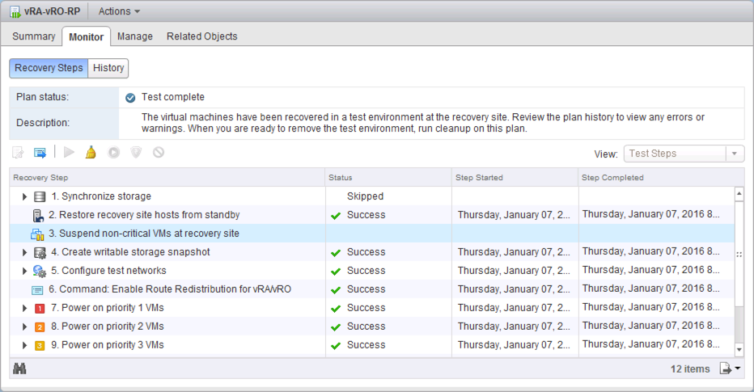

10. On the **Confirmation options** page of the **Cleanup** wizard, click **Next**.

    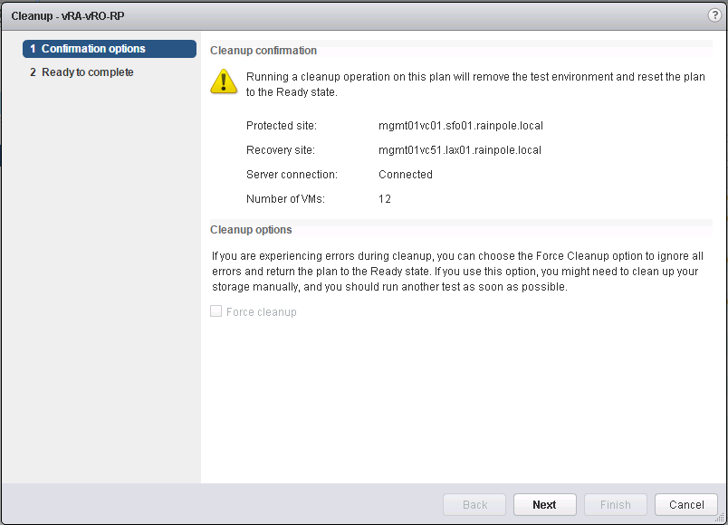

11. On the **Ready to complete** page, click **Finish** to start the clean-up process.

    

    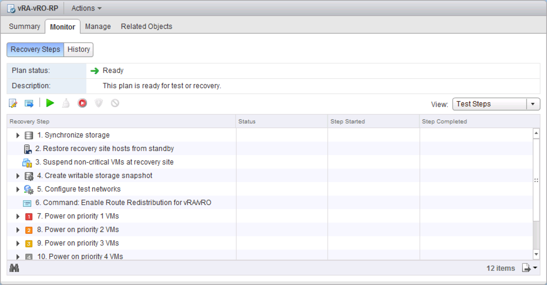

    1.  ### Perform Disaster Recovery or Planned Migration of Management Applications

Perform failover of the management applications to Region B if Region A becomes unavailable in the event of a disaster or if you plan a graceful migration.

-   Networking Configuration Requirements During Failover

-   Perform Disaster Recovery or Planned Migration of vRealize Operations Manager

-   Perform Disaster Recovery or Planned Migration of vRealize Automation and vRealize Orchestrator

    1.  #### N**et**working Configuration Requirements During Failover

Before and during failover, you must verify that certain networking configuration is available, and modify certain settings on the NSX Edge instances for vRealize Operations Manager and for vRealize Automation and vRealize Orchestrator.

Table . Networking Configuration Tasks During Failover

| Configuration in Region B    | Description                                                                                                                                                                                                                                                                                                 |
|------------------------------|-------------------------------------------------------------------------------------------------------------------------------------------------------------------------------------------------------------------------------------------------------------------------------------------------------------|
| Edge deployment              | For each management application, that is, for vRealize Operations and for vRealize Automation, provide an application virtual network that is a duplicate of the network container in the protected region, Region A.                                                                                       

                                Configure the internal network as the failover network for the application in Site Recovery Manager.                                                                                                                                                                                                         |
| IP subnets                   | Configure the address in the following networks                                                                                                                                                                                                                                                             

                                **networkExchange.** 192.168.1.21 for vRealize Operations Manager and 192.168.1.11 for vRealize Automation                                                                                                                                                                                                   

                                **External management network.** 10.158.150.14 for vRealize Operations Manager and 10.158.150.13 for vRealize Automation                                                                                                                                                                                     

                                **VIP of the analytics cluster.** 10.158.150.48 for vRealize Operations Manager, and 10.158.150.52, 10.158.150.53, 10.158.150.54 and 10.158.150.55 for vRealize Automation                                                                                                                                   

                                **Internal network.** 192.168.21.1 for vRealize Operations Manager and 192.168.11.1 for vRealize Automation                                                                                                                                                                                                  

                                See *Deploy NSX Edges for the Management Application Networks (Region B)*.                                                                                                                                                                                                                                   |
| Source NAT and load balancer | Verify that the Source NAT rules and the load balancer are enabled. See *Configure NAT to Provide Public Access (Region B)*, *Configure Load Balancer for vRealize Operations Manager in Region B* and *Configure Load Balancing for vRealize Automation and vRealize Orchestrator in Region B (Region B)*. |
| Dynamic routing and VPN      | On each application NSX Edge, configure the following settings:                                                                                                                                                                                                                                             

                                Enable dynamic routing and verify that the edge is exchanging routing information with the peer NSX Edge instances. See *Configure OSPF Routing on the Management Application Edges (Region B)*.                                                                                                             

                                Enable route redistribution so that the edge starts providing access to its connected application network. See *Swap OSPF Redistribution Flag for vRealize Operations Manager* and *Swap OSPF Redistribution Flag for vRealize Automation*.                                                                  

                                In the VPN configuration of the management edge, move the internal IP subnet of each management application from the peer to the local networks. See *Modify IPsec VPN Settings for vRealize Operations Manager* and *Modify IPsec VPN Settings for vRealize Automation*.                                    |
| DNS records                  | Modify the DNS record for the public address of the management application so that the application's UI is accessible on Region B. See *Update the DNS Entry for vRealize Operations Manager* and *Update the DNS Entries for vRealize Automation*.                                                         |

#### Perform Disaster Recovery or Planned Migration of vRealize Operations Manager

Prepare networking in Region B and perform failover of vRealize Operations Manager to Region B if Region A becomes unavailable in the event of a disaster or if you plan a graceful migration.

-   Initiate Disaster Recovery of vRealize Operations Manager

-   Initiate Planned Migration of vRealize Operations Manager

-   Update the DNS Entry for vRealize Operations Manager

-   Modify IPsec VPN Settings for vRealize Operations Manager

-   Swap OSPF Redistribution Flag for vRealize Operations Manager

Initiate Disaster Recovery of vRealize Operations Manager

If a disaster recovery event occurs in Region A, initiate the recovery plan of vRealize Operations Manager from Region B to fail vRealize Operations Manager over to Region B.

Procedure

1.  Log in to the Management vCenter Server in Region B by using the vSphere Web Client.

    1.  In a browser, go to **https://mgmt01vc51.lax01.rainpole.local/vsphere-client**.

    2.  Use the following credentials to log in.

| Setting       | Value                       |
|---------------|-----------------------------|
| **User name** | administrator@vsphere.local |
| **Password**  | vsphere\_admin\_password    |

1.  From the **Home** menu, select **Site Recovery.**

2.  On the **Site Recovery Home** page, click **Sites** and double-click the **mgmt01vc51.lax01.rainpole.local** vCenter Server object to open its configuration in Site Recovery Manager.

3.  Click the **Recovery Plans** and click the **vROps-RP** recovery plan.

4.  On the **vROps-RP** page, click the **Monitor** tab and click **Recovery Steps.**

5.  Click the **Run Recovery Plan** icon to run the recovery plan and initiate the failover of the cloud management platform.

    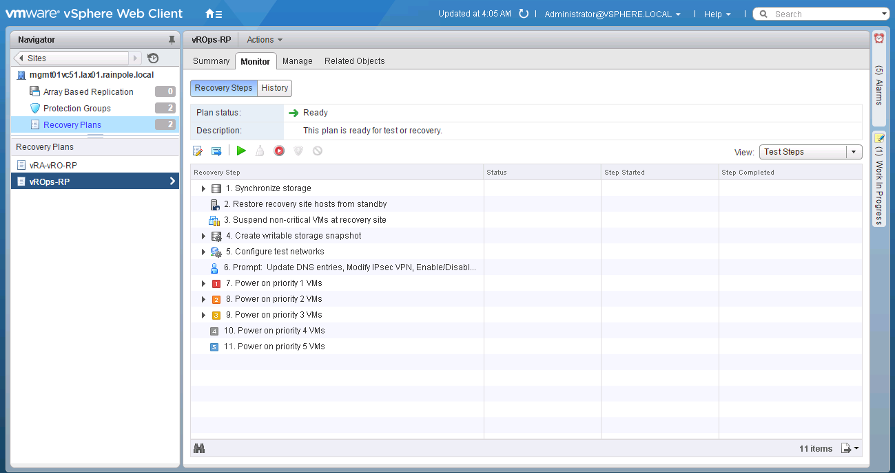

6.  On the **Confirmation options** page of the **Recovery** wizard, configure the following settings and click **Next**.

| Confirmation Option                                                                                                                          | Value             |
|----------------------------------------------------------------------------------------------------------------------------------------------|-------------------|
| I understand that this process will permanently alter the virtual machines and infrastructure of both the protected and recovery datacenters | Selected          |
| Recovery type                                                                                                                                | Disaster recovery |

1.  On the **Ready to complete** page, click **Finish** to initiate vRealize Operations Manager failover.

    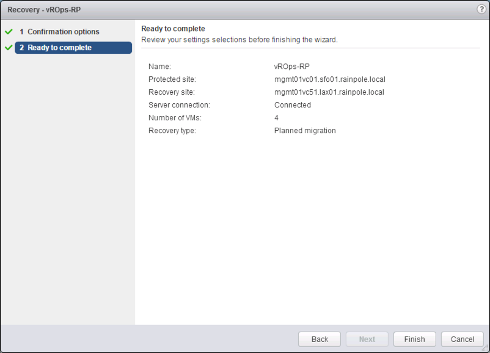

2.  When Site Recovery Manager displays the prompt to configure DNS, IPsec VPN and the OSPF flag, perform the required configuration and click **Dismiss**.

Site Recovery Manager proceeds with running the recovery plan.

Site Recovery Manager displays this message when it reaches the step from the recovery plan to power on the master appliance of the analytics cluster.

For information about performing the required configuration steps during failover, see the following documentation.

-   *Update the DNS Entry for vRealize Operations Manager*

-   *Modify IPsec VPN Settings for vRealize Operations Manager*

-   *Swap OSPF Redistribution Flag for vRealize Operations Manager*

1.  After disaster recovery, the status of the recovery plan is **Disaster Recovery Completed.** After Region A is repaired, Site Recovery Manager detects the availability of the region and changes the Recovery Plan status to **Recovery Required.** Re-run the recovery plan again in the **Recovery Required** state so that Site Recovery Manager can perform actions on the original region, which is not possible during disaster recovery.

Initiate Planned Migration of vRealize Operations Manager

You can run a recovery plan under planned circumstances to migrate the virtual machines of the analytics cluster of vRealize Operations Manager from Region A to Region B. You can also run a recovery plan under unplanned circumstances if Region A suffers an unforeseen event that might result in data loss.

Procedure

1.  Log in to the Management vCenter Server in Region A by using the vSphere Web Client.

    1.  In a browser, go to **https://mgmt01vc01.sfo01.rainpole.local/vsphere-client**.

    2.  Use the following credentials to log in.

| Setting       | Value                       |
|---------------|-----------------------------|
| **User name** | administrator@vsphere.local |
| **Password**  | vsphere\_admin\_password    |

1.  From the **Home** menu, select **Site Recovery.**

2.  On the Site Recovery **Home** page, click **Sites** and double-click the **mgmt01vc51.lax01.rainpole.local** vCenter Server object to open its configuration in Site Recovery Manager.

3.  Click the **Recovery Plans** and click the **vROps-RP** recovery plan.

4.  On the **vROps-RP** page, click the **Monitor** tab and click **Recovery Steps.**

5.  Click the **Run Recovery Plan** icon to run the recovery plan and initiate the failover of the analytics cluster.

    

6.  On the **Confirmation options** page of the **Recovery** wizard, configure the following settings and click **Next**.

| Confirmation Option                                                                                                                          | Value             |
|----------------------------------------------------------------------------------------------------------------------------------------------|-------------------|
| I understand that this process will permanently alter the virtual machines and infrastructure of both the protected and recovery datacenters | Selected          |
| Recovery type                                                                                                                                | Planned Migration |

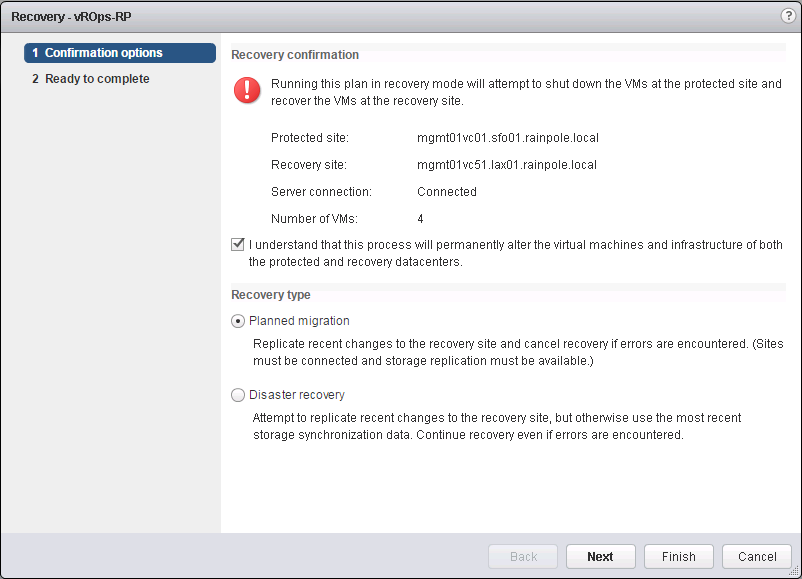

1.  On the **Ready to complete** page, click **Finish** to initiate vRealize Operations Manager failover.

    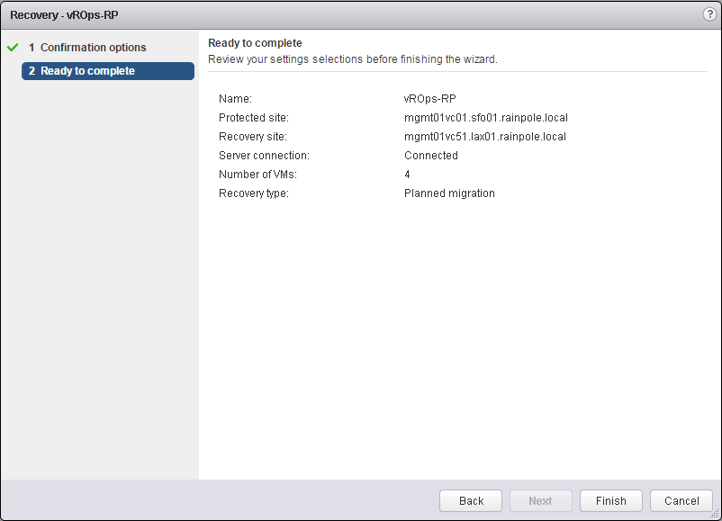

2.  When Site Recovery Manager displays the prompt to configure DNS, IPsec VPN and the OSPF flag, perform the required configuration and click **Dismiss**.

Site Recovery Manager proceeds with running the recovery plan.

Site Recovery Manager displays this message when it reaches the step from the recovery plan to power on the master appliance of the analytics cluster.

For information about performing the required configuration steps during failover, see the following documentation.

-   *Update the DNS Entry for vRealize Operations Manager*

-   *Modify IPsec VPN Settings for vRealize Operations Manager*

-   *Swap OSPF Redistribution Flag for vRealize Operations Manager*

Update the DNS Entry for vRealize Operations Manager

While you fail over vRealize Operations Manager to Region B, modify the DNS A record for the public FQDN of vRealize Operations Manager, vrops-cluster-01.rainpole.local, to map to IP address 10.158.150.48 in Region B.

Procedure

1.  Log in to DNS server dc01lax.lax01.rainpole.local that resides in the lax01.rainpole.local domain.

<!-- -->

1.  Open the Windows **Start** menu, enter **dns** in the **Search** text box and press **Enter**.

    The **DNS Manager** dialog box appears.

    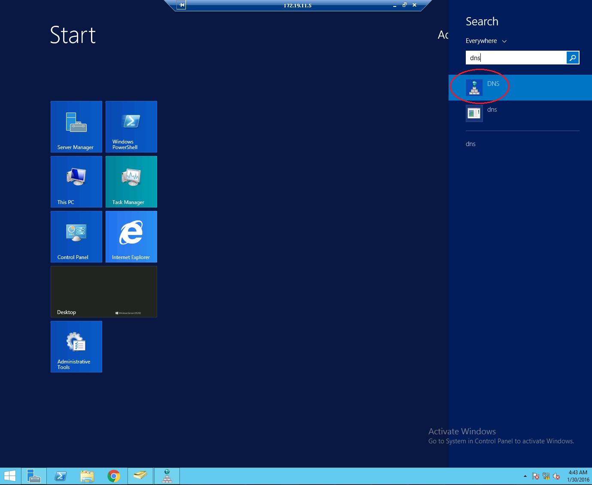

2.  In the **DNS Manager** dialog box, under **Forward Lookup Zones**, select the **rainpole.local** domain and locate the **vrops-cluster-01** record on the right.

    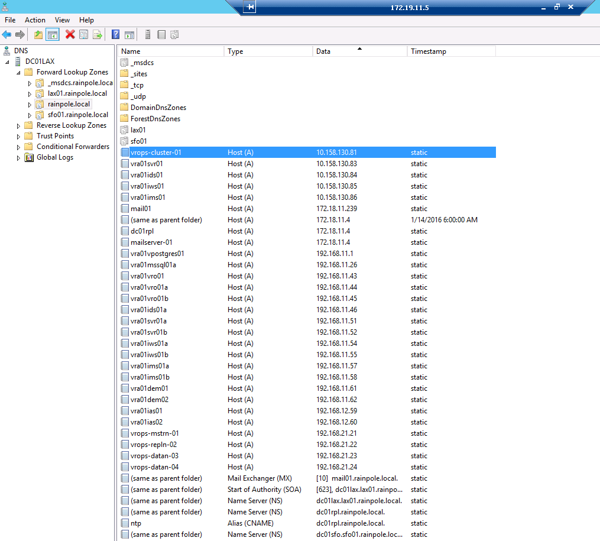

3.  Double-click the **vrops-cluster-01** record, change the IP address of the record from 10.158.130.48 to 10.158.150.48 and click **OK**.

| vrops-cluster-01 Properties                 | Value                           |
|---------------------------------------------|---------------------------------|
| **Fully qualified domain name (FQDN)**      | vrops-cluster-01.rainpole.local |
| **IP Address**                              | 10.158.150.48                   |
| **Update associated pointer (PTR) record ** | Selected                        |

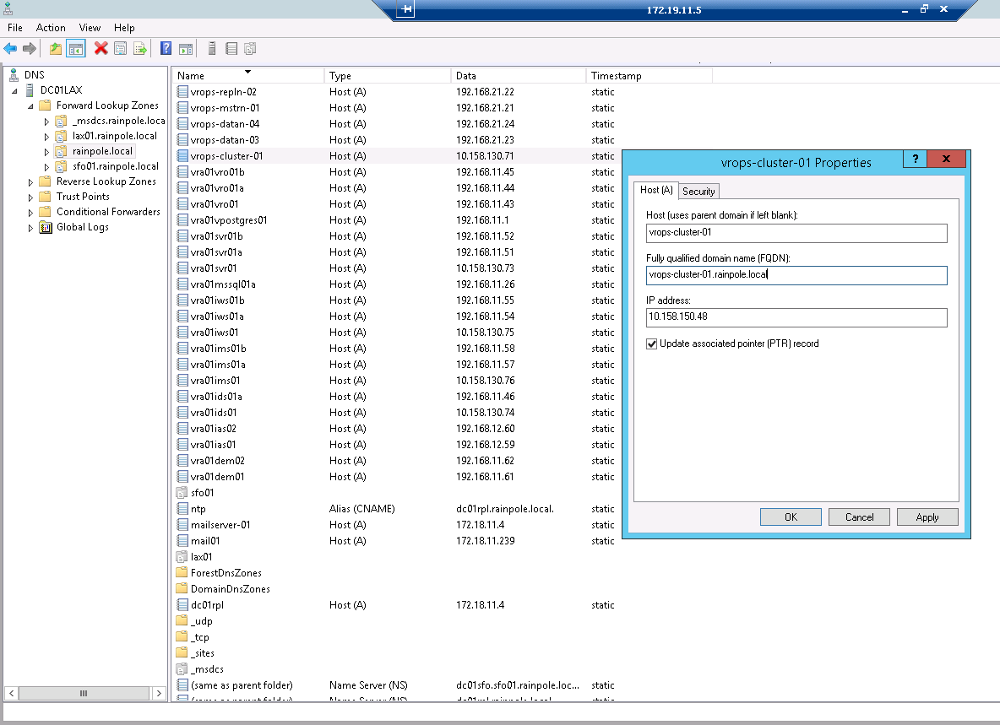

Modify IPsec VPN Settings for vRealize Operations Manager

Ensure that the services of vRealize Operations are accessible after the failover, during the failover enable dynamic routing on the NSX Edge for the analytics cluster of vRealize Operations Manager. Verify that the NSX Edge is exchanging routing information with the peer NSX Edge instances and with the MgmtLAX01-Edge NSX Edge that handles site-to-site VPN.

You perform the changes in Region A in the case of planned migration and in the case of disaster recovery when you rebuild Region A.

Procedure

1.  Log in to the Management vCenter Server in Region A by using the vSphere Web Client.

    1.  In a browser, go to **https://mgmt01vc01.sfo01.rainpole.local/vsphere-client**.

    2.  Use the following credentials to log in.

| Setting       | Value                       |
|---------------|-----------------------------|
| **User name** | administrator@vsphere.local |
| **Password**  | vsphere\_admin\_password    |

1.  From the **Home** menu of the vSphere Web Client, select **Networking & Security**.

    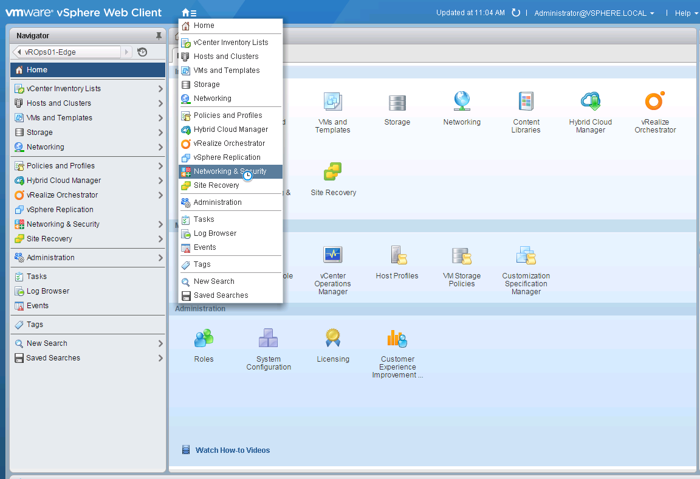

2.  Click **NSX Edges** and select **172.16.11.65** from the **NSX Manager** drop-down menu at the top of the **NSX Edges** page.

    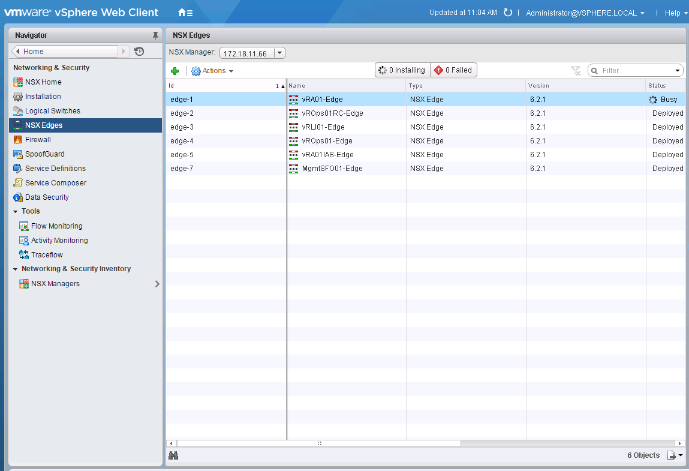

3.  Double-click the **MgmtSFO01-Edge** NSX Edge to open the page for its configuration.

    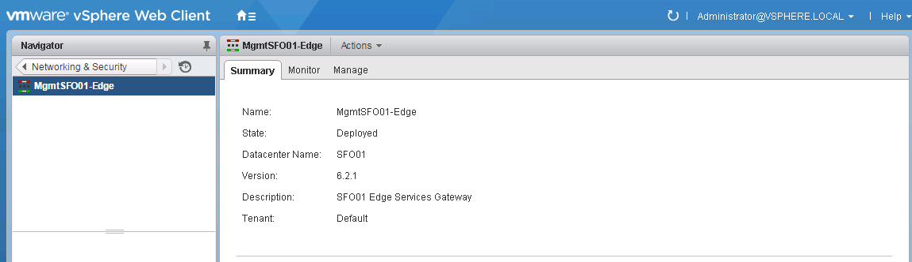

4.  On the **Manage** tab, click **VPN** and click **IPsec VPN**.

    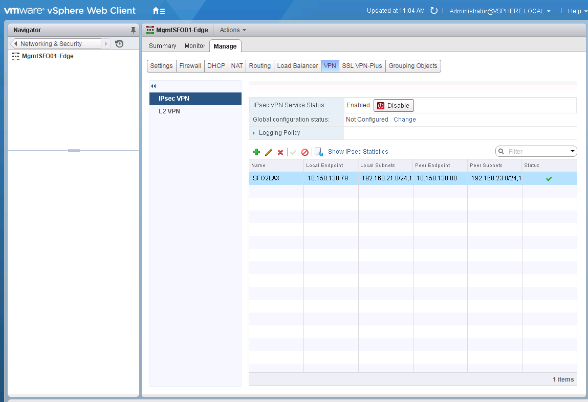

5.  Select **SFO2LAX** VPN entry in the list, click the **Edit** button.

    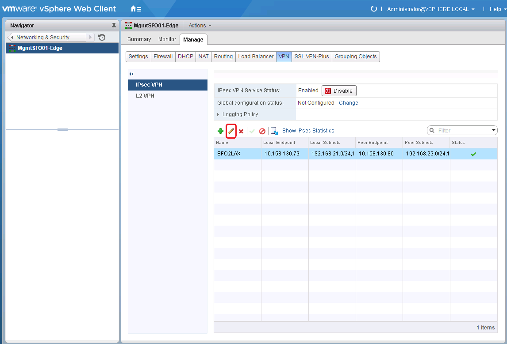

6.  In the **Local Subnets** text box, cut the analytics IP subnet **192.168.21.0/24**.

    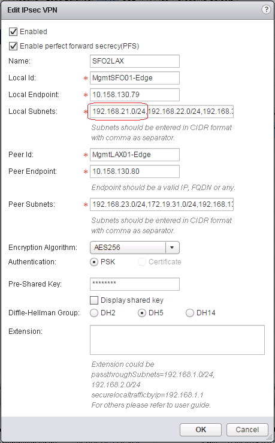

7.  Paste the **192.168.21.0/24** subnet into the **Peer Subnets** text box and click **OK**.

    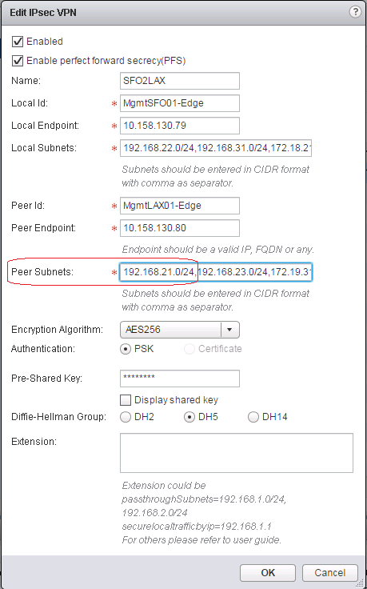

8.  On the **VPN** page, click **Publish Changes** next to **IPsec VPN**.

    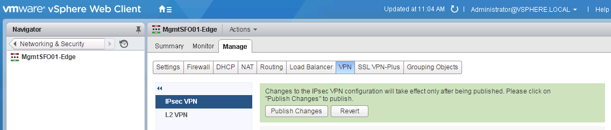

9.  Configure IPsec VPN in Region B.

    1.  In a Web browser, log in to https://mgmt01vc01.lax01.rainpole.local/vsphere-client.

    2.  From the **Home** menu of the vSphere Web Client, select **Networking & Security** and select **172.17.11.65** from the **NSX Manager** drop-down menu at the top of the **NSX Edges** page to switch to the NSX Manager for the management cluster in Region B.

    3.  Repeat Step 4 to Step 9 for the NSX Edge **MgmtLAX01-Edge** to open the IPsec VPN configuration and move 192.168.21.0/24 from **Peer Subnets** to **Local Subnets**.

Swap OSPF Redistribution Flag for vRealize Operations Manager

Enable route redistribution on the NSX Edge of the application virtual network for vRealize Operations Manager in Region B so that the edge starts sharing information about its connected networks with its peers and the site-to-site VPN NSX Edge MgmtLAX01-Edge. Disable route redistribution on the NSX Edge for vRealize Operations Manager in Region A.

You perform the changes in Region A in the case of planned migration and in the case of disaster recovery when you rebuild Region A.

Procedure

1.  Log in to the Management vCenter Server in Region A by using the vSphere Web Client

    1.  In a browser, go to **https://mgmt01vc01.sfo01.rainpole.local/vsphere-client**.

    2.  Use the following credentials to log in.

| Setting       | Value                       |
|---------------|-----------------------------|
| **User name** | administrator@vsphere.local |
| **Password**  | vsphere\_admin\_password    |

1.  From the **Home** menu of the vSphere Web Client, select **Networking & Security**.

    

2.  Click **NSX Edges** and select **172.16.11.65** from the **NSX Manager** drop-down menu at the top of the **NSX Edges** page.

    

3.  Double-click the **vROps01-Edge** NSX Edge to open the page for its configuration.

    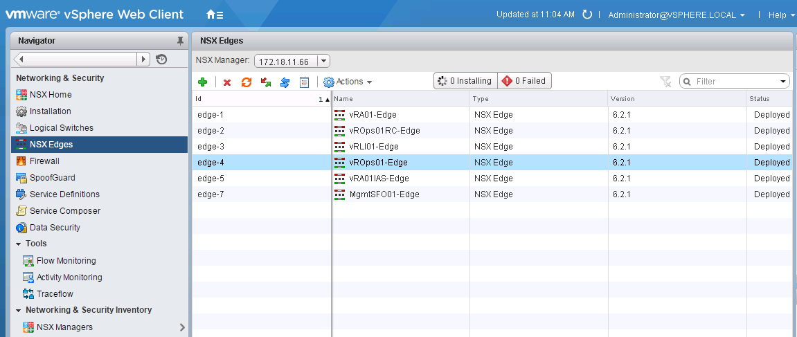

4.  On the **Manage** tab, click **Routing** and click **Route Redistribution**.

    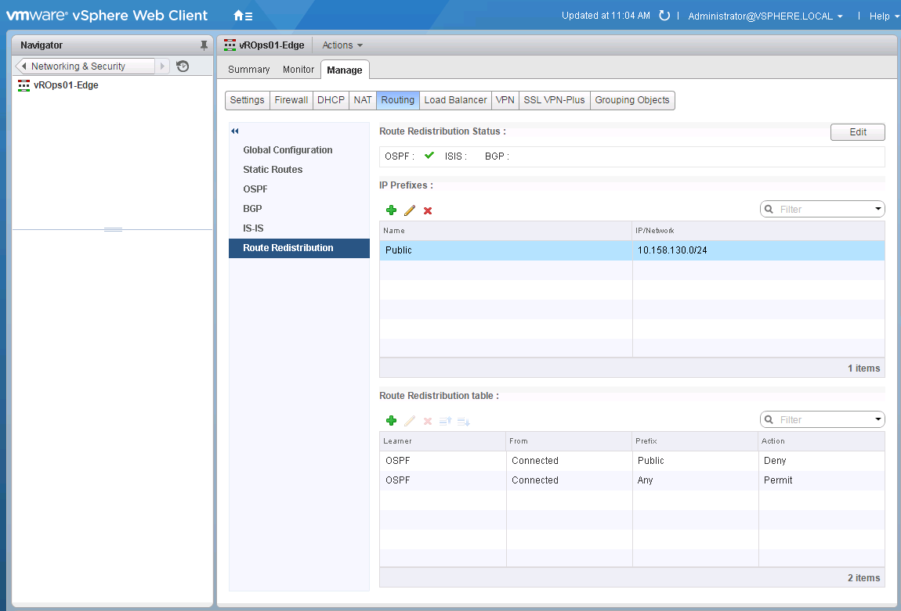

5.  Click **Edit** button on the right hand side to open **Change redistribution settings** dialog box.

    

6.  In **Change redistribution settings** dialog box**,** deselect **OSPF** to disable the redistribution flag and click **OK**.

    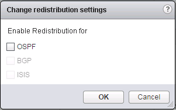

7.  On the **Routing** page, click **Publish Changes** next **Route Redistribution**.

    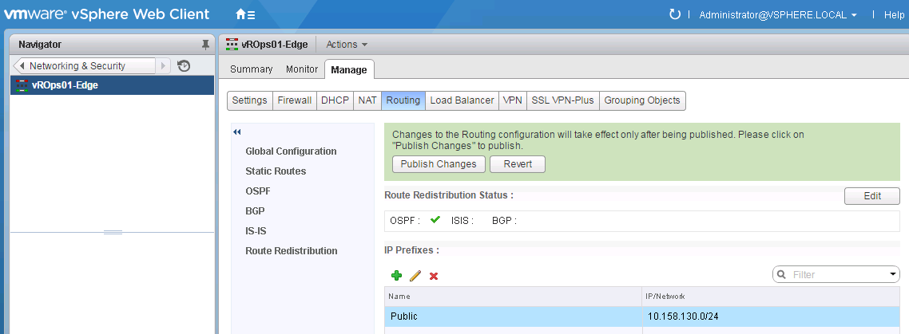

8.  Configure route redistribution in Region B.

    1.  In a Web browser, log in to https://mgmt01vc01.lax01.rainpole.local/vsphere-client.

    2.  From the **Home** menu of the vSphere Web Client, select **Networking & Security** and select **172.17.11.65** from the **NSX Manager** drop-down menu at the top of the **NSX Edges** page to switch to the NSX Manager for the management cluster in Region B.

    3.  Repeat Step 4 to Step 8 for the NSX Edge **vROps01-Edge** to open the **Change redistribution settings** dialog box and select the **OSPF** option to enable route redistribution in Region B.

        1.  #### Perform Disaster Recovery or Planned Migration of vRealize Automation and vRealize Orchestrator

Prepare networking in Region B and perform failover of Realize Automation and vRealize Orchestrator to Region B if Region A becomes unavailable in the event of a disaster or if you plan a graceful migration.

-   Initiate Disaster Recovery of vRealize Automation and vRealize Orchestrator

-   Initiate Planned Migration of vRealize Automation and vRealize Orchestrator

-   Update the DNS Entries for vRealize Automation

-   Modify IPsec VPN Settings for vRealize Automation

-   Swap OSPF Redistribution Flag for vRealize Automation

Initiate Disaster Recovery of vRealize Automation and vRealize Orchestrator

If a disaster recovery event occurs in Region A, initiate the recovery plan of vRealize Automation and vRealize Orchestrator from Region B to fail the cloud management platform over to Region B.

Procedure

1.  Log in to the Management vCenter Server in Region B by using the vSphere Web Client.

    1.  In a browser, go to **https://mgmt01vc51.lax01.rainpole.local/vsphere-client**.

    2.  Use the following credentials to log in.

| Setting       | Value                       |
|---------------|-----------------------------|
| **User name** | administrator@vsphere.local |
| **Password**  | vsphere\_admin\_password    |

1.  From the **Home** menu, select **Site Recovery.**

2.  On the **Site Recovery Home** page, click **Sites** and double-click the **mgmt01vc51.lax01.rainpole.local** vCenter Server object to open its configuration in Site Recovery Manager.

3.  Click the **Recovery Plans** and click the **vRA-vRO-RP** recovery plan.

4.  On the **vRA-vRO-RP** page, click the **Monitor** tab and click **Recovery Steps.**

5.  Click the **Run Recovery Plan** icon to run the recovery plan and initiate the failover of the cloud management platform.

6.  On the **Confirmation options** page of the **Recovery** wizard, configure the following settings and click **Next**.

| Confirmation Option                                                                                                                          | Value             |
|----------------------------------------------------------------------------------------------------------------------------------------------|-------------------|
| I understand that this process will permanently alter the virtual machines and infrastructure of both the protected and recovery datacenters | Selected          |
| Recovery type                                                                                                                                | Disaster recovery |

1.  On the **Ready to complete** page, click **Finish** to initiate the failover of vRealize Automation and vRealize Orchestrator.

2.  When Site Recovery Manager displays the prompt to configure DNS, IPsec VPN and the OSPF flag, perform the required configuration and click **Dismiss**.

Site Recovery Manager proceeds with running the recovery plan.

Site Recovery Manager displays this message when it reaches the step from the recovery plan to power on the first appliances of vRealize Automation.

For information about performing the required configuration steps during failover, see the following documentation.

-   *Update the DNS Entries for vRealize Automation*

-   *Modify IPsec VPN Settings for vRealize Automation*

-   *Swap OSPF Redistribution Flag for vRealize Automation*

1.  After disaster recovery, the status of the recovery plan is Disaster Recovery Completed. After Region A is repaired, Site Recovery Manager detects the availability of the region and changes the Recovery Plan status to Recovery Required. Re-run the recovery plan again in the Recovery Required state so that Site Recovery Manager can perform actions on the original region, which is not possible during disaster recovery.

Initiate Planned Migration of vRealize Automation and vRealize Orchestrator

You can run a recovery plan under planned circumstances to migrate the virtual machines of the vRealize Automation and vRealize Orchestrator from Region A to Region B. You can also run a recovery plan under unplanned circumstances if Region A suffers an unforeseen event that might result in data loss.

Procedure

1.  Log in to the Management vCenter Server in Region A by using the vSphere Web Client.

    1.  In a browser, go to **https://mgmt01vc01.sfo01.rainpole.local/vsphere-client**.

    2.  Use the following credentials to log in.

| Setting       | Value                       |
|---------------|-----------------------------|
| **User name** | administrator@vsphere.local |
| **Password**  | vsphere\_admin\_password    |

1.  From the **Home** menu, select **Site Recovery.**

2.  On the **Site Recovery Home** page, click **Sites** and double-click the **mgmt01vc51.lax01.rainpole.local** vCenter Server object to open its configuration in Site Recovery Manager.

3.  Click the **Recovery Plans** and click the **vRA-vRO-RP** recovery plan.

4.  On the **vRA-vRO-RP** page, click the **Monitor** tab and click **Recovery Steps.**

**
**

1.  Click the **Run Recovery Plan** icon to run the recovery plan and initiate the failover of the cloud management platform.

    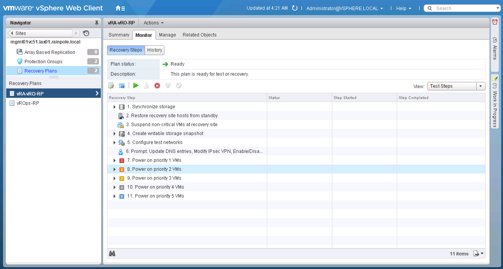

2.  On the **Confirmation options** page of the **Recovery** wizard, configure the following settings and click **Next**.

| Confirmation Option                                                                                                                          | Value             |
|----------------------------------------------------------------------------------------------------------------------------------------------|-------------------|
| I understand that this process will permanently alter the virtual machines and infrastructure of both the protected and recovery datacenters | Selected          |
| Recovery type                                                                                                                                | Planned Migration |

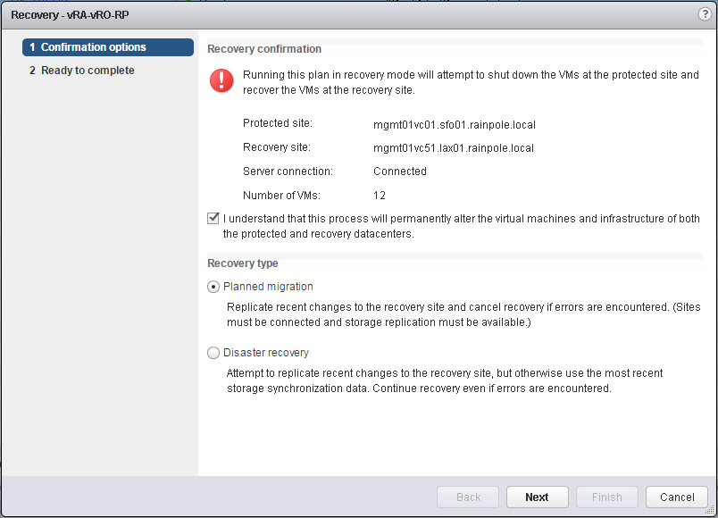

1.  On the **Ready to complete** page, click **Finish** to initiate vRealize Automation and vRealize Orchestrator failover.

    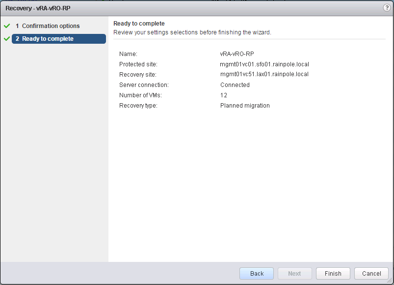

2.  When Site Recovery Manager displays the prompt to configure DNS, IPsec VPN and the OSPF flag, perform the required configuration and click **Dismiss**.

Site Recovery Manager proceeds with running the recovery plan.

Site Recovery Manager displays this message when it reaches the step from the recovery plan to power on the first appliances of vRealize Automation.

For information about performing the required configuration steps during failover, see the following documentation.

-   *Update the DNS Entries for vRealize Automation*

-   *Modify IPsec VPN Settings for vRealize Automation*

-   *Swap OSPF Redistribution Flag for vRealize Automation*

Update the DNS Entries for vRealize Automation

While you fail over vRealize Automation and vRealize Orchestrator to Region B, modify the DNS A records the public FQDNs of vRealize Automation to map to IP addresses in Region B.

Procedure

1.  Log in to DNS server dc01lax.lax01.rainpole.local that resides in the lax01.rainpole.local domain.

<!-- -->

1.  Open the Windows **Start** menu, enter **dns** in the **Search** text box and press **Enter**. The **DNS Manager** dialog box appears.

    

2.  In the **DNS Manager** dialog box, under **Forward Lookup Zones**, select the **rainpole.local** domain.

    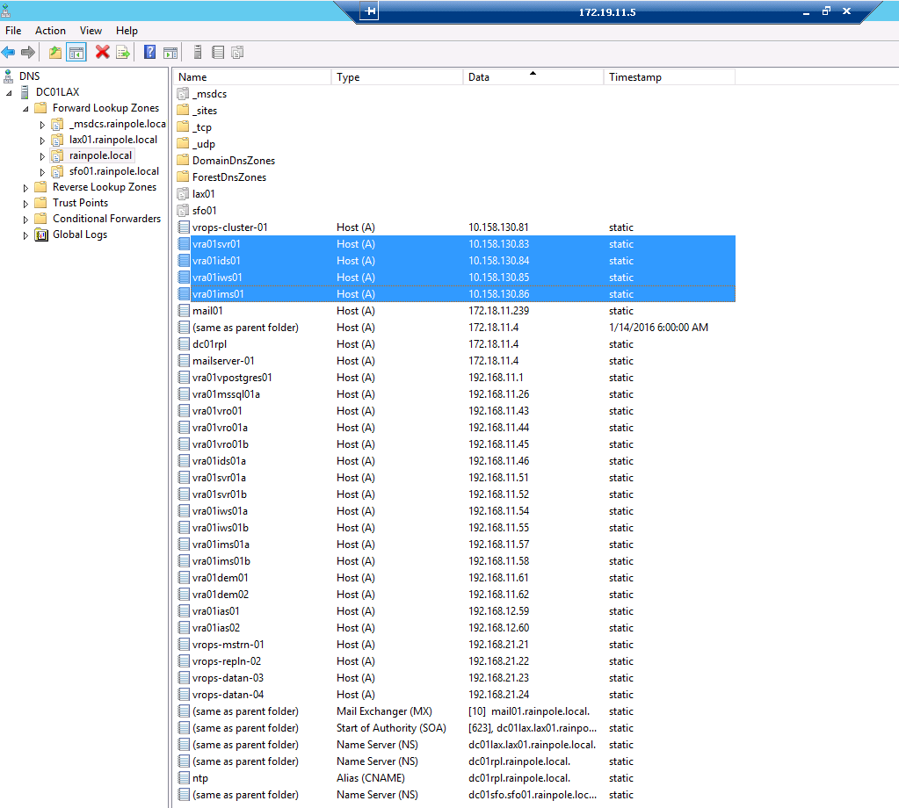

3.  Double-click each of the following records to edit it, update it with the following values and click **OK**.

| DNS Record | Public FQDN               | New IP Address (Region B) | **Update associated pointer (PTR) record** |
|------------|---------------------------|---------------------------|--------------------------------------------|
| vra01svr01 | vra01svr01.rainpole.local | 10.158.150.53             | Selected                                   |
| vra01ids01 | vra01ids01.rainpole.local | 10.158.150.52             | Selected                                   |
| vra01iws01 | vra01iws01.rainpole.local | 10.158.150.54             | Selected                                   |
| vra01ims01 | vra01ims01.rainpole.local | 10.158.150.55             | Selected                                   |

> 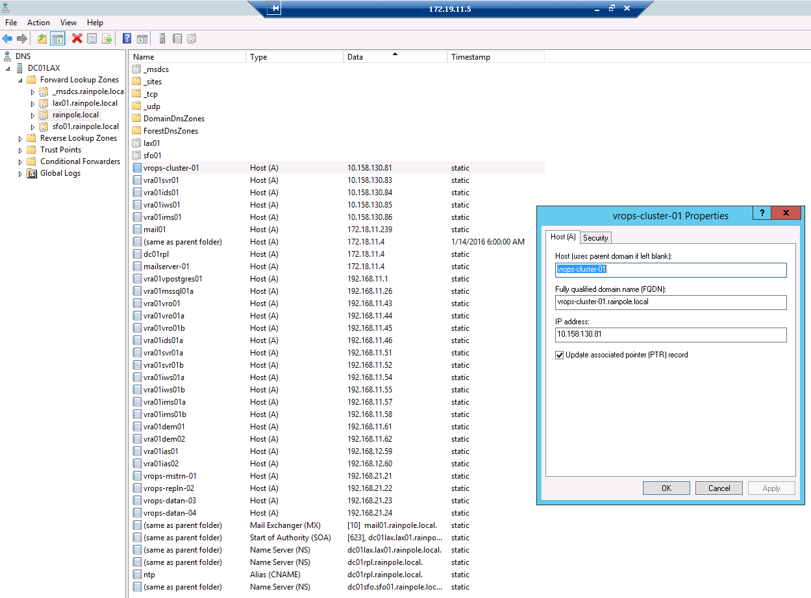

Modify IPsec VPN Settings for vRealize Automation

To ensure that the services of vRealize Operations are accessible, during the failover enable dynamic routing on the NSX Edge for vRealize Automation and vRealize Orchestrator. Verify that the NSX Edge is exchanging routing information with the peer NSX Edge instances and with the MgmtLAX01-Edge NSX Edge that handles site-to-site VPN.

You perform the changes in Region A in the case of planned migration and in the case of disaster recovery when you rebuild Region A.

Procedure

1.  Log in to the Management vCenter Server in Region A by using the vSphere Web Client.

    1.  In a browser, go to **https://mgmt01vc01.sfo01.rainpole.local/vsphere-client**.

    2.  Use the following credentials to log in

| Setting       | Value                       |
|---------------|-----------------------------|
| **User name** | administrator@vsphere.local |
| **Password**  | vsphere\_admin\_password    |

1.  From the **Home** menu of the vSphere Web Client, select **Networking & Security**.

    

2.  Click **NSX Edges** and select **172.16.11.65** from the **NSX Manager** drop-down menu at the top of the **NSX Edges** page.

    

3.  Double-click the **MgmtSFO01-Edge** NSX Edge to open the page for its configuration.

    

4.  On the **Manage** tab, click **VPN** and click **IPsec VPN**.

    

5.  Select **SFO2LAX** VPN entry in the list, click the **Edit** button.

    

6.  In **Edit IPsec VPN** dialog box, cut the vRealize Automation IP subnet **192.168.11.0/24** in the **Local Subnets** text box.

    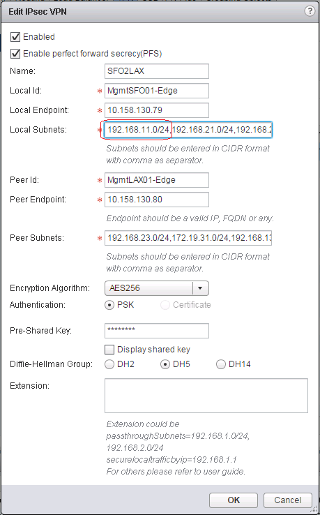

7.  Paste the **192.168.11.0/24** subnet into the **Peer Subnets** text box and click **OK**.

    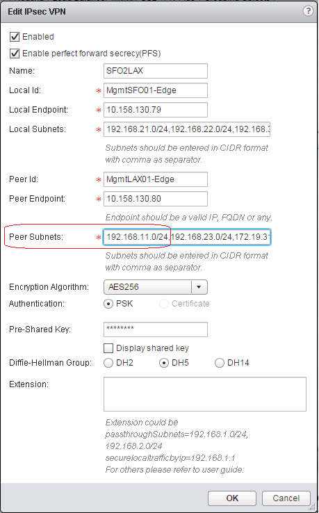

8.  On the **VPN** page, click **Publish Changes** next to **IPsec VPN**.

    

9.  Configure IPsec VPN in Region B.

    1.  In a Web browser, log in to **https://mgmt01vc01.lax01.rainpole.local/vsphere-client**.

    2.  From the **Home** menu of the vSphere Web Client, select **Networking & Security** and select **172.17.11.65** from the **NSX Manager** drop-down menu at the top of the **NSX Edges** page to switch to the NSX Manager for the management cluster in Region B.

    3.  Repeat Step 4 to Step 9 for the NSX Edge **MgmtLAX01-Edge** to open the IPsec VPN configuration and move **192.168.11.0/24** from **Peer Subnets** to **Local Subnets**.

Swap OSPF Redistribution Flag for vRealize Automation

Enable route redistribution on the NSX Edge of the application virtual network for vRealize Automation and vRealize Orchestrator in Region B so that the edge starts sharing information about its connected networks with its peers and the site-to-site VPN NSX Edge MgmtLAX01-Edge. Disable route redistribution on the NSX Edge for vRealize Automation and vRealize Orchestrator in Region A.

You perform the changes in Region A in the case of planned migration and in the case of disaster recovery when you rebuild Region A.

Procedure

1.  Log in to the Management vCenter Server in Region A by using the vSphere Web Client.

    1.  In a browser, go to **https://mgmt01vc01.sfo01.rainpole.local/vsphere-client**.

    2.  Use the following credentials to log in.

| Setting       | Value                       |
|---------------|-----------------------------|
| **User name** | administrator@vsphere.local |
| **Password**  | vsphere\_admin\_password    |

1.  From the **Home** menu of the vSphere Web Client, select **Networking & Security**.

> 

1.  Click **NSX Edges** and select **172.16.11.65** from the **NSX Manager** drop-down menu at the top of the **NSX Edges** page.

    

2.  Double-click the **vRA01-Edge** NSX Edge to open the page for its configuration.

    

3.  On the **Manage** tab of the **vRA01-Edge** page, click **Routing** and click **Route Redistribution**.

    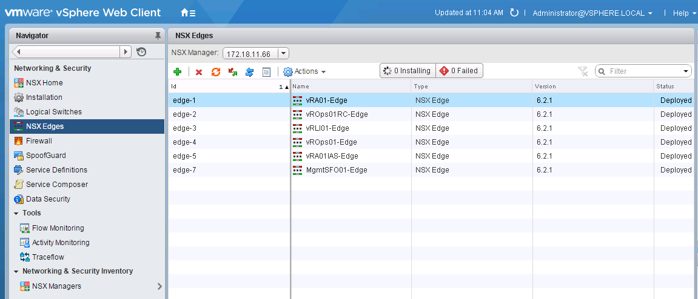

4.  Click the **Edit** button on the right hand side to open **Change redistribution settings** dialog box.

    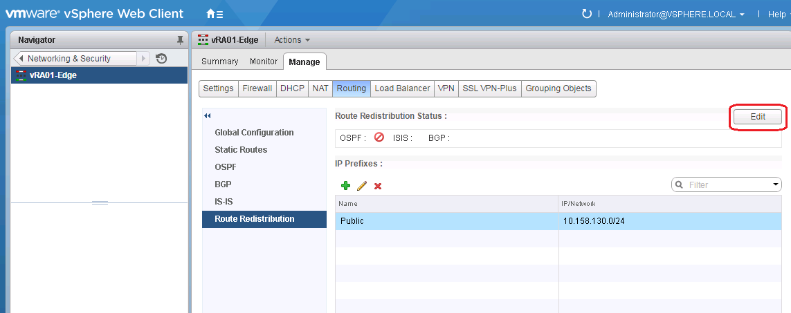

5.  In **Change redistribution settings** dialog, deselect **OSPF** to disable the redistribution flag and click **OK**.

    

6.  On the **Routing** page, click **Publish Changes** next **Route Redistribution**.

    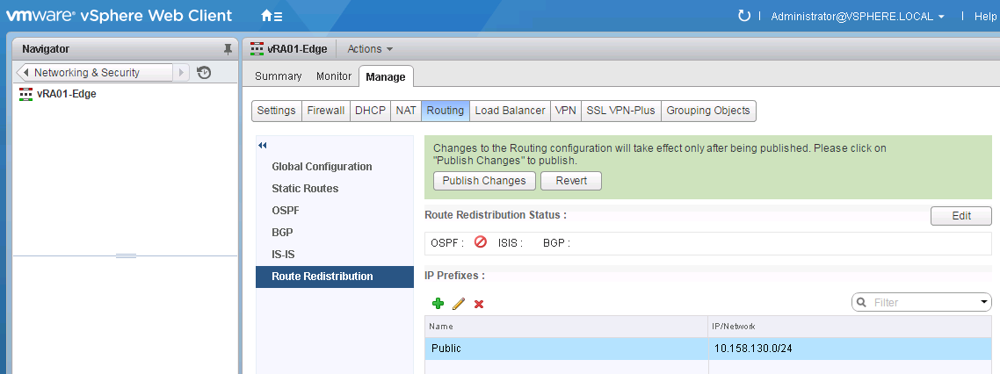

7.  Configure route redistribution in Region B.

    1.  In a Web browser, log in to https://mgmt01vc01.lax01.rainpole.local/vsphere-client.

    2.  From the **Home** menu of the vSphere Web Client, select **Networking & Security** and select **172.17.11.65** from the **NSX Manager** drop-down menu at the top of the **NSX Edges** page to switch to the NSX Manager for the management cluster in Region B.

    3.  Repeat Step 4 to Step 8 for the NSX Edge **vRA01-Edge** to open the **Change redistribution settings** dialog box and select the **OSPF** option to enable route redistribution in Region B.

    <!-- -->

    1.  Post-Failover Configuration of the Management Applications
        ----------------------------------------------------------

After failover of the vRealize Automation, vRealize Orchestrator, and vRealize Operations Manager management applications, you must perform certain tasks to ensure that applications perform as expected.

-   Recreate Anti-Affinity Rule for vRealize Operations Manager

-   Recreate Anti-Affinity Rules for vRealize Automation and vRealize Orchestrator

-   Re-Enable vRealize Automation Load Balancer Health Monitoring

-   Re-Enable vRealize Orchestrator Health Monitor and Verify Health Status

-   Enable the vRealize Log Insight Integration with vRealize Operations Manager for Region B

-   Update vRealize Log Insight Logging Address

    1.  ### Recreate Anti-Affinity Rule for vRealize Operations Manager

VM anti-affinity rules are not retained during a Site Recovery Manager assisted recovery. After failover of vRealize Operations Manager, you must recreate the anti-affinity rule for the analytics virtual machines on Region B.

1.  Log in to the Management vCenter Server by using the vSphere Web Client.

    1.  In a browser, go to **https://mgmt01vc51.lax01.rainpole.local/vsphere-client**.

    2.  Use the following credentials to log in.

| Setting       | Value                       |
|---------------|-----------------------------|
| **User name** | administrator@vsphere.local |
| **Password**  | vsphere\_admin\_password    |

1.  In the **Navigator**, click **Hosts and Clusters**.

2.  Under **mgmt01vc51.lax01.rainpole.local**, click the **LAX01Mgmt01** cluster where the vRealize Operations Manager virtual machines are running.

3.  Click the **Manage** tab, click **Settings**, and under **Configuration** click **VM/Host Rules**.

    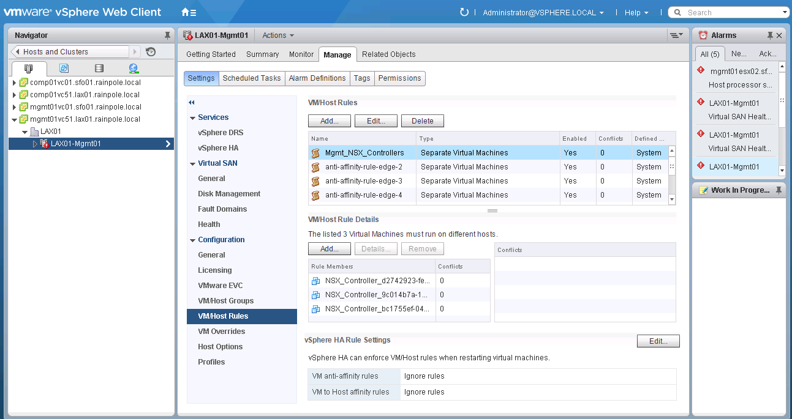

4.  Create a virtual machine anti-affinity rule for vRealize Operations Manager.

    1.  Under **VM/Host Rules**, click **Add**.

    2.  In the **LAX01Mgmt01 - Create VM/Host Rule** dialog box, enter the following settings, and click **Add** to select member VMs for this anti-affinity rule.

| Setting         | Value                     |
|-----------------|---------------------------|
| **Name**        | vrops                     |
| **Enable Rule** | Selected                  |
| **Type**        | Separate Virtual Machines |

1.  In the **Add Rule Member** dialog box, select the **vrops-mstrn-01, vrops-repln-02**, **vrops-datan-03** and **vrops-datan-04** virtual machines, click **OK**, and click **OK**.

    1.  ### Recreate Anti-Affinity Rules for vRealize Automation and vRealize Orchestrator

VM anti-affinity rules are not retained during a Site Recovery Manager assisted recovery. After failover of the vRealize Automation and vRealize Orchestrator, you must recreate the anti-affinity rules for their virtual machines on Region B.

1.  Log in to the Management vCenter Server by using the vSphere Web Client.

    1.  In a browser, go to **https://mgmt01vc51.lax01.rainpole.local/vsphere-client**.

    2.  Use the following credentials to log in.

| Setting       | Value                       |
|---------------|-----------------------------|
| **User name** | administrator@vsphere.local |
| **Password**  | vsphere\_admin\_password    |

1.  In the **Navigator**, click **Hosts and Clusters**.

2.  Under **mgmt01vc51.lax01.rainpole.local**, click the **LAX01Mgmt01** cluster where the vRealize Automation and vRealize Orchestrator virtual machines are running.

3.  Click the **Manage** tab, click **Settings**, and under **Configuration** click **VM/Host Rules**.

    

4.  Create a virtual machine anti-affinity rule for vRealize Automation.

    1.  Under **VM/Host Rules**, click **Add**.

    2.  In the **LAX01Mgmt01 - Create VM/Host Rule** dialog box, enter the following settings, and click **Add** to select member VMs for this anti-affinity rule.

| Setting         | Value                     |
|-----------------|---------------------------|
| **Name**        | vra-svr                   |
| **Enable Rule** | Selected                  |
| **Type**        | Separate Virtual Machines |

1.  In the **Add Rule Member** dialog box, select the **vra01svr01a.rainpole.local** and **vra01svr01b.rainpole.local** virtual machines, click **OK**, and click **OK**.

    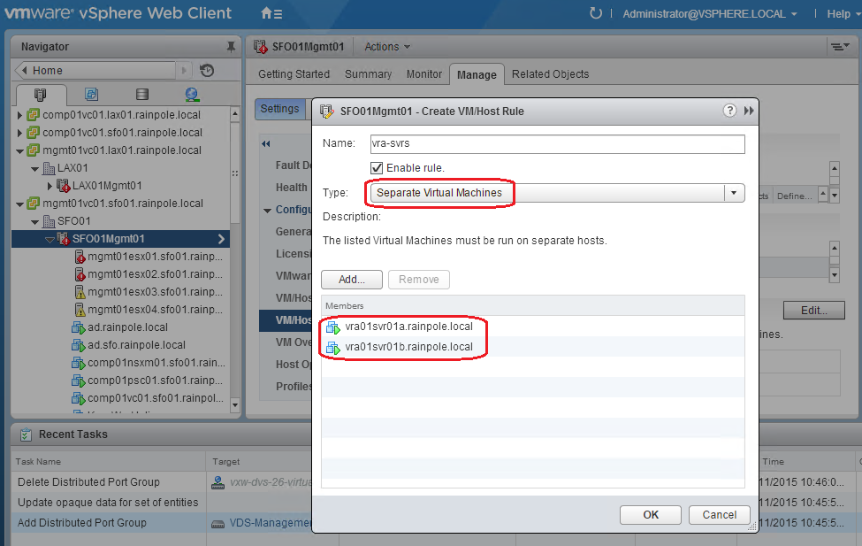

<!-- -->

1.  Repeat the previous step to add the remaining anti-affinity rules for vRealize Automation and vRealize Orchestrator according to the following table.

| Name    | Enable Rule | Type                      | Members                                                |
|---------|-------------|---------------------------|--------------------------------------------------------|
| vra-iws | Selected    | Separate Virtual Machines | vra01iws01a.rainpole.local, vra01iws01b.rainpole.local |
| vra-ims | Selected    | Separate Virtual Machines | vra01ims01a.rainpole.local, vra01ims01b.rainpole.local |
| vra-dem | Selected    | Separate Virtual Machines | vra01dem01.rainpole.local, vra01dem02.rainpole.local   |
| vra-ias | Selected    | Separate Virtual Machines | vra01ias01.rainpole.local, vra01ias02.rainpole.local   |
| vra-vro | Selected    | Separate Virtual Machines | vra01vro01a.rainpole.local, vra01vro01b.rainpole.local |

### Re-Enable vRealize Automation Load Balancer Health Monitoring

After successful failover you must re-enable the health checks for the load balancer that you previously disabled to proceed with the configuration of the vRealize Automation appliance.

1.  Log in to the Management vCenter Server by using the vSphere Web Client.

    1.  In a browser, go to **https://mgmt01vc51.lax01.rainpole.local/vsphere-client**.

    2.  Use the following credentials to log in.

| Setting       | Value                       |
|---------------|-----------------------------|
| **User name** | administrator@vsphere.local |
| **Password**  | vsphere\_admin\_password    |

1.  In the **Navigator**, click **Networking & Security**, and click **NSX Edges**.

2.  From the **NSX Manager** drop-down menu, select **172.17.11.65** and double-click **vRA01-Edge** to manage the network settings.

    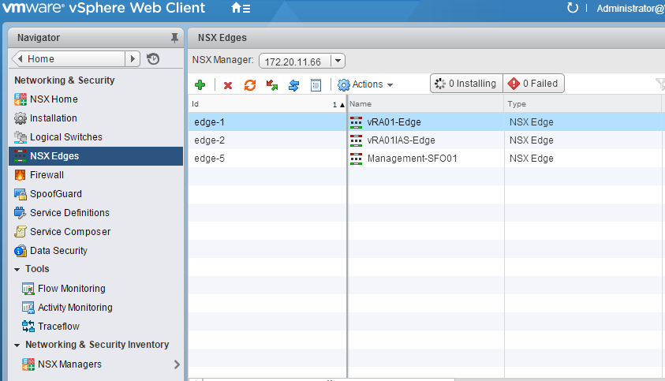

3.  Click the **Manage** tab, click **Load Balancer**, and click **Pools**.

4.  Edit the vRealize Automation server pool.

    1.  Select the **vra-svr-443** server pool, and click the **Edit** icon.

    2.  In the **Edit Pool** dialog box, select **LEASTCONN** from the **Algorithm** drop-down menu.

    3.  Select **vra-svr-443-monitor** from the **Monitors** drop-down menu and click **OK**.

        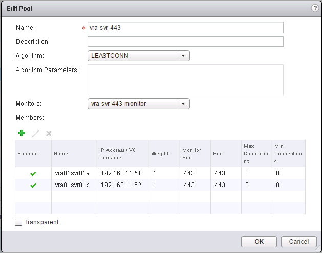

5.  Repeat the step to edit the remaining pools according to the following table.

| Pool Name          | **Algorithm** | Monitors                   | Member Name To Edit | IP address    | Enable Member check box |
|--------------------|---------------|----------------------------|---------------------|---------------|-------------------------|
| vra-svr-443        | LEASTCONN     | vra-svr-443-monitor        | vra01svr01b         | 192.168.11.52 | Selected                |
| vra-vpostgres-5432 | LEASTCONN     | vra-vpostgres-5432-monitor | vra01svr01b         | 192.168.11.52 | Deselected              |
| vra-iaas-web-443   | LEASTCONN     | vra-iaas-web-443-monitor   | vra01iws01b         | 192.168.11.55 | Selected                |
| vra-iaas-mgr-443   | LEASTCONN     | vra-iaas-mgr-443-monitor   | vra01ims01b         | 192.168.11.58 | Deselected              |
| vra-identity-7444  | LEASTCONN     | vra-identity-7444-monitor  | vra01ids01a         | 192.168.11.46 | Selected                |

### Re-Enable vRealize Orchestrator Health Monitor and Verify Health Status

When you power on the vRealize Automation VMs, the vRealize Automation health monitor reports unhealthy status because services are still initializing. The unhealthy status causes the load balancer to reject all requests to the vRealize Automation VIP causing the vRealize Automation service initialization to fail. To workaround this issue, use basic\_tcp or basic\_https monitors for the health check before you power on the vRealize Automation VMs. After vRealize Automation is fully powered on and services are up, change health monitors to vRealize Automation specific health monitors.

1.  Log in to the Management vCenter Server by using the vSphere Web Client.

    1.  In a browser, go to **https://mgmt01vc51.lax01.rainpole.local/vsphere-client**.

    2.  Use the following credentials to log in.

| Setting       | Value                       |
|---------------|-----------------------------|
| **User name** | administrator@vsphere.local |
| **Password**  | vsphere\_admin\_password    |

1.  In the **Navigator**, click **Networking & Security**, and click **NSX Edges**.

2.  From the **NSX Manager** drop-down menu, select **172.17.11.65** and double-click **vRA01-Edge** to manage the network settings.

    

3.  Click the **Manage** tab, click **Load Balancer**, and click **Pools**.

4.  Edit the vRealize Orchestrator pool.

    1.  Select the **vra-vro-8281** server pool, and click the **Edit** icon.

    2.  In the **Edit Pool** dialog box, select **LEASTCONN** from the **Algorithm** drop-down menu.

    3.  Select **vra-vro-8281-monitor** from the **Monitors** drop-down menu, and click **OK**.

        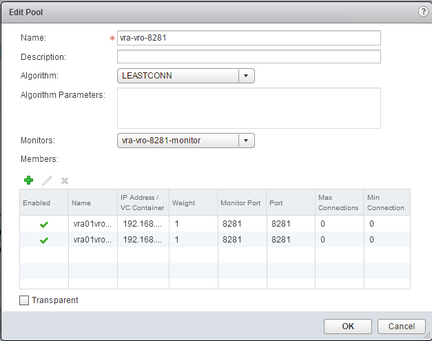

5.  Verify that the members of the vra-vro-881 pool are running.

    1.  Click **Show Pool Statistics**.

    2.  In the **Pool and Member Status** dialog box, select the **vra-vro-8281** pool.

    3.  Under **Member Status and Statistics**, verify that the Status column shows **UP** for both of the members of the pool.

> 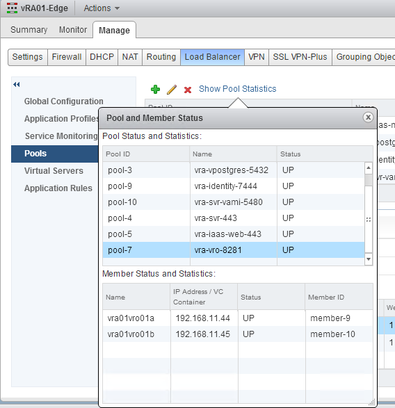

### Enable the vRealize Log Insight Integration with vRealize Operations Manager for Region B

Connect vRealize Log Insight in Region B with vRealize Operations Manager to launch vRealize Log Insight from within vRealize Operations Manager and to send alerts to vRealize Operations Manager.

**Prerequisites**

-   Verify that the vRealize Log Insight management pack is installed in vRealize Operations Manager

-   Verify that you have connected vRealize Operations Manager and vRealize Log Insight to the mgmt01vc51.lax01.rainpole.local and comp01vc51.lax01.rainpole.local vCenter Server instances.

**Procedure**

1.  In a Web browser, open the vRealize Log Insight UI.

    1.  Go to **https://vrli-cluster-51.lax01.rainpole.local/admin/auth**.

    2.  Use the **admin** user name and **vrli\_admin\_password** password to log in.

<!-- -->

1.  In the vRealize Log Insight UI, click the configuration drop-down menu icon  and select **Administration**.

2.  Under **Integration**, click **vRealize Operations**.

3.  On the **vRealize Operations Manager** pane, configure the integration settings for vRealize Operations Manager.

    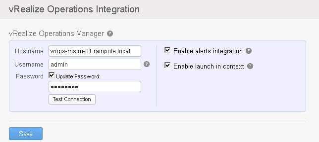

    1.  Enter the host name and the user credentials for vRealize Operations Manager.

| vRealize Operations Manager Option | Value                         |
|------------------------------------|-------------------------------|
| **Hostname**                       | vrops-mstrn-01.rainpole.local |
| **Username**                       | admin                         |
| **Password**                       | vrops\_admin\_password        |

1.  Click **Test Connection**.

2.  Select the **Enable alerts integration** check box.

3.  Select the **Enable launch in context** check box.

4.  Click **Save**.

A progress dialog box appears.

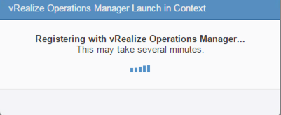

### Update vRealize Log Insight Logging Address

After you fail over the management applications in the SDDC to Region B, update the address configured on the management applications for vRealize Log Insight. All management applications are still configured to send logs to the vRealize Log Insight instance in Region A.

You update the DNS entry for vrli-cluster-01.sfo01.rainpole.local to point to the IP address, 192.168.32.10, of vrli-cluster-51.lax01.rainpole.local in Region B.

Procedure

1.  Log in to DNS server dc01lax.lax01.rainpole.local that resides in the lax01.rainpole.local domain.

<!-- -->

1.  Open the Windows **Start** menu, enter **dns** in the **Search** text box and press **Enter**. The **DNS Manager** dialog box appears.

    

2.  In the **DNS Manager** dialog box, under **Forward Lookup Zones**, select the **sfo01.rainpole.local** domain and locate the **vrli-cluster-01** record on the right.

    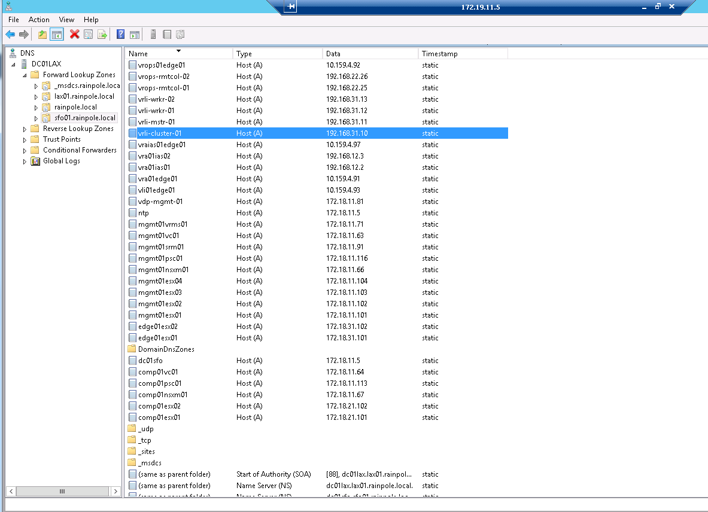

3.  Double-click the **vrli-cluster-01** record, change the IP address of the record from 192.168.31.10 to 192.168.32.10 and click **OK**.

| vrli-cluster-01 Properties                  |                                |
|---------------------------------------------|--------------------------------|
| **Fully qualified domain name (FQDN)**      | vrli-cluster-01.rainpole.local |
| **IP Address**                              | 192.168.32.10                  |
| **Update associated pointer (PTR) record ** | Selected                       |

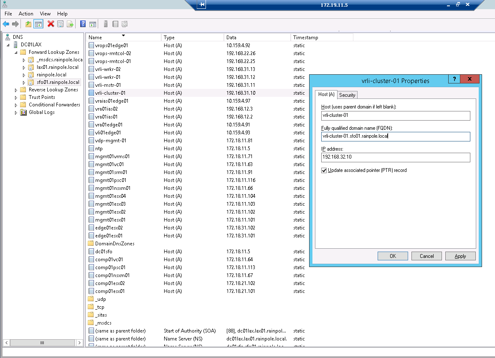

SDDC Failover Validation
------------------------

After you fail over the management applications in the SDDC, verify that their work is not interrupted.

-   Failover Verification of vRealize Operations Manager Services

-   Failover Verification of vRealize Operations Manager UI

-   vRealize Automation Failover Verification

-   vRealize Log Insight Failover Verification

    1.  ### Failover Verification of vRealize Operations Manager Services

After vRealize Operations Manager is failed over to Region B, verify that the vRealize Operations Manager services are running.

Procedure

1.  Verify that the services on the master and replica VMs are running.

    1.  Open an SSH connection to vrops-mstrn-01.rainpole.local and vrops-repln-02.rainpole.local with the **root** user name and the **vrops\_root\_password** password.

    2.  Run the following command.

        service vmware-vcops status

    3.  Verify that all of the following services are running.

        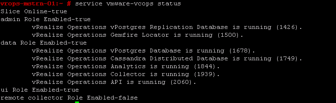

<!-- -->

1.  Verify that the services on the two data nodes of vRealize Operations Manager.

    1.  Open an SSH connection to vrops-datan-03.rainpole.local and vrops-datan-04.rainpole.local with the **root** user name and **vrops\_root\_password** password

    2.  Run the following command.

        service vmware-vcops status

    3.  Verify that all of the following services are running.

        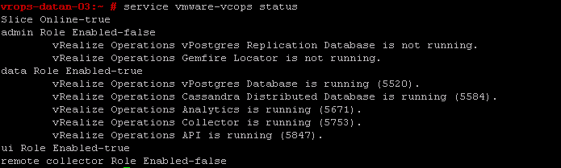

        1.  ### Failover Verification of vRealize Operations Manager UI

After vRealize Operations Manager is failed over to Region B, ensure that vRealize Operations Manager UI has been correctly recovered.

In case of disaster recovery, the remote collectors in Region A, vrops-rmtcol-01.sfo01.rainpole.local and vrops-rmtcol-02.sfo01.rainpole.local, are down because the whole region is down.

Procedure

1.  Verify that you can log into the vRealize Operations Manager UI:

    1.  In a Web browser, go to **https://vrops-cluster-01.rainpole.local**.

    2.  Use the following credentials to log in.

| Setting       |     | Value                  |
|---------------|-----|------------------------|
| **User name** |     | admin                  |
| **Password**  |     | vrops\_admin\_password |

1.  Verify that the cluster is online, and that all data nodes are running and are joined to the cluster.

    1.  In the left pane of vRealize Operations Manager, click **Administration**, and click **Cluster Management**.

    2.  On the **Cluster Management** page, verify that the **Cluster state** is **Online** and the analytics nodes under **Nodes in the vRealize Operations Manager Cluster** are in **Running** state.

        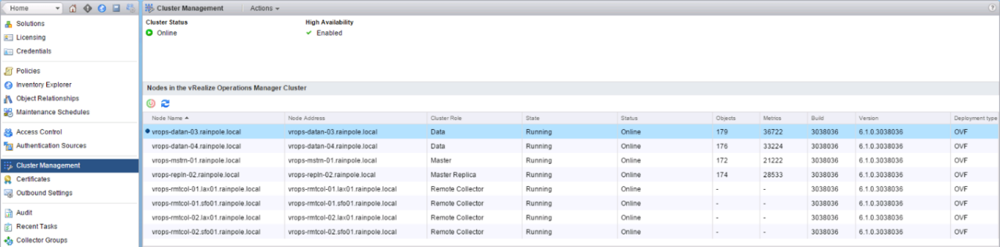

2.  Verify that the adapters of the installed solutions are collecting data.

    1.  In the left pane of vRealize Operations Manager, click **Administration**, and click **Solutions**.

    2.  On the **Solutions** page, select a solution and verify that the **Collection State** of its adapters is **Collecting** and that the **Collection Status** is **Data Receiving**.

        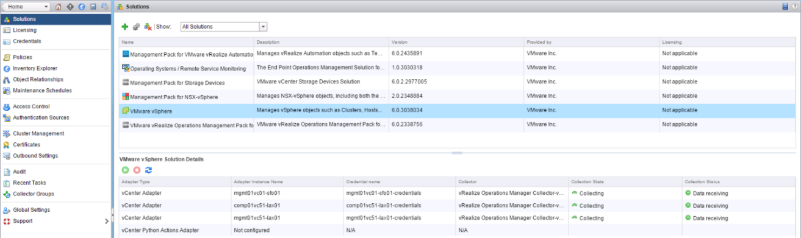

3.  Verify that the authentication sources are valid and are able to synchronize data.

    1.  In the left pane of vRealize Operations Manager, click **Administration**, and click **Authentication Sources**.

    2.  Select the AD entry, click **Synchronize Users** and click **Yes** in the confirmation dialog box.

    3.  Verify that the synchronization is completed without errors.

        

> 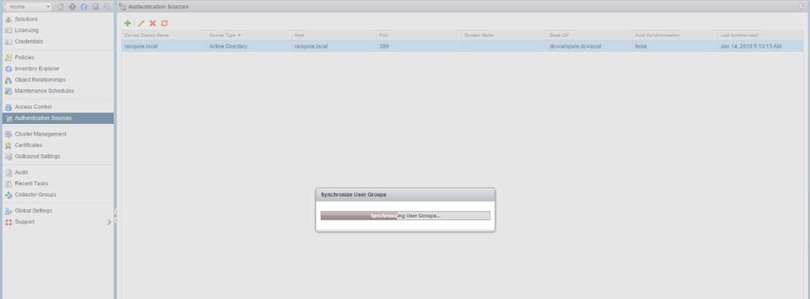

1.  Verify that the status of vRealize Operations Manager on the Self-Monitoring dashboard is healthy.

    1.  In the left pane of vRealize Operations Manager, click **Environment, and under vRealize Operations Clusters**, select the object for vRealize Operations Manager.

    2.  In the **Summary** tab, make sure that the **Health**, **Risk**, and **Efficiency** badges are green.

        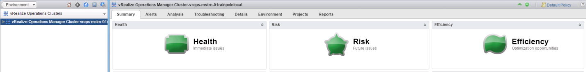

    3.  If the state of a badge is not green, click the **Alerts** tab to identify them.

2.  For custom dashboards, verify that the dashboards are displaying data in the **Graphs** and **Values** views properly.

    1.  ### vRealize Automation Failover Verification

Verify that vRealize Automation is up and functions flawlessly after a full vRealize Automation disaster recovery failover. See *Verifying vRealize Automation Operation after Restore or Disaster Recovery Failover* in the *Backup and Restore* document.

### vRealize Log Insight Failover Verification

Verify that all the log events from vRealize Operations Manager and vRealize Automation applications are forwarded to the vRealize Log Insight in Region B.

Before you perform disaster recovery, vRealize Operations Manager and vRealize Automation and vRealize Orchestrator send logs to the vRealize Log Insight instance in Region A. After disaster recovery, you update the DNS record for vRealize Log Insight FQDN in Region A vrli-cluster-01.sfo01.rainpole.local to the IP address 192.168.32.10, of vRealize Log Insight in Region B. To continue monitoring the logs of the failed over management applications, make sure that vRealize Log Insight is connected to the agents on these applications and receives events from them.

Procedure

1.  In a Web browser, open the vRealize Log Insight UI.

    1.  Go to **https://vrli-cluster-51.lax01.rainpole.local**.

    2.  Use the **admin** user name and **vrli\_admin\_password** password to log in.

<!-- -->

1.  Verify that all failed over components are showing up in the UI and Log Insight receiving log events

    1.  Click the configuration drop-down menu icon  and select **Administration**.

        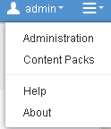

    2.  Click **Agents** on the left and verify that the analytics nodes of vRealize Operations Manager and the primary vRealize Automation components are available on the right pane.

| Component                                     | Host Name                     | IP Address    |
|-----------------------------------------------|-------------------------------|---------------|
| vRealize Operations Manager                   |
| Master Node                                   | vrops-mstrn-01.rainpole.local | 192.168.21.21 |
| Master Replicate Node                         | vrops-repln-02.rainpole.local | 192.168.21.22 |
| Data Node                                     | vrops-datan-03.rainpole.local | 192.168.21.23 |
| Date Node                                     | vrops-datan-04.rainpole.local | 192.168.21.24 |
| vRealize Automation and vRealize Orchestrator |
| vRealize Automation Identity Appliance        | vra01ids01a.rainpole.local    | 192.168.11.46 |
| vRealize Appliance                            | vra01svr01a.rainpole.local    | 192.168.11.51 |
| vRealize Appliance                            | vra01svr01b.rainpole.local    | 192.168.11.52 |
| IaaS Web Server                               | vra01iws01a.rainpole.local    | 192.168.11.54 |
| IaaS Web Server                               | vra01iws01b.rainpole.local    | 192.168.11.55 |
| IaaS Manager Service and DEM Orchestrator     | vra01ims01a.rainpole.local    | 192.168.11.57 |
| IaaS Manager Service and DEM Orchestrator     | vra01ims01b.rainpole.local    | 192.168.11.58 |
| IaaS DEM Worker                               | vra01dem01.rainpole.local     | 192.168.11.59 |
| IaaS DEM Worker                               | vra01dem02.rainpole.local     | 192.168.11.60 |
| Microsoft SQL Server                          | vra01mssql01.rainpole.local   | 192.168.11.27 |
| vRealize Orchestrator                         | vra01vro01a.rainpole.local    | 192.168.11.44 |
| vRealize Orchestrator                         | vra01vro01b.rainpole.local    | 192.168.11.45 |

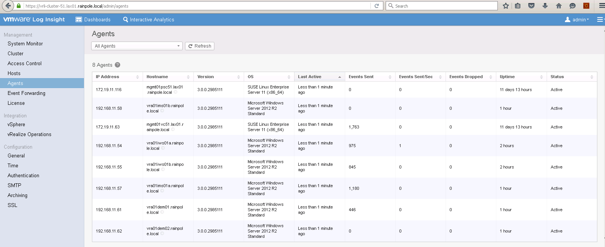

1.  Click **Hosts** on the left and verify that all individual components of vRealize Operations Manager and of vRealize Automation and vRealize Orchestrator have been sending events very recently.

    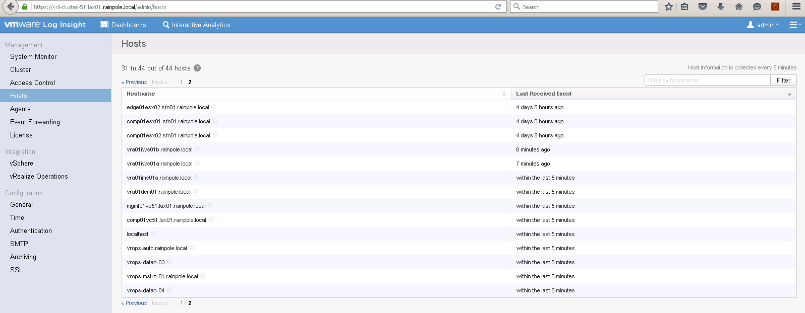
